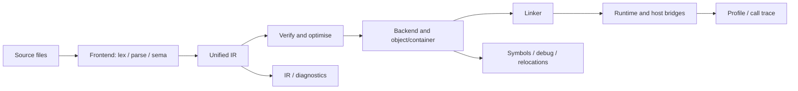
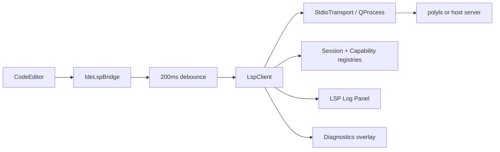
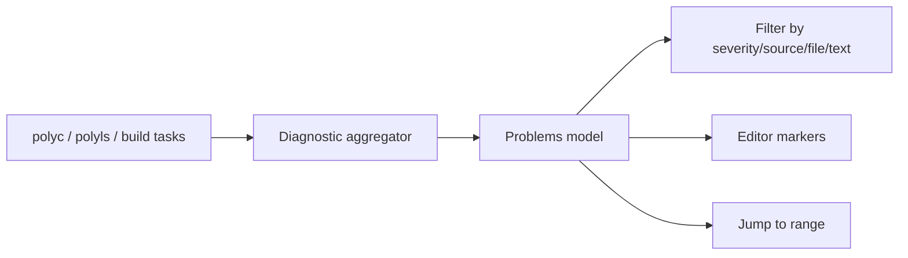
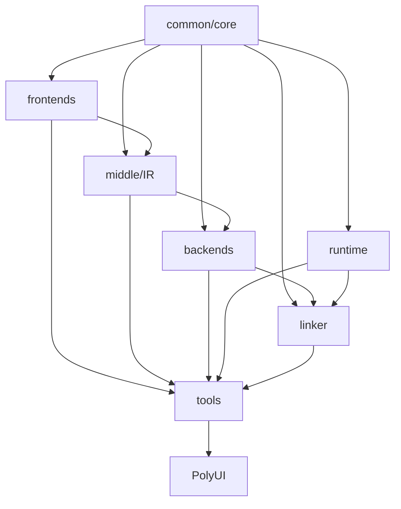

# PolyglotCompiler 完整双语教材 / The Complete Bilingual PolyglotCompiler Textbook

> **适用版本 / Target version**：PolyglotCompiler 1.47.4<br>
> **教材版本 / Textbook edition**：2.1.1<br>
> **源码核验 / Source audit**：2026-07-17<br>
> **覆盖范围 / Coverage**：`docs/tutorial/`、`docs/specs/`、`docs/api/`、43 个原课程样例、9 组教材配套示例、当前源码和测试。<br>
> **编辑原则 / Editorial rule**：这是一部融合教材，不是原文档的机械拼接；原 Tutorial 负责操作路径，Spec 负责约束，API 负责实现接口，源码和测试负责判断当前事实。

This is an integrated textbook rather than a concatenation of source documents. Tutorials contribute workflows, specifications contribute contracts, APIs contribute implementation surfaces, and source plus tests determine current behaviour.

---

## 前言 / Preface

### 本书面向谁 / Audience

本书同时服务四类读者：第一次使用 PolyglotCompiler 的开发者、使用 Ploy 构建跨语言程序的工程师、使用 CLI/PolyUI 分析项目的用户，以及修改编译器、Runtime、IDE 或插件的贡献者。

The book serves first-time users, engineers building cross-language programs in Ploy, users analysing projects through the CLI or PolyUI, and contributors changing the compiler, runtime, IDE, or plugins.

### 双语排版 / Bilingual layout

每节先给中文解释，再给对应英文解释；代码、命令、表格和图只出现一次。API 名称、ABI 符号、诊断码与命令参数保持原始拼写，避免翻译破坏可搜索性。

Each section gives Chinese first and the matching English explanation second. Code, commands, tables, and diagrams appear once. API names, ABI symbols, diagnostic identifiers, and command-line options retain their original spelling.

### 实现状态标签 / Implementation-status labels

这些标签用于区分“设计目标”“已经接线的实现”和“经过测试的可用路径”。阅读任何功能说明时，应先看状态，再决定它能否用于实验、开发或发布。

These labels separate design intent, wired implementation, and tested usable paths. Read the status before deciding whether a feature belongs in an experiment, a development workflow, or a release.

| 标签 / Label | 含义 / Meaning |
|---|---|
| **[完整 / Complete]** | 源码、测试和可执行路径共同证明 / source, tests, and executable path agree |
| **[分层 / Layered]** | 语法或 API 已实现，但某些 Runtime/Backend 路径依赖适配层 / syntax or API exists while some runtime/backend paths need adapters |
| **[实验 / Experimental]** | 可使用但兼容性或覆盖仍可能变化 / usable with evolving compatibility or coverage |
| **[规划 / Planned]** | Spec 或路线图中存在，但不能当作当前实现 / documented direction, not current implementation |

### 三条阅读路线 / Three reading paths

本书既是入门教程也是实现手册，因此不要求所有读者线性读完。下面三条路线按实际工作角色裁剪章节，但遇到边界问题时仍应回到相关 Spec/API 章节。

The book is both a tutorial and an implementation manual, so readers need not proceed strictly front to back. These paths select chapters by role while preserving cross-references to the relevant contracts and APIs.

- **应用开发者 / Application developer**：1–20 → 21–31 → 附录 A–F。
- **编译器贡献者 / Compiler contributor**：1–5 → 32–43 → 附录 G–J。
- **IDE/工具贡献者 / IDE and tooling contributor**：1–5 → 21–31 → 38–43。

### 贯穿全书的项目 / Running project

全书使用一个“多语言数据分析服务”作为连续案例：Ploy 组织管线，C++ 读取输入，Rust 清洗数据，Python 计算模型，Java/.NET 提供业务规则，JavaScript 展示结果。每一部分只增加一个新能力，最终形成可构建、可测试、可分析的项目。

The running project is a polyglot analytics service: Ploy orchestrates the pipeline, C++ reads input, Rust cleans data, Python evaluates a model, Java/.NET provide business rules, and JavaScript presents results. Each part adds one capability until the project is buildable, testable, and analysable.

### 配套示例与结果 / Companion examples and results

教材正文负责解释概念、顺序和实现细节，同目录的 [`POLYGLOT_COMPILER_COMPLETE_TUTORIAL_EXAMPLES/`](POLYGLOT_COMPILER_COMPLETE_TUTORIAL_EXAMPLES/README.md) 则保存可复制源码、验证脚本与实测输出。示例使用 `RUNNABLE`、`FRONTEND`、`LAYERED`、`FIXTURE`、`BUILDABLE` 五种状态；运行 `bash docs/POLYGLOT_COMPILER_COMPLETE_TUTORIAL_EXAMPLES/run_verified.sh` 可复查当前构建。

The textbook explains concepts, sequence, and implementation details, while the adjacent [`POLYGLOT_COMPILER_COMPLETE_TUTORIAL_EXAMPLES/`](POLYGLOT_COMPILER_COMPLETE_TUTORIAL_EXAMPLES/README.md) directory stores copyable source, a verifier, and observed outputs. Its five statuses distinguish executable programs, frontend-only surfaces, layered boundaries, data fixtures, and independently buildable components.

正文中的输出分三类阅读：程序块给 stdout 与 exit code；CLI 给 diagnostics、stderr progress 或文件产物；C/C++ API declaration 本身没有 stdout，其“结果”是编译通过、返回值/状态改变、序列化文档或 contract test。标成“语义目标”的输出尚未被当前端到端路径证明，绝不能与“本机实测”混写。

Read outputs in three categories: programs have stdout and exit status; CLIs have diagnostics, progress, or file artifacts; C/C++ API declarations have no stdout by themselves, so their observable results are compilation, returned state, serialised documents, or contract tests. A semantic target is never presented as an observed end-to-end result.

---

## 总目录 / Master table of contents

### 第一部分：认识 PolyglotCompiler / Part I: Orientation

这一部分建立项目、构建流程和第一个可验证程序所需的共同背景，适合所有阅读路线先行完成。

This part establishes the shared project, build, and first-program context required by every reading path.

1. 为什么需要多语言编译器 / Why a polyglot compiler
2. 完整编译模型 / The compilation model
3. 环境准备与项目构建 / Prerequisites and build
4. 第一个 Ploy 程序 / First Ploy program
5. 第一个跨语言程序 / First cross-language program

### 第二部分：系统学习 Ploy / Part II: Ploy language

这一部分从词法、类型和控制流逐步进入模块、异步、属性与管线，使后续跨语言章节建立在完整的 Ploy 语义上。

This part develops Ploy from lexical rules and types through modules, async, attributes, and pipelines, providing the semantic foundation for cross-language work.

6. 词法结构与字面量 / Lexical structure and literals
7. 类型系统 / Type system
8. 变量、常量与函数 / Bindings, constants, and functions
9. 表达式与控制流 / Expressions and control flow
10. 结构、OPTION 与模式匹配 / Structs, OPTION, and pattern matching
11. 模块、包与配置 / Modules, packages, and configuration
12. 异常、异步与泛型 / Exceptions, async, and generics
13. 可见性、属性与文档 / Visibility, attributes, and documentation
14. PIPELINE 与完整 Ploy 项目 / Pipelines and the Ploy capstone

### 第三部分：跨语言编程 / Part III: Cross-language programming

这一部分集中解释语言边界：符号如何发现、值如何编组、ABI 如何验证，以及对象、错误和异步任务如何安全跨越 Runtime。

This part focuses on language boundaries: symbol discovery, value marshalling, ABI validation, and safe transport of objects, errors, and asynchronous work.

15. IMPORT、LINK 与 CALL
16. 类型映射与编组 / Type mapping and marshalling
17. ABI 与语言 Bridge / ABI and language bridges
18. 跨语言对象与生命周期 / Foreign objects and lifetime
19. 跨语言异常、异步与性能 / Errors, async, and performance
20. 完整多语言项目 / Complete polyglot project

### 第四部分：命令行工具链 / Part IV: Command-line toolchain

这一部分把编译、优化、汇编、链接、运行时检查和发布命令组织成可复现工作流，并同时记录当前 CLI 的真实限制。

This part turns compilation, optimisation, assembly, linking, runtime inspection, and release tooling into reproducible workflows while documenting current CLI limitations.

21. `polyc`
22. IR 与 `polyopt` / IR and optimisation
23. `polyasm`、`polyld` 与 Backend
24. `polyrt`
25. `polyver`、`polydoc`、`polybench` 与 `polytopo`
26. 跨目标编译与发布 / Cross-target compilation and release

### 第五部分：IDE 与开发体验 / Part V: IDE and developer experience

这一部分说明命令行产生的诊断、调用图和 profile 数据如何进入 LSP 与 PolyUI，以及编辑器状态和查看器如何管理不可信输入。

This part explains how diagnostics, call graphs, and profiles reach LSP and PolyUI, and how editor state and viewers handle untrusted data.

27. `polyls` 与 LSP
28. 编辑、补全与 Problems / Editing, completion, and Problems
29. Profiler 与 Call Analyzer
30. IDE Shell、设置与主题 / Shell, settings, and themes
31. 文件查看器 / File viewers

### 第六部分：编译器实现与 API / Part VI: Compiler implementation and APIs

这一部分面向贡献者，从源码依赖图进入 Core、Frontend、IR、Backend、Runtime 和 IDE 的正式接口与实现不变量。

This contributor-oriented part moves from source dependencies into the formal interfaces and implementation invariants of Core, Frontend, IR, Backend, Runtime, and IDE layers.

32. 源码架构、命名空间与依赖 / Architecture, namespaces, and dependencies
33. 核心类型、符号与诊断 API / Types, symbols, and diagnostics
34. Frontend API 与实现 / Frontend APIs and implementation
35. IR API 与优化实现 / IR APIs and optimisation
36. Backend、MachineIR 与 Debug API
37. Runtime 与互操作 API / Runtime and interop APIs
38. IDE API

### 第七部分：扩展、测试与维护 / Part VII: Extension, testing, and maintenance

最后一部分把新增功能变成可交付的纵向切片：定义扩展契约、接入构建与注册、建立测试证据，并按兼容性规则发布。

The final part turns new functionality into deliverable vertical slices through extension contracts, build and registration integration, test evidence, and compatibility-aware release practice.

39. Plugin 规范 / Plugin specification
40. Extension API
41. 新增语言、Pass、Backend 和 Bridge
42. 测试与质量门禁 / Testing and quality gates
43. 维护与发布 / Maintenance and release

### 附录 / Appendices

A. Ploy 语法与关键字 / Ploy grammar and keywords<br>
B. 类型、ABI 与编组表 / Type, ABI, and marshalling tables<br>
C. 诊断码目录 / Diagnostic catalogue<br>
D. CLI 参数速查 / CLI reference<br>
E. JSON Schema / Schemas<br>
F. 43 个样例课程图 / Sample curriculum<br>
G. 公开 API 索引 / Public API index<br>
H. 故障排查索引 / Troubleshooting index<br>
I. 中英文术语表 / Bilingual glossary<br>
J. 46 个源文档追溯矩阵 / Source traceability matrix

---


# 第一部分：认识 PolyglotCompiler / Part I: Orientation

## 1. 为什么需要多语言编译器 / Why a polyglot compiler

### 学习目标 / Goals

读完本章，你应能解释 PolyglotCompiler 与普通 FFI、RPC、嵌入解释器的区别，理解它能统一什么、不能替你解决什么，并能根据实现状态选择合适的功能。

After this chapter, you should be able to distinguish PolyglotCompiler from ordinary FFI, RPC, and embedded interpreters, explain what it unifies, and select features according to implementation status.

### 1.1 核心问题 / The core problem

真实系统经常同时使用多种语言：C++ 负责低延迟代码，Rust 负责内存安全组件，Python 负责数据科学，Java/.NET 负责业务服务，JavaScript 负责界面。传统方案让每一对语言单独维护胶水代码，导致类型、所有权、调用约定、错误和调试信息在边界处重复实现。

Real systems commonly combine C++, Rust, Python, Java, .NET, and JavaScript. Pairwise glue duplicates type conversion, ownership, calling conventions, error transport, and debugging at every boundary.

PolyglotCompiler 的目标是把这些边界提升为一个可分析的编译模型：

- Ploy 描述模块、符号、类型映射和调用关系；
- 各语言 Frontend 产生统一 IR；
- Middle 层执行验证与优化；
- Backend 生成目标代码或容器；
- Runtime Bridge 处理宿主语言调用、对象和容器；
- Linker、Profiler、Call Analyzer 和 IDE 使用同一批元数据。

PolyglotCompiler elevates language boundaries into an analysable model: Ploy describes modules and mappings, frontends lower to unified IR, the middle layer verifies and optimises, backends emit target artifacts, runtime bridges handle host values, and tools consume shared metadata.

### 1.2 与相邻方案的区别 / Comparison with adjacent approaches

选择技术前必须先确定边界发生在编译期、进程内 Runtime 还是网络上。下表用同一组维度比较常见方案，避免把 PolyglotCompiler 当成可以替代所有 FFI 或 RPC 的万能层。

Technology choice begins by locating the boundary at compile time, inside a runtime process, or across a network. The table compares adjacent approaches on the same dimensions rather than treating PolyglotCompiler as a universal replacement for FFI or RPC.

| 方案 / Approach | 边界发生位置 / Boundary | 优点 / Strength | 局限 / Limitation |
|---|---|---|---|
| C FFI | Runtime/ABI | 简单、通用 / simple and universal | 类型和所有权手工维护 |
| RPC | Process/network | 隔离强 / strong isolation | 序列化和部署成本 |
| 嵌入解释器 | Runtime | 动态、易扩展 / dynamic | 编译优化和统一调试有限 |
| PolyglotCompiler | Compile + link + runtime | 类型、IR、ABI、工具统一 | 仍需要宿主工具链与 Bridge |

### 1.3 当前边界 / Current boundaries

项目同时包含成熟路径和仍在演进的契约。本节把能力按证据强度分层，后文所有示例都应在这个状态框架下理解。

The repository contains both mature paths and evolving contracts. This section classifies capabilities by evidence strength so that later examples are interpreted with the correct expectations.

**[完整 / Complete]**：Ploy lexer/parser/sema 的核心语法、统一 IR、主要 CLI、LSP framing、Problems、Topology 和多目标对象写出的主要 contracts 有源码与测试。

**[分层 / Layered]**：复杂容器、对象、异常和异步跨语言传递依赖具体 Bridge 与宿主 Runtime；语法成功不等于所有语言组合都已端到端执行。

**[实验 / Experimental]**：Profile/call-graph producer-consumer schema、部分高级优化、目标格式、插件能力和跨目标运行验证仍随平台变化；第 29 章列出当前不兼容点。

**[规划 / Planned]**：Spec 中标为 planned/roadmap 的跨语言属性映射等内容不能当作当前承诺。

### 练习 / Exercise

为你的一个现有项目列出语言边界，并为每条边标注：参数类型、返回类型、所有权、错误、异步模型和调用频率。后续章节会逐项把它们映射到 Ploy、ABI 与 Runtime。

List every language boundary in one of your projects and annotate parameter type, result type, ownership, error model, async model, and call frequency.

### 本章小结 / Summary

多语言编译的难点不是“识别多少语言”，而是让边界拥有一致、可验证、可观察的语义。

The hard part is not recognising many languages; it is making their boundaries consistent, verifiable, and observable.

---

## 2. 完整编译模型 / The compilation model

### 学习目标 / Goals

本章建立全书的心智模型：一次编译经过哪些阶段，每个阶段产生什么证据，以及错误应在哪一层定位。

This chapter establishes the book's mental model: compilation stages, evidence produced by each stage, and the layer responsible for each failure.

### 2.1 六阶段管线 / Six-stage pipeline

这张图是全书的主索引：每个阶段接受上一层的产物，生成下一层输入，并留下可以诊断失败的证据。遇到问题时应先定位阶段，再选择工具。

This diagram is the book's primary index: every stage consumes an artifact, produces the next input, and leaves evidence for failure diagnosis. Locate the stage before choosing a tool.



1. **发现与配置 / Discovery**：识别语言、目标、包、设置和工具链。
2. **Frontend**：Tokenize、Parse、Semantic Analysis、Lowering。
3. **Middle**：IR 验证、函数级与上下文级优化、PGO/LTO。
4. **Backend**：选择 target backend，生成 MachineIR、对象或容器。
5. **Link**：解析符号、校验 ABI、应用 relocation。
6. **Runtime**：启动程序、Bridge 调用、GC/对象/容器、Profile。

### 2.2 统一 IR 的作用 / Why unified IR matters

统一 IR 让不同 Frontend 共享优化、Backend、诊断与工具。它包含类型、Value、BasicBlock、Function、Global、External declaration 和控制流；SSA 与 Phi 使数据流可以被验证和优化。

Unified IR lets frontends share optimisation, backends, diagnostics, and tooling. It models types, values, blocks, functions, globals, externals, control flow, SSA, and phi nodes.

### 2.3 中间产物是证据 / Artifacts are evidence

编译成功或失败的单一终端消息通常不够。下面把常见产物与它们能够证明和不能证明的事实分开，帮助读者避免从局部证据做过度推断。

A single success or failure message rarely tells the whole story. The table separates what each artifact proves from what it cannot prove, preventing conclusions that exceed the evidence.

| 产物 / Artifact | 能证明什么 / What it proves | 不能证明什么 / What it does not prove |
|---|---|---|
| Token/AST | lexer/parser 接受输入 | 类型与运行语义正确 |
| Diagnostics JSON | check/sema 结果 | Backend 可生成 |
| IR | lowering 成功 | ABI/链接正确 |
| Object | Backend 发射成功 | 外部符号可解析 |
| Executable/container | Link 成功 | 所有目标环境都能运行 |
| Profile/call graph | 执行与调用关系可观察 | 未采样路径一定不存在 |

### 2.4 错误定位 / Failure localisation

同一个用户症状可能来自完全不同的层。下面的顺序按最早可能失败的阶段排查，目标是先获得最小复现，再向后验证产物。

The same visible symptom can originate in different layers. This sequence starts at the earliest plausible failure, reduces it to a minimal reproduction, and then validates downstream artifacts.

- Parser error：先缩小到最小语句。
- Unknown symbol/type：检查 import、scope、LINK 和 package index。
- IR verifier：检查 lowering、invalid type、undef 和 CFG。
- Undefined symbol：检查 Bridge、host object、link name 和 Runtime library。
- 启动失败：检查 target/container、loader、动态库和宿主 Runtime。
- 值损坏：检查 ABI、encoding、length、alignment 和 ownership。

### 实现入口 / Implementation entry points

理解管线后，需要把抽象阶段映射回仓库目录。该表给出每类问题的首个源码入口，而不是穷举所有实现文件。

After understanding the pipeline, map each abstract stage back to the repository. This table gives the first source entry point for each problem class rather than listing every implementation file.

| 子系统 / Subsystem | 目录 / Directory |
|---|---|
| Core types and diagnostics | `common/` |
| Frontends | `frontends/` |
| IR and optimisation | `middle/` |
| Targets | `backends/` |
| Link and runtime | `runtime/`, `tools/polyld/` |
| CLI and IDE | `tools/` |

### 练习 / Exercise

对一个失败程序依次保留 diagnostics、IR、object 和 linker 输出，写出“最后一个正确阶段”。不要直接把所有失败归因于 Runtime。

Capture diagnostics, IR, object, and linker output for a failing program and identify the last correct stage.

---

## 3. 环境准备与项目构建 / Prerequisites and build

### 学习目标 / Goals

你将完成可重复构建，理解 Qt 与非 Qt 目标的区别，并知道哪些 CMake 选项在当前顶层工程中真实存在。

You will create a reproducible build, distinguish Qt and non-Qt targets, and use only currently defined top-level CMake options.

### 3.1 必需工具 / Required tools

构建依赖既包括通用编译工具，也包括按功能启用的宿主 SDK。先区分硬性依赖和可选能力，可以避免把缺少某个 Bridge 误判为核心编译器无法构建。

Build requirements include both general compilation tools and feature-specific host SDKs. Separating mandatory dependencies from optional capabilities prevents a missing bridge SDK from being mistaken for a core compiler failure.

- CMake 与 Ninja；
- 支持 C++20 的宿主编译器；
- Git；
- 对应语言样例所需的 Python、Rust、JDK、.NET、Go、Node.js 或 Ruby；
- 构建 PolyUI 时需要 Qt 6。

Only install host runtimes needed by the samples you intend to run. Parser/unit tests can work without every external runtime; end-to-end bridges cannot.

### 3.2 标准构建 / Standard build

标准流程使用独立 build tree，使配置、生成文件和源码修改保持隔离。命令执行后还要检查 configure summary 和测试清单，而不能只确认可执行文件存在。

The standard workflow uses an out-of-source build tree to isolate configuration and generated files from source changes. After running it, inspect the configure summary and test inventory rather than merely checking that binaries exist.

```sh
cmake -S . -B build -G Ninja -DCMAKE_BUILD_TYPE=Debug
cmake --build build
ctest --test-dir build --output-on-failure
```

Release：

```sh
cmake -S . -B build-release -G Ninja -DCMAKE_BUILD_TYPE=Release
cmake --build build-release
```

Qt 不在默认搜索路径时：

```sh
cmake -S . -B build -G Ninja -DQT_ROOT=/absolute/path/to/Qt/6.x/compiler
```

Windows 使用 Developer PowerShell，并让 CMake 选择 MSVC/Ninja；不要把 POSIX 路径直接复制到 PowerShell。

On Windows, use a Developer PowerShell with MSVC and Ninja available.

### 3.3 当前顶层选项 / Current top-level options

这些 CMake 选项决定哪些产品组件和证据路径进入当前 build。修改选项会改变可注册后端、UI 测试和发布内容，因此复现问题时必须记录它们。

These CMake options determine which product components and evidence paths enter a build. Because they affect registered backends, UI tests, and package contents, record them whenever reproducing a problem.

| 选项 / Option | 用途 / Purpose |
|---|---|
| `BUILD_SHARED_LIBS` | 构建共享库 / shared libraries |
| `POLYGLOT_ENABLE_ASAN` | AddressSanitizer |
| `POLYGLOT_ENABLE_UBSAN` | UndefinedBehaviourSanitizer |
| `POLYGLOT_ENABLE_COVERAGE` | Coverage instrumentation |
| `QT_ROOT` | Qt installation root |

旧教程中的 `POLY_BUILD_*` 一类开关不应在未检查当前 `CMakeLists.txt` 时继续使用。

Do not assume historical `POLY_BUILD_*` switches still exist.

### 3.4 单目标与清理 / Targeted and clean builds

日常开发优先重建最小目标以缩短反馈；遇到缓存、生成文件或链接注册异常时，再使用新 build directory 验证。清理不是修复语义错误的替代品。

Daily development should rebuild the smallest owning target for fast feedback. When cache, generated-file, or registration issues are suspected, verify in a fresh build directory; cleaning is not a substitute for fixing semantic errors.

```sh
cmake --build build --target polyc
cmake --build build --target polyls
cmake --build build --target polyui
cmake --build build --clean-first
```

出现依赖下载失败时，先检查代理、缓存和 `FetchContent`；Qt 失败时检查版本、kit 路径和 `CMAKE_PREFIX_PATH`。共享库加载失败时检查 RPATH/PATH，而不是重复编译 Frontend。

### 实践 / Lab

这个练习让读者确认本机能够分别构建编译器、语言服务器和测试，而不是依赖一次不透明的全量构建。记录每一步的目标名和失败层，后续章节会复用该诊断方式。

This lab verifies that the compiler, language server, and tests can be built independently rather than relying on one opaque full build. Record the target and failure layer at each step for later reuse.

1. 构建 `polyc`。
2. 运行 `ctest --test-dir build -N` 记录测试数量。
3. 单独运行 `test_frontend_ploy`。
4. 若有 Qt，再构建 `polyui`。

### 本章小结 / Summary

可重复构建是后续所有语法、ABI 和 API 结论的前提；使用真实 CMake 选项，不把旧教程当作构建系统本身。

A reproducible build is the prerequisite for every later claim.

---

## 4. 第一个 Ploy 程序 / First Ploy program

### 学习目标 / Goals

你将创建、检查、编译并运行最小 Ploy 程序，同时学会保存足够的中间证据。

You will check, compile, and run a minimal Ploy program while retaining useful intermediate evidence.

### 4.1 程序 / Program

第一个程序刻意只使用稳定的声明和输出路径，以便把环境问题与语言问题分开。先逐字运行该输入，再修改字面量观察 lexer、lowering 和 Runtime 输出的变化。

The first program intentionally uses only stable declaration and output paths so environment problems remain distinct from language problems. Run it unchanged before modifying literals and observing lexer, lowering, and runtime behaviour.

```ploy
FUNC main() -> i32 {
    PRINTLN "hello from Ploy\n";
    RETURN 0;
}
```

保存为 `hello.ploy`。关键字大小写不敏感，但普通标识符仍区分大小写。

Save it as `hello.ploy`. Keywords are case-insensitive; ordinary identifiers remain case-sensitive.

### 4.2 分层验证 / Layered verification

一个程序应分别通过前端检查、编译产物检查和最终运行验证。下面的命令逐层增加责任，使失败时能够知道问题出在语义、代码生成、链接还是执行。

A program should pass frontend analysis, artifact inspection, and final execution separately. These commands add responsibility one layer at a time so failures can be assigned to semantics, code generation, linking, or runtime execution.

```sh
build/polyc --check hello.ploy > build/hello.diagnostics.json

build/polyc hello.ploy \
  --strict --no-aux \
  --emit-ir=build/hello.ir \
  --emit-asm=build/hello.s \
  --emit-obj=build/hello.o \
  -o build/hello
./build/hello
```

第二条命令在一次 staged compilation 中承担两种责任：三个 `--emit-*` 保存可检查的旁路产物，`-o build/hello` 则明确要求继续进入链接阶段并生成最终可执行文件。目标和容器默认取宿主；交叉编译时应再显式给出匹配的 `--target` 与 `--container`。可用 `file build/hello*` 区分 textual IR、汇编、可重定位对象与最终 executable，不能只凭成功 banner 推断产物存在。

The second command has two responsibilities within one staged compilation: the three `--emit-*` options retain inspectable sidecars, while `-o build/hello` explicitly requires the link stage and final executable. Target and container default to the host; cross compilation should provide matching `--target` and `--container` values. Use `file build/hello*` to distinguish textual IR, assembly, relocatable object, and executable rather than trusting a success banner alone.

当前 `polyc` 没有 `--diagnostics-format`、`--emit-tokens` 或 `--emit-ast` flags；`--check` 本身固定输出 LSP-shaped JSON。Token/AST 观察应使用 Frontend API、debugger 或相应 unit tests，不能在教材里伪造 CLI 产物。

Current `polyc --check` directly emits LSP-shaped JSON. There are no token/AST emission flags in the current driver.

#### 4.2.1 实测输出与产物 / Observed output and artifacts

配套 [`00_hello`](POLYGLOT_COMPILER_COMPLETE_TUTORIAL_EXAMPLES/00_hello/README.md) 已按上述分层实测。`--check` 返回 0；把绝对目录正规化为 `<SOURCE>` 后，stdout 是：

The companion [`00_hello`](POLYGLOT_COMPILER_COMPLETE_TUTORIAL_EXAMPLES/00_hello/README.md) was verified layer by layer. Check mode exits 0 and, after normalising the absolute directory to `<SOURCE>`, writes:

```json
{"uri":"file://<SOURCE>/00_hello/main.ploy","diagnostics":[]}
```

单命令 pipeline 生成 textual IR、assembler source 和 Mach-O x86_64 object；`nm` 可见 `main` 与未解析的 `polyrt_println`。随后 packaging 阶段调用 `polyld`，解析三处 relocation、恢复一个 println call site 并生成 executable。执行结果为 exit 0，stdout 精确是：

The single-command pipeline creates textual IR, assembly source, and a Mach-O x86_64 object; `nm` exposes `main` and the unresolved `polyrt_println`. Packaging then invokes `polyld`, which resolves three relocations, recovers one println call site, and emits the executable. Execution exits 0 with the exact stdout:

```text
hello from Ploy
```

### 4.3 读诊断 / Reading diagnostics

诊断至少应包含 severity、code、message 和 source range。IDE Problems 与 `polyls` 使用同一类 payload，因此先让 `polyc --check` 通过，可以缩小 IDE 问题的范围。

Diagnostics carry severity, code, message, and source range. Passing `polyc --check` first separates frontend failures from IDE transport failures.

### 4.4 常见错误 / Common errors

初学阶段最重要的是把报错归入正确阶段，而不是立即改很多代码。以下症状提供第一检查点，仍需结合结构化 diagnostics 和中间产物确认。

Early debugging is about assigning an error to the correct stage rather than changing many things at once. These symptoms provide a first check, which should still be confirmed with structured diagnostics and artifacts.

- 缺少分号或右括号：Parser。
- 返回值与 `i32` 不匹配：Sema。
- Check 成功但编译失败：Lowering/IR/Backend。
- 编译成功但无法启动：Link/container/runtime。

### 练习 / Exercise

让程序读取一个变量并使用 `IF` 输出两个分支；故意制造一次类型错误，记录 JSON 诊断，再修复。

Add a variable and an `IF` branch, capture one intentional type error as JSON, then fix it.

---

## 5. 第一个跨语言程序 / First cross-language program

### 学习目标 / Goals

本章完成贯穿项目的第一条真实边：Ploy 声明 C++ 函数签名，调用它，并理解每个阶段的责任。

This chapter builds the first real boundary in the running project: Ploy declares and calls a C++ function.

### 5.1 项目布局 / Layout

跨语言最小项目也应把 Ploy orchestration、宿主实现和生成产物分开。这个布局让符号归属、构建顺序和清理边界一目了然。

Even a minimal cross-language project should separate Ploy orchestration, host implementation, and generated artifacts. This layout makes symbol ownership, build order, and cleanup boundaries explicit.

```text
analytics/
├── main.ploy
├── cpp/
│   └── reader.cpp
└── expected_output.txt
```

`reader.cpp`：

```cpp
#include <cstdint>
#include <iostream>

extern "C" std::int32_t read_count(std::int32_t /*unused*/) {
    return 3;
}

extern "C" void print_count(std::int32_t count) {
    std::cout << "rows=" << count << '\n';
}
```

`main.ploy`：

```ploy
IMPORT cpp::reader;

// 当前快照中可进入 Sema/Lowering 的兼容形式；会产生 deprecation warning。
LINK(cpp, ploy, reader::read_count, read_count) RETURNS i32 {
    MAP_TYPE(cpp::int, i32);
}
LINK(cpp, ploy, reader::print_count, print_count) RETURNS VOID {
    MAP_TYPE(cpp::int, i32);
}

FUNC main() -> i32 {
    LET count: i32 = CALL(cpp, reader::read_count, 0);
    CALL(cpp, reader::print_count, count);
    RETURN 0;
}
```

### 5.2 声明、调用与链接 / Declaration, call, and link

这里故意给 `read_count` 增加一个占位 `i32` 参数：当前兼容 `LINK` 以 `MAP_TYPE` 条目推导参数，而“零参数且有已知返回值”的路径还不能生成完整 lowering signature。相应的 C++ 函数应改成 `read_count(std::int32_t)`，本例忽略该参数并返回 `3`。

The dummy argument is intentional: the current compatibility path derives parameters from `MAP_TYPE`, while a zero-argument link does not yet publish a complete lowering signature. Change the C++ declaration to `read_count(std::int32_t)` and ignore the argument.

`LINK` 的目标是给 Sema 提供语言、模块、符号、参数和返回类型。`CALL` 产生跨语言 call descriptor；Lowering 选择 Bridge 符号；Linker 最终解析宿主对象与 Runtime。当前实现与规范形式之间的差距在第 15 章完整说明；这不是可以忽略的 warning。

`LINK` supplies language, module, symbol, parameters, and result type. `CALL` creates a cross-language call descriptor, lowering selects a bridge symbol, and the linker resolves host objects and runtime support.

### 5.3 构建顺序 / Build order

跨语言链接要求宿主 object 与 Ploy object 对同一符号、类型宽度和调用约定达成一致。下面先独立生成双方产物，再让 linker 显式显示解析过程。

Cross-language linking requires the host and Ploy objects to agree on symbol identity, type width, and calling convention. The workflow builds both sides independently before asking the linker to expose resolution details.

```sh
c++ -c analytics/cpp/reader.cpp -o build/reader.o
build/polyc --check analytics/main.ploy
build/polyc analytics/main.ploy -c \
  --emit-ir=build/main.ir \
  --emit=call-graph:build/main.cgjson \
  --emit-obj=build/main.o
build/polyld build/main.o build/reader.o --trace --verbose -o build/analytics
```

具体链接参数随平台和 Runtime 布局变化；若 `polyld` 报 undefined symbol，先比较 `LINK` 符号、`extern "C"` 名称和 object symbol table。

Exact linker arguments vary by platform. For an undefined symbol, compare the `LINK` name, `extern "C"` spelling, and object symbol table.

#### 5.3.1 当前可验证结果与目标输出 / Current proof and target output

配套 [`03_cpp_bridge`](POLYGLOT_COMPILER_COMPLETE_TUTORIAL_EXAMPLES/03_cpp_bridge/README.md) 把 Ploy 与 C++ 源码放在同一目录。当前 `polyc --check` 对兼容形式返回 0，同时产生五个 severity-2 warning：四个 `E3024` 指出 `RETURNS`/legacy `LINK(...)` 已弃用，一个 `E3003` 指出 `reader::read_count` 的推导 return width 为 8，而 target `cpp::int` 为 4。这个结果证明“当前兼容路径进入了 Sema”，不证明 ABI 已闭合。

The companion [`03_cpp_bridge`](POLYGLOT_COMPILER_COMPLETE_TUTORIAL_EXAMPLES/03_cpp_bridge/README.md) keeps the Ploy and C++ sources together. Current check mode exits 0 with five severity-2 warnings: four `E3024` deprecation warnings and one `E3003` inferred return-width mismatch. This proves entry into the compatibility Sema path, not a closed ABI.

反过来机械改为规范 signed form 会在当前 Sema 丢失 source/target language 与 source symbol，并以 `E3008/E3009` 失败。待 descriptor、adapter 与最终 link 全部闭合后，目标 executable 应 exit 0 并由 C++ helper 输出：

Mechanically changing to the canonical signed form currently loses source/target language and source-symbol fields in Sema and fails with `E3008/E3009`. Once descriptor, adapter, and final link are closed, the target executable should exit 0 and let the C++ helper write:

```text
rows=3
```

这里明确称为“目标输出”，不是本版本已经观察到的 bridge stdout；配套 `expected_result.md` 固定了升级为 RUNNABLE 前必须补齐的证据。

This is explicitly a target output rather than observed bridge stdout; the companion `expected_result.md` fixes the evidence required before upgrading the example to fully runnable.

### 5.4 观察调用图 / Observe the call graph

静态调用图用于确认 lowering 后保留了预期的直接调用边，但它不能证明该边在运行时发生。先检查 JSON identity 和引用完整性，再在第 29 章叠加 profile 数据。

The static call graph confirms that expected direct-call edges survive lowering, but it does not prove they execute. Inspect JSON identities and referential integrity before adding runtime profile data in Chapter 29.

```sh
jq '.nodes, .edges' build/main.cgjson
# Or open the file through PolyUI's Call Analyzer.
```

`polytopo` 接受 Ploy source 或它自己的 topology JSON，不能读取 `polyglot.callgraph.v1`。当前 call-graph node 有 numeric id、name、language、external/bridge flags 和 block count；edge 有 numeric from/to 与 callee。它不含 source location/call kind，且当前 UI numeric-id mismatch 见第 29 章。

Polytopo does not consume call-graph JSON. Inspect it as JSON or in Call Analyzer; current fields and the numeric-id consumer mismatch are documented in Chapter 29.

### 5.5 实现边界 / Implementation boundary

本例只传递 `i32`/`VOID`，属于最容易验证的 ABI 路径。动态数值输出由 C++ helper 完成，是因为当前 Ploy `PRINTLN` 只接受一个 string literal；String、List、对象、异常和异步需要后续章节的 marshalling 与 lifecycle 规则。

This example passes only `i32`. Strings, containers, objects, exceptions, and async values require later marshalling and lifetime rules.

### 练习 / Exercise

把函数改为 `sum(i32, i32) -> i32`，先故意让 `LINK` 参数数错误，观察 Sema 诊断，再修复并比较 call graph。

Change the function to `sum(i32, i32) -> i32`, intentionally mismatch its arity, inspect the diagnostic, and then fix it.

### 第一部分总结 / Part summary

你现在拥有一个可重复构建、一个最小 Ploy 程序和一条可观察的跨语言调用。后续所有高级功能都应保持同样的分层验证方式。

You now have a reproducible build, a minimal Ploy program, and an observable cross-language call. Every advanced feature should preserve the same layered validation discipline.

---


# 第二部分：系统学习 Ploy / Part II: The Ploy language

## 6. 词法结构与字面量 / Lexical structure and literals

### 学习目标 / Goals

本章说明 Ploy 源文件如何被 lexer 切分，以及哪些文本形式在进入 parser 前已经确定。掌握词法层可以避免把大小写、注释或字符串问题误判为语义错误。

This chapter explains how the lexer tokenises Ploy source, preventing lexical problems from being mistaken for semantic failures.

### 6.1 文件、语句与标识符 / Files, statements, and identifiers

Ploy 文件使用 `.ploy`。语句通常以 `;` 终止，块使用 `{ ... }`，换行只是空白。标识符满足 `[A-Za-z_][A-Za-z0-9_]*`。

Ploy files use `.ploy`, statements normally end in `;`, blocks use braces, and newlines are ordinary whitespace.

关键字按 ASCII 大写折叠，因此 `FUNC`、`func` 和 `FuNc` 等价；普通标识符保持大小写敏感。旧教程中“parser 对关键字大小写敏感”的说法已经不符合当前 lexer。

Keywords are ASCII case-folded, while ordinary identifiers remain case-sensitive. Historical claims that keywords are case-sensitive are no longer true.

`CLASS`、`HANDLE`、`ATTR` 是 contextual keywords：只有在相应语法位置才具有特殊含义，因此变量名 `handle` 不会被全局保留。

`CLASS`, `HANDLE`, and `ATTR` are contextual keywords rather than globally reserved words.

### 6.2 注释 / Comments

注释规则看似简单，却直接影响文档注释、格式化器和 lexer 的行列定位。示例区分普通注释、块注释与后续 `polydoc` 使用的三斜线形式。

Comment rules affect documentation comments, formatting, and lexer source locations. The examples distinguish ordinary comments, block comments, and the triple-slash form later consumed by `polydoc`.

```ploy
// 普通行注释 / ordinary line comment
/* 块注释 / block comment */
/// 文档注释：只附着到紧随其后的声明
//// 普通 banner，不是文档注释
```

恰好三个斜杠才是 doc comment。连续 doc 行附着到顶层 `FUNC`、`STRUCT`、`LET` 或 `VAR`；`polydoc` 与 LSP hover 读取同一数据。

Exactly three slashes form a documentation comment. Consecutive lines attach to the following declaration.

### 6.3 数字与布尔 / Numbers and booleans

字面量的表面写法最终必须落到明确的 source type 和 IR constant。下表先列出可接受形式，后文再说明默认宽度和目标相关重定型。

Literal spelling must eventually become a precise source type and IR constant. The table lists accepted forms before later sections explain default widths and target-specific restamping.

| 形式 / Form | 示例 / Example |
|---|---|
| Decimal | `42`, `1000000` |
| Hex / octal / binary | `0xff`, `0o17`, `0b1010` |
| Floating point | `3.14`, `2.5e-3` |
| Boolean | `TRUE`, `FALSE` |
| Raw null pointer | `NULL` |

`NULL` 用于裸指针互操作，不是 `OPTION<T>` 的空值；Option 使用 `None`。

`NULL` represents a raw interop null. Use `None` for an empty `OPTION<T>`.

当前 lexer 的数字扫描不接受 `_` separator，也没有独立 character-literal token；旧教程中的 `1_000`、`'A'` 示例不是现行语法。Hex/binary/octal 只消费各自合法 digit，decimal fraction 只有在 `.` 后紧跟 digit 时形成 float，因此 `1..10` 会正确分成 integer + range operator。

The current lexer does not implement numeric separators or character literals. Historical examples using them are not authoritative.

### 6.4 字符串 / Strings

字符串同时涉及 source escape、存储字节、长度和 Runtime 输出语义。本节从可写形式开始，再拆分 lexer/parser/lowering 的责任，避免把源码字符与运行时字节混为一谈。

Strings combine source escapes, stored bytes, length, and runtime output semantics. This section starts with surface forms and then separates lexer, parser, and lowering responsibilities so source characters are not confused with runtime bytes.

```ploy
LET normal = "line1\nline2";
LET raw = r"C:\data\input.csv";
LET quoted = r#"SELECT "name" FROM users"#;
LET multi = """first
second""";
LET folded = f"rows={3}, ready={TRUE}";
```

普通字符串支持 escape；raw string 不处理 escape；multiline 保留换行；template string 使用 `{expression}`。当前 lowering 能可靠折叠全 literal interpolation；包含运行时变量的完整插值路径仍属于分层实现，应通过目标测试验证。

Regular, raw, multiline, and template strings have distinct semantics. All-literal template interpolation is proven; runtime-variable interpolation remains layered.

#### 字符串的 lexer/parser 分工 / Lexer-parser split

同一个 escape 会先被 lexer 保留或分类，再由 parser/lowering 规范化。下面的分工解释为什么错误 escape 可以带准确位置，同时合法字节只解码一次。

An escape is first preserved or classified by the lexer and later normalised by parsing or lowering. The division explains how malformed escapes retain accurate locations while valid bytes are decoded exactly once.

- Regular lexer 保留 source escapes，结束引号前的 `\x` 作为两个 source bytes；
- Raw 支持任意数量 `#` padding，找到相同数量的 closing hashes 后把 body 重编码为 canonical quoted lexeme；
- Triple-quoted body 的真实 newline/tab/quote/backslash 也重编码到 canonical string token；
- Template lexer 产生一个以 `f"` 开头的 `kString` token，parser 再拆为 literal/expression segments；`{{`、`}}` 表示 literal braces；
- 混合 prefix `fr/rf` 不在当前 grammar。

Template expression 的静态可格式类型是 integer、float、string、bool，以及为保留动态调用而容许的 Any/Unknown。结果 source type 为 STRING。只有全部 parts 都可编译期求值时，当前 lowering 能稳定物化最终常量。

### 6.5 Token 边界与 source fidelity / Token boundaries and source fidelity

Ploy lexer 只产生 `identifier/keyword/number/string/symbol/EOF` 这些共享 token kinds。Keyword 的 `lexeme` 是 canonical uppercase；只有 source 拼写不同时 `raw_lexeme` 才保存原文。Identifier 不折叠。Symbol 包括括号、braces、brackets、comma、semicolon、`::`、`->`、comparisons、`&&/||`、`?`、`..` 与 `..=`。

Doc comments 被 lexer 放进 pending buffer，而不是作为普通 token 交给 parser；parser 在成功读取适用 declaration 时 `TakePendingDoc()`。这解释了 formatter 为什么要同时看 token raw text 与 doc payload。

### 6.6 `PRINTLN` 的精确能力 / Exact PRINTLN contract

名称容易让人假设它接受任意表达式并自动换行，但当前实现更窄。本节用可运行形式和 lowering contract 明确其真实能力，避免示例依赖尚未实现的行为。

Its name suggests arbitrary expressions and automatic newlines, but the current implementation is narrower. This section states the runnable form and lowering contract so examples do not rely on unimplemented behaviour.

```ploy
PRINTLN "hello\n";
PRINTLN "embedded\0byte";
PRINTLN "";
```

当前 grammar 是严格的 `PRINTLN STRING_TOKEN ';'`：不接受数字、identifier、general expression、concatenation 或动态 template evaluation。它可以出现在 module top-level 或 function/block 中；top-level executable statements 会进入 synthetic entry function。

Lowering 对 `\n \r \t \\ \" \0 \xHH` 做唯一 canonical decode；未知/malformed escape 产生 non-fatal generic warning 并保留 source bytes。随后用 `MakeStringLiteral` 按内容 intern global，生成 `polyrt_println(i8* ptr, i64 len)`。Pointer+length 支持 embedded NUL 和 empty message。名称虽然叫 PRINTLN，Runtime 不自动追加 newline；必须在 literal 中写 `\n` 或 `\r\n`。

To print a runtime value, format or emit it through an explicit host/runtime helper. Do not write `PRINTLN value;`; the current parser rejects it.

配套 [`00_hello`](POLYGLOT_COMPILER_COMPLETE_TUTORIAL_EXAMPLES/00_hello/main.ploy) 固定了最小 stdout 证据。对上面的三个 literal，语言/IR contract 对应的 byte sequences 分别是 `68 65 6c 6c 6f 0a`、包含中间 `00` 的字节串，以及长度 0；是否真的写到终端仍要由 target Runtime/linker executable test 证明，不能只看 IR 中出现 `polyrt_println`。

The companion [`00_hello`](POLYGLOT_COMPILER_COMPLETE_TUTORIAL_EXAMPLES/00_hello/main.ploy) pins the minimal stdout evidence. The three literals above lower to `68 65 6c 6c 6f 0a`, a byte string containing an interior `00`, and a zero-length payload respectively. Seeing `polyrt_println` in IR is not a substitute for a target executable test.

### 6.7 Keyword 集合与历史差异 / Keywords and historical counts

当前 lexer 全局保留 82 个 canonical keywords，完整清单在附录 A；`CLASS/HANDLE/ATTR` 是 contextual keywords。旧 spec 标题中的“57 total”和旧 tutorial 的“54”是当时版本的快照，不能用于当前 highlighting/parser。新增 keyword 必须同步 lexer set、parser recovery `Sync()`、IDE highlighting、spec/test 与附录。

### 实现说明 / Implementation note

`frontends/ploy/src/lexer/lexer.cpp` 保存 token 的原始拼写和 SourceLoc，同时为关键字生成 canonical spelling。新增全局关键字必须同步 parser recovery set、spec 和测试。

The lexer preserves original spelling and source locations while classifying canonical keywords.

Unterminated block/string forms currently prioritise forward progress and may return a partial/canonical token; parser diagnostics and negative lexer tests must cover recovery. Tools should never assume a token stream implies lexically clean source without consulting diagnostics.

### 练习 / Exercise

编写一个文件展示四种字符串、三种注释和不同大小写的关键字；输出 tokens 并指出哪些 lexeme 保留原拼写。

Write a file containing all string and comment forms, emit tokens, and identify preserved spellings.

---

## 7. 类型系统 / Type system

### 学习目标 / Goals

你将理解 Ploy 的源码类型、统一 IR 类型和宿主 ABI 类型不是同一层，并能为变量与跨语言边界选择准确类型。

You will distinguish source types, unified IR types, and host ABI types.

### 7.1 Primitive 类型 / Primitive types

Primitive 类型是 source、IR 和 ABI 三层映射的起点。表中的宿主映射只是常见对应，真正跨语言调用仍必须由 descriptor 和目标 DataLayout 验证。

Primitive types begin the mapping among source, IR, and ABI layers. The host mappings are typical rather than sufficient proof; cross-language calls still require descriptor and target DataLayout validation.

| Ploy | 语义 / Semantics | 常见宿主映射 / Typical host mapping |
|---|---|---|
| `i8/i16/i32/i64` | signed fixed-width integer | C/Rust/Java/.NET 对应宽度 |
| `u8/u16/u32/u64` | unsigned fixed-width integer | 无原生类型的宿主需要检查 |
| `isize/usize` | pointer-width integer | target dependent |
| `f32/f64` | floating point | float/double |
| `BOOL` | boolean | bool/boolean |
| `STRING` | Unicode/text handle | 需要 encoding 与 ownership |
| `VOID` | no value | void/None/() |
| `ERROR` | unified error handle | host exception adapter |
| `INT` | legacy integer alias | 当前规范按 `i64` 处理 |
| `FLOAT` | legacy floating alias | 当前规范按 `f64` 处理 |

宽度不匹配会产生类型诊断；经过 `TYPE` alias 的诊断应同时显示别名和底层类型。

Width mismatches produce diagnostics; aliases should render both alias and underlying type.

### 7.2 容器与复合类型 / Containers and composite types

容器类型不仅描述元素类型，还隐含布局、所有权和失败清理。先理解这些 source-level constructors，才能正确阅读第 16、18 章的 Runtime descriptor。

Container types describe more than element types: they imply layout, ownership, and failure cleanup. Understanding these source-level constructors prepares the Runtime descriptors in Chapters 16 and 18.

| Ploy | 意义 / Meaning |
|---|---|
| `ARRAY<T, N>` | fixed-size-intent sequence; current core resolution preserves element type but not a distinct `N` field |
| `LIST<T>` | contiguous dynamic sequence, not a linked list |
| `TUPLE<T...>` | heterogeneous positional product |
| `DICT<K, V>` | key/value container |
| `OPTION<T>` | `Some(T)` or `None` |
| `STRUCT Name { ... }` | named record |
| `HANDLE<Lang::Type>` | typed foreign handle |

`LIST<T>` 映射到 C++ `std::vector`、Rust `Vec`、Python list 等；这种“语义对应”不表示内存布局相同，跨边界仍需 marshalling。

A semantic type correspondence does not imply identical memory layout.

Type parser accepts three parameterized spellings in type position: `LIST[i32]`, `LIST(i32)` and `LIST<i32>`; angle brackets are canonical for new code and generic instantiations. Parenthesized legacy support is restricted to LIST/TUPLE/DICT/OPTION/ARRAY/MAP/SET. Sema has first-class current resolution for ARRAY, LIST, TUPLE, DICT and OPTION; unknown user generic names become `GenericInstance`, while declared generic STRUCT instances collapse to nominal struct identity under the type-erasure MVP.

`MAP`/`SET` appear in legacy parser compatibility but are not equal to a fully specified modern Runtime container contract. New boundary code should use documented `DICT<K,V>` and `LIST<T>` unless a target-specific test proves otherwise.

### 7.3 别名与类型表达式 / Aliases and type expressions

别名提高源码可读性，但不能制造新的 ABI identity。示例展示嵌套类型表达式如何解析，并提醒实现必须防止循环别名和丢失 type arguments。

Aliases improve source readability without creating a new ABI identity. The examples show nested type expressions and highlight the need to detect alias cycles and preserve type arguments.

```ploy
TYPE RowId = i64;
TYPE Scores = LIST<f64>;

STRUCT Record {
    id: RowId,
    name: STRING,
    scores: Scores
}
```

别名在 Sema 中解析到基础类型，但诊断和文档可以保留用户命名。递归结构、外部 HANDLE 和容器嵌套必须经过 type registry 与 marshalling capability 检查。

Aliases resolve to underlying types while diagnostics retain user-facing names.

Alias RHS can be a primitive、qualified host type、container、HANDLE or declared type already known at that point. Forward references to aliases/types declared later are not supported; this mirrors a single-pass `using`-style registry. Redefining a primitive or existing symbol is rejected.

### 7.4 三层类型模型 / Three type layers

跨语言缺陷常因三个“看起来相同”的类型实际处于不同层。下面从用户可见类型、编译器语义类型到 IR/ABI 表示逐层区分它们。

Many cross-language defects arise because three apparently identical types belong to different layers. The list separates user-visible types, compiler semantic types, and IR/ABI representations.

1. **Source Type**：Ploy/宿主语言看到的类型。
2. **IRType**：优化和验证使用的统一表示。
3. **ABI representation**：寄存器、栈、pointer/handle 和 container descriptor。

不要因为两个 Source Type 都叫 `STRING` 就假设 ABI 完全相同；encoding、allocator 与 lifetime 仍由 Bridge 决定。

Do not infer ABI identity from equal source-level names.

### 7.5 Sema 的实际解析 / Current semantic resolution

Spec 中的 type spelling 只有经过 Sema 才成为可用于检查的 `core::Type`。下表记录当前解析结果和缺口，是判断某种写法能否进入 strict lowering 的依据。

A type spelling becomes checkable only after Sema resolves it to `core::Type`. The table records current outcomes and gaps, which determine whether a form can enter strict lowering.

| Source form | `core::Type` result |
|---|---|
| `iN/uN` | `Int(N, signed)` |
| `isize/usize` | host-side 64-bit placeholder, restamped for actual 32-bit targets later |
| `INT/FLOAT` | legacy `i64/f64` |
| `BOOL/STRING/VOID` | Bool/String/Void |
| `PTR/ptr/pointer` | opaque `Any` in current Ploy sema |
| unknown simple name | nominal Struct(name) |
| `LIST<T>`/`ARRAY<T,...>` | Array(T) |
| `TUPLE<T...>` | Tuple(types) |
| `DICT<K,V>` | GenericInstance(`dict`, K, V) |
| `OPTION<T>` | Optional(T) |
| `lang::HostType` | `TypeSystem::MapFromLanguage` result |
| `HANDLE<lang::Class>` | Class(name, language) |
| active generic parameter | Any under type erasure |

`ERROR` 在 catch/error model 中作为统一 nominal handle 使用；`NULL` 仍是 raw interop null。不要把历史教程中的 LONG/DOUBLE/CHAR/RESULT 当成当前 lexer 的 guaranteed built-ins；如果写成普通 identifiers，它们可能只解析成 nominal structs，而不是预期 primitive/ADT。

### 7.6 Compatibility、inference 与 strict mode

Variable initializer、argument、return 和 field write 使用 `AreTypesCompatible`：Any/Unknown 暂时兼容以允许动态 boundary；typed foreign Class 必须 name 与 language 都相同；其余委托核心 TypeSystem。宽度/数值转换的最终允许性必须结合 `CanImplicitlyConvert` 与 target ABI，不应从一个宽松 dynamic sema 结果推断安全。

Literal inference：integer/float/bool/string/null；binary numeric 运算若任一为 float 则 float，否则 int，string `+` 返回 string；comparison/logical 返回 bool。对于无法解析的组合返回 Unknown，并在 strict mode 通过 `ReportStrictDiag` 升级可疑动态事实。

`PloySemaOptions.strict_mode` 的 current header default 是 false。Release validation 应由 `polyc`/topology workflow 显式启用严格策略，而不是假定构造默认已开启。

### 练习 / Exercise

为 `LIST<STRUCT Record>` 写出 Ploy 类型、预期 IR 形状和 C ABI descriptor 中必须携带的字段。

Describe the source, IR, and C ABI representation of `LIST<Record>`.

---

## 8. 变量、常量与函数 / Bindings, constants, and functions

### 学习目标 / Goals

本章覆盖声明、作用域、默认参数、命名参数和入口函数，并解释它们如何进入 SymbolTable 与函数签名表。

This chapter covers declarations, scope, defaults, named arguments, and entry points.

### 8.1 声明 / Declarations

绑定声明决定 mutability、初始化时机和 symbol-table 可见性。示例从最小形式开始，为函数参数、模式绑定和跨语言变量铺垫。

Binding declarations determine mutability, initialisation timing, and symbol-table visibility. These minimal forms prepare later function parameters, pattern bindings, and cross-language variables.

```ploy
LET immutable: i32 = 1;
VAR mutable: i32 = 2;
CONST MAX_ROWS: i32 = 1000;
TYPE RowId = i64;
```

`LET` 不可重新赋值；`VAR` 可变；两者至少要有类型或 initializer。`CONST` 的值必须在编译期可折叠；`TYPE` 引入类型别名。

`LET` is immutable, `VAR` is mutable, either needs a type or initializer, `CONST` must fold at compile time, and `TYPE` introduces an alias.

旧说明曾称每个 LET 必须初始化；当前 parser 将 type 与 initializer 都设为 optional，Sema 只在两者都缺少时报错。因此 `LET reserved: i32;` 当前会进入 symbol table，但在读取前是否具备 definite-assignment guarantee 仍需 lowering/control-flow 测试；生产代码应初始化 local LET/VAR。

### 8.2 函数 / Functions

函数是类型检查、控制流、调用图和 ABI 的共同单位。本节先给出表面声明，再说明参数绑定与默认值如何进入 Sema 和 lowering。

Functions are the shared unit of type checking, control flow, call graphs, and ABI. This section begins with surface declarations before explaining how argument binding and defaults enter Sema and lowering.

```ploy
FUNC clamp(value: i32, low: i32 = 0, high: i32 = 100) -> i32 {
    IF value < low { RETURN low; }
    IF value > high { RETURN high; }
    RETURN value;
}

FUNC main() -> i32 {
    LET a = clamp(120);
    LET b = clamp(120, high: 80);
    LET c = clamp(value: 5, low: 1, high: 9);
    RETURN 0;
}
```

默认参数必须位于 required parameters 之后，并且是 literal、literal 运算或 pure intra-Ploy call 等可折叠表达式。调用可使用 positional、named 或“positional 后接 named”；遗漏 required parameter 是错误。

Defaulted parameters follow required parameters and require constant-foldable expressions. Calls may be positional, named, or positional followed by named.

#### 参数绑定算法 / Argument-binding algorithm

命名参数、位置参数和默认值必须由一个确定算法合并，否则相同调用可能在不同 frontend 中产生不同结果。下面按实际校验顺序描述绑定规则。

Positional, named, and default arguments require a deterministic merge algorithm or frontends may interpret the same call differently. The steps follow the actual validation order.

1. Positional arguments 从索引 0 顺序绑定；
2. 首个 named argument 后不允许再出现 positional；
3. Named name 必须在 signature `param_names` 中且不能重复；
4. 未绑定 required 参数报错；未绑定 defaulted 参数用存储的 default AST；
5. 每个实际类型与 `param_types` 比较；
6. Result 与 call-site expected type 比较，错误附 definition traceback。

Parser 与 Sema 都检查 required-after-default，避免 recovery/hand-built AST 绕过规则。Default 可为 literal、递归可折叠 unary/binary、CONST reference 或被判定 pure 的 intra-Ploy call；foreign CALL 不能作为 default。

### 8.3 CONST evaluator / 编译期常量求值

`CONST name: Type = expression;` 强制 type 和 initializer。Evaluator 支持：literal、先前 CONST、unary `-`/`!`、numeric arithmetic/comparison、boolean logic 和 string+string。Numeric result 选择较宽 bit width；任一 float 则 float；integer signedness 仅在两端 signed 时保留 signed。Unsupported operator、非 CONST identifier 或 dynamic call 是 hard error；declared/folded type mismatch 也是 error。

```ploy
CONST RETRIES: i32 = 5;
CONST DOUBLE_RETRIES: i32 = RETRIES * 2;
CONST LABEL: STRING = "retry-" + "policy";
```

Constant values 作为 immutable Ploy symbols 注册，后续 expression 走普通 lookup；这避免 lowering 维护第二套名字系统。

### 8.4 作用域与符号 / Scope and symbols

SymbolTable 维护 module/function/block scope，记录 SymbolKind、ScopeKind、声明位置、类型、可见性和 mutability。查找从当前 scope 向父 scope 进行；同层重复声明应产生诊断。

The symbol table tracks scopes, kinds, source locations, types, visibility, and mutability.

当前 PloySema 内部用 symbol-map snapshot 隔离 function locals：注册 parameters、分析 body，再恢复 outer table；IF LET/FOR 临时 binding 在 body 后 erase。完整通用 `core::SymbolTable` 的 nested-scope API 见第 33 章。贡献者修改 scope 时要测试 sibling functions 同名 locals、shadow/redefinition、early recovery 与 traceback source location。

### 8.5 入口函数 / Entry point

推荐使用 `FUNC main() -> i32`。无返回类型的 `main` 可按 exit code 0 处理，但显式 `i32` 更适合测试与跨平台执行。

Prefer `FUNC main() -> i32` for explicit, testable exit status.

Module-level executable statements（例如 PRINTLN/IF/loop）由 lowering 收集进 synthetic `__ploy_main`；pure declarations 不进入其 body。若同时有 user `main` 与 top-level executable statements，应通过 synthetic-main tests 确认 entry selection，避免把 declaration lowering 顺序当执行顺序。

### 实现说明 / Implementation note

Parser 把默认表达式保存在函数签名；Sema 验证顺序、名字和 required/default 组合；Lowering 在缺省调用点填入默认表达式。

Parser stores defaults, sema validates binding, and lowering materialises omitted values.

### 练习 / Exercise

为数据读取函数增加 `limit` 与 `encoding` 默认参数，分别用 positional、named 和 mixed 调用；制造一个 required-after-default 错误。

Add defaulted `limit` and `encoding` parameters and exercise all call styles.

---

## 9. 表达式与控制流 / Expressions and control flow

### 学习目标 / Goals

你将掌握运算符、条件、循环、optional unwrap 和控制流图之间的关系。

You will connect expressions and statements to the resulting control-flow graph.

### 9.1 运算符 / Operators

运算符表只是语法入口；合法性还取决于 operand type、短路语义和 overflow policy。先按类别识别 token，再由 Sema 和 IR verifier 约束具体组合。

The operator table is only a syntax entry point; legality also depends on operand types, short-circuit semantics, and overflow policy. Tokens are classified here before Sema and the IR verifier constrain combinations.

| 类别 / Category | Operators |
|---|---|
| Arithmetic | `+ - * / %` |
| Comparison | `== != < <= > >=` |
| Logical | `AND OR NOT && || !` |
| Assignment | `=` |
| Member/index/call | `. [] ()` |
| Range expression | `a..b` |
| Optional unwrap | postfix `?` |

Postfix/member 的结合优先于算术，算术优先于比较，比较优先于逻辑。不要依赖难读的混合表达式；跨语言参数尤其应使用临时变量明确类型。

Use temporaries for complex cross-language arguments rather than relying on obscure precedence.

旧 tutorial 列出的 compound assignment、bitwise、shift、pointer `->/&/*` 和 general inclusive range 并未进入当前 parser precedence chain；不要因 lexer 能返回某个单字符 symbol 就推断 expression grammar 已消费它。`..=` 当前用于 range pattern；ordinary range expression path 只匹配 `..`。

#### 正式 precedence / Formal precedence

从低到高：right-associative assignment `=` → OR → AND → equality → comparison → additive → multiplicative → unary `-/!/NOT/AWAIT` → postfix call/member/index/`?` → primary。OR/AND 的 keyword aliases 被 canonicalize 为 `||/&&` AST op。

Primary 包含 literal、identifier/qualified identifier、list/dict/tuple/struct literal、group、CALL/NEW/METHOD/GET/SET/DELETE/CONVERT directives。Empty tuple `()` 与 trailing comma tuple 可解析；`Name { field: value }` 通过 lookahead 与 statement block 区分。

### 9.2 条件与循环 / Conditions and loops

控制流结构会直接形成 basic blocks、branches 和 merge points。示例强调条件表达式与循环边界，后文可据此理解 CFG 和 verifier 规则。

Control-flow constructs directly form basic blocks, branches, and merge points. The examples emphasise conditions and loop boundaries in preparation for CFG and verifier rules.

```ploy
IF score >= 0.8 {
    PRINTLN "high";
} ELSE {
    PRINTLN "normal";
}

VAR i: i32 = 0;
WHILE (i < 3) {
    i += 1;
}

FOR value IN [1, 2, 3] {
    IF value == 2 { CONTINUE; }
    PRINTLN "kept\n";
}
```

`IF`、`WHILE`、`FOR` 的外层括号可选。`BREAK` 和 `CONTINUE` 只能出现在 loop；`RETURN` 必须与函数返回类型一致。

Outer parentheses are optional on `IF`, `WHILE`, and `FOR`.

Condition 接受 Bool、Int、Float、Pointer/Reference/Class/Optional 与为 dynamic boundary 保留的 Any/Unknown；zero/null 为 false 的 lowering/Runtime contract 必须与 target 一致。String/Array/Struct/Void 等明确非 truthy 类型报错。

`FOR` 当前只绑定一个 iterator name；当 iterable sema type 是 Array 且含 element type 时推导变量，否则得到 Unknown 并在 strict mode 诊断。旧教程中的 `FOR (i, x) IN xs.enumerate()` 不是 current dedicated destructuring grammar。当前也没有 `DO WHILE` keyword/statement。

### 9.3 `IF LET` 与 postfix `?`

这两个便捷语法都把失败路径显式化：`IF LET` 解构可选值，postfix `?` 传播错误。理解它们的展开形式有助于判断作用域、早退和析构行为。

Both conveniences make failure paths explicit: `IF LET` destructures optional values and postfix `?` propagates errors. Their expanded forms clarify scope, early return, and destruction behaviour.

```ploy
FUNC plus_one(opt: OPTION<i32>) -> OPTION<i32> {
    IF LET None = opt {
        RETURN None;
    }

    LET value = opt?;
    RETURN Some(value + 1);
}
```

`?` 的 operand 必须是 `OPTION<T>`，且 enclosing function 必须返回兼容的 `OPTION<U>`。在 `Some(v)` 时得到 `v`；在 `None` 时提前返回。

The postfix operator unwraps `Some` or returns early on `None`.

Binding 只在 THEN body 可见。Unknown/Any scrutinee 可以继续以支持动态调用，但 strict mode 会暴露风险。`?` 不允许 module scope，并检查 enclosing return 必须为 `OPTION<U>` 且 inner compatible；未来 Error/Result propagation 若复用 `?`，将按 operand type 区分，当前不要假定已实现。

### 9.4 CFG 视角 / CFG view

每个 `IF`/loop 产生 BasicBlock 与 branch；多个控制路径汇合时可能需要 Phi。IR verifier 检查 terminator、predecessor、类型和 use-def 关系。

Control flow lowers to blocks, branches, and phi nodes checked by the verifier.

### 练习 / Exercise

实现一个带上限的循环求和函数，分别使用 `IF LET` 和 `?` 处理可选输入，然后检查 IR block 数量。

Implement a bounded sum using both `IF LET` and `?` and inspect its IR blocks.

---

## 10. 结构、OPTION 与模式匹配 / Structs, OPTION, and pattern matching

### 学习目标 / Goals

本章把数据建模和控制流结合起来，覆盖当前测试证明的完整 pattern 集合。

This chapter combines data modelling and control flow using the full pattern set proven by tests.

### 10.1 结构与 Option / Structs and Option

结构把字段布局与命名访问结合起来，Option 则显式表示值可能不存在。两者共同构成模式匹配和跨语言 record/container 映射的基础。

Structs combine named access with field layout, while Option explicitly represents absence. Together they underpin pattern matching and cross-language record or container mappings.

```ploy
STRUCT Reading {
    sensor: STRING,
    value: f64
}

FUNC find_reading(items: LIST<Reading>, name: STRING) -> OPTION<Reading> {
    FOR item IN items {
        IF item.sensor == name { RETURN Some(item); }
    }
    RETURN None;
}
```

使用 `Some/None` 表达“有值或无值”，不要用 raw `NULL` 代替。

Use `Some/None` rather than raw `NULL` for optional values.

### 10.2 Pattern 形式 / Pattern forms

Pattern 不是普通表达式：它同时执行形状检查、条件判断和局部绑定。下面按表面形式列出匹配能力，随后解释 lowering 如何保证 scrutinee 只求值一次。

A pattern is not an ordinary expression; it combines shape checks, conditions, and local bindings. The forms below precede the lowering rule that evaluates the scrutinee only once.

```ploy
MATCH code {
    CASE 0 -> { PRINTLN "zero"; }
    CASE 1 | 2 | 3 -> { PRINTLN "small"; }
    CASE n @ 4..=100 -> { PRINTLN "bounded\n"; }
    CASE n: i32 IF n > 100 -> { PRINTLN "large"; }
    CASE _ -> { PRINTLN "other"; }
}
```

当前实现覆盖：

- literal pattern；
- half-open `a..b` 与 inclusive `a..=b`；
- OR pattern，所有分支必须有一致 binding；
- `name @ subpattern` binding；
- `name: Type IF guard`；
- `Some(x)` / `None`；
- wildcard `_`。

Current implementation covers literal, range, OR, binding, type-guard, option, and wildcard patterns.

此外 parser 已实现 tuple pattern `(p1, p2, ...)`、constructor `Name(...)` 与 struct pattern `Name { field, field: subpattern, .. }`。Bare identifier 是 irrefutable binding，唯一特殊项是 bare `None` 自动提升为 zero-arg constructor，供 OPTION exhaustiveness 使用。

```ploy
MATCH point {
    CASE Point { x: 0, y, .. } { PRINTLN "on y-axis\n"; }
    CASE p @ Point { x, y } IF x == y { PRINTLN "diagonal\n"; }
    CASE _ { PRINTLN "other\n"; }
}
```

Canonical arm 可以直接跟 `{}`；`->` 和 `=>` 都是历史兼容 separator。`DEFAULT` 等价于无 pattern 的 irrefutable arm。新代码应选一种项目 style 并由 formatter 统一。

### 10.3 穷尽性与不可达 / Exhaustiveness and reachability

Boolean match 必须同时覆盖 `TRUE` 与 `FALSE`，或提供 wildcard/default。重复 literal、wildcard 后的 arm 和被完整 range 覆盖的 arm 应产生 unreachable warning。

Boolean matches require both cases or an irrefutable arm. Duplicate or post-wildcard arms are unreachable.

OPTION 必须覆盖 Some/None 或 irrefutable arm；range endpoints 与 scrutinee 类型需 compatible，low/high 顺序需有效；OR alternatives 必须引入相同 binding set 与 compatible binding types；guard 必须 truthy/bool-compatible，并仅在结构 match 后执行。Unreachable 分析跟踪重复 literal、完整覆盖与先前 irrefutable arm。

### 10.4 STRUCT construction 与 field model

构造表达式必须把 source field name、声明顺序和实际存储布局联系起来。示例用于说明命名初始化如何被验证，以及缺失或重复字段应在哪一层报错。

Construction must connect source field names, declaration order, and physical storage layout. The examples show how named initialisers are validated and where missing or duplicate fields should be diagnosed.

```ploy
STRUCT Point { x: i32, y: i32 }

FUNC origin() -> Point {
    LET p: Point = Point { x: 0, y: 0 };
    RETURN p;
}
```

Sema 注册 nominal struct 与 `(field_name, field_type)` 表，检查 duplicate fields、initializer unknown/missing/type mismatch，member access 用该表返回静态类型。跨语言 `HANDLE` 是 Class(language,name)，不是 Ploy Struct；二者不能因 field names 相同自动兼容。

### 10.5 Pattern lowering / 模式 lowering

Lowering 只计算 scrutinee 一次，为 arms 建 test/body/next/merge blocks；OR/range/constructor/struct subpatterns组合条件，bindings 在成功边物化，guard 在 binding 后运行。每个非终止 arm 跳 merge；RETURN/THROW 等 terminated arm 不再追加 branch。Verifier 必须确认 merge predecessors 与 any Phi inputs 一致。

#### 10.5.1 控制流输出实验 / Control-flow output experiment

配套 [`01_control_flow`](POLYGLOT_COMPILER_COMPLETE_TUTORIAL_EXAMPLES/01_control_flow/README.md) 把 `WHILE` 与 HTTP-style `MATCH` 放进一个函数。前端检查返回 0 且 diagnostics 为空；按本章语义，循环应执行三次，只选择 `201 | 202` arm，因此语义目标 stdout 是：

The companion [`01_control_flow`](POLYGLOT_COMPILER_COMPLETE_TUTORIAL_EXAMPLES/01_control_flow/README.md) combines `WHILE` with an HTTP-style `MATCH`. Frontend checking exits 0 with no diagnostics. The language semantics execute the loop three times and select only the `201 | 202` arm:

```text
tick
tick
tick
accepted
```

当前 macOS x86_64 `polyld` 则报告“synthesised 4 `polyrt_println` call sites into Mach-O `__text`”，实测 executable exit 0，但 stdout 为：

The current macOS x86_64 `polyld` reports synthesising four recovered print call sites into Mach-O `__text`. The executable exits 0 with this observed stdout:

```text
tick
ok
accepted
other
```

这说明该 synthetic stdout 闭环只证明静态 print site 的恢复与二进制执行，不能用来验收循环次数或 match exclusivity。CFG correctness 仍需 MachineIR/relocation 检查和不依赖 println 合成的 target execution test。

This synthetic stdout loop proves call-site recovery and binary execution, not loop counts or exclusive match selection. CFG correctness still requires MachineIR/relocation inspection and target tests that do not rely on println synthesis.

### 实现说明 / Implementation note

Parser 构造 pattern AST；Sema 检查 scrutinee compatibility、binding scope、穷尽性与 reachability；Lowering 为 arm 创建 blocks，并保证 guard 只在 pattern 成功后执行。

Parser builds pattern nodes, sema validates them, and lowering creates guarded blocks.

### 练习 / Exercise

为 HTTP 风格状态码写一个 match：200、201|202、400..=499、绑定 500..=599、wildcard。增加一个重复 arm 并确认 warning。

Write a status-code match and confirm an unreachable warning for a duplicate arm.

---


## 11. 模块、包与配置 / Modules, packages, and configuration

### 学习目标 / Goals

你将学会区分源码模块、外部 package、package-manager 环境和语言版本 pin，并理解它们如何影响符号发现。

You will distinguish source modules, external packages, package-manager environments, and language-version pins.

### 11.1 模块导入 / Module imports

模块导入首先解决源码组织和 symbol visibility，不等同于加载外部 Runtime。示例区分本地模块路径与后续 package/host-language discovery。

Module imports first address source organisation and symbol visibility; they do not by themselves load a foreign runtime. The examples separate local modules from later package and host-language discovery.

```ploy
IMPORT cpp::reader;
IMPORT python::model;
IMPORT rust::cleaner;
IMPORT java::com.example.Rules;
IMPORT dotnet::Analytics.Rules;
IMPORT go::pipeline.util;
IMPORT javascript::./ui.js;
IMPORT ruby::formatter;
```

`IMPORT language::module` 表达宿主模块，不等同于 `LINK`：import 负责发现，link 负责可调用签名。

An import makes a module discoverable; a link declares a callable signature.

当前 parser 的完整 import surface 是：

```text
IMPORT "relative/or/absolute/path" [AS alias] ;
IMPORT language::module[::submodule...] [AS alias] ;
IMPORT language PACKAGE dotted.package
       [::(symbol, symbol...)]
       [>=|<=|==|>|<|~= version]
       [AS alias] ;
```

Selective symbols 与 alias 不能同时使用，因为 alias target 不明确；重复 selected symbol 报错。Version constraint 只允许 PACKAGE import，version 可为 dotted number/identifier 或 quoted string，并接受 pre-release suffix。旧 spec 写过 `!=`，当前 parser/sema 实际集合是 `>= <= == > < ~=`。

Import analysis 在 symbol table 注册 module alias/selected symbols，但它不会创建可调用签名；selected symbol type 在 call-site resolution 前为 Unknown。

### 11.2 外部包 / External packages

外部包解析要同时考虑 package identity、version constraint 和宿主工具链位置。声明成功只表示请求可表达，实际可用性仍需 package index 和 Runtime import 验证。

External package resolution combines package identity, version constraints, and host toolchain location. A valid declaration only expresses the request; package indexing and runtime import must still prove availability.

```ploy
IMPORT python PACKAGE numpy >= 1.20 AS np;
IMPORT python PACKAGE torch::(tensor, no_grad);
IMPORT rust PACKAGE serde >= 1.0;
```

版本运算符包括 `>= <= > < == !=`。Selective import 与 alias 在符号表中形成可解析名字；包是否真正安装由相应 manager/toolchain probe 决定。

Version constraints participate in discovery; they do not install a package by magic.

Package version comparison 与 language toolchain version 是两个轴：`numpy >= 1.20` 不等于 `python=3.11`。前者从 package inventory 验证，后者选择 frontend/runtime ABI。错误信息应分别指出 package、manager/environment 与 language version。

### 11.3 `CONFIG` / Package-manager configuration

`CONFIG` 把 package manager 与 environment 选择写入 Ploy source，但它不是任意 shell 执行接口。下面的形式用于形成可验证、可缓存的 discovery 输入。

`CONFIG` records package-manager and environment selection in Ploy source without becoming an arbitrary shell-execution facility. These forms create discovery inputs that can be validated and cached.

```ploy
CONFIG python "venv" "env/python";
CONFIG rust "cargo" ".";
CONFIG javascript "npm" "./node_modules";
CONFIG java "maven" "./pom.xml";
CONFIG dotnet "nuget" "./packages";
CONFIG ruby "bundler" "./Gemfile";
CONFIG go "gomod" "./go.mod";
```

规范化形式是 `CONFIG language "manager" "path-or-env";`。`CONFIG VENV/CONDA/UV/PIPENV/POETRY` 等旧 keyword form 仍可解析，但应产生 deprecated warning。

The canonical form is registry-driven; legacy manager keywords remain only for compatibility.

Registry 的当前合法 pairs 是：Python × venv/conda/uv/pipenv/poetry，Rust×cargo，JavaScript/TypeScript×npm，Java×maven，.NET/C#×nuget，Ruby×bundler，Go×gomod。匹配 case-insensitive，diagnostic 使用 canonical spelling。每种 language 当前只允许一个 CONFIG；unknown pair、empty path 或 duplicate 是 error。

Package discovery 由 `PloySemaOptions.enable_package_discovery` 控制并带 cache。Python 分别调用 environment Python/pip、conda、uv、pipenv 或 poetry；其他路径探测 Cargo、C++ environment、Java/Maven/Gradle、.NET/NuGet 等实现。安全工具（如 `polytopo`）会关闭 discovery，以避免分析 source 时执行外部 package commands；driver workflow 再在明确授权环境中启用。

### 11.4 语言版本 pin / Language-version pins

同一种语言的不同调用点可能要求不同版本，因此 version 必须成为 descriptor identity 的一部分。示例展示文件级和作用域级 pin，并为 linker stub 版本化做准备。

Different call sites may require different versions of the same language, so version belongs in descriptor identity. The examples show file- and scope-level pins in preparation for versioned linker stubs.

```ploy
LANG python = "3.11";

WITH LANG (python="3.12", cpp="c++23") {
    LET result = CALL(python, model::score, values);
}

@LANG (python="3.12")
LET preview = CALL(python, model::preview, values);
```

Module-level `LANG` 影响后续匹配语言；`WITH LANG` 只影响 block；`@LANG` 只影响紧随语句。内层 scope 覆盖外层 pin。

Module, block, and statement pins have progressively narrower scope.

Language name canonicalization 接受常见 alias：c++→cpp、py→python、cs/csharp/c#→dotnet、golang→go、js/ecma/ecmascript/typescript/ts→javascript、rb→ruby。Pin stack 从最内层向外查；后出现的 module LANG 覆盖同语言早期 module pin，WITH/@LANG push 后一定 pop。

每个 CALL、NEW、METHOD、GET、SET、WITH、DELETE、EXTEND、CLASS 与 LINK 在 Sema 时得到 resolved pin。Lowering 把它写进 `CrossLangCallDescriptor::lang_version`/link descriptor；`.paux` 中紧随 CALL 的 `VERSION <lang> <ver>` 再被 polyld 绑定到对应 descriptor。这样同一文件可以有两个不同 Python-version call sites，linker stub 名也能带版本区分。

### 11.5 Resolution 证据链 / Resolution evidence chain

Resolution 横跨 source、FrontendOptions、descriptor 和 linker，任何一层丢失 version/path 都可能导致“能解析但不能运行”。这张图规定排错时应保存的连续证据。

Resolution crosses source, FrontendOptions, descriptors, and the linker; losing version or path information at any point can produce code that parses but does not run. The diagram defines the continuous evidence to retain.


排错时保存显式 CLI/search flags、`--print-effective-settings` 的 inspection snapshot、toolchain catalogs、package command output、Ploy diagnostics 与 `.paux` descriptor。只看源码中的 CONFIG 不能证明 driver 实际使用了该 environment；当前 settings snapshot 也不能证明其值已进入 compilation options。

### 11.6 Compiler 搜索参数 / Compiler search options

当前 compilation resolution 由 Ploy CONFIG/LANG、显式 CLI module/search/version flags、package index 与宿主工具链共同决定。`--print-effective-settings` 可以检查层叠 JSON，但第 21/38 章所述 current helper 尚未把它映射进普通 `DriverSettings`；因此 automation 必须继续显式传 search/version flags，并用 `polyver detect/path` 检查实际宿主版本。

Current compilation uses explicit source/CLI/package/toolchain inputs. Effective-settings output is inspection evidence, not proof that those values configured the driver.

### 常见错误 / Common failures

这些错误看起来都像“找不到东西”，但责任可能在 symbol、package、environment 或 settings scope。先按症状选择最小证据，再回到上面的 resolution 链定位断点。

These failures all resemble “not found,” yet responsibility may lie with symbols, packages, environments, or settings scope. Select the smallest evidence by symptom and locate the break in the resolution chain above.

- import 可解析但 link 不存在：缺 callable signature；
- package constraint 满足但 Runtime import 失败：环境路径不同；
- IDE 可找到而 CLI 找不到：settings/workspace scope 不一致；
- version pin 生效范围错误：检查 module/block/statement scope。

### 练习 / Exercise

为贯穿项目配置 Python venv、Rust Cargo 与 JavaScript npm，并分别设置 module-level 与 scoped Python version pin。

Configure three package managers and exercise scoped language pins.

---

## 12. 异常、异步与泛型 / Exceptions, async, and generics

### 学习目标 / Goals

本章介绍三类会改变控制或类型模型的高级功能，并明确语法实现与完整跨语言 Runtime 实现的区别。

This chapter covers advanced features that change control flow or type representation while separating syntax support from full runtime interoperability.

### 12.1 结构化异常 / Structured exceptions

结构化异常把抛出、匹配、清理和恢复组织成可分析控制流。示例展示语言表面，后文再区分本地 exception 与跨语言 error descriptor。

Structured exceptions organise throwing, matching, cleanup, and recovery into analysable control flow. The examples show the language surface before later sections distinguish local exceptions from cross-language error descriptors.

```ploy
FUNC parse_row(text: STRING) -> i32 {
    TRY {
        IF text == "" { THROW "empty row"; }
        RETURN 1;
    }
    CATCH (e: ERROR) {
        PRINTLN "parse failed\n";
        RETURN 0;
    }
    FINALLY {
        PRINTLN "parse finished";
    }
}
```

`TRY/CATCH/FINALLY/THROW` 的 parser 与 Sema 路径有测试；跨 Python/C++/Java/.NET/Rust 的反向 exception interception 依赖 Runtime adapter。不要因为本地 Ploy throw/catch 成功就推断所有宿主 exception 类型都能无损转换。

Parser and sema are proven; reverse host-exception interception is adapter-dependent.

Formal rules：TRY 后至少一个 CATCH 或 FINALLY；CATCH 可多个且顺序保留；THROW 必须有 expression；FINALLY 最多一个并在 catches 后。当前 sema 将 catch binding 注册为 opaque Any 以允许 `.message/source_lang/stacktrace`，非 `Error` type 只 warning 并仍按 Error 处理——它尚不是完整 typed catch-dispatch system。THROW 接受任意能由 Runtime coercion 为 Error 的值，严格 shape validation 是后续收紧点。

Lowering/Runtime 必须保证 FINALLY 在 normal fallthrough、return、break/continue、throw/rethrow 上运行。仅 parser/sema test 不能证明 EH region、landing pad 与 cleanup edge 正确；需要第 35/36 章 IR/EH verifier 与 target execution test。

### 12.2 Async/await / Cooperative async

`ASYNC`/`AWAIT` 改变函数返回类型和局部值生命周期，而不只是语法糖。这个最小例子用于观察 suspension point、Future handle 和 scheduler 的责任边界。

`ASYNC` and `AWAIT` change function result types and local-value lifetimes rather than merely adding syntax sugar. This minimal example exposes suspension points, future handles, and scheduler responsibilities.

```ploy
ASYNC FUNC fetch() -> i32 {
    RETURN 7;
}

ASYNC FUNC run_async() -> i32 {
    LET value = AWAIT fetch();
    RETURN value + 1;
}
```

`ASYNC FUNC` 的逻辑返回值包装为 Future；`AWAIT` 只允许在 async frame。`polyrt async --json` 查看 scheduler，`polyrt async --run=64` 推进 cooperative loop。

An async function returns a future-shaped value and `AWAIT` suspends its frame.

当前 Sema 用 `async_depth` 禁止同步函数中的 AWAIT，但 core source type 尚未参数化建模 `Future<T>`：`AnalyzeAwaitExpression` 分析 operand 后返回 Any。也就是说“逻辑返回 T、ABI 包 Future<T>”是 Runtime/descriptor contract，而不是此刻由 Ploy core type 完整证明。Strict mode、descriptor 和 target E2E test 缺一不可。

Runtime scheduler 是 cooperative：pending/suspended/completed、loop ticks 与 active frames 可通过第 24 章接口观察。Work-stealing/host adapters 是具体配置能力，不能由 ASYNC keyword 单独推断。

Python asyncio、Rust Future、C++ coroutine、Java CompletableFuture 和 .NET Task 需要各自 reverse adapter。完整 suspension/resume 的可用性必须按语言对和 target 测试。

Each host async model needs its own adapter and target-specific tests.

#### 12.2.1 前端结果与 Runtime 目标 / Frontend result and Runtime target

配套 [`02_errors_async`](POLYGLOT_COMPILER_COMPLETE_TUTORIAL_EXAMPLES/02_errors_async/README.md) 同时包含 `AWAIT` 与 `TRY/CATCH/FINALLY`。当前 `polyc --check` 退出 0，但 diagnostics 不是空数组：两条 severity-2 `E3003` 分别报告 awaited `value` 为 `Any/Unknown`，以及 `ERROR` binding 未被识别为内建 `Error` 而按 Error 继续。这正是 typed `Future<T>` 和 typed catch 尚未闭合的可观察证据。

The companion [`02_errors_async`](POLYGLOT_COMPILER_COMPLETE_TUTORIAL_EXAMPLES/02_errors_async/README.md) combines `AWAIT` and `TRY/CATCH/FINALLY`. Current check mode exits 0 but emits two severity-2 `E3003` warnings: the awaited value resolves to `Any/Unknown`, and the `ERROR` binding is treated as built-in `Error`. These are observable signs of incomplete typed-future and typed-catch propagation.

如果 EH CFG、landing pad、cleanup 与 `polyrt_println` target path 全部闭合，入口逻辑的目标 stdout 才是：

Only after EH CFG, landing pads, cleanup, and the target stdout path are all closed should the entry point produce:

```text
caught
finally
```

本版本只把这两行列为 semantic target；配套 `expected_diagnostics.json` 保存了当前真正观察到的 frontend 输出。

These lines are a semantic target in the current version; the companion `expected_diagnostics.json` preserves the actually observed frontend output.

### 12.3 泛型 / Generics

泛型允许一份声明对多种类型实例化，但实现必须明确 constraint、substitution 和 identity。示例从可表达语法进入当前 Sema 支持范围，避免把 parser acceptance 当成完整 monomorphisation。

Generics allow one declaration to be instantiated for multiple types, but constraints, substitution, and identity must remain explicit. The examples move from syntax into current Sema coverage without equating parser acceptance with complete monomorphisation.

```ploy
STRUCT Pair<A, B> {
    first: A,
    second: B
}

FUNC identity<T>(value: T) -> T {
    RETURN value;
}

FUNC max<T: Comparable>(a: T, b: T) -> T {
    IF a > b { RETURN a; }
    RETURN b;
}

FUNC sum<T>(a: T, b: T) -> T WHERE T: Numeric {
    RETURN a + b;
}
```

Bound 可以内联或写在 `WHERE`。当前实现采用 type-erasure MVP；不能假设每个实例都生成独立 monomorphised machine code。

Bounds can be inline or trailing. The current implementation follows a type-erasure MVP rather than universal monomorphisation.

当前 built-in bounds 精确为 `Comparable Hashable Numeric Iterable Display`；旧 tutorial 提到的 Clone/Send 不在现行 Sema registry。Inline 与 WHERE bounds 合并到 type-param record；unknown bound 是 error。Active type parameter 在 ResolveType 中变成 Any，generic struct instance 变为 nominal struct identity，因此不同 concrete instantiations 的 layout/overload distinction 不能依赖 monomorphisation。

### 12.4 跨语言能力分层表 / Capability layers

异常、异步和泛型在语言层被接受后，仍可能依赖 Runtime 或 Backend。该表把每项功能的“前端已证明”与“端到端仍需证明”分开。

After errors, async, and generics are accepted at the language layer, they may still depend on Runtime or Backend support. The table separates frontend proof from remaining end-to-end obligations.

| Feature | Parser/Sema proves | Runtime/backend still proves |
|---|---|---|
| TRY/CATCH | structure、binding、expression typing | EH edges、host exception conversion、cleanup |
| THROW | value exists/type-checks | Error allocation、cause/stack、non-throwing C ABI |
| ASYNC/AWAIT | placement and descriptor intent | Future handle、suspend/resume/cancel/lifetime |
| Generics | parameter/bound names | representation, specialization, ABI identity |

### 12.5 错误、Future 与泛型的组合 / Combining the models

跨边界 API 应明确返回 `OPTION<T>`、`ERROR`、Future 或 typed handle，不要同时依赖宿主 exception 和 magic null。把控制信息编码到可检查类型中可以让 Sema 和 call graph 保留更多事实。

Prefer explicit option, error, future, or handle types over host-specific magic values.

### 练习 / Exercise

写一个 `ASYNC FUNC load<T>`，内部捕获错误并返回 optional result；标出哪些行为只在 Ploy 内证明，哪些需要宿主 adapter。

Write an async generic loader and classify frontend-proven versus adapter-dependent behaviour.

---

## 13. 可见性、属性与文档 / Visibility, attributes, and documentation

### 学习目标 / Goals

你将控制符号边界、优化 hint、链接名和 API 文档，并能识别“parser 接受”与“Backend 已消费属性”的差别。

You will control symbol visibility, optimisation hints, link names, and documentation while distinguishing accepted annotations from wired effects.

### 13.1 可见性与导出 / Visibility and export

可见性控制 source-level name access，导出还影响 object symbol 与 plugin/host API。示例展示常用修饰，后文解释它们何时真正进入链接契约。

Visibility controls source-level name access, while export also affects object symbols and plugin or host APIs. The examples show common modifiers before later sections explain when they enter the link contract.

```ploy
PUB STRUCT Score {
    value: f64
}

PRIVATE FUNC helper() -> i32 {
    RETURN 1;
}

PUB FUNC run() -> i32 {
    RETURN helper();
}

EXPORT run AS "analytics_run";
```

`PRIVATE` 是模块内部；`PUB` 可跨 module/link boundary；导出 private declaration 应产生诊断。`EXPORT ... AS ...` 定义外部名称，但仍需要 ABI 与 linker 一致。

Exporting a name does not bypass ABI validation or linker resolution.

Default visibility 在 AST 是 private，但为兼容旧 source，`EXPORT` 遇到“未显式写 visibility”的 default-private 会 auto-promote 为 PUB 并发 deprecated warning；显式 PRIVATE 则 hard error。Alias grammar 要求 quoted external name：`EXPORT run AS "analytics_run";`。Lowering 为不同 external name 建 `__ploy_export_alias_<name>` global marker，后端/linker 再物化目标格式 export。

### 13.2 属性调用形式 / Attribute syntax

属性把声明元数据写在被修饰实体附近，但不同 spelling 必须规范化为同一 AST 表示。示例帮助区分无参数、位置参数和命名参数形式。

Attributes keep declaration metadata near the modified entity, but different spellings must normalise to one AST representation. The examples distinguish parameterless, positional, and named forms.

```ploy
@inline
@hot
PUB FUNC score(value: f64) -> f64 {
    RETURN value;
}

@deprecated("use score")
@link_name("analytics_score_legacy")
PUB FUNC old_score(value: f64) -> f64 {
    RETURN score(value);
}
```

多个属性从左到右堆叠，位于 `PUB/PRIVATE` 前后不影响含义。MVP 只保证 prefix 出现在 `FUNC`、`ASYNC FUNC` 和 `STRUCT`；其他声明应由 parser 拒绝。

Multiple attributes stack left-to-right. The MVP accepts them on functions, async functions, and structs.

Attribute parser 只接受 identifier name；args 捕获一个 token 的原始 lexeme，逗号分隔。Sema 当前只验证 catalog membership，recognized attributes 在这一层仍是 metadata；unknown attribute 是 warning（不是旧 tutorial 所写 hard error），允许第三方 tooling 扩展。是否真正影响 inliner、placement、profiling 或 link name，必须沿 lowering/IR/backend 检查，不能只凭没有 Sema error。

### 13.3 Built-in catalog / 内建目录

内建属性并非都处于同一实现层：有些影响 Sema，有些只进入 metadata，还有些仍是规划项。下表按当前语义说明每个属性可被谁消费。

Built-in attributes do not all live at the same implementation layer: some affect Sema, some only produce metadata, and others remain planned. The table states which consumer currently owns each meaning.

| Attribute | 参数 / Args | 当前语义 / Current semantics |
|---|---|---|
| `@inline` | none | prefer inline |
| `@noinline` | none | avoid inline |
| `@always_inline` | none | accepted; optimiser wiring must be verified |
| `@hot` / `@cold` | none | code-placement/profile hint |
| `@profile` / `@no_profile` | none | instrumentation hint |
| `@deprecated("msg")` | string | warn at use sites |
| `@link_name("sym")` | string | external symbol override |
| `@target("...")` | string | architecture constraint |

旧教程提到的 `@no_mangle` 不在当前 built-in catalog 表中；如果使用，应先观察 unknown-attribute warning 和 Backend 行为，而不是假设稳定支持。

Historical references to `@no_mangle` are not part of the current built-in catalog and require explicit verification.

跨语言传播到 C++/Rust/Java/.NET/Python annotation 仍标为 planned；Ploy attribute 被 Sema 接受不表示宿主源码也获得对应 attribute。

Cross-language annotation propagation remains planned.

参数约定：inline/noinline/always_inline/hot/cold/profile/no_profile 无参数；deprecated/link_name/target 预期 string 参数。当前 validator 主要验证 name，贡献者若收紧 arity/type 必须提供 migration diagnostics。冲突组合（inline+noinline、hot+cold、profile+no_profile）应由消费层确定优先级或报错，不应静默依赖 annotation order。

### 13.4 文档注释与 `polydoc` / Documentation comments

文档注释也是语法附着规则的一部分，而不是任意相邻文本。示例展示如何让 `polydoc`、LSP hover 和 API 发布读取同一声明说明。

Documentation comments follow syntax attachment rules rather than being arbitrary nearby text. The example shows how `polydoc`, LSP hover, and API publication can consume the same declaration description.

```ploy
/// Compute a score in the range [0, 1].
/// The caller owns the input list.
PUB FUNC score_all(values: LIST<f64>) -> f64 {
    RETURN 0.0;
}
```

```sh
build/polydoc api.ploy
build/polydoc --json api.ploy
build/polydoc -o build/api.md api.ploy
```

#### 13.4.1 可复现的 Markdown 与 JSON / Reproducible Markdown and JSON

配套 [`04_polydoc`](POLYGLOT_COMPILER_COMPLETE_TUTORIAL_EXAMPLES/04_polydoc/README.md) 使用一个 documented `Point` 和 `add`。当前工具退出 0；把绝对输入目录正规化为 `<SOURCE>` 后，Markdown stdout 是：

The companion [`04_polydoc`](POLYGLOT_COMPILER_COMPLETE_TUTORIAL_EXAMPLES/04_polydoc/README.md) contains a documented `Point` and `add`. The current tool exits 0 and, after normalising the absolute source directory, writes:

```markdown
# <SOURCE>/04_polydoc/api.ploy

## `STRUCT Point`

A two-dimensional point.
Both fields use signed 32-bit coordinates.

## `FUNC add(a: I32, b: I32) -> I32`

Add two signed values.
The result uses i32 arithmetic.
```

JSON mode 产生一个 document，稳定结构如下；完整两种输出保存在示例的 `expected_markdown.md` 与 `expected.json`。

JSON mode emits one document with the following stable structure; both complete outputs are checked into the companion directory.

```json
{
  "file": "<SOURCE>/04_polydoc/api.ploy",
  "entries": [
    {"kind":"struct","name":"Point","signature":"STRUCT Point","doc":["A two-dimensional point.","Both fields use signed 32-bit coordinates."]},
    {"kind":"func","name":"add","signature":"FUNC add(a: I32, b: I32) -> I32","doc":["Add two signed values.","The result uses i32 arithmetic."]}
  ]
}
```

Markdown output 面向人，JSON output 面向 IDE/索引。无文档声明不是错误；解析失败或输入不可读应返回非零 exit code。

Markdown serves readers while JSON feeds tooling.

### 练习 / Exercise

为一个 public API 添加 docs、deprecated replacement 和 link name，检查 `polydoc`、Sema warning 和 object symbol 是否一致。

Document and deprecate an API, then compare docs, diagnostics, and symbols.

---

## 14. PIPELINE 与完整 Ploy 项目 / Pipelines and the Ploy capstone

### 学习目标 / Goals

本章把 Ploy 的类型、控制流、包、错误、属性与调用声明组织为一个可维护模块，为下一部分的真实 Bridge 做准备。

This chapter organises Ploy language features into a maintainable orchestration module.

### 14.1 Pipeline 是命名的编排边界 / A pipeline is an orchestration boundary

当前仓库最可靠的形式是在 `PIPELINE name { ... }` 中声明阶段函数；`STAGE` 是保留关键字且只允许在 pipeline 语境。旧教程中的 Unix-pipe expression 不是当前唯一规范。

The repository-proven form uses functions or stages inside a named pipeline.

```ploy
LANG python = "3.11";
CONFIG python "venv" "env/python";

IMPORT cpp::reader;
IMPORT rust::cleaner;
IMPORT python::model;

TYPE Row = TUPLE<i64, f64>;

PIPELINE analytics {
    @hot
    FUNC validate(values: LIST<f64>) -> OPTION<LIST<f64>> {
        IF values.size == 0 { RETURN None; }
        RETURN Some(values);
    }

    ASYNC FUNC evaluate(values: LIST<f64>) -> f64 {
        IF LET Some(checked) = validate(values) {
            LET score = AWAIT CALL(python, model::score_async, checked);
            RETURN score;
        }
        RETURN 0.0;
    }
}
```

#### 两种当前 pipeline body 形式 / Two current body forms

当前 parser 对 pipeline body 有两条可用路径，它们的语义完整度不同。区分这两种形式可以避免把轻量 stage token 误认为普通语句或完整函数体。

The current parser supports two pipeline-body paths with different semantic completeness. Distinguishing them prevents lightweight stage tokens from being mistaken for ordinary statements or full function bodies.

1. 普通 declarations/statements，尤其 nested FUNC；它们走完整 parser/sema/lowering，nested function lowering 会保存/恢复 enclosing insert point。
2. `STAGE [name] CALL language::module::symbol;` marker；只允许 pipeline context，Sema 注册 pipeline-local symbol。

```ploy
PIPELINE audit {
    STAGE load CALL cpp::reader::load;
    STAGE clean CALL rust::cleaner::normalise;
}
```

当前 StageDecl 只保存 name/call_target，不解析 argument/data-flow，也没有独立 lowering branch；它主要服务 topology/curriculum metadata。`PIPELINE` 本身降低为 `__ploy_pipeline_<name>() -> void`，普通 body statements 被依次 lowered。旧教程中的 `STAGE x = CALL(...)`、Unix pipe `value | fn` 与 signature-bearing `PIPELINE name(args)->T` 是历史/设计方向，不是当前唯一可执行 grammar。

因此生产编排优先用 pipeline 内 nested FUNC 和显式 CALL/variables；用 topology edge 表达数据流时仍需生成/检查可执行 Ploy source。

#### 14.1.1 `STAGE` topology 的当前输出 / Current STAGE topology output

配套 [`05_topology`](POLYGLOT_COMPILER_COMPLETE_TUTORIAL_EXAMPLES/05_topology/README.md) 声明 `load → clean → score` 三个 marker。`polyc --check` 退出 0 且无 diagnostics；`polytopo --format summary` 也退出 0，但当前 graph builder 把整个 pipeline 折叠成一个 node，没有为三个 stage 生成 edge。stdout 的真实 summary 是：

The companion [`05_topology`](POLYGLOT_COMPILER_COMPLETE_TUTORIAL_EXAMPLES/05_topology/README.md) declares `load → clean → score` markers. Check mode exits 0 without diagnostics, and topology rendering also exits 0, but the current graph builder collapses the whole pipeline into one node without per-stage edges:

```text
Topology Summary for 'pipeline.ploy':
  Nodes:  1
  Edges:  0
  Roots:  1 (pipeline:audit)
  Leaves: 1 (pipeline:audit)
  Cycles: none (DAG)
```

JSON 同样给出 `node_count: 1`、`edge_count: 0` 和唯一 `pipeline:audit` node。五阶段 progress 与最终 `Topology: 1 nodes, 0 edges` 写到 stderr，graph/summary 写到 stdout；脚本应分别捕获，不能把两条 stream 拼成 JSON。示例中的 `expected_summary.txt` 与 `expected.json` 固定了当前事实。

JSON likewise reports one `pipeline:audit` node and zero edges. Five-stage progress plus the final topology count goes to stderr, while graph data goes to stdout; automation must keep those streams separate. The companion expected files pin this current behaviour.

### 14.2 设计顺序 / Design sequence

一个可维护 pipeline 应先稳定数据与边界，再连接 stages，最后才优化。下面的顺序减少在类型、ABI 尚未确定时反复重写控制流。

A maintainable pipeline stabilises data and boundaries before connecting stages and optimising. This order reduces control-flow rework while types and ABI remain unsettled.

1. 先定义 Ploy-visible data types；
2. 再定义 modules/packages/version pins；
3. 再声明 signatures 和 mappings；
4. 再实现 pure Ploy validation/control；
5. 最后加入 foreign calls、async 和 profiling。

Define data and contracts before orchestration and performance instrumentation.

每一步对应一个可审查 artifact：types→Sema table，imports/config→discovery log，LINK→function signature（当前兼容路径及 intended signed gap 见第 15 章），CALL→descriptor/call graph，pipeline→named IR function，profile attribute→instrumentation evidence。

### 14.3 分层测试 / Layered tests

Pipeline 横跨 parser、Sema、IR、Runtime 与宿主代码，单一 E2E 失败很难定位。测试清单按责任层拆分证据，同时保留最终组合验证。

Pipelines cross parsing, Sema, IR, Runtime, and host code, so one failing end-to-end test is hard to diagnose. This checklist separates evidence by responsibility while retaining final integration proof.

- Lexer/parser：语法与 SourceLoc；
- Sema：类型、signature、defaults、pattern exhaustiveness；
- Lowering/IR verifier：CFG、call descriptor、strict mode；
- Link：host symbols 与 ABI；
- Runtime：实际输出、ownership、exceptions、async；
- Tools：call graph 与 profile。

再增加 pipeline-specific assertions：STAGE outside pipeline 必须报错；empty/duplicate stage name；nested function 不破坏 outer builder state；descriptor version pin；pipeline IR function 名；topology link/call views；strict Any edge failure。

### 14.4 样例成熟度提醒 / Sample maturity

`33_pattern_matching`、`34_default_args`、`36_try_catch`、`41_grammar_polish` 的入口包含 marker-oriented 内容；真正语法证据来自对应 unit tests。`37_async_await`、`38_generics`、`39_attributes`、`40_string_literals` 各自存在分层或 MVP 限制。

Several late samples are curriculum markers; unit tests provide the stronger syntax evidence.

### 项目任务 / Capstone task

为 analytics pipeline 增加：

- defaulted `limit`；
- `MATCH` 校验模式；
- `OPTION` 和 `?`；
- Python version pin；
- docs 与 `@profile`；
- parser/sema tests；
- 一个明确的 expected output。

### 第二部分总结 / Part summary

Ploy 是边界描述与编排语言。正确使用方式是先让 Source/Sema contract 清晰，再把外部实现接入，而不是让 `CALL` 隐藏不明确的类型和生命周期。

Ploy is a boundary-description and orchestration language. Make source and semantic contracts explicit before attaching host implementations.

---


# 第三部分：跨语言编程 / Part III: Cross-language programming

## 15. IMPORT、LINK 与 CALL

### 学习目标 / Goals

本章把“模块可见”“边界契约”“调用点”“生成的 Bridge”和“最终可解析符号”分开，并如实区分规范语法与当前实现。

This chapter separates discovery, boundary contracts, call sites, generated bridges, and final symbols, while distinguishing the intended grammar from the current implementation.

### 15.1 五层模型 / The five-layer model

一次跨语言调用不是一条指令，而是从 source declaration 到 host runtime 的五层连续契约。下表说明每层提供的保证和仍然未知的部分，排错时必须沿层传递证据。

A cross-language call is not a single instruction but a five-layer contract from source declaration to host runtime. The table states each layer's guarantee and remaining unknowns so evidence can be traced across boundaries.

| 层 / Layer | Ploy 表面 / Surface | 它证明什么 / What it proves | 它不证明什么 / What it does not prove |
|---|---|---|---|
| 发现 / discovery | `IMPORT`, `CONFIG` | module/package name is visible | callable ABI exists |
| 契约 / contract | `LINK`, `CLASS`, `MAP_TYPE` | intended symbol/type relation | object file contains symbol |
| 使用 / use | `CALL`, `NEW`, `METHOD` | a checked use site exists | runtime owns values safely |
| 降低 / lowering | descriptor + `__ploy_bridge_*` | IR has a bridge target | final relocation resolves |
| 装载 / runtime/link | host object + adapter | symbol can execute | business semantics are correct |

因此，`IMPORT cpp::math;` 后直接写 `CALL(cpp, math::add, ...)` 并不等于拥有完整 ABI。反过来，一个 object 中存在 `add` 也不等于编译器知道参数类型。

An import is not a signature, and a symbol-table entry is not a type-safe contract.

### 15.2 规范目标：签名化 `LINK` / Intended signed form

规范、变更记录和 parser 注释给出的目标形式是：

```ploy
LINK cpp::math::add AS FUNC(i32, i32) -> i32;
```

它理应产生以下 AST 信息：foreign language `cpp`、foreign symbol `math::add`、两个 `i32` 参数、`i32` 返回值，以及本地 Ploy 侧。完成这些字段后，Sema 才能精确验证 arity/type 并生成无占位 ABI 的 stub。

The intended AST must retain the language pair, symbol pair, full parameter vector, and return type.

### 15.3 当前快照的重要实现缺口 / Current implementation gap

当前 `ParseSignedLinkDecl()` 会把完整限定名写入 `target_symbol`，也会临时解析参数，但没有保存参数向量，也没有填入 `target_language`、`source_language` 或 `source_symbol`。紧接着的 `PloySema::AnalyzeLinkDecl()` 又要求两种语言合法且不同、两个 symbol 非空。因此，上面的规范形式在当前快照中会进入 invalid-language/empty-symbol 诊断，不能作为“当前可执行示例”。

The parser accepts the intended spelling syntactically, but the parsed signature and language fields are not yet carried into the semantic model. This is an implementation defect, not a user misunderstanding.

教材采用双轨标记：

- **规范形式 / intended**：用于解释稳定方向，不承诺本快照可运行；
- **当前兼容形式 / current compatibility form**：能进入现有 Sema/Lowering，但会产生 deprecation warning，并有下述签名限制。

不要为了消除 warning 把当前兼容形式机械改成尚未打通的规范形式。应先修复 parser/AST/sema 的字段传递并增加端到端测试。

### 15.4 当前兼容 `LINK` 的完整语法 / Current compatibility grammar

理想的 signed form 与当前 parser/Sema 接线并不一致，因此本节给出真正能够贯穿 lowering 的兼容语法。读者应把 deprecation warning 与 ABI 缺失错误分开处理。

The intended signed form is not fully wired through current parsing and Sema, so this section gives the compatibility grammar that actually reaches lowering. Treat its deprecation warning separately from missing-ABI errors.

```text
LINK(
  target_language,
  source_language,
  target_symbol,
  source_symbol
)
[RETURNS return_type]
[AS VAR | AS STRUCT]
({ MAP_TYPE(target_native_type, source_native_type); ... } | ;)
```

对 Ploy 调用 foreign host 的当前惯例是：

```ploy
IMPORT cpp::math;

LINK(cpp, ploy, math::add, add) RETURNS i32 {
    MAP_TYPE(cpp::int, i32);
    MAP_TYPE(cpp::int, i32);
}

FUNC calculate() -> i32 {
    RETURN CALL(cpp, math::add, 20, 22);
}
```

字段含义必须按实现读，而不是按自然语言猜：

| 字段 | 本例 | Sema/Lowering 用途 |
|---|---|---|
| `target_language` | `cpp` | `CALL` 的 language 匹配、version pin、stub name |
| `source_language` | `ploy` | Bridge 另一侧标签；必须与 target 不同 |
| `target_symbol` | `math::add` | Ploy `CALL` 查找键 |
| `source_symbol` | `add` | 生成 stub 内最终调用的宿主 symbol；`::` 会变为 `_` |
| `RETURNS` | `i32` | 当前返回类型来源；语法已 deprecated |
| 每条 `MAP_TYPE` | 一个参数映射 | 当前实现还用条目数近似推导参数 |

`RETURNS` 和 comma-style `LINK(...)` 都会产生 deprecation warning。这里保留它们不是宣称它们设计更好，而是准确展示当前实现入口。

Both the comma form and `RETURNS` are deprecated, but they are currently the path that populates the semantic fields.

### 15.5 当前签名推导的限制 / Signature-inference limits

`AnalyzeLinkDecl()` 把每个 `MAP_TYPE` 当作一个参数映射，并据此建立 `FunctionSignature` 与两侧 `ABISignature`。但 `param_count_known` 被故意置为 `false`，因为 instance method 还包含隐式 receiver；因此参数类型能部分检查，精确 arity 不一定检查。

无 `MAP_TYPE` 的 `LINK` 仍被接受，但会 warning “parameter validation disabled”，也不会登记完整 `KnownSignatures`。这对零参数函数尤其关键：Sema 可能从 function symbol 看见返回类型，Lowering 却仍找不到 known signature，退化成 placeholder pointer。第 5 章用一个占位参数避开这个当前缺口。

Current rules are therefore:

1. one `MAP_TYPE` entry currently approximates one explicit parameter;
2. exact arity remains unknown;
3. `RETURNS` supplies the result type;
4. no mappings means incomplete lowering metadata;
5. method receivers are not represented by a normal mapping entry.

### 15.6 `IMPORT` 的四种发现形式 / Import forms

`IMPORT` 决定从哪里发现 module、package 或 host symbol，但不同形式产生的 resolution facts 不同。示例按来源类型排列，便于选择正确的 package/toolchain 证据。

`IMPORT` determines where a module, package, or host symbol is discovered, and each form produces different resolution facts. The examples are grouped by source type to guide package and toolchain evidence.

```ploy
IMPORT "relative/or/generated/path" AS local_name;
IMPORT cpp::math;
IMPORT python PACKAGE numpy >= 1.26 AS np;
IMPORT python PACKAGE numpy::(array, mean);
```

Path/module/package import、alias、selective symbols 和 version constraint 的详细规则在第 11 章。Sema 把 import 登记成 `kImport` module symbol；选择导入会额外登记每个 selected symbol，但其 type 在调用前仍可能是 `Unknown`。包发现是 best-effort：未发现不总是立即报错，因为依赖也可能在 link/deploy 环境中提供。

### 15.7 `CALL` 的静态与降低流程 / Call analysis and lowering

`CALL` 只有在目标、参数、版本和返回类型都解析后才能生成安全 descriptor。这个例子之后的流程解释 source call 如何变成 IR stub 与 Runtime bridge invocation。

`CALL` can produce a safe descriptor only after resolving target, arguments, version, and result type. The flow following this example shows how a source call becomes an IR stub and Runtime bridge invocation.

```ploy
LET result: i32 = CALL(cpp, math::add, 20, 22);
```

当前处理顺序是：

1. Parser 保存 `language`、qualified function 和 arguments；
2. Sema 验证语言并解析当前 `LANG` pin；
3. Sema 分析所有参数，查 `KnownSignatures`，再查完整名、短名或 module prefix symbol；
4. 完全未登记的 cross-language symbol 无论 strict 与否都报错，并建议增加 `LINK`；
5. 已登记但 signature 不完整时，permissive 给 warning，strict 给 error；
6. Lowering 先找 language + target symbol 完全匹配的 `LinkEntry`；
7. 找到时生成 `__ploy_bridge_<target>_<source>_<symbol>`；找不到则生成 `__ploy_bridge_ploy_<call-language>_<symbol>` fallback；
8. Lowering 写入 `CrossLangCallDescriptor` 并发出对 stub 的 IR call；
9. Linker 根据 descriptor、host objects 与 runtime adapter 解析最终 symbol。

若 pin 了版本，例如 `LANG python = "3.11";`，stub 会变成 `__ploy_bridge_ploy_python_v3_11_<symbol>`；版本中的非字母数字字符变为 `_`。

### 15.8 `CrossLangCallDescriptor` / Lowering contract

每个跨语言调用描述包含：

```text
stub_name
source_language / target_language
source_function / target_function
source_return_type / target_return_type
source_param_types / target_param_types
param_marshal[] / return_marshal
lang_version
```

`MarshalOp::Kind` 的公开枚举为 `Direct`、`Cast`、`StringConvert`、`ArrayConvert`、`StructConvert`、`ListConvert`、`TupleConvert`、`DictConvert`、`OptionConvert`。但普通 `CALL` 当前先把参数与返回都标成 `Direct`；更丰富的 kind 是 descriptor/API 能力，不等于每条 lowering 路径已经自动选择它们。第 16 章展开这一差异。

### 15.9 Stub 生成 / Generated link stubs

`GenerateLinkStub()` 对三种 link kind 分别处理：

- function：建立 wrapper，按 known signature 或 `MAP_TYPE` 构造参数，调用清洗过 `::` 的 `source_symbol`；
- variable：建立 `i64` global alias；
- struct：建立 `<stub>_convert`，当前仅有 field load 的骨架，尚不是完整 field-by-field destination materialisation。

Function stub 在 strict mode 下拒绝未知返回/参数；permissive mode 可退化为 opaque return 或单个 `arg0: i64`。这样的“编译继续”不代表 ABI 安全，生产发布应使用 `--strict` 并把任何 placeholder/warning 视为门禁。

### 15.10 从 source 到 symbol 的排错 / Evidence-driven diagnosis

跨语言失败常在最后表现为 undefined symbol，却可能起源于 parser、Sema 或 descriptor。该表从可见症状反推首要责任层和最小检查产物。

Cross-language failures often appear as undefined symbols even when their origin is parsing, Sema, or descriptor construction. The table maps visible symptoms back to the first responsible layer and smallest useful artifact.

| 现象 / Symptom | 责任层 | 最小证据 / Minimum evidence |
|---|---|---|
| unknown module/package | discovery | `CONFIG`、package index、import symbol |
| invalid target/source language | LINK Sema | 当前是否误用了未打通的 signed form |
| unregistered cross-language symbol | CALL Sema | `LinkEntry.target_language/target_symbol` |
| unknown return/placeholder | Sema/Lowering | `KnownSignatures` 与 descriptor types |
| undefined `__ploy_bridge_*` | linker | IR call、bridge symbol table、link map |
| undefined host symbol | linker | stub 内 `source_symbol` 与 `nm`/`dumpbin` |
| 调用后崩溃 | runtime ABI | width/sign/CC/ownership/exception boundary |

建议证据链：

```sh
build/polyc --check app.ploy > build/app.diagnostics.json
build/polyc app.ploy --strict -c --emit-ir=build/app.ir --emit=call-graph:build/app.cgjson --emit-obj=build/app.o
build/polyld build/app.o build/host.o --trace --verbose -o build/app
```

`--check` 当前只扫描 language override，并用 default `FrontendOptions`；它不会传播 `--strict`。Strict evidence 来自正常 compile path 的 `--strict`，而不是把 flag 附在 check 命令后假设生效。

Check mode currently uses default frontend options and only scans a language override. Run the normal compile path with `--strict` for strict-mode evidence.

若当前兼容代码因 deprecation warning 无法通过“零 warning”策略，应单独允许已知 LINK 迁移 warning，同时仍拒绝 signature missing、placeholder 与 ABI mismatch；不要全局关闭 warning。

### 15.11 调用图 / Call graph

`--emit=call-graph:<path>` 输出 `polyglot.callgraph.v1`。当前 emitter 的精确字段、numeric-id consumer 缺口与外部节点限制见第 29 章。它证明编译器识别的静态 direct edges，不证明该边运行过；运行次数来自 call trace/profile stream。

### 练习 / Exercise

分别为二参数 C++ 函数和一参数 Python 函数写当前兼容 `LINK`，输出 IR、call graph 和 link map。然后写一份 intended signed form，只运行 `--check`，记录并解释当前字段传递缺口产生的诊断。

Build evidence for both the current compatibility path and the intended signed syntax, and explain why their results differ.

---

## 16. 类型映射与编组 / Type mapping and marshalling

### 学习目标 / Goals

你将理解 type correspondence、显式转换、mapping function、lowering descriptor 与 runtime container ABI 的分工，并能评审一条边界是否真正安全。

You will distinguish type correspondence, explicit converters, and runtime descriptors.

### 16.1 当前 `MAP_TYPE` 语法 / Current grammar

当前 parser **只接受**括号与逗号形式：

```ploy
MAP_TYPE(cpp::int, i32);
MAP_TYPE(python::float, f64);
MAP_TYPE(rust::String, STRING);
```

`MAP_TYPE i32 = cpp::int;` 是旧文档中出现过、但当前 parser 不接受的形式。`ParseMapTypeDecl()` 固定执行：读取 `(`、source type、`,`、target type、`)`、`;`。

The equals form is stale documentation; the current parser accepts only `MAP_TYPE(source, target);`.

映射既可在 module scope 出现，也可在兼容 `LINK { ... }` body 中出现。module-scope mapping 进入 `type_mappings_`；LINK-body mapping 进入对应 `LinkEntry.param_mappings` 并参与签名/ABI/stub 构造。两者不能互相假定完全等价。

### 16.2 映射的语义边界 / What a mapping means

`TypeSystem::MapFromLanguage(language, name)` 先识别 Python/C++/Rust container spelling，再查 primitive map，最后退回具名语言类型。内建例子包括：

| Host spelling | Core type |
|---|---|
| `cpp::int`, `cpp::int32_t` | signed i32 |
| `cpp::double` | f64 |
| `cpp::std::string` | string |
| `rust::i64`, `rust::u8`, `rust::f32` | matching width/sign |
| `rust::String`, `rust::str` | string |
| Python `list[T]`, `dict[K,V]`, `tuple[...]`, `optional[T]` | parameterised core type |
| C++ `std::vector<T>` / Rust `Vec<T>` | language-tagged generic instance |

对应关系只表达“编译器允许建立转换契约”，不自动证明：

- 两侧 bit layout 相同；
- allocator 可以交叉释放；
- string encoding/termination 相同；
- container contiguous/boxed representation 相同；
- exception、null、optional 状态相同；
- value 在 callback/async 期间仍存活。

A semantic mapping is not binary identity or an ownership licence.

### 16.3 `MAP_FUNC`：声明一个可调用转换函数 / Mapping functions

类型对应关系有时不能由内建 primitive conversion 完成，此时需要一个显式可调用转换函数。示例说明函数如何声明，但后文也会指出当前自动选择接线尚未完整。

Some type relationships cannot be implemented by built-in primitive conversion and require an explicit callable converter. The example shows its declaration while later text identifies the current gap in automatic selection.

```ploy
MAP_FUNC widen(x: i32) -> f64 {
    RETURN CONVERT(x, f64);
}
```

`MAP_FUNC name(params) -> Type { ... }` 与普通 `FUNC` 一样有参数、返回类型和 body。Sema 将它登记为 function symbol 与 mapping-function entry；Lowering 生成名称 `__ploy_mapfunc_<name>` 的完整 IR function。

当前自动关联仍有限：`CONVERT` lowering 没有按 source/target 查询 `map_funcs_` 并自动调用某个 `__ploy_mapfunc_*`。因此，写下 `MAP_FUNC` 不等于任意 `CONVERT` 会自动选中它；需要在项目契约/生成代码中显式调用，或等待转换路径选择器完整接线。

`MAP_FUNC` is a real callable conversion function, but automatic converter selection is not fully wired in the current lowering.

### 16.4 `CONVERT` 是表达式 / `CONVERT` is an expression

当前语法是：

```ploy
LET y: f64 = CONVERT(x, f64);
LET py_values = CONVERT(values, python::list);
```

它不是 `CONVERT(type, type) USING helper;` 形式的注册声明。Parser 保存 source expression 与 target `TypeNode`；Sema 分析 source、解析 target，并把表达式类型直接视为 target；当前不会验证一条实际 converter path 是否存在。

Lowering 的 `GenerateMarshalCode()` 当前实现：

| Source → target | Current IR strategy |
|---|---|
| same IR kind | assign/move |
| integer → float | bitcast |
| float → integer | bitcast |
| integer widening | sign/zero extension |
| integer narrowing | truncation |
| pointer → pointer | bitcast |
| other | direct assign; linker expected to validate |

这里的 integer/float `bitcast` 并不是通常数值转换所需的 `sitofp`/`fptosi` 语义。教材把它记录为当前实现事实和审计点，而不是推荐算法。涉及数值意义变化时应使用经过测试的 `MAP_FUNC`/runtime converter，并校验 IR 与结果。

### 16.5 Width fidelity 的实现注意 / Width fidelity caveat

Core type 路径能保留 i8/i16/i32/i64 与 f32/f64；但当前 `PloyTypeToIR()` 的 simple-type 分支把多种 `INT/i32/i64` spelling 粗略归到 i64，把 `FLOAT/f32/f64` 粗略归到 f64。其他 `CoreTypeToIR()` 路径则更精确。这意味着同一源类型经不同 lowering path 可能得到不同 width，必须通过 `--strict`、IR verifier、ABI comparison 和 explicit-width tests 约束。

Do not infer ABI width from surface spelling alone; inspect the emitted IR and object signature.

### 16.6 `CrossLangCallDescriptor::MarshalOp` / Descriptor-level strategies

公开 descriptor 支持：

| Kind | Intended use |
|---|---|
| `kDirect` | representation already accepted |
| `kCast` | scalar/ABI-compatible cast |
| `kStringConvert` | encoding/length/ownership adaptation |
| `kArrayConvert` | fixed/contiguous sequence conversion |
| `kStructConvert` | field/schema conversion |
| `kListConvert` | runtime list/host list conversion |
| `kTupleConvert` | heterogeneous element conversion |
| `kDictConvert` | hash-table/key/value conversion |
| `kOptionConvert` | tag/null/value conversion |

普通 `CALL` 当前默认填 `kDirect`；`METHOD/GET/SET` 主要依据 IR kind 相同与否选择 direct/cast。枚举的存在表示 API 设计容量，而不是所有策略已经被自动选中。Linker/Runtime 消费 descriptor 前仍应验证目标 type 和 adapter capability。

### 16.7 Primitive marshalling / 原始类型编组

Primitive 编组仍需明确 signedness、width、float category 和 pointer policy。下表给出 descriptor 应表达的转换类别，而不是允许任意 bitcast 的许可证。

Primitive marshalling still requires explicit signedness, width, floating category, and pointer policy. The table describes conversion categories for descriptors, not permission for arbitrary bitcasts.

| 类别 / Category | 规则 / Rule |
|---|---|
| fixed integers | width、sign、endianness 必须一致或显式转换 |
| float | width 与 target ABI |
| bool | 不假设所有宿主的内存表示 |
| string | pointer + length/terminator + encoding + owner |
| pointer/handle | opaque，不在错误语言中 dereference |

把每个 scalar contract 写成 `(semantic type, bit width, signedness, ABI class, nullability)`，而不是只写 `int`。例如 Windows LLP64 与多数 Unix LP64 对 `long` 的宽度不同；`usize/isize` 又随 target pointer width 变化。

### 16.8 Container descriptors / 容器描述

Runtime 使用：

- `RuntimeList { count, capacity, elem_size, data }`；
- `RuntimeTuple { num_elements, offsets, data }`；
- `RuntimeDict { count, capacity, key_size, value_size, slot_stride, slots }`。

`RuntimeDict` 是 flat open-addressing table，linear probing，状态为 empty/occupied/tombstone，load factor 超过 0.75 时 rehash，FNV-1a 计算 raw key bytes。

Runtime containers use explicit descriptors. A dictionary stores keys and values inline in a flat probing table.

完整 C layout 位于 `runtime/include/interop/container_marshal.h`。边界代码不能把 host `std::vector`、Python list 或 Rust `Vec` 指针直接伪装成 `RuntimeList*`；必须构造 descriptor 或调用 adapter。Dictionary 对 raw key bytes 计算 FNV-1a 意味着 padding、endianness 和未规范化 string pointer 都会改变相等性，复杂 key 应先 canonicalise。

### 16.9 List/Tuple/Dict C ABI / Container ABI

容器跨边界时不能直接共享语言私有布局，因此 Runtime 提供中立的创建、访问和释放符号。表中的操作必须与 element descriptor 和 ownership policy 一起使用。

Language-private container layouts cannot be shared directly across boundaries, so the Runtime exposes neutral create, access, and release symbols. These operations must be paired with element descriptors and ownership policy.

| Operation | Symbols |
|---|---|
| List | `__ploy_rt_list_create/push/get/len/free` |
| Tuple | `__ploy_rt_tuple_create/get/free` |
| Dict | `__ploy_rt_dict_create/insert/lookup/len/free` |
| Conversion | `__ploy_rt_convert_tuple`, `__ploy_rt_dict_convert`, `__ploy_rt_convert_struct` |

针对 host container 还提供 `__ploy_rt_convert_list_to_pylist`、`__ploy_rt_convert_pylist_to_list`、`__ploy_rt_convert_dict_to_pydict`、`__ploy_rt_convert_pydict_to_dict`、`__ploy_rt_convert_vec_to_list`、`__ploy_rt_convert_list_to_vec`、`__ploy_rt_convert_cppvec_to_list` 和 generic list converter。调用者必须同时传递正确的 element/key/value size；Runtime 无法从裸 `void*` 恢复静态类型。

### 16.10 一个完整 mapping contract / Worked contract

假设把 C++ `std::vector<double>` 交给 Python：

```ploy
MAP_TYPE(cpp::std::vector_f64, python::list);
```

这条表面声明还必须配套以下实现文档：

```text
source layout: pointer + count, element = IEEE-754 f64
target value: new Python list, each element boxed as PyFloat
copy policy: deep element copy
failure: return null/error handle, decref already-created items
source ownership: borrowed for the duration of conversion
target ownership: new reference transferred to Python bridge caller
thread rule: Python GIL held throughout boxing
async rule: source buffer copied before suspension
```

若改为 zero-copy buffer，则还要加入 alignment、writable flag、destructor callback 和 source owner root；只写 `MAP_TYPE` 不足以表达这些条件。

### 16.11 Ownership checklist / 所有权检查表

每条边必须回答：

1. 谁分配？
2. 谁释放？
3. 数据是 borrowed、copied 还是 rooted？
4. 异常时是否释放？
5. callback/async 后是否仍有效？
6. allocator 是否允许跨模块 free？
7. width、alignment、calling convention 是否已验证？
8. null/optional/error tag 如何表示？
9. converter 是否可重入、是否需要 GIL/runtime attach？
10. descriptor 的 schema/version 是否与 Runtime 一致？

### 16.12 验证方法 / Verification method

编组正确性不能仅由一条成功样例证明；它需要从 Sema 类型到 object ABI，再到失败清理逐层验证。下面的顺序把静态证据与动态内存检查结合起来。

Marshalling correctness cannot be established by one successful example. This sequence combines static evidence from Sema and object ABI with dynamic failure and memory checks.

1. 先用 `polyc --check file.ploy` 收集 default frontend diagnostics；
2. 再用 `polyc file.ploy --strict -c --emit-ir=build/file.ir` 让正常 strict pipeline 拒绝 Unknown/placeholder，并确认参数和结果 width；
3. 查看 call descriptor 的 marshal kinds；
4. 用 linker ABI validation 比较两侧；
5. 对空、最大值、NaN、invalid UTF-8、null、container failure 做边界测试；
6. 用 ASan/UBSan/LSan 或对应 host 工具检查 ownership；
7. 对 async/callback 加延迟释放测试。

### 练习 / Exercise

设计 `LIST<STRING>` 从 Python 到 Rust 的 descriptor，列出 encoding、element ownership、failure cleanup、async lifetime，并指出当前哪些步骤由 `MarshalOp` 自动表达、哪些仍需手写 adapter。

Design a safe Python-to-Rust `LIST<STRING>` conversion.

---

## 17. ABI 与语言 Bridge / ABI and language bridges

### 学习目标 / Goals

本章从 C ABI contract、target calling convention 和 host runtime 三层解释生成代码如何跨边界，以及不同语言 Bridge 为什么不能只靠类型名称连接。

This chapter explains the flat runtime ABI used by generated code and the role of host-specific bridges.

### 17.1 设计原则 / Design principles

Bridge 位于编译器生成代码与宿主 Runtime 之间，因此稳定性优先于便利性。下面的原则限制符号、异常、内存和线程行为，使边界可以独立测试。

A bridge sits between generated code and a host runtime, so stability outranks convenience. These principles constrain symbols, exceptions, memory, and threading so the boundary can be tested independently.

- 所有生成代码调用 stable `extern "C"` symbols；
- 对象跨边界使用 opaque pointer/handle；
- Runtime allocation 进入统一 GC/root 体系；
- 理想的 flat ABI 以 null/false/status/error handle 表示失败，不让宿主异常穿越未知 ABI；
- C++ API 是实现层，C ABI 是生成代码消费的 contract。

Generated code consumes flat stable symbols, opaque handles, root-aware allocation, and non-throwing status returns.

当前 `error_bridge` 是一个必须标注的例外：`__ploy_rt_throw` 的 C linkage 函数在 active handler 内实际抛 `RuntimeError` C++ exception，handler 外 abort；这与“跨语言 C ABI 不抛异常”的设计目标仍有距离。第 19 章解释 TRY lowering 与该 Runtime 行为之间的缺口。

### 17.2 三个 ABI 层 / Three ABI layers

同一函数会同时受 machine calling convention、Polyglot Runtime contract 和宿主语言 ABI 约束。分开这三层可以避免 linker 成功后仍发生寄存器、对象或异常损坏。

One function is simultaneously constrained by the machine calling convention, Polyglot Runtime contract, and host-language ABI. Separating them explains how a successful link can still produce register, object, or exception corruption.

| Layer | Contract | Typical failure |
|---|---|---|
| Machine ABI | registers, stack, alignment, return class, unwind | corrupted frame or wrong return bits |
| Polyglot Runtime ABI | stable symbol and C layout | unresolved `__ploy_*`, wrong descriptor version |
| Host Runtime ABI | GIL/JNI/CoreCLR/cgo/V8/CRuby ownership and attach rules | crash, leak, invalid thread/runtime state |

“两边都是 i32”只解决了第一层的一小部分。Python `int` 是 object，Java `int` 可能由 JNI `jint` 传递，JavaScript number 通常为 double，Ruby integer 是 tagged `VALUE`；它们需要 host adapter。

### 17.3 Core Runtime symbols / 核心符号

Core symbols 是所有语言共享的最低层服务，包括分配、输出、错误和异步入口。表格按服务归类，便于从 emitted IR 追踪到 Runtime implementation。

Core symbols are the lowest shared services for allocation, output, errors, and async operations. The table groups them by responsibility so emitted IR can be traced to Runtime implementation.

| 服务 / Service | Symbols |
|---|---|
| Allocation/GC | `polyglot_alloc`, `polyglot_gc_collect`, `polyglot_gc_register_root`, `polyglot_gc_unregister_root` |
| Memory | `polyglot_memcpy`, `polyglot_memcmp`, `polyglot_memset` |
| String | `polyglot_strlen`, `polyglot_strcpy`, `polyglot_strncpy`, `polyglot_strcmp` |
| I/O | `polyglot_println`, `polyglot_read_file`, `polyglot_write_file`, `polyglot_free_file_buffer` |

这些 symbols 的参数布局以 public headers 为准。任何通过 allocator 返回的 buffer 都要使用配对 release API；不能因函数名以 `free` 结尾就改用 host `free()`。

### 17.4 Language bridges / 语言桥

每种宿主语言都有自己的线程附着、句柄和异常规则，通用 ABI 只能规定外层形状。下表先给出各 Bridge 的主要责任，随后各小节列出最危险的实现约束。

Each host language has distinct thread attachment, handle, and exception rules; the common ABI can specify only the outer shape. The table introduces bridge responsibilities before the subsections identify the riskiest constraints.

| Language | Bridge responsibility |
|---|---|
| C++ | C linkage, string duplication/root release, object deletion |
| Python | interpreter/GIL/refcount, Python object and exception conversion |
| Rust | FFI-safe symbols, ownership/drop, Vec/String conversion |
| Java | JVM/JNI init, global references, method invocation |
| .NET | CoreCLR hosting, managed handles, dispose |
| Go | cgo entry table, slice/string exchange, escaped roots |
| JavaScript | V8/Node gateway, UTF-8, opaque objects |
| Ruby | CRuby VALUE, rb_funcall/string shims |

每个 adapter 的最小职责如下：

#### C/C++

C/C++ Bridge 最接近 machine ABI，但仍必须隔离 name mangling、allocator 和 exception。以下规则把不稳定的 C++ 细节包在稳定 C 入口之后。

C and C++ bridges are closest to the machine ABI but must still isolate name mangling, allocators, and exceptions. These rules keep unstable C++ details behind stable C entry points.

- 对外 callable 使用 `extern "C"` 或提供稳定 wrapper，避免 C++ name mangling；
- `std::string`、container、exception 不直接穿越 C ABI；
- 明确谁 delete、哪个 allocator 分配，以及 destructor 是否可能 throw；
- Windows 下同时匹配 calling convention 与 export/import attributes。

#### Python

Python Bridge 的核心不是函数查找，而是 interpreter/GIL 状态与 reference ownership。每个错误分支都必须在持有正确线程状态时平衡引用。

The Python bridge is governed less by function lookup than by interpreter and GIL state plus reference ownership. Every failure branch must balance references while holding the correct thread state.

- 初始化 interpreter，并确保当前 native thread attach/持有 GIL；
- 正确处理 borrowed/new reference，跨异步边界的对象增加引用；
- Python exception 转为 error payload，离开 adapter 前清理 error indicator；
- UTF-8/bytes/Unicode 分开处理，不能把任意 `PyObject*` 当 string。

#### Rust

Rust 的静态安全不会自动跨越 FFI。Bridge 必须把 layout、panic 和 ownership 转换为 C ABI 可理解的显式契约。

Rust's static safety does not automatically cross FFI. The bridge must turn layout, panic, and ownership into explicit contracts understood by the C ABI.

- 只暴露 `extern "C"` + `#[repr(C)]`/opaque handle；
- panic 不得 unwinding 穿越 C ABI，应 catch/abort/convert；
- `Vec`/`String` 的 ptr/len/capacity 和 allocator owner 必须一起保存；
- drop 只由原 owner 或明确的 release function 执行一次。

#### Java 与 .NET

JVM 与 CLR 都使用托管对象和线程附着模型，但它们的 handle、exception 与 unload 规则不同。实现时应共享外层 descriptor，而不能共享未经验证的内部引用策略。

The JVM and CLR both manage objects and thread attachment, yet their handle, exception, and unload rules differ. Implementations may share outer descriptors but not unverified internal reference strategies.

- Java 通过 JVM/JNI attach thread、local/global refs 与 pending exception；
- .NET 通过 CoreCLR hosting、managed handle 与 explicit dispose/release；
- managed object address 不能在 GC 可移动期间作为长期裸 pointer 保存；
- method signature、boxing 与 encoding 必须由 adapter 显式描述。

#### Go

Go Bridge 受 cgo pointer 与 scheduler 规则约束，尤其不能让未 pin 的 Go pointer 被 native code 长期保存。以下要求限定可导出的稳定表面。

Go bridges are constrained by cgo pointer and scheduler rules, especially the prohibition on retaining unpinned Go pointers in native code. These requirements define the stable export surface.

- 入口走 cgo/导出表；Go pointer 不能违反 cgo pointer rules；
- slice/string 通过 data+len descriptor 或 copy；
- callback 到 Go 时必须确保 runtime/thread 状态有效。

#### JavaScript 与 Ruby

JavaScript 和 Ruby 都依赖 GC-managed handles，但运行 context 与 root 机制不同。Bridge 必须在正确 isolate/VM 中创建、保持并释放值。

JavaScript and Ruby both use GC-managed handles, but their execution contexts and root mechanisms differ. A bridge must create, retain, and release values in the correct isolate or VM.

- JS 通过 V8/Node context 与 handle scope；Ruby 通过 CRuby `VALUE` 与 GC root；
- 两者虽为 dynamic value，仍不能跳过 Ploy 的 ownership/schema contract；
- exception/rejection 必须转换，callback lifetime 必须 rooted。

### 17.5 Calling convention and stack frame / 调用约定与栈帧

Backend 的 `AbiContract` 决定 argument locations、return location、stack alignment、callee/caller-saved registers 和 variadic rules。Linker 的 `ABIDescriptor` 应在连接两端前比较这些属性。

The backend ABI contract and linker ABI descriptor must agree before symbols are combined.

`AbiContract`/`ABIDescriptor` 至少要比较：target triple、pointer width、endianness、parameter count、每个参数的 size/alignment/pass class、return class、stack alignment、variadic flag 与 calling convention。结构体不仅比较总 size，还要比较 field offsets 与 return-by-value/sret 规则。

常见平台示例：

| Target family | Audit focus |
|---|---|
| x86_64 SysV | integer/SSE register classes, 16-byte call alignment, red zone |
| Windows x64 | four register slots, shadow space, LLP64 widths, unwind metadata |
| AArch64 | x/v registers, homogeneous aggregates, stack alignment |
| WebAssembly | linear-memory pointer model, imported function signatures, no native host pointer |

这些表是审计方向；实际寄存器分配由所选 backend `AbiContract` 决定，不能把 host 构建机 ABI 套给 cross target。

### 17.6 Symbol 命名与版本 / Symbols and versions

稳定 symbol naming 让编译器、linker 与 Runtime 在不共享 C++ 类型的情况下达成一致。表格区分每个 symbol family 的生产者和消费者，并提示版本应放在哪一层。

Stable symbol naming lets the compiler, linker, and Runtime agree without sharing C++ types. The table identifies producers and consumers for each family and where version identity belongs.

| Symbol family | Producer | Consumer |
|---|---|---|
| `__ploy_bridge_<a>_<b>_[vX_]name` | Ploy lowering/link stub | emitted call sites/linker |
| `__ploy_mapfunc_<name>` | `MAP_FUNC` lowering | explicit mapping path |
| `__ploy_rt_*` | Ploy lowering/runtime | polyrt libraries |
| `polyglot_*` | core Runtime C ABI | generated code/adapters |
| `__ploy_extend_*` | EXTEND lowering | dynamic-host extension registry |

`::` 在 bridge symbol 中转为 `_`；version 中除字母数字外的字符也转为 `_`。因此不同原始字符串可能碰撞到同一清洗结果，release audit 应对 mangled symbol 做 uniqueness check。

### 17.7 一条调用的栈帧示例 / Worked call frame

以 `CALL(cpp, math::add, 20, 22)` 为例：

```text
Ploy IR call
  -> __ploy_bridge_cpp_ploy_math__add(i32/i64?, i32/i64?)
      -> marshal/check width
      -> host C symbol add(int32_t, int32_t)
      <- host return register
      <- result marshal
  <- Ploy value
```

问号来自第 16 章所述不同 type-to-IR 路径：在证明 object ABI 前必须打开 IR/object 查看真实 width。若 stub signature 与 host `add` 不同，即使 linker 通过也可能 silent corruption。

### 17.8 Adapter 失败协议 / Adapter failure protocol

每个 Bridge 要有一种且只有一种公开失败协议：

```text
status + out parameter
nullable result + current-error handle
tagged Result descriptor
```

禁止同时“返回 null、设置 host exception、再抛 C++ exception”而不规定优先级。Adapter 应先捕获 host failure，复制 message/source/stack，释放已构造的临时值，再交给 Ploy error bridge。

### 17.9 稳定性 / Stability

Runtime C ABI 和 `__ploy_*` lowering symbols 按 minor-version stability 管理；内部 C++ classes/templates 可更快演进。插件 ABI 另有独立版本策略。

C ABI stability does not imply C++ implementation-API stability.

稳定性评审应保存：header hash、runtime ABI version、plugin ABI version、target triple、container layout version、descriptor schema version 与语言 runtime version。只比较项目 semver 不足以证明可装载性。

### 17.10 ABI 验证清单 / Verification checklist

ABI 验证应从 IR signature 一直延伸到目标平台执行，不能止于“链接成功”。该清单把 layout、symbol、failure、sanitizer 和真实平台证据放在同一验收路径中。

ABI validation must extend from IR signatures to execution on the target platform rather than stopping at a successful link. This checklist combines layout, symbols, failures, sanitizers, and platform evidence.

1. 用 `polyc --emit-ir` 确认 IR function type；
2. 用 `polyasm`/object inspector 确认 section、relocation 和 symbol；
3. 用 `polyld ... --no-undefined --trace --verbose -o <output>` 检查 unresolved 与 ABI diagnostics；当前 CLI 没有 `--validate-only`、`--map` 或 `--stats`，需要无写入验证模式时应新增正式 option，不能在脚本中假定它存在；
4. 在 adapter 两侧加 static assertions/layout tests；
5. 测试极值、null、exception、callback、foreign thread 和 cancellation；
6. 目标平台实跑，不以 host-only unit test 代替；
7. sanitizer 与 leak/root counters 回到基线。

### 练习 / Exercise

从 object symbol table 找出一条 `__ploy_*` 调用，沿 header、Runtime implementation 和 linker trace 追踪到最终符号；同时写出 machine ABI、Runtime ABI、host ABI 三层各自的验证证据。

Trace one emitted runtime symbol from IR to implementation.

---

## 18. 跨语言对象与生命周期 / Foreign objects and lifetime

### 学习目标 / Goals

你将使用 typed handle 访问 foreign object，并让构造、方法、属性和释放都受到 schema 与 ownership 约束。

You will use typed handles so construction, methods, properties, and release are checked against a schema.

### 18.1 `CLASS` schema 与 `HANDLE` / Schemas and handles

跨语言对象不能被当作普通 pointer；Ploy 需要一个可检查的 class schema，而 Runtime 需要一个带来源和生命周期的 handle。示例展示两者如何在 source 层关联。

A foreign object cannot be treated as an ordinary pointer. Ploy needs a checkable class schema while the Runtime needs a handle with origin and lifetime; the example connects them at source level.

```ploy
CLASS python::torch::nn::Linear {
    METHOD __init__(in_features: i32, out_features: i32);
    METHOD forward(x: f32) -> f32;
    ATTR in_features: i32;
}

FUNC build() -> i32 {
    LET model: HANDLE<python::torch::nn::Linear> =
        NEW(python, torch::nn::Linear, 10, 5);

    LET output: f32 = METHOD(python, model, forward, 0.5);
    LET width: i32 = GET(python, model, in_features);
    SET(python, model, in_features, 12);
    DELETE(python, model);
    RETURN 0;
}
```

`CLASS/HANDLE/ATTR` 是 contextual keywords。已注册 schema 时，`NEW` 产生 typed handle；`METHOD/GET/SET` 检查 arity/type。不同 language/class 的 handles 不能互相赋值。

With a registered schema, operations are statically checked and cross-language handle mixing is rejected.

未知 method/attribute 当前可能只产生 warning，以保留动态对象兼容性；严格工程应把此类 warning 升级为门禁。

Unknown members may warn for dynamic compatibility; strict projects should gate them.

### 18.2 `CLASS` grammar 与 schema 注册 / Schema grammar and registration

`CLASS` body 描述字段、构造器和方法的可见签名，Sema 将其注册为后续对象操作的查找依据。这个 grammar 是 schema contract，不代表宿主类布局被直接复制。

The `CLASS` body describes visible fields, constructors, and methods, and Sema registers it for later object operations. This grammar defines a schema contract rather than copying the host class layout.

```text
CLASS language::qualified::Class {
  METHOD name([parameter_name:] Type, ...) [-> Type];
  ATTR name: Type;
}
```

Method parameter name 可省略，但命名参数和诊断质量会下降。缺少 return arrow 表示 `VOID`。`__init__`、`new` 或 `ctor` 会成为 constructor signature。Sema 拒绝重复 CLASS、重复 METHOD、重复 ATTR，并把 schema 以 `language::class_path` 为 key 保存；method signature 同时以完整名和去掉 language 的短名登记。

`NEW` 先查 CLASS schema，命中时验证 constructor 并返回 `core::Type::Class(class_path, language)`，也就是表面 `HANDLE<language::class_path>`。未命中时再尝试 legacy LINK signature，最后退回 `Unknown`。

### 18.3 对象操作语法与 descriptor / Object operations

NEW、METHOD、GET 和 SET 在表面上类似本地对象操作，但 lowering 必须携带 language、class、member、version 和 ownership。示例之后的 descriptor 说明这些事实如何保存。

NEW, METHOD, GET, and SET resemble local object operations, but lowering must retain language, class, member, version, and ownership. The following descriptor explains how those facts survive.

```ploy
LET obj = NEW(python, pkg::Class, arg1, arg2);
LET r = METHOD(python, obj, method_name, arg1);
LET x = GET(python, obj, field);
SET(python, obj, field, value);
DELETE(python, obj);
```

Parser 都要求显式 language。Sema 会记录当前 version pin，并对 typed handle 执行：

| Operation | Schema check | Result |
|---|---|---|
| `NEW` | constructor arity/types | typed handle |
| `METHOD` | receiver schema + method signature | declared return type |
| `GET` | declared attribute | attribute type |
| `SET` | declared attribute + assigned value compatibility | current implementation returns attribute/unknown for checking |
| `DELETE` | valid language + reference-like target warning | `VOID` |

Lowering 为每个 operation 生成 versioned bridge name 和 `CrossLangCallDescriptor`。`METHOD/GET/SET` 的 expected type 与 actual IR kind 不同就标 `kCast`，相同标 `kDirect`；这仍不是完整的 string/container conversion selection。

### 18.4 `WITH` 与 context-manager protocol

当前准确语法是：

```ploy
CLASS python::files::ManagedFile {
    METHOD __init__(path: STRING);
    METHOD __enter__() -> HANDLE<python::files::ManagedFile>;
    METHOD __exit__();
    METHOD write(text: STRING);
}

WITH(python, NEW(python, files::ManagedFile, "data.txt")) AS file {
    METHOD(python, file, write, "hello");
}
```

不是 `WITH(handle) { ... }`。Sema 要求资源 type 能找到 `__enter__` 与 `__exit__` signature，`AS` 变量类型来自 `__enter__` 返回值，并验证两次 object-call ABI。Lowering 顺序求值 resource、调用 versioned `__enter__`、绑定变量、降低 body、调用 `__exit__`。

当前 lowering 注释声称 error path 也执行 `__exit__`，但生成结构中没有显式 cleanup/unwind edge；若 body 抛出/提前终止，不能仅凭注释证明 cleanup。当前可靠写法是在需要强保证时再配合 `TRY ... FINALLY` 做幂等 release，并以 IR/control-flow test 验证。

The exact syntax is `WITH(language, resource) AS name { ... }`. Treat exceptional cleanup as an implementation audit point in the current snapshot.

### 18.5 `DELETE` 与 eager release / Eager release

`DELETE(language, object)` 请求立即释放；具体动作由语言决定：Python del/decref、C++ delete、Rust drop、Java global-ref release、.NET dispose。其目标最好是 identifier、qualified/member reference 或 `GET(...)`；其他表达式会 warning，因为临时值 ownership 难以证明。

Scoped borrow and eager release map to host-specific lifecycle operations.

### 18.6 Runtime lifecycle symbols / 生命周期符号

每种宿主对象都有自己的释放动作，统一 handle 不能假设一种通用 `free`。表格把 source-level DELETE/作用域结束映射到正确 Runtime release symbol。

Each host object has its own release action, so a unified handle cannot assume one universal `free`. The table maps source-level deletion or scope exit to the correct Runtime release symbol.

| Host | Symbol |
|---|---|
| Python | `__ploy_py_del` |
| C++ | `__ploy_cpp_delete` |
| Rust | `__ploy_rust_drop` |
| Java | `__ploy_java_release` |
| .NET | `__ploy_dotnet_dispose` |

其他语言退回 `__ploy_delete_<language>`。这些 symbol 的存在不自动使重复删除安全；Ploy Sema 当前也没有完整 move/borrow checker。项目层应在 wrapper 中把 handle 状态置空、让 release 幂等，或让 owner object 唯一持有。

### 18.7 `EXTEND` / Extension restriction

扩展宿主类会改变方法查找和对象 identity，风险高于普通 wrapper。当前限制要求明确语言和可扩展 schema，示例仅说明被允许的表面形式。

Extending a host class changes method lookup and object identity and is riskier than an ordinary wrapper. Current restrictions require an explicit language and extensible schema; the example shows only the permitted surface.

```ploy
EXTEND(python, framework::Base) AS Derived {
    FUNC predict(x: f64) -> f64 {
        RETURN x;
    }
}
```

`EXTEND` 只允许 Python、Ruby、JavaScript 等动态宿主。C++、Rust、Java、.NET/C#、Go 属于静态语言路径，Sema 会拒绝并建议 wrapper-function workflow。

`EXTEND` is limited to dynamic hosts; static hosts require wrappers.

Extension Registry 用 `shared_mutex` 保护全局 entries：读共享锁，写独占锁；注册时复制名称到 Runtime-managed memory。

Lowering 为每个 method 生成 `__ploy_extend_<Derived>_<method>` bridge：首参数固定为 opaque `self_ptr`，其余参数来自 Ploy signature；然后发出 `__ploy_extend_register(language, base, derived)` 并记录 descriptor。当前 registration call 只传三段名称，不携带 method table pointer；真正动态宿主 binding 必须由 Runtime registry/adapter 根据命名约定解析。

### 18.8 所有权状态机 / Ownership state machine

一个 foreign handle 至少经历：

```text
uninitialised -> owned/rooted -> borrowed-in-call -> owned/rooted
                              -> transferred       -> invalid
owned/rooted -> eager release -> invalid
owned/rooted -> scope/error cleanup -> invalid
```

禁止从 `invalid` 再调用 METHOD/GET/SET/DELETE。当前编译器不能完全静态跟踪这套状态，因此 wrapper API、tests 和 runtime diagnostics 必须补位。

### 18.9 Callback 与 async lifetime / Escaping handles

若 handle 被 callback、Future、thread 或 host global 保存，它已经逃逸当前 Ploy scope。进入边界前应：

1. 将 borrowed reference 提升为 rooted/new reference；
2. 保存 language/runtime identity；
3. 保证 callback thread attach；
4. 定义 cancellation/unregister release；
5. 防止 Runtime shutdown 后回调；
6. 用 generation/token 防止 stale handle reuse。

### 18.10 常见失效 / Failure catalogue

对象生命周期错误往往在远离创建点的位置表现为 crash 或 leak。该表从症状回溯 handle、root、thread 与 release contract，帮助选择检查工具。

Object-lifetime defects often surface far from construction as crashes or leaks. The table traces symptoms back to handle, root, thread, and release contracts to guide inspection.

| Symptom | Likely cause |
|---|---|
| METHOD returns Unknown | missing CLASS method or dynamic fallback |
| SET compiles but corrupts | schema/host layout disagreement |
| crash after `WITH` | resource escaped or `__exit__` path missing |
| double free | both Ploy and host believe ownership transferred |
| leak only on exception | partial construction/FINALLY not releasing |
| works synchronously, fails async | borrowed handle not rooted |

### 练习 / Exercise

为一个 Python model 定义 schema；制造 method arity、attribute type、cross-language handle 和 double-delete 四种错误。前三种确认 Sema 诊断，最后一种用 Runtime wrapper/test 检出，并检查 WITH 的 normal/error IR 路径。

Exercise typed-handle diagnostics for arity, property type, and language mismatch.

---

## 19. 跨语言异常、异步与性能 / Errors, async, and performance

### 学习目标 / Goals

本章建立生产级边界策略：错误如何传递，async frame 如何存活，Profile 如何衡量 Bridge 开销。

This chapter establishes production boundary policies for error transport, async lifetime, and performance measurement.

### 19.1 Ploy error surface / 语言表面

Ploy 的 THROW/TRY/CATCH 提供统一控制流表面，但跨语言错误必须先从宿主 exception 转为稳定 descriptor。示例只定义调用方可见行为，转换责任在后续层说明。

Ploy's THROW, TRY, and CATCH provide a common control-flow surface, but foreign exceptions must first become stable descriptors. The example defines caller-visible behaviour while later layers own conversion.

```ploy
TRY {
    LET value = CALL(python, model::score, input);
    IF value < 0.0 {
        THROW "negative score";
    }
}
CATCH (e: ERROR) {
    PRINTLN "scoring failed\n";
}
FINALLY {
    PRINTLN "cleanup\n";
}
```

Parser 支持多个 CATCH，但当前 lowering 没有 typed-error discriminator，按顺序降低且第一个可观察 catch 获胜；`CATCH (e: ERROR)` 是当前可靠教学形式。`THROW` 接收 expression，string literal 作为 NUL-terminated UTF-8 pointer 交给 Runtime；更丰富 typed throw 仍是未来工作。

### 19.2 Runtime error payload / 错误载荷

线程当前错误保存为：

```cpp
struct ErrorPayload {
    std::string message;
    std::string source_lang;
    std::vector<std::string> stacktrace;
};
```

公开 C ABI 包括：

| Operation | Symbol |
|---|---|
| enter/leave handler | `__ploy_rt_try_begin`, `__ploy_rt_try_end` |
| throw | `__ploy_rt_throw`, `__ploy_rt_throw_from` |
| current error | `__ploy_rt_current_error[_message/_source_lang]` |
| stack trace | `__ploy_rt_current_error_stacktrace_count/at` |
| consume | `__ploy_rt_clear_error` |

Host adapter 应捕获 Python `Exception`、C++ `std::exception`、Java `Throwable`、.NET `Exception`、Rust `Result::Err`，复制 message/source/trace，再调用统一 throw path。原宿主对象不能作为唯一 error payload，因为其 runtime/线程可能在 CATCH 时已不可用。

### 19.3 当前 TRY lowering 与 Runtime 的差距 / Current exception gap

Lowering 按 setjmp/longjmp 模型生成 CFG：`__ploy_rt_try_begin()` 返回 0 走 body、非 0 走 catch；normal body 调 `try_end`，catch 取 current error 并在完成后 clear，FINALLY 从两条边汇合。

但当前 Runtime header/implementation 明确说明：`__ploy_rt_try_begin()` 总返回 0，`__ploy_rt_throw()` 在 active scope 内抛 C++ `RuntimeError`，并不会让已生成 IR 中的 begin call 重新返回非零。也就是说设计中的 CFG 模型与当前 Runtime propagation 模型尚未闭合。宿主 C++ 测试可以自行 `try/catch RuntimeError`，但不能据此宣称所有编译后 Ploy CATCH 已端到端工作。

This mismatch must be treated as a release blocker for exception-dependent programs: test the emitted executable, not just parser/lowering unit tests.

### 19.4 生产 error contract / Production boundary policy

每条外部 API 固定：

- success/result representation；
- error tag、message encoding、source language、stack/cause；
- partial output 是否有效；
- throw/reject/cancel 时 cleanup；
- adapter 捕获点与 Ploy 恢复点；
- unrecoverable failure 是 abort、process exit 还是 propagated status。

在上述 Runtime 缺口修复前，可靠方案是让 host wrapper 把失败转成显式 status/tagged result，再由 Ploy 正常分支处理；不要让 foreign exception 穿过多层 ABI。

### 19.5 Async surface 与类型限制 / Async surface

跨语言 async 会把参数、handle 和错误的生命周期延长到原调用栈之外。示例展示 Ploy 表面，随后明确当前 opaque payload 和 Future 类型的限制。

Cross-language async extends parameter, handle, and error lifetimes beyond the original call stack. The example shows the Ploy surface before documenting current opaque-payload and Future-type limitations.

```ploy
ASYNC FUNC fetch() -> STRING {
    LET value = AWAIT CALL(python, client::fetch);
    RETURN CONVERT(value, STRING);
}
```

Sema 强制 `AWAIT` 只能出现在 `ASYNC FUNC` 内。当前 async signature/result modelling 仍以 `Any`/opaque payload 为主，`AWAIT` lowering 固定返回 `i8*`；因此示例显式 `CONVERT` 只是表面 target annotation，不等于 Runtime 已证明 payload 是 string。

### 19.6 Async Runtime API / Cooperative scheduler

编译器只生成 async frame 和 Runtime 调用，真正的排队、resolve 与推进由 cooperative scheduler 完成。表格将每个 source action 对应到可测试的服务入口。

The compiler emits async frames and Runtime calls, while queueing, resolution, and progress belong to the cooperative scheduler. The table maps source actions to testable service entry points.

| Service | API |
|---|---|
| frame enter/complete | `__ploy_rt_async_enter`, `__ploy_rt_async_complete` |
| spawn | `__ploy_rt_async_spawn(fn, user_data)` |
| await/resolve | `__ploy_rt_await`, `__ploy_rt_future_resolve` |
| drive | `__ploy_rt_async_run(max_ticks)` |
| counters | pending/suspended/completed/active_frames |

C++ 服务还提供 `SpawnPloyTask`、`ResolveFuture`、`RunUntilIdle`、`SnapshotScheduler`、`ResetScheduler`。`FutureHandle` 保存 id、ready、opaque payload 与 source language；它不自带通用 payload destructor，ownership 仍由 caller/adapter contract 管理。

### 19.7 Async lifetime / 异步生命周期

Future/Task 跨边界时，参数与 receiver 在原调用返回后继续存活。所有 borrowed pointer 必须升级为 owned/rooted representation，cancel、timeout、runtime shutdown 与 duplicate resolve 路径都必须释放。

Async calls extend lifetimes beyond the immediate stack frame; borrowed values require ownership promotion.

逐项审计：

1. spawn 时谁拥有 closure/user_data；
2. native future 如何对应 `FutureHandle.id`；
3. resolve 是 exactly-once 还是幂等；
4. await invalid handle 返回 null 后如何区分真实 null result；
5. cancel 是否唤醒 suspended task；
6. runtime shutdown 是否等待 foreign callback；
7. payload destructor 在哪个 runtime/thread 执行。

### 19.8 Instrumentation / 插桩

优化跨语言边界前必须先观察调用频率和时间归属。下面同时生成静态 symbol/call-graph 证据并采集 Runtime profile，但第 29 章会说明当前跨进程限制。

Optimising a language boundary begins with observing frequency and attribution. The workflow emits static symbol and call-graph evidence and collects a Runtime profile, with current cross-process limitations explained in Chapter 29.

```sh
build/polyc analytics/main.ploy \
  --profile-instrument \
  --emit=call-graph:build/analytics.cgjson \
  --emit=profile-symbols:build/analytics.sym.json \
  -o build/analytics

build/polyrt profile --enable
build/polyrt profile --duration-ms=5000 --interval-ms=10 --json --out=build/profile.json
```

Bridge 时间应归入独立 virtual language/category，避免被错误算到 caller 或 callee。小函数高频跨边界时，marshalling 可能比业务计算更昂贵。

Attribute bridge overhead separately from caller and callee time.

Static call graph、call trace 和 profile stream 是三种不同证据：

| Evidence | Answers | Does not answer |
|---|---|---|
| call graph | 哪些边可能存在 | 是否运行、耗时多少 |
| call trace | 哪些边实际发生、次数/时序 | 完整 CPU allocation attribution |
| profile stream | interval counters/samples/bridge cost | 所有静态可达边 |

Profile JSON schema、NDJSON 流和 call-trace aggregate collector 的字段见第 24、29、37 章。运行时采样 interval 不应小到让 observer overhead 主导结果。部分 CLI help/旧文档仍称其为 ring buffer，但当前实现是 aggregate map 加 thread-local call stacks。

### 19.9 成本模型 / Boundary cost model

一条边界调用可粗略拆成：

```text
Tcross = Tdispatch + Tattach + Tmarshal_in + Thost
       + Terror_check + Tmarshal_out + Ttrace
```

高频小调用中 `Tdispatch + Tmarshal + Ttrace` 可能远大于 `Thost`；批处理把固定成本摊到 N 个元素，但增加峰值内存和失败回滚范围。以 p50/p95/p99、call count、bytes copied、allocations 和 host-runtime transitions 一起评估，不只看平均总时间。

### 19.10 优化顺序 / Optimisation order

边界优化应先减少调用次数和不必要转换，再考虑低层微优化。这个顺序优先保持语义和可诊断性，避免用缓存掩盖 ownership 或错误协议问题。

Boundary optimisation should reduce call frequency and unnecessary conversion before low-level tuning. The order preserves semantics and diagnosability instead of using caching to hide ownership or error-protocol defects.

1. 先减少边界次数；
2. 再批量传递容器；
3. 再缓存 converter/schema/symbol；
4. 再使用 PGO/layout/inlining；
5. 最后考虑 ABI-specific fast path。

Optimise architecture before micro-optimising the bridge.

常用手段与风险：

| Technique | Benefit | Risk |
|---|---|---|
| batching | fewer crossings | latency/memory/partial failure |
| cached symbol/schema | less lookup | invalidation/version skew |
| zero-copy | fewer bytes copied | lifetime/alignment/mutability |
| async overlap | hide latency | cancellation/root complexity |
| devirtualised bridge | lower dispatch | dynamic semantics/version guard |
| PGO/inlining | target hot paths | profile mismatch/code size |

### 19.11 验证矩阵 / Verification matrix

正常路径、宿主失败、取消和线程切换需要不同断言。该矩阵把每类场景与必须保存的结果和清理证据绑定起来。

Success, host failure, cancellation, and thread transfer require different assertions. This matrix binds each scenario to the result and cleanup evidence that must be retained.

| Scenario | Required assertion |
|---|---|
| host throws/rejects | one Ploy-visible error, no foreign exception escape |
| converter fails midway | partial allocations released |
| async cancellation | task and payload roots return to baseline |
| callback on foreign thread | runtime attached and later detached |
| tracing enabled/disabled | business result identical |
| Runtime missing | deterministic load error, not null dereference |
| process shutdown | no callback after adapter teardown |

### 练习 / Exercise

对逐元素 Python call 和批量 LIST call 进行对比，记录 total time、bridge time、p95、call count、bytes copied 和 allocation count。另做一次 host exception 与 async cancellation 注入，确认所有 root/handle counter 回到基线，并验证当前 TRY gap 是否影响可执行结果。

Compare element-wise calls with one batched container call.

---

## 20. 完整多语言项目 / Complete polyglot project

### 学习目标 / Goals

本章把前五章的 analytics 案例扩展为具有清晰 contracts、构建顺序、测试和观测数据的完整项目。

This chapter turns the running example into a complete contract-driven project.

### 20.1 目录 / Layout

完整示例把每种语言的源码、adapter 和构建描述分目录管理，同时让 Ploy 保持 orchestration owner。该布局用于说明真实项目的依赖方向，而非要求所有项目照搬命名。

The complete example separates each language's source, adapters, and build metadata while keeping Ploy as the orchestration owner. The layout demonstrates dependency direction rather than imposing exact names on every project.

```text
analytics/
├── pipeline.ploy
├── cpp/adapters.cpp
├── cpp/adapters.h
├── rust/cleaner.rs
├── python/model.py
├── javascript/report.js
├── data/input.csv
├── tests/
│   ├── expected_output.txt
│   └── invalid_signatures.ploy
├── settings.json
└── CMakeLists.txt
```

本章选择一个适合**当前快照**的架构：Ploy 只连接一个 C ABI adapter layer；adapter 再调用 C++、Rust、Python 与 JavaScript。这样避开 signed LINK 字段缺口和复杂 container 自动 marshalling 尚未接通的问题。代价是静态 call graph 只看见 Ploy→adapter，adapter 内部语言边要由 runtime trace 补充。

The current-snapshot architecture uses one flat C ABI adapter layer. It is less elegant than direct typed links, but it gives every boundary an auditable ABI today.

### 20.2 Boundary contract / 边界契约

跨宿主的 `LIST<f64>` 不直接穿过 Ploy，而是放在 adapter-owned registry；Ploy 只传 `u64` handle：

```c
// cpp/adapters.h
#pragma once
#include <stdint.h>

#ifdef __cplusplus
extern "C" {
#endif

uint64_t analytics_load(const char *path_utf8);
uint64_t analytics_normalise(uint64_t input_handle);
double analytics_score(uint64_t input_handle);
const char *analytics_render(double score);
void analytics_emit(const char *text_utf8);
const char *analytics_last_error(void);
void analytics_release(uint64_t handle);

#ifdef __cplusplus
}
#endif
```

Contract rules:

- non-zero handle is owned by adapter registry and must be released exactly once;
- zero handle means failure; message is copied from `analytics_last_error()` before the next adapter call;
- returned render string remains valid until the next render call on the same thread;
- all text is NUL-terminated UTF-8;
- adapter catches every host exception/panic/rejection and never lets it cross the C ABI;
- Python GIL/JS context attach happens inside adapter functions.

### 20.3 Current-compatible Ploy / 当前兼容 Ploy

本例使用当前 parser/Sema 能贯穿的兼容 LINK 形式，而不是只展示理想 Spec。代码中的 workaround 都会在相邻文字中解释，以便未来实现完善后有明确迁移点。

This example uses the compatibility LINK form that currently traverses parser and Sema rather than showing only the intended specification. Each workaround is explained nearby to provide a clear future migration point.

```ploy
IMPORT cpp::adapters;

// 当前兼容形式会产生已知 deprecation warning，见第 15 章。
LINK(cpp, ploy, adapters::load, analytics_load) RETURNS usize {
    MAP_TYPE(cpp::string, STRING);
}
LINK(cpp, ploy, adapters::normalise, analytics_normalise) RETURNS usize {
    MAP_TYPE(cpp::uint64_t, usize);
}
LINK(cpp, ploy, adapters::score, analytics_score) RETURNS f64 {
    MAP_TYPE(cpp::uint64_t, usize);
}
LINK(cpp, ploy, adapters::render, analytics_render) RETURNS STRING {
    MAP_TYPE(cpp::double, f64);
}
LINK(cpp, ploy, adapters::emit, analytics_emit) RETURNS VOID {
    MAP_TYPE(cpp::string, STRING);
}
LINK(cpp, ploy, adapters::release, analytics_release) RETURNS VOID {
    MAP_TYPE(cpp::uint64_t, usize);
}

PIPELINE analytics {
    FUNC run(path: STRING) -> STRING {
        LET raw: usize = CALL(cpp, adapters::load, path);
        LET clean: usize = CALL(cpp, adapters::normalise, raw);
        CALL(cpp, adapters::release, raw);
        LET value: f64 = CALL(cpp, adapters::score, clean);
        CALL(cpp, adapters::release, clean);
        RETURN CALL(cpp, adapters::render, value);
    }
}

FUNC main() -> i32 {
    LET rendered: STRING = analytics::run("data/input.csv");
    CALL(cpp, adapters::emit, rendered);
    RETURN 0;
}
```

这里没有用 TRY/CATCH，因为第 19 章说明当前 exception CFG 与 Runtime propagation 尚未闭合。真实项目应让每个 adapter 返回 status/result；为保持示例聚焦，上面省略了 Ploy 层的 `handle == 0` 分支，练习要求补上。

`PIPELINE` 当前主要是 namespace/function grouping；`STAGE` 仍是 marker，没有独立数据流 lowering。这里的执行顺序来自普通函数 body，而不是隐式 scheduler。

### 20.4 Host implementations / 宿主实现

Rust 只暴露平坦 C ABI，不把 `Vec<double>` layout 交给 C++：

```rust
// rust/cleaner.rs
#[no_mangle]
pub extern "C" fn cleaner_normalise(data: *mut f64, len: usize) -> i32 {
    if data.is_null() { return 0; }
    let xs = unsafe { std::slice::from_raw_parts_mut(data, len) };
    let max = xs.iter().copied().fold(0.0_f64, f64::max);
    if max != 0.0 { for x in xs { *x /= max; } }
    1
}
```

Python business code keeps a normal Python API; adapter owns conversion and GIL handling:

```python
# python/model.py
def score(values: list[float]) -> float:
    if not values:
        raise ValueError("empty input")
    return sum(values) / len(values)
```

JavaScript renderer is likewise ordinary host code:

```javascript
// javascript/report.js
exports.render = (score) => JSON.stringify({ score, status: score >= 0.5 ? "ok" : "low" });
exports.emit = (text) => process.stdout.write(text + "\n");
```

`adapters.cpp` 的核心结构：

```cpp
#include "adapters.h"
#include <cstddef>
#include <mutex>
#include <string>
#include <unordered_map>
#include <vector>

extern "C" int cleaner_normalise(double *, size_t);

namespace {
thread_local std::string last_error;
thread_local std::string render_buffer;
std::mutex registry_mu;
std::unordered_map<uint64_t, std::vector<double>> registry;
uint64_t next_handle = 1;

uint64_t store(std::vector<double> value) {
    std::lock_guard<std::mutex> lock(registry_mu);
    const uint64_t id = next_handle++;
    registry.emplace(id, std::move(value));
    return id;
}
} // namespace

extern "C" uint64_t analytics_normalise(uint64_t input) {
    try {
        std::vector<double> copy;
        {
            std::lock_guard<std::mutex> lock(registry_mu);
            copy = registry.at(input);
        }
        if (!cleaner_normalise(copy.data(), copy.size())) {
            last_error = "Rust cleaner rejected input";
            return 0;
        }
        return store(std::move(copy));
    } catch (const std::exception &e) {
        last_error = e.what();
        return 0;
    } catch (...) {
        last_error = "unknown normalise failure";
        return 0;
    }
}

extern "C" const char *analytics_last_error() { return last_error.c_str(); }

extern "C" void analytics_release(uint64_t id) {
    std::lock_guard<std::mutex> lock(registry_mu);
    registry.erase(id); // production version reports unknown/double release
}
```

`analytics_load` 解析 CSV 后调用 `store`；`analytics_score` 在持有 Python GIL 时把 registry vector 转成 Python list、调用 `model.score`、复制 numeric result，并清理所有 references；`analytics_render/emit` 在 Node/V8 context 内调用 exports，复制 UTF-8 到 thread-local buffer。教材不把几百行 embedding boilerplate 伪装成一行 magic：这些 adapter 必须分别进行 host-level unit/integration tests。

### 20.5 构建图 / Build graph

多语言源文件不会被一个步骤神奇地合并；每种宿主工具链先产生自己的 library/object，再由 adapter 和 Ploy object 汇合。图中箭头表示构建依赖，不是 Runtime call direction。

Multiple language sources are not magically combined in one step. Each host toolchain first produces its own library or object before adapters and the Ploy object converge; arrows show build dependencies, not runtime call direction.

```text
cleaner.rs -> libcleaner.{a,so,dylib}
model.py + Python runtime ----\
report.js + Node/V8 runtime ---+-> adapters.cpp -> adapters.o/library
pipeline.ploy -----------------/-> Ploy object
Ploy object + adapters + host runtimes + polyrt -> executable
```

### 20.6 构建与验证 / Build and verification

下面的命令把宿主构建、Ploy 检查、strict 编译、链接和执行分开。每一步都应保留产物，使失败可以回到最近一个已验证边界。

These commands separate host builds, Ploy analysis, strict compilation, linking, and execution. Retain artifacts at every step so a failure can return to the most recent verified boundary.

```sh
# 1. Build Rust static/dynamic library and C++ adapter with host SDK flags.
cargo build --manifest-path analytics/rust/Cargo.toml --release
cmake -S analytics -B build/analytics-host
cmake --build build/analytics-host

# 2. Collect frontend-only JSON diagnostics.
build/polyc --check analytics/pipeline.ploy > build/analytics.check.json

# 3. Run the strict compilation path and inspect compiler evidence.
build/polyc analytics/pipeline.ploy --strict -c \
  --emit-ir=build/analytics.ir \
  --emit=call-graph:build/analytics.cgjson \
  --emit=profile-symbols:build/analytics.sym.json \
  --emit-obj=build/analytics.o

# 4. Link every host object and runtime adapter.
build/polyld build/analytics.o build/analytics-host/libanalytics_adapters.a ... \
  --trace --verbose -o build/analytics

# 5. Run and compare observable output.
./build/analytics
```

由于当前 `--strict` 会暴露本章刻意讨论的实现缺口，项目 CI 应解析结构化 diagnostics：只临时 allowlist 精确的 legacy-LINK deprecation code/message，不允许用 `--force` 把未知 ABI 产物送入发布。若 strict 在 stub 处仍产生 placeholder，当前快照不能称为 release-ready，必须修复 compiler 或继续把该调用移入已验证 adapter entry。

### 20.7 测试矩阵 / Test matrix

一个 full-stack demo 只有同时覆盖 parser、host、ABI、Runtime 和工具证据才可维护。该矩阵说明每层测试证明的内容，防止 E2E 绿灯掩盖局部未覆盖路径。

A full-stack demo is maintainable only when parser, host, ABI, Runtime, and tooling evidence are all covered. The matrix states what each layer proves so one green end-to-end result cannot hide untested paths.

| Test | 证明 / Proves |
|---|---|
| parser/sema invalid signatures | contract rejection |
| IR verifier | lowering integrity |
| host unit tests | module behaviour |
| ABI/link test | symbol compatibility |
| expected output | end-to-end behaviour |
| call graph schema | static observability |
| profile session | runtime observability |
| sanitizer | lifetime safety |

再加以下 adapter tests：

| Boundary test | Assertion |
|---|---|
| Rust empty/null slice | status failure, no panic escape |
| Python exception | copied error, all refs released, GIL balanced |
| JS rejection/throw | copied error, handle scope/context intact |
| invalid handle | deterministic status, no `unordered_map::at` escape |
| double release | detected/logged, no memory corruption |
| concurrent handles | registry synchronization and unique ids |
| shutdown callback | no host call after runtime teardown |

### 20.8 失败注入 / Failure injection

至少测试：包缺失、symbol 拼写错误、container element type 错误、converter 失败、host exception、async cancel、double release 和目标 Runtime 不存在。

Test missing packages, symbol errors, conversion failures, host exceptions, cancellation, lifetime bugs, and unavailable target runtimes.

### 20.9 Intended direct-link migration / 未来直接链接

当 signed LINK 实现补齐参数/language/source fields、container marshal selector 接通且 exception bridge 闭合后，可以把 adapter 内的三条 host call 提升为 intended Ploy contracts：

```ploy
// Intended syntax; not current-snapshot executable.
LINK rust::cleaner::normalise AS FUNC(LIST<f64>) -> LIST<f64>;
LINK python::model::score AS FUNC(LIST<f64>) -> f64;
LINK javascript::report::render AS FUNC(f64) -> STRING;
```

迁移验收条件不是“parser 接受”，而是：AST 保存完整 signature；Sema strict 零 placeholder；descriptor 选出 list/string conversion；linker ABI validation 通过；host exception/cancel/lifetime E2E 通过；static call graph 与 runtime trace 都显示三条语言边。

### 第三部分总结 / Part summary

一个可靠的多语言项目不是“一段 Ploy 加几个宿主文件”，而是明确的 source contracts、ABI、ownership、build graph、tests 和 observability 的组合。

A reliable polyglot project combines source contracts, ABI, ownership, build graph, tests, and observability.

---


# 第四部分：命令行工具链 / Part IV: Command-line toolchain

## 21. `polyc` 编译器驱动 / The compiler driver

### 学习目标 / Goals

本章把 `polyc` 当作管线编排器：选择语言、设置、目标、优化、产物和严格度，而不是只记住一个“编译”命令。

Treat `polyc` as a pipeline orchestrator for language, settings, target, optimisation, artifacts, and strictness.

### 21.1 基础调用 / Basic invocation

`polyc` 同时承担 frontend 选择、优化、目标选择和最终阶段编排，因此最小命令的 positional/option 关系必须先讲清。下面是所有复杂工作流共同扩展的调用骨架。

`polyc` selects frontends, optimisation, targets, and terminal stages, so its positional and option relationship must be clear first. This is the invocation skeleton extended by every later workflow.

```text
polyc [options] <source-file-or-inline-code>
```

| 任务 / Task | 选项 / Options |
|---|---|
| Language | `--lang=ploy|python|cpp|rust|java|dotnet|javascript|ruby|go` |
| Optimisation | `-O0` … `-O3` |
| Output | `-o`, `-c`, `--mode=compile|assemble|link` |
| Artifacts | `--emit-ir`, `--emit-asm`, `--emit-obj` |
| Analysis | `--emit=call-graph:path`, `--emit=profile-symbols:path` |
| Check | `--check file` |
| Parallel/cache | `-jN`, `--clean-cache`, `--dump-token-pool` |

### 21.2 Target 与 container / Target and container

Target triple 描述指令集、vendor、OS 和 environment，container 则描述产物封装；两者相关但不可互换。示例显式指定二者，便于识别不一致的 suffix、writer 或 backend。

A target triple describes architecture, vendor, OS, and environment, while a container describes artifact packaging; they are related but not interchangeable. The example makes both explicit so mismatched suffixes, writers, or backends are visible.

```sh
build/polyc main.ploy   --target=wasm32-wasi   --container=wasm   --emit-ir=build/main.ir   -o build/main.wasm
```

`--target` 选择 triple；`--container` 可强制 `auto|elf|pe|macho|wasm`；`--subsystem` 只影响 PE；`--entry` 覆盖入口；`--obj-format` 选择 `pobj|coff|elf|macho`。

Target, container, object format, subsystem, and output suffix must agree.

### 21.3 严格度 / Strictness

严格度选项决定遇到 placeholder、degraded stub 或诊断时是否继续。它们改变的是接受策略而非程序语义，因此发布产物必须记录所用模式。

Strictness options determine whether placeholders, degraded stubs, or diagnostics allow progress. They change acceptance policy rather than program semantics, so release artifacts must record the selected mode.

| Mode | Behaviour |
|---|---|
| `--strict` | 拒绝临时/降级 stubs 和 invalid placeholder IR |
| `--dev` | 允许开发期 fallback |
| `--permissive` | 显式宽松覆盖 |
| `--force` | 有错误时继续，产物不能当作正确证明 |

Release/CI 应优先 strict；`--force` 只用于收集更多诊断。

Use strict mode for release and CI. Forced output is diagnostic evidence, not correctness evidence.

### 21.4 Packages 与语言版本 / Packages and versions

`polyc` 为每种语言提供 search/version options，例如 `-I/-D`、`--python-stubs`、`--classpath`、`--reference`、`--crate-dir/--extern`、`--node-modules`、`--gem-path`、`--go-project`，以及 `--std`、`--python-version`、`--java-release`、`--target-framework` 等。

Language-specific search and version flags feed discovery rather than bypassing Ploy contracts.

### 21.5 PGO、LTO 与 regalloc

这些选项都能改变优化或 machine-code 决策，但依赖不同证据：PGO 需要匹配的 profile，LTO 需要跨模块 IR，regalloc 需要 backend 支持。示例展示组合顺序而不是保证所有目标表现相同。

These options influence optimisation or machine-code decisions through different evidence: PGO requires a matching profile, LTO requires cross-module IR, and register allocation requires backend support. The examples show composition order rather than identical behaviour on every target.

```sh
build/polyc main.ploy --pgo-generate -O2 -o build/train
build/polyc main.ploy --pgo-use build/run.prof --lto -O2 --regalloc=graph-coloring -o build/final
```

必须先验证 profile 与 binary/source revision 匹配；旧 profile 不应静默指导新程序。

Profile data must match the build revision it guides.

### 21.6 完整参数参考 / Complete option reference

下面是当前 `build/polyc --help` 的全部用户入口，按作用重新组织，而不是按 parser 分支顺序罗列。

The following reorganises every current `polyc --help` option by responsibility.

| Option | Argument/default | Effect / 作用 |
|---|---|---|
| `--lang=<lang>` | auto by extension | `ploy/python/cpp/rust/java/dotnet/javascript/ruby/go` |
| `-O0`…`-O3` | project default | optimisation level |
| `-o <path>` | derived | final output path |
| `-c` | false | compile only, write relocatable object |
| `--mode=<m>` | pipeline-derived | `compile/assemble/link` |
| `--arch=<a>` | target-derived | `x86_64/arm64/wasm` legacy shorthand |
| `--emit-ir=<path>` | off | textual IR sidecar |
| `--emit-asm=<path>` | off | assembly sidecar |
| `--emit-obj=<path>` | off | object sidecar |
| `--emit=call-graph:<path>` | off | `polyglot.callgraph.v1` |
| `--emit=profile-symbols:<path>` | off | profile id↔symbol map |
| `--profile-instrument` | off | insert removable enter/exit hooks |
| `--obj-format=<f>` | target-derived | `pobj/coff/elf/macho` |

`--arch` 只选择 architecture family，`--target` 表达完整 triple；两者同时出现时应以明确 target 为事实来源并验证不冲突。`--mode` 控制停止阶段，而三个 emit flags 通常只是旁路证据。为兼容历史脚本，只有 `--emit-obj=<path>` 且没有显式 `-o`、`-c` 或 `--mode` 时，它才隐含 compile-only；一旦同时给出 `-o <final>`，object 是 sidecar，pipeline 会继续链接。显式 `-c` 或 `--mode=compile` 无论参数顺序如何都优先。

`--target` is more precise than `--arch`. Mode controls the stopping stage, and emit options normally create sidecars. For compatibility, `--emit-obj=<path>` implies compile-only only when no explicit `-o`, `-c`, or `--mode` is present. With `-o <final>`, the object is a sidecar and linking continues; explicit `-c` or `--mode=compile` always wins regardless of argument order.

Cross/container options：

| Option | Accepted values / semantics |
|---|---|
| `--target=<triple>` | host default; examples: Windows MSVC, Apple Darwin, Linux GNU, wasm32-wasi |
| `--container=<c>` | `auto/elf/pe/macho/wasm` |
| `--subsystem=<s>` | PE subsystem; ignored for non-PE |
| `--entry=<symbol>` | override `_start`/CRT/main-style entry |
| `--print-targets[=json\|text]` | list registry and exit |
| `--print-target-info=<triple>[:json]` | one backend snapshot and exit |

Driver/control options：

| Option | Contract / 契约 |
|---|---|
| `--quiet` | suppress progress, not diagnostics |
| `--no-aux` | do not write ordinary auxiliary artifacts |
| `--force` | continue after non-fatal errors; marks evidence degraded |
| `--strict` | reject placeholder types/stubs |
| `--dev` | permissive development fallback mode |
| `--permissive` | explicit permissive override |
| `--package-index` | run package index stage; current default |
| `--no-package-index` | skip it without pretending packages were verified |
| `--pkg-timeout=<ms>` | per external manager command timeout |
| `--progress=json` | machine-readable stage events |
| `--clean-cache` | purge incremental cache before compiling |
| `--dump-token-pool` | write `<stem>.pool_stats.json` and token-pool evidence |
| `-j<N>` | parallelism hint, not semantic change |
| `--check <file>` | frontend analysis only, LSP-shaped diagnostics JSON |
| `--settings <path> --print-effective-settings` | inspect the merged settings JSON and exit; see current limitation below |

共享 settings helper 在 compilation parser 之前运行。当前只有带 `--print-effective-settings` 时才读取/打印设置并立即退出；单独给 `polyc --settings <path> source.ploy` 时 helper 返回“未处理”，随后 `ParseArgs` 仅跳过该 flag，设置内容不会进入 `DriverSettings`。因此它目前是 inspection path，不是可靠的 compile-configuration path：

```sh
build/polyc --settings .polyglot/settings.json --print-effective-settings
```

The settings flag currently affects the inspection action only. It does not configure an ordinary compilation invocation by itself.

PGO/codegen options：

| Option | Effect |
|---|---|
| `--pgo-generate` | instrument training binary |
| `--pgo-use <file>` | load collected profile |
| `--lto` | cross-module optimisation |
| `--regalloc=linear-scan` | fast allocator |
| `--regalloc=graph-coloring` | interference-graph allocator, backend support required |

### 21.7 外部依赖搜索参数全集 / Complete dependency-search options

不同生态的搜索路径不能被一个通用 include flag 准确表达。下表把 CLI 参数映射到各 frontend resolver，重复参数的顺序也构成 resolution 输入。

One generic include flag cannot accurately represent every ecosystem. The table maps CLI options to frontend resolvers, and the order of repeated paths remains part of resolution input.

| Ecosystem | Options | Meaning |
|---|---|---|
| C/C++ | `-I<path>`, `--I=<path>` | user include roots |
| C/C++ | `-isystem <path>` | system include root |
| C/C++ | `-Dname[=value]`, `-Uname` | preprocessor define/undefine |
| Python | `--python-stubs=<dir>` | typeshed-compatible `.pyi` root |
| Java | `--classpath=<paths>`, `-cp` | platform-separated dirs/jars |
| .NET | `--reference=<dll>`, `-r` | assembly reference |
| Rust | `--crate-dir=<dir>` | Cargo project root |
| Rust | `--extern <name>=<path>` | explicit crate mapping |
| JavaScript | `--js-project=<dir>` | npm/yarn/pnpm project root |
| JavaScript | `--node-modules=<dir>` | additional resolution root |
| Ruby | `--ruby-project=<dir>` | Bundler project root |
| Ruby | `--gem-path=<dir>` | extra RubyGems path |
| Go | `--go-project=<dir>` | root containing go.mod |
| Go | `--go-mod-cache=<dir>` | extra module cache root |

相同 option 可重复时，driver 保留顺序并传给 `FrontendOptions`；路径在进入 resolver 前应绝对化/规范化，但 diagnostic 最好仍显示用户输入与 resolved path。Package index 会运行外部命令，`pkg-timeout` 是单命令而不是整个 build 的总 timeout。

Repeated search paths preserve order. Resolution normalises paths while diagnostics retain enough source input to explain the result.

### 21.8 语言版本矩阵 / Language-version matrix

版本 flag 约束 frontend 语法和工具链选择，但“被 CLI 接受”不等于所有版本特性已实现。该表是当前 parser 接受集合，必须与实际 toolchain discovery 分开阅读。

Version flags constrain frontend syntax and toolchain selection, but CLI acceptance does not imply complete feature support. This table is the current accepted set and must be read separately from actual toolchain discovery.

| Option | Accepted values shown by current driver |
|---|---|
| `--std=`, `-std=` | `c++17/c++20/c++23/c++26` |
| `--python-version=` | `3.8/3.10/3.11/3.12/3.13` |
| `--java-release=` | `8/11/17/21/23` |
| `--cs-lang=` | `7.3/8/9/10/11/12` |
| `--target-framework=` | `net6/net7/net8/net9` |
| `--rust-edition=` | `2015/2018/2021/2024` |
| `--go-version=` | `1.18/1.20/1.21/1.22/1.23` |
| `--ecma=` | `es2017/es2020/es2022/es2023/esnext` |
| `--ruby-version=` | `2.7/3.0/3.2/3.3` |
| `--list-language-versions` | print matrix and exit |

这个表是 CLI 接受集合，不自动证明 frontend 对每个 feature 都完整。语言版本来源优先级：明确 CLI/Ploy scoped pin、源码/project metadata、toolchain probe、conservative default。显式 pin 找不到工具链应报 600x 诊断，不能静默换另一个 major/minor。

The table defines accepted selections, not complete feature coverage. Explicit pins outrank discovery and must not silently fall back to a different toolchain.

### 21.9 Driver 内部阶段与失败定位 / Driver stages and failure localisation

一次完整 invocation 可拆为：

1. settings/CLI merge；
2. source kind detection 与 frontend registry lookup；
3. package index/toolchain version resolution；
4. lex/parse/sema/signature extraction；
5. lowering 与 strict IR verify；
6. function/context/LTO optimisation；
7. backend lookup、isel、regalloc、schedule、machine verify；
8. assembly/object/container emission；
9. linker input/descriptors/ABI validation；
10. final output 与 auxiliary evidence。

An invocation is a sequence of settings, detection, discovery, frontend, IR, optimisation, backend, emission, link, and evidence stages.

`--progress=json` 应为每阶段提供 start/end/failure；消费方必须容忍新增字段和阶段。Incremental cache key 至少包含 source content、frontend/language version/options、target、optimisation/strictness、dependency fingerprints；`--clean-cache` 用来排除 cache 假象，不是常规修复。

Progress consumers accept additive fields. Cache keys include semantic inputs; cache cleaning is diagnostic, not a routine correctness mechanism.

### 21.10 五种典型工作流 / Five complete workflows

前面的参数只有放入端到端任务才容易理解。下面五条路径分别覆盖快速检查、宿主编译、跨语言编译、PGO 发布和 Wasm 目标，并标出每条路径留下的证据。

The preceding options become meaningful in end-to-end tasks. These five workflows cover fast analysis, host compilation, cross-language compilation, PGO release, and Wasm targeting while identifying the artifacts each leaves behind.

```sh
# 1. Fast semantic check, machine-readable diagnostics.
build/polyc --check src/main.ploy > build/main.check.json
# Check mode currently uses the default frontend options; exercise --strict
# with a normal compile workflow such as workflows 3 and 4 below.

# 2. C++ analysis with exact preprocessor environment.
build/polyc --lang=cpp --std=c++23 -Iinclude -isystem third_party/include \
  -DAPP_VERSION=3 -UDEBUG -c src/native.cpp -o build/native.o

# 3. Ploy cross-language compile with explicit dependency roots.
build/polyc src/main.ploy --strict -O2 \
  --python-stubs=typeshed --crate-dir=rust \
  --js-project=web --node-modules=web/node_modules \
  --emit-ir=build/main.ir --emit=call-graph:build/main.cg.json \
  -o build/app

# 4. Profile-guided release.
build/polyc src/main.ploy -O2 --pgo-generate -o build/train
# run build/train under representative workload, then:
build/polyc src/main.ploy -O2 --pgo-use build/train.prof --lto \
  --regalloc=graph-coloring --strict -o build/app.release

# 5. Cross-target Wasm plus all inspectable artifacts.
build/polyc src/main.ploy --target=wasm32-wasi --container=wasm \
  --emit-ir=build/main.wasm.ir --emit-asm=build/main.wat \
  --emit-obj=build/main.wasm -o build/main.wasm
```

每个 workflow 都把环境、目标和证据显式化。Inline source 也被 driver 接受，但复杂程序与可复现 build 应使用文件，以保留稳定 path/SourceLoc/dependency base。

Inline source is supported, but file-backed builds provide stable locations and dependency roots.

### 练习 / Exercise

对同一文件执行 check、O0 IR、O2 IR、object 和 Wasm emission，记录每一步新增的证据。

Compare check, O0/O2 IR, object, and Wasm output.

---

## 22. IR 与 `polyopt` / IR and optimisation

### 学习目标 / Goals

你将阅读 textual IR，理解默认 pass 顺序，并能用 `polyopt` 隔离优化问题。

You will read textual IR, understand pass ordering, and isolate optimisation bugs with `polyopt`.

### 22.1 IR 核心 / IR core

IR 包含 `IRType`、Value、Literal/Constant、Instruction、BasicBlock、Function、Global 和 External declaration。SSA 要求每个 value 单次定义；Phi 在 predecessor 值之间选择。

IR models typed SSA values, instructions, blocks, functions, globals, and externals.

### 22.2 默认函数级管线 / Default function pipeline

`RunDefaultOptimizations(Function&)` 依次执行：

1. ConstantFold；
2. DeadCodeEliminate；
3. CopyProp；
4. CanonicalizeCFG；
5. EliminateRedundantPhis；
6. CSE；
7. Mem2Reg。

`polyc` 在 optimisation level ≥ 1 时运行该管线。

### 22.3 Context 与高级 Pass / Context and advanced passes

O2 增加 context-wide fold/DCE/CSE/inlining、GVN/PRE。Advanced framework 还提供 TCO、unrolling、software pipelining、strength reduction、LICM、induction elimination、escape/SRA、dead store、vectorisation、loop fusion/fission/interchange/tiling、SCCP、sinking/hoisting 和 branch hints。

Not every available pass is necessarily active at every level. Distinguish implementation availability from default scheduling.

### 22.4 `polyopt` 使用 / Usage

`polyopt` 用于把 optimiser 从完整 driver 中隔离出来：输入可打印 IR，输出仍是可解析 IR。通过固定输入比较 O0–O3，可以区分 frontend lowering 与 pass pipeline 问题。

`polyopt` isolates optimisation from the full driver by consuming and producing parseable textual IR. Comparing O0 through O3 on fixed input separates frontend lowering defects from pass-pipeline defects.

```sh
build/polyopt -O0 build/main.ir -o build/main.o0.ir
build/polyopt -O1 build/main.ir -o build/main.o1.ir
build/polyopt -O2 build/main.ir -o build/main.o2.ir
build/polyopt -O3 --target=x86_64-unknown-linux-gnu build/main.ir -o build/main.o3.ir
```

当前 help 描述 O3 为 aggressive；optimization spec 仍指出部分 O3 differentiation 属路线图。因此应比较实际 pass log/IR，而不是只依赖档位名称。

Verify actual pass effects rather than inferring them from the level name.

### 22.5 LTO 与 PGO / LTO and PGO

LTO 提供 cross-module inlining、IPCP、global DCE、devirtualisation、global GVN 和 Thin-LTO summary。Cost model 结合 instruction cost、small/single-site/hot bonuses、recursive penalty 和 block complexity；PGO 调整 inline/loop/branch decisions。

### 22.6 新增 Pass 的最小要求 / Minimum pass contribution

实现文件、registration、unit test、before/after IR、idempotence 或 fixed-point 说明、diagnostic/timing 和 CLI wiring 缺一不可。

A pass requires implementation, registration, tests, IR evidence, convergence semantics, and CLI integration.

### 22.7 优化子系统目录与调用者 / Subsystem map and callers

同一个 pass 可能被 `polyc`、`polyopt` 或 LTO 路径调用，源码位置不等于唯一 owner。该表把 analysis、transform、context 与 LTO 的责任和调用者对齐。

The same pass may be invoked by `polyc`, `polyopt`, or LTO, so source location does not imply a sole caller. This table aligns analysis, transform, context, and LTO responsibilities with their callers.

| Layer | Canonical location | Responsibility |
|---|---|---|
| Per-function basics | `middle/include/ir/passes/opt.h` | fold, DCE, copy prop, CFG, phi, CSE, Mem2Reg |
| Transform | `middle/include/passes/transform/` | inlining, GVN, loops, advanced transforms |
| Analysis | `middle/include/passes/analysis/` | alias, dominance and reusable facts |
| Devirtualisation | `middle/include/passes/devirtualization.h` | resolve cross-language virtual/interface calls |
| LTO | `middle/include/lto/link_time_optimizer.h` | cross-module transforms and Thin-LTO summaries |

`polyc` 在 SSA construction 后按 opt level 调用 function pipeline；`polyopt` 读取 printer-compatible textual IR，调用 context-level entry，再写 textual IR。Analysis 的结果只在 IR/CFG 未发生相关变化时有效，transform pass 必须明确 invalidation。

`polyc` optimises in-memory IR while `polyopt` round-trips textual IR. Transformations explicitly invalidate analysis results.

### 22.8 七个默认 Pass 的输入输出不变量 / Default-pass invariants

Pass 名称不能充分说明它允许修改什么。下面逐项给出默认 pass 的前置条件、保持语义和典型禁止转换，是编写测试与 verifier assertion 的基础。

Pass names do not fully describe permitted transformations. These invariants state preconditions, preserved semantics, and typical prohibited rewrites for the default passes, forming the basis of tests and verifier assertions.

1. `ConstantFold`：仅在 operands 都是已知 constants 且 operation 无未定义边界时替换；除零、overflow policy 和 float NaN 必须保留语言/IR 语义。
2. `DeadCodeEliminate`：删除无 observable use 且无 side effect 的 instruction；calls、volatile-like memory、throws 与 profile hooks 不能仅因结果未用而删除。
3. `CopyProp`：把 copy/assign 的 uses 重写到 origin，并更新 use-def；不能跨越可重新定义的 pre-SSA name。
4. `CanonicalizeCFG`：合并空跳转/简单 blocks、清理不可达边，并同步 predecessor/successor/Phi incoming。
5. `EliminateRedundantPhis`：所有 incoming 相同或自引用可证明冗余时折叠；必须处理 loop header。
6. `CSE`：只合并相同 type/op/operands 且支配 use 的 pure expressions；memory/call 需要 alias/effect proof。
7. `Mem2Reg`：对 non-escaping allocas 计算 dominance frontier、插 Phi、rename values，之后删除 promoted loads/stores。

Each pass preserves type, effect, CFG, dominance, and debug/source invariants appropriate to its transformation.

Pass 顺序不是任意：fold 暴露 dead code，CFG cleanup 简化 Phi/CSE，Mem2Reg 最后把仍基于 memory 的 locals 转成 SSA。若重新排序，必须用 before/after verifier、semantic regression 和 performance evidence证明。

Ordering exposes opportunities progressively; reordering requires correctness and performance evidence.

### 22.9 Context-level 与 advanced pass 全表 / Complete advanced pass table

Context entry `polyglot::tools::Optimize(IRContext&)` 的核心集合是 context fold、DCE、CSE 与 inlining。可供 O2/O3/LTO 调度的 advanced functions：

| Pass | Category | Main proof obligation / 主要证明义务 |
|---|---|---|
| Tail-call optimisation | control | ABI-compatible tail position, cleanup preserved |
| Loop unrolling | loop | trip/fallback correctness, code-size bound |
| Software pipelining | loop | dependency distance and prologue/epilogue |
| Strength reduction | arithmetic | overflow/signedness preserved |
| LICM | loop | invariant + safe-to-speculate + alias proof |
| Induction elimination | loop | recurrence and exit value |
| Partial evaluation | constant | known environment without side-effect loss |
| Escape analysis | memory | all aliases/returns/captures observed |
| Scalar replacement | memory | aggregate layout and alias safety |
| Dead-store elimination | memory | overwritten before any possible read |
| Auto-vectorisation | SIMD | dependence, alignment, remainder loop |
| Loop fusion/fission | loop | iteration spaces and dependence legality |
| Loop interchange | loop | dependence direction legality |
| Loop tiling | cache | bounds and partial tiles |
| Alias analysis | analysis | conservative may/must/no-alias facts |
| SCCP | constant/CFG | lattice fixed point + executable edges |
| Code sinking | scheduling | uses still dominated, effects delayed safely |
| Code hoisting | scheduling | operands dominate and effects safe |
| Branch prediction | control/layout | hint only, no semantic edge change |

“实现存在”不表示默认启用。O3 help 写着 loop/vectorisation aggressive，但旧 optimization spec 同时把完整 O3 differentiation 记为 roadmap；教材的正式结论是：查看当前 driver scheduling/pass log 与 IR diff，不从名称推断。

Availability is not scheduling. Inspect current pass execution rather than inferring it from the optimisation-level label.

### 22.10 GVN/PRE 与 loop analysis / Global value numbering and loops

`GVNPass` 给表达式分配 value numbers，在 dominance scope 内消除冗余；可选 PRE 把只在部分路径计算的表达式放到适当 predecessors，使 merge 后完全冗余。PRE 会增加某些路径的工作，必须用 anticipability/availability 与 cost guard。

GVN removes dominated redundancies; PRE may insert computations on selected paths and therefore needs both data-flow and profitability checks.

`LoopAnalysis` 从 CFG back edges/dominators 识别 natural loops，产生 header、latch、preheader、body、exits 与 nesting depth 的 `LoopInfo`。Irreducible CFG 不能强行当单一 natural loop；pass 应跳过或使用独立处理。

Loop analysis supplies natural-loop structure and nesting. Irreducible control flow is not silently coerced into a natural loop.

### 22.11 LTO context、call graph 与全局 transforms

`LTOModule`/serialization 已在第 36 章给出。`LTOContext` 完整职责：AddModule、const/mutable module access、跨模块 FindFunction/FindGlobal、transform 后 RebuildIndexes、聚合 entry points 和 BuildCallGraph。

```cpp
class LTOContext::CallGraph {
public:
  struct CallSite {
    std::string caller, callee;
    size_t call_count{1};
    bool is_indirect{false};
    bool is_hot{false};
  };
  struct Node {
    std::string function_name;
    std::vector<std::string> callees, callers;
    size_t instruction_count{0}, block_count{0};
    bool is_recursive{false}, is_entry_point{false};
  };
  std::map<std::string,Node> nodes;
  std::vector<CallSite> call_sites;
  std::vector<std::string> GetRoots() const;
  std::vector<std::string> GetLeaves() const;
  std::vector<std::vector<std::string>> GetSCCs() const;
  std::vector<std::string> GetReversePostOrder() const;
  bool IsReachable(const std::string& from,const std::string& to) const;
};
```

SCC 标记 recursion；entry points/exported symbols 是 global DCE roots；indirect call 在没有 devirtualisation proof 时保守保留潜在 targets。任何 transform 增删/重命名 function/global 后必须 `RebuildIndexes`，否则后续 find/DCE 使用悬垂或过期 map。

SCCs identify recursion, entry/export symbols root global DCE, and index rebuilding follows structural mutation.

LTO features：cross-module inlining、interprocedural constant propagation（IPCP lattice meet）、global DCE、devirtualisation、global GVN 和 summary-based Thin LTO。Lattice 的 `Top` 是尚未知，`Constant` 是单一值，`Bottom` 是 varying；meet 必须单调走向 fixed point。

### 22.12 Inlining cost model / 内联代价模型

Inlining 既可能减少调用开销，也可能扩大代码并破坏 debug/profile 可读性。表中的常量只是当前决策输入，正确性 veto 始终优先于收益评分。

Inlining can remove call overhead while increasing code size and reducing debug or profile clarity. These constants are current decision inputs; correctness vetoes always outrank profitability scores.

| Factor | Current constant |
|---|---:|
| base instruction cost | 5 per instruction |
| small function bonus | 50 |
| small threshold | ≤10 instructions |
| single call-site bonus | 75 |
| hot call-site bonus | 100 |
| recursive penalty | 200 |
| complexity penalty | 2 per basic block |
| default inline threshold | 225 |

Cost/bonus 的符号由 implementation decision formula 决定；不要直接把“bonus 100”加到 cost。Recursive SCC、varargs、exception/unwind、bridge ABI 和 debug growth 都可能 veto。PGO hotness 提高被内联倾向，也指导 unroll factor 与 branch hints；profile 缺失时必须退回 deterministic static model。

Constants feed an implementation formula; bonuses are not blindly added to cost. ABI and correctness vetoes outrank profitability.

### 22.13 `polyopt` 全部 CLI 与退出行为 / Complete `polyopt` CLI

这一节把前面的概念压缩成可自动化的命令契约，包括默认优化级别、target annotation 和 stdout/stderr 边界。脚本应依赖这些明确选项，而不是宽松 parser 行为。

This section condenses the preceding concepts into an automatable command contract covering default optimisation, target annotations, and stdout/stderr boundaries. Scripts should depend on explicit options rather than permissive parser behaviour.

```text
polyopt [options] <input.ir> [-o <output.ir>]
  -O0   no passes
  -O1   constant fold + DCE
  -O2   standard + CSE + inlining (default)
  -O3   aggressive loop/vectorisation set where scheduled
  --target=<triple>
  -o <path>   otherwise stdout
  --help
```

Target 不直接生成 machine code，而是在输出 IR 写 `; target-triple:` header，为之后 DataLayout/backend 选择保留上下文。Input parse failure、verify failure、unknown option 或 output I/O failure 都应非零；stdout 模式不得把 progress/log 混进 IR stream，diagnostics 写 stderr。

The target option records a target-triple header rather than emitting code. Standard output remains parseable IR, with diagnostics on standard error.

```sh
# Reproducible optimiser bug isolation.
build/polyc src/main.ploy -O0 --emit-ir=build/before.ir -c -o build/before.o
build/polyopt -O1 build/before.ir -o build/o1.ir
build/polyopt -O2 build/before.ir -o build/o2.ir
build/polyopt -O3 --target=x86_64-unknown-linux-gnu \
  build/before.ir -o build/o3.ir

# Verify round trip by feeding each result to the next stage.
build/polyasm build/o2.ir build/o2.o --target=x86_64-unknown-linux-gnu
```

### 22.14 新 Pass 的实现模板 / New-pass implementation template

新增 pass 必须同时解决算法、注册、顺序、验证和性能证据，而不只是提交一个类。以下步骤构成从局部实现到可维护 pipeline contribution 的最小纵向切片。

A new pass must address algorithm, registration, ordering, verification, and performance evidence rather than merely adding a class. These steps form the smallest maintainable vertical slice.

1. 在 analysis/transform 对应 header 声明清晰的 input/result；
2. 实现时显式列出读取/修改的 IR facts；
3. 为 analysis 记录 invalidation rule；
4. 注册到 function/context/LTO 中唯一合适位置；
5. 连接 opt-level/feature switch，不让两个 driver 顺序漂移；
6. before/after 每次运行 verifier；
7. 测正例、不可优化反例、EH/loop/bridge edge cases；
8. 测第二次运行是 idempotent 或有界收敛；
9. 加 textual IR snapshot/round-trip；
10. 如影响性能，加 compile-time/code-size/runtime benchmark 与阈值依据。

A pass contribution includes fact dependencies, invalidation, scheduling, convergence, verification, edge-case tests, textual round trips, and measured profitability.

### 练习 / Exercise

构造 constant branch + dead block，比较 O0/O1/O2 IR，并解释每个消失的 instruction 由哪个 pass 负责。

---

## 23. `polyasm`、`polyld` 与 Backend

### 学习目标 / Goals

本章覆盖从 IR 到 object、从多个 object 到最终 container 的职责边界。

This chapter separates assembly/backend emission from linking and container construction.

### 23.1 `polyasm`

`polyasm` 把 textual IR 交给目标 backend，并把返回的 sections、symbols 和 relocations 写成 object。它不是传统汇编文本 parser，因此输入、target 与输出格式的关系需要单独说明。

`polyasm` sends textual IR to a target backend and writes returned sections, symbols, and relocations as an object. It is not a conventional assembly-text parser, so input, target, and output-format relationships require explicit treatment.

```text
polyasm <input.ir> [output.o]
  [--arch=x86_64|arm64|wasm]
  [--format=elf|pobj|macho]
  [--target=<triple>]
```

当前 `polyasm` 没有标准 help branch：无参数显示 usage；`--help` 会被当作输入文件。自动化脚本不要依赖 `polyasm --help`。

The current tool has no conventional help branch; no arguments show usage.

#### 完整命令契约 / Complete command contract

当前 parser 同时支持位置输出和 `-o`，但对未知参数较宽松。下表定义可依赖的正式调用方式，并指出 target/arch/format 的默认推导。

The current parser supports both positional output and `-o` while remaining permissive about unknown arguments. This table defines the reliable invocation forms and target, architecture, and format defaults.

| 参数 / Argument | 语义 / Semantics | 默认值与限制 / Default and limits |
|---|---|---|
| 第一个位置参数 | textual Polyglot IR input | 必须存在；不是 native assembly |
| 第二个位置参数 | object output | 省略时为输入文件同目录下的 `<stem>.o` |
| `-o <path>` | 显式输出路径 | 与第二个位置参数二选一 |
| `--arch=<name>` | backend registry alias | `x86_64`；实现也识别 `arm64/aarch64`、`wasm/wasm32` |
| `--target=<triple>` | canonical target triple | host triple；非法值报 `polyasm-err-E1100` |
| `--format=<kind>` | object container | `elf`；支持 `elf`、`pobj`、`macho` |

首个位置参数始终被当作输入，因此 `polyasm --help` 实际是在打开名为 `--help` 的文件。当前 parser 对未知的第二个参数可能把它当输出路径，对其后的未知参数还可能静默忽略；调用方必须只传表中参数，不能依赖这种宽松行为。`--target` 与 `--arch` 最好不要同时传：只传 triple 时会推导 arch；只传 arch 时会把它与 host vendor/OS/environment 合成 triple；同时传入不一致值会使 target metadata 与 backend lookup 分裂，这属于应由上层避免的当前实现边界。

The first positional argument is always the input. Use only documented arguments, and prefer one canonical `--target` over a simultaneous, possibly conflicting `--arch`.

#### 从文本 IR 到 object / Text IR to object

该流程图把 parse、backend registry、machine artifact 和 container writer 分开。它帮助判断失败属于 IR 不合法、backend 不可用，还是 object writer 无法表达 relocation。

The flow separates parsing, backend registry lookup, machine artifacts, and container writing. It helps assign failures to invalid IR, unavailable backends, or object writers unable to represent a relocation.


`Assemble` 先以 `ParseModule` 完整解析 IR；失败时输出 `Assemble failed: IR parse failed: ...` 并返回 1。随后在 registry 中解析 backend，构造 `TargetOptions{emit=kObject, reg_alloc=kLinearScan}` 并调用 `Compile`。后端诊断按 component/message 汇总；成功结果中的 sections、exported symbols 与 relocations 再转换为 object writer 的中立结构。Wasm 是例外：当 backend 返回完整 `object_bytes` 且 triple 以 `wasm` 开头时，工具直接写出自包含二进制。

`polyopt` 会在头部写 `; target-triple: <spec>`。`polyasm` 只扫描输入前 16 行；若 annotation 与命令行解析后的 target 不同，发出 `polyasm-warn-W1101`，但仍继续生成。CI 应把这个 warning 当作配置漂移，而不是忽略。

#### Object writer 的正式结构 / Formal object layout

不同 object 格式共享 sections/symbols/relocations 概念，却拥有不同 header、index 和 relocation 编码。下面按 writer 列出当前布局，使 binary inspection 有明确预期。

Object formats share section, symbol, and relocation concepts while using different headers, indices, and relocation encodings. The list states current writer layouts so binary inspection has concrete expectations.

- POBJ 文件头为 magic `POBJ`、version 1、section/symbol/relocation counts 与 string-table offset；其后依次是 section records、symbol records、relocation records、非 BSS section bytes 和 NUL 结尾 string table。Undefined symbol 的 section index 是 `0xFFFFFFFF`，BSS 只记录 size、不占文件 payload。
- ELF writer 产生 64-bit little-endian `ET_REL`，当前 machine 为 x86-64 或 AArch64；主要 sections 是 `.text`、可选 `.data/.bss`、`.symtab/.strtab`、可选 `.rela.text` 和 `.shstrtab`。x86-64 call/data relocation 映射到 `R_X86_64_PC32/R_X86_64_64`；AArch64 映射到 `R_AARCH64_CALL26/R_AARCH64_JUMP26`。
- Mach-O writer 只在 Apple build 可用，生成 `MH_OBJECT`、`__TEXT,__text`、symbol/string table 与 external relocations；非 Apple build 请求 `--format=macho` 会失败。
- 未识别的 `--format` 当前落入 ELF writer，而不是报错；这是实现宽容性，不是建议依赖的 API。调用者应先校验 enum。

The assembler emits real relocatable metadata, not just raw machine bytes. Container writers own file-format records; target backends own instructions and target relocations.

#### 可复现检查 / Reproducible inspection

object 文件存在并不等于结构正确。以下命令从生成到 header、section、symbol 和 relocation 逐层检查，适合作为 backend/linker 缺陷的最小复现。

An object file's existence does not prove structural correctness. These commands inspect generation, headers, sections, symbols, and relocations in order, providing a minimal backend or linker reproduction.

```sh
build/polyopt -O2 --target=x86_64-unknown-linux-gnu in.ir -o build/in.opt.ir
build/polyasm build/in.opt.ir -o build/in.o --target=x86_64-unknown-linux-gnu --format=elf
file build/in.o
readelf -h -S -s -r build/in.o

# Project-native format for linker/unit tests.
build/polyasm build/in.opt.ir -o build/in.pobj --arch=x86_64 --format=pobj
```

检查顺序是 header → section sizes/alignments → symbol binding/defined state → relocation symbol/addend/type。仅看到文件存在不能证明 object 正确。

### 23.2 Backend registry / 后端注册

`ITargetBackend` 接收 IR/MachineIR 与 `TargetOptions`，返回 `TargetArtifacts`。`BackendRegistry` 按 triple/container/format 查找实现；`polyc --print-targets` 和 `--print-target-info` 是注册事实的用户入口。

The registry, not a hard-coded documentation list, determines available backends.

Backend 的完整公共模型与能力字段见第 36 章；本章强调 driver 责任：命令行只选择目标，registry 将 alias/triple 解析为实现，backend 只编译合法 IR，writer 决定 container。若要新增 target，不应在 `polyasm` 添加一条新的大型 `if`，而应注册 `ITargetBackend` 并让 target capabilities 声明它能否 emit object/assembly/debug/LTO。

### 23.3 MachineIR 与 ABI / Machine IR and ABI

MachineIR 建模 target instructions、virtual/physical registers、blocks、relocations 和 frame information。`MachineIRVerifier` 与 `AbiContract` 检查寄存器类别、stack alignment、argument/return placement 和 calling convention。

后端正确性的最低流水线是：IR legalisation → instruction selection → virtual-register MachineIR → liveness → register allocation → spill/reload → prologue/epilogue → branch/relocation fixup → verifier → object artifacts。每步修改 control flow、register class 或 frame offset 后都要重跑对应 verifier；ABI 不一致不能推迟到 Runtime “碰运气”。

### 23.4 `polyld` / Linker

`polyld` 负责把多个 object、archive、descriptor 和平台选项合并为最终容器。最小示例先显式选择 target/container 和 undefined-symbol policy，再逐步加入复杂输入。

`polyld` combines objects, archives, descriptors, and platform options into a final container. The minimal example first makes target, container, and undefined-symbol policy explicit before introducing complex inputs.

```sh
build/polyld build/main.o build/reader.o   --target=x86_64-unknown-linux-gnu   --container=elf   --no-undefined   --gc-sections   -o build/app
```

重要选项包括 `-L/-l`、`-e/--entry`、`-static/-shared/-r`、`--strip-all/--strip-debug`、`--pie`、`--ploy-desc`、`--aux-dir`、`--allow-adhoc-link`、PE exports 和 trace。

`-T` 既可表示 linker script，也可在可解析时作为 target triple；新代码更推荐无歧义的 `--target`。

#### 完整 CLI / Complete CLI

linker 选项分散在输入搜索、目标容器、符号策略和 Ploy glue 生成几个维度。该表按责任重组参数，便于脚本只启用自己理解的行为。

Linker options span input search, target containers, symbol policy, and Ploy glue generation. The table reorganises them by responsibility so scripts enable only behaviour they understand.

| 类别 | 参数 | 行为 |
|---|---|---|
| 输入/输出 | objects/archives、`-o <file>`、`-e <symbol>` | 默认 entry `_start`；输出缺省由 driver 决定 |
| 库 | `-L<dir>` / `-L <dir>`、`-l<name>` / `-l <name>` | 追加 library search path/name |
| 目标 | `--target=<triple>`、`-T <script-or-triple>`、`-m <emulation>` | `-m` 当前兼容 `elf_x86_64`、`aarch64linux`、`aarch64elf` |
| Container | `--container=auto|elf|pe|macho|wasm`、`--pe`、`--elf`、`--output-format=pe|elf` | 显式 container 优先；shortcut 为兼容入口 |
| 产品 | `-static`、`-shared`、`-r`、`--relocatable` | executable/static、shared library、relocatable output |
| 安全 | `--no-undefined`、`--allow-multiple-definition` | 控制 unresolved/duplicate symbol 是否为 fatal |
| 优化 | `--gc-sections`、`--icf`、`--build-id`、`--pie`/`-pie` | dead-section collection、identical-code folding、build id、PIE |
| Strip | `-s`/`--strip-all`、`-S`/`--strip-debug` | 删除全部 symbols 或仅 debug data |
| Ploy | `--ploy-desc <file>`、`--aux-dir <dir>`、`--allow-adhoc-link` | 加载正式跨语言描述，或显式允许临时 stub |
| PE | `--subsystem=<name>`、`--def <file>`、`/EXPORT:<spec>`、`--export <symbol>`、`--dll-name <name>` | subsystem 与 export directory 输入 |
| 诊断 | `-v`/`--verbose`、`--trace`、`-h`/`--help` | stats、file loading trace、usage |

`--allow-multiple-definition`、`--build-id`、`--icf`、`--relocatable`、`--output-format`、`-pie` 与 `-m` 是当前 parser 接受但简版 help 未全部列出的兼容参数。本教材记录它们是为了完整描述实现；新脚本优先使用 `--target`、`--container`、`-r` 和 `--pie` 这些无歧义拼写。

`--container=auto` 依据 canonical target triple 推导；`--subsystem` 只对 PE 有效。`--pe/--elf` 不会把不兼容的 machine code 变成目标架构代码，它们只选 container writer。

#### 六阶段链接流水线 / Six-stage link pipeline

`Linker::Link()` 将公共阶段固定为：

1. `LoadObjectFiles()`：探测并读取 ELF、Mach-O、COFF 或 POBJ；
2. `LoadArchives()`：解析 archive member 与 archive symbol table；
3. `ResolveSymbols()`：合并 global/weak/common，按 unresolved references 拉取需要的 members；
4. `LayoutSections()`：创建标准 output sections、合并 input sections、分配 address/segment 与 symbol address；
5. `ApplyRelocations()`：计算 `S/A/P` 等表达式并调用 x86-64、AArch64、Mach-O/PE/Wasm mapper；
6. `GenerateOutput()`：按 product/container 写 executable、shared library、relocatable、archive、DLL 或 Wasm module。

Public inspection API 包含 `LookupSymbol`、`GetUndefinedSymbols`、`GetExportedSymbols`、`GetOutputSection`、`GetErrors/GetWarnings/GetStats` 以及测试用 objects/output-sections/symbol-table views。`LinkerStats` 记录 object/archive 数、defined/undefined/weak symbols、processed relocations、merged/discarded sections、code/data/BSS/output size 和 link time。这样 CLI、测试和 IDE 不必重新解析日志。

#### Symbol resolution 规则 / Symbol-resolution rules

最终地址分配前，linker 必须为每个引用选择唯一合法定义。以下规则规定 strong/weak、archive extraction、visibility 和 unresolved symbol 的处理顺序。

Before assigning final addresses, the linker must select one legal definition for every reference. These rules define the order for strong and weak symbols, archive extraction, visibility, and unresolved references.

- 同名 strong definition 默认是错误；只有显式 `--allow-multiple-definition` 才放宽。
- Strong 覆盖 weak；多个 compatible common 合并为满足 size/alignment 的 storage。
- Archive 是按需抽取：只有当前 unresolved set 引用 member definition 时才加载；顺序仍可能影响结果。
- `--no-undefined` 把最终 unresolved set 变成错误；否则某些 shared/dynamic product 可保留 dynamic resolution。
- `--gc-sections` 从 entry/export/retained roots 做 section reachability；不能只按“symbol 没被源码文本引用”删除。
- ICF 只能折叠内容、relocation graph 和可观察 identity 都兼容的 sections；address-sensitive code 需要保守处理。

#### 跨语言链接描述 / Cross-language descriptors

Ploy frontend/lowering 产生 `LinkEntry` 与 `CrossLangCallDescriptor`，通过 `--ploy-desc` 逐个加载，或由 `--aux-dir` 自动发现。`PolyglotLinker` 的正式顺序是：

1. `AddLinkEntry/AddCallDescriptor` 注册经过语义检查的请求；
2. `AddCrossLangSymbol` 注册 object 中发现的语言符号；
3. `ResolveLinks` 按 language + unmangled/mangled name 匹配；
4. `ValidateABICompatibility` 比较参数数量、size、pointer/category 与 target ABI；
5. `GenerateGlueStub` 为 x86-64/AArch64 生成 calling-convention、container、return-value adapters 和 relocations；
6. 主 linker 将 stub 当普通 section/symbol/relocation 布局。

`CrossLangSymbol` 保存 name/mangled-name/language/module/type、parameter descriptors 与 return descriptor；`GlueStub` 保存 stub/两端函数名、source/target languages、code 与 relocations；`ABIDescriptor` 保存 calling convention、pointer size、stack alignment、shadow-space、integer/float argument-register counts。

Marshalling helpers 覆盖 integer↔float、direct copy、string、list、tuple、dict、struct 与 return boxing/unboxing；Python call 包围 GIL acquire/release，Java 获取/释放 `JNIEnv*`，Rust 参数携带 borrow metadata。复杂对象的所有权与异常传播仍遵守第 16–20、37 章 Runtime contract，stub 不能自行发明 lifetime 规则。

默认是严格描述模式。缺少 descriptor 时失败能避免调用约定错误导致的数据破坏；`--allow-adhoc-link` 只用于受控迁移/实验，并应在 release CI 禁止。

#### PE exports / Windows exports

`.def`、`/EXPORT:`、`--export` 会在同一 merge pass 规范化；冲突 descriptor 报 `polyld-err-E3201`。`--dll-name` 控制 export-directory NAME，缺省取输出文件 basename。导出名、ordinal、alias 和 NONAME/data 属性必须在合并后验证，不能让后一个输入静默覆盖前一个。

### 23.5 Relocation、Debug 与 container

ELF、COFF/PE、Mach-O 和 Wasm 具有不同 relocation maps。Debug emitter 写出 DWARF/PDB 等结构，并使用“先保留长度字段、写 region、最后 patch”契约。Reserved field 必须满足 spec-defined length equation。

Relocation 的通用输入是 place `P`、symbol value `S`、addend `A`，以及 GOT/PLT/TLS/image-base 等 container-specific base。绝对地址常为 `S+A`，PC-relative 常为 `S+A-P`；实际位宽、右移、range、signedness 和 instruction bitfield 由 mapper 定义。遇到 overflow 必须诊断，不能截断。

Debug 与 link layout 相互依赖：地址尚未稳定时只能保存 label/fixup；section layout 后 patch range/list/line-table。DWARF initial-length 的 32/64-bit form、PDB stream length 和 Mach-O/PE debug directory 都有各自 length equation。详见第 36 章的 debug API 与算法。

#### 失败定位表 / Failure triage

链接错误通常发生在输入已生成之后，因此最有效的第一步是检查 symbol/relocation/descriptor，而不是返回修改 parser。该表把常见症状映射到最先应查看的证据。

Link failures occur after inputs already exist, so inspecting symbols, relocations, and descriptors is usually more useful than returning to the parser. The table maps symptoms to the first evidence to inspect.

| 症状 | 最先检查 | 常见原因 |
|---|---|---|
| `Failed to open` | input path | output 被误当 input、工作目录错误 |
| backend not found | `--target`/`--arch`、`--print-targets` | alias 未注册或 triple 拼错 |
| undefined symbol | `--trace`、symbol table、descriptor | archive 顺序、mangling、漏 host object |
| duplicate definition | symbol binding/origin | 两个 strong definitions 或重复 runtime |
| relocation overflow | target relocation/range/layout | code model、branch range、错误 relocation kind |
| descriptor mismatch | Ploy signature 与 object symbol | 类型、language、ABI 或版本漂移 |
| 可生成但目标不能运行 | header + target runtime | 只验证了 emission，未验证目标环境 |

### 练习 / Exercise

对一个 object 使用 strict no-undefined 链接；故意移除 host object，查看 trace 并定位缺失 symbol 的来源。

---

## 24. `polyrt` Runtime 工具

### 学习目标 / Goals

你将从命令行检查 GC、FFI、thread、profile、call trace 和 async scheduler，而不是把 Runtime 当作黑盒。

You will inspect runtime subsystems from the command line.

### 24.1 命令树 / Command tree

`polyrt` 是一组进程内 Runtime 诊断命令，而不是持久 daemon。先看命令树和 process-local 边界，才能正确解释后续 counters、enable flags 和 profile 输出。

`polyrt` is a collection of in-process Runtime diagnostics rather than a persistent daemon. Understanding the command tree and process-local boundary is essential before interpreting counters, enable flags, and profiles.

```text
polyrt status
polyrt gc
polyrt ffi
polyrt thread
polyrt bench
polyrt info
polyrt profile
polyrt calltrace
polyrt async
polyrt version
```

每个 command 使用自己的 `--help`；顶层版本应与项目版本一致。

全局可在任意 subcommand 前后传 `--target=<triple>`；`Run` 会先剥离它，再分派子命令。缺省是 host triple，非法 triple 报 `polyrt-err-E1100`。它主要给 `info` 和遥测添加 host/target correlation，不会让本机 Runtime 突然变成另一平台的 Runtime。

| Command | 完整选项 / Complete options | 默认行为 / Default |
|---|---|---|
| `status` | `--gc --threads --memory --json --help` | 三组都显示；出现多个 filter 时最后一个生效 |
| `gc` | `--strategy=mark-sweep|generational|copying|incremental --collect --stats --list --help` | 无 action 时显示 stats |
| `ffi` | `--list --check --probe=python|java|dotnet|rust --stats --json --help` | 展示 bridge inventory/health |
| `thread` | `--pool-size=N --list --stats --help` | 无 action 时显示 stats |
| `bench` | `gc|alloc|thread|all --iterations=N --size=N --help` | benchmark name 必填 |
| `info` | `--features --config --help` | 两组都显示 |
| `profile` | `--json --out=FILE --stream=FILE --duration-ms=N --interval-ms=N --enable` | 1 s、200 ms interval，human summary |
| `calltrace` | `--json --out=FILE --enable --disable --peek` | drain 后输出 human summary |
| `async` | `--json --run[=N] --help` | snapshot；`--run` 默认最多 1024 ticks |
| `version` | 无 | 版本、toolchain 与 copyright |

顶层无参数或未知 command 返回 1；help/version 正常返回 0。Profile/calltrace 的 output open failure 与 async 的非法 run 数值返回 2。其他 subcommand 的未知 option 当前往往被忽略，不能把这种行为当成稳定容错接口。

Each command observes the current process runtime. Settings such as GC strategy or pool size are not a persistent machine-wide configuration database.

### 24.2 Status 与 Info / Status and information

`status` 的三组数据分别来自 GlobalHeap/GC counters、hardware concurrency/thread counters 和 process/runtime memory counters。JSON mode 面向 automation；human table 面向诊断。三个 filter **不能组合**：parser 每遇到一个 filter 都会清除另外两个，因此最后出现的 filter 生效。要收集全部组，不传 filter：

```sh
build/polyrt --target=x86_64-unknown-linux-gnu status --json
build/polyrt info --features --config --target=x86_64-unknown-linux-gnu
```

当前 serializer 只有在 memory group 紧邻终止大括号时才省略尾逗号；因此无 filter 的三组 JSON 和 `--memory --json` 是有效 JSON，而 `--gc --json`、`--threads --json` 会在 group 后留下 trailing comma。修复 serializer 前，单独检查 GC/thread 请使用 human mode，或收集全部 JSON 后在消费端选择字段。

The last status filter wins. In the current implementation, GC-only and threads-only JSON also contain a trailing comma; full JSON and memory-only JSON are parseable.

`info` 报 version、build、host platform/architecture、resolved target triple、可用 features 与配置。它是“本工具构建具备什么”的报告，不等同于目标应用已经加载某个 Python/JVM/.NET runtime；后者使用 `ffi --check/--probe`。

### 24.3 GC / Garbage collection

Runtime 提供 mark-sweep、generational、copying 和 incremental collectors。常见操作包括 collect、stats 与 list。C ABI 的 allocation/root registration 是生成代码契约，C++ `GC` API 面向 host tools。

`--list` 同时给出别名：mark-sweep=`ms`、generational=`gen`、copying=`copy`、incremental=`inc`。`--collect` 对 `GlobalHeap()` 触发 collection 并计入本进程 pause time。Stats 至少包括 strategy、collections、total allocated、current/peak heap、live objects、roots、freed bytes 与 pause time。

```sh
build/polyrt gc --list
build/polyrt gc --strategy=generational --collect --stats
```

策略选择影响暂停/吞吐/碎片特征，但 bridge object 是否可回收仍取决于正确 root 与 ownership registration。不要用“换 GC 策略”掩盖漏 root 或 double-release。

### 24.4 FFI 健康检查 / FFI health

FFI readiness 需要从库发现一直验证到最小调用，单纯找到可执行文件并不充分。下面的命令分别查看 inventory、综合检查和特定 Runtime probe。

FFI readiness must progress from library discovery to a minimal call; locating an executable alone is insufficient. These commands inspect inventory, aggregate health, and a selected runtime probe.

```sh
build/polyrt ffi --list
build/polyrt ffi --check --json
build/polyrt ffi --probe=python
```

Bridge inventory 为每种语言报告 language、runtime name、`available|unavailable|degraded`、version 和 library path。Probe 当前明确接受 Python、Java、.NET 与 Rust；Go、JavaScript、Ruby 的 bridge contract 仍可由 Runtime API 使用，但不能假定这个 probe selector 已覆盖所有语言。`--stats` 展示调用计数/失败等本进程统计，`--check` 用于 readiness 汇总。

Health check 分层判断：动态库/可执行文件可发现 → version 可接受 → 初始化可成功 → 最小 call 可工作。仅第一层 available 不能证明 package/module/class 可导入。

### 24.5 Thread pool / 线程

`thread --list` 展示 hardware concurrency、main thread id 和 worker snapshot；`--stats` 展示 pool size、submitted/completed/pending；`--pool-size=N` 只在 `N>0` 时更新本进程设置。当前 listing 中 worker 状态是工具侧 runtime snapshot，不能替代应用 profiler 的真实 blocking analysis。

```sh
build/polyrt thread --pool-size=8 --stats
build/polyrt thread --list
```

### 24.6 Runtime microbench / 运行时微基准

这些 microbench 只测当前 `polyrt` 进程中的 GC、分配和线程 primitive，用于回归观察而非代表完整应用性能。运行前应固定 build type、iterations 和机器负载。

These microbenchmarks measure GC, allocation, and threading primitives inside the current `polyrt` process. They are regression signals rather than whole-application performance and require controlled build, iteration, and machine conditions.

```sh
build/polyrt bench gc --iterations=200
build/polyrt bench alloc --iterations=10000 --size=256
build/polyrt bench thread --iterations=100
build/polyrt bench all --iterations=500 --size=1024
```

GC suite 每次先分配一组对象再测 Collect；alloc suite 逐次测 `GlobalHeap().Allocate(size)`；thread suite 通过 Runtime threading service spawn/join，并把 iterations 限制到至多 100。结果含 total/min/max/average microseconds 与 ops/s。`polyrt bench --help` 会把 `--help` 当 benchmark name，因为 help 只从第三个参数开始解析；可靠用法是 `polyrt bench gc --help`。这与独立的 `polybench` 不是同一个工具：前者测 Runtime primitives，后者测编译/优化/端到端等 toolchain suites。

### 24.7 Profile / Profiling

Profile 命令按固定 interval 聚合 call trace、线程估计和内存计数，并可产生 document 与 NDJSON。示例展示两种输出，但数据仍属于 `polyrt` 自身进程。

The profile command aggregates call traces, thread estimates, and memory counters at fixed intervals and can produce a document or NDJSON. The examples show both forms, while the data still belongs to the `polyrt` process itself.

```sh
build/polyrt profile --enable
build/polyrt profile   --duration-ms=5000   --interval-ms=10   --json   --out=build/profile.json   --stream=build/profile.ndjson
```

Document mode 输出完整 session；stream mode 用 NDJSON 持续写事件。Profile 为空时检查 instrumentation、enable 状态、运行时长与 symbol map。

采样循环每个 interval 生成 `ProfileSample`：monotonic `timestamp_ns`、`window_ns`、call-tracer drain snapshot、hardware-concurrency live-thread estimate 与 GC resident bytes。`--stream` 通过 `ProfileSink(stream_mode=true)` 写 NDJSON：文件在每次启动时以 `std::ios::trunc` 打开，随后在该 session 内逐行追加 sample，而不是跨 session append。最终 document 固定为：

```json
{"schema":"polyglot.profile.v1","samples":[/* serialized samples */]}
```

`--out` 总是写 JSON，并优先于 stdout；只有无 `--out` 且指定 `--json` 才把 document 写 stdout。Human summary 的 streamed-sample count 当前只统计 sink 写入数，因此未使用 `--stream` 时可能显示 0，尽管内存中的 final document 已收集 samples；判断真实数据应使用 JSON output，而不是解析这句 summary。

`interval-ms` 和 `duration-ms` 都至少被 clamp 为 1。最后一个 sample 在 duration boundary 检查前生成，所以 sample 数通常近似 `ceil(duration/interval)+1`，消费者不应硬编码数量。

### 24.8 Call trace / 调用追踪

Call trace 聚合成功配对的函数进入/退出时间，可 drain 或 peek。命令行 flags 只影响单次进程，因此这些示例用于检查 contract，而不是组成跨进程采集 session。

Call tracing aggregates timings for successfully paired function entry and exit and supports drain or peek. The flags affect only one process invocation, so these examples inspect the contract rather than form a cross-process session.

```sh
build/polyrt calltrace --enable
build/polyrt calltrace --json --out=build/calls.json
build/polyrt calltrace --peek
build/polyrt calltrace --disable
```

这些是四个彼此独立的进程，不能组成持久的“enable → 应用运行 → drain”session：`--enable`/`--disable` 只修改该次 `polyrt` invocation 的进程内 atomic flag，命令退出后状态消失。要跟踪目标应用，应用本身必须在同一进程启用 hooks 并导出 snapshot，或等待 launcher/IPC/attach 通道实现。

命令帮助仍把存储称为 ring buffer，但当前实现实际是 mutex-protected aggregate map 加 thread-local call stacks；drain 会消费聚合统计，`--peek` 用于只读观察。

Snapshot JSON 由 `CallTracer::SerializeJson` 生成，核心字段是 per-function qualified name/language/calls/inclusive/self 与 top-level total/dropped counts。默认 drain 清空 aggregate map/counters；`--disable` 是“采样后关闭”，`--enable` 是“采样前开启”。当前没有固定 ring capacity；`dropped_events` 主要在 exit 遇到空 stack 或 enter/exit 名称不匹配时增加，通常提示 exception/longjmp 或 instrumentation pairing 问题。

### 24.9 Async / 异步 scheduler

`polyrt async --json` 查看 snapshot，`--run=N` 推进 event loop。没有 pending tasks 不代表编译器没有 async 语法，只表示当前 Runtime session 无任务。

JSON 精确字段为 `pending`、`suspended`、`completed`、`loop_iterations`、`active_async_frames`、`drive_completed`。`--run` 调用 `RunUntilIdle(max_ticks)`，是有界推进而不是无限 daemon loop；这使测试可以断言 scheduler 收敛。非法数字返回 2，`--run=0` 是合法的零 tick snapshot。

### 24.10 一次完整的 Runtime 体检 / End-to-end runtime audit

这组命令把版本、GC、FFI、线程、profile、trace 和 async snapshot 保存到同一目录，适合问题报告。它们仍是独立进程，报告必须保留这一解释边界。

This workflow stores version, GC, FFI, thread, profile, trace, and async snapshots in one directory for a problem report. The commands remain separate processes, and the report must preserve that interpretive boundary.

```sh
mkdir -p build/runtime-audit
build/polyrt info --features --config > build/runtime-audit/info.txt
build/polyrt status --json > build/runtime-audit/status.json
build/polyrt ffi --check --json > build/runtime-audit/ffi.json
build/polyrt gc --stats > build/runtime-audit/gc.txt
build/polyrt thread --stats > build/runtime-audit/threads.txt
build/polyrt profile --enable --duration-ms=1000 --interval-ms=100 \
  --out=build/runtime-audit/profile.json \
  --stream=build/runtime-audit/profile.ndjson
build/polyrt calltrace --peek --json > build/runtime-audit/calltrace.json
build/polyrt async --run=1024 --json > build/runtime-audit/async.json
```

这些命令启动的是多个独立进程，因此 process-local counters 不会跨命令累积。要观察目标应用本身，应用必须接入相同 Runtime telemetry/export path，或由同进程 host 调用第 37 章服务 API。

### 练习 / Exercise

运行一次带插桩程序，同时保存 GC stats、profile document、profile stream 和 call trace，比较四种数据的粒度。

---

## 25. `polyver`、`polydoc`、`polybench` 与 `polytopo`

### 25.1 `polyver`

`polyver` 管理“编译器希望使用哪个版本”与“机器实际发现哪些工具链”之间的证据。基础命令覆盖探测、列举、pin 和 path 解析。

`polyver` manages evidence between the version requested by the compiler and toolchains actually discovered on the machine. Its basic commands cover detection, listing, pinning, and path resolution.

```sh
build/polyver detect
build/polyver list
build/polyver list python
build/polyver use python 3.11
build/polyver path python 3.11
```

Detect 刷新 user toolchain inventory；use 写 project lock。工具链存在不等于 package 环境正确，两者需分别验证。

#### 两级数据库 / Two-level database

用户 catalog 保存机器发现结果，项目 lock 保存 workspace 选择；二者职责不同。下面的优先级说明何处可共享、何处可能含不可移植绝对路径。

The user catalog stores machine discovery while the project lock stores workspace selection; their responsibilities differ. This precedence explains what can be shared and where non-portable absolute paths may appear.

- User catalog：`~/.polyglot/toolchains.json`，由 `detect` 探测并合并；
- Project lock：最近祖先 `<project>/.polyglot/toolchains.lock`，由 `use` 写入；找不到 `.polyglot/` 时在当前目录创建。

两者都使用 `polyglot.toolchains.v1`：

```json
{
  "schema": "polyglot.toolchains.v1",
  "generated_by": "polyver",
  "toolchains": [
    {
      "language": "python",
      "version": "3.11",
      "path": "/usr/bin/python3",
      "vendor": "CPython 3.11.9",
      "default": true
    }
  ]
}
```

`ToolchainEntry` 的 identity 是 `(language, version, path)`；`AddEntry` 去重并保持 insertion order，`SetDefault` 清除同语言其他 default。`ToolchainDb` 的正式 API 是 `UserCatalogPath`、`FindProjectRoot`、`ProjectLockPath`、`LoadFromFile`、`SaveToFile`、`AddEntry`、`SetDefault`、`Entries/ByLanguage/Default/Find`；`DetectToolchains`、`MergeToolchainDb` 与 `ResolveEffectiveVersion` 供 CLI、driver 与 IDE 共用。

`detect` 会保留已有 default，探测 C++ (`clang++/g++/cl`)、多个 Python executable、Java、`.NET --list-runtimes`、Rust、Go、Node/JavaScript 与 Ruby。`use` 允许 pin 尚未发现的版本，此时写入 vendor=`user-pinned` 且 path 为空；因此 pin 成功不等于 `path` 能成功。`path` 先查 project lock，再查 user catalog，且只返回非空 executable path。

#### 有效版本推导 / Effective-version inference

对一个 translation unit，完整优先级为：call-site `@LANG/WITH LANG` → file pragma → project lock → `polyc` language flag → user default → detected highest/appropriate toolchain → frontend conservative default。冲突报 `6001` language-version mismatch；回落报 `6002`；完全找不到 toolchain 报 `6003`。

| Language | 识别版本 / Recognised versions | Conservative default |
|---|---|---|
| C++ | c++98/03/11/14/17/20/23/26 | c++20 |
| Python | 2.7, 3.6, 3.8, 3.10–3.13 | 3.11 |
| Java | 8, 11, 17, 21, 23 | 17 |
| .NET/C# | C# 7.3–12; net6–net9 | C# 11 / net8 |
| Rust | editions 2015/2018/2021/2024 | 2021 |
| Go | 1.18, 1.20–1.23 | 1.21 |
| JavaScript | es5, es2015/17/20/22/23/esnext | es2022 |
| Ruby | 1.9, 2.7, 3.0/3.2/3.3 | 3.2 |

这些是 compiler 的 accepted model；机器上能否实际获得对应 vendor/runtime 仍以 `polyver detect/path` 为准。历史 realization 文档头部的旧项目版本只是该功能交付时的记录，当前版本以 `VERSION.txt` 为唯一基线。

#### Exit behavior 与安全工作流

工具链选择会写用户或项目状态，因此 automation 必须同时检查 exit code、path 可执行性和 git diff。以下规则和命令把只读探测与持久修改分开。

Toolchain selection can write user or project state, so automation must check exit codes, executable paths, and repository diffs. These rules and commands separate read-only discovery from persistent changes.

- help/no args 与 version：0；
- detect I/O failure、path not found：1；
- 缺少 use/path 参数或未知 subcommand：2；
- list 会把 load diagnostics 写 stderr，仍展示成功读取的 entries。

```sh
build/polyver detect
build/polyver list python
PY311="$(build/polyver path python 3.11)"
test -x "$PY311"
build/polyver use python 3.11
git diff -- .polyglot/toolchains.lock
```

是否提交 lock 是项目政策；其中若含机器绝对路径，团队应先决定可移植化/重解析策略。

### 25.2 `polydoc`

`polydoc` 从 Ploy AST 附着的三斜线注释生成 Markdown 或 JSON。示例先展示单文件调用，随后解释多文件 JSON 和 parser diagnostic 的边界。

`polydoc` generates Markdown or JSON from triple-slash comments attached to Ploy AST declarations. The examples begin with one file before explaining multi-file JSON and parser-diagnostic boundaries.

```sh
build/polydoc source.ploy
build/polydoc --json source.ploy
build/polydoc -o build/api.md source.ploy
```

Extractor 接受多个文件，解析 `///` 与声明，Markdown 面向人，JSON 面向索引/LSP。

#### Doc comment attachment / 注释绑定

只有恰好三个 slash 的行是 doc comment：`/// text`；普通 `//` 和四 slash banner `////` 被忽略。Lexer 去掉一个可选 leading space 与 trailing CR，保留 source order 中每行文本。Doc block 绑定紧随其后的 top-level `FUNC`、`STRUCT`、`LET` 或 `VAR`；当前 extractor 不递归到 method/local declaration。

```ploy
/// Adds two signed values.
/// The operation uses I32 arithmetic.
FUNC add(a: I32, b: I32) -> I32 {
  RETURN a + b;
}
```

Markdown 以文件 path 为 H1，每个 entry 是 backtick signature H2；无 entry 时输出 `_No \`///\` documentation found._`。Function signature 从 AST 合成，parameter/type/return 都规范化；struct 当前摘要为 `STRUCT Name`，variable 为 `LET/VAR name[: Type]`。

JSON 对每个输入文件输出一个 object，字段为 `file` 与 `entries[]`；entry 精确包含 `kind=func|struct|let|var`、`name`、`signature`、`doc[]`。多个文件在 JSON mode 当前是多个相邻 JSON objects，而不是一个 JSON array；需要单个合法 aggregate document 的调用方应逐文件调用或自行封装，不能直接把多文件 stdout 当一个 JSON value。

```json
{
  "file": "src/math.ploy",
  "entries": [{
    "kind": "func",
    "name": "add",
    "signature": "FUNC add(a: I32, b: I32) -> I32",
    "doc": ["Adds two signed values.", "The operation uses I32 arithmetic."]
  }]
}
```

Exit code 0 表示请求文件读取并输出成功；1 表示 input/output I/O；2 表示无 input 或 `-o` 缺值。Parser diagnostics 当前不改变 exit code，工具会为成功恢复的 declarations 生成 docs；发布 API 文档前必须先独立运行 `polyc --check`。

### 25.3 `polybench`

`polybench` 测量编译器与 Runtime 的多个 suite，并把结果写为 JSON；它与 `polyrt bench` 的 primitive microbench 不同。必须传明确 suite，避免 help-like 调用意外执行基准。

`polybench` measures several compiler and Runtime suites and writes JSON; it differs from the primitive microbenchmarks under `polyrt bench`. Always select a suite explicitly to avoid accidental execution from help-like invocations.

```sh
build/polybench gc
build/polybench compile
build/polybench opt
build/polybench e2e
build/polybench compare
build/polybench link
build/polybench all --target=x86_64-unknown-linux-gnu
```

当前实现中，无参数和 `--help` 都可能进入默认 `all`，执行 benchmark 并写 `benchmark_*.json`。只想看用法时不要在重要目录试运行；自动化应始终传入明确 suite 和隔离工作目录。

The current tool may run the default suite even for help-like invocations.

#### Suites、结果与测量边界 / Suites, results, and boundaries

不同 suite 测量的工作量和输出文件不同，不能把它们的 mean 直接横向比较。该表定义每组 benchmark 的被测路径以及结果文件名。

Suites measure different workloads and write different files, so their means cannot be compared indiscriminately. The table defines the path under measurement and result file for each suite.

| Suite | 测量内容 | 输出文件 |
|---|---|---|
| `gc` | mark-sweep/generational/copying/incremental allocation + collection | `benchmark_gc.json` |
| `compile` | Python/Rust/C++ frontend parse/lower micro workloads | `benchmark_compilation.json` |
| `opt` | constant fold、DCE、unroll、LICM、vectorize micro workloads | `benchmark_optimizations.json` |
| `e2e` | frontend-to-output representative paths | `benchmark_e2e.json` |
| `compare` | O0–O3 pass combinations | `benchmark_comparison.json` |
| `link` | equal-payload PE/Mach-O/ELF/Wasm writer skeleton timings | `benchmark_link_times.json` |
| `all` | 上述全部 | 六个 JSON files |

每个 result 记录 name、iterations、mean/min/max/stddev milliseconds；目标 triple 由 `--target=<triple>` 全进程共享，非法值报 `polybench-err-E1100`。当前 link suite 比较的是内存中固定 4 KiB payload 的 container skeleton writer，不是外部真实大型项目的完整 symbol/archive/relocation link；教材和性能报告必须写清这个边界。

`--help` 不是专用 option：因为 parser 只把首个非 `-` 参数认作 suite，单独传 help 仍没有 suite，于是打印 usage 后默认运行 gc/compile/opt 并写文件。不要在源码根目录试探 help；用隔离目录执行明确 suite：

```sh
mkdir -p build/bench-run
(cd build/bench-run && ../polybench link --target=x86_64-unknown-linux-gnu)
```

基准评审至少记录 commit、Release/Debug、compiler、CPU governor/负载、target、warm-up、sample count 和 raw JSON；mean 改善而 stddev 大幅上升不能直接判定成功。

### 25.4 `polytopo`

`polytopo` 从 Ploy source 构建带 typed ports 的 topology graph，并支持验证、渲染和反向生成。它不消费 compiler call-graph JSON，输入 schema 必须先区分。

`polytopo` builds a typed-port topology graph from Ploy source and supports validation, rendering, and reverse generation. It does not consume compiler call-graph JSON, so input schemas must be distinguished first.

```sh
build/polytopo project.ploy --validate --strict
build/polytopo project.ploy --format text
build/polytopo project.ploy --format summary
build/polytopo project.ploy --format dot -o build/topology.dot
build/polytopo project.ploy --format json -o build/topology.json
build/polytopo generate build/topology.json -o build/generated.ploy
```

Format 是 `text|dot|json|summary`；`--view-mode` 只接受 `link|call`，不是输出格式。还可 filter language、显示 locations、允许 cycles 和选择 DOT direction。

#### Graph 数据模型 / Graph data model

`Port` 是 typed input/output slot，含 name、direction、`core::Type`、language、position 与 graph-assigned id。`TopologyNode` 的 kind 是 function、constructor、method、pipeline、map-function 或 external-call，另含 qualified name、language、ports、location、LINK metadata、origin 与 enclosing context id。`TopologyEdge` 连接 source output 与 target input，并记录：

- status：valid、implicit-convert、explicit-convert、incompatible、unknown；
- origin：LINK binding、CALL data flow 或 pipeline-stage ordering；
- conversion note、context id 与 source location。

`TopologyGraph` 提供 `AddNode/GetNode/GetMutableNode/FindNodeByName/Nodes`、`AddEdge/Edges/InEdges/OutEdges`、`Roots/Leaves/TopologicalSort/DetectCycles`、node/edge counts 与 language/status distributions；filter 用 `RemoveNodesIf/RemoveEdgesIf`。Topological sort 使用 Kahn algorithm，cycle 时返回空；`DetectCycles` 用 DFS 返回 cycle node ids。

#### 五阶段 analyzer pipeline / Five-stage CLI pipeline

CLI 结果来自 lexer、parser、graph builder、validator 和 renderer 的连续处理。下面的阶段划分用于判断“无节点”“验证失败”或“输出异常”分别由谁负责。

CLI output passes through lexer, parser, graph builder, validator, and renderer. The stages assign responsibility for empty graphs, validation failures, and rendering defects.

1. Lexer 收集 tokens，空 token stream 失败；
2. Parser 产生 Ploy module；
3. PloySema 分析，关闭 package discovery，并把 `--strict` 传给 strict mode；
4. `TopologyAnalyzer` 两遍建图：先注册 declarations/nodes，再走 bodies 追踪 CALL/NEW/METHOD/variables 与 producer ports；
5. 仅在 `--validate` 时运行 validator，否则明确写 stderr “Skipping validation”。

Analyzer 通过 `VarBinding{producer_node_id, producer_port_id, type}` 传播简单 data flow，通过 qualified-name cache 避免重复 external nodes。`--view-mode=link|call` 先删掉其他 origin edges 再删 orphan nodes；`--filter-language` 再删非目标 nodes 和 dangling edges。因此 filter 后的统计不是原图统计。

#### Validation / 验证

`ValidationOptions` 包含 `strict_any`、`allow_cycles`、unconnected-input/output warning toggles 与 optional max depth。五个 pass 依次检查 edge types、unconnected ports、parameter counts、cycles、language compatibility。Type status 的基本规则是：相同类型 valid；Any/unresolved unknown（strict 时 error）；Int→Float、Bool→Int implicit；同 container/element 或同名 class valid；需要 MAP_TYPE/CONVERT 的路径 explicit；其余 incompatible。

Validator 只在有 error 时令 CLI 返回 1；warning/info 不失败。`--allow-cycles` 放宽 cycle error，不能消除 scheduler/deadlock 风险。默认 warn unconnected inputs，但不 warn unconnected outputs。

#### Four renderers / 四种输出

同一 topology model 可以面向人、Graphviz、automation 或摘要输出。选择 renderer 只改变表示，不应改变 graph identity 或 validation result。

One topology model can be rendered for humans, Graphviz, automation, or summaries. Choosing a renderer changes representation, not graph identity or validation results.

- text：box-drawn nodes、typed ports、status labels，可 color/compact/location；
- DOT：record-shaped nodes、port-level edges，`--dot-horizontal` 设 LR；
- JSON：完整 node/edge metadata，是 generate/IDE interchange；
- summary：node/edge、language/status distribution 与可选 diagnostics。

Progress 与最终统计写 stderr，graph 写 stdout/`-o`，因此可以安全管道化。Unknown format/view-mode、missing/unreadable file 或 validation error 返回 1。

#### JSON → Ploy code generation / 反向生成

`generate` 的三步是 `ParseJsonToGraph` → `GeneratePloySrc` → Ploy parser/sema verification。Node 生成规则：function→`FUNC`、constructor→`NEW`、method→`METHOD`、pipeline→`PIPELINE`、map node→`MAP_FUNC`；external nodes 作为 CALL targets 而非重复 declaration。跨语言 edge 生成 `LINK`，type mismatch 生成 `MAP_TYPE`，同语言 edge 生成 `CALL`，并收集 foreign module `IMPORT` 与 native callable `EXPORT`。

当前 verification 遇到 parse diagnostics 会 warning，但 generation path 仍可能写文件并返回 0；所以生成后仍要执行严格编译：

```sh
build/polytopo input.ploy --validate --strict --format json -o build/topology.json
build/polytopo generate build/topology.json -o build/generated.ploy
build/polyc --check build/generated.ploy
```

IDE Topology panel 使用相同 graph/analyzer/validator/printer/codegen library：文件保存后 200 ms debounce 全量 rebuild；edge create/delete 可以同步文本；node create/delete、rename refactor、edge undo/redo 与 incremental parse 目前不是完成能力。UI 不得把这些 roadmap 项显示成已实现。

### 练习 / Exercise

探测全部 toolchains，抽取项目 docs，运行一个隔离 benchmark suite，并分别输出 call 与 link view 的 topology。

---

## 26. 跨目标编译与发布 / Cross-target compilation and release

### 学习目标 / Goals

本章解释“成功生成目标文件”与“在目标平台验证发行包”的区别，并给出三平台打包流程。

This chapter separates artifact emission from target-platform validation and packaging.

### 26.1 Target/container matrix / 目标矩阵

跨目标发布首先要区分“能够生成容器”与“能够在目标系统运行”。这些命令覆盖当前主要矩阵格，运行验证仍需相应 loader 和宿主环境。

Cross-target release begins by distinguishing container generation from execution on the target system. These commands cover the principal matrix cells, while runtime validation still requires the appropriate loader and host environment.

```sh
build/polyc main.ploy --target=x86_64-pc-windows-msvc --container=pe -o build/main.exe
build/polyc main.ploy --target=x86_64-unknown-linux-gnu --container=elf -o build/main
build/polyc main.ploy --target=aarch64-apple-darwin --container=macho -o build/main
build/polyc main.ploy --target=wasm32-wasi --container=wasm -o build/main.wasm
```

Emission success only proves writer/backend behaviour. Runtime validation needs the target OS, VM, emulator, or Wasm runtime plus compatible host-language dependencies.

Target triple 描述 architecture-vendor-OS-environment，container 描述文件封装。两者必须兼容但不是同一维度：x86-64 code 可以装入 ELF/PE/Mach-O 的不同 writer，但 calling convention、relocation、loader metadata 与 Runtime 仍由完整 triple 决定。建议 CI 至少做三层验证：

1. 静态：magic/header/machine/sections/imports/relocations；
2. 加载：目标 loader/VM 能装载，依赖可解析；
3. 行为：运行跨语言 smoke 并校验 stdout、exit、exception/ownership。

Cross-emission is not cross-validation. A green writer test does not prove the foreign runtime, bridge ABI, or target loader.

### 26.2 Release scripts / 发布脚本

平台脚本封装 configure、build、test、stage 和 archive，但它们不替代内容审计。下表给出入口与典型产物，随后展开参数和共同阶段。

Platform scripts wrap configuration, build, tests, staging, and archiving without replacing content inspection. The table identifies entry points and typical artifacts before detailing parameters and shared stages.

| Platform | Script | Typical output |
|---|---|---|
| Windows | `scripts/package_windows.ps1` | portable zip + optional NSIS installer |
| Linux | `scripts/package_linux.sh` | portable tar.gz |
| macOS | `scripts/package_macos.sh` | tar.gz with app bundle when Qt is present |

脚本负责 Release build、stage binaries、收集 Qt runtime/docs 和创建 archive。`--skip-build` 或 PowerShell `-SkipBuild` 只能用于已经验证的 build tree。

Packaging an unverified existing build merely archives defects.

#### 当前完整参数 / Current complete parameters

Linux/macOS shell 与 Windows PowerShell 使用不同 spelling 表达相同发布意图。该表按目的对齐参数，便于 CI matrix 保持语义一致。

Linux and macOS shell scripts and Windows PowerShell use different spellings for the same release intentions. The table aligns options by purpose so CI matrices preserve equivalent semantics.

| Purpose | Linux/macOS | Windows PowerShell |
|---|---|---|
| 不重新 build | `--skip-build` | `-SkipBuild` |
| Qt root | `--qt-root <path>` | `-QtRoot <path>`，默认 `D:\Qt` |
| build tree | `--build-dir <dir>` | `-BuildDir <dir>` |
| output root | `--output-dir <dir>` | `-OutputDir <dir>` |
| 强制刷新依赖 | `--refresh-deps` | `-RefreshDeps` |
| 完全离线 configure | `--offline` | `-Offline` |
| 不调用 fetch script | `--skip-deps` | `-SkipDeps` |
| dependency mirror prefix | `--deps-mirror <url>` | `-DepsMirror <url>` |
| 不生成 installer | 不适用 | `-SkipInstaller` |

Linux/macOS unknown option 返回 1；Windows 使用 `[CmdletBinding()]` 与 strict/error-stop semantics。`--offline` 会传 `-DFETCHCONTENT_FULLY_DISCONNECTED=ON`，前提是 `.cache/deps` 已完整；`--skip-deps` 只是跳过 fetch helper，并不自动禁止 CMake 访问网络。`--refresh-deps` 用于 dependency tag 变更，不应在每次 release 无条件启用。

#### 通用阶段 / Common stages

无论平台如何，可信 package 都应经历相同的版本读取、干净构建、测试、staging 和检查顺序。以下阶段是比较脚本实现是否对称的基准。

Regardless of platform, a trustworthy package should follow the same version, clean-build, test, staging, and inspection order. These stages provide a baseline for comparing script symmetry.

1. 从 `VERSION.txt` 第一/二行读取 version/product；
2. 检查 CMake、archive tool 与平台 toolchain；
3. 优先 Ninja，否则平台 generator；
4. 可选调用 `fetch_deps.sh/.ps1` 填充 offline-first cache；
5. configure `Release` + `BUILD_SHARED_LIBS=ON`，然后 build；
6. 清理并重建 `<output>/stage/<product-version-platform-arch>`；
7. 复制存在的 tools/project libraries/PolyUI；缺单个 binary 当前只 warning/skip；
8. 部署 Qt runtime；
9. 复制 README/LICENSE；
10. 创建 portable archive，Windows 可继续创建 NSIS installer。

打包器对缺少某个 CLI 只发 warning 是便利行为，不是 release gate。CI 必须在调用脚本前/后显式断言所需的十个 CLI 都存在：`polyc polyld polyasm polyopt polyrt polybench polyver polydoc polyls polytopo`，以及产品要求 PolyUI 时的 `polyui`。

#### Linux specifics

脚本复制 `lib*.so*`（排除 Qt/ICU），若 `polyui` 存在则用 `ldd` 找 Qt shared objects；显式 Qt kit 可复制 `plugins/platforms/libqxcb.so`。生成 `bin/polyui.sh`，在启动前把 distribution `lib/` 与 `plugins/` 加入 `LD_LIBRARY_PATH/QT_PLUGIN_PATH`。最终 archive 是：

```text
PolyglotCompiler-<version>-linux-<uname-m>-portable.tar.gz
```

应在最小 container/VM 中通过 wrapper 启动，验证没有意外链接到 build machine 的 absolute path。

#### macOS specifics

脚本优先 Ninja，Qt kit 顺序为 `macos`、`clang_64`、其他 kit；`macdeployqt` 可来自 kit 或 PATH。存在 `polyui.app` 时部署 frameworks 后复制 bundle；否则可复制 raw `polyui`。项目 `lib*.dylib` 排除 Qt/ICU 后进入 `lib/`。最终 archive 使用 `macos-<arm64|x86_64>`。

当前 `macdeployqt` command 的失败被 `|| true` 放宽，随后仍打印 bundled message；因此 release gate 必须额外运行 `otool -L`、bundle launch 与 codesign/notarization policy，不能仅相信脚本文本。

#### Windows specifics

脚本定位最新 Qt version 与 `msvc*_64` kit，查找 `windeployqt(.exe|6.exe)`；若当前不是 Developer Command Prompt，则用 `vswhere`/常见路径找 `vcvarsall.bat amd64` 并导入环境。Staging 复制十个 `.exe`、PolyUI 与非 Qt/system project DLL；`windeployqt --release` 部署 Qt。Portable zip 使用 .NET `ZipFile::CreateFromDirectory`，并保留 base directory。

NSIS 接收 `PRODUCT_VERSION`、`STAGE_DIR`、`OUTPUT_FILE`，默认安装到 64-bit Program Files，需要 admin。Sections 为 required core、optional system PATH、optional Start Menu；uninstaller 删除 files/shortcuts/PATH/registry。Installer metadata 包含 product/file version 与 uninstall registry entry。

### 26.3 Package content / 包内容

发行包至少包含 bin、需要的 runtime/Qt libraries、docs、README、LICENSE 和版本元数据。Windows installer 还处理 PATH、Start Menu 与 uninstall。

这里必须区分“发布规范的目标内容”和“当前脚本实际 staging”：规范要求 docs；当前三个脚本的代码注释和复制循环都明确为 `README and LICENSE only, docs excluded`。所以现有脚本尚不能仅凭成功退出就证明 docs 已随包发布。若本项目决定这份完整教程是离线发行教材，release job 应在 stage 后显式复制本文件并断言存在，例如目标布局：

```text
PolyglotCompiler-<version>-<platform>-<arch>/
├── bin/                         ten CLI tools; optional polyui
├── lib/                         project/Qt runtime where applicable
├── plugins/                     Qt platform plugins where applicable
├── polyui.app/                  macOS bundle when built
├── docs/
│   └── POLYGLOT_COMPILER_COMPLETE_TUTORIAL.md
├── README.md
├── LICENSE
└── release-manifest.json        recommended: hashes, target, build metadata
```

本教程记录这个差距，但本次任务不修改用户已有 packaging scripts。A packaging specification is an acceptance criterion; the current copier implementation must be tested against it.

### 26.4 Version consistency / 版本一致性

项目版本来自当前 `CMakeLists.txt`，并应同步 CLI banners、UI metadata、package names、installer 和 docs。旧 release spec 中的 `1.0.0` 示例是历史占位，不能覆盖当前 `1.47.4`。

The current project version overrides historical packaging examples.

当前单一 build source 是根 `CMakeLists.txt` 的 `project(PolyglotCompiler VERSION 1.47.4)`；configure 会写 `VERSION.txt` 两行，并通过 generated/current `common/include/version.h` 传播到 CLI、LSP、plugins、IDE、debug producer strings。Packaging 从 `VERSION.txt` 读取。修改版本的正确顺序是：

1. 修改 CMake project version/suffix；
2. configure 重新生成 `VERSION.txt` 与 version header；
3. build 后逐个检查 `polyc/polyrt/polyver/polytopo --version`、LSP initialize version 与 PolyUI About；
4. 检查 archive/installer filename、NSIS `VIProductVersion` 和 registry version；
5. 扫描旧 version literals，判断是历史示例还是漏改。

NSIS script 内 `1.0.0` 是未传 define 时的 fallback，packaging script 正常会覆盖；release job 仍应拒绝 fallback 意外进入产物。

### 26.5 Release gate / 发布门禁

发布门禁把“脚本完成”提升为“产物有证据可安装、可运行、可回滚”。列表中的每项都应对应日志或 artifact，而不是人工口头确认。

A release gate turns “the script finished” into evidence that an artifact is installable, executable, and recoverable. Every item should point to a log or artifact rather than a verbal assertion.

- clean Release build；
- full CTest and samples regression；
- sanitizer/coverage policy；
- target container/header/relocation inspection；
- launch smoke on each platform；
- package contents and licences；
- version and checksum verification。

#### 可执行的 release checklist / Executable checklist

下面的命令从全新 build tree 开始，枚举测试、检查工具清单并在隔离目录审计 package。它是可复现骨架，平台签名和安装器验证还需追加。

This command sequence starts from a fresh build tree, enumerates tests, checks tool inventory, and audits a package in isolation. It is a reproducible skeleton to which platform signing and installer validation must be added.

```sh
# 1. Configure/build from a new tree, not a developer incremental tree.
cmake -S . -B build-release -G Ninja -DCMAKE_BUILD_TYPE=Release -DBUILD_SHARED_LIBS=ON
cmake --build build-release --parallel

# 2. Test and inspect tool inventory.
ctest --test-dir build-release --output-on-failure
for t in polyc polyld polyasm polyopt polyrt polybench polyver polydoc polyls polytopo; do
  test -x "build-release/$t"
done

# 3. Package, list archive without extraction, then extract into a clean temp location.
./scripts/package_linux.sh --skip-build --build-dir build-release --output-dir dist
tar tzf dist/PolyglotCompiler-*-portable.tar.gz

# 4. Produce digest/manifest only after content checks pass.
sha256sum dist/PolyglotCompiler-*-portable.tar.gz
```

在 macOS/Windows 使用等价的 `tar/otool/codesign` 或 `Get-FileHash/dumpbin/SignTool`。此外要测试：带空格 install path、非 ASCII workspace、无系统 toolchain、离线启动、uninstall 后 PATH 不残留、旧版本升级、目标平台 cross-language sample、license inventory。

#### 发布失败的判定 / Release-failure conditions

某些脚本会对缺失组件只发 warning，因此必须预先定义哪些情况使整个发布失败。以下条件是 artifact contract 的硬边界。

Some scripts emit only warnings for missing components, so release-failure conditions must be defined in advance. These cases are hard boundaries of the artifact contract.

- archive 能解压但任一 required binary 缺失；
- binary 仍引用 build tree 或未捆绑 library；
- CLI/IDE/package 三处版本不同；
- docs/spec 声称随包但 archive 没有；
- `--skip-build` 打包了 stale/debug artifacts；
- Qt deploy command warning 被吞掉后 GUI 无法启动；
- target artifact 只有 header 正确但行为 smoke 失败；
- 未保存 checksums、build provenance 或 third-party licences。

### 第四部分总结 / Part summary

工具链的每个命令都对应一个可观察阶段。可靠排错应缩小到具体工具，而不是反复运行整个 driver。

Each tool corresponds to an observable stage; isolate the stage instead of repeatedly running the entire driver.

---


# 第五部分：IDE 与开发体验 / Part V: IDE and developer experience

## 27. `polyls` 与 LSP

### 学习目标 / Goals

本章从 wire protocol 到 symbol index、semantic tokens、refactor 和 PolyUI bridge 解释语言服务生命周期，并以当前源码而非旧版本文档裁定 capabilities。

This chapter follows language services from wire protocol to PolyUI integration and states the current capability surface precisely.

### 27.1 进程与 framing / Process and framing

`polyls` 无参数启动，从 stdin 读取、向 stdout 写入严格 JSON-RPC 2.0 LSP frames：

```text
Content-Length: <byte-count>


<json-payload>
```

当前 `polyls` 没有命令行解析 contract；只需运行 `polyls`。旧 quickstart 曾示例 `polyls --log file`，当前 driver 并未实现这个选项，不能依赖。日志必须写到 stderr 或 client log handler，不能污染 stdout frames。Windows 内部使用 binary stdio 避免 CRLF 改写。

The server has no CLI option contract; stdout is reserved exclusively for framed protocol traffic.

Header 中的 `Content-Length` 是 **UTF-8 payload byte count**，不是 Unicode code-point、UTF-16 unit 或字符数。一个 frame 可被任意拆包；多个 frame 也可一次到达。

### 27.2 Client/server component ownership / 组件职责

LSP 功能横跨 frame codec、transport、client session、server handler 和 UI model。先划清 owner，才能在请求超时或结果错误时定位到协议、状态还是展示层。

LSP features span frame codecs, transports, client sessions, server handlers, and UI models. Clear ownership is required to assign timeouts or incorrect results to protocol, state, or presentation layers.

| Component | Responsibility |
|---|---|
| `lsp_message` | typed payloads, JSON conversion, frame encode/decode |
| `ILspTransport` | byte transport abstraction |
| `LoopbackTransport` | deterministic in-process tests |
| `LspClient` | request ids, response correlation, notifications, logs |
| `LspSessionRegistry` | sessions keyed by workspace URI + language id |
| `LspCapabilityRegistry` | thread-safe per-session initialize result |
| `IdeLspBridge` | QProcess, editor tracking, debounce, routing |
| `PolylsServer` | lifecycle, document store, analysis and features |
| `SymbolIndex` | definitions/references/cross-language links/cache |

Core protocol types are Qt-free; Qt bridge owns process/UI concerns. This split lets framing, correlation, diagnostics, navigation, and model behavior run headlessly.

### 27.3 生命周期 / Lifecycle

LSP 是有状态协议，请求是否合法取决于 initialize、document open/change 和 shutdown 的顺序。以下生命周期规则也是 client/server 集成测试的基本断言。

LSP is stateful: request legality depends on the order of initialize, document open or change, and shutdown. These lifecycle rules are basic assertions for client-server integration tests.

1. `initialize` 必须最先发送；
2. `initialized` 通知 readiness；
3. `didOpen/didChange/didSave/didClose` 管理 document store；
4. `shutdown` 请求停止服务；
5. `exit` 结束进程。

初始化前的其他 request 返回 `-32002`；shutdown 后 request 返回 `-32600`；未知 method 返回 `-32601`；错误参数返回 `-32602`；malformed JSON 返回 `-32700`。未先 shutdown 就 exit 的 process code 为 1，正常顺序为 0。

Unknown notifications are silently ignored per JSON-RPC; unknown requests receive `MethodNotFound`. `exit` is accepted unconditionally, even before initialize.

### 27.4 Document store 与 full sync

`OpenDocument` 保存 URI、language id、version 和完整 text。当前 `textDocumentSync = 1`：

- `didOpen` 插入/替换 document、刷新 index、发布 diagnostics；
- `didChange` 只处理无 range 的 full-text changes，多条 change 时最后一条获胜；未 open 的 URI 被忽略；
- `didSave` 若携带 text 则更新，随后刷新 index 与 diagnostics；
- `didClose` 删除 document 与 index entry，并发布空 diagnostics。

Client 每次 debounce 后发送全文与递增 version。当前 server 存储 version，但没有在 `RunAndPublishDiagnostics` 中把 version 带回 publish payload 做 stale-result fencing；IDE bridge/model 因此仍要防止旧 session/URI 的结果覆盖新 buffer。

### 27.5 当前 capabilities / Current capabilities

Server advertise 的 capability 决定 client 是否应该发送某类请求，但 advertise 并不证明算法质量。表格记录当前协议表面，后续小节解释每项实现深度。

Advertised capabilities determine whether a client should send a request, but advertisement does not prove algorithmic quality. The table records the current protocol surface before later sections explain implementation depth.

| Capability | Current value |
|---|---|
| `textDocumentSync` | `1`, full document sync |
| `diagnosticProvider` | true |
| completion + resolve | true |
| hover / signature help | true |
| definition / declaration / implementation / type definition | true |
| references | true |
| prepare rename / rename / code action | true |
| semantic tokens full/range | true |
| document/workspace symbols | true |
| formatting/range/on-type formatting | true; on-type trigger `\n` |

早期 `lsp_integration` spec 与 `polyls` API 文档记录 1.20.0 的窄能力面（除 diagnostics 外为 false），但当前 `HandleInitialize()` 已明确 advertise 上表并有 handler dispatch。相反，旧 quickstart 对某些 feature 的成熟度描述又高于实际算法。教材以当前源码裁决“是否存在”，再以实现说明其限制。

Clients must still capability-gate every action; protocol types alone never prove that a different configured server supports the feature.

### 27.6 Completion、hover 与 signature help

这些功能当前是轻量 source scan，而不是复用完整 Ploy AST/Sema：

- `CollectDocumentSymbols` 单遍扫描当前 document 的 `FUNC/PIPELINE/LET/VAR/STRUCT/IMPORT`；
- completion 先匹配 current prefix，再给 keyword/snippet 和本文件 symbols；
- 在 `LINK <lang>::` context 中只返回 generic signed-LINK snippet placeholder；这会触发第 15 章所述当前 signed-form gap，不能视为可执行 contract；
- `completionItem/resolve` 原样回显 item；
- hover 展示本文件 symbol 或 keyword Markdown，不是完整 inferred type/doc-comment engine；
- signature help 在当前行向左找 active `(`、按 top-level comma 估算 active parameter，只查本文件 `FUNC`。

因此跨文件 overload、复杂多行 call、member resolution 与完整 generic inference 不能仅凭 capability=true 假定正确。UI 应允许 empty/null result 并提供 compiler/navigation fallback。

### 27.7 Symbol index 与跨语言导航

`didOpen/didChange/didSave` 都刷新 `SymbolIndex`。initialize 若提供 `rootUri`，server 使用 `<workspace>/.polyc-cache` 并 best-effort load snapshot；shutdown 时 best-effort save。

Navigation handlers：

| Request | Resolution |
|---|---|
| definition | name definition + qualified LINK host target |
| declaration | index declaration |
| implementation | implementation; LINK additionally resolves host target |
| typeDefinition | index type target |
| references | index refs; host symbol additionally gets reverse Ploy LINK refs |

当前 qualified-token language recognizer 显式列出 `cpp/python/rust/java/dotnet/csharp`，因此 Go/JavaScript/Ruby 的跨语言 jump 不能按同等成熟度承诺，即使编译器支持这些语言。Navigation 依赖 lexical token under cursor 与 index heuristics，不是 linker symbol table。

### 27.8 Rename 与 code actions

`prepareRename` 返回可改 range 或 null；`rename` 先验证 `newName` 是合法 identifier，再由 workspace refactor engine 构造 `WorkspaceEdit`；`codeAction` 使用 URI/range/index/doc snapshots 生成 actions。Engine 只对当前 open document snapshot 与已有 index 负责，应用 edit 前 client 必须：

1. 检查文件 version/dirty state；
2. 预览跨文件 edits；
3. 处理 read-only/closed/deleted file；
4. 原子或可回滚地写入；
5. 重新触发 analysis/index refresh。

### 27.9 Semantic tokens

Initialize legend 固定 11 类：namespace、type、struct、function、variable、parameter、keyword、comment、string、number、operator；modifier 为 declaration、readonly、static、deprecated、definition。

Full/range handler 调用 grammar descriptor + tree-sitter-shaped runtime，得到 absolute tokens 后按 LSP delta encoding 输出。当前 built-in grammar table覆盖 Ploy、C++、Python、Rust、Java、C#；unknown language full request 返回空 token stream，让 IDE regex highlighter 接管。Range request 按 line range 过滤。

Token data 每五个 unsigned integer 一组：`deltaLine, deltaStart, length, tokenType, modifierBits`。Client 解码时必须累积 line/start，验证 type index 不越 legend。

### 27.10 Formatting

Ploy formatting 读取 `tabSize`、`insertSpaces`、`trimTrailingWhitespace`、`insertFinalNewline`，调用 `FormatPloy`。若内容改变，返回一个覆盖全文的 `TextEdit`；无变化返回空 array。Range formatting 与 on-type formatting 当前都退化为全文 formatting，因为脱离 brace context 的局部缩进不稳定。

Foreign language id 返回空 edits，交给各自 server。on-type 每次 newline 可能触发全文 edit，client 应 debounce 并避免 edit→change→format loop。

### 27.11 Diagnostics / 诊断

每次 open/change 发布一个 `publishDiagnostics`；close 发布空数组以清理 overlay。Range 从 frontend 1-based SourceLoc 转为 LSP 0-based；severity 映射 error/warning/note，source 为 `polyls`。

当前只对 language id `ploy`/`poly` 运行 `PloyLanguageFrontend::Analyze`，且 `FrontendOptions.strict=false`；其他 language 发布空 diagnostics。每条 range 当前是单字符 `[line,col]..[line,col+1]`。非 unknown error code 以 `E` + enum numeric value输出，不是旧 Problems quickstart 声称的 `polyc-(err|warn)-E####` stable id 格式。

这意味着 IDE 实时诊断与 `polyc --check file.ploy` 已不保证完全相同，而 normal `polyc file.ploy --strict ...` build 的差异更大：strictness、driver stages、link/backend errors 都不同。Problems 需要按 source 保留它们，而不是互相覆盖。

### 27.12 URI handling

Server 接受 `file://` URI，percent-decode `%xx`；Windows `file:///C:/...` 会去掉 drive 前 slash。URI 是 document-store identity，filesystem path 是 frontend display/input identity。不要对 URI 字符串直接做 path join；不要把大小写/符号链接规范化后的另一个 URI 当作同一 key，除非 client/session 层明确 canonicalise。

### 27.13 PolyUI component map / 组件图

PolyUI 不直接把 JSON-RPC payload 塞进 widget；session、registry 和 model 在中间隔离协议与视图。该图展示一条响应如何经过可测试的非视觉层到达 UI。

PolyUI does not feed JSON-RPC payloads directly into widgets. Sessions, registries, and models isolate protocol from presentation, and the diagram shows a response travelling through testable non-visual layers.



`TryDecodeFrame` 必须 partial-buffer safe；`LspClient` 负责 request id correlation；session key 是 workspace URI + language id。

Bridge 打开文件时读取 `languageServers.servers.<language>`，找不到 entry 或 master switch=false 则 no-op；command 不在 PATH 时显示非阻塞 status message。每个 session initialize 后才登记 capabilities；关闭 IDE 对所有 initialized sessions 发送 shutdown + exit。

### 27.14 Settings / 设置

当前 bundled defaults 包含 Ploy、C++、Python、Rust、Java、C# 六个 server：

```json
{
  "languageServers.enabled": true,
  "languageServers.changeDebounceMs": 200,
  "languageServers.logCapacity": 2000,
  "languageServers.servers.ploy": {"command": "polyls", "args": []},
  "languageServers.servers.cpp": {"command": "clangd", "args": ["--background-index", "--clang-tidy"]},
  "languageServers.servers.python": {"command": "pyright-langserver", "args": ["--stdio"]},
  "languageServers.servers.rust": {"command": "rust-analyzer", "args": []},
  "languageServers.servers.java": {"command": "jdtls", "args": []},
  "languageServers.servers.csharp": {"command": "omnisharp", "args": ["-lsp"]}
}
```

实际 JSON 中 `servers` 是嵌套 object；上面用 dotted keys 展示 effective path。`env` 与 `initializationOptions` 也可按 server 配置。Go/JavaScript/Ruby 可以由用户添加，但不是当前 bundled default entries。

### 27.15 Headless verification / 无 IDE 验证

使用小程序构造正确 Content-Length，而不是手工猜 byte count：

```python
import json, subprocess

p = subprocess.Popen(["build/polyls"], stdin=subprocess.PIPE,
                     stdout=subprocess.PIPE)

def send(message):
    payload = json.dumps(message, separators=(",", ":")).encode("utf-8")
    p.stdin.write(f"Content-Length: {len(payload)}\r\n\r\n".encode("ascii"))
    p.stdin.write(payload)
    p.stdin.flush()

send({"jsonrpc":"2.0", "id":1, "method":"initialize",
      "params":{"rootUri":"file:///tmp/demo", "capabilities":{}}})
```

Reader 必须先读到 `\r\n\r\n`、解析 header，再 `readexactly(Content-Length)`；不要用 `readline()` 读取 JSON。完整测试顺序：initialize → initialized → invalid-source didOpen → diagnostics → semantic/hover request → didClose empty publish → shutdown → exit。

Test the complete lifecycle and partial frames, not just process startup.

### 27.16 测试层 / Test layers

协议正确性需要从字节 framing 到真实 server process 分层证明。该列表为每层指定最小失败案例，避免只有 UI 手测而缺少 deterministic fixture。

Protocol correctness must be proven from byte framing through a real server process. This list assigns minimum failure cases to each layer so deterministic fixtures do not give way to UI-only testing.

- framing round-trip、partial buffer、multiple frames；
- Loopback request/response correlation 与 notification dispatch；
- pre-init/shutdown/unknown/invalid JSON errors；
- document store/full-sync/empty close diagnostics；
- feature null/empty and malformed params；
- cache load/save and cross-language index；
- semantic token delta/range/legend；
- rename workspace edits and formatting idempotence；
- real stdio process exit codes。

### 练习 / Exercise

扩展上面的 headless client：把 initialize frame 分成三次写入，确认 decoder 不提前消费；验证 initialize 的所有 true capabilities；打开含 Unicode 路径和语法错误的文件；最后确认 didClose 空诊断与 clean exit。

---

## 28. 编辑、补全与 Problems / Editing, completion, and Problems

### 学习目标 / Goals

你将理解编辑器如何跟踪文档、消费当前 `polyls` 的完成/导航/重构能力、聚合多来源诊断，并正确处理 stale results 与大工作区。

You will understand document tracking, diagnostic aggregation, and capability-gated editor actions.

### 28.1 文档同步 / Document synchronisation

OpenFile 成功后，bridge 根据 language server settings 启动 session，发送 initialize/initialized/didOpen。编辑事件经 debounce 合并，并发送完整 text 与递增 version；save/close 分别发送 didSave/didClose。

Editor changes are debounced and versioned. Current `polyls` expects full sync.

完整状态转换：

```text
closed
  -> open(version=1, didOpen)
  -> dirty(version++, debounced didChange)*
  -> saved(didSave, index/diagnostics refresh)
  -> closed(didClose, empty diagnostics)
```

Untitled buffer 使用专用 URI，保存为真实 path 时应 close old URI + open new URI，不能只改 tab label。若 language id 因后缀改变，session key 也改变，需要从旧 server untrack 并在新 server track。

### 28.2 Completion 与 navigation / 补全与导航

LSP core 定义 Hover、CompletionItem、SignatureHelp、Location、SymbolInformation、CodeAction、TextEdit、WorkspaceEdit 等 types；实际按钮或快捷键检查 `LspCapabilityRegistry`。当前 `polyls` advertise 并处理这些功能，但第 27 章说明 completion/hover/signature 的 source-scan 限制以及 navigation 的 index/语言范围。

Protocol data types are reusable infrastructure; the initialize result proves availability, while implementation evidence determines quality and scope.

Editor 侧规则：

- completion popup 保存发起 request 的 document version/cursor；过期 response 丢弃；
- snippet item 的 `${1:...}` 由 snippet engine 展开，plain item 直接插入；
- hover null/empty 不显示空 tooltip；Markdown 作为不可信内容转义危险 HTML；
- definition/references 返回多个 Location 时弹列表，不擅自取第一个；
- WorkspaceEdit 应先预览并检查 dirty buffers；
- semantic token invalid legend index/越界 range 丢弃并回退 regex highlighter；
- formatting edit 应作为一个 undo transaction，避免触发无限 on-type loop。

### 28.3 Cross-language navigation / 跨语言跳转

Ploy `LINK` qualifier 到 host definition 与 host symbol 到 Ploy LINK backrefs 依赖 workspace symbol index。排错顺序：

1. host file 是否被 workspace scanner/index 收录；
2. language id 是否被 recognizer 支持；
3. symbol spelling 是否与 source/index 一致；
4. 当前 signed LINK/legacy grammar 是否被 index extractor 识别；
5. `.polyc-cache` 是否过期；
6. response Location URI 是否能映射到 editor file。

Linker 能解析 symbol 不保证 LSP 能跳转；两者使用不同 evidence source。

### 28.4 Problems 数据流 / Problems flow

Problems 面板合并 LSP、build task 和外部 matcher 的结果，但各 producer 必须保留独立 identity。流程图说明 replace、normalise、filter 和 navigation 的先后关系。

The Problems panel combines LSP, build-task, and external-matcher results while preserving producer identity. The flow shows the order of replacement, normalisation, filtering, and navigation.



`ProblemEntry` 保存 file/URI、source、severity、1-based display range、code、message、suggestion。`ProblemsAggregator` 不是把所有 producer 混成一个去重 set，而是以 `(file, source)` 分片；每个 producer 调 `Replace` 原子替换自己的 slice，传空 vector 清除。这样 `polyls` 实时诊断、`polyc` build 诊断和外部 task matcher 可以共存。

The ownership key is `(file, source)`, not just a diagnostic message. A producer replaces only its own slice.

### 28.5 Severity、排序与过滤 / Model semantics

不同工具对 severity 使用不同文本或数字表示，UI 必须先规范化再排序。表中的映射和稳定排序规则保证刷新后问题不会无故跳动。

Tools use different textual or numeric severity forms, so the UI must normalise before sorting. These mappings and stable ordering rules prevent issues from moving unpredictably after refresh.

| Input label | Internal severity |
|---|---|
| `error` or unknown | Error |
| `warning` / `warn` | Warning |
| `information` / `info` | Information |
| `hint` / `note` | Hint |

Snapshot 先应用 severity mask、file substring、source substring、message regex，再按 file、line、column、severity 排序。Substring 不区分大小写；regex 使用 case-insensitive ECMAScript；invalid regex 降级为“不应用 regex”，因此会显示更多条目而不是清空。

`CountAll()` 不受当前 filter 影响，状态栏显示全量 `E:N W:N I:N H:N`。若 UI 想显示 filtered counts，必须另行计算，不能误用 CountAll。

### 28.6 操作教程 / Walkthrough

这个流程从制造一个 Ploy 错误开始，观察 LSP 更新、build 结果共存以及修复后的清理。它把前面的 model contract 转为用户可以复现的行为。

This walkthrough begins with a Ploy error and observes LSP updates, coexistence with build results, and cleanup after repair. It turns the preceding model contract into reproducible user behaviour.

1. 打开 `.ploy`；
2. 删除一个分号或引用未知 symbol；
3. 等待 debounce/reanalysis；
4. 打开 Problems；
5. 按 severity、source、file substring 与 message regex 搜索；
6. 双击跳转；
7. 修复后确认 diagnostics 清空。

CLI fallback：

```sh
build/polyc --check broken.ploy > build/broken.diagnostics.json
```

如果 CLI 有诊断而 IDE 没有，检查 process、framing、URI、session 和 routing；如果两边都没有，回到 frontend。

`polyc --check` 当前固定输出一个 `{"uri":...,"diagnostics":[...]}` object，positions 转为 0-based，exit 0/1/2 分别表示无 source error/有 source error/usage-I/O error。它使用 default frontend options，不包含 normal compile 的 strict/lowering/linker diagnostics，因此不能伪装成完整 build result。

Check mode directly emits its LSP-shaped object but covers default frontend analysis only, not strict lowering or linker diagnostics.

#### 28.6.1 负例的精确输出 / Exact negative-example output

配套 [`06_diagnostics`](POLYGLOT_COMPILER_COMPLETE_TUTORIAL_EXAMPLES/06_diagnostics/README.md) 从返回 `i32` 的 `main` 返回 string。`polyc --check` 的正确测试结果是 exit 1；把绝对 URI 正规化后，stdout 是：

The companion [`06_diagnostics`](POLYGLOT_COMPILER_COMPLETE_TUTORIAL_EXAMPLES/06_diagnostics/README.md) returns a string from an `i32` entry point. The correct test result is check-mode exit 1 with this normalised stdout:

```json
{
  "uri": "file://<SOURCE>/06_diagnostics/type_error.ploy",
  "diagnostics": [{
    "range": {
      "start": {"line": 1, "character": 4},
      "end": {"line": 1, "character": 4}
    },
    "severity": 1,
    "code": "E3010",
    "source": "polyc",
    "message": "return type mismatch: function expects 'i32' but returning 'string'"
  }]
}
```

负例 runner 必须断言非零退出和结构化字段；若只使用 `command && fail` 之外的普通 `set -e`，可能在预期的 exit 1 处误停。URI 的绝对前缀可正规化，code、severity、source 和 message contract 不应被路径差异掩盖。

A negative-test runner asserts both non-zero exit status and structured fields. Absolute URI prefixes may be normalised, but code, severity, source, and message contracts must not be hidden by path differences.

### 28.7 大工作区 / Large workspaces

Workspace scanner 在超过 2000 文件时按每 50 ms 最多 50 个文件分批，并在状态栏报告 `Scanning N/M…`；完成后 filesystem watcher 处理 create/delete/rename。除此之外仍需要 ignore rules、symlink policy、file-size limit、binary detection 和 cancellation。

Background scan 的结果与 open-buffer LSP 结果可能竞争：disk scan 不能覆盖未保存 buffer 的更高 version。建议 priority：open-buffer LSP > same-session compiler check > background disk scan，并以不同 `source` slice 保留 provenance。

### 28.8 Stale-result 与 session fencing

每条异步结果至少关联：workspace id、session generation、document URI、language id、document version、producer source。接受结果前验证：

```text
same workspace
same active server generation
same URI/language
result version >= last accepted version
document not closed/reopened under a new generation
```

当前 LSP publishDiagnostics payload 未带 document version，因此 client 可用 request/session sequencing 缓解，但无法获得完整 causal guarantee；关闭时的空 publish 和 session generation 尤其重要。

### 28.9 Build/task diagnostics

Parser/Sema error 可由 `polyls` 实时产生；IR verifier、backend、assembler、linker、packager 错误只能从 build tasks/`polyc`/`polyld` 进入 Problems。Task `ProblemMatcher` 支持 GCC/MSVC/TypeScript 风格 output，并将其转换成同一 `ProblemEntry` model。

| Error class | Typical source |
|---|---|
| lexer/parser/sema | `polyls`, `polyc` |
| strict placeholder/IR verifier | `polyc` build |
| relocation/unresolved ABI | `polyld`/link task |
| host compiler | gcc/clang/msbuild matcher |
| package/deploy | packaging task/log, possibly no source range |

### 28.10 Jump 与 URI normalization

Double-click row 时：URI 要 percent-decode，filesystem path 要 canonicalise cautiously，display 1-based line/column 转 editor 0-based cursor，range 越界时 clamp。若 file 已删除，保留问题但显示不可跳转状态；不能创建空文件来“满足”诊断路径。

### 28.11 Model API / 核心 API

UI 行为建立在可独立测试的 value model 上，而不是散落在 widget callbacks 中。下面的接口展示 per-source replacement、query 和 clear 的最小能力。

UI behaviour rests on a separately testable value model rather than scattered widget callbacks. This interface shows the minimum operations for per-source replacement, queries, and clearing.

```cpp
ProblemsAggregator problems;
problems.Replace(file, "polyls", live_entries);
problems.Replace(file, "polyc", build_entries);

ProblemFilter filter;
filter.severity_mask =
    static_cast<std::uint32_t>(SeverityMask::kError) |
    static_cast<std::uint32_t>(SeverityMask::kWarning);
filter.source_substring = "poly";
filter.message_regex = "undefined|expected";

auto visible = problems.Snapshot(filter);
auto totals = problems.CountAll();
```

`Replace/Clear*` thread-safe；change callback 在触发 mutation 的线程同步调用，Qt panel 必须 marshal 回 GUI thread 再触碰 widget。

### 28.12 测试清单 / Test checklist

Problems 最容易出现 stale、误删和重复，因此测试必须覆盖 producer 隔离、版本竞争和关闭文件。以下清单同时验证 model 与 session orchestration。

Problems are prone to stale entries, accidental deletion, and duplication, so tests must cover producer isolation, version races, and file closure. This checklist exercises both the model and session orchestration.

- per-source replace/clear 不误删其他 producer；
- severity classification 与 unfiltered totals；
- file/source case-insensitive filter；
- valid/invalid regex；
- deterministic sort；
- callback 不在 lock 内造成重入死锁；
- close/reopen/session restart 不显示 stale rows；
- large scan 可取消且 UI responsive；
- jump 对 Unicode/Windows URI/range boundary 正确；
- WorkspaceEdit/format 是单次 undo 且不覆盖 dirty content。

### 练习 / Exercise

制造 parser、sema、IR verifier 和 linker 四类错误，让 `polyls`、`polyc`、`polyld` 使用不同 source slice 汇入 Problems；测试过滤、关闭文件清空、重启 session、过期结果丢弃与跳转。

---

## 29. Profiler 与 Call Analyzer

### 学习目标 / Goals

本章把 Runtime call trace、profile samples、flame/hotspot models 和静态 call graph 合并为一个分析工作流，并明确指出当前 schema 文档、producer 与 IDE consumer 之间尚未闭合的地方。

This chapter unifies runtime samples, flame data, hotspots, and static call graphs.

### 29.1 三类数据 / Three evidence types

静态调用图、Runtime trace 和 interval profile 回答不同问题，不能彼此替代。下表先固定每种数据的生产者与含义，再讨论它们如何通过 symbol identity 叠加。

Static call graphs, runtime traces, and interval profiles answer different questions and are not interchangeable. The table fixes each producer and meaning before discussing overlay through symbol identity.

| Data | Producer | Meaning |
|---|---|---|
| static call graph | `polyc` IR scan | direct call edges that exist after lowering |
| call trace | instrumented process Runtime | entered functions, inclusive/self time, counts |
| profile sample | `ProfileSink` | one time window containing a drained call-trace snapshot + memory/thread footprint |

静态图不证明执行；trace 不包含未运行路径；profile window 可能把多个 calls 聚合。三者只有通过稳定 symbol identity 才能 overlay。

### 29.2 Call-trace C ABI 与模型 / Runtime tracer

Instrumentation 插入：

```c
void __ploy_rt_call_enter(const char *qualified_name, const char *language);
void __ploy_rt_call_exit(const char *qualified_name);
void __ploy_rt_call_trace_enable(int enabled);
int  __ploy_rt_call_trace_is_enabled(void);
```

Tracer 默认 disabled；hook 第一条 atomic check 后立即返回。Enabled 时每线程 stack 保存 name/language/start/children time，Exit 计算 inclusive 与 self，再合并到全局 map。name 指针在注释中被视为稳定 interned identifier，但 map 最终以 string 聚合。

`CallTraceSnapshot`：

```text
entries[] = {qualified_name, language, call_count, inclusive_ns, self_ns}
total_events
dropped_events
```

`total_events` 当前只在成功进入 `Enter()` hot path 时加一，不计 Exit；成功配对的 Exit 才增加对应 `call_count`。Exit 遇到空 stack 或 name 不匹配时增加 dropped events，而不是 crash。单纯被 exception/longjmp 跳过的 Exit 不会立即增加 dropped counter，只会留下 thread-local frame，并可能让后续 Exit 形成 mismatch；这是当前可观测性缺口。`DrainSnapshot()` 在 mutex 下取出并清空全局 map/counters，`PeekSnapshot()` 非破坏读取；两者都不会清其他线程的 thread-local unfinished stacks，`Clear()` 也只重置全局聚合。

### 29.3 当前真实 profile JSON / Actual current producer

`ProfileSink::SerializeSample()` 当前输出的单个 sample 是：

```json
{
  "timestamp_ns": 1000,
  "window_ns": 200000000,
  "live_threads": 8,
  "resident_bytes": 1048576,
  "calls": {
    "schema": "polyglot.calltrace.v1",
    "total_events": 1,
    "dropped_events": 0,
    "entries": [
      {
        "name": "main",
        "language": "ploy",
        "call_count": 1,
        "inclusive_ns": 5000,
        "self_ns": 1000
      }
    ]
  }
}
```

Document mode 再包为 `{"schema":"polyglot.profile.v1","samples":[...]}`；stream mode 的文件每行一个上述 sample。`Push()` thread-safe，每次 flush；`Close()` 在 document mode 补 `]}`。

### 29.4 Published schema 与当前 producer 的差异 / Schema drift

`docs/specs/profile_stream_schema*` 描述了另一种 UI-oriented v1 shape：sample 顶层有 `function/language/thread/calls/is_bridge`，document 还可有 `frames[]/hotspots[]`。当前 Runtime producer 却使用 nested `calls` object，并增加 `live_threads/resident_bytes`，不产生 frames/hotspots。

当前 `ProfileSession` 又按旧 UI-oriented shape 解析：

- Timeline 从 sample 顶层读 function/language/thread/numeric calls；实际 nested sample 会退为 `<sample>/ploy/main/0`；
- Flame 从 document `frames` 或 `hotspots` 建树；实际 document 两者都没有，因此为空；
- Call graph overlay 只读 `hotspots`；实际 document无法 overlay。

这已经不是“consumer 忽略未知字段”的 forward-compatible 情况，而是相同 schema id 下字段语义不一致。修复方案应选择一种 canonical v1 shape，或把 breaking producer/consumer 之一升级到 v2，并增加 producer→consumer contract test。

### 29.5 当前 `polyrt profile` 行为 / CLI reality

旧 quickstart 把 `polyrt` 描述成目标进程 profiler，但当前命令只采样自身 Runtime singleton。下面的实际命令和限制必须作为所有 profile 结果的解释前提。

An older quickstart treated `polyrt` as a target-process profiler, but the current command samples only its own Runtime singleton. These real commands and limitations are prerequisites for interpreting every profile result.

```sh
build/polyrt profile --enable --json \
  --duration-ms=5000 --interval-ms=200 \
  --out=build/profile.json

build/polyrt profile --enable --json \
  --duration-ms=5000 --interval-ms=200 \
  --stream=build/profile.ndjson
```

`--out`/`--stream` 都使用 equals syntax；duration/interval 最小被 clamp 到 1 ms。最重要的限制是：当前 command 没有“启动/附加目标 executable”的参数，循环只 drain **polyrt 进程自身**的 `CallTracer::Instance()`。在末尾追加 `build/app` 不会执行它；unknown positional 当前被忽略。因此旧 quickstart 所示“polyrt profile ... build/mixed”不能产生目标进程的 trace。

真正的应用 profiling 目前需要把 tracer/profile sink 嵌入目标进程，或实现 IPC/attach/launcher 通道。`--enable` 只打开当前 polyrt process 的 atomic flag，不会跨进程打开 app。

### 29.6 IDE live stream 当前缺口 / Streaming gap

`ProfileSession::StartProfileStream()` 当前：

1. 创建临时 NDJSON path；
2. 启动 `polyrt profile --stream=<path> --duration-ms=0 --json --enable`；
3. 却从 process stdout 读取 lines，而不是 tail 临时文件；
4. `polyrt` 把 duration 0 clamp 为 1 ms，并在 stdout 输出 wrapper document；
5. `HandleStreamLine()` 把 wrapper 当 flat sample 解析为默认值。

因此“open-ended ≥5Hz live stream”是 intended API，不是当前可验证行为。可临时 headless 读取 `--stream=<file>` 产生的 NDJSON；IDE 功能需要修复 duration sentinel、tail source 和 nested-sample parser 后才能作为 release claim。

### 29.7 Headless 读取当前 profile / Current-data workflow

当前 JSON 的有效查询：

```sh
jq '.samples[] | {
      timestamp_ns,
      window_ns,
      live_threads,
      resident_bytes,
      total_events: .calls.total_events,
      dropped_events: .calls.dropped_events,
      entries: .calls.entries
    }' build/profile.json

jq -s '{schema:"polyglot.profile.v1", samples:.}' build/profile.ndjson
```

配套 [`07_profile_fixture`](POLYGLOT_COMPILER_COMPLETE_TUTORIAL_EXAMPLES/07_profile_fixture/README.md) 保存当前 nested producer shape，而不是手写旧 UI flat shape。对 fixture 执行第一个查询，实测 stdout 是：

The companion [`07_profile_fixture`](POLYGLOT_COMPILER_COMPLETE_TUTORIAL_EXAMPLES/07_profile_fixture/README.md) preserves the current nested producer shape rather than the older flat UI shape. The first query yields:

```json
{
  "name": "main",
  "language": "ploy",
  "call_count": 2,
  "inclusive_ns": 5000,
  "self_ns": 1000
}
```

第二个查询把一行 NDJSON 包装为 `polyglot.profile.v1` document，保留 `timestamp_ns: 1000000`、`window_ns: 200000000`、`live_threads: 4`、`resident_bytes: 8388608` 与 nested `calls`。这组 fixture 可直接用于复现 29.4 的 consumer mismatch。

The second query wraps one NDJSON record as a profile document while preserving its time, thread, memory, and nested-call fields, making the fixture directly usable for reproducing the consumer mismatch.

若要喂给当前 IDE models，必须显式 transform nested entries 为 timeline samples，并聚合 `hotspots`；转换过程要保留原始 profile 和 transform version，不能悄悄覆盖 schema。

### 29.8 Intended Profiler workflow / 目标工作流

理想工作流需要 compilation instrumentation、symbol map、static graph 和目标进程采集通道共同存在。示例明确把尚未实现的 launcher/attach 命令标为 intended，避免与当前 CLI 混淆。

The intended workflow requires instrumentation, a symbol map, a static graph, and a target-process collection channel. The example explicitly labels the missing launcher or attach command so it is not confused with current CLI behaviour.

```sh
build/polyc main.ploy \
  --profile-instrument \
  --emit=profile-symbols:build/main.sym.json \
  --emit=call-graph:build/main.cgjson \
  -o build/main

# Intended only after a target-process launcher/attach channel exists:
# build/polyrt profile --target=build/main --enable ...
```

目标 UI：Timeline 按 thread lanes；Flame 按 stack prefix；Hotspots 按 inclusive/self/calls；Languages 汇总 host self/inclusive；bridge 使用虚拟 language 单独归因；double-click 依 symbol map 回 source。当前实现状态必须按 29.4–29.6 验收。

### 29.9 Call-graph schema / 调用图

`polyglot.callgraph.v1`：

- top-level：schema、source、nodes、edges；
- node：numeric encounter-order id、name、language、is_external、is_bridge_stub、block_count；
- edge：numeric from/to 与 debug `callee`。

Emitter 扫描 IR functions，defined function 按 encounter order 编号；每个 caller 内相同 direct callee 去重；indirect call 被跳过；bridge function language 标成 `bridge`，其他 function name 含 `::` 时取首段，否则 `ploy`。Profile-symbol document 另输出 id、qualified_name、language、block_count。

当前 emitter 不输出 node file/line，也不在 edge 中输出 from/to language；consumer 可从 node backfill language，但无法 source jump。

### 29.10 Static graph producer/consumer mismatch

当前 `ProfileSession::ParseCallGraphDocument()` 对 `id/from/to` 调用 Qt `toString()`。Emitter 输出数字时，node id 读成空后 fallback 到 name；edge numeric endpoints 读成空并被全部跳过。因此直接加载当前 emitter 的 `.cgjson` 会得到 nodes 但没有 edges。

此外，emitter 遇到未知 callee 时分配 external numeric id，却没有把 synthesized external node追加到 `nodes[]`；即使 endpoint parsing 修复，也可能得到 dangling target。

`docs/specs/call_graph_schema.md` 声称 loader 对 numeric id fallback，这与当前 loader code 不符。正确修复应：

1. consumer 把 numeric/string id 统一规范化为 string；
2. producer 把所有 synthesized external nodes写入 nodes；
3. loader 验证 duplicate id、dangling edge 与 schema；
4. 增加真实 emitter output → `ProfileSession` → adjacency/path test。

未知字段可忽略；numeric/string identity 或嵌套结构的语义改变不能仅靠“忽略未知字段”解决。

### 29.11 CallGraphModel / 分析模型

`CallGraphNode` 包含 id/name/language/file/1-based line/external/bridge/block_count，以及 runtime calls/inclusive overlay。`CallGraphEdge` 包含 endpoints、language pair、runtime calls。

`Replace()` 原子重建 id→row、adjacency、reverse；caller/callee query 直接查表；`FindPaths(src,dst,max_depth)` 使用 bounded iterative DFS 与 on-stack set，避免在同一路径中循环。它枚举满足 depth 的所有 simple paths，图大时结果数仍可能指数增长，UI 应限制 max depth/结果数量。

Runtime overlay 先按 node id 匹配，再按 name；edge count 使用 key `from->to`。若 profile 用 qualified name、callgraph 用 numeric id，name fallback 是关键，但 overload/同名 function 可能碰撞。

### 29.12 Call Analyzer 操作 / Analyzer workflow

Call Analyzer 将 graph query、filter、path search 和 runtime overlay 组合为交互操作。下面的步骤说明用户动作背后的 model 需求，并区分 topology CLI 与 compiler call graph。

The Call Analyzer combines graph queries, filtering, path search, and runtime overlays. These steps expose the model requirements behind user actions and distinguish the topology CLI from compiler call graphs.

- 选择 caller/callee；
- 按 language pair filter；
- 查找两节点路径；
- 识别 cycles、external 和 bridge stubs；
- 叠加 profile calls/inclusive/self；
- 从 hotspot 回到 source range。

Headless：

```sh
build/polytopo main.ploy --view-mode=call --format=summary
build/polytopo main.ploy --filter-language=python --format=dot -o build/python.dot
```

`polytopo` 的完整参数与 source→topology graph 能力见第 25 章。它不是对上述 `.cgjson` loader mismatch 的自动修复；使用哪种输入必须按当前 CLI help/解析器验证。

### 29.13 Profile overlay contract

Overlay 前统一 identity：

```text
profile qualified_name
  -> profile-symbol map canonical id/name
  -> callgraph node id/name
  -> optional source file/line
```

同一 function 的 language、bridge flag 与 version 必须兼容。不能仅按短名匹配 `add`，否则不同 module/语言的 node 会合并。`dropped_events > 0` 时 inclusive/self/count 不完整，应在 UI 明显标记，而不是无声展示精确数字。

### 29.14 解释陷阱 / Interpretation pitfalls

采样为零不表示函数不可达；静态 edge 不表示本次执行一定走过；inclusive time 不能与 siblings 简单相加；Bridge 事件应单独解释。

Zero samples do not prove unreachability, and static edges do not prove execution.

其他陷阱：

- recursion 的 inclusive 不能跨 node 简单求和；
- interval 窗口边界可切断长调用；
- tracing overhead 对小函数比例更高；
- dropped events/exception-unbalanced stack 使 self time失真；
- resident bytes 是 coarse heap snapshot，不等于 function allocation；
- `live_threads = hardware_concurrency()` 当前更像可用并发度，而不是实测活线程数；
- call graph 去重 parallel call sites，edge 不代表具体 source call-site count。

### 29.15 Contract tests / 契约测试

必须覆盖：

- instrument pass 对 entry、所有 normal exits、异常 exits 的平衡；
- nested/recursive calls 的 inclusive/self；
- mismatched exit 增加 dropped；
- ProfileSink document/NDJSON 都能被 canonical consumer 解析；
- actual polyrt output 进入 IDE timeline/flame/hotspots；
- numeric emitter ids 保留所有 edges/external nodes；
- graph path cycle/depth/result bound；
- profile-symbol overlay 对 id/name/module/version；
- stream start/stop 不留下 process/temp file。

### 练习 / Exercise

先保存一份当前 `polyrt` nested profile 与当前 `polyc` numeric-id call graph，复现并记录 consumer mismatch；再写一个显式转换器生成 UI-oriented profile/normalized graph，反向查 Python hotspot callers，并比较静态 edge、runtime count、dropped events 与 bridge time。原始 artifacts 必须保留。

---

## 30. IDE Shell、设置与主题 / Shell, settings, and themes

### 学习目标 / Goals

你将掌握工作区外壳、设置合并、快捷键、主题验证和扩展状态如何共同影响 IDE。

You will understand shell state, settings merge, keybindings, theme validation, and extension-visible UI state.

### 30.1 Welcome、通知与状态栏 / Welcome, notifications, status

Welcome 提供 recent workspaces、tutorial/sample entry 和 what's new；通知中心保存 bounded history、severity、actions 和 read state；status bar 以 slot + priority 管理 branch、problems、language、server、encoding、EOL、indent、package、profiler 等项目。

`WelcomePage` 是纯 value model：workspace 按 path 去重并按时间展示；tutorial/sample/tip 各有稳定 id；`TipsFor(version)` 只返回该 version 引入的 tip；show-on-startup、pinned 和所有列表通过 JSON `Serialize/Load` round-trip。URL/path 只是数据，真正打开前 UI 仍需校验 scheme 与文件存在性。

`Notification` 包含 monotonic id、info/warning/error/progress severity、title/body/source、created time、read/dismissed 和 actions。Do-not-disturb 只抑制 info/progress，warning/error 始终进入。Dismiss 不等于删除：`List(include_dismissed=true)` 可审计历史。Action id 只标识意图，handler registration/authorization 仍由 host 管理。

`StatusBarItem` 包含 unique id、label、tooltip、left/right alignment、priority、visible、owner。Higher priority 更靠近中心；extension unregister 只能移除自己的 item。`RegisterBuiltins()` 建立 branch/problems/language/language_server/encoding/eol/indent/package_manager/profiler 九槽。布局可 JSON 持久化，load 时必须处理已卸载 extension 的 orphan id。

### 30.2 Recent、session、bookmark 与待办 / Recent state and bookmarks

IDE shell 需要在重启后恢复工作上下文，但恢复的数据可能已经过期或指向不存在的文件。以下功能按持久状态类型划分，并在后文给出校验与迁移规则。

An IDE shell restores work context across restarts, but persisted data may be stale or point to missing files. These features are grouped by state type before later validation and migration rules.

- `Ctrl+R` recent workspaces；
- `Ctrl+E` recent files；
- Session 保存 split、tabs、cursor、scroll、fold、panels、debug state；
- `Ctrl+Alt+K` 切换 bookmark，可命名和着色；
- 待办 scanner 使用可配置关键字、word boundary 和 workspace ignore rules。

`RecentList(capacity=32)` 的 pinned entries 永远排在 unpinned 前且不因 trim 丢失；这意味着 pinned 数可以超过 capacity，capacity 约束的是普通历史。Touch 同 path 会更新并提升，不应创建 duplicate。

`Session` 保存：

- horizontal/vertical split 与 pane ids；
- 每 tab path、cursor、scroll、fold ranges、active flag；
- sidebar/bottom/right sizes 与 visibility；
- active debug config、watches、open views；
- `extras` 供其他 feature 保存 versioned string payload。

恢复时先验证 path、clamp cursor/fold/range，再恢复 active tab；不要在文件内容已改变时盲目应用旧 fold。Session JSON parse 失败应回到安全空 session，而不是阻止 IDE 启动。

`BookmarkStore::Toggle(path,line)` 添加时返回 bookmark，删除时返回 nullopt；支持 Remove/Relabel/Recolor、All/InFile/AtLine 和 JSON persistence。文件 rename/move 后的 bookmark 不会凭 path 字符串自动追踪，需要 workspace file operation 同步迁移。

`TodoIndex` 默认 TODO/FIXME；`Scan(path,text)` 原子替换单文件 slice，word boundary 避免 `TODOMARKER`，并保存 keyword/path/line/trimmed text。`Forget` 用于 delete/rename，`CountsByKeyword` 驱动 summary。Scanner 是 text index，不应扫描 binary/generated/vendor directories。

### 30.3 Settings 三层合并 / Three-layer settings

设置由 bundled default、用户偏好和 workspace override 合并，后层只覆盖自己声明的 key。这个模型避免项目配置污染全局，同时保留可解释的 effective value 来源。

Settings merge bundled defaults, user preferences, and workspace overrides, with later layers replacing only declared keys. The model prevents project configuration from polluting global state while preserving explainable effective-value provenance.

1. bundled defaults；
2. `~/.polyglot/settings.json`；
3. `<workspace>/.polyglot/settings.json`。

后层覆盖前层；schema 校验位于 `tools/ui/common/resources/settings_schema.json`。CLI effective settings 与 PolyUI settings **设计上应**使用同一 key semantics；当前 CLI helper 的接线/应用缺口见 21.6 与 38.6，不能从“能打印”推导“已配置所有 CLI”。

`SettingsService` 以 dotted key 读写 JSON，提供 typed getters、User/Workspace scope setter/reset、effective/default pretty print 与 last diagnostics。File watcher 经 debounce reload；改变时发 `settingsChanged(key,old,new)`，完整 reload 发 `settingsReloaded()`。

写入只修改选定层，不能把 effective tree 整体写回 user/workspace，否则会把 defaults 固化并掩盖未来默认值。Parse/schema error 保留诊断与最后有效状态；敏感 env/token 不应出现在 pretty-print/log。

Legacy QSettings migration 只执行一次，将旧 keys 映射到 dotted namespace，并先写 `<settings>.qsettings.bak`。Migration 必须 idempotent，失败不能删除旧数据。

### 30.4 LSP settings / Language-server settings

`languageServers.enabled`、`changeDebounceMs`、`logCapacity` 和每语言的 command/args/env/initializationOptions 控制 session。当前 bundled defaults 包括 Ploy `polyls`、C++ clangd、Python pyright、Rust analyzer、Java jdtls 和 C# OmniSharp；Go/JavaScript/Ruby 可配置但不是默认 entry。Executable 是否存在需运行时探测，详情见第 27 章。

更改 command/args/env/initializationOptions 需要重启相关 session；只改 logCapacity 可更新 model；debounce 可影响后续 timers。Settings UI 应明确“即时生效”和“需重启”。

### 30.5 Keybindings / 快捷键

`KeybindingService` 将 command id 映射到 chord/context。冲突处理应显示来源层；用户/workspace override 不应修改 bundled defaults。

每个 `Keybinding` 保存 command、key/chord、when expression、source。Service 注册 command handler/title，合并 default/user bindings，解析如 `Ctrl+K Ctrl+S` 的 chord，并按 context dispatch。`when` grammar 仅支持 identifier、`!`、`&&`、`||`、括号；它不是任意脚本。

```text
editorTextFocus && !debugRunning
debugRunning || terminalFocus
```

Chord engine 需要 timeout/cancel policy；完全相同 key+when 的 user binding 覆盖 default。未知 command 可保留在配置中供以后 extension 注册，但 dispatch 不应崩溃。

### 30.6 Theme system / 主题

`ThemeMeta` 描述 id、name、author、type；`ThemeDiagnostic` 报 schema/color/token 错误；`ThemeService` 加载、验证、应用和持久化；`ThemeManagerView` 负责选择、预览和管理。无效主题必须保留可恢复的默认主题。

Theme discovery 三层：built-in resource < user config < workspace `.polyglot/themes/`。文件后缀为 `.polytheme.json`，支持 `extends` chain、flat workbench color keys、token color scopes 与 optional QSS。`ThemeMeta` 还包含 version/description/source/layer/parent。

`Scan()` 验证并注册；`Activate(id)` 更新 `workbench.colorTheme` 与 legacy ThemeManager；watcher hot-reload；`ValidateFile/String`、`ExportToFile`、`InstallFromFile`、`Uninstall` 支持管理。Built-in 不允许 uninstall。`ResolveColor`/`ResolveTokenColor` 返回当前 effective value。

必须拒绝 extends cycle、missing parent、invalid color、schema mismatch 和恶意 QSS/path traversal。主题失败时保留 last-known-good/current builtin，不应用半份颜色表。

### 30.7 Persistence 与安全 / Persistence and safety

每种 IDE model 的恢复策略不同：有些可以丢弃，有些必须迁移，有些含敏感信息不能明文保存。该表把 persistence format 与损坏恢复规则绑定起来。

IDE models require different recovery policies: some may be discarded, some require migration, and some contain sensitive data that must not be stored plainly. The table pairs persistence formats with corruption-recovery rules.

| Model | Persistence | Recovery rule |
|---|---|---|
| Welcome/recent/status/bookmarks/notifications | JSON model snapshot | invalid entry skipped |
| Session | workspace/user session JSON | safe empty workspace |
| Settings | layered JSON + schema | last valid/effective defaults |
| Keybindings | user keybindings JSON | defaults remain active |
| Themes | files + active id setting | last-known-good/builtin |

所有写入采用 temp + fsync/close + atomic replace（平台允许时），并限制 file permissions。Model schema 增加字段应向后兼容；删除/重命名字段要 migration/version。

### 30.8 Shell test strategy / 测试策略

Shell 功能大多表现为状态变化，适合先测试纯 model，再测试 Qt signal 和文件 watcher。下面的层次减少对脆弱 UI 截图的依赖。

Most shell features are state transitions, so pure models should be tested before Qt signals and file watchers. This strategy reduces dependence on brittle UI screenshots.

- value-model Serialize→Load round-trip；
- invalid/unknown fields 与 schema migration；
- DND/unread/dismiss action；
- status unique id/order/visibility/extension unload；
- recent pin/trim/dedupe；
- session missing files/range clamp；
- bookmark rename/delete；
- TODO word boundary/custom keyword；
- settings three-layer merge/watcher/write scope/migration backup；
- keybinding precedence/chord/when parser；
- theme extends/cycle/hot reload/fallback/install/uninstall。

### 练习 / Exercise

创建 workspace settings 覆盖 LSP debounce、server command、keybinding 和主题；打印 effective tree，观察哪些值即时生效、哪些需要 session restart。再破坏 theme/settings JSON，确认 last-known-good/fallback 与诊断，而不丢失用户原文件。

---

## 31. 文件查看器 / File viewers

### 学习目标 / Goals

本章说明 IDE 如何按内容和后缀选择 viewer，并为大文件、二进制和数据库提供有界操作。

This chapter covers content-aware viewers for images, bytes, binaries, and SQLite databases.

### 31.1 Image viewer / 图像

支持 PNG、JPEG、WebP、GIF、SVG、BMP；`DetectImageFormat(filename, leading_bytes)` 优先 magic，SVG/text format 才回退 lowercase extension。功能包括 fit/actual size、zoom、pan、pixel information、channel split、background 和 metadata。

`ImageViewer(width,height)` 的 value model 把 zoom clamp 到 0.05–64.0（5%–6400%），保存 pan 与 `All/Red/Green/Blue/Alpha` channel。`Pick` 只接受精确 `width*height*4` row-major RGBA buffer，越界/size mismatch 返回 nullopt；`ApplyChannelSplit` 返回 copy，不能原地破坏原图。

大图解码应限制像素数/内存并在 UI thread 外完成；动画帧也要 bounded cache。SVG 属于主动内容，禁用脚本/网络/任意外部资源。Decode 失败时回退 Hex viewer，绝不改写源文件。

### 31.2 Hex viewer

以 offset、hex bytes 和 ASCII columns 展示；支持 jump/search/selection/copy。`HexViewer(total_size,chunk_size,HexReader)` 从 callback 分块读取，`Read` clip 到 EOF；`JumpTo(offset,bytes_per_row=16)` clamp 并向下对齐。

`Find(needle,from)` 每次最多保留一个 chunk 加 `needle.size()-1` overlap，因此跨 chunk match 不丢失。空 needle、zero chunk、reader short read 和 >1GiB offset 都要测试。Search 可取消并报告进度，不能在 UI thread 阻塞。

`HexHighlight {offset,length,label}` 由 linker segment map、relocation 或 schema renderer 提供；`HighlightsCovering` 返回相交 regions。Highlight 必须验证 overflow（`offset+length`）与 file bounds。

大文件必须 paging/mmap/stream，不能一次加载全部。若未来加入编辑模式，要区分 dirty overlay 与已写文件，并采用显式 save-as/atomic write；当前 value model 是 read/inspect-oriented。

### 31.3 Binary inspector

`IdentifyBinary` 识别 ELF、PE、Mach-O、Wasm、bitness、architecture、endianness 和 subsystem；可调用 `polyasm`/disassembler。未知 architecture 使用 byte representation，而不是伪造 assembly。

`BinaryInfo` 只给 container-level kind/arch/subsystem/bits/endianness，完整 section/symbol/relocation/debug 解析仍由 binary container、linker 或 polyasm API 负责。Magic 检测必须在访问 header offset 前检查 input length；fat Mach-O、universal binary、PE optional header 与 malformed section count 不能越界。

`DisassemblerFacade::Disassemble(bytes,base_address)` 返回 address/raw/mnemonic/operands。Facade 说明本身承认 production delegation，unsupported target 用 placeholder rows；placeholder 必须显式标记，不能让用户误以为 bytes 已正确解码。

### 31.4 SQLite client / SQL console

首个内建 driver 是 SQLite：

- schema browser；
- table/column completion；
- `Ctrl+Enter` 执行；
- paged/sortable result；
- CSV export；
- bounded history。

CSV 必须正确转义 comma、quote 和 newline。PostgreSQL/MySQL 是可通过 `SqlDriver` 扩展的方向，不应假定与 SQLite 同级内建。

Core model：

```cpp
class SqlDriver {
public:
  virtual ResultSet Execute(const std::string &sql) = 0;
  virtual std::vector<std::string> Tables() = 0;
  virtual std::vector<Column> ColumnsOf(const std::string &table) = 0;
};
```

`ResultSet` 保存 columns、rows（string cells）、affected_rows 和 error。`ResultPager` 固定 page size，`Page(out_of_range)` 应为空；`SqlConsole` 保存 bounded history（默认 100），新 query 超容量淘汰旧项。

安全规则：默认只读连接或明确显示 transaction/write 状态；多 statement、DDL/DML 要确认；query timeout/cancel；结果 row/byte limit；credential 不进 history/log；CSV export 防 formula injection（面向 spreadsheet 时对 `=+-@` 开头 cell 采取策略）。Driver 返回的 strings 不能表达所有 NULL/blob/type fidelity，完整 driver 应扩展 typed cell，而不是用空字符串冒充 NULL。

### 31.5 IR viewer / IR 查看器

`IrModule::Parse(text)` 识别 function 与 basic-block ranges；`FindFunction` 提供折叠导航。`DiffFunctions(left,right)` 产生 Equal/Added/Removed line records 与两侧 line numbers，用于 pre/post optimisation diff。

`LineBindingTable` 保存 source file/line ↔ IR line ↔ asset file/line 三向 binding。Binding 缺失时 UI 显示 unknown，不以相邻行猜测；优化合并/删除 instruction 时允许多对一/一对多的 future extension，当前 first-match table 需要谨慎解释。

### 31.6 Assembly viewer / 汇编查看器

`AsmModule::Parse` 支持 x86_64、arm64、wasm textual disassembly，column-0 `<name>:` 识别 function；`.loc file_id line` 与 `; src=file:line` hints 建立 source binding。API 提供 `AsmForSource` 与 `SourceForAsm`。

Parser 依赖文本约定，不等于真正 DWARF/CodeView reader；未经 debug metadata 验证的 source comment 只能视为 hint。目标 architecture 必须来自 artifact metadata/用户明确选择，不能按 host 猜。

### 31.7 Markdown viewer / Markdown 文档

`MarkdownViewer` 支持 Preview/Source/Reload、theme-aware render、relative resource base 与 external-link signal。Qt `setMarkdown` 提供 CommonMark/GFM subset；不承诺所有 GitHub extension。

Relative file/image link 要限制在允许 workspace/document root，阻止 path traversal；`http/https/mailto` 通过 `ExternalLinkClicked` 交给 host policy，不在 renderer 内静默打开。Raw source read-only；reload 只重读 backing file，in-memory document 无 path。

### 31.8 Viewer selection / 选择规则

优先使用 magic/content probe，再参考后缀；用户显式“Open With”覆盖自动判断。viewer crash 或 parse failure 不应破坏原文件。

推荐顺序：

```text
stat/size/readability
  -> safe leading-byte probe
  -> strong magic viewer
  -> text encoding probe + specialised extension
  -> generic text/markdown
  -> hex fallback
```

Selection 与 parsing 分离：probe 只能读 bounded prefix；真正 parser 仍要独立做长度/overflow validation。Open With override 只改变 viewer，不改变文件内容。

### 31.9 大文件与不可信输入 / Large and hostile inputs

Viewer 直接处理用户文件，必须假设尺寸、编码和内部计数可能恶意或损坏。限制资源、先校验再分配以及取消后台任务是安全 contract 的一部分。

Viewers process user files and must assume sizes, encodings, and internal counts may be malicious or corrupt. Resource limits, validation before allocation, and cancellable background work are part of the safety contract.

- 设置 decode bytes/pixels/rows/symbols/sections 上限；
- background worker 支持 cancel，UI 只接收 immutable/bounded result；
- integer addition/multiplication 前检查 overflow；
- 禁止 viewer 解析触发外部 process/network，除非用户明确执行；
- temporary/export files 使用 safe permissions 与 atomic replace；
- fuzz image magic、binary headers、IR/asm text、CSV/SQL model；
- viewer failure 进入 notification/Problems，但不反复自动重开崩溃 viewer。

### 31.10 Tests / 测试

每类 viewer 的风险由格式决定：文本关注编码，图片关注像素上限，表格关注 shape，二进制关注越界。该表把格式特有案例与共同的取消、错误和大文件测试结合起来。

Viewer risk depends on format: text stresses encoding, images stress pixel limits, tables stress shape, and binaries stress bounds. The table combines format-specific cases with common cancellation, error, and large-file tests.

| Viewer | Essential cases |
|---|---|
| image | every magic, truncated header, huge dimensions, RGBA bounds, zoom clamp |
| hex | EOF/short reads, cross-chunk find, >4GiB offsets, highlight overlap/overflow |
| binary | valid/malformed ELF/PE/Mach-O/Wasm, unsupported arch |
| SQL | paging edges, bounded history, errors/NULL/blob policy, RFC-style CSV escaping |
| IR | functions/blocks, malformed text, deterministic diff/bindings |
| asm | all targets, labels, `.loc`, inline hints, unknown lines |
| Markdown | preview/source, relative/external links, traversal, reload/theme |

### 练习 / Exercise

构造一个跨 chunk hex needle、一个 truncated PE、一个含 comma/quote/newline 的 SQLite result 和一个有 source→IR→asm binding 的小 artifact；验证各 viewer 的 fallback、边界与不修改原文件性质。

### 第五部分总结 / Part summary

IDE 的价值来自协议、模型和数据源一致，而不是面板数量。每个 UI 行为都应有 headless core 或可测试 model。

The IDE is reliable when protocols, models, and data sources agree and each panel has testable non-visual logic.

---


# 第六部分：编译器实现与 API / Part VI: Compiler implementation and APIs

本部分的大多数 C/C++ 代码块是 public declaration、数据结构或伪调用序列，本身不是带 `main` 的程序，所以不会凭空产生 stdout。每节的“可观察结果”应落到以下一种证据：头文件 consumer 编译通过；返回值或 diagnostics 满足 contract；IR/object/JSON 可稳定序列化；registry 能从最终 executable 发现实现；unit/contract/E2E test 覆盖成功与失败路径。看到 class declaration 后写一段示例输出，反而会掩盖谁真正调用它。

Most C/C++ blocks in this part are public declarations, data structures, or call sequences rather than programs with `main`, so they do not produce stdout by themselves. Their observable results are consumer compilation, returned state or diagnostics, stable IR/object/JSON, discovery from the final executable, and unit/contract/E2E evidence. Inventing console output for a declaration would obscure its real caller.

配套目录中的 [`07_profile_fixture`](POLYGLOT_COMPILER_COMPLETE_TUTORIAL_EXAMPLES/07_profile_fixture/README.md) 用于 Runtime/schema API，[`08_plugin`](POLYGLOT_COMPILER_COMPLETE_TUTORIAL_EXAMPLES/08_plugin/README.md) 用于 public plugin header、动态库 ABI 与最小 host lifecycle；其余 API 代码块的验证入口在相应章节的 tests、implementation entry points 与附录 G 中给出。

The companion profile fixture exercises runtime/schema APIs, while the native-plugin example exercises the public plugin header and dynamic-library ABI. Other API blocks point to their tests, implementation entry points, and Appendix G rather than pretending to be standalone applications.

## 32. 源码架构、命名空间与依赖 / Architecture, namespaces, and dependencies

### 学习目标 / Goals

本章提供贡献者的导航图：模块负责什么、接口在哪里、依赖实际如何流动，以及测试为什么会形成额外耦合。它整合 namespace architecture 审查，但不把 2026-02-22 的扫描数字误当成永远不变的项目事实。

This chapter maps ownership, interfaces, actual dependency flow, and test coupling. It incorporates the namespace-architecture audit without treating its 2026-02-22 counts as timeless facts.

### 32.1 如何阅读架构数据 / How to read the architecture data

架构有三张不同的图，不能互相代替：

1. **Namespace graph** 表示 C++ 名称归属；
2. **Include/link graph** 表示编译期与链接期依赖；
3. **Runtime call graph** 表示最终程序执行时的控制和数据流。

A namespace does not prove a library boundary, an include does not prove a runtime call, and a runtime C ABI may have no C++ namespace at all.

原审查按以下方法建立基线：排除 `build/`、`deps/`、`_deps/`，收集 C/C++ header/source；解析 namespace；把 repository-style include 映射为模块边；从 public headers 提取 class/struct/free-function，再与 `.cpp` 实现交叉核对。边权 UEDGE 表示“包含这条依赖的文件数”，不是 include 出现总次数，也不是调用次数。

The historical audit excluded generated/dependency trees, parsed namespaces and repository-mappable includes, and cross-checked public headers with implementations. UEDGE means files containing an edge—not textual include count or runtime frequency.

| Snapshot | Scope | Result | Correct use |
|---|---|---:|---|
| 2026-02-22 architecture audit | `.cpp/.h/.c`; original seven roots | 282 files: 157 `.cpp`, 119 `.h`, 6 `.c` | reproducible historical dependency baseline |
| 2026-07-16 textbook audit | `.cpp/.cc/.c/.h/.hpp`; current selected roots | 867 files in common/frontends/middle/backends/runtime/tools/tests | evidence that the tree grew; not directly comparable |

第二个数字包含更多扩展名、显著扩大的 tools/IDE，并省略了其他可能目录，因此不能拿 `867-282` 当作净增源码数。任何新架构决策都应重新运行同口径扫描并记录 commit，而不是悄悄改旧表。

The newer count uses a broader extension/root set, so the difference is not a growth metric. Re-scan with identical rules and record a commit before making quantitative claims.

### 32.2 主干命名空间 / Primary namespace tree

命名空间树回答“一个概念归谁所有”，但不直接等同于目录或 library。下面的树是导航模型，随后会用实际 include/link 边校正其中的例外。

The namespace tree answers who owns a concept, but it is not identical to directory or library structure. This is a navigation model that later include and link edges refine with real exceptions.

```text
polyglot
├── core / utils / debug       types, symbols, configuration, source/debug data
├── frontends                  shared lexer/parser/sema infrastructure
│   ├── cpp / python / rust / java / dotnet
│   └── ploy                   language + cross-language descriptors
├── ir                         IRContext, CFG/SSA/verifier, dialects
├── passes                     analysis and transform
├── pgo / lto                  profile-guided and cross-module optimisation
├── backends
│   ├── common                 registry, MachineIR, ABI/object support
│   └── x86_64 / arm64 / wasm  target implementations
├── runtime
│   ├── gc / interop / services
│   └── global C ABI           non-namespaced stable runtime entry points
├── linker                     object/container, relocation, symbol/ABI validation
└── tools / ui                 compiler drivers, protocols, models, PolyUI
```

目录名与 namespace 并非一一对应。例如 `polyglot::ir` 同时出现在 `common/include/ir` 与 `middle/**`；linker 实现在 tools 下；runtime C ABI 是 global `extern "C"`；大量 `.cpp` helper 放在 anonymous namespace。`dwarf` 与 `macho` 是格式常量的局部 namespace，`polyglot::backends::wasm::internal` 明确是 backend-private；`std` 中只有合法的 `hash` specialization。`MyApp`、`ns` 属于 tests，不能算生产 API。

Directory and namespace boundaries are related but not identical. Internal and test-only namespaces must not be promoted into public architecture.

历史扫描按“声明该 namespace 的文件数”得到主要热点：anonymous 70、`polyglot::ir` 28、`runtime::interop` 与 `passes::transform` 各 14、`backends`/`x86_64`/`cpp` 各 11、`runtime::gc` 10；arm64、Rust、Python、Java、.NET、Ploy 各 9；shared frontends 8；runtime services 与 core 各 6。linker/utils 各 4；debug/passes/IR dialects/tools 各 3；IR passes/Wasm/analysis/LTO/PGO 各 2。数字主要说明“哪些边界高扇入”，不代表代码质量或运行成本。

Historical namespace coverage identifies high-fan-in surfaces; it is not a quality or performance ranking.

### 32.3 目录基线与增长解读 / Directory baseline and growth

2026-02-22 同口径顶层分布为：

| Directory | Files | Architectural interpretation |
|---|---:|---|
| `frontends` | 66 | language pipelines and common frontend |
| `tests` | 63 | unit/integration/benchmark coupling lives outside production |
| `middle` | 49 | IR, passes, PGO/LTO |
| `runtime` | 45 | C/C++ runtime implementation and public ABI |
| `backends` | 33 | common target layer plus x86_64/arm64/Wasm |
| `common` | 17 | small but high-fan-in foundation |
| `tools` | 9 | then-small orchestration layer |

第二层热点是 `tests/unit` 45、`middle/include` 27、`runtime/src` 23、`runtime/include` 22、`middle/src` 22、`common/include` 14、`frontends/cpp`、`backends/x86_64`、`backends/common` 各 11。当前 tools 已远大于该基线，原因之一是 LSP、PolyUI、viewer、extension host 等进入仓库；因此“tools 只是几个 main”已经不是准确心智模型。

The historical second-level hotspots show a header-heavy middle/runtime and a small high-fan-in common layer. Today, tools also owns substantial protocol and IDE code, so it is no longer merely a collection of `main` functions.

### 32.4 生产依赖方向 / Intended production direction

理想依赖从稳定基础层流向具体工具和产品层，避免 common 反向依赖 UI 或 frontend。图中的方向是治理目标，必须与当前扫描出的 cycle 分开理解。

The intended dependency flow moves from stable foundations toward concrete tools and products, preventing common layers from depending back on UI or frontends. The diagram is a governance target and must be distinguished from current scanned cycles.



这是治理目标，不是对当前 include graph 的虚构描述。底层不应依赖 GUI；Frontend 不应直接控制 linker；Backend 不应解析 source grammar；Runtime contract 不应由 UI 定义。工具层是 composition root，因此可以组合各层，但跨层规则不应反向渗回 libraries。

This is the intended governance direction. Lower layers must not depend on GUI or source-language orchestration; tools are composition roots, not reusable foundations.

### 32.5 子系统接口边界 / Subsystem interface boundaries

每个子系统都应通过少量稳定类型与邻层通信，而把算法和缓存保持为内部细节。该表说明可以被依赖的 boundary 和不应泄漏到调用者的实现。

Each subsystem should communicate through a small stable surface while keeping algorithms and caches internal. The table identifies dependable boundaries and implementation details that should not leak to callers.

| Subsystem | Stable boundary | Internal details |
|---|---|---|
| common | `Type`, `TypeSystem`, `TypeUnifier`, `TypeRegistry`, `SymbolTable`, `Config`, `SourceLoc`, diagnostics; Arena/StringPool/Logger | arena layout, caches, storage strategy |
| frontend common | `Token`, `LexerBase`, `ParserBase`, `Diagnostics`, `Preprocessor`, `SemaContext`, pools/arenas/identifier table | recovery heuristics and language AST storage |
| language frontend | lexer/parser, `AnalyzeModule`, `LowerToIR`; Ploy additionally exports link/call descriptors | language-specific AST and desugaring |
| middle/IR | `IRContext`, block/function model, CFG/dominators/SSA/verifier, parser/printer, pass APIs | worklists, scheduling and local profitability |
| PGO/LTO | profile data/workflow, modules/context/linker/inliner/global optimiser | sampling policy and cost heuristics |
| backend | `ITargetBackend`, registry, traits/MachineIR, ABI/relocation/artifacts | instruction encoding and target scheduling internals |
| runtime C ABI | allocation/GC/interop/error/async entry points | C++ GC, registry, scheduler, bridge implementation classes |
| linker | object/archive/container readers, symbols, relocations, ABI/glue validation | format-specific layout algorithms |
| CLI/protocol | flags, exit codes, LSP/JSON/NDJSON schemas | orchestration state and caches |
| UI | headless models/services/signals | widget layout and rendering |

更具体地说，中间层有两组优化入口：`polyglot::ir::passes` 的 baseline pipeline（constant fold、DCE、copy prop、CFG canonicalisation、mem2reg、default optimisations），以及 `polyglot::passes::{analysis,transform}` 的 alias/dominance、CSE/inlining/GVN/PRE/loops 等高级变换；PGO/LTO 再提供 `ProfileData`、`RuntimeProfiler`、`PGOOptimizer`、`LTOModule`、`LTOContext`、cross-module inliner/global optimiser/ThinLTO generator。它们可以分层组合，不能只因名字都叫 pass 就混为一个 registry。

The middle layer deliberately has baseline IR passes, advanced analysis/transforms, and PGO/LTO orchestration. Similar names do not imply one undifferentiated registry.

Backend common 层拥有 `TargetOptions/Artifacts`、capability/info/diagnostic/result records、object/debug builders；共享 MachineIR template 包括 operand/instruction/block/function、liveness、linear-scan/graph-colouring allocation、scheduling、printing、verification 和 ABI contract。x86_64/arm64 用 target traits/opcode/cost model 复用它；Wasm 走 section/module binary assembly，不应强塞进 register-machine 假设。

The native targets share templated MachineIR and ABI machinery; Wasm follows a separate module/section path.

Runtime 同时有 C++ 与 C 两个表面：GC (`GC`, `Heap`, `RootHandle`)、interop (`ForeignSignature`, validation, type mappings, marshalling, objects, FFI registry, dynamic libraries, containers)、services (`RuntimeError`, reflection, thread pool/scheduler, future/promise, lock-free structures)，以及 global C ABI（例如 allocation/collection and bridge-owned string helpers）。Public C ABI 的 ownership/error/thread contract 必须比内部 C++ 类更稳定。

Runtime exposes namespaced C++ internals and a global stable C ABI; their ownership and compatibility promises are different.

### 32.6 实测 include graph / Measured include graph

历史生产扫描的 module-level UEDGE：

| Edge | Files | Meaning |
|---|---:|---|
| frontends → frontends | 56 | frontend-local and shared frontend reuse |
| middle → middle | 40 | dense IR/pass internals |
| runtime → runtime | 30 | runtime self-containment |
| backends → backends | 25 | shared backend/target reuse |
| frontends → common | 17 | core types, locations, utilities |
| backends → middle | 8 | IR-to-machine lowering |
| frontends → middle | 7 | direct lowering into `IRContext` |
| common → common | 5 | foundation self-use |
| middle → common | 4 | expected lower-level dependency |
| **common → middle** | **4** | architectural cycle through public IR forwarding/entry headers |
| tools → common/tools | 4 each | orchestration and tool-local reuse |
| tools → frontend/middle/backend/runtime | 3 each | composition-root aggregation |
| backends → common | 1 | common metadata/utilities |

最重要的结论是 `common ↔ middle` 真实成环：`common/include/ir/**` 引用 `middle/include/ir/**`，middle 又引用 common。它可能是 compatibility façade，但仍会增加增量编译、初始化/ownership 模糊与抽层难度。可选治理方案是把真正语言无关 IR interface 抽到单独 target，或把 forwarding headers 移出 common；迁移前要保留 include compatibility layer 并测下游。

The `common ↔ middle` cycle is real. Treat it as migration debt: extract a genuine IR interface target or relocate forwarding headers, with a compatibility layer and downstream tests.

### 32.7 细粒度生产依赖 / Fine-grained production dependencies

下表保留原审查的细粒度 UEDGE，方便未来用同口径比较。`Inc/Src` 指各模块 include/source 区域。

| Source | Destination | UEDGE | Interpretation |
|---|---|---:|---|
| common/src | common/include | 3 | normal implementation-to-API |
| common/include | middle/include | 4 | cycle hotspot |
| middle/src | middle/include / common/include | 19 / 4 | normal implementation plus foundation use |
| frontends/common | common/include | 3 | shared frontend foundation |
| C++ frontend | frontend common / common / middle | 4 / 2 / 2 | shared lexer model + direct IR lowering |
| Python frontend | frontend common / common / middle | 5 / 2 / 1 | same pipeline shape |
| Rust frontend | frontend common / common / middle | 4 / 2 / 1 | same pipeline shape |
| Java frontend | frontend common / common / middle | 4 / 2 / 1 | same pipeline shape |
| .NET frontend | frontend common / common / middle | 4 / 2 / 1 | same pipeline shape |
| Ploy frontend | frontend common / common / middle | 4 / 4 / 1 | extra cross-language/core metadata |
| x86_64 / arm64 backend | middle / backend common | 3 / 1 each | IR lowering + shared machine layer |
| Wasm backend | middle / backend common | 2 / 1 | IR input + shared outer contract |
| backend common | common | 1 | shared foundation |
| runtime/src | runtime/include | 23 | deliberately self-contained implementation |

内部 self-edge 同样解释重编译风险：middle/include 21，runtime/include 7，frontend common 6，各 language frontend 7–9，backend common 5，x86_64 10，arm64 8，common/include 2。Umbrella header 的小改动可能触发远大于其行数所暗示的 rebuild。

Self-edge density is a rebuild-risk signal. Changes to umbrella headers deserve impact checks even when the diff is tiny.

### 32.8 工具是组合根 / Tools as composition roots

历史工具图说明每个 executable 的职责：

| Tool | Direct architectural dependencies | Responsibility |
|---|---|---|
| `polyc` | shared + C++/Python/Rust/Java/.NET/Ploy frontends, middle, common, all backends, runtime, polyld | select frontend, verify/optimise, emit, invoke link |
| `polyld` | Ploy descriptors plus linker implementation | load ELF/Mach-O/COFF/archive, resolve/relocate, generate glue |
| `polyopt` | middle + common | standalone textual IR optimisation |
| `polyasm` | x86_64 + arm64 + Wasm + common | IR/assembly-to-object/container path |
| `polyrt` | runtime | status, GC/thread/profile diagnostics |
| `polybench` | shared/C++/Python/Rust, middle, x86_64, runtime, common | compilation/runtime benchmarks |

现代 tree 还加入 polyls、polydoc、PolyUI 和 headless UI models。它们可以消费 public libraries，却不应被 frontend/middle/runtime include。若一个 reusable helper 最初写在 `tools/` 而底层也需要它，应迁入合适的 common/protocol library，而不是让依赖箭头反转。

Modern LSP/docs/UI code follows the same rule: tools may compose libraries; libraries must not depend on application orchestration.

### 32.9 测试耦合的准确读法 / Interpreting test coupling

历史 module edges：tests → frontends 32、middle 25、common 15、backends 6、runtime 5、tools 2。这是合理的验证扇出，不是 production cycle。细分如下：

| Test layer | Strongest direct UEDGE |
|---|---|
| unit | middle 20; shared frontend 16; common 10; Python 10; Rust 8; C++/runtime 5 each; x86_64 4; arm64 3; Java/.NET/Ploy/polyld 1 each |
| integration | Ploy/shared frontend/middle/common 3 each; each backend and polyld 1 |
| benchmarks | Ploy/shared frontend/middle/common 2 each |

测试可以同时 include 多层来做 contract/E2E，但 production target 绝不能 include tests。一个 E2E failure 要按 frontend → IR/verifier → backend/artifact → linker → runtime → model/UI 分解，先找到最小失败层；否则“集成测试红了”并没有说明责任边界。

Tests may span layers, but production never depends on tests. Decompose an E2E failure to the smallest failing contract before assigning ownership.

### 32.10 修改 API 前的影响分析 / Impact analysis before API changes

对 public header、C ABI 或 schema 的修改，按同一顺序审查：

```sh
# 1. Find declarations, includes, implementations and tests.
rg -n 'TypeSystem|#include .*core/type' common frontends middle backends runtime tools tests

# 2. Find owning build targets and outward links.
rg -n 'target_(link_libraries|include_directories)|add_(library|executable)' --glob 'CMakeLists.txt'

# 3. Rebuild the smallest owner/dependants, then run focused tests.
cmake --build build --target <owner-or-consumer-target>
ctest --test-dir build -R '<owner|consumer|integration>' --output-on-failure
```

代码搜索只回答静态引用；还要检查 `dlsym/GetProcAddress`、plugin export、JSON field、CLI string、generated symbol、Ploy descriptor 和 runtime call。删除/改名 public symbol 前必须先提供 deprecation/migration；本教材要求保留原文档同样不等于 public ABI 可以无迁移删除。

Text search alone misses dynamic symbols, plugins, schemas, generated names, and runtime descriptors. Compatibility-sensitive changes require a migration path.

### 32.11 依赖治理规则 / Dependency governance rules

架构图只有转化为 review 和 CI 规则才会长期有效。以下规则控制 public includes、forward declarations、registration 和测试耦合，降低无意的扇入增长。

Architecture diagrams remain useful only when translated into review and CI rules. These constraints govern public includes, forward declarations, registration, and test coupling to limit accidental fan-in growth.

- Public header 只 include 完整定义所必需内容，其余用 forward declaration；
- internal header 放到明确 internal/private 路径，不进入 installed include set；
- common 不成为“任何东西都能放”的垃圾层；只有多层共同且方向稳定的 abstraction 才进入；
- frontend 产出 IR/descriptor，不调用 CLI/linker/UI；
- backend 消费 verified IR，不解释 source AST；
- runtime stable surface 优先 flat C ABI，C++ class 视作内部/同版本接口；
- tools/UI 通过 model/protocol 连接，widget 不直接拥有 compiler/runtime singleton；
- 每次新增跨模块 include 都要说明 ownership；cycle 用 CI graph/dag check 防回归；
- 架构数字必须记录 scan rules、commit/date 和 UEDGE 定义。

Public headers minimise transitive exposure; private APIs remain private; common is curated; frontends, backends, runtime, tools, and UI retain directional contracts; measured architecture always records method and snapshot.

### 32.12 从 source 到 executable 的责任链 / End-to-end ownership chain

贡献者修改一个语法或 API 时，需要知道变化会穿过哪些 owner。该图把 source、frontend、IR、backend、linker 和 Runtime 连接成影响分析路径。

When a contributor changes syntax or an API, they need to know which owners the change traverses. This diagram connects source, frontend, IR, backend, linker, and Runtime into an impact-analysis path.


这条链也给出 bug 分类：语法错误归 frontend；invalid IR 归 lowering/pass；错误 opcode/relocation 归 backend；undefined/duplicate/ABI mismatch 归 linker/descriptor；ownership/exception/thread 问题归 runtime/bridge；显示/过滤问题归 protocol/model/UI。跨边界错误由两端共同写 contract test。

The chain assigns primary ownership while contract tests cover every boundary.

### 练习 / Exercise

选择 `Type` 或 `IRContext` 的一个 public 字段变更：画 namespace、include/link、runtime-call 三张小图；列出会重编译的 targets、ABI/schema 风险和最小测试集合。然后提出移除 `common → middle` 环的一步式兼容迁移，解释为什么不直接删除 forwarding header。

---

## 33. 核心类型、符号与诊断 API / Types, symbols, and diagnostics

### 学习目标 / Goals

你将掌握所有 Frontend 共享的最小数据模型，并知道 strict mode 为什么区分 Invalid、Unknown 与 Any。

You will understand the shared data model and the strict distinction between invalid, unknown, and dynamic types.

### 33.1 `TypeKind` 与 `Type`

主要 kinds：

```cpp
enum class TypeKind {
  kInvalid, kVoid, kBool, kInt, kFloat, kString,
  kPointer, kFunction, kReference, kClass, kModule,
  kAny, kUnknown, kStruct, kUnion, kEnum, kTuple,
  kGenericParam, kGenericInstance, kArray, kOptional, kSlice
};
```

`kAny` 是显式 dynamic wildcard；`kUnknown` 是跨语言边界缺少 annotation 的 unresolved type，在 strict lowering 中应失败；`kInvalid` 表示错误或尚未构造的类型。

`Any` is intentional dynamism, `Unknown` is missing knowledge, and `Invalid` is malformed state.

`Type` 保存 kind、name、language、type_args、lifetime、const/volatile/rvalue flags、bit width、signedness 和 array size。Factory 包括 Void/Bool/Int/Float/String/Any/Unknown、Pointer/Reference/RValueRef、Function/Tuple/Generic、Struct/Array/Optional/Slice/Class。

### 33.2 `TypeSystem`、`TypeUnifier`、`TypeRegistry`

这三个 API 分别负责构造/查询类型、求解约束和按名称注册扩展类型，不能混成一个全局 map。接口片段展示调用者如何共享 identity 而不直接修改内部存储。

These APIs separately construct and query types, solve constraints, and register named extension types; they are not one global map. The interface shows how callers share identity without mutating internal storage directly.

```cpp
Type MapFromLanguage(const std::string& lang,
                     const std::string& type_name) const;
bool IsImplicitlyConvertible(const Type& from, const Type& to) const;
size_t SizeOf(const Type& t) const;
size_t AlignOf(const Type& t) const;

bool TypeUnifier::Unify(const Type& a, const Type& b);
Type TypeUnifier::Resolve(const Type& t) const;

void TypeRegistry::Register(const std::string& name, const Type& type);
void TypeRegistry::RegisterEquivalence(const std::string& a,
                                       const std::string& b);
```

Unification 解决 generic substitutions；registry 管理 named types 与 cross-language equivalence；ABI size/alignment 必须使用 target DataLayout，而不是 host `sizeof`。

### 33.3 Symbol model / 符号模型

`SymbolKind`：variable、function、type name、module、parameter、field。`ScopeKind`：global、module、function、class、block、comprehension。

`Symbol` 保存 name、Type、SourceLoc、kind、language、scope id、captured 和 access。SymbolTable 使用 pointer-stable storage，提供 Enter/ExitScope、Declare、Lookup 和 overload `ResolveFunction`。

### 33.4 `SourceLoc` / 源位置

所有 diagnostics、symbols、IR debug data 和 IDE navigation 最终都依赖稳定源位置。这个小类型的行列基准和 unknown 表示必须在各层保持一致。

Diagnostics, symbols, IR debug data, and IDE navigation all depend on stable source locations. This small type's line and column basis and unknown representation must remain consistent across layers.

```cpp
struct SourceLoc {
  std::string file;
  size_t line;      // 1-based
  size_t column;    // 1-based
};
```

转换到 LSP 时减为 0-based；输出 JSON、PDB/DWARF 或 UI jump 时必须保持 file normalization 一致。

### 33.5 Diagnostics / 诊断

Severity 为 error/warning/note。ErrorCode 按 phase 分区：1xxx lexer、2xxx parser、3xxx sema、4xxx lowering、5xxx linker。Diagnostic 保存 loc、message、severity、code、related chain 和 suggestion。

`Diagnostics` 提供 Report、Warning、Note、HasErrors/Warnings、counts、GetDiagnostics、PrintAll、Clear。API 调用者不应只拼接字符串；稳定 code 和 related locations 才能支持 IDE 与自动修复。

这里需要以当前头文件为准：历史 API 文档使用过 `Warning`、`Note`、`GetDiagnostics`、`PrintAll` 和 `Clear` 这些概括名；当前公开实现是 `ReportError`、`ReportWarning`、`ReportNote`、`All`、`Format` 与 `FormatAll`，并没有公开 `Clear`。旧名称只用于理解旧文档，不应直接复制到新代码。

The current header is authoritative. Historical reference pages used conceptual names such as `Warning`, `GetDiagnostics`, and `PrintAll`; current code exposes `ReportWarning`, `All`, and `FormatAll`, and has no public `Clear` method.

### 33.6 `Type` 的完整公开数据模型 / Complete `Type` data model

头文件：`common/include/core/types.h`；命名空间：`polyglot::core`。每一个 frontend-specific type 在进入统一语义层时都要能表示为下面这组字段。表中的默认值也属于契约，因为默认构造的 `Type` 必须是 invalid，而不是偷偷成为 `Any`。

Header: `common/include/core/types.h`; namespace: `polyglot::core`. Defaults are part of the contract: a default-constructed type is invalid, never silently dynamic.

| Field | C++ type | Default | Meaning / 含义 |
|---|---|---|---|
| `kind` | `TypeKind` | `kInvalid` | category / 类型类别 |
| `name` | `std::string` | empty | display or qualified name / 显示名或限定名 |
| `language` | `std::string` | empty | origin language tag / 来源语言 |
| `type_args` | `std::vector<Type>` | empty | function return/params, generic args, tuple fields, element type |
| `lifetime` | `std::string` | empty | Rust-style lifetime annotation |
| `is_const` | `bool` | false | const qualifier |
| `is_volatile` | `bool` | false | volatile qualifier |
| `is_rvalue_ref` | `bool` | false | C++ rvalue-reference marker |
| `bit_width` | `int` | 0 | integer/float width; 0 means unspecified |
| `is_signed` | `bool` | true | integer signedness |
| `array_size` | `size_t` | 0 | fixed length; 0 means dynamic |

当前 factory/query/helper surface 如下。注意 pointer/reference/function 由 `TypeSystem` 创建；旧 API 文档中写成 `Type::Pointer`、`Type::Reference`、`Type::Function` 的形式已经不是当前声明。

The current factory/query/helper surface follows. Pointer, reference, and function construction belongs to `TypeSystem`; older references that list `Type::Pointer` or `Type::Function` are stale.

```cpp
// Value factories on Type.
static Type Invalid();
static Type Void();
static Type Bool();
static Type Int();
static Type Int(int bits, bool sign);
static Type Float();
static Type Float(int bits);
static Type String();
static Type Any();
static Type Unknown();
static Type Array(Type element, size_t count = 0);
static Type Optional(Type inner);
static Type Slice(Type element);
static Type Struct(std::string name, std::string lang = {});
static Type Class(std::string name, std::string lang = {});
static Type Union(std::string name, std::string lang = {});
static Type Enum(std::string name, std::string lang = {});
static Type Module(std::string name, std::string lang = {});
static Type GenericParam(std::string name, std::string lang = {});
static Type Tuple(std::vector<Type> elems);
static Type GenericInstance(std::string name, std::vector<Type> args,
                            std::string lang = {});

// Queries and projections.
bool IsNumeric() const;
bool IsInteger() const;
bool IsFloatingPoint() const;
bool IsPointer() const;
bool IsReference() const;
bool IsArray() const;
bool IsOptional() const;
bool IsSlice() const;
bool IsVoid() const;
bool IsBool() const;
bool IsString() const;
bool IsCallable() const;
bool IsGeneric() const;
bool IsAggregate() const;
bool HasTypeArgs() const;
bool IsConcrete() const;
Type GetElementType() const;
Type GetReturnType() const;
std::vector<Type> GetParamTypes() const;
size_t GetParamCount() const;
Type WithConst(bool value = true) const;
Type WithVolatile(bool value = true) const;
Type StripQualifiers() const;
std::string ToString() const;
bool operator==(const Type& other) const;
```

`IsConcrete()` 会递归检查 type arguments；`Any`、`Unknown` 和未替换的 generic parameter 都不是 concrete。`GetElementType()` 只应在 pointer/array/optional/slice/reference 上使用；function 的 `type_args[0]` 是返回类型，其余元素是参数。

`IsConcrete()` recursively checks arguments. `Any`, `Unknown`, and unresolved generic parameters are non-concrete. Function types store the return type first and parameters afterwards.

### 33.7 `TypeSystem` 的全部职责 / Complete `TypeSystem` responsibilities

简化示例只展示构造类型，而真实 `TypeSystem` 还负责 canonicalisation、兼容性、转换和打印。下面的接口按职责展开完整 public surface，便于实现者确认修改影响。

Simple examples show only type construction, while the real `TypeSystem` also owns canonicalisation, compatibility, conversion, and printing. This interface groups the complete public surface by responsibility for impact analysis.

```cpp
class TypeSystem {
public:
  TypeSystem();

  Type PointerTo(Type element) const;
  Type PointerToWithCV(Type element, bool is_const, bool is_volatile) const;
  Type ReferenceTo(Type element, bool is_rvalue,
                   bool is_const = false, bool is_volatile = false) const;
  Type FunctionType(const std::string& name,
                    Type return_type = Type::Any(),
                    std::vector<Type> params = {}) const;

  Type MapFromLanguage(const std::string& language,
                       const std::string& name) const;
  bool CanImplicitlyConvert(const Type& from, const Type& to) const;
  bool IsCompatible(const Type& lhs, const Type& rhs) const;
  Type UserType(std::string name, std::string language,
                TypeKind kind = TypeKind::kStruct) const;
  Type TupleOf(std::vector<Type> elements) const;
  Type Generic(std::string name, std::vector<Type> args,
               std::string language) const;

  size_t SizeOf(const Type& type) const;
  size_t AlignOf(const Type& type) const;
  Type CommonType(const Type& a, const Type& b) const;
  bool AreLayoutCompatible(const Type& a, const Type& b) const;
  Type Normalize(const Type& type) const;
  static bool IsWidening(const Type& from, const Type& to);
  static bool IsNarrowing(const Type& from, const Type& to);
  int ConversionRank(const Type& type) const;

  void RegisterAlias(const std::string& alias, Type target);
  Type ResolveAlias(const std::string& name) const;
  bool HasAlias(const std::string& name) const;
  static std::string KindToString(TypeKind kind);
};
```

`MapFromLanguage` 先规范化语言与类型名，再识别容器和 primitive，最后才回退到 user class。`CanImplicitlyConvert` 覆盖 numeric widening、增加 const、pointer-to-void、reference binding、`T → Optional<T>` 与 `array → slice`；`IsCompatible` 更宽松地处理 `Any`、numeric 和结构相容。`SizeOf/AlignOf` 的当前实现描述典型 64-bit layout；真正 target codegen 仍应使用目标 `DataLayout`，不能把这里当作任意 target 的最终 ABI 判定。

`MapFromLanguage` normalises names, recognises containers and primitives, then falls back to a user class. `SizeOf` and `AlignOf` describe the core model's typical 64-bit layout; target code generation must still consult target `DataLayout`.

### 33.8 泛型统一器与注册表 / Unifier and registry

当前 `TypeUnifier` 使用 substitution map 和 occurs check，正式名称是 `Apply`，不是旧文档里的 `Resolve`。Trait constraint 会被记录和查询，但 unification 本身不会证明 trait implementation。

The current unifier uses `Apply`, not the historical `Resolve` spelling. Trait constraints are recorded but not proven by unification itself.

```cpp
struct TypeConstraint {
  enum class Kind { kEquals, kTrait } kind{Kind::kEquals};
  Type lhs;
  Type rhs;
  std::string trait;
};

class TypeUnifier {
public:
  bool Unify(const Type& a, const Type& b);
  Type Apply(const Type& type) const;
  void AddTraitConstraint(const Type& type, std::string trait);
  bool HasTraitConstraint(const Type& type,
                          const std::string& trait) const;
  std::vector<std::string> TraitsFor(const Type& type) const;
  const std::unordered_map<std::string, Type>& Substitutions() const;
  void Reset();
};
```

`TypeRegistry` 负责具名类型和跨语言等价关系。对等关系应被视为显式 contract，而不是依据相同短名自动建立：`python::User` 与 `cpp::User` 只有注册 equivalence 或 `MAP_TYPE` 后才可视为对应。

`TypeRegistry` owns named types and explicit cross-language equivalences. Equal short names never imply equivalence by themselves.

### 33.9 SymbolTable 完整行为 / Complete symbol-table behaviour

SymbolTable 不只是 name→symbol lookup；它还处理 scope distance、overload ranking、imports 和稳定 pointer lifetime。接口与算法说明调用者可以依赖的确定性行为。

The symbol table is more than name-to-symbol lookup: it handles scope distance, overload ranking, imports, and stable pointer lifetimes. The interface and algorithm define deterministic behaviour for callers.

```cpp
enum class SymbolKind {
  kVariable, kFunction, kTypeName, kModule, kParameter, kField
};
enum class ScopeKind {
  kGlobal, kModule, kFunction, kClass, kBlock, kComprehension
};

struct Symbol {
  std::string name;
  Type type{Type::Invalid()};
  SourceLoc loc;
  SymbolKind kind{SymbolKind::kVariable};
  std::string language;
  int scope_id{-1};
  bool captured{false};
  std::string access; // public/protected/private/empty
};

struct ScopeInfo {
  int id{-1};
  int parent{-1};
  ScopeKind kind{ScopeKind::kBlock};
  std::string name;
};
```

| Operation | Contract / 契约 |
|---|---|
| `EnterScope(name, kind)` | push a scope and return its dense id / 入栈并返回 id |
| `ExitScope()` | pop current scope; global construction happens automatically |
| `Declare(symbol)` | current-scope declaration; non-function duplicate returns null |
| `DeclareInScope(id, symbol)` | explicit global/nonlocal declaration |
| `Lookup(name)` | innermost-to-outermost lookup with `scope_distance` |
| `ResolveFunction(name,args,types)` | overload scoring: exact, const binding, implicit, user object conversion |
| `RegisterTypeScope` | connect a type name to its member scope |
| `RegisterTypeBases` | record inheritance edges |
| `LookupMember` | search local type then bases, applying access checks |
| `FindInAnyScope` | introspection/testing lookup, not lexical resolution |
| `CurrentScope` / `CurrentScopeId` | current lexical scope |
| `GlobalScopeId` / `ParentScope` | scope navigation |
| `MarkCaptured` | mark an outer symbol captured by a closure |

内部使用 `std::deque<Symbol>` 保证保存到 maps 中的 `const Symbol*` 不因 append 失效。普通 `Lookup` 每向上跨一层就增加 `scope_distance`。Overload score 越低越好：exact compatibility 为 0，增加 const 为 1，绑定到 const reference 为 2，implicit conversion 为 3，同语言 user-defined object conversion 为 10；不可转换候选被剔除。

The deque keeps symbol pointers stable. Lower overload scores win: exact compatibility, qualification/reference binding, implicit conversion, and finally coarse same-language object conversion.

Access control 在 member lookup 执行：public/empty 可见，private 只对 declaring type 可见，protected 对 declaring/derived type 可见。辅助函数 `SymbolKindToString`、`ScopeKindToString`、`FormatSymbol` 与 `FormatScope` 用于稳定诊断和调试输出。

### 33.10 完整诊断码与容器 surface / Complete diagnostics surface

当前 `ErrorCode` 的正式分区如下；这比附录中的常用码更完整。

| Range | Names / 当前枚举 |
|---|---|
| `0` | `kUnknown` |
| `1001–1003` | unexpected character, unterminated string/comment |
| `2001–2005` | unexpected token, missing semicolon/brace/paren, invalid expression |
| `3001–3010` | undefined/redefined symbol, type/parameter mismatch, immutable assignment, invalid break/continue/language/name, return mismatch |
| `3011–3024` | missing expression, version failure, duplicate/unknown field, alias conflict, duplicate config, missing annotation, unused variable/result, unreachable, ABI incompatible, opaque fallback, missing signature, deprecated keyword |
| `3099` | generic warning |
| `4001–4002` | lowering undefined, unsupported operator |
| `5001–5004` | unresolved symbol, duplicate export, signature mismatch, cross-module ABI mismatch |
| `6001–6003` | language-version mismatch/fallback and toolchain not found |

```cpp
struct Diagnostic {
  SourceLoc loc;
  std::string message;
  DiagnosticSeverity severity{DiagnosticSeverity::kError};
  ErrorCode code{ErrorCode::kUnknown};
  std::vector<Diagnostic> related;
  std::string suggestion;
};

class Diagnostics {
public:
  void Report(const SourceLoc&, const std::string&); // compatibility path
  void ReportError(const SourceLoc&, ErrorCode, const std::string&);
  void ReportError(const SourceLoc&, ErrorCode, const std::string&,
                   const std::string& suggestion);
  void ReportErrorWithTraceback(const SourceLoc&, ErrorCode,
                                const std::string&,
                                const std::vector<Diagnostic>& related);
  void ReportWarning(const SourceLoc&, ErrorCode, const std::string&);
  void ReportWarning(const SourceLoc&, ErrorCode, const std::string&,
                     const std::string& suggestion);
  void ReportNote(const SourceLoc&, const std::string&);

  const std::vector<Diagnostic>& All() const;
  bool HasErrors() const;
  bool HasWarnings() const;
  size_t ErrorCount() const;
  size_t WarningCount() const;
  static std::string Format(const Diagnostic&);
  std::string FormatAll() const;
};
```

`ReportNote` 在已有诊断时附加到最后一项的 `related`，否则创建顶层 note。`Format` 输出 `file:line:column: severity [Ecode]: message`，随后输出 suggestion 与 related locations。由于 warning 也使用 `E<number>` 的 formatter 形状，外部工具不应通过字符串前缀推断 severity，必须读取结构化字段。

`ReportNote` attaches to the latest diagnostic when possible. Consumers must use the structured severity instead of inferring it from the formatted code prefix.

### 33.11 一个完整的 API 使用例 / End-to-end API example

把 TypeSystem、SymbolTable 和 Diagnostics 分开介绍后，需要一个小程序展示它们如何协作。该例覆盖声明、查找、类型检查和错误报告的正常调用顺序。

After introducing TypeSystem, SymbolTable, and Diagnostics separately, a small program shows how they cooperate. The example covers declaration, lookup, type checking, and reporting in the intended order.

```cpp
using namespace polyglot::core;
using namespace polyglot::frontends;

Diagnostics diags;
TypeSystem types;
SymbolTable symbols;

Type row_id = Type::Int(64, true);
types.RegisterAlias("RowId", row_id);

Symbol decl;
decl.name = "row";
decl.type = types.ResolveAlias("RowId");
decl.loc = SourceLoc{"analytics.ploy", 12, 5};
decl.kind = SymbolKind::kVariable;

if (!symbols.Declare(decl)) {
  diags.ReportError(decl.loc, ErrorCode::kRedefinedSymbol,
                    "row is already declared",
                    "rename the binding or remove the duplicate");
}

auto use = symbols.Lookup("row");
if (!use) {
  diags.ReportError(SourceLoc{"analytics.ploy", 20, 9},
                    ErrorCode::kUndefinedSymbol,
                    "unknown identifier row");
}

if (diags.HasErrors()) {
  std::cerr << diags.FormatAll() << '\n';
}
```

这个例子展示了源码位置、类型别名、符号声明与结构化诊断如何连接。真实 frontend 应把同一 `Diagnostics` 实例贯穿 lexer/parser/sema/lowering，避免阶段之间丢失 related chain。

This example connects source locations, type aliases, declaration, lookup, and structured diagnostics. A real frontend carries one diagnostics stream through every phase.

### 练习 / Exercise

实现一个类型错误诊断，包含 primary location、related declaration 和 suggestion，并验证 CLI JSON 与 LSP range。

---

## 34. Frontend API 与实现 / Frontend APIs and implementation

### 学习目标 / Goals

本章给出所有语言 Frontend 的共同骨架、共享存储和添加语言时必须保持的契约。

This chapter describes the four-phase frontend contract and shared storage.

### 34.1 Shared token model / 共享 Token

`TokenKind` 包含 EOF、identifier、number、string、char、lifetime、keyword、symbol、preprocessor、comment、newline、indent、dedent、unknown。`Token` 保存 kind、lexeme、SourceLoc 和 `is_doc`。

`LexerBase` 提供 `NextToken` virtual、Peek/PeekNext/Get/Eof、Save/RestoreState、tab width 和可选 `SharedTokenPool`。

### 34.2 Parser 与 Sema / Parser and semantic context

`ParserBase` 持有 Diagnostics 并要求 `ParseModule`。`SemaContext` 聚合 SymbolTable、TypeSystem 和 Diagnostics，让语言实现共享名字与类型规则。

### 34.3 Token pools / Token 与字符串池

`TokenPool` 与 `SharedTokenPool` 提供 Add/Get、InternLexeme、InternIdentifier、MakeToken、Snapshot/Restore、Reset 和 Stats。`StringArena` 使用分块 monotonic allocation；`IdentifierTable` 使用 FNV-1a + open addressing。

Shared pool 减少复制并支持并发，但 parser rollback 必须恢复 token、arena 与 identifier snapshots。

### 34.4 四阶段 Frontend / Four phases

Frontend contract 可拆为 lex、parse、analyse 和 lower，每一阶段的输入、输出与恢复策略不同。该表让新增语言能够复用结构而不强迫共享具体 grammar。

The frontend contract separates lexing, parsing, analysis, and lowering, each with different inputs, outputs, and recovery policy. The table lets new languages reuse structure without sharing a concrete grammar.

| Phase | Contract |
|---|---|
| Lexer | source → Token stream |
| Parser | tokens → language AST |
| Sema | AST + context → validated AST/symbols |
| Lowering | validated AST → unified IR |

C++、Python、Rust、Java、.NET、Go、JavaScript、Ruby 和 Ploy 都应遵循该形状。Go resolver 读取 go.mod/GOROOT/cache；JavaScript resolver 处理 package.json/ESM/CommonJS/.d.ts；Ruby resolver 处理 require/RUBYLIB/Bundler/gems。

### 34.5 Ploy Sema / Ploy 语义层

`PloySemaOptions` 控制 strict mode、package discovery/cache 与 command runner。以当前头文件为准，`strict_mode` 默认是 `false`；正式 driver/release 流程可以显式打开 strict。旧 API 文档声称默认值为 `true`，那是过时描述。`PloySema` 管理 known signatures、class schemas、type mappings、version scopes 和 diagnostics。

`ForeignClassSchema` 保存 language、class name、fields、methods、constructors、destructor/context-manager flags；Register/Lookup schema 为 typed handle 提供静态检查。

### 34.6 新 Frontend 的完成标准 / Completion criteria

不是“Lexer 能跑”就完成。至少需要：

- registry 与 extension detection；
- lexer/parser/sema/lowering；
- source locations 和 diagnostics；
- package/import resolver；
- strict unknown-type policy；
- unit + integration + one executable sample；
- docs/version matrix。

### 34.7 `Token` 与 `LexerBase` 完整接口 / Complete token and lexer API

Token 是 parser、formatter、semantic token 和诊断定位的共同载体，LexerBase 则统一 cursor 与错误恢复。接口展示最小可扩展点以及不能绕过的 source-location 责任。

Tokens are shared by parsers, formatters, semantic tokens, and diagnostics, while LexerBase standardises cursor and recovery behaviour. The interface shows extension points and source-location responsibilities that cannot be bypassed.

```cpp
enum class TokenKind {
  kEndOfFile, kIdentifier, kNumber, kString, kChar, kLifetime,
  kKeyword, kSymbol, kPreprocessor, kComment,
  kNewline, kIndent, kDedent, kUnknown
};

struct Token {
  TokenKind kind{TokenKind::kUnknown};
  std::string lexeme;      // canonical spelling
  core::SourceLoc loc;
  bool is_doc{false};
  std::string raw_lexeme;  // original spelling when it differs
  const std::string& SourceText() const noexcept;
};

class LexerBase {
public:
  virtual ~LexerBase() = default;
  virtual Token NextToken() = 0;
  void SetTokenPool(SharedTokenPool*) noexcept;
  SharedTokenPool* TokenPool() const noexcept;

  struct LexerState { size_t position, line, column; };
  LexerState SaveState() const;
  void RestoreState(const LexerState&);

protected:
  LexerBase(std::string source, std::string file);
  Token EmitToken(Token);
  char Peek() const;
  char PeekNext() const;
  char Get();
  core::SourceLoc CurrentLoc() const;
  bool Eof() const;
  void SetTabWidth(size_t);
};
```

`lexeme` 是下游比较用的 canonical spelling；只有 canonical 与源码不同时才需要填 `raw_lexeme`。诊断和 source-faithful formatter 必须调用 `SourceText()`。`Get()` 在换行后把 line 加一并把 column 重置为 1；tab 按 `tab_width_` 推进，默认 4。

`lexeme` is canonical; diagnostics and source-faithful formatting use `SourceText()`. Lexer state is saveable for parser lookahead.

### 34.8 TokenPool、arena 与并发契约 / Token pool, arena, and concurrency

高频 token/string 分配会影响编译内存和 pointer stability，因此 frontend common 提供 pool 与 arena。下面的 API 需要与线程归属、reset 时机和统计一起理解。

Frequent token and string allocation affects compiler memory and pointer stability, so frontend common provides pools and arenas. These APIs must be read together with thread ownership, reset timing, and statistics.

```cpp
using TokenHandle = std::uint32_t;
inline constexpr TokenHandle kInvalidTokenHandle = 0xffffffffu;

struct TokenPoolStats {
  std::size_t tokens;
  std::size_t arena_bytes;
  std::size_t arena_capacity;
  std::size_t unique_identifiers;
  std::size_t intern_hits;
  std::size_t intern_misses;
};

class TokenPool {
public:
  explicit TokenPool(std::size_t chunk_bytes = StringArena::kDefaultChunkBytes);
  TokenHandle Add(Token);
  const Token& Get(TokenHandle) const; // invalid handle throws out_of_range
  std::size_t Size() const noexcept;
  const std::deque<Token>& All() const noexcept;

  std::string_view InternLexeme(std::string_view);
  SymbolId InternIdentifier(std::string_view);
  SymbolId FindIdentifier(std::string_view) const;
  std::string_view IdentifierName(SymbolId) const;
  Token MakeToken(TokenKind, std::string_view, const SourceLoc&);

  struct Snapshot {
    std::size_t token_count;
    StringArena::Mark arena_mark;
    IdentifierTable::Snapshot identifier_snapshot;
  };
  Snapshot Save() const noexcept;
  void Restore(const Snapshot&);
  void Reset();
  void Clear(); // Reset alias
  TokenPoolStats Stats() const noexcept;
  const StringArena& Arena() const noexcept;
  const IdentifierTable& Identifiers() const noexcept;
};
```

Token 存储使用 deque，handle 在 `Reset` 或回退越过其 index 前保持有效。Lexeme 存进 chunked monotonic `StringArena`；identifier table 用 FNV-1a 与 open addressing 去重。一个 snapshot 必须同时记录 token count、arena mark 与 identifier state，不能只截断 token deque，否则字符串 view 或 SymbolId 会指向已回滚状态。

Tokens use stable deque storage, lexemes use a monotonic arena, and identifiers use a deduplicating table. Snapshot/restore is an atomic three-part operation.

`SharedTokenPool` 把读取放在 shared lock、写入放在 exclusive lock；它的 `Get` 返回值而不是引用，以免引用逃出锁生命周期。复合操作用 `WithExclusive` 或 `WithShared`：

```cpp
class SharedTokenPool {
public:
  TokenHandle Add(Token);
  Token Get(TokenHandle) const;
  std::size_t Size() const noexcept;
  std::string_view InternLexeme(std::string_view);
  SymbolId InternIdentifier(std::string_view);
  SymbolId FindIdentifier(std::string_view) const;
  std::string_view IdentifierName(SymbolId) const;
  Token MakeToken(TokenKind, std::string_view, const SourceLoc&);
  TokenPoolStats Stats() const noexcept;
  void Reset();
  template<class Fn> auto WithExclusive(Fn&&);
  template<class Fn> auto WithShared(Fn&&) const;
};
```

### 34.9 统一 Frontend contract / Unified frontend contract

旧 API 页面只列出 lexer/parser/sema/lowering 四个自由函数；当前 driver 真正依赖的是 `ILanguageFrontend`。它把身份、分析、lowering 与 foreign-signature extraction 放进一个可注册接口。

The current driver consumes `ILanguageFrontend`, which unifies identity, analysis, lowering, and signature extraction.

```cpp
struct FrontendResult {
  bool success{false};
  bool lowered{false};
};

struct ForeignFunctionSignature {
  std::string name;
  std::string qualified_name;
  std::vector<core::Type> param_types;
  std::vector<std::string> param_names;
  core::Type return_type{core::Type::Any()};
  bool is_method{false};
  std::string class_name;
  bool has_type_annotations{true};
};

class ILanguageFrontend {
public:
  virtual ~ILanguageFrontend() = default;
  virtual std::string Name() const = 0;
  virtual std::string DisplayName() const = 0;
  virtual std::vector<std::string> Extensions() const = 0;
  virtual std::vector<std::string> Aliases() const;

  virtual std::vector<Token> Tokenize(const std::string& source,
                                      const std::string& filename) const = 0;
  virtual bool Analyze(const std::string& source,
                       const std::string& filename,
                       Diagnostics&,
                       const FrontendOptions&) const = 0;
  virtual FrontendResult Lower(const std::string& source,
                               const std::string& filename,
                               ir::IRContext&,
                               Diagnostics&,
                               const FrontendOptions&) const = 0;
  virtual bool NeedsPreprocessing() const;
  virtual std::vector<ForeignFunctionSignature> ExtractSignatures(
      const std::string& source, const std::string& filename,
      const std::string& module_name) const;
};
```

`Analyze` 的成功含义是“没有 fatal errors”；`Lower` 还要分别报告 pipeline 是否成功以及是否真的产生 IR。Python 这类可选 annotation 语言在 `ExtractSignatures` 中应先读显式注解，再做有限推断，最后才回退 `Any`，并把 `has_type_annotations` 设为 false。

`Analyze` means no fatal analysis error. `Lower` separately reports pipeline success and whether IR was emitted. Signature extraction must expose annotation uncertainty explicitly.

### 34.10 `FrontendOptions` 全字段 / Complete frontend options

FrontendOptions 是 driver、LSP 和独立 frontend 调用之间的配置边界。表格按语言、搜索、严格度和版本分组，帮助识别哪个调用路径没有传递必要选项。

FrontendOptions is the configuration boundary among the driver, LSP, and standalone frontend calls. Grouping fields by language, search, strictness, and version helps identify paths that failed to propagate required options.

| Group / 分组 | Fields / 字段 |
|---|---|
| General | `verbose`, `strict`, `force`, `enable_preprocessing` |
| C/C++ | `include_paths`, `system_include_paths`, `defines`, `undefines` |
| Python | `python_stub_paths` |
| Java | `classpath` |
| .NET | `dotnet_references` |
| Rust | `rust_crate_dir`, `rust_externs` |
| Go | `go_project_dir`, `go_module_paths` |
| JavaScript | `js_project_dir`, `node_modules_paths` |
| Ruby | `ruby_project_dir`, `gem_paths` |
| Versions | `cpp_dialect`, `python_version`, `java_release`, `dotnet_lang_version`, `dotnet_target_framework`, `rust_edition`, `go_version`, `ecma_version`, `ruby_version` |
| Shared storage | `SharedTokenPool* token_pool`, `dump_token_pool_stats` |

所有 language-version 字段默认 `kAuto`。解析顺序是源码 pragma/leading comment、project config、toolchain probing、conservative language default；CLI 和 Ploy 的 `LANG` scopes 可以显式覆盖。传入的 token pool 由 caller 拥有，必须活得比 frontend call 久。

Version fields default to `kAuto` and resolve through source hints, project configuration, toolchain probing, and conservative defaults. A supplied token pool remains caller-owned.

### 34.11 FrontendRegistry / 前端注册中心

Registry 让 driver 按 language id/extension 发现 frontend，而不硬编码每个实现。接口同时定义 collision、alias 和 final-executable registration 的可测试行为。

The registry lets the driver discover frontends by language id or extension without hard-coding implementations. Its interface also defines testable collision, alias, and final-executable registration behaviour.

```cpp
class FrontendRegistry {
public:
  static FrontendRegistry& Instance();
  void Register(std::shared_ptr<ILanguageFrontend>);
  const ILanguageFrontend* GetFrontend(const std::string& name_or_alias) const;
  const ILanguageFrontend* GetFrontendByExtension(const std::string& ext) const;
  std::string DetectLanguage(const std::string& file_path) const;
  std::vector<std::string> SupportedLanguages() const;
  std::vector<const ILanguageFrontend*> AllFrontends() const;
  void Clear(); // tests
};

struct FrontendRegistrar {
  explicit FrontendRegistrar(std::shared_ptr<ILanguageFrontend>);
};

#define REGISTER_FRONTEND(frontend_ptr) /* TU-local static registrar */
```

Registry 以 canonical name、alias 和带点 extension 建三张索引，extension 与 lookup 都不区分大小写；所有操作用 mutex 保护。静态注册依赖 translation unit 被链接进最终二进制，新增 frontend 时要同时验证 registry size 和真实 driver detection，防止 dead stripping 造成“代码存在但未注册”。

The registry indexes canonical names, aliases, and extensions under a mutex. Static registration must survive linking and dead stripping.

### 34.12 每种语言的正式入口 / Per-language entry points

共享接口不会消除语言特有 parser、Sema 和 resolver。该表把每种语言的 namespace、核心类和版本/包发现 owner 对齐，作为贡献者导航索引。

Shared interfaces do not eliminate language-specific parsers, Sema, and resolvers. The table aligns each language's namespace, core classes, and version or package owner as a contributor navigation index.

| Language | Namespace | Lexer / Parser | Sema / Lowering | Resolver or version facts |
|---|---|---|---|---|
| C++ | `polyglot::frontends::cpp` | `CppLexer`, `CppParser` | `AnalyzeModule`, `LowerToIR` | C++ dialect + preprocessor inputs |
| Python | `...::python` | `PythonLexer`, `PythonParser` | same four-phase shape | `.py/.pyi`, stub roots, Python 3.8+ baseline |
| Rust | `...::rust` | `RustLexer`, `RustParser` | same | crate dir, extern map, 2018/2021 editions |
| Java | `...::java` | `JavaLexer`, `JavaParser` | same | classpath; releases 8/17/21/23 |
| .NET | `...::dotnet` | `DotnetLexer`, `DotnetParser` | same | references; .NET 6–9 / language version |
| Go | `...::go` | `GoLexer`, `GoParser` | same | `GoImportResolver`: go.mod, GOROOT, GOPATH/cache |
| JavaScript | `...::javascript` | `JavaScriptLexer`, `JavaScriptParser` | same | package.json main/module/types/exports, ESM/CJS, prefer `.d.ts` |
| Ruby | `...::ruby` | `RubyLexer`, `RubyParser` | same | require/load/autoload, RUBYLIB, Bundler, gem paths |
| Ploy | `polyglot::frontends::ploy` and `polyglot::ploy` sema | `PloyLexer`, `PloyParser` | `PloySema`, `PloyLowering` | LINK/import/type/version orchestration |

表只给共同 public entry；每种语言 AST 可以保持专用。统一的不是语法树形状，而是输入/诊断/IR contract。

The AST remains language-specific. What is shared is the input, diagnostics, signature, and IR contract.

### 34.13 PloySema 数据结构与结果 / Ploy semantic data and results

PloySema 额外承担跨语言 schema、signature 和 descriptor facts，因此结果比普通 symbol table 更丰富。接口片段说明 lowering 和 tools 实际读取哪些结构。

PloySema also owns cross-language schemas, signatures, and descriptor facts, so its result is richer than an ordinary symbol table. The interface shows which structures lowering and tools actually consume.

```cpp
struct PloySemaOptions {
  bool enable_package_discovery{false};
  bool strict_mode{false};
  std::shared_ptr<PackageDiscoveryCache> discovery_cache{nullptr};
  std::shared_ptr<ICommandRunner> command_runner{nullptr};
};

struct PloySymbol {
  enum class Kind { kVariable, kFunction, kImport, kLinkTarget, kPipeline };
  Kind kind;
  std::string name;
  core::Type type;
  bool is_mutable;
  std::string language;
  std::string external_name;
  Visibility visibility;
  bool visibility_explicit;
  SourceLoc defined_at;
};

struct TypeMappingEntry {
  std::string source_language, source_type;
  std::string target_language, target_type;
  SourceLoc defined_at;
};

struct LinkEntry {
  LinkDecl::LinkKind kind;
  std::string target_language, source_language;
  std::string target_symbol, source_symbol;
  core::Type target_type, source_type;
  std::vector<TypeMappingEntry> param_mappings;
  SourceLoc defined_at;
  std::string lang_version;
};
```

Package/virtual-environment/ABI/signature models：

```cpp
struct PackageInfo {
  std::string name, version, language, install_path;
  std::vector<std::string> symbols;
};

struct VenvConfig {
  VenvConfigDecl::ManagerKind manager;
  std::string language, venv_path;
  SourceLoc defined_at;
};

struct ABIParamDesc {
  core::Type semantic_type;
  std::string abi_type_name;
  size_t size_bytes, alignment;
  bool is_pointer, is_by_value;
};

struct ABISignature {
  std::string function_name, language, calling_convention;
  std::vector<ABIParamDesc> params;
  ABIParamDesc return_desc;
  bool is_variadic, is_complete;
  SourceLoc defined_at;
  std::string ValidateCompatibility(const ABISignature& other) const;
};

struct FunctionSignature {
  std::string name, language;
  std::vector<core::Type> param_types;
  std::vector<std::string> param_names;
  std::vector<bool> param_has_default;
  std::vector<std::shared_ptr<Expression>> param_default_values;
  core::Type return_type{core::Type::Unknown()};
  size_t param_count;
  bool param_count_known, validated;
  SourceLoc defined_at;
  std::shared_ptr<ABISignature> abi;
};

struct ForeignClassSchema {
  std::string class_name, language;
  std::unordered_map<std::string, core::Type> attributes;
  std::unordered_map<std::string, FunctionSignature> methods;
  bool has_constructor;
  FunctionSignature constructor_sig;
  SourceLoc defined_at;
};
```

正式 `PloySema` public surface：

```cpp
class PloySema {
public:
  PloySema(Diagnostics&, const PloySemaOptions&);
  [[deprecated]] explicit PloySema(Diagnostics&);
  void SetStrictMode(bool);
  bool IsStrictMode() const;
  bool IsDiscoveryEnabled() const;
  bool Analyze(const std::shared_ptr<Module>&);

  const std::vector<LinkEntry>& Links() const;
  const std::vector<TypeMappingEntry>& TypeMappings() const;
  const std::unordered_map<std::string, PloySymbol>& Symbols() const;
  const std::vector<VenvConfig>& VenvConfigs() const;
  const std::unordered_map<std::string, PackageInfo>& DiscoveredPackages() const;
  const std::unordered_map<std::string, FunctionSignature>& KnownSignatures() const;
  const std::unordered_map<std::string, ForeignClassSchema>& ClassSchemas() const;
  const std::unordered_map<std::string,
                           std::shared_ptr<ABISignature>>& ABISignatures() const;
  const std::unordered_map<std::string,
                           std::vector<std::pair<std::string, core::Type>>>&
      StructDefs() const;
  const std::unordered_map<std::string, core::Type>& TypeAliases() const;

  void RegisterClassSchema(const std::string& qualified_name,
                           ForeignClassSchema);
  const ForeignClassSchema* LookupClassSchema(
      const std::string& qualified_name) const;
  size_t ConstantCount() const;
  const std::string* LookupConstantText(const std::string& name) const;
  void InjectForeignSignatures(
      const std::unordered_map<std::string, FunctionSignature>&);
};
```

`InjectForeignSignatures` 不覆盖已经由 LINK 建立的签名。默认表达式与 `param_has_default` 平行，lowering 在遗漏参数的调用点复制表达式。Class schema 使用 qualified name 做 key，METHOD/GET/SET 由它从 `Any` 提升为 typed handle checks。

Injected foreign signatures never overwrite LINK-declared contracts. Default-expression vectors are parallel to parameter metadata, and class schemas make object operations statically checkable.

### 练习 / Exercise

选择一个小语言特性，从 token、AST、Sema 到 IR 写出一条 vertical slice 和测试矩阵。

---

## 35. IR API 与优化实现 / IR APIs and optimisation

### 学习目标 / Goals

你将能用 API 构造、打印、解析和验证 IR，并理解 pass 应遵守的 invariants。

You will construct, print, parse, verify, and transform IR while preserving invariants.

### 35.1 `IRType` 与 Value hierarchy

`IRTypeKind` 包含 invalid、I1/I8/I16/I32/I64、F32/F64、Void、Pointer、Reference、Array、Vector、Struct、Function。Factory methods 构造对应类型。

所有 IR values 具有 type 与 SSA name。Constants 包括 literal、undef、global、constant string/array/struct。

### 35.2 Instructions / 指令

IR instruction 按计算、内存、控制流和调用分类，每类都有不同 verifier 规则和 side effects。表格用于快速定位 builder、printer 和 pass 需要处理的指令集合。

IR instructions fall into computation, memory, control-flow, and call categories with different verifier rules and side effects. The table is a quick index for builders, printers, and passes that must handle each set.

| Group | Instructions |
|---|---|
| arithmetic/compare | `BinaryInstruction` with integer/float/bit/cmp ops |
| memory | `Alloca`, `Load`, `Store`, `GEP`, `Memcpy`, `Memset` |
| conversion | `CastInstruction`: zext/sext/trunc/bitcast/fp/int-pointer |
| control | `Branch`, `Switch`, `Return`, `Phi` |
| calls | direct/indirect/tail `CallInstruction` |
| pre-SSA | `AssignInstruction` |

BasicBlock 保存 instructions、parent、predecessors、successors；Function 保存 name、return、params、blocks、declaration/vararg/calling-conv/linkage。

### 35.3 `IRContext` 与 utilities

`IRContext` 创建 functions/globals，提供 default function/block、statements、Functions/Globals、DataLayout 和 dialect registration。`IRBuilder` fluent 构造 instructions；printer 输出 textual IR；parser 读回 context；visitor 遍历结构。

Round-trip test 应满足 print → parse → verify，且重要语义不丢失。

### 35.4 Verifier / 验证器

Verifier 是 frontend lowering 与 optimiser 之间的可执行契约：它拒绝结构上不可能安全进入 backend 的 IR。接口说明 verify options、diagnostics 和调用时机。

The verifier is the executable contract between frontend lowering and optimisation, rejecting IR that cannot safely enter a backend. The interface defines options, diagnostics, and invocation timing.

```cpp
bool Verify(const IRContext&, std::string* message = nullptr);
bool Verify(const IRContext&, const VerifyOptions&,
            std::string* message = nullptr);
```

Strict verifier 额外拒绝 invalid parameter/return types、降级 I64 stand-in 和非 bridge stub 中的 undef。每个 pass 后运行 verifier 能把 corruption 定位到产生它的 pass。

### 35.5 Pass API / 优化接口

Function passes、context passes、analysis、GVN/PRE、loop framework 和 LTO 在第 22 章已介绍。实现 pass 时保持：

- type/use-def/CFG；
- terminator at block end；
- dominance 与 Phi incoming；
- Source/debug metadata；
- deterministic output；
- verifier success。

### 35.6 `IRType` 完整结构与转换规则 / Complete IR type model

IRType 必须精确表达 width、pointer、aggregate 和 function signature，同时与 source Type 保持有意的分层。下面的声明与转换规则是 builder、verifier 和 backend 的共同基础。

IRType precisely represents widths, pointers, aggregates, and function signatures while remaining intentionally distinct from source Type. The declaration and conversion rules underpin builders, verifiers, and backends.

```cpp
struct IRType {
  IRTypeKind kind{IRTypeKind::kInvalid};
  std::string name;
  std::vector<IRType> subtypes; // pointee/element/fields; function return first
  size_t count{0};              // array length, vector lanes, or param count
  bool is_signed{true};
  bool is_placeholder{false};   // unresolved i64 fallback marker

  static IRType Invalid();
  static IRType I1();
  static IRType I8(bool sign = true);
  static IRType I16(bool sign = true);
  static IRType I32(bool sign = true);
  static IRType I64(bool sign = true);
  static IRType F32();
  static IRType F64();
  static IRType Void();
  static IRType Pointer(const IRType&);
  static IRType Reference(const IRType&);
  static IRType Array(const IRType&, size_t count);
  static IRType Vector(const IRType&, size_t lanes);
  static IRType Struct(std::string, std::vector<IRType> fields);
  static IRType Function(const IRType& ret,
                         const std::vector<IRType>& params);

  IRType WithSigned(bool) const;
  bool IsInteger() const;
  bool IsFloat() const;
  bool IsScalar() const;
  bool IsSigned() const;
  int BitWidth() const;
  bool SameShape(const IRType&) const;
  bool CanLosslesslyConvertTo(const IRType&) const;
  bool CanBitcastTo(const IRType&) const;
  bool operator==(const IRType&) const;
};
```

`SameShape` 对 struct 也比较名字，对 integer 比较 signedness，并递归比较 subtypes/count。Lossless conversion 允许 integer/float widening 及同 pointee shape 的 pointer/reference rebind；相同宽度的 signed↔unsigned 不算 lossless。Bitcast 对任意 pointer/reference pair 开放，对相同 lanes 的 vectors、相同 count 的 arrays 和同字段数 structs 开放。最后一种只假定 structural size 相等，因此真正发射前还需 `DataLayout` 验证。

`SameShape` is recursive. Lossless conversion permits widening, while bitcast compatibility is intentionally broader and still requires layout validation before emission.

`is_placeholder` 不是普通 `i64` 的同义词。它记录“无法解析类型时临时塞入 i64”的历史/宽松路径；strict verifier 必须据此拒绝输出，避免真正的 `i64` 被误报。

`is_placeholder` distinguishes an unresolved stand-in from a genuine `i64`; strict verification rejects only the former.

### 35.7 Value、constant 与 GEP / Values, constants, and GEP

Value hierarchy连接类型、use-def 和具体 constant，GEP 则表达 layout-aware address computation。接口示例帮助区分 compile-time aggregate、undef placeholder 和运行时内存地址。

The Value hierarchy connects types, use-def information, and concrete constants, while GEP expresses layout-aware address computation. The interface distinguishes compile-time aggregates, undef placeholders, and runtime addresses.

```cpp
struct Value {
  virtual ~Value() = default;
  IRType type{IRType::Invalid()};
  std::string name;
};

struct LiteralExpression : Value {
  bool is_float;
  long long i64;
  double f64;
};
struct UndefValue : Value {};
struct GlobalValue : Value {
  bool is_const;
  std::string init;
  std::shared_ptr<Value> initializer;
};
struct ConstantString : Value {
  std::string data;
  bool null_terminated;
};
struct ConstantArray : Value {
  std::vector<std::shared_ptr<Value>> elements;
};
struct ConstantStruct : Value {
  std::vector<std::shared_ptr<Value>> fields;
};
struct ConstantGEP : Value {
  std::shared_ptr<Value> base;
  std::vector<size_t> indices;
};
```

Integer/float literal constructors 默认产生 I64/F64。`UndefValue` 的 type 是 invalid、name 是 `undef`；它只允许出现在明确容忍的构造期或 bridge stub 中。String 的 IR type 是 `[bytes + optional NUL x i8]`。Array/struct 从元素递推 type。`ResolveGEPResultType` 依序穿过 pointer/reference、array/vector 和 struct field，越界或缺 subtype 时返回 invalid pointee。

Literal defaults are I64/F64. `UndefValue` is an explicit construction-time placeholder. Constant aggregates infer their IR type from their children.

### 35.8 完整 instruction family / Complete instruction family

所有 instruction 继承 `Value`，额外保存 `parent`、字符串 operand names 和 `is_dead`。`HasResult()` 要求 name 非空且 type 非 void；terminator subclasses 覆盖 `IsTerminator()`。

Every instruction stores its parent, operand names, and dead-code mark. A result exists only when the name is non-empty and the type is non-void.

| Family | Concrete nodes and public data |
|---|---|
| Arithmetic | `BinaryInstruction::op`; signed/unsigned/float arithmetic, bitwise, shifts, integer and ordered-float comparisons |
| SSA | `PhiInstruction::incomings` as `(predecessor,value-name)`; `AssignInstruction` for pre-SSA form |
| Calls | `CallInstruction`: callee, indirect flag, optional callee type, vararg, tail-call |
| Memory | `Alloca(no_escape)`, `Load(align)`, `Store(align)`, `GEP(source_type,indices,inbounds)`, `Memcpy/Memset(align)` |
| Cast | zero/sign extend, trunc, bitcast, fp extend/trunc, int↔pointer |
| Control | `ReturnStatement`, `BranchStatement`, `CondBranchStatement`, `SwitchStatement`, `UnreachableStatement` |
| Exceptions | `InvokeInstruction(normal_dest,unwind_dest)`, `LandingPadInstruction(is_cleanup,catch_types)`, `ResumeInstruction` |
| SIMD | `VectorInstruction` arithmetic, logical, comparisons, shuffle/broadcast/extract/insert/min/max/sqrt/rcp/rsqrt |

Binary op 的完整枚举：

```text
add sub mul div sdiv udiv srem urem rem
fadd fsub fmul fdiv frem
and or xor shl lshr ashr
cmp.eq cmp.ne cmp.ult cmp.ule cmp.ugt cmp.uge
cmp.slt cmp.sle cmp.sgt cmp.sge cmp.lt
cmp.foe cmp.fne cmp.flt cmp.fle cmp.fgt cmp.fge
```

`div`/`rem` 是 signed legacy aliases。`Invoke` 与普通 call 不同，它本身终止当前 block，并把 CFG 分成 success 与 unwind；landing pad 放在 unwind destination 开头，cleanup 完成后可用 `Resume` 继续展开。

`div` and `rem` are signed legacy aliases. `Invoke` is a terminator with normal and unwind successors.

### 35.9 CFG、Function 与 dominance API

当前 `BasicBlock` 不是旧 API 文档里的单一 `instructions` vector。Phi、普通 instruction 和 terminator 分开存储，这个不变量让 verifier/pass 更容易判断 block 结构。

The current block stores phi nodes, ordinary instructions, and the terminator separately.

```cpp
struct BasicBlock {
  std::string name;
  std::size_t id{0};
  std::vector<std::shared_ptr<PhiInstruction>> phis;
  std::vector<std::shared_ptr<Instruction>> instructions;
  std::shared_ptr<Instruction> terminator;
  std::vector<BasicBlock*> successors;
  std::vector<BasicBlock*> predecessors;
  double branch_weight_taken{0.5};
  double branch_weight_not_taken{0.5};

  void AddInstruction(const std::shared_ptr<Instruction>&);
  void AddPhi(const std::shared_ptr<PhiInstruction>&);
  void SetTerminator(const std::shared_ptr<Instruction>&);
};

struct StubRelocation {
  size_t offset;
  std::string symbol;
  std::uint32_t type;
  std::int64_t addend;
  bool is_pc_relative;
  std::uint8_t size;
};

struct Function {
  std::string name;
  std::vector<std::shared_ptr<BasicBlock>> blocks;
  BasicBlock* entry;
  std::vector<std::string> params;
  std::vector<IRType> param_types;
  IRType ret_type;
  IRType function_type;
  bool is_external;
  bool is_bridge_stub;
  std::vector<std::uint8_t> precompiled_code;
  std::vector<StubRelocation> precompiled_relocs;
  BasicBlock* CreateBlock(const std::string& name);
};
```

Bridge stub 可绕过普通 IR body，直接携带 machine bytes 与 relocation records；因此 verifier 和 Backend 都必须按 `is_bridge_stub` 分流，不能把没有 blocks 的合法 stub 当作普通空函数。

A bridge stub may carry precompiled bytes and relocations instead of IR blocks, so verification and emission branch on `is_bridge_stub`.

```cpp
struct ControlFlowGraph {
  BasicBlock* entry;
  std::vector<BasicBlock*> blocks;
};
struct DominatorTree {
  std::unordered_map<BasicBlock*, BasicBlock*> idom;
  std::unordered_map<BasicBlock*, std::vector<BasicBlock*>> children;
};
using DominanceFrontier =
    std::unordered_map<BasicBlock*, std::unordered_set<BasicBlock*>>;

ControlFlowGraph BuildCFG(Function&);
DominatorTree ComputeDominators(const ControlFlowGraph&);
DominanceFrontier ComputeDominanceFrontier(const ControlFlowGraph&,
                                           const DominatorTree&);
```

Mem2Reg 依赖 dominance frontier 放置 Phi；CFG-changing pass 必须重建 successors/predecessors 后再复用旧 dominance 结果。

Mem2Reg uses the dominance frontier for phi placement. CFG mutation invalidates dominance analysis.

### 35.10 `IRContext` 完整 API / Complete context API

IRContext 拥有 module-level types、functions、globals 和 allocation lifetime，是大多数 IR 对象的根。完整接口说明创建、查找、删除和遍历应通过哪个 owner 完成。

IRContext owns module-level types, functions, globals, and allocation lifetimes and is the root for most IR objects. The complete interface defines the owner for creation, lookup, deletion, and traversal.

```cpp
class IRContext {
public:
  explicit IRContext(DataLayout::Arch arch = DataLayout::Arch::kX86_64);
  std::shared_ptr<Function> CreateFunction(const std::string& name);
  std::shared_ptr<Function> CreateFunction(
      const std::string& name, const IRType& ret,
      const std::vector<std::pair<std::string, IRType>>& params);
  std::shared_ptr<GlobalValue> CreateGlobal(
      const std::string& name, const IRType& type,
      bool is_const = false, const std::string& init = "",
      std::shared_ptr<Value> initializer = nullptr);

  std::shared_ptr<Function> DefaultFunction();
  std::shared_ptr<BasicBlock> DefaultBlock();
  void AddStatement(const std::shared_ptr<Statement>&);
  const std::vector<std::shared_ptr<Function>>& Functions() const;
  std::vector<std::shared_ptr<Function>>& Functions();
  const std::vector<std::shared_ptr<GlobalValue>>& Globals() const;
  Function* FindFunction(const std::string&);
  const Function* FindFunction(const std::string&) const;
  const DataLayout& Layout() const;
  DataLayout& Layout();
  void RegisterDialectByName(const std::string&);
  template<class Dialect> void RegisterDialect();
  const std::vector<std::string>& Dialects() const;
};
```

Context constructor 根据 arch 创建 DataLayout，并注册 built-in high/mid/low-level dialects。`DefaultFunction/DefaultBlock` 是简化 builder 的惰性 convenience；生产 lowering 最好显式设置 current function，避免不相关语句落入默认函数。

The context owns data layout and built-in dialect registration. Default function/block helpers are conveniences, not a substitute for explicit function ownership in production lowering.

### 35.11 `IRBuilder` 完整构造 surface / Complete builder surface

IRBuilder 将插入点、类型和 CFG 维护集中起来，避免 frontend 手工拼接不一致指令。表格按构造类别列出 methods，并应与 verifier 前置条件一起阅读。

IRBuilder centralises insertion points, types, and CFG maintenance so frontends do not manually assemble inconsistent instructions. The table groups construction methods and should be read with verifier preconditions.

| Category | Methods |
|---|---|
| Insertion | `GetOrCreateEntryBlock`, `SetInsertPoint(shared_ptr/raw)`, `GetInsertPoint`, `SetCurrentFunction`, `ClearCurrentFunction`, `CurrentFunction` |
| Values | `MakeLiteral(int/double)`, `MakeStringLiteral` |
| Arithmetic | `MakeBinary` |
| Memory | `MakeAlloca`, `MakeLoad`, `MakeStore`, `MakeGEP`, `MakeDynamicGEP`, `MakeMemcpy`, `MakeMemset` |
| Cast/call | `MakeCast`, `MakeCall` |
| EH | `MakeInvoke`, `MakeLandingPad`, `MakeResume`, `MakeUnreachable` |
| CFG | `CreateFunction`, `CreateBlock`, `MakeReturn`, `MakeBranch`, `MakeCondBranch`, `MakeSwitch` |
| SSA | `MakePhi`, `AddPhiIncoming` |

完整的 if/else + Phi：

```cpp
IRContext ctx;
IRBuilder b(ctx);
auto fn = b.CreateFunction("select", IRType::I64(),
                           {{"cond", IRType::I1()}});
b.SetCurrentFunction(fn);
auto entry = b.CreateBlock("entry");
auto yes   = b.CreateBlock("yes");
auto no    = b.CreateBlock("no");
auto join  = b.CreateBlock("join");

b.SetInsertPoint(entry);
b.MakeCondBranch("cond", yes.get(), no.get());

b.SetInsertPoint(yes);
b.MakeLiteral(1, "v_yes");
b.MakeBranch(join.get());

b.SetInsertPoint(no);
b.MakeLiteral(0, "v_no");
b.MakeBranch(join.get());

b.SetInsertPoint(join);
b.MakePhi(IRType::I64(), {{yes.get(), "v_yes"}, {no.get(), "v_no"}},
          "selected");
b.MakeReturn("selected");
```

Raw-pointer `SetInsertPoint` 会先在 active/default function 中寻找对应 shared ownership；找不到时创建 no-op deleter 的非 owning `shared_ptr` 以兼容旧 frontend。新代码应优先传原始 owner 的 shared pointer，避免 lifetime 模糊。

The raw-pointer insertion overload preserves legacy behaviour with a non-owning shared pointer; new code should prefer the owning overload.

### 35.12 Printer、parser、visitor 与 verifier / Utilities and verification

可打印 IR 只有在 printer/parser round-trip 和 visitor 覆盖完整时才适合作为调试与测试格式。接口说明这些工具如何共享 context 并报告结构错误。

Textual IR is suitable for debugging and tests only when printer-parser round trips and visitor coverage are complete. The interface shows how these utilities share context and report structural errors.

```cpp
void PrintFunction(const Function&, std::ostream&);
void PrintModule(const IRContext&, std::ostream&);
std::string Dump(const Function&);

bool ParseModule(const std::string& text, IRContext&,
                 std::string* message = nullptr);
bool ParseFunction(const std::string& text, IRContext&,
                   std::shared_ptr<Function>* out,
                   std::string* message = nullptr);

class IRVisitor {
public:
  virtual ~IRVisitor() = default;
  virtual void Visit(const LiteralExpression&) = 0;
  virtual void Visit(const ReturnStatement&) = 0;
};

struct VerifyOptions { bool strict{false}; };
bool Verify(const Function&, std::string* = nullptr);
bool Verify(const Function&, const DataLayout*, std::string* = nullptr);
bool Verify(const IRContext&, std::string* = nullptr);
bool Verify(const IRContext&, const VerifyOptions&, std::string* = nullptr);
```

`common/include/ir/*.h` 现在只是转发到 `middle/include/ir/*.h` 的兼容 shim；新代码应 include canonical middle path。Minimal visitor 当前只覆盖 literal/return，不等于完整 double-dispatch framework；复杂 pass 通常直接遍历 CFG/instruction hierarchy。

The `common/include/ir` headers are compatibility forwarding shims. New code includes `middle/include/ir`. The current visitor is intentionally minimal.

Strict verify 除普通结构规则外还拒绝 placeholder IR。推荐的 pass 测试顺序是：构造 → verify → transform → verify → print → parse → verify → 比较关键结构。

The recommended pass test sequence is construct, verify, transform, verify, print, parse, verify, then compare essential structure.

### 练习 / Exercise

使用 IRBuilder 构造 if/else + Phi，打印、解析、验证，然后写一个删除 redundant add-zero 的 pass。

---

## 36. Backend、MachineIR 与 Debug API

### 学习目标 / Goals

本章覆盖 target registry、artifact contract、MachineIR algorithms、ABI verifier、relocation 与 debug emission。

This chapter covers target registration, artifact contracts, machine code infrastructure, ABI verification, relocations, and debug output.

### 36.1 `ITargetBackend` / Backend interface

Backend 接口把 target-neutral IR 与 target-specific artifacts 隔开。调用者只应依赖 capability、options、diagnostics 和结果，不应访问具体 instruction selector 内部状态。

The backend interface separates target-neutral IR from target-specific artifacts. Callers should depend only on capabilities, options, diagnostics, and results rather than instruction-selector internals.

```cpp
class ITargetBackend {
public:
  virtual std::string TargetTriple() const = 0;
  virtual std::string Description() const = 0;
  virtual std::vector<std::string> Aliases() const = 0;
  virtual bool IsAvailable() const = 0;
  virtual BackendCapabilities Capabilities() const = 0;
  virtual CompileResult Compile(const ir::IRContext&,
                                const TargetOptions&) = 0;
};
```

Assembly/Object/Bitcode helpers 可从 Compile artifacts 取对应部分；unsupported 必须返回 typed diagnostic。

### 36.2 Options 与 artifacts / Options and artifacts

`TargetOptions` 包含 emit kind、regalloc、scheduler、verify、debug level、opt level、PIC、relocation model、CPU/features、module/source。`TargetArtifacts` 包含 assembly text、object/bitcode bytes、relocations、symbols、sections、debug sections 和 stats。

### 36.3 `BackendRegistry`

Singleton registry 提供 Register、Find、FindOrDiagnose、List、Size 和 tests-only Clear。查找大小写不敏感；duplicate triple/alias conflict 必须明确拒绝；公开方法 thread-safe。

### 36.4 MachineIR / 机器 IR

Templates 包括 Operand、MachineInstr、MachineBasicBlock、MachineFunction、LiveInterval、AllocationResult。Algorithms 包括 live interval、linear scan、graph coloring、scheduling 和 printing。

`MachineIRVerifier` 检查 terminator、visible def、duplicate def；带 `AbiContract` 时再检查 call arity 和 volatile register leak。

### 36.5 ABI 与 stack frame / ABI and frames

`CallingConvention` 暴露 integer/float arg regs、callee-saved/volatile regs、stack alignment、pointer/red-zone size。`ComputeStackFrame` 结合 allocation 计算 spill/local/arg areas 与 saved regs。

### 36.6 Relocations / 重定位

统一 kinds 包括 Abs32/64、PcRel32/64、GOT/PLT、AArch64 page/branch/movw 等，再由 ELF x86/AArch64 与 Mach-O x86/arm64 mapper 转为格式码。无法编码时返回 `kUnsupportedRelocation`，Backend 必须报错。

### 36.7 Wasm、Bitcode 与 Debug

`WasmTarget` 发射 binary/WAT；type/instruction/function/section lowering 分层。Polyglot bitcode 是以 `module ` 开头的 UTF-8 project format，不是 LLVM `BC` magic。

`DebugEmitter` 提供 source map、DWARF、PDB。Length prefix 采用 reserve → emit → patch；line program 使用 source address 生成 set/advance PC；PDB GUID 遵循 RFC 4122 v4。

### 36.8 Backend 数据契约的完整定义 / Complete backend data contract

旧 API 页面列过 `cpu`、`features`、`module_name` 等尚未出现在当前 `TargetOptions` 的字段。正式实现以 `backends/common/include/target_backend.h` 为准：

Older API pages listed fields that are not present in the current `TargetOptions`. The authoritative public contract is the current header:

```cpp
enum class RegAllocStrategy { kLinearScan, kGraphColoring };
enum class SchedulerStrategy { kList, kNone };
enum class VerifyLevel { kOff, kOn, kStrict };
enum class EmitKind { kObject, kAssembly, kBitcode, kLlvmIr };
enum class DebugInfoLevel { kNone, kLine, kFull };

struct TargetOptions {
  RegAllocStrategy reg_alloc{RegAllocStrategy::kLinearScan};
  SchedulerStrategy scheduler{SchedulerStrategy::kList};
  VerifyLevel verify{VerifyLevel::kOn};
  EmitKind emit{EmitKind::kObject};
  DebugInfoLevel debug_info{DebugInfoLevel::kFull};
  int opt_level{0};
  bool force{false};
  bool position_independent{false};
};

struct BackendCapabilities {
  bool emits_object{false};
  bool emits_assembly{false};
  bool emits_bitcode{false};
  bool supports_debug_info{false};
  bool supports_position_independent{false};
  bool supports_jit{false};
  bool supports_graph_coloring{false};
  bool supports_linear_scan{true};
};

struct BackendInfo {
  std::string triple;
  std::vector<std::string> aliases;
  std::string description;
  BackendCapabilities capabilities;
  bool available{true};
};
```

`VerifyLevel::kOn` 允许 driver 在 `force` 时报告后继续，`kStrict` 在任何 verifier failure 时终止；Backend 自己不能悄悄把 unsupported strategy 降级而不产生 diagnostic。`EmitKind::kBitcode` 在本项目默认表示 Polyglot bitcode；`kLlvmIr` 只有明确支持的 Backend 才可使用。

Backends must diagnose unsupported strategies instead of silently changing them. Project bitcode and LLVM IR are distinct emit kinds.

```cpp
struct MCRelocation {
  std::string section;
  std::uint64_t offset{0};
  std::uint32_t type{0};
  std::string symbol;
  std::int64_t addend{0};
};
struct MCSymbol {
  std::string name, section;
  std::uint64_t value{0}, size{0};
  bool is_global{true}, is_defined{false};
};
struct MCSection {
  std::string name;
  std::vector<std::uint8_t> data;
  bool is_bss{false};
};
struct CompileStats {
  std::uint64_t isel_micros{0};
  std::uint64_t regalloc_micros{0};
  std::uint64_t scheduler_micros{0};
  std::uint64_t emit_micros{0};
  std::uint64_t total_micros{0};
};
struct TargetArtifacts {
  std::string assembly_text;
  std::vector<MCSection> sections;
  std::vector<MCRelocation> relocations;
  std::vector<MCSymbol> exported_symbols;
  std::vector<std::string> unresolved_symbols;
  std::vector<std::uint8_t> object_bytes;
  std::vector<std::uint8_t> bitcode_bytes;
  CompileStats stats;
};
struct BackendDiagnostic {
  enum class Severity { kInfo, kWarning, kError };
  Severity severity{Severity::kError};
  std::string message;
  std::string component;
};
struct CompileResult {
  TargetArtifacts artifacts;
  std::vector<BackendDiagnostic> diagnostics;
  bool ok{true};
};
```

Native ELF/Mach-O/COFF backend 可以只返回 sections/relocations/symbols，由 caller 的 ObjectFileBuilder 封装；Wasm 这类 self-contained target 直接填 `object_bytes`。`ok=false` 必须至少有可定位 component 的 error；`ok=true` 不应夹带 error severity。

Native targets may return structured sections for later object wrapping, while self-contained targets fill `object_bytes`. Result status and diagnostic severities must agree.

### 36.9 `ITargetBackend` 与注册 / Backend interface and registration

前面的简化视图在这里展开为完整注册契约，包括 triple、container、capability 和 collision。它说明一个 backend class 如何真正出现在 `polyc --print-targets` 中。

The earlier simplified view expands here into the full registration contract for triples, containers, capabilities, and collisions. It shows how a backend class actually becomes visible through `polyc --print-targets`.

```cpp
class ITargetBackend {
public:
  virtual ~ITargetBackend() = default;
  virtual std::string TargetTriple() const = 0;
  virtual std::string Description() const = 0;
  virtual std::vector<std::string> Aliases() const;
  virtual bool IsAvailable() const;
  virtual BackendCapabilities Capabilities() const = 0;
  virtual CompileResult Compile(const ir::IRContext&,
                                const TargetOptions&) = 0;
  virtual std::string EmitAssembly(const ir::IRContext&,
                                   const TargetOptions&);
  virtual std::vector<std::uint8_t> EmitObject(
      const ir::IRContext&, const TargetOptions&,
      std::vector<MCRelocation>* relocations = nullptr,
      std::vector<MCSymbol>* symbols = nullptr,
      std::vector<MCSection>* sections = nullptr);
  virtual CompileResult EmitBitcode(const ir::IRContext&,
                                    const TargetOptions&);
};

BackendInfo MakeBackendInfo(const ITargetBackend&);
std::string AsciiToLower(std::string);
```

同一个 backend instance 可被并发查询和编译不同 IRContext，mutable invocation state 必须放在 stack/local state，不能跨 `Compile` 保留。Default `EmitAssembly/Object` 通过修改 emit kind 再调用 `Compile`；default `EmitBitcode` 走项目 LTOModule serializer。

Backend instances are reentrant. Per-invocation mutable state remains local, and convenience emitters delegate to the main compile contract.

```cpp
enum class RegisterStatus {
  kOk, kDuplicateTriple, kAliasConflict, kNullBackend
};
class BackendRegistry {
public:
  static BackendRegistry& Instance();
  RegisterStatus Register(std::shared_ptr<ITargetBackend>);
  ITargetBackend* Find(const std::string& triple_or_alias) const;
  ITargetBackend* FindOrDiagnose(const std::string&,
                                 std::string* diagnostic) const;
  std::vector<BackendInfo> List() const;
  std::size_t Size() const;
  void Clear();
};
std::string ToJson(const BackendInfo&);
std::string ToJson(const std::vector<BackendInfo>&);
std::string ToHumanReadable(const BackendInfo&);
```

Registry 使用 shared ownership；register 冲突时必须保证原表不变。`List` 按 canonical triple 排序，以保证 help/JSON/tests deterministic。`REGISTER_TARGET_BACKEND` 和 frontend macro 一样存在 dead-strip 风险，release target-list test 必须覆盖。

Registration failure is transactional, listing is sorted, and static registration needs link-time coverage.

### 36.10 MachineIR 完整模型 / Complete MachineIR model

`TargetTraits` 至少提供 `using Register` 与 `kDefaultRegister`；每个 target 独立定义 Opcode。共享 templates：

```cpp
template<class Traits> struct Operand {
  enum class Kind {
    kVReg, kPhysReg, kImm, kLabel, kStackSlot, kMemVReg, kMemLabel
  };
  Kind kind;
  int vreg;
  typename Traits::Register phys;
  long long imm;
  std::string label;
  int stack_slot;
  bool is_float;

  static Operand VReg(int, bool is_float = false);
  static Operand Phys(Register, bool is_float = false);
  static Operand Imm(long long);
  static Operand Label(const std::string&);
  static Operand Stack(int);
  static Operand MemVReg(int, bool is_float = false);
  static Operand MemLabel(const std::string&);
};

template<class Traits, class Opcode> struct MachineInstr {
  Opcode opcode;
  int def{-1};
  std::vector<int> uses;
  std::vector<Operand<Traits>> operands;
  int cost{1}, latency{1};
  bool terminator{false};
};
template<class Traits, class Opcode> struct MachineBasicBlock {
  std::string name;
  std::vector<MachineInstr<Traits,Opcode>> instructions;
};
template<class Traits, class Opcode> struct MachineFunction {
  std::string name;
  std::vector<MachineBasicBlock<Traits,Opcode>> blocks;
};
template<class Traits> struct LiveInterval {
  int vreg{-1}, start{0}, end{0};
  typename Traits::Register phys;
  bool spilled{false};
};
template<class Traits> struct AllocationResult {
  std::unordered_map<int,typename Traits::Register> vreg_to_phys;
  std::unordered_map<int,int> vreg_to_slot;
  int stack_slots{0};
};
```

| Algorithm | Formal behaviour / 正式行为 |
|---|---|
| `ComputeLiveIntervals` | linearises instructions, positions spaced by 2, sorts by interval start |
| `LinearScanAllocate` | expires ended intervals; spills current or farthest-ending active interval |
| `GraphColoringAllocate` | builds overlap graph; maps colors to available physical registers; excess colors spill |
| `ScheduleFunction` | list scheduling driven by cost/latency and dependencies |
| `Print` | deterministic snapshot used by diagnostics/tests |

`def` 与 `uses` 是 allocation/liveness 的规范输入；`operands` 是具体发射信息。新增 instruction selector 时必须同时填两者，否则 printer 看起来正确但 allocator/verifier 会失明。

`def/uses` drive liveness while operands drive emission; instruction selection must populate both views consistently.

### 36.11 MachineIRVerifier 与 ABI contract

MachineIR 已接近最终指令，错误可能破坏寄存器、stack 或 call convention。Verifier 接口与 AbiContract 将这些目标相关不变量变成 backend emission 前的硬门禁。

MachineIR is close to final instructions, where defects can corrupt registers, stacks, or calling conventions. The verifier and AbiContract turn target-specific invariants into a hard gate before emission.

```cpp
struct VerifierDiagnostic {
  enum class Severity { kWarning, kError };
  enum class Code {
    kStructural, kAbiCallArityExceeded, kAbiVolatileRegLeak
  };
  Severity severity;
  Code code;
  std::string message, function_name, block_name;
  std::size_t block_index, instruction_index;
  std::string snapshot;
};
struct VerifierResult {
  std::vector<VerifierDiagnostic> diagnostics;
  bool ok() const;
};
template<class Traits,class Opcode> struct AbiContract {
  Opcode call_opcode;
  std::size_t max_call_operands;
  std::vector<typename Traits::Register> volatile_regs;
};
```

Structural rules：block 非空且最后一条是 terminator；use 必须在函数任意位置有 def；同一 block 不可重复 def 同一 vreg。它不是完整 SSA dominance verifier，跨 block 只检查“函数内存在定义”。ABI rules 只在传入 contract 时启用：call operands 不超过 capacity；call 后第一条 continuation instruction 不可读取未重定义的 volatile physical register。

The structural verifier checks existence, not full cross-block dominance. ABI rules are opt-in and validate call capacity plus post-call volatile-register use.

只有首个 error 携带完整 MachineIR snapshot，以限制 diagnostic payload；UI/CI 不应假设每条错误都重复 snapshot。

Only the first error carries the full snapshot to bound payload size.

### 36.12 Calling convention 与 frame 算法 / Calling convention and frame algorithm

TargetTraits 的 ABI 扩展字段：`kIntegerArgRegs`、`kFloatArgRegs`、`kCalleeSavedRegs`、`kVolatileRegs`、`kStackAlignment`、`kPointerSize`、`kRedZoneSize`。

```cpp
template<class Traits> struct StackFrame {
  int total_size{0};
  int spill_area_size{0};
  int local_area_size{0};
  int arg_area_size{0};
  std::vector<typename Traits::Register> saved_regs;
};

template<class Traits> class CallingConvention {
public:
  const std::vector<Register>& IntegerArgRegs() const noexcept;
  const std::vector<Register>& FloatArgRegs() const noexcept;
  const std::vector<Register>& CalleeSavedRegs() const noexcept;
  const std::vector<Register>& VolatileRegs() const noexcept;
  constexpr int StackAlignment() const noexcept;
  constexpr int PointerSize() const noexcept;
  constexpr int RedZoneSize() const noexcept;
  std::vector<Register> AvailableRegisters() const;
};
```

`ComputeStackFrame` 的确定性算法：

1. `spill_area = stack_slots × pointer_size`；
2. 按 ABI 列表顺序收集 allocation 实际用到的 callee-saved regs；
3. 遍历 calls，callee 是最后一个 operand，取最大实际参数数；超出 integer arg regs 的部分为 outgoing arg area；
4. `spill + saved-reg bytes + arg area` 向上对齐到 stack alignment。

The stack-frame algorithm derives spill bytes, actually used callee-saved registers, maximum outgoing stack arguments, and final aligned size.

当前算法公开了 `local_area_size`，但核心步骤尚未从 alloca shape 计算它；新增 local layout 时必须扩展测试，不能只手工改 total size。

The field `local_area_size` exists, but the current core algorithm does not yet derive it from allocas; future work must extend the algorithm and tests coherently.

### 36.13 Relocation 正式全集 / Complete relocation contract

Relocation 是 backend 与 object/linker 之间的关键边界，同一抽象 kind 在 ELF、Mach-O 或 COFF 中有不同编码。接口列出中立表示和格式映射责任。

Relocation is a critical boundary among backend, object writer, and linker; one abstract kind has different ELF, Mach-O, or COFF encodings. The interface defines the neutral representation and format-mapping ownership.

```cpp
enum class RelocationKind : std::uint32_t {
  kAbs32, kAbs64, kPcRel32, kPcRel64,
  kGotPcRel32, kPltPcRel32,
  kPage21, kPageOff12, kBranch26, kCondBranch19,
  kMovwG0Abs, kMovwG1Abs, kMovwG2Abs, kMovwG3Abs
};
struct RelocationEntry {
  std::string section;
  std::uint64_t offset;
  RelocationKind kind;
  std::string symbol;
  std::int64_t addend;
};
struct AbiDescriptor {
  std::string name;
  std::size_t pointer_size{8};
  std::size_t stack_alignment{16};
  std::size_t red_zone_size{0};
};
inline constexpr std::uint32_t kUnsupportedRelocation = 0xffffffffu;
```

四个 mapper 是 ELF x86-64、ELF AArch64、Mach-O x86-64、Mach-O arm64；`ToString` 与 `ParseRelocationKind` 负责稳定文本 round trip。历史 `backends::RelocType` 只是到新 enum 的 forwarding alias；rich object-file `Relocation` struct 仍是另一个类型，不能误用 alias 覆盖。

Four format mappers translate semantic relocation kinds. The legacy `RelocType` name is only an alias; it does not replace the richer object-file relocation record.

### 36.14 Wasm 模块数据与 lowering 实现 / Wasm data and lowering

Wasm section id 覆盖 custom/type/import/function/table/memory/global/export/start/element/code/data/data-count；value types 覆盖 I32/I64/F32/F64/V128/FuncRef/ExternRef；export kind 覆盖 function/table/memory/global。

```cpp
struct WasmFuncType {
  std::vector<WasmValType> params, results;
};
struct WasmImport {
  std::string module, name;
  WasmExportKind kind;
  std::uint32_t type_index;
};
struct WasmExport {
  std::string name;
  WasmExportKind kind;
  std::uint32_t index;
};

class WasmTarget : public TargetMachine {
public:
  explicit WasmTarget(const ir::IRContext* module = nullptr);
  void SetModule(const ir::IRContext*);
  std::string TargetTriple() const override;
  std::string EmitAssembly() override;
  std::vector<std::uint8_t> EmitWasmBinary();
  void EmitInstructionWAT(std::ostream&,
                          const std::shared_ptr<ir::Instruction>&);
};
```

Binary emission 顺序是收集 type/function/import/global/export，lower function bodies，再按 WebAssembly section framing 写出 magic/version 与 sections。LEB128、type mapping、instruction lowering、section emitters 和 WAT printer 分离。Alloca 使用 shadow-stack global；structured branches 依赖 block-depth map。任何 `lowering_errors_` 都应使 adapter 的 `CompileResult.ok` 变为 false。

Binary emission separates LEB128, type mapping, instruction lowering, sections, and WAT printing. Alloca uses a shadow stack and structured branches use block-depth tracking.

### 36.15 Polyglot bitcode 与 LTO module / Bitcode and LTO module

LTO 需要在普通 object 之外保存可验证的跨模块 IR 与版本信息。该 API 定义序列化边界、module identity 和与 IRContext 的转换。

LTO requires verifiable cross-module IR and version information beyond ordinary objects. This API defines serialisation boundaries, module identity, and conversion to and from IRContext.

```cpp
class LTOModule {
public:
  std::string module_name;
  std::vector<ir::Function> functions;
  std::vector<ir::GlobalValue> globals;
  std::map<std::string,bool> exported_symbols;
  std::vector<std::string> dependencies;
  std::set<std::string> entry_points;

  bool SaveBitcode(const std::string&) const;
  bool LoadBitcode(const std::string&);
  std::string SerializeBitcode() const;
  bool DeserializeBitcode(std::string_view);
  static LTOModule FromIRContext(const ir::IRContext&,
                                 std::string module_name);
  ir::Function* GetFunction(const std::string&);
  const ir::Function* GetFunction(const std::string&) const;
  size_t GetTotalInstructionCount() const;
};
```

序列以 UTF-8 `module <name>` 开头，并包含 function/global records；它不使用 LLVM 的 `BC c0 de` magic。`FromIRContext` deep-copies IR shapes，并把 functions 记录为 entry-point candidates，避免链接侧失去名字。Disk API 只是 in-memory pair 的文件包装。

Polyglot bitcode is a project-owned text encoding, distinct from LLVM bitcode. Disk methods wrap the symmetric in-memory serializer/deserializer.

### 36.16 Debug data 与发射契约 / Debug data and emission contract

Debug data 连接 source location、IR/machine address 和容器格式；任一映射不稳定都会让 IDE 跳转或 profiler symbolisation 错误。接口说明 line records 和 emitter 的所有权。

Debug data connects source locations, IR or machine addresses, and container formats. Unstable mappings break IDE navigation or profiler symbolisation, and this interface defines ownership of line records and emitters.

```cpp
struct DebugLineInfo {
  std::string file;
  int line{0}, column{0};
  std::uint64_t address{0};
};
struct DebugVariable {
  std::string name, type, file;
  int line{0}, scope_depth{0};
};
struct DebugType {
  std::string name, kind;
  std::size_t size{0}, alignment{0};
};
struct DebugSymbol {
  std::string name, section;
  std::uint64_t address{0}, size{0};
  bool is_function{false};
};
class DebugInfoBuilder {
public:
  void AddVariable(DebugVariable);
  void AddType(DebugType);
  void AddSymbol(DebugSymbol);
  void AddLine(DebugLineInfo);
  const std::vector<DebugLineInfo>& Lines() const;
  const std::vector<DebugVariable>& Variables() const;
  const std::vector<DebugType>& Types() const;
  const std::vector<DebugSymbol>& Symbols() const;
  std::string EmitSourceMapJSON() const;
};
```

`DebugEmitOptions` 包含 dwarf/pdb/source-map switches、line/type/variable inclusion 和 DWARF version；当前 `DebugEmitter` 的三个 static entry 分别写 JSON sidecar、带 debug sections 的 ELF object 与 PDB。

Length fields（DWARF unit/header/CIE/FDE 与 ELF section-header offset）先写 0，占位区域结束后按 `region_bytes - prefix_size` 回填。第一条 line row 用 `DW_LNE_set_address`，后续用 `DW_LNS_advance_pc(delta)`；未提供 address 时每行至少前进 1，保证严格单调。PDB GUID 由 random_device 生成并显式设置 RFC 4122 v4/version 与 variant bits。

Reserved lengths are patched after emission, line addresses remain strictly monotonic, and PDB identifiers are RFC 4122 version-4 GUIDs.

### 练习 / Exercise

为一个新 relocation kind 添加 enum、parser/string、至少一个 format mapper、unsupported tests 和 object inspection。

---

## 37. Runtime 与互操作 API / Runtime and interop APIs

### 学习目标 / Goals

你将区分稳定 C ABI、内部 C++ API、Bridge API、container API 与 Profile API。

You will distinguish stable C ABI from internal C++ services and bridge/container/profile APIs.

### 37.1 C ABI 与 C++ API / Public and internal surfaces

Generated code 只调用 `extern "C"` symbols；host tools 可调用 C++ `GC`、ProfileSession 等。C ABI 变更需要 deprecation cycle；内部 C++ API 可随实现演进。

### 37.2 Allocation and roots / 分配与根

`polyglot_alloc`、`polyglot_alloc_rooted`、`polyglot_gc_collect`、register/unregister root 构成生成代码的 GC contract。任何跨 async/callback 存活的 pointer 必须 rooted。

### 37.3 Bridge strings and objects / 字符串与对象

C++/Python 等 bridge 提供 strdup-to-GC 与 release；Java/.NET/JS/Ruby/Go 提供宿主初始化、调用和 handle 管理。`__ploy_py_del/cpp_delete/rust_drop/java_release/dotnet_dispose` 承担语言特定释放。

### 37.4 Containers / 容器

List/Tuple/Dict 的 create/get/insert/free API 使用第 16 章 descriptors。Runtime conversion symbols 处理 string、tuple、dict、struct 和 memcpy。递归 elements 的 ownership 必须由 mapping/converter contract 补充。

### 37.5 Extension Registry / 扩展注册

Register/find/count 使用全局 thread-safe store；读共享锁、写独占锁。注册字符串复制到 Runtime memory，避免 module unload 后悬垂。

### 37.6 Profile and call graph API / 分析 API

Runtime C hooks 记录 enter/exit、memory、bridge；C++ surface 管理 samples/frames/hotspots；`polyrt` 序列化；IDE `ProfileSession` 加载 document/stream 和 call graph，再把 runtime counts 应用到 CallGraphModel。

### 37.7 Runtime C ABI 的设计约束 / Runtime C ABI design constraints

所有生成代码可见的 entry points 使用 flat `extern "C"` symbols；跨语言对象用 opaque pointer/handle；GC allocation 通过统一 allocator；C ABI 不允许 C++ exception 穿越边界，失败使用 null、false、negative status 或显式 result record。C++ namespace/classes/templates 属于实现层，不承诺 minor-version ABI 稳定。

Generated code sees flat C symbols, opaque handles, unified allocation, and non-throwing failure conventions. C++ classes and templates remain an implementation surface.

稳定性规则：公开 `polyglot_*` 与 lowering 生成的 `__ploy_*` symbols 在 minor versions 内稳定，删除前必须经历 deprecation；新增 symbol 是 additive。任何函数签名、struct field layout 或 ownership 规则变化都视为 ABI 变化，而不只是“重命名实现”。

Public `polyglot_*` and generated `__ploy_*` symbols are minor-version stable. Signature, layout, and ownership changes are ABI changes.

### 37.8 Core services 完整表 / Complete core-service table

头文件 `runtime/include/libs/base.h`：

| Symbol | Signature | Contract / 契约 |
|---|---|---|
| `polyglot_memcpy` | `void*(void*,const void*,size_t)` | byte copy, returns destination |
| `polyglot_memcmp` | `int(const void*,const void*,size_t)` | byte comparison |
| `polyglot_memset` | `void*(void*,int,size_t)` | fill bytes |
| `polyglot_strlen` | `size_t(const char*)` | NUL-terminated length |
| `polyglot_strcpy` | `char*(char*,const char*)` | unbounded C string copy |
| `polyglot_strncpy` | `char*(char*,const char*,size_t)` | bounded C string copy |
| `polyglot_strcmp` | `int(const char*,const char*)` | C string comparison |
| `polyglot_strncmp` | `int(const char*,const char*,size_t)` | bounded comparison |
| `polyglot_alloc` | `void*(size_t)` | GC-backed allocation |
| `polyglot_gc_collect` | `void()` | request collection cycle |
| `polyglot_gc_register_root` | `void(void**)` | register an address slot, not just its current value |
| `polyglot_gc_unregister_root` | `void(void**)` | unregister exactly the same slot |
| `polyglot_alloc_rooted` | `void*(size_t)` | convenience allocation/root path |
| `polyglot_println` | `void(const char*)` | stdout text output |
| `polyglot_read_file` | `bool(const char*,char**,size_t*)` | allocate/read, return buffer and byte size |
| `polyglot_write_file` | `bool(const char*,const char*,size_t)` | write exact byte count |
| `polyglot_free_file_buffer` | `void(char*)` | release only buffers returned by read API |

Root API 接收 `void**` 是因为 collector 追踪并可能更新 pointer slot；把临时 `void*` 值地址、已经离开 scope 的 slot 或另一个 slot 传给 unregister 都是错误。File API 的 buffer 不能用语言自己的 allocator 释放。

Roots register pointer slots, not copied values. File buffers are released only through the matching runtime function.

### 37.9 C++ bridge 完整 API / Complete C++ bridge

C++ bridge 的 C surface 是生成代码可依赖的稳定部分，内部 templates 和 exceptions 不属于 ABI。下面的声明按对象、调用和错误服务展开正式入口。

The C surface of the C++ bridge is the stable portion available to generated code; internal templates and exceptions are outside the ABI. These declarations group formal object, call, and error entry points.

```c
int  polyglot_cpp_init(int version_hint);
void polyglot_cpp_shutdown(void);
void polyglot_cpp_print(const char*);
char* polyglot_cpp_strdup_gc(const char*, void*** root_handle_out);
void polyglot_cpp_release(char** ptr, void*** root_handle);

void* polyglot_cpp_load_library(const char* path);
void  polyglot_cpp_unload_library(void* handle);
void* polyglot_cpp_resolve_symbol(void* handle, const char* symbol);
char* polyglot_cpp_demangle(const char* mangled, void*** root_handle_out);

typedef void      (*polyglot_cpp_void_void_fn)(void);
typedef void      (*polyglot_cpp_void_str_fn)(const char*);
typedef long long (*polyglot_cpp_i64_void_fn)(void);
typedef long long (*polyglot_cpp_i64_i64_fn)(long long);
typedef double    (*polyglot_cpp_f64_f64_fn)(double);

int polyglot_cpp_try_call_void_void(polyglot_cpp_void_void_fn);
int polyglot_cpp_try_call_void_str(polyglot_cpp_void_str_fn,const char*);
int polyglot_cpp_try_call_i64_void(polyglot_cpp_i64_void_fn,long long* out);
int polyglot_cpp_try_call_i64_i64(polyglot_cpp_i64_i64_fn,long long,long long* out);
int polyglot_cpp_try_call_f64_f64(polyglot_cpp_f64_f64_fn,double,double* out);
const char* polyglot_cpp_last_exception(void);
void polyglot_cpp_clear_exception(void);
```

C++ 没有单独 VM；init 主要重置 thread-local exception buffer。Dynamic loader 接受 extern-C 或已 mangled symbol；demangler 的结果在 GC heap，必须用 matching release。Try-call trampolines 用 try/catch 阻止 exception 穿过 C frames，成功返回 0、throw 返回 -1，并把 message 放入当前 thread 的 last-exception slot，直到下次调用或 clear。

C++ uses no embedded VM. Try-call trampolines catch exceptions before they cross C frames and expose a thread-local message.

### 37.10 Python bridge 完整 API / Complete Python bridge

`version_hint`：38、39、310、311、312、313；0 表示依次检查 `POLYGLOT_PYTHON_LIBRARY`、`PYTHONHOME` 和 well-known library names。编译时不依赖 Python headers，运行时动态加载 libpython。

```c
int  polyglot_python_init(int version_hint);
void polyglot_python_shutdown(void);
void polyglot_python_print(const char*);
char* polyglot_python_strdup_gc(const char*, void*** root_handle_out);
void polyglot_python_release(char** ptr, void*** root_handle);

int   polyglot_python_run_string(const char* source);
void* polyglot_python_import(const char* module_name);
void* polyglot_python_get_attr(void* object, const char* name);
int   polyglot_python_set_attr(void* object, const char* name, void* value);
void* polyglot_python_call(void* callable, const void* const* args, int count);
void* polyglot_python_call_method(void* receiver, const char* method,
                                  const void* const* args, int count);
char* polyglot_python_value_to_string(void* value, void*** root_handle_out);
long long polyglot_python_value_to_int(void* value);
double polyglot_python_value_to_float(void* value);
void* polyglot_python_string_value(const char* utf8);
void* polyglot_python_integer_value(long long);
void* polyglot_python_float_value(double);
void* polyglot_python_none_value(void);
void  polyglot_python_release_value(void* value);
```

Interpreter 不可用时 print/strdup 仍可用，其余 VM-dependent entries 返回 null/nonzero。Value handle 包裹 `PyObject*` 并遵循 CPython refcount；GC string root 与 Python value handle 是两种 ownership，分别用 `polyglot_python_release` 与 `polyglot_python_release_value`，不可混用。`value_to_int/float` 的 0/0.0 同时可能是有效结果，因此调用者不能仅以返回数值判断 conversion error；边界 contract 应配合类型检查或额外诊断。

GC strings and Python object handles have different release functions. Numeric zero is ambiguous with conversion failure, so typed callers need prior validation or diagnostics.

### 37.11 Java 与 .NET bridges / Java and .NET bridges

Java version hints 是 8/17/21/23；0 auto-detect。JNI 签名显式传入，object handle 代表 global reference：

```c
int  polyglot_java_init(int version_hint);
void polyglot_java_shutdown(void);
void polyglot_java_print(const char*);
char* polyglot_java_strdup_gc(const char*, void***);
void polyglot_java_release(char**, void***);
void* polyglot_java_call_static(const char* class_name, const char* method,
                                const char* signature,
                                const void* const* args, int count);
void* polyglot_java_new_object(const char* class_name,
                               const char* ctor_signature,
                               const void* const* args, int count);
void* polyglot_java_call_method(void* object, const char* method,
                                const char* signature,
                                const void* const* args, int count);
void* polyglot_java_get_field(void*, const char* field, const char* field_type);
void polyglot_java_set_field(void*, const char* field, const char* field_type,
                             const void* value);
void polyglot_java_release_object(void*);
```

.NET version hints 是 6/7/8/9；0 auto-detect。Static calls 由 assembly/type/method 三段定位，instance properties 与 Java fields 分开建模：

```c
int  polyglot_dotnet_init(int version_hint);
void polyglot_dotnet_shutdown(void);
void polyglot_dotnet_print(const char*);
char* polyglot_dotnet_strdup_gc(const char*, void***);
void polyglot_dotnet_release(char**, void***);
void* polyglot_dotnet_call_static(const char* assembly, const char* type,
                                  const char* method,
                                  const void* const* args, int count);
void* polyglot_dotnet_new_object(const char* assembly, const char* type,
                                 const void* const* args, int count);
void* polyglot_dotnet_call_method(void*, const char* method,
                                  const void* const* args, int count);
void* polyglot_dotnet_get_property(void*, const char* property);
void polyglot_dotnet_set_property(void*, const char* property,
                                  const void* value);
void polyglot_dotnet_dispose(void*);
void polyglot_dotnet_release_object(void*);
```

`dispose` 表达调用 `IDisposable.Dispose` 的资源语义，`release_object` 表达释放 runtime handle；一个对象可能需要按 contract 先 dispose 再 release，不能把二者当同义词。Java/.NET 调用返回的 opaque result 同样需要 adapter-defined release/type conversion，使用前必须查看 mapping 生成的 ownership plan。

Dispose and handle release are distinct operations. Java/.NET result ownership follows the generated adapter contract.

### 37.12 Rust bridge / Rust bridge

Rust crate 以 `cdylib` 和 `extern "C"` symbols 接入；version hint 2018/2021/2024 只是 edition hint。Panic 不能由 C++ 侧安全捕获，Rust wrapper 必须在 crate 侧 `catch_unwind` 并返回显式 result：

```c
typedef struct {
  int ok;
  void* value;
  const char* error; // borrowed until next call on this thread
} polyglot_rust_result_t;

int  polyglot_rust_init(int version_hint);
void polyglot_rust_shutdown(void);
void polyglot_rust_print(const char*);
char* polyglot_rust_strdup_gc(const char*, void***);
void polyglot_rust_release(char**, void***);
void* polyglot_rust_load_crate(const char* path);
void polyglot_rust_unload_crate(void*);
void* polyglot_rust_resolve(void*, const char* symbol);

typedef polyglot_rust_result_t (*polyglot_rust_call_fn)(
    const void* const* argv, int argc);
typedef long long (*polyglot_rust_i64_fn)(long long);
typedef double (*polyglot_rust_f64_fn)(double);
typedef const char* (*polyglot_rust_str_fn)(const char*);

polyglot_rust_result_t polyglot_rust_call(polyglot_rust_call_fn,
                                          const void* const*, int);
long long polyglot_rust_call_i64(polyglot_rust_i64_fn,long long);
double polyglot_rust_call_f64(polyglot_rust_f64_fn,double);
char* polyglot_rust_call_str(polyglot_rust_str_fn,const char*,void***);
void* polyglot_rust_slice_make(const void* ptr,size_t len,size_t elem_size);
void polyglot_rust_slice_destroy(void* slice);
```

Result 的 error 是 borrowed UTF-8，caller 必须在下一次同线程调用前复制。Slice helper 在 raw heap 建 `(ptr,len)` descriptor，`len` 以 elements 计，不是 bytes；必须用 slice_destroy 配对。逃逸 panic 属于 undefined behaviour，因此 Rust plugin/sample 的“正常运行”测试不足以证明异常安全，还必须做 panic injection。

The result error is borrowed, slice length is in elements, and escaped Rust panic is undefined behaviour; panic-injection tests are mandatory.

### 37.13 Go runtime surface / Go runtime surface

Go bridge 不嵌入完整 upstream runtime，而是实现 lower Go IR 所需的最小自包含面：GC strings、OS-thread goroutine、bounded MPMC channel 和 per-frame defer stack。完整 stdlib 可通过 gccgo archives 链接。

```c
void polyglot_go_print(const char*);
char* polyglot_go_strdup_gc(const char*, void***);
void polyglot_go_release(char**, void***);

typedef struct polyglot_go_routine polyglot_go_routine_t;
polyglot_go_routine_t* polyglot_go_spawn(void (*fn)(void*),void* arg);
void polyglot_go_join(polyglot_go_routine_t*);
void polyglot_go_detach(polyglot_go_routine_t*);
void polyglot_go_yield(void);
int polyglot_go_num_cpu(void);

typedef struct polyglot_go_chan polyglot_go_chan_t;
polyglot_go_chan_t* polyglot_go_chan_make(size_t elem_size,size_t capacity);
int polyglot_go_chan_send(polyglot_go_chan_t*,const void* value);
int polyglot_go_chan_recv(polyglot_go_chan_t*,void* out);
void polyglot_go_chan_close(polyglot_go_chan_t*);
void polyglot_go_chan_destroy(polyglot_go_chan_t*);

void polyglot_go_defer_push(void* frame,void (*fn)(void*),void* arg);
void polyglot_go_defer_run(void* frame);
```

Spawn handle 必须 join 或 detach。Capacity 0 channel 是 rendezvous；send 成功 0、closed -1；recv 得到值 1、closed-and-drained 0。Destroy 只允许 closed 且 drained。Defer 以 opaque frame key 分组并按 LIFO 执行，lowering 通常传 stack address；同一地址被错误复用会串扰不同 frame。

Routine handles require join/detach. Channel status values mirror Go semantics, and defer stacks are keyed per function frame.

### 37.14 JavaScript 与 Ruby bridges / JavaScript and Ruby bridges

JavaScript hints：Node 18/20/22，0 auto；engine unavailable 时 print 仍可 fallback：

```c
int  polyglot_js_init(int);
void polyglot_js_shutdown(void);
void polyglot_js_print(const char*);
char* polyglot_js_strdup_gc(const char*,void***);
void polyglot_js_release(char**,void***);
void* polyglot_js_eval(const char* source);
void* polyglot_js_get_global(const char* name);
void* polyglot_js_get_property(void* object,const char* name);
void* polyglot_js_call_function(void* function,void* this_arg,
                                const void* const* args,int count);
char* polyglot_js_value_to_string(void*,void***);
double polyglot_js_value_to_number(void*);
void* polyglot_js_string_value(const char*);
void* polyglot_js_number_value(double);
void polyglot_js_release_value(void*);
```

`this_arg=null` 使用 globalThis。所有 eval/global/property/call/box 返回 value handle，用 `release_value`；string conversion 的 C string 用普通 JS string-root release。

Ruby hints：27、30、31、32、33，0 auto；libruby unavailable 时 puts-style print fallback：

```c
int  polyglot_ruby_init(int);
void polyglot_ruby_shutdown(void);
void polyglot_ruby_print(const char*);
char* polyglot_ruby_strdup_gc(const char*,void***);
void polyglot_ruby_release(char**,void***);
int polyglot_ruby_require(const char* feature);
void* polyglot_ruby_eval(const char* source);
void* polyglot_ruby_get_constant(const char* name);
void* polyglot_ruby_call_method(void* receiver,const char* method,
                                const void* const* args,int count);
char* polyglot_ruby_value_to_string(void*,void***);
void* polyglot_ruby_string_value(const char*);
void* polyglot_ruby_integer_value(long long);
void* polyglot_ruby_float_value(double);
void polyglot_ruby_release_value(void*);
```

Null receiver 调用 top-level Kernel method。Ruby VALUE 被包装和 rooted 到 release_value；to_s copy 属于 Polyglot GC string。JS 与 Ruby 都使用 dynamic value，但 Ploy strict boundary 仍应要求明确 MAP_TYPE/converter，不能把 dynamic 当作跳过 ownership 的理由。

Dynamic values do not remove the need for an explicit ownership and conversion contract.

### 37.15 Lowering-visible object symbols / Object-lifecycle symbols

命名空间声明位于 `polyglot::runtime::interop`，但链接所见 symbol 名是 `__ploy_*`：

| Symbol | Meaning / 语义 |
|---|---|
| `__ploy_py_del(void*)` | decref/release Python object |
| `__ploy_cpp_delete(void*)` | invoke C++ destructor and free object |
| `__ploy_rust_drop(void*)` | run Rust drop glue |
| `__ploy_java_release(void*)` | delete JNI global reference |
| `__ploy_dotnet_dispose(void*)` | call IDisposable/release GCHandle path |
| `__ploy_rt_string_convert(const void*,size_t)` | produce GC-managed NUL-terminated string |
| `__ploy_rt_memcpy(void*,const void*,size_t)` | relocatable runtime memcpy target |
| `__ploy_rt_convert_tuple(void*)` | tuple descriptor conversion |
| `__ploy_rt_dict_convert(void*)` | dictionary conversion |
| `__ploy_rt_convert_struct(void*)` | packed field-descriptor conversion |

`string_convert` 的 len=0 表示由 source representation 计算，非零是 byte length。Struct converter 的 input 是 field descriptors 后接 data bytes 的 packed representation；只有 mapping 明确 field order/alignment 时才安全。

String length is measured in bytes. Struct conversion requires an explicit field-order and alignment contract.

### 37.16 Container descriptor 与算法 / Container descriptors and algorithms

容器转换需要描述源/目标 kind、元素操作、allocation 和 cleanup，而不只是函数名。数据结构与算法说明部分构造失败时如何回滚已创建元素。

Container conversion must describe source and target kinds, element operations, allocation, and cleanup rather than only a function name. These structures and algorithms define rollback after partial construction failure.

```cpp
struct RuntimeList {
  size_t count, capacity, elem_size;
  void* data;
};
struct RuntimeTuple {
  size_t num_elements;
  size_t* offsets;
  void* data;
};
enum class SlotState : std::uint8_t {
  kEmpty=0, kOccupied=1, kTombstone=2
};
struct RuntimeDict {
  size_t count, capacity, key_size, value_size;
  size_t key_offset, value_offset, slot_stride;
  void* slots;
};
```

List 的 data 是 `capacity × elem_size` contiguous buffer；push 必要时扩容，get 越界返回 null。Tuple create 接收每个 element size，计算并保存 offsets，以 O(1) 定位 heterogeneous values。

Lists are contiguous, and tuples store computed offsets for constant-time heterogeneous access.

Dict 使用 flat open addressing + linear probing。Slot memory 是 padded `[state][key][value]`，key/value offset 对齐到 `max_align_t`；FNV-1a 对 raw key bytes hash；初始 capacity 16，下一次 insert 会使 load factor 超过 0.75 时 rehash 到两倍；empty 终止 probe，tombstone 跳过但可供插入复用。Free 只释放 flat slots 与 header，不递归释放 key/value 指向的对象。

The dictionary uses FNV-1a, linear probing, tombstones, aligned inline key/value bytes, and doubling rehash at a 0.75 load factor. It does not recursively free pointees.

完整 functions：

```cpp
void* __ploy_rt_list_create(size_t elem_size,size_t initial_capacity);
void  __ploy_rt_list_push(void* list,const void* elem);
void* __ploy_rt_list_get(void* list,size_t index);
size_t __ploy_rt_list_len(void* list);
void  __ploy_rt_list_free(void* list);

void* __ploy_rt_tuple_create(size_t count,const size_t* elem_sizes);
void* __ploy_rt_tuple_get(void* tuple,size_t index);
void  __ploy_rt_tuple_free(void* tuple);

void* __ploy_rt_dict_create(size_t key_size,size_t value_size);
void  __ploy_rt_dict_insert(void* dict,const void* key,const void* value);
void* __ploy_rt_dict_lookup(void* dict,const void* key);
size_t __ploy_rt_dict_len(void* dict);
void  __ploy_rt_dict_free(void* dict);
```

Specialised/generic conversion entries：

```cpp
void* __ploy_rt_convert_list_to_pylist(void*);
void* __ploy_rt_convert_pylist_to_list(void*,size_t elem_size);
void* __ploy_rt_convert_dict_to_pydict(void*);
void* __ploy_rt_convert_pydict_to_dict(void*,size_t key_size,size_t value_size);
void* __ploy_rt_convert_vec_to_list(void*,size_t elem_size);
void* __ploy_rt_convert_list_to_vec(void*,size_t elem_size);
void* __ploy_rt_convert_cppvec_to_list(void* data,size_t count,size_t elem_size);
void* __ploy_rt_convert_list_generic(void* data,size_t count,size_t elem_size);
```

这些 conversion 默认复制 descriptor/data，不自动递归转换 element object。Nested containers 或 handles 需要 generated loop/converter；否则 `elem_size` 相同只能证明 byte stride 相同，不能证明 semantic ownership 相同。

Container conversion does not automatically recurse into element ownership. Equal element size is not semantic compatibility.

### 37.17 Extension registry 的并发与生命周期 / Extension registry concurrency

Runtime extension 可能在多个线程注册和查询，并可能持有宿主资源。接口必须规定 duplicate、reset-for-tests 和卸载时的函数指针有效期。

Runtime extensions may be registered and queried from multiple threads and may retain host resources. The interface must define duplicate handling, reset-for-tests, and function-pointer lifetime during unload.

```cpp
void __ploy_extend_register(const char* language,
                            const char* base_class,
                            const char* derived);
size_t __ploy_extend_registry_count();
const char* __ploy_extend_find_derived(const char* language,
                                       const char* base_class);
void __ploy_extend_reset_registry_for_tests();
```

实现用全局 `std::vector<ExtensionEntry>`；register/reset 取 `unique_lock<shared_mutex>`，find/count 取 shared lock。注册时把三个名字复制到 `polyglot_alloc` memory，确保 plugin/module unload 后字符串仍有效。Registry 无界且 lookup 当前为线性；高 churn plugin 需要额外容量/索引设计，不能假定无限 scale。Reset 只供测试，生产代码不得在并发 lookup 中调用。

The registry uses shared/exclusive locking and runtime-owned string copies. It is unbounded and linearly searched; test reset is not a production operation.

### 37.18 GC C++ API 与 C ABI 对照 / C++ GC versus C ABI

宿主工具可以使用丰富 C++ collector API，生成代码则必须通过稳定 C ABI。该表对齐相同操作在两侧的入口，防止 C++ 类型泄漏到 object contract。

Host tools may use a rich C++ collector API while generated code must remain on the stable C ABI. The table aligns equivalent operations and prevents C++ types from leaking into object contracts.

| Concern | Host-side C++ | Generated-code C ABI |
|---|---|---|
| Allocation | `GC::Allocate(size)` | `polyglot_alloc(size)` |
| Collection | `GC::Collect()` | `polyglot_gc_collect()` |
| Root | `GC::RegisterRoot(slot)` | `polyglot_gc_register_root(slot)` |
| Statistics | `GC::GetStats() -> GCStats` | not directly exposed |

C wrappers 委托到 singleton GC。Tool/benchmark 可以使用 C++ stats，生成代码必须坚持 C ABI，以免 C++ name mangling、exception 与 standard-library ABI 泄漏到 object contract。

C wrappers delegate to the singleton collector. Generated code never depends on C++ name mangling or standard-library ABI.

### 37.19 Call-trace 与 profile API 完整定义 / Complete tracing and profiling API

Tracing API 横跨生成的 C hooks、Runtime aggregate model 和 JSON sink。下面先固定 ABI，再说明 counter、timing、drain 和 unfinished stack 的精确语义。

The tracing API spans generated C hooks, the Runtime aggregate model, and JSON sinks. The definitions fix the ABI before specifying counters, timing, drain behaviour, and unfinished-stack semantics.

```c
void __ploy_rt_call_enter(const char* qualified_name,const char* language);
void __ploy_rt_call_exit(const char* qualified_name);
void __ploy_rt_call_trace_enable(int enabled);
int  __ploy_rt_call_trace_is_enabled(void);
```

Compiler 选择 stable pointer identifiers，runtime hot path 可用 pointer identity；默认 disabled，首个 relaxed atomic load 即返回，使未观察路径可由 LTO 消除。

```cpp
struct CallStats {
  std::string qualified_name, language;
  std::uint64_t call_count{0};
  std::uint64_t inclusive_ns{0};
  std::uint64_t self_ns{0};
};
struct CallTraceSnapshot {
  std::vector<CallStats> entries;
  std::uint64_t total_events{0};
  std::uint64_t dropped_events{0};
};
class CallTracer {
public:
  static CallTracer& Instance();
  void Enter(const char*,const char*);
  void Exit(const char*);
  CallTraceSnapshot DrainSnapshot();
  CallTraceSnapshot PeekSnapshot() const;
  static std::string SerializeJson(const CallTraceSnapshot&);
  void Clear();
};
```

Timing 基于 `steady_clock` nanoseconds。Inclusive 包含 children，self 减去 child-inclusive；recursion/pre-emption accounting 由 per-thread stack 完成。`total_events` 当前只计 Enter，`call_count` 只计成功配对的 Exit；二者之差可提示 unfinished/mismatched calls，但 Drain/Clear 不清 thread-local unfinished frames。Drain 是读取并清空全局聚合，Peek 是 non-destructive。Dropped events 必须在 UI 明示，不能在 aggregate totals 中静默忽略。

```cpp
struct ProfileSample {
  std::uint64_t timestamp_ns{0}, window_ns{0};
  CallTraceSnapshot calls;
  size_t live_threads{0}, resident_bytes{0};
};
class ProfileSink {
public:
  static std::unique_ptr<ProfileSink> Open(const std::string& path,
                                           bool stream_mode);
  ~ProfileSink();
  void Push(const ProfileSample&);
  void Close();
  static std::string SerializeSample(const ProfileSample&);
  bool IsStream() const;
  size_t WrittenSamples() const;
};
```

Stream mode truncate 后一行一个 JSON sample，适合 IDE tail-read；document mode 在结束时形成 wrapper。`Push` thread-safe，`Close` flush；destructor 不应被当作唯一显式错误处理路径。CLI mapping：`polyrt profile --json ... --duration-ms ... [--interval-ms ...]`、`--stream ...`、`calltrace --json ...`；compiler mapping：`--profile-instrument`、`--emit=call-graph:path`、`--emit=profile-symbols:path`。

Stream mode writes one JSON sample per line; document mode writes a wrapper. Explicit `Close` is the observable flush boundary.

### 练习 / Exercise

为一个新的 host string type 设计 C ABI functions、root policy、error status、converter test 和 profile bridge event。

---

## 38. IDE API

### 学习目标 / Goals

本章把设置、主题、拓扑和分析面板视为可测试 services/models，而不是孤立 widgets。

This chapter treats IDE features as testable services and models rather than isolated widgets.

### 38.1 Effective settings API / 有效设置

`EffectiveSettings` 保存 defaults、user、workspace、effective 和 diagnostics。Pure C++ loader 提供 user/workspace paths、Load、schema validation、DeepMerge、dotted Get/Set、PrettyPrint 和 CLI flag handler。

`SettingsService` Qt singleton 提供 typed Get、Set/Reset、paths、migration 和 `settingsChanged/settingsReloaded` signals。

### 38.2 Keybindings and command palette / 快捷键与命令

`KeybindingService` 注册 command、default/user binding、parse chord、context、when-expression、dispatch 和 persistence。`CommandPalette` 从 service refresh；`SettingsPage` 可请求打开 JSON。

### 38.3 Theme API / 主题 API

`ThemeMeta` 保存 id/name/type/version/author/description/source/layer/extends/QSS；`ThemeDiagnostic` 保存 file/message/error。

`ThemeService` Scan、Activate、Validate、Install/Uninstall、Export、ResolveColor/TokenColor，并发出 themeChanged/themesScanned/themeError。Discovery 顺序 builtin < user < workspace，文件监视 debounce reload。

### 38.4 Topology drill-down / 拓扑下钻

`BreadcrumbBar` 管理 Entry(label,node_id,window) 和 click signal。`DrillDownWindow` 按 container id 克隆相关 nodes/edges，提供 nested open、details、edge refresh 和 source-navigation signal。

Force layout 使用 bounded iterations、repulsion、attraction、ideal length、damping 和 min movement；参数必须可测试且不会阻塞 UI。

### 38.5 Profile/Problems/LSP models / 分析模型

UI model 负责 parsing、aggregation、filtering 和 stable ids；widget 只负责展示与事件。测试应覆盖 malformed documents、unknown schema fields、empty state、large bounded data 和 session replacement。

### 38.6 Pure C++ settings loader 完整 API / Complete settings loader

这层不依赖 Qt，因此 `polyc`、`polyld`、`polyrt`、`polytopo`、`polybench` 与 IDE 可以共享同一 merge/validation 语义。

This layer is Qt-free so CLI tools and the IDE share exactly one merge and validation model.

```cpp
struct SettingsDiagnostic {
  std::string scope; // default/user/workspace/schema
  std::string file;
  int line{-1}, column{-1};
  std::string message;
  bool is_error{true};
};
struct EffectiveSettings {
  nlohmann::json defaults, user, workspace, effective;
  std::vector<SettingsDiagnostic> diagnostics;
};

std::filesystem::path UserSettingsPath();
std::filesystem::path UserKeybindingsPath();
std::filesystem::path WorkspaceSettingsPath(
    const std::filesystem::path& workspace_root);
EffectiveSettings LoadEffectiveSettings(
    const std::string& defaults_json,
    const std::string& schema_json,
    const std::filesystem::path& workspace_root = {});
EffectiveSettings LoadEffectiveSettingsExplicit(
    const std::string& defaults_json,
    const std::string& schema_json,
    const std::filesystem::path& user_path,
    const std::filesystem::path& workspace_path);
bool ValidateAgainstSchema(const nlohmann::json&,
                           const std::string& schema_json,
                           std::vector<SettingsDiagnostic>*);
void DeepMerge(nlohmann::json& base,const nlohmann::json& override_);
nlohmann::json GetByDottedKey(const nlohmann::json&,
                              const std::string& dotted_key);
void SetByDottedKey(nlohmann::json&,const std::string& dotted_key,
                    const nlohmann::json& value);
std::string PrettyPrint(const nlohmann::json&);
std::optional<int> HandleSettingsCliFlags(int argc,char** argv);
```

对象 deep-merge，arrays/scalars 整体替换；优先级 defaults < user < workspace。缺失 dotted key 返回 JSON null，setter 创建中间 objects。PrettyPrint 使用 4-space indent 与 sorted keys，使 CLI snapshot 稳定。`HandleSettingsCliFlags` **只有看到 `--print-effective-settings` 才返回 exit code并执行读取**；`--settings path` 只是为这次打印选择显式 user file，单独出现时返回 `nullopt`。

Objects deep-merge while arrays and scalars replace. The CLI helper returns an exit code only when it consumed a settings action.

当前 helper 只在 `polyc`、`polyld`、`polyrt`、`polybench` 与 `polytopo` 的入口调用；`polyopt`、`polyasm`、`polyver`、`polydoc` 和 `polyls` 没有同样接线。即使在前五个工具中，`--settings` 单独使用也不应用设置；各自后续 parser 还可能跳过、忽略或拒绝它。旧 project tutorial 所说“every CLI tool honours the same files”是 intended direction，不是当前事实。正式补全需要把 loaded `effective` 映射进各工具 options，并加“file < CLI precedence”集成测试。

Only five current entry points call the helper, and the helper is inspection-only unless the implementation is extended to feed effective values into each tool's options.

OS user paths：Windows `%APPDATA%/PolyglotCompiler`、macOS `~/Library/Application Support/PolyglotCompiler`、Linux `~/.config/PolyglotCompiler`；workspace 始终 `<root>/.polyglot/settings.json`。

### 38.7 `SettingsService` Qt contract / Qt settings service

Core settings loader 提供无 Qt 的合并语义，SettingsService 则把它包装成 IDE 可观察状态。接口包括 typed getters、scope 写入、reload signal 和 diagnostics。

The core settings loader provides Qt-free merge semantics, while SettingsService exposes them as observable IDE state. Its interface includes typed getters, scoped writes, reload signals, and diagnostics.

```cpp
class SettingsService : public QObject {
  Q_OBJECT
public:
  enum class Scope { User, Workspace };
  static SettingsService& Instance();
  void Load();
  void SetWorkspaceRoot(const QString&);
  QString WorkspaceRoot() const;

  QJsonValue GetJson(const QString& key) const;
  QString GetString(const QString&,const QString& fallback = {}) const;
  int GetInt(const QString&,int fallback = 0) const;
  double GetDouble(const QString&,double fallback = 0.0) const;
  bool GetBool(const QString&,bool fallback = false) const;
  QStringList GetStringList(const QString&) const;
  void Set(const QString&,const QJsonValue&,Scope = Scope::User);
  void Reset(const QString&,Scope);

  QString UserSettingsPath() const;
  QString WorkspaceSettingsPath() const;
  QString UserKeybindingsPath() const;
  QString EffectivePrettyPrint() const;
  QString DefaultsPrettyPrint() const;
  const std::vector<SettingsDiagnostic>& Diagnostics() const;
  void MigrateLegacyQSettings();

signals:
  void settingsChanged(const QString& key,const QJsonValue& old_value,
                       const QJsonValue& new_value);
  void settingsReloaded();
};
```

Service watcher 观察 user/workspace files，debounce 后 reload，再比较 previous/effective 并发出 signals。写操作只更新指定 user/workspace layer，然后重新 merge；绝不能直接改 effective tree。Legacy QSettings migration 只执行一次，并把旧树备份为 `<settings>.qsettings.bak`；迁移必须幂等。

Writes target a concrete layer, never the effective tree. Watcher reload is debounced, and legacy migration is backed up and idempotent.

### 38.8 Keybinding 与 `when` grammar / Keybindings and conditions

快捷键只有在 context condition 为真时才激活，因此解析 `when` 表达式与 chord 冲突同样重要。接口展示命令映射、条件 AST 和优先级处理边界。

Keybindings activate only when context conditions hold, making `when` parsing as important as chord conflicts. The interface shows command mapping, condition ASTs, and precedence boundaries.

```cpp
struct Keybinding {
  QString command, key, when, source; // source = default/user
};
class KeybindingService : public QObject {
public:
  static KeybindingService& Instance();
  void RegisterCommand(const QString& id,std::function<void()> handler,
                       const QString& title = {});
  QString CommandTitle(const QString&) const;
  QStringList AllCommands() const;
  bool HasCommand(const QString&) const;
  void Run(const QString&) const;

  void AddDefaultBinding(const QString& command,const QString& key,
                         const QString& when = {});
  void AddUserBinding(const QString& command,const QString& key,
                      const QString& when = {});
  QVector<Keybinding> EffectiveBindings() const;
  QString KeyForCommand(const QString&) const;
  void LoadUserKeybindings();
  void SaveUserKeybindings() const;
  static QStringList ParseChord(const QString&);
  void SetContext(const QString&,bool);
  bool Context(const QString&) const;
  bool EvaluateWhen(const QString&) const;
  bool Dispatch(const QString& chord) const;
signals:
  void bindingsChanged();
};
```

`when` grammar 只支持 identifiers、unary `!`、`&&`、`||` 和 parentheses；它不是任意 JavaScript。User binding 覆盖 default，Dispatch 只执行 context 当前为真的 best match。Chord 以空格分 token，例如 `Ctrl+K Ctrl+S`；UI 要处理“已收到第一段、等待第二段”的 transient state 与 timeout。

The `when` language is a small boolean grammar, not JavaScript. Chords require an explicit transient state in the UI.

Command palette 从 `AllCommands`/titles/bindings 构建，settings page 根据 schema 生成 form，并通过 `RequestOpenJson(path)` 把 raw file 交给主窗口 tab；两者不能另建一套 command/settings storage。

### 38.9 Theme metadata、扫描与继承 / Theme metadata, discovery, and inheritance

Theme 不只是颜色表；它还有 identity、继承、资源位置和诊断。数据结构说明扫描器如何合并父主题，同时检测 cycle、缺失 token 与非法值。

A theme is more than a colour table: it has identity, inheritance, resource location, and diagnostics. These structures show how discovery merges parents while detecting cycles, missing tokens, and invalid values.

```cpp
struct ThemeMeta {
  QString id, name, type, version, author, description;
  QString source_path, layer, extends, qss;
};
struct ThemeDiagnostic {
  QString file, message;
  bool is_error{true};
};
```

Theme id 使用 reverse-DNS，type 为 dark/light/high-contrast，version 是 semver。Discovery later-wins：

| Layer | Path |
|---|---|
| builtin | `:/polyglot/themes/*.polytheme.json` |
| user | `~/.polyglot/themes/*.polytheme.json` |
| workspace | `<workspace>/.polyglot/themes/*.polytheme.json` |

```cpp
class ThemeService : public QObject {
public:
  static ThemeService& Instance();
  void Scan();
  void SetWorkspaceRoot(const QString&);
  std::vector<ThemeMeta> Themes() const;
  const ThemeMeta* FindById(const QString&) const;
  const ThemeMeta* CurrentTheme() const;
  bool Activate(const QString& id);
  bool ValidateFile(const QString&,QStringList* errors = nullptr) const;
  bool ValidateString(const QString&,QStringList* errors = nullptr) const;
  bool ExportToFile(const QString& id,const QString& out,
                    QString* error = nullptr) const;
  QString InstallFromFile(const QString&,QString* error = nullptr);
  bool Uninstall(const QString&,QString* error = nullptr);
  std::vector<ThemeDiagnostic> LastDiagnostics() const;
  QString UserThemesDir() const;
  QString WorkspaceThemesDir() const;
  QString SchemaJson() const;
  QString ResolveColor(const QString& dotted_key) const;
  QString ResolveTokenColor(const QString& scope) const;
signals:
  void themeChanged(const QString& id);
  void themesScanned();
  void themeError(const QString& message);
};
```

Scan 必须验证 JSON schema、解析 extends chain、检测 cycle/missing parent，再 flatten colors/tokenColors；QSS 只作为 resolved theme 之上的可选 layer。Built-in theme 不可 uninstall。User/workspace directories 由 watcher 观察，500 ms debounce 后 rescan。ThemeService 最终把颜色映射到 legacy ThemeManager，保证旧 widgets 仍收到同一 palette/QSS。

Theme loading validates schemas and inheritance before flattening colors. Built-ins cannot be removed, and hot reload is debounced.

`polyui` theme flags：`--theme id|path`、`--list-themes`、`--validate-theme path`、`--headless`、`--screenshot out.png`。Validation 输出 `{file,valid,errors[]}` JSON，CI 根据 exit code 判定。

### 38.10 Topology item 与 layout API / Topology items and layouts

`LayoutMode` 包含 hierarchical（默认静态）、force-directed、grid top-down/left-right、circular、concentric、spiral 与 BFS tree；`LayoutModeToString/FromString` 负责 settings round trip。

`TopoPortItem` 保存 id、input/output direction、name/type 和 parent node，并处理 hover 与 drag connect。`TopoNodeItem` 保存 id/name/language/kind、input/output ports、error/debug highlight、pulse、source location、expandable/expanded。`TopoEdgeItem` 保存 id/status 与 source/target node/port ids，并用 Bezier path 随 endpoint 更新。`TopoGraphicsView` 管理 begin/update/end/cancel port drag 及 zoom。

Ports, nodes, edges, and the graphics view own stable ids and interaction state. Layout mode is persisted through explicit string conversion.

这些 classes 的 public 行为不是单纯绘图：source location 驱动 editor navigation，port type 驱动 connect validation，endpoint ids 驱动 delete/serialize，expandable state 驱动 drill-down。Model update 时必须保留 stable ids，不能依赖 scene pointer 作为跨 reload identity。

Stable ids, not scene pointers, carry identity across reloads.

### 38.11 Breadcrumb 与 DrillDownWindow 完整 API / Drill-down API

Topology drill-down 需要把层级路径、窗口状态和选择事件从具体画布分离。接口让 breadcrumb/navigation 逻辑可在没有完整 UI 的情况下测试。

Topology drill-down separates hierarchical paths, window state, and selection events from a concrete canvas. The interface makes breadcrumb and navigation logic testable without the full UI.

```cpp
class BreadcrumbBar : public QWidget {
public:
  struct Entry {
    QString label;
    uint64_t node_id{0};
    QWidget* window{nullptr}; // null = root
  };
  explicit BreadcrumbBar(QWidget* parent = nullptr);
  void SetPath(const std::vector<Entry>&);
signals:
  void EntryClicked(uint64_t node_id,QWidget* window);
};

class DrillDownWindow : public QWidget {
public:
  DrillDownWindow(uint64_t container_node_id,
                  const QString& container_name,
                  TopologyPanel* parent_panel,
                  const std::vector<BreadcrumbBar::Entry>& path = {},
                  QWidget* parent = nullptr);
  ~DrillDownWindow() override;
  uint64_t ContainerNodeId() const;
  void OpenDrillDownWindow(uint64_t node_id);
  const std::unordered_map<uint64_t,TopoNodeItem*>& NodeItems() const;
  const std::vector<TopoEdgeItem*>& EdgeItems() const;
  QPlainTextEdit* DiagnosticsOutput() const;
  void UpdateDetailsPanel(uint64_t node_id);
  void RefreshEdgePositions();
signals:
  void NodeDoubleClicked(const QString& filename,int line);
};
```

每个窗口只 clone `context_node_id == container` 的 nodes/edges；同一 nested container 已打开时 raise 原窗口而不是重复创建。Breadcrumb entry 的 window pointer 是 UI navigation handle，node_id 才是模型 identity。

Each window filters by container context and reuses an existing nested window when possible. The node id remains the model identity.

Force layout 常量：最大 300 iterations、repulsion 50000、attraction 0.005、ideal edge 250 px、damping 0.85、movement threshold 0.5。默认 hierarchical 是为了 deterministic/static；force mode 必须 bounded 并允许 early termination。

### 38.12 `ProfileSession` orchestration / Profiling session API

ProfileSession 负责启动工具、读取文档/stream、加载 call graph 并更新 models，是 producer 与 UI 之间的 orchestration boundary。接口必须结合第 29 章记录的 schema 和 transport 缺口阅读。

ProfileSession starts tools, reads documents or streams, loads call graphs, and updates models, forming the orchestration boundary between producers and UI. Read this interface together with the schema and transport gaps in Chapter 29.

```cpp
class ProfileSession : public QObject {
public:
  explicit ProfileSession(QObject* parent = nullptr);
  FlameTreeModel* Flame() const;
  CallGraphModel* CallGraph() const;
  TimelineModel* Timeline() const;
  void SetPolyrtPath(const QString&);
  void SetPolybenchPath(const QString&);
  void SetPolycPath(const QString&);
  QString PolyrtPath() const;
  QString PolybenchPath() const;
  QString PolycPath() const;
  bool IsRunning() const;

  void RunBenchmark();
  void RunProfile(int duration_ms = 2000,int interval_ms = 200);
  void EmitAndLoadCallGraph(const QString& source,
                            const QStringList& extra_args = {});
  bool LoadCallGraphJson(const QString& path);
  bool LoadProfileJson(const QString& path);
  void StartProfileStream(int interval_ms = 200);
  void StopProfileStream();
  bool IsStreaming() const;
signals:
  void BenchmarkFinished(bool ok,const QString& message);
  void ProfileFinished(bool ok,const QString& message);
  void CallGraphLoaded(int nodes,int edges);
  void StreamSampleReceived(int total_samples);
  void ToolErrorOutput(const QString& tool,const QString& line);
};
```

Tool paths 为空时解析 application-directory sibling，也可由 `profiler.polyrtPath/polybenchPath/polycPath` 覆盖。同一类型最多一个 QProcess。Document parser 同时更新 flame/timeline，callgraph parser 更新 graph model；stream 累积 partial line，只对完整 NDJSON record parse，并以不低于约 5 Hz 的节奏更新 UI，避免每个 byte repaint。

Tool paths default to sibling executables. Stream parsing buffers partial lines and throttles model repainting.

失败必须同时发 completion signal 与 `ToolErrorOutput`；旧 session 数据是否保留应由 model replacement policy 明确决定，不能让一次 malformed JSON 留下“半新半旧”视图。

Failure must be atomic from the models' perspective and observable through both completion and tool-error signals.

### 第六部分总结 / Part summary

公共 API 应围绕稳定数据与 contracts 设计；UI、优化和宿主语言细节可以变化，但 Type、IR、ABI、schema 和 lifecycle 必须可验证。

Public APIs should stabilise data and contracts while allowing implementation details to evolve.

---


# 第七部分：扩展、测试与维护 / Part VII: Extension, testing, and maintenance

## 39. Plugin 规范 / Plugin specification

### 学习目标 / Goals

你将理解 native plugin 的稳定 C ABI、生命周期、能力查询、host services、安全与版本策略。

You will understand the stable C ABI, lifecycle, capabilities, host services, security, and versioning of native plugins.

### 39.1 Contract / 基本契约

Native plugin 在动态库边界与 host 交互，所有字段、函数指针和 ownership 都属于 ABI。该表先定义最基本的装载与兼容性规则，再展开 lifecycle 和 service tables。

A native plugin interacts with the host across a dynamic-library boundary, making every field, function pointer, and ownership rule part of the ABI. The table establishes loading and compatibility rules before lifecycle and service tables.

| Property | Contract |
|---|---|
| API version | plugin ABI 1 |
| Library | `.dll/.so/.dylib` |
| Name | `polyplug_<name>` |
| ABI | `extern "C"` |
| Memory | plugin allocates and owns; host copies when needed |
| Threads | single host thread unless capability says otherwise |

### 39.2 Lifecycle / 生命周期

Plugin 从发现到卸载经历严格顺序，host 不能在初始化失败后继续调用 provider，也不能在卸载后保留函数指针。流程用于定义每个阶段的回滚责任。

A plugin follows a strict sequence from discovery to unload. The host cannot invoke providers after failed initialisation or retain function pointers after unload, and this flow defines rollback at each stage.

```text
Load → get_info → create → activate → use
     → deactivate → destroy → unload
```

Get-info 返回 static metadata；create 接收 host context/service table；activate 返回 0 表示成功；deactivate 释放 active resources；destroy 释放 instance；卸载前不能保留指向 plugin code/data 的 callback。

No callback or pointer into plugin memory may survive unload.

### 39.3 Mandatory exports / 必须导出

Host 只能通过稳定导出名发现 plugin identity 和入口。下面的 C declarations 是最小装载 surface，C++ plugin 也必须以相同 linkage 暴露它们。

The host can discover plugin identity and entry points only through stable export names. These C declarations form the minimum loading surface, which C++ plugins must expose with identical linkage.

```c
const PolyglotPluginInfo *polyglot_plugin_get_info(void);

PolyglotPlugin *polyglot_plugin_create(
    const PolyglotHostContext *ctx,
    const PolyglotHostServices *host);

void polyglot_plugin_destroy(PolyglotPlugin *plugin);
```

`api_version` 必须匹配 `POLYGLOT_PLUGIN_API_VERSION`；info pointer 在 library lifetime 内有效；create 失败返回 null。

### 39.4 Optional exports / 可选导出

Capability 决定 host 是否查询：

- activate/deactivate；
- `get_language`；
- `get_passes`；
- `get_code_actions`；
- `get_formatter`；
- `get_linter`；
- Backend/tool/UI/debugger providers。

Language provider 至少描述 language name、extensions、tokenize、analyze 和 compile-to-IR callbacks。

### 39.5 Capability flags / 能力位

`LANGUAGE`、`OPTIMIZER`、`BACKEND`、`TOOL`、`UI_PANEL`、`SYNTAX_THEME`、`FILE_TYPE`、`CODE_ACTION`、`FORMATTER`、`LINTER`、`DEBUGGER` 可按 bitwise OR 组合。

### 39.6 Host services / 宿主服务

Plugin 不应直接链接 host 内部单例，而应通过 versioned service table 请求日志、内存、命令和注册能力。表格说明每项服务的用途与隔离价值。

Plugins should not link directly against host internals; they request logging, memory, commands, and registration through a versioned service table. The table explains each service and its isolation value.

| Service | Purpose |
|---|---|
| `log` | host log |
| `emit_diagnostic` | IDE/compiler diagnostic |
| `get_setting/set_setting` | plugin-scoped persistence |
| `open_file` | editor navigation |
| `register_file_type` | extension association |
| `get_workspace_root` | workspace query |

Setting key 自动按 plugin id 隔离。

### 39.7 Discovery、security、version / 发现、安全与版本

搜索 app plugins、Linux XDG、macOS Application Support、Windows APPDATA 和用户配置目录，只加载 `polyplug_*`。Native plugin 与 host 同进程，拥有完整内存权限，因此只能加载可信来源。

Breaking C ABI bump api_version；additive optional export 不必 bump；host 拒绝不匹配版本。稳定 header 是 `common/include/plugins/plugin_api.h`，manager 与 tests 位于相邻实现/测试目录。

### 39.8 最小 plugin 骨架 / Minimal skeleton

最小骨架用于验证 export、版本握手、初始化和关闭，而不掺入语言 provider 复杂度。先让它被 host 稳定装卸，再逐步增加贡献点。

The minimal skeleton validates exports, version negotiation, initialisation, and shutdown without language-provider complexity. Make it load and unload reliably before adding contributions.

```c
static const PolyglotPluginInfo kInfo = {
  .api_version = POLYGLOT_PLUGIN_API_VERSION,
  .id = "com.example.hello",
  .name = "Hello",
  .version = "1.0.0",
  .capabilities = POLYGLOT_CAP_NONE
};

POLYGLOT_EXPORT
const PolyglotPluginInfo *polyglot_plugin_get_info(void) {
  return &kInfo;
}
```

完整实现还必须 create/destroy，并在 activate/deactivate 中只管理自己的资源。

#### 39.8.1 可构建 companion 与导出结果 / Buildable companion and exports

配套 [`08_plugin`](POLYGLOT_COMPILER_COMPLETE_TUTORIAL_EXAMPLES/08_plugin/README.md) 实现 get-info、create/destroy 与 activate/deactivate，并直接 include `common/include/plugins/plugin_api.h`。当前 macOS 构建经过真实 CMake configure/build，成功输出 `[100%] Built target polyplug_tutorial_hello`，生成 `polyplug_tutorial_hello.dylib`。

The companion [`08_plugin`](POLYGLOT_COMPILER_COMPLETE_TUTORIAL_EXAMPLES/08_plugin/README.md) implements metadata, creation/destruction, and activation/deactivation against the public header. A real macOS CMake build completes with `[100%] Built target polyplug_tutorial_hello` and creates `polyplug_tutorial_hello.dylib`.

`nm -gU` 的稳定导出集合是（Mach-O 显示 leading underscore）：

The stable `nm -gU` export set is shown below; Mach-O adds a leading underscore:

```text
_polyglot_plugin_activate
_polyglot_plugin_create
_polyglot_plugin_deactivate
_polyglot_plugin_destroy
_polyglot_plugin_get_info
```

构建本身没有业务 stdout。配套 `host_smoke.c` 提供 logger 并实测 get-info → create → activate → deactivate → destroy；进程 exit 0，完整 stdout 是：

The build has no business stdout. The companion host executes the complete minimal lifecycle and exits 0 with this observed stdout:

```text
plugin=com.example.tutorial.hello version=1.0.0
log[1]=tutorial plugin activated
activate=0
```

这个 direct-linked smoke 证明 service-table callback 与生命周期顺序；真正的 PluginManager test 仍需另验 discover/`dlopen`、失败回滚、owner cleanup 与 unload 后无悬垂指针。

This direct-linked smoke proves the service-table callback and lifecycle order. A full PluginManager test must still cover discovery/dynamic loading, rollback, owner cleanup, and pointer safety after unload.

### 39.9 当前 C ABI 的完整 capability map / Complete current capability map

旧 plugin spec 只列到 debugger；当前 `plugin_api.h` 已经继续加入 completion、diagnostic、template 与 topology post-processor。能力位的整数值属于 ABI，不得重排：

The current public header extends beyond the older specification. Bit positions are ABI and must never be reordered.

| Flag | Value | Provider / 作用 |
|---|---:|---|
| `POLYGLOT_CAP_NONE` | 0 | no optional provider |
| `POLYGLOT_CAP_LANGUAGE` | `1 << 0` | language frontend |
| `POLYGLOT_CAP_OPTIMIZER` | `1 << 1` | IR-text passes |
| `POLYGLOT_CAP_BACKEND` | `1 << 2` | code generator |
| `POLYGLOT_CAP_TOOL` | `1 << 3` | CLI tool/subcommand |
| `POLYGLOT_CAP_UI_PANEL` | `1 << 4` | IDE panel |
| `POLYGLOT_CAP_SYNTAX_THEME` | `1 << 5` | syntax theme |
| `POLYGLOT_CAP_FILE_TYPE` | `1 << 6` | extension association |
| `POLYGLOT_CAP_CODE_ACTION` | `1 << 7` | source refactor/action |
| `POLYGLOT_CAP_FORMATTER` | `1 << 8` | full-file formatter |
| `POLYGLOT_CAP_LINTER` | `1 << 9` | lint diagnostics |
| `POLYGLOT_CAP_DEBUGGER` | `1 << 10` | debugger integration |
| `POLYGLOT_CAP_COMPLETION` | `1 << 11` | completion items |
| `POLYGLOT_CAP_DIAGNOSTIC` | `1 << 12` | diagnostic provider |
| `POLYGLOT_CAP_TEMPLATE` | `1 << 13` | new-file templates |
| `POLYGLOT_CAP_TOPOLOGY_PROC` | `1 << 14` | graph JSON post-processing |

声明 capability 意味着对应 getter symbol 与 provider data 必须有效。Host 对“声称 capability 但缺 getter”应报告 load/activation error，而不是保留半激活 plugin。

Declaring a capability requires the matching getter and valid provider data; partial activation is an error.

### 39.10 Metadata、diagnostic、token 与 event structs

Provider 之间共享的数据必须使用固定宽度、显式长度和清楚 ownership 的 C records。下面的结构是 host/plugin 传递 metadata 与分析结果的基础。

Data shared by providers must use fixed widths, explicit lengths, and clear ownership in C records. These structures underpin metadata and analysis-result transport between host and plugin.

```c
#define POLYGLOT_PLUGIN_API_VERSION 1

typedef struct PolyglotPluginInfo {
  uint32_t api_version;
  const char *id;
  const char *name;
  const char *version;
  const char *author;
  const char *description;
  const char *license;
  const char *homepage;         // nullable
  uint32_t capabilities;
  const char *min_host_version;
} PolyglotPluginInfo;

typedef enum PolyglotLogLevel {
  POLYGLOT_LOG_DEBUG,
  POLYGLOT_LOG_INFO,
  POLYGLOT_LOG_WARNING,
  POLYGLOT_LOG_ERROR
} PolyglotLogLevel;

typedef enum PolyglotDiagSeverity {
  POLYGLOT_DIAG_NOTE,
  POLYGLOT_DIAG_WARNING,
  POLYGLOT_DIAG_ERROR
} PolyglotDiagSeverity;

typedef struct PolyglotDiagnostic {
  const char *file;
  uint32_t line;
  uint32_t column;
  PolyglotDiagSeverity severity;
  const char *message;
  const char *code;             // nullable
} PolyglotDiagnostic;

typedef struct PolyglotToken {
  uint32_t line, column, length;
  const char *kind;
  const char *lexeme;           // UTF-8
} PolyglotToken;
```

Info 指针与其中的 strings 在 library lifetime 内保持有效。Diagnostic/token 只在 callback 返回前保证可读，除非 provider 文档给出更长 lifetime；host 需要保留时必须复制。Plugin API 的 line/column 是 unsigned raw fields，provider 与 host 必须约定是否 0-based；转换到内部 `SourceLoc`/LSP 时用测试固定，不能靠猜测。

Metadata is library-lifetime static. Callback records are borrowed unless explicitly documented otherwise, so the host copies retained data.

```c
typedef enum PolyglotEventType {
  POLYGLOT_EVENT_FILE_OPENED = 0,
  POLYGLOT_EVENT_FILE_SAVED = 1,
  POLYGLOT_EVENT_FILE_CLOSED = 2,
  POLYGLOT_EVENT_BUILD_STARTED = 3,
  POLYGLOT_EVENT_BUILD_FINISHED = 4,
  POLYGLOT_EVENT_DIAGNOSTIC = 5,
  POLYGLOT_EVENT_WORKSPACE_CHANGED = 6,
  POLYGLOT_EVENT_THEME_CHANGED = 7,
  POLYGLOT_EVENT_CUSTOM = 100
} PolyglotEventType;

typedef struct PolyglotEvent {
  PolyglotEventType type;
  const char *file;  // nullable
  uint32_t line;     // 0 when N/A
  const char *data;  // JSON/plain, nullable
  int result_code;   // build finish: 0 = success
} PolyglotEvent;
```

Plugin 先通过 host service subscribe，host 才调用 optional `polyglot_plugin_on_event`。Deactivate/unload 必须先取消订阅，确保 event dispatch 不会进入已卸载 code。

Subscription precedes delivery, and deactivation removes subscriptions before code unload.

### 39.11 Host service table 完整定义 / Complete host services

简化 service 列表在这里展开为真实函数指针表。调用 plugin 前，host 和 plugin 都必须按 API version 与可选指针检查表长度和能力。

The simplified service list expands here into the real function-pointer table. Before invocation, host and plugin must probe table length and capability through API versions and optional pointers.

```c
typedef struct PolyglotMenuContribution {
  const char *menu_path;
  const char *action_id;
  const char *label;
  const char *shortcut; // nullable
  void (*callback)(const PolyglotHostContext *ctx);
} PolyglotMenuContribution;

typedef struct PolyglotHostServices {
  void (*log)(const PolyglotHostContext*, PolyglotLogLevel,
              const char *message);
  void (*emit_diagnostic)(const PolyglotHostContext*,
                          const PolyglotDiagnostic*);
  const char *(*get_setting)(const PolyglotHostContext*, const char *key);
  void (*set_setting)(const PolyglotHostContext*, const char *key,
                      const char *value);
  void (*open_file)(const PolyglotHostContext*, const char *path,
                    uint32_t line);
  void (*register_file_type)(const PolyglotHostContext*,
                             const char *extension,
                             const char *language);
  const char *(*get_workspace_root)(const PolyglotHostContext*);
  void (*subscribe_event)(const PolyglotHostContext*, PolyglotEventType);
  void (*unsubscribe_event)(const PolyglotHostContext*, PolyglotEventType);
  void (*register_menu_item)(const PolyglotHostContext*,
                             const PolyglotMenuContribution*);
  void (*unregister_menu_item)(const PolyglotHostContext*,
                               const char *action_id);
} PolyglotHostServices;
```

`get_setting`/workspace pointer 属于 host，plugin 不应长期保存返回的裸指针；需要持久化时复制。Menu contribution callback 指向 plugin code，因此 host 必须记录 owner，并在 deactivate 前 unregister。File-type mapping 同样按 plugin owner 清理，否则 unload 后会留下无法处理的 extension。

Borrowed host strings are copied if retained. Menu and file-type contributions are owner-scoped and removed before unload.

### 39.12 Language、optimizer、action、formatter 与 linter providers

不同 provider 虽共享注册模式，却拥有不同输入、输出和调用频率。接口按功能拆分 callback，避免一个大而不稳定的万能 provider ABI。

Providers share a registration pattern but differ in inputs, outputs, and call frequency. The interface separates callbacks by function rather than creating one large unstable provider ABI.

```c
typedef struct PolyglotLanguageProvider {
  const char *language_name;
  const char **file_extensions; // NULL-terminated
  uint32_t (*tokenize)(const char *source,size_t len,
                       PolyglotToken *out,uint32_t max);
  void (*analyze)(const PolyglotHostContext*,const PolyglotHostServices*,
                  const char *source,size_t len,const char *filename);
  char *(*compile_to_ir)(const PolyglotHostContext*,
                         const PolyglotHostServices*,
                         const char *source,size_t len,
                         const char *filename);
} PolyglotLanguageProvider;

typedef struct PolyglotOptimizerPass {
  const char *pass_name;
  const char *description;
  char *(*run)(const PolyglotHostContext*,const PolyglotHostServices*,
               char *ir,size_t *ir_len);
} PolyglotOptimizerPass;

typedef struct PolyglotCodeAction {
  const char *action_id;
  const char *label;
  char *(*apply)(const PolyglotHostContext*,const PolyglotHostServices*,
                 const char *source,size_t len,const char *filename,
                 uint32_t start_line,uint32_t start_col,
                 uint32_t end_line,uint32_t end_col);
} PolyglotCodeAction;

typedef struct PolyglotFormatter {
  const char *language;
  char *(*format)(const PolyglotHostContext*,const PolyglotHostServices*,
                  const char *source,size_t len,const char *filename);
} PolyglotFormatter;

typedef struct PolyglotLinter {
  const char *linter_id;
  const char **languages; // NULL-terminated
  void (*lint)(const PolyglotHostContext*,const PolyglotHostServices*,
               const char *source,size_t len,const char *filename);
} PolyglotLinter;
```

Token/output arrays 由 caller 分配，provider 不得写过 max。返回 replacement/IR string 的 callback 使用 plugin `malloc/realloc` contract，host 读取后负责 free；这要求 plugin 和 host 使用兼容 C allocator，不能返回 `new[]`、stack buffer 或 `std::string::c_str()`。

Caller-allocated arrays are bounded by capacity. Returned replacement strings are C-allocated ownership transfers, never stack or C++ string storage.

Optimizer run 接收可 realloc 的 mutable buffer，并通过 `ir_len` 返回新长度；错误返回 null。Host 在替换 pointer 前必须保存旧 pointer 的 ownership 规则，防止 plugin realloc 后 double-free。

### 39.13 Completion、diagnostic、template 与 topology providers

这些 provider 面向 IDE 与生成工具，常返回 caller-allocated arrays 或 host-owned strings。结构与 callback contract 必须规定 capacity、截断和释放方式。

These providers serve IDE and generation tooling and often return caller-allocated arrays or host-owned strings. Their structures and callbacks must define capacity, truncation, and release behaviour.

```c
typedef struct PolyglotCompletionItem {
  const char *label;
  const char *insert_text;
  const char *detail; // nullable
  const char *kind;
} PolyglotCompletionItem;
typedef struct PolyglotCompletionProvider {
  const char **languages;
  uint32_t (*complete)(const PolyglotHostContext*,
                       const PolyglotHostServices*,
                       const char *source,size_t len,const char *filename,
                       uint32_t line,uint32_t column,
                       PolyglotCompletionItem *out,uint32_t max);
} PolyglotCompletionProvider;

typedef struct PolyglotDiagnosticProvider {
  const char **languages;
  void (*diagnose)(const PolyglotHostContext*,const PolyglotHostServices*,
                   const char *source,size_t len,const char *filename);
} PolyglotDiagnosticProvider;

typedef struct PolyglotTemplate {
  const char *display_name;
  const char *language;
  const char *extension; // without dot
  const char *content;
} PolyglotTemplate;
typedef struct PolyglotTemplateProvider {
  uint32_t (*get_templates)(const PolyglotHostContext*,
                            PolyglotTemplate *out,uint32_t max);
} PolyglotTemplateProvider;

typedef struct PolyglotTopoNode {
  uint64_t id;
  const char *name,*language,*kind;
} PolyglotTopoNode;
typedef struct PolyglotTopoEdge {
  uint64_t id,source_node_id,target_node_id;
  const char *status;
} PolyglotTopoEdge;
typedef struct PolyglotTopologyProcessor {
  const char *processor_name;
  char *(*process)(const PolyglotHostContext*,const PolyglotHostServices*,
                   const char *topo_json,size_t len);
} PolyglotTopologyProcessor;
```

Completion/template item 内部 strings 通常借用 plugin static/storage，只在调用期间有效，host 立即复制。Topology processor 返回 null 表示 no change，不等于 failure；返回字符串必须是完整 replacement JSON，host 重新 parse/schema-validate 后才能替换 graph。

Item strings are borrowed and copied immediately. A null topology result means no change; a replacement is parsed and validated before adoption.

### 39.14 Export typedefs 与 entry macro / Exported function types

typedef 与 macro 把平台 calling convention、visibility 和导出名集中起来，减少每个 plugin 手写错误。它们仍不能替代 API version 和 record-size 检查。

Typedefs and macros centralise platform calling conventions, visibility, and export names to reduce plugin mistakes. They do not replace API-version and record-size probing.

```c
typedef const PolyglotPluginInfo *(*PFN_polyglot_plugin_get_info)(void);
typedef PolyglotPlugin *(*PFN_polyglot_plugin_create)(
    const PolyglotHostContext*,const PolyglotHostServices*);
typedef void (*PFN_polyglot_plugin_destroy)(PolyglotPlugin*);
typedef int  (*PFN_polyglot_plugin_activate)(PolyglotPlugin*);
typedef void (*PFN_polyglot_plugin_deactivate)(PolyglotPlugin*);

typedef const PolyglotLanguageProvider *
    (*PFN_polyglot_plugin_get_language)(PolyglotPlugin*);
typedef const PolyglotOptimizerPass **
    (*PFN_polyglot_plugin_get_passes)(PolyglotPlugin*,uint32_t* count);
typedef const PolyglotCodeAction **
    (*PFN_polyglot_plugin_get_code_actions)(PolyglotPlugin*,uint32_t* count);
typedef const PolyglotFormatter *
    (*PFN_polyglot_plugin_get_formatter)(PolyglotPlugin*);
typedef const PolyglotLinter *
    (*PFN_polyglot_plugin_get_linter)(PolyglotPlugin*);
typedef const PolyglotCompletionProvider *
    (*PFN_polyglot_plugin_get_completion)(PolyglotPlugin*);
typedef const PolyglotDiagnosticProvider *
    (*PFN_polyglot_plugin_get_diagnostic)(PolyglotPlugin*);
typedef const PolyglotTemplateProvider *
    (*PFN_polyglot_plugin_get_template)(PolyglotPlugin*);
typedef const PolyglotTopologyProcessor *
    (*PFN_polyglot_plugin_get_topology_proc)(PolyglotPlugin*);
typedef void (*PFN_polyglot_plugin_on_event)(PolyglotPlugin*,
                                             const PolyglotEvent*);
```

Pass/action getter 同时返回 pointer array 与 count；旧注释称 NULL-terminated，安全 host 应以 count 为边界并容忍末尾 null，不可在 count 之外扫描。Platform export macro 是 Windows `__declspec(dllexport)`，其他平台 default visibility attribute；`POLYGLOT_PLUGIN_ENTRY_POINTS` 生成三个 mandatory declarations。

Count is the authoritative array bound. Platform macros provide C symbol visibility for mandatory exports.

### 39.15 完整最小 C plugin / Complete minimal C plugin

这个例子把 metadata、exports、service negotiation 和 lifecycle 组合成一个可编译 C translation unit。它是后续 provider plugin 的起点，也是 ABI fixture 的候选。

This example combines metadata, exports, service negotiation, and lifecycle into one compilable C translation unit. It is a starting point for provider plugins and a candidate ABI fixture.

```c
#include "common/include/plugins/plugin_api.h"
#include <stdlib.h>

typedef struct {
  const PolyglotHostContext *ctx;
  const PolyglotHostServices *host;
} HelloPlugin;

static const PolyglotPluginInfo kInfo = {
  .api_version = POLYGLOT_PLUGIN_API_VERSION,
  .id = "com.example.hello",
  .name = "Hello Plugin",
  .version = "1.0.0",
  .author = "Example",
  .description = "Logs lifecycle events",
  .license = "MIT",
  .homepage = NULL,
  .capabilities = POLYGLOT_CAP_NONE,
  .min_host_version = "1.0.0"
};

POLYGLOT_EXPORT
const PolyglotPluginInfo *polyglot_plugin_get_info(void) {
  return &kInfo;
}

POLYGLOT_EXPORT
PolyglotPlugin *polyglot_plugin_create(
    const PolyglotHostContext *ctx,const PolyglotHostServices *host) {
  HelloPlugin *p = (HelloPlugin*)calloc(1,sizeof(*p));
  if (!p) return NULL;
  p->ctx = ctx;
  p->host = host;
  return (PolyglotPlugin*)p;
}

POLYGLOT_EXPORT
int polyglot_plugin_activate(PolyglotPlugin *opaque) {
  HelloPlugin *p = (HelloPlugin*)opaque;
  if (!p || !p->host || !p->host->log) return -1;
  p->host->log(p->ctx,POLYGLOT_LOG_INFO,"hello activated");
  return 0;
}

POLYGLOT_EXPORT
void polyglot_plugin_deactivate(PolyglotPlugin *opaque) {
  HelloPlugin *p = (HelloPlugin*)opaque;
  if (p && p->host && p->host->log)
    p->host->log(p->ctx,POLYGLOT_LOG_INFO,"hello deactivated");
}

POLYGLOT_EXPORT
void polyglot_plugin_destroy(PolyglotPlugin *opaque) {
  free((HelloPlugin*)opaque);
}
```

```sh
# Linux
cc -shared -fPIC -I /path/to/repo hello.c -o polyplug_hello.so
# macOS
clang -shared -fPIC -I /path/to/repo hello.c -o polyplug_hello.dylib
# MSVC Developer Prompt
cl /LD /I C:\path\to\repo hello.c /Fe:polyplug_hello.dll
```

测试至少执行 get-info → create → activate → deactivate → destroy，并验证 activate failure 仍会 destroy instance；直接只测 `dlopen` 不足以覆盖 service table/lifecycle。

### 39.16 Language plugin vertical slice / 语言插件纵切面

语言 plugin 不只注册一个名称，还需要 lexer/parser 或 service callbacks、文件匹配、diagnostics 和测试。这个 C++ 示例展示从 host table 到 language contribution 的完整接线。

A language plugin registers more than a name: it needs service callbacks, file matching, diagnostics, and tests. This C++ example shows the complete wiring from host table to language contribution.

```cpp
struct MiniPlugin {
  const PolyglotHostContext *ctx;
  const PolyglotHostServices *host;
};

static uint32_t Tokenize(const char *src,size_t len,
                         PolyglotToken *out,uint32_t max) {
  uint32_t written = 0;
  // Scan UTF-8 bytes, never write beyond max, and make every borrowed
  // lexeme live until this callback returns.
  (void)src; (void)len; (void)out; (void)max;
  return written;
}

static void Analyze(const PolyglotHostContext *ctx,
                    const PolyglotHostServices *host,
                    const char *src,size_t len,const char *file) {
  (void)ctx; (void)host; (void)src; (void)len; (void)file;
}

static char *Compile(const PolyglotHostContext*,const PolyglotHostServices*,
                     const char*,size_t,const char*) {
  const char *ir = "module mini\n";
  size_t n = strlen(ir);
  char *result = (char*)malloc(n + 1);
  if (result) memcpy(result,ir,n + 1);
  return result;
}

static const char *kExts[] = {".mini",nullptr};
static const PolyglotLanguageProvider kLanguage = {
  "mini", kExts, Tokenize, Analyze, Compile
};

extern "C" POLYGLOT_EXPORT
const PolyglotLanguageProvider *polyglot_plugin_get_language(
    PolyglotPlugin*) { return &kLanguage; }
```

Metadata 必须设置 `LANGUAGE | FILE_TYPE`，activate 可调用 `register_file_type(ctx,".mini","mini")`；deactivate unregister 没有直接 service，因此 manager 以 owner tracking 清理。Compile 返回的 IR 必须能被项目 IR parser/validator 接受，不能用任意占位文本宣称 frontend 完成。

A language plugin advertises both language and file-type capabilities. Produced IR must pass the host parser and verifier.

### 39.17 PluginManager 的真实运行模型 / Actual manager implementation

`PluginHandle` 是每个动态库的 RAII state：library path/dl handle、info、instance、active，mandatory/optional function pointers，cached providers，event subscriptions、menu contributions，以及 sandbox failure/circuit state。

`PluginHandle` owns the loaded-library state, resolved functions, cached providers, contributions, subscriptions, and failure state.

```cpp
struct PluginHandle {
  std::string library_path;
  void *dl_handle;
  const PolyglotPluginInfo *info;
  PolyglotPlugin *instance;
  bool active;
  // fn_get_info/create/destroy/activate/deactivate
  // capability getter pointers and cached provider pointers
  std::set<PolyglotEventType> subscribed_events;
  std::vector<PolyglotMenuContribution> menu_contributions;
  std::atomic<uint32_t> consecutive_failures{0};
  std::atomic<bool> circuit_open{false};
  std::string last_error;
};
```

Manager public surface 按职责完整列出：

| Area | Methods |
|---|---|
| Discovery | `AddSearchPath`, `DiscoverPlugins`, `LoadPlugin`, `UnloadPlugin` |
| Lifecycle | `ActivatePlugin`, `DeactivatePlugin`, `UnloadAll` |
| Query | `ListPlugins`, `IsLoaded`, `IsActive`, `GetPlugin` |
| Providers | language/pass/action/template/topology aggregators; formatter/linters/completion/diagnostic by language |
| Conflict | `DetectConflicts` returning plugin A/B, capability bit, description |
| Sandbox | set/get policy, record failure/success, circuit query/reset, last error |
| Events | subscribe/unsubscribe/fire plus file/build/workspace/theme convenience events |
| File types | register/query/list mappings |
| Menus | register/unregister/list/execute actions |
| Settings | plugin-scoped get/set |
| Workspace | set/get root |
| Host callbacks | log, diagnostic, open-file, menu-registered, file-type-registered |

`SandboxPolicy` 默认 callback timeout 5000 ms、memory limit 0（无限）、连续失败 3 次打开 circuit。Native same-process callback 无法仅靠普通函数调用做到强制 memory sandbox；这里的“sandbox”主要是 policy、timeout/failure tracking 和 circuit breaker，不等同于 OS process isolation。

The native sandbox is policy and circuit-breaking, not process isolation. Three consecutive failures open the breaker by default.

Load 流程必须验证 mandatory symbols、API version、id uniqueness、semver/min host version，再 create；activate 解析 capability getters并缓存 providers。Unload 顺序固定为 stop dispatch → deactivate → unregister contributions/subscriptions → destroy → close library。任何顺序颠倒都可能调用悬垂 function pointer。

Unload order is dispatch stop, deactivate, contribution cleanup, destroy, then library close.

### 39.18 Discovery paths、安全与版本迁移 / Discovery, security, and migration

默认 discovery：executable 邻近 `plugins/`；Linux `$XDG_DATA_HOME/polyglot/plugins`（缺省 `~/.local/share/polyglot/plugins`）；macOS `~/Library/Application Support/PolyglotCompiler/plugins`；Windows `%APPDATA%/PolyglotCompiler/plugins`；再加用户设置路径。只接受当前平台动态库 extension 与 `polyplug_` prefix。

Plugin 与 host 同地址空间，capability declaration 不是安全隔离。可信链应包含来源、hash/signature（若部署层提供）、API/min-host 检查和 allowlist。未来 signature verification 是 additive policy，不能让未签名旧 plugin 在没有明确 migration policy 时突然静默加载或拒绝。

Plugins share the host address space. Capability flags are descriptive, not isolation; deployment security needs provenance and policy.

### 练习 / Exercise

实现一个只记录日志的 plugin，测试错误 API version、activate failure、double unload 和 settings namespace。

---

## 40. Extension API

### 学习目标 / Goals

本章介绍 PolyUI extension manifest、activation、capability sandbox、contributions 和 host lifecycle；它与 native plugin ABI 有关联但不是同一抽象。

This chapter covers the PolyUI extension model, distinct from the native plugin ABI.

### 40.1 `extension.json` / Manifest

Required：`id`、semver `version`、`entry_point/main`。Optional：name、publisher、description、loader、activation、capabilities、contributes。

Loader 为 `native` 或 `javascript`。Manifest path 相对 extension root。版本比较补齐缺失 segments，`1.0` 等价 `1.0.0`，新版本 install 替换旧 contributions。

### 40.2 Activation events / 激活事件

Extension 应在真正需要时激活，而不是 IDE 启动时全部加载。事件表定义 manifest 如何声明触发条件，以及 host 如何传递对应参数。

Extensions should activate when needed rather than all loading at IDE startup. The event table defines manifest trigger declarations and arguments delivered by the host.

| Event | Argument |
|---|---|
| `onStartup` | none |
| `onLanguage` | language id |
| `onCommand` | command id |
| `onView` | view id |
| `onDebug` | debug type |
| `onFileOpen` | glob/extension |

空 argument 匹配所有具体值；满足任一 trigger 即可激活。

### 40.3 Capability sandbox / 能力沙箱

`filesystem`、`network`、`process`、`clipboard`、`secrets` 必须逐 extension、逐 capability grant。CapabilityGate 在未授权时阻止 activation。Native same-process code 的安全边界弱于 JS capability model，不能把二者混为一谈。

### 40.4 Contributions / 贡献点

支持 commands、keybindings、menus、panels、views、statusBarItems、themes、languageClients、debugAdapters、fileIconThemes、formatters、snippets、tasks、refactorProviders。每项需要 id；同 kind+id 由最近激活者覆盖。

### 40.5 Host lifecycle / 宿主生命周期

Install、Uninstall、Activate、Deactivate、Reload、MatchesActivationEvent、Contributions/OfKind。Deactivate/Uninstall 必须移除该 extension 的 contributions，避免 ghost commands 和 stale panels。

### 40.6 Worked manifest / 示例

Manifest 把 identity、版本、activation、capabilities 和 contributions 汇聚为可审计文档。这个示例先展示常见组合，后文再给出更完整 schema。

A manifest combines identity, version, activation, capabilities, and contributions into an auditable document. This example shows a common combination before the later complete schema.

```json
{
  "id": "polyglot.analytics",
  "version": "0.2.1",
  "main": "out/extension.js",
  "loader": "javascript",
  "activation": [
    {"event": "onLanguage", "argument": "ploy"},
    {"event": "onCommand", "argument": "analytics.profile"}
  ],
  "capabilities": ["filesystem"],
  "contributes": {
    "commands": [
      {"id": "analytics.profile", "title": "Profile Analytics"}
    ],
    "panels": [
      {"id": "analytics.results", "title": "Analytics Results"}
    ]
  }
}
```

### 40.7 强类型 manifest model / Strongly typed manifest model

正式头文件是 `tools/ui/common/ext/extension_api.h`，namespace 为 `polyglot::tools::ui::ext`。所有 string↔enum 转换都应通过 helper，未知字符串返回 `nullopt`，不能落到任意默认值。

The canonical header provides typed enums and optional name parsers; unknown names are rejected rather than silently defaulted.

```cpp
enum class ExtensionLoader { kNative, kJavaScript };
std::string ExtensionLoaderName(ExtensionLoader);
std::optional<ExtensionLoader> ExtensionLoaderFromName(const std::string&);

enum class ActivationEvent {
  kOnStartup, kOnLanguage, kOnCommand,
  kOnView, kOnDebug, kOnFileOpen
};
std::string ActivationEventName(ActivationEvent);
std::optional<ActivationEvent> ActivationEventFromName(const std::string&);

enum class Capability {
  kFilesystem, kNetwork, kProcess, kClipboard, kSecrets
};
std::string CapabilityName(Capability);
std::optional<Capability> CapabilityFromName(const std::string&);

enum class ContributionKind {
  kCommand, kKeybinding, kMenu, kPanel, kView, kStatusBarItem,
  kTheme, kLanguageClient, kDebugAdapter, kFileIconTheme,
  kFormatter, kSnippet, kTask, kRefactorProvider
};
std::string ContributionKindName(ContributionKind);
```

Native loader 是动态库 C/C++；JavaScript loader 是 bundled JS/TS，经 embedded engine 执行。Extension capability 是 IDE permission model，与第 39 章 native provider capability bits 完全不同；名字相似也不能相互转换。

Extension permissions and native plugin provider bits are separate type systems.

```cpp
struct Contribution {
  ContributionKind kind{ContributionKind::kCommand};
  std::string id;
  std::string title;
  std::unordered_map<std::string,std::string> properties;
};
struct Trigger {
  ActivationEvent event{ActivationEvent::kOnStartup};
  std::string argument;
};
struct ExtensionManifest {
  std::string id, name, version, publisher, description;
  std::string entry_point;
  ExtensionLoader loader{ExtensionLoader::kNative};
  std::vector<Trigger> activation;
  std::vector<Capability> required_capabilities;
  std::vector<Contribution> contributes;
};

std::optional<ExtensionManifest> ParseManifest(const std::string& json);
int CompareVersion(const std::string& a,const std::string& b);
```

Parser 接受 `entry_point` 或 `main`，至少要求 id/version/entry。Contribution 除 id/title 外的 string fields 原样保存在 properties，让 kind-specific metadata round-trip。Non-string 自定义 property 当前不在这个 model 中；manifest author 不应假设任意 nested JSON 会被保留。

Extra string fields round-trip through `properties`; arbitrary nested JSON is not part of this current model.

### 40.8 SemVer 与安装替换规则 / Version and replacement rules

`CompareVersion` 按点分 numeric components 比较，缺失 component 当 0：`1.0 == 1.0.0`，`1.10.0 > 1.2.3`。当前 contract 不描述 prerelease/build metadata；在没有专门测试前不要把 `1.0.0-beta` 当作完整 SemVer 2 parser 已支持。

Version comparison is numeric with missing components equal to zero; prerelease/build metadata is outside the documented current contract.

`Install` 对同 id 的 same/newer installed version 返回 false；只有传入版本严格更高才替换 record。替换前必须 drop 旧 extension 的 active contributions，不能让旧 command/panel 与新 manifest 混合。Entry point 是相对 manifest directory 的路径，路径规范化后还要阻止 `..` escape（尤其 JavaScript package 安装场景）。

Only a strictly newer manifest replaces an installed record, and old contributions are removed atomically.

### 40.9 Activation matching 的全部规则 / Complete activation matching

Trigger 可以是 string（只有 event）或 `{event,argument}` object。Host 在下列时机调用 matcher：startup；首次打开某语言 buffer；执行 command；首次渲染 view；启动匹配 debug type；首次打开匹配 glob/extension 的 file。

String triggers carry only an event; object triggers may narrow it with an argument.

匹配真值：event 必须相同；trigger argument 为空则 wildcard；非空则与 concrete argument 精确比较。任意一个 trigger 命中即激活。没有 activation triggers 的 extension 不自动等同 onStartup；由 install/UI 的显式 Activate 控制。

Event kinds must match, an empty trigger argument is a wildcard, and any matching trigger activates. An empty trigger list does not implicitly mean startup activation.

激活应幂等：已 activated 再收到事件不重复注册 contributions。Failed record 保留 error 供 UI 展示；permission grant 改变后使用 Reload/explicit Activate 重新尝试。

Activation is idempotent, and failed state remains inspectable until a controlled retry.

### 40.10 `CapabilityGate` API 与安全边界

声明 capability 不等于自动获得权限；host 必须根据用户授权和 workspace policy 进行 gate。接口说明请求、检查、拒绝诊断与调用包装的责任。

Declaring a capability does not automatically grant it; the host gates access through user grants and workspace policy. The interface defines requests, checks, denial diagnostics, and invocation wrapping.

```cpp
class CapabilityGate {
public:
  void Grant(const std::string& extension_id,Capability);
  void Revoke(const std::string& extension_id,Capability);
  bool IsGranted(const std::string& extension_id,Capability) const;
  bool AllGranted(const std::string& extension_id,
                  const std::vector<Capability>& needed) const;
};
```

每个 grant key 是 `(extension id, capability)`。Activate 前一次性要求 `AllGranted`，缺任一项则不加载 payload、不注册 contributions。Revoke 已激活 extension 的 permission 后应 Reload/Deactivate 才能停止已有 resource；gate 不是自动撤销已经打开的 file/socket/process handle。

The gate prevents activation but cannot retroactively revoke resources already obtained by running code; permission changes require lifecycle action.

具体权限：filesystem 是 extension root 外读写；network 是 outbound request；process 是 child process；clipboard permission 控制 read（write always allowed）；secrets 是 secret store read/write。Native payload 与 host 同进程，gate 主要控制 host API exposure，不是对任意 syscalls 的强制隔离；JavaScript engine 才能更完整地收窄 host surface。

Native extensions remain same-process; the gate governs host capabilities, while a JS engine can enforce a narrower API surface.

### 40.11 Contribution registry 的规范化 / Contribution normalisation

Manifest recognised keys 与 enum 一一对应：commands、keybindings、menus、panels、views、statusBarItems、themes、languageClients、debugAdapters、fileIconThemes、formatters、snippets、tasks、refactorProviders。

每个 entry 必须含 id；title 可供 palette/menu/UI，其他 string properties 原样保留。Registry key 是 `(kindIndex,id)`，value 同时保存 owner extension 与 contribution。新激活者覆盖旧值；旧 owner deactivate 时只能删除仍由它拥有的 entries，不能误删后来覆盖者。

The registry stores both contribution and owner. Deactivation removes only entries still owned by that extension.

推荐每类最小 properties：

| Kind | Required by common parser | Typical extra properties |
|---|---|---|
| command | `id` | `title`, category |
| keybinding | `id` | key, when, command |
| menu | `id` | menu, command, group |
| panel/view | `id` | title, location |
| status bar | `id` | text, command, alignment |
| theme/icon theme | `id` | path |
| language client | `id` | language, server path |
| debug adapter | `id` | type, executable |
| formatter/refactor | `id` | language/provider |
| snippet/task | `id` | language/path or command |

这些 extra fields 是约定而非 `Contribution` struct 的强类型字段；具体 consumer 必须验证缺失/非法值，并给出 owner/id 定位诊断。

Kind-specific consumers validate their own properties and report owner/id context.

### 40.12 Extension state 与 host API / State and host API

Extension 需要持久 state、命令、事件和受控资源访问，但不能拿到任意 host 内部指针。该 API 提供可版本化、可撤销的窄边界。

Extensions need persistent state, commands, events, and controlled resource access without receiving arbitrary host-internal pointers. This API provides a narrow, versionable, revocable boundary.

```cpp
enum class ExtensionState {
  kInstalled, kActivated, kDisabled, kFailed
};
std::string ExtensionStateName(ExtensionState);

struct ExtensionRecord {
  ExtensionManifest manifest;
  ExtensionState state{ExtensionState::kInstalled};
  std::string error;
};

class ExtensionHost {
public:
  void set_capability_gate(CapabilityGate*);
  bool Install(ExtensionManifest);
  bool Uninstall(const std::string& id);
  bool Activate(const std::string& id);
  bool Deactivate(const std::string& id);
  bool Reload(const std::string& id);
  std::optional<ExtensionRecord> Get(const std::string& id) const;
  std::vector<ExtensionRecord> List() const;
  std::vector<Contribution> Contributions() const;
  std::vector<Contribution> ContributionsOfKind(ContributionKind) const;
  bool MatchesActivationEvent(const std::string& id,
                              ActivationEvent,
                              const std::string& argument = {}) const;
};
```

Lifecycle state machine：

```text
not installed --Install--> Installed --Activate+grants--> Activated
                         \--Activate failure---------> Failed
Activated --Deactivate--> Installed
Installed/Activated/Failed --Uninstall--> not installed
Activated/Installed/Failed --Reload--> Deactivate-if-needed + Activate
```

`kDisabled` 由用户策略设置时不应响应 activation events。Deactivate 不删 install record，只清 contributions 并回 installed；Uninstall 清 record 和 contributions。Reload 是 settings/grants/payload 更新后的唯一复合操作，不能只重复 RegisterContributions。

Deactivate preserves installation while removing contributions; reload performs a full lifecycle refresh.

### 40.13 完整 manifest 示例 / Complete manifest example

完整示例用于同时验证 parser、activation matching、capability gate 和 contribution registry。字段刻意覆盖多种 contribution，以便成为端到端 fixture。

The complete example jointly exercises manifest parsing, activation matching, capability gating, and contribution registration. Its fields cover several contribution types so it can serve as an end-to-end fixture.

```json
{
  "id": "polyglot.analytics",
  "name": "Analytics Workbench",
  "version": "0.2.1",
  "publisher": "polyglot",
  "description": "Profile and inspect Ploy analytics pipelines",
  "main": "out/extension.js",
  "loader": "javascript",
  "activation": [
    "onStartup",
    {"event": "onLanguage", "argument": "ploy"},
    {"event": "onCommand", "argument": "analytics.profile"},
    {"event": "onView", "argument": "analytics.results"}
  ],
  "capabilities": ["filesystem", "process"],
  "contributes": {
    "commands": [
      {"id": "analytics.profile", "title": "Profile Analytics"}
    ],
    "keybindings": [
      {
        "id": "analytics.profile.key",
        "command": "analytics.profile",
        "key": "Ctrl+Alt+P",
        "when": "editorTextFocus"
      }
    ],
    "menus": [
      {
        "id": "analytics.profile.menu",
        "menu": "editor/context",
        "command": "analytics.profile"
      }
    ],
    "panels": [
      {
        "id": "analytics.results",
        "title": "Analytics Results",
        "location": "bottom"
      }
    ],
    "tasks": [
      {
        "id": "analytics.verify",
        "command": "polyc --check ${file}"
      }
    ]
  }
}
```

安装/激活测试示例：

```cpp
using namespace polyglot::tools::ui::ext;

auto manifest = ParseManifest(json_text);
assert(manifest);

CapabilityGate gate;
ExtensionHost host;
host.set_capability_gate(&gate);
assert(host.Install(*manifest));
assert(!host.Activate(manifest->id)); // grants missing

gate.Grant(manifest->id, Capability::kFilesystem);
gate.Grant(manifest->id, Capability::kProcess);
assert(host.Reload(manifest->id));
assert(host.ContributionsOfKind(ContributionKind::kCommand).size() == 1);
assert(host.MatchesActivationEvent(manifest->id,
                                   ActivationEvent::kOnLanguage,
                                   "ploy"));
assert(host.Deactivate(manifest->id));
assert(host.Contributions().empty());
```

### 40.14 Reference test matrix / 参考测试矩阵

完整行为至少覆盖：loader/event/capability name round-trip；未知 enum name；缺 required field 和 malformed JSON；uneven version parts；same/older/newer install；all-granted/one-missing gate；activate/deactivate/reload/uninstall state；同 kind/id 跨两个 extension 的 last-activated-wins；owner-aware cleanup；wildcard/concrete activation；empty triggers；全部 14 contribution kinds；native/JS entry path normalization。

The reference matrix covers parsing, enum round trips, versioning, permissions, lifecycle, deduplication, owner cleanup, activation matching, contribution kinds, and payload paths.

### 练习 / Exercise

测试 uneven semver、capability denial、重复 contribution、wildcard activation 和 reload cleanup。

---

## 41. 新增语言、Pass、Backend 和 Bridge

### 学习目标 / Goals

本章把“新增一个名字”变成可验证的 vertical slice。四类扩展都必须接入 ownership boundary、registry/build graph、用户入口、错误路径和回归测试；否则只是仓库中可编译的孤岛。

This chapter turns a registered name into a verifiable vertical slice. Every extension must join ownership boundaries, build/registry graphs, user entry points, error paths, and regression tests.

### 41.1 共同的 vertical-slice 模型 / Shared vertical-slice model

无论新增语言、Pass、Backend 还是 Bridge，都必须从 public contract 贯穿实现、注册、工具、测试与文档。这个模型防止“类已写完”被误认为功能已交付。

Whether adding a language, pass, backend, or bridge, the work must connect public contract, implementation, registration, tooling, tests, and documentation. This model prevents a completed class from being mistaken for a delivered feature.

```text
public contract
  → implementation
  → registration and link reachability
  → CLI/protocol configuration
  → artifact/runtime behaviour
  → diagnostics and observability
  → unit + contract + E2E evidence
  → bilingual textbook and sample
```

Static registration 有一个容易忽略的链接问题：若 registrar 所在 object 被 static linker dead-strip，registry 中不会出现该实现。新增 frontend/backend 后，既要直接测 class，也要从最终 `polyc --print-*` 或实际 compile path 证明 registrar translation unit 已进入 executable。

Static registration can disappear when its object is dead-stripped. Test both the implementation and discovery from the final executable.

配套 [`08_plugin`](POLYGLOT_COMPILER_COMPLETE_TUTORIAL_EXAMPLES/08_plugin/README.md) 是这条 vertical slice 的最小可运行参照：public header → C implementation → CMake shared library → mandatory export inspection → host service table → lifecycle stdout。它尚未覆盖 PluginManager discovery/unload，因此读者应把“14 项 companion runner 通过”和“完整扩展系统交付”视为不同证据层。

The companion [`08_plugin`](POLYGLOT_COMPILER_COMPLETE_TUTORIAL_EXAMPLES/08_plugin/README.md) is the smallest runnable reference for this vertical slice: public header, C implementation, CMake shared library, export inspection, host services, and lifecycle stdout. It does not cover PluginManager discovery/unload, so companion-runner success and delivery of the full extension system remain distinct evidence layers.

### 41.2 新增语言：统一接口 / New frontend: the unified contract

每种语言实现 `polyglot::frontends::ILanguageFrontend`：

```cpp
class ILanguageFrontend {
public:
  virtual ~ILanguageFrontend() = default;
  virtual std::string Name() const = 0;
  virtual std::string DisplayName() const = 0;
  virtual std::vector<std::string> Extensions() const = 0;
  virtual std::vector<std::string> Aliases() const { return {}; }

  virtual std::vector<Token> Tokenize(
      const std::string& source,
      const std::string& filename) const = 0;
  virtual bool Analyze(
      const std::string& source,
      const std::string& filename,
      Diagnostics& diagnostics,
      const FrontendOptions& options) const = 0;
  virtual FrontendResult Lower(
      const std::string& source,
      const std::string& filename,
      ir::IRContext& ir,
      Diagnostics& diagnostics,
      const FrontendOptions& options) const = 0;
  virtual bool NeedsPreprocessing() const { return false; }
  virtual std::vector<ForeignFunctionSignature> ExtractSignatures(
      const std::string& source,
      const std::string& filename,
      const std::string& module_name) const { return {}; }
};
```

`Name()` 是 lowercase canonical id；`Aliases()` 例如 `csharp → dotnet`、`c → cpp`；extension 必须含 leading dot，registry 做 ASCII case-insensitive lookup。`Tokenize` 面向 highlighting，不应悄悄执行 import 或构建项目；`Analyze` 运行 lex/parse/sema；`Lower` 只有产出可验证 IR 才设置 `lowered=true`。`success` 与 `lowered` 分开，使 `--force` 或 recovery 后的结果不会伪装成 clean success。

Identity is canonical and case-insensitive at lookup. Tokenization stays lightweight; analysis and lowering have distinct success evidence.

`ForeignFunctionSignature` 至少保存 unqualified/qualified name、parameter types/names、return type、method/class metadata 与 `has_type_annotations`。无法推导时用 `Any` 并在 strict cross-language path 诊断；不能用貌似精确的默认 `i64` 隐藏缺失信息。

Foreign signatures preserve uncertainty explicitly. Strict interop rejects unresolved `Any` rather than inventing a precise ABI.

### 41.3 Frontend options 与版本 / Frontend options and versions

共享 `FrontendOptions` 不只是 `strict/force/verbose`。新增语言要决定下列哪类配置属于它，并完成 CLI/settings 到 frontend 的传递：

| Domain | Current option examples |
|---|---|
| preprocessing | include/system include, defines, undefines |
| Python | stub roots and Python version |
| Java | classpath and release |
| .NET | assembly references, language version, target framework |
| Rust | crate dir, extern mapping, edition |
| Go | project dir, module cache, Go version |
| JS/TS | project dir, node_modules, ECMAScript version |
| Ruby | Bundler root, gem paths, Ruby version |
| shared storage | caller-owned `SharedTokenPool`, optional pool statistics |

Version `kAuto` 的推断优先级是 source pragma/comment → project configuration → toolchain probe → conservative language default。新语言必须定义 enum/parser/stringifier/default、source/project probe 和 unsupported-feature diagnostic，并写 pinning test；只接受 `--lang` 而忽略 version 不是完整集成。

Version auto-detection follows source, project metadata, toolchain probing, then a conservative default. A new frontend defines parsing, defaults, gates, and tests for that policy.

### 41.4 Frontend 文件布局与实现顺序 / Frontend layout and implementation order

推荐与现有九种 frontend 一致：

```text
frontends/<lang>/
├── include/{ast,lexer,parser,sema,lowering,...}.h
└── src/
    ├── lexer/lexer.cpp
    ├── parser/parser.cpp
    ├── sema/{sema,import_resolver}.cpp
    ├── lowering/lowering.cpp
    └── <lang>_frontend.cpp
```

实现顺序：

1. token kind、source range 与 lexer，覆盖 Unicode/EOF/error token；
2. AST ownership 与 parser precedence/recovery；
3. scopes、symbols、types、overload/generic/control-flow sema；
4. import/package/metadata resolver，禁止默认网络副作用；
5. CFG/SSA-aware lowering，失败后不留下看似有效的半模块；
6. `ExtractSignatures`，用于 Ploy、topology 与 IDE；
7. adapter class，把 diagnostics/options/lifetime 串起来。

The implementation sequence makes source ownership, recovery, semantic state, imports, lowering, signature extraction, and adapter lifetimes explicit.

Parser recovery 必须保证 forward progress；Sema 不依赖 AST pointer 超过 owning result lifetime；Lowering 在每个 function 后或 module 末运行 verifier。Import resolver 要把“not found”“unsupported version”“metadata malformed”“external tool unavailable”分成不同诊断。

Recovery makes progress, semantic data does not outlive its AST owner, lowering verifies IR, and import failures retain distinct causes.

### 41.5 Frontend 注册、构建和用户入口 / Registration, build, and user entry points

Adapter translation unit 末尾注册：

```cpp
REGISTER_FRONTEND(std::make_shared<MyLanguageFrontend>());
```

`FrontendRegistry` thread-safe 保存 shared ownership，支持 canonical/alias/extension lookup、detection、sorted supported-language list 与 test-only `Clear()`。当前 duplicate canonical name 会被后注册者覆盖，alias/extension 也会覆盖映射；因此 tests 要主动验证冲突策略，production 不应依赖静态初始化顺序。

The registry owns frontends and provides case-insensitive name/alias/extension lookup. Current duplicate handling overwrites mappings, so new registrations must avoid conflicts and test them explicitly.

在 `frontends/CMakeLists.txt` 新增 `frontend_<lang>` library，PUBLIC include root，链接 `frontend_common polyglot_common middle_ir`；再加入 `POLYGLOT_ALL_FRONTENDS`、`polyc_lib`、`polybench` 和需要它的 tests。最后接入：

- `polyc --lang=<id>` 和 extension auto-detection；
- project/default/user/workspace settings schema；
- Ploy `LANG/WITH LANG/@LANG` version propagation；
- polyls/PolyUI language id、server configuration、syntax/semantic-token legend；
- `polyver` toolchain discovery；
- package/import roots；
- runtime bridge 或明确 `compile-only` capability。

Build integration includes the library, aggregate lists, driver/benchmark linkage, CLI/settings/LSP/toolchain discovery, and runtime capability.

### 41.6 Frontend 的测试矩阵 / Frontend test matrix

Frontend 新增语法后需要从 token 到 driver registration 逐层证明，尤其要包含 malformed input 和恢复。矩阵给出每层最低证据，避免只测 parser happy path。

A frontend feature needs evidence from tokens through driver registration, including malformed input and recovery. The matrix sets the minimum proof per layer rather than testing only parser happy paths.

| Layer | Required evidence |
|---|---|
| lexer | every token family, comments/literals, malformed/EOF, locations |
| parser | precedence, declarations/statements/types, recovery/no infinite loop |
| sema | scopes, type rules, positive and negative diagnostics, strict/version gates |
| imports | local/project metadata, missing/malformed/offline/tool unavailable |
| lowering | source→verified IR; branches/loops/calls/returns; no invalid partial IR |
| signatures | annotations, methods, qualified names, unresolved `Any` |
| registry | canonical/alias/extension/detection/list and collision behaviour |
| driver | explicit `--lang`, auto detection, machine-readable diagnostics |
| E2E | source→object→link→observable exit/stdout on a supported host |
| docs/sample | runnable bilingual example plus limitations |

Frontend completion means both an isolated language pipeline and a reachable compiler path.

### 41.7 新增 Pass：当前 PassManager contract / New pass: current contract

当前 `PassManager` 是 function-level pipeline：

```cpp
using FunctionPass = std::function<void(ir::Function&)>;

struct PassEntry {
  std::string name;
  FunctionPass pass;
};

PassManager pm(PassManager::OptLevel::kO2);
pm.AddPass("MyCleanup", [](ir::Function& fn) {
  RunMyCleanup(fn);
});
pm.Build();
pm.RunOnModule(module, /*verbose=*/true);
```

`Build()` 清空 pipeline，按 O level 加 built-ins，再把 custom passes 追加到末尾；O0 只运行 custom passes。`RunOnModule` 对每个 function 按顺序执行并返回“每 function 的 pass 数”，不是 total invocations，也不表示 changed count。

The manager builds a function-pass sequence and appends custom passes. Its return value is passes per function, not total work or change count.

当前内建顺序：

| Level | Added sequence |
|---|---|
| O1 | ConstantFold → CopyProp → DCE → CanonicalizeCFG → redundant-phi elimination → CSE |
| O2 | strength reduction → LICM → unroll(4) → DSE → induction elimination → SCCP → GVN → jump threading → DCE/CFG cleanup |
| O3 | tail-call → escape analysis → scalar replacement → auto-vectorisation → loop fusion → sinking → hoisting → tiling(64) → DCE cleanup |

新增 transform 先写纯函数/明确 mutation contract，再选择 O level 或 feature flag。不要仅加入 `AddPass` sample：production pipeline 必须有正式 registration point。Pass name 进入 verbose output/测试，保持 deterministic。

A production transform needs a deliberate pipeline position and stable name, not only a sample-time `AddPass` call.

### 41.8 Pass 正确性、analysis 与性能 / Pass correctness, analysis, and performance

当前 `FunctionPass = void` 没有正式 preserved-analysis/invalidated-analysis 返回值，也没有 changed flag。新增依赖 dominator/alias/loop info 的 pass 时，有两种安全选择：在 pass 内重算，或先扩展 pass-manager contract 并让所有 consumers/tests 迁移；不能假设先前 analysis 在 CFG mutation 后仍有效。

The current pass contract has no preservation or change result. Recompute analyses after mutations or evolve the manager explicitly; never reuse stale CFG-derived state by assumption.

每个 pass 的最小测试：

- smallest before/after IR，验证 semantic result 而不仅文本；
- no-op/idempotence case；
- malformed or edge CFG（empty block、unreachable、phi、critical edge）；
- verifier before/after；
- deterministic print across repeated runs；
- interaction with immediately adjacent passes；
- compile-and-run semantic equivalence；
- hot path benchmark and code-size delta when profitability matters。

Pass tests prove invariants, idempotence, verification, composition, determinism, semantic equivalence, and relevant cost.

若 pass 可能扩大代码（unroll/inline/vectorise），必须有 budget、recursion/loop guard 和 target capability/cost model。`--force` 不能把 invalid IR 变成 accepted release artifact。

Growth transforms require budgets and cost models; force mode never legitimises invalid IR.

### 41.9 新增 Backend：接口与 capability / New backend: interface and capabilities

Backend 实现 reentrant `ITargetBackend`；per-invocation mutable state 必须放在 `Compile` locals，因为同一 instance 可并发处理不同 `IRContext`。

```cpp
class MyBackend final : public ITargetBackend {
public:
  std::string TargetTriple() const override;
  std::string Description() const override;
  std::vector<std::string> Aliases() const override;
  bool IsAvailable() const override;
  BackendCapabilities Capabilities() const override;
  CompileResult Compile(const ir::IRContext&,
                        const TargetOptions&) override;
};
```

`TargetOptions` 覆盖 linear-scan/graph-colouring、list/no scheduling、verifier off/on/strict、object/assembly/bitcode/LLVM-IR、none/line/full debug、opt level、force、PIC。Capability 必须与行为一致：object/assembly/bitcode/debug/PIC/JIT、两种 regalloc。Unsupported request 返回 structured backend diagnostic 和 `ok=false`，不能返回 empty artifact 加 success。

Options and capabilities form an executable contract. Unsupported emission must fail explicitly.

`TargetArtifacts` 分开保存 assembly text、sections、relocations、exported/unresolved symbols、self-contained object bytes、bitcode bytes 与 isel/regalloc/scheduler/emit/total microseconds。Wasm 可直接填 self-contained `object_bytes`；native backend 通常由 caller 用 sections/relocations/symbols 构造 ELF/Mach-O/COFF。

Artifacts separate target-neutral sections/relocations/symbols from self-contained module bytes and stage statistics.

### 41.10 Backend pipeline 与 ABI / Backend pipeline and ABI

完整 native path：

```text
verified IR
 → target legality/type lowering
 → instruction selection
 → MachineIR verification
 → liveness
 → register allocation + spills
 → frame/calling-convention lowering
 → scheduling
 → encoding/assembly
 → sections + symbols + relocations
 → object builder
 → linker ABI/relocation validation
```

新增 target 要提供 traits/opcode/operand aliases、legalisation、calling convention（argument/return registers、callee/caller saved、stack alignment、varargs）、frame layout、relocation kind mapping、object container support、debug register/relocation mapping。若 target 不适合 register-machine model（如 Wasm），仍实现外层 backend interface，但内部用 section/module lowering。

A target supplies legality, calling convention, frame, relocation/container, debug, and target-specific lowering; non-register machines keep the outer interface without faking native MachineIR internals.

注册方式：

```cpp
REGISTER_TARGET_BACKEND(std::make_shared<MyBackend>());
```

`BackendRegistry::Register` 会拒绝 null、duplicate canonical triple 和 alias collision，且预验证 aliases 后才 mutation；lookup ASCII case-insensitive，`List()` 按 triple 排序，`FindOrDiagnose` 列 available triples。注意 static `BackendRegistrar` 当前忽略失败 status；因此 direct registry collision test 和 executable discovery test 都是必需的。

The backend registry rejects collisions atomically, but static registrars currently discard the status. Tests must expose collisions and final-executable reachability.

Build 时新增 `backend_<target>`、加入 aggregate/backend links、CLI `--print-targets`/`--target-info`，并给 polyasm/polyc/benchmark/test 合适依赖。不能只让 library build 通过。

### 41.11 Backend 测试矩阵 / Backend test matrix

Backend 完成度必须同时覆盖 registry、instruction selection、allocation、object layout、relocation 和真实执行。下面的顺序从最便宜的 contract test 走向平台 E2E。

Backend completeness spans registry, instruction selection, allocation, object layout, relocation, and real execution. This sequence progresses from inexpensive contract tests to platform end-to-end evidence.

1. registry triple/alias/capability JSON/human output；
2. IR operation → exact MachineIR/encoding cases；
3. verifier rejects illegal opcode/register/ABI；
4. both regalloc strategies or explicit unsupported diagnostic；
5. call/return, spills, stack alignment, callee-saved and varargs；
6. every relocation kind maps to ELF/Mach-O/COFF/Wasm form or rejects；
7. object parse/round-trip, symbols/sections/debug/bitcode；
8. linker test with local + external + undefined + duplicate symbols；
9. target executable/module smoke on native/emulator/runtime；
10. deterministic bytes where timestamps/build ids are controlled。

Backend completion reaches a parseable artifact and, where the target is runnable, observable execution.

### 41.12 新增 Bridge：为什么先做 flat C ABI / New bridge: start with a flat C ABI

语言 runtime 有不同 exception、GC、thread、string/container/object layout。稳定边界应先归一成 `extern "C"` 的 fixed-width scalars、opaque handles 和显式 buffer/error records，再由 host-language adapter 转换。

Language runtimes disagree on exceptions, GC, threads, and layouts. A flat C ABI with fixed-width values, opaque handles, explicit buffers, and explicit errors is the stable meeting point.

```c
typedef uint64_t poly_handle_t;

typedef struct {
  const uint8_t *data;
  size_t len;
} poly_bytes_view;

typedef struct {
  int32_t code;
  const char *message;
  size_t message_len;
} poly_error_view;

int32_t poly_example_call(poly_handle_t object,
                          poly_bytes_view input,
                          poly_handle_t *out_result,
                          poly_error_view *out_error);
void poly_example_release(poly_handle_t handle);
```

文档必须回答：谁拥有 input/output；buffer/handle 有效期；null/zero-length；重复 release；thread-safe/reentrant；callback 所在线程；error message 生命周期；host exception 能否跨 ABI（答案应为不能）；shutdown 后 handle 行为。

Every bridge contract states ownership, lifetime, null/empty semantics, release rules, threading, callbacks, errors, and shutdown behaviour. Host exceptions do not cross the C ABI.

### 41.13 Bridge 实现层 / Bridge implementation layers

Bridge contribution 同时包含 stable C ABI、host-specific implementation、compiler descriptor 和 build/runtime discovery。该表划分 owner，防止把所有逻辑塞进一个 adapter 文件。

A bridge contribution combines stable C ABI, host-specific implementation, compiler descriptors, and build or runtime discovery. The table divides ownership so one adapter file does not absorb every concern.

| Layer | Responsibility |
|---|---|
| discovery | executable/library/package/project roots; version and ABI probe |
| runtime init | VM/interpreter/CLR/JVM/GIL/event-loop startup and once-only state |
| symbol adapter | load library/module/class/function and validate signature |
| scalar conversion | exact width/signedness/float/bool/pointer policy |
| strings/bytes | encoding, embedded NUL, length, allocation/release |
| containers | element type, shape, copy/view/pin and failure rollback |
| objects | opaque handle registry, ownership, retain/release/finalizer |
| exceptions | catch host exception, copy structured error, never unwind through C |
| async | future/task handle, poll/await/cancel, callback thread and lifetime |
| observability | call-trace/profile event with language/symbol/bridge marker |

Converter 要先验证 entire input 再 commit ownership，或者记录 rollback actions；第 N 个 element 失败时必须释放前 N−1 个 temporary。Borrowed view 只有在 source object pinned 且 call duration 明确时安全。GC-managed object 进入 foreign runtime 时需要 root/pin/handle，而不是裸 pointer。

Conversions validate before committing ownership or maintain rollback. Borrowed views require pinning and bounded lifetimes; managed objects cross as rooted handles.

### 41.14 Bridge 与 Ploy/工具链接入 / Bridge integration with Ploy and tools

实现 Runtime 函数后，还必须让 Ploy、driver、polyver、polyrt 和 package scripts 能发现它。以下接线清单确保用户路径与底层 API 同时到位。

After implementing Runtime functions, Ploy, the driver, polyver, polyrt, and packaging must all discover them. This integration list brings user paths online together with low-level APIs.

- 在 runtime include/src 建 public C header 与 private implementation；
- CMake 将 host runtime/library link 到 `runtime` 或独立 adapter target；
- Ploy type mapping/descriptor 只引用稳定 C ABI symbol；
- `polyver` 与 settings 提供 toolchain/runtime location；
- linker/stage_bridge 生成或引用正确 stub，不让 host mangled name 泄漏；
- profiler/call graph 标注 source language、target language、bridge function；
- package/release 收入动态库、license、runtime search path；
- 没安装宿主 runtime 时产生 actionable diagnostic，并允许 unrelated languages 正常工作。

The bridge joins runtime, build, Ploy descriptors, toolchain discovery, linker stubs, observability, packaging, and graceful unavailability.

Bridge tests 分三层：纯 C ABI/handle/converter unit；带真实 host runtime 的 adapter integration；Ploy source → compile/link → host call → result/error/cleanup E2E。CI 没有宿主 runtime 时 unit 仍必须运行，integration 明确 skip reason，不能把“没运行”显示成 pass。

Bridge tests separate host-free unit contracts, real-runtime integration, and Ploy E2E. A missing host runtime is an explicit skip, never a silent pass.

### 41.15 完成定义 / Definition of done

“能编译”“能注册”和“能发布”是不同里程碑。该表为四类 contribution 对比不充分证据与真正完成所需的端到端证明。

Compiles, registers, and releases are different milestones. The table contrasts insufficient evidence with the end-to-end proof required for each contribution type.

| Contribution | Incomplete evidence | Completion evidence |
|---|---|---|
| frontend | token count/parser success | Analyze + verified lowering + driver artifact + negative diagnostics |
| pass | appears in verbose list | invariant tests + verifier + semantic equivalence + profitability evidence |
| backend | registry size/assembly text | valid container, relocations/ABI, link and target execution smoke |
| bridge | symbol loads/marker output | real conversion, error/async/lifecycle cleanup across runtime boundary |

每类新增功能还要有 public API/ABI/schema compatibility review、focused tests、one executable bilingual sample、本教材对应章节/附录更新和已知限制。Parser success、fixed marker output、registry count、空 artifact 或被 skip 的 test 都不能单独证明完成。

Completion aligns implementation, public contracts, user paths, negative behaviour, observable execution, tests, samples, and bilingual documentation.

### 练习 / Exercise

设计一个 `riscv64` backend 或 Lua frontend 的 vertical slice：列出 interface methods、CMake targets、registrations、CLI/settings、artifact/runtime contract 和最少 12 个 tests。把“能注册”与“能运行”分别写成两个 milestone，并说明 static-link dead stripping 如何被测试发现。

---

## 42. 测试与质量门禁 / Testing and quality gates

### 学习目标 / Goals

你将为不同风险选择正确测试层，理解 CTest/Catch2/样例/CI 各自能证明什么，并能识别“绿灯但没有真正执行”的假证据。

You will select evidence according to risk and recognise green results that did not execute the intended behaviour.

### 42.1 先区分 suite、case、sample 和 platform / Distinguish suite, case, sample, and platform

测试报告中的数字只有在知道计数单位时才有意义。这里先区分 CTest invocation、Catch2 case、sample 和平台 job，防止用一个绿灯代表另一个未执行层。

Test counts are meaningful only when their unit is known. This section separates CTest invocations, Catch2 cases, samples, and platform jobs so one green layer is not mistaken for another that never ran.

- **CTest test/suite**：CMake `add_test` 注册的 executable invocation；
- **Catch2 case**：一个 binary 内的 `TEST_CASE`，数量与 CTest 数不同；
- **sample**：`tests/samples` 的课程目录，由 harness 分类；
- **platform job**：Windows/Linux/macOS 上的一次 configure/build/test；
- **configuration**：Debug/Release、shared/static、sanitizer/coverage/Qt availability。

A CTest count is not a Catch2 case count, and neither is a sample pass rate or a platform matrix.

2026-07-16 当前 build 由 `ctest -N` 报告 29 个 tests；若 configure 时找到 Qt5/Qt6，会再注册 `test_topology_ui`，因此不能把 29 写进 badge 当永久事实。始终以目标 build directory 的 `ctest -N` 为准。

The audited build registers 29 tests; Qt can add a thirtieth. Query the configured build rather than hard-coding a count.

### 42.2 当前 CTest 拓扑 / Current CTest topology

当前 build 的测试由多个 per-module binary、兼容 aggregate 和条件 UI target 组成。表格给出注册结构，实际数量仍以目标 build directory 的 `ctest -N` 为准。

The current build combines per-module binaries, compatibility aggregates, and conditional UI targets. The table shows registration structure, while actual counts still come from `ctest -N` in the configured build directory.

| Group | Registered tests |
|---|---|
| foundation | `test_core`, `test_plugins` |
| frontends | `test_frontend_common`, Python, C++, Rust, Ploy, Java, .NET, JavaScript, Ruby, Go |
| compiler | `test_middle`, `test_backends`, `test_runtime`, `test_linker`, `test_e2e` |
| tools/protocol | `test_topology`, `test_settings`, `test_lsp`, `test_polyls` |
| headless UI | `test_problems`, `test_completion_ranker` |
| conditional UI | `test_topology_ui` only when Qt is found |
| compatibility aggregates | `unit_tests`, `integration_tests`, `benchmark_tests` |
| specialised | `samples_regression`, `benchmark_fast`, `benchmark_full` |

Per-module binaries 只链接所需 libraries，减少 link overhead 并改善故障定位；`unit_tests` 是向后兼容的大聚合，不应成为开发者唯一入口。`integration_tests` 设置 fixture/sample root compile definitions；`samples_regression` 只是同一 binary 的 `[samples]` tag filter。Benchmark fast/full 通过 `POLYBENCH_MODE` 区分。

Per-module binaries localise failures; aggregate binaries preserve compatibility. The sample test is a tag-filtered integration invocation, and benchmark tiers use an environment mode.

当前 label 有一个实现细节：core/frontend/middle/backend/runtime/linker/topology/settings/LSP/UI/e2e 有 labels，benchmark/samples 也有；但 JavaScript/Ruby/Go frontend tests 没被列入现有 `set_tests_properties(... LABELS "unit;frontend")` 调用。因此 `ctest -L frontend` 目前不会覆盖所有 frontend。教材推荐修复 CMake label list；修复前使用 test-name regex 或完整 run。

Current CMake omits JavaScript, Ruby, and Go from the frontend label assignment. Until fixed, `-L frontend` is incomplete; use a name regex or the full suite.

### 42.3 常用命令与筛选语义 / Commands and filter semantics

CTest name regex、CTest label 和 Catch2 tag 是三套不同筛选机制。命令示例分别展示它们，运行后必须确认 selected test count 不为零。

CTest name regexes, CTest labels, and Catch2 tags are three distinct filtering mechanisms. The commands demonstrate each one, and every run must confirm that the selected-test count is nonzero.

```sh
# Configure and enumerate exactly what this build knows.
cmake -S . -B build -DCMAKE_BUILD_TYPE=Debug
cmake --build build
ctest --test-dir build -N

# Full run; -C matters for multi-config generators.
ctest --test-dir build --output-on-failure -C Debug

# Name regex: OR is expressed inside the regex.
ctest --test-dir build \
  -R 'test_frontend_ploy|test_runtime|test_linker|test_e2e' \
  --output-on-failure

# Label selection/exclusion.
ctest --test-dir build -L runtime --output-on-failure
ctest --test-dir build -LE benchmark --output-on-failure

# Catch2 case/tag filtering by invoking a binary.
build/test_frontend_ploy '[ploy][sema]'
build/integration_tests '[samples]'

# Repeat flaky failures and bound hangs.
ctest --test-dir build --repeat until-fail:20 \
  -R test_runtime --timeout 300 --output-on-failure
```

`ctest -R` 匹配 CTest name，不匹配 Catch2 tag；向 test executable 传 `[tag]` 才筛 Catch2。`-L` 使用 CTest label。混淆三者容易得到“0 tests passed”却误读为成功。

CTest names, CTest labels, and Catch2 tags are three distinct filters. Always read the selected-test count.

### 42.4 证据金字塔 / Evidence pyramid

低层测试定位快，高层测试证明组合路径，但两者不能互相替代。金字塔按成本和覆盖范围排列测试，为功能风险选择合适的最小组合。

Low-level tests localise quickly while high-level tests prove composition, and neither replaces the other. The pyramid orders tests by cost and scope to select the smallest set appropriate to feature risk.

1. lexer/parser/unit data-structure invariants；
2. sema/type/symbol/diagnostic negative and positive cases；
3. IR/pass/verifier/round-trip invariants；
4. backend object/schema/protocol/headless-model tests；
5. linker/runtime/bridge integration and cleanup；
6. compiler CLI and sample regression；
7. real target-platform executable/module smoke；
8. ASan/UBSan/static analysis/coverage；
9. performance and release-package/installer smoke。

越底层的错误越先用小测试定位。E2E 能证明组件组合，却不能替代 phi invariant、ownership state machine 或 relocation width unit test；反过来，1000 个 unit cases 也不能证明最终 executable 找得到 runtime library。

Small tests prove local invariants; end-to-end tests prove composition. Neither replaces the other.

### 42.5 测试 fixture 与确定性 / Fixtures and determinism

测试不得依赖 developer HOME、global package cache、当前 shell working directory 或网络。使用 temporary directory，显式传 project/package roots；固定 locale/timezone/random seed；比较 canonical JSON/IR 而不是 unordered iteration；并在 failure/exception path 清理 process, file, handle, thread 和 runtime state。

Tests isolate user state and networks, control nondeterminism, compare canonical outputs, and clean resources on all paths.

Singleton registries的 test 要 save/restore 或使用 `Clear()` 后重新注册，避免 test order dependency。Parallel CTest 下共享固定 filename/port/profile sink 会竞态；用 per-test temp paths 与 OS-assigned ports。Golden file 更新必须由 reviewer 看 semantic diff，不能自动接受全部新输出。

Registry state, ports, files, and golden updates require isolation and review.

### 42.6 43 个样例到底证明什么 / What the 43 sample directories prove

目录从 `00_minimal` 到 `41_grammar_polish`，另有 `01_basic_linking_v2`，合计 43。它们同时承担 curriculum 与 regression，但成熟度不同：early interop samples 包含真实 C++/Python/Rust/Java/.NET 等 host source；一些 later grammar samples 主要证明 parse/lower 或固定 observable marker，并不等于 README 场景中的真实宿主逻辑已全部执行。

The 43 directories are a curriculum and a heterogeneous regression matrix. Some run real host code; others prove narrower grammar/lowering or marker behaviour.

Harness report 的 status enum 是：

| Status | Meaning |
|---|---|
| `OK` | compile/link/run and harness output assertion passed |
| `OUTPUT_MISMATCH` | process ran but stdout differed |
| `RUN_FAIL` | produced artifact failed at execution |
| `EMPTY_STDOUT` | run yielded no expected observable output |
| `LINK_FAIL` | compiler/object stage passed far enough but link failed |
| `COMPILE_FAIL` | compilation failed |
| `SKIP` | platform/tool/prerequisite made the sample inapplicable |

`samples_report.json` 至少含 total、paths/tools、per-sample records 和 sorted `ok` array。Integration test 验证所有 status 属于 enum、每目录被分类、`ok` array 与 records 一致，并要求 `00_minimal` 必在 OK bucket。`--require-min-ok 1` 只是 floor，不代表 43 个都 OK。

The report contract classifies every directory and keeps a consistent OK set. The minimum gate requires `00_minimal`; it does not claim all samples pass.

### 42.7 Sample harness 的当前快照差距 / Current harness gap

Linux/macOS 当前存在 `scripts/build_all_samples.sh`。`samples_regression_test.cpp` 在 Windows 明确查找名为 scripts/build_all_samples.ps1 的脚本，CI 注释也声称有 Bash/PowerShell 两个 harness，但 2026-07-17 当前仓库没有该 PowerShell 文件。这意味着 Windows sample job 的设计目标已写出，当前实现却未闭合；不能在教材中宣称三平台 sample harness 已对称可用。

The Bash harness exists, while the Windows test and CI reference a missing PowerShell counterpart. The cross-platform design is present, but the current snapshot is incomplete.

修复验收应包括：新增行为等价的 PowerShell harness；两端产生相同 schema/status/escaping/sorted OK；Windows job 实际生成并上传 report；三平台 fixture 进入 `tests/integration/fixtures/samples_reports/{macos-arm64,linux-x86_64,windows-x86_64}`；至少两个 report 时 pairwise compare，三个齐全时完全相等。

The fix is complete only when both harnesses share schema and status semantics and CI compares real reports across hosts.

### 42.8 Sanitizer、coverage 与 benchmark / Sanitizers, coverage, and benchmarks

Sanitizer 查找未定义行为，coverage 查找未执行路径，benchmark 查找性能回归；三者回答不同问题。下面的命令是独立 evidence lanes，不能把一个结果解释成另一个保证。

Sanitizers find undefined behaviour, coverage finds unexecuted paths, and benchmarks find performance regressions. These commands create separate evidence lanes and must not be interpreted as interchangeable guarantees.

```sh
# ASan + UBSan, static libraries reduce shared-runtime ambiguity.
cmake -S . -B build-san -G Ninja \
  -DCMAKE_BUILD_TYPE=Debug \
  -DPOLYGLOT_ENABLE_ASAN=ON \
  -DPOLYGLOT_ENABLE_UBSAN=ON \
  -DBUILD_SHARED_LIBS=OFF
cmake --build build-san
ASAN_OPTIONS=detect_leaks=1:halt_on_error=1 \
UBSAN_OPTIONS=halt_on_error=1:print_stacktrace=1 \
ctest --test-dir build-san -LE benchmark \
  --timeout 300 --output-on-failure

# Coverage build and non-benchmark tests.
cmake -S . -B build-cov -G Ninja \
  -DCMAKE_BUILD_TYPE=Debug \
  -DPOLYGLOT_ENABLE_COVERAGE=ON \
  -DBUILD_SHARED_LIBS=OFF
cmake --build build-cov
ctest --test-dir build-cov -LE benchmark --output-on-failure

# Fast smoke vs intentional full benchmark.
ctest --test-dir build -L fast --timeout 120 --output-on-failure
ctest --test-dir build -R benchmark_full --output-on-failure
```

Coverage CI 用 atomic counter 更新，过滤 system/deps/cache/tests/build 后上传 `coverage_filtered.info`；当前 workflow 列表并未设置 hard percentage threshold，所以“coverage job green”表示成功收集，不表示达到某个覆盖率。Benchmark smoke 只找 catastrophic regression，稳定性能结论需要 dedicated quiet host、多次样本、variance/baseline 与统计门槛。

The coverage job currently collects a report without a percentage gate. Fast benchmarks catch gross failures; performance claims need controlled repeated measurements.

### 42.9 Format 与 static analysis / Formatting and static analysis

CI 对 production `.cpp/.h/.c` 使用 clang-format 20 dry-run `--Werror --style=file`，排除 deps/cache。clang-tidy 使用 compile database 并并行扫描 project `.cpp`；当前只有 `bugprone-use-after-move` 和 `bugprone-dangling-handle` 是 hard errors，其他 diagnostic/compile failure 会作为 warning。不要把 green tidy job解释为“零 warning”。

Formatting is a hard gate. The current tidy job hard-gates two lifetime checks and tolerates other diagnostics, so green does not mean warning-free.

本地最小检查：

```sh
clang-format --dry-run --Werror --style=file path/to/changed.cpp
cmake -S . -B build-tidy -DCMAKE_EXPORT_COMPILE_COMMANDS=ON
clang-tidy -p build-tidy path/to/changed.cpp
python scripts/check_include_deps.py --ci
```

`check_include_deps.py` 目前禁止 middle → `common/include/ir`、backend → frontend、frontend → backend。脚本存在，但当前 `.github/workflows/ci.yml` 没有调用它；因此它是可执行的本地 gate/待接入 CI gate，而不是当前受保护的 server-side invariant。

The include-dependency linter enforces three rules locally, but the current CI workflow does not invoke it. Document the distinction until CI integration is added.

### 42.10 文档与双语门禁 / Documentation and bilingual gates

文档工具能检查结构、路径和配对，却不能判断 API 或 ABI 陈述是否符合源码。命令用于发现机械问题，语义仍需 header、implementation、test 和 CLI 的交叉审查。

Documentation tools can check structure, paths, and pairing but cannot decide whether API or ABI claims match source. These commands catch mechanical defects while semantics still require cross-review of headers, implementations, tests, and CLI behaviour.

```sh
python scripts/docs_lint.py --ci
python scripts/docs_sync_check.py --ci --scope core
python scripts/docs_generate.py --check
```

`docs_lint` 检 path references、bilingual pairing、heading structure、versions、dead relative links、test-stat advisory 与 orphans；`docs_sync_check --scope core` 当前只严格比较 `USER_GUIDE` 和 `api_reference` 两对结构，并非全部 23 对；`docs_generate --check` 验证 marker-generated fields 与 `_variables.json`/`VERSION.txt` 一致。

Documentation CI checks lint, a deliberately narrow core bilingual scope, and generated-marker freshness. It is not a semantic translation proof for every pair.

这份教材采用单文件段落级中英双语，不存在 `_zh` pairing file，因此 linter 的 pairing/orphan 策略可能对它产生 warning；正确处理是给 lint 配置明确的 single-file-bilingual exception，同时继续检查其 paths/links/headings。不能为了让 warning 消失复制第二份教材，那会重建用户要求消除的内容分叉。

This textbook is intentionally bilingual in one file. Give that form an explicit lint exception while retaining path/link checks; do not create a drifting duplicate merely to satisfy a naming convention.

### 42.11 当前 CI matrix / Current CI matrix

CI job 名称往往比实际执行范围更宽，因此需要明确每个 job 能证明什么以及它跳过什么。表格把平台、build、test 和 package 证据分开。

CI job names are often broader than their actual execution scope, so each job's proof and omissions must be explicit. The table separates platform, build, test, and packaging evidence.

| Job | What it proves | Important limitation |
|---|---|---|
| docs lint/sync/generate | structural docs checks | core sync scope is narrow |
| format | production source format | not tests/docs formatting |
| clang-tidy | two hard lifetime checks | other diagnostics tolerated |
| ASan+UBSan | non-benchmark tests on Linux static build | platform-specific paths remain |
| coverage | report collection on Linux | no hard percentage threshold |
| benchmark smoke | fast-mode completes | not a stable regression study |
| Windows Debug/Release | configure/build/all CTests | environment/runtime coverage varies |
| Linux Debug/Release | configure/build/all CTests | same |
| macOS Release | configure/build/all CTests | no macOS Debug matrix entry |
| sample jobs | intended per-host reports | Windows harness currently missing |

Concurrency 会取消同 branch/PR 的旧 run，避免浪费；这不影响测试正确性，但分析 flaky history 时要区分 cancelled 与 failed。

Cancelled superseded workflows are not failures; preserve that distinction in reliability analysis.

### 42.12 新功能的最小矩阵 / Minimum matrix for a new feature

新增功能的测试数量应由风险面决定，而不是统一模板。该表把 parser、ABI、thread、schema 和 UI 风险映射到不可省略的测试层。

The test set for a new feature should follow its risk surface rather than one universal template. The table maps parser, ABI, threading, schema, and UI risks to indispensable layers.

| Risk | Required test |
|---|---|
| parse/type/lower | positive plus syntax/type/strict negative |
| mutation/optimisation | verifier, no-op/idempotence, semantic equivalence |
| data format | parse/serialize round-trip, unknown/additive fields, malformed bounds |
| API/ABI | old consumer fixture, ownership/lifetime/error/version |
| runtime resource | success, partial failure rollback, cancel/shutdown, repeat release |
| platform artifact | parse/link and target execution where available |
| user workflow | CLI/protocol/model E2E with observable result |
| documentation | bilingual example, limitation, troubleshooting and traceability |
| hot path | benchmark baseline, variance and budget |

每个测试要说明断言的 contract，而不只是复现实现。Regression test 先红后绿；如果测试在 prerequisite 缺失时 early `SUCCEED`，报告必须显示 skip/未执行原因，不能纳入“功能已验证”计数。

Tests name the contract they prove. Prerequisite-driven early success is recorded as unexecuted evidence, not a verified feature.

### 42.13 故障定位顺序 / Failure triage order

测试失败时先证明测试确实被选择并运行，再进入代码调试。以下顺序从 harness/configuration 逐步缩小到最小 unit 或 artifact，减少在错误环境中追代码。

When tests fail, first prove that the intended test actually ran before debugging code. This order moves from harness and configuration toward a minimal unit or artifact, reducing investigation in the wrong environment.

1. `ctest -N/-V` 确认测试真的被选中、command/environment 正确；
2. 直接运行 Catch2 binary 和单 case/tag；
3. 保留 first failure 的 inputs/artifacts/logs；
4. 用 unit boundary 缩小到 parser/sema/IR/backend/link/runtime/model；
5. sanitizer 下复现 memory/UB；
6. clean build 排除 stale object/generated file；
7. 只在有证据时归类 platform/toolchain flake；
8. 修复后跑 focused + adjacent contracts + full relevant matrix。

Triage first proves selection and preserves the first failure, then narrows by contract, checks sanitizers and clean builds, and validates adjacent boundaries after the fix.

### 练习 / Exercise

为一个“Python list → Ploy `Array<i32>`”converter 写测试计划：包括 element 3 转换失败的 rollback、empty/list length overflow、wrong element type、borrowed/owned lifetime、GIL/thread、host exception、async cancel、profile event 和 Ploy E2E。标出哪些可在没有 Python runtime 的 fake-adapter CI 中运行，哪些必须 explicit skip。

---

## 43. 维护与发布 / Maintenance and release

### 学习目标 / Goals

本章规定版本、文档、API/ABI、Schema、包和教材如何共同演进。发布不是“编译成功后压缩 build 目录”，而是对 compatibility、provenance、可安装性和用户路径作一次可重复的结案。

This chapter coordinates versions, documentation, APIs/ABIs, schemas, packages, and the textbook. A release is a reproducible compatibility and installation closure, not a zip of a developer build tree.

### 43.1 先分类变化 / Classify the change first

维护决策取决于变化是否影响实现、source language、API、ABI、schema 或用户工作流。先分类可以确定 version、migration、test 和 release-note 要求。

Maintenance decisions depend on whether a change affects implementation, source language, API, ABI, schemas, or user workflows. Classification determines versioning, migration, tests, and release-note requirements.

| Change class | Examples | Required treatment |
|---|---|---|
| implementation-only | local algorithm/cache/layout, no observable contract | focused tests and performance check |
| additive contract | optional JSON field, new CLI option, new capability bit | defaults, old-consumer test, docs |
| behavioural | optimisation order, diagnostics, ownership, output ordering | migration note and regression fixtures |
| deprecation | old LINK form, alias/flag/symbol | warning, replacement, sunset version, both-path tests |
| breaking | removed/renamed field/symbol/grammar, changed ABI layout | version bump, compatibility adapter or explicit migration |
| security | plugin/path/runtime sandbox or dependency advisory | threat review, disclosure policy, patched packages |

“C++ header 内部”不自动等于 implementation-only：如果 tools/plugins/tests 或外部 consumer include 它，就是实际 contract。反之，文档里出现的 aspirational syntax 若实现从未支持，也不能通过 bump version 把描述变成事实。

A header is not internal merely because it is C++. Conversely, versioning cannot turn an unimplemented aspiration into a supported feature.

### 43.2 Compatibility surfaces / 兼容表面

项目有多个彼此独立的兼容表面，产品 semver 不能自动解决 plugin ABI 或 JSON schema 变化。该表为每个表面规定允许的演进方式。

The project has several independent compatibility surfaces; product semver alone cannot resolve plugin ABI or JSON schema changes. The table defines permitted evolution for each surface.

| Surface | Compatibility rule |
|---|---|
| Runtime C ABI | fixed-width records/functions; ownership/error/thread rules; bump ABI on incompatible layout/signature |
| Native plugin ABI | `POLYGLOT_PLUGIN_API_VERSION`; append optional fields/exports only when size/version probing is safe |
| CLI | preserve option meaning, exit classes, stdout/stderr and machine formats; deprecate before removal |
| Ploy grammar | parser/version gate, warning and source migration; intended/current gaps stay labelled |
| IR/bitcode/object | reader version/magic and round-trip fixture; reject unsupported versions clearly |
| JSON/NDJSON schemas | additive optional fields can remain v1; required/remove/rename/type change needs new schema/version |
| LSP | standard capability negotiation; custom methods namespaced/versioned |
| Profile/call graph | producer and all consumers share fixture-based schema contracts |
| Extension manifest | parser compatibility, loader/version semantics, permission migration |
| C++ library API | internal may move with all in-tree consumers; installed/public headers need migration |
| Settings/session | schema version, defaults, last-known-good and migration backup |
| Package layout | binary/library/resource paths, rpath/DLL lookup and uninstall ownership remain stable |

Compatibility 不是“reader 没崩溃”。Old producer → new consumer、new producer → old consumer（允许的 additive 范围内）、unknown field、missing optional、unsupported major 和 malformed input 都要有 fixture。

Compatibility means tested producer/consumer combinations, unknown and missing fields, unsupported major versions, and malformed inputs—not merely avoiding a crash.

### 43.3 当前版本的唯一来源 / Current version source of truth

当前 top-level CMake 定义：

```cmake
project(PolyglotCompiler VERSION 1.47.4 LANGUAGES C CXX)
set(POLYGLOT_VERSION_SUFFIX "")
set(POLYGLOT_VERSION_FULL "${PROJECT_VERSION}${POLYGLOT_VERSION_SUFFIX}")
```

Configure 用 `common/include/version.h.in` 生成 `common/include/version.h`，并把 full version/project name 写入 source-root `VERSION.txt`。CLI/GUI source 应 include generated version header，packaging/docs generator 读取 `VERSION.txt`，避免 hard-coded banners。

CMake is the canonical version input. Configure generates the C++ header and `VERSION.txt`; tools and packaging consume generated metadata instead of hard-coded strings.

注意 configure 会写 source tree 中两个文件，所以 clean-tree release 流程要么先用目标版本 configure 并把预期 generated diff 纳入审查，要么未来迁移为 build-tree generation/install step。不能在 package 完成后才发现 developer build 悄悄改变版本文件。

Configuration currently writes generated metadata into the source tree. Release automation must account for that mutation or migrate generation into the build tree.

版本更新顺序：

1. 修改 CMake `project(... VERSION ...)` 与 prerelease suffix；
2. clean configure 重新生成 header/`VERSION.txt`；
3. 搜索旧 hard-coded version；
4. 运行 `polyc/polyld/polyasm/polyopt/polyrt/polyver/polydoc/polyls/polytopo --version` 中实际支持的 banners；
5. 核对 PolyUI About、installer/package name、manifest、docs variables/footer；
6. ABI/schema 若独立 version，按兼容规则分别更新，不能机械绑定 product semver；
7. 测 pre-release → stable 与 previous stable → new upgrade。

Product version, ABI version, and schema version evolve according to their own contracts even when released together.

### 43.4 Deprecation lifecycle / 弃用生命周期

弃用的目标是给用户可执行迁移路径，而不是只发 warning。流程规定替代实现、诊断、双路径测试和最终移除的先后关系。

Deprecation must provide an executable migration path rather than merely a warning. The flow orders replacement implementation, diagnostics, dual-path testing, and eventual removal.

```text
introduce replacement
 → accept old + emit stable warning code
 → document mechanical migration
 → keep positive/negative tests for both paths
 → measure remaining use when telemetry is permitted
 → remove only at announced version boundary
 → retain parser/loader error with actionable replacement
```

Warning 必须有 machine-readable code，不能每次改文字破坏 CI filter。`--strict` 是否提升 deprecation 为 error 要写入 policy；当前 Ploy legacy LINK 可解析但 warning 的事实，应与 intended signed form 的实现缺口同时记录，不能先删除唯一工作路径。

Deprecation warnings have stable codes and a documented strict-mode policy. Never remove the only working compatibility path before its replacement works end-to-end.

### 43.5 Schema evolution / Schema 演进

对 call graph/profile/diagnostic/settings/extension schema：

- schema id/version 是 payload contract 的一部分；
- integer id 不得被 UI 当 string name；
- durations 明确 unit，timestamps 明确 clock/epoch；
- required/optional/default/nullability 写清；
- unknown additive fields 保留或忽略，不应 fatal；
- enum 新值对旧 consumer 有 fallback；
- ids/edges references 必须 referentially complete；
- JSON number width/overflow 与 UTF-8/escaping 有负向测试；
- producer/CLI/model/UI 共用同一 golden fixture。

Schema versioning defines units, identity, references, optionality, unknown-field behaviour, numeric bounds, and shared fixtures across every producer and consumer.

本教材第 29 章记录的 profile/call-graph producer/consumer mismatch 就是反例：两个组件都各自通过 unit test，不代表组合 schema 相容。修复必须先选 canonical schema，再同时改 producer、CLI wrapper、model 和 fixtures。

The profile/call-graph mismatch shows why component-local tests are insufficient. Choose one canonical schema and migrate every producer and consumer together.

### 43.6 API/ABI review procedure / API 与 ABI 审查流程

Public C record 变更前检查 size/alignment/field order/enum width/calling convention/export name；新增 tail field 只有在 caller 提供 struct size 或 ABI version、host 不会无界读取时才安全。C++ virtual interface 新增 pure virtual 会破坏所有实现；优先 optional capability/query 或提供 default implementation。

C records require layout and probing discipline; adding a pure virtual function breaks every implementation, so optional capabilities or defaults are often safer.

Review checklist：

```sh
rg -n 'POLYGLOT_PLUGIN_API_VERSION|extern "C"|POLYGLOT_EXPORT' common runtime tools
rg -n 'schema|schema_version|calltrace|profile' docs tools runtime tests
rg -n 'dlsym|GetProcAddress|REGISTER_|--[a-z]' common frontends backends runtime tools
```

再用 symbol/ABI inspection tool 比较 previous package 与 candidate，运行 old plugin/fixture/client against new host。只搜索 source declaration 会漏掉 generated/exported/dynamic names。

Compare exported symbols and run old consumers against the candidate; source search alone misses dynamic contracts.

### 43.7 教材更新算法 / Textbook maintenance algorithm

每次实现或源文档变化：

1. **定位知识类型**：workflow、language rule、API、schema、implementation status 或 troubleshooting；
2. **找正文 owner**：在 43 章中更新唯一主叙述，不在末尾堆“补充说明”；
3. **核对实现**：读 header + implementation + tests + CLI help，区分 intended/current/legacy；
4. **更新示例**：示例必须符合当前 parser/CLI，并显式标出尚不可运行的规范写法；
5. **同步附录**：grammar/ABI/diagnostics/CLI/schema/API index/troubleshooting/glossary/traceability；
6. **验证双语**：每个 contract 的中文和英文语义一致，不只标题成对；
7. **运行证据**：docs lint、path/link checks、focused tests 和示例命令；
8. **记录快照**：audited product version、date、scan scope 与已知 gaps。

The textbook has one owning narrative per concept. Changes update that narrative, examples, appendices, bilingual meaning, evidence, and audit metadata together.

“全部写入”不等于复制每一段原文。完整性由 source traceability + contract inventory + API/schema tables + implementation cross-check 证明；同一个 API 只在最合逻辑的章节完整解释，其余章节交叉引用。

Completeness is demonstrated by traceability and contract coverage, not duplicated prose. Each API has one full logical home and cross-references elsewhere.

### 43.8 文档工具的维护边界 / Documentation tooling boundaries

`docs/_variables.json` 为 generated marker 提供 tests/dependencies/tools/doc metadata；`scripts/docs_generate.py --check` 只处理带 `BEGIN/END` markers 和 inline variables，不会生成这本教材全文。`docs_sync_check --scope core` 只检查两对核心文件的 heading-level sequence；`docs_lint` 也只能做 structural/path heuristics，不能判断示例 ABI 是否正确。

Documentation automation checks generated fields and structure, not semantic implementation truth. The textbook still requires source/test review.

新增教材-specific gate 应至少：检查 7 parts/43 chapters/appendices A–J；46 个 source doc 全部在 traceability matrix；source headings/关键 contract 有 owner；code fence 成对；本地路径存在；禁用已知失效 CLI spellings；允许 single-file bilingual form。这个 gate 应生成 report，不应修改原 tutorial/spec/api。

A textbook-specific gate checks structure, all 46 source mappings, code fences, paths, banned stale spellings, and the single-file bilingual form without mutating source documents.

### 43.9 Release candidate workflow / 候选发布流程

候选发布必须从可追溯的干净输入开始，并在发布前完成构建、测试、package、安装和回滚证据。该流程是第 26 章平台脚本之上的 release-level 编排。

A release candidate begins with clean traceable inputs and accumulates build, test, package, install, and rollback evidence before publication. This is release-level orchestration above the platform scripts in Chapter 26.

```text
freeze version and dependency inputs
 → fresh source checkout/worktree
 → configure Release from an empty build directory
 → build all required tools/libraries
 → enumerate and run CTests
 → sanitizers/static analysis/docs/sample gates
 → package into a staging directory
 → inspect inventory, dependencies, rpaths/signatures
 → install on clean hosts
 → compile/link/run tutorial smoke programs
 → upgrade/uninstall/rollback tests
 → checksums + SBOM/licenses + signed release metadata
 → publish immutable artifacts
```

Release input 不能使用 developer incremental build、untracked object 或 samples 中历史 `*.obj`。Dependency lock/provenance、compiler/CMake/generator/platform versions 要记录；generated outputs 应可从 source+inputs 重建。

Release candidates come from clean, recorded inputs—not incremental developer artifacts or checked-in historical sample objects.

### 43.10 Packaging verification / 包验证

第 26 章详述各平台脚本；这里强调 release-level assertions：

| Area | Assertion |
|---|---|
| inventory | expected tools, shared libraries, headers, resources, schemas/docs; no build cache/test temp/secrets |
| runtime lookup | Linux rpath/SONAME, macOS `@rpath`/bundle Frameworks, Windows adjacent DLLs |
| identity | version/banner/package filename/installer metadata agree |
| legal/provenance | dependency licenses, notices, source offers where required, SBOM |
| integrity | checksums after final signing/notarisation step; signature verification |
| clean install | no undeclared environment variables or developer paths |
| smoke | compile, link, execute `00_minimal`; inspect one object and one schema stream |
| lifecycle | upgrade keeps compatible settings; uninstall removes owned files only |

Archive listing is not enough: extract/install in a clean location and run binaries with a scrubbed environment. Debug and release packages must not be silently mixed.

Inspecting an archive is necessary but not sufficient; install and execute it in a clean environment.

### 43.11 Release checklist / 发布检查清单

这份清单用于在发布会议前汇总已经生成的证据，而不是用勾选动作替代测试。每一项都应注明 job、日志、package 或签名产物的位置，并由相应 owner 审核。

This checklist summarises evidence produced before a release review rather than replacing tests with check marks. Every item should identify its job, log, package, or signature artifact and the responsible reviewer.

- [ ] product/ABI/schema versions classified and updated intentionally；
- [ ] no unreviewed source-tree generated changes after configure；
- [ ] dependencies pinned, provenance/licences/SBOM recorded；
- [ ] Release builds on supported Windows/Linux/macOS configurations；
- [ ] exact `ctest -N` inventory reviewed; full/focused/conditional skips explained；
- [ ] ASan/UBSan and gated static analysis pass；
- [ ] sample reports meet declared floor and platform claims are truthful；
- [ ] frontend/backend/runtime/plugin compatibility fixtures pass；
- [ ] call graph/profile/LSP/schema producer-consumer contracts pass；
- [ ] target/container compile-link-execute smoke passes；
- [ ] package inventory, rpath/DLL dependency, signature and checksum pass；
- [ ] clean install, upgrade, uninstall and rollback pass；
- [ ] bilingual docs/tutorial commands, links and limitations verified；
- [ ] release notes list features, fixes, deprecations, breaking changes and known gaps。

Every checked item names evidence and an artifact/log location. A manually asserted checkbox without evidence is not a release gate.

### 43.12 Rollback 与 incident readiness / 回滚与事故准备

保留 previous signed installer/package/checksums、migration backups 和 schema readers。Upgrade migration 要么 transactionally complete，要么恢复原 settings/session；runtime/plugin ABI mismatch 在 load 前拒绝，不能半激活。Security incident 需要能映射 package → commit → dependency versions → build job。

Rollback preserves previous signed artifacts and settings backups. Migrations are transactional, incompatible plugins fail before activation, and every package maps to source and dependency provenance.

发布后若发现严重 regression：停止分发/标记受影响版本 → 发布 advisory 与 workaround → 从 clean tagged source 修复 → 运行同一 gates → 发 patch release；不要覆盖同 version artifact，因为 checksum 和供应链 provenance 将失去意义。

Never replace an artifact under the same version. Issue a traceable patch release.

### 43.13 不删除来源 / Preserve original sources

本教材整合 `docs/tutorial`、`docs/specs`、`docs/api` 的 46 份文件，但按用户要求不删除、不截断、不改写这些来源。它们仍承担历史 provenance、细分 review ownership、bilingual pair 与局部维护入口；附录 J 把每份来源映射到教材 owner chapters。

This textbook integrates all 46 tutorial/spec/API documents without deleting or rewriting them. They remain provenance and local review assets, and Appendix J maps every source to its textbook owners.

“读教材即可工作”与“删除来源”是两件事：前者通过正文完整 contract/API/implementation detail 达成；后者需要单独的 repository governance/migration 决策，本任务明确禁止。

The textbook can be sufficient for learning and implementation while source documents remain preserved. Deletion would require a separate governance decision and is explicitly out of scope.

### 练习 / Exercise

假设 profile stream 要把 `inclusive_ns` 改成 `inclusive_us` 并把 numeric `function_id` 改成 function name：判定两项是否 breaking，设计 v2 schema、v1→v2 adapter、old/new producer-consumer fixtures、CLI/UI migration、release note 和 rollback。解释为什么只改 ProfileSession 不能完成发布。

### 第七部分总结 / Part summary

可维护性来自边界、版本和证据。每次新增功能都应同时更新实现、测试、用户路径、规范约束和 API，而不是让五者分叉。

Maintainability comes from aligned boundaries, versions, and evidence.

---


# 附录 / Appendices

## 附录 A：Ploy 语法与关键字 / Ploy grammar and keywords

本附录把正文中的 Ploy 表面语法压缩为可搜索模板。它适合查 spelling 和当前状态，但语义、实现缺口与验证方法仍应回到第 6–20 章。

This appendix condenses Ploy surface syntax into searchable templates. Use it for spellings and current status, while returning to Chapters 6–20 for semantics, implementation gaps, and validation.

### A.1 82 个全局 canonical keywords / Global keywords

这些 token 在普通 lexical context 中被统一识别为关键字，因此不能直接作为未转义 identifier。列表后的 contextual keywords 只在特定 grammar 位置获得特殊意义。

These tokens are recognised as keywords in ordinary lexical contexts and cannot serve directly as unescaped identifiers. Contextual keywords gain special meaning only in specific grammar positions.

```text
LINK IMPORT EXPORT MAP_TYPE PIPELINE FUNC LET VAR
RETURN RETURNS IF ELSE WHILE FOR IN MATCH CASE DEFAULT
BREAK CONTINUE AS TRUE FALSE NULL AND OR NOT CALL
VOID INT FLOAT STRING BOOL ARRAY STRUCT PACKAGE LIST TUPLE DICT OPTION
MAP_FUNC CONVERT CONFIG VENV CONDA UV PIPENV POETRY
NEW METHOD GET SET WITH DELETE EXTEND LANG PRINTLN STAGE
I8 I16 I32 I64 U8 U16 U32 U64 F32 F64 USIZE ISIZE
TYPE CONST TRY CATCH FINALLY THROW ERROR ASYNC AWAIT WHERE PUB PRIVATE
```

Lexer 对它们做 ASCII case-fold。`CLASS`、`HANDLE`、`ATTR` 是 contextual keywords，不计入全局 82 个集合。

The lexer case-folds these keywords. `CLASS`, `HANDLE`, and `ATTR` are contextual.

### A.2 声明模板 / Declaration templates

这一组模板覆盖类型、绑定、函数、导入、版本、LINK、映射和导出。它们并列展示语法族，复制到真实 module 前应根据注释只选择一种 LINK 迁移路径。

These templates cover types, bindings, functions, imports, versions, LINK declarations, mappings, and exports. They show the syntax family side by side; choose only one LINK migration path when copying into a real module.

```ploy
TYPE Alias = i32;
CONST LIMIT: i32 = 100;
LET value: i32 = 1;
VAR counter: i32 = 0;

PUB STRUCT Item { id: i64, name: STRING }

FUNC f(x: i32, y: i32 = 0) -> i32 { RETURN x + y; }
ASYNC FUNC af() -> i32 { RETURN 1; }

IMPORT cpp::module;
IMPORT python PACKAGE numpy >= 1.20 AS np;
CONFIG python "venv" "env/python";
LANG python = "3.11";

// Intended syntax; the current signed-form field propagation is incomplete.
LINK cpp::module::f AS FUNC(i32) -> i32;

// Current compatibility form; accepted with deprecation warnings.
LINK(cpp, ploy, module::f, f) RETURNS i32 {
    MAP_TYPE(cpp::int, i32);
}

// Current standalone MAP_TYPE grammar.
MAP_TYPE(cpp::int, i32);
EXPORT f AS "external_f";
```

不要把 intended 与 current compatibility 两段同时放进同一真实 module；上面并列是为了快速查语法状态。

Do not place both link declarations in one real module; they are shown side by side as a status-aware reference.

### A.3 控制模板 / Control templates

控制模板集中展示分支、循环、pattern 和 exception 的 block 结构。占空 body 仅用于观察 grammar，真实代码仍需满足 return、binding 和 exhaustiveness 规则。

These templates collect branch, loop, pattern, and exception block structures. Empty bodies illustrate grammar only; real code must still satisfy return, binding, and exhaustiveness rules.

```ploy
IF condition { } ELSE { }
IF LET Some(x) = option { } ELSE { }
WHILE condition { }
FOR item IN items { }

MATCH value {
    CASE 0 -> { }
    CASE 1 | 2 -> { }
    CASE n @ 3..=10 -> { }
    CASE n: i32 IF n > 10 -> { }
    CASE _ -> { }
}

TRY { } CATCH (e: ERROR) { } FINALLY { }
```

### A.4 运算符优先级 / Operator precedence

由高到低：postfix call/member/index/`?` → unary `-`/`!`/`NOT`/`AWAIT` → multiplicative `* / %` → additive `+ -` → comparison `< > <= >=` → equality `== !=` → logical AND (`&&`/`AND`) → logical OR (`||`/`OR`) → right-associative assignment `=`。当前 expression parser 没有 shift 或 bitwise AND/XOR/OR 层；range 与 pattern 运算只在对应语境使用。

From highest to lowest: postfix, unary/await, multiplicative, additive, comparison, equality, logical AND, logical OR, then right-associative assignment. Shift and bitwise expression layers are not implemented in the current parser.

### A.5 类型语法速查 / Type syntax quick reference

类型速查从 primitive 到 container、handle 和 generic application 排列。合法 spelling 仍需 Sema 解析为精确 identity；特别是 HANDLE 的语言路径不能省略。

The type reference progresses from primitives through containers, handles, and generic applications. Legal spelling still requires Sema to resolve precise identity, especially the mandatory language-qualified HANDLE path.

```text
VOID BOOL STRING
INT FLOAT                         legacy width-generic scalars
i8 i16 i32 i64 isize
u8 u16 u32 u64 usize
f32 f64
ARRAY<T> LIST<T> OPTION<T>
TUPLE<A, B, ...> DICT<K, V>
HANDLE<language::qualified::Class>
NamedType Generic<T, U>
```

`HANDLE` 只在 `HANDLE<lang::path>` type context 作为 contextual keyword；不同 language/path 的 handles 不隐式转换。Tuple expression `(x)` 是 parenthesised expression，形成一元素 tuple 的具体支持要以 parser/tests 为准。

`HANDLE` is contextual and requires a language-qualified class path. Handles with different language/path identities never convert implicitly.

### A.6 对象、资源与转换模板 / Object, resource, and conversion templates

这些模板把 class schema、对象操作、资源作用域、删除、扩展和显式转换放在同一生命周期视角下。复制示例时必须同时实现对应 Bridge release 与 error path。

These templates place class schemas, object operations, resource scopes, deletion, extension, and explicit conversion in one lifecycle view. A copied example also requires the corresponding bridge release and error paths.

```ploy
CLASS python::pkg::Widget {
    METHOD __init__(size: i32) -> VOID;
    METHOD score(x: f64) -> f64;
    ATTR name: STRING;
}

LET w: HANDLE<python::pkg::Widget> =
    NEW(python, pkg::Widget, 16);
LET s: f64 = METHOD(python, w, score, 0.5);
LET n: STRING = GET(python, w, name);
SET(python, w, name, "next");

WITH(python, NEW(python, pkg::Managed, "path")) AS resource {
    // exact current WITH form
}
DELETE(python, w);

EXTEND(python, pkg::Base) AS Derived {
    FUNC run(x: i32) -> i32 { RETURN x; }
}

MAP_FUNC widen(x: i32) -> f64 {
    RETURN CONVERT(x, f64);
}
```

`CONVERT(expr, Type)` 是 expression；`MAP_FUNC` lowers to a named helper but current automatic converter selection is not fully wired. `NEW/METHOD/GET/SET/DELETE/WITH/EXTEND` all carry an explicit language argument in current grammar.

### A.7 Pipeline、泛型、可见性与属性 / Pipelines, generics, visibility, attributes

本节汇总较高层的组合语法，方便比较 declaration metadata 与 executable stages。当前 generic 和 topology 能力仍有分层实现，注释中的状态限制属于模板的一部分。

This section summarises higher-level composition syntax and contrasts declaration metadata with executable stages. Generic and topology support remains layered, so the status notes are part of the template contract.

```ploy
PIPELINE analytics {
    STAGE load CALL cpp::io::load;
    STAGE score CALL python::model::score;
}

PUB FUNC identity<T>(value: T) -> T { RETURN value; }
FUNC bounded<T: Numeric + Comparable>(value: T) -> T
WHERE T: Serializable {
    RETURN value;
}

PUB STRUCT Box<T> { value: T }

@deprecated("use new_api")
PUB FUNC old_api() -> VOID { }
```

Pipeline body 允许 declaration/statement，但 `STAGE name CALL lang::symbol;` 才提供 topology-specific metadata。Generic lowering 当前采用受限 MVP/type-erasure 路径，不能按成熟 monomorphisation 假设性能与 ABI。

Pipeline stages carry topology metadata. Generic lowering remains an MVP/type-erasure path rather than a full monomorphising ABI.

### A.8 配置与导入形式 / Configuration and import forms

导入、package manager 和语言版本共同决定 resolution 输入。本节只展示 canonical forms；是否找到工具链或 package 仍需第 11、21、25 章的外部证据。

Imports, package managers, and language versions jointly form resolution input. These are canonical forms only; toolchain and package availability still require the external evidence in Chapters 11, 21, and 25.

```ploy
IMPORT "relative/path.ploy" AS local;
IMPORT cpp::module;
IMPORT python PACKAGE numpy >= 1.20 AS np;
IMPORT python PACKAGE numpy::(array, mean);

CONFIG python "venv" "env/python";
CONFIG cpp "include" "vendor/include";
LANG python = "3.12";

WITH LANG (python="3.12", cpp="c++23") {
    // lexically scoped language-version pins
}
```

Legacy `CONFIG VENV/CONDA/UV/PIPENV/POETRY ...;` forms remain parseable with deprecation behaviour; canonical stringified manager/key/value form is preferred. Package lookup must remain bounded/offline unless the user explicitly requests an external package action.

Legacy manager-specific CONFIG forms remain compatibility syntax. Canonical stringified configuration is preferred, and resolution does not imply unrequested network mutation.

---

## 附录 B：类型、ABI 与编组表 / Type, ABI, and marshalling tables

本附录用于在设计跨语言边界时快速对齐语义类型、machine ABI、Runtime layout、转换和 ownership。任何表格对应关系都必须由目标 descriptor 与测试确认，不能直接当作二进制保证。

This appendix quickly aligns semantic types, machine ABI, Runtime layouts, conversions, and ownership when designing a language boundary. Every correspondence still requires target descriptors and tests rather than being assumed as a binary guarantee.

### B.1 常用类型对应 / Common correspondences

这张表回答“各语言中最接近的概念是什么”，用于讨论 API，不用于证明内存布局相同。复杂类型还需要元素、编码、nullability 和 ownership descriptor。

This table answers which concepts are closest across languages for API discussion, not whether their memory layouts match. Complex values still require element, encoding, nullability, and ownership descriptors.

| Ploy | C++ | Python | Rust | Java/.NET | JS/Ruby |
|---|---|---|---|---|---|
| `i32` | int32_t | int + range check | i32 | int | Number/Integer |
| `i64` | int64_t | int | i64 | long | BigInt/Integer |
| `f32/f64` | float/double | float | f32/f64 | float/double | Number/Float |
| `BOOL` | bool | bool | bool | boolean/bool | Boolean |
| `STRING` | std::string | str | String | String/string | String |
| `LIST<T>` | vector | list | Vec | List/array | Array |
| `DICT<K,V>` | unordered_map | dict | HashMap | Map/Dictionary | Object/Hash |
| `OPTION<T>` | optional | Optional | Option | nullable | null/nil union |
| `HANDLE<L::T>` | opaque | PyObject/handle | opaque | JNI/GCHandle | opaque VALUE/object |

这张表是语义对照，不是二进制 layout 保证。

This is semantic correspondence, not a binary-layout guarantee.

### B.2 ABI conventions / 调用约定

调用约定决定参数放入哪些寄存器或 stack、返回值如何传递以及 caller/callee 保存什么。选择 convention 必须与 target triple 和 object metadata 一致。

Calling conventions determine argument registers or stack slots, result transport, and caller or callee preservation. The selected convention must agree with the target triple and object metadata.

| ABI | Typical target | Key concerns |
|---|---|---|
| SysV AMD64 | Linux/macOS x86_64 | register classes, red zone, 16-byte stack |
| Win64 | Windows x86_64 | four register args, shadow space |
| AAPCS64 | ARM64 | x/v registers, stack alignment |
| Wasm | wasm32 | value types, linear memory, imports |

`ABIDescriptor` 比较 convention、argument classes、shadow space 和 alignment。

### B.3 Boundary checklist / 边界检查

每条跨语言边都应留下类型、布局、转换、ownership、错误、async、symbol 和性能八类证据。该表是设计评审的最小输入，而不是最终测试报告本身。

Every language boundary should retain evidence for type, layout, conversion, ownership, errors, async, symbols, and performance. This table is the minimum design-review input rather than the final test report itself.

| Concern | Required evidence |
|---|---|
| Type | current LINK/signature evidence + Sema test; intended signed form tracked separately |
| Layout | ABI descriptor/DataLayout |
| Conversion | mapping/converter test |
| Ownership | allocate/root/release path |
| Error | status/Error adapter |
| Async | owned frame + cancellation cleanup |
| Symbol | object table + linker trace |
| Performance | bridge-tagged profile |

### B.4 Runtime container layout / 容器布局

`RuntimeList`：count/capacity/elem_size/data。<br>
`RuntimeTuple`：num_elements/offsets/data。<br>
`RuntimeDict`：count/capacity/key_size/value_size/key_offset/value_offset/slot_stride/slots，open addressing，0.75 rehash threshold。每个 slot 有 `Empty/Occupied/Tombstone` byte，key/value offset 按 `max_align_t` 对齐；超过 load-factor invariant 时 capacity 翻倍。

`RuntimeDict` uses explicit state plus aligned inline key/value bytes. Rehash preserves `count/capacity <= 0.75` by doubling capacity.

### B.5 当前编组操作 / Current marshalling operations

`CrossLangCallDescriptor::MarshalOp::Kind`：

| Kind | Intended representation change | Current caution |
|---|---|---|
| `kDirect` | ABI-identical pass-through | still verify width/alignment |
| `kCast` | scalar width/category conversion | integer↔float path may use bitcast, not numeric conversion |
| `kStringConvert` | encoding/ownership adapter | dynamic interpolation is unrelated |
| `kArrayConvert` | fixed-size/shape conversion | shape and element ownership required |
| `kStructConvert` | field-wise layout conversion | never assume host struct layout |
| `kListConvert` | runtime list ↔ host container | current specialised support is partial |
| `kTupleConvert` | offsets/heterogeneous elements | offsets and rollback required |
| `kDictConvert` | slot/key/value conversion | hashing/equality and tombstones matter |
| `kOptionConvert` | tag/nullability + payload | tag ABI must be explicit |

Descriptor 保存 source/target language/function、source/target parameter and return IR types、per-parameter marshal ops、return marshal op 与 optional language-version pin。

The descriptor records both sides of the signature, every marshal operation, and an optional resolved language version.

### B.6 Scalar conversion decision / 标量转换决策

标量转换必须先比较 category 和 width，再选择数值转换、bit-preserving cast 或显式 converter。下面的 decision tree 是正确性 contract，也用于暴露当前 lowering 与 contract 的差距。

Scalar conversion first compares category and width before choosing numeric conversion, bit-preserving casts, or explicit converters. This decision tree is the correctness contract and exposes gaps in current lowering.

```text
same IR type                     → direct
integer same width               → direct/bit-preserving cast
integer narrower→wider           → sign/zero extend according to source
integer wider→narrower           → truncate + range policy
float f32↔f64                    → fp extend/truncate
integer↔float                    → signed/unsigned numeric conversion
pointer↔compatible pointer       → bitcast with provenance/lifetime check
anything else                    → explicit converter or diagnostic
```

这是正确 contract；当前 `GenerateMarshalCode` 的 integer/float category change 使用 generic bitcast，语义上并不等于 numeric conversion，且 `PloyTypeToIR` 的 simple path 会把 `i32/i64` 都粗化成 `i64`、`f32/f64` 都粗化成 `f64`。需要精确 ABI 时使用 `CoreTypeToIR`/known signature evidence，并把该差距作为 strict-mode failure，而不是依赖隐式修复。

This is the required contract. Current lowering has known coarse-width and integer/float-bitcast gaps; strict ABI work must use precise signature evidence and reject unsupported conversions.

### B.7 Ownership state / 所有权状态

ownership state 决定值能否释放、能否逃逸当前调用以及跨 async suspension 前要做什么。表格应逐参数和返回值应用，不能只给整个函数一个模糊标签。

Ownership state determines whether a value may be released, may escape the call, or needs promotion before async suspension. Apply the table to every parameter and result rather than assigning one vague label to a whole function.

| State | May release? | May escape call? | Required action |
|---|---:|---:|---|
| borrowed | no | only with explicit owner/pin | keep owner alive |
| owned | exactly once | yes | transfer or release on all paths |
| shared | release one reference | yes | retain before sharing |
| GC rooted | via root API | while rooted | unregister root symmetrically |
| opaque host handle | host-specific | per bridge contract | call matching host release |

Partial conversion maintains a rollback list. Async frames own or retain every captured value until completion/cancel; a stack borrow cannot cross suspension. `DELETE`/release is idempotent only when the specific ABI says so—do not infer it from a null check in one adapter.

Partial conversions roll back, async frames own captured values, and release idempotence is an explicit per-ABI promise.

---

## 附录 C：诊断码目录 / Diagnostic catalogue

本附录区分 shared `ErrorCode` 数字 enum、severity 和各工具自有 textual identifier。消费方应保留原始 code/source，不能仅凭 `E` 或 `W` 前缀推断阶段。

This appendix separates the shared numeric `ErrorCode` enum, severity, and tool-specific textual identifiers. Consumers preserve original code and source rather than inferring the phase from an `E` or `W` prefix alone.

### C.1 Phase ranges / 阶段区间

范围按最初拥有诊断的编译阶段分配，帮助聚合器和读者快速定位责任。范围不是 severity，也不表示所有工具都使用同一种字符串格式。

Ranges are assigned by the compilation stage that first owns a diagnostic, helping aggregators and readers locate responsibility. They are neither severity nor proof that all tools use one string format.

| Range | Current shared `ErrorCode` owner |
|---|---|
| 1xxx | lexer |
| 2xxx | parser |
| 3xxx | semantic analysis and semantic warnings |
| 4xxx | lowering/IR |
| 5xxx | linker/cross-module ABI |
| 6xxx | language version/toolchain |

`ErrorCode` 是 numeric enum；`Diagnostic` 另外保存 severity，因此 code number 本身不决定 error/warning。`Diagnostics::Format` 当前对所有 nonzero shared codes 都打印 `[E<number>]`，即使 severity 是 warning；LSP 也加 `E` prefix。文档历史上出现的 `W####` namespace 尚未与这个 formatter/enum 统一。

The shared code is numeric and severity is separate. Current formatting prefixes every nonzero shared code with `E`, including warning-severity diagnostics; historical `W####` names are not yet unified with that implementation.

### C.2 Shared lexer/parser codes / 共享词法与解析码

Lexer codes 处理无法形成合法 token 的输入，parser codes 处理 token 序列不符合 grammar。表格列出 shared enum 的当前基础集合。

Lexer codes cover input that cannot form legal tokens, while parser codes cover token sequences that violate grammar. The table lists the current foundational shared enum values.

| Code | Meaning |
|---|---|
| `E1001` | unexpected character |
| `E1002` | unterminated string |
| `E1003` | unterminated comment |
| `E2001` | unexpected token |
| `E2002` | missing semicolon |
| `E2003` | missing closing brace |
| `E2004` | missing closing parenthesis |
| `E2005` | invalid expression |

### C.3 Shared semantic codes / 共享语义码

Semantic diagnostics 覆盖名称、类型、控制流、版本和 ABI facts，其中一些以 warning severity 发出。数字 code 与 severity 分离，consumer 必须同时读取两者。

Semantic diagnostics cover names, types, control flow, versions, and ABI facts, with some emitted at warning severity. Numeric code and severity are separate fields and must be read together.

| Code | Enum name / meaning |
|---|---|
| `E3001` | undefined symbol |
| `E3002` | redefined symbol |
| `E3003` | type mismatch |
| `E3004` | parameter-count mismatch |
| `E3005` | immutable assignment |
| `E3006` | break outside loop |
| `E3007` | continue outside loop |
| `E3008` | invalid language |
| `E3009` | empty symbol name |
| `E3010` | return-type mismatch |
| `E3011` | missing expression |
| `E3012` | version constraint failure |
| `E3013` | duplicate field |
| `E3014` | unknown field |
| `E3015` | selective-import alias conflict |
| `E3016` | duplicate configuration |
| `E3017` | missing type annotation |
| `E3018` | unused variable |
| `E3019` | unused call result |
| `E3020` | unreachable code |
| `E3021` | ABI incompatible |
| `E3022` | opaque-type fallback |
| `E3023` | signature missing |
| `E3024` | deprecated keyword/API; commonly warning severity |
| `E3099` | generic warning bucket |

### C.4 Lowering、linker 与 toolchain / Lowering, linker, and toolchain

这些 code 表示 source 已通过部分前端处理后，在 IR、跨模块 symbol 或外部工具链处失败。它们通常需要中间 artifact 才能有效定位。

These codes represent failures after some frontend processing, in IR, cross-module symbols, or external toolchains. Effective diagnosis usually requires intermediate artifacts.

| Code | Meaning |
|---|---|
| `E4001` | lowering undefined |
| `E4002` | unsupported operator |
| `E5001` | unresolved symbol |
| `E5002` | duplicate export |
| `E5003` | signature mismatch |
| `E5004` | cross-module ABI mismatch |
| `E6001` | language-version mismatch |
| `E6002` | language-version fallback; warning severity |
| `E6003` | toolchain not found |

Driver/triple parsing 还有独立 textual identifiers，例如 `polyc-err-E1100` invalid triple、`polyc-err-E1101` unknown container、`polyasm-err-E1100` invalid target。它们当前不属于 shared `ErrorCode` enum；consumer 应保留完整 string，不能强制 cast。

Driver textual identifiers are a separate surface from the shared enum. Consumers preserve the full string rather than casting every code to `ErrorCode`.

### C.5 历史教程诊断与当前状态 / Historical tutorial identifiers

原 Ploy tutorial 列出 `E2102` unknown identifier、`E2402` unknown attribute、`E2410` private export、`E3104–E3106` LINK/mapping/return marshalling，以及 `W2101/W2401/W2501` container mismatch/deprecated/unused import。这些是规范期的分类意图，但当前 shared enum 没有这些 members；相同行为可能使用 `E3001/E3004/E3024/E3099` 或 driver textual warning。

The original tutorial catalogued `E2102`, `E2402`, `E2410`, `E3104–E3106`, and `W2101/W2401/W2501`. They express intended categories but are not current shared-enum members. Treat them as migration aliases until implementation and documentation converge.

测试优先断言 `(severity, current code field, source range)`；message 只匹配必要 substring。恢复历史 ids 时应建立 centralized alias/version table，并同步 CLI JSON、LSP、Problems 和 docs。

Tests assert severity, current code, and source range. Diagnostic-id migration must be centralised across CLI, LSP, Problems, and documentation.

### C.6 LSP/JSON-RPC errors

`-32700` parse error，`-32600` invalid request，`-32601` method not found，`-32602` invalid params，`-32002` server not initialised。

这些是 protocol errors，进入 JSON-RPC response `error`；source diagnostics 进入 `textDocument/publishDiagnostics`，可带 code/related/suggestion。两者不能混用 code namespace 或生命周期。

Protocol errors belong to response errors; source diagnostics belong to `publishDiagnostics`. Their namespaces and lifecycles are distinct.

---

## 附录 D：CLI 参数速查 / CLI reference

本附录面向已经理解正文概念、需要确认精确 flag spelling 的读者。它记录当前可依赖入口和已知 CLI 陷阱，不替代各工具章节中的工作流与实现解释。

This appendix serves readers who understand the concepts and need exact flag spellings. It records current reliable entry points and CLI traps without replacing the workflows and implementation explanations in the tool chapters.

| Tool | Primary role | Safe help/usage |
|---|---|---|
| `polyc` | driver | `polyc --help` |
| `polyopt` | textual IR optimiser | `polyopt --help` |
| `polyld` | linker | `polyld --help` |
| `polyasm` | IR/object assembler | no args; `--help` is treated as input |
| `polyrt` | runtime inspection | `polyrt --help`, then subcommand help |
| `polyver` | toolchain manager | `polyver --help` |
| `polydoc` | doc extractor | `polydoc --help` |
| `polytopo` | topology analyser | `polytopo --help` |
| `polybench` | benchmarks | always pass explicit suite |
| `polyls` | LSP stdio server | no command-line contract |
| `polyui` | desktop IDE | UI and headless/theme flags |

`polybench --help` 是特别陷阱：当前 parser 把未知 suite 落到默认/all-like execution，打印 usage 后仍继续跑 benchmarks 并写 `benchmark_*.json`。只想查看用法时读上表/第 25 章或 source；真实运行始终传 `gc|compile|opt|e2e|compare|link|all`。

`polybench --help` currently prints usage and then continues into benchmark execution, producing JSON files. Always pass an explicit suite for intentional runs.

### D.1 `polyc` compile and emission

`polyc` flags 按输入、目标、产物、策略和分析用途分组。选择 flag 时先确定希望停止在哪个阶段，再决定需要哪些 sidecar evidence。

`polyc` flags are grouped by input, target, artifact, policy, and analysis purpose. First decide the terminal stage, then select the sidecar evidence required.

| Purpose | Flags |
|---|---|
| language/input | `--lang=ploy|python|cpp|rust|java|dotnet|javascript|ruby|go`; file path or inline code |
| optimisation/output | `-O0..3`, `-o`, `-c`, `--mode=compile|assemble|link` |
| target | `--arch=x86_64|arm64|wasm`, `--target=<triple>`, `--container=auto|elf|pe|macho|wasm`, `--subsystem`, `--entry` |
| inspectable artifacts | `--emit-ir=<path>`, `--emit-asm=<path>`, `--emit-obj=<path>`, `--obj-format=pobj|coff|elf|macho` |
| analysis artifacts | `--emit=call-graph:<path>`, `--emit=profile-symbols:<path>`, `--profile-instrument` |
| policy | `--strict`, `--dev`, `--permissive`, `--force`, `--quiet`, `--no-aux` |
| optimisation workflow | `--pgo-generate`, `--pgo-use <file>`, `--lto`, `--regalloc=linear-scan|graph-coloring` |
| package/cache | `--package-index`, `--no-package-index`, `--pkg-timeout=<ms>`, `--clean-cache` |
| machine/progress | `--progress=json`, `-j<N>`, `--dump-token-pool` |
| registry/check | `--print-targets[=json|text]`, `--print-target-info=<triple>[:json]`, `--check <file>` |

`--check` emits LSP-style JSON diagnostics and stops before object/link. `--emit=call-graph:` 与 `--emit=profile-symbols:` 的 colon 是当前精确拼写，不存在 `--emit-callgraph=` 或 `--emit-symbol-map=` alias。

Check mode is analysis-only. The colon-form emit flags are exact; the older-looking equals aliases do not exist.

### D.2 `polyc` external projects and version pins

语言生态使用不同的项目与版本模型，因此 discovery flag 不能互换。该表把每种 frontend 的搜索输入与版本约束放在同一行。

Language ecosystems use different project and version models, so discovery flags are not interchangeable. The table aligns each frontend's search inputs with its version constraints.

| Language | Discovery flags | Version flag |
|---|---|---|
| C/C++ | `-I`, `--I=`, `-isystem`, `-D`, `-U` | `--std=c++17|20|23|26` or `-std=` |
| Python | `--python-stubs=<dir>` | `--python-version=3.8|3.10|3.11|3.12|3.13` |
| Java | `--classpath=<paths>` / `-cp` | `--java-release=8|11|17|21|23` |
| .NET | `--reference=<dll>` / `-r` | `--cs-lang=7.3|8|9|10|11|12`, `--target-framework=net6|7|8|9` |
| Rust | `--crate-dir`, `--extern name=path` | `--rust-edition=2015|2018|2021|2024` |
| Go | `--go-project`, `--go-mod-cache` | `--go-version=1.18|1.20|1.21|1.22|1.23` |
| JS/TS | `--js-project`, `--node-modules` | `--ecma=es2017|es2020|es2022|es2023|esnext` |
| Ruby | `--ruby-project`, `--gem-path` | `--ruby-version=2.7|3.0|3.2|3.3` |

`--list-language-versions` prints the compiled matrix. Path-list separator is `;` on Windows and `:` elsewhere where a flag accepts a list.

### D.3 `polyopt`, `polyasm`, and `polyld`

这三个工具依次覆盖 IR 优化、object 生成和最终链接，但也可以独立用于隔离问题。命令摘要强调它们各自接受的输入和不会自动完成的后续阶段。

These tools cover IR optimisation, object generation, and final linking and can also isolate failures independently. The summary emphasises each accepted input and the downstream stages it does not perform automatically.

```text
polyopt [options] input.ir [-o output.ir]
  -O0|-O1|-O2|-O3
  --target=<triple>

polyasm input.ir [output.o]
  -o <file>
  --arch=x86_64|arm64|wasm
  --format=elf|pobj|macho
  --target=<triple>

polyld [options] files...
  -o <file>  -e <symbol>  -L <dir>  -l <lib>  -T <script-or-triple>
  --target=<triple>  --container=auto|elf|pe|macho|wasm
  --subsystem=<s>  -static|-shared|-r  --pe|--elf
  -s|--strip-all  -S|--strip-debug  --gc-sections  --no-undefined  --pie
  --ploy-desc <file>  --aux-dir <dir>  --allow-adhoc-link
  --def <file>  /EXPORT:<spec>  --export <spec>  --dll-name <name>
  --trace  --verbose
```

`polyasm` 要求第一个 positional 是 input；`--help` 在该位置会被当作 filename。`polyld -T` 有 dual behaviour：能解析为 triple 时是 target，不能时是 linker script path；推荐新 automation 使用无歧义 `--target=` 或 `-T <script>` 并验证文件存在。

`polyasm` has no conventional help flag. `polyld -T` is dual-purpose, so automation should prefer explicit `--target=` for triples.

### D.4 `polyrt` runtime commands

Runtime 子命令共享一个可执行文件，但拥有各自 option parser 和 process-local 状态。表格适合查入口，具体 counter/schema 限制见第 24、29、37 章。

Runtime subcommands share one executable while retaining separate option parsers and process-local state. Use the table for entry points and Chapters 24, 29, and 37 for counter and schema limitations.

| Command | Principal options |
|---|---|
| `status` / `info` | runtime status/build information |
| `gc` | `--strategy=mark-sweep|generational|copying|incremental`, `--collect`, `--stats`, `--list` |
| `ffi` | `--list`, `--check`, `--probe=python|java|dotnet|rust`, `--stats`, `--json` |
| `thread` | `--pool-size=<n>`, `--list`, `--stats` |
| `bench` | subcommand-specific benchmark JSON/output options |
| `profile` | `--json`, `--out=<file>`, `--stream=<file>`, `--duration-ms`, `--interval-ms`, `--enable` |
| `calltrace` | `--json`, `--out=<file>`, `--enable`, `--disable`, `--peek` |
| `async` | `--json`, `--run[=N]` |
| `version` / `help` | banner or usage |

`profile --stream=<file>` writes NDJSON to that file, not stdout. The file is truncated when the sink opens and samples are then appended line-by-line within that session; it is not a cross-session append log. Duration currently clamps to at least 1ms, so `--duration-ms=0` is not an infinite-until-terminated contract. `polyrt` profiles its own runtime process; it has no target launch/attach option in the current snapshot.

Profile streaming is file-backed, duration zero is not infinite, and current `polyrt` does not attach to a target process.

### D.5 `polyver`, `polydoc`, `polytopo`, and `polybench`

这些辅助工具分别管理 toolchain、提取文档、分析 topology 和运行 benchmark，输入格式彼此独立。下面的摘要特别标出会写数据库或结果文件的命令。

These auxiliary tools manage toolchains, extract documentation, analyse topology, and run benchmarks with distinct input formats. The summary highlights commands that write databases or result files.

```text
polyver list [lang]
polyver detect
polyver use <lang> <version>
polyver path <lang> <version>

polydoc [--json] [-o OUT] FILE [FILE ...]

polytopo file.ploy
  --format text|dot|json|summary  --validate  --strict
  --no-color  --show-locations  --compact  --allow-cycles
  --dot-horizontal  --view-mode link|call  --filter-language <lang>
  --output|-o <file>
polytopo generate topo.json -o output.ploy

polybench gc|compile|opt|e2e|compare|link|all [--target=<triple>]
```

`polyver detect` refreshes user toolchain database；`use` writes project lock。`polydoc --json` 与 Markdown 输出 contracts 见 25/38。`polytopo generate` 只消费其 topology JSON，不消费 call-graph/profile JSON。

Toolchain detection mutates its user database; project pinning writes a lock. Topology generation consumes topology JSON only.

### D.6 `polyls` and `polyui`

`polyls` 是 pure stdio JSON-RPC/LSP server，没有当前 CLI options；stdout 只能放 `Content-Length` frames。`polyui` 支持：

```text
--folder|-d <path>
--version|-v
--help|-h
--theme <id|path>
--list-themes
--validate-theme <path>
--headless
--screenshot <out.png>
```

Theme validation stdout 是 structured JSON，valid exit 0/invalid exit 1；screenshot 通常与 `--headless` 组合。Unknown PolyUI flags 当前 silently ignored，automation 不应把 typo 当作被验证。

PolyUI validates themes with JSON output and supports headless screenshots. Unknown flags are currently ignored, so callers validate their own arguments.

### D.7 Output formats and channel discipline / 输出与通道

automation 不仅依赖文件格式，还依赖 stdout、stderr 和指定输出文件的分工。以下规则防止 progress 或 banner 污染机器可读 payload。

Automation depends on both file formats and the division among stdout, stderr, and explicit output files. These rules prevent progress or banners from contaminating machine-readable payloads.

- diagnostics：human text or structured JSON；
- IR：text and project bitcode；
- objects：pobj/coff/elf/macho；containers：ELF/PE/Mach-O/Wasm；
- topology：text/dot/json/summary；
- call graph/profile symbols/profile/calltrace：versioned JSON/NDJSON contracts；
- docs：Markdown/JSON；theme validation：JSON；
- LSP：framed JSON-RPC on stdout only。

Machine-readable mode 下 stdout 不混 progress/log/banner；这些进入 stderr 或指定文件。脚本检查 exit code、schema id 与 artifact existence，不能只 grep “success”。

Machine-readable stdout remains uncontaminated. Automation checks exit status, schema identity, and artifacts rather than success wording.

---

## 附录 E：JSON Schema / Schemas

本附录把“规范目标”“当前 producer bytes”“当前 consumer expectations”分开。三者不一致时，当前 bytes 是调试事实，但不能被宣称为稳定设计；修复要选择一个 canonical schema 并迁移全部组件。

This appendix separates the intended schema, current producer bytes, and current consumer expectations. Where they disagree, current bytes are diagnostic facts rather than a stable design.

### E.1 当前 `polyglot.callgraph.v1` producer / Current call-graph producer

`polyc --emit=call-graph:<path>` 当前生成：

```json
{
  "schema": "polyglot.callgraph.v1",
  "source": "main.ploy",
  "nodes": [
    {
      "id": 0,
      "name": "main",
      "language": "ploy",
      "is_external": false,
      "is_bridge_stub": false,
      "block_count": 1
    },
    {
      "id": 1,
      "name": "python::model::score",
      "language": "python",
      "is_external": true,
      "is_bridge_stub": false,
      "block_count": 0
    }
  ],
  "edges": [
    {"from": 0, "to": 1, "callee": "python::model::score"}
  ]
}
```

Nodes 是 IR encounter order numeric ids；language 从 bridge flag/name prefix best-effort 推断；edges 只收 direct named calls，对同 caller/callee 去重，跳过 indirect calls。Emitter 当前不输出 file/line 或 edge language，consumer 可从完整 node table backfill。

Nodes use encounter-order numeric ids. Edges deduplicate direct named calls and omit indirect calls, locations, and explicit language fields.

上面的 JSON 是“所有 callee 都在 node table”时的有效例子。当前 emitter 遇到完全不存在于 IR Functions 的 callee 时会分配 numeric external id，却**没有把对应 external node 追加到 `nodes`**；因此可能产生 dangling `to`。Canonical v1 fix 必须补 node 或拒绝/标记 unresolved edge，并写 referential-integrity test。

The current emitter allocates ids for callees absent from the IR function table but does not append corresponding external nodes, producing dangling edges. A canonical fix must add complete nodes or reject/mark unresolved edges.

### E.2 当前 call-graph consumer mismatch / Current consumer mismatch

`ProfileSession::ParseCallGraphDocument` 对 node `id` 和 edge `from/to` 调用 Qt `QJsonValue::toString()`。Numeric node id 因转换失败变空，随后 node fallback 到 `name`；numeric edge endpoints 也变空并被全部 drop。也就是说 producer 的 numeric v1 与当前 ProfileSession 实际不相容。

ProfileSession reads ids with `toString()`: numeric node ids fall back to names, while numeric edge endpoints become empty and are dropped. The current producer and UI consumer are incompatible.

修复可选其一：

1. 保留 numeric schema，consumer 显式接受 double→checked uint64→canonical decimal string；
2. 升级为 string ids，并让 producer/consumer/fixtures 同时迁移；
3. 不可采用“node 用 name、edge 继续 numeric”的混合临时状态。

The repair either parses numeric ids safely or versions a coordinated string-id schema. Mixed identity types are not acceptable.

### E.3 `polyglot.profilesymbols.v1`

`polyc --emit=profile-symbols:<path>` 输出：

```json
{
  "schema": "polyglot.profilesymbols.v1",
  "source": "main.ploy",
  "symbols": [
    {
      "id": 0,
      "qualified_name": "main",
      "language": "ploy",
      "block_count": 1
    }
  ]
}
```

Ids 同样是 function encounter order；当前没有 address/range/file/line/build-id，因此它是 IR symbol index，不是完整 native symbolisation map。Profile record 若只含 name 可直接 overlay；若含 numeric id，必须绑定同一次 compilation 的 exact map。

This is an IR symbol index rather than a native address map. Numeric profile ids require the exact map from the same compilation.

### E.4 当前 `polyglot.calltrace.v1`

`CallTracer::SerializeJson` 的精确 shape：

```json
{
  "schema": "polyglot.calltrace.v1",
  "total_events": 2,
  "dropped_events": 0,
  "entries": [
    {
      "name": "main",
      "language": "ploy",
      "call_count": 2,
      "inclusive_ns": 5000,
      "self_ns": 1000
    }
  ]
}
```

`total_events` 只计进入 tracer 的 Enter；每个成功配对的 Exit 才增加 `call_count`。因此正常完成时它等于 call-count sum，unfinished/mismatched calls 时可更大；`dropped_events` 只在 Exit 看见空 stack/name mismatch 时增加，跳过 Exit 本身不会立即计数。Times 来自 monotonic `steady_clock`，单位 ns，不是 wall-clock epoch。`calltrace --peek` 不 drain；默认 drain 会清全局 snapshot，但不会清 thread-local unfinished frames。

Event totals and call counts are different measures. Timing is monotonic nanoseconds, dropped events signal incompleteness, and peek does not drain.

### E.5 当前 `ProfileSink` sample bytes / Current profile-sink sample

实际 `ProfileSink::SerializeSample` 不产生 spec 中的 flat `function/language/thread/calls:number`。它嵌套 calltrace snapshot：

```json
{
  "timestamp_ns": 1000000,
  "window_ns": 200000000,
  "live_threads": 4,
  "resident_bytes": 8388608,
  "calls": {
    "schema": "polyglot.calltrace.v1",
    "total_events": 2,
    "dropped_events": 0,
    "entries": [
      {
        "name": "main",
        "language": "ploy",
        "call_count": 2,
        "inclusive_ns": 5000,
        "self_ns": 1000
      }
    ]
  }
}
```

Document mode 包成 `{"schema":"polyglot.profile.v1","samples":[...]}`；stream mode 每行直接写一个上述 sample，line 本身没有 `polyglot.profile.v1` field，但 nested `calls.schema` 存在。Sink open 时 truncate，Push mutex-protected、flush per sample，Close 补 document closing bytes。

Document mode wraps these samples. Stream mode writes one nested sample per line; the profile schema id exists only in the document wrapper, while the nested calltrace has its own id.

### E.6 Spec/IDE 期待的 flat profile contract / Intended flat profile contract

原 profile spec 与 `ProfileSession` 期待：

```json
{
  "schema": "polyglot.profile.v1",
  "samples": [
    {
      "function": "main",
      "language": "ploy",
      "thread": "T0",
      "timestamp_ns": 0,
      "window_ns": 200000000,
      "calls": 2,
      "is_bridge": false
    }
  ],
  "frames": [
    {
      "language": "ploy",
      "stack": ["main"],
      "inclusive_ns": 5000,
      "self_ns": 1000,
      "calls": 2
    }
  ],
  "hotspots": [
    {
      "function": "main",
      "language": "ploy",
      "calls": 2,
      "inclusive_ns": 5000,
      "self_ns": 1000
    }
  ]
}
```

Timeline consumes samples；flame tree consumes frames or falls back to hotspots；call graph overlay consumes hotspots。当前 producer 没有 flat fields/frames/hotspots，`calls` 是 object 而 consumer calls `toDouble()`，所以 call count 变 0、function/language/thread 落默认，flame/overlay 为空。

The UI expects flat timeline samples plus optional frames/hotspots. The current nested producer therefore yields default timeline labels, zero calls, and no flame/overlay data.

### E.7 Stream transport mismatch / Stream 传输差距

`polyrt profile --stream=<file>` 写 file；`ProfileSession::StartProfileStream` 同时传 temp file path，却监听 process stdout。它还传 `--duration-ms=0` 期望“直到 terminate”，而 polyrt clamps duration to at least 1ms。当前组合不会构成持续 stdout stream。

Polyrt streams to a file while ProfileSession reads stdout, and duration zero is clamped rather than infinite. The current combination is not a live stream.

Canonical repair 需要同时决定 transport（stdout NDJSON 或 tail file）、termination contract、每行 schema/version、backpressure/truncation、partial final line、process exit 与 temp-file cleanup，并用 real process integration test 验证。

A canonical repair chooses one transport and defines lifetime, line versioning, backpressure, partial-line handling, exit, and cleanup with a real-process test.

### E.8 Sample regression report / 样例报告

`build/samples_report.json` 的稳定核心：

```json
{
  "total": 43,
  "samples_dir": ".../tests/samples",
  "build_dir": ".../build",
  "polyc": ".../build/polyc",
  "polyld": ".../build/polyld",
  "samples": [
    {"name": "00_minimal", "status": "OK"}
  ],
  "ok": ["00_minimal"]
}
```

Status 只允许 `OK/OUTPUT_MISMATCH/RUN_FAIL/EMPTY_STDOUT/LINK_FAIL/COMPILE_FAIL/SKIP`；每个目录恰有一个 record；`ok` 是 samples 中 OK names 的排序集合。Paths 可因 host 改变，不用于 cross-platform equality；cross-host 比较的是 OK set。

Every sample has one allowed status and the sorted OK array agrees with records. Cross-host consistency compares OK sets rather than machine-specific paths.

### E.9 Schema consumer rules / 消费规则

前面的 mismatch 表明，JSON 能被解析并不代表语义兼容。以下规则是所有 schema loader 的共同底线，覆盖版本、类型、引用、数值精度和 transport。

The preceding mismatches show that parseable JSON is not necessarily semantically compatible. These rules are the common minimum for schema loaders across versions, types, references, numeric precision, and transport.

- 先检查 root kind 与 exact schema major；stream lines 也应有可识别 version contract；
- required fields 验证 type/range/nullability，不能依赖 Qt/JSON library silent default；
- ids 类型在整个 document 一致，edges/references 必须 resolve；
- timestamps/durations/counts 使用 checked 64-bit path，避免 double 精度丢失；
- unknown additive fields 忽略或保留，unknown enum 有 explicit fallback；
- malformed item 可隔离时报告并跳过，不能让 IDE crash；
- preserve source/file/line/build/session identity，防 stale overlay；
- producer 与每个 consumer 共用 golden fixtures 和 negative fixtures；
- remove/rename/type/unit/identity change 升 major schema，提供 adapter；
- JSON field order 不是 contract，NDJSON newline/UTF-8/partial record 是 transport contract。

Consumers validate types and references rather than accepting silent defaults; producers and consumers share compatibility fixtures, and breaking identity/unit/type changes require a versioned migration.

---


## 附录 F：43 个样例课程图 / Sample curriculum

样例按学习依赖而不是目录创建时间分为四个单元。课程图告诉读者每个目录应该观察什么证据，也明确哪些样例主要是 marker 或分层实现。

Samples are divided into four units by learning dependency rather than creation date. The curriculum states the evidence to inspect in each directory and identifies marker-oriented or layered examples.

### F.1 使用方法 / How to use the samples

每个 sample 依次阅读 Ploy entry、host sources、README、expected output 和相关 tests。运行 harness 前先问：它验证真实业务行为，还是只验证 deterministic marker？

Read the Ploy entry, host sources, README, expected output, and tests. Determine whether the harness checks real behaviour or only a marker.

### F.2 单元一：基础与链接 / Unit 1: foundations

第一单元建立最小程序、LINK 迁移、类型映射、pipeline 和 package discovery。应先完成这些样例，再进入对象生命周期和复杂 Runtime。

The first unit establishes minimal programs, LINK migration, type mapping, pipelines, and package discovery. Complete it before moving into object lifetimes and complex Runtime behaviour.

| Directory | Focus |
|---|---|
| `00_minimal` | main, PRINTLN, executable smoke |
| `01_basic_linking` | legacy linking |
| `01_basic_linking_v2` | migration comparison; entry still contains legacy form |
| `02_type_mapping` | primitive/container/struct mappings |
| `03_pipeline` | pipeline and control flow |
| `04_package_import` | packages, versions, CONFIG |

### F.3 单元二：对象与资源 / Unit 2: objects and resources

第二单元围绕 foreign objects、资源释放、异常、容器和多 Runtime 集成。每个样例都应额外检查 ownership 和失败清理，而不只比较 stdout。

The second unit focuses on foreign objects, resource release, errors, containers, and multiple runtimes. Each sample requires ownership and failure-cleanup evidence beyond stdout comparison.

| Directory | Focus |
|---|---|
| `05_class_instantiation` | NEW |
| `06_attribute_access` | METHOD/GET/SET |
| `07_resource_management` | WITH |
| `08_delete_extend` | DELETE/EXTEND |
| `09_mixed_pipeline` | multi-host orchestration |
| `10_error_handling` | boundary failures |
| `11_java_interop` | Java/JNI |
| `12_dotnet_interop` | .NET hosting |
| `13_generic_containers` | list/tuple/dict |
| `14_async_pipeline` | async-shaped pipeline |
| `15_full_stack` | broad integration |
| `16_config_and_venv` | manager configuration |

### F.4 单元三：领域案例 / Unit 3: domain cases

第三单元把边界模型应用到文本、数值、I/O、网络、并发和数据处理领域。重点是识别领域库的真实 host contract，而不是把样例当作完整产品实现。

The third unit applies boundary modelling to text, numerics, I/O, networking, concurrency, and data processing. Its goal is to identify real host contracts rather than treat samples as complete products.

| Directory | Focus |
|---|---|
| `17_string_processing` | text and encoding |
| `18_numeric_kernels` | numerical calls |
| `19_file_io` | Runtime I/O |
| `20_json_pipeline` | structured data |
| `21_image_processing` | image buffers |
| `22_database_access` | SQLite |
| `23_http_client` | network boundary |
| `24_concurrency` | threads/concurrency |
| `25_event_loop` | event loop |
| `26_state_machine` | control modelling |
| `27_plugin_system` | plugin concepts |
| `28_ml_inference` | model calls |
| `29_data_analytics` | analytics pipeline |
| `30_game_loop_demo` | loop and latency |

### F.5 单元四：现代 Ploy / Unit 4: modern Ploy

第四单元覆盖较新的 Ploy 语法与类型能力，部分目录的 deterministic marker 只证明 harness 接线。Evidence note 指出何时必须以 unit test 或 Runtime contract 为主要证据。

The fourth unit covers newer Ploy syntax and type features, where some deterministic markers prove only harness wiring. The evidence note identifies when unit tests or Runtime contracts are the primary proof.

| Directory | Focus | Evidence note |
|---|---|---|
| `31_explicit_widths` | fixed-width types | sema/type tests |
| `32_typed_handles` | CLASS/HANDLE | typed-handle tests |
| `33_pattern_matching` | advanced patterns | entry marker; unit tests are primary |
| `34_default_args` | defaults/named args | entry marker; unit tests are primary |
| `35_extend_dynamic` | dynamic EXTEND | static-host rejection tests |
| `36_try_catch` | exceptions | entry marker; parser/sema tests |
| `37_async_await` | async syntax | Runtime adapters remain layered |
| `38_generics` | generics | type-erasure MVP |
| `39_visibility_attrs` | visibility/attributes | not every host effect wired |
| `40_string_literals` | raw/multiline/template | runtime-variable interpolation layered |
| `41_grammar_polish` | parens/IF LET/?/docs | unit tests are primary |

### F.6 建议结课顺序 / Recommended capstone order

00 → 01/02 → 03/04 → 05–10 → 13/16 → 31–41 → 15_full_stack → 自建 analytics 项目。

---

## 附录 G：公开 API 索引 / Public API index

本索引帮助读者从概念跳到第 33–40 章的正式接口 owner。它列出 public names 而不复制全部签名；修改 API 时仍需检查 header、implementation、tests 和 ABI 分类。

This index maps concepts to the formal interface owners in Chapters 33–40. It lists public names without duplicating every signature; API changes still require headers, implementations, tests, and ABI classification.

### G.1 Core

Core API 提供所有上层共享的类型、符号、位置和诊断模型。它们是高扇入表面，变更需要特别关注 source 与 binary compatibility。

Core APIs provide types, symbols, locations, and diagnostics shared by every upper layer. As high-fan-in surfaces, their changes require careful source and binary compatibility review.

| Area | Public names |
|---|---|
| Types | `TypeKind`, `Type`, `TypeSystem`, `TypeUnifier`, `TypeRegistry` |
| Symbols | `SymbolKind`, `ScopeKind`, `Symbol`, `ResolveResult`, `SymbolTable` |
| Locations | `SourceLoc` |
| Diagnostics | `DiagnosticSeverity`, `ErrorCode`, `Diagnostic`, `Diagnostics` |

### G.2 Frontend common and languages

Frontend API 由共享基础设施、各语言入口和 resolver/schema 扩展组成。索引用于定位 lexer/parser/Sema owner，而不暗示所有语言能力完全对称。

Frontend APIs combine shared infrastructure, per-language entry points, and resolver or schema extensions. The index locates lexer, parser, and Sema owners without implying perfectly symmetric language coverage.

| Area | Public names |
|---|---|
| Lexing | `TokenKind`, `Token`, `LexerBase` |
| Parsing/sema | `ParserBase`, `SemaContext` |
| Storage | `TokenPool`, `SharedTokenPool`, `StringArena`, `IdentifierTable` |
| Frontends | `CppLexer/Parser`, `PythonLexer/Parser`, `RustLexer/Parser`, Java/.NET/Go/JavaScript/Ruby counterparts, `PloyLexer/Parser/Sema` |
| Ploy schemas | `PloySemaOptions`, `ForeignClassSchema`, Field/Method/Constructor, Register/LookupClassSchema |
| Resolvers | `GoImportResolver`, `JavaScriptImportResolver`, `RubyImportResolver` |

### G.3 IR and optimisation

IR/optimisation API 覆盖值、指令、结构、验证和 pass 生命周期。调用者应通过这些 public builders/context interfaces 操作 IR，而不是依赖容器内部布局。

IR and optimisation APIs cover values, instructions, structure, verification, and pass lifecycles. Callers should manipulate IR through these public builders and context interfaces rather than internal container layout.

| Area | Public names |
|---|---|
| Types/values | `IRTypeKind`, `IRType`, `Value`, literal/constant values |
| Instructions | Binary, Phi, Assign, Call, Alloca, Load, Store, Cast, GEP, Memcpy, Memset, Return, Branch, Switch |
| Structure | `BasicBlock`, `Function`, `IRContext` |
| Utilities | `IRBuilder`, IR printer/parser/visitor |
| Verification | `VerifyOptions`, `Verify` |
| Passes | default function passes, context passes, `GVNPass`, `LoopAnalysis`, LTO APIs |
| LTO | `LTOModule` Serialize/Deserialize/Save/Load/FromIRContext |

### G.4 Backend and linker

Backend/linker API 把 target-neutral contracts、MachineIR、ABI、relocation 和格式发射连接起来。索引按边界分组，便于追踪 object 问题的真正 owner。

Backend and linker APIs connect target-neutral contracts, MachineIR, ABI, relocations, and format emission. Grouping by boundary helps locate the real owner of object defects.

| Area | Public names |
|---|---|
| Registry | `ITargetBackend`, `BackendRegistry`, `BackendInfo`, `RegisterStatus` |
| Options/results | `TargetOptions`, `TargetArtifacts`, `CompileResult`, capabilities/diagnostics |
| MachineIR | Operand, MachineInstr/Block/Function, LiveInterval, AllocationResult |
| Algorithms | ComputeLiveIntervals, LinearScanAllocate, GraphColoringAllocate, ScheduleFunction, Print |
| Verification | `MachineIRVerifier`, `VerifierResult`, `VerifierDiagnostic`, `AbiContract` |
| ABI | `CallingConvention`, `StackFrame`, `AbiDescriptor/ABIDescriptor`, `ValidateABICompatibility` |
| Relocation | `RelocationKind`, `RelocationEntry`, MapToElf/MapToMachO |
| Targets | `WasmTarget` and production backend adapters |
| Debug | `DebugLineInfo`, `DebugEmitter` |
| Linker | linker options, descriptor loading, exports, tracing |

### G.5 Runtime

Runtime API 同时包含生成代码使用的稳定 C ABI 与 host 工具使用的 C++ services。索引中的两类入口具有不同兼容性和 ownership 规则，不能混用。

Runtime APIs include both the stable C ABI used by generated code and C++ services used by host tools. These surfaces have different compatibility and ownership rules and must not be mixed.

| Area | Public names |
|---|---|
| Core C ABI | `polyglot_alloc`, GC roots/collect, memory/string/I/O symbols |
| Bridges | C++/Python/Rust/Java/.NET/Go/JavaScript/Ruby entry tables |
| Lifecycle | `__ploy_py_del`, `__ploy_cpp_delete`, `__ploy_rust_drop`, `__ploy_java_release`, `__ploy_dotnet_dispose` |
| Containers | list/tuple/dict create/access/free symbols |
| Conversion | string/memcpy/tuple/dict/struct conversion symbols |
| Extension registry | register/find/count/reset-for-tests |
| Analysis | profile/call-trace hooks, ProfileSink/session/models |

### G.6 IDE, LSP, plugin, and extension

工具与扩展 API 连接协议、settings、UI model 和第三方 contribution。它们尤其依赖 schema/version 和异步生命周期，因此索引应与第 27–31、38–40 章一起使用。

Tooling and extension APIs connect protocols, settings, UI models, and third-party contributions. They depend heavily on schemas, versions, and asynchronous lifetimes, so use this index with Chapters 27–31 and 38–40.

| Area | Public names |
|---|---|
| LSP | message payloads, EncodeFrame/TryDecodeFrame, `ILspTransport`, `LoopbackTransport`, `LspClient`, session/capability registries |
| Settings | `SettingsDiagnostic`, `EffectiveSettings`, loaders, `SettingsService` |
| Commands | `KeybindingService`, `CommandPalette`, `SettingsPage` |
| Themes | `ThemeMeta`, `ThemeDiagnostic`, `ThemeService`, `ThemeManagerView` |
| Topology | `BreadcrumbBar`, `DrillDownWindow` |
| Plugin ABI | `PolyglotPluginInfo`, HostContext/Services, mandatory and optional exports |
| Extension | manifest parser, activation matching, CapabilityGate, lifecycle, contribution registry |
| Tools | `polydoc` JSON model, `polyls` protocol contract, Profile/CallGraph APIs |

---

## 附录 H：故障排查索引 / Troubleshooting index

本索引从用户首先看到的症状出发，给出第一个检查点和负责深入解释的章节。它用于选择排查入口，不替代保存 diagnostics、IR、object 或 schema 原件。

This index begins with visible symptoms and gives a first check plus the chapter that owns deeper explanation. It selects a diagnostic entry point without replacing original diagnostics, IR, objects, or schema artifacts.

| Symptom | First check | Likely chapter |
|---|---|---:|
| CMake dependency failure | cache/network/FetchContent | 3 |
| Qt not found | QT_ROOT/CMAKE_PREFIX_PATH/kit | 3 |
| Ploy parse error | minimal token/grammar | 6–10 |
| Unknown import/package | CONFIG/version/search settings | 11 |
| Check passes, compile fails | lowering/strict IR verifier | 2, 21, 35 |
| Undefined symbol | LINK form/status, object, bridge, host symbol | 15, 17, 23 |
| Wrong container or won't start | target/container/loader | 21, 26 |
| Corrupt string/container | descriptor/encoding/ownership | 16–18 |
| Double release/leak | root/borrow/delete path | 18, 37 |
| Async hangs | scheduler/adapters/cancellation | 12, 19, 24 |
| LSP no response | frame/lifecycle/stdout pollution | 27 |
| Problems stale | URI/version/session/empty close publish | 28 |
| Empty profile | instrumentation/enable/duration/symbol map | 24, 29 |
| Wrong call counts | schema/overlay/session revision | 29 |
| Plugin rejected | API version/exports/capabilities | 39 |
| Extension not activated | event/grant/manifest | 40 |
| Docs link/path failure | source traceability/docs lint | 42–43 |

### H.1 练习验收标准 / Exercise acceptance

练习答案不以单一输出文本判定。合格答案应包含：可运行输入、预期输出/诊断、所属阶段、至少一个负向案例，以及需要时的 IR/object/schema/profile 证据。

A complete exercise answer includes runnable input, expected result, responsible stage, a negative case, and relevant artifacts.

---

## 附录 I：中英文术语表 / Bilingual glossary

术语表统一全书最常出现的中英文概念，使搜索、review 和跨团队讨论使用同一含义。API 名和 symbol 保持源码 spelling，不在此做意译替换。

The glossary aligns the most frequent Chinese and English concepts for search, review, and cross-team discussion. API names and symbols retain source spelling rather than being freely translated.

| 中文 | English | 说明 |
|---|---|---|
| 前端 | frontend | lexer/parser/sema/lowering |
| 中端 | middle end | IR verification and optimisation |
| 后端 | backend | target code/object emission |
| 编组 | marshalling | boundary representation conversion |
| 调用约定 | calling convention | registers, stack, returns |
| 重定位 | relocation | link-time address fix-up |
| 符号 | symbol | named program/link entity |
| 句柄 | handle | opaque or typed foreign-object reference |
| 根 | GC root | location keeping an object alive |
| 语义分析 | semantic analysis | names, types, contracts |
| 降级桩 | degraded stub | permissive fallback, rejected by strict mode |
| 调用图 | call graph | static caller/callee graph |
| 采样 | sampling | periodic runtime observation |
| 自身时间 | self time | time excluding children |
| 包含时间 | inclusive time | time including children |
| 能力 | capability | advertised/granted operation |
| 追溯矩阵 | traceability matrix | source-to-chapter coverage map |

---

## 附录 J：46 个源文档追溯矩阵 / Source traceability matrix

本矩阵说明原资料中的知识被融合到哪些章节；它不是“全文复制位置”。更新源文件时，应审查对应章节、附录与示例。

This matrix maps source knowledge into integrated chapters; it is not a location of verbatim copies.

| Source document | Integrated chapters |
|---|---|
| `docs/tutorial/project_tutorial.md` | 1–5, 21–26, 32, 41–43, F–H |
| `docs/tutorial/project_tutorial_zh.md` | 1–5, 21–26, 32, 41–43, F–H |
| `docs/tutorial/ploy_language_tutorial.md` | 6–20, A–C |
| `docs/tutorial/ploy_language_tutorial_zh.md` | 6–20, A–C |
| `docs/tutorial/lsp_quickstart.md` | 27–28, D |
| `docs/tutorial/lsp_quickstart_zh.md` | 27–28, D |
| `docs/tutorial/problems_panel_quickstart.md` | 28, H |
| `docs/tutorial/problems_panel_quickstart_zh.md` | 28, H |
| `docs/tutorial/profiling_quickstart.md` | 19, 24, 29, E |
| `docs/tutorial/profiling_quickstart_zh.md` | 19, 24, 29, E |
| `docs/tutorial/call_analyzer_quickstart.md` | 15, 25, 29, E |
| `docs/tutorial/call_analyzer_quickstart_zh.md` | 15, 25, 29, E |
| `docs/tutorial/shell_en.md` | 30, 38 |
| `docs/tutorial/shell_zh.md` | 30, 38 |
| `docs/tutorial/viewers_en.md` | 31 |
| `docs/tutorial/viewers_zh.md` | 31 |
| `docs/specs/language_spec.md` | 2, 6–20, 22–23, A–C |
| `docs/specs/language_spec_zh.md` | 2, 6–20, 22–23, A–C |
| `docs/specs/attribute_catalog.md` | 13, A |
| `docs/specs/attribute_catalog_zh.md` | 13, A |
| `docs/specs/runtime_abi.md` | 16–19, 24, 37, B |
| `docs/specs/runtime_abi_zh.md` | 16–19, 24, 37, B |
| `docs/specs/optimization_pipeline.md` | 22, 35, G |
| `docs/specs/optimization_pipeline_zh.md` | 22, 35, G |
| `docs/specs/namespace_architecture.md` | 32 |
| `docs/specs/namespace_architecture_zh.md` | 32 |
| `docs/specs/plugin_specification.md` | 39, 41, G |
| `docs/specs/plugin_specification_zh.md` | 39, 41, G |
| `docs/specs/lsp_integration.md` | 27–28, 38 |
| `docs/specs/lsp_integration_zh.md` | 27–28, 38 |
| `docs/specs/call_graph_schema.md` | 15, 29, E |
| `docs/specs/call_graph_schema_zh.md` | 15, 29, E |
| `docs/specs/profile_stream_schema.md` | 24, 29, E |
| `docs/specs/profile_stream_schema_zh.md` | 24, 29, E |
| `docs/specs/release_packaging.md` | 26, 43 |
| `docs/specs/release_packaging_zh.md` | 26, 43 |
| `docs/api/api_reference.md` | 33–38, G |
| `docs/api/api_reference_zh.md` | 33–38, G |
| `docs/api/extension_api_en.md` | 40, G |
| `docs/api/extension_api_zh.md` | 40, G |
| `docs/api/polydoc.md` | 13, 25, D, G |
| `docs/api/polydoc_zh.md` | 13, 25, D, G |
| `docs/api/polyls.md` | 27–28, D, G |
| `docs/api/polyls_zh.md` | 27–28, D, G |
| `docs/api/profile_api.md` | 19, 24, 29, 37, E, G |
| `docs/api/profile_api_zh.md` | 19, 24, 29, 37, E, G |

### J.1 覆盖维护规则 / Coverage maintenance

追溯矩阵只有在更新时遵循统一 owner 规则才有价值。以下规则规定新增知识如何进入正文、如何处理冲突，以及何时同步附录和测试。

The traceability matrix remains useful only when updates follow consistent ownership rules. These rules define how new knowledge enters the narrative, how conflicts are resolved, and when appendices and tests are updated.

- 新知识进入最符合依赖顺序的正文，而不是在文末粘贴；
- 同一事实只在一个章节完整解释；
- Spec/API 细节进入对应章节或附录索引；
- conflicting historical claims 必须由源码与测试裁决；
- 追溯矩阵更新后运行 docs lint 和相关 tests。

---

## 结语 / Closing note

PolyglotCompiler 的主线是“边界”：source 与 IR、语言与语言、object 与 linker、generated code 与 Runtime、server 与 IDE、plugin 与 host。掌握每个边界的 contract、evidence 和 failure mode，才能把多语言系统从“能演示”提升到“能维护”。

The unifying theme is boundaries: source to IR, language to language, object to linker, generated code to runtime, server to IDE, and plugin to host. A maintainable polyglot system makes every boundary contractual, observable, and testable.

*本教材只修改这一份新增文件；原 Tutorial、Spec、API、用户指南和源码保持不变。*

*Only this newly added textbook is modified; original tutorials, specifications, APIs, user guides, and source remain unchanged.*
