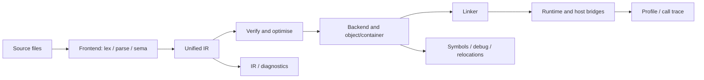
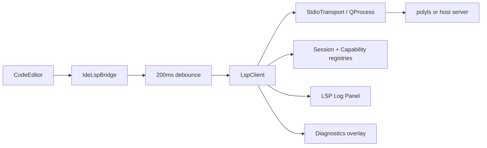
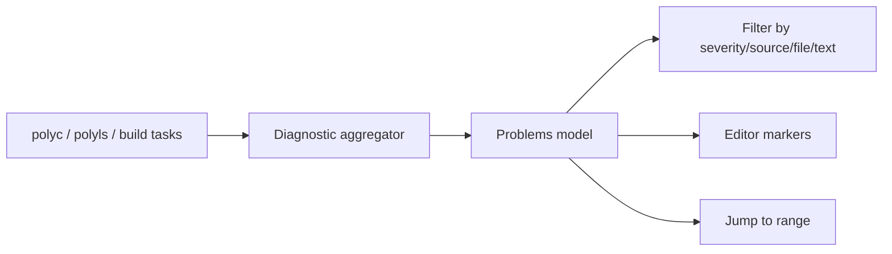
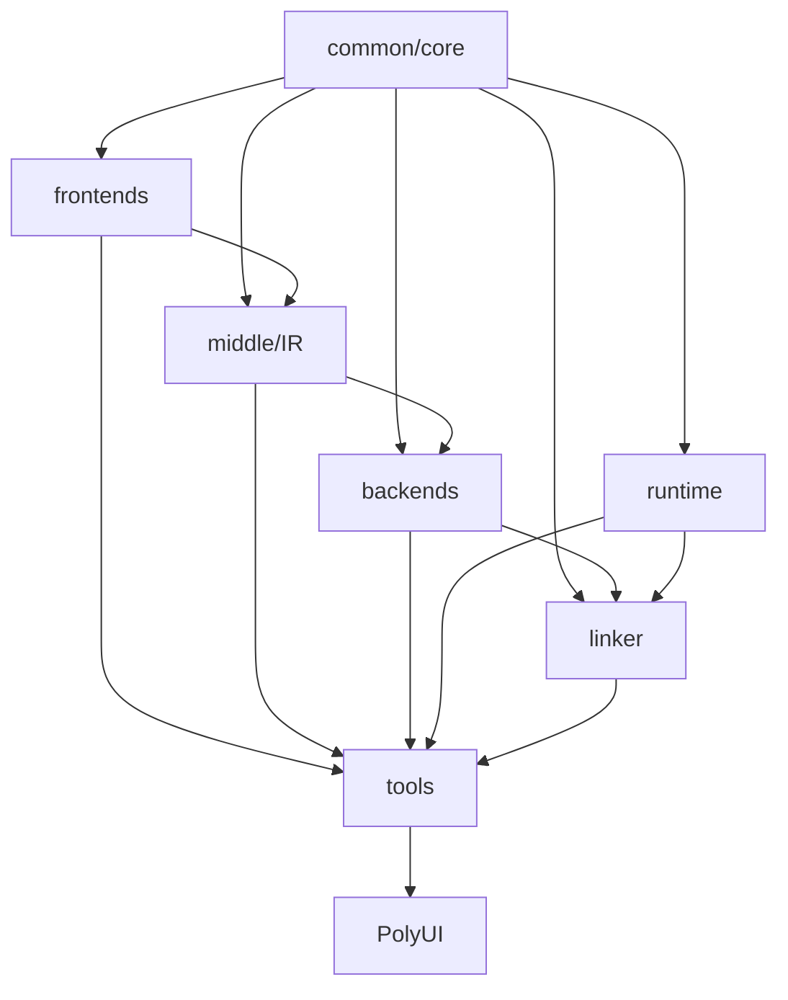

# PolyglotCompiler 完整双语教材 / The Complete Bilingual PolyglotCompiler Textbook

> **适用版本 / Target version**：PolyglotCompiler 1.47.4<br>
> **教材版本 / Textbook edition**：2.1.1<br>
> **源码核验 / Source audit**：2026-07-17<br>
> **覆盖范围 / Coverage**：`docs/tutorial/`、`docs/specs/`、`docs/api/`、43 个原课程样例、9 组教材配套示例、当前源码和测试。<br>
> **术语规范 / Terminology standard**：[`POLYGLOT_COMPILER_BILINGUAL_DICTIONARY.md`](POLYGLOT_COMPILER_BILINGUAL_DICTIONARY.md) 是全书翻译与术语一致性的唯一规范来源。<br>
> **编辑原则 / Editorial rule**：这是一部融合教材，不是原文档的机械拼接；原教程负责操作路径，规范负责约束，API 负责实现接口，源码和测试负责判断当前事实。

This is an integrated textbook rather than a concatenation of source documents. Tutorials contribute workflows, specifications contribute contracts, APIs contribute implementation surfaces, and source plus tests determine current behaviour.

---

## 前言 / Preface

### 本书面向谁 / Audience

本书同时服务四类读者：第一次使用 PolyglotCompiler 的开发者、使用 Ploy 构建跨语言程序的工程师、使用 CLI/PolyUI 分析项目的用户，以及修改编译器、运行时系统、IDE 或插件的贡献者。

The book serves first-time users, engineers building cross-language programs in Ploy, users analysing projects through the CLI or PolyUI, and contributors changing the compiler, runtime, IDE, or plugins.

### 双语排版 / Bilingual layout

每个中文段落之后紧随语义完整的英文对应段落。解释性表格在中英文内容较多时拆成中文表与英文表；代码、命令、机器字段表和图只出现一次。API 名称、ABI 符号、诊断码与命令参数保持原始拼写，避免翻译破坏可搜索性。中文正文只保留无法安全翻译的专名、代码标识符和行业缩写，不把普通英文术语嵌入中文句子。

Every Chinese paragraph is immediately followed by a semantically complete English counterpart. Explanatory tables with substantial prose are separated into Chinese and English versions; code, commands, machine-field tables, and diagrams appear once. API names, ABI symbols, diagnostic identifiers, and command-line options retain their original spelling. Chinese prose keeps only proper names, code identifiers, and industry abbreviations that cannot safely be translated.

### 实现状态标签 / Implementation-status labels

这些标签用于区分“设计目标”“已经接线的实现”和“经过测试的可用路径”。阅读任何功能说明时，应先看状态，再决定它能否用于实验、开发或发布。

These labels separate design intent, wired implementation, and tested usable paths. Read the status before deciding whether a feature belongs in an experiment, a development workflow, or a release.

| 标签 / Label | 含义 / Meaning |
|---|---|
| **[完整 / Complete]** | 源码、测试和可执行路径共同证明 / source, tests, and executable path agree |
| **[分层 / Layered]** | 语法或 API 已实现，但某些 Runtime/Backend 路径依赖适配层 / syntax or API exists while some runtime/backend paths need adapters |
| **[实验 / Experimental]** | 可使用但兼容性或覆盖仍可能变化 / usable with evolving compatibility or coverage |
| **[规划 / Planned]** | Spec 或路线图中存在，但不能当作当前实现 / documented direction, not current implementation |

### 三条阅读路线 / Three reading paths

本书既是入门教程也是实现手册，因此不要求所有读者线性读完。下面三条路线按实际工作角色裁剪章节，但遇到边界问题时仍应回到相关规范/API 章节。

The book is both a tutorial and an implementation manual, so readers need not proceed strictly front to back. These paths select chapters by role while preserving cross-references to the relevant contracts and APIs.

- **应用开发者 / Application developer**：1–20 → 21–31 → 附录 A–F。
- **编译器贡献者 / Compiler contributor**：1–5 → 32–43 → 附录 G–J。
- **IDE/工具贡献者 / IDE and tooling contributor**：1–5 → 21–31 → 38–43。

### 贯穿全书的项目 / Running project

全书使用一个“多语言数据分析服务”作为连续案例：Ploy 组织管线，C++ 读取输入，Rust 清洗数据，Python 计算模型，Java/.NET 提供业务规则，JavaScript 展示结果。每一部分只增加一个新能力，最终形成可构建、可测试、可分析的项目。

The running project is a polyglot analytics service: Ploy orchestrates the pipeline, C++ reads input, Rust cleans data, Python evaluates a model, Java/.NET provide business rules, and JavaScript presents results. Each part adds one capability until the project is buildable, testable, and analysable.

### 配套示例与结果 / Companion examples and results

教材正文负责解释概念、顺序和实现细节，同目录的 [`POLYGLOT_COMPILER_COMPLETE_TUTORIAL_EXAMPLES/`](POLYGLOT_COMPILER_COMPLETE_TUTORIAL_EXAMPLES/README.md) 则保存可复制源码、验证脚本与实测输出。示例使用 `RUNNABLE`、`FRONTEND`、`LAYERED`、`FIXTURE`、`BUILDABLE` 五种状态；运行 `bash docs/POLYGLOT_COMPILER_COMPLETE_TUTORIAL_EXAMPLES/run_verified.sh` 可复查当前构建。

The textbook explains concepts, sequence, and implementation details, while the adjacent [`POLYGLOT_COMPILER_COMPLETE_TUTORIAL_EXAMPLES/`](POLYGLOT_COMPILER_COMPLETE_TUTORIAL_EXAMPLES/README.md) directory stores copyable source, a verifier, and observed outputs. Its five statuses distinguish executable programs, frontend-only surfaces, layered boundaries, data fixtures, and independently buildable components.

正文中的输出分三类阅读：程序块给标准输出与退出码；CLI 给诊断、标准错误进度或文件产物；C/C++ API 声明本身没有标准输出，其“结果”是编译通过、返回值/状态改变、序列化文档或契约测试。标成“语义目标”的输出尚未被当前端到端路径证明，绝不能与“本机实测”混写。

Read outputs in three categories: programs have stdout and exit status; CLIs have diagnostics, progress, or file artifacts; C/C++ API declarations have no stdout by themselves, so their observable results are compilation, returned state, serialised documents, or contract tests. A semantic target is never presented as an observed end-to-end result.

---

## 总目录 / Master table of contents

### 第一部分：认识 PolyglotCompiler / Part I: Orientation

这一部分建立项目、构建流程和第一个可验证程序所需的共同背景，适合所有阅读路线先行完成。

This part establishes the shared project, build, and first-program context required by every reading path.

1. 为什么需要多语言编译器 / Why a polyglot compiler
2. 完整编译模型 / The compilation model
3. 环境准备与项目构建 / Prerequisites and build
4. 第一个 Ploy 程序 / First Ploy program
5. 第一个跨语言程序 / First cross-language program

### 第二部分：系统学习 Ploy / Part II: Ploy language

这一部分从词法、类型和控制流逐步进入模块、异步、属性与管线，使后续跨语言章节建立在完整的 Ploy 语义上。

This part develops Ploy from lexical rules and types through modules, async, attributes, and pipelines, providing the semantic foundation for cross-language work.

6. 词法结构与字面量 / Lexical structure and literals
7. 类型系统 / Type system
8. 变量、常量与函数 / Bindings, constants, and functions
9. 表达式与控制流 / Expressions and control flow
10. 结构、`OPTION` 与模式匹配 / Structs, `OPTION`, and pattern matching
11. 模块、包与配置 / Modules, packages, and configuration
12. 异常、异步与泛型 / Exceptions, async, and generics
13. 可见性、属性与文档 / Visibility, attributes, and documentation
14. `PIPELINE` 与完整 Ploy 项目 / Pipelines and the Ploy capstone

### 第三部分：跨语言编程 / Part III: Cross-language programming

这一部分集中解释语言边界：符号如何发现、值如何编组、ABI 如何验证，以及对象、错误和异步任务如何安全跨越运行时系统。

This part focuses on language boundaries: symbol discovery, value marshalling, ABI validation, and safe transport of objects, errors, and asynchronous work.

15. `IMPORT`、`LINK` 与 `CALL` / `IMPORT`, `LINK`, and `CALL`
16. 类型映射与编组 / Type mapping and marshalling
17. ABI 与语言桥接层 / ABI and language bridges
18. 跨语言对象与生命周期 / Foreign objects and lifetime
19. 跨语言异常、异步与性能 / Errors, async, and performance
20. 完整多语言项目 / Complete polyglot project

### 第四部分：命令行工具链 / Part IV: Command-line toolchain

这一部分把编译、优化、汇编、链接、运行时检查和发布命令组织成可复现工作流，并同时记录当前 CLI 的真实限制。

This part turns compilation, optimisation, assembly, linking, runtime inspection, and release tooling into reproducible workflows while documenting current CLI limitations.

21. `polyc`
22. IR 与 `polyopt` / IR and optimisation
23. `polyasm`、`polyld` 与后端 / `polyasm`, `polyld`, and the backend
24. `polyrt` 运行时工具 / The `polyrt` runtime tool
25. `polyver`、`polydoc`、`polybench` 与 `polytopo` / Version, documentation, benchmark, and topology tools
26. 跨目标编译与发布 / Cross-target compilation and release

### 第五部分：IDE 与开发体验 / Part V: IDE and developer experience

这一部分说明命令行产生的诊断、调用图和性能数据数据如何进入 LSP 与 PolyUI，以及编辑器状态和查看器如何管理不可信输入。

This part explains how diagnostics, call graphs, and profiles reach LSP and PolyUI, and how editor state and viewers handle untrusted data.

27. `polyls` 与 LSP
28. 编辑、补全与问题面板 / Editing, completion, and the Problems panel
29. 性能剖析器与调用分析器 / Profiler and Call Analyzer
30. IDE 外壳、设置与主题 / IDE shell, settings, and themes
31. 文件查看器 / File viewers

### 第六部分：编译器实现与 API / Part VI: Compiler implementation and APIs

这一部分面向贡献者，从源码依赖图进入核心、前端、IR、后端、运行时系统和 IDE 的正式接口与实现不变量。

This contributor-oriented part moves from source dependencies into the formal interfaces and implementation invariants of Core, Frontend, IR, Backend, Runtime, and IDE layers.

32. 源码架构、命名空间与依赖 / Architecture, namespaces, and dependencies
33. 核心类型、符号与诊断 API / Core types, symbols, and diagnostics
34. 前端 API 与实现 / Frontend APIs and implementation
35. IR API 与优化实现 / IR APIs and optimisation
36. 后端、MachineIR 与调试 API / Backend, MachineIR, and debug APIs
37. 运行时系统与互操作 API / Runtime and interoperability APIs
38. IDE API

### 第七部分：扩展、测试与维护 / Part VII: Extension, testing, and maintenance

最后一部分把新增功能变成可交付的纵向切片：定义扩展契约、接入构建与注册、建立测试证据，并按兼容性规则发布。

The final part turns new functionality into deliverable vertical slices through extension contracts, build and registration integration, test evidence, and compatibility-aware release practice.

39. 插件规范 / Plugin specification
40. 扩展 API / Extension API
41. 新增语言、编译遍次、后端和桥接层 / Adding a language, pass, backend, and bridge
42. 测试与质量门禁 / Testing and quality gates
43. 维护与发布 / Maintenance and release

### 附录 / Appendices

A. Ploy 语法与关键字 / Ploy syntax and keywords<br>
B. 类型、ABI 与编组表 / Type, ABI, and marshalling tables<br>
C. 诊断码目录 / Diagnostic catalogue<br>
D. CLI 参数速查 / CLI reference<br>
E. JSON Schema / Schemas<br>
F. 43 个样例课程图 / Sample curriculum<br>
G. 公开 API 索引 / Public API index<br>
H. 故障排查索引 / Troubleshooting index<br>
I. 中英文术语表 / Bilingual glossary<br>
J. 46 个源文档追溯矩阵 / Source traceability matrix

---


# 第一部分：认识 PolyglotCompiler / Part I: Orientation

## 1. 为什么需要多语言编译器 / Why a polyglot compiler

### 学习目标 / Goals

读完本章，你应能解释 PolyglotCompiler 与普通 FFI、RPC、嵌入解释器的区别，理解它能统一什么、不能替你解决什么，并能根据实现状态选择合适的功能。

After this chapter, you should be able to distinguish PolyglotCompiler from ordinary FFI, RPC, and embedded interpreters, explain what it unifies, and select features according to implementation status.

### 1.1 核心问题 / The core problem

真实系统经常同时使用多种语言：C++ 负责低延迟代码，Rust 负责内存安全组件，Python 负责数据科学，Java/.NET 负责业务服务，JavaScript 负责界面。传统方案让每一对语言单独维护胶水代码，导致类型、所有权、调用约定、错误和调试信息在边界处重复实现。

Real systems commonly combine C++, Rust, Python, Java, .NET, and JavaScript. Pairwise glue duplicates type conversion, ownership, calling conventions, error transport, and debugging at every boundary.

PolyglotCompiler 的目标是把这些边界提升为一个可分析的编译模型：

PolyglotCompiler turns these boundaries into an analysable compilation model:

- Ploy 描述模块、符号、类型映射和调用关系；
- 各语言前端产生统一 IR；
- 中端层执行验证与优化；
- 后端生成目标代码或容器；
- 运行时桥接层处理宿主语言调用、对象和容器；
- 链接器、性能剖析器、调用分析器和 IDE 使用同一批元数据。

PolyglotCompiler elevates language boundaries into an analysable model: Ploy describes modules and mappings, frontends lower to unified IR, the middle layer verifies and optimises, backends emit target artifacts, runtime bridges handle host values, and tools consume shared metadata.

### 1.2 与相邻方案的区别 / Comparison with adjacent approaches

选择技术前必须先确定边界发生在编译期、进程内运行时系统还是网络上。下表用同一组维度比较常见方案，避免把 PolyglotCompiler 当成可以替代所有 FFI 或 RPC 的万能层。

Technology choice begins by locating the boundary at compile time, inside a runtime process, or across a network. The table compares adjacent approaches on the same dimensions rather than treating PolyglotCompiler as a universal replacement for FFI or RPC.

| 方案 / Approach | 边界发生位置 / Boundary | 优点 / Strength | 局限 / Limitation |
|---|---|---|---|
| C FFI | Runtime/ABI | 简单、通用 / simple and universal | 类型和所有权手工维护 |
| RPC | Process/network | 隔离强 / strong isolation | 序列化和部署成本 |
| 嵌入解释器 | Runtime | 动态、易扩展 / dynamic | 编译优化和统一调试有限 |
| PolyglotCompiler | Compile + link + runtime | 类型、IR、ABI、工具统一 | 仍需要宿主工具链与 Bridge |

### 1.3 当前边界 / Current boundaries

项目同时包含成熟路径和仍在演进的契约。本节把能力按证据强度分层，后文所有示例都应在这个状态框架下理解。

The repository contains both mature paths and evolving contracts. This section classifies capabilities by evidence strength so that later examples are interpreted with the correct expectations.

**[完整 / Complete]**：Ploy 词法分析、语法分析与语义分析的核心语法、统一 IR、主要 CLI、LSP 消息分帧、问题面板、拓扑图和多目标对象写出的主要契约均有源码与测试支持。

**[分层 / Layered]**：复杂容器、对象、异常和异步的跨语言传递依赖具体桥接层与宿主运行时系统；语法成功不等于所有语言组合都已端到端执行。

**[实验 / Experimental]**：性能数据与调用图的生产者—消费者数据模式、部分高级优化、目标格式、插件能力和跨目标运行验证仍随平台变化；第 29 章列出当前不兼容点。

**[规划 / Planned]**：规范中标为规划项或路线图的跨语言属性映射等内容，不能当作当前承诺。

**[Complete]**: Source and tests cover the core Ploy lexical, syntactic, and semantic rules, unified IR, primary CLIs, LSP framing, the Problems panel, topology, and the main multi-target object writers.

**[Layered]**: Cross-language transport of complex containers, objects, exceptions, and asynchronous work depends on a concrete bridge and host runtime. Successful syntax does not mean every language combination executes end to end.

**[Experimental]**: Producer/consumer schemas for profile data and call graphs, some advanced optimisations, target formats, plugin capabilities, and cross-target execution checks still vary by platform. Chapter 29 records current incompatibilities.

**[Planned]**: Cross-language attribute mapping and other items marked planned or roadmap in the specifications are not current commitments.

### 练习 / Exercise

为你的一个现有项目列出语言边界，并为每条边标注：参数类型、返回类型、所有权、错误、异步模型和调用频率。后续章节会逐项把它们映射到 Ploy、ABI 与运行时系统。

List every language boundary in one of your projects and annotate parameter type, result type, ownership, error model, async model, and call frequency.

### 本章小结 / Summary

多语言编译的难点不是“识别多少语言”，而是让边界拥有一致、可验证、可观察的语义。

The hard part is not recognising many languages; it is making their boundaries consistent, verifiable, and observable.

---

## 2. 完整编译模型 / The compilation model

### 学习目标 / Goals

本章建立全书的心智模型：一次编译经过哪些阶段，每个阶段产生什么证据，以及错误应在哪一层定位。

This chapter establishes the book's mental model: compilation stages, evidence produced by each stage, and the layer responsible for each failure.

### 2.1 六阶段管线 / Six-stage pipeline

这张图是全书的主索引：每个阶段接受上一层的产物，生成下一层输入，并留下可以诊断失败的证据。遇到问题时应先定位阶段，再选择工具。

This diagram is the book's primary index: every stage consumes an artifact, produces the next input, and leaves evidence for failure diagnosis. Locate the stage before choosing a tool.



1. **发现与配置**：识别语言、目标、包、设置和工具链。
2. **前端**：执行词法分析、语法分析、语义分析与 IR 降低。
3. **中端**：执行 IR 验证、函数级与上下文级优化，以及 PGO 与 LTO。
4. **后端**：选择目标后端，生成 MachineIR、对象文件或容器。
5. **链接**：解析符号、校验 ABI 并应用重定位。
6. **运行时系统**：启动程序，执行桥接调用，管理 GC、对象、容器和性能数据。

1. **Discovery and configuration**: identify languages, targets, packages, settings, and toolchains.
2. **Frontend**: perform lexical analysis, parsing, semantic analysis, and IR lowering.
3. **Middle end**: verify IR and run function-level and context-level optimisation, PGO, and LTO.
4. **Backend**: select a target backend and generate MachineIR, object files, or containers.
5. **Linking**: resolve symbols, validate the ABI, and apply relocations.
6. **Runtime system**: launch the program, execute bridge calls, and manage GC, objects, containers, and profile data.

### 2.2 统一 IR 的作用 / Why unified IR matters

统一 IR 让不同前端共享优化、后端、诊断与工具。它包含类型、值、`BasicBlock`、函数、全局量、外部声明和控制流；SSA 与 Phi 节点使数据流可以被验证和优化。

Unified IR lets frontends share optimisation, backends, diagnostics, and tooling. It models types, values, blocks, functions, globals, externals, control flow, SSA, and phi nodes.

### 2.3 中间产物是证据 / Artifacts are evidence

编译成功或失败的单一终端消息通常不够。下面把常见产物与它们能够证明和不能证明的事实分开，帮助读者避免从局部证据做过度推断。

A single success or failure message rarely tells the whole story. The table separates what each artifact proves from what it cannot prove, preventing conclusions that exceed the evidence.

| 产物 / Artifact | 能证明什么 / What it proves | 不能证明什么 / What it does not prove |
|---|---|---|
| Token/AST | lexer/parser 接受输入 | 类型与运行语义正确 |
| Diagnostics JSON | check/sema 结果 | Backend 可生成 |
| IR | lowering 成功 | ABI/链接正确 |
| Object | Backend 发射成功 | 外部符号可解析 |
| Executable/container | Link 成功 | 所有目标环境都能运行 |
| Profile/call graph | 执行与调用关系可观察 | 未采样路径一定不存在 |

### 2.4 错误定位 / Failure localisation

同一个用户症状可能来自完全不同的层。下面的顺序按最早可能失败的阶段排查，目标是先获得最小复现，再向后验证产物。

The same visible symptom can originate in different layers. This sequence starts at the earliest plausible failure, reduces it to a minimal reproduction, and then validates downstream artifacts.

- 语法分析错误：先缩小到最小语句。
- 未知符号或类型：检查导入、作用域、链接和包索引。
- IR 验证错误：检查 IR 降低、无效类型、未定义值和控制流图。
- 未定义符号：检查桥接层、宿主对象、链接名称和运行时库。
- 启动失败：检查目标、容器、加载器、动态库和宿主运行时。
- 值损坏：检查 ABI、编码、长度、对齐和所有权。

- Parser failure: reduce the source to the smallest statement.
- Unknown symbol or type: inspect imports, scope, links, and package indexes.
- IR-verifier failure: inspect lowering, invalid types, undefined values, and the CFG.
- Undefined symbol: inspect the bridge, host object, link name, and runtime library.
- Launch failure: inspect the target, container, loader, dynamic libraries, and host runtime.
- Corrupted value: inspect the ABI, encoding, length, alignment, and ownership.

### 实现入口 / Implementation entry points

理解管线后，需要把抽象阶段映射回仓库目录。该表给出每类问题的首个源码入口，而不是穷举所有实现文件。

After understanding the pipeline, map each abstract stage back to the repository. This table gives the first source entry point for each problem class rather than listing every implementation file.

| 子系统 / Subsystem | 目录 / Directory |
|---|---|
| Core types and diagnostics | `common/` |
| Frontends | `frontends/` |
| IR and optimisation | `middle/` |
| Targets | `backends/` |
| Link and runtime | `runtime/`, `tools/polyld/` |
| CLI and IDE | `tools/` |

### 练习 / Exercise

对一个失败程序依次保留诊断、IR、对象和链接器输出，写出“最后一个正确阶段”。不要直接把所有失败归因于运行时系统。

Capture diagnostics, IR, object, and linker output for a failing program and identify the last correct stage.

---

## 3. 环境准备与项目构建 / Prerequisites and build

### 学习目标 / Goals

你将完成可重复构建，理解 Qt 与非 Qt 目标的区别，并知道哪些 CMake 选项在当前顶层工程中真实存在。

You will create a reproducible build, distinguish Qt and non-Qt targets, and use only currently defined top-level CMake options.

### 3.1 必需工具 / Required tools

构建依赖既包括通用编译工具，也包括按功能启用的宿主 SDK。先区分硬性依赖和可选能力，可以避免把缺少某个桥接层误判为核心编译器无法构建。

Build requirements include both general compilation tools and feature-specific host SDKs. Separating mandatory dependencies from optional capabilities prevents a missing bridge SDK from being mistaken for a core compiler failure.

- CMake 与 Ninja；
- 支持 C++20 的宿主编译器；
- Git；
- 对应语言样例所需的 Python、Rust、JDK、.NET、Go、节点.js 或 Ruby；
- 构建 PolyUI 时需要 Qt 6。

Only install host runtimes needed by the samples you intend to run. Parser/unit tests can work without every external runtime; end-to-end bridges cannot.

### 3.2 标准构建 / Standard build

标准流程使用独立构建树，使配置、生成文件和源码修改保持隔离。命令执行后还要检查配置摘要和测试清单，而不能只确认可执行文件存在。

The standard workflow uses an out-of-source build tree to isolate configuration and generated files from source changes. After running it, inspect the configure summary and test inventory rather than merely checking that binaries exist.

```sh
cmake -S . -B build -G Ninja -DCMAKE_BUILD_TYPE=Debug
cmake --build build
ctest --test-dir build --output-on-failure
```

Release：

```sh
cmake -S . -B build-release -G Ninja -DCMAKE_BUILD_TYPE=Release
cmake --build build-release
```

Qt 不在默认搜索路径时：

When Qt is not on the default search path:

```sh
cmake -S . -B build -G Ninja -DQT_ROOT=/absolute/path/to/Qt/6.x/compiler
```

Windows 使用开发者 PowerShell，并让 CMake 选择 MSVC/Ninja；不要把 POSIX 路径直接复制到 PowerShell。

On Windows, use a Developer PowerShell with MSVC and Ninja available.

### 3.3 当前顶层选项 / Current top-level options

这些 CMake 选项决定哪些产品组件和证据路径进入当前构建。修改选项会改变可注册后端、UI 测试和发布内容，因此复现问题时必须记录它们。

These CMake options determine which product components and evidence paths enter a build. Because they affect registered backends, UI tests, and package contents, record them whenever reproducing a problem.

| 选项 / Option | 用途 / Purpose |
|---|---|
| `BUILD_SHARED_LIBS` | 构建共享库 / shared libraries |
| `POLYGLOT_ENABLE_ASAN` | AddressSanitizer |
| `POLYGLOT_ENABLE_UBSAN` | UndefinedBehaviourSanitizer |
| `POLYGLOT_ENABLE_COVERAGE` | Coverage instrumentation |
| `QT_ROOT` | Qt installation root |

旧教程中的 `POLY_BUILD_*` 一类开关不应在未检查当前 `CMakeLists.txt` 时继续使用。

Do not assume historical `POLY_BUILD_*` switches still exist.

### 3.4 单目标与清理 / Targeted and clean builds

日常开发优先重建最小目标以缩短反馈；遇到缓存、生成文件或链接注册异常时，再使用新构建目录验证。清理不是修复语义错误的替代品。

Daily development should rebuild the smallest owning target for fast feedback. When cache, generated-file, or registration issues are suspected, verify in a fresh build directory; cleaning is not a substitute for fixing semantic errors.

```sh
cmake --build build --target polyc
cmake --build build --target polyls
cmake --build build --target polyui
cmake --build build --clean-first
```

出现依赖下载失败时，先检查代理、缓存和 `FetchContent`；Qt 失败时检查版本、工具包路径和 `CMAKE_PREFIX_PATH`。共享库加载失败时检查 RPATH 与路径，而不是重复编译前端。

For a dependency-download failure, inspect the proxy, cache, and `FetchContent`. For a Qt failure, inspect its version, kit path, and `CMAKE_PREFIX_PATH`. For a shared-library load failure, inspect RPATH and search paths instead of recompiling the frontend.

### 实践 / Lab

这个练习让读者确认本机能够分别构建编译器、语言服务器和测试，而不是依赖一次不透明的全量构建。记录每一步的目标名和失败层，后续章节会复用该诊断方式。

This lab verifies that the compiler, language server, and tests can be built independently rather than relying on one opaque full build. Record the target and failure layer at each step for later reuse.

1. 构建 `polyc`。
2. 运行 `ctest --test-dir build -N` 记录测试数量。
3. 单独运行 `test_frontend_ploy`。
4. 若有 Qt，再构建 `polyui`。

1. Build `polyc`.
2. Run `ctest --test-dir build -N` and record the number of tests.
3. Run `test_frontend_ploy` independently.
4. If Qt is available, build `polyui` as well.

### 本章小结 / Summary

可重复构建是后续所有语法、ABI 和 API 结论的前提；使用真实 CMake 选项，不把旧教程当作构建系统本身。

A reproducible build is the prerequisite for every later claim.

---

## 4. 第一个 Ploy 程序 / First Ploy program

### 学习目标 / Goals

你将创建、检查、编译并运行最小 Ploy 程序，同时学会保存足够的中间证据。

You will check, compile, and run a minimal Ploy program while retaining useful intermediate evidence.

### 4.1 程序 / Program

第一个程序刻意只使用稳定的声明和输出路径，以便把环境问题与语言问题分开。先逐字运行该输入，再修改字面量观察词法分析器、IR 降低和运行时系统输出的变化。

The first program intentionally uses only stable declaration and output paths so environment problems remain distinct from language problems. Run it unchanged before modifying literals and observing lexer, lowering, and runtime behaviour.

```ploy
FUNC main() -> i32 {
    PRINTLN "hello from Ploy\n";
    RETURN 0;
}
```

保存为 `hello.ploy`。关键字大小写不敏感，但普通标识符仍区分大小写。

Save it as `hello.ploy`. Keywords are case-insensitive; ordinary identifiers remain case-sensitive.

### 4.2 分层验证 / Layered verification

一个程序应分别通过前端检查、编译产物检查和最终运行验证。下面的命令逐层增加责任，使失败时能够知道问题出在语义、代码生成、链接还是执行。

A program should pass frontend analysis, artifact inspection, and final execution separately. These commands add responsibility one layer at a time so failures can be assigned to semantics, code generation, linking, or runtime execution.

```sh
build/polyc --check hello.ploy > build/hello.diagnostics.json

build/polyc hello.ploy \
  --strict --no-aux \
  --emit-ir=build/hello.ir \
  --emit-asm=build/hello.s \
  --emit-obj=build/hello.o \
  -o build/hello
./build/hello
```

第二条命令在一次分阶段编译中承担两种责任：三个 `--emit-*` 保存可检查的旁路产物，`-o build/hello` 则明确要求继续进入链接阶段并生成最终可执行文件。目标和容器默认采用宿主配置；交叉编译时还应显式给出匹配的 `--target` 与 `--container`。可用 `file build/hello*` 区分文本 IR、汇编、可重定位对象与最终可执行文件，不能只凭成功横幅推断产物存在。

The second command has two responsibilities within one staged compilation: the three `--emit-*` options retain inspectable sidecars, while `-o build/hello` explicitly requires the link stage and final executable. Target and container default to the host; cross compilation should provide matching `--target` and `--container` values. Use `file build/hello*` to distinguish textual IR, assembly, relocatable object, and executable rather than trusting a success banner alone.

当前 `polyc` 没有 `--diagnostics-format`、`--emit-tokens` 或 `--emit-ast` 参数；`--check` 本身固定输出符合 LSP 结构的 JSON。观察词法单元或 AST 时，应使用前端 API、调试器或相应单元测试，不能在教材里伪造 CLI 产物。

Current `polyc --check` directly emits LSP-shaped JSON. There are no token/AST emission flags in the current driver.

#### 4.2.1 实测输出与产物 / Observed output and artifacts

配套 [`00_hello`](POLYGLOT_COMPILER_COMPLETE_TUTORIAL_EXAMPLES/00_hello/README.md) 已按上述分层实测。`--check` 返回 0；把绝对目录正规化为 `<SOURCE>` 后，标准输出是：

The companion [`00_hello`](POLYGLOT_COMPILER_COMPLETE_TUTORIAL_EXAMPLES/00_hello/README.md) was verified layer by layer. Check mode exits 0 and, after normalising the absolute directory to `<SOURCE>`, writes:

```json
{"uri":"file://<SOURCE>/00_hello/main.ploy","diagnostics":[]}
```

单命令管线生成文本 IR、汇编源码和 Mach-O x86_64 对象文件；`nm` 可以看到 `main` 和尚未解析的 `polyrt_println`。随后，打包阶段调用 `polyld`，解析三处重定位、恢复一个 `println` 调用点并生成可执行文件。执行结果的退出码为 0，标准输出精确是：

The single-command pipeline creates textual IR, assembly source, and a Mach-O x86_64 object; `nm` exposes `main` and the unresolved `polyrt_println`. Packaging then invokes `polyld`, which resolves three relocations, recovers one println call site, and emits the executable. Execution exits 0 with the exact stdout:

```text
hello from Ploy
```

### 4.3 读诊断 / Reading diagnostics

诊断至少应包含严重级别、代码、消息和源码范围。IDE 问题与 `polyls` 使用同一类有效载荷，因此先让 `polyc --check` 通过，可以缩小 IDE 问题的范围。

Diagnostics carry severity, code, message, and source range. Passing `polyc --check` first separates frontend failures from IDE transport failures.

### 4.4 常见错误 / Common errors

初学阶段最重要的是把报错归入正确阶段，而不是立即改很多代码。以下症状提供第一检查点，仍需结合结构化诊断和中间产物确认。

Early debugging is about assigning an error to the correct stage rather than changing many things at once. These symptoms provide a first check, which should still be confirmed with structured diagnostics and artifacts.

- 缺少分号或右括号：检查语法分析器。
- 返回值与 `i32` 不匹配：检查语义分析器。
- 检查成功但编译失败：检查 IR 降低、IR 与后端。
- 编译成功但无法启动：检查链接、容器与运行时系统。

- Missing semicolon or closing parenthesis: inspect the parser.
- Result incompatible with `i32`: inspect Sema.
- Checking succeeds but compilation fails: inspect IR lowering, IR, and the backend.
- Compilation succeeds but launch fails: inspect linking, the container, and the runtime system.

### 练习 / Exercise

让程序读取一个变量并使用 `IF` 输出两个分支；故意制造一次类型错误，记录 JSON 诊断，再修复。

Add a variable and an `IF` branch, capture one intentional type error as JSON, then fix it.

---

## 5. 第一个跨语言程序 / First cross-language program

### 学习目标 / Goals

本章完成贯穿项目的第一条真实边：Ploy 声明 C++ 函数签名，调用它，并理解每个阶段的责任。

This chapter builds the first real boundary in the running project: Ploy declares and calls a C++ function.

### 5.1 项目布局 / Layout

即使是最小的跨语言项目，也应把 Ploy 编排代码、宿主实现和生成产物分开。这个布局让符号归属、构建顺序和清理边界一目了然。

Even a minimal cross-language project should separate Ploy orchestration, host implementation, and generated artifacts. This layout makes symbol ownership, build order, and cleanup boundaries explicit.

```text
analytics/
├── main.ploy
├── cpp/
│   └── reader.cpp
└── expected_output.txt
```

`reader.cpp`：

```cpp
#include <cstdint>
#include <iostream>

extern "C" std::int32_t read_count(std::int32_t /*unused*/) {
    return 3;
}

extern "C" void print_count(std::int32_t count) {
    std::cout << "rows=" << count << '\n';
}
```

`main.ploy`：

```ploy
IMPORT cpp::reader;

// 当前快照中可进入 Sema/Lowering 的兼容形式；会产生 deprecation warning。
LINK(cpp, ploy, reader::read_count, read_count) RETURNS i32 {
    MAP_TYPE(cpp::int, i32);
}
LINK(cpp, ploy, reader::print_count, print_count) RETURNS VOID {
    MAP_TYPE(cpp::int, i32);
}

FUNC main() -> i32 {
    LET count: i32 = CALL(cpp, reader::read_count, 0);
    CALL(cpp, reader::print_count, count);
    RETURN 0;
}
```

### 5.2 声明、调用与链接 / Declaration, call, and link

这里故意给 `read_count` 增加一个占位 `i32` 参数：当前兼容 `LINK` 以 `MAP_TYPE` 条目推导参数，而“零参数且有已知返回值”的路径还不能生成完整 IR 降低签名。相应的 C++ 函数应改成 `read_count(std::int32_t)`，本例忽略该参数并返回 `3`。

The dummy argument is intentional: the current compatibility path derives parameters from `MAP_TYPE`, while a zero-argument link does not yet publish a complete lowering signature. Change the C++ declaration to `read_count(std::int32_t)` and ignore the argument.

`LINK` 的目标是给语义分析器提供语言、模块、符号、参数和返回类型。`CALL` 产生跨语言调用描述符；IR 降低选择桥接层符号；链接器最终解析宿主对象与运行时系统。当前实现与规范形式之间的差距在第 15 章完整说明；这不是可以忽略的警告。

`LINK` supplies language, module, symbol, parameters, and result type. `CALL` creates a cross-language call descriptor, lowering selects a bridge symbol, and the linker resolves host objects and runtime support.

### 5.3 构建顺序 / Build order

跨语言链接要求宿主对象与 Ploy 对象对同一符号、类型宽度和调用约定达成一致。下面先独立生成双方产物，再让链接器显式显示解析过程。

Cross-language linking requires the host and Ploy objects to agree on symbol identity, type width, and calling convention. The workflow builds both sides independently before asking the linker to expose resolution details.

```sh
c++ -c analytics/cpp/reader.cpp -o build/reader.o
build/polyc --check analytics/main.ploy
build/polyc analytics/main.ploy -c \
  --emit-ir=build/main.ir \
  --emit=call-graph:build/main.cgjson \
  --emit-obj=build/main.o
build/polyld build/main.o build/reader.o --trace --verbose -o build/analytics
```

具体链接参数随平台和运行时系统布局变化；若 `polyld` 报未定义符号，先比较 `LINK` 符号、`extern "C"` 名称和对象符号表。

Exact linker arguments vary by platform. For an undefined symbol, compare the `LINK` name, `extern "C"` spelling, and object symbol table.

#### 5.3.1 当前可验证结果与目标输出 / Current proof and target output

配套 [`03_cpp_bridge`](POLYGLOT_COMPILER_COMPLETE_TUTORIAL_EXAMPLES/03_cpp_bridge/README.md) 把 Ploy 与 C++ 源码放在同一目录。当前 `polyc --check` 对兼容形式返回 0，同时产生五个严重级别-2 警告：四个 `E3024` 指出 `RETURNS`/旧式 `LINK(...)` 已弃用，一个 `E3003` 指出 `reader::read_count` 的推导返回位宽为 8，而目标 `cpp::int` 为 4。这个结果证明“当前兼容路径进入了语义分析器”，不证明 ABI 已闭合。

The companion [`03_cpp_bridge`](POLYGLOT_COMPILER_COMPLETE_TUTORIAL_EXAMPLES/03_cpp_bridge/README.md) keeps the Ploy and C++ sources together. Current check mode exits 0 with five severity-2 warnings: four `E3024` deprecation warnings and one `E3003` inferred return-width mismatch. This proves entry into the compatibility Sema path, not a closed ABI.

反过来机械改为规范有符号形式会在当前语义分析器丢失源码/目标语言与源码符号，并以 `E3008/E3009` 失败。待描述符、适配器与最终链接全部闭合后，目标可执行文件应退出 0 并由 C++ 辅助程序输出：

Mechanically changing to the canonical signed form currently loses source/target language and source-symbol fields in Sema and fails with `E3008/E3009`. Once descriptor, adapter, and final link are closed, the target executable should exit 0 and let the C++ helper write:

```text
rows=3
```

这里明确称为“目标输出”，不是本版本已经观察到的桥接层标准输出；配套 `expected_result.md` 固定了升级为 RUNNABLE 前必须补齐的证据。

This is explicitly a target output rather than observed bridge stdout; the companion `expected_result.md` fixes the evidence required before upgrading the example to fully runnable.

### 5.4 观察调用图 / Observe the call graph

静态调用图用于确认 IR 降低后保留了预期的直接调用边，但它不能证明该边在运行时发生。先检查 JSON 身份和引用完整性，再在第 29 章叠加性能数据数据。

The static call graph confirms that expected direct-call edges survive lowering, but it does not prove they execute. Inspect JSON identities and referential integrity before adding runtime profile data in Chapter 29.

```sh
jq '.nodes, .edges' build/main.cgjson
# Or open the file through PolyUI's Call Analyzer.
```

`polytopo` 接受 Ploy 源码或它自己的拓扑图 JSON，不能读取 `polyglot.callgraph.v1`。当前调用图的节点包含数值 `id`、名称、语言、外部标志、桥接层标志和块数量；边包含数值 `from`、`to` 与被调用方。它不包含源码位置或调用类别，且当前 UI 对数值 `id` 的不匹配问题见第 29 章。

Polytopo does not consume call-graph JSON. Inspect it as JSON or in Call Analyzer; current fields and the numeric-id consumer mismatch are documented in Chapter 29.

### 5.5 实现边界 / Implementation boundary

本例只传递 `i32`/`VOID`，属于最容易验证的 ABI 路径。动态数值输出由 C++ 辅助程序完成，是因为当前 Ploy `PRINTLN` 只接受一个字符串字面量；字符串、列表、对象、异常和异步需要后续章节的编组与生命周期规则。

This example passes only `i32`. Strings, containers, objects, exceptions, and async values require later marshalling and lifetime rules.

### 练习 / Exercise

把函数改为 `sum(i32, i32) -> i32`，先故意让 `LINK` 参数数错误，观察语义分析器诊断，再修复并比较调用图。

Change the function to `sum(i32, i32) -> i32`, intentionally mismatch its arity, inspect the diagnostic, and then fix it.

### 第一部分总结 / Part summary

你现在拥有一个可重复构建、一个最小 Ploy 程序和一条可观察的跨语言调用。后续所有高级功能都应保持同样的分层验证方式。

You now have a reproducible build, a minimal Ploy program, and an observable cross-language call. Every advanced feature should preserve the same layered validation discipline.

---


# 第二部分：系统学习 Ploy / Part II: The Ploy language

## 本部分导读：Ploy 为什么这样设计 / Why Ploy is designed this way

学习一门语言不能从背关键字开始。先理解它要解决的问题，才能判断某个构造为什么存在、应该放在哪里，以及为什么它没有照搬 C++、Python 或 Rust。Ploy 的首要角色不是替代这些宿主语言，而是成为**多语言边界的静态契约与编排语言**：业务算法仍可留在最合适的宿主语言中，Ploy 负责把模块、符号、类型、版本、转换、生命周期和调用顺序写成编译器与工具都能分析的事实。

Learning a language should not begin with memorising keywords. Ploy is not primarily a replacement for C++, Python, Rust, or other host languages. It is a **static contract and orchestration language for polyglot boundaries**: host languages keep their domain logic, while Ploy makes modules, symbols, types, versions, conversions, lifetimes, and call order visible to the compiler and tooling.

这一定义带来五个核心设计目标。下表先列出中文说明，再给出对应英文。

This role leads to five design goals. The Chinese table is followed by its English equivalent.

| 设计目标 | 在语法中的体现 | 解决的问题 |
|---|---|---|
| 边界显式 | `IMPORT`、`LINK`、`CALL`、`MAP_TYPE` 和 `CLASS` 不隐藏在普通函数调用中 | 可以审计跨语言边界发生在哪里 |
| 类型与 ABI 分层 | `i32`、`STRING`、`LIST<T>` 与宿主类型映射分开声明 | 避免把同名类型误认为相同内存布局 |
| 版本可追踪 | `LANG`、`WITH LANG` 和 `@LANG` 进入描述符 | 可以解释每个调用使用的运行时版本 |
| 控制流可分析 | 花括号、显式 `RETURN`、`MATCH`、`OPTION`、`TRY` 和 `ASYNC` | 让控制流图、诊断、调用图和性能数据保留语义 |
| 渐进严格 | 动态边界可暂时保留 `Any/Unknown`，发布时由严格门禁拒绝占位类型 | 可以接入动态宿主，同时不把不确定性伪装成安全 |

| Goal | Surface consequence | Problem addressed |
|---|---|---|
| Explicit boundaries | `IMPORT`, `LINK`, `CALL`, `MAP_TYPE`, and `CLASS` remain distinct from ordinary calls | Cross-language boundaries are auditable |
| Layered types and ABI | `i32`, `STRING`, `LIST<T>`, and host mappings are declared separately | Equal names cannot be mistaken for equal memory layouts |
| Version traceability | `LANG`, `WITH LANG`, and `@LANG` enter descriptors | Every call can be associated with its runtime version |
| Analysable control flow | Braces, explicit `RETURN`, `MATCH`, `OPTION`, `TRY`, and `ASYNC` | CFGs, diagnostics, call graphs, and profile data preserve semantics |
| Gradual strictness | Dynamic boundaries may retain `Any/Unknown` temporarily, while strict release gates reject placeholders | Dynamic hosts remain usable without disguising uncertainty as safety |

Ploy 因此刻意不提供一套“把所有宿主语言能力重新实现一遍”的庞大标准库。文件输入输出、数据库、图形用户界面、机器学习和网络框架等通常由宿主模块提供；Ploy 应描述这些能力的可见签名、数据转换和编排关系。若某段逻辑完全属于单一语言且没有边界价值，留在宿主语言中往往更清晰。

Ploy therefore does not try to reimplement every host ecosystem. File I/O, databases, GUI frameworks, machine learning, and web stacks normally remain host capabilities. Ploy describes their visible signatures, conversions, and orchestration. Logic that is wholly local to one host language often belongs there.

### 如何学习每个语言构造 / How each construct is taught

本部分后续每种语法都应回答六个问题。遇到只会“抄示例”却不知道如何修改时，也可以用这六问重新检查：

Every construct in this part is organised around six questions:

1. **设计目的**：它消除哪一种歧义或重复工作？
2. **语法形式**：完整语法是什么，哪些部分可以省略？
3. **组成解释**：关键字、名称、类型、表达式和分隔符分别表示什么？
4. **具体用途**：什么场景应该使用，什么场景不应该使用？
5. **编译过程**：词法分析器、语法分析器、语义分析器、IR 降低阶段和运行时系统分别做什么？
6. **结果与失败**：成功后可以观察什么，常见错误出现在哪一层？

1. **Purpose**: What ambiguity or repeated work does the construct remove?
2. **Form**: What is the complete grammar, and which parts are optional?
3. **Anatomy**: What does each keyword, name, type, expression, and delimiter mean?
4. **Use**: When should the construct be used or avoided?
5. **Implementation**: What do the lexer, parser, semantic analyser, IR lowering, and runtime system each do?
6. **Result and failure**: What becomes observable on success, and at which layer do common failures arise?

教材中的简化 EBNF 使用以下记号：`"TOKEN"` 表示固定关键字或符号，`name/type/expr` 表示由其他规则解析的非终结符，`[x]` 表示可选一次，`{x}` 表示重复零次或多次，`x | y` 表示二选一。EBNF 用于解释结构，不替代当前语法分析器源码和测试；实现差异会在相邻文字中明确标出。

The simplified EBNF uses `"TOKEN"` for fixed text, `name/type/expr` for non-terminals, `[x]` for an optional item, `{x}` for repetition, and `x | y` for alternatives. It explains structure but does not override the current parser and tests.

### 一段程序如何经过编译器 / How one program moves through the compiler

理解处理阶段可以避免把所有错误都称作“语法错误”：

Understanding the processing stages prevents every failure from being mislabelled as a syntax error:

```text
source bytes
  -> Lexer: keyword / identifier / number / string / symbol / SourceLoc
  -> Parser: declarations, statements, expressions, patterns, types
  -> Sema: symbol lookup, type rules, scope, version and boundary contracts
  -> Lowering: unified IR, CFG, descriptors, generated bridge calls
  -> Backend/Linker: object format, relocations, symbols, executable/container
  -> Runtime/Host adapters: values, ownership, exceptions, async execution
```

#### 如何对照源码阅读 / How to follow the implementation

教材给出的语法不是脱离代码的“理想规格”。阅读某个构造时，可以按下表从表面拼写一路追到可执行表示；每一层回答的问题不同：

The grammar in this book is meant to be followed through the actual implementation. Each layer answers a different question:

| 层次 | 当前入口 | 负责回答的问题 |
|---|---|---|
| 词法单元 | [`frontends/ploy/src/lexer/lexer.cpp`](../frontends/ploy/src/lexer/lexer.cpp) 中的 `PloyLexer::NextToken`、`LexIdentifierOrKeyword`、`LexNumber` 和 `LexString` | 哪些字节组成一个词法单元，源码位置在哪里 |
| 抽象语法树形状 | [`frontends/ploy/include/ploy_ast.h`](../frontends/ploy/include/ploy_ast.h) | 语法分析器必须保存哪些字段，后续阶段可以依赖哪些事实 |
| 语法 | [`frontends/ploy/src/parser/parser.cpp`](../frontends/ploy/src/parser/parser.cpp) 中的 `ParseTopLevel`、`ParseStatement`、`ParseExpression` 和 `ParseType` | 词法单元按什么顺序组合，错误在哪里恢复 |
| 语义 | [`frontends/ploy/src/sema/sema.cpp`](../frontends/ploy/src/sema/sema.cpp) 中的 `AnalyzeStatement`、`AnalyzeExpression`、`ResolveType` 和 `AnalyzePattern` | 名称指向哪个声明、类型是否兼容、作用域和诊断是什么 |
| 可执行 IR | [`frontends/ploy/src/lowering/lowering.cpp`](../frontends/ploy/src/lowering/lowering.cpp) 中的 `LowerStatement`、`LowerExpression` 与各构造专用降低函数 | 如何形成常量、调用、基本块、描述符和清理边 |
| 公共契约 | `frontends/ploy/include/ploy_{lexer,parser,sema,lowering}.h` 与测试 | 哪些入口可由驱动程序和工具调用，哪些行为已有回归证据 |

| Layer | Current entry | Responsibility |
|---|---|---|
| Token | `PloyLexer::NextToken`, `LexIdentifierOrKeyword`, `LexNumber`, and `LexString` | Determines which bytes form one token and records source location |
| AST shape | `frontends/ploy/include/ploy_ast.h` | Defines the fields retained for later stages |
| Grammar | `ParseTopLevel`, `ParseStatement`, `ParseExpression`, and `ParseType` | Combines tokens and establishes recovery points |
| Meaning | `AnalyzeStatement`, `AnalyzeExpression`, `ResolveType`, and `AnalyzePattern` | Resolves names, types, scopes, and diagnostics |
| Executable IR | `LowerStatement`, `LowerExpression`, and construct-specific lowering | Creates constants, calls, basic blocks, descriptors, and cleanup edges |
| Public contracts | Ploy frontend headers and tests | Defines callable entry points and regression-backed behaviour |

例如追踪 `MATCH value { CASE 1 { ... } }`：词法分析器先产生 `MATCH`、标识符、花括号、`CASE` 和整数词法单元；语法分析器的 `ParseMatchStatement` 与 `ParsePattern` 创建被匹配值和匹配分支模式；语义分析器的 `AnalyzeMatchStatement` 与 `AnalyzePattern` 检查类型兼容性、绑定、守卫条件、穷尽性和可达性；`LowerMatchStatement` 让被匹配值只求值一次，并生成测试块、主体块、下一分支块和合并块。任何一层缺失都不能称为完整实现：只有词法单元而没有语法，不具备语言形式；只有语法树节点而没有类型安全，不具备静态语义；只有语义分析成功而没有运行时行为，也不具备可执行语义。

For a `MATCH`, tokenisation, AST construction, semantic pattern analysis, and CFG lowering are separate proofs. A token alone is not a grammar feature; a parsed node alone is not type safety; frontend success alone is not runtime behaviour.

新增或修改语言构造时，最小闭环是：抽象语法树字段 → 词法单元或关键字（如果需要）→ 语法分析与错误恢复 → 语义分析与错误码 → IR 降低与描述符 → 正向和负向测试 → 规范、API、教程与高亮规则同步。这样可以避免“教程中存在但语法分析器不支持”或“语法分析器支持但工具不认识”的漂移。

The minimum implementation loop for a language feature is AST → token → parser/recovery → Sema/diagnostics → lowering/descriptors → positive and negative tests → synchronised spec, API, tutorial, and editor rules.

例如下面的程序同时展示类型别名、结构、函数、不可变绑定、条件与字面量输出：

The following program combines an alias, a struct, a function, an immutable binding, a condition, and literal output:

```ploy
TYPE Celsius = f64;

STRUCT Reading {
    sensor: STRING,
    value: Celsius
}

FUNC is_valid(reading: Reading) -> BOOL {
    RETURN reading.value >= -273.15;
}

FUNC main() -> i32 {
    LET sample = Reading { sensor: "lab-a", value: 21.5 };
    IF is_valid(sample) {
        PRINTLN "accepted\n";
        RETURN 0;
    }
    PRINTLN "invalid\n";
    RETURN 1;
}
```

逐行阅读时，不要只看“它像某种 C 语法”：`TYPE` 只增加源码别名，不制造新的 ABI 身份；`STRUCT` 建立名义字段模式；参数和返回箭头形成函数签名；`LET` 让 `sample` 不可重新赋值；成员访问由语义分析器查询字段表；`PRINTLN` 当前只接收字符串字面量；两个 `RETURN` 同时定义控制流终点与进程状态。后续章节会逐个展开这些事实。

Read it as a contract rather than merely C-like syntax: `TYPE` creates a source alias rather than a new ABI, `STRUCT` registers a nominal field schema, parameters and the arrow form a function signature, `LET` prevents rebinding, member access consults the semantic field table, `PRINTLN` currently accepts only a string literal, and each `RETURN` terminates a control path.

配套的 [`09_language_tour`](POLYGLOT_COMPILER_COMPLETE_TUTORIAL_EXAMPLES/09_language_tour/README.md) 把第 6–13 章的核心形式集中到一个可复制文件，并把当前前端的期望结果固定为 `diagnostics: []`。正文负责解释“为什么”和“如何实现”，示例目录负责让读者修改源码、运行检查并对照结果；两者应一起阅读。

The companion [`09_language_tour`](POLYGLOT_COMPILER_COMPLETE_TUTORIAL_EXAMPLES/09_language_tour/README.md) puts the core Chapters 6–13 forms in one copyable file and pins the current frontend result to `diagnostics: []`. The textbook explains purpose and implementation; the companion file provides a reproducible experiment.

```sh
build/polyc --check \
  docs/POLYGLOT_COMPILER_COMPLETE_TUTORIAL_EXAMPLES/09_language_tour/main.ploy
```

当前构建的实测结果如下；`uri` 的绝对前缀会随机器变化，稳定契约是退出码 `0` 与空诊断数组：

The observed result from the current build is below. The absolute URI prefix is machine-dependent; exit code `0` plus an empty diagnostic array is the stable contract:

```json
{"uri":"file://<SOURCE>/09_language_tour/main.ploy","diagnostics":[]}
```

> **命名说明**：项目中的规范语言名与扩展名是 **Ploy** 和 `.ploy`。用户常说的“Poly 语言”以及 Markdown 中的 `poly` 代码围栏，只在编辑器层作为别名支持；编译器源码、命令和文档中的正式名称仍是 Ploy。

> The canonical language name and extension are **Ploy** / `.ploy`. “Poly language” and the `poly` Markdown fence are supported aliases at the editor layer.

## 6. 词法结构与字面量 / Lexical structure and literals

### 学习目标 / Goals

本章说明 Ploy 源文件如何被词法分析器切分，以及哪些文本形式在进入语法分析器前已经确定。掌握词法层可以避免把大小写、注释或字符串问题误判为语义错误。

This chapter explains how the lexer tokenises Ploy source, preventing lexical problems from being mistaken for semantic failures.

### 6.0 设计目的：让边界文本可精确重放 / Design purpose: exact, replayable source

词法层的目标不是理解业务含义，而是把源码字节稳定地切成词法单元，并为每个词法单元保存文件、行、列和必要的原始拼写。多语言工具链尤其依赖这种稳定性：同一个 Ploy 文件可能同时被编译器、`polydoc`、`polyls`、格式化器、调用图工具和诊断界面读取；如果它们对大小写、字符串结束位置或注释附着有不同理解，后续 API 再完整也无法对齐。

The lexer does not understand business meaning. It creates stable tokens with file, line, column, and source spelling so the compiler, `polydoc`, `polyls`, formatters, graph tools, and diagnostics all agree on the same text boundaries.

Ploy 选择花括号、显式分号和有限的字面量前缀，主要是为了避免缩进改变语义，避免自动分号插入在跨平台格式化后改变程序，让错误恢复能够跳到 `;` 或 `}`，并让模板字符串和原始字符串在词法分析阶段具有明确边界。代价是源码更加显式，但编译、索引和生成工具更容易保持一致。

Braces, explicit semicolons, and a small set of literal prefixes avoid indentation-sensitive semantics and automatic-semicolon surprises. They also give parser recovery reliable `;` and `}` boundaries.

### 6.1 文件、语句与标识符 / Files, statements, and identifiers

Ploy 文件使用 `.ploy`。语句通常以 `;` 终止，块使用 `{ ... }`，换行只是空白。标识符满足 `[A-Za-z_][A-Za-z0-9_]*`。

Ploy files use `.ploy`, statements normally end in `;`, blocks use braces, and newlines are ordinary whitespace.

关键字按 ASCII 大写折叠，因此 `FUNC`、`func` 和 `FuNc` 等价；普通标识符保持大小写敏感。旧教程中“语法分析器对关键字大小写敏感”的说法已经不符合当前词法分析器。

Keywords are ASCII case-folded, while ordinary identifiers remain case-sensitive. Historical claims that keywords are case-sensitive are no longer true.

`CLASS`、`HANDLE`、`ATTR` 是上下文相关关键字：只有在相应语法位置才具有特殊含义，因此变量名 `handle` 不会被全局保留。

`CLASS`, `HANDLE`, and `ATTR` are contextual keywords rather than globally reserved words.

简化文件语法是：

The simplified file grammar is:

```text
source_file  ::= { top_level_item }
top_level_item ::= declaration | statement
block        ::= "{" { declaration | statement } "}"
identifier   ::= (ASCII_LETTER | "_") { ASCII_LETTER | DIGIT | "_" }
```

分号用于结束绑定、表达式、`RETURN`、`BREAK`、`CONTINUE`、`THROW`、`PRINTLN` 以及多数导入、链接和映射等简单语句。以代码块自身结束的 `FUNC`、`STRUCT`、`IF`、循环、`MATCH`、`TRY` 和 `PIPELINE`，不在右花括号后额外要求分号。Ploy 没有自动分号插入，因此换行不能代替必需的 `;`。

Semicolons terminate simple statements. Block-owning constructs such as functions, structs, conditions, loops, matches, try blocks, and pipelines end at their closing brace. Newlines never insert missing semicolons.

| 源文本 | 词法分析结果 | 原因 |
|---|---|---|
| `func` / `FuNc` | 规范关键字 `FUNC` | 关键字不区分 ASCII 大小写 |
| `Score` / `score` | 两个不同标识符 | 普通名称保持大小写敏感 |
| `score_2` | 一个标识符 | 下划线和后续数字都合法 |
| `score-2` | 标识符、`-`、数字 | `-` 是运算符，不属于名称 |
| `model::score` | 标识符、`::`、标识符 | 限定名由语法分析器组合 |
| `handle` | 普通标识符词法单元 | `HANDLE` 只在特定类型语境中解释 |

| Source text | Lexer interpretation | Reason |
|---|---|---|
| `func` / `FuNc` | Canonical keyword `FUNC` | Keywords are ASCII case-insensitive |
| `Score` / `score` | Two different identifiers | Ordinary names remain case-sensitive |
| `score_2` | One identifier | An underscore and following digits are valid |
| `score-2` | Identifier, `-`, number | `-` is an operator rather than part of a name |
| `model::score` | Identifier, `::`, identifier | The parser combines a qualified name |
| `handle` | Ordinary identifier token | `HANDLE` is interpreted only in the relevant type context |

当前没有反引号或引号形式的转义标识符，也没有 Unicode 标识符语法。若名称与 82 个全局关键字冲突，应改成 `app_config`、`result_value` 等明确名称，而不是依赖大小写绕过。

There is no escaped-identifier or Unicode-identifier form. Rename keyword collisions instead of trying to evade them with casing.

### 6.2 注释 / Comments

注释规则看似简单，却直接影响文档注释、格式化器和词法分析器的行列定位。示例区分普通注释、块注释与后续 `polydoc` 使用的三斜线形式。

Comment rules affect documentation comments, formatting, and lexer source locations. The examples distinguish ordinary comments, block comments, and the triple-slash form later consumed by `polydoc`.

```ploy
// 普通行注释 / ordinary line comment
/* 块注释 / block comment */
/// 文档注释：只附着到紧随其后的声明
//// 普通 banner，不是文档注释
```

恰好三个斜杠才构成文档注释。连续的文档注释行会附着到顶层 `FUNC`、`STRUCT`、`LET` 或 `VAR`；`polydoc` 与 LSP 悬停信息读取同一份数据。

Exactly three slashes form a documentation comment. Consecutive lines attach to the following declaration.

三种注释各有不同设计用途：

The three comment forms serve different purposes:

| 形式 | 结束边界 | 适合用途 | 是否进入文档模型 |
|---|---|---|---|
| `// text` | 当前物理行结尾 | 局部实现说明、临时上下文 | 否 |
| `/* text */` | 后续第一个 `*/` | 多行解释、临时屏蔽片段 | 否 |
| `/// text` | 当前物理行结尾 | 对外声明的稳定 API 说明 | 是 |

| Form | End boundary | Suitable use | Enters documentation model |
|---|---|---|---|
| `// text` | End of the physical line | Local implementation notes or temporary context | No |
| `/* text */` | First following `*/` | Multi-line explanation or temporarily disabled text | No |
| `/// text` | End of the physical line | Stable API documentation | Yes |

块注释当前不能嵌套：`/* outer /* inner */ tail */` 会在第一个 `*/` 结束，剩余文本重新参与词法切分。文档注释也没有 `/** ... */` 等价形式；只有恰好三个开头斜杠才会进入待处理文档缓冲区。连续的 `///` 行会逐行保存，词法分析器去掉每行开头最多一个紧随斜杠的空格，再由语法分析器附着到下一个适用声明。

Block comments are not nested. Documentation uses exactly `///`; `/** ... */` is an ordinary block comment. Consecutive doc lines are buffered and attached by the parser to the next applicable declaration.

设计上，普通注释会被词法分析器丢弃，而文档注释必须保留为结构化有效载荷。这样优化器不会看到注释词法单元，`polydoc` 与 LSP 悬停信息也不必重新从源码猜测哪些行属于声明。常见错误包括用 `////` 编写 API 文档、在文档注释与声明之间插入其他词法单元，以及误以为块注释可以嵌套。

Ordinary comments disappear from the token stream, while documentation survives as structured payload. This keeps optimisation clean without forcing documentation tools to re-parse nearby text heuristically.

### 6.3 数字与布尔 / Numbers and booleans

字面量的表面写法最终必须落到明确的源码类型和 IR 常量。下表先列出可接受形式，后文再说明默认位宽和目标相关的重新定型。

Literal spelling must eventually become a precise source type and IR constant. The table lists accepted forms before later sections explain default widths and target-specific restamping.

| 形式 | 示例 |
|---|---|
| 十进制整数 | `42`, `1000000` |
| 十六进制、八进制和二进制整数 | `0xff`, `0o17`, `0b1010` |
| 浮点数 | `3.14`, `2.5e-3` |
| 布尔值 | `TRUE`, `FALSE` |
| 裸空指针 | `NULL` |

| Form | Example |
|---|---|
| Decimal integer | `42`, `1000000` |
| Hexadecimal, octal, and binary integer | `0xff`, `0o17`, `0b1010` |
| Floating point | `3.14`, `2.5e-3` |
| Boolean | `TRUE`, `FALSE` |
| Raw null pointer | `NULL` |

`NULL` 用于裸指针互操作，不是 `OPTION<T>` 的空值；可选类型应使用 `None` 表示无值。

`NULL` represents a raw interop null. Use `None` for an empty `OPTION<T>`.

当前词法分析器的数字扫描不接受下划线分隔符，也没有独立的字符字面量词法单元；旧教程中的 `1_000` 和 `'A'` 不是现行语法。十六进制、二进制和八进制形式只消费各自合法的数字。十进制小数只有在 `.` 后紧跟数字时才形成浮点数，因此 `1..10` 会被正确切分为整数和范围运算符。

The current lexer does not implement numeric separators or character literals. Historical examples using them are not authoritative.

数字的简化语法如下；负号不属于数字词法单元，而是由语法分析器处理的一元运算符：

Numbers follow this simplified grammar. A leading minus is a separate unary operator, not part of the numeric token:

```text
decimal_int ::= DIGIT { DIGIT }
hex_int     ::= "0" ("x" | "X") { HEX_DIGIT }
binary_int  ::= "0" ("b" | "B") { "0" | "1" }
octal_int   ::= "0" ("o" | "O") { "0".."7" }
float       ::= DIGIT { DIGIT } "." DIGIT { DIGIT } [ exponent ]
              | DIGIT { DIGIT } exponent
exponent    ::= ("e" | "E") [ "+" | "-" ] { DIGIT }
negative    ::= "-" number
```

从设计目的看，字面量写法只表达“常量值”，最终宽度应由声明类型、参数签名或类型推导决定。跨语言边界不要依赖默认整数宽度，应写 `LET count: i32 = 42;` 或让 `CALL` 签名明确要求 `i32`；`isize/usize` 只用于确实与目标指针位宽绑定的计数或句柄，不是“更快的普通整数”。

Literal spelling expresses a constant value; declaration context and semantic inference determine its type. Use explicit fixed-width types at language boundaries rather than relying on default integer inference.

| 需求 | 推荐写法 | 不推荐写法 |
|---|---|---|
| 固定协议字段 | `LET tag: u16 = 0xCAFE;` | 使用 `INT` 后再猜测位宽 |
| 二进制标志 | `LET mask: u8 = 0b1010;` | 用字符串保存数字 |
| 小数比例 | `LET rate: f64 = 2.5e-3;` | 从字符串隐式转换 |
| 可选类型无值 | `None` | `NULL` |
| 裸宿主指针无值 | `NULL` | `None` |

| Need | Recommended | Avoid |
|---|---|---|
| Fixed protocol field | `LET tag: u16 = 0xCAFE;` | Using `INT` and guessing its width later |
| Binary flags | `LET mask: u8 = 0b1010;` | Storing the number in a string |
| Fractional ratio | `LET rate: f64 = 2.5e-3;` | Implicit conversion from a string |
| Empty option | `None` | `NULL` |
| Empty raw host pointer | `NULL` | `None` |

`1_000` 会被切成数字 `1` 和标识符 `_000`，`12f32` 不会成为带后缀的浮点数，`'A'` 也不是字符字面量。编译器工具不应只看第一个词法单元就接受整个字面量；只有结合语法分析与语义分析诊断，才能确认周围剩余词法单元是否构成合法程序。

Numeric separators, type suffixes, and character literals are not current syntax. A token being produced does not mean the whole surrounding source is valid.

### 6.4 字符串 / Strings

字符串同时涉及源码转义序列、存储字节、长度和运行时系统输出语义。本节从可写形式开始，再拆分词法分析器/语法分析器/IR 降低的责任，避免把源码字符与运行时字节混为一谈。

Strings combine source escapes, stored bytes, length, and runtime output semantics. This section starts with surface forms and then separates lexer, parser, and lowering responsibilities so source characters are not confused with runtime bytes.

```ploy
LET normal = "line1\nline2";
LET raw = r"C:\data\input.csv";
LET quoted = r#"SELECT "name" FROM users"#;
LET multi = """first
second""";
LET folded = f"rows={3}, ready={TRUE}";
```

普通字符串支持转义序列；原始字符串不处理转义序列；多行字符串保留换行；模板字符串在 `{expression}` 中放置表达式。当前 IR 降低阶段能够可靠折叠全部由字面量组成的插值；包含运行时变量的完整插值路径仍属于分层实现，应通过目标平台测试验证。

Regular, raw, multiline, and template strings have distinct semantics. All-literal template interpolation is proven; runtime-variable interpolation remains layered.

#### 字符串的词法与语法分工 / Lexer-parser split

同一个转义序列会先被词法分析器保留或分类，再由语法分析器和 IR 降低阶段规范化。下面的分工解释了为什么错误转义序列能够携带准确位置，同时合法字节只会解码一次。

An escape is first preserved or classified by the lexer and later normalised by parsing or lowering. The division explains how malformed escapes retain accurate locations while valid bytes are decoded exactly once.

- 普通字符串的词法分析保留源码转义序列，结束引号前的 `\x` 作为两个源码字节；
- 原始字符串支持任意数量的 `#` 填充井号，找到数量相同的结束井号后，把主体重新编码为规范词素；
- 三引号字符串主体中的真实换行、制表符、引号和反斜杠，也会重新编码到规范字符串词法单元中；
- 模板字符串的词法分析产生一个以 `f"` 开头的 `kString` 词法单元，语法分析器再把它拆成字面量片段和表达式片段；`{{` 与 `}}` 表示字面量花括号；
- 当前语法不支持混合前缀 `fr` 或 `rf`。

- Regular-string lexing preserves source escapes, with `\x` remaining two source bytes before the closing quote.
- Raw strings support any number of padding hashes and close only with the same number of hashes.
- Triple-quoted bodies re-encode real newlines, tabs, quotes, and backslashes into a canonical string token.
- Template-string lexing produces one `kString` token beginning with `f"`; the parser then splits it into literal and expression segments. `{{` and `}}` represent literal braces.
- The mixed `fr` and `rf` prefixes are not current syntax.

模板表达式可以静态格式化整数、浮点数、字符串、布尔值，以及为保留动态调用而暂时容许的 `Any/Unknown`。结果的源码类型是 `STRING`。只有所有片段都能在编译期求值时，当前 IR 降低阶段才能稳定物化最终常量。

A template expression may statically format integers, floating-point values, strings, booleans, and temporarily permitted `Any/Unknown` values from dynamic calls. Its source type is `STRING`. Current lowering can reliably materialise the final constant only when every segment is compile-time evaluable.

每种字符串形式是为不同输入来源设计的：

Each form addresses a different source-text problem:

| 形式 | 设计目的 | 是否处理转义 | 典型用途 |
|---|---|---|---|
| `"..."` | 紧凑书写普通文本和控制字节 | 是 | 消息、符号名、短路径 |
| `r"..."` | 按原样保留反斜杠 | 否 | Windows 路径、正则表达式 |
| `r#"..."#` | 允许原始文本中出现普通双引号 | 否 | SQL、JSON 片段、生成代码 |
| `"""..."""` | 保留真实换行 | 后续阶段统一规范化转义 | 模板与文档片段 |
| `f"...{expr}..."` | 把可格式化值组合成 `STRING` | 是；花括号执行插值 | 诊断、标签、报告 |

| Form | Purpose | Escape handling | Typical use |
|---|---|---|---|
| `"..."` | Compact ordinary text and control bytes | Yes | Messages, symbol names, and short paths |
| `r"..."` | Preserve backslashes literally | No | Windows paths and regular expressions |
| `r#"..."#` | Permit ordinary quotes inside raw text | No | SQL, JSON fragments, and generated code |
| `"""..."""` | Preserve real newlines | Escapes are canonicalised downstream | Template and documentation fragments |
| `f"...{expr}..."` | Combine formattable values into `STRING` | Yes; braces interpolate | Diagnostics, labels, and reports |

以下是带填充井号的原始字符串示例：

For a padded raw string:

```ploy
LET query = r##"SELECT "name" FROM files WHERE path = "C:\data""##;
```

`r` 选择原始模式，开头的两个 `#` 决定结束分隔符必须是 `"##`。主体中单独的 `"` 不会结束字符串，反斜杠也不会触发转义。需要包含 `"#` 时，可以再增加一层填充井号。这个设计避免在嵌入 SQL 或 JSON 时反复转义每个引号和反斜杠。

The number of opening hashes determines the exact closing delimiter, allowing quotes and backslashes inside generated text without repeated escaping.

模板字符串中的 `{...}` 是真正的 Ploy 表达式，而不是文本替换宏。语法分析器必须建立表达式抽象语法树，语义分析器必须检查值是否可格式化，IR 降低阶段才能执行常量折叠或生成运行时拼接。`{{` 与 `}}` 表示字面量花括号；`fr"..."`、`rf"..."` 和单引号字符串不是当前语法。若要格式化复杂对象，应先调用显式的宿主或运行时格式化器，而不是期待模板隐式遍历对象。

Template interpolation contains real Ploy expressions, not textual macros. Complex objects require an explicit formatter rather than implicit traversal.

### 6.5 词法单元边界与源码保真 / Token boundaries and source fidelity

Ploy 词法分析器只产生 `identifier/keyword/number/string/symbol/EOF` 这些共享词法单元类别。关键字的 `lexeme` 使用规范大写形式；只有源码拼写与规范形式不同时，`raw_lexeme` 才保存原文。标识符不进行大小写折叠。符号包括圆括号、花括号、方括号、逗号、分号、`::`、`->`、比较运算符、`&&/||`、`?`、`..` 与 `..=`。

The Ploy lexer emits only the shared `identifier/keyword/number/string/symbol/EOF` token categories. A keyword's `lexeme` uses its canonical uppercase form, while `raw_lexeme` preserves the source only when the source spelling differs. Identifiers are not case-folded. Symbols include parentheses, braces, brackets, commas, semicolons, `::`, `->`, comparison operators, `&&/||`, `?`, `..`, and `..=`.

文档注释会由词法分析器放入待处理缓冲区，而不是作为普通词法单元交给语法分析器。语法分析器成功读取适用声明时，再调用 `TakePendingDoc()` 取得注释。这解释了格式化器为什么必须同时读取词法单元原始文本和文档有效载荷。

Documentation comments enter a pending lexer buffer instead of the ordinary token stream. After successfully parsing an applicable declaration, the parser retrieves them through `TakePendingDoc()`. A formatter therefore needs both raw token text and documentation payloads.

### 6.6 `PRINTLN` 的精确能力 / Exact PRINTLN contract

名称容易让人假设它接受任意表达式并自动换行，但当前实现更窄。本节用可运行形式和 IR 降低契约明确其真实能力，避免示例依赖尚未实现的行为。

Its name suggests arbitrary expressions and automatic newlines, but the current implementation is narrower. This section states the runnable form and lowering contract so examples do not rely on unimplemented behaviour.

```ploy
PRINTLN "hello\n";
PRINTLN "embedded\0byte";
PRINTLN "";
```

```text
println_stmt ::= "PRINTLN" string_literal ";"
```

三个组成部分分别承担明确责任：`PRINTLN` 选择运行时系统的标准输出操作；`string_literal` 在编译期提供确定的字节和长度；`;` 为语法分析器的错误恢复提供语句边界。把输入限制为字面量，是为了提供最小、可移植并且能够嵌入 NUL 字节的启动与诊断输出通路，而不是建立完整格式化库。它适合问候程序、固定状态和测试标记，不适合打印变量、容器或对象。

`PRINTLN` selects the runtime operation, the literal provides compile-time-known bytes and length, and `;` closes the statement. This deliberately small facility is useful for startup messages and test markers, not general value formatting.

当前语法严格限定为 `PRINTLN STRING_TOKEN ';'`：不接受数字、标识符、一般表达式、字符串连接或动态模板求值。它可以出现在模块顶层、函数或代码块中；顶层可执行语句会进入合成入口函数。

The current grammar is strictly `PRINTLN STRING_TOKEN ';'`: it accepts no number, identifier, general expression, string concatenation, or dynamic template evaluation. The statement may appear at module scope, inside a function, or inside a block; executable top-level statements enter a synthetic entry function.

IR 降低阶段只对 `\n \r \t \\ \" \0 \xHH` 执行一次规范解码。未知或格式错误的转义序列会产生非致命通用警告，同时保留源码字节。随后，`MakeStringLiteral` 按内容驻留全局值，并生成 `polyrt_println(i8* ptr, i64 len)` 调用。指针加长度的表示能够支持嵌入的 NUL 字节和空消息。名称虽然是 `PRINTLN`，运行时系统并不会自动追加换行；源码必须在字面量中显式写 `\n` 或 `\r\n`。

IR lowering performs one canonical decode of `\n \r \t \\ \" \0 \xHH`. Unknown or malformed escapes emit a non-fatal generic warning while retaining the source bytes. `MakeStringLiteral` then interns the value by content and emits `polyrt_println(i8* ptr, i64 len)`. The pointer-plus-length representation supports embedded NUL bytes and empty messages. Despite its name, `PRINTLN` does not append a newline automatically; the literal must contain `\n` or `\r\n` explicitly.

To print a runtime value, format or emit it through an explicit host/runtime helper. Do not write `PRINTLN value;`; the current parser rejects it.

配套示例 [`00_hello`](POLYGLOT_COMPILER_COMPLETE_TUTORIAL_EXAMPLES/00_hello/main.ploy) 固定了最小标准输出证据。对上面的三个字面量，语言与 IR 契约对应的字节序列分别是 `68 65 6c 6c 6f 0a`、包含中间 `00` 的字节串，以及长度为 0 的字节串。是否真的写到终端，仍需由目标运行时系统、链接器和可执行文件测试共同证明；不能只看 IR 中是否出现 `polyrt_println`。

The companion [`00_hello`](POLYGLOT_COMPILER_COMPLETE_TUTORIAL_EXAMPLES/00_hello/main.ploy) pins the minimal stdout evidence. The three literals above lower to `68 65 6c 6c 6f 0a`, a byte string containing an interior `00`, and a zero-length payload respectively. Seeing `polyrt_println` in IR is not a substitute for a target executable test.

### 6.7 关键字集合与历史差异 / Keywords and historical counts

当前词法分析器全局保留 82 个规范关键字，完整清单见附录 A；`CLASS`、`HANDLE` 和 `ATTR` 是上下文相关关键字。旧规范标题中的“共 57 个”和旧教程中的“54 个”只是当时版本的快照，不能用于当前高亮规则或语法分析器。新增关键字时，必须同步词法分析器集合、语法分析器错误恢复函数 `Sync()`、IDE 高亮规则、规范、测试和附录。

The current lexer reserves 82 global canonical keywords, listed in Appendix A. `CLASS`, `HANDLE`, and `ATTR` are contextual keywords. The older “57 total” specification heading and the tutorial count of 54 were historical snapshots and cannot drive the current parser or highlighter. Adding a keyword requires synchronising the lexer set, parser recovery in `Sync()`, IDE highlighting, specifications, tests, and the appendix.

### 6.8 词法排错顺序 / Lexical troubleshooting order

当语法分析器在“看似正确”的一行报错时，先按词法单元边界检查，而不是立刻改类型或 ABI：

When apparently valid syntax fails, inspect token boundaries before changing types or ABI contracts:

1. 检查前一条简单语句是否缺 `;`；
2. 检查普通字符串、原始字符串和三引号字符串的分隔符是否真正闭合；
3. 检查名称是否与不区分大小写的全局关键字冲突；
4. 检查 `1_000`、后缀、字符字面量等是否来自其他语言习惯；
5. 检查 `////` 与 `///`、非嵌套块注释；
6. 再查看诊断中的源码位置和原始拼写，而不是只看规范词法单元。

1. Check whether the preceding simple statement is missing `;`.
2. Check whether regular, raw, and triple-quoted string delimiters are closed.
3. Check whether a name collides with a case-insensitive global keyword.
4. Check whether `1_000`, suffixes, or character literals were copied from another language.
5. Distinguish `////` from `///` and remember that block comments do not nest.
6. Inspect the diagnostic source location and raw spelling rather than only the canonical token.

这套顺序的用途是把“字节如何切分”和“AST 是否成立”分开。只有词法单元边界确认后，才进入类型、符号和运行时系统层排错。

This order separates byte tokenisation from AST, type, symbol, and runtime failures.

### 实现说明 / Implementation note

`frontends/ploy/src/lexer/lexer.cpp` 保存词法单元的原始拼写和源码位置，同时为关键字生成规范拼写。新增全局关键字时，必须同步语法分析器错误恢复集合、规范和测试。

The lexer preserves original spelling and source locations while classifying canonical keywords.

Unterminated block/string forms currently prioritise forward progress and may return a partial/canonical token; parser diagnostics and negative lexer tests must cover recovery. Tools should never assume a token stream implies lexically clean source without consulting diagnostics.

### 练习 / Exercise

编写一个文件，展示四种字符串、三种注释和不同大小写的关键字；输出词法单元，并指出哪些词素保留原始拼写。

Write a file containing all string and comment forms, emit tokens, and identify preserved spellings.

---

## 7. 类型系统 / Type system

### 学习目标 / Goals

你将理解 Ploy 的源码类型、统一 IR 类型和宿主 ABI 类型不是同一层，并能为变量与跨语言边界选择准确类型。

You will distinguish source types, unified IR types, and host ABI types.

### 7.0 设计目的：在进入 ABI 前消除歧义 / Design purpose: remove ambiguity before the ABI

Ploy 类型系统首先回答“源码认为这个值是什么”，然后才回答“它如何跨边界传输”。显式位宽整数消除了不同宿主语言整数模型之间的歧义；`OPTION<T>` 把“可能没有值”从隐含的空值约定提升为可检查状态；`HANDLE<lang::Type>` 把外部对象的语言来源写入类型身份；容器类型实参则明确编组器必须递归转换的内容。

The type system first says what a value means in source and only then how it crosses an ABI. Fixed widths remove host-language ambiguity, `OPTION<T>` makes absence explicit, `HANDLE<lang::Type>` records foreign origin, and container arguments tell marshalling what must be converted recursively.

类型设计遵循三个原则：

The design follows three principles:

- **不从名称推断布局**：Ploy 的 `STRING` 与 C++ 的 `std::string` 语义相近，但绝不是能够直接按位复制的同一对象；
- **边界优先显式**：内部计算可以使用类型推导，公开签名与外部签名应优先写明 `i32`、`f64` 等精确类型；
- **不确定性可见**：`Any` 与未知类型允许动态连接继续接受分析，但严格发布前必须消除或明确批准它们。

- **Names do not imply layout**: Ploy `STRING` and C++ `std::string` have similar semantics, but they are not the same object and cannot be copied bit for bit.
- **Be explicit at boundaries**: local computations may use inference, while public and foreign signatures should prefer precise types such as `i32` and `f64`.
- **Keep uncertainty visible**: `Any` and unknown types allow dynamic wiring to remain analysable, but a strict release must eliminate or explicitly approve them.

### 7.0.1 类型表达式语法 / Type-expression grammar

```text
type_expr ::= simple_name
            | language "::" qualified_name
            | type_name "<" [ type_expr { "," type_expr } ] ">"
            | type_name "[" type_expr { "," type_expr } "]"
            | legacy_container "(" type_expr { "," type_expr } ")"
            | "HANDLE" "<" language "::" qualified_name ">"

simple_name      ::= primitive | alias_name | struct_name | type_parameter
legacy_container ::= "LIST" | "TUPLE" | "DICT" | "OPTION" | "ARRAY" | "MAP" | "SET"
```

尖括号是新代码的规范形式：`LIST<i32>`、`DICT<STRING, f64>`、`Pair<i32, STRING>`。方括号与有限的圆括号形式只用于兼容旧源码；新项目统一一种拼写可以减少格式化器、文档搜索与代码生成的分支。`language::qualified::Type` 表示宿主类型名称，`HANDLE<language::Class>` 则表示带生命周期的外部对象身份，两者不能互换。

Angle brackets are canonical for new code. A qualified host type names an external type, while `HANDLE<language::Class>` denotes a lifetime-bearing foreign object identity.

### 7.1 原始类型 / Primitive types

原始类型是源码、IR 和 ABI 三层映射的起点。表中的宿主映射只是常见对应，真正的跨语言调用仍必须由描述符和目标数据布局验证。

Primitive types begin the mapping among source, IR, and ABI layers. The host mappings are typical rather than sufficient proof; cross-language calls still require descriptor and target DataLayout validation.

| Ploy 类型 | 语义 | 常见宿主映射 |
|---|---|---|
| `i8/i16/i32/i64` | 有符号固定位宽整数 | C、Rust、Java 与 .NET 中相应位宽的整数 |
| `u8/u16/u32/u64` | 无符号固定位宽整数 | 对没有原生对应类型的宿主执行范围检查 |
| `isize/usize` | 指针位宽整数 | 取决于目标平台 |
| `f32/f64` | 浮点数 | 单精度或双精度浮点数 |
| `BOOL` | 布尔值 | 宿主布尔类型 |
| `STRING` | Unicode 文本句柄 | 需要明确编码与所有权 |
| `VOID` | 无返回值 | 宿主的无返回值形式 |
| `ERROR` | 统一错误句柄 | 由宿主异常适配器转换 |
| `INT` | 旧式整数别名 | 当前规范按 `i64` 处理 |
| `FLOAT` | 旧式浮点别名 | 当前规范按 `f64` 处理 |

| Ploy type | Semantics | Typical host mapping |
|---|---|---|
| `i8/i16/i32/i64` | Signed fixed-width integer | Corresponding-width integers in C, Rust, Java, and .NET |
| `u8/u16/u32/u64` | Unsigned fixed-width integer | Range-checked conversion for hosts without a native counterpart |
| `isize/usize` | Pointer-width integer | Target-dependent integer |
| `f32/f64` | Floating point | Single- or double-precision floating point |
| `BOOL` | Boolean | Host Boolean type |
| `STRING` | Unicode text handle | Requires an explicit encoding and ownership policy |
| `VOID` | No result value | Host no-result form |
| `ERROR` | Unified error handle | Converted by a host-exception adapter |
| `INT` | Legacy integer alias | Currently treated as `i64` |
| `FLOAT` | Legacy floating alias | Currently treated as `f64` |

宽度不匹配会产生类型诊断；经过 `TYPE` 别名的诊断应同时显示别名和底层类型。

Width mismatches produce diagnostics; aliases should render both alias and underlying type.

选择原始类型时，先问“这个值的语义由谁定义”：

Choose a primitive by asking who defines the value's semantics:

| 场景 | 推荐类型 | 原因 |
|---|---|---|
| 文件格式、网络协议、外部函数接口参数 | `i8..i64` / `u8..u64` | 位宽和符号是契约的一部分 |
| 浮点模型参数 | `f32` 或 `f64` | 与宿主或模型精度对齐 |
| 指针运算、本机尺寸或句柄编号 | `isize` / `usize` | 位宽随目标指针尺寸变化 |
| 真或假状态 | `BOOL` | 不用整数约定代替逻辑类型 |
| 人类可读文本 | `STRING` | 后续显式选择编码、所有权与桥接策略 |
| 无返回值 | `VOID` | 不能当作可绑定的普通值 |
| 旧源码或尚未迁移的内部运算 | `INT` / `FLOAT` | 分别等价于 `i64` 和 `f64`，但用于边界时不够精确 |

| Scenario | Recommended type | Reason |
|---|---|---|
| File format, network protocol, or FFI parameter | `i8..i64` / `u8..u64` | Width and signedness are part of the contract |
| Floating-point model parameter | `f32` or `f64` | Match the host or model precision |
| Pointer arithmetic, native size, or handle identifier | `isize` / `usize` | Width follows the target pointer size |
| True/false state | `BOOL` | Avoid replacing a logical type with an integer convention |
| Human-readable text | `STRING` | Select encoding, ownership, and bridging explicitly |
| No result value | `VOID` | It is not an ordinary bindable value |
| Legacy source or unmigrated internal computation | `INT` / `FLOAT` | Equivalent to `i64` and `f64`, but insufficiently precise at a boundary |

`isize/usize` 不是跨平台固定宽度；把它们写进磁盘格式或网络协议会使 32 位与 64 位目标产生不同契约。`INT/FLOAT` 是兼容别名，不是“自动选择最高效机器类型”。

`isize/usize` are target-width types and should not define portable wire formats. `INT/FLOAT` are compatibility aliases rather than automatic machine optimisations.

### 7.2 容器与复合类型 / Containers and composite types

容器类型不仅描述元素类型，还隐含布局、所有权和失败清理。先理解这些源码层类型构造器，才能正确阅读第 16、18 章的运行时描述符。

Container types describe more than element types: they imply layout, ownership, and failure cleanup. Understanding these source-level constructors prepares the Runtime descriptors in Chapters 16 and 18.

| Ploy 类型 | 意义 |
|---|---|
| `ARRAY<T, N>` | 具有固定尺寸意图的序列；当前核心解析保留元素类型，但没有独立保存 `N` |
| `LIST<T>` | 连续存储的动态序列，不是链表 |
| `TUPLE<T...>` | 按位置组织的异构乘积类型 |
| `DICT<K, V>` | 键值容器 |
| `OPTION<T>` | 表示 `Some(T)` 或 `None` |
| `STRUCT Name { ... }` | 命名记录类型 |
| `HANDLE<Lang::Type>` | 带类型信息的外部句柄 |

| Ploy type | Meaning |
|---|---|
| `ARRAY<T, N>` | A fixed-size-intent sequence; current core resolution preserves the element type but not a distinct `N` field |
| `LIST<T>` | A contiguous dynamic sequence, not a linked list |
| `TUPLE<T...>` | A heterogeneous positional product type |
| `DICT<K, V>` | A key/value container |
| `OPTION<T>` | Either `Some(T)` or `None` |
| `STRUCT Name { ... }` | A named record type |
| `HANDLE<Lang::Type>` | A typed foreign handle |

`LIST<T>` 映射到 C++ `std::vector`、Rust `Vec`、Python 列表等；这种“语义对应”不表示内存布局相同，跨边界仍需编组。

A semantic type correspondence does not imply identical memory layout.

类型分析器在类型位置接受三种带参数的写法：`LIST[i32]`、`LIST(i32)` 与 `LIST<i32>`。新代码和泛型实例化应使用规范的尖括号形式。旧式圆括号兼容仅适用于 `LIST`、`TUPLE`、`DICT`、`OPTION`、`ARRAY`、`MAP` 和 `SET`。当前语义分析器能够直接解析 `ARRAY`、`LIST`、`TUPLE`、`DICT` 与 `OPTION`；未知的用户泛型名称会成为 `GenericInstance`，已声明的泛型结构体实例则在最小可行的类型擦除实现中折叠为名义结构体身份。

The type parser accepts three parameterised spellings in type position: `LIST[i32]`, `LIST(i32)`, and `LIST<i32>`. Angle brackets are canonical for new code and generic instantiations. Legacy parenthesised support is limited to `LIST`, `TUPLE`, `DICT`, `OPTION`, `ARRAY`, `MAP`, and `SET`. Sema currently resolves `ARRAY`, `LIST`, `TUPLE`, `DICT`, and `OPTION` directly; an unknown user-generic name becomes `GenericInstance`, while a declared generic-structure instance collapses to nominal structure identity in the minimum type-erasure implementation.

`MAP` 与 `SET` 出现在旧式语法分析兼容范围中，但这不等于它们已经具备完整的现代运行时容器契约。新的边界代码应使用已有文档说明的 `DICT<K,V>` 与 `LIST<T>`，除非特定目标的测试证明其他写法可用。

`MAP` and `SET` appear in legacy parser compatibility, but that does not give them a fully specified modern runtime-container contract. New boundary code should use the documented `DICT<K,V>` and `LIST<T>` forms unless target-specific tests prove otherwise.

容器类型的每个参数都有用途，不能当作装饰：

Every container argument has a concrete role:

| 类型 | 参数解释 | 适合用途 | 边界额外问题 |
|---|---|---|---|
| `LIST<T>` | 一种重复出现的元素类型 | 批量同类数据、减少跨语言调用次数 | 连续存储描述符与元素清理 |
| `TUPLE<A,B,...>` | 固定位置上的类型 | 小型多返回值与异构坐标 | 字段顺序与填充 |
| `DICT<K,V>` | 键类型与值类型 | 稀疏查找与命名的动态数据 | 散列、相等性与迭代顺序 |
| `OPTION<T>` | 存在时的载荷类型 | 合法的缺失值 | 标签表示与载荷销毁 |
| `ARRAY<T,...>` | 固定尺寸意图 | 编译期形状已知的数据 | 当前尺寸身份的实现限制 |
| `HANDLE<L::T>` | 宿主语言与类路径 | 不透明外部对象 | 引用保留、释放以及线程与运行时亲和性 |

| Type | Argument meaning | Suitable use | Additional boundary question |
|---|---|---|---|
| `LIST<T>` | One repeated element type | Batches of homogeneous data and fewer cross-language calls | Contiguous descriptor and element cleanup |
| `TUPLE<A,B,...>` | Types at fixed positions | Small multiple results and heterogeneous coordinates | Field order and padding |
| `DICT<K,V>` | Key and value types | Sparse lookup and named dynamic data | Hashing, equality, and iteration order |
| `OPTION<T>` | Payload type when present | Legitimately absent values | Tag representation and payload destruction |
| `ARRAY<T,...>` | Fixed-size intent | Data whose shape is known at compile time | Current implementation limits on size identity |
| `HANDLE<L::T>` | Host language and class path | Opaque foreign object | Retain/release and thread/runtime affinity |

例如，`LIST<LIST<f64>>` 不是“一个指针”：描述符必须说明外层的长度与容量，每个内层列表又有独立的描述符、所有权与失败清理。若某个内层列表的第三个元素转换失败，编组器必须释放此前已经构造的内层值，再返回一个确定错误；第 16 章会把这条递归契约落实到 C ABI。

A nested list is not one pointer. Each level needs length, ownership, recursive conversion, and rollback if a later element fails.

### 7.3 别名与类型表达式 / Aliases and type expressions

别名提高源码可读性，但不能制造新的 ABI 身份。示例展示嵌套类型表达式如何解析，并提醒实现必须防止循环别名和丢失类型实参。

Aliases improve source readability without creating a new ABI identity. The examples show nested type expressions and highlight the need to detect alias cycles and preserve type arguments.

```ploy
TYPE RowId = i64;
TYPE Scores = LIST<f64>;

STRUCT Record {
    id: RowId,
    name: STRING,
    scores: Scores
}
```

别名在语义分析器中解析到基础类型，但诊断和文档可以保留用户命名。递归结构、外部句柄和容器嵌套必须经过类型注册表与编组能力检查。

Aliases resolve to underlying types while diagnostics retain user-facing names.

别名右侧可以是原始类型、限定的宿主类型、容器、`HANDLE`，或者在该位置已经声明的类型。不支持向后引用稍后才声明的别名或类型，这与单遍的名称注册表一致。重新定义原始类型或现有符号会被拒绝。

An alias right-hand side may be a primitive, qualified host type, container, `HANDLE`, or another type already declared at that point. Forward references to aliases or types declared later are unsupported, matching the single-pass name registry. Redefining a primitive or an existing symbol is rejected.

`TYPE` 别名与 `STRUCT` 名义类型的设计用途不同：

Aliases and nominal structs serve different purposes:

```ploy
TYPE UserId = i64;              // same underlying value/ABI as i64
STRUCT User { id: UserId }      // a distinct nominal record
```

`UserId` 用于让诊断与 API 表达领域含义，但不阻止普通 `i64` 在兼容规则允许时传入；`User` 则带有独立的字段数据模式，不能因为另一个结构体恰好也有 `id: i64` 就自动兼容。若需要真正禁止不同编号混用，应使用名义包装结构体，或在语义分析器与适配器中增加显式验证，不能只依赖别名名称。

An alias improves domain vocabulary but does not create a new ABI identity. A struct is nominal and owns a field schema. Use a nominal wrapper when accidental interchange must be prevented.

别名必须先声明再使用：

Aliases must be declared before use:

```ploy
TYPE Scores = LIST<f64>;
TYPE MaybeScores = OPTION<Scores>;
```

反向顺序会使单遍注册表找不到 `Scores`。循环别名（`TYPE A = B; TYPE B = A;`）也没有可落实的基础表示，应当被拒绝而不是无限展开。

The reverse order leaves `Scores` unavailable to the single-pass registry. A cyclic alias such as `TYPE A = B; TYPE B = A;` has no concrete underlying representation and must be rejected instead of expanded forever.

### 7.4 三层类型模型 / Three type layers

跨语言缺陷常因三个“看起来相同”的类型实际处于不同层。下面从用户可见类型、编译器语义类型到 IR/ABI 表示逐层区分它们。

Many cross-language defects arise because three apparently identical types belong to different layers. The list separates user-visible types, compiler semantic types, and IR/ABI representations.

1. **源码类型**：Ploy 与宿主语言看到的类型。
2. **IR 类型**：优化和验证使用的统一表示。
3. **ABI 表示**：寄存器、栈、指针、句柄和容器描述符。

1. **Source type**: the type visible to Ploy and the host language.
2. **IR type**: the unified representation used by optimisation and verification.
3. **ABI representation**: registers, stack slots, pointers, handles, and container descriptors.

不要因为两个源码类型都叫 `STRING` 就假设 ABI 完全相同；编码、分配器与生命周期仍由桥接层决定。

Do not infer ABI identity from equal source-level names.

### 7.5 语义分析器的实际解析 / Current semantic resolution

规范中的类型拼写只有经过语义分析器，才会成为可用于检查的 `core::Type`。下表记录当前解析结果和缺口，是判断某种写法能否进入严格 IR 降低阶段的依据。

A type spelling becomes checkable only after Sema resolves it to `core::Type`. The table records current outcomes and gaps, which determine whether a form can enter strict lowering.

| Source form | `core::Type` result |
|---|---|
| `iN/uN` | `Int(N, signed)` |
| `isize/usize` | host-side 64-bit placeholder, restamped for actual 32-bit targets later |
| `INT/FLOAT` | legacy `i64/f64` |
| `BOOL/STRING/VOID` | Bool/String/Void |
| `PTR/ptr/pointer` | opaque `Any` in current Ploy sema |
| unknown simple name | nominal Struct(name) |
| `LIST<T>`/`ARRAY<T,...>` | Array(T) |
| `TUPLE<T...>` | Tuple(types) |
| `DICT<K,V>` | GenericInstance(`dict`, K, V) |
| `OPTION<T>` | Optional(T) |
| `lang::HostType` | `TypeSystem::MapFromLanguage` result |
| `HANDLE<lang::Class>` | Class(name, language) |
| active generic parameter | Any under type erasure |

`ERROR` 在捕获与错误模型中作为统一名义句柄使用；`NULL` 仍表示原始互操作空值。不要把历史教程中的 `LONG`、`DOUBLE`、`CHAR` 或 `RESULT` 当成当前词法分析器保证支持的内建类型；如果把它们写成普通标识符，它们可能只解析成名义结构体，而不是预期的原始类型或代数数据类型。

`ERROR` is used as a unified nominal handle in the catch and error model; `NULL` remains a raw interoperability null. Do not treat historical tutorial names such as `LONG`, `DOUBLE`, `CHAR`, or `RESULT` as lexer-guaranteed built-ins. Written as ordinary identifiers, they may resolve only to nominal structures rather than the intended primitive or algebraic data type.

### 7.6 兼容性、类型推导与严格模式 / Compatibility, inference, and strict mode

变量初始化式、实参、返回值与字段写入使用 `AreTypesCompatible`：`Any` 与未知类型暂时兼容，以允许动态边界继续分析；带类型的外部类必须同时具有相同的名称与语言；其余情况委托给核心类型系统。是否最终允许位宽或数值转换，还必须结合 `CanImplicitlyConvert` 与目标 ABI 判断，不能从一次宽松的动态语义分析结果推断边界安全。

Variable initialisers, arguments, return values, and field writes use `AreTypesCompatible`. `Any` and unknown types are temporarily compatible so dynamic boundaries remain analysable; a typed foreign class must have both the same name and the same language; other cases delegate to the core type system. Final permission for width or numeric conversion must also consult `CanImplicitlyConvert` and the target ABI. A permissive dynamic semantic-analysis result alone does not prove boundary safety.

字面量可推导为整数、浮点数、布尔值、字符串或空值。二元数值运算只要一侧是浮点数就产生浮点结果，否则产生整数；字符串的 `+` 产生字符串；比较与逻辑运算产生布尔值。无法解析的组合返回未知类型，严格模式再通过 `ReportStrictDiag` 把可疑的动态事实升级为诊断。

Literal types are inferred for integers, floating-point values, Booleans, strings, and null. A binary numeric operation produces a floating-point result if either operand is floating point and otherwise produces an integer; string `+` produces a string; comparisons and logical operations produce a Boolean. An unresolved combination yields an unknown type, and strict mode promotes suspicious dynamic facts through `ReportStrictDiag`.

`PloySemaOptions.strict_mode` 当前在头文件中的默认值是 `false`。发布验证必须由 `polyc` 或拓扑工作流显式启用严格策略，不能假定对象构造时已经开启。

The current header default for `PloySemaOptions.strict_mode` is `false`. Release validation must explicitly enable a strict policy in the `polyc` or topology workflow instead of assuming that construction enables it by default.

### 7.7 类型推导的逐步例子 / Worked inference examples

类型推导的设计用途是减少局部重复，不是隐藏公开契约。下面每一行先由表达式得到候选类型，再与显式类型标注或使用位置比较：

Inference reduces local repetition rather than hiding public contracts:

```ploy
LET count = 42;                  // integer literal candidate
LET ratio: f64 = 1.0 / 4.0;     // annotation fixes f64
LET names = ["a", "b"];        // list literal -> LIST<STRING>
// Intended value-construction syntax; see the current Sema boundary in §10.1.
LET missing: OPTION<i32> = None;
LET raw = NULL;                  // raw-null/pointer intent, not OPTION
```

对于 `LET value: i32 = some_i64;`，语义分析器不是简单比较字符串 `"i32"` 与 `"i64"`，而是先解析别名、取得位宽和符号属性，再调用兼容性与隐式转换规则，并根据严格模式选择警告或错误。跨语言参数还要继续与 `LINK`、`CLASS` 签名以及目标数据布局比较，因此“Ploy 内可赋值”不能自动推出“ABI 可直接传递”。

Semantic comparison resolves aliases and width/sign before consulting conversion policy. A source-level assignment being accepted does not prove ABI-level direct transfer.

### 7.8 选择与排错清单 / Selection and troubleshooting checklist

1. 公开签名与外部签名是否写明固定位宽；
2. `NULL` 与 `None` 是否表达了正确的缺失值模型；
3. 容器是否保留全部类型实参；
4. 别名是否在使用前声明，是否被错误地当作名义类型安全机制；
5. `HANDLE` 是否包含正确的语言与完整类路径；
6. 警告中的 `Any` 或未知类型是否在严格发布门禁前得到解析；
7. 源码兼容性、编组策略与 ABI 布局是否分别有证据。

1. Do public and foreign signatures state fixed widths?
2. Do `NULL` and `None` express the intended absence model?
3. Does every container preserve all type arguments?
4. Is each alias declared before use, and is it mistakenly being treated as nominal safety?
5. Does every `HANDLE` contain the correct language and complete class path?
6. Are `Any` and unknown-type warnings resolved before the strict release gate?
7. Is there separate evidence for source compatibility, marshalling strategy, and ABI layout?

### 练习 / Exercise

为 `LIST<STRUCT Record>` 写出 Ploy 类型、预期 IR 形状和 C ABI 描述符中必须携带的字段。

Describe the source, IR, and C ABI representation of `LIST<Record>`.

---

## 8. 变量、常量与函数 / Bindings, constants, and functions

### 学习目标 / Goals

本章覆盖声明、作用域、默认参数、命名参数和入口函数，并解释它们如何进入符号表与函数签名表。

This chapter covers declarations, scope, defaults, named arguments, and entry points.

### 8.0 设计目的：把名字、状态与契约分开 / Design purpose: separate names, state, and contracts

声明语法看起来都在“给东西起名字”，但四类声明承担不同责任：`LET/VAR` 创建运行时绑定，`CONST` 创建编译期值，`TYPE` 创建类型词汇，`FUNC` 创建可调用的控制流与签名。把它们分开后，语义分析器才能确定可变性、初始化时机、能否执行常量折叠、名称属于值命名空间还是类型命名空间，以及调用点应该检查什么。

Several declarations introduce names, but they do not introduce the same kind of entity. `LET/VAR` create runtime bindings, `CONST` creates a compile-time value, `TYPE` creates type vocabulary, and `FUNC` creates a callable signature and control-flow body.

| 构造 | 创建内容 | 求值时机 | 典型用途 |
|---|---|---|---|
| `LET` | 不可重新绑定的值 | 函数或模块执行时 | 中间结果、参数派生值与句柄 |
| `VAR` | 可以重新绑定的值 | 函数或模块执行时 | 循环计数器与累积状态 |
| `CONST` | 不可变的折叠常量 | 语义分析或编译期 | 限制值、标签与编译期标记 |
| `TYPE` | 类型注册表中的别名 | 分析声明时 | 领域词汇与嵌套类型缩写 |
| `FUNC` | 签名、主体与符号 | 先分析声明，调用时执行 | 可复用计算与边界责任主体 |

| Construct | Creates | Evaluation time | Typical use |
|---|---|---|---|
| `LET` | A non-rebindable value | Function or module execution | Intermediate results, parameter-derived values, and handles |
| `VAR` | A rebindable value | Function or module execution | Loop counters and accumulated state |
| `CONST` | An immutable folded constant | Semantic analysis or compile time | Limits, tags, and compile-time labels |
| `TYPE` | An alias in the type registry | Declaration analysis | Domain vocabulary and nested-type abbreviations |
| `FUNC` | A signature, body, and symbol | Declaration first; execution on call | Reusable computation and boundary ownership |

### 8.1 声明 / Declarations

绑定声明决定可变性、初始化时机和符号表可见性。示例从最小形式开始，为函数参数、模式绑定和跨语言变量铺垫。

Binding declarations determine mutability, initialisation timing, and symbol-table visibility. These minimal forms prepare later function parameters, pattern bindings, and cross-language variables.

正式形式是：

The formal surface forms are:

```text
binding_decl ::= ("LET" | "VAR") name [ ":" type_expr ] [ "=" expr ] ";"
const_decl   ::= "CONST" name ":" type_expr "=" const_expr ";"
alias_decl   ::= "TYPE" name "=" type_expr ";"
```

```ploy
LET immutable: i32 = 1;
VAR mutable: i32 = 2;
CONST MAX_ROWS: i32 = 1000;
TYPE RowId = i64;
```

`LET` 不可重新赋值；`VAR` 可变；两者至少要有类型标注或初始化式。`CONST` 的值必须在编译期可折叠；`TYPE` 引入类型别名。

`LET` is immutable, `VAR` is mutable, either needs a type or initializer, `CONST` must fold at compile time, and `TYPE` introduces an alias.

旧说明曾称每个 `LET` 都必须初始化；当前语法分析器把类型标注与初始化式都设为可选，语义分析器只在两者同时缺少时报错。因此，`LET reserved: i32;` 当前会进入符号表，但读取前是否具有“确定已经赋值”的保证，仍需通过 IR 降低和控制流测试验证；生产代码应当初始化局部 `LET` 与 `VAR`。

Earlier documentation said that every `LET` required an initialiser. The current parser makes both the type annotation and the initialiser optional, and Sema reports an error only when both are absent. Consequently, `LET reserved: i32;` currently enters the symbol table, but IR-lowering and control-flow tests must still prove definite assignment before a read. Production code should initialise local `LET` and `VAR` bindings.

逐项拆解 `LET rows: LIST<f64> = load();`：`LET` 选择不可重新绑定的值符号；`rows` 是作用域内的查找键；冒号后的类型是调用结果必须满足的预期类型；`=` 右侧是运行时初始化式；`;` 结束声明。省略类型时由初始化式推导类型，省略初始化式时则只能依赖显式类型与后续的确定赋值能力。

In `LET rows: LIST<f64> = load();`, the keyword selects immutable binding semantics, `rows` is the scoped symbol, the annotation supplies an expected type, the initializer produces the runtime value, and `;` closes the declaration.

`LET` 的“不可变”指名称不能重新指向另一个值，不等同于深度冻结所有外部状态。例如，`LET model: HANDLE<python::Model> = ...;` 之后不能写 `model = other;`，但 `METHOD(..., model, train, ...)` 仍可能修改宿主对象。是否允许对象内部发生变化，由 `CLASS` 数据模式、宿主 API 与所有权契约决定。

`LET` prevents rebinding; it does not deep-freeze a foreign object. A method may still mutate the object referred to by an immutable handle.

推荐选择顺序：能在编译期确定且作为全局策略值使用时选 `CONST`；运行中只赋值一次选 `LET`；确实需要循环/状态更新才选 `VAR`；只想缩短复杂类型名选 `TYPE`。不要用 `VAR` 规避数据流设计，也不要把需要运行时系统查询的值伪装成 `CONST`。

Prefer `CONST` for foldable policy values, `LET` for single-assignment runtime data, `VAR` only for genuine state updates, and `TYPE` only for type vocabulary.

### 8.2 函数 / Functions

函数是类型检查、控制流、调用图和 ABI 的共同单位。本节先给出表面声明，再说明参数绑定与默认值如何进入语义分析器和 IR 降低。

Functions are the shared unit of type checking, control flow, call graphs, and ABI. This section begins with surface declarations before explaining how argument binding and defaults enter Sema and lowering.

简化语法是：

The simplified grammar is:

```text
function_decl ::= { attribute }
                  [ "PUB" | "PRIVATE" ]
                  [ "ASYNC" ] "FUNC" name
                  [ "<" type_params ">" ]
                  "(" [ parameter { "," parameter } ] ")"
                  [ "->" type_expr ]
                  [ "WHERE" bounds ]
                  block

parameter     ::= name ":" type_expr [ "=" const_expr ]
ordinary_call ::= qualified_name "(" [ argument { "," argument } ] ")"
argument      ::= expr | name ":" expr
```

每一部分都转化为不同的编译器事实：函数名进入符号表与签名表；类型参数和约束限制泛型使用；参数名支持命名调用和文档生成；参数类型检查从调用方到被调用方的传值；默认值抽象语法树为省略的参数提供确定值；返回箭头定义所有 `RETURN` 必须满足的预期类型；函数主体形成独立作用域与控制流图。省略返回箭头表示 `VOID`，并不表示“自动从所有返回语句推导”。

Each part becomes a distinct compiler fact: the name registers a callable symbol, type parameters constrain generic use, parameter names enable named calls, parameter types validate inputs, defaults fill omitted arguments, the return arrow defines the expected result, and the body owns a scope and CFG. Omitting the arrow means `VOID`, not whole-function return inference.

```ploy
FUNC clamp(value: i32, low: i32 = 0, high: i32 = 100) -> i32 {
    IF value < low { RETURN low; }
    IF value > high { RETURN high; }
    RETURN value;
}

FUNC main() -> i32 {
    LET a = clamp(120);
    LET b = clamp(120, high: 80);
    LET c = clamp(value: 5, low: 1, high: 9);
    RETURN 0;
}
```

具有默认值的参数必须位于必需参数之后，并且默认值必须是字面量、字面量运算或纯 Ploy 内部调用等可折叠表达式。调用可以使用位置实参、命名实参，或者“位置实参后接命名实参”；遗漏必需参数是错误。

Defaulted parameters follow required parameters and require constant-foldable expressions. Calls may be positional, named, or positional followed by named.

这个 `clamp` 的设计用途不是展示数学，而是展示一个稳定 API 如何把常用值设为默认值，同时允许调用方只覆盖自己关心的策略：

The `clamp` example demonstrates a stable API whose common policy values are defaults:

| 调用 | 绑定后的值 | 按语言语义得到的结果 |
|---|---|---|
| `clamp(120)` | `value=120, low=0, high=100` | `100` |
| `clamp(120, high: 80)` | `value=120, low=0, high=80` | `80` |
| `clamp(value: 5, low: 1, high: 9)` | 全部使用命名实参 | `5` |

| Call | Bound values | Result under the language semantics |
|---|---|---|
| `clamp(120)` | `value=120, low=0, high=100` | `100` |
| `clamp(120, high: 80)` | `value=120, low=0, high=80` | `80` |
| `clamp(value: 5, low: 1, high: 9)` | All arguments are named | `5` |

命名实参的价值是让多个同类型参数不再依靠位置猜测含义；代价是参数名会成为源码 API 的一部分，重命名可能破坏调用方。跨语言 `CALL` 是否支持相同的名称映射，取决于描述符与宿主签名，不能从普通 Ploy 函数调用自动类推。

Named arguments prevent positional ambiguity, but parameter names become source-API surface. Do not assume foreign `CALL` has identical named-argument support without descriptor evidence.

#### 参数绑定算法 / Argument-binding algorithm

命名参数、位置参数和默认值必须由一个确定算法合并，否则相同调用可能在不同前端中产生不同结果。下面按实际校验顺序描述绑定规则。

Positional, named, and default arguments require a deterministic merge algorithm or frontends may interpret the same call differently. The steps follow the actual validation order.

1. 位置实参从索引 0 开始依次绑定；
2. 第一个命名实参之后不允许再出现位置实参；
3. 命名实参的名称必须存在于签名的 `param_names` 中，并且不能重复；
4. 未绑定的必需参数产生错误；未绑定但具有默认值的参数使用已保存的默认值抽象语法树；
5. 每个实参的实际类型与 `param_types` 中的类型比较；
6. 调用结果与调用点的预期类型比较，错误中附带定义位置的追踪信息。

1. Positional arguments bind in order from index 0.
2. No positional argument may follow the first named argument.
3. A named argument must exist in the signature's `param_names` and must not be repeated.
4. An unbound required parameter is an error; an unbound defaulted parameter uses its stored default-value AST.
5. Each actual argument type is compared with the corresponding entry in `param_types`.
6. The result is compared with the call-site expected type, and an error includes a traceback to the definition.

语法分析器与语义分析器都会检查“必需参数位于默认参数之后”的错误，避免错误恢复或手工构造的抽象语法树绕过规则。默认值可以是字面量、可递归折叠的一元或二元表达式、`CONST` 引用，或者被判定为纯函数的 Ploy 内部调用；跨语言调用不能作为默认值。

Both the parser and Sema reject a required parameter after a defaulted one, preventing error recovery or a hand-built AST from bypassing the rule. A default may be a literal, a recursively foldable unary or binary expression, a `CONST` reference, or an intra-Ploy call proven pure. A cross-language call cannot be a default value.

常见绑定错误可以在调用前确定：

Common binding errors are statically knowable:

```ploy
// Invalid examples / 非法示例
FUNC bad(a: i32 = 1, b: i32) -> i32 { RETURN b; } // required after default
// clamp(value: 1, 2);                              // positional after named
// clamp(1, value: 2);                              // duplicate binding
// clamp(1, ceiling: 9);                            // unknown parameter name
```

这些都不是运行时错误：语法分析器与语义分析器已经拥有完整签名和实参列表，应当在生成 IR 前拒绝它们。

These are parser/Sema failures, not runtime failures.

### 8.3 编译期常量求值 / Compile-time constant evaluation

`CONST name: Type = expression;` 强制提供类型和初始化式。求值器支持字面量、先前声明的 `CONST`、一元 `-` 与 `!`、数值算术与比较、布尔逻辑以及字符串相加。数值结果选择较大的位宽；任一操作数为浮点数时结果也是浮点数；只有两端都是有符号整数时，整数结果才保留有符号属性。不支持的运算符、非 `CONST` 标识符或动态调用都会产生确定错误；声明类型与折叠结果类型不匹配同样是错误。

`CONST name: Type = expression;` requires both a type and an initialiser. The evaluator supports literals, earlier `CONST` values, unary `-` and `!`, numeric arithmetic and comparison, Boolean logic, and string concatenation. A numeric result chooses the wider bit width; it becomes floating point if either operand is floating point; integer signedness remains signed only when both operands are signed. Unsupported operators, non-`CONST` identifiers, and dynamic calls are hard errors, as is a mismatch between the declared type and the folded type.

```ploy
CONST RETRIES: i32 = 5;
CONST DOUBLE_RETRIES: i32 = RETRIES * 2;
CONST LABEL: STRING = "retry-" + "policy";
```

常量值会注册为不可变的 Ploy 符号，后续表达式通过普通名称查找取得它们；这样可以避免 IR 降低阶段维护第二套名称系统。

Constant values are registered as immutable Ploy symbols and later expressions find them through ordinary name lookup. This prevents IR lowering from maintaining a second name system.

当前实现还有一个值得明确记录的上下文类型分析缺口：无后缀的整数字面量首先折叠为 `i64`，所以 `CONST RETRIES: i32 = 5;` 会产生 `E3003` 位宽警告，尽管检查命令仍可成功退出；`CONST RETRIES: i64 = 5;` 当前则不会产生诊断。教材保留 `i32` 写法，用来表达目标声明位宽；但自动化测试若要求零警告，应暂时使用 `i64`，或者在未来让常量求值器根据预期类型分析字面量后再更新断言。不能把“退出码为 0”与“诊断集合为空”混为一谈。

The current evaluator first folds an unsuffixed integer literal as `i64`, so `CONST RETRIES: i32 = 5;` produces an `E3003` width warning even though checking may still exit successfully. Use `i64` for a zero-diagnostic current example, or fix the evaluator to type literals from the declared expected type. Exit success and an empty diagnostic set are different claims.

编译期常量求值器的设计目的是让“必须在编译前知道”的值具有可验证边界。例如，数组策略、协议标签和默认参数可以使用 `CONST`；当前时间、环境变量、网络响应与外部 `CALL` 不可作为 `CONST`，因为它们的结果依赖运行时。折叠成功后，下游看到的是带类型的常量，而不是重新执行源码表达式。

The constant evaluator makes compile-time requirements explicit. Protocol tags and default policies may be constants; clocks, environment variables, network results, and foreign calls may not.

```ploy
CONST BASE: i32 = 4;
CONST LIMIT: i32 = BASE * 2 + 1; // folds to 9
LET runtime_limit: i32 = LIMIT;  // ordinary symbol lookup sees typed constant
```

### 8.4 作用域与符号 / Scope and symbols

符号表维护模块、函数与块作用域，记录符号类别、作用域类别、声明位置、类型、可见性和可变性。查找从当前作用域向父作用域进行；同层重复声明应产生诊断。

The symbol table tracks scopes, kinds, source locations, types, visibility, and mutability.

当前 `PloySema` 内部使用符号映射快照隔离函数局部变量：先注册参数并分析主体，再恢复外层表；`IF LET` 与 `FOR` 的临时绑定在主体分析后移除。完整、通用的 `core::SymbolTable` 嵌套作用域 API 见第 33 章。贡献者修改作用域实现时，要测试并列函数中的同名局部变量、遮蔽与重复定义、提前错误恢复，以及追踪信息中的源码位置。

The current `PloySema` isolates function locals with snapshots of its symbol map: it registers parameters, analyses the body, and restores the outer table. Temporary `IF LET` and `FOR` bindings are removed after their bodies. Chapter 33 describes the complete nested-scope API of `core::SymbolTable`. Scope changes should test same-named locals in sibling functions, shadowing and redefinition, early error recovery, and source locations in tracebacks.

作用域的具体用途是避免“同一个拼写在不同位置指向哪个声明”靠猜测：

Scopes make name resolution deterministic:

```ploy
CONST LIMIT: i32 = 100;

FUNC first(value: i32) -> i32 {
    LET local: i32 = value;
    RETURN local + LIMIT;
}

FUNC second(value: i32) -> i32 {
    LET local: i32 = value * 2; // sibling function may reuse the name
    RETURN local;
}
```

两个 `local` 属于不同函数作用域；参数只在各自主体中可见；模块级 `LIMIT` 可由两者向外查找。相反，在同一作用域重复声明相同名称应当报错。内部块是否允许遮蔽外层符号，必须以当前语义分析器测试为准；公开 API 不应依赖晦涩的遮蔽行为。

The two locals live in separate function scopes, while both functions can resolve the module constant. Same-scope redefinition is an error; code should avoid relying on obscure shadowing behaviour.

### 8.5 入口函数 / Entry point

推荐使用 `FUNC main() -> i32`。无返回类型的 `main` 可按退出码 0 处理，但显式 `i32` 更适合测试与跨平台执行。

Prefer `FUNC main() -> i32` for explicit, testable exit status.

模块级可执行语句（例如 `PRINTLN`、`IF` 与循环）由 IR 降低阶段收集到合成的 `__ploy_main` 中；纯声明不进入它的主体。若源码同时包含用户定义的 `main` 与顶层可执行语句，应通过合成入口测试确认入口选择，避免把声明的 IR 降低顺序误当成执行顺序。

Module-level executable statements such as `PRINTLN`, `IF`, and loops are collected by IR lowering into a synthetic `__ploy_main`; pure declarations do not enter its body. If a user-defined `main` and top-level executable statements coexist, a synthetic-entry test must confirm entry selection instead of treating declaration-lowering order as execution order.

### 实现说明 / Implementation note

语法分析器把默认表达式保存在函数签名中；语义分析器验证参数顺序、名称，以及必需参数与默认参数的组合；IR 降低阶段在省略实参的调用点填入默认表达式。

Parser stores defaults, sema validates binding, and lowering materialises omitted values.

### 8.6 声明选择与失败清单 / Declaration checklist

| 症状 | 首先检查 |
|---|---|
| 下一行出现“预期分号” | 前一个绑定、返回或调用是否缺少分号 |
| 无法推导类型 | 是否同时省略了类型标注与初始化式 |
| 对不可变绑定赋值 | 是否本应使用 `VAR`，或者本应构造新值 |
| 常量无法折叠 | 初始化式是否读取运行时值或外部值 |
| 参数缺失或重复 | 位置实参、命名实参与默认值的绑定表 |
| 返回类型不匹配 | 函数返回箭头与每一条可达的 `RETURN` |
| 名称未知 | 作用域、声明顺序、大小写，以及是否把类型名误当成值 |

| Symptom | First check |
|---|---|
| “Expected semicolon” appears on the next line | Whether the preceding binding, return, or call lacks `;` |
| Cannot infer type | Whether both the annotation and initialiser were omitted |
| Assignment to an immutable binding | Whether `VAR` was intended or a new value should be constructed |
| Constant is not foldable | Whether the initialiser reads a runtime or foreign value |
| Missing or duplicate argument | The positional, named, and default binding table |
| Return-type mismatch | The function result arrow and every reachable `RETURN` |
| Unknown name | Scope, declaration order, case, and whether a type name was used as a value |

先选择正确的声明类别，再处理类型；把所有名称都改成 `VAR` 或 `Any` 只会把错误推迟到 IR 降低阶段或运行时。

Choose the right declaration category first. Converting every name to `VAR` or `Any` merely postpones errors.

### 练习 / Exercise

为数据读取函数增加 `limit` 与 `encoding` 默认参数，分别使用位置实参、命名实参和混合调用；再制造一个“必需参数位于默认参数之后”的错误。

Add defaulted `limit` and `encoding` parameters and exercise all call styles.

---

## 9. 表达式与控制流 / Expressions and control flow

### 学习目标 / Goals

你将掌握运算符、条件、循环、可选值解包和控制流图之间的关系。

You will connect expressions and statements to the resulting control-flow graph.

### 9.0 设计目的：把“计算值”和“改变路径”分开 / Design purpose: values versus paths

表达式产生值，例如 `a + b`、`load()`、`items[0]`；语句决定何时计算、是否绑定结果或改变控制路径，例如 `LET`、`IF`、`RETURN`。这种区分使语义分析器可以先确定表达式的类型，再让 IR 降低阶段把语句组织成基本块。若所有操作都隐式改变控制流，调用图、确定赋值、清理和优化都会更难证明。

Expressions produce values; statements decide when values are evaluated, bound, or used to change control flow. This separation lets Sema type expressions before lowering statements into basic blocks.

```text
expr_stmt    ::= expr ";"
return_stmt  ::= "RETURN" [ expr ] ";"
break_stmt   ::= "BREAK" ";"
continue_stmt::= "CONTINUE" ";"
block        ::= "{" { declaration | statement } "}"
```

例如，`CALL(cpp, io::flush);` 是表达式语句：调用有副作用但结果被丢弃；`LET status = CALL(...);` 保存结果；`RETURN CALL(...);` 把调用结果同时作为函数结果，并以终结指令结束当前路径。三者表面形式相似，但控制流图和所有权后果不同。

`CALL(...);`, `LET status = CALL(...);`, and `RETURN CALL(...);` may invoke the same target, but only the latter two retain or propagate its result, and `RETURN` terminates the current path.

### 9.1 运算符 / Operators

运算符表只是语法入口；合法性还取决于操作数类型、短路语义和溢出策略。词法分析器先按类别识别词法单元，再由语义分析器和 IR 验证器约束具体组合。

The operator table is only a syntax entry point; legality also depends on operand types, short-circuit semantics, and overflow policy. Tokens are classified here before Sema and the IR verifier constrain combinations.

| 类别 | 运算符 |
|---|---|
| 算术 | `+ - * / %` |
| 比较 | `== != < <= > >=` |
| 逻辑 | `AND OR NOT && || !` |
| 赋值 | `=` |
| 成员、索引与调用 | `. [] ()` |
| 范围表达式 | `a..b` |
| 可选值解包 | 后缀 `?` |

| Category | Operators |
|---|---|
| Arithmetic | `+ - * / %` |
| Comparison | `== != < <= > >=` |
| Logical | `AND OR NOT && || !` |
| Assignment | `=` |
| Member, index, and call | `. [] ()` |
| Range expression | `a..b` |
| Optional unwrap | Postfix `?` |

运算符的设计用途按语义而不是字符分组：

Operators are grouped by semantic purpose rather than appearance:

- 算术运算符只说明计算类别；整数除法、除零和溢出仍由类型与目标策略定义；
- 比较运算符产生 `BOOL`，并要求两侧可以比较；
- `AND/OR` 与 `&&/||` 对应相同的逻辑抽象语法树操作，并具有短路路径；
- 一元 `NOT/!` 不等于按位取反，当前语言没有普通的按位表达式族；
- `=` 是赋值表达式或语句的核心，不表示相等；相等比较使用 `==`；
- `.`, `[]`, `()` 与后缀 `?` 逐层扩展左侧的基本表达式，因此结合最紧。

- Arithmetic operators identify a computation category; integer division, division by zero, and overflow still depend on type and target policies.
- Comparison operators produce `BOOL` and require comparable operands.
- `AND/OR` and `&&/||` represent the same logical AST operations and create short-circuit paths.
- Unary `NOT/!` is not bitwise complement; the current language has no general bitwise-expression family.
- `=` performs assignment rather than equality; equality uses `==`.
- `.`, `[]`, `()`, and postfix `?` extend the primary expression one layer at a time and therefore bind most tightly.

短路求值很重要：`ready AND expensive_check()` 只有在 `ready` 判定为真时才计算右侧；`cached OR load()` 只有在左侧为假时才调用 `load()`。这不只是优化，而是可观察语义，因为右侧可能包含跨语言调用、错误或资源分配。

Short-circuiting is observable semantics, not merely optimisation: the right-hand side may contain a foreign call, failure, or allocation.

```ploy
IF raw_handle != 0 AND CALL(cpp, api::is_ready, raw_handle) {
    PRINTLN "ready\n";
}
```

上例的设计目的就是先验证原始数值句柄，再跨越语言边界；IR 降低阶段必须让第二个条件位于独立块，而不能提前无条件执行。

The second condition must live in a separate block so the foreign call is never executed for a null handle.

后缀操作与成员访问的结合优先于算术，算术优先于比较，比较优先于逻辑。不要依赖难读的混合表达式；跨语言参数尤其应使用临时变量明确类型。

Use temporaries for complex cross-language arguments rather than relying on obscure precedence.

旧教程列出的复合赋值、按位运算、移位、指针 `->/&/*` 和通用闭区间，尚未进入当前语法分析器的优先级链。不要因为词法分析器能够返回某个单字符符号，就推断表达式语法已经接受它。`..=` 当前用于范围模式；普通范围表达式路径只匹配 `..`。

Compound assignment, bitwise operations, shifts, pointer operators `->/&/*`, and a general inclusive range from the old tutorial are not in the current parser precedence chain. A lexer token for one character does not prove that expression grammar consumes it. `..=` currently belongs to range patterns; the ordinary range-expression path matches only `..`.

#### 正式优先级 / Formal precedence

从低到高依次为：右结合赋值 `=` → `OR` → `AND` → 相等比较 → 大小比较 → 加法 → 乘法 → 一元 `-/!/NOT/AWAIT` → 后缀调用、成员、索引与 `?` → 基本表达式。`OR` 与 `AND` 的关键字别名会在抽象语法树中规范化为 `||` 与 `&&` 操作。

From lowest to highest, precedence is right-associative assignment `=`; OR; AND; equality; comparison; additive; multiplicative; unary `-/!/NOT/AWAIT`; postfix call, member, index, and `?`; then primary expressions. Keyword aliases for OR and AND are canonicalised to the AST operations `||` and `&&`.

基本表达式包括字面量、标识符、限定标识符、列表、字典、元组、结构体字面量、分组表达式，以及 `CALL`、`NEW`、`METHOD`、`GET`、`SET`、`DELETE`、`CONVERT` 指令。空元组 `()` 与带尾随逗号的元组都可以解析；`Name { field: value }` 通过前瞻检查与语句块区分。

Primary expressions include literals, identifiers, qualified identifiers, list, dictionary, tuple, and structure literals, grouping, and the `CALL`, `NEW`, `METHOD`, `GET`, `SET`, `DELETE`, and `CONVERT` directives. Both the empty tuple `()` and a tuple with a trailing comma parse successfully. Lookahead distinguishes `Name { field: value }` from a statement block.

可把表达式由内到外读成以下层次：

Read expressions from the inside out:

```text
primary
  -> postfix: call / member / index / ?
  -> unary: - / ! / NOT / AWAIT
  -> multiplicative: * / / / %
  -> additive: + / -
  -> comparison and equality
  -> AND
  -> OR
  -> assignment
```

例如，`result.items[0].score? + 1` 先查找 `result.items` 字段，再取得索引 0 的元素，再查找 `score`，然后解包可选值，最后加 1。每一步都可能改变预期类型或引入失败路径；写成长链虽然合法，但调试跨语言数据时通常应拆成带类型标注的 `LET`。

Long postfix chains are legal but should often be split into typed bindings at language boundaries so each lookup, index, and unwrap has an inspectable type.

### 9.2 条件与循环 / Conditions and loops

控制流结构会直接形成基本块、分支和合并点。示例强调条件表达式与循环边界，后文可据此理解控制流图和验证器规则。

Control-flow constructs directly form basic blocks, branches, and merge points. The examples emphasise conditions and loop boundaries in preparation for CFG and verifier rules.

```ploy
IF score >= 0.8 {
    PRINTLN "high";
} ELSE {
    PRINTLN "normal";
}

VAR i: i32 = 0;
// Historical counterexample retained from the earlier tutorial.
WHILE (i < 3) {
    i += 1;
}

FOR value IN [1, 2, 3] {
    IF value == 2 { CONTINUE; }
    PRINTLN "kept\n";
}
```

上面 `i += 1;` 是为遵守“不删除原教程内容”而保留的**反例**，当前语法分析器会拒绝它。可运行的新代码应写成：

The retained `i += 1` line is an intentionally invalid historical counterexample. Current code must spell the assignment explicitly:

```ploy
VAR i: i32 = 0;
WHILE (i < 3) {
    i = i + 1;
}
```

`IF`、`WHILE`、`FOR` 的外层括号可选。`BREAK` 和 `CONTINUE` 只能出现在循环中；`RETURN` 必须与函数返回类型一致。

Outer parentheses are optional on `IF`, `WHILE`, and `FOR`.

简化语法与用途是：

The simplified grammar and intended use are:

```text
if_stmt    ::= "IF" [ "(" ] expr [ ")" ] block
               [ "ELSE" (block | if_stmt) ]
while_stmt ::= "WHILE" [ "(" ] expr [ ")" ] block
for_stmt   ::= "FOR" [ "(" ] name "IN" expr [ ")" ] block
```

| 构造 | 设计用途 | 进入主体的条件 | 典型失败 |
|---|---|---|---|
| `IF/ELSE` | 二选一或多分支决策 | 条件判定为真 | 条件类型无效 |
| `WHILE` | 重复次数由运行状态决定 | 每次迭代前条件判定为真 | 状态不前进或无限循环 |
| `FOR name IN expr` | 依次绑定可迭代对象中的元素 | 存在下一个元素 | 对象不可迭代或元素类型未知 |
| `BREAK` | 立即离开最近的循环 | 只能位于循环中 | 用在函数或模块作用域 |
| `CONTINUE` | 跳到最近循环的下一次检查 | 只能位于循环中 | 遗漏清理或更新路径 |
| `RETURN` | 结束函数并产生声明的结果 | 任意可达函数路径 | 类型不匹配或缺少结果 |

| Construct | Intended use | Condition for entering the body | Typical failure |
|---|---|---|---|
| `IF/ELSE` | A binary or multi-branch decision | The condition is truthy | Invalid condition type |
| `WHILE` | Repetition controlled by runtime state | The condition is truthy before each iteration | No progress or an infinite loop |
| `FOR name IN expr` | Bind iterable elements in order | A next element exists | Non-iterable value or unknown element type |
| `BREAK` | Leave the nearest loop immediately | Only inside a loop | Used at function or module scope |
| `CONTINUE` | Jump to the next check of the nearest loop | Only inside a loop | Omitted cleanup or update path |
| `RETURN` | End a function and produce its declared result | Any reachable function path | Type mismatch or missing result |

`IF` 适合互斥决策；当分支由一个值的多种形状或范围决定时，`MATCH` 通常更清楚，并且可以检查穷尽性。`WHILE` 适合由条件驱动的状态机；对已知可迭代对象优先使用 `FOR`，因为元素绑定和退出条件更加明确。

Use `IF` for boolean decisions, `MATCH` for many shapes or ranges, `WHILE` for condition-driven state, and `FOR` for a known iterable.

条件接受布尔值、整数、浮点数、指针、引用、类、可选值，以及为动态边界保留的 `Any` 或未知类型；零值与空值判定为假的 IR 降低和运行时契约必须与目标一致。字符串、数组、结构体和无返回值等明确不支持真值判定的类型会产生错误。

Conditions accept Boolean, integer, floating-point, pointer, reference, class, and optional values, plus `Any` and unknown types retained for dynamic boundaries. IR lowering and runtime contracts must agree with the target on zero and null being false. Strings, arrays, structures, void, and other types without a defined truthiness test are errors.

`FOR` 当前只绑定一个迭代变量名称；当可迭代表达式的语义类型是包含元素类型的数组时，语义分析器会推导变量类型，否则得到未知类型，并在严格模式下产生诊断。旧教程中的 `FOR (i, x) IN xs.enumerate()` 不是当前专用的解构语法。当前也没有 `DO WHILE` 关键字或语句。

`FOR` currently binds one iterator name. Sema infers that variable when the iterable has an array type with a known element type; otherwise it produces an unknown type and a strict-mode diagnostic. `FOR (i, x) IN xs.enumerate()` from the old tutorial is not current dedicated destructuring syntax, and there is no `DO WHILE` keyword or statement.

注意，当前没有复合赋值语法，因此循环更新要写成 `i = i + 1;`，不能照搬 `i += 1;`。同样，`FOR` 头部不是 C 风格的 `init; condition; step`，而是一个名称和一个可迭代表达式；需要索引时，应显式维护 `VAR index`，或者由宿主辅助函数提供带索引的数据。

There is no compound assignment or C-style three-clause `for` grammar. Write `i = i + 1` and use `FOR name IN iterable`.

### 9.3 `IF LET` 与后缀 `?` / `IF LET` and postfix `?`

原稿使用了下面的旧措辞；为了保留原内容而原样列出，但其中“传播错误”容易让人误解为通用结果/错误运算符：

The original text used the obsolete wording below. It is retained for traceability, but “propagates errors” can be mistaken for a general result/error operator:

这两个便捷语法都把失败路径显式化：`IF LET` 解构可选值，后缀 `?` 传播错误。理解它们的展开形式有助于判断作用域、提前返回和析构行为。

The earlier wording is retained below for traceability, but “propagates errors” is too broad for the current Option-only operator:

Both conveniences make failure paths explicit: `IF LET` destructures optional values and postfix `?` propagates errors. Their expanded forms clarify scope, early return, and destruction behaviour.

这两个便捷语法都把缺失路径显式化：`IF LET` 解构可选值，后缀 `?` 传播可选值的无值状态。理解它们的展开形式有助于判断作用域、提前返回和析构行为。当前 `?` 处理的是 `OPTION<T>`，不要把它泛化为尚未实现的任意错误或结果传播。

Both conveniences make absence paths explicit: `IF LET` destructures optional values and postfix `?` propagates the empty Option state. The current operator is not a general error/result propagator.

简化形式是：

The simplified forms are:

```text
if_let_stmt ::= "IF" "LET" ( "Some" "(" name ")" | "None" )
                "=" expr block [ "ELSE" block ]
unwrap_expr ::= postfix_expr "?"
```

原教程中的 `plus_one` 完整保留如下。它准确展示**目标语言语义**，但其中值位置的 `Some/None` 会触发当前 §10.1 所述的语义分析器缺口，因此不能作为当下的零诊断回归：

The original `plus_one` is retained as the intended language semantics, but its value-position constructors hit the current Sema gap described in §10.1:

```ploy
FUNC plus_one(opt: OPTION<i32>) -> OPTION<i32> {
    IF LET None = opt {
        RETURN None;
    }

    LET value = opt?;
    RETURN Some(value + 1);
}
```

下面是当前前端可检查的最小形式。它接收并返回已有的可选值，因此可以单独验证模式、`?`、绑定作用域与返回类型兼容性，而不依赖值构造器：

The following frontend-checkable form accepts and returns an existing Option, isolating patterns, `?`, binding scope, and return compatibility from value construction:

```ploy
FUNC keep_positive(opt: OPTION<i32>) -> OPTION<i32> {
    IF LET None = opt {
        RETURN opt;
    }

    LET value: i32 = opt?;
    IF value > 0 {
        RETURN opt;
    }
    RETURN opt;
}
```

`?` 的操作数必须是 `OPTION<T>`，并且外围函数必须返回兼容的 `OPTION<U>`。操作数为 `Some(v)` 时得到 `v`；为 `None` 时提前返回。

The postfix operator unwraps `Some` or returns early on `None`.

`IF LET` 与 `?` 的选择取决于调用方是否需要显式处理失败分支：

Choose based on whether the caller needs the failure branch locally:

```ploy
// Local branching: both paths have useful work.
IF LET Some(value) = lookup() {
    use(value);
} ELSE {
    use_default();
}

// Propagation: this function cannot continue without the value.
LET value = lookup()?;
```

概念上，第二种等价于“若为 `Some(v)`，则继续执行并令表达式值为 `v`；若为 `None`，则立即从当前函数返回兼容的 `None`”。因此，`?` 会改变整个函数的控制流和清理责任，不应只把它理解成“去掉可选值包装”。

The postfix operator is control flow as well as unwrapping: it either yields the payload or returns from the enclosing function.

绑定只在 `THEN` 主体中可见。未知类型或 `Any` 类型的被匹配值可以继续分析，以支持动态调用，但严格模式会暴露风险。`?` 不允许用于模块作用域，并且会检查外围函数必须返回 `OPTION<U>`，其内部类型也必须兼容。未来若让错误或结果传播复用 `?`，将根据操作数类型区分语义；当前不要假定它已经实现。

The binding is visible only in the `THEN` body. An unknown or `Any` scrutinee remains analysable for dynamic calls, but strict mode exposes the risk. `?` is forbidden at module scope and requires an enclosing `OPTION<U>` result with a compatible inner type. A future error/result use of `?` would distinguish semantics by operand type; it is not implemented today.

把有效载荷变换后重新包装的目标写法是 `RETURN Some(value + 1);`，传播空值的目标写法是 `RETURN None;`。这两种写法已经进入语法分析器与语言设计，但当前语义分析器的普通表达式查找仍把值位置的 `Some` 与 `None` 当作未定义标识符；准确状态与可复现实验见 §10.1。这里不能因为 `IF LET Some(...)` 和 `CASE None` 已可检查，就推断构造器表达式也已完成。

The intended transformed return is `Some(value + 1)`, with `None` representing the empty return. Parsing and pattern semantics know these spellings, but current value-expression analysis does not yet register them as built-in constructors; §10.1 records the exact boundary and reproducer.

#### 当前 IR 降低到底做了什么 / What the current lowering actually does

这里必须把**语义分析器验证的目标语义**与**当前运行时表示**分开。`AnalyzeOptionUnwrapExpression` 已检查操作数是 `OPTION<T>`、当前位置在函数内、外围函数返回兼容的 `OPTION<U>`，并把表达式的静态结果确定为内部的 `T`。但是，`LowerOptionUnwrapExpression` 仍使用最小可行表示：对整个可选值执行真值判定；假分支执行 `return 0`，真分支继续；继续路径返回的 SSA 值仍是原操作数，并没有读取独立标签后提取有效载荷。

Likewise, current Sema validates the intended optional type rules, while lowering still uses an MVP truthiness representation. The continuation carries the original Option SSA value rather than an extracted payload.

`LowerIfLetStatement` 的限制更明显：它当前同样按照被匹配值的真值判定来分支，尚未根据源码模式是 `Some` 还是 `None` 反转条件，也没有把 `Some(name)` 的有效载荷物化为独立的 IR 绑定。因此：

Current `IF LET` lowering also branches on truthiness without yet distinguishing `Some` from `None` or materialising the payload binding. Therefore:

- `polyc --check` 空诊断证明语法分析器与语义分析器契约；
- IR 中出现块证明控制流骨架已生成；
- 它们都**不证明**当前可执行路径已经实现带标签可选值的正确解包；
- 运行时验收必须等待统一的可选值标签与有效载荷 ABI，并加入 `Some`、`None`、嵌套有效载荷、清理和提前返回的目标测试。

- An empty frontend diagnostic set proves the parser/Sema contract.
- Generated blocks prove only the control-flow skeleton.
- Neither proves correct tagged-Option execution yet.
- Runtime acceptance needs one Option ABI plus success, empty, nested-payload, cleanup, and early-return tests.

### 9.4 CFG 视角 / CFG view

每个 `IF` 或循环都会产生基本块与分支；多个控制路径汇合时可能需要 Phi 节点。IR 验证器检查终结指令、前驱、类型和使用—定义关系。

Control flow lowers to blocks, branches, and phi nodes checked by the verifier.

以 `IF cond { a } ELSE { b }` 为例，IR 降低至少需要条件块、真分支块、假分支块和必要的合并块；已经由 `RETURN` 或 `THROW` 终止的分支不能再无条件跳到合并块。`WHILE` 通常形成头部、主体与退出块；`CONTINUE` 指向头部，`BREAK` 指向退出块。短路与、`OR` 和后缀 `?` 也会产生分支，而不是普通算术指令。

An `IF` normally creates condition, then, else, and merge blocks. A loop creates header, body, and exit blocks. Short-circuit logic and postfix `?` also create branches rather than plain arithmetic instructions.

### 9.5 常见错误与选择清单 / Common failures and selection checklist

| 错误写法 | 原因 | 改法 |
|---|---|---|
| `i += 1;` | 没有复合赋值语法 | `i = i + 1;` |
| `IF text { ... }` | `STRING` 当前不支持真值判定 | 显式比较，例如 `text != ""` |
| 在循环外使用 `BREAK;` | 没有目标循环块 | 返回或重构控制流 |
| `FOR (i=0; i<n; i=i+1)` | 不符合 Ploy 的 `FOR` 语法 | 使用 `WHILE` 或 `FOR item IN values` |
| 在模块作用域使用 `value?` | 没有返回可选值的外围函数 | 使用 `IF LET` 处理，或移入函数 |
| 把 `1..=10` 当作普通可迭代值 | 闭区间形式当前属于模式路径 | 使用已经验证的范围或宿主可迭代路径 |

| Mistake | Reason | Fix |
|---|---|---|
| `i += 1;` | No compound-assignment grammar | `i = i + 1;` |
| `IF text { ... }` | `STRING` is not a current truthy condition type | Compare explicitly, for example `text != ""` |
| `BREAK;` outside a loop | No target loop block | Return or restructure control flow |
| `FOR (i=0; i<n; i=i+1)` | Not Ploy `FOR` grammar | Use `WHILE` or `FOR item IN values` |
| `value?` at module scope | No enclosing optional-return function | Handle with `IF LET` or move it into a function |
| `1..=10` as an ordinary iterable | The inclusive form currently belongs to the pattern path | Use a proven range or host-iterable path |

排错时先画出“哪些表达式可能不执行、哪些路径提前结束、每个绑定在哪条路径可见”，再看类型。很多所谓类型错误其实来自绑定只存在于真分支，或 `RETURN` 与 `?` 使后续代码不可达。

Draw execution paths and binding scopes before changing types; many apparent type failures are path or visibility mistakes.

### 练习 / Exercise

实现一个带上限的循环求和函数，分别使用 `IF LET` 和 `?` 处理可选输入，然后检查 IR 块数量。

Implement a bounded sum using both `IF LET` and `?` and inspect its IR blocks.

---

## 10. 结构、OPTION 与模式匹配 / Structs, OPTION, and pattern matching

### 学习目标 / Goals

本章把数据建模和控制流结合起来，覆盖当前测试证明的完整模式集合。

This chapter combines data modelling and control flow using the full pattern set proven by tests.

### 10.0 设计目的：让数据形状进入类型与控制流 / Design purpose: put data shape into types and control flow

Ploy 需要在跨语言调用前知道数据“长什么样”，也需要在控制流中安全地拆解这种形状。`STRUCT` 为命名字段建立名义数据模式；列表、元组与字典字面量建立容器值；`OPTION<T>` 显式编码有值或无值；模式则只在形状检查成功后引入局部绑定。这样，编译器无需根据字段名称猜测结构，也不依赖隐含空值约定，就能建立类型、控制流图与编组契约。

Ploy must know data shape before crossing a language boundary and must destructure that shape safely in control flow. Structs provide nominal fields, containers provide composite values, options encode presence, and patterns bind values only after a successful shape check.

四类概念不要混淆：

Do not conflate these four concepts:

| 概念 | 表达内容 | 示例 |
|---|---|---|
| 类型声明 | 可复用的形状定义 | `STRUCT Point { ... }` |
| 值构造 | 创建该形状的实例 | `Point { x: 1, y: 2 }` |
| 值访问 | 从已知实例取得字段或元素 | `point.x`, `items[0]` |
| 模式 | 先测试形状，再绑定局部值 | `CASE Point { x: 0, y }` |

| Concept | Meaning | Example |
|---|---|---|
| Type declaration | A reusable shape definition | `STRUCT Point { ... }` |
| Value construction | Create an instance of that shape | `Point { x: 1, y: 2 }` |
| Value access | Retrieve a field or element from a known instance | `point.x`, `items[0]` |
| Pattern | Test a shape before binding local values | `CASE Point { x: 0, y }` |

### 10.1 结构与 Option / Structs and Option

结构体把字段布局与命名访问结合起来，可选值则显式表示值可能不存在。两者共同构成模式匹配和跨语言记录或容器映射的基础。

Structs combine named access with field layout, while Option explicitly represents absence. Together they underpin pattern matching and cross-language record or container mappings.

```ploy
STRUCT Reading {
    sensor: STRING,
    value: f64
}

FUNC find_reading(items: LIST<Reading>, name: STRING) -> OPTION<Reading> {
    FOR item IN items {
        IF item.sensor == name { RETURN Some(item); }
    }
    RETURN None;
}
```

使用 `Some/None` 表达“有值或无值”，不要用原始 `NULL` 代替。

Use `Some/None` rather than raw `NULL` for optional values.

> **设计语义与当前实现边界 / Intended semantics versus current implementation**：上面的 `find_reading` 展示可选值的目标语言形式。当前语法分析器能够解析 `Some(expr)` 与 `None`，语义分析器也能在 `IF LET`、`MATCH` 模式、穷尽性分析和后缀 `?` 中识别可选值；但是，普通值表达式分析尚未把 `Some` 与 `None` 注册为内建构造器。因此，当前 `polyc --check` 会对 `RETURN Some(item);` 和 `RETURN None;` 报告“未定义标识符”类诊断。这个差异不是语法设计发生变化，而是语义分析器的构造器路径尚未闭环。
>
> 当前可复现的零诊断写法是让函数**接收已有的** `OPTION<T>`，再用 `IF LET`、`MATCH` 或 `?` 解构并返回原可选值；见 [`09_language_tour/main.ploy`](POLYGLOT_COMPILER_COMPLETE_TUTORIAL_EXAMPLES/09_language_tour/main.ploy)。要完成值构造，语义分析器需要在预期类型为 `OPTION<T>` 时把 `None` 确定为该可选类型，并把 `Some(expr)` 确定为 `OPTION<U>` 后检查 `expr: U`；IR 降低还需要生成一致的标签、有效载荷表示与清理逻辑。
>
> The example shows the intended Option construction syntax. Current parsing, option patterns, exhaustiveness, and postfix `?` are implemented, but ordinary value-expression analysis still treats `Some` and `None` as unresolved names. The companion language tour therefore accepts an existing Option and verifies only the paths that are currently complete. Finishing construction requires expected-type-aware Sema plus a consistent tagged payload lowering.

The `find_reading` example presents the intended Option value-construction syntax. The current parser accepts `Some(expr)` and `None`, and semantic analysis recognises Option values in `IF LET`, `MATCH` patterns, exhaustiveness checking, and postfix `?`. However, ordinary value-expression analysis has not yet registered `Some` and `None` as built-in constructors, so `polyc --check` currently reports undefined-identifier diagnostics for those two return statements. The reproducible zero-diagnostic example therefore accepts an existing `OPTION<T>` and only destructures or returns it. Completing construction requires expected-type-aware semantic analysis for `None` and `Some(expr)`, followed by consistent tag, payload, and cleanup lowering in IR.

`STRUCT` 与 `OPTION` 的简化语法是：

The simplified syntax is:

```text
struct_decl    ::= "STRUCT" name "{" [ field { "," field } [","] ] "}"
field          ::= name ":" type_expr
struct_literal ::= name "{" [ field_init { "," field_init } [","] ] "}"
field_init     ::= name ":" expr
option_type    ::= "OPTION" "<" type_expr ">"
some_value     ::= "Some" "(" expr ")"
none_value     ::= "None"
```

以 `Reading` 为例，声明中的 `sensor` 与 `value` 决定合法字段集合及各自类型；构造表达式中的同名初始化项对应到字段，而不是只依靠位置；`reading.value` 再通过名义 `Reading` 数据模式查得 `f64`。字段名重复、缺少字段、出现多余字段或初始化式类型不兼容，都应在语义分析阶段失败。

The declaration defines the legal field set and types, construction maps named initialisers to that schema, and member access retrieves the registered field type. Duplicate, missing, unknown, or incompatible fields are semantic errors.

`OPTION<T>` 的设计目的不是替代所有错误：它表示“缺失本身是正常业务状态”，例如没有找到读数、缓存未命中或可选配置缺省。文件损坏、权限失败和外部异常等带有原因的信息应使用 `ERROR` 或状态契约，而不是一律折叠成 `None`。

`OPTION<T>` means absence is an expected business state. Failures with reasons—corrupt data, permission denial, or host exceptions—belong in an error/status contract instead of being silently collapsed to `None`.

### 10.1.1 容器值的语法与用途 / Container value syntax and use

类型表达式说明容器允许什么，字面量创建实际值：

Type expressions describe allowed contents; literals create values:

```ploy
LET samples: LIST<i32> = [1, 2, 3];
LET coordinate: TUPLE<i32, i32> = (10, 20);
LET labels: DICT<STRING, i32> = {"ok": 200, "error": 500};
LET origin = Point { x: 0, y: 0 };
```

```text
list_literal   ::= "[" [ expr { "," expr } [","] ] "]"
tuple_literal  ::= "(" expr "," [ expr { "," expr } [","] ] ")"
dict_literal   ::= "{" [ expr ":" expr { "," expr ":" expr } [","] ] "}"
struct_literal ::= type_name "{" field_init { "," field_init } "}"
```

`(value)` 是分组表达式；形成元组需要逗号或多个元素。`{...}` 在表达式位置可以成为字典，`TypeName {...}` 是结构体构造，而语句位置的裸 `{...}` 是块；语法分析器通过上下文位置与前瞻检查进行区分。空容器缺少元素、键或值的类型线索时可能得到未知类型，因此应当提供类型标注。

`(value)` groups an expression; a tuple needs a comma or multiple elements. Braces can represent a dictionary, a named struct literal, or a statement block depending on parser position. Annotate empty containers because they provide no element-type evidence.

容器字面量适合小型静态输入、测试和构造 API 参数；大量数据应由宿主加载器或运行时缓冲区产生，避免把源文件当成数据存储。跨语言传递时，字面量已经具有源码类型，仍不代表它与宿主容器布局相同；必须经过第 16 章介绍的描述符与编组器。

Container literals are useful for small static inputs and tests, not bulk data storage. Their source type does not imply host-layout identity.

### 10.2 模式形式 / Pattern forms

模式不是普通表达式：它同时执行形状检查、条件判断和局部绑定。下面按表面形式列出匹配能力，随后解释 IR 降低如何保证被匹配值只求值一次。

A pattern is not an ordinary expression; it combines shape checks, conditions, and local bindings. The forms below precede the lowering rule that evaluates the scrutinee only once.

`MATCH` 的设计用途是集中声明同一个被匹配值的多个互斥形状，并允许语义分析器检查覆盖与不可达性。若用一串 `IF value == ... ELSE IF ...` 重复读取同一个复杂表达式，编译器更难证明它是否只求值一次，也难证明布尔值、可选值等有限集合是否覆盖完整。

`MATCH` centralises mutually exclusive shapes of one scrutinee, enabling exhaustiveness and reachability analysis while guaranteeing the scrutinee is evaluated once.

```text
match_stmt ::= "MATCH" expr "{"
                 { "CASE" pattern [ "IF" expr ] [ "->" | "=>" ] block }
                 [ "DEFAULT" [ "->" | "=>" ] block ]
               "}"

pattern ::= "_"
          | literal
          | name
          | range_pattern
          | pattern "|" pattern
          | name "@" pattern
          | name ":" type_expr
          | constructor_pattern
          | tuple_pattern
          | struct_pattern
```

`CASE` 选择需要测试的模式；可选的 `IF` 守卫条件只在结构模式已经成功、绑定已经建立后执行；箭头是兼容分隔符；主体是匹配成功路径；`DEFAULT` 是最后的不可反驳回退。裸名称会执行绑定，而不是比较同名常量，因此要比较字面量或构造器时必须使用相应的明确形式。

The guard runs only after structural matching and bindings succeed. A bare name binds; it does not compare against a constant of that spelling.

```ploy
MATCH code {
    CASE 0 -> { PRINTLN "zero"; }
    CASE 1 | 2 | 3 -> { PRINTLN "small"; }
    CASE n @ 4..=100 -> { PRINTLN "bounded\n"; }
    CASE n: i32 IF n > 100 -> { PRINTLN "large"; }
    CASE _ -> { PRINTLN "other"; }
}
```

当前实现覆盖：

- 字面量模式；
- 左闭右开范围 `a..b` 与闭区间 `a..=b`；
- `OR` 模式的所有分支必须具有一致的绑定；
- `name @ subpattern` 绑定；
- `name: Type IF guard`；
- `Some(x)` / `None`；
- 通配符 `_`。

Current implementation covers literal, range, OR, binding, type-guard, option, and wildcard patterns.

各模式的具体用途：

The concrete purpose of each pattern is:

| 模式 | 作用 | 示例用途 |
|---|---|---|
| 字面量 | 与一个确定值比较 | 状态 `0` 或布尔值 `TRUE` |
| `a..b`, `a..=b` | 按数值区间分类 | HTTP 状态码类别 |
| `p1 | p2` | 多种形状共享主体 | `201 | 202` |
| `name @ p` | 保存整个匹配值，同时继续检查 | 记录匹配的状态值 |
| `name: Type` | 检查或约束类型并绑定 | 动态边界或类似联合类型的边界 |
| `Some(p)` / `None` | 解构预期的缺失状态 | 查找结果 |
| `(p1,p2)` | 按位置解构 | 坐标或成对结果 |
| `Type { field: p, .. }` | 按名称解构记录 | 数据模式验证 |
| `_` | 接受所有剩余值而不绑定 | 最终回退 |

| Pattern | Effect | Example use |
|---|---|---|
| Literal | Compare with one definite value | Status `0` or Boolean `TRUE` |
| `a..b`, `a..=b` | Classify a numeric interval | HTTP status families |
| `p1 | p2` | Share one body among several shapes | `201 | 202` |
| `name @ p` | Preserve the whole matched value while continuing the check | Log the matched status |
| `name: Type` | Check or constrain a type and bind the value | Dynamic or union-like boundary |
| `Some(p)` / `None` | Destructure expected absence | Lookup result |
| `(p1,p2)` | Positional decomposition | Coordinate or result pair |
| `Type { field: p, .. }` | Named-record decomposition | Schema validation |
| `_` | Accept every remaining value without binding | Final fallback |

此外，语法分析器已经实现元组模式 `(p1, p2, ...)`、构造器 `Name(...)` 与结构体模式 `Name { field, field: subpattern, .. }`。裸标识符是不可反驳绑定；唯一特殊项是裸 `None` 会自动提升为零参数构造器，供可选值穷尽性分析使用。

The parser also implements tuple patterns `(p1, p2, ...)`, constructors `Name(...)`, and structure patterns `Name { field, field: subpattern, .. }`. A bare identifier is an irrefutable binding; the sole special case promotes bare `None` to a zero-argument constructor for Option exhaustiveness.

```ploy
MATCH point {
    CASE Point { x: 0, y, .. } { PRINTLN "on y-axis\n"; }
    CASE p @ Point { x, y } IF x == y { PRINTLN "diagonal\n"; }
    CASE _ { PRINTLN "other\n"; }
}
```

规范匹配分支可以直接跟随 `{}`；`->` 和 `=>` 都是历史兼容分隔符。`DEFAULT` 等价于没有模式的不可反驳匹配分支。新代码应选择一种项目风格，并由格式化器统一。

A canonical match arm may be followed directly by `{}`; `->` and `=>` are historical compatibility separators. `DEFAULT` is equivalent to an irrefutable arm without a pattern. New code should choose one project style and let the formatter enforce it.

逐步读取下面的匹配分支：`CASE p @ Point { x: 0, y } IF y > 0 { ... }`。先确认被匹配值是 `Point`；再确认 `x == 0`；然后把 `y` 字段绑定到局部变量 `y`，同时把整个 `Point` 绑定为 `p`；随后执行 `y > 0`；全部成功才进入主体。任何一步失败都跳到下一匹配分支，不能留下半初始化绑定。

For `CASE p @ Point { x: 0, y } IF y > 0`, matching checks the struct and `x`, binds both the field and whole value, evaluates the guard, and enters the body only if every step succeeds. Failed arms leave no partially initialised bindings.

#### 模式的当前实现成熟度 / Current pattern implementation maturity

上面的逐步语义描述是语言契约；当前降低器对不同模式的完成度并不相同。源码中的 `LowerMatchStatement` 有整数快速路径和泛型谓词路径，后者仍含若干 ABI 占位。下表决定一个示例现在能够作为哪一层证据：

The semantic walkthrough above is the language contract. Current lowering has an integer fast path and a generic predicate path with several ABI placeholders:

| 模式 | 语法与语义分析 | 当前 IR 降低 | 可以证明的结论 |
|---|---|---|---|
| 整数字面量与默认分支 | 检查类型与可达性 | 真实的选择、比较与主体边 | 前端与 IR 控制路径 |
| 数值范围 | 检查端点、类型和顺序 | 使用 AND 组合有符号比较 | 前端与数值谓词 IR |
| OR | 检查绑定集合兼容性 | 使用 OR 组合候选谓词 | 前端与谓词 IR |
| 裸名称、通配符与绑定 | 检查作用域规则 | 恒为真并复用整个被匹配值 | 绑定与控制流骨架 |
| `Some` / `None` | 检查可选值模式与穷尽性 | 把整个值与哨兵 `0` 比较；**不提取** `Some` 有效载荷 | 仅可选值分支骨架 |
| 类型模式 | 检查静态兼容性 | 运行时谓词当前恒为真 | 仅语义类型收窄 |
| 元组模式 | 分析形状与绑定 | 谓词当前恒为真；内部名称取得整个被匹配值 | 仅语法与语义解构契约 |
| 结构体模式 | 检查名义字段与绑定 | 谓词当前恒为真；不提取字段 | 仅语法与语义字段契约 |
| 其他构造器 | 构建构造器抽象语法树 | 泛型谓词当前恒为真或委托处理 | 仅语法与语义意图 |

| Pattern | Parser and Sema | Current IR lowering | Safe claim |
|---|---|---|---|
| Integer literal plus default | Type and reachability checks | Real switch/compare and body edges | Frontend and IR control path |
| Numeric range | Endpoint, type, and order checks | Signed comparisons combined with AND | Frontend and numeric-predicate IR |
| OR | Binding-set compatibility | Alternative predicates combined with OR | Frontend and predicate IR |
| Bare name, wildcard, or binding | Scope rules | Always true; reuses the whole scrutinee | Binding and control-flow skeleton |
| `Some` / `None` | Option pattern and exhaustiveness | Compares the whole value with sentinel `0`; does **not extract** the `Some` payload | Option branch skeleton only |
| Type pattern | Static compatibility | Runtime predicate currently always true | Sema refinement only |
| Tuple pattern | Shape and binding analysis | Predicate currently always true; inner names receive the whole scrutinee | Parser/Sema decomposition contract only |
| Structure pattern | Nominal fields and bindings | Predicate currently always true; no field extraction | Parser/Sema field contract only |
| Other constructor | Constructor AST | Generic predicate currently always true or delegated | Syntax and semantic intent only |

因此，`MATCH 80 { CASE 80 ... }` 可用于当前 IR 回归测试；`MATCH option { CASE Some(x) ... }` 可用于语法分析、语义分析与穷尽性回归测试；`MATCH point { CASE Point { x: 0 } ... }` 在字段提取的 IR 降低完成前，不能当作端到端执行证据。教材写入全部形式，是为了给语言设计与实现路线提供完整契约，而不是把分层完成度伪装成同一状态。

Use integer matches for current IR regressions, Option patterns for parser/Sema/exhaustiveness regressions, and struct patterns as language-contract tests until field-extraction lowering is complete. Including all forms documents the complete contract; it does not pretend every layer has equal maturity.

### 10.3 穷尽性与不可达 / Exhaustiveness and reachability

布尔值匹配必须同时覆盖 `TRUE` 与 `FALSE`，或者提供通配符或默认分支。重复字面量、通配符后的匹配分支，以及已经被完整范围覆盖的匹配分支，都应产生不可达警告。

Boolean matches require both cases or an irrefutable arm. Duplicate or post-wildcard arms are unreachable.

可选值必须覆盖 `Some` 与 `None`，或者提供不可反驳匹配分支；范围端点必须与被匹配值类型兼容，低端点与高端点的顺序必须有效；`OR` 的候选模式必须引入相同的绑定集合与兼容的绑定类型；守卫条件必须能够执行布尔或真值判定，并且只在结构匹配成功后执行。不可达性分析会跟踪重复字面量、完整覆盖和先前出现的不可反驳匹配分支。

An Option must cover `Some` and `None` or provide an irrefutable arm. Range endpoints must be compatible with the scrutinee and ordered correctly. OR alternatives must introduce the same binding set with compatible types. A guard must be Boolean- or truthiness-compatible and runs only after structural matching. Reachability analysis tracks duplicate literals, complete coverage, and preceding irrefutable arms.

选择 `IF LET` 还是 `MATCH`：只处理一个可选值成功分支，并且失败分支很短时使用 `IF LET`；需要同时处理 `Some` 与 `None`、多个构造器、范围、`OR`、守卫条件或穷尽性时使用 `MATCH`；当前函数无法继续且返回可选值时使用后缀 `?`。三者表达同一种代数数据类型的不同控制意图，不是可以随意互换的风格。

Use `IF LET` for one local option branch, `MATCH` for multiple shapes or exhaustive classification, and postfix `?` for immediate propagation.

### 10.4 `STRUCT` 构造与字段模型 / `STRUCT` construction and field model

构造表达式必须把源码字段名称、声明顺序和实际存储布局联系起来。示例用于说明命名初始化如何被验证，以及缺失或重复字段应在哪一层报错。

Construction must connect source field names, declaration order, and physical storage layout. The examples show how named initialisers are validated and where missing or duplicate fields should be diagnosed.

```ploy
STRUCT Point { x: i32, y: i32 }

FUNC origin() -> Point {
    LET p: Point = Point { x: 0, y: 0 };
    RETURN p;
}
```

语义分析器注册名义结构体及其 `(field_name, field_type)` 表，检查重复字段、未知或缺失的初始化项，以及类型不匹配；成员访问使用该表返回静态类型。跨语言 `HANDLE` 表示“类（语言，名称）”，不是 Ploy 结构体；二者不能因为字段名称相同就自动兼容。

Sema registers a nominal structure and its `(field_name, field_type)` table, checking duplicate fields, unknown or missing initialisers, and type mismatches. Member access returns a static type from that table. A cross-language `HANDLE` represents a class identified by language and name, not a Ploy structure; equal field names do not make the two compatible.

### 10.5 模式的 IR 降低 / Pattern lowering

IR 降低只计算被匹配值一次，并为每个匹配分支建立测试块、主体块、后继测试块和合并块；`OR`、范围、构造器与结构体子模式会组合条件，绑定只在成功边上物化，守卫条件在绑定后运行。每个尚未终止的匹配分支跳到合并块；已经由返回或 `THROW` 终止的匹配分支不再追加跳转。验证器必须确认合并块的前驱与所有 Phi 输入一致。

IR lowering evaluates the scrutinee once and creates test, body, next-test, and merge blocks for the arms. OR, range, constructor, and structure subpatterns combine conditions; bindings materialise only on successful edges; guards run after binding. Every unterminated arm jumps to the merge, while an arm terminated by return or `THROW` receives no extra branch. The verifier must confirm that merge predecessors agree with every Phi input.

这段描述是完整 IR 降低应满足的不变量。当前实现已经具备“一次求值、匹配分支串接、守卫条件位置、终结指令与合并”的骨架，并完整生成整数、范围和 `OR` 谓词；可选值有效载荷、元组元素、结构体字段与泛型构造器提取，仍按上一节的占位策略处理。评审时应分别检查控制流图形状与数据提取，不能因为块结构正确就认为受约束的值也正确。

These are the invariants of a complete lowering. The current implementation has the single-evaluation and arm/guard/merge skeleton plus real integer, range, and OR predicates; Option payload, tuple element, struct field, and generic-constructor extraction remain placeholders. Review CFG shape and extracted data as separate concerns.

#### 10.5.1 控制流输出实验 / Control-flow output experiment

配套示例 [`01_control_flow`](POLYGLOT_COMPILER_COMPLETE_TUTORIAL_EXAMPLES/01_control_flow/README.md) 把 `WHILE` 与 HTTP 风格的 `MATCH` 放进一个函数。前端检查返回 0 且诊断为空；按本章语义，循环应执行三次，并且只选择 `201 | 202` 匹配分支，因此目标语义的标准输出是：

The companion [`01_control_flow`](POLYGLOT_COMPILER_COMPLETE_TUTORIAL_EXAMPLES/01_control_flow/README.md) combines `WHILE` with an HTTP-style `MATCH`. Frontend checking exits 0 with no diagnostics. The language semantics execute the loop three times and select only the `201 | 202` arm:

```text
tick
tick
tick
accepted
```

当前 macOS x86_64 上的 `polyld` 会报告“向 Mach-O 的 `__text` 中合成了 4 个 `polyrt_println` 调用点”。实测可执行文件的退出码为 0，但标准输出为：

The current macOS x86_64 `polyld` reports synthesising four recovered print call sites into Mach-O `__text`. The executable exits 0 with this observed stdout:

```text
tick
ok
accepted
other
```

这说明该合成标准输出闭环只证明静态打印调用点的恢复与二进制执行，不能用来验收循环次数或匹配互斥性。控制流图的正确性仍需机器中间表示与重定位检查，以及不依赖 `println` 合成的目标执行测试。

This synthetic stdout loop proves call-site recovery and binary execution, not loop counts or exclusive match selection. CFG correctness still requires MachineIR/relocation inspection and target tests that do not rely on println synthesis.

### 实现说明 / Implementation note

语法分析器构造模式抽象语法树；语义分析器检查被匹配值的兼容性、绑定作用域、穷尽性与可达性；IR 降低为匹配分支创建块，并保证守卫条件只在模式成功后执行。

Parser builds pattern nodes, sema validates them, and lowering creates guarded blocks.

### 10.6 常见建模错误 / Common modelling errors

| 错误做法 | 后果 | 更好的模型 |
|---|---|---|
| 用 `NULL` 表示 `OPTION<T>` 无值 | 混淆原始指针与代数数据类型状态 | `None` |
| 根据相同字段结构假定两个 `STRUCT` 兼容 | 丢失名义身份 | 显式转换器 |
| 用裸 `CASE expected` 比较变量 | 实际成为不可反驳绑定 | 字面量、守卫条件或构造器 |
| OR 候选模式绑定不同名称 | 主体没有统一作用域 | 对齐绑定集合 |
| 把通配符放在中间 | 后续匹配分支不可达 | 把通配符或默认分支放在最后 |
| 空列表或字典不写类型标注 | 无法推导元素类型 | 显式 `LIST<T>` 或 `DICT<K,V>` |
| 把外部 `HANDLE` 当作本地 `STRUCT` | 所有权和数据模式不同 | `CLASS` + `HANDLE<L::T>` |

| Mistake | Consequence | Better model |
|---|---|---|
| Use `NULL` for an empty `OPTION<T>` | Confuses a raw pointer with an algebraic-data-type state | `None` |
| Assume two `STRUCT` types are compatible because fields match | Loses nominal identity | Explicit converter |
| Use bare `CASE expected` to compare a variable | Actually creates an irrefutable binding | Literal, guard, or constructor |
| Bind different names in OR alternatives | Leaves no unified body scope | Align the binding sets |
| Put a wildcard in the middle | Makes later arms unreachable | Put wildcard/default last |
| Omit annotations on empty lists or dictionaries | Leaves element types uninferable | Explicit `LIST<T>` or `DICT<K,V>` |
| Treat a foreign `HANDLE` as a local `STRUCT` | Ownership and schema differ | `CLASS` + `HANDLE<L::T>` |

建模时先确定缺失状态、失败、记录身份和外部所有权分别由哪个类型承担，再写模式；不要让模式为错误的数据模型补洞。

Choose the data model before the pattern. Patterns should expose shape, not compensate for ambiguous absence, errors, or ownership.

### 练习 / Exercise

为 HTTP 风格状态码编写一个匹配：200、201|202、400..=499、绑定 500..=599，以及通配符。增加一个重复匹配分支并确认警告。

Write a status-code match and confirm an unreachable warning for a duplicate arm.

---


## 11. 模块、包与配置 / Modules, packages, and configuration

### 学习目标 / Goals

你将学会区分源码模块、外部包、包管理器环境和语言版本固定，并理解它们如何影响符号发现。

You will distinguish source modules, external packages, package-manager environments, and language-version pins.

### 11.0 设计目的：把“名字在哪里”拆成可审计事实 / Design purpose: auditable discovery

跨语言项目中的“找不到模块”可能表示四件完全不同的事：源码路径不存在、包尚未安装、选择了错误环境，或者语言运行时与版本不匹配。Ploy 不把它们合并成一次隐式搜索，而是分别使用 `IMPORT`、包版本约束、`CONFIG` 与 `LANG` 表达。这样，诊断可以指出失败的维度，构建缓存也能把路径、清单和版本纳入缓存键。

“Module not found” can mean a missing source path, absent package, wrong environment, or incompatible language runtime. Ploy models those dimensions separately so diagnostics and cache keys can remain explainable.

| 问题 | Ploy 构造 | 记录内容 | 不负责的工作 |
|---|---|---|---|
| 从哪里发现名称？ | `IMPORT` | 路径、模块或包身份以及别名 | 定义可调用的 ABI |
| 哪些包版本可以接受？ | 版本约束 | 请求的版本关系 | 自动安装包 |
| 使用哪个包管理器与环境？ | `CONFIG` | 解析器类别及其根目录或环境 | 执行任意外壳命令 |
| 使用哪个语言运行时与工具链？ | `LANG` | 具有作用域的语言版本 | 证明每个包都支持该版本 |
| 如何调用？ | `LINK`/`CLASS` + `CALL` | 带类型的边界契约与使用方式 | 代替发现过程 |

| Question | Ploy construct | Records | Does not do |
|---|---|---|---|
| Where is a name discovered? | `IMPORT` | Path, module or package identity, and alias | Define a callable ABI |
| Which package versions are acceptable? | Version constraint | Requested version relation | Install the package automatically |
| Which package manager and environment are used? | `CONFIG` | Resolver kind and its root or environment | Run arbitrary shell commands |
| Which language runtime and toolchain are used? | `LANG` | A scoped language version | Prove that every package supports it |
| How is something called? | `LINK`/`CLASS` + `CALL` | A typed boundary contract and its use | Replace discovery |

一次完整解析通常同时需要多行声明，而不是寻找“万能导入”：

A complete resolution often needs several facts rather than one magical import:

```ploy
CONFIG python "venv" "env/python";
LANG python = "3.11";
IMPORT python PACKAGE numpy >= 1.26 AS np;
```

第一行选择清单或解释器环境，第二行约束语言运行时身份，第三行请求包与别名。它们仍然没有声明某个 NumPy 函数的 Ploy 可调用签名；那属于 `LINK` 与适配器契约。

The lines choose an environment, pin a runtime, and request a package. They still do not declare a callable function signature.

### 11.1 模块导入 / Module imports

模块导入首先解决源码组织和符号可见性，不等同于加载外部运行时。示例区分本地模块路径，以及后续的包发现与宿主语言发现。

Module imports first address source organisation and symbol visibility; they do not by themselves load a foreign runtime. The examples separate local modules from later package and host-language discovery.

```ploy
IMPORT cpp::reader;
IMPORT python::model;
IMPORT rust::cleaner;
IMPORT java::com.example.Rules;
IMPORT dotnet::Analytics.Rules;
IMPORT go::pipeline.util;
IMPORT javascript::./ui.js;
IMPORT ruby::formatter;
```

`IMPORT language::module` 表达宿主模块，不等同于 `LINK`：导入负责发现，链接负责声明可调用签名。

An import makes a module discoverable; a link declares a callable signature.

当前语法分析器支持的完整导入表面形式是：

The current parser supports the following complete import surface:

```text
IMPORT "relative/or/absolute/path" [AS alias] ;
IMPORT language::module[::submodule...] [AS alias] ;
IMPORT language PACKAGE dotted.package
       [::(symbol, symbol...)]
       [>=|<=|==|>|<|~= version]
       [AS alias] ;
```

逐种形式解释：

Each form has a distinct purpose:

| 形式 | 组成 | 适合场景 |
|---|---|---|
| `IMPORT "path" AS local;` | 带引号的文件系统路径与本地模块名 | 生成的或本地的 Ploy 或宿主源码产物 |
| `IMPORT cpp::math;` | 语言与限定模块名 | 发现宿主模块或库 |
| `IMPORT python PACKAGE numpy >= 1.26 AS np;` | 语言、包、约束与别名 | 引入包根命名空间 |
| `IMPORT python PACKAGE numpy::(array, mean);` | 包与选定符号 | 只暴露一小组已知符号 |

| Form | Anatomy | Suitable use |
|---|---|---|
| `IMPORT "path" AS local;` | Quoted filesystem path and local module name | Generated or local Ploy or host-source artifact |
| `IMPORT cpp::math;` | Language and qualified module | Host-module or library discovery |
| `IMPORT python PACKAGE numpy >= 1.26 AS np;` | Language, package, constraint, and alias | Package-root namespace |
| `IMPORT python PACKAGE numpy::(array, mean);` | Package and selected symbols | Expose a small known symbol set |

别名改变当前文件中的查找入口，但不改变真实包或模块身份；选择性导入则直接登记所选名称。二者不能组合，是为了避免 `np` 究竟代表包还是一组选定符号的歧义。限定名称中的 `::` 是 Ploy 的命名空间分隔符，不应机械替换成宿主文件路径分隔符。

An alias changes local lookup spelling without changing package identity. Selective import registers individual names. They cannot be combined because the resulting lookup namespace would be ambiguous.

`IMPORT` 的实际用途是让语义分析器和工具知道“这个名称有来源”，并向包索引与工具链发现过程提供输入；它不是动态语言的运行时 `import` 语句，也不保证模块初始化代码已经执行。宿主适配器何时附着运行时、加载模块并处理初始化失败，仍由第 17–19 章的运行时契约决定。

Import supplies discovery facts to Sema and tooling. It is not itself proof that a host runtime has loaded or initialised the module.

选择性导入符号与别名不能同时使用，因为别名目标不明确；重复选择同一符号会报错。版本约束只允许用于包导入，版本可以是点分数字、标识符或带引号的字符串，并接受预发布后缀。旧规范曾写入 `!=`，当前语法分析器与语义分析器实际支持的集合是 `>= <= == > < ~=`。

Selected symbols and an alias cannot be combined because the alias target would be ambiguous, and duplicate selected symbols are errors. Version constraints apply only to package imports. A version may be a dotted number, identifier, or quoted string and may include a pre-release suffix. Older specifications included `!=`; the parser and Sema currently support exactly `>= <= == > < ~=`.

导入分析会在符号表中注册模块别名和选定符号，但不会创建可调用签名；选定符号的类型在调用点解析前仍然未知。

Import analysis registers module aliases and selected symbols in the symbol table, but it does not create callable signatures. A selected symbol remains of unknown type until call-site resolution.

### 11.2 外部包 / External packages

外部包解析要同时考虑包身份、版本约束和宿主工具链位置。声明成功只表示请求能够表达，实际可用性仍需包索引和运行时导入验证。

External package resolution combines package identity, version constraints, and host toolchain location. A valid declaration only expresses the request; package indexing and runtime import must still prove availability.

```ploy
IMPORT python PACKAGE numpy >= 1.20 AS np;
IMPORT python PACKAGE torch::(tensor, no_grad);
IMPORT rust PACKAGE serde >= 1.0;
```

为保留原教材内容，下面先列出已经失效的旧句；其中 `!=` 已由当前实现事实纠正：

To preserve the original textbook content, the obsolete sentence is shown first; its `!=` claim is corrected by the current implementation facts below:

版本运算符包括 `>= <= > < == !=`。选择性导入与别名在符号表中形成可解析名称；包是否真正安装由相应的包管理器与工具链探测决定。

The obsolete sentence claimed that version operators were `>= <= > < == !=`, that selected imports and aliases became resolvable symbol-table names, and that package managers and toolchain probing determined whether a package was installed.

当前准确集合是 `>= <= > < == ~=`；`!=` 出现在部分旧规范中，但当前语法分析器不接受。选择性导入与别名会在符号表中形成可解析名称；包是否真正安装由相应的包管理器与工具链探测决定。

Version constraints participate in discovery; they do not install a package by magic.

约束的设计目的是表达**可接受集合**，而不是代替锁定文件。`>= 1.26` 允许未来兼容版本，`== 1.26.4` 表示精确要求，`~=` 表示兼容发布意图；最终解析出的精确版本应当进入锁定文件、来源证明与构建证据。若可复现构建只保存源码约束，而不保存解析器的实际选择，几个月后可能得到不同产物。

A constraint denotes an acceptable set, not a lock file. Reproducible builds must record the exact resolved package version and provenance in addition to source constraints.

具体选择建议如下：应用源码可以使用范围约束并配合锁定文件；已发布的 ABI 适配器应当为经过测试的精确版本建立矩阵；安全修复要同时更新约束、锁定文件或清单，以及运行时冒烟测试。不要在源码中写入极宽范围，再假设所有宿主 API 与 ABI 都兼容。

Applications may combine ranges with a lock, while published adapters need an explicit tested-version matrix.

包版本比较与语言工具链版本是两个独立轴：`numpy >= 1.20` 不等于 `python=3.11`。前者通过包清单验证，后者选择前端和运行时 ABI。错误信息应分别指出包、包管理器或环境，以及语言版本。

Package-version comparison and language-toolchain version are independent axes: `numpy >= 1.20` is not equivalent to `python=3.11`. The former is checked against package inventory; the latter selects frontend and runtime ABI identity. Diagnostics should identify the package, manager or environment, and language version separately.

### 11.3 `CONFIG`：包管理器配置 / `CONFIG`: package-manager configuration

`CONFIG` 把包管理器与环境选择写入 Ploy 源码，但它不是任意外壳命令执行接口。下面的形式用于形成可以验证和缓存的发现输入。

`CONFIG` records package-manager and environment selection in Ploy source without becoming an arbitrary shell-execution facility. These forms create discovery inputs that can be validated and cached.

```ploy
CONFIG python "venv" "env/python";
CONFIG rust "cargo" ".";
CONFIG javascript "npm" "./node_modules";
CONFIG java "maven" "./pom.xml";
CONFIG dotnet "nuget" "./packages";
CONFIG ruby "bundler" "./Gemfile";
CONFIG go "gomod" "./go.mod";
```

规范形式是 `CONFIG language "manager" "path-or-env";`。`CONFIG VENV/CONDA/UV/PIPENV/POETRY` 等旧式关键字形式仍可解析，但应产生弃用警告。

The canonical form is registry-driven; legacy manager keywords remain only for compatibility.

```text
config_decl ::= "CONFIG" language string_manager string_path ";"
```

`language` 选择注册表分区；第一个字符串指定包管理器类别；第二个字符串表示环境、清单文件、包根目录或解析器需要的路径。使用字符串而不是任意表达式，是为了让配置在语义分析前后保持可序列化、可缓存且不可执行。源码路径仍应按照工作区或模块根目录规范化；禁止通过 `..` 或符号链接越过允许边界的策略，由驱动程序与沙箱承担。

The language selects a registry partition, the first string selects a manager, and the second identifies its environment or manifest. Literal strings keep configuration serialisable and non-executable.

注册表当前允许的组合是：Python × `venv/conda/uv/pipenv/poetry`，Rust × `cargo`，JavaScript/TypeScript × `npm`，Java × `maven`，.NET/C# × `nuget`，Ruby × `bundler`，Go × `gomod`。匹配不区分大小写，诊断使用规范拼写。每种语言当前只允许一个 `CONFIG`；未知组合、空路径或重复配置都是错误。

The registry currently accepts Python with venv, conda, uv, pipenv, or poetry; Rust with cargo; JavaScript or TypeScript with npm; Java with maven; .NET or C# with nuget; Ruby with bundler; and Go with gomod. Matching is case-insensitive and diagnostics use canonical spellings. Each language currently permits one `CONFIG`; an unknown pair, empty path, or duplicate is an error.

包发现由 `PloySemaOptions.enable_package_discovery` 控制，并带有缓存。Python 路径会分别调用环境中的 Python 与 `pip`，或者 `conda`、`uv`、`pipenv`、`poetry`；其他路径会探测 Cargo、C++ 环境、Java/Maven/Gradle、.NET/NuGet 等工具。安全工具（如 `polytopo`）会关闭发现，以免在分析源码时执行外部包命令；驱动程序工作流只在明确授权的环境中启用发现。

Package discovery is controlled by `PloySemaOptions.enable_package_discovery` and is cached. Python paths invoke the environment's Python and pip, or conda, uv, pipenv, or poetry; other paths probe Cargo, C++ environments, Java/Maven/Gradle, .NET/NuGet, and related implementations. Safety-oriented tools such as `polytopo` disable discovery to avoid running package commands during source analysis. The driver workflow enables it only in an explicitly authorised environment.

这一区分也说明为什么 `polytopo file.ploy` 与完整编译可能得到不同的包事实：只读拓扑工具优先保证安全与确定性，不应因为打开一个文件就执行包管理器；显式构建流程才有权探测环境。自动化系统必须记录发现是否启用、包管理器命令、工作目录、标准输出、标准错误和缓存命中情况，不能只保存最终的“未找到”。

Read-only topology tools may deliberately disable package discovery, while an authorised build enables it. Record that mode and its command evidence when diagnosing differences.

### 11.4 语言版本固定 / Language-version pins

同一种语言的不同调用点可能要求不同版本，因此版本必须成为描述符身份的一部分。示例展示文件级和作用域级版本固定，并为链接器桩的版本化做准备。

Different call sites may require different versions of the same language, so version belongs in descriptor identity. The examples show file- and scope-level pins in preparation for versioned linker stubs.

```ploy
LANG python = "3.11";

WITH LANG (python="3.12", cpp="c++23") {
    LET result = CALL(python, model::score, values);
}

@LANG (python="3.12")
LET preview = CALL(python, model::preview, values);
```

模块级 `LANG` 影响后续匹配的语言；`WITH LANG` 只影响块；`@LANG` 只影响紧随其后的语句。内层作用域覆盖外层版本固定。

Module, block, and statement pins have progressively narrower scope.

三种形式的语法与用途：

The three forms differ in scope and use:

```text
module_pin    ::= "LANG" language "=" version ";"
block_pin     ::= "WITH" "LANG" "(" pin { "," pin } ")" block
statement_pin ::= "@" "LANG" "(" pin { "," pin } ")" statement
pin           ::= language "=" version
```

| 形式 | 生效范围 | 用途 |
|---|---|---|
| `LANG python="3.11";` | 后续模块语句 | 项目或模块默认值 |
| `WITH LANG (...) { ... }` | 一个词法块 | 迁移或兼容区域 |
| `@LANG (...) statement` | 紧随其后的一个语句 | 单个特殊调用或位置 |

| Form | Lifetime | Use |
|---|---|---|
| `LANG python="3.11";` | Subsequent module statements | Project or module default |
| `WITH LANG (...) { ... }` | One lexical block | Migration or compatibility region |
| `@LANG (...) statement` | The immediately following statement | One exceptional call or site |

设计上应把最常见版本设为模块级版本固定，把少量迁移放在块中，把极少数例外放在语句上；如果每条调用都写 `@LANG`，说明模块边界或适配器版本策略可能需要重构。版本固定的作用域是词法契约，不会修改全局外壳环境。

Use the module pin for the common case, a block for a migration region, and a statement annotation only for isolated exceptions. Pins are lexical contracts, not global shell mutations.

语言名称规范化接受常见别名：`c++`→`cpp`、`py`→`python`、`cs`/`csharp`/`c#`→`dotnet`、`golang`→`go`、`js`/`ecma`/`ecmascript`/`typescript`/`ts`→`javascript`、`rb`→`ruby`。版本固定栈从最内层向外查找；后出现的模块级 `LANG` 覆盖同一语言较早的模块版本固定，`WITH` 与 `@LANG` 入栈后一定要在离开作用域时出栈。

Language-name canonicalisation accepts common aliases: c++→cpp, py→python, cs/csharp/c#→dotnet, golang→go, js/ecma/ecmascript/typescript/ts→javascript, and rb→ruby. The version-pin stack is searched from the innermost scope outward. A later module `LANG` replaces an earlier pin for the same language, and every `WITH` or `@LANG` push must be matched by a pop on scope exit.

每个 `CALL`、`NEW`、`METHOD`、`GET`、`SET`、`WITH`、`DELETE`、`EXTEND`、`CLASS` 与 `LINK` 都会在语义分析时得到解析后的版本固定。IR 降低把它写入 `CrossLangCallDescriptor::lang_version` 或链接描述符；`.paux` 中紧随调用的 `VERSION <lang> <ver>` 再由 `polyld` 绑定到相应描述符。这样，同一文件可以包含两个不同 Python 版本的调用点，链接器桩名称也能按版本区分。

Every `CALL`, `NEW`, `METHOD`, `GET`, `SET`, `WITH`, `DELETE`, `EXTEND`, `CLASS`, and `LINK` receives its resolved version pin during semantic analysis. IR lowering stores it in `CrossLangCallDescriptor::lang_version` or the link descriptor, and `polyld` associates the `VERSION <lang> <ver>` record following a call in `.paux` with that descriptor. One file can therefore contain call sites for two Python versions, with version-distinct linker-stub names.

解析算法可以理解为栈式查找：进入 `WITH` 或 `@LANG` 时压入当前版本固定，离开时无论正常成功还是错误恢复都要弹出；调用点从最内层向模块默认值查找指定语言；找不到时才使用工具链默认值或探测结果。若出栈失败，一个语句的 Python 3.12 版本固定会泄漏到后续 Python 3.11 调用，因此异常路径和语法分析器错误恢复也必须测试作用域恢复。

Resolution behaves like a scoped stack lookup. Entering a scoped pin pushes values and leaving must restore them even during recovery.

### 11.5 解析证据链 / Resolution evidence chain

解析过程横跨源码、`FrontendOptions`、描述符与链接器；任何一层丢失版本或路径，都可能导致“能够解析但不能运行”。这张图规定了排错时应保存的连续证据。

Resolution crosses source, FrontendOptions, descriptors, and the linker; losing version or path information at any point can produce code that parses but does not run. The diagram defines the continuous evidence to retain.


排错时应保存显式的 CLI 搜索参数、`--print-effective-settings` 检查快照、工具链目录、包命令输出、Ploy 诊断与 `.paux` 描述符。只看源码中的 `CONFIG` 不能证明驱动程序实际使用了该环境；当前设置快照也不能证明其中的值已经进入编译选项。

Retain explicit CLI search options, an inspection snapshot from `--print-effective-settings`, toolchain catalogues, package-command output, Ploy diagnostics, and `.paux` descriptors. A source `CONFIG` alone does not prove that the driver used that environment, and an effective-settings snapshot does not prove that its values reached compilation options.

### 11.6 编译器搜索参数 / Compiler search options

当前编译解析由 Ploy 的 `CONFIG` 与 `LANG`、显式 CLI 模块、搜索与版本参数、包索引，以及宿主工具链共同决定。`--print-effective-settings` 可以检查层叠 JSON，但第 21、38 章所述的当前辅助程序尚未把它映射进普通 `DriverSettings`；因此，自动化系统必须继续显式传入搜索与版本参数，并用 `polyver detect/path` 检查实际宿主版本。

Current compilation uses explicit source/CLI/package/toolchain inputs. Effective-settings output is inspection evidence, not proof that those values configured the driver.

### 常见错误 / Common failures

这些错误看起来都像“找不到东西”，但责任可能在符号、包、环境或设置作用域。先按症状选择最小证据，再回到上面的解析链定位断点。

These failures all resemble “not found,” yet responsibility may lie with symbols, packages, environments, or settings scope. Select the smallest evidence by symptom and locate the break in the resolution chain above.

- 导入可以解析但链接不存在：缺少可调用签名；
- 包约束满足但运行时导入失败：环境路径不同；
- IDE 可找到而 CLI 找不到：设置/工作区作用域不一致；
- 版本固定生效范围错误：检查模块/块/语句作用域。

- Import resolves but no link exists: a callable signature is missing.
- The package constraint succeeds but runtime import fails: the environment path differs.
- The IDE finds a name but the CLI does not: settings or workspace scopes differ.
- A version pin applies to the wrong region: inspect module, block, and statement scope.

### 11.7 从需求选择语法 / Choosing the right discovery construct

| 需求 | 应写 | 仍需补充 |
|---|---|---|
| 引用同仓库生成的模块 | 路径 `IMPORT` | 构建依赖与文件存在性 |
| 使用宿主标准库或模块 | 模块 `IMPORT` | 可调用的 `LINK` 或适配器签名 |
| 使用第三方包 | `CONFIG` + 包 `IMPORT` | 锁定文件、包清单与运行时冒烟测试 |
| 同时支持两个运行时版本 | 模块 `LANG` + 作用域覆盖 | 带版本的适配器、桩与测试 |
| 只暴露包中的少数名称 | 选择性导入 | 实际调用所需的类型与签名 |

| Need | Write | Still needed |
|---|---|---|
| Reference a generated module in the same repository | Path `IMPORT` | Build dependency and file existence |
| Use a host standard library or module | Module `IMPORT` | Callable `LINK` or adapter signature |
| Use a third-party package | `CONFIG` plus package `IMPORT` | Lock, inventory, and runtime smoke test |
| Support two runtime versions together | Module `LANG` plus scoped override | Versioned adapters, stubs, and tests |
| Expose only a few package names | Selective import | Types and signatures for actual calls |

成功的前端导入只证明源码请求能够解析；真正“可用”至少还要证明解析器找到包、适配器使用相同的环境与版本、描述符保存了版本固定，并且链接器与运行时找到了对应实现。把这四层结果分别写入测试，才能知道更新包管理器后究竟破坏了哪一层。

A parsed import is only the first proof. Package inventory, adapter environment, descriptor version, and runtime loading require separate evidence.

### 练习 / Exercise

为贯穿项目配置 Python 虚拟环境、Rust 的 Cargo 与 JavaScript 的 npm，并分别设置模块级和作用域级的 Python 固定版本。

Configure three package managers and exercise scoped language pins.

---

## 12. 异常、异步与泛型 / Exceptions, async, and generics

### 学习目标 / Goals

本章介绍三类会改变控制或类型模型的高级功能，并明确语法实现与完整跨语言运行时实现之间的区别。

This chapter covers advanced features that change control flow or type representation while separating syntax support from full runtime interoperability.

### 12.0 设计目的：把隐藏的控制效应写进源码 / Design purpose: make control effects explicit

异常、异步和泛型看似三类功能，实际共同解决“普通函数签名没有表达完整事实”的问题：异常表示函数可能离开正常返回路径；异步表示结果可能稍后产生，而且局部状态需要跨越挂起点继续存活；泛型表示同一声明对一组受约束类型有效。Ploy 使用显式关键字和约束，把这些控制效应写入抽象语法树与描述符，使工具能够建立错误边、未来值生命周期和类型参数信息。

Errors, async execution, and generics all expose facts that an ordinary monomorphic function signature cannot express: exceptional exits, delayed results with suspended state, and families of constrained types.

选择这些功能前，应先区分要解决的问题。下表先给出中文选择规则，随后给出完全对应的英文表。

Choose by the problem being solved rather than by syntactic novelty. The first table is Chinese; the second is its English equivalent.

| 问题 | 主要构造 | 选择原因 |
|---|---|---|
| 合法缺失，而且不需要说明原因 | `OPTION<T>` | 用两个正常状态表达有值与无值，分支成本较低 |
| 失败需要消息、来源或原因链 | `THROW`、`ERROR` 或显式状态 | 保留失败信息，而不是把原因折叠成空值 |
| 等待外部输入输出或宿主任务 | `ASYNC FUNC` 与 `AWAIT` | 挂起当前 Ploy 帧，而不是阻塞整个调度循环 |
| 同一算法适用于多种类型 | `<T: Bound>` 或 `WHERE` | 用一份声明表达经过约束的类型族 |

| Problem | Primary construct | Why |
|---|---|---|
| Expected absence without an explanatory cause | `OPTION<T>` | Represents presence and absence as two normal states with lightweight branching |
| Failure requiring a message, source, or cause chain | `THROW`, `ERROR`, or an explicit status | Preserves failure information instead of collapsing it into absence |
| Waiting for external I/O or a host task | `ASYNC FUNC` and `AWAIT` | Suspends the current Ploy frame instead of blocking the scheduling loop |
| One algorithm applying to multiple types | `<T: Bound>` or `WHERE` | Describes a constrained family of types with one declaration |

不要使用异常表示普通的“没有找到”，不要使用异步构造假装中央处理器密集型工作会自动并行，也不要使用没有约束的 `T` 隐藏本应明确的外部 ABI 类型。

Do not use exceptions for expected absence, async as a claim of CPU parallelism, or an unconstrained `T` to hide a foreign ABI type.

### 12.1 结构化异常 / Structured exceptions

结构化异常把抛出、匹配、清理和恢复组织成可分析的控制流。示例先展示语言表面形式，后文再区分本地异常与跨语言错误描述符。

Structured exceptions organise throwing, matching, cleanup, and recovery into analysable control flow. The examples show the language surface before later sections distinguish local exceptions from cross-language error descriptors.

```text
try_stmt   ::= "TRY" block { catch_clause } [ finally_clause ]
catch_clause ::= "CATCH" "(" name [ ":" type_expr ] ")" block
finally_clause ::= "FINALLY" block
throw_stmt ::= "THROW" expr ";"
```

`TRY` 标出受保护区域；每个 `CATCH` 建立一个只在处理器主体中可见的绑定；类型标注描述预期的错误表面；`FINALLY` 定义无论正常完成还是异常离开都必须经过的清理区域；`THROW` 把表达式转换成 Ploy 可见的错误，并终止当前正常路径。

`TRY` marks a protected region, each catch introduces a handler-local binding, `FINALLY` owns cleanup, and `THROW` converts a value into a Ploy-visible error while terminating the normal path.

```ploy
FUNC parse_row(text: STRING) -> i32 {
    TRY {
        IF text == "" { THROW "empty row"; }
        RETURN 1;
    }
    CATCH (e: ERROR) {
        PRINTLN "parse failed\n";
        RETURN 0;
    }
    FINALLY {
        PRINTLN "parse finished";
    }
}
```

`TRY`、`CATCH`、`FINALLY` 和 `THROW` 的语法分析与语义分析路径已有测试；从 Python、C++、Java、.NET 或 Rust 反向拦截异常仍依赖运行时适配器。不能因为本地 Ploy 抛出与捕获已经成功，就推断所有宿主异常类型都能无损转换。

The parser and semantic analyser paths for `TRY`, `CATCH`, `FINALLY`, and `THROW` are tested. Reverse interception of Python, C++, Java, .NET, or Rust exceptions still depends on runtime adapters. Successful local Ploy throw/catch behaviour does not prove lossless conversion of every host exception type.

正式规则如下：`TRY` 后至少包含一个 `CATCH` 或 `FINALLY`；可以有多个 `CATCH`，并保留源码顺序；`THROW` 后必须提供表达式；最多只能有一个 `FINALLY`，并且它必须位于所有捕获子句之后。当前语义分析器把捕获绑定注册为不透明的 `Any`，以允许访问 `.message`、`.source_lang` 和 `.stacktrace`。非 `Error` 类型目前只产生警告，随后仍按 `Error` 处理，因此这还不是完整的带类型捕获分派系统。`THROW` 暂时接受任何能够由运行时系统强制转换为 `Error` 的值；严格的结构形状验证仍是后续需要收紧的环节。

The formal rules are as follows: a `TRY` must be followed by at least one `CATCH` or `FINALLY`; multiple catches preserve source order; `THROW` requires an expression; and at most one `FINALLY` may appear after all catches. The current semantic analyser registers a catch binding as opaque `Any` so `.message`, `.source_lang`, and `.stacktrace` remain accessible. A non-`Error` type currently emits a warning and is still handled as `Error`, so this is not yet a complete typed catch-dispatch system. `THROW` temporarily accepts any value that the runtime system can coerce into `Error`; strict structural-shape validation remains future tightening work.

IR 降低阶段与运行时系统必须保证 `FINALLY` 在正常贯穿、函数返回、循环中断、继续下一次循环、抛出和重新抛出等路径上都会执行。只有语法分析与语义分析测试，无法证明异常处理区域、异常着陆块和清理边都正确；还需要第 35、36 章所述的 IR 与异常处理验证器，以及目标平台执行测试。

IR lowering and the runtime system must execute `FINALLY` on normal fallthrough, function return, loop break, loop continue, throw, and rethrow paths. Parser and semantic-analysis tests alone cannot prove the correctness of exception-handling regions, landing pads, or cleanup edges; the IR and EH verifiers plus target-execution tests described in Chapters 35 and 36 are also required.

按照目标语义阅读上面的 `parse_row`：空文本会执行 `THROW`，并且不再执行 `TRY` 中的后续语句；匹配的处理器收到 `e` 后返回 `0`；函数离开前仍应执行 `FINALLY` 中的清理。非空路径返回 `1`，也必须经过同一清理区域。如果宿主适配器抛出 Python 或 C++ 异常，只有适配器先把它转换成统一错误描述符，并把它接入同一异常处理区域，Ploy 的 `CATCH` 才可能捕获它。

In the intended semantics, both the thrown path and normal return path execute `FINALLY`. A foreign exception is catchable only if its adapter converts it into the same error model and EH region.

| 需求 | 推荐写法 |
|---|---|
| 只要求本地清理 | 使用 `TRY ... FINALLY` |
| 从错误中恢复并继续 | 在 `CATCH` 中返回或赋予回退值 |
| 增加上下文后继续传播 | 捕获错误，构造带上下文的错误，再用 `THROW` 抛出 |
| 查询结果允许正常缺失 | 使用 `OPTION<T>`，而不是异常 |
| 跨越 C ABI 边界 | 使用显式状态或错误描述符，绝不让宿主异常越过边界 |

| Need | Recommended form |
|---|---|
| Local cleanup only | Use `TRY ... FINALLY` |
| Recover and continue | Return or assign a fallback in `CATCH` |
| Add context and propagate | Catch the error, construct a contextual error, and `THROW` it |
| Expected lookup miss | Use `OPTION<T>` rather than an exception |
| Crossing a C ABI boundary | Use an explicit status or error descriptor; never let a host exception escape |

捕获顺序将来可能承载带类型分派，但当前绑定仍主要按统一的 `Error` 或 `Any` 处理。因此，不要依赖“更具体的捕获类型会自动优先匹配”这一宿主语言习惯。当前语法也不包含不带表达式的 `THROW;` 重新抛出形式；需要传播时，应显式写 `THROW e;`，或使用适配器定义的状态策略。

Current catches are not a complete typed-dispatch hierarchy. Do not import host-language catch-order assumptions or assume a bare rethrow form.

### 12.2 协作式异步 / Cooperative async

`ASYNC` 与 `AWAIT` 会改变函数返回类型和局部值的生命周期，而不只是增加语法糖。这个最小例子用于观察挂起点、未来值句柄和调度器的责任边界。

`ASYNC` and `AWAIT` change function result types and local-value lifetimes rather than merely adding syntax sugar. This minimal example exposes suspension points, future handles, and scheduler responsibilities.

```text
async_function ::= "ASYNC" function_decl_without_async_prefix
await_expr     ::= "AWAIT" expr
```

`ASYNC` 修饰整条函数契约：调用方得到形似未来值的不透明结果，而不是立即得到返回箭头后的逻辑值。`AWAIT` 是一元表达式；它暂停当前异步帧，等待操作数完成后恢复，并产生逻辑结果。返回箭头后的 `i32` 表示作者希望等待完成后得到的业务类型，但当前核心源码类型系统还没有完整建模 `Future<i32>`，所以下文会区分目标契约与当前实际得到的 `Any`。

`ASYNC` changes the whole function contract, while `AWAIT` suspends the current frame and later yields the logical result. The arrow states intended business result type even though current core typing does not yet fully model `Future<T>`.

```ploy
ASYNC FUNC fetch() -> i32 {
    RETURN 7;
}

ASYNC FUNC run_async() -> i32 {
    LET value = AWAIT fetch();
    RETURN value + 1;
}
```

`ASYNC FUNC` 的逻辑返回值会包装为未来值；`AWAIT` 只允许出现在异步帧中。可以用 `polyrt async --json` 查看调度器状态，用 `polyrt async --run=64` 推进协作式事件循环。

An async function returns a future-shaped value, and `AWAIT` suspends its frame. Use `polyrt async --json` to inspect scheduler state and `polyrt async --run=64` to advance the cooperative event loop.

当前语义分析器使用 `async_depth` 禁止在同步函数中使用 `AWAIT`，但核心源码类型系统尚未参数化建模 `Future<T>`：`AnalyzeAwaitExpression` 分析操作数后返回 `Any`。因此，“逻辑上返回 `T`，ABI 中包装为 `Future<T>`”属于运行时系统与描述符的契约，而不是当前 Ploy 核心类型系统已经完整证明的事实。严格模式检查、描述符验证和目标平台端到端测试缺一不可。

The current semantic analyser uses `async_depth` to reject `AWAIT` in synchronous functions, but the core source type system does not yet model `Future<T>` parametrically: `AnalyzeAwaitExpression` returns `Any` after analysing its operand. Consequently, “logical result `T`, ABI wrapper `Future<T>`” is a runtime-and-descriptor contract rather than a fact fully proven by the current Ploy type system. Strict-mode checking, descriptor validation, and target end-to-end tests are all required.

运行时调度器采用协作式模型。可以通过第 24 章的接口观察待处理、已挂起、已完成状态，以及循环步数和活动帧。任务窃取与宿主适配器属于具体配置能力，不能只根据 `ASYNC` 关键字推断它们已经存在。

The runtime scheduler is cooperative. Chapter 24 interfaces expose pending, suspended, and completed states together with loop ticks and active frames. Work stealing and host adapters are configuration-specific capabilities and cannot be inferred from the `ASYNC` keyword alone.

Python 的 `asyncio`、Rust 的 `Future`、C++ 协程、Java 的 `CompletableFuture` 和 .NET 的 `Task` 都需要各自的反向适配器。完整的挂起与恢复能力必须按语言组合和目标平台分别测试。

Each host async model needs its own adapter and target-specific tests.

异步的具体用途是隐藏等待，而不是消灭工作。网络、文件、宿主事件循环和长时间运行的外部任务，可以在等待期间释放当前协作式帧；纯中央处理器密集循环如果没有挂起点，即使写成 `ASYNC` 也不会自动并行或变快。并发度、线程、事件循环附着和背压，都属于运行时系统与宿主适配器策略。

Async hides waiting, not work. I/O and host tasks are suitable; a CPU-bound loop does not become parallel merely by adding `ASYNC`.

一次等待至少会引入以下生命周期问题：实参和接收者在挂起后是否仍然存活；未来值的有效载荷由谁销毁；取消操作是否唤醒帧；重复完成应如何处理；运行时关闭是否等待回调；恢复发生在哪个线程和运行时上下文中。语法只表达挂起意图，不能替代这些所有权规则。

Every await raises lifetime, cancellation, duplicate-resolution, shutdown, and thread-affinity questions that syntax alone cannot answer.

```ploy
ASYNC FUNC load_score(path: STRING) -> f64 {
    LET raw = AWAIT CALL(python, loader::read_async, path);
    LET score = AWAIT CALL(python, model::score_async, raw);
    RETURN score;
}
```

这个例子在教学上说明两个挂起点及其数据依赖。在当前实现中，`raw` 和 `score` 仍可能是 `Any`，因此生产版本必须补充函数签名、`CONVERT` 转换、严格模式诊断和适配器端到端测试；不能只因为语法分析器接受源码，就宣布带类型异步已经可用。

The example expresses two suspension points and a dependency, but current Any-shaped results still require signatures, conversion evidence, strict diagnostics, and adapter tests.

#### 12.2.1 前端结果与运行时目标 / Frontend result and runtime target

配套示例 [`02_errors_async`](POLYGLOT_COMPILER_COMPLETE_TUTORIAL_EXAMPLES/02_errors_async/README.md) 同时包含 `AWAIT` 与 `TRY/CATCH/FINALLY`。当前 `polyc --check` 的退出码为 `0`，但诊断数组并不为空：两条严重级别为 2 的 `E3003` 分别报告等待后的 `value` 是 `Any/Unknown`，以及 `ERROR` 绑定未被识别为内建 `Error`、但仍按 `Error` 继续处理。这正是带类型的 `Future<T>` 与带类型捕获尚未闭合的可观察证据。

The companion [`02_errors_async`](POLYGLOT_COMPILER_COMPLETE_TUTORIAL_EXAMPLES/02_errors_async/README.md) combines `AWAIT` and `TRY/CATCH/FINALLY`. Current check mode exits 0 but emits two severity-2 `E3003` warnings: the awaited value resolves to `Any/Unknown`, and the `ERROR` binding is treated as built-in `Error`. These are observable signs of incomplete typed-future and typed-catch propagation.

只有当异常处理控制流图、异常着陆块、清理路径和 `polyrt_println` 的目标平台路径全部闭合后，入口逻辑才应产生以下目标标准输出：

Only after EH CFG, landing pads, cleanup, and the target stdout path are all closed should the entry point produce:

```text
caught
finally
```

本版本只把这两行列为目标语义；配套的 `expected_diagnostics.json` 保存了当前真正观察到的前端输出。

These lines are a semantic target in the current version; the companion `expected_diagnostics.json` preserves the actually observed frontend output.

### 12.3 泛型 / Generics

泛型允许一份声明针对多种类型实例化，但实现必须明确约束、替换规则和类型身份。示例从可表达的语法进入当前语义分析器的支持范围，避免把“语法分析器已经接受”误当成“已经完成单态化”。

Generics allow one declaration to be instantiated for multiple types, but constraints, substitution, and identity must remain explicit. The examples move from syntax into current Sema coverage without equating parser acceptance with complete monomorphisation.

```text
type_params ::= type_param { "," type_param }
type_param  ::= name [ ":" bound { "+" bound } ]
bounds      ::= name ":" bound { "+" bound }
              { "," name ":" bound { "+" bound } }

generic_function ::= "FUNC" name "<" type_params ">" ... [ "WHERE" bounds ] block
generic_struct   ::= "STRUCT" name "<" type_params ">" "{" ... "}"
instance_type    ::= name "<" type_expr { "," type_expr } ">"
```

类型参数是占位身份，约束表示函数主体可以合法假定的能力。例如，`max<T: Comparable>` 使用 `>`，因此 `Comparable` 不是装饰性文档标签，而是允许比较操作的静态前提。`sum<T> ... WHERE T: Numeric` 把相同约束写在签名尾部，适合内联约束列表过长或多个类型参数共享约束的情况。

A type parameter is a placeholder identity, while a bound states capabilities the body may use. `Comparable` justifies comparison in `max`; it is not decorative metadata.

```ploy
STRUCT Pair<A, B> {
    first: A,
    second: B
}

FUNC identity<T>(value: T) -> T {
    RETURN value;
}

FUNC max<T: Comparable>(a: T, b: T) -> T {
    IF a > b { RETURN a; }
    RETURN b;
}

FUNC sum<T>(a: T, b: T) -> T WHERE T: Numeric {
    RETURN a + b;
}
```

约束可以内联书写，也可以放在 `WHERE` 子句中。当前实现采用最小可行的类型擦除方案；不能假设每个实例都会生成独立的单态化机器代码。

Bounds can be inline or trailing. The current implementation follows a type-erasure MVP rather than universal monomorphisation.

当前内建约束严格限定为 `Comparable`、`Hashable`、`Numeric`、`Iterable` 和 `Display`。旧教程提到的 `Clone` 与 `Send` 不在现行语义分析器注册表中。内联约束与 `WHERE` 约束会合并到类型参数记录；未知约束属于错误。活动类型参数在 `ResolveType` 中变成 `Any`，泛型结构实例变成名义结构身份，因此不同具体实例之间的布局差异或重载差异不能依赖单态化。

The current built-in bounds are exactly `Comparable`, `Hashable`, `Numeric`, `Iterable`, and `Display`. `Clone` and `Send`, mentioned in older tutorials, are not present in the current semantic-analyser registry. Inline and `WHERE` bounds merge into the type-parameter record, and an unknown bound is an error. Active type parameters become `Any` in `ResolveType`, while generic-struct instances become nominal struct identities; layout or overload distinctions among concrete instantiations therefore cannot depend on monomorphisation.

各项约束的设计意图可以按操作理解：`Comparable` 支持顺序比较，`Hashable` 表示可以作为散列键的前提，`Numeric` 支持数值运算，`Iterable` 表示可遍历，`Display` 表示可格式化。实际允许哪些运算符或方法，仍以当前语义分析器实现为准；约束名称存在，并不会自动生成宿主特征、类型字典或虚函数表。

Bounds describe intended capabilities, but they do not automatically generate host traits, dictionaries, or vtables.

当前的最小可行类型擦除方案意味着，`identity<i32>` 与 `identity<STRING>` 不保证各自拥有一份专用机器代码。类型参数通常会在语义分析或核心类型阶段变成 `Any`，泛型结构的具体类型实参也不一定形成不同的数据布局身份。因此，当前泛型最适合减少 Ploy 源码重复并保留约束文档，不适合依赖 C++ 模板或 Rust 单态化所提供的零成本特化与重载选择。

The current type-erasure MVP is useful for source reuse and constraint checking, not as a promise of C++/Rust-style monomorphised specialisation.

### 12.4 跨语言能力分层表 / Capability layers

异常、异步和泛型在语言层被接受后，仍可能依赖运行时系统或后端。下面先用中文表区分“前端已证明”与“端到端仍需证明”，随后给出完全对应的英文表。

After errors, async, and generics are accepted at the language layer, they may still depend on Runtime or Backend support. The table separates frontend proof from remaining end-to-end obligations.

| 功能 | 语法分析器与语义分析器已经证明 | 运行时系统或后端仍需证明 |
|---|---|---|
| `TRY/CATCH` | 结构、绑定和表达式定型 | 异常处理边、宿主异常转换和清理 |
| `THROW` | 值存在并通过类型检查 | `Error` 分配、原因链、调用栈和不抛出异常的 C ABI |
| `ASYNC/AWAIT` | 出现位置和描述符意图 | 未来值句柄、挂起、恢复、取消和生命周期 |
| 泛型 | 参数名和约束名 | 表示形式、特化和 ABI 身份 |

| Feature | Proven by parser and semantic analyser | Still requires runtime or backend proof |
|---|---|---|
| `TRY/CATCH` | Structure, bindings, and expression typing | EH edges, host-exception conversion, and cleanup |
| `THROW` | The value exists and type-checks | `Error` allocation, cause chains, stack information, and a non-throwing C ABI |
| `ASYNC/AWAIT` | Placement and descriptor intent | Future handles, suspension, resumption, cancellation, and lifetime |
| Generics | Parameter and bound names | Representation, specialisation, and ABI identity |

### 12.5 错误、未来值与泛型的组合 / Combining the models

跨边界 API 应明确返回 `OPTION<T>`、`ERROR`、未来值或带类型句柄，不要同时依赖宿主异常和特殊空值。把控制信息编码到可检查类型中，可以让语义分析器和调用图保留更多事实。

Prefer explicit option, error, future, or handle types over host-specific magic values.

### 12.6 高级功能组合的设计顺序 / Design order for combined effects

当一个 API 同时具有泛型、异步和失败能力时，应从最内层业务结果向外书写契约。

For an API combining generics, async, and failure, design from the inner business result outward:

1. 成功业务值是什么，例如 `T`；
2. 合法缺失是否存在，若有则 `OPTION<T>`；
3. 失败是否需要说明原因；若需要，应明确错误或状态模型；
4. 结果是否延迟产生；若延迟，应让异步未来值包装完整结果；
5. `T` 需要哪些约束；
6. 宿主适配器如何表示相同层次，是否会丢失标签、错误或生命周期信息。

1. Identify the successful business value, such as `T`.
2. Decide whether expected absence exists; if it does, use `OPTION<T>`.
3. Decide whether failure needs an explanatory cause; if it does, define an explicit error or status model.
4. Decide whether the result is delayed; if it is, wrap the complete result in an asynchronous future value.
5. State the bounds required by `T`.
6. Define how the host adapter represents the same layers and whether it loses tags, errors, or lifetime information.

当前 Ploy 还没有完整的 `Result<T,E>` 与 `Future<T>` 源码类型身份，因此不要伪造一个表面漂亮、但在 IR 降低后只剩 `Any` 的签名。现阶段可以先使用扁平的适配器状态或句柄契约，并明确记录目标类型形式、迁移条件和测试。

Current Ploy does not yet provide a fully closed `Result<T,E>` plus `Future<T>` source model. Prefer an explicit adapter status/handle contract over a decorative type that lowers to unresolved Any.

### 12.7 常见错误 / Common failures

| 症状 | 可能原因 |
|---|---|
| 在同步函数中使用 `AWAIT` | 没有可挂起和恢复的异步帧 |
| 等待结果是 `Any/Unknown` | 未来值的有效载荷类型没有传播，或缺少函数签名 |
| `CATCH` 绑定产生警告 | 当前统一错误类型尚不完整 |
| `FINALLY` 输出缺失或重复 | 异常处理控制流图或清理边尚未闭合 |
| 泛型约束未知 | 该名称不属于当前五个内建约束 |
| 对 `T` 使用运算符时被拒绝 | 缺少约束、约束不受支持，或受类型擦除限制 |
| 宿主异常逃逸出进程 | 适配器未能在 ABI 边界转换异常 |

| Symptom | Likely cause |
|---|---|
| `AWAIT` used in a synchronous function | No async frame exists to suspend and resume |
| Awaited value is `Any/Unknown` | Future-payload typing was not propagated, or a signature is missing |
| `CATCH` binding warning | Current unified error typing is incomplete |
| Missing or duplicated `FINALLY` output | The EH control-flow graph or cleanup edge is not closed |
| Unknown generic bound | The name is not one of the five current built-ins |
| Operator on `T` rejected | A bound is missing, unsupported, or limited by type erasure |
| Host exception escapes the process | The adapter failed to convert it at the ABI boundary |

这些错误横跨语法分析、语义分析、IR 降低和运行时系统。必须保存各层证据，不能用“语法分析器成功”代替“可执行语义正确”。

These failures span parser, Sema, lowering, and runtime; retain evidence at each layer.

### 练习 / Exercise

编写一个 `ASYNC FUNC load<T>`，在函数内部捕获错误并返回可选结果；标出哪些行为只由 Ploy 前端证明，哪些行为还需要宿主适配器证明。

Write an async generic loader and classify frontend-proven versus adapter-dependent behaviour.

---

## 13. 可见性、属性与文档 / Visibility, attributes, and documentation

### 学习目标 / Goals

你将控制符号边界、优化提示、链接名称和 API 文档，并能识别“语法分析器接受”与“后端已经消费属性”之间的差别。

You will control symbol visibility, optimisation hints, link names, and documentation while distinguishing accepted annotations from wired effects.

### 13.0 设计目的：一个 API 的四个外部表面 / Design purpose: four external surfaces of an API

一个声明是否“对外”至少包含四个不同问题：其他 Ploy 模块能否引用它；对象/链接器是否导出符号；优化器/性能剖析器是否收到元数据；人和 IDE 是否看到文档。`PUB/PRIVATE`、`EXPORT`、`@attribute`、`///` 分别负责这些问题，不能因为其中一个存在就推断其他三个已完成。

An API has at least four external surfaces: source visibility, object-level export, optimisation/tool metadata, and human/tool documentation. `PUB/PRIVATE`, `EXPORT`, attributes, and doc comments model those surfaces separately.

| 表面 | 构造 | 主要消费者 | 不自动保证 |
|---|---|---|---|
| 源码可见性 | `PUB` / `PRIVATE` | 语义分析器与模块查找 | 导出本机符号 |
| 外部名称 | `EXPORT ... AS "..."` | IR 降低与链接器 | 无效契约下仍具有正确 ABI 或可见性 |
| 元数据 | `@inline`, `@profile`, ... | 语义分析器、优化器、后端与工具 | 传播为宿主语言注解 |
| 文档 | `///` | 语法分析器、`polydoc` 与 LSP | 运行时行为或兼容性 |

| Surface | Construct | Primary consumer | Does not automatically guarantee |
|---|---|---|---|
| Source visibility | `PUB` / `PRIVATE` | Sema and module lookup | An exported native symbol |
| External name | `EXPORT ... AS "..."` | IR lowering and linker | Correct ABI or visibility under an invalid contract |
| Metadata | `@inline`, `@profile`, ... | Sema, optimiser, backend, and tools | Propagation as a host-language annotation |
| Documentation | `///` | Parser, `polydoc`, and LSP | Runtime behaviour or compatibility |

这种分层设计允许私有辅助函数拥有文档、公共 API 不一定导出本机符号、导出符号拥有独立的稳定名称，也允许性能剖析提示与源码可见性分别演化。

The separation allows documented private helpers, public-but-not-native-exported APIs, stable external names, and metadata that evolves independently from visibility.

### 13.1 可见性与导出 / Visibility and export

可见性控制源码层的名称访问，导出还会影响对象文件符号与插件或宿主 API。示例展示常用修饰，后文解释它们何时真正进入链接契约。

Visibility controls source-level name access, while export also affects object symbols and plugin or host APIs. The examples show common modifiers before later sections explain when they enter the link contract.

```text
visible_decl ::= [ "PUB" | "PRIVATE" ] ( function_decl | struct_decl )
export_decl  ::= "EXPORT" qualified_name [ "AS" string_literal ] ";"
```

当前前缀语法分析器允许属性与可见性修饰符交错出现，但每个声明最多只能有一个 `PUB` 或 `PRIVATE`；实际可附着的对象仍限于 `FUNC`、`ASYNC FUNC` 与 `STRUCT`。抽象语法树中的默认可见性是私有。`EXPORT` 是另一种顶层声明，它引用已经存在的符号，并可用带引号的别名定义面向宿主的拼写。

The current prefix parser allows attributes and one visibility modifier in either order, but attachment is limited to functions, async functions, and structs. `EXPORT` is a separate top-level declaration referring to an existing symbol.

```ploy
PUB STRUCT Score {
    value: f64
}

PRIVATE FUNC helper() -> i32 {
    RETURN 1;
}

PUB FUNC run() -> i32 {
    RETURN helper();
}

EXPORT run AS "analytics_run";
```

`PRIVATE` 表示仅限模块内部；`PUB` 允许跨越模块或链接边界；导出私有声明应产生诊断。`EXPORT ... AS ...` 定义外部名称，但仍然要求 ABI 与链接器保持一致。

Exporting a name does not bypass ABI validation or linker resolution.

抽象语法树中的默认可见性是私有，但为了兼容旧源码，`EXPORT` 遇到“未显式写可见性”的默认私有声明时，会自动提升为 `PUB` 并发出弃用警告；显式私有声明则产生确定错误。别名语法要求带引号的外部名称：`EXPORT run AS "analytics_run";`。IR 降低会为不同外部名称建立 `__ploy_export_alias_<name>` 全局标记，后端与链接器再把它物化为目标格式中的导出项。

AST visibility defaults to private. For legacy compatibility, exporting a declaration with no explicit visibility automatically promotes it to `PUB` and emits a deprecation warning; explicitly private declarations are hard errors. An alias requires a quoted external name, as in `EXPORT run AS "analytics_run";`. IR lowering creates a global `__ploy_export_alias_<name>` marker, which the backend and linker must materialise as an export in the target format.

设计新 API 时不要依赖自动提升：先明确写 `PUB`，再写 `EXPORT`，让源码审查一眼看到两层意图。只有 Ploy 模块需要调用而没有本机消费者时，`PUB` 即可；只在应用内部使用时保持 `PRIVATE`；插件、C ABI 或宿主入口才需要 `EXPORT` 与稳定的外部名称。

Do not rely on compatibility auto-promotion in new APIs. Write `PUB` explicitly, then add `EXPORT` only when a native/plugin/host-facing symbol is required.

```ploy
PUB FUNC run(config: STRING) -> i32 { RETURN 0; }
EXPORT run AS "analytics_run_v1";
```

这里的源码名称 `run` 可以在未来重构，而外部名称作为 ABI 表面应按照版本策略保持稳定；但是，别名标记是否真正成为 ELF、Mach-O 或 PE 中的导出项，仍必须使用 `nm`、`otool`、`dumpbin` 与消费者链接测试验证。

The source name may evolve while the external name remains a versioned ABI surface, but object-format export still requires symbol-table and consumer-link evidence.

### 13.2 属性调用形式 / Attribute syntax

属性把声明元数据写在被修饰实体附近，但不同拼写必须规范化为同一种抽象语法树表示。示例帮助区分无参数、位置参数与命名参数形式。

Attributes keep declaration metadata near the modified entity, but different spellings must normalise to one AST representation. The examples distinguish parameterless, positional, and named forms.

```text
attribute ::= "@" identifier [ "(" [ attribute_arg { "," attribute_arg } ] ")" ]
attribute_arg ::= one string, identifier, or number token
prefix ::= { attribute | "PUB" | "PRIVATE" }
```

属性被设计为声明元数据，而不是在当前位置执行的函数调用。`@inline` 没有运行时返回值，`@deprecated("...")` 的字符串也不会成为普通表达式抽象语法树；语法分析器保存名称、原始实参词法单元与源码位置，语义分析器和后续消费者再解释各自语义。当前每个参数只按单个词法单元捕获，因此不要在属性实参中写任意复杂表达式。

Attributes are declaration metadata, not function calls executed at that location. The parser stores their name, raw single-token arguments, and location for later consumers.

```ploy
@inline
@hot
PUB FUNC score(value: f64) -> f64 {
    RETURN value;
}

@deprecated("use score")
@link_name("analytics_score_legacy")
PUB FUNC old_score(value: f64) -> f64 {
    RETURN score(value);
}
```

多个属性从左到右堆叠，位于 `PUB` 或 `PRIVATE` 前后不影响含义。最小可行实现只保证前缀可以出现在 `FUNC`、`ASYNC FUNC` 与 `STRUCT` 上；其他声明应由语法分析器拒绝。

Multiple attributes stack left-to-right. The MVP accepts them on functions, async functions, and structs.

属性语法分析器只接受标识符名称；实参捕获由逗号分隔的单个词法单元原始拼写。语义分析器当前只验证属性是否存在于目录中，已识别属性在这一层仍只是元数据；未知属性产生警告，而不是旧教程所说的确定错误，以便第三方工具扩展。属性是否真正影响内联器、代码放置、性能剖析或链接名称，必须沿 IR 降低、IR 与后端逐层检查，不能只凭语义分析阶段没有错误就下结论。

The attribute parser accepts an identifier name and captures comma-separated raw single-token arguments. Sema currently validates only catalogue membership; recognised attributes remain metadata at this layer. An unknown attribute is a warning, not the hard error claimed by older tutorials, so third-party tools can extend the set. Proving an effect on inlining, placement, profiling, or link names requires tracing IR lowering, IR, and backend consumption rather than relying on an error-free Sema result.

完整元数据流是：源码前缀 → 抽象语法树 `attributes[]` → 语义分析器目录与诊断 → IR、函数元数据或工具模型 → 优化器、后端或插桩消费者 → 产物或性能数据证据。若某一步尚未接线，属性就只是“被接受并保存”，没有已经证明的用户可见效果。评审属性实现时必须指出第一个实际消费者，而不是只展示语法分析器测试。

The metadata flow is source → AST → Sema validation → IR/tool metadata → optimiser/backend/instrumentation → artifact evidence. If a consumer is missing, an accepted attribute has no proven effect.

### 13.3 内建属性目录 / Built-in attribute catalogue

内建属性并非都处于同一实现层：有些影响语义分析器，有些只进入元数据，还有些仍是规划项。下表按当前语义说明每个属性可被谁消费。

Built-in attributes do not all live at the same implementation layer: some affect Sema, some only produce metadata, and others remain planned. The table states which consumer currently owns each meaning.

| 属性 | 参数 | 当前语义 |
|---|---|---|
| `@inline` | 无 | 建议内联 |
| `@noinline` | 无 | 避免内联 |
| `@always_inline` | 无 | 已接受；仍需验证优化器接线 |
| `@hot` / `@cold` | 无 | 代码放置与性能数据提示 |
| `@profile` / `@no_profile` | 无 | 插桩提示 |
| `@deprecated("msg")` | 字符串 | 在使用位置产生警告 |
| `@link_name("sym")` | 字符串 | 覆盖外部符号名称 |
| `@target("...")` | 字符串 | 架构约束 |

| Attribute | Arguments | Current semantics |
|---|---|---|
| `@inline` | None | Prefer inlining |
| `@noinline` | None | Avoid inlining |
| `@always_inline` | None | Accepted; optimiser wiring still requires proof |
| `@hot` / `@cold` | None | Code-placement and profile hint |
| `@profile` / `@no_profile` | None | Instrumentation hint |
| `@deprecated("msg")` | String | Warn at use sites |
| `@link_name("sym")` | String | Override an external symbol name |
| `@target("...")` | String | Architecture constraint |

旧教程提到的 `@no_mangle` 不在当前内建属性目录中；如果使用，应先观察未知属性警告和后端行为，而不是假设它受到稳定支持。

Historical references to `@no_mangle` are not part of the current built-in catalog and require explicit verification.

把属性跨语言传播到 C++、Rust、Java、.NET 或 Python 注解仍属于规划能力；Ploy 属性被语义分析器接受，并不表示宿主源码也获得了对应属性。

Cross-language annotation propagation remains planned.

参数约定如下：`inline`、`noinline`、`always_inline`、`hot`、`cold`、`profile` 与 `no_profile` 不带参数；`deprecated`、`link_name` 与 `target` 预期字符串参数。当前验证器主要验证名称；贡献者若要收紧参数数量或类型，必须提供迁移诊断。冲突组合（`inline` + `noinline`、`hot` + `cold`、性能数据 + `no_profile`）应由消费层确定优先级或产生错误，不应静默依赖注解顺序。

The argument convention is: `inline`, `noinline`, `always_inline`, `hot`, `cold`, `profile`, and `no_profile` take no arguments; `deprecated`, `link_name`, and `target` expect a string. The current validator mainly checks names. Tightening arity or type requires a migration diagnostic. The consumer must prioritise or reject conflicting pairs such as inline/noinline, hot/cold, and profile/no_profile rather than silently relying on annotation order.

按用途选择属性：性能问题先收集性能数据，再决定是否使用 `hot`、`cold` 或 `inline`；API 迁移使用 `deprecated` 并给出替代项；稳定本机符号使用 `link_name` 与 `EXPORT` 契约；目标特定实现使用 `target`，同时提供回退。不要把 `@always_inline` 当作性能修复按钮，也不要让 `@no_profile` 隐藏仍需观测的关键桥接层。

Profile before applying performance attributes, use deprecation with a replacement path, and treat link/target attributes as versioned contracts rather than decoration.

### 13.4 文档注释与 `polydoc` / Documentation comments

文档注释也是语法附着规则的一部分，而不是任意相邻文本。示例展示如何让 `polydoc`、LSP 悬停提示与 API 发布读取同一声明说明。

Documentation comments follow syntax attachment rules rather than being arbitrary nearby text. The example shows how `polydoc`, LSP hover, and API publication can consume the same declaration description.

文档注释的设计目的不是重复函数名称，而是记录类型系统无法表达的契约：单位、范围、所有权、失败、线程与运行时亲和性、版本和安全前置条件。一份有用的公共 API 文档至少回答“做什么、参数约束是什么、如何返回或报告错误、资源归谁所有、有哪些跨语言副作用”。

Documentation should capture contracts the type system cannot: units, ranges, ownership, failures, thread/runtime affinity, versions, and safety preconditions.

```ploy
/// Compute a score in the range [0, 1].
/// The caller owns the input list.
PUB FUNC score_all(values: LIST<f64>) -> f64 {
    RETURN 0.0;
}
```

更完整的边界文档示例：

A fuller boundary-oriented example:

```ploy
/// Score a non-empty batch using the pinned Python model runtime.
/// `values` remains owned by the caller; the bridge may copy elements.
/// Returns a value in [0, 1]. Host failures become the adapter error contract.
/// Thread affinity: call from a Runtime-attached worker.
@profile
PUB FUNC score_all(values: LIST<f64>) -> f64 {
    RETURN 0.0;
}
```

第一行给出摘要，后续行分别记录输入前置条件、所有权与复制、结果与错误，以及线程要求。`polydoc` 应保留这些行；LSP 悬停提示可以压缩展示，但不能发明源码中没有的保证。

The first line summarises, while later lines record preconditions, ownership, results/errors, and thread requirements. Tooling may format this information but must not invent guarantees.

```sh
build/polydoc api.ploy
build/polydoc --json api.ploy
build/polydoc -o build/api.md api.ploy
```

#### 13.4.1 可复现的 Markdown 与 JSON / Reproducible Markdown and JSON

配套示例 [`04_polydoc`](POLYGLOT_COMPILER_COMPLETE_TUTORIAL_EXAMPLES/04_polydoc/README.md) 使用带文档的 `Point` 和 `add`。当前工具退出码为 0；把绝对输入目录规范化为 `<SOURCE>` 后，Markdown 标准输出如下：

The companion [`04_polydoc`](POLYGLOT_COMPILER_COMPLETE_TUTORIAL_EXAMPLES/04_polydoc/README.md) contains a documented `Point` and `add`. The current tool exits 0 and, after normalising the absolute source directory, writes:

```markdown
# <SOURCE>/04_polydoc/api.ploy

## `STRUCT Point`

A two-dimensional point.
Both fields use signed 32-bit coordinates.

## `FUNC add(a: I32, b: I32) -> I32`

Add two signed values.
The result uses i32 arithmetic.
```

JSON 模式产生一个文档，稳定结构如下；两种完整输出保存在示例的 `expected_markdown.md` 与 `expected.json` 中。

JSON mode emits one document with the following stable structure; both complete outputs are checked into the companion directory.

```json
{
  "file": "<SOURCE>/04_polydoc/api.ploy",
  "entries": [
    {"kind":"struct","name":"Point","signature":"STRUCT Point","doc":["A two-dimensional point.","Both fields use signed 32-bit coordinates."]},
    {"kind":"func","name":"add","signature":"FUNC add(a: I32, b: I32) -> I32","doc":["Add two signed values.","The result uses i32 arithmetic."]}
  ]
}
```

Markdown 输出面向人，JSON 输出面向 IDE/索引。无文档声明不是错误；解析失败或输入不可读应返回非零退出码。

Markdown serves readers while JSON feeds tooling.

### 13.5 API 发布前检查 / Pre-publication checklist

1. `PUB` 是否确实需要跨模块；
2. 若本机消费者需要，是否显式使用 `EXPORT`，并固定外部名称与版本；
3. 参数与返回类型是否足够精确，尤其是位宽、容器实参和句柄语言；
4. 文档是否说明单位、空集合或空值、所有权、错误、异步、线程与运行时；
5. 已弃用 API 是否给出替代项与迁移窗口；
6. 属性是否存在实际消费者和产物测试；
7. `polydoc` 的 Markdown 与 JSON、LSP 悬停提示和对象文件符号是否来自同一声明；
8. ABI 变化是否具有变更记录、兼容性测试与回滚方案。

1. Does `PUB` truly need to cross a module boundary?
2. If a native consumer needs it, is `EXPORT` explicit and is the external name/version fixed?
3. Are parameter and result types precise, especially widths, container arguments, and handle language?
4. Do the docs state units, empty collections or nulls, ownership, errors, async, thread, and runtime constraints?
5. Does a deprecated API provide a replacement and migration window?
6. Does each attribute have a real consumer and an artifact test?
7. Do `polydoc` Markdown/JSON, LSP hover, and object symbols derive from the same declaration?
8. Does an ABI change have a changelog, compatibility test, and rollback plan?

This checklist keeps source visibility, native export, metadata effects, and documentation aligned without treating them as one switch.

### 练习 / Exercise

为一个公共 API 添加文档、已弃用替代项和链接名称，检查 `polydoc`、语义分析器警告和对象文件符号是否一致。

Document and deprecate an API, then compare docs, diagnostics, and symbols.

---

## 14. PIPELINE 与完整 Ploy 项目 / Pipelines and the Ploy capstone

### 学习目标 / Goals

本章把 Ploy 的类型、控制流、包、错误、属性与调用声明组织为一个可维护模块，为下一部分的真实桥接层做准备。

This chapter organises Ploy language features into a maintainable orchestration module.

### 14.0 设计目的：给跨语言工作流一个可命名边界 / Design purpose: a named boundary for workflows

普通函数适合封装一次计算，`PIPELINE` 则把一组阶段、版本、调用关系和观测意图组织成一个可被拓扑图、性能数据、文档和部署工具识别的工作流单位。它的设计价值首先是**编排所有权与工具可见性**，而不是凭关键字自动获得并行、缓存、重试或流处理。

A normal function encapsulates one computation. A pipeline groups stages, versions, calls, and observability intent into a workflow unit recognised by topology, profiling, documentation, and deployment tools. The keyword does not automatically provide parallelism, caching, retries, or streaming.

| 需求 | 使用方式 |
|---|---|
| 可复用的纯计算 | `FUNC` |
| 一组跨语言步骤的命名所有者 | `PIPELINE` |
| 完整参数、返回值与控制流 | 管线内部的嵌套 `FUNC` |
| 只为拓扑图或课程标记阶段名与目标 | `STAGE ... CALL ...;` 标记 |
| 真正的有向无环图调度、重试与缓存 | 显式运行时或工具契约；当前 `STAGE` 不隐含这些能力 |

| Need | Use |
|---|---|
| Reusable pure computation | `FUNC` |
| A named owner for cross-language steps | `PIPELINE` |
| Complete parameters, results, and control flow | A nested `FUNC` inside the pipeline |
| Mark only a stage name and target for topology or curriculum | A `STAGE ... CALL ...;` marker |
| Real DAG scheduling, retry, and caching | An explicit runtime or tooling contract; current `STAGE` does not imply them |

阅读当前 Ploy 管线时，最重要的规则是：**源码顺序只有在普通语句或函数主体被 IR 降低时才代表执行顺序；阶段标记本身主要是元数据。** 把两者混在一起，会产生“拓扑图有名称但程序没有数据流”或“程序可以执行但拓扑图没有逐阶段边”的错觉。

The key rule is that ordinary lowered statements define execution, while current `STAGE` declarations are primarily metadata. Stage names alone do not create data flow.

### 14.1 管线是命名的编排边界 / A pipeline is an orchestration boundary

当前仓库最可靠的形式是在 `PIPELINE name { ... }` 中声明阶段函数；`STAGE` 是保留关键字，并且只允许出现在管线语境中。旧教程中的 Unix 管道表达式不是当前规范形式。

The repository-proven form uses functions or stages inside a named pipeline.

```text
pipeline_decl ::= "PIPELINE" name "{" { pipeline_item } "}"
pipeline_item ::= declaration | statement | stage_marker
stage_marker  ::= "STAGE" [ name ] "CALL" qualified_target ";"
```

`PIPELINE` 关键字选择工作流声明；`name` 成为 IR 与工具中的身份；主体建立管线上下文，使 `STAGE` 合法，并容纳普通声明与语句；每个标记的可选名称是供人和拓扑图使用的阶段身份；`CALL` 后的限定目标记录目标拼写，但当前标记不携带实参、结果或依赖边。

The pipeline name becomes workflow identity. Its body enables stage syntax and contains ordinary declarations or statements. A marker records a stage name and target spelling, but currently carries no arguments, result, or dependency edge.

这解释了为什么下面两个构造不能互换：

These forms are not interchangeable:

```ploy
PIPELINE metadata_only {
    STAGE load CALL cpp::reader::load;
}

PIPELINE executable_flow {
    FUNC run(path: STRING) -> i32 {
        LET handle = CALL(cpp, reader::load, path);
        IF handle == 0 { RETURN 1; }
        RETURN 0;
    }
}
```

第一个声明“存在一个名为 `load`、目标为 C++ 读取器的阶段”，适合拓扑图与规范；第二个才具有参数、结果、错误分支和能够进行 IR 降低的调用描述符。生产项目可以同时生成两者，但必须测试标记与可执行函数没有发生漂移。

The first declares metadata for topology; the second contains typed, executable control flow. A project may keep both, but must test that they do not drift.

```ploy
LANG python = "3.11";
CONFIG python "venv" "env/python";

IMPORT cpp::reader;
IMPORT rust::cleaner;
IMPORT python::model;

TYPE Row = TUPLE<i64, f64>;

PIPELINE analytics {
    @hot
    FUNC validate(values: LIST<f64>) -> OPTION<LIST<f64>> {
        IF values.size == 0 { RETURN None; }
        RETURN Some(values);
    }

    ASYNC FUNC evaluate(values: LIST<f64>) -> f64 {
        IF LET Some(checked) = validate(values) {
            LET score = AWAIT CALL(python, model::score_async, checked);
            RETURN score;
        }
        RETURN 0.0;
    }
}
```

这个综合项目片段沿用 §10.1 的**可选值目标语义**来展示完整设计；其中值位置的 `Some(values)` 与 `None` 仍受当前语义分析器构造器缺口影响。若要把本节作为当前的严格前端回归测试，应先让 `validate` 接收并返回已有可选值，或者实现根据预期类型分析的可选值构造器；`STAGE` 与管线的实现，和这个可选值缺口属于两条独立实现轴。

This capstone uses the intended Option construction semantics from §10.1. Its value-position `Some(values)` and `None` remain subject to the current Sema constructor gap. Pipeline parsing and Option construction are independent implementation axes and should be tested separately.

#### 当前的两种管线主体形式 / Two current pipeline-body forms

当前语法分析器对管线主体有两条可用路径，它们的语义完整度不同。区分这两种形式可以避免把轻量阶段词法单元误认为普通语句或完整函数体。

The current parser supports two pipeline-body paths with different semantic completeness. Distinguishing them prevents lightweight stage tokens from being mistaken for ordinary statements or full function bodies.

1. 普通声明与语句，尤其是嵌套 `FUNC`；它们经过完整的语法分析、语义分析与 IR 降低，嵌套函数的 IR 降低会保存并恢复外围插入点。
2. `STAGE [name] CALL language::module::symbol;` 标记；它只允许出现在管线上下文中，语义分析器会注册管线局部符号。

1. Ordinary declarations and statements, especially nested `FUNC` declarations, pass through complete parsing, semantic analysis, and IR lowering. Lowering a nested function saves and restores the enclosing insertion point.
2. A `STAGE [name] CALL language::module::symbol;` marker is legal only in pipeline context, where Sema registers a pipeline-local symbol.

```ploy
PIPELINE audit {
    STAGE load CALL cpp::reader::load;
    STAGE clean CALL rust::cleaner::normalise;
}
```

当前 `StageDecl` 只保存名称与 `call_target`，不解析实参或数据流，也没有独立的 IR 降低分支；它主要服务拓扑图与课程元数据。`PIPELINE` 本身降低为 `__ploy_pipeline_<name>() -> void`，普通主体语句按顺序降低。旧教程中的 `STAGE x = CALL(...)`、Unix 管道 `value | fn` 与带签名的 `PIPELINE name(args)->T` 是历史形式或设计方向，不是当前可执行语法。

The current `StageDecl` stores only a name and `call_target`; it parses neither arguments nor data flow and has no independent IR-lowering branch. Its main consumers are topology and curriculum metadata. `PIPELINE` itself lowers to `__ploy_pipeline_<name>() -> void`, with ordinary body statements lowered in order. `STAGE x = CALL(...)`, Unix-pipe `value | fn`, and signature-bearing `PIPELINE name(args)->T` from older tutorials are historical forms or design directions, not current executable syntax.

因此，生产编排应优先使用管线内的嵌套 `FUNC`、显式调用和变量；使用拓扑图边表达数据流时，仍需生成并检查可执行的 Ploy 源码。

Production orchestration should therefore prefer nested `FUNC` declarations, explicit calls, and variables inside a pipeline. A topology edge that represents data flow must still be backed by generated and checked executable Ploy source.

#### 显式数据流的写法 / Writing explicit data flow

当前可执行管线应让每一步的输入和输出通过参数、`LET`、返回类型与 `CALL` 明确出现：

Executable pipeline data flow should appear explicitly in parameters, bindings, result types, and calls:

```ploy
PIPELINE analytics {
    FUNC load(path: STRING) -> usize {
        RETURN CALL(cpp, reader::load, path);
    }

    FUNC clean(raw: usize) -> usize {
        RETURN CALL(cpp, cleaner::normalise, raw);
    }

    FUNC score(cleaned: usize) -> f64 {
        RETURN CALL(python, model::score, cleaned);
    }

    FUNC run(path: STRING) -> f64 {
        LET raw: usize = load(path);
        LET cleaned: usize = clean(raw);
        RETURN score(cleaned);
    }
}
```

`run` 是编排入口：每个绑定记录依赖关系，类型标注明确边界类型，返回语句传递最终值。若 `usize` 实际是适配器所有的句柄，还必须加入失败检查与释放；这里的函数分解不会自动解决所有权。真正的数据类型若能安全编组，应优先使用带类型的 `LIST<Record>` 等形式，而不是长期保留数值句柄这种权宜方案。

`run` owns orchestration order and makes dependencies visible. Numeric handles still require explicit failure and release policy; function decomposition does not solve ownership by itself.

> 原“14.1.1 阶段拓扑图输出”在结构上仍属于标记验证；显式数据流与标记输出是两种不同证据。

> The following topology-output subsection validates marker metadata, not the executable data flow shown here.

#### 14.1.1 `STAGE` 拓扑图的当前输出 / Current `STAGE` topology output

配套示例 [`05_topology`](POLYGLOT_COMPILER_COMPLETE_TUTORIAL_EXAMPLES/05_topology/README.md) 声明 `load → clean → score` 三个标记。`polyc --check` 的退出码为 0 且没有诊断；`polytopo --format summary` 的退出码也为 0，但当前图构建器把整个管线折叠成一个节点，没有为三个阶段生成边。标准输出中的真实摘要如下：

The companion [`05_topology`](POLYGLOT_COMPILER_COMPLETE_TUTORIAL_EXAMPLES/05_topology/README.md) declares `load → clean → score` markers. Check mode exits 0 without diagnostics, and topology rendering also exits 0, but the current graph builder collapses the whole pipeline into one node without per-stage edges:

```text
Topology Summary for 'pipeline.ploy':
  Nodes:  1
  Edges:  0
  Roots:  1 (pipeline:audit)
  Leaves: 1 (pipeline:audit)
  Cycles: none (DAG)
```

JSON 同样给出 `node_count: 1`、`edge_count: 0` 和唯一的 `pipeline:audit` 节点。五阶段进度与最终的 `Topology: 1 nodes, 0 edges` 写入标准错误，图与摘要写入标准输出；脚本应分别捕获，不能把两个流拼成 JSON。示例中的 `expected_summary.txt` 与 `expected.json` 固定了当前事实。

JSON likewise reports one `pipeline:audit` node and zero edges. Five-stage progress plus the final topology count goes to stderr, while graph data goes to stdout; automation must keep those streams separate. The companion expected files pin this current behaviour.

### 14.2 设计顺序 / Design sequence

一个可维护管线应先稳定数据与边界，再连接阶段，最后才优化。下面的顺序减少在类型、ABI 尚未确定时反复重写控制流。

A maintainable pipeline stabilises data and boundaries before connecting stages and optimising. This order reduces control-flow rework while types and ABI remain unsettled.

1. 先定义 Ploy 可见的数据类型；
2. 再定义模块、包与版本固定；
3. 再声明签名和类型映射；
4. 再实现纯 Ploy 验证与控制流；
5. 最后加入外部调用、异步和性能剖析。

1. Define Ploy-visible data types.
2. Define modules, packages, and version pins.
3. Declare signatures and type mappings.
4. Implement pure Ploy validation and control flow.
5. Add foreign calls, async behaviour, and profiling last.

Define data and contracts before orchestration and performance instrumentation.

每一步都对应一个可以审查的产物：类型对应语义分析器表；导入与配置对应发现日志；`LINK` 对应函数签名（当前兼容路径与目标签名形式的缺口见第 15 章）；调用对应描述符与调用图；管线对应命名 IR 函数；性能剖析属性对应插桩证据。

Each step has a reviewable artifact: types map to Sema tables; imports and configuration to discovery logs; `LINK` to function signatures, with the current compatibility path and intended signed-form gap described in Chapter 15; calls to descriptors and call graphs; pipelines to named IR functions; and profiling attributes to instrumentation evidence.

把这个顺序应用到真实需求“读取 CSV、清洗、模型打分、输出报告”：先写 `Record` 或句柄契约；再固定 C++、Rust、Python 与 JavaScript 模块及版本；再为每条边界写明输入、输出、所有权和错误；然后用普通 Ploy 函数串起成功与失败路径；最后才添加 `PIPELINE` 身份、`STAGE` 元数据、`@profile` 和部署配置。若一开始就绘制漂亮的有向无环图，后来才发现容器 ABI 不成立，图中的每条边都要重写。

For a CSV-to-model workflow, define records or handle contracts first, pin modules and versions, specify each boundary's input/output/ownership/error, implement explicit control flow, and only then add pipeline identity, stage metadata, profiling, and deployment.

### 14.3 分层测试 / Layered tests

管线横跨语法分析器、语义分析器、IR、运行时系统与宿主代码，单一端到端失败很难定位。测试清单按责任层拆分证据，同时保留最终组合验证。

Pipelines cross parsing, Sema, IR, Runtime, and host code, so one failing end-to-end test is hard to diagnose. This checklist separates evidence by responsibility while retaining final integration proof.

- 词法分析器与语法分析器：语法与源码位置；
- 语义分析器：类型、签名、默认值和模式穷尽性；
- IR 降低与 IR 验证器：控制流图、调用描述符和严格模式；
- 链接：宿主符号与 ABI；
- 运行时系统：实际输出、所有权、异常与异步；
- 工具：调用图与性能数据。

- Lexer and parser: syntax and source locations.
- Sema: types, signatures, defaults, and pattern exhaustiveness.
- IR lowering and verifier: CFG, call descriptors, and strict mode.
- Linking: host symbols and ABI.
- Runtime system: observed output, ownership, exceptions, and async behaviour.
- Tools: call graphs and profile data.

还应增加管线特定断言：管线外的阶段必须报错；空阶段名或重复阶段名必须诊断；嵌套函数不得破坏外层构建器状态；描述符必须保存版本固定；管线 IR 函数名必须稳定；拓扑图的链接视图与调用视图必须验证；严格模式下的 `Any` 边必须失败。

Add pipeline-specific assertions: reject stages outside a pipeline; diagnose empty or duplicate stage names; preserve outer builder state across nested functions; retain descriptor version pins; stabilise the pipeline IR function name; verify topology link and call views; and fail strict `Any` edges.

### 管线语法选择与反模式 / Pipeline syntax choices and anti-patterns

| 需求 | 正确层 | 反模式 |
|---|---|---|
| 可执行步骤 | 嵌套 `FUNC` 与显式调用 | 只写 `STAGE` 名称就期待执行 |
| 拓扑图标签 | `STAGE name CALL target;` | 从函数名字符串猜测目标 |
| 数据依赖 | 带类型的参数、绑定与返回值 | 依赖源码行相邻关系 |
| 失败策略 | `IF`、`MATCH`、`OPTION`、状态或 `TRY` 契约 | 自动吞掉阶段失败 |
| 所有权 | 显式释放、`WITH` 或适配器规则 | 假定管线退出会自动释放所有宿主值 |
| 并发 | 异步与运行时调度器契约 | 假定阶段自动并行 |
| 重试与缓存 | 带幂等键的工具或运行时策略 | 假定关键字会自动重试或记忆化 |

| Need | Right layer | Anti-pattern |
|---|---|---|
| Executable step | Nested `FUNC` plus explicit calls | Expecting a `STAGE` name alone to execute |
| Topology label | `STAGE name CALL target;` | Guessing a target from a function-name string |
| Data dependency | Typed parameter, binding, and return value | Relying on source-line adjacency |
| Failure policy | An `IF`, `MATCH`, `OPTION`, status, or `TRY` contract | Silently swallowing a stage failure |
| Ownership | Explicit release, `WITH`, or adapter rule | Assuming pipeline exit releases all host values |
| Concurrency | Async and runtime-scheduler contract | Assuming stages run in parallel automatically |
| Retry and cache | Tool or runtime policy with idempotency keys | Assuming a keyword retries or memoises automatically |

如果需要有向无环图边、并行调度器、背压、重试或缓存，必须提供额外的数据模式：阶段输入与输出端口、依赖身份、失败传播、幂等性、资源预算和持久化。当前 `StageDecl{name,call_target}` 不包含这些字段，工具不能安全地根据名称猜测。

A real DAG scheduler needs ports, dependencies, failure propagation, idempotency, resource budgets, and persistence. Current `StageDecl{name, call_target}` does not contain those facts.

### 14.4 样例成熟度提醒 / Sample maturity

`33_pattern_matching`、`34_default_args`、`36_try_catch` 与 `41_grammar_polish` 的入口包含以标记为主的内容；真正的语法证据来自对应单元测试。`37_async_await`、`38_generics`、`39_attributes` 与 `40_string_literals` 各自存在分层限制或最小可行实现限制。

Several late samples are curriculum markers; unit tests provide the stronger syntax evidence.

### 项目任务 / Capstone task

为分析管线增加：

- 具有默认值的 `limit`；
- `MATCH` 校验模式；
- `OPTION` 和 `?`；
- Python 版本固定；
- 文档与 `@profile`；
- 语法分析器与语义分析器测试；
- 一个明确的预期输出。

- a `limit` parameter with a default value;
- a `MATCH` validation pattern;
- `OPTION` and `?`;
- a pinned Python version;
- documentation and `@profile`;
- parser and semantic-analyser tests;
- one explicit expected output.

完成任务时，为每个新增语法写一张“小契约卡”：设计目的、规范形式、输入与输出类型、作用域、失败路径、所有权、当前实现层、验证命令与预期产物。这样，综合项目不只是更长的 `.ploy` 文件，而是一份可以迁移到生产项目的设计记录。

For every added construct, write a small contract card covering purpose, canonical syntax, input/output types, scope, failure path, ownership, current implementation layer, verification command, and expected artifact.

### 第二部分总结 / Part summary

Ploy 是边界描述与编排语言。正确使用方式是先让源码/语义分析器契约清晰，再把外部实现接入，而不是让 `CALL` 隐藏不明确的类型和生命周期。

Ploy is a boundary-description and orchestration language. Make source and semantic contracts explicit before attaching host implementations.

把第 6–14 章压缩为一张选择表，可以在写代码前先回答“我现在要表达哪一种事实”：

Use this map to choose a construct by the fact you need to express:

| 要表达的事实 | 主要语法 | 设计目的 | 使用前必须确认 |
|---|---|---|---|
| 源码词法单元边界 | 字面量、注释、`;`、`{}` | 让所有工具从同一字节得到同一结构 | 关键字大小写、转义与终止符 |
| 值的源码含义 | 原始类型、容器、`STRUCT`、`OPTION` | 在 ABI 前确定宽度、形状与缺失状态 | 布局与编组仍属于另一层 |
| 名称与状态 | `LET`/`VAR`/`CONST`/`TYPE` | 区分重新绑定、编译期值与类型词汇 | 初始化、作用域与折叠警告 |
| 计算与路径 | 表达式、`IF`、循环、`MATCH`、`RETURN` | 形成可分析的控制流图 | 真值判定、终止与绑定作用域 |
| 合法缺失 | `OPTION<T>` + 模式或 `?` | 不用隐含空值表示业务无值 | 当前值构造器缺口见 §10.1 |
| 模块、包与运行时来源 | `IMPORT`、约束、`CONFIG`、`LANG` | 分开不同的发现失败维度 | 包清单、锁定文件与适配器版本 |
| 异常、延迟与类型族 | `TRY`、`ASYNC`、泛型约束 | 让隐藏效应进入抽象语法树与描述符 | 运行时、异常处理、未来值与类型擦除能力 |
| API 的外部表面 | `PUB`、`EXPORT`、属性、`///` | 分开源码可见性、符号、元数据与文档 | 实际消费者与产物证据 |
| 工作流所有权 | `PIPELINE` + 嵌套 `FUNC` 或 `STAGE` | 为编排、拓扑图与性能数据提供稳定身份 | 标记不等于可执行数据流 |

| Fact to express | Primary construct | Design purpose | Confirm first |
|---|---|---|---|
| Source-token boundary | Literals, comments, `;`, `{}` | Make every tool derive the same structure from the same bytes | Keyword case, escapes, and terminators |
| Source meaning of a value | Primitives, containers, `STRUCT`, `OPTION` | Fix width, shape, and absence before the ABI | Layout and marshalling remain a separate layer |
| Names and state | `LET`/`VAR`/`CONST`/`TYPE` | Separate rebinding, compile-time values, and type vocabulary | Initialisation, scope, and folding warnings |
| Computation and paths | Expressions, `IF`, loops, `MATCH`, `RETURN` | Form an analysable CFG | Truthiness, termination, and binding scope |
| Expected absence | `OPTION<T>` plus a pattern or `?` | Avoid a magic null for business absence | Current constructor gap in §10.1 |
| Module, package, and runtime origin | `IMPORT`, constraints, `CONFIG`, `LANG` | Separate discovery failure dimensions | Inventory, lock, and adapter version |
| Exceptions, delay, and type families | `TRY`, `ASYNC`, generic bounds | Put hidden effects into ASTs and descriptors | Runtime, EH, future, and type-erasure capability |
| External API surfaces | `PUB`, `EXPORT`, attributes, `///` | Separate source visibility, symbols, metadata, and docs | Actual consumer and artifact evidence |
| Workflow ownership | `PIPELINE` plus nested `FUNC` or `STAGE` | Give orchestration, topology, and profile data a stable identity | A marker is not executable data flow |

如果一行源码同时表达多个事实，应逐层验证。例如，`@profile PUB ASYNC FUNC load(...)` 同时涉及元数据、源码可见性、异步帧与函数签名；语法分析器接受这行，只证明四层中的第一步。教材后半部分会把这些 Ploy 事实继续连接到桥接层、ABI、运行时系统、链接器和工具链。

When one declaration combines several facts, verify each layer independently. Parsing `@profile PUB ASYNC FUNC load(...)` does not by itself prove instrumentation, exported visibility, or a working async runtime.

---


# 第三部分：跨语言编程 / Part III: Cross-language programming

## 15. IMPORT、LINK 与 CALL

### 学习目标 / Goals

本章把“模块可见”“边界契约”“调用点”“生成的桥接层”和“最终可解析符号”分开，并如实区分规范语法与当前实现。

This chapter separates discovery, boundary contracts, call sites, generated bridges, and final symbols, while distinguishing the intended grammar from the current implementation.

### 15.0 设计目的：让跨语言调用看起来“不普通” / Design purpose: foreign calls should look foreign

如果 Ploy 把 `python::model::score(x)` 伪装成完全普通的本地调用，读者和工具就看不出运行时系统附着、编组、版本、异常、所有权和桥接层成本。`IMPORT`、`LINK`、`CALL` 因此故意分开：先说明名字从哪里来，再声明边界契约，最后在使用点显式标出目标语言。显式性增加少量代码，却让安全审查、调用图、性能数据和链接器诊断有稳定锚点。

If foreign calls looked identical to local calls, neither readers nor tools could see runtime attachment, marshalling, version, exceptions, ownership, or bridge cost. Ploy deliberately separates discovery, contract, and use.

```text
discovery -> contract -> use -> descriptor -> bridge/runtime
 IMPORT       LINK       CALL
```

| Construct | 核心问题 / Question | 可独立存在吗 / Can stand alone? |
|---|---|---|
| `IMPORT` | 去哪里发现目标？ | yes, for indexing; not callable by itself |
| `LINK` | 参数、返回、语言、symbol 如何对应？ | yes, as a contract; no execution by itself |
| `CALL` | 这个具体 expression 在哪里跨边界？ | requires a resolvable contract in strict code |

本地 Ploy 函数仍使用普通的 `name(args)`；外部自由函数使用 `CALL(language, qualified_target, args...)`；外部对象的构造器、方法和属性使用第 18 章介绍的 `NEW`、`METHOD`、`GET`、`SET`、`WITH` 和 `DELETE`。选择不同指令形式是为了让描述符带上正确的操作种类，而不是出于语法审美差异。

Local functions use ordinary calls. Foreign free functions use `CALL`; constructors, methods, properties, resource scopes, and destruction use their dedicated directives so descriptors retain operation kind.

### 15.1 五层模型 / The five-layer model

一次跨语言调用不是一条指令，而是从源码声明到宿主运行时系统的五层连续契约。下表说明每层提供的保证和仍然未知的部分，排错时必须沿层传递证据。

A cross-language call is not a single instruction but a five-layer contract from source declaration to host runtime. The table states each layer's guarantee and remaining unknowns so evidence can be traced across boundaries.

| 层 / Layer | Ploy 表面 / Surface | 它证明什么 / What it proves | 它不证明什么 / What it does not prove |
|---|---|---|---|
| 发现 / discovery | `IMPORT`, `CONFIG` | module/package name is visible | callable ABI exists |
| 契约 / contract | `LINK`, `CLASS`, `MAP_TYPE` | intended symbol/type relation | object file contains symbol |
| 使用 / use | `CALL`, `NEW`, `METHOD` | a checked use site exists | runtime owns values safely |
| 降低 / lowering | descriptor + `__ploy_bridge_*` | IR has a bridge target | final relocation resolves |
| 装载 / runtime/link | host object + adapter | symbol can execute | business semantics are correct |

因此，`IMPORT cpp::math;` 后直接写 `CALL(cpp, math::add, ...)` 并不等于拥有完整 ABI。反过来，一个对象中存在 `add` 也不等于编译器知道参数类型。

An import is not a signature, and a symbol-table entry is not a type-safe contract.

### 15.2 规范目标：签名化 `LINK` / Intended signed form

规范、变更记录和语法分析器注释给出的目标形式是：

The specifications, changelog, and parser comments describe this intended form:

```ploy
LINK cpp::math::add AS FUNC(i32, i32) -> i32;
```

它理应产生以下 AST 信息：外部语言 `cpp`、外部符号 `math::add`、两个 `i32` 参数、`i32` 返回值，以及本地 Ploy 侧。完成这些字段后，语义分析器才能精确验证元数/类型并生成无占位 ABI 的桩。

The intended AST must retain the language pair, symbol pair, full parameter vector, and return type.

### 15.3 当前快照的重要实现缺口 / Current implementation gap

当前 `ParseSignedLinkDecl()` 会把完整限定名写入 `target_symbol`，也会临时解析参数，但没有保存参数向量，也没有填入 `target_language`、`source_language` 或 `source_symbol`。紧接着的 `PloySema::AnalyzeLinkDecl()` 又要求两种语言合法且不同、两个符号非空。因此，上面的规范形式在当前快照中会进入无效-语言/空-符号诊断，不能作为“当前可执行示例”。

The parser accepts the intended spelling syntactically, but the parsed signature and language fields are not yet carried into the semantic model. This is an implementation defect, not a user misunderstanding.

教材采用双轨标记：

The textbook uses two explicit tracks:

- **规范形式 / intended**：用于解释稳定方向，不承诺本快照可运行；
- **当前兼容形式 / current compatibility form**：能进入现有 语义分析器/IR 降低，但会产生 弃用 警告，并有下述签名限制。

不要为了消除警告，把当前兼容形式机械改成尚未打通的规范形式。应先修复语法分析器、抽象语法树与语义分析器之间的字段传递，并增加端到端测试。

Do not mechanically replace the compatibility form with the unwired intended form merely to remove a warning. First repair field propagation through the parser, AST, and Sema, then add an end-to-end test.

### 15.4 当前兼容 `LINK` 的完整语法 / Current compatibility grammar

理想的有符号形式与当前语法分析器/语义分析器接线并不一致，因此本节给出真正能够贯穿 IR 降低的兼容语法。读者应把弃用警告与 ABI 缺失错误分开处理。

The intended signed form is not fully wired through current parsing and Sema, so this section gives the compatibility grammar that actually reaches lowering. Treat its deprecation warning separately from missing-ABI errors.

```text
LINK(
  target_language,
  source_language,
  target_symbol,
  source_symbol
)
[RETURNS return_type]
[AS VAR | AS STRUCT]
({ MAP_TYPE(target_native_type, source_native_type); ... } | ;)
```

Ploy 调用外部宿主时，当前使用以下惯例：

The current convention for Ploy calling a foreign host is:

```ploy
IMPORT cpp::math;

LINK(cpp, ploy, math::add, add) RETURNS i32 {
    MAP_TYPE(cpp::int, i32);
    MAP_TYPE(cpp::int, i32);
}

FUNC calculate() -> i32 {
    RETURN CALL(cpp, math::add, 20, 22);
}
```

字段含义必须按实现读，而不是按自然语言猜：

Read field meanings from the implementation rather than guessing from ordinary language:

| 字段 | 本例 | Sema/Lowering 用途 |
|---|---|---|
| `target_language` | `cpp` | `CALL` 的 language 匹配、version pin、stub name |
| `source_language` | `ploy` | Bridge 另一侧标签；必须与 target 不同 |
| `target_symbol` | `math::add` | Ploy `CALL` 查找键 |
| `source_symbol` | `add` | 生成 stub 内最终调用的宿主 symbol；`::` 会变为 `_` |
| `RETURNS` | `i32` | 当前返回类型来源；语法已 deprecated |
| 每条 `MAP_TYPE` | 一个参数映射 | 当前实现还用条目数近似推导参数 |

`RETURNS` 和逗号风格的 `LINK(...)` 都会产生弃用警告。这里保留它们不是为了宣称其设计更好，而是为了准确展示当前实现入口。

Both the comma form and `RETURNS` are deprecated, but they are currently the path that populates the semantic fields.

### 15.5 当前签名推导的限制 / Signature-inference limits

`AnalyzeLinkDecl()` 把每个 `MAP_TYPE` 当作一个参数映射，并据此建立 `FunctionSignature` 与两侧 `ABISignature`。但是，`param_count_known` 被故意设为 `false`，因为实例方法还包含隐式接收者；因此可以部分检查参数类型，却不一定检查精确参数数量。

`AnalyzeLinkDecl()` treats each `MAP_TYPE` as one parameter mapping and uses those mappings to build a `FunctionSignature` plus an `ABISignature` for each side. It deliberately leaves `param_count_known` false because an instance method also has an implicit receiver. Parameter types are therefore checked partially, while exact arity may remain unchecked.

没有 `MAP_TYPE` 的 `LINK` 仍会被接受，但会警告“参数验证已禁用”，也不会登记完整的 `KnownSignatures`。这对零参数函数尤其关键：语义分析器可能从函数符号中看到返回类型，IR 降低过程却仍找不到已知签名，最终退化成占位符指针。第 5 章使用一个占位参数避开了这个当前缺口。

Current rules are therefore:

1. one `MAP_TYPE` entry currently approximates one explicit parameter;
2. exact arity remains unknown;
3. `RETURNS` supplies the result type;
4. no mappings means incomplete lowering metadata;
5. method receivers are not represented by a normal mapping entry.

### 15.6 `IMPORT` 的四种发现形式 / Import forms

`IMPORT` 决定从哪里发现模块、软件包或宿主符号，但不同形式产生的解析事实不同。示例按来源类型排列，便于选择正确的软件包与工具链证据。

`IMPORT` determines where a module, package, or host symbol is discovered, and each form produces different resolution facts. The examples are grouped by source type to guide package and toolchain evidence.

```ploy
IMPORT "relative/or/generated/path" AS local_name;
IMPORT cpp::math;
IMPORT python PACKAGE numpy >= 1.26 AS np;
IMPORT python PACKAGE numpy::(array, mean);
```

路径、模块与包导入，别名、选择性符号和版本约束的详细规则见第 11 章。语义分析器把导入登记为 `kImport` 模块符号；选择性导入还会登记每个选定符号，但其类型在调用前仍可能是 `Unknown`。包发现采用尽力而为策略：没有发现依赖不一定立即报错，因为依赖也可能由链接或部署环境提供。

Chapter 11 defines path, module, and package imports, aliases, selected symbols, and version constraints. Sema registers an import as a `kImport` module symbol and additionally registers each selectively imported symbol, whose type may remain `Unknown` until a call. Package discovery is best-effort because a missing package may still be supplied by the link or deployment environment.

### 15.7 `CALL` 的静态与降低流程 / Call analysis and lowering

`CALL` 只有在目标、参数、版本和返回类型都解析后才能生成安全描述符。这个例子之后的流程解释源码调用如何变成 IR 桩与运行时桥接层调用。

`CALL` can produce a safe descriptor only after resolving target, arguments, version, and result type. The flow following this example shows how a source call becomes an IR stub and Runtime bridge invocation.

```ploy
LET result: i32 = CALL(cpp, math::add, 20, 22);
```

```text
cross_call ::= "CALL" "(" language "," qualified_function
               { "," expr } ")"
```

逐项拆解：`CALL` 把表达式标记为外部自由函数调用；第一个参数 `cpp` 选择语言适配器和当前固定版本；`math::add` 是契约查找键；后续表达式按源码顺序求值，并与签名参数比较；整个调用表达式的类型来自已解析的返回签名。外层 `: i32` 又提供调用点的预期类型，能够捕获描述符与使用者之间的不一致。

`CALL` marks a foreign free-function operation, `cpp` selects the adapter and scoped version, `math::add` is the contract lookup key, remaining expressions are arguments, and the call result type comes from the resolved signature. The surrounding annotation adds another consistency check.

调用可以出现在任何允许表达式的位置，但复杂边界调用推荐先绑定：

Calls are expressions, but boundary-heavy calls should usually be bound first:

```ploy
LET left: i32 = 20;
LET right: i32 = 22;
LET result: i32 = CALL(cpp, math::add, left, right);
RETURN result;
```

这样，诊断就能分别指出实参类型推导、调用签名或返回值不匹配，也能给所有权清理操作一个名称。把多层 `CALL(... CALL(...))` 塞进单行，会使求值顺序、临时值生命周期和桥接层性能数据难以阅读。

Named intermediate values improve diagnostics, temporary-lifetime review, and bridge profiling. Deeply nested foreign calls obscure all three.

当前处理顺序是：

1. 语法分析器保存 `language`、限定函数与实参；
2. 语义分析器验证语言，并解析当前 `LANG` 版本固定；
3. 语义分析器分析所有参数，先查 `KnownSignatures`，再查完整名称、短名称或带模块前缀的符号；
4. 完全未登记的跨语言符号无论是否处于严格模式都会报错，并建议增加 `LINK`；
5. 符号已经登记但签名不完整时，宽松模式给出警告，严格模式给出错误；
6. IR 降低先寻找语言和目标符号完全匹配的 `LinkEntry`；
7. 找到时生成 `__ploy_bridge_<target>_<source>_<symbol>`；找不到时生成回退名称 `__ploy_bridge_ploy_<call-language>_<symbol>`；
8. IR 降低写入 `CrossLangCallDescriptor`，并发出对桩的 IR 调用；
9. 链接器根据描述符、宿主对象和运行时适配器解析最终符号。

1. The parser stores `language`, the qualified function, and the arguments.
2. Sema validates the language and resolves the current `LANG` version pin.
3. Sema analyses every argument, checks `KnownSignatures`, then searches the full name, short name, and module-prefixed symbol.
4. A completely unregistered cross-language symbol is an error in both permissive and strict modes, with a suggestion to add `LINK`.
5. A registered symbol with an incomplete signature produces a warning in permissive mode and an error in strict mode.
6. IR lowering first searches for a `LinkEntry` whose language and target symbol both match exactly.
7. A match produces `__ploy_bridge_<target>_<source>_<symbol>`; otherwise lowering uses the fallback `__ploy_bridge_ploy_<call-language>_<symbol>`.
8. IR lowering writes a `CrossLangCallDescriptor` and emits an IR call to the stub.
9. The linker resolves the final symbol from the descriptor, host object, and runtime adapter.

具体使用判断如下：无返回值的外部副作用可写成 `CALL(...);`；需要结果时必须绑定或返回；返回容器或对象时还要检查编组与所有权；可能失败时，契约应说明状态、错误或可选值，而不是只在 Ploy 侧猜测空值；高频小调用应考虑批处理，但必须先保持相同的错误与所有权语义。

Use an expression statement for a result-less side effect, bind or return meaningful results, audit marshalling and ownership for containers or objects, model failures explicitly, and batch high-frequency calls only after preserving semantics.

常见误用：

Common misuse:

| Mistake | Why it fails |
|---|---|
| import 后直接 CALL、没有 contract | discovery does not supply parameter/return ABI |
| language 拼写与 LINK target 不一致 | contract lookup/stub name mismatch |
| 用 ordinary `math::add(...)` 期待 foreign dispatch | becomes local/qualified Ploy lookup, not CALL descriptor |
| 丢弃 owned handle/container result | leak or lost cleanup owner |
| permissive Any call 直接发布 | placeholder may compile but ABI remains unknown |

若固定了版本，例如 `LANG python = "3.11";`，桩名称会变成 `__ploy_bridge_ploy_python_v3_11_<symbol>`；版本中的非字母数字字符会替换为 `_`。

With a version pin such as `LANG python = "3.11";`, the stub becomes `__ploy_bridge_ploy_python_v3_11_<symbol>`; non-alphanumeric version characters become `_`.

### 15.8 `CrossLangCallDescriptor` / Lowering contract

每个跨语言调用描述包含：

Every cross-language call descriptor contains:

```text
stub_name
source_language / target_language
source_function / target_function
source_return_type / target_return_type
source_param_types / target_param_types
param_marshal[] / return_marshal
lang_version
```

`MarshalOp::Kind` 的公开枚举为 `Direct`、`Cast`、`StringConvert`、`ArrayConvert`、`StructConvert`、`ListConvert`、`TupleConvert`、`DictConvert` 与 `OptionConvert`。但是，普通 `CALL` 当前先把参数和返回值都标记为 `Direct`；更丰富的类别只是描述符与 API 的设计能力，不表示每条 IR 降低路径已经自动选择了它们。第 16 章会展开这一差异。

The public `MarshalOp::Kind` enumeration contains `Direct`, `Cast`, `StringConvert`, `ArrayConvert`, `StructConvert`, `ListConvert`, `TupleConvert`, `DictConvert`, and `OptionConvert`. Ordinary `CALL` lowering currently marks arguments and results as `Direct` first. The richer kinds express descriptor and API capacity; they are not automatically selected on every lowering path. Chapter 16 expands this distinction.

### 15.9 Stub 生成 / Generated link stubs

`GenerateLinkStub()` 分别处理三种链接类别：

`GenerateLinkStub()` handles three link kinds separately:

- 函数：建立包装器，根据已知签名或 `MAP_TYPE` 构造参数，再调用已经清洗 `::` 的 `source_symbol`；
- 变量：建立 `i64` 全局别名；
- 结构体：建立 `<stub>_convert`；当前只有字段加载骨架，尚未实现完整的逐字段目标物化。

- Function: create a wrapper, construct parameters from a known signature or `MAP_TYPE`, and call the `source_symbol` after sanitising `::`.
- Variable: create an `i64` global alias.
- Structure: create `<stub>_convert`; the current implementation has only a field-loading skeleton rather than complete field-by-field destination materialisation.

函数桩在严格模式下拒绝未知返回值或参数；宽松模式可以退化为不透明返回值或单个 `arg0: i64`。这样的“继续编译”不代表 ABI 安全，生产发布应使用 `--strict`，并把所有占位符与警告视为门禁失败。

A function stub rejects unknown results or parameters in strict mode. Permissive mode may fall back to an opaque result or a single `arg0: i64`. Continuing compilation this way does not prove ABI safety; production releases should use `--strict` and treat every placeholder or warning as a gate failure.

### 15.10 从 source 到 symbol 的排错 / Evidence-driven diagnosis

跨语言失败常在最后表现为未定义符号，却可能起源于语法分析器、语义分析器或描述符。该表从可见症状反推首要责任层和最小检查产物。

Cross-language failures often appear as undefined symbols even when their origin is parsing, Sema, or descriptor construction. The table maps visible symptoms back to the first responsible layer and smallest useful artifact.

| 现象 / Symptom | 责任层 | 最小证据 / Minimum evidence |
|---|---|---|
| unknown module/package | discovery | `CONFIG`、package index、import symbol |
| invalid target/source language | LINK Sema | 当前是否误用了未打通的 signed form |
| unregistered cross-language symbol | CALL Sema | `LinkEntry.target_language/target_symbol` |
| unknown return/placeholder | Sema/Lowering | `KnownSignatures` 与 descriptor types |
| undefined `__ploy_bridge_*` | linker | IR call、bridge symbol table、link map |
| undefined host symbol | linker | stub 内 `source_symbol` 与 `nm`/`dumpbin` |
| 调用后崩溃 | runtime ABI | width/sign/CC/ownership/exception boundary |

建议证据链：

```sh
build/polyc --check app.ploy > build/app.diagnostics.json
build/polyc app.ploy --strict -c --emit-ir=build/app.ir --emit=call-graph:build/app.cgjson --emit-obj=build/app.o
build/polyld build/app.o build/host.o --trace --verbose -o build/app
```

`--check` 当前只扫描语言覆盖设置，并使用默认的 `FrontendOptions`；它不会传播 `--strict`。严格模式证据来自正常编译路径中的 `--strict`，不能把参数附在检查命令后就假设它已经生效。

Check mode currently uses default frontend options and only scans a language override. Run the normal compile path with `--strict` for strict-mode evidence.

若当前兼容代码因弃用警告无法通过“零警告”策略，应只允许已知的 `LINK` 迁移警告，同时仍然拒绝签名缺失、占位符和 ABI 不匹配；不要全局关闭警告。

If compatibility code cannot satisfy a zero-warning policy because of deprecation diagnostics, allow only the known `LINK` migration warning. Continue rejecting missing signatures, placeholders, and ABI mismatches; do not disable warnings globally.

### 15.11 调用图 / Call graph

`--emit=call-graph:<path>` 输出 `polyglot.callgraph.v1`。当前发射器的精确字段、数值标识消费者缺口与外部节点限制见第 29 章。它证明编译器识别到静态直接边，但不证明该边实际运行过；运行次数来自调用追踪或性能数据流。

`--emit=call-graph:<path>` writes `polyglot.callgraph.v1`. Chapter 29 documents the emitter's exact fields, the numeric-identifier consumer gap, and external-node limits. The document proves a statically recognised direct edge, not that the edge executed; execution counts come from call tracing or profile streams.

### 练习 / Exercise

分别为二参数 C++ 函数和一参数 Python 函数写当前兼容 `LINK`，输出 IR、调用图和链接映射。然后写一份目标有符号形式，只运行 `--check`，记录并解释当前字段传递缺口产生的诊断。

Build evidence for both the current compatibility path and the intended signed syntax, and explain why their results differ.

---

## 16. 类型映射与编组 / Type mapping and marshalling

### 学习目标 / Goals

你将理解类型对应关系、显式转换、映射函数、IR 降低描述符与运行时系统容器 ABI 的分工，并能评审一条边界是否真正安全。

You will distinguish type correspondence, explicit converters, and runtime descriptors.

### 16.0 设计目的：对应关系、转换算法与执行策略分层 / Design purpose: separate correspondence, conversion, and execution

“Ploy `STRING` 对应 Python `str`”至少包含三件事：语义上是否允许关联；需要哪一种转换算法；转换在何处执行以及谁拥有结果。Ploy 把它们拆成 `MAP_TYPE`、`MAP_FUNC` 或 `CONVERT`、描述符 `MarshalOp` 与运行时适配器。若只写一张类型对照表，就无法回答编码、分配、失败回滚和反向转换。

A statement such as “Ploy `STRING` corresponds to Python `str`” hides semantic correspondence, conversion algorithm, execution location, ownership, and failure. Ploy separates those responsibilities.

| Layer | Construct | Meaning |
|---|---|---|
| correspondence | `MAP_TYPE` | these source types may participate in a boundary mapping |
| named converter contract | `MAP_FUNC` | this callable converts one representation to another |
| conversion use | `CONVERT(expr, Type)` | this site requests a target type |
| lowering strategy | `MarshalOp` | direct/cast/string/container/... plan in descriptor |
| execution | Runtime/host adapter | allocate, copy/borrow, validate, roll back, release |

设计映射时，应按这个顺序逐层回答，而不是从 `Direct` 开始追求零拷贝。只有位宽、布局、对齐、编码、分配器、生命周期、可变性和错误模型全部兼容时，直接映射才是安全结论。

Design mappings layer by layer. `Direct` is safe only after width, layout, alignment, encoding, allocator, lifetime, mutability, and error models all agree.

### 16.1 当前 `MAP_TYPE` 语法 / Current grammar

当前语法分析器**只接受**括号与逗号形式：

The current parser accepts **only** the parenthesised, comma-separated form:

```ploy
MAP_TYPE(cpp::int, i32);
MAP_TYPE(python::float, f64);
MAP_TYPE(rust::String, STRING);
```

`MAP_TYPE i32 = cpp::int;` 是旧文档中出现过、但当前语法分析器不接受的形式。`ParseMapTypeDecl()` 固定执行：读取 `(`、源码类型、`,`、目标类型、`)`、`;`。

The equals form is stale documentation; the current parser accepts only `MAP_TYPE(source, target);`.

映射既可以出现在模块作用域，也可以出现在兼容的 `LINK { ... }` 主体中。模块作用域映射进入 `type_mappings_`；链接主体映射进入对应的 `LinkEntry.param_mappings`，并参与签名、ABI 与桩构造。不能假定两者完全等价。

A mapping may appear at module scope or inside a compatibility `LINK { ... }` body. Module-scope mappings enter `type_mappings_`; link-body mappings enter the corresponding `LinkEntry.param_mappings` and participate in signature, ABI, and stub construction. The two forms are not interchangeable by assumption.

### 16.2 映射的语义边界 / What a mapping means

`TypeSystem::MapFromLanguage(language, name)` 先识别 Python、C++ 与 Rust 容器拼写，再查找原始类型映射，最后退回具名语言类型。内建例子包括：

`TypeSystem::MapFromLanguage(language, name)` first recognises Python, C++, and Rust container spellings, then checks primitive mappings, and finally falls back to a named language type. Built-in examples include:

| Host spelling | Core type |
|---|---|
| `cpp::int`, `cpp::int32_t` | signed i32 |
| `cpp::double` | f64 |
| `cpp::std::string` | string |
| `rust::i64`, `rust::u8`, `rust::f32` | matching width/sign |
| `rust::String`, `rust::str` | string |
| Python `list[T]`, `dict[K,V]`, `tuple[...]`, `optional[T]` | parameterised core type |
| C++ `std::vector<T>` / Rust `Vec<T>` | language-tagged generic instance |

对应关系只表达“编译器允许建立转换契约”，不自动证明：

A correspondence says only that the compiler permits a conversion contract; it does not automatically prove:

- 两侧位布局相同；
- 分配器可以交叉释放；
- 字符串编码与终止方式相同；
- 容器连续存储的/装箱的表示相同；
- 异常、空值、可选状态相同；
- 值在回调/异步期间仍存活。

A semantic mapping is not binary identity or an ownership licence.

### 16.3 `MAP_FUNC`：声明一个可调用转换函数 / Mapping functions

类型对应关系有时不能由内建原始类型转换完成，此时需要一个显式可调用转换函数。示例说明函数如何声明，但后文也会指出当前自动选择接线尚未完整。

Some type relationships cannot be implemented by built-in primitive conversion and require an explicit callable converter. The example shows its declaration while later text identifies the current gap in automatic selection.

```ploy
MAP_FUNC widen(x: i32) -> f64 {
    RETURN CONVERT(x, f64);
}
```

`MAP_FUNC name(params) -> Type { ... }` 与普通 `FUNC` 一样具有参数、返回类型和主体。语义分析器把它登记为函数符号与映射函数入口；IR 降低生成名为 `__ploy_mapfunc_<name>` 的完整 IR 函数。

`MAP_FUNC name(params) -> Type { ... }` has parameters, a result type, and a body just like an ordinary `FUNC`. Sema registers it both as a function symbol and as a mapping-function entry. IR lowering emits a complete IR function named `__ploy_mapfunc_<name>`.

当前自动关联仍有限：`CONVERT` IR 降低没有按源码/目标查询 `map_funcs_` 并自动调用某个 `__ploy_mapfunc_*`。因此，写下 `MAP_FUNC` 不等于任意 `CONVERT` 会自动选中它；需要在项目契约/生成代码中显式调用，或等待转换路径选择器完整接线。

`MAP_FUNC` is a real callable conversion function, but automatic converter selection is not fully wired in the current lowering.

### 16.4 `CONVERT` 是表达式 / `CONVERT` is an expression

当前语法是：

```ploy
LET y: f64 = CONVERT(x, f64);
LET py_values = CONVERT(values, python::list);
```

它不是 `CONVERT(type, type) USING helper;` 形式的注册声明。语法分析器保存源码表达式与目标 `TypeNode`；语义分析器分析源码、解析目标，并把表达式类型直接视为目标类型；当前不会验证实际转换器路径是否存在。

This is not a registration declaration of the form `CONVERT(type, type) USING helper;`. The parser stores a source expression and target `TypeNode`; Sema analyses the source, resolves the target, and directly treats the expression as the target type. It does not currently prove that a real converter path exists.

IR 降低的 `GenerateMarshalCode()` 当前实现：

| Source → target | Current IR strategy |
|---|---|
| same IR kind | assign/move |
| integer → float | bitcast |
| float → integer | bitcast |
| integer widening | sign/zero extension |
| integer narrowing | truncation |
| pointer → pointer | bitcast |
| other | direct assign; linker expected to validate |

这里的整数与浮点数 `bitcast` 并不是通常数值转换所需的 `sitofp` 或 `fptosi` 语义。教材把它记录为当前实现事实和审计点，而不是推荐算法。涉及数值意义变化时，应使用经过测试的 `MAP_FUNC` 或运行时转换器，并校验 IR 与结果。

The integer/floating-point `bitcast` here does not provide the `sitofp` or `fptosi` semantics required for ordinary numeric conversion. The textbook records it as a current implementation fact and audit point, not as a recommended algorithm. A change in numeric meaning requires a tested `MAP_FUNC` or runtime converter plus verification of both IR and result.

### 16.5 Width fidelity 的实现注意 / Width fidelity caveat

核心类型路径能保留 `i8`、`i16`、`i32`、`i64` 与 `f32`、`f64`；但当前 `PloyTypeToIR()` 的简单类型分支会把 `INT`、`i32` 和 `i64` 等多种拼写粗略归为 `i64`，把 `FLOAT`、`f32` 和 `f64` 粗略归为 `f64`。其他 `CoreTypeToIR()` 路径则更精确。这意味着同一源类型经过不同 IR 降低路径可能得到不同位宽，必须通过 `--strict`、IR 验证器、ABI 比较和显式位宽测试进行约束。

Do not infer ABI width from surface spelling alone; inspect the emitted IR and object signature.

### 16.6 `CrossLangCallDescriptor::MarshalOp` / Descriptor-level strategies

公开描述符支持：

| Kind | Intended use |
|---|---|
| `kDirect` | representation already accepted |
| `kCast` | scalar/ABI-compatible cast |
| `kStringConvert` | encoding/length/ownership adaptation |
| `kArrayConvert` | fixed/contiguous sequence conversion |
| `kStructConvert` | field/schema conversion |
| `kListConvert` | runtime list/host list conversion |
| `kTupleConvert` | heterogeneous element conversion |
| `kDictConvert` | hash-table/key/value conversion |
| `kOptionConvert` | tag/null/value conversion |

普通 `CALL` 当前默认填入 `kDirect`；`METHOD`、`GET` 与 `SET` 主要根据 IR 类别是否相同来选择直接传递或转换。枚举的存在表示 API 的设计容量，而不是所有策略都已经自动选中。链接器与运行时系统消费描述符前，仍应验证目标类型与适配器能力。

Ordinary `CALL` currently defaults to `kDirect`. `METHOD`, `GET`, and `SET` mainly choose direct transfer or a cast according to whether the IR kinds match. The enumeration expresses API design capacity, not automatic selection of every policy. Before consuming a descriptor, the linker and runtime must still validate the target type and adapter capability.

### 16.7 Primitive marshalling / 原始类型编组

原始类型编组仍需明确有符号性、位宽、浮点数类别和指针策略。下表给出描述符应表达的转换类别，而不是允许任意位转换的许可证。

Primitive marshalling still requires explicit signedness, width, floating category, and pointer policy. The table describes conversion categories for descriptors, not permission for arbitrary bitcasts.

| 类别 / Category | 规则 / Rule |
|---|---|
| fixed integers | width、sign、endianness 必须一致或显式转换 |
| float | width 与 target ABI |
| bool | 不假设所有宿主的内存表示 |
| string | pointer + length/terminator + encoding + owner |
| pointer/handle | opaque，不在错误语言中 dereference |

把每个标量契约写成 `(semantic type, bit width, signedness, ABI class, nullability)`，即“语义类型、位宽、符号属性、ABI 类别、可空性”，而不是只写 `int`。例如，Windows LLP64 与多数 Unix LP64 对 `long` 的位宽定义不同；`usize/isize` 又随目标指针位宽变化。

Describe every scalar contract as `(semantic type, bit width, signedness, ABI class, nullability)` rather than merely `int`. Windows LLP64 and most Unix LP64 targets assign different widths to `long`, while `usize/isize` also follow the target pointer width.

### 16.8 Container descriptors / 容器描述

运行时系统使用：

- `RuntimeList { count, capacity, elem_size, data }`；
- `RuntimeTuple { num_elements, offsets, data }`；
- `RuntimeDict { count, capacity, key_size, value_size, slot_stride, slots }`。

`RuntimeDict` 是采用线性探测的扁平开放寻址表，槽状态分为空、已占用和墓碑；负载因子超过 0.75 时重新散列，键的散列值由 FNV-1a 根据原始字节计算。

Runtime containers use explicit descriptors. A dictionary stores keys and values inline in a flat probing table.

完整 C 布局位于 `runtime/include/interop/container_marshal.h`。边界代码不能把宿主 `std::vector`、Python 列表或 Rust `Vec` 指针直接伪装成 `RuntimeList*`；必须构造描述符或调用适配器。字典对原始键字节计算 FNV-1a，这意味着填充、字节序和未规范化的字符串指针都会改变相等性；复杂键应先规范化。

The complete C layout is in `runtime/include/interop/container_marshal.h`. Boundary code must not disguise a host `std::vector`, Python list, or Rust `Vec` pointer as `RuntimeList*`; it must construct a descriptor or invoke an adapter. Dictionary hashing applies FNV-1a to raw key bytes, so padding, endianness, and non-canonical string pointers alter equality. Canonicalise complex keys first.

### 16.9 List/Tuple/Dict C ABI / Container ABI

容器跨边界时不能直接共享语言私有布局，因此运行时系统提供中立的创建、访问和释放符号。表中的操作必须与元素描述符和所有权策略一起使用。

Language-private container layouts cannot be shared directly across boundaries, so the Runtime exposes neutral create, access, and release symbols. These operations must be paired with element descriptors and ownership policy.

| Operation | Symbols |
|---|---|
| List | `__ploy_rt_list_create/push/get/len/free` |
| Tuple | `__ploy_rt_tuple_create/get/free` |
| Dict | `__ploy_rt_dict_create/insert/lookup/len/free` |
| Conversion | `__ploy_rt_convert_tuple`, `__ploy_rt_dict_convert`, `__ploy_rt_convert_struct` |

针对宿主容器还提供 `__ploy_rt_convert_list_to_pylist`、`__ploy_rt_convert_pylist_to_list`、`__ploy_rt_convert_dict_to_pydict`、`__ploy_rt_convert_pydict_to_dict`、`__ploy_rt_convert_vec_to_list`、`__ploy_rt_convert_list_to_vec`、`__ploy_rt_convert_cppvec_to_list` 和泛型列表转换器。调用者必须同时传递正确的元素、键与值尺寸；运行时系统无法从裸 `void*` 恢复静态类型。

Host-container helpers include `__ploy_rt_convert_list_to_pylist`, `__ploy_rt_convert_pylist_to_list`, `__ploy_rt_convert_dict_to_pydict`, `__ploy_rt_convert_pydict_to_dict`, `__ploy_rt_convert_vec_to_list`, `__ploy_rt_convert_list_to_vec`, `__ploy_rt_convert_cppvec_to_list`, and a generic list converter. The caller must also pass correct element, key, and value sizes; the runtime cannot recover static types from a bare `void*`.

### 16.10 一个完整 mapping contract / Worked contract

假设把 C++ `std::vector<double>` 交给 Python：

```ploy
MAP_TYPE(cpp::std::vector_f64, python::list);
```

这条表面声明还必须配套以下实现文档：

This surface declaration also requires implementation documentation for:

```text
source layout: pointer + count, element = IEEE-754 f64
target value: new Python list, each element boxed as PyFloat
copy policy: deep element copy
failure: return null/error handle, decref already-created items
source ownership: borrowed for the duration of conversion
target ownership: new reference transferred to Python bridge caller
thread rule: Python GIL held throughout boxing
async rule: source buffer copied before suspension
```

若改为零复制缓冲区，还要加入对齐、可写性参数、析构器回调和源码所有者根；只写 `MAP_TYPE` 不足以表达这些条件。

A zero-copy buffer additionally requires alignment, a writability flag, a destructor callback, and a root for the source owner. `MAP_TYPE` alone cannot express these conditions.

### 16.11 Ownership checklist / 所有权检查表

每条边必须回答：

1. 谁分配？
2. 谁释放？
3. 数据是借用的、复制的，还是已经作为根？
4. 异常时是否释放？
5. 回调或异步操作后是否仍然有效？
6. 分配器是否允许跨模块释放？
7. 位宽、对齐和调用约定是否已经验证？
8. 空值、可选值与错误标签如何表示？
9. 转换器是否可重入，是否需要 GIL 或运行时附着？
10. 描述符的数据模式与版本是否和运行时一致？

1. Who allocates?
2. Who releases?
3. Is the data borrowed, copied, or rooted?
4. Is it released on an exception?
5. Does it remain valid after a callback or asynchronous operation?
6. May the allocator release across module boundaries?
7. Have bit width, alignment, and calling convention been verified?
8. How are null, optional, and error tags represented?
9. Is the converter reentrant, and does it require the GIL or runtime attachment?
10. Do the descriptor schema and version match the runtime?

### 16.12 验证方法 / Verification method

编组正确性不能仅由一条成功样例证明；它需要从语义分析器类型到对象 ABI，再到失败清理逐层验证。下面的顺序把静态证据与动态内存检查结合起来。

Marshalling correctness cannot be established by one successful example. This sequence combines static evidence from Sema and object ABI with dynamic failure and memory checks.

1. 先用 `polyc --check file.ploy` 收集默认前端诊断；
2. 再用 `polyc file.ploy --strict -c --emit-ir=build/file.ir`，让正常严格管线拒绝未知类型与占位符，并确认参数和结果位宽；
3. 查看调用描述符的编组类别；
4. 使用链接器 ABI 验证比较边界两侧；
5. 对空、最大值、NaN、无效 UTF-8、空值、容器失败做边界测试；
6. 使用 ASan、UBSan、LSan 或对应宿主工具检查所有权；
7. 为异步操作和回调增加延迟释放测试。

1. Run `polyc --check file.ploy` and collect the default frontend diagnostics.
2. Run `polyc file.ploy --strict -c --emit-ir=build/file.ir` so the normal strict pipeline rejects unknown types and placeholders, then confirm argument and result widths.
3. Inspect the marshalling kinds in the call descriptor.
4. Use linker ABI validation to compare both sides of the boundary.
5. Test empty values, maxima, NaN, invalid UTF-8, nulls, and container failures.
6. Check ownership with ASan, UBSan, LSan, or the corresponding host tool.
7. Add delayed-release tests for asynchronous operations and callbacks.

### 练习 / Exercise

设计 `LIST<STRING>` 从 Python 到 Rust 的描述符，列出编码、元素所有权、失败清理、异步生命周期，并指出当前哪些步骤由 `MarshalOp` 自动表达、哪些仍需手写适配器。

Design a safe Python-to-Rust `LIST<STRING>` conversion.

---

## 17. ABI 与语言 Bridge / ABI and language bridges

### 学习目标 / Goals

本章从 C ABI 契约、目标调用约定和宿主运行时系统三层解释生成代码如何跨边界，以及不同语言桥接层为什么不能只靠类型名称连接。

This chapter explains the flat runtime ABI used by generated code and the role of host-specific bridges.

### 17.1 设计原则 / Design principles

桥接层位于编译器生成代码与宿主运行时系统之间，因此稳定性优先于便利性。下面的原则限制符号、异常、内存和线程行为，使边界可以独立测试。

A bridge sits between generated code and a host runtime, so stability outranks convenience. These principles constrain symbols, exceptions, memory, and threading so the boundary can be tested independently.

- 所有生成代码调用稳定 `extern "C"` 符号；
- 对象跨边界使用不透明指针/句柄；
- 运行时系统分配进入统一 GC/根体系；
- 理想的扁平 ABI 以空值/假/状态/错误句柄表示失败，不让宿主异常穿越未知 ABI；
- C++ API 是实现层，C ABI 是生成代码消费的契约。

Generated code consumes flat stable symbols, opaque handles, root-aware allocation, and non-throwing status returns.

当前 `error_bridge` 是一个必须标注的例外：具有 C 链接的 `__ploy_rt_throw` 函数在活动处理器内实际抛出 `RuntimeError` C++ 异常，在处理器外则中止进程；这与“跨语言 C ABI 不抛异常”的设计目标仍有距离。第 19 章解释 `TRY` 的 IR 降低与该运行时行为之间的缺口。

The current `error_bridge` is an important exception: the C-linkage function `__ploy_rt_throw` actually throws a C++ `RuntimeError` inside an active handler and aborts outside one. This remains short of the design goal that a cross-language C ABI never throws. Chapter 19 explains the gap between `TRY` lowering and this runtime behaviour.

### 17.2 三个 ABI 层 / Three ABI layers

同一函数会同时受机器级调用约定、Polyglot 运行时契约和宿主语言 ABI 约束。分开这三层可以避免链接器成功后仍发生寄存器、对象或异常损坏。

One function is simultaneously constrained by the machine calling convention, Polyglot Runtime contract, and host-language ABI. Separating them explains how a successful link can still produce register, object, or exception corruption.

| Layer | Contract | Typical failure |
|---|---|---|
| Machine ABI | registers, stack, alignment, return class, unwind | corrupted frame or wrong return bits |
| Polyglot Runtime ABI | stable symbol and C layout | unresolved `__ploy_*`, wrong descriptor version |
| Host Runtime ABI | GIL/JNI/CoreCLR/cgo/V8/CRuby ownership and attach rules | crash, leak, invalid thread/runtime state |

“两边都是 i32”只解决了第一层的一小部分。Python `int` 是对象，Java `int` 可能由 JNI `jint` 传递，JavaScript 数值通常是双精度浮点数，Ruby 整数是带标签的 `VALUE`；它们都需要宿主适配器。

Saying that both sides use i32 settles only a small part of the first layer. A Python `int` is an object, Java `int` may travel as JNI `jint`, a JavaScript number is normally a double, and a Ruby integer is a tagged `VALUE`; each requires a host adapter.

### 17.3 Core Runtime symbols / 核心符号

核心符号是所有语言共享的最低层服务，包括分配、输出、错误和异步入口。表格按服务归类，便于从已经发射的 IR 追踪到运行时系统实现。

Core symbols are the lowest shared services for allocation, output, errors, and async operations. The table groups them by responsibility so emitted IR can be traced to Runtime implementation.

| 服务 / Service | Symbols |
|---|---|
| Allocation/GC | `polyglot_alloc`, `polyglot_gc_collect`, `polyglot_gc_register_root`, `polyglot_gc_unregister_root` |
| Memory | `polyglot_memcpy`, `polyglot_memcmp`, `polyglot_memset` |
| String | `polyglot_strlen`, `polyglot_strcpy`, `polyglot_strncpy`, `polyglot_strcmp` |
| I/O | `polyglot_println`, `polyglot_read_file`, `polyglot_write_file`, `polyglot_free_file_buffer` |

这些符号的参数布局以公共头文件为准。任何由分配器返回的缓冲区都要使用配对的释放 API；不能因为函数名以 `free` 结尾就改用宿主 `free()`。

The public headers define the parameter layout of these symbols. Every buffer returned by an allocator requires its paired release API; a function name ending in `free` does not authorise use of the host `free()`.

### 17.4 Language bridges / 语言桥

每种宿主语言都有自己的线程附着、句柄和异常规则，通用 ABI 只能规定外层形状。下表先给出各桥接层的主要责任，随后各小节列出最危险的实现约束。

Each host language has distinct thread attachment, handle, and exception rules; the common ABI can specify only the outer shape. The table introduces bridge responsibilities before the subsections identify the riskiest constraints.

| Language | Bridge responsibility |
|---|---|
| C++ | C linkage, string duplication/root release, object deletion |
| Python | interpreter/GIL/refcount, Python object and exception conversion |
| Rust | FFI-safe symbols, ownership/drop, Vec/String conversion |
| Java | JVM/JNI init, global references, method invocation |
| .NET | CoreCLR hosting, managed handles, dispose |
| Go | cgo entry table, slice/string exchange, escaped roots |
| JavaScript | V8/Node gateway, UTF-8, opaque objects |
| Ruby | CRuby VALUE, rb_funcall/string shims |

每个适配器的最小职责如下：

Each adapter has the following minimum responsibilities:

#### C/C++

C/C++ 桥接层最接近机器级 ABI，但仍必须隔离名称改编、分配器和异常。以下规则把不稳定的 C++ 细节封装在稳定的 C 入口之后。

C and C++ bridges are closest to the machine ABI but must still isolate name mangling, allocators, and exceptions. These rules keep unstable C++ details behind stable C entry points.

- 对外可调用入口使用 `extern "C"` 或提供稳定包装器，避免 C++ 名称改编；
- `std::string`、容器和异常不直接穿越 C ABI；
- 明确由谁删除、哪个分配器负责分配，以及析构器是否可能抛出异常；
- 在 Windows 上同时匹配调用约定与导入导出属性。

- Use `extern "C"` or a stable wrapper for externally callable entry points so C++ name mangling cannot leak into the contract.
- Do not pass `std::string`, containers, or exceptions directly through the C ABI.
- State who deletes, which allocator allocates, and whether a destructor may throw.
- On Windows, match both the calling convention and import/export attributes.

#### Python

Python 桥接层的核心不是函数查找，而是解释器/GIL 状态与引用所有权。每个错误分支都必须在持有正确线程状态时平衡引用。

The Python bridge is governed less by function lookup than by interpreter and GIL state plus reference ownership. Every failure branch must balance references while holding the correct thread state.

- 初始化解释器，并确保当前本机线程已经附着并持有 GIL；
- 正确处理借用引用与新建引用，为跨异步边界的对象增加引用；
- 把 Python 异常转换为错误有效载荷，并在离开适配器前清理错误指示器；
- 分开处理 UTF-8、字节与 Unicode，不能把任意 `PyObject*` 当作字符串。

- Initialise the interpreter and ensure that the current native thread is attached and holds the GIL.
- Handle borrowed and new references correctly, incrementing references for objects that cross an asynchronous boundary.
- Convert Python exceptions into error payloads and clear the error indicator before leaving the adapter.
- Treat UTF-8, bytes, and Unicode separately; an arbitrary `PyObject*` is not a string.

#### Rust

Rust 的静态安全不会自动跨越 FFI。桥接层必须把布局、恐慌和所有权转换为 C ABI 可理解的显式契约。

Rust's static safety does not automatically cross FFI. The bridge must turn layout, panic, and ownership into explicit contracts understood by the C ABI.

- 只暴露 `extern "C"`、`#[repr(C)]` 与不透明句柄；
- 恐慌展开不得穿越 C ABI，应当捕获、中止或转换；
- `Vec` 或 `String` 的指针、长度、容量与分配器所有者必须一起保存；
- 丢弃动作只由原所有者或明确的释放函数执行一次。

- Expose only `extern "C"`, `#[repr(C)]`, and opaque handles.
- Panic unwinding must not cross the C ABI; catch, abort, or convert it.
- Preserve a `Vec` or `String` pointer, length, capacity, and allocator owner together.
- Only the original owner or an explicit release function may drop the value, exactly once.

#### Java 与 .NET

JVM 与 CLR 都使用托管对象和线程附着模型，但它们的句柄、异常与卸载规则不同。实现时应共享外层描述符，而不能共享未经验证的内部引用策略。

The JVM and CLR both manage objects and thread attachment, yet their handle, exception, and unload rules differ. Implementations may share outer descriptors but not unverified internal reference strategies.

- Java 通过 JVM 与 JNI 管理线程附着、局部或全局引用，以及待处理异常；
- .NET 通过 CoreCLR 托管、受管句柄与显式释放管理资源；
- 受管对象地址在 GC 可能移动对象期间不能作为长期裸指针保存；
- 方法签名、装箱与编码必须由适配器显式描述。

- Java uses the JVM and JNI for thread attachment, local/global references, and pending exceptions.
- .NET uses CoreCLR hosting, managed handles, and explicit disposal or release.
- A managed-object address cannot remain a long-lived raw pointer while GC may move the object.
- The adapter must explicitly describe method signatures, boxing, and encoding.

#### Go

Go 桥接层受 cgo 指针与调度器规则约束，尤其不能让未版本固定的 Go 指针被本机代码长期保存。以下要求限定可导出的稳定表面。

Go bridges are constrained by cgo pointer and scheduler rules, especially the prohibition on retaining unpinned Go pointers in native code. These requirements define the stable export surface.

- 入口通过 cgo 或导出表；Go 指针不能违反 cgo 指针规则；
- 切片与字符串通过“数据加长度”描述符或复制来传递；
- 回调 Go 时必须确保运行时与线程状态有效。

- Enter through cgo or an export table, and obey cgo pointer rules.
- Transfer slices and strings through data-plus-length descriptors or copies.
- A callback into Go requires valid runtime and thread state.

#### JavaScript 与 Ruby

JavaScript 和 Ruby 都依赖由垃圾回收器管理的句柄，但运行上下文与根机制不同。桥接层必须在正确的隔离实例或虚拟机中创建、保持并释放值。

JavaScript and Ruby both use GC-managed handles, but their execution contexts and root mechanisms differ. A bridge must create, retain, and release values in the correct isolate or VM.

- JavaScript 通过 V8 或 Node 上下文与句柄作用域工作；Ruby 通过 CRuby `VALUE` 与 GC 根工作；
- 两者虽然使用动态值，仍不能跳过 Ploy 的所有权与数据模式契约；
- 异常与拒绝必须转换，回调生命周期必须通过根保持。

- JavaScript uses a V8 or Node context plus handle scopes; Ruby uses CRuby `VALUE` objects and GC roots.
- Their dynamic values still require Ploy ownership and schema contracts.
- Exceptions and rejections must be converted, and callbacks must remain rooted for their entire lifetime.

### 17.5 Calling convention and stack frame / 调用约定与栈帧

后端的 `AbiContract` 决定实参位置、返回值位置、栈对齐、被调用方保存与调用方保存的寄存器以及可变参数规则。链接器的 `ABIDescriptor` 应在连接两端之前比较这些属性。

The backend ABI contract and linker ABI descriptor must agree before symbols are combined.

`AbiContract` 与 `ABIDescriptor` 至少要比较目标三元组、指针位宽、字节序、参数数量、每个参数的尺寸、对齐和传递类别、返回类别、栈对齐、可变参数与调用约定。结构体不仅要比较总尺寸，还要比较字段偏移量，以及按值返回或 `sret` 规则。

`AbiContract` and `ABIDescriptor` must compare at least the target triple, pointer width, endianness, parameter count, each parameter's size, alignment and passing class, result class, stack alignment, variadic status, and calling convention. A structure additionally requires field offsets and by-value versus sret return rules, not merely total size.

常见平台示例：

| Target family | Audit focus |
|---|---|
| x86_64 SysV | integer/SSE register classes, 16-byte call alignment, red zone |
| Windows x64 | four register slots, shadow space, LLP64 widths, unwind metadata |
| AArch64 | x/v registers, homogeneous aggregates, stack alignment |
| WebAssembly | linear-memory pointer model, imported function signatures, no native host pointer |

这些表给出审计方向；实际寄存器分配由所选后端的 `AbiContract` 决定，不能把宿主构建机 ABI 套用到跨目标产物。

These tables guide auditing; the selected backend's `AbiContract` determines actual register allocation. Never apply the build host ABI to a cross-target artifact.

### 17.6 Symbol 命名与版本 / Symbols and versions

稳定的符号命名让编译器、链接器与运行时系统在不共享 C++ 类型的情况下达成一致。表格区分每个符号族的生产者和消费者，并提示版本信息应放在哪一层。

Stable symbol naming lets the compiler, linker, and Runtime agree without sharing C++ types. The table identifies producers and consumers for each family and where version identity belongs.

| Symbol family | Producer | Consumer |
|---|---|---|
| `__ploy_bridge_<a>_<b>_[vX_]name` | Ploy lowering/link stub | emitted call sites/linker |
| `__ploy_mapfunc_<name>` | `MAP_FUNC` lowering | explicit mapping path |
| `__ploy_rt_*` | Ploy lowering/runtime | polyrt libraries |
| `polyglot_*` | core Runtime C ABI | generated code/adapters |
| `__ploy_extend_*` | EXTEND lowering | dynamic-host extension registry |

`::` 在桥接符号中转换为 `_`；版本中除字母数字外的字符也转换为 `_`。因此，不同原始字符串可能碰撞到相同的清洗结果；发布审计应检查改编后符号的唯一性。

Bridge symbols replace `::` with `_`, and version strings replace every non-alphanumeric character with `_`. Different source strings can therefore collide after sanitisation; release auditing must check uniqueness of the mangled symbols.

### 17.7 一条调用的栈帧示例 / Worked call frame

以 `CALL(cpp, math::add, 20, 22)` 为例：

```text
Ploy IR call
  -> __ploy_bridge_cpp_ploy_math__add(i32/i64?, i32/i64?)
      -> marshal/check width
      -> host C symbol add(int32_t, int32_t)
      <- host return register
      <- result marshal
  <- Ploy value
```

问号来自第 16 章所述的不同“类型到 IR”路径：在证明对象 ABI 前，必须打开 IR 与对象文件查看真实位宽。若桩签名与宿主 `add` 不同，即使链接器通过也可能发生静默数据损坏。

The question mark comes from the differing type-to-IR paths described in Chapter 16. Inspect the IR and object file for the actual width before claiming object-level ABI compatibility. A stub signature that differs from the host `add` can silently corrupt data even when linking succeeds.

### 17.8 Adapter 失败协议 / Adapter failure protocol

每个桥接层要有一种且只有一种公开失败协议：

Every bridge must expose exactly one failure protocol:

```text
status + out parameter
nullable result + current-error handle
tagged Result descriptor
```

禁止在不规定优先级的情况下同时“返回空值、设置宿主异常、再抛出 C++ 异常”。适配器应先捕获宿主失败，复制消息、来源和调用栈，释放已经构造的临时值，再交给 Ploy 错误桥接层。

Never combine a null result, a pending host exception, and a thrown C++ exception without a precedence rule. The adapter should catch the host failure, copy its message, origin, and stack, release already constructed temporaries, and only then hand it to the Ploy error bridge.

### 17.9 稳定性 / Stability

运行时系统 C ABI 和 `__ploy_*` IR 降低符号按次版本之间的稳定性要求管理；内部 C++ 类与模板可以更快演进。插件 ABI 另有独立的版本策略。

C ABI stability does not imply C++ implementation-API stability.

稳定性评审应保存头文件散列、运行时 ABI 版本、插件 ABI 版本、目标三元组、容器布局版本、描述符数据模式版本与语言运行时版本。只比较项目语义化版本，不足以证明产物能够装载。

A stability review should retain the header hash, runtime ABI version, plugin ABI version, target triple, container-layout version, descriptor-schema version, and language-runtime version. Comparing only the project's semantic version cannot prove loadability.

### 17.10 ABI 验证清单 / Verification checklist

ABI 验证应从 IR 签名一直延伸到目标平台执行，不能止于“链接成功”。该清单把布局、符号、失败、净化器和真实平台证据放在同一条验收路径中。

ABI validation must extend from IR signatures to execution on the target platform rather than stopping at a successful link. This checklist combines layout, symbols, failures, sanitizers, and platform evidence.

1. 使用 `polyc --emit-ir` 确认 IR 函数类型；
2. 使用 `polyasm` 与对象文件检查器确认节、重定位和符号；
3. 使用 `polyld ... --no-undefined --trace --verbose -o <output>` 检查未解析符号与 ABI 诊断；当前 CLI 没有 `--validate-only`、`--map` 或 `--stats`，需要无写入验证模式时应新增正式选项，不能在脚本中假定它存在；
4. 在适配器两侧增加静态断言与布局测试；
5. 测试极值、空值、异常、回调、外部线程和取消；
6. 在目标平台实际运行，不用仅限宿主的单元测试代替；
7. 确认消毒器以及泄漏和根计数器都回到基线。

1. Use `polyc --emit-ir` to confirm IR function types.
2. Use `polyasm` and an object inspector to confirm sections, relocations, and symbols.
3. Use `polyld ... --no-undefined --trace --verbose -o <output>` to inspect unresolved symbols and ABI diagnostics. The current CLI has no `--validate-only`, `--map`, or `--stats`; add a real no-write validation option if needed rather than assuming one in scripts.
4. Add static assertions and layout tests on both sides of the adapter.
5. Test extrema, nulls, exceptions, callbacks, foreign threads, and cancellation.
6. Execute on the target platform instead of substituting host-only unit tests.
7. Confirm that sanitizer findings and leak/root counters return to baseline.

### 练习 / Exercise

从对象符号表找出一条 `__ploy_*` 调用，沿头文件、运行时系统实现和链接器追踪追踪到最终符号；同时写出机器级 ABI、运行时系统 ABI、宿主 ABI 三层各自的验证证据。

Trace one emitted runtime symbol from IR to implementation.

---

## 18. 跨语言对象与生命周期 / Foreign objects and lifetime

### 学习目标 / Goals

你将使用带类型的句柄访问外部对象，并让构造、方法、属性和释放都受到数据模式与所有权约束。

You will use typed handles so construction, methods, properties, and release are checked against a schema.

### 18.0 设计目的：外部对象不是裸指针 / Design purpose: a foreign object is not a raw pointer

一个 Python、C++、Java 或 .NET 对象至少携带类身份、所属运行时系统、所有权或引用计数、线程亲和性，以及可调用方法与属性的数据模式。若 Ploy 只保存一个 `usize`，语义分析器无法阻止程序把张量当作文件使用，运行时系统也不知道由谁释放它。`CLASS` 声明静态可见的数据模式，`HANDLE<language::Class>` 保存名义上的来源，`NEW`、`METHOD`、`GET`、`SET`、`WITH` 和 `DELETE` 则把操作种类明确写入抽象语法树与描述符。

A foreign object carries class identity, runtime origin, ownership, thread affinity, and a visible method/property schema. A bare integer or pointer cannot preserve those facts, so Ploy uses `CLASS`, typed `HANDLE`, and dedicated object-operation directives.

| Construct | Purpose |
|---|---|
| `CLASS L::T { ... }` | declare the Ploy-visible host schema |
| `HANDLE<L::T>` | type a value with language and class identity |
| `NEW` | construct and establish initial ownership |
| `METHOD` | invoke schema-checked behaviour on a receiver |
| `GET` / `SET` | read/write declared attributes |
| `WITH` | bracket a host context-manager/resource protocol |
| `DELETE` | request eager release and invalidate further use intent |
| `EXTEND` | register a restricted cross-language extension relation |

这些指令并不自动保证内存安全；它们的设计价值是固定检查点和生命周期钩子的位置。真正的安全还要求数据模式注册、描述符类型、适配器的保留与释放、异常路径清理和目标平台测试彼此一致。

The directives create stable locations for checks and lifecycle hooks. Safety still requires aligned schema registration, descriptors, adapter retain/release, cleanup, and target tests.

### 18.1 `CLASS` schema 与 `HANDLE` / Schemas and handles

跨语言对象不能被当作普通指针；Ploy 需要一个可检查的类数据模式，而运行时系统需要一个带来源和生命周期的句柄。示例展示两者如何在源码层关联。

A foreign object cannot be treated as an ordinary pointer. Ploy needs a checkable class schema while the Runtime needs a handle with origin and lifetime; the example connects them at source level.

```ploy
CLASS python::torch::nn::Linear {
    METHOD __init__(in_features: i32, out_features: i32);
    METHOD forward(x: f32) -> f32;
    ATTR in_features: i32;
}

FUNC build() -> i32 {
    LET model: HANDLE<python::torch::nn::Linear> =
        NEW(python, torch::nn::Linear, 10, 5);

    LET output: f32 = METHOD(python, model, forward, 0.5);
    LET width: i32 = GET(python, model, in_features);
    SET(python, model, in_features, 12);
    DELETE(python, model);
    RETURN 0;
}
```

`CLASS/HANDLE/ATTR` 是上下文相关关键字。已注册数据模式时，`NEW` 产生带类型的句柄；`METHOD/GET/SET` 检查元数/类型。不同语言/类的句柄不能互相赋值。

With a registered schema, operations are statically checked and cross-language handle mixing is rejected.

未知方法/属性当前可能只产生警告，以保留动态对象兼容性；严格工程应把此类警告升级为门禁。

Unknown members may warn for dynamic compatibility; strict projects should gate them.

### 18.2 `CLASS` grammar 与 schema 注册 / Schema grammar and registration

`CLASS` 主体描述字段、构造器和方法的可见签名，语义分析器将其注册为后续对象操作的查找依据。这个语法是数据模式契约，不代表宿主类布局被直接复制。

The `CLASS` body describes visible fields, constructors, and methods, and Sema registers it for later object operations. This grammar defines a schema contract rather than copying the host class layout.

```text
CLASS language::qualified::Class {
  METHOD name([parameter_name:] Type, ...) [-> Type];
  ATTR name: Type;
}
```

方法参数名可以省略，但这会损害命名参数支持和诊断质量。省略返回箭头表示返回 `VOID`。`__init__`、`new` 或 `ctor` 会被视为构造器签名。语义分析器拒绝重复的类、方法和 `ATTR`，并以 `language::class_path` 为键保存数据模式；方法签名同时使用完整名和去掉语言前缀的短名登记。

Method parameter names are optional, but omitting them weakens named-argument support and diagnostics. A missing return arrow means `VOID`. `__init__`, `new`, and `ctor` are treated as constructor signatures. Sema rejects duplicate classes, methods, and `ATTR` declarations, stores each schema under `language::class_path`, and indexes method signatures by both their full and language-stripped names.

`NEW` 首先查找类数据模式。如果命中，它会验证构造器，并返回 `core::Type::Class(class_path, language)`，即源码中的 `HANDLE<language::class_path>`。如果未命中，它再尝试旧式链接签名，最后退化为 `Unknown`。

`NEW` first looks up the class schema. On a hit, it validates the constructor and returns `core::Type::Class(class_path, language)`, represented in source as `HANDLE<language::class_path>`. On a miss, it tries a legacy link signature and finally falls back to `Unknown`.

### 18.3 对象操作语法与 descriptor / Object operations

新建、方法、获取和集合在表面上类似本地对象操作，但 IR 降低必须携带语言、类、成员、版本和所有权。示例之后的描述符说明这些事实如何保存。

NEW, METHOD, GET, and SET resemble local object operations, but lowering must retain language, class, member, version, and ownership. The following descriptor explains how those facts survive.

```ploy
LET obj = NEW(python, pkg::Class, arg1, arg2);
LET r = METHOD(python, obj, method_name, arg1);
LET x = GET(python, obj, field);
SET(python, obj, field, value);
DELETE(python, obj);
```

语法分析器要求每种操作都显式写出语言。语义分析器会记录当前的版本固定，并对带类型的句柄执行下列检查：

The parser requires an explicit language on every operation. Sema records the active version pin and applies the following checks to typed handles:

| Operation | Schema check | Result |
|---|---|---|
| `NEW` | constructor arity/types | typed handle |
| `METHOD` | receiver schema + method signature | declared return type |
| `GET` | declared attribute | attribute type |
| `SET` | declared attribute + assigned value compatibility | current implementation returns attribute/unknown for checking |
| `DELETE` | valid language + reference-like target warning | `VOID` |

中间表示降低会为每个操作生成带版本的桥接层名称和 `CrossLangCallDescriptor`。如果 `METHOD`、`GET` 或 `SET` 的期望类型与实际中间表示类别不同，描述符会标记 `kCast`；相同则标记 `kDirect`。这一区分尚不足以完整选择字符串或容器的转换方案。

IR lowering emits a versioned bridge name and a `CrossLangCallDescriptor` for every operation. If the expected type of `METHOD`, `GET`, or `SET` differs from the actual IR category, the descriptor uses `kCast`; otherwise it uses `kDirect`. This distinction is not yet sufficient to select complete string or container conversions.

### 18.4 `WITH` 与 context-manager protocol

当前准确语法是：

```ploy
CLASS python::files::ManagedFile {
    METHOD __init__(path: STRING);
    METHOD __enter__() -> HANDLE<python::files::ManagedFile>;
    METHOD __exit__();
    METHOD write(text: STRING);
}

WITH(python, NEW(python, files::ManagedFile, "data.txt")) AS file {
    METHOD(python, file, write, "hello");
}
```

准确语法不是 `WITH(handle) { ... }`。语义分析器要求资源类型能找到 `__enter__` 和 `__exit__` 签名，`AS` 变量的类型来自 `__enter__` 的返回值，并且会验证两次对象调用的应用二进制接口。中间表示降低依次对资源求值、调用带版本的 `__enter__`、绑定变量、降低主体，再调用 `__exit__`。

The exact syntax is not `WITH(handle) { ... }`. Sema requires the resource type to provide `__enter__` and `__exit__` signatures, derives the `AS` variable type from the return type of `__enter__`, and validates both object-call ABI boundaries. IR lowering evaluates the resource, calls the versioned `__enter__`, binds the variable, lowers the body, and then calls `__exit__`.

当前 IR 降低注释声称错误路径也执行 `__exit__`，但生成结构中没有显式的清理边或异常展开边；若主体抛出异常或提前终止，不能仅凭注释证明清理会发生。当前可靠写法是在需要强保证时配合 `TRY ... FINALLY` 进行幂等释放，并通过 IR 与控制流测试验证。

The exact syntax is `WITH(language, resource) AS name { ... }`. Treat exceptional cleanup as an implementation audit point in the current snapshot.

### 18.5 `DELETE` 与 eager release / Eager release

`DELETE(language, object)` 请求立即释放对象；具体动作由语言决定：Python 删除或减少引用计数，C++ 执行删除，Rust 执行析构，Java 释放全局引用，.NET 执行资源处置。目标最好是标识符、限定引用、成员引用或 `GET(...)`；其他表达式会产生警告，因为临时值的所有权难以证明。

Scoped borrow and eager release map to host-specific lifecycle operations.

### 18.6 Runtime lifecycle symbols / 生命周期符号

每种宿主对象都有自己的释放动作，统一句柄不能假设一种通用 `free`。表格把源码层删除/作用域结束映射到正确运行时系统发布符号。

Each host object has its own release action, so a unified handle cannot assume one universal `free`. The table maps source-level deletion or scope exit to the correct Runtime release symbol.

| Host | Symbol |
|---|---|
| Python | `__ploy_py_del` |
| C++ | `__ploy_cpp_delete` |
| Rust | `__ploy_rust_drop` |
| Java | `__ploy_java_release` |
| .NET | `__ploy_dotnet_dispose` |

其他语言会退化到 `__ploy_delete_<language>`。这些符号存在并不意味着重复删除一定安全；Ploy 的语义分析器目前也没有完整的移动与借用检查器。项目应在包装器中把句柄状态置空、使释放操作幂等，或者让一个所有者对象唯一持有该句柄。

Other languages fall back to `__ploy_delete_<language>`. The presence of these symbols does not make repeated deletion safe, and Ploy Sema does not yet implement a complete move-and-borrow checker. A project should clear the handle state in its wrapper, make release idempotent, or give one owner object exclusive possession of the handle.

### 18.7 `EXTEND` / Extension restriction

扩展宿主类会改变方法查找和对象身份，风险高于普通包装器。当前限制要求明确语言和可扩展数据模式，示例仅说明被允许的表面形式。

Extending a host class changes method lookup and object identity and is riskier than an ordinary wrapper. Current restrictions require an explicit language and extensible schema; the example shows only the permitted surface.

```ploy
EXTEND(python, framework::Base) AS Derived {
    FUNC predict(x: f64) -> f64 {
        RETURN x;
    }
}
```

`EXTEND` 只允许 Python、Ruby、JavaScript 等动态宿主。C++、Rust、Java、.NET/C#、Go 属于静态语言路径，语义分析器会拒绝并建议包装器-函数工作流。

`EXTEND` is limited to dynamic hosts; static hosts require wrappers.

扩展注册表使用 `shared_mutex` 保护全局条目：读操作取共享锁，写操作取独占锁；注册时还会把名称复制到由运行时系统管理的内存。

The extension registry protects global entries with `shared_mutex`: readers take a shared lock, writers take an exclusive lock, and registration copies names into Runtime-managed memory.

中间表示降低为每个方法生成 `__ploy_extend_<Derived>_<method>` 桥接层：第一个参数固定为不透明的 `self_ptr`，其余参数来自 Ploy 签名；随后发出 `__ploy_extend_register(language, base, derived)` 并记录描述符。当前注册调用只传递三段名称，不携带方法表指针；真正的动态宿主绑定必须由运行时系统注册表或适配器按命名约定解析。

IR lowering emits a `__ploy_extend_<Derived>_<method>` bridge for each method. Its first parameter is always an opaque `self_ptr`; the remaining parameters come from the Ploy signature. Lowering then emits `__ploy_extend_register(language, base, derived)` and records a descriptor. The current registration call carries only three names, not a method-table pointer, so a real dynamic-host binding must resolve methods by convention through the Runtime registry or adapter.

### 18.8 所有权状态机 / Ownership state machine

一个外部句柄至少会经历下列状态：

A foreign handle passes through at least the following states:

```text
uninitialised -> owned/rooted -> borrowed-in-call -> owned/rooted
                              -> transferred       -> invalid
owned/rooted -> eager release -> invalid
owned/rooted -> scope/error cleanup -> invalid
```

禁止对 `invalid` 状态的句柄再次执行方法调用、属性读写或删除。当前编译器不能完全静态跟踪这套状态，因此包装器接口、测试和运行时系统诊断必须补足这一保障。

No method call, property access, mutation, or deletion is valid after a handle reaches `invalid`. The compiler cannot yet track this state machine completely at compile time, so wrapper APIs, tests, and Runtime diagnostics must enforce the missing guarantees.

### 18.9 Callback 与 async lifetime / Escaping handles

若句柄被保存在回调、未来值、线程或宿主的全局状态中，它就已逃逸当前 Ploy 作用域。在越过边界之前应当：

If a callback, future, thread, or host global stores a handle, that handle has escaped the current Ploy scope. Before crossing the boundary, the implementation should:

1. 将借用引用提升为根引用或新的强引用；
2. 保存语言和运行时系统身份；
3. 保证回调线程已附着到宿主运行时系统；
4. 定义取消或注销时的释放动作；
5. 防止运行时系统关闭后仍触发回调；
6. 使用世代号或令牌防止复用过期句柄。

1. Promote a borrowed reference to a root or a new strong reference.
2. Preserve the language and Runtime identity.
3. Ensure that the callback thread is attached to the host Runtime.
4. Define release on cancellation or unregistration.
5. Prevent callbacks after Runtime shutdown.
6. Use a generation number or token to prevent reuse of stale handles.

### 18.10 常见失效 / Failure catalogue

对象生命周期错误往往在远离创建点的位置表现为崩溃或泄漏。该表从症状回溯到句柄、根、线程和释放契约，帮助选择检查工具。

Object-lifetime defects often surface far from construction as crashes or leaks. The table traces symptoms back to handle, root, thread, and release contracts to guide inspection.

| Symptom | Likely cause |
|---|---|
| METHOD returns Unknown | missing CLASS method or dynamic fallback |
| SET compiles but corrupts | schema/host layout disagreement |
| crash after `WITH` | resource escaped or `__exit__` path missing |
| double free | both Ploy and host believe ownership transferred |
| leak only on exception | partial construction/FINALLY not releasing |
| works synchronously, fails async | borrowed handle not rooted |

### 练习 / Exercise

为一个 Python 模型定义数据模式；制造方法参数数量、属性类型、跨语言句柄和重复删除四种错误。前三种用于确认语义分析器诊断，最后一种由运行时系统包装器或测试检出，并检查 `WITH` 的正常路径与错误路径 IR。

Exercise typed-handle diagnostics for arity, property type, and language mismatch.

---

## 19. 跨语言异常、异步与性能 / Errors, async, and performance

### 学习目标 / Goals

本章建立生产级边界策略：错误如何传递，异步帧如何存活，性能数据如何衡量桥接层开销。

This chapter establishes production boundary policies for error transport, async lifetime, and performance measurement.

### 19.1 Ploy error surface / 语言表面

Ploy 的抛出、`TRY` 和捕获提供统一的控制流表面，但跨语言错误必须先从宿主异常转换为稳定描述符。示例只定义调用方可见行为，转换责任在后续层中说明。

Ploy's THROW, TRY, and CATCH provide a common control-flow surface, but foreign exceptions must first become stable descriptors. The example defines caller-visible behaviour while later layers own conversion.

```ploy
TRY {
    LET value = CALL(python, model::score, input);
    IF value < 0.0 {
        THROW "negative score";
    }
}
CATCH (e: ERROR) {
    PRINTLN "scoring failed\n";
}
FINALLY {
    PRINTLN "cleanup\n";
}
```

语法分析器支持多个捕获子句，但当前的中间表示降低没有带类型的错误判别字段。它按顺序降低子句，第一个可观测的捕获子句会获胜；因此 `CATCH (e: ERROR)` 是当前可靠的教学形式。`THROW` 接受一个表达式，字符串字面量会作为以 NUL 结尾的 UTF-8 指针传给运行时系统；更完整的带类型抛出仍是后续工作。

The parser accepts multiple catch clauses, but current IR lowering has no typed error discriminator. Clauses are lowered in order, and the first observable catch wins, so `CATCH (e: ERROR)` is the reliable teaching form today. `THROW` accepts an expression; a string literal reaches the Runtime as a NUL-terminated UTF-8 pointer. Richer typed throws remain future work.

### 19.2 Runtime error payload / 错误载荷

当前线程的错误保存为下列结构：

The current thread-local error is stored in the following structure:

```cpp
struct ErrorPayload {
    std::string message;
    std::string source_lang;
    std::vector<std::string> stacktrace;
};
```

公开 C ABI 包括：

| Operation | Symbol |
|---|---|
| enter/leave handler | `__ploy_rt_try_begin`, `__ploy_rt_try_end` |
| throw | `__ploy_rt_throw`, `__ploy_rt_throw_from` |
| current error | `__ploy_rt_current_error[_message/_source_lang]` |
| stack trace | `__ploy_rt_current_error_stacktrace_count/at` |
| consume | `__ploy_rt_clear_error` |

宿主适配器应捕获 Python 的 `Exception`、C++ 的 `std::exception`、Java 的 `Throwable`、.NET 的 `Exception` 或 Rust 的 `Result::Err`，复制消息、源语言和追踪信息，然后调用统一的抛出路径。原始宿主对象不能成为唯一的错误有效载荷，因为捕获它时，其运行时系统或所在线程可能已不可用。

A host adapter should catch Python `Exception`, C++ `std::exception`, Java `Throwable`, .NET `Exception`, or Rust `Result::Err`; copy the message, source language, and trace; and then invoke the unified throw path. The original host object cannot be the sole error payload because its Runtime or thread may already be unavailable when the error is caught.

### 19.3 当前 TRY lowering 与 Runtime 的差距 / Current exception gap

中间表示降低按 `setjmp`/`longjmp` 模型生成控制流图：`__ploy_rt_try_begin()` 返回 0 时进入主体，返回非 0 时进入捕获分支。正常完成的主体调用 `try_end`，捕获分支取出当前错误并在处理完后清空，`FINALLY` 则从两条边汇合。

IR lowering builds a control-flow graph around a `setjmp`/`longjmp` model. A zero result from `__ploy_rt_try_begin()` enters the body, while a nonzero result enters the catch path. A normally completed body calls `try_end`; the catch path reads and later clears the current error; and both paths converge at `FINALLY`.

但当前运行时系统头文件和实现明确说明：`__ploy_rt_try_begin()` 总是返回 0，`__ploy_rt_throw()` 在活动作用域内抛出 C++ `RuntimeError`，并不会让已生成 IR 中的开始调用重新返回非零。也就是说，设计中的 CFG 模型与当前运行时系统的传播模型尚未闭合。宿主 C++ 测试可以自行 `try/catch RuntimeError`，但不能据此宣称所有编译后的 Ploy 捕获都已端到端工作。

This mismatch must be treated as a release blocker for exception-dependent programs: test the emitted executable, not just parser/lowering unit tests.

### 19.4 生产 error contract / Production boundary policy

每个外部接口都应明确固定下列契约：

Every foreign API should fix the following contract explicitly:

- 成功状态和结果的表示方式；
- 错误标记、消息编码、源语言、堆栈和原因；
- 部分输出是否仍然有效；
- 抛出、拒绝或取消时的清理动作；
- 适配器的捕获点和 Ploy 的恢复点；
- 不可恢复的失败是中止、退出进程，还是作为状态向上传播。

- the representation of success and result values;
- the error tag, message encoding, source language, stack, and cause;
- whether partial output remains valid;
- cleanup on throw, rejection, or cancellation;
- the adapter catch point and the Ploy recovery point;
- whether an unrecoverable failure aborts, exits the process, or propagates as status.

在上述运行时系统缺口修复之前，可靠方案是让宿主包装器把失败转成显式状态或带标记的结果，再由 Ploy 通过普通分支处理；不要让外部异常穿过多层应用二进制接口。

Until the Runtime gap is closed, the reliable design is for a host wrapper to convert failure into explicit status or a tagged result and let Ploy branch normally. Do not allow a foreign exception to cross several ABI layers.

### 19.5 Async surface 与类型限制 / Async surface

跨语言异步会把参数、句柄和错误的生命周期延长到原调用栈之外。示例展示 Ploy 表面，随后明确当前不透明有效载荷和未来值类型的限制。

Cross-language async extends parameter, handle, and error lifetimes beyond the original call stack. The example shows the Ploy surface before documenting current opaque-payload and Future-type limitations.

```ploy
ASYNC FUNC fetch() -> STRING {
    LET value = AWAIT CALL(python, client::fetch);
    RETURN CONVERT(value, STRING);
}
```

语义分析器强制要求 `AWAIT` 只能出现在 `ASYNC FUNC` 中。当前的异步签名和结果建模仍主要使用 `Any` 或不透明有效载荷，`AWAIT` 的中间表示降低固定返回 `i8*`。因此，示例中显式的 `CONVERT` 只是源码层的目标类型注解，并不证明运行时系统已确认有效载荷是字符串。

Sema permits `AWAIT` only inside an `ASYNC FUNC`. Current async signatures and results are still modelled mainly as `Any` or opaque payloads, and IR lowering for `AWAIT` always returns `i8*`. The explicit `CONVERT` in the example is therefore only a source-level target annotation; it does not prove that the Runtime payload is a string.

### 19.6 Async Runtime API / Cooperative scheduler

编译器只生成异步帧和运行时系统调用，真正的排队、完成与推进由协作式调度器完成。表格把每个源码动作映射到可测试的服务入口。

The compiler emits async frames and Runtime calls, while queueing, resolution, and progress belong to the cooperative scheduler. The table maps source actions to testable service entry points.

| Service | API |
|---|---|
| frame enter/complete | `__ploy_rt_async_enter`, `__ploy_rt_async_complete` |
| spawn | `__ploy_rt_async_spawn(fn, user_data)` |
| await/resolve | `__ploy_rt_await`, `__ploy_rt_future_resolve` |
| drive | `__ploy_rt_async_run(max_ticks)` |
| counters | pending/suspended/completed/active_frames |

C++ 服务还提供 `SpawnPloyTask`、`ResolveFuture`、`RunUntilIdle`、`SnapshotScheduler` 和 `ResetScheduler`。`FutureHandle` 保存编号、就绪状态、不透明有效载荷和源语言；它本身没有通用的有效载荷析构器，所有权仍由调用方与适配器的契约管理。

The C++ service also provides `SpawnPloyTask`, `ResolveFuture`, `RunUntilIdle`, `SnapshotScheduler`, and `ResetScheduler`. A `FutureHandle` stores an identifier, readiness, an opaque payload, and the source language. It has no universal payload destructor, so the caller-adapter contract must still manage ownership.

### 19.7 Async lifetime / 异步生命周期

未来值或任务跨越边界时，参数与接收者会在原调用返回后继续存活。所有借用指针都必须升级为自有表示或已注册为根的表示；取消、超时、运行时系统关闭和重复完成路径都必须正确释放资源。

Async calls extend lifetimes beyond the immediate stack frame; borrowed values require ownership promotion.

应逐项审计以下问题：

Audit the following questions one by one:

1. 生成任务时，谁拥有闭包和 `user_data`；
2. 宿主未来值如何对应 `FutureHandle.id`；
3. 解析操作必须恰好执行一次，还是允许幂等重试；
4. 等待无效句柄返回空值时，如何与真实的空值结果区分；
5. 取消是否会唤醒已挂起的任务；
6. 运行时系统关闭时是否等待外部回调；
7. 有效载荷析构器在哪个运行时系统和线程上执行。

1. Who owns the closure and `user_data` when a task is spawned?
2. How does a native future map to `FutureHandle.id`?
3. Must resolution happen exactly once, or may it be retried idempotently?
4. How is an invalid-handle null distinguished from a genuine null result?
5. Does cancellation wake a suspended task?
6. Does Runtime shutdown wait for foreign callbacks?
7. On which Runtime and thread does the payload destructor run?

### 19.8 Instrumentation / 插桩

优化跨语言边界前必须先观察调用频率和时间归属。下面同时生成静态符号/调用-图证据并采集运行时系统性能数据，但第 29 章会说明当前跨进程限制。

Optimising a language boundary begins with observing frequency and attribution. The workflow emits static symbol and call-graph evidence and collects a Runtime profile, with current cross-process limitations explained in Chapter 29.

```sh
build/polyc analytics/main.ploy \
  --profile-instrument \
  --emit=call-graph:build/analytics.cgjson \
  --emit=profile-symbols:build/analytics.sym.json \
  -o build/analytics

build/polyrt profile --enable
build/polyrt profile --duration-ms=5000 --interval-ms=10 --json --out=build/profile.json
```

桥接层时间应归入独立的虚拟语言或类别，避免被错误计入调用方或被调用方。小函数高频跨越边界时，编组成本可能比业务计算更高。

Attribute bridge overhead separately from caller and callee time.

静态调用图、调用追踪和性能数据流是三种不同的证据：

A static call graph, a call trace, and a profile stream are three distinct forms of evidence:

| Evidence | Answers | Does not answer |
|---|---|---|
| call graph | 哪些边可能存在 | 是否运行、耗时多少 |
| call trace | 哪些边实际发生、次数/时序 | 完整 CPU allocation attribution |
| profile stream | interval counters/samples/bridge cost | 所有静态可达边 |

性能数据的 JSON 数据模式、NDJSON 流和调用追踪聚合收集器字段见第 24、29 和 37 章。运行时采样间隔不应小到让观测器开销主导结果。部分命令行帮助和旧文档仍把它称为环形缓冲区，但当前实现实际上是聚合映射与线程局部调用栈的组合。

Chapters 24, 29, and 37 define the profile JSON schema, NDJSON stream, and call-trace aggregation fields. A sampling interval must not be so short that observer overhead dominates the measurement. Some CLI help and older documentation still call the storage a ring buffer, but the current implementation is an aggregate map plus thread-local call stacks.

### 19.9 成本模型 / Boundary cost model

一次边界调用可以粗略拆成以下成本：

The cost of one boundary call can be approximated as follows:

```text
Tcross = Tdispatch + Tattach + Tmarshal_in + Thost
       + Terror_check + Tmarshal_out + Ttrace
```

在高频小调用中，`Tdispatch + Tmarshal + Ttrace` 可能远大于 `Thost`。批处理能把固定成本摊到 N 个元素上，但会提高峰值内存并扩大失败回滚范围。评估时应同时考察第 50、95 和 99 百分位延迟、调用数量、复制字节数、分配次数和宿主与运行时系统之间的转换，不能只看平均总时间。

For a high-frequency small call, `Tdispatch + Tmarshal + Ttrace` may greatly exceed `Thost`. Batching amortises fixed cost over N elements, but increases peak memory and the rollback surface. Evaluate p50, p95, and p99 latency together with call count, bytes copied, allocations, and host-Runtime transitions, rather than relying on average total time alone.

### 19.10 优化顺序 / Optimisation order

边界优化应先减少调用次数和不必要转换，再考虑低层微优化。这个顺序优先保持语义和可诊断性，避免用缓存掩盖所有权或错误协议问题。

Boundary optimisation should reduce call frequency and unnecessary conversion before low-level tuning. The order preserves semantics and diagnosability instead of using caching to hide ownership or error-protocol defects.

1. 先减少边界次数；
2. 再批量传递容器；
3. 再缓存转换器/数据模式/符号；
4. 再使用 PGO/布局/内联；
5. 最后考虑 ABI 专用的快速路径。

Optimise architecture before micro-optimising the bridge.

常用手段与风险：

| Technique | Benefit | Risk |
|---|---|---|
| batching | fewer crossings | latency/memory/partial failure |
| cached symbol/schema | less lookup | invalidation/version skew |
| zero-copy | fewer bytes copied | lifetime/alignment/mutability |
| async overlap | hide latency | cancellation/root complexity |
| devirtualised bridge | lower dispatch | dynamic semantics/version guard |
| PGO/inlining | target hot paths | profile mismatch/code size |

### 19.11 验证矩阵 / Verification matrix

正常路径、宿主失败、取消和线程切换需要不同断言。该矩阵把每类场景与必须保存的结果和清理证据绑定起来。

Success, host failure, cancellation, and thread transfer require different assertions. This matrix binds each scenario to the result and cleanup evidence that must be retained.

| Scenario | Required assertion |
|---|---|
| host throws/rejects | one Ploy-visible error, no foreign exception escape |
| converter fails midway | partial allocations released |
| async cancellation | task and payload roots return to baseline |
| callback on foreign thread | runtime attached and later detached |
| tracing enabled/disabled | business result identical |
| Runtime missing | deterministic load error, not null dereference |
| process shutdown | no callback after adapter teardown |

### 练习 / Exercise

对逐元素 Python 调用和批量列表调用进行对比，记录总计时间、桥接层时间、第 95 百分位延迟、调用数量、字节复制量和分配数量。另做一次宿主异常与异步取消注入，确认所有根和句柄计数器回到基线，并验证当前的 `TRY` 实现缺口是否影响可执行结果。

Compare element-wise calls with one batched container call.

---

## 20. 完整多语言项目 / Complete polyglot project

### 学习目标 / Goals

本章把前五章的数据分析案例扩展为具有清晰契约、构建顺序、测试和观测数据的完整项目。

This chapter turns the running example into a complete contract-driven project.

### 20.1 目录 / Layout

完整示例把每种语言的源码、适配器和构建描述分目录管理，同时让 Ploy 保持编排所有者。该布局用于说明真实项目的依赖方向，而不是要求所有项目照搬其命名。

The complete example separates each language's source, adapters, and build metadata while keeping Ploy as the orchestration owner. The layout demonstrates dependency direction rather than imposing exact names on every project.

```text
analytics/
├── pipeline.ploy
├── cpp/adapters.cpp
├── cpp/adapters.h
├── rust/cleaner.rs
├── python/model.py
├── javascript/report.js
├── data/input.csv
├── tests/
│   ├── expected_output.txt
│   └── invalid_signatures.ploy
├── settings.json
└── CMakeLists.txt
```

本章选择一个适合**当前快照**的架构：Ploy 只连接一个 C ABI 适配器层；适配器再调用 C++、Rust、Python 与 JavaScript。这样避开有符号链接字段缺口和复杂容器自动编组尚未接通的问题。代价是静态调用图只看见 Ploy→适配器，适配器内部语言边要由运行时系统追踪补充。

The current-snapshot architecture uses one flat C ABI adapter layer. It is less elegant than direct typed links, but it gives every boundary an auditable ABI today.

### 20.2 Boundary contract / 边界契约

跨宿主的 `LIST<f64>` 不直接穿过 Ploy，而是放在适配器-自有的注册表；Ploy 只传 `u64` 句柄：

```c
// cpp/adapters.h
#pragma once
#include <stdint.h>

#ifdef __cplusplus
extern "C" {
#endif

uint64_t analytics_load(const char *path_utf8);
uint64_t analytics_normalise(uint64_t input_handle);
double analytics_score(uint64_t input_handle);
const char *analytics_render(double score);
void analytics_emit(const char *text_utf8);
const char *analytics_last_error(void);
void analytics_release(uint64_t handle);

#ifdef __cplusplus
}
#endif
```

Contract rules:

- non-zero handle is owned by adapter registry and must be released exactly once;
- zero handle means failure; message is copied from `analytics_last_error()` before the next adapter call;
- returned render string remains valid until the next render call on the same thread;
- all text is NUL-terminated UTF-8;
- adapter catches every host exception/panic/rejection and never lets it cross the C ABI;
- Python GIL/JS context attach happens inside adapter functions.

### 20.3 Current-compatible Ploy / 当前兼容 Ploy

本例使用当前语法分析器/语义分析器能贯穿的兼容链接形式，而不是只展示理想规范。代码中的规避方案都会在相邻文字中解释，以便未来实现完善后有明确迁移点。

This example uses the compatibility LINK form that currently traverses parser and Sema rather than showing only the intended specification. Each workaround is explained nearby to provide a clear future migration point.

```ploy
IMPORT cpp::adapters;

// 当前兼容形式会产生已知 deprecation warning，见第 15 章。
LINK(cpp, ploy, adapters::load, analytics_load) RETURNS usize {
    MAP_TYPE(cpp::string, STRING);
}
LINK(cpp, ploy, adapters::normalise, analytics_normalise) RETURNS usize {
    MAP_TYPE(cpp::uint64_t, usize);
}
LINK(cpp, ploy, adapters::score, analytics_score) RETURNS f64 {
    MAP_TYPE(cpp::uint64_t, usize);
}
LINK(cpp, ploy, adapters::render, analytics_render) RETURNS STRING {
    MAP_TYPE(cpp::double, f64);
}
LINK(cpp, ploy, adapters::emit, analytics_emit) RETURNS VOID {
    MAP_TYPE(cpp::string, STRING);
}
LINK(cpp, ploy, adapters::release, analytics_release) RETURNS VOID {
    MAP_TYPE(cpp::uint64_t, usize);
}

PIPELINE analytics {
    FUNC run(path: STRING) -> STRING {
        LET raw: usize = CALL(cpp, adapters::load, path);
        LET clean: usize = CALL(cpp, adapters::normalise, raw);
        CALL(cpp, adapters::release, raw);
        LET value: f64 = CALL(cpp, adapters::score, clean);
        CALL(cpp, adapters::release, clean);
        RETURN CALL(cpp, adapters::render, value);
    }
}

FUNC main() -> i32 {
    LET rendered: STRING = analytics::run("data/input.csv");
    CALL(cpp, adapters::emit, rendered);
    RETURN 0;
}
```

这里没有使用 `TRY` 和捕获，因为第 19 章已说明，当前异常控制流图与运行时系统的传播模型尚未闭合。真实项目应让每个适配器返回明确的状态或结果。为了使示例保持聚焦，上面省略了 Ploy 层的 `handle == 0` 分支，练习要求读者补上它。

The example does not use `TRY` and catch because Chapter 19 shows that the current exception control-flow graph and Runtime propagation model are not yet closed. A real project should make every adapter return explicit status or a result. To keep the example focused, the Ploy-level `handle == 0` branch is omitted above and left as an exercise.

`PIPELINE` 目前主要用于把命名空间和函数组织在一起；`STAGE` 仍然只是标记，没有独立的数据流中间表示降低。这里的执行顺序来自普通函数主体，而不是某个隐式调度器。

`PIPELINE` currently serves mainly as a namespace and function grouping construct. `STAGE` remains a marker and has no independent data-flow IR lowering. Execution order here comes from the ordinary function body, not from an implicit scheduler.

### 20.4 Host implementations / 宿主实现

Rust 只暴露平坦 C ABI，不把 `Vec<double>` 布局交给 C++：

```rust
// rust/cleaner.rs
#[no_mangle]
pub extern "C" fn cleaner_normalise(data: *mut f64, len: usize) -> i32 {
    if data.is_null() { return 0; }
    let xs = unsafe { std::slice::from_raw_parts_mut(data, len) };
    let max = xs.iter().copied().fold(0.0_f64, f64::max);
    if max != 0.0 { for x in xs { *x /= max; } }
    1
}
```

Python business code keeps a normal Python API; adapter owns conversion and GIL handling:

```python
# python/model.py
def score(values: list[float]) -> float:
    if not values:
        raise ValueError("empty input")
    return sum(values) / len(values)
```

JavaScript renderer is likewise ordinary host code:

```javascript
// javascript/report.js
exports.render = (score) => JSON.stringify({ score, status: score >= 0.5 ? "ok" : "low" });
exports.emit = (text) => process.stdout.write(text + "\n");
```

`adapters.cpp` 的核心结构：

```cpp
#include "adapters.h"
#include <cstddef>
#include <mutex>
#include <string>
#include <unordered_map>
#include <vector>

extern "C" int cleaner_normalise(double *, size_t);

namespace {
thread_local std::string last_error;
thread_local std::string render_buffer;
std::mutex registry_mu;
std::unordered_map<uint64_t, std::vector<double>> registry;
uint64_t next_handle = 1;

uint64_t store(std::vector<double> value) {
    std::lock_guard<std::mutex> lock(registry_mu);
    const uint64_t id = next_handle++;
    registry.emplace(id, std::move(value));
    return id;
}
} // namespace

extern "C" uint64_t analytics_normalise(uint64_t input) {
    try {
        std::vector<double> copy;
        {
            std::lock_guard<std::mutex> lock(registry_mu);
            copy = registry.at(input);
        }
        if (!cleaner_normalise(copy.data(), copy.size())) {
            last_error = "Rust cleaner rejected input";
            return 0;
        }
        return store(std::move(copy));
    } catch (const std::exception &e) {
        last_error = e.what();
        return 0;
    } catch (...) {
        last_error = "unknown normalise failure";
        return 0;
    }
}

extern "C" const char *analytics_last_error() { return last_error.c_str(); }

extern "C" void analytics_release(uint64_t id) {
    std::lock_guard<std::mutex> lock(registry_mu);
    registry.erase(id); // production version reports unknown/double release
}
```

`analytics_load` 解析 CSV 后调用 `store`。`analytics_score` 在持有 Python 全局解释器锁时，把注册表中的向量转成 Python 列表，调用 `model.score`，复制数值结果，并清理所有引用。`analytics_render` 和 `analytics_emit` 在 Node.js/V8 上下文中调用导出函数，并把 UTF-8 内容复制到线程局部缓冲区。本教材不会把数百行嵌入式样板代码伪装成一行隐含约定：这些适配器必须分别进行宿主层的单元测试和集成测试。

After parsing CSV, `analytics_load` calls `store`. While holding Python's global interpreter lock, `analytics_score` converts the registry vector into a Python list, calls `model.score`, copies the numeric result, and releases every reference. In a Node.js/V8 context, `analytics_render` and `analytics_emit` call exported functions and copy UTF-8 into a thread-local buffer. The textbook does not disguise hundreds of lines of embedding boilerplate as an implicit one-line convention: each adapter requires host-level unit and integration tests.

### 20.5 构建图 / Build graph

多语言源文件不会被一个步骤神奇地合并；每种宿主工具链先产生自己的库/对象，再由适配器和 Ploy 对象汇合。图中箭头表示构建依赖，不是运行时系统调用方向。

Multiple language sources are not magically combined in one step. Each host toolchain first produces its own library or object before adapters and the Ploy object converge; arrows show build dependencies, not runtime call direction.

```text
cleaner.rs -> libcleaner.{a,so,dylib}
model.py + Python runtime ----\
report.js + Node/V8 runtime ---+-> adapters.cpp -> adapters.o/library
pipeline.ploy -----------------/-> Ploy object
Ploy object + adapters + host runtimes + polyrt -> executable
```

### 20.6 构建与验证 / Build and verification

下面的命令把宿主构建、Ploy 检查、严格编译、链接和执行分开。每一步都应保留产物，使失败可以回到最近一个已验证边界。

These commands separate host builds, Ploy analysis, strict compilation, linking, and execution. Retain artifacts at every step so a failure can return to the most recent verified boundary.

```sh
# 1. Build Rust static/dynamic library and C++ adapter with host SDK flags.
cargo build --manifest-path analytics/rust/Cargo.toml --release
cmake -S analytics -B build/analytics-host
cmake --build build/analytics-host

# 2. Collect frontend-only JSON diagnostics.
build/polyc --check analytics/pipeline.ploy > build/analytics.check.json

# 3. Run the strict compilation path and inspect compiler evidence.
build/polyc analytics/pipeline.ploy --strict -c \
  --emit-ir=build/analytics.ir \
  --emit=call-graph:build/analytics.cgjson \
  --emit=profile-symbols:build/analytics.sym.json \
  --emit-obj=build/analytics.o

# 4. Link every host object and runtime adapter.
build/polyld build/analytics.o build/analytics-host/libanalytics_adapters.a ... \
  --trace --verbose -o build/analytics

# 5. Run and compare observable output.
./build/analytics
```

由于当前的 `--strict` 会暴露本章特意讨论的实现缺口，项目的持续集成系统应解析结构化诊断：只临时把精确的旧式链接弃用代码或消息加入允许列表，不允许使用 `--force` 把应用二进制接口未知的产物送入发布。如果严格模式在桩位置仍产生占位符，当前快照就不具备发布条件；必须修复编译器，或继续把该调用放在已验证的适配器入口中。

Because current `--strict` mode exposes the implementation gaps discussed deliberately in this chapter, project CI should parse structured diagnostics. Temporarily allowlist only the exact legacy-link deprecation code or message; never use `--force` to ship an artifact with an unknown ABI. If strict mode still emits placeholders at a stub, the current snapshot is not release-ready: fix the compiler or keep that call behind a verified adapter entry point.

### 20.7 测试矩阵 / Test matrix

一个全栈示例只有同时覆盖语法分析器、宿主、ABI、运行时系统和工具证据，才具有可维护性。该矩阵说明每层测试能够证明什么，防止端到端绿灯掩盖局部未覆盖路径。

A full-stack demo is maintainable only when parser, host, ABI, Runtime, and tooling evidence are all covered. The matrix states what each layer proves so one green end-to-end result cannot hide untested paths.

| Test | 证明 / Proves |
|---|---|
| parser/sema invalid signatures | contract rejection |
| IR verifier | lowering integrity |
| host unit tests | module behaviour |
| ABI/link test | symbol compatibility |
| expected output | end-to-end behaviour |
| call graph schema | static observability |
| profile session | runtime observability |
| sanitizer | lifetime safety |

还应增加下列适配器测试：

Add the following adapter tests as well:

| Boundary test | Assertion |
|---|---|
| Rust empty/null slice | status failure, no panic escape |
| Python exception | copied error, all refs released, GIL balanced |
| JS rejection/throw | copied error, handle scope/context intact |
| invalid handle | deterministic status, no `unordered_map::at` escape |
| double release | detected/logged, no memory corruption |
| concurrent handles | registry synchronization and unique ids |
| shutdown callback | no host call after runtime teardown |

### 20.8 失败注入 / Failure injection

至少测试：软件包缺失、符号拼写错误、容器元素类型错误、转换器失败、宿主异常、异步取消、重复释放和目标运行时系统不存在。

Test missing packages, symbol errors, conversion failures, host exceptions, cancellation, lifetime bugs, and unavailable target runtimes.

### 20.9 Intended direct-link migration / 未来直接链接

当带符号的链接实现补齐参数、语言和源信息字段，容器编组选择器已接通，且异常桥接层闭合之后，就可以把适配器内的三次宿主调用提升为目标 Ploy 契约：

Once symbolic linking preserves parameter, language, and source fields; container-marshalling selection is connected; and the exception bridge is closed, the three host calls inside the adapter can be promoted into the intended Ploy contracts:

```ploy
// Intended syntax; not current-snapshot executable.
LINK rust::cleaner::normalise AS FUNC(LIST<f64>) -> LIST<f64>;
LINK python::model::score AS FUNC(LIST<f64>) -> f64;
LINK javascript::report::render AS FUNC(f64) -> STRING;
```

迁移的验收条件不是“语法分析器能接受”，而是：抽象语法树保存完整签名；严格语义分析不产生任何占位符；描述符能选出列表和字符串转换；链接器的应用二进制接口验证通过；宿主异常、取消和生命周期端到端测试通过；静态调用图与运行时系统追踪都显示这三条语言边。

Migration is not accepted merely because the parser accepts the syntax. The AST must retain the complete signature; strict Sema must emit no placeholders; descriptors must select list and string conversions; linker ABI verification must pass; host exception, cancellation, and lifetime tests must pass end to end; and both the static call graph and Runtime trace must show all three language edges.

### 第三部分总结 / Part summary

一个可靠的多语言项目不是“一段 Ploy 加几个宿主文件”，而是明确的源码契约、ABI、所有权、构建图、测试和可观测性的组合。

A reliable polyglot project combines source contracts, ABI, ownership, build graph, tests, and observability.

---


# 第四部分：命令行工具链 / Part IV: Command-line toolchain

## 21. `polyc` 编译器驱动 / The compiler driver

### 学习目标 / Goals

本章把 `polyc` 当作管线编排器：选择语言、设置、目标、优化、产物和严格度，而不是只记住一个“编译”命令。

Treat `polyc` as a pipeline orchestrator for language, settings, target, optimisation, artifacts, and strictness.

### 21.1 基础调用 / Basic invocation

`polyc` 同时承担前端选择、优化、目标选择和最终阶段编排，因此必须先讲清最小命令中位置参数与可选参数的关系。下面是所有复杂工作流共同扩展的调用骨架。

`polyc` selects frontends, optimisation, targets, and terminal stages, so its positional and option relationship must be clear first. This is the invocation skeleton extended by every later workflow.

```text
polyc [options] <source-file-or-inline-code>
```

| 任务 / Task | 选项 / Options |
|---|---|
| Language | `--lang=ploy|python|cpp|rust|java|dotnet|javascript|ruby|go` |
| Optimisation | `-O0` … `-O3` |
| Output | `-o`, `-c`, `--mode=compile|assemble|link` |
| Artifacts | `--emit-ir`, `--emit-asm`, `--emit-obj` |
| Analysis | `--emit=call-graph:path`, `--emit=profile-symbols:path` |
| Check | `--check file` |
| Parallel/cache | `-jN`, `--clean-cache`, `--dump-token-pool` |

### 21.2 Target 与 container / Target and container

目标三元组描述指令集、供应商、OS 和环境，容器则描述产物封装；两者相关但不可互换。示例显式指定二者，便于识别不一致的后缀、写入器或后端。

A target triple describes architecture, vendor, OS, and environment, while a container describes artifact packaging; they are related but not interchangeable. The example makes both explicit so mismatched suffixes, writers, or backends are visible.

```sh
build/polyc main.ploy   --target=wasm32-wasi   --container=wasm   --emit-ir=build/main.ir   -o build/main.wasm
```

`--target` 选择三元组；`--container` 可强制 `auto|elf|pe|macho|wasm`；`--subsystem` 只影响 PE；`--entry` 覆盖入口；`--obj-format` 选择 `pobj|coff|elf|macho`。

Target, container, object format, subsystem, and output suffix must agree.

### 21.3 严格度 / Strictness

严格度选项决定遇到占位符、降级桩或诊断时是否继续。它们改变的是接受策略而非程序语义，因此发布产物必须记录所用模式。

Strictness options determine whether placeholders, degraded stubs, or diagnostics allow progress. They change acceptance policy rather than program semantics, so release artifacts must record the selected mode.

| Mode | Behaviour |
|---|---|
| `--strict` | 拒绝临时/降级 stubs 和 invalid placeholder IR |
| `--dev` | 允许开发期 fallback |
| `--permissive` | 显式宽松覆盖 |
| `--force` | 有错误时继续，产物不能当作正确证明 |

发布/CI 应优先严格；`--force` 只用于收集更多诊断。

Use strict mode for release and CI. Forced output is diagnostic evidence, not correctness evidence.

### 21.4 Packages 与语言版本 / Packages and versions

`polyc` 为每种语言提供搜索与版本选项，例如 `-I/-D`、`--python-stubs`、`--classpath`、`--reference`、`--crate-dir/--extern`、`--node-modules`、`--gem-path`、`--go-project`，以及 `--std`、`--python-version`、`--java-release`、`--target-framework` 等。

Language-specific search and version flags feed discovery rather than bypassing Ploy contracts.

### 21.5 PGO、LTO 与 regalloc

这些选项都能改变优化或机器级-代码决策，但依赖不同证据：PGO 需要匹配的性能数据，LTO 需要跨模块 IR，寄存器分配需要后端支持。示例展示组合顺序而不是保证所有目标表现相同。

These options influence optimisation or machine-code decisions through different evidence: PGO requires a matching profile, LTO requires cross-module IR, and register allocation requires backend support. The examples show composition order rather than identical behaviour on every target.

```sh
build/polyc main.ploy --pgo-generate -O2 -o build/train
build/polyc main.ploy --pgo-use build/run.prof --lto -O2 --regalloc=graph-coloring -o build/final
```

必须先验证性能数据与二进制文件和源码修订版本相匹配；旧性能数据不应静默指导新程序。

Profile data must match the build revision it guides.

### 21.6 完整参数参考 / Complete option reference

下面是当前 `build/polyc --help` 的全部用户入口，按作用重新组织，而不是按语法分析器分支顺序罗列。

The following reorganises every current `polyc --help` option by responsibility.

| Option | Argument/default | Effect / 作用 |
|---|---|---|
| `--lang=<lang>` | auto by extension | `ploy/python/cpp/rust/java/dotnet/javascript/ruby/go` |
| `-O0`…`-O3` | project default | optimisation level |
| `-o <path>` | derived | final output path |
| `-c` | false | compile only, write relocatable object |
| `--mode=<m>` | pipeline-derived | `compile/assemble/link` |
| `--arch=<a>` | target-derived | `x86_64/arm64/wasm` legacy shorthand |
| `--emit-ir=<path>` | off | textual IR sidecar |
| `--emit-asm=<path>` | off | assembly sidecar |
| `--emit-obj=<path>` | off | object sidecar |
| `--emit=call-graph:<path>` | off | `polyglot.callgraph.v1` |
| `--emit=profile-symbols:<path>` | off | profile id↔symbol map |
| `--profile-instrument` | off | insert removable enter/exit hooks |
| `--obj-format=<f>` | target-derived | `pobj/coff/elf/macho` |

`--arch` 只选择架构族，`--target` 表达完整三元组；两者同时出现时，应以明确目标为事实来源并验证二者不冲突。`--mode` 控制停止阶段，而三个生成参数通常只是旁路产物。为兼容历史脚本，只有在提供 `--emit-obj=<path>` 且没有显式提供 `-o`、`-c` 或 `--mode` 时，它才隐含“仅编译”；一旦同时给出 `-o <final>`，对象文件就是伴随产物，管线会继续链接。显式 `-c` 或 `--mode=compile` 无论参数顺序如何都具有更高优先级。

`--target` is more precise than `--arch`. Mode controls the stopping stage, and emit options normally create sidecars. For compatibility, `--emit-obj=<path>` implies compile-only only when no explicit `-o`, `-c`, or `--mode` is present. With `-o <final>`, the object is a sidecar and linking continues; explicit `-c` or `--mode=compile` always wins regardless of argument order.

Cross/container options：

| Option | Accepted values / semantics |
|---|---|
| `--target=<triple>` | host default; examples: Windows MSVC, Apple Darwin, Linux GNU, wasm32-wasi |
| `--container=<c>` | `auto/elf/pe/macho/wasm` |
| `--subsystem=<s>` | PE subsystem; ignored for non-PE |
| `--entry=<symbol>` | override `_start`/CRT/main-style entry |
| `--print-targets[=json\|text]` | list registry and exit |
| `--print-target-info=<triple>[:json]` | one backend snapshot and exit |

Driver/control options：

| Option | Contract / 契约 |
|---|---|
| `--quiet` | suppress progress, not diagnostics |
| `--no-aux` | do not write ordinary auxiliary artifacts |
| `--force` | continue after non-fatal errors; marks evidence degraded |
| `--strict` | reject placeholder types/stubs |
| `--dev` | permissive development fallback mode |
| `--permissive` | explicit permissive override |
| `--package-index` | run package index stage; current default |
| `--no-package-index` | skip it without pretending packages were verified |
| `--pkg-timeout=<ms>` | per external manager command timeout |
| `--progress=json` | machine-readable stage events |
| `--clean-cache` | purge incremental cache before compiling |
| `--dump-token-pool` | write `<stem>.pool_stats.json` and token-pool evidence |
| `-j<N>` | parallelism hint, not semantic change |
| `--check <file>` | frontend analysis only, LSP-shaped diagnostics JSON |
| `--settings <path> --print-effective-settings` | inspect the merged settings JSON and exit; see current limitation below |

共享设置辅助程序在编译语法分析器之前运行。当前只有带 `--print-effective-settings` 时才读取/打印设置并立即退出；单独给 `polyc --settings <path> source.ploy` 时辅助程序返回“未处理”，随后 `ParseArgs` 仅跳过该参数，设置内容不会进入 `DriverSettings`。因此它目前是检查路径，不是可靠的编译-配置路径：

```sh
build/polyc --settings .polyglot/settings.json --print-effective-settings
```

The settings flag currently affects the inspection action only. It does not configure an ordinary compilation invocation by itself.

PGO/codegen options：

| Option | Effect |
|---|---|
| `--pgo-generate` | instrument training binary |
| `--pgo-use <file>` | load collected profile |
| `--lto` | cross-module optimisation |
| `--regalloc=linear-scan` | fast allocator |
| `--regalloc=graph-coloring` | interference-graph allocator, backend support required |

### 21.7 外部依赖搜索参数全集 / Complete dependency-search options

不同生态系统的搜索路径不能由一个通用包含参数准确表达。下表把 CLI 参数映射到各前端解析器；重复参数的顺序也构成解析输入。

One generic include flag cannot accurately represent every ecosystem. The table maps CLI options to frontend resolvers, and the order of repeated paths remains part of resolution input.

| Ecosystem | Options | Meaning |
|---|---|---|
| C/C++ | `-I<path>`, `--I=<path>` | user include roots |
| C/C++ | `-isystem <path>` | system include root |
| C/C++ | `-Dname[=value]`, `-Uname` | preprocessor define/undefine |
| Python | `--python-stubs=<dir>` | typeshed-compatible `.pyi` root |
| Java | `--classpath=<paths>`, `-cp` | platform-separated dirs/jars |
| .NET | `--reference=<dll>`, `-r` | assembly reference |
| Rust | `--crate-dir=<dir>` | Cargo project root |
| Rust | `--extern <name>=<path>` | explicit crate mapping |
| JavaScript | `--js-project=<dir>` | npm/yarn/pnpm project root |
| JavaScript | `--node-modules=<dir>` | additional resolution root |
| Ruby | `--ruby-project=<dir>` | Bundler project root |
| Ruby | `--gem-path=<dir>` | extra RubyGems path |
| Go | `--go-project=<dir>` | root containing go.mod |
| Go | `--go-mod-cache=<dir>` | extra module cache root |

允许重复的同一选项出现多次时，驱动程序会保留顺序并传给 `FrontendOptions`；路径在进入解析器前应绝对化和规范化，但诊断最好仍显示用户输入与解析后的路径。软件包索引会运行外部命令，`pkg-timeout` 是单条命令的超时，而不是整个构建的总超时。

Repeated search paths preserve order. Resolution normalises paths while diagnostics retain enough source input to explain the result.

### 21.8 语言版本矩阵 / Language-version matrix

版本参数约束前端语法和工具链选择，但“被 CLI 接受”不等于所有版本特性已实现。该表是当前语法分析器接受集合，必须与实际工具链发现分开阅读。

Version flags constrain frontend syntax and toolchain selection, but CLI acceptance does not imply complete feature support. This table is the current accepted set and must be read separately from actual toolchain discovery.

| Option | Accepted values shown by current driver |
|---|---|
| `--std=`, `-std=` | `c++17/c++20/c++23/c++26` |
| `--python-version=` | `3.8/3.10/3.11/3.12/3.13` |
| `--java-release=` | `8/11/17/21/23` |
| `--cs-lang=` | `7.3/8/9/10/11/12` |
| `--target-framework=` | `net6/net7/net8/net9` |
| `--rust-edition=` | `2015/2018/2021/2024` |
| `--go-version=` | `1.18/1.20/1.21/1.22/1.23` |
| `--ecma=` | `es2017/es2020/es2022/es2023/esnext` |
| `--ruby-version=` | `2.7/3.0/3.2/3.3` |
| `--list-language-versions` | print matrix and exit |

这个表描述 CLI 接受的集合，不会自动证明前端完整支持每个特性。语言版本来源优先级为：明确的 CLI 或 Ploy 作用域版本固定、源码或项目元数据、工具链探测、保守默认值。显式固定版本却找不到工具链时应报告 600x 诊断，不能静默换用另一个主版本或次版本。

The table defines accepted selections, not complete feature coverage. Explicit pins outrank discovery and must not silently fall back to a different toolchain.

### 21.9 Driver 内部阶段与失败定位 / Driver stages and failure localisation

一次完整的编译器调用可以拆分为以下阶段：

A complete compiler invocation can be divided into the following stages:

1. settings/CLI merge；
2. 源码类别检测与前端注册表查找；
3. package index/toolchain version resolution；
4. lex/parse/sema/signature extraction；
5. IR 降低与严格 IR 验证；
6. function/context/LTO optimisation；
7. backend lookup、isel、regalloc、schedule、machine verify；
8. assembly/object/container emission；
9. linker input/descriptors/ABI validation；
10. 最终输出与辅助证据。

An invocation is a sequence of settings, detection, discovery, frontend, IR, optimisation, backend, emission, link, and evidence stages.

`--progress=json` 应为每个阶段提供开始、结束和失败状态；消费方必须容忍新增字段和阶段。增量缓存键至少包含源码内容、前端与语言版本、选项、目标、优化与严格度，以及依赖指纹；`--clean-cache` 用于排除缓存假象，不是常规修复手段。

Progress consumers accept additive fields. Cache keys include semantic inputs; cache cleaning is diagnostic, not a routine correctness mechanism.

### 21.10 五种典型工作流 / Five complete workflows

前面的参数只有放入端到端任务才容易理解。下面五条路径分别覆盖快速检查、宿主编译、跨语言编译、PGO 发布和 Wasm 目标，并标出每条路径留下的证据。

The preceding options become meaningful in end-to-end tasks. These five workflows cover fast analysis, host compilation, cross-language compilation, PGO release, and Wasm targeting while identifying the artifacts each leaves behind.

```sh
# 1. Fast semantic check, machine-readable diagnostics.
build/polyc --check src/main.ploy > build/main.check.json
# Check mode currently uses the default frontend options; exercise --strict
# with a normal compile workflow such as workflows 3 and 4 below.

# 2. C++ analysis with exact preprocessor environment.
build/polyc --lang=cpp --std=c++23 -Iinclude -isystem third_party/include \
  -DAPP_VERSION=3 -UDEBUG -c src/native.cpp -o build/native.o

# 3. Ploy cross-language compile with explicit dependency roots.
build/polyc src/main.ploy --strict -O2 \
  --python-stubs=typeshed --crate-dir=rust \
  --js-project=web --node-modules=web/node_modules \
  --emit-ir=build/main.ir --emit=call-graph:build/main.cg.json \
  -o build/app

# 4. Profile-guided release.
build/polyc src/main.ploy -O2 --pgo-generate -o build/train
# run build/train under representative workload, then:
build/polyc src/main.ploy -O2 --pgo-use build/train.prof --lto \
  --regalloc=graph-coloring --strict -o build/app.release

# 5. Cross-target Wasm plus all inspectable artifacts.
build/polyc src/main.ploy --target=wasm32-wasi --container=wasm \
  --emit-ir=build/main.wasm.ir --emit-asm=build/main.wat \
  --emit-obj=build/main.wasm -o build/main.wasm
```

每个工作流都把环境、目标和证据显式化。驱动程序也接受内联源码，但复杂程序和可复现构建应使用文件，以保留稳定的路径、`SourceLoc` 和依赖基准目录。

Inline source is supported, but file-backed builds provide stable locations and dependency roots.

### 练习 / Exercise

对同一文件执行检查、O0 IR、O2 IR、对象和 Wasm 输出，记录每一步新增的证据。

Compare check, O0/O2 IR, object, and Wasm output.

---

## 22. IR 与 `polyopt` / IR and optimisation

### 学习目标 / Goals

你将阅读文本形式的 IR，理解默认编译遍次顺序，并能用 `polyopt` 隔离优化问题。

You will read textual IR, understand pass ordering, and isolate optimisation bugs with `polyopt`.

### 22.1 IR 核心 / IR core

IR 包含 `IRType`、值、字面量与常量、指令、`BasicBlock`、函数、全局量和外部声明。SSA 要求每个值只定义一次；Phi 节点在前驱值之间选择。

IR models typed SSA values, instructions, blocks, functions, globals, and externals.

### 22.2 默认函数级管线 / Default function pipeline

`RunDefaultOptimizations(Function&)` 依次执行：

1. ConstantFold；
2. DeadCodeEliminate；
3. CopyProp；
4. CanonicalizeCFG；
5. EliminateRedundantPhis；
6. CSE；
7. Mem2Reg。

`polyc` 在优化级别大于或等于 1 时运行该管线。

`polyc` runs this pipeline at optimisation level 1 or higher.

### 22.3 Context 与高级 Pass / Context and advanced passes

O2 增加上下文范围内的折叠、DCE、CSE、内联和 GVN/PRE。高级优化框架还提供 TCO、循环展开、软件流水线、强度削弱、LICM、归纳变量消除、转义分析与 SRA、无用存储删除、向量化、循环融合、循环拆分、循环交换、循环分块、SCCP、代码下沉与上提，以及分支提示。

Not every available pass is necessarily active at every level. Distinguish implementation availability from default scheduling.

### 22.4 `polyopt` 使用 / Usage

`polyopt` 用于把优化器从完整驱动程序中隔离出来：输入可打印 IR，输出仍是可解析 IR。通过固定输入比较 O0–O3，可以区分前端 IR 降低与编译遍次管线问题。

`polyopt` isolates optimisation from the full driver by consuming and producing parseable textual IR. Comparing O0 through O3 on fixed input separates frontend lowering defects from pass-pipeline defects.

```sh
build/polyopt -O0 build/main.ir -o build/main.o0.ir
build/polyopt -O1 build/main.ir -o build/main.o1.ir
build/polyopt -O2 build/main.ir -o build/main.o2.ir
build/polyopt -O3 --target=x86_64-unknown-linux-gnu build/main.ir -o build/main.o3.ir
```

当前帮助信息把 O3 描述为激进优化；优化规范仍指出，部分 O3 差异化能力还在路线图中。因此应比较实际的编译遍次日志和 IR，而不是只依赖档位名称。

Verify actual pass effects rather than inferring them from the level name.

### 22.5 LTO 与 PGO / LTO and PGO

链接时优化提供跨模块内联、跨过程常量传播、全局死代码消除、去虚拟化、全局值编号和精简链接时优化摘要。成本模型综合指令成本、小函数加成、单调用点加成、热点加成、递归惩罚和基本块复杂度；性能数据引导优化还会调整内联、循环和分支决策。

LTO provides cross-module inlining, interprocedural constant propagation, global dead-code elimination, devirtualisation, global value numbering, and ThinLTO summaries. Its cost model combines instruction cost, small-function, single-call-site, and hotness bonuses, a recursion penalty, and basic-block complexity. PGO further adjusts inlining, loop, and branch decisions.

### 22.6 新增 Pass 的最小要求 / Minimum pass contribution

实现文件、注册、单元测试、变换前与变换后 IR、幂等性或不动点说明、诊断与计时以及 CLI 接入，缺一不可。

A pass requires implementation, registration, tests, IR evidence, convergence semantics, and CLI integration.

### 22.7 优化子系统目录与调用者 / Subsystem map and callers

同一个编译遍次可能被 `polyc`、`polyopt` 或 LTO 路径调用，源码位置不等于唯一所有者。该表把分析、变换、上下文与 LTO 的责任和调用者对齐。

The same pass may be invoked by `polyc`, `polyopt`, or LTO, so source location does not imply a sole caller. This table aligns analysis, transform, context, and LTO responsibilities with their callers.

| Layer | Canonical location | Responsibility |
|---|---|---|
| Per-function basics | `middle/include/ir/passes/opt.h` | fold, DCE, copy prop, CFG, phi, CSE, Mem2Reg |
| Transform | `middle/include/passes/transform/` | inlining, GVN, loops, advanced transforms |
| Analysis | `middle/include/passes/analysis/` | alias, dominance and reusable facts |
| Devirtualisation | `middle/include/passes/devirtualization.h` | resolve cross-language virtual/interface calls |
| LTO | `middle/include/lto/link_time_optimizer.h` | cross-module transforms and Thin-LTO summaries |

`polyc` 在构建 SSA 后按优化层级调用函数管线；`polyopt` 读取与打印器兼容的文本 IR，调用上下文级入口，再写出文本 IR。分析结果只在 IR 或 CFG 未发生相关变化时有效，变换编译遍次必须明确声明失效规则。

`polyc` optimises in-memory IR while `polyopt` round-trips textual IR. Transformations explicitly invalidate analysis results.

### 22.8 七个默认 Pass 的输入输出不变量 / Default-pass invariants

编译遍次名称不能充分说明它允许修改什么。下面逐项给出默认编译遍次的前置条件、保持语义和典型禁止转换，是编写测试与验证器断言的基础。

Pass names do not fully describe permitted transformations. These invariants state preconditions, preserved semantics, and typical prohibited rewrites for the default passes, forming the basis of tests and verifier assertions.

1. `ConstantFold`：仅当操作数都是已知常量且操作没有未定义边界时才替换；除零、溢出策略和浮点数 NaN 必须保留语言与 IR 语义。
2. `DeadCodeEliminate`：删除没有可观察使用点且没有副作用的指令；调用、类似易失访问的内存操作、可能抛出异常的操作和性能数据钩子，不能仅因结果未被使用而删除。
3. `CopyProp`：把复制或赋值的使用点重写为原始值，并更新使用—定义关系；不能跨越进入静态单赋值形式之前仍可重新定义的名称。
4. `CanonicalizeCFG`：合并空跳转和简单块，清理不可达边，并同步前驱、后继和 Phi 传入值。
5. `EliminateRedundantPhis`：所有传入值相同，或自引用可以证明为冗余时进行折叠；必须正确处理循环头部。
6. `CSE`：只合并类型、运算和操作数都相同，并且支配使用点的纯表达式；涉及内存或调用时，需要提供别名与副作用证明。
7. `Mem2Reg`：对不逃逸的栈分配计算支配关系边界、插 Phi、重命名值，之后删除提升后的加载/存储。

Each pass preserves type, effect, CFG, dominance, and debug/source invariants appropriate to its transformation.

编译遍次顺序不是任意的：折叠会暴露无用代码，CFG 清理会简化 Phi 节点与 CSE，Mem2Reg 最后把仍基于内存的局部变量转成 SSA。若要重新排序，必须用变换前与变换后验证器、语义回归和性能证据证明正确性。

Ordering exposes opportunities progressively; reordering requires correctness and performance evidence.

### 22.9 Context-level 与 advanced pass 全表 / Complete advanced pass table

上下文入口 `polyglot::tools::Optimize(IRContext&)` 的核心集合包括上下文折叠、死代码消除、公共子表达式消除和内联。优化级别 2、3 以及链接时优化还可调度以下高级函数：

The core set behind `polyglot::tools::Optimize(IRContext&)` is contextual folding, dead-code elimination, common-subexpression elimination, and inlining. Optimisation levels 2 and 3 and LTO can also schedule the following advanced functions:

| Pass | Category | Main proof obligation / 主要证明义务 |
|---|---|---|
| Tail-call optimisation | control | ABI-compatible tail position, cleanup preserved |
| Loop unrolling | loop | trip/fallback correctness, code-size bound |
| Software pipelining | loop | dependency distance and prologue/epilogue |
| Strength reduction | arithmetic | overflow/signedness preserved |
| LICM | loop | invariant + safe-to-speculate + alias proof |
| Induction elimination | loop | recurrence and exit value |
| Partial evaluation | constant | known environment without side-effect loss |
| Escape analysis | memory | all aliases/returns/captures observed |
| Scalar replacement | memory | aggregate layout and alias safety |
| Dead-store elimination | memory | overwritten before any possible read |
| Auto-vectorisation | SIMD | dependence, alignment, remainder loop |
| Loop fusion/fission | loop | iteration spaces and dependence legality |
| Loop interchange | loop | dependence direction legality |
| Loop tiling | cache | bounds and partial tiles |
| Alias analysis | analysis | conservative may/must/no-alias facts |
| SCCP | constant/CFG | lattice fixed point + executable edges |
| Code sinking | scheduling | uses still dominated, effects delayed safely |
| Code hoisting | scheduling | operands dominate and effects safe |
| Branch prediction | control/layout | hint only, no semantic edge change |

“实现存在”不表示默认启用。O3 帮助把循环优化和向量化描述为激进模式，但旧优化规范又把完整的 O3 差异化列入路线图。教材的正式结论是：查看当前驱动程序调度、编译遍次日志和 IR 差异，不要仅根据档位名称推断行为。

Availability is not scheduling. Inspect current pass execution rather than inferring it from the optimisation-level label.

### 22.10 GVN/PRE 与 loop analysis / Global value numbering and loops

`GVNPass` 给表达式分配值编号，在支配关系作用域内消除冗余；可选 PRE 把只在部分路径计算的表达式放到适当前驱，使合并后完全冗余。PRE 会增加某些路径的工作，必须用可预见性/可用性与成本守卫条件。

GVN removes dominated redundancies; PRE may insert computations on selected paths and therefore needs both data-flow and profitability checks.

`LoopAnalysis` 根据 CFG 回边和支配关系识别自然循环，并在 `LoopInfo` 中记录循环头、回边块、预头块、循环体、退出块和嵌套深度。不可归约 CFG 不能强行视为单一自然循环；编译遍次应跳过它，或使用独立算法处理。

Loop analysis supplies natural-loop structure and nesting. Irreducible control flow is not silently coerced into a natural loop.

### 22.11 LTO context、call graph 与全局 transforms

`LTOModule` 及其序列化见第 36 章。`LTOContext` 的完整职责包括：添加模块，提供只读与可变模块访问，通过 `FindFunction` 和 `FindGlobal` 执行跨模块查找，在变换后通过 `RebuildIndexes` 重建索引，聚合入口点，并通过 `BuildCallGraph` 构建调用图。

Chapter 36 covers `LTOModule` and its serialisation. `LTOContext` is responsible for adding modules, exposing const and mutable module access, finding functions and globals across modules, rebuilding indexes after transformation, aggregating entry points, and building the call graph.

```cpp
class LTOContext::CallGraph {
public:
  struct CallSite {
    std::string caller, callee;
    size_t call_count{1};
    bool is_indirect{false};
    bool is_hot{false};
  };
  struct Node {
    std::string function_name;
    std::vector<std::string> callees, callers;
    size_t instruction_count{0}, block_count{0};
    bool is_recursive{false}, is_entry_point{false};
  };
  std::map<std::string,Node> nodes;
  std::vector<CallSite> call_sites;
  std::vector<std::string> GetRoots() const;
  std::vector<std::string> GetLeaves() const;
  std::vector<std::vector<std::string>> GetSCCs() const;
  std::vector<std::string> GetReversePostOrder() const;
  bool IsReachable(const std::string& from,const std::string& to) const;
};
```

SCC 用于标记递归；入口点和导出符号是全局 DCE 的根；缺少去虚拟化证明时，间接调用必须保守保留所有潜在目标。任何变换在增加、删除或重命名函数与全局量后都必须调用 `RebuildIndexes`，否则后续查找或 DCE 会使用悬空或过期映射。

SCCs identify recursion, entry/export symbols root global DCE, and index rebuilding follows structural mutation.

链接时优化的能力包括跨模块内联、跨过程常量传播（使用格的交汇运算）、全局死代码消除、去虚拟化、全局值编号和基于摘要的精简链接时优化。在格中，`Top` 表示尚未知，`Constant` 表示唯一常量，`Bottom` 表示会变化的值；交汇运算必须单调地趋向不动点。

LTO features include cross-module inlining, interprocedural constant propagation with a lattice meet, global dead-code elimination, devirtualisation, global value numbering, and summary-based ThinLTO. In the lattice, `Top` means not yet known, `Constant` means one value, and `Bottom` means varying; the meet operation must move monotonically toward a fixed point.

### 22.12 Inlining cost model / 内联代价模型

内联既可能减少调用开销，也可能扩大代码并破坏调试信息或性能数据的可读性。表中的常量只是当前决策输入，正确性否决条件始终优先于收益评分。

Inlining can remove call overhead while increasing code size and reducing debug or profile clarity. These constants are current decision inputs; correctness vetoes always outrank profitability scores.

| Factor | Current constant |
|---|---:|
| base instruction cost | 5 per instruction |
| small function bonus | 50 |
| small threshold | ≤10 instructions |
| single call-site bonus | 75 |
| hot call-site bonus | 100 |
| recursive penalty | 200 |
| complexity penalty | 2 per basic block |
| default inline threshold | 225 |

成本与奖励值的正负号由实现中的决策公式决定；不要直接把“奖励 100”加到成本上。递归 SCC、可变参数、异常展开、桥接层 ABI 和调试信息增长都可能否决内联。PGO 热度会提高内联倾向，也用于指导循环展开因子和分支提示；缺少性能数据时必须退回确定性的静态模型。

Constants feed an implementation formula; bonuses are not blindly added to cost. ABI and correctness vetoes outrank profitability.

### 22.13 `polyopt` 全部 CLI 与退出行为 / Complete `polyopt` CLI

这一节把前面的概念压缩成可自动化的命令契约，包括默认优化级别、目标注解以及标准输出与标准错误的边界。脚本应依赖这些明确选项，而不是依赖宽松的语法分析器行为。

This section condenses the preceding concepts into an automatable command contract covering default optimisation, target annotations, and stdout/stderr boundaries. Scripts should depend on explicit options rather than permissive parser behaviour.

```text
polyopt [options] <input.ir> [-o <output.ir>]
  -O0   no passes
  -O1   constant fold + DCE
  -O2   standard + CSE + inlining (default)
  -O3   aggressive loop/vectorisation set where scheduled
  --target=<triple>
  -o <path>   otherwise stdout
  --help
```

目标不直接生成机器代码，而是在输出 IR 中写入 `; target-triple:` 头部，为之后的 `DataLayout` 与后端选择保留上下文。输入解析失败、验证失败、未知可选值或输出时的输入输出失败都应返回非零；标准输出模式不得把进度或日志混进 IR 流，诊断应写入标准错误。

The target option records a target-triple header rather than emitting code. Standard output remains parseable IR, with diagnostics on standard error.

```sh
# Reproducible optimiser bug isolation.
build/polyc src/main.ploy -O0 --emit-ir=build/before.ir -c -o build/before.o
build/polyopt -O1 build/before.ir -o build/o1.ir
build/polyopt -O2 build/before.ir -o build/o2.ir
build/polyopt -O3 --target=x86_64-unknown-linux-gnu \
  build/before.ir -o build/o3.ir

# Verify round trip by feeding each result to the next stage.
build/polyasm build/o2.ir build/o2.o --target=x86_64-unknown-linux-gnu
```

### 22.14 新 Pass 的实现模板 / New-pass implementation template

新增编译遍次必须同时解决算法、注册、顺序、验证和性能证据，而不只是提交一个类。以下步骤构成从局部实现到可维护管线贡献项的最小纵向切片。

A new pass must address algorithm, registration, ordering, verification, and performance evidence rather than merely adding a class. These steps form the smallest maintainable vertical slice.

1. 在分析/变换对应头文件声明清晰的输入/结果；
2. 实现时显式列出读取和修改的 IR 事实；
3. 为分析结果记录失效规则；
4. 注册到函数/上下文/LTO 中唯一合适位置；
5. 接入优化层级和特性开关，不让两个驱动程序的编译遍次顺序发生漂移；
6. 变换前/变换后每次运行验证器；
7. 测试正例、不可优化反例、EH、循环和桥接层边界用例；
8. 测试第二次运行具有幂等性或能够有界收敛；
9. 加文本形式的 IR 快照/往返；
10. 如影响性能，加编译期/代码-尺寸/运行时系统基准测试与阈值依据。

A pass contribution includes fact dependencies, invalidation, scheduling, convergence, verification, edge-case tests, textual round trips, and measured profitability.

### 练习 / Exercise

构造一个包含常量分支和无用基本块的程序，比较优化级别 0、1 和 2 生成的中间表示，并说明每条消失指令由哪个编译遍次删除。

Build a program with a constant branch and an unused basic block, compare the IR produced at optimisation levels 0, 1, and 2, and identify the pass responsible for each removed instruction.

---

## 23. `polyasm`、`polyld` 与 Backend

### 学习目标 / Goals

本章覆盖从 IR 到对象、从多个对象到最终容器的职责边界。

This chapter separates assembly/backend emission from linking and container construction.

### 23.1 `polyasm`

`polyasm` 把文本形式的 IR 交给目标后端，并把返回的节、符号和重定位写成对象。它不是传统汇编文本语法分析器，因此输入、目标与输出格式的关系需要单独说明。

`polyasm` sends textual IR to a target backend and writes returned sections, symbols, and relocations as an object. It is not a conventional assembly-text parser, so input, target, and output-format relationships require explicit treatment.

```text
polyasm <input.ir> [output.o]
  [--arch=x86_64|arm64|wasm]
  [--format=elf|pobj|macho]
  [--target=<triple>]
```

当前 `polyasm` 没有标准帮助分支：无参数显示用法；`--help` 会被当作输入文件。自动化脚本不要依赖 `polyasm --help`。

The current tool has no conventional help branch; no arguments show usage.

#### 完整命令契约 / Complete command contract

当前语法分析器同时支持位置输出和 `-o`，但对未知参数较宽松。下表定义可依赖的正式调用方式，并指出目标/架构/格式的默认推导。

The current parser supports both positional output and `-o` while remaining permissive about unknown arguments. This table defines the reliable invocation forms and target, architecture, and format defaults.

| 参数 / Argument | 语义 / Semantics | 默认值与限制 / Default and limits |
|---|---|---|
| 第一个位置参数 | textual Polyglot IR input | 必须存在；不是 native assembly |
| 第二个位置参数 | object output | 省略时为输入文件同目录下的 `<stem>.o` |
| `-o <path>` | 显式输出路径 | 与第二个位置参数二选一 |
| `--arch=<name>` | backend registry alias | `x86_64`；实现也识别 `arm64/aarch64`、`wasm/wasm32` |
| `--target=<triple>` | canonical target triple | host triple；非法值报 `polyasm-err-E1100` |
| `--format=<kind>` | object container | `elf`；支持 `elf`、`pobj`、`macho` |

首个位置参数始终被当作输入，因此 `polyasm --help` 实际是在打开名为 `--help` 的文件。当前语法分析器对未知的第二个参数可能把它当输出路径，对其后的未知参数还可能静默忽略；调用方必须只传表中参数，不能依赖这种宽松行为。`--target` 与 `--arch` 最好不要同时传：只传三元组时会推导架构；只传架构时会把它与宿主供应商/OS/环境合成三元组；同时传入不一致值会使目标元数据与后端查找分裂，这属于应由上层避免的当前实现边界。

The first positional argument is always the input. Use only documented arguments, and prefer one canonical `--target` over a simultaneous, possibly conflicting `--arch`.

#### 从文本 IR 到 object / Text IR to object

该流程图把解析、后端注册表、机器级产物和容器写入器分开。它帮助判断失败属于 IR 不合法、后端不可用，还是对象写入器无法表达重定位。

The flow separates parsing, backend registry lookup, machine artifacts, and container writing. It helps assign failures to invalid IR, unavailable backends, or object writers unable to represent a relocation.


`Assemble` 首先通过 `ParseModule` 完整解析中间表示；如果失败，它输出 `Assemble failed: IR parse failed: ...` 并返回 1。随后，它在注册表中解析后端，构造 `TargetOptions{emit=kObject, reg_alloc=kLinearScan}` 并调用 `Compile`。后端诊断按组件和消息汇总；成功结果中的节、导出符号和重定位会转成对象文件写入器的中立结构。Wasm 是例外：如果后端返回完整的 `object_bytes`，且目标三元组以 `wasm` 开头，工具会直接写出自包含二进制。

`Assemble` first parses the complete IR through `ParseModule`. On failure it prints `Assemble failed: IR parse failed: ...` and returns 1. It then resolves a backend from the registry, constructs `TargetOptions{emit=kObject, reg_alloc=kLinearScan}`, and calls `Compile`. Backend diagnostics are aggregated by component and message, while sections, exported symbols, and relocations from a successful result are converted to the object writer's neutral representation. Wasm is the exception: when the backend returns complete `object_bytes` and the target triple begins with `wasm`, the tool writes the self-contained binary directly.

`polyopt` 会在文件头写入 `; target-triple: <spec>`。`polyasm` 只扫描输入的前 16 行；如果该注解与命令行解析出的目标不同，它会发出 `polyasm-warn-W1101`，但仍继续生成。持续集成系统应把该警告视为配置漂移，而不是忽略它。

`polyopt` writes `; target-triple: <spec>` in the header. `polyasm` scans only the first 16 input lines; if that annotation differs from the command-line target, it emits `polyasm-warn-W1101` but continues generating output. CI should treat this warning as configuration drift rather than ignore it.

#### Object writer 的正式结构 / Formal object layout

不同对象格式共享节/符号/重定位概念，却拥有不同头文件、索引和重定位编码。下面按写入器列出当前布局，使二进制检查有明确预期。

Object formats share section, symbol, and relocation concepts while using different headers, indices, and relocation encodings. The list states current writer layouts so binary inspection has concrete expectations.

- POBJ 文件头包含约定标记 `POBJ`、版本 1、节数量、符号数量、重定位数量和字符串表偏移量；其后依次是节记录、符号记录、重定位记录、非 BSS 节字节以及以 NUL 结尾的字符串表。未定义符号的节索引是 `0xFFFFFFFF`，BSS 只记录尺寸，不占用文件有效载荷。
- ELF 写入器产生 64 位小端序 `ET_REL`，当前机器架构为 x86-64 或 AArch64；主要节是 `.text`、可选的 `.data/.bss`、`.symtab/.strtab`、可选的 `.rela.text` 和 `.shstrtab`。x86-64 调用或数据重定位映射到 `R_X86_64_PC32/R_X86_64_64`；AArch64 映射到 `R_AARCH64_CALL26/R_AARCH64_JUMP26`。
- Mach-O 写入器只在 Apple 构建可用，生成 `MH_OBJECT`、`__TEXT,__text`、符号/字符串表与外部重定位；非 Apple 构建请求 `--format=macho` 会失败。
- 未识别的 `--format` 当前落入 ELF 写入器，而不是报错；这是实现宽容性，不是建议依赖的 API。调用者应先校验枚举。

The assembler emits real relocatable metadata, not just raw machine bytes. Container writers own file-format records; target backends own instructions and target relocations.

#### 可复现检查 / Reproducible inspection

对象文件存在并不等于结构正确。以下命令从生成到头文件、节、符号和重定位逐层检查，适合作为后端/链接器缺陷的最小复现。

An object file's existence does not prove structural correctness. These commands inspect generation, headers, sections, symbols, and relocations in order, providing a minimal backend or linker reproduction.

```sh
build/polyopt -O2 --target=x86_64-unknown-linux-gnu in.ir -o build/in.opt.ir
build/polyasm build/in.opt.ir -o build/in.o --target=x86_64-unknown-linux-gnu --format=elf
file build/in.o
readelf -h -S -s -r build/in.o

# Project-native format for linker/unit tests.
build/polyasm build/in.opt.ir -o build/in.pobj --arch=x86_64 --format=pobj
```

检查顺序应为：头文件、节的大小与对齐、符号绑定与定义状态，最后是重定位符号、加数与类型。仅仅看到文件存在，不能证明对象文件正确。

Inspect the header first, then section sizes and alignments, symbol binding and definition state, and finally relocation symbols, addends, and types. The mere existence of a file does not prove that the object is correct.

### 23.2 Backend registry / 后端注册

`ITargetBackend` 接收 IR/MachineIR 与 `TargetOptions`，返回 `TargetArtifacts`。`BackendRegistry` 按三元组/容器/格式查找实现；`polyc --print-targets` 和 `--print-target-info` 是注册事实的用户入口。

The registry, not a hard-coded documentation list, determines available backends.

后端的完整公共模型与能力字段见第 36 章；本章强调驱动程序的责任边界：命令行只选择目标，注册表把别名或三元组解析为实现，后端只编译合法的中间表示，写入器则决定容器格式。新增目标时，不应在 `polyasm` 中再加一个庞大的 `if`；应当注册 `ITargetBackend`，并由目标能力声明它是否支持对象文件、汇编、调试信息和链接时优化。

Chapter 36 defines the complete public backend model and capability fields. Here the important point is driver responsibility: the command line selects a target, the registry resolves an alias or triple to an implementation, the backend compiles only legal IR, and the writer chooses the container. To add a target, register an `ITargetBackend` and declare object, assembly, debug, and LTO support through target capabilities instead of adding another large `if` to `polyasm`.

### 23.3 MachineIR 与 ABI / Machine IR and ABI

机器中间表示建模目标指令、虚拟与物理寄存器、基本块、重定位和栈帧信息。`MachineIRVerifier` 与 `AbiContract` 检查寄存器类别、栈对齐、实参和返回值的放置方式，以及调用约定。

Machine IR models target instructions, virtual and physical registers, blocks, relocations, and frame information. `MachineIRVerifier` and `AbiContract` check register classes, stack alignment, argument and return placement, and the calling convention.

后端正确性所需的最小流水线是：中间表示合法化 → 指令选择 → 使用虚拟寄存器的机器中间表示 → 活性分析 → 寄存器分配 → 溢出与重新加载 → 函数序言与尾声 → 分支与重定位修补 → 验证 → 对象文件产物。每次修改控制流、寄存器类别或栈帧偏移后，都必须重新运行对应的验证器；应用二进制接口不一致绝不能推迟到运行时再“碰运气”。

The minimum correctness pipeline is IR legalisation, instruction selection, virtual-register Machine IR, liveness, register allocation, spill and reload, prologue and epilogue, branch and relocation fixups, verification, and object emission. Rerun the relevant verifier after any change to control flow, register class, or frame offset; never defer an ABI mismatch to chance at runtime.

### 23.4 `polyld` / Linker

`polyld` 负责把多个对象、归档、描述符和平台选项合并为最终容器。最小示例先显式选择目标/容器和未定义-符号策略，再逐步加入复杂输入。

`polyld` combines objects, archives, descriptors, and platform options into a final container. The minimal example first makes target, container, and undefined-symbol policy explicit before introducing complex inputs.

```sh
build/polyld build/main.o build/reader.o   --target=x86_64-unknown-linux-gnu   --container=elf   --no-undefined   --gc-sections   -o build/app
```

重要选项包括 `-L` 和 `-l`、`-e` 和 `--entry`、`-static`、`-shared`、`-r`、`--strip-all`、`--strip-debug`、`--pie`、`--ploy-desc`、`--aux-dir`、`--allow-adhoc-link`，以及 PE 导出和追踪选项。

Important options include `-L` and `-l`, `-e` and `--entry`, `-static`, `-shared`, `-r`, `--strip-all`, `--strip-debug`, `--pie`, `--ploy-desc`, `--aux-dir`, `--allow-adhoc-link`, PE export controls, and tracing.

`-T` 既可表示链接器脚本，也可在参数能被解析时表示目标三元组；新代码应优先使用无歧义的 `--target`。

`-T` can denote either a linker script or, when parseable, a target triple. New code should prefer the unambiguous `--target` spelling.

#### 完整 CLI / Complete CLI

链接器选项分散在输入搜索、目标容器、符号策略和 Ploy 粘合代码生成几个维度。该表按责任重组参数，便于脚本只启用自己理解的行为。

Linker options span input search, target containers, symbol policy, and Ploy glue generation. The table reorganises them by responsibility so scripts enable only behaviour they understand.

| 类别 | 参数 | 行为 |
|---|---|---|
| 输入/输出 | objects/archives、`-o <file>`、`-e <symbol>` | 默认 entry `_start`；输出缺省由 driver 决定 |
| 库 | `-L<dir>` / `-L <dir>`、`-l<name>` / `-l <name>` | 追加 library search path/name |
| 目标 | `--target=<triple>`、`-T <script-or-triple>`、`-m <emulation>` | `-m` 当前兼容 `elf_x86_64`、`aarch64linux`、`aarch64elf` |
| Container | `--container=auto|elf|pe|macho|wasm`、`--pe`、`--elf`、`--output-format=pe|elf` | 显式 container 优先；shortcut 为兼容入口 |
| 产品 | `-static`、`-shared`、`-r`、`--relocatable` | executable/static、shared library、relocatable output |
| 安全 | `--no-undefined`、`--allow-multiple-definition` | 控制 unresolved/duplicate symbol 是否为 fatal |
| 优化 | `--gc-sections`、`--icf`、`--build-id`、`--pie`/`-pie` | dead-section collection、identical-code folding、build id、PIE |
| Strip | `-s`/`--strip-all`、`-S`/`--strip-debug` | 删除全部 symbols 或仅 debug data |
| Ploy | `--ploy-desc <file>`、`--aux-dir <dir>`、`--allow-adhoc-link` | 加载正式跨语言描述，或显式允许临时 stub |
| PE | `--subsystem=<name>`、`--def <file>`、`/EXPORT:<spec>`、`--export <symbol>`、`--dll-name <name>` | subsystem 与 export directory 输入 |
| 诊断 | `-v`/`--verbose`、`--trace`、`-h`/`--help` | stats、file loading trace、usage |

`--allow-multiple-definition`、`--build-id`、`--icf`、`--relocatable`、`--output-format`、`-pie` 和 `-m` 是当前语法分析器能接受、但简版帮助未全部列出的兼容参数。本教材记录它们是为了完整描述实现；新脚本应优先使用 `--target`、`--container`、`-r` 和 `--pie` 这些无歧义的拼写。

`--allow-multiple-definition`, `--build-id`, `--icf`, `--relocatable`, `--output-format`, `-pie`, and `-m` are compatibility parameters accepted by the parser but not all listed in the short help. They are documented here for implementation completeness; new scripts should prefer the unambiguous `--target`, `--container`, `-r`, and `--pie` spellings.

`--container=auto` 依据规范化的目标三元组推导容器；`--subsystem` 仅对 PE 有效。`--pe` 和 `--elf` 不会把不兼容的机器代码转成目标架构代码，它们只负责选择容器写入器。

`--container=auto` derives the container from the canonical target triple, and `--subsystem` is meaningful only for PE. `--pe` and `--elf` select a container writer; they cannot turn incompatible machine code into code for another architecture.

#### 六阶段链接流水线 / Six-stage link pipeline

`Linker::Link()` 把公共阶段固定为以下顺序：

`Linker::Link()` fixes the common phases in the following order:

1. `LoadObjectFiles()`：探测并读取 ELF、Mach-O、COFF 或 POBJ；
2. `LoadArchives()`：解析归档成员和归档符号表；
3. `ResolveSymbols()`：合并全局、弱定义和通用符号，并按未解析引用拉取所需成员；
4. `LayoutSections()`：创建标准输出节，合并输入节，分配地址、段和符号地址；
5. `ApplyRelocations()`：计算 `S`、`A` 和 `P` 等表达式，并调用 x86-64、AArch64、Mach-O、PE 或 Wasm 映射器；
6. `GenerateOutput()`：按产品和容器写出可执行文件、共享库、可重定位文件、归档、DLL 或 Wasm 模块。

1. `LoadObjectFiles()` detects and reads ELF, Mach-O, COFF, or POBJ files.
2. `LoadArchives()` parses archive members and symbol tables.
3. `ResolveSymbols()` merges global, weak, and common symbols and extracts members required by unresolved references.
4. `LayoutSections()` creates standard output sections, merges input sections, and assigns segment, section, and symbol addresses.
5. `ApplyRelocations()` evaluates expressions involving `S`, `A`, and `P` and invokes the x86-64, AArch64, Mach-O, PE, or Wasm mapper.
6. `GenerateOutput()` writes an executable, shared library, relocatable file, archive, DLL, or Wasm module according to the selected product and container.

公共检查接口包含 `LookupSymbol`、`GetUndefinedSymbols`、`GetExportedSymbols`、`GetOutputSection`、`GetErrors`、`GetWarnings` 和 `GetStats`，以及供测试使用的对象、输出节和符号表视图。`LinkerStats` 记录对象与归档数量、已定义、未定义和弱符号数量、已处理的重定位、已合并和已丢弃的节、代码、数据、BSS 与输出大小，以及链接时间。因此，命令行工具、测试和集成开发环境无需重新解析日志。

The public inspection API includes `LookupSymbol`, `GetUndefinedSymbols`, `GetExportedSymbols`, `GetOutputSection`, `GetErrors`, `GetWarnings`, and `GetStats`, plus test views of objects, output sections, and symbol tables. `LinkerStats` records object and archive counts, defined, undefined, and weak symbols, processed relocations, merged and discarded sections, code, data, BSS, and output sizes, and link time. CLI tools, tests, and IDEs therefore do not need to reparse logs.

#### Symbol resolution 规则 / Symbol-resolution rules

最终分配地址前，链接器必须为每个引用选择唯一的合法定义。以下规则规定强符号与弱符号、归档提取、可见性和未解析符号的处理顺序。

Before assigning final addresses, the linker must select one legal definition for every reference. These rules define the order for strong and weak symbols, archive extraction, visibility, and unresolved references.

- 同名的强定义默认是错误；只有显式使用 `--allow-multiple-definition` 才会放宽。
- 强定义覆盖弱定义；多个兼容的通用符号合并成满足最大尺寸和对齐的存储区。
- 归档按需抽取：只有当前未解析集合引用某成员定义时，才加载该成员；输入顺序仍可能影响结果。
- `--no-undefined` 把最终未解析集合变成错误；否则，某些共享或动态产物可把解析推迟到动态阶段。
- `--gc-sections` 从入口、导出和保留根出发计算节的可达性；不能仅因“符号未被源码文本引用”就删除它。
- 相同代码折叠只能合并内容、重定位图和可观测身份都兼容的节；对地址敏感的代码必须保守处理。

- Duplicate strong definitions are errors unless `--allow-multiple-definition` is explicit.
- A strong definition overrides a weak one; compatible common symbols merge into storage satisfying the largest size and alignment.
- Archives are extracted on demand when an unresolved reference needs a member definition, and input order can still affect the result.
- `--no-undefined` turns the final unresolved set into errors; some shared or dynamic products may otherwise defer resolution.
- `--gc-sections` computes reachability from entries, exports, and retained roots instead of deleting a section merely because source text does not name its symbol.
- Identical code folding may merge only sections whose contents, relocation graphs, and observable identities are compatible; address-sensitive code requires conservative handling.

#### 跨语言链接描述 / Cross-language descriptors

Ploy 前端和中间表示降低生成 `LinkEntry` 与 `CrossLangCallDescriptor`，它们可通过 `--ploy-desc` 逐个加载，也可由 `--aux-dir` 自动发现。`PolyglotLinker` 依照下列顺序工作：

The Ploy frontend and IR lowering produce `LinkEntry` and `CrossLangCallDescriptor` records, loaded individually through `--ploy-desc` or discovered automatically through `--aux-dir`. `PolyglotLinker` follows this order:

1. `AddLinkEntry` 和 `AddCallDescriptor` 注册经过语义检查的请求；
2. `AddCrossLangSymbol` 注册在对象文件中发现的语言符号；
3. `ResolveLinks` 按语言以及未修饰或已修饰名称进行匹配；
4. `ValidateABICompatibility` 比较参数数量、尺寸、指针类别和目标应用二进制接口；
5. `GenerateGlueStub` 为 x86-64 或 AArch64 生成调用约定、容器、返回值适配与重定位；
6. 主链接器把这些桩当作普通节、符号和重定位进行布局。

1. `AddLinkEntry` and `AddCallDescriptor` register semantically checked requests.
2. `AddCrossLangSymbol` registers language symbols discovered in object files.
3. `ResolveLinks` matches by language and unmangled or mangled name.
4. `ValidateABICompatibility` compares parameter count, size, pointer category, and target ABI.
5. `GenerateGlueStub` emits x86-64 or AArch64 calling-convention, container, return-value, and relocation adapters.
6. The main linker lays each stub out as ordinary sections, symbols, and relocations.

`CrossLangSymbol` 保存名称、修饰名、语言、模块、类型、参数描述符和返回值描述符。`GlueStub` 保存桩名、两端函数名、源语言、目标语言、代码和重定位。`ABIDescriptor` 保存调用约定、指针大小、栈对齐、影子空间，以及整数和浮点实参寄存器数量。

`CrossLangSymbol` stores the name, mangled name, language, module, type, parameter descriptors, and return descriptor. `GlueStub` stores the stub and endpoint names, source and target languages, code, and relocations. `ABIDescriptor` stores the calling convention, pointer size, stack alignment, shadow space, and the counts of integer and floating-point argument registers.

编组辅助器覆盖整数与浮点数互转、直接复制、字符串、列表、元组、字典、结构体，以及返回值的装箱与拆箱。Python 调用前后要获取和释放全局解释器锁，Java 要获取和释放 `JNIEnv*`，Rust 参数则携带借用元数据。复杂对象的所有权和异常传播仍必须遵守第 16 至 20 章与第 37 章的运行时契约，桩不能自行发明生命周期规则。

Marshalling helpers cover integer and floating-point conversion, direct copies, strings, lists, tuples, dictionaries, structures, and return-value boxing and unboxing. Python calls acquire and release the global interpreter lock, Java obtains and releases `JNIEnv*`, and Rust parameters carry borrow metadata. Ownership and exception transport for complex objects still follow the Runtime contracts in Chapters 16–20 and 37; a stub must not invent lifecycle rules.

默认采用严格描述模式。在缺少描述符时报错，能够避免调用约定错误造成数据破坏。`--allow-adhoc-link` 只应用于受控迁移或实验，并且应在发布持续集成中禁用。

Strict descriptor mode is the default. Failing when a descriptor is missing prevents data corruption from a calling-convention mismatch. `--allow-adhoc-link` is only for controlled migration or experiments and should be forbidden in release CI.

#### PE exports / Windows exports

`.def`、`/EXPORT:` 和 `--export` 会在同一个合并编译遍次中规范化；冲突描述符报告 `polyld-err-E3201`。`--dll-name` 控制导出目录中的名称，默认使用输出文件的基名。导出名、序号、别名，以及 `NONAME` 和数据属性必须在合并后验证，不能让后一个输入静默覆盖前一个。

`.def`, `/EXPORT:`, and `--export` inputs are normalised in one merge pass, and conflicting descriptors produce `polyld-err-E3201`. `--dll-name` controls the export-directory name and defaults to the output basename. Export names, ordinals, aliases, and `NONAME` and data attributes must be validated after merging rather than allowing later input to overwrite earlier input silently.

### 23.5 Relocation、Debug 与 container

ELF、COFF/PE、Mach-O 和 Wasm 拥有不同的重定位映射。调试信息发射器写出 DWARF 或 PDB 等结构，并遵循“先保留长度字段，再写入区域，最后回填”的契约。保留字段必须满足规范定义的长度等式。

ELF, COFF/PE, Mach-O, and Wasm use different relocation maps. Debug emitters write structures such as DWARF and PDB under a reserve-length, write-region, then patch contract. Reserved fields must satisfy the length equation defined by the format specification.

重定位的通用输入包括位置 `P`、符号值 `S`、加数 `A`，以及全局偏移表、过程链接表、线程局部存储和映像基址等容器特定基址。绝对地址通常为 `S+A`，相对程序计数器的地址通常为 `S+A-P`；实际位宽、右移位数、范围、有无符号和指令位域由映射器定义。发生溢出时必须诊断，不能直接截断。

The generic relocation inputs are place `P`, symbol value `S`, addend `A`, and container-specific bases such as GOT, PLT, TLS, and image base. An absolute address is commonly `S+A`, while a PC-relative address is commonly `S+A-P`. The mapper defines the actual width, shift, range, signedness, and instruction bitfield. Overflow must be diagnosed, never truncated.

调试信息与链接布局相互依赖：地址尚未稳定时，只能保存标签和修补记录；节布局完成后，再回填范围、列表和行号表。DWARF 初始长度的 32 位与 64 位形式、PDB 流长度和 Mach-O/PE 调试目录都有各自的长度等式。详见第 36 章的调试信息接口与算法。

Debug information and link layout depend on each other. Before addresses stabilise, the emitter can store only labels and fixups; after section layout, it patches ranges, lists, and line tables. The 32-bit and 64-bit DWARF initial-length forms, PDB stream lengths, and Mach-O and PE debug directories each have their own length equation. See Chapter 36 for the debug API and algorithms.

#### 失败定位表 / Failure triage

链接错误通常发生在输入已生成之后，因此最有效的第一步是检查符号/重定位/描述符，而不是返回修改语法分析器。该表把常见症状映射到最先应查看的证据。

Link failures occur after inputs already exist, so inspecting symbols, relocations, and descriptors is usually more useful than returning to the parser. The table maps symptoms to the first evidence to inspect.

| 症状 | 最先检查 | 常见原因 |
|---|---|---|
| `Failed to open` | input path | output 被误当 input、工作目录错误 |
| backend not found | `--target`/`--arch`、`--print-targets` | alias 未注册或 triple 拼错 |
| undefined symbol | `--trace`、symbol table、descriptor | archive 顺序、mangling、漏 host object |
| duplicate definition | symbol binding/origin | 两个 strong definitions 或重复 runtime |
| relocation overflow | target relocation/range/layout | code model、branch range、错误 relocation kind |
| descriptor mismatch | Ploy signature 与 object symbol | 类型、language、ABI 或版本漂移 |
| 可生成但目标不能运行 | header + target runtime | 只验证了 emission，未验证目标环境 |

### 练习 / Exercise

对一个对象文件执行禁止未定义符号的严格链接；然后故意移除宿主对象文件，查看追踪信息，并定位缺失符号的来源。

Link an object under strict no-undefined rules, then deliberately remove the host object, inspect the trace, and identify the origin of the missing symbol.

---

## 24. `polyrt` Runtime 工具

### 学习目标 / Goals

你将从命令行检查 GC、FFI、线程、性能数据、调用追踪和异步调度器，而不是把运行时系统当作黑盒。

You will inspect runtime subsystems from the command line.

### 24.1 命令树 / Command tree

`polyrt` 是一组进程内运行时系统诊断命令，而不是持久守护进程。先看命令树和进程局部边界，才能正确解释后续计数器、启用参数和性能数据输出。

`polyrt` is a collection of in-process Runtime diagnostics rather than a persistent daemon. Understanding the command tree and process-local boundary is essential before interpreting counters, enable flags, and profiles.

```text
polyrt status
polyrt gc
polyrt ffi
polyrt thread
polyrt bench
polyrt info
polyrt profile
polyrt calltrace
polyrt async
polyrt version
```

每个命令都提供自己的 `--help`；顶层版本应与项目版本一致。

Every command provides its own `--help`, and the top-level version should match the project version.

全局选项 `--target=<triple>` 可以放在任意子命令之前或之后；`Run` 会先取出该选项，再分派子命令。默认值是宿主三元组，非法三元组会报告 `polyrt-err-E1100`。该选项主要用于向 `info` 和遥测信息添加宿主与目标的对应关系，并不会把本机运行时系统变成另一平台的运行时系统。

The global `--target=<triple>` option may appear before or after any subcommand. `Run` removes it before dispatch. It defaults to the host triple, and an invalid triple reports `polyrt-err-E1100`. The option correlates host and target data in `info` and telemetry; it does not turn the local Runtime into a Runtime for another platform.

| Command | 完整选项 / Complete options | 默认行为 / Default |
|---|---|---|
| `status` | `--gc --threads --memory --json --help` | 三组都显示；出现多个 filter 时最后一个生效 |
| `gc` | `--strategy=mark-sweep|generational|copying|incremental --collect --stats --list --help` | 无 action 时显示 stats |
| `ffi` | `--list --check --probe=python|java|dotnet|rust --stats --json --help` | 展示 bridge inventory/health |
| `thread` | `--pool-size=N --list --stats --help` | 无 action 时显示 stats |
| `bench` | `gc|alloc|thread|all --iterations=N --size=N --help` | benchmark name 必填 |
| `info` | `--features --config --help` | 两组都显示 |
| `profile` | `--json --out=FILE --stream=FILE --duration-ms=N --interval-ms=N --enable` | 1 s、200 ms interval，human summary |
| `calltrace` | `--json --out=FILE --enable --disable --peek` | drain 后输出 human summary |
| `async` | `--json --run[=N] --help` | snapshot；`--run` 默认最多 1024 ticks |
| `version` | 无 | 版本、toolchain 与 copyright |

顶层无参数或未知命令返回 1；帮助和版本命令正常返回 0。性能数据或调用跟踪输出打开失败，以及异步命令收到非法运行编号时返回 2。其他子命令的未知可选值当前往往被忽略，不能把这种行为当成稳定的容错接口。

Each command observes the current process runtime. Settings such as GC strategy or pool size are not a persistent machine-wide configuration database.

### 24.2 Status 与 Info / Status and information

`status` 的三组数据分别来自 `GlobalHeap` 与垃圾收集计数器、硬件并发性与线程计数器，以及进程与运行时系统内存计数器。JSON 模式面向自动化，人类可读表格面向诊断。三个过滤器 **不能组合**：语法分析器每遇到一个过滤器都会清除另外两个，因此只有最后出现的过滤器生效。要收集全部三组数据，不要传入过滤器：

The three `status` groups come from `GlobalHeap` and GC counters, hardware-concurrency and thread counters, and process and Runtime memory counters. JSON mode is for automation, while the human-readable table is for diagnosis. The three filters **cannot be combined**: each parsed filter clears the other two, so the last filter wins. Pass no filter to collect all groups:

```sh
build/polyrt --target=x86_64-unknown-linux-gnu status --json
build/polyrt info --features --config --target=x86_64-unknown-linux-gnu
```

当前序列化器只有在内存分组紧邻终止大括号时才省略尾逗号；因此无过滤器的三组 JSON 和 `--memory --json` 是有效 JSON，而 `--gc --json`、`--threads --json` 会在分组后留下尾随的逗号。修复序列化器前，单独检查 GC/线程请使用人类可读模式，或收集全部 JSON 后在消费端选择字段。

The last status filter wins. In the current implementation, GC-only and threads-only JSON also contain a trailing comma; full JSON and memory-only JSON are parseable.

`info` 报告版本、构建信息、宿主平台与架构、解析后的目标三元组、可用功能和配置。它回答的是“这份工具构建具备什么”，并不证明目标应用已加载 Python、JVM 或 .NET 运行时系统；后者应使用 `ffi --check` 或 `ffi --probe` 检查。

`info` reports the version, build, host platform and architecture, resolved target triple, available features, and configuration. It describes what this tool build contains; it does not prove that the target application has loaded a Python, JVM, or .NET Runtime. Use `ffi --check` or `ffi --probe` for that question.

### 24.3 GC / Garbage collection

运行时系统提供标记清除、分代、复制和增量四种收集器。常见操作包括触发收集、查看统计和列出策略。C 应用二进制接口中的分配和根注册属于生成代码契约，C++ `GC` 接口则面向宿主工具。

The Runtime provides mark-sweep, generational, copying, and incremental collectors. Common operations trigger collection, report statistics, and list strategies. Allocation and root registration in the C ABI are generated-code contracts; the C++ `GC` API serves host tools.

`--list` 同时给出别名：标记清除为 `ms`，分代为 `gen`，复制为 `copy`，增量为 `inc`。`--collect` 对 `GlobalHeap()` 触发一次收集，并把暂停时间计入当前进程。统计至少包括策略、收集次数、累计分配量、当前与峰值堆大小、存活对象、根、已释放字节和暂停时间。

`--list` also reports aliases: `ms` for mark-sweep, `gen` for generational, `copy` for copying, and `inc` for incremental. `--collect` runs a collection on `GlobalHeap()` and charges its pause to the current process. Statistics include at least the strategy, collection count, total allocated bytes, current and peak heap, live objects, roots, freed bytes, and pause time.

```sh
build/polyrt gc --list
build/polyrt gc --strategy=generational --collect --stats
```

策略选择会影响暂停、吞吐和碎片特征，但桥接层对象能否回收，仍取决于根和所有权是否正确注册。不要用“更换垃圾收集策略”掩盖漏注册根或重复释放。

The selected strategy affects pause, throughput, and fragmentation, but bridge objects remain collectible only when roots and ownership are registered correctly. Do not use a GC strategy change to conceal a missing root or a double release.

### 24.4 FFI 健康检查 / FFI health

FFI 就绪状态需要从动态库发现一直验证到最小调用，单纯找到可执行文件并不充分。下面的命令分别查看清单、综合检查和特定运行时系统探测。

FFI readiness must progress from library discovery to a minimal call; locating an executable alone is insufficient. These commands inspect inventory, aggregate health, and a selected runtime probe.

```sh
build/polyrt ffi --list
build/polyrt ffi --check --json
build/polyrt ffi --probe=python
```

桥接层清单为每种语言报告语言、运行时系统名称、`available`、`unavailable` 或 `degraded` 状态、版本和库路径。当前探测器明确接受 Python、Java、.NET 和 Rust；Go、JavaScript 和 Ruby 的桥接层契约仍可通过运行时系统接口使用，但不能假定该探测选择器已覆盖所有语言。`--stats` 展示调用次数和失败等当前进程统计，`--check` 则汇总就绪状态。

For each language, the bridge inventory reports the language, Runtime name, `available`, `unavailable`, or `degraded` state, version, and library path. The probe currently accepts Python, Java, .NET, and Rust explicitly. Go, JavaScript, and Ruby bridge contracts remain usable through the Runtime API, but this selector must not be assumed to cover every language. `--stats` shows process-local call and failure counts, while `--check` summarises readiness.

健康检查按层级判断：可发现动态库或可执行文件 → 版本可接受 → 能成功初始化 → 最小调用能工作。仅第一层显示 `available`，不能证明包、模块或类可以导入。

Health checking is layered: discover a library or executable, accept its version, initialise it successfully, and execute a minimal call. An `available` result at the first layer alone does not prove that a package, module, or class can be imported.

### 24.5 Thread pool / 线程

`thread --list` 展示硬件并发度、主线程编号和工作线程快照；`--stats` 展示线程池大小以及已提交、已完成和待处理数量；`--pool-size=N` 只在 `N>0` 时更新当前进程的设置。列表中的工作线程状态只是工具侧运行时系统快照，不能替代应用性能分析器的真实阻塞分析。

`thread --list` reports hardware concurrency, the main-thread identifier, and worker snapshots. `--stats` reports pool size and submitted, completed, and pending counts. `--pool-size=N` changes the process-local setting only when `N>0`. Worker states in the listing are tool-side Runtime snapshots, not a substitute for real blocking analysis from an application profiler.

```sh
build/polyrt thread --pool-size=8 --stats
build/polyrt thread --list
```

### 24.6 Runtime microbench / 运行时微基准

这些微基准测试只测量当前 `polyrt` 进程中的垃圾回收、分配和线程原始类型，用于观察回归，而不代表完整应用的性能。运行前应固定构建类型、迭代次数和机器负载。

These microbenchmarks measure GC, allocation, and threading primitives inside the current `polyrt` process. They are regression signals rather than whole-application performance and require controlled build, iteration, and machine conditions.

```sh
build/polyrt bench gc --iterations=200
build/polyrt bench alloc --iterations=10000 --size=256
build/polyrt bench thread --iterations=100
build/polyrt bench all --iterations=500 --size=1024
```

垃圾收集套件每次先分配一组对象，再测量收集；分配套件逐次测量 `GlobalHeap().Allocate(size)`；线程套件通过运行时系统线程服务生成并等待线程，且把迭代次数限制在 100 以内。结果包含总时间、最小、最大和平均微秒数，以及每秒操作数。`polyrt bench --help` 会把 `--help` 当作基准测试名称，因为帮助选项只从第三个参数开始解析；可靠用法是 `polyrt bench gc --help`。它与独立的 `polybench` 不是同一工具：前者测量运行时系统原语，后者测量编译、优化和端到端等工具链套件。

The GC suite allocates a group of objects before timing collection. The allocation suite times `GlobalHeap().Allocate(size)` repeatedly. The thread suite spawns and joins through Runtime threading services and caps iterations at 100. Results include total, minimum, maximum, and average microseconds and operations per second. `polyrt bench --help` treats `--help` as a benchmark name because help parsing begins at the third argument; use `polyrt bench gc --help`. This is not the standalone `polybench`: the former measures Runtime primitives, while the latter measures compiler, optimiser, and end-to-end toolchain suites.

### 24.7 Profile / Profiling

性能数据命令按固定区间聚合调用追踪、线程估计和内存计数，并可产生文档与 NDJSON。示例展示两种输出，但数据仍属于 `polyrt` 自身进程。

The profile command aggregates call traces, thread estimates, and memory counters at fixed intervals and can produce a document or NDJSON. The examples show both forms, while the data still belongs to the `polyrt` process itself.

```sh
build/polyrt profile --enable
build/polyrt profile   --duration-ms=5000   --interval-ms=10   --json   --out=build/profile.json   --stream=build/profile.ndjson
```

文档模式输出完整会话，流模式使用 NDJSON 持续写入事件。如果性能数据为空，应检查插桩、启用状态、运行时长和符号映射。

Document mode emits a complete session, while stream mode writes events continuously as NDJSON. If profile data is empty, inspect instrumentation, enablement, duration, and symbol mapping.

采样循环在每个间隔生成一个 `ProfileSample`，内容包括单调的 `timestamp_ns`、`window_ns`、调用追踪器排空快照、基于硬件并发度的存活线程估计，以及垃圾收集驻留字节。`--stream` 通过 `ProfileSink(stream_mode=true)` 写入 NDJSON：文件在每次启动时以 `std::ios::trunc` 打开，然后在该会话中逐行追加样本，而不会跨会话追加。最终文档的结构固定为：

At every interval, the sampling loop creates a `ProfileSample` containing a monotonic `timestamp_ns`, `window_ns`, a drained call-tracer snapshot, an estimate of live threads from hardware concurrency, and GC resident bytes. `--stream` writes NDJSON through `ProfileSink(stream_mode=true)`: each run opens the file with `std::ios::trunc` and then appends one sample per line within that session, never across sessions. The final document has this fixed shape:

```json
{"schema":"polyglot.profile.v1","samples":[/* serialized samples */]}
```

`--out` 始终写入 JSON，且优先于标准输出；只有未指定 `--out` 且指定 `--json` 时，才把文档写到标准输出。人类可读摘要中的流式样本数目，目前只统计数据接收端的写入次数；因此未使用 `--stream` 时，即使内存中的最终文档已收集样本，该数目仍可能显示 0。判断真实数据应查看 JSON 输出，不要解析这句摘要。

`--out` always writes JSON and takes precedence over standard output. The document reaches standard output only when `--out` is absent and `--json` is present. The streamed-sample count in the human summary currently counts only sink writes, so it may show zero without `--stream` even when the final in-memory document contains samples. Use the JSON output to determine the real data; do not parse that summary sentence.

`interval-ms` 和 `duration-ms` 都会被限制为至少 1。最后一个样本在检查持续时间边界之前生成，因此样本数通常近似 `ceil(duration/interval)+1`，消费者不应硬编码具体数量。

Both `interval-ms` and `duration-ms` are clamped to at least 1. The final sample is generated before the duration-boundary check, so the count is usually close to `ceil(duration/interval)+1`; consumers must not hard-code it.

### 24.8 Call trace / 调用追踪

调用追踪会聚合成功配对的函数进入与退出时间，既可排空数据，也可只查看而不移除。命令行参数只影响单次进程，因此这些示例用于检查契约，而不是组成跨进程采集会话。

Call tracing aggregates timings for successfully paired function entry and exit and supports drain or peek. The flags affect only one process invocation, so these examples inspect the contract rather than form a cross-process session.

```sh
build/polyrt calltrace --enable
build/polyrt calltrace --json --out=build/calls.json
build/polyrt calltrace --peek
build/polyrt calltrace --disable
```

这些命令启动四个彼此独立的进程，无法组成持久的“启用 → 运行应用 → 排空”会话。`--enable` 和 `--disable` 只修改当次 `polyrt` 调用进程内的原子参数，命令退出后状态就会消失。要跟踪目标应用，应用本身必须在同一进程中启用钩子并导出快照，或等待启动器、进程间通信或附着通道实现。

These commands run as four independent processes and cannot form a persistent enable, run application, then drain session. `--enable` and `--disable` modify only process-local atomics for that `polyrt` invocation; the state disappears when the command exits. To trace a target application, the application must enable hooks and export a snapshot in the same process, or a launcher, IPC, or attach channel must be implemented.

命令帮助仍把存储称为环形缓冲区，但当前实现其实是由互斥锁保护的聚合映射加上线程局部调用栈。排空会消费聚合统计，`--peek` 则用于只读观察。

The command help still calls the storage a ring buffer, but the current implementation is a mutex-protected aggregate map plus thread-local call stacks. Draining consumes aggregate statistics, while `--peek` observes them without consuming them.

快照 JSON 由 `CallTracer::SerializeJson` 生成，核心字段是每个函数的限定名、语言、调用次数、包含子调用的时间、自身时间，以及顶层总计和丢弃数量。默认的排空会清空聚合映射和计数器；`--disable` 表示“采样后关闭”，`--enable` 表示“采样前开启”。当前没有固定的环形容量。`dropped_events` 主要在退出事件遇到空栈，或进入与退出名称不匹配时增加，通常表明异常、`longjmp` 或插桩配对存在问题。

Snapshot JSON is generated by `CallTracer::SerializeJson`. Its core fields are each function's qualified name, language, call count, inclusive and self time, plus top-level totals and dropped events. Draining clears the aggregate map and counters by default. `--disable` means disable after sampling, while `--enable` means enable before sampling. There is no fixed ring capacity. `dropped_events` rises mainly when an exit meets an empty stack or when enter and exit names mismatch, usually indicating an exception, `longjmp`, or instrumentation-pairing defect.

### 24.9 Async / 异步 scheduler

`polyrt async --json` 查看快照，`--run=N` 推进事件循环。没有待处理任务，并不表示编译器没有异步语法；它只表示当前运行时系统会话中没有任务。

`polyrt async --json` displays a snapshot, and `--run=N` advances the event loop. No pending tasks means only that the current Runtime session has no work; it does not mean that the compiler lacks async syntax.

JSON 的精确字段为 `pending`、`suspended`、`completed`、`loop_iterations`、`active_async_frames` 和 `drive_completed`。`--run` 调用 `RunUntilIdle(max_ticks)`，它执行有界推进，而不是无限守护进程循环；因此测试可以断言调度器收敛。非法数字返回 2，`--run=0` 是合法的零次推进快照。

The exact JSON fields are `pending`, `suspended`, `completed`, `loop_iterations`, `active_async_frames`, and `drive_completed`. `--run` calls `RunUntilIdle(max_ticks)`, a bounded advance rather than an endless daemon loop, so tests can assert scheduler convergence. An invalid number returns 2; `--run=0` is a valid zero-tick snapshot.

### 24.10 一次完整的 Runtime 体检 / End-to-end runtime audit

这组命令把版本、GC、FFI、线程、性能数据、追踪和异步快照保存到同一目录，适合问题报告。它们仍是独立进程，报告必须保留这一解释边界。

This workflow stores version, GC, FFI, thread, profile, trace, and async snapshots in one directory for a problem report. The commands remain separate processes, and the report must preserve that interpretive boundary.

```sh
mkdir -p build/runtime-audit
build/polyrt info --features --config > build/runtime-audit/info.txt
build/polyrt status --json > build/runtime-audit/status.json
build/polyrt ffi --check --json > build/runtime-audit/ffi.json
build/polyrt gc --stats > build/runtime-audit/gc.txt
build/polyrt thread --stats > build/runtime-audit/threads.txt
build/polyrt profile --enable --duration-ms=1000 --interval-ms=100 \
  --out=build/runtime-audit/profile.json \
  --stream=build/runtime-audit/profile.ndjson
build/polyrt calltrace --peek --json > build/runtime-audit/calltrace.json
build/polyrt async --run=1024 --json > build/runtime-audit/async.json
```

这些命令启动多个独立进程，因此进程局部计数器不会跨命令累积。要观察目标应用本身，应用必须接入相同的运行时系统遥测与导出路径，或者由同进程宿主调用第 37 章的服务接口。

These commands start separate processes, so process-local counters do not accumulate across invocations. To observe the target application, connect it to the same Runtime telemetry and export path, or have an in-process host call the service API from Chapter 37.

### 练习 / Exercise

运行一次带插桩的程序，同时保存垃圾收集统计、性能数据文档、性能数据流和调用追踪，然后比较四种数据的粒度。

Run an instrumented program once, retain GC statistics, a profile document, a profile stream, and a call trace, and compare the granularity of the four data sources.

---

## 25. `polyver`、`polydoc`、`polybench` 与 `polytopo`

### 25.1 `polyver`

`polyver` 管理“编译器希望使用哪个版本”与“机器实际发现哪些工具链”之间的证据。基础命令覆盖探测、列举、版本固定和路径解析。

`polyver` manages evidence between the version requested by the compiler and toolchains actually discovered on the machine. Its basic commands cover detection, listing, pinning, and path resolution.

```sh
build/polyver detect
build/polyver list
build/polyver list python
build/polyver use python 3.11
build/polyver path python 3.11
```

`detect` 刷新用户工具链清单，`use` 写入项目锁定。工具链存在并不意味着包环境正确，两者需要分别验证。

`detect` refreshes the user toolchain inventory, while `use` writes the project lock. Toolchain presence does not prove that the package environment is correct; validate them separately.

#### 两级数据库 / Two-level database

用户目录保存机器发现结果，项目锁定文件保存工作区选择；二者职责不同。下面的优先级说明哪些内容可以共享，哪些内容可能包含不可移植的绝对路径。

The user catalog stores machine discovery while the project lock stores workspace selection; their responsibilities differ. This precedence explains what can be shared and where non-portable absolute paths may appear.

- 用户目录：`~/.polyglot/toolchains.json`，由 `detect` 探测并合并；
- 项目锁定：最近祖先目录中的 `<project>/.polyglot/toolchains.lock`，由 `use` 写入；如果找不到 `.polyglot/`，就在当前目录创建。

- User catalogue: `~/.polyglot/toolchains.json`, detected and merged by `detect`.
- Project lock: `<project>/.polyglot/toolchains.lock` under the nearest ancestor, written by `use`; if no `.polyglot/` exists, it is created in the current directory.

两者都使用 `polyglot.toolchains.v1`：

```json
{
  "schema": "polyglot.toolchains.v1",
  "generated_by": "polyver",
  "toolchains": [
    {
      "language": "python",
      "version": "3.11",
      "path": "/usr/bin/python3",
      "vendor": "CPython 3.11.9",
      "default": true
    }
  ]
}
```

`ToolchainEntry` 的身份由 `(language, version, path)` 三元组决定。`AddEntry` 去重并保持插入顺序，`SetDefault` 清除同一语言的其他默认值。`ToolchainDb` 的正式接口包括 `UserCatalogPath`、`FindProjectRoot`、`ProjectLockPath`、`LoadFromFile`、`SaveToFile`、`AddEntry`、`SetDefault`、`Entries`、`ByLanguage`、`Default` 和 `Find`；`DetectToolchains`、`MergeToolchainDb` 与 `ResolveEffectiveVersion` 供命令行工具、驱动程序和集成开发环境共用。

`ToolchainEntry` identity is the `(language, version, path)` tuple. `AddEntry` deduplicates while preserving insertion order, and `SetDefault` clears other defaults for the same language. The formal `ToolchainDb` API comprises `UserCatalogPath`, `FindProjectRoot`, `ProjectLockPath`, `LoadFromFile`, `SaveToFile`, `AddEntry`, `SetDefault`, `Entries`, `ByLanguage`, `Default`, and `Find`. CLI tools, drivers, and IDEs share `DetectToolchains`, `MergeToolchainDb`, and `ResolveEffectiveVersion`.

`detect` 会保留现有默认值，并探测 C++（`clang++`、`g++` 或 `cl`）、多个 Python 可执行文件、Java、`.NET --list-runtimes`、Rust、Go、Node.js/JavaScript 和 Ruby。`use` 允许固定尚未发现的版本，此时会写入 `vendor=user-pinned` 且路径留空；因此版本固定成功并不保证 `path` 成功。`path` 首先查找项目锁定，再查找用户目录，而且只返回非空的可执行文件路径。

`detect` preserves existing defaults and probes C++ (`clang++`, `g++`, or `cl`), multiple Python executables, Java, `.NET --list-runtimes`, Rust, Go, Node.js/JavaScript, and Ruby. `use` may pin a version that has not been detected; it then writes `vendor=user-pinned` with an empty path. A successful pin therefore does not guarantee a successful `path` lookup. `path` searches the project lock before the user catalogue and returns only a nonempty executable path.

#### 有效版本推导 / Effective-version inference

对一个翻译单元，完整优先级为：调用点 `@LANG` 或 `WITH LANG` → 文件编译指令 → 项目锁定 → `polyc` 语言参数 → 用户默认值 → 已探测的最高或合适工具链 → 前端的保守默认值。语言与版本冲突报告 `6001`，回落报告 `6002`，完全找不到工具链则报告 `6003`。

For one translation unit, precedence is: call-site `@LANG` or `WITH LANG`, file pragma, project lock, `polyc` language option, user default, highest or appropriate detected toolchain, then the frontend's conservative default. A language-version conflict reports `6001`, fallback reports `6002`, and no toolchain reports `6003`.

| Language | 识别版本 / Recognised versions | Conservative default |
|---|---|---|
| C++ | c++98/03/11/14/17/20/23/26 | c++20 |
| Python | 2.7, 3.6, 3.8, 3.10–3.13 | 3.11 |
| Java | 8, 11, 17, 21, 23 | 17 |
| .NET/C# | C# 7.3–12; net6–net9 | C# 11 / net8 |
| Rust | editions 2015/2018/2021/2024 | 2021 |
| Go | 1.18, 1.20–1.23 | 1.21 |
| JavaScript | es5, es2015/17/20/22/23/esnext | es2022 |
| Ruby | 1.9, 2.7, 3.0/3.2/3.3 | 3.2 |

这些是编译器接受的模型；机器上能否实际获得对应供应商工具或运行时系统，仍以 `polyver detect` 和 `polyver path` 的结果为准。历史实现文档头部的旧项目版本只是功能交付时的记录，当前版本以 `VERSION.txt` 为唯一基线。

These are compiler-accepted models. Whether the machine actually provides the corresponding vendor tool or Runtime is determined by `polyver detect` and `polyver path`. Old project versions in historical implementation documents record delivery time only; `VERSION.txt` is the sole current baseline.

#### Exit behavior 与安全工作流

工具链选择会写入用户或项目状态，因此自动化必须同时检查退出码、路径可执行性和 `git diff`。以下规则和命令把只读探测与持久修改分开。

Toolchain selection can write user or project state, so automation must check exit codes, executable paths, and repository diffs. These rules and commands separate read-only discovery from persistent changes.

- 帮助、无参数调用和版本输出：0；
- `detect` 输入输出失败或 `path` 未找到：1；
- `use` 或 `path` 缺少参数，或子命令未知：2；
- 列表命令会把加载诊断写到标准错误，但仍展示成功读取的条目。

- Help, no-argument invocation, and version output return 0.
- `detect` I/O failure or an unresolved `path` returns 1.
- Missing `use` or `path` arguments, or an unknown subcommand, returns 2.
- Listing writes load diagnostics to standard error but still displays entries read successfully.

```sh
build/polyver detect
build/polyver list python
PY311="$(build/polyver path python 3.11)"
test -x "$PY311"
build/polyver use python 3.11
git diff -- .polyglot/toolchains.lock
```

是否提交锁定文件由项目政策决定；如果文件中包含机器绝对路径，团队应先确定可移植化或重新解析策略。

Committing the lock file is a project policy. If it contains machine-absolute paths, the team must first define a portability or re-resolution strategy.

### 25.2 `polydoc`

`polydoc` 从 Ploy AST 附着的三斜线注释生成 Markdown 或 JSON。示例先展示单文件调用，随后解释多文件 JSON 和语法分析器诊断的边界。

`polydoc` generates Markdown or JSON from triple-slash comments attached to Ploy AST declarations. The examples begin with one file before explaining multi-file JSON and parser-diagnostic boundaries.

```sh
build/polydoc source.ploy
build/polydoc --json source.ploy
build/polydoc -o build/api.md source.ploy
```

提取器接受多个文件，解析 `///` 文档注释与声明。Markdown 输出面向人类读者，JSON 输出面向索引和语言服务器。

The extractor accepts multiple files and parses `///` documentation with declarations. Markdown serves human readers, while JSON serves indexes and language servers.

#### Doc comment attachment / 注释绑定

只有恰好三个斜杠的行才是文档注释：`/// text`；普通 `//` 和四斜杠横幅 `////` 会被忽略。词法分析器去掉一个可选的行首空格和行尾回车符，但保留源码顺序中的每行文本。文档块绑定到紧随其后的顶层 `FUNC`、`STRUCT`、`LET` 或 `VAR`；当前提取器不递归处理方法或局部声明。

Only a line with exactly three slashes is documentation: `/// text`. Ordinary `//` comments and four-slash banners `////` are ignored. The lexer removes one optional leading space and a trailing carriage return while preserving source order and line text. A documentation block binds to the following top-level `FUNC`, `STRUCT`, `LET`, or `VAR`; the current extractor does not recurse into methods or local declarations.

```ploy
/// Adds two signed values.
/// The operation uses I32 arithmetic.
FUNC add(a: I32, b: I32) -> I32 {
  RETURN a + b;
}
```

Markdown 以文件路径作为一级标题，每个条目使用包在反引号中的签名作为二级标题；没有条目时输出 `_No \`///\` documentation found._`。函数签名从抽象语法树合成，参数、类型和返回值均会规范化；结构体当前摘要为 `STRUCT Name`，变量为 `LET/VAR name[: Type]`。

Markdown uses the file path as H1 and each backtick-wrapped signature as H2. With no entries it emits `_No \`///\` documentation found._`. Function signatures are synthesised from the AST with normalised parameters, types, and returns. A structure is currently summarised as `STRUCT Name`, and a variable as `LET/VAR name[: Type]`.

JSON 对每个输入文件输出一个对象，字段为 `file` 和 `entries[]`；每个条目精确包含 `kind=func|struct|let|var`、`name`、`signature` 和 `doc[]`。当前在 JSON 模式下处理多个文件时，会输出多个相邻的 JSON 对象，而不是一个 JSON 数组。需要单个合法聚合文档的调用方，应逐文件调用或自行封装，不能直接把多文件的标准输出当作一个 JSON 值。

JSON emits one object per input file with `file` and `entries[]`. Each entry contains exactly `kind=func|struct|let|var`, `name`, `signature`, and `doc[]`. For multiple files, JSON mode currently writes adjacent JSON objects rather than one array. A caller needing one valid aggregate document must invoke the tool per file or wrap the objects itself; it must not parse multi-file standard output as one JSON value.

```json
{
  "file": "src/math.ploy",
  "entries": [{
    "kind": "func",
    "name": "add",
    "signature": "FUNC add(a: I32, b: I32) -> I32",
    "doc": ["Adds two signed values.", "The operation uses I32 arithmetic."]
  }]
}
```

退出码 0 表示请求的文件读取和输出成功；1 表示输入输出失败；2 表示没有输入，或 `-o` 缺少参数值。语法分析诊断目前不改变退出码，工具会为成功恢复的声明生成文档；在发布应用编程接口文档之前，必须先独立运行 `polyc --check`。

Exit code 0 means all requested files were read and emitted, 1 means an I/O failure, and 2 means no input or a missing value for `-o`. Parser diagnostics currently do not alter the exit code, and the tool documents declarations recovered successfully. Run `polyc --check` independently before publishing API documentation.

### 25.3 `polybench`

`polybench` 测量编译器与运行时系统的多个套件，并把结果写为 JSON；它与 `polyrt bench` 的原始类型微基准测试不同。必须传入明确的套件，避免类似帮助命令的调用意外执行基准测试。

`polybench` measures several compiler and Runtime suites and writes JSON; it differs from the primitive microbenchmarks under `polyrt bench`. Always select a suite explicitly to avoid accidental execution from help-like invocations.

```sh
build/polybench gc
build/polybench compile
build/polybench opt
build/polybench e2e
build/polybench compare
build/polybench link
build/polybench all --target=x86_64-unknown-linux-gnu
```

当前实现中，无参数和 `--help` 都可能进入默认 `all`，执行基准测试并写 `benchmark_*.json`。只想看用法时不要在重要目录试运行；自动化应始终传入明确套件和隔离工作目录。

The current tool may run the default suite even for help-like invocations.

#### Suites、结果与测量边界 / Suites, results, and boundaries

不同套件测量的工作量和输出文件不同，不能直接横向比较它们的平均值。该表定义每组基准测试的被测路径以及结果文件名。

Suites measure different workloads and write different files, so their means cannot be compared indiscriminately. The table defines the path under measurement and result file for each suite.

| Suite | 测量内容 | 输出文件 |
|---|---|---|
| `gc` | mark-sweep/generational/copying/incremental allocation + collection | `benchmark_gc.json` |
| `compile` | Python/Rust/C++ frontend parse/lower micro workloads | `benchmark_compilation.json` |
| `opt` | constant fold、DCE、unroll、LICM、vectorize micro workloads | `benchmark_optimizations.json` |
| `e2e` | frontend-to-output representative paths | `benchmark_e2e.json` |
| `compare` | O0–O3 pass combinations | `benchmark_comparison.json` |
| `link` | equal-payload PE/Mach-O/ELF/Wasm writer skeleton timings | `benchmark_link_times.json` |
| `all` | 上述全部 | 六个 JSON files |

每个结果记录名称、迭代次数，以及毫秒单位的平均、最小、最大值和标准差。目标三元组由整个进程共享的 `--target=<triple>` 设置，非法值报告 `polybench-err-E1100`。当前链接套件比较的是内存中带固定 4 KiB 有效载荷的容器骨架写入器，而不是外部真实大型项目的完整符号、归档和重定位链接。教材与性能报告必须明确说明这一边界。

Each result records a name, iteration count, and mean, minimum, maximum, and standard-deviation time in milliseconds. `--target=<triple>` is shared process-wide, and an invalid value reports `polybench-err-E1100`. The current link suite measures an in-memory container-skeleton writer with a fixed 4 KiB payload, not complete symbol, archive, and relocation linking for a real large project. Textbooks and performance reports must state that boundary.

`--help` 不是专用可选值：语法分析器只把第一个不以 `-` 开头的参数识别为套件，因此单独传入帮助选项仍然没有套件，工具会在打印用法后默认运行垃圾收集、编译和优化套件并写入文件。不要在源码根目录中试探帮助；应在隔离目录中执行明确套件：

`--help` is not a dedicated option. The parser treats only the first non-dash argument as the suite, so passing help alone still leaves no suite; after printing usage, the tool runs the default GC, compile, and optimisation suites and writes files. Do not probe help in the source root. Run an explicit suite in an isolated directory:

```sh
mkdir -p build/bench-run
(cd build/bench-run && ../polybench link --target=x86_64-unknown-linux-gnu)
```

基准测试评审至少要记录提交标识、发布或调试构建、编译器、中央处理器调频策略与负载、目标、预热、样本数量和原始 JSON。平均值改善但标准差大幅上升，不能直接判定为成功。

A benchmark review records at least the commit, release or debug build, compiler, CPU governor and load, target, warm-up, sample count, and raw JSON. A better mean with a sharply worse standard deviation is not automatically a success.

### 25.4 `polytopo`

`polytopo` 从 Ploy 源码构建带带类型的端口的拓扑图图，并支持验证、渲染和反向生成。它不消费编译器调用-图 JSON，输入数据模式必须先区分。

`polytopo` builds a typed-port topology graph from Ploy source and supports validation, rendering, and reverse generation. It does not consume compiler call-graph JSON, so input schemas must be distinguished first.

```sh
build/polytopo project.ploy --validate --strict
build/polytopo project.ploy --format text
build/polytopo project.ploy --format summary
build/polytopo project.ploy --format dot -o build/topology.dot
build/polytopo project.ploy --format json -o build/topology.json
build/polytopo generate build/topology.json -o build/generated.ploy
```

输出格式为 `text`、`dot`、`json` 或 `summary`；`--view-mode` 只接受 `link` 或 `call`，它不是输出格式。还可以按语言过滤、显示源码位置、允许环，以及选择 DOT 方向。

The output format is `text`, `dot`, `json`, or `summary`. `--view-mode` accepts only `link` or `call` and is not an output format. Options also filter by language, show source locations, allow cycles, and select DOT direction.

#### Graph 数据模型 / Graph data model

`Port` 是带类型的输入或输出槽，包含名称、方向、`core::Type`、语言、位置和由图分配的编号。`TopologyNode` 的类别可以是函数、构造器、方法、管线、映射函数或外部调用，另外还包含限定名、语言、端口、源码位置、链接元数据、来源和外层上下文编号。`TopologyEdge` 连接源输出与目标输入，并记录：

A `Port` is a typed input or output slot with a name, direction, `core::Type`, language, position, and graph-assigned identifier. A `TopologyNode` represents a function, constructor, method, pipeline, mapping function, or foreign call and stores its qualified name, language, ports, source location, link metadata, origin, and enclosing-context identifier. A `TopologyEdge` connects a source output to a target input and records:

- 状态：`valid`、`implicit-convert`、`explicit-convert`、`incompatible` 或 `unknown`；
- 来源：链接绑定、调用数据流或管线阶段顺序；
- 转换说明、上下文编号和源码位置。

- status: `valid`, `implicit-convert`, `explicit-convert`, `incompatible`, or `unknown`;
- origin: link binding, call data flow, or pipeline-stage ordering;
- conversion explanation, context identifier, and source location.

`TopologyGraph` 提供 `AddNode`、`GetNode`、`GetMutableNode`、`FindNodeByName`、`Nodes`、`AddEdge`、`Edges`、`InEdges`、`OutEdges`、`Roots`、`Leaves`、`TopologicalSort` 和 `DetectCycles`，也提供节点与边的数量、语言分布和状态分布。过滤使用 `RemoveNodesIf` 和 `RemoveEdgesIf`。拓扑排序采用 Kahn 算法，存在环时返回空结果；`DetectCycles` 通过深度优先搜索返回环中的节点标识。

`TopologyGraph` exposes `AddNode`, `GetNode`, `GetMutableNode`, `FindNodeByName`, `Nodes`, `AddEdge`, `Edges`, `InEdges`, `OutEdges`, `Roots`, `Leaves`, `TopologicalSort`, and `DetectCycles`, together with node and edge counts and language and status distributions. Filters use `RemoveNodesIf` and `RemoveEdgesIf`. Topological sorting uses Kahn's algorithm and returns empty on a cycle; `DetectCycles` uses depth-first search to return cycle node identifiers.

#### 五阶段 analyzer pipeline / Five-stage CLI pipeline

CLI 结果来自词法分析器、语法分析器、图构建器、验证器和渲染器的连续处理。下面的阶段划分用于判断“无节点”“验证失败”或“输出异常”分别由谁负责。

CLI output passes through lexer, parser, graph builder, validator, and renderer. The stages assign responsibility for empty graphs, validation failures, and rendering defects.

1. 词法分析器收集词法单元，空词法单元流会失败；
2. 语法分析器产生 Ploy 模块；
3. `PloySema` 执行分析，关闭包发现，并把 `--strict` 传给严格模式；
4. `TopologyAnalyzer` 两遍建图：第一遍注册声明和节点，第二遍遍历主体，追踪调用、新建、方法、变量和生产者端口；
5. 只有指定 `--validate` 时才运行验证器，否则向标准错误明确写入 `Skipping validation`。

1. The lexer collects tokens and rejects an empty token stream.
2. The parser produces a Ploy module.
3. `PloySema` analyses it with package discovery disabled and propagates `--strict` into strict mode.
4. `TopologyAnalyzer` builds the graph in two passes: declarations and nodes first, then bodies for calls, construction, methods, variables, and producer ports.
5. The validator runs only with `--validate`; otherwise the tool writes `Skipping validation` to standard error.

分析器通过 `VarBinding{producer_node_id, producer_port_id, type}` 传播简单数据流，并通过限定名缓存避免创建重复外部节点。`--view-mode=link|call` 首先删除其他来源的边，再删除孤立节点；`--filter-language` 随后删除非目标节点和悬空边。因此，过滤后的统计不是原始图的统计。

The analyser propagates simple data flow through `VarBinding{producer_node_id, producer_port_id, type}` and avoids duplicate foreign nodes with a qualified-name cache. `--view-mode=link|call` removes edges of other origins before deleting orphan nodes; `--filter-language` then removes nonmatching nodes and dangling edges. Statistics after filtering therefore do not describe the original graph.

#### Validation / 验证

`ValidationOptions` 包含 `strict_any`、`allow_cycles`、未连接输入与输出的警告开关，以及可选的最大深度。五个编译遍次依次检查边类型、未连接端口、参数数量、环和语言兼容性。类型状态的基本规则是：相同类型有效；`Any` 或未解析类型为未知，严格模式下是错误；整数到浮点数、布尔值到整数是隐式转换；相同容器与元素或同名类有效；需要 `MAP_TYPE` 或 `CONVERT` 的路径是显式转换；其余均不兼容。

`ValidationOptions` includes `strict_any`, `allow_cycles`, warning toggles for unconnected inputs and outputs, and an optional maximum depth. Five passes check edge types, unconnected ports, argument counts, cycles, and language compatibility. Equal types are valid. `Any` or unresolved types are unknown and become errors in strict mode. Integer-to-float and Boolean-to-integer are implicit. Matching container and element types or same-named classes are valid. Paths requiring `MAP_TYPE` or `CONVERT` are explicit; everything else is incompatible.

验证器只在出现错误时令命令行工具返回 1；警告和信息不会导致失败。`--allow-cycles` 只放宽环错误，无法消除调度器或死锁风险。默认警告未连接输入，但不警告未连接输出。

The validator makes the CLI return 1 only for errors; warnings and information do not fail the command. `--allow-cycles` relaxes cycle errors but cannot remove scheduler or deadlock risk. Unconnected inputs warn by default, while unconnected outputs do not.

#### Four renderers / 四种输出

同一拓扑图模型可以面向人、Graphviz、自动化或摘要输出。选择渲染器只改变表示，不应改变图身份或验证结果。

One topology model can be rendered for humans, Graphviz, automation, or summaries. Choosing a renderer changes representation, not graph identity or validation results.

- 文本：方框绘制的节点、带类型的端口和状态标签，可选颜色、紧凑模式和位置；
- DOT：记录形节点和端口层级边，`--dot-horizontal` 设置从左到右布局；
- JSON：完整节点与边元数据，用于生成器和集成开发环境之间交换；
- 摘要：节点和边数量、语言和状态分布，以及可选诊断。

- Text: box-drawn nodes, typed ports, and status labels, with optional colour, compact mode, and locations.
- DOT: record-shaped nodes and port-level edges; `--dot-horizontal` selects left-to-right layout.
- JSON: complete node and edge metadata for generator and IDE interchange.
- Summary: node and edge counts, language and status distributions, and optional diagnostics.

进度和最终统计写入标准错误，图写入标准输出或 `-o`，因此可以安全地使用管道。未知格式或视图模式、缺失或无法读取的文件、以及验证错误都返回 1。

Progress and final statistics go to standard error, while the graph goes to standard output or `-o`, so pipelines are safe. Unknown formats or view modes, missing or unreadable files, and validation errors return 1.

#### JSON → Ploy code generation / 反向生成

`generate` 分三步：`ParseJsonToGraph` → `GeneratePloySrc` → Ploy 语法与语义验证。节点生成规则为：函数生成 `FUNC`，构造器生成 `NEW`，方法生成 `METHOD`，管线生成 `PIPELINE`，映射节点生成 `MAP_FUNC`。外部节点成为调用目标，而不会重复声明。跨语言边生成 `LINK`，类型不匹配时生成 `MAP_TYPE`，同语言边生成 `CALL`，同时收集外部模块的 `IMPORT` 和本地可调用对象的 `EXPORT`。

`generate` has three steps: `ParseJsonToGraph`, `GeneratePloySrc`, and Ploy parser and Sema verification. Function nodes become `FUNC`, constructors `NEW`, methods `METHOD`, pipelines `PIPELINE`, and mapping nodes `MAP_FUNC`. Foreign nodes are call targets rather than duplicate declarations. Cross-language edges generate `LINK`; type mismatches generate `MAP_TYPE`; same-language edges generate `CALL`; and the generator collects `IMPORT` declarations for foreign modules and `EXPORT` declarations for native callables.

当前验证遇到解析诊断时会警告，但生成路径仍可能写入文件并返回 0。因此生成后仍必须执行严格编译：

Current verification warns on parse diagnostics, yet the generation path may still write a file and return 0. Always run strict compilation after generation:

```sh
build/polytopo input.ploy --validate --strict --format json -o build/topology.json
build/polytopo generate build/topology.json -o build/generated.ploy
build/polyc --check build/generated.ploy
```

集成开发环境的拓扑图面板使用相同的图、分析器、验证器、打印器和代码生成库。文件保存后，系统以 200 毫秒防抖执行全量重建；创建或删除边可以同步到文本。创建或删除节点、重命名重构、边操作的撤销与重做，以及增量解析尚未完成。用户界面不得把这些路线图项目显示为已实现功能。

The IDE topology panel uses the same graph, analyser, validator, printer, and code-generation libraries. A save triggers a full rebuild after a 200 ms debounce, and edge creation or deletion can synchronise text. Node creation and deletion, rename refactoring, edge undo and redo, and incremental parsing are not complete. The UI must not present these roadmap items as implemented.

### 练习 / Exercise

探测全部工具链，提取项目文档，运行一个隔离的基准测试套件，并分别输出调用视图和链接视图的拓扑图。

Detect all toolchains, extract project documentation, run an isolated benchmark suite, and emit topology graphs for call and link views separately.

---

## 26. 跨目标编译与发布 / Cross-target compilation and release

### 学习目标 / Goals

本章解释“成功生成目标文件”与“在目标平台验证发行包”的区别，并给出三平台打包流程。

This chapter separates artifact emission from target-platform validation and packaging.

### 26.1 Target/container matrix / 目标矩阵

跨目标发布首先要区分“能够生成容器”与“能够在目标系统运行”。这些命令覆盖当前主要矩阵格，运行验证仍需相应加载器和宿主环境。

Cross-target release begins by distinguishing container generation from execution on the target system. These commands cover the principal matrix cells, while runtime validation still requires the appropriate loader and host environment.

```sh
build/polyc main.ploy --target=x86_64-pc-windows-msvc --container=pe -o build/main.exe
build/polyc main.ploy --target=x86_64-unknown-linux-gnu --container=elf -o build/main
build/polyc main.ploy --target=aarch64-apple-darwin --container=macho -o build/main
build/polyc main.ploy --target=wasm32-wasi --container=wasm -o build/main.wasm
```

Emission success only proves writer/backend behaviour. Runtime validation needs the target OS, VM, emulator, or Wasm runtime plus compatible host-language dependencies.

目标三元组描述架构、供应商、操作系统和环境，容器则描述文件封装。两者必须兼容，但并非同一维度：x86-64 代码可由 ELF、PE 或 Mach-O 写入器封装，但调用约定、重定位、加载器元数据和运行时系统仍由完整三元组决定。建议持续集成至少进行三层验证：

A target triple describes architecture, vendor, operating system, and environment, while a container describes file packaging. They must be compatible but are separate dimensions: x86-64 code may be written into ELF, PE, or Mach-O, yet calling convention, relocation, loader metadata, and Runtime remain determined by the full triple. CI should validate at least three layers:

1. 静态：隐含约定/头文件/机器级/节/导入/重定位；
2. 加载：目标加载器/VM 能装载，依赖可解析；
3. 行为：运行跨语言冒烟测试并校验标准输出、退出、异常/所有权。

Cross-emission is not cross-validation. A green writer test does not prove the foreign runtime, bridge ABI, or target loader.

### 26.2 Release scripts / 发布脚本

平台脚本封装配置、构建、测试、阶段和归档，但它们不替代内容审计。下表给出入口与典型产物，随后展开参数和共同阶段。

Platform scripts wrap configuration, build, tests, staging, and archiving without replacing content inspection. The table identifies entry points and typical artifacts before detailing parameters and shared stages.

| Platform | Script | Typical output |
|---|---|---|
| Windows | `scripts/package_windows.ps1` | portable zip + optional NSIS installer |
| Linux | `scripts/package_linux.sh` | portable tar.gz |
| macOS | `scripts/package_macos.sh` | tar.gz with app bundle when Qt is present |

脚本负责发布构建、阶段二进制文件、收集 Qt 运行时系统/文档和创建归档。`--skip-build` 或 PowerShell `-SkipBuild` 只能用于已经验证的构建树。

Packaging an unverified existing build merely archives defects.

#### 当前完整参数 / Current complete parameters

Linux 与 macOS 的命令行外壳和 Windows PowerShell 使用不同拼写表达相同的发布意图。该表按目的对齐参数，便于 CI 测试矩阵保持语义一致。

Linux and macOS shell scripts and Windows PowerShell use different spellings for the same release intentions. The table aligns options by purpose so CI matrices preserve equivalent semantics.

| Purpose | Linux/macOS | Windows PowerShell |
|---|---|---|
| 不重新 build | `--skip-build` | `-SkipBuild` |
| Qt root | `--qt-root <path>` | `-QtRoot <path>`，默认 `D:\Qt` |
| build tree | `--build-dir <dir>` | `-BuildDir <dir>` |
| output root | `--output-dir <dir>` | `-OutputDir <dir>` |
| 强制刷新依赖 | `--refresh-deps` | `-RefreshDeps` |
| 完全离线 configure | `--offline` | `-Offline` |
| 不调用 fetch script | `--skip-deps` | `-SkipDeps` |
| dependency mirror prefix | `--deps-mirror <url>` | `-DepsMirror <url>` |
| 不生成 installer | 不适用 | `-SkipInstaller` |

Linux 和 macOS 脚本遇到未知选项时返回 1；Windows 脚本使用 `[CmdletBinding()]` 以及严格的遇错停止语义。`--offline` 传入 `-DFETCHCONTENT_FULLY_DISCONNECTED=ON`，前提是 `.cache/deps` 已经完整；`--skip-deps` 只跳过依赖获取辅助程序，不会自动禁止 CMake 访问网络。`--refresh-deps` 用于依赖标签变更，不应在每次发布时无条件启用。

Linux and macOS scripts return 1 for unknown options. The Windows script uses `[CmdletBinding()]` and strict stop-on-error semantics. `--offline` passes `-DFETCHCONTENT_FULLY_DISCONNECTED=ON` and requires a complete `.cache/deps`. `--skip-deps` skips only the fetch helper and does not automatically prevent CMake network access. `--refresh-deps` is for dependency-tag changes and should not run unconditionally on every release.

#### 通用阶段 / Common stages

无论平台如何，可信软件包都应经历相同的版本读取、干净构建、测试、暂存和检查顺序。以下阶段是比较各平台脚本实现是否对称的基准。

Regardless of platform, a trustworthy package should follow the same version, clean-build, test, staging, and inspection order. These stages provide a baseline for comparing script symmetry.

1. 从 `VERSION.txt` 的第一、二行读取版本和产品名；
2. 检查 CMake、归档工具和平台工具链；
3. 优先选择 Ninja，否则使用平台生成器；
4. 可选调用 `fetch_deps.sh` 或 `.ps1` 脚本，填充优先离线的缓存；
5. 使用 `Release` 和 `BUILD_SHARED_LIBS=ON` 配置，然后构建；
6. 清理并重建 `<output>/stage/<product-version-platform-arch>`；
7. 复制存在的工具、项目库和 PolyUI；当前缺少单个二进制时只警告并跳过；
8. 部署 Qt 运行时系统；
9. 复制 README 和 LICENSE；
10. 创建便携式归档，Windows 还可继续创建 NSIS 安装器。

1. Read version and product from the first two lines of `VERSION.txt`.
2. Check CMake, archive tools, and the platform toolchain.
3. Prefer Ninja, otherwise use the platform generator.
4. Optionally call `fetch_deps.sh` or `.ps1` to populate the offline-first cache.
5. Configure `Release` with `BUILD_SHARED_LIBS=ON`, then build.
6. Clean and recreate `<output>/stage/<product-version-platform-arch>`.
7. Copy available tools, project libraries, and PolyUI; a single missing binary currently warns and skips.
8. Deploy the Qt Runtime.
9. Copy README and LICENSE.
10. Create a portable archive and, on Windows, optionally an NSIS installer.

打包器在缺少某个命令行工具时只发出警告，这是一种便利行为，不是发布门禁。持续集成必须在调用脚本前后显式断言下列十个工具都存在：`polyc polyld polyasm polyopt polyrt polybench polyver polydoc polyls polytopo`；产品需要 PolyUI 时，还要断言 `polyui` 存在。

Warning for one missing CLI is a convenience, not a release gate. Before and after packaging, CI must assert the presence of all ten required tools: `polyc polyld polyasm polyopt polyrt polybench polyver polydoc polyls polytopo`; when the product includes PolyUI, it must also assert `polyui`.

#### Linux specifics

脚本复制 `lib*.so*`（排除 Qt 和 ICU）；如果 `polyui` 存在，则使用 `ldd` 查找 Qt 共享对象。显式的 Qt 工具包还可复制 `plugins/platforms/libqxcb.so`。脚本生成 `bin/polyui.sh`，在启动前把发行包的 `lib/` 和 `plugins/` 加入 `LD_LIBRARY_PATH` 与 `QT_PLUGIN_PATH`。最终归档为：

The script copies `lib*.so*` except Qt and ICU. If `polyui` exists, it uses `ldd` to locate Qt shared objects; an explicit Qt kit can also provide `plugins/platforms/libqxcb.so`. It creates `bin/polyui.sh`, which prepends the distribution's `lib/` and `plugins/` to `LD_LIBRARY_PATH` and `QT_PLUGIN_PATH`. The final archive is:

```text
PolyglotCompiler-<version>-linux-<uname-m>-portable.tar.gz
```

应当在最小容器或虚拟机中通过包装器启动，以确认没有意外链接到构建机器的绝对路径。

Launch through the wrapper in a minimal container or virtual machine and verify that nothing links accidentally to an absolute path on the build machine.

#### macOS specifics

脚本优先使用 Ninja。Qt 工具包的选择顺序为 `macos`、`clang_64` 和其他工具包；`macdeployqt` 可以来自工具包或环境路径。存在 `polyui.app` 时，脚本部署框架后复制应用包；否则可复制原始 `polyui`。项目的 `lib*.dylib` 排除 Qt 和 ICU 后进入 `lib/`。最终归档使用 `macos-<arm64|x86_64>` 标识。

The script prefers Ninja. Qt kit precedence is `macos`, `clang_64`, then other kits; `macdeployqt` may come from a kit or the executable path. If `polyui.app` exists, frameworks are deployed before copying the bundle; otherwise the raw `polyui` may be copied. Project `lib*.dylib` files, excluding Qt and ICU, enter `lib/`. The final archive uses `macos-<arm64|x86_64>`.

当前 `macdeployqt` 命令的失败被 `|| true` 放宽，随后仍会打印已捆绑消息。因此发布门禁必须额外运行 `otool -L`、应用包启动测试，并执行代码签名和公证策略，不能仅相信脚本输出。

Failure of `macdeployqt` is currently relaxed by `|| true`, after which the script still prints a bundled message. Release gates must therefore run `otool -L`, launch the bundle, and enforce code-signing and notarisation policy rather than trust script output alone.

#### Windows specifics

脚本定位最新 Qt 版本和 `msvc*_64` 工具包，再查找 `windeployqt.exe` 或 `windeployqt6.exe`。如果当前不在开发者命令提示符环境中，则通过 `vswhere` 或常见路径找到 `vcvarsall.bat amd64` 并导入环境。暂存阶段复制十个 `.exe`、PolyUI 和非 Qt、非系统的项目 DLL，然后由 `windeployqt --release` 部署 Qt。便携式压缩包使用 .NET `ZipFile::CreateFromDirectory` 创建，并保留基目录。

The script locates the newest Qt version and `msvc*_64` kit, then finds `windeployqt.exe` or `windeployqt6.exe`. Outside a Developer Command Prompt it uses `vswhere` or common paths to find `vcvarsall.bat amd64` and imports that environment. Staging copies ten `.exe` files, PolyUI, and non-Qt, non-system project DLLs, then `windeployqt --release` deploys Qt. The portable ZIP is created with .NET `ZipFile::CreateFromDirectory` and retains the base directory.

NSIS 接收 `PRODUCT_VERSION`、`STAGE_DIR` 和 `OUTPUT_FILE`，默认安装到 64 位程序文件目录，并需要管理员权限。安装节包括必选核心、可选系统路径和可选开始菜单；卸载器删除文件、快捷方式、路径条目和注册表。安装器元数据包含产品与文件版本，以及卸载注册表条目。

NSIS receives `PRODUCT_VERSION`, `STAGE_DIR`, and `OUTPUT_FILE`, defaults to 64-bit Program Files, and requires administrator rights. Sections include required core files, optional system PATH changes, and an optional Start Menu entry. The uninstaller removes files, shortcuts, PATH changes, and registry keys. Installer metadata contains product and file versions and an uninstall registry entry.

### 26.3 Package content / 包内容

发行包至少应包含 `bin`、所需的运行时系统与 Qt 库、文档、README、LICENSE 和版本元数据。Windows 安装器还要处理系统路径、开始菜单和卸载。

A distribution contains at least `bin`, required Runtime and Qt libraries, documentation, README, LICENSE, and version metadata. A Windows installer also manages PATH, Start Menu integration, and uninstall.

这里必须区分“发布规范要求的目标内容”与“当前脚本实际暂存的内容”。规范要求包含文档；而当前三个脚本的代码注释和复制循环都明确写着 `README and LICENSE only, docs excluded`。因此，现有脚本成功退出并不能证明文档已随包发布。如果项目决定把这份完整教程作为离线教材，发布作业应在暂存完成后显式复制本文件并断言它存在，例如使用下列目标布局：

Distinguish the target contents required by the release specification from what current scripts actually stage. The specification requires documentation, but comments and copy loops in all three scripts say `README and LICENSE only, docs excluded`. A successful script exit therefore does not prove that documentation ships. If this complete tutorial is an offline textbook, the release job must copy it explicitly after staging and assert its presence, for example in this layout:

```text
PolyglotCompiler-<version>-<platform>-<arch>/
├── bin/                         ten CLI tools; optional polyui
├── lib/                         project/Qt runtime where applicable
├── plugins/                     Qt platform plugins where applicable
├── polyui.app/                  macOS bundle when built
├── docs/
│   └── POLYGLOT_COMPILER_COMPLETE_TUTORIAL.md
├── README.md
├── LICENSE
└── release-manifest.json        recommended: hashes, target, build metadata
```

本教程记录这一差距，但本次任务不修改用户现有的打包脚本。打包规范是验收准则，必须根据该规范测试当前复制器实现。

This tutorial records the gap but does not modify the user's existing packaging scripts in this task. A packaging specification is an acceptance criterion, and the current copier must be tested against it.

### 26.4 Version consistency / 版本一致性

项目版本来自当前 `CMakeLists.txt`，并应同步到 CLI 版本横幅、UI 元数据、软件包名称、安装器和文档。旧发布规范中的 `1.0.0` 示例是历史占位，不能覆盖当前的 `1.47.4`。

The current project version overrides historical packaging examples.

当前唯一的构建版本源是根目录 `CMakeLists.txt` 中的 `project(PolyglotCompiler VERSION 1.47.4)`。配置过程会向 `VERSION.txt` 写入两行，并通过生成或当前的 `common/include/version.h` 把版本传播到命令行工具、语言服务器、插件、集成开发环境和调试信息生成者字符串。打包从 `VERSION.txt` 读取版本。正确的版本修改顺序是：

The single build-version source is `project(PolyglotCompiler VERSION 1.47.4)` in the root `CMakeLists.txt`. Configuration writes two lines to `VERSION.txt` and propagates the version through generated or current `common/include/version.h` into CLI tools, the language server, plugins, the IDE, and debug producer strings. Packaging reads `VERSION.txt`. Change a version in this order:

1. 修改 CMake 项目版本和后缀；
2. 重新配置，生成 `VERSION.txt` 和版本头文件；
3. 构建后逐个检查 `polyc`、`polyrt`、`polyver` 和 `polytopo` 的 `--version`、语言服务器初始化版本与 PolyUI 的“关于”页；
4. 检查归档和安装器文件名、NSIS `VIProductVersion` 和注册表版本；
5. 扫描旧版本字面量，判定它是历史示例还是漏改。

1. Change the CMake project version and suffix.
2. Reconfigure to regenerate `VERSION.txt` and the version header.
3. After building, check `--version` for `polyc`, `polyrt`, `polyver`, and `polytopo`, the LSP initialisation version, and PolyUI About.
4. Check archive and installer filenames, NSIS `VIProductVersion`, and the registry version.
5. Scan old version literals and classify each as a historical example or an omission.

NSIS 脚本中的 `1.0.0` 是未传入定义时的回退值，正常打包脚本会覆盖它；发布作业仍应拒绝这个回退值意外进入产物。

`1.0.0` in the NSIS script is a fallback when no define is passed, and the normal packaging script overrides it. A release job must still reject that fallback if it reaches an artifact.

### 26.5 Release gate / 发布门禁

发布门禁把“脚本完成”提升为“产物有证据可安装、可运行、可回滚”。列表中的每项都应对应日志或产物，而不是人工口头确认。

A release gate turns “the script finished” into evidence that an artifact is installable, executable, and recoverable. Every item should point to a log or artifact rather than a verbal assertion.

- clean Release build；
- full CTest and samples regression；
- sanitizer/coverage policy；
- target container/header/relocation inspection；
- launch smoke on each platform；
- package contents and licences；
- version and checksum verification。

#### 可执行的 release checklist / Executable checklist

下面的命令从全新构建树开始，枚举测试、检查工具清单并在隔离目录审计包。它是可复现骨架，平台签名和安装器验证还需追加。

This command sequence starts from a fresh build tree, enumerates tests, checks tool inventory, and audits a package in isolation. It is a reproducible skeleton to which platform signing and installer validation must be added.

```sh
# 1. Configure/build from a new tree, not a developer incremental tree.
cmake -S . -B build-release -G Ninja -DCMAKE_BUILD_TYPE=Release -DBUILD_SHARED_LIBS=ON
cmake --build build-release --parallel

# 2. Test and inspect tool inventory.
ctest --test-dir build-release --output-on-failure
for t in polyc polyld polyasm polyopt polyrt polybench polyver polydoc polyls polytopo; do
  test -x "build-release/$t"
done

# 3. Package, list archive without extraction, then extract into a clean temp location.
./scripts/package_linux.sh --skip-build --build-dir build-release --output-dir dist
tar tzf dist/PolyglotCompiler-*-portable.tar.gz

# 4. Produce digest/manifest only after content checks pass.
sha256sum dist/PolyglotCompiler-*-portable.tar.gz
```

在 macOS 或 Windows 上使用等价的 `tar`、`otool`、`codesign`，或 `Get-FileHash`、`dumpbin`、`SignTool`。此外还要测试：带空格的安装路径、非 ASCII 工作区、缺少系统工具链、离线启动、卸载后路径无残留、旧版本升级、目标平台跨语言示例和许可证清单。

On macOS or Windows, use equivalent `tar`, `otool`, and `codesign`, or `Get-FileHash`, `dumpbin`, and `SignTool` checks. Also test install paths with spaces, non-ASCII workspaces, absent system toolchains, offline startup, no PATH residue after uninstall, upgrades from an older version, target-platform cross-language samples, and the licence inventory.

#### 发布失败的判定 / Release-failure conditions

某些脚本会对缺失组件只发警告，因此必须预先定义哪些情况使整个发布失败。以下条件是产物契约的硬边界。

Some scripts emit only warnings for missing components, so release-failure conditions must be defined in advance. These cases are hard boundaries of the artifact contract.

- 归档可以解压，但任一必需二进制缺失；
- 二进制仍引用构建树或未捆绑库；
- 命令行工具、集成开发环境和软件包三处版本不同；
- 文档或规范声称文档随包发布，但归档中没有；
- `--skip-build` 打包了过期或调试产物；
- Qt 部署命令的警告被吞掉后，图形用户界面无法启动；
- 目标产物的头文件正确，但行为冒烟测试失败；
- 未保存校验和、构建来源证明或第三方许可证。

- The archive extracts, but a required binary is missing.
- A binary still refers to the build tree or an unbundled library.
- CLI, IDE, and package versions disagree.
- Documentation or a specification claims to ship files absent from the archive.
- `--skip-build` packages stale or debug artifacts.
- A swallowed Qt deployment warning leaves the GUI unable to start.
- Target headers are correct, but a behavioural smoke test fails.
- Checksums, provenance, or third-party licences are not retained.

### 第四部分总结 / Part summary

工具链的每个命令都对应一个可观察阶段。可靠排错应缩小到具体工具，而不是反复运行整个驱动程序。

Each tool corresponds to an observable stage; isolate the stage instead of repeatedly running the entire driver.

---


# 第五部分：IDE 与开发体验 / Part V: IDE and developer experience

## 27. `polyls` 与 LSP

### 学习目标 / Goals

本章从线协议出发，依次通过符号索引、语义词法单元、重构和 PolyUI 桥接层解释语言服务生命周期，并以当前源码而非旧版本文档裁定能力。

This chapter follows language services from wire protocol to PolyUI integration and states the current capability surface precisely.

### 27.1 进程与 framing / Process and framing

`polyls` 无参数启动，从标准输入读取，并向标准输出写入严格的 JSON-RPC 2.0 LSP 帧：

`polyls` starts without arguments, reads standard input, and writes strict JSON-RPC 2.0 LSP frames to standard output:

```text
Content-Length: <byte-count>


<json-payload>
```

当前 `polyls` 没有命令行解析契约；只需运行 `polyls`。旧快速入门曾示例 `polyls --log file`，当前驱动程序并未实现这个选项，不能依赖。日志必须写到标准错误或客户端日志处理器，不能污染标准输出帧。Windows 内部使用二进制标准输入输出，避免 CRLF 被改写。

The server has no CLI option contract; stdout is reserved exclusively for framed protocol traffic.

头文件中的 `Content-Length` 是 **UTF-8 有效载荷的字节数**，而不是 Unicode 码点数、UTF-16 单元数或字符数。一个帧可以被任意拆包，多个帧也可能一次到达。

`Content-Length` is the **number of bytes in the UTF-8 payload**, not Unicode code points, UTF-16 code units, or characters. One frame may be split arbitrarily, and several frames may arrive together.

### 27.2 Client/server component ownership / 组件职责

LSP 功能横跨帧编解码器、传输层、客户端会话、服务器处理器和 UI 模型。先划清所有者，才能在请求超时或结果错误时定位到协议、状态还是展示层。

LSP features span frame codecs, transports, client sessions, server handlers, and UI models. Clear ownership is required to assign timeouts or incorrect results to protocol, state, or presentation layers.

| Component | Responsibility |
|---|---|
| `lsp_message` | typed payloads, JSON conversion, frame encode/decode |
| `ILspTransport` | byte transport abstraction |
| `LoopbackTransport` | deterministic in-process tests |
| `LspClient` | request ids, response correlation, notifications, logs |
| `LspSessionRegistry` | sessions keyed by workspace URI + language id |
| `LspCapabilityRegistry` | thread-safe per-session initialize result |
| `IdeLspBridge` | QProcess, editor tracking, debounce, routing |
| `PolylsServer` | lifecycle, document store, analysis and features |
| `SymbolIndex` | definitions/references/cross-language links/cache |

Core protocol types are Qt-free; Qt bridge owns process/UI concerns. This split lets framing, correlation, diagnostics, navigation, and model behavior run headlessly.

### 27.3 生命周期 / Lifecycle

LSP 是有状态协议，请求是否合法取决于初始化、文档打开/变更和关闭的顺序。以下生命周期规则也是客户端/服务器集成测试的基本断言。

LSP is stateful: request legality depends on the order of initialize, document open or change, and shutdown. These lifecycle rules are basic assertions for client-server integration tests.

1. `initialize` 必须最先发送；
2. `initialized` 通知服务已就绪；
3. `didOpen`、`didChange`、`didSave` 和 `didClose` 管理文档存储；
4. `shutdown` 请求停止服务；
5. `exit` 结束进程。

1. `initialize` must be sent first.
2. `initialized` announces readiness.
3. `didOpen`, `didChange`, `didSave`, and `didClose` manage the document store.
4. `shutdown` requests service shutdown.
5. `exit` terminates the process.

初始化前的其他请求返回 `-32002`；关闭后请求返回 `-32600`；未知方法返回 `-32601`；错误参数返回 `-32602`；格式错误 JSON 返回 `-32700`。未先关闭就退出的进程代码为 1，正常顺序为 0。

Unknown notifications are silently ignored per JSON-RPC; unknown requests receive `MethodNotFound`. `exit` is accepted unconditionally, even before initialize.

### 27.4 Document store 与 full sync

`OpenDocument` 保存 URI、语言编号、版本和完整文本。当前 `textDocumentSync = 1`：

`OpenDocument` stores the URI, language identifier, version, and complete text. Currently `textDocumentSync = 1`:

- `didOpen` 插入或替换文档、刷新索引并发布诊断；
- `didChange` 只处理不带范围的全文更改，多条更改时以最后一条为准；未打开的 URI 会被忽略；
- `didSave` 携带文本时先更新，再刷新索引与诊断；
- `didClose` 删除文档和索引条目，并发布空诊断以清理显示。

- `didOpen` inserts or replaces a document, refreshes the index, and publishes diagnostics.
- `didChange` accepts only full-text changes without ranges; the last of several changes wins, and an unopened URI is ignored.
- `didSave` updates text when supplied and then refreshes the index and diagnostics.
- `didClose` removes document and index entries and publishes empty diagnostics.

客户端在每次防抖后发送全文和递增版本。当前服务器虽然存储版本，但 `RunAndPublishDiagnostics` 没有把版本带回发布有效载荷，因而无法隔离过期结果。集成开发环境桥接层和模型仍必须防止旧会话或旧 URI 的结果覆盖新缓冲区。

After each debounce the client sends full text with an incremented version. The server stores that version, but `RunAndPublishDiagnostics` does not return it in the publish payload to fence stale results. The IDE bridge and model must therefore prevent results from an old session or URI from overwriting a newer buffer.

### 27.5 当前 capabilities / Current capabilities

服务器声明的能力决定客户端是否应该发送某类请求，但声明并不证明算法质量。表格记录当前协议表面，后续小节解释每项实现深度。

Advertised capabilities determine whether a client should send a request, but advertisement does not prove algorithmic quality. The table records the current protocol surface before later sections explain implementation depth.

| Capability | Current value |
|---|---|
| `textDocumentSync` | `1`, full document sync |
| `diagnosticProvider` | true |
| completion + resolve | true |
| hover / signature help | true |
| definition / declaration / implementation / type definition | true |
| references | true |
| prepare rename / rename / code action | true |
| semantic tokens full/range | true |
| document/workspace symbols | true |
| formatting/range/on-type formatting | true; on-type trigger `\n` |

早期 `lsp_integration` 规范与 `polyls` API 文档记录 1.20.0 的窄能力面（除诊断外为假），但当前 `HandleInitialize()` 已明确声明上表并有处理器分派。相反，旧快速入门对某些特性的成熟度描述又高于实际算法。教材以当前源码裁决“是否存在”，再以实现说明其限制。

Clients must still capability-gate every action; protocol types alone never prove that a different configured server supports the feature.

### 27.6 Completion、hover 与 signature help

这些功能目前使用轻量源码扫描，而不是复用完整的 Ploy 抽象语法树和语义分析器：

These features currently use lightweight source scanning rather than the complete Ploy AST and Sema:

- `CollectDocumentSymbols` 单遍扫描当前文档中的 `FUNC`、`PIPELINE`、`LET`、`VAR`、`STRUCT` 和 `IMPORT`；
- 补全先匹配当前前缀，再提供关键字、代码段和本文件符号；
- 在 `LINK <lang>::` 上下文中，只返回通用的带符号链接代码段占位符；这会遇到第 15 章所述的当前实现缺口，不能视为可执行契约；
- `completionItem/resolve` 原样回显补全项；
- 悬停提示展示本文件符号或关键字 Markdown，它不是完整的推导类型与文档注释引擎；
- 签名帮助在当前行向左查找活动的 `(`，按顶层逗号估算活动参数，且只查找本文件的 `FUNC`。

- `CollectDocumentSymbols` makes one pass over `FUNC`, `PIPELINE`, `LET`, `VAR`, `STRUCT`, and `IMPORT` in the current document.
- Completion matches the current prefix, then offers keywords, snippets, and symbols from this file.
- In a `LINK <lang>::` context, completion returns only a generic symbolic-link snippet placeholder. It encounters the implementation gap in Chapter 15 and is not an executable contract.
- `completionItem/resolve` echoes the item unchanged.
- Hover shows local symbols or keyword Markdown, not a complete inferred-type and documentation-comment engine.
- Signature help scans left on the current line for the active `(`, estimates the active argument from top-level commas, and searches only local `FUNC` declarations.

因此，不能仅凭“能力为真”就假定跨文件重载、复杂多行调用、成员解析和完整泛型类型推导正确。用户界面应允许空结果，并提供编译器或导航回退。

A true capability flag alone does not guarantee correct cross-file overloads, complex multiline calls, member resolution, or full generic inference. The UI must accept empty or null results and provide compiler or navigation fallbacks.

### 27.7 Symbol index 与跨语言导航

`didOpen`、`didChange` 和 `didSave` 都会刷新 `SymbolIndex`。初始化时若提供 `rootUri`，服务器会使用 `<workspace>/.polyc-cache` 并尽力加载快照；关闭时也会尽力保存。

Navigation handlers：

| Request | Resolution |
|---|---|
| definition | name definition + qualified LINK host target |
| declaration | index declaration |
| implementation | implementation; LINK additionally resolves host target |
| typeDefinition | index type target |
| references | index refs; host symbol additionally gets reverse Ploy LINK refs |

当前的限定词法单元语言识别器明确列出 `cpp`、`python`、`rust`、`java`、`dotnet` 和 `csharp`。因此，即使编译器支持 Go、JavaScript 和 Ruby，也不能对这三种语言的跨语言跳转承诺同等成熟度。导航依赖光标下的词法单元和索引启发式规则，而不是链接器符号表。

The qualified-token language recogniser explicitly lists `cpp`, `python`, `rust`, `java`, `dotnet`, and `csharp`. Cross-language jumps for Go, JavaScript, and Ruby cannot claim equal maturity even though the compiler supports those languages. Navigation relies on the lexical token under the cursor and index heuristics, not the linker symbol table.

### 27.8 Rename 与 code actions

`prepareRename` 返回可修改范围或空值。`rename` 首先验证 `newName` 是合法标识符，再由工作区重构引擎构造 `WorkspaceEdit`。`codeAction` 使用 URI、范围、索引和文档快照生成操作。引擎只对当前打开文档快照和已有索引负责，客户端在应用编辑之前必须：

`prepareRename` returns an editable range or null. `rename` first validates `newName` as an identifier, then the workspace refactoring engine constructs a `WorkspaceEdit`. `codeAction` creates actions from the URI, range, index, and document snapshots. The engine is responsible only for open-document snapshots and existing indexes; before applying an edit, the client must:

1. 检查文件版本和未保存状态；
2. 预览跨文件编辑；
3. 处理只读、已关闭或已删除文件；
4. 以原子方式或可回滚方式写入；
5. 重新触发分析和索引刷新。

1. Check file versions and unsaved state.
2. Preview cross-file edits.
3. Handle read-only, closed, or deleted files.
4. Write atomically or with rollback.
5. Trigger analysis and index refresh again.

### 27.9 Semantic tokens

初始化图例固定包含 11 类：命名空间、类型、结构体、函数、变量、参数、关键字、注释、字符串、数字和运算符；修饰符为声明、只读、静态、已弃用和定义。

The initial legend contains eleven fixed token types: namespace, type, struct, function, variable, parameter, keyword, comment, string, number, and operator. Modifiers are declaration, readonly, static, deprecated, and definition.

全文和范围处理器调用语法描述符与类 tree-sitter 运行时系统，得到绝对词法单元后，按 LSP 差分编码输出。当前内置语法表覆盖 Ploy、C++、Python、Rust、Java 和 C#。未知语言的全文请求返回空词法单元流，由集成开发环境的正则表达式高亮规则接管。范围请求按行范围过滤。

Full and range handlers invoke a syntax descriptor and a tree-sitter-shaped Runtime, then encode absolute tokens as LSP deltas. The built-in syntax table covers Ploy, C++, Python, Rust, Java, and C#. A full request for an unknown language returns an empty token stream so the IDE regex highlighter can take over. Range requests filter by line range.

词法单元数据每五个无符号整数为一组：`deltaLine, deltaStart, length, tokenType, modifierBits`。客户端解码时必须累加行号和开始位置，并验证类型索引没有越出图例。

Token data is grouped in five unsigned integers: `deltaLine, deltaStart, length, tokenType, modifierBits`. A client decoder must accumulate line and start positions and validate that the type index remains inside the legend.

### 27.10 Formatting

Ploy 格式化读取 `tabSize`、`insertSpaces`、`trimTrailingWhitespace` 和 `insertFinalNewline`，再调用 `FormatPloy`。如果内容发生变化，返回一个覆盖全文的 `TextEdit`；没有变化则返回空数组。范围格式化和输入时格式化目前都退化为全文格式化，因为脱离花括号上下文后，局部缩进不稳定。

Ploy formatting reads `tabSize`, `insertSpaces`, `trimTrailingWhitespace`, and `insertFinalNewline`, then calls `FormatPloy`. If content changes it returns one full-document `TextEdit`; otherwise it returns an empty array. Range and on-type formatting currently fall back to whole-document formatting because local indentation is unstable without brace context.

外部语言编号返回空编辑，由各自的服务器处理。输入时格式化可能在每个换行处触发全文编辑，客户端应防抖，并避免“编辑 → 变更 → 格式化”循环。

Foreign-language identifiers return empty edits and defer to their own servers. On-type formatting may issue a full-document edit at every newline, so the client should debounce and prevent an edit-change-format loop.

### 27.11 Diagnostics / 诊断

每次打开或变更都发布一个 `publishDiagnostics`；关闭时发布空数组以清理叠加层。范围从前端以 1 为起点的 `SourceLoc` 转换为 LSP 以 0 为起点的位置；严重级别映射为错误、警告或说明，源为 `polyls`。

Every open or change publishes `publishDiagnostics`; close publishes an empty array to clear overlays. Ranges convert from one-based frontend `SourceLoc` to zero-based LSP positions. Severity maps to error, warning, or information, and the source is `polyls`.

当前只对语言编号 `ploy` 或 `poly` 运行 `PloyLanguageFrontend::Analyze`，且 `FrontendOptions.strict=false`；其他语言发布空诊断。每条范围目前是单字符 `[line,col]..[line,col+1]`。非未知错误代码以 `E` 加枚举数值输出，而不是旧问题快速入门所声称的 `polyc-(err|warn)-E####` 稳定标识格式。

`PloyLanguageFrontend::Analyze` currently runs only for language identifiers `ploy` or `poly`, with `FrontendOptions.strict=false`; other languages receive empty diagnostics. Every range is currently one character, `[line,col]..[line,col+1]`. A known error code is emitted as `E` plus the enum numeric value, not the stable `polyc-(err|warn)-E####` identifier claimed by an older issue quickstart.

这意味着，集成开发环境实时诊断与 `polyc --check file.ploy` 已不保证完全相同，与普通的 `polyc file.ploy --strict ...` 构建差异更大：严格度、驱动程序阶段、链接错误和后端错误都不同。问题面板应按源保留它们，而不是互相覆盖。

IDE live diagnostics are therefore not guaranteed to match `polyc --check file.ploy`, and they differ even more from a normal `polyc file.ploy --strict ...` build because strictness, driver phases, link errors, and backend errors differ. The Problems view must retain them by source rather than overwrite one with another.

### 27.12 URI handling

服务器接受 `file://` URI，并对 `%xx` 执行百分号解码；Windows 的 `file:///C:/...` 会去掉驱动器号前的斜杠。URI 是文档存储的身份，文件系统路径是前端显示与输入的身份。不要直接对 URI 字符串执行路径拼接；除非客户端或会话层明确规范化，否则不要把经大小写或符号链接规范化后的另一个 URI 当作同一个键。

The server accepts `file://` URIs and percent-decodes `%xx`; on Windows, `file:///C:/...` loses the slash before the drive. The URI identifies the document-store entry, while a filesystem path identifies frontend display and input. Do not join paths directly onto URI strings, and do not treat a case- or symlink-normalised URI as the same key unless the client or session layer canonicalises it explicitly.

### 27.13 PolyUI component map / 组件图

PolyUI 不直接把 JSON-RPC 有效载荷塞进控件；会话、注册表和模型在中间隔离协议与视图。该图展示一条响应如何经过可测试的非视觉层到达 UI。

PolyUI does not feed JSON-RPC payloads directly into widgets. Sessions, registries, and models isolate protocol from presentation, and the diagram shows a response travelling through testable non-visual layers.



`TryDecodeFrame` 必须能安全处理部分缓冲区；`LspClient` 负责关联请求编号；会话键由工作区 URI 和语言编号组成。

`TryDecodeFrame` must be safe on partial buffers. `LspClient` correlates request identifiers, and a session key is the workspace URI plus language identifier.

桥接层打开文件时读取 `languageServers.servers.<language>`。如果找不到条目，或总开关为假，则不执行任何操作；命令不在环境路径中时，显示非阻塞状态消息。每个会话只在初始化后登记能力；关闭集成开发环境时，向所有已初始化会话发送关闭和退出。

When opening a file, the bridge reads `languageServers.servers.<language>`. It does nothing if the entry is missing or the master switch is false, and shows a nonblocking status message if the command is absent from PATH. Capabilities are registered only after each session initialises. IDE shutdown sends shutdown and exit to every initialised session.

### 27.14 Settings / 设置

当前捆绑的默认值包含 Ploy、C++、Python、Rust、Java 和 C# 六个服务器：

The bundled defaults currently contain six servers for Ploy, C++, Python, Rust, Java, and C#:

```json
{
  "languageServers.enabled": true,
  "languageServers.changeDebounceMs": 200,
  "languageServers.logCapacity": 2000,
  "languageServers.servers.ploy": {"command": "polyls", "args": []},
  "languageServers.servers.cpp": {"command": "clangd", "args": ["--background-index", "--clang-tidy"]},
  "languageServers.servers.python": {"command": "pyright-langserver", "args": ["--stdio"]},
  "languageServers.servers.rust": {"command": "rust-analyzer", "args": []},
  "languageServers.servers.java": {"command": "jdtls", "args": []},
  "languageServers.servers.csharp": {"command": "omnisharp", "args": ["-lsp"]}
}
```

实际 JSON 中的 `servers` 是嵌套对象；上面使用点分键展示生效路径。`env` 和 `initializationOptions` 也可以按服务器配置。Go、JavaScript 和 Ruby 可由用户添加，但不是当前捆绑的默认条目。

In actual JSON, `servers` is nested; dotted keys above show effective paths. `env` and `initializationOptions` may also be configured per server. Users can add Go, JavaScript, and Ruby, but they are not bundled defaults.

### 27.15 Headless verification / 无 IDE 验证

使用小程序构造正确的内容长度，而不要手工猜测字节数：

Use a small program to construct the correct content length instead of guessing the byte count manually:

```python
import json, subprocess

p = subprocess.Popen(["build/polyls"], stdin=subprocess.PIPE,
                     stdout=subprocess.PIPE)

def send(message):
    payload = json.dumps(message, separators=(",", ":")).encode("utf-8")
    p.stdin.write(f"Content-Length: {len(payload)}\r\n\r\n".encode("ascii"))
    p.stdin.write(payload)
    p.stdin.flush()

send({"jsonrpc":"2.0", "id":1, "method":"initialize",
      "params":{"rootUri":"file:///tmp/demo", "capabilities":{}}})
```

读取器必须先读到 `\r\n\r\n`、解析头部，再调用 `readexactly(Content-Length)`；不要用 `readline()` 读取 JSON。完整测试顺序是：初始化 → 已初始化 → 对无效源码发送 `didOpen` → 接收诊断 → 发送语义与悬停提示请求 → 发送 `didClose` 并接收空诊断发布 → 关闭 → 退出。

The reader must first consume `\r\n\r\n`, parse the headers, and then call `readexactly(Content-Length)`; do not read JSON with `readline()`. The complete test sequence is: initialise → initialized → send `didOpen` for invalid source → receive diagnostics → send semantic and hover requests → send `didClose` and receive an empty diagnostic publication → shutdown → exit.

### 27.16 测试层 / Test layers

协议正确性需要从字节数据帧格式到真实服务器进程分层证明。该列表为每层指定最小失败案例，避免只有 UI 手测而缺少确定性的测试夹具。

Protocol correctness must be proven from byte framing through a real server process. This list assigns minimum failure cases to each layer so deterministic fixtures do not give way to UI-only testing.

- 数据帧格式往返转换、部分缓冲区和连续多个数据帧；
- 回环测试中的请求与响应关联，以及通知分派；
- 初始化前、关闭时、未知方法和无效 JSON 的错误；
- 文档存储、全文同步和关闭文档后的空诊断；
- 功能返回空值、空结果以及参数格式错误；
- 缓存加载与保存，以及跨语言索引；
- 语义词法单元的增量、范围和图例；
- 重命名产生的工作区编辑，以及格式化的幂等性；
- 真实标准输入输出进程的退出码。

- Framing round trips, partial buffers, and multiple consecutive frames;
- loopback request/response correlation and notification dispatch;
- pre-initialisation, shutdown, unknown-method, and invalid-JSON errors;
- document storage, full synchronisation, and empty diagnostics on close;
- null or empty feature results and malformed parameters;
- cache loading and saving, plus the cross-language index;
- semantic-token deltas, ranges, and legends;
- rename workspace edits and formatting idempotence;
- exit codes from a real stdio process.

### 练习 / Exercise

扩展上面的无界面客户端：把初始化帧分三次写入，确认解码器不会提前消费；验证初始化中所有为真的能力；打开路径含 Unicode 且内容有语法错误的文件；最后确认 `didClose` 发布空诊断并且进程干净退出。

Extend the headless client: write the initialise frame in three pieces and confirm that the decoder does not consume early; verify every true initialisation capability; open a syntactically invalid file at a Unicode path; then confirm empty diagnostics from `didClose` and a clean exit.

---

## 28. 编辑、补全与 Problems / Editing, completion, and Problems

### 学习目标 / Goals

你将理解编辑器如何跟踪文档、消费当前 `polyls` 的完成/导航/重构能力、聚合多来源诊断，并正确处理过期结果与大工作区。

You will understand document tracking, diagnostic aggregation, and capability-gated editor actions.

### 28.1 文档同步 / Document synchronisation

`OpenFile` 成功后，桥接层根据语言服务器设置启动会话，并依次发送初始化、已初始化和 `didOpen`。编辑事件经过防抖合并后发送完整文本和递增版本；保存与关闭分别发送 `didSave` 和 `didClose`。

Editor changes are debounced and versioned. Current `polyls` expects full sync.

完整状态转换：

```text
closed
  -> open(version=1, didOpen)
  -> dirty(version++, debounced didChange)*
  -> saved(didSave, index/diagnostics refresh)
  -> closed(didClose, empty diagnostics)
```

未命名缓冲区使用专用 URI。保存到真实路径时，应关闭旧 URI 并打开新 URI，而不能只修改标签页标题。如果语言编号因文件后缀而改变，会话键也会改变；需要让旧服务器停止跟踪，并让新服务器开始跟踪。

An untitled buffer uses a dedicated URI. Saving it to a real path must close the old URI and open the new one rather than merely relabel the tab. If the suffix changes the language identifier, the session key changes too, so the old server must untrack the document and the new server must track it.

### 28.2 Completion 与 navigation / 补全与导航

LSP 核心定义悬停提示、`CompletionItem`、`SignatureHelp`、位置、`SymbolInformation`、`CodeAction`、`TextEdit` 和 `WorkspaceEdit` 等类型；实际按钮或快捷键通过 `LspCapabilityRegistry` 检查能力。当前 `polyls` 会声明并处理这些功能，但第 27 章说明了补全、悬停提示和签名的源码扫描限制，以及导航的索引和语言范围。

Protocol data types are reusable infrastructure; the initialize result proves availability, while implementation evidence determines quality and scope.

编辑器侧规则：

- 补全弹窗保存发起请求时的文档版本和光标，过期响应丢弃；
- 代码段项中的 `${1:...}` 由代码段引擎展开，普通项直接插入；
- 悬停结果为空值或空内容时不显示空提示框；Markdown 应作为不可信内容处理，并转义危险的 HTML；
- 定义或引用返回多个位置时弹出列表，不擅自取第一个；
- `WorkspaceEdit` 应先预览，并检查有未保存修改的缓冲区；
- 语义词法单元中无效的图例索引或越界范围应丢弃，并回退到正则表达式高亮；
- 格式化编辑应当是单个撤销事务，避免触发无限输入时格式化循环。

- A completion popup retains the requesting document version and cursor and discards stale responses.
- The snippet engine expands `${1:...}` in snippet items; plain items insert directly.
- Empty hover results show no empty tooltip, and dangerous HTML is escaped from untrusted Markdown.
- Multiple definition or reference locations open a list rather than selecting the first silently.
- A `WorkspaceEdit` is previewed and checked against dirty buffers.
- Semantic tokens with invalid legend indexes or out-of-range positions are discarded, with regex highlighting as fallback.
- A formatting edit is one undo transaction and must not trigger an infinite on-type loop.

### 28.3 Cross-language navigation / 跨语言跳转

Ploy `LINK` 限定名到宿主定义的跳转，以及宿主符号到 Ploy 链接的反向引用，都依赖工作区符号索引。排错顺序如下：

Navigation from a Ploy `LINK` qualifier to a host definition, and back-references from host symbols to Ploy links, depend on the workspace symbol index. Diagnose in this order:

1. 宿主文件是否被工作区扫描器和索引收录；
2. 语言编号是否受识别器支持；
3. 符号拼写是否与源码和索引一致；
4. 当前带符号链接或旧式语法是否被索引提取器识别；
5. `.polyc-cache` 是否过期；
6. 响应位置 URI 是否能映射到编辑器文件。

1. Is the host file included by the workspace scanner and index?
2. Does the recogniser support its language identifier?
3. Does symbol spelling match source and index?
4. Does the index extractor recognise the current symbolic or legacy link syntax?
5. Is `.polyc-cache` stale?
6. Can the response location URI map to an editor file?

链接器能解析符号，并不保证语言服务器能跳转；两者使用不同的证据源。

Successful symbol resolution by the linker does not guarantee LSP navigation; they use different evidence sources.

### 28.4 Problems 数据流 / Problems flow

问题面板合并 LSP、构建任务和外部匹配器的结果，但各生产者必须保留独立身份。流程图说明替换、规范化、过滤和导航的先后关系。

The Problems panel combines LSP, build-task, and external-matcher results while preserving producer identity. The flow shows the order of replacement, normalisation, filtering, and navigation.



`ProblemEntry` 保存文件或 URI、来源、严重级别、从 1 开始的显示范围、代码、消息和建议。`ProblemsAggregator` 不会把所有生产者混成一个去重集合，而是按 `(file, source)` 分片；每个生产者调用 `Replace` 原子替换自己的切片，传入空向量则清除该切片。这样，`polyls` 实时诊断、`polyc` 构建诊断和外部任务匹配器就可以共存。

The ownership key is `(file, source)`, not just a diagnostic message. A producer replaces only its own slice.

### 28.5 Severity、排序与过滤 / Model semantics

不同工具对严重级别使用不同文本或数字表示，UI 必须先规范化再排序。表中的映射和稳定排序规则保证刷新后问题不会无故跳动。

Tools use different textual or numeric severity forms, so the UI must normalise before sorting. These mappings and stable ordering rules prevent issues from moving unpredictably after refresh.

| Input label | Internal severity |
|---|---|
| `error` or unknown | Error |
| `warning` / `warn` | Warning |
| `information` / `info` | Information |
| `hint` / `note` | Hint |

快照首先应用严重级别掩码、文件子串、来源子串和消息正则表达式，再按文件、行、列和严重级别排序。子串比较不区分大小写；正则表达式使用不区分大小写的 ECMAScript 语义。无效正则表达式会降级为“不应用正则表达式”，因此会显示更多条目，而不是清空结果。

The snapshot first applies the severity mask, file substring, source substring, and message regex, then sorts by file, line, column, and severity. Substring and ECMAScript regex matching are case-insensitive. An invalid regex degrades to no regex filter, so it shows more entries rather than clearing them.

`CountAll()` 不受当前过滤器影响，状态栏显示全量 `E:N W:N I:N H:N`。如果用户界面要显示过滤后数量，必须另行计算，不能误用 `CountAll()`。

`CountAll()` ignores the active filters, and the status bar shows unfiltered `E:N W:N I:N H:N` totals. A UI that wants filtered counts must compute them separately rather than misuse `CountAll()`.

### 28.6 操作教程 / Walkthrough

这个流程从制造一个 Ploy 错误开始，观察 LSP 更新、构建结果共存以及修复后的清理。它把前面的模型契约转为用户可以复现的行为。

This walkthrough begins with a Ploy error and observes LSP updates, coexistence with build results, and cleanup after repair. It turns the preceding model contract into reproducible user behaviour.

1. 打开 `.ploy`；
2. 删除一个分号或引用未知符号；
3. 等待防抖和重新分析；
4. 打开问题；
5. 按严重级别、源码、文件子字符串与消息正则表达式搜索；
6. 双击跳转；
7. 修复后确认诊断清空。

CLI fallback：

```sh
build/polyc --check broken.ploy > build/broken.diagnostics.json
```

如果命令行工具有诊断而集成开发环境没有，应检查进程、帧、URI、会话和路由；如果两边都没有，就回到前端检查。

If the CLI has diagnostics but the IDE does not, inspect the process, framing, URI, session, and routing. If neither side has diagnostics, return to the frontend.

`polyc --check` 当前固定输出一个 `{"uri":...,"diagnostics":[...]}` 对象，位置转换为从 0 开始；退出码 0、1、2 分别表示没有源码错误、有源码错误以及用法或输入输出错误。它使用默认前端选项，不包含正常编译过程中的严格模式、IR 降低或链接器诊断，因此不能伪装成完整构建结果。

Check mode directly emits its LSP-shaped object but covers default frontend analysis only, not strict lowering or linker diagnostics.

#### 28.6.1 负例的精确输出 / Exact negative-example output

配套 [`06_diagnostics`](POLYGLOT_COMPILER_COMPLETE_TUTORIAL_EXAMPLES/06_diagnostics/README.md) 从返回 `i32` 的 `main` 返回字符串。`polyc --check` 的正确测试结果是退出 1；把绝对 URI 正规化后，标准输出是：

The companion [`06_diagnostics`](POLYGLOT_COMPILER_COMPLETE_TUTORIAL_EXAMPLES/06_diagnostics/README.md) returns a string from an `i32` entry point. The correct test result is check-mode exit 1 with this normalised stdout:

```json
{
  "uri": "file://<SOURCE>/06_diagnostics/type_error.ploy",
  "diagnostics": [{
    "range": {
      "start": {"line": 1, "character": 4},
      "end": {"line": 1, "character": 4}
    },
    "severity": 1,
    "code": "E3010",
    "source": "polyc",
    "message": "return type mismatch: function expects 'i32' but returning 'string'"
  }]
}
```

负例执行器必须断言非零退出和结构化字段；若只使用 `command && fail` 之外的普通 `set -e`，可能在预期的退出 1 处误停。URI 的绝对前缀可正规化，代码、严重级别、源码和消息契约不应被路径差异掩盖。

A negative-test runner asserts both non-zero exit status and structured fields. Absolute URI prefixes may be normalised, but code, severity, source, and message contracts must not be hidden by path differences.

### 28.7 大工作区 / Large workspaces

工作区扫描器在文件超过 2000 个时分批处理，每 50 毫秒最多处理 50 个文件，并在状态栏报告 `Scanning N/M…`。完成后，文件系统监视器处理创建、删除和重命名。此外仍需要忽略规则、符号链接策略、文件大小限制、二进制检测和取消支持。

Above 2,000 files, the workspace scanner batches at most 50 files every 50 ms and reports `Scanning N/M…` in the status bar. A filesystem watcher handles create, delete, and rename afterward. Ignore rules, symlink policy, file-size limits, binary detection, and cancellation are still required.

后台扫描结果与打开缓冲区的语言服务器结果可能竞争：磁盘扫描不能覆盖未保存缓冲区的更高版本。建议优先级为：打开缓冲区的语言服务器 > 同会话的编译器检查 > 后台磁盘扫描，并使用不同 `source` 切片保留来源证据。

Background scan results can race with LSP results for open buffers. A disk scan must not overwrite a higher version of an unsaved buffer. Recommended priority is open-buffer LSP, same-session compiler check, then background disk scan, with different `source` slices preserving provenance.

### 28.8 Stale-result 与 session fencing

每条异步结果至少应关联工作区编号、会话世代号、文档 URI、语言编号、文档版本和生产者来源。接受结果前必须验证：

Every asynchronous result must identify at least the workspace, session generation, document URI, language, document version, and producer source. Before accepting it, verify:

```text
same workspace
same active server generation
same URI/language
result version >= last accepted version
document not closed/reopened under a new generation
```

当前 LSP `publishDiagnostics` 有效载荷不携带文档版本，因此客户端只能通过请求和会话顺序来缓解问题，无法获得完整的因果保证。关闭时的空发布和会话世代号尤其重要。

The current LSP `publishDiagnostics` payload carries no document version. Request and session sequencing can mitigate this but cannot provide a complete causal guarantee, making empty close publications and session generations especially important.

### 28.9 Build/task diagnostics

语法和语义分析错误可由 `polyls` 实时产生；中间表示验证器、后端、汇编器、链接器和打包器错误，只能从构建任务、`polyc` 或 `polyld` 进入问题面板。任务的 `ProblemMatcher` 支持 GCC、MSVC 和 TypeScript 风格输出，并把它们转换成统一的 `ProblemEntry` 模型。

`polyls` can produce parser and Sema errors live. IR verifier, backend, assembler, linker, and packager errors reach Problems only through build tasks, `polyc`, or `polyld`. Task `ProblemMatcher` supports GCC, MSVC, and TypeScript styles and converts them to the shared `ProblemEntry` model.

| Error class | Typical source |
|---|---|
| lexer/parser/sema | `polyls`, `polyc` |
| strict placeholder/IR verifier | `polyc` build |
| relocation/unresolved ABI | `polyld`/link task |
| host compiler | gcc/clang/msbuild matcher |
| package/deploy | packaging task/log, possibly no source range |

### 28.10 Jump 与 URI normalization

双击行时：URI 要执行百分号解码，文件系统路径要谨慎规范化，显示用的从 1 开始的行列位置要转成编辑器从 0 开始的光标，范围越界时要夹紧。如果文件已删除，保留问题但显示不可跳转状态；不能创建空文件来“满足”诊断路径。

On double-click, percent-decode the URI, canonicalise filesystem paths cautiously, convert one-based display line and column to a zero-based editor cursor, and clamp out-of-range positions. If the file was deleted, retain the problem but mark it nonnavigable; never create an empty file merely to satisfy a diagnostic path.

### 28.11 Model API / 核心 API

UI 行为建立在可独立测试的值模型上，而不是散落在控件回调中。下面的接口展示逐源码替换、查询和清空的最小能力。

UI behaviour rests on a separately testable value model rather than scattered widget callbacks. This interface shows the minimum operations for per-source replacement, queries, and clearing.

```cpp
ProblemsAggregator problems;
problems.Replace(file, "polyls", live_entries);
problems.Replace(file, "polyc", build_entries);

ProblemFilter filter;
filter.severity_mask =
    static_cast<std::uint32_t>(SeverityMask::kError) |
    static_cast<std::uint32_t>(SeverityMask::kWarning);
filter.source_substring = "poly";
filter.message_regex = "undefined|expected";

auto visible = problems.Snapshot(filter);
auto totals = problems.CountAll();
```

`Replace` 和 `Clear*` 是线程安全的；变更回调在触发修改的线程中同步调用，Qt 面板必须把操作编组回图形用户界面线程后才能访问组件。

`Replace` and `Clear*` are thread-safe. Change callbacks execute synchronously on the mutating thread, so a Qt panel must marshal back to the GUI thread before touching widgets.

### 28.12 测试清单 / Test checklist

问题最容易出现过期、误删和重复，因此测试必须覆盖生产者隔离、版本竞争和文件关闭。以下清单同时验证模型与会话编排。

Problems are prone to stale entries, accidental deletion, and duplication, so tests must cover producer isolation, version races, and file closure. This checklist exercises both the model and session orchestration.

- 按来源替换或清空时，不误删其他生产者的结果；
- 严重级别分类和未过滤总数正确；
- 文件和来源过滤不区分大小写；
- 合法和非法正则表达式均按契约处理；
- 排序结果确定；
- 回调不会在持锁期间造成重入死锁；
- 关闭、重新打开或重启会话后不显示过期行；
- 大型扫描可取消，且用户界面保持响应；
- 跳转能正确处理 Unicode、Windows URI 和范围边界；
- `WorkspaceEdit` 和格式化是单次撤销，且不覆盖未保存内容。

- Per-source replace and clear preserve results from other producers.
- Severity classification and unfiltered totals are correct.
- File and source filters are case-insensitive.
- Valid and invalid regular expressions follow their contracts.
- Sorting is deterministic.
- Callbacks do not cause reentrant deadlock while a lock is held.
- Close, reopen, or session restart leaves no stale rows.
- Large scans are cancellable and the UI remains responsive.
- Navigation handles Unicode, Windows URIs, and range boundaries.
- `WorkspaceEdit` and formatting are one undo operation and preserve dirty content.

### 练习 / Exercise

制造语法分析、语义分析、中间表示验证和链接四类错误，让 `polyls`、`polyc` 和 `polyld` 使用不同来源切片汇入问题面板；然后测试过滤、关闭文件时清空、会话重启、过期结果丢弃和跳转。

Create parser, Sema, IR verifier, and linker failures. Feed them from `polyls`, `polyc`, and `polyld` into separate source slices in Problems, then test filtering, clear-on-close, session restart, stale-result rejection, and navigation.

---

## 29. Profiler 与 Call Analyzer

### 学习目标 / Goals

本章把运行时系统调用追踪、性能数据样例、火焰图与热点模型以及静态调用图合并为一个分析工作流，并明确指出当前数据模式文档、生产者与 IDE 消费者之间尚未闭合的地方。

This chapter unifies runtime samples, flame data, hotspots, and static call graphs.

### 29.1 三类数据 / Three evidence types

静态调用图、运行时系统追踪和区间性能数据回答不同问题，不能彼此替代。下表先固定每种数据的生产者与含义，再讨论它们如何通过符号身份叠加。

Static call graphs, runtime traces, and interval profiles answer different questions and are not interchangeable. The table fixes each producer and meaning before discussing overlay through symbol identity.

| Data | Producer | Meaning |
|---|---|---|
| static call graph | `polyc` IR scan | direct call edges that exist after lowering |
| call trace | instrumented process Runtime | entered functions, inclusive/self time, counts |
| profile sample | `ProfileSink` | one time window containing a drained call-trace snapshot + memory/thread footprint |

静态图不能证明某条边已执行，追踪不包含未运行路径，性能数据时间窗又可能聚合多次调用。三者只有通过稳定的符号身份才能叠加。

A static graph does not prove execution, a trace omits paths that did not run, and a profile window may aggregate several calls. The three sources can be overlaid only through stable symbol identity.

### 29.2 Call-trace C ABI 与模型 / Runtime tracer

插桩操作会插入：

```c
void __ploy_rt_call_enter(const char *qualified_name, const char *language);
void __ploy_rt_call_exit(const char *qualified_name);
void __ploy_rt_call_trace_enable(int enabled);
int  __ploy_rt_call_trace_is_enabled(void);
```

追踪器默认禁用；钩子在第一次原子检查后就会返回。启用后，每线程栈保存名称、语言、开始时间和子调用时间；退出时计算包含子调用的时间和自身时间，再合并到全局映射。注释把名称指针视为稳定的驻留标识符，但映射最终按字符串聚合。

The tracer is disabled by default, and a hook returns immediately after its first atomic check. When enabled, each thread-local stack stores name, language, start time, and child time. Exit computes inclusive and self time and merges them into a global map. Comments treat name pointers as stable interned identifiers, but the map ultimately aggregates by string.

`CallTraceSnapshot`：

```text
entries[] = {qualified_name, language, call_count, inclusive_ns, self_ns}
total_events
dropped_events
```

`total_events` 目前只在成功进入 `Enter()` 热路径时加一，不计退出；只有成功配对的退出才增加对应 `call_count`。退出遇到空栈或名称不匹配时，增加丢弃事件数而不崩溃。被异常或 `longjmp` 跳过的退出不会立即增加丢弃计数，只会留下未完成的线程局部帧，并可能使后续退出不匹配；这是当前的可观测性缺口。`DrainSnapshot()` 在互斥锁下取出并清空全局映射和计数器，`PeekSnapshot()` 执行非破坏性读取。两者都不会清理其他线程的未完成局部栈，`Clear()` 也只重置全局聚合。

`total_events` increments only on a successful `Enter()` hot path, not on exit; only a paired exit increments `call_count`. An exit with an empty stack or mismatched name increments dropped events rather than crashing. An exit skipped by an exception or `longjmp` does not immediately increment the counter; it leaves an unfinished thread-local frame that may mismatch later exits. `DrainSnapshot()` takes and clears global maps and counters under a mutex, while `PeekSnapshot()` is non-destructive. Neither clears unfinished stacks in other threads, and `Clear()` resets only global aggregates.

### 29.3 当前真实 profile JSON / Actual current producer

`ProfileSink::SerializeSample()` 当前输出的单个样本如下：

`ProfileSink::SerializeSample()` currently emits one sample in this form:

```json
{
  "timestamp_ns": 1000,
  "window_ns": 200000000,
  "live_threads": 8,
  "resident_bytes": 1048576,
  "calls": {
    "schema": "polyglot.calltrace.v1",
    "total_events": 1,
    "dropped_events": 0,
    "entries": [
      {
        "name": "main",
        "language": "ploy",
        "call_count": 1,
        "inclusive_ns": 5000,
        "self_ns": 1000
      }
    ]
  }
}
```

文档模式再包装为 `{"schema":"polyglot.profile.v1","samples":[...]}`；流模式的文件每行包含一个上述样本。`Push()` 是线程安全的并且每次刷新，`Close()` 在文档模式下补入 `]}`。

Document mode wraps samples as `{"schema":"polyglot.profile.v1","samples":[...]}`; stream mode writes one sample per line. `Push()` is thread-safe and flushes each time, while `Close()` appends `]}` in document mode.

### 29.4 Published schema 与当前 producer 的差异 / Schema drift

`docs/specs/profile_stream_schema*` 描述了另一种面向用户界面的第 1 版结构：样本顶层包含 `function`、`language`、`thread`、`calls` 和 `is_bridge`，文档还可包含 `frames[]` 和 `hotspots[]`。当前运行时系统生产者却使用嵌套的 `calls` 对象，增加 `live_threads` 和 `resident_bytes`，而且不产生帧或热点。

`docs/specs/profile_stream_schema*` describes another UI-oriented v1 shape with top-level `function`, `language`, `thread`, `calls`, and `is_bridge`, plus optional `frames[]` and `hotspots[]`. The current Runtime producer instead nests `calls`, adds `live_threads` and `resident_bytes`, and emits neither frames nor hotspots.

当前 `ProfileSession` 又按旧的面向用户界面结构解析：

`ProfileSession` currently parses the old UI-oriented shape:

- 时间线从样本顶层读取函数、语言、线程和数值调用；实际的嵌套样本会退化为 `<sample>/ploy/main/0`；
- 火焰图从文档的 `frames` 或 `hotspots` 建树；实际文档两者都没有，因此为空；
- 调用图叠加层只读取 `hotspots`；实际文档无法叠加。

- Timeline reads function, language, thread, and numeric calls from the sample top level; actual nested samples fall back to `<sample>/ploy/main/0`.
- The flame graph builds from document `frames` or `hotspots`; actual documents contain neither and therefore yield an empty graph.
- The call-graph overlay reads only `hotspots`; actual documents cannot be overlaid.

这不是“消费者忽略未知字段”的向前兼容情况，而是同一数据模式标识下字段语义不一致。修复时应选择一种规范的第 1 版结构，或把不兼容的生产者或消费者升级到第 2 版，并增加生产者到消费者的契约测试。

This is not forward compatibility through ignoring unknown fields; field semantics disagree under the same schema identifier. Choose one canonical v1 shape or move the breaking producer or consumer to v2, and add a producer-to-consumer contract test.

### 29.5 当前 `polyrt profile` 行为 / CLI reality

旧快速入门把 `polyrt` 描述成目标进程性能剖析器，但当前命令只采样自身运行时系统单例。下面的实际命令和限制必须作为所有性能数据结果的解释前提。

An older quickstart treated `polyrt` as a target-process profiler, but the current command samples only its own Runtime singleton. These real commands and limitations are prerequisites for interpreting every profile result.

```sh
build/polyrt profile --enable --json \
  --duration-ms=5000 --interval-ms=200 \
  --out=build/profile.json

build/polyrt profile --enable --json \
  --duration-ms=5000 --interval-ms=200 \
  --stream=build/profile.ndjson
```

`--out` 和 `--stream` 都使用等号语法；持续时间和间隔最小被限制为 1 毫秒。最重要的限制是：当前命令没有“启动或附着目标可执行文件”的参数，循环只排空 **`polyrt` 进程自身**的 `CallTracer::Instance()`。在末尾追加 `build/app` 不会执行它，未知位置参数目前被忽略。因此，旧快速入门中的相应命令不能生成目标进程的追踪。

Both `--out` and `--stream` use equals syntax, and duration and interval are clamped to at least 1 ms. Crucially, the command has no option to launch or attach to a target executable: it drains only `CallTracer::Instance()` in the **`polyrt` process itself**. Appending `build/app` does not execute it, because unknown positional arguments are ignored. An older quickstart command therefore cannot trace the target process.

真正的应用性能分析目前需要把追踪器和性能数据接收端嵌入目标进程，或实现进程间通信、附着或启动器通道。`--enable` 只打开当前 `polyrt` 进程的原子参数，不会跨进程打开应用。

Real application profiling currently requires embedding the tracer and profile sink in the target process or implementing IPC, attach, or launcher transport. `--enable` changes only an atomic in the current `polyrt` process; it cannot enable another application.

### 29.6 IDE live stream 当前缺口 / Streaming gap

`ProfileSession::StartProfileStream()` 当前：

1. 创建临时 NDJSON 路径；
2. 启动 `polyrt profile --stream=<path> --duration-ms=0 --json --enable`；
3. 却从进程标准输出读取行，而不是追踪读取临时文件；
4. `polyrt` 把持续时间 0 限制为 1 毫秒，并在标准输出上输出包装文档；
5. `HandleStreamLine()` 把包装文档当作扁平样本，最后解析成默认值。

1. Create a temporary NDJSON path.
2. Start `polyrt profile --stream=<path> --duration-ms=0 --json --enable`.
3. Read lines from process standard output instead of tailing the temporary file.
4. `polyrt` clamps duration 0 to 1 ms and writes a wrapper document to standard output.
5. `HandleStreamLine()` treats the wrapper as a flat sample and parses defaults.

因此，“开放式、至少 5 Hz 的实时流”是目标接口，而不是当前可验证行为。可以暂时使用无界面工具读取 `--stream=<file>` 产生的 NDJSON。集成开发环境只有在修复持续时间哨兵值、追踪读取源和嵌套样本语法分析器后，才能把该功能当作发布声明。

An open-ended live stream at 5 Hz or more is therefore a target API, not current verified behaviour. A headless workaround can read NDJSON produced by `--stream=<file>`. The IDE cannot claim this feature until duration sentinel handling, the tail source, and nested-sample parsing are fixed.

### 29.7 Headless 读取当前 profile / Current-data workflow

当前 JSON 的有效查询：

```sh
jq '.samples[] | {
      timestamp_ns,
      window_ns,
      live_threads,
      resident_bytes,
      total_events: .calls.total_events,
      dropped_events: .calls.dropped_events,
      entries: .calls.entries
    }' build/profile.json

jq -s '{schema:"polyglot.profile.v1", samples:.}' build/profile.ndjson
```

配套 [`07_profile_fixture`](POLYGLOT_COMPILER_COMPLETE_TUTORIAL_EXAMPLES/07_profile_fixture/README.md) 保存当前嵌套生产者结构形状，而不是手写旧 UI 扁平结构形状。对测试夹具执行第一个查询，实测标准输出是：

The companion [`07_profile_fixture`](POLYGLOT_COMPILER_COMPLETE_TUTORIAL_EXAMPLES/07_profile_fixture/README.md) preserves the current nested producer shape rather than the older flat UI shape. The first query yields:

```json
{
  "name": "main",
  "language": "ploy",
  "call_count": 2,
  "inclusive_ns": 5000,
  "self_ns": 1000
}
```

第二个查询把一行 NDJSON 包装为 `polyglot.profile.v1` 文档，保留 `timestamp_ns: 1000000`、`window_ns: 200000000`、`live_threads: 4`、`resident_bytes: 8388608` 与嵌套 `calls`。这组测试夹具可直接用于复现 29.4 的消费者不匹配。

The second query wraps one NDJSON record as a profile document while preserving its time, thread, memory, and nested-call fields, making the fixture directly usable for reproducing the consumer mismatch.

要向当前的集成开发环境模型提供数据，必须显式把嵌套条目转成时间线样本，并聚合 `hotspots`。转换过程要保留原始性能数据和转换器版本，不能悄然覆盖数据模式。

To feed the current IDE models, explicitly transform nested entries into timeline samples and aggregate `hotspots`. Preserve the original profile and transformation version rather than silently overwriting the schema.

### 29.8 Intended Profiler workflow / 目标工作流

理想工作流需要编译插桩、符号映射、静态图和目标进程采集通道共同存在。示例明确把尚未实现的启动器与附着命令标为目标能力，避免与当前 CLI 混淆。

The intended workflow requires instrumentation, a symbol map, a static graph, and a target-process collection channel. The example explicitly labels the missing launcher or attach command so it is not confused with current CLI behaviour.

```sh
build/polyc main.ploy \
  --profile-instrument \
  --emit=profile-symbols:build/main.sym.json \
  --emit=call-graph:build/main.cgjson \
  -o build/main

# Intended only after a target-process launcher/attach channel exists:
# build/polyrt profile --target=build/main --enable ...
```

目标用户界面中，时间线按线程分轨，火焰图按栈前缀组织，热点按包含子调用的时间、自身时间和调用次数排序，语言汇总显示宿主自身与包含时间，桥接层用虚拟语言单独归因，双击则通过符号映射回到源码。当前实现必须按 29.4 至 29.6 节验收。

The target UI shows timeline lanes by thread, flame graphs by stack prefix, hotspots by inclusive time, self time, and calls, language summaries by host self and inclusive time, and bridge cost under a virtual language. Double-click maps symbols back to source. Validate current implementation against Sections 29.4–29.6.

### 29.9 Call-graph schema / 调用图

`polyglot.callgraph.v1`：

- 顶层字段：`schema`、`source`、`nodes`、`edges`；
- 节点字段：按遇见顺序分配的数值 `id`，以及 `name`、`language`、`is_external`、`is_bridge_stub`、`block_count`；
- 边字段：数值形式的 `from` 与 `to`，以及用于调试的 `callee`。

`polyglot.callgraph.v1` contains:

- top-level fields `schema`, `source`, `nodes`, and `edges`;
- node fields `id`, assigned numerically in encounter order, plus `name`, `language`, `is_external`, `is_bridge_stub`, and `block_count`;
- edge fields numeric `from` and `to`, plus the diagnostic `callee` name.

发射器扫描中间表示函数，已定义函数按遇到顺序编号。每个调用方中相同的直接被调用方会去重，间接调用被跳过。桥接层函数的语言标记为 `bridge`；其他函数的名称含 `::` 时取第一段，否则使用 `ploy`。性能数据符号文档另外输出 `id`、`qualified_name`、语言和 `block_count`。

The emitter scans IR functions and numbers definitions by encounter order. It deduplicates identical direct callees within each caller and skips indirect calls. Bridge functions use language `bridge`; other names containing `::` use their first segment, otherwise `ploy`. A profile-symbol document separately emits `id`, `qualified_name`, language, and `block_count`.

当前发射器不输出节点的文件和行号，也不在边中输出两端语言。消费者可以从节点回填语言，但无法跳转到源码。

The emitter currently omits node file and line and edge source and target languages. Consumers can backfill language from nodes but cannot navigate to source.

### 29.10 Static graph producer/consumer mismatch

当前 `ProfileSession::ParseCallGraphDocument()` 对 `id`、`from` 和 `to` 调用 Qt `toString()`。发射器输出数字时，节点编号读成空后回退到名称，边的数值端点读成空并全部跳过。因此，直接加载当前发射器生成的 `.cgjson` 会得到节点，却没有边。

`ProfileSession::ParseCallGraphDocument()` currently calls Qt `toString()` on `id`, `from`, and `to`. Numeric node identifiers become empty and fall back to names, while numeric edge endpoints become empty and all edges are skipped. Loading current emitted `.cgjson` therefore yields nodes but no edges.

此外，发射器遇到未知被调用方时会分配外部数值编号，却没有把合成的外部节点追加到 `nodes[]`。即使修复端点解析，也可能得到悬空目标。

The emitter also assigns a numeric external identifier to an unknown callee but does not append the synthesised external node to `nodes[]`. Even after endpoint parsing is fixed, targets may still dangle.

`docs/specs/call_graph_schema.md` 声称加载器能对数值编号回退，但这与当前加载器代码不符。正确修复应当：

`docs/specs/call_graph_schema.md` claims that the loader falls back for numeric identifiers, contrary to current loader code. A correct fix should:

1. 消费者把数值和字符串编号统一规范化为字符串；
2. 生产者把所有合成的外部节点写入节点数组；
3. 加载器验证重复编号、悬空边和数据模式；
4. 增加“真实发射器输出 → `ProfileSession` → 邻接与路径”测试。

1. Normalise numeric and string identifiers to strings in the consumer.
2. Emit every synthesised external node into the node array.
3. Validate duplicate identifiers, dangling edges, and schema in the loader.
4. Test real emitter output through `ProfileSession` to adjacency and path queries.

未知字段可以忽略；但数值与字符串身份或嵌套结构的语义变化，不能只靠“忽略未知字段”解决。

Unknown fields may be ignored, but semantic changes between numeric and string identity or nested structures cannot be solved by ignoring unknown fields.

### 29.11 CallGraphModel / 分析模型

`CallGraphNode` 包含编号、名称、语言、文件、从 1 开始的行号、外部标记、桥接层标记和 `block_count`，以及运行时调用次数与包含时间叠加层。`CallGraphEdge` 包含两个端点、语言对和运行时调用次数。

`CallGraphNode` stores identifier, name, language, file, one-based line, external and bridge flags, `block_count`, and runtime call-count and inclusive-time overlays. `CallGraphEdge` stores endpoints, a language pair, and runtime calls.

`Replace()` 原子地重建编号到行、邻接和反向表；调用方和被调用方查询直接查表。`FindPaths(src,dst,max_depth)` 使用有界迭代深度优先搜索和当前栈集合，避免同一路径中的循环。它枚举满足深度限制的所有简单路径；图很大时，结果数仍可能指数增长，用户界面应限制最大深度和结果数量。

`Replace()` atomically rebuilds identifier-to-row, adjacency, and reverse maps. Caller and callee queries are direct lookups. `FindPaths(src,dst,max_depth)` uses bounded iterative depth-first search and an on-stack set to avoid cycles within one path. It enumerates all simple paths within the depth bound, so results can still grow exponentially; the UI must limit depth and result count.

运行时叠加层首先按节点编号匹配，再按名称匹配；边数量使用 `from->to` 作为键。如果性能数据使用限定名，而调用图使用数值编号，名称回退至关重要，但重载或同名函数可能冲突。

Runtime overlay matches node identifier first and name second; edge counts use key `from->to`. If profiles use qualified names and call graphs use numeric identifiers, name fallback is critical but may collide for overloads or same-named functions.

### 29.12 Call Analyzer 操作 / Analyzer workflow

调用分析器将图查询、过滤器、路径搜索和运行时系统叠加层组合为交互操作。下面的步骤说明用户动作背后的模型需求，并区分拓扑图 CLI 与编译器调用图。

The Call Analyzer combines graph queries, filtering, path search, and runtime overlays. These steps expose the model requirements behind user actions and distinguish the topology CLI from compiler call graphs.

- 选择调用方/被调用方；
- 按语言成对关系过滤器；
- 查找两节点路径；
- 识别循环、外部节点和桥接层桩；
- 叠加性能数据调用/包含端点的/自身；
- 从热点返回源码范围。

Headless：

```sh
build/polytopo main.ploy --view-mode=call --format=summary
build/polytopo main.ploy --filter-language=python --format=dot -o build/python.dot
```

`polytopo` 的完整参数与从源码构建拓扑图的能力见第 25 章。它不会自动修复上述 `.cgjson` 加载器不匹配；必须按当前命令行帮助和解析器验证所使用的输入。

Chapter 25 documents all `polytopo` options and source-to-topology graph capabilities. It does not automatically repair the `.cgjson` loader mismatch; validate the selected input against current CLI help and parsing.

### 29.13 Profile overlay contract

叠加之前要先统一身份：

Unify identity before applying an overlay:

```text
profile qualified_name
  -> profile-symbol map canonical id/name
  -> callgraph node id/name
  -> optional source file/line
```

同一函数的语言、桥接层参数和版本必须兼容。不能只按短名 `add` 匹配，否则不同模块或语言的节点会被合并。`dropped_events > 0` 时，包含时间、自身时间和数量都不完整，应在用户界面明显标记，而不是无声地展示精确数字。

Language, bridge parameters, and version must be compatible for the same function. Never match only a short name such as `add`, which could merge nodes from different modules or languages. When `dropped_events > 0`, inclusive time, self time, and counts are incomplete and must be marked visibly rather than shown as silently exact.

### 29.14 解释陷阱 / Interpretation pitfalls

采样为零不表示函数不可达；静态边不表示本次执行一定经过；包含端点的时间不能与同级节点简单相加；桥接层事件应单独解释。

Zero samples do not prove unreachability, and static edges do not prove execution.

其他陷阱：

- 递归调用的包含时间不能跨节点简单求和；
- 时间窗边界可能切断长调用；
- 追踪开销在小函数中占比更高；
- 丢弃事件或异常造成的不平衡栈会使自身时间失真；
- 驻留字节是粗粒度堆快照，不等于函数分配量；
- `live_threads = hardware_concurrency()` 目前更像可用并发度，而不是实测活跃线程数；
- 调用图会去重并行调用点，因此边不代表具体源码调用点数量。

- Inclusive time for recursion cannot be summed naively across nodes.
- Window boundaries may split long calls.
- Tracing overhead is proportionally higher for small functions.
- Dropped events or exception-unbalanced stacks distort self time.
- Resident bytes are a coarse heap snapshot, not function allocation.
- `live_threads = hardware_concurrency()` resembles available concurrency rather than measured active threads.
- The call graph deduplicates parallel call sites, so an edge is not a count of source call sites.

### 29.15 Contract tests / 契约测试

必须覆盖：

- 插桩编译遍次在入口、所有正常退出和异常退出之间平衡；
- 嵌套和递归调用的包含时间与自身时间正确；
- 不匹配退出增加丢弃数；
- `ProfileSink` 文档和 NDJSON 都能被规范消费者解析；
- `polyrt` 的实际输出能进入集成开发环境时间线、火焰图和热点；
- 数值发射器标识保留所有边和外部节点；
- 图路径的环、深度和结果数均有边界；
- 性能数据符号叠加正确处理编号、名称、模块和版本；
- 流的开始和停止不留下进程或临时文件。

- Instrumentation balances entry, every normal exit, and exceptional exits.
- Inclusive and self time are correct for nested and recursive calls.
- A mismatched exit increments dropped events.
- Both `ProfileSink` documents and NDJSON parse in the canonical consumer.
- Actual `polyrt` output reaches IDE timeline, flame graph, and hotspots.
- Numeric emitter identity preserves all edges and external nodes.
- Graph path cycle, depth, and result counts are bounded.
- Profile-symbol overlays handle identifier, name, module, and version.
- Stream start and stop leave no process or temporary file.

### 练习 / Exercise

先保存一份当前 `polyrt` 生成的嵌套性能数据和 `polyc` 生成的数值编号调用图，复现并记录消费者不匹配。然后编写显式转换器，生成面向用户界面的性能数据和规范化图，反向查找 Python 热点的调用方，并比较静态边、运行时调用次数、丢弃事件和桥接层时间。必须保留原始产物。

Preserve one current nested `polyrt` profile and one numeric-identifier `polyc` call graph, reproduce and record the consumer mismatches, then write an explicit converter producing a UI-oriented profile and normalised graph. Trace callers of a Python hotspot backward and compare static edges, Runtime call counts, dropped events, and bridge time. Retain the original artifacts.

---

## 30. IDE Shell、设置与主题 / Shell, settings, and themes

### 学习目标 / Goals

你将掌握工作区外壳、设置合并、快捷键、主题验证和扩展状态如何共同影响 IDE。

You will understand shell state, settings merge, keybindings, theme validation, and extension-visible UI state.

### 30.1 Welcome、通知与状态栏 / Welcome, notifications, status

欢迎页提供最近工作区、教程与示例入口和新功能。通知中心保存有界历史、严重级别、操作和已读状态。状态栏通过槽位和优先级管理分支、问题、语言、服务器、编码、行尾、缩进、包和性能分析器等项目。

The Welcome page offers recent workspaces, tutorial and sample entry points, and What's New. The notification centre retains bounded history, severity, actions, and read state. The status bar organises branch, problems, language, server, encoding, EOL, indentation, package, and profiler items by slots and priority.

`WelcomePage` 是纯值模型：工作区按路径去重并按时间展示；教程、示例和提示各有稳定编号；`TipsFor(version)` 只返回该版本引入的提示；启动时显示、固定状态和所有列表都通过 JSON `Serialize` 和 `Load` 往返。URL 和路径只是数据，真正打开前用户界面仍要验证方案和文件存在性。

`WelcomePage` is a pure value model. Workspaces are deduplicated by path and ordered by time; tutorials, samples, and tips have stable identifiers; `TipsFor(version)` returns only tips introduced by that version; show-on-startup, pin state, and lists round-trip through JSON `Serialize` and `Load`. URLs and paths are data only, so the UI validates schemes and existence before opening.

`Notification` 包含单调编号、信息、警告、错误或进度级别、标题、主体、来源、创建时间、已读与已忽略状态和操作。免打扰只抑制信息和进度，警告与错误始终进入。忽略不等于删除；`List(include_dismissed=true)` 可审计历史。操作编号只表示意图，处理器注册和授权仍由宿主管理。

`Notification` stores a monotonic identifier, info, warning, error, or progress severity, title, body, source, creation time, read and dismissed state, and actions. Do-not-disturb suppresses only info and progress. Dismissal is not deletion: `List(include_dismissed=true)` audits history. An action identifier expresses intent; handler registration and authorisation remain host responsibilities.

`StatusBarItem` 包含唯一编号、标签、工具提示、左右对齐、优先级、可见性和所有者。优先级越高越靠近中心；扩展注销时只能移除自己的项。`RegisterBuiltins()` 建立分支、问题、语言、语言服务器、编码、行尾、缩进、包管理器和性能分析器九个槽位。布局可持久化为 JSON，加载时必须处理已卸载扩展的孤立编号。

`StatusBarItem` stores a unique identifier, label, tooltip, alignment, priority, visibility, and owner. Higher priority sits nearer the centre, and an extension may remove only its own items on unload. `RegisterBuiltins()` creates nine slots for branch, problems, language, language server, encoding, EOL, indentation, package manager, and profiler. JSON layout loading must handle orphan identifiers from uninstalled extensions.

### 30.2 Recent、session、bookmark 与待办 / Recent state and bookmarks

IDE 外壳需要在重启后恢复工作上下文，但恢复的数据可能已经过期，或指向不存在的文件。以下功能按持久状态类型划分，并在后文给出校验与迁移规则。

An IDE shell restores work context across restarts, but persisted data may be stale or point to missing files. These features are grouped by state type before later validation and migration rules.

- `Ctrl+R` 打开最近工作区；
- `Ctrl+E` 打开最近文件；
- 会话保存拆分、标签页、光标、滚动位置、折叠、面板和调试状态；
- `Ctrl+Alt+K` 切换书签，书签可命名和着色；
- 待办扫描器使用可配置关键字、单词边界和工作区忽略规则。

- `Ctrl+R` opens recent workspaces.
- `Ctrl+E` opens recent files.
- Sessions preserve splits, tabs, cursor, scroll, folds, panels, and debug state.
- `Ctrl+Alt+K` toggles a bookmark that may be named and coloured.
- The TODO scanner uses configurable keywords, word boundaries, and workspace ignore rules.

`RecentList(capacity=32)` 中固定条目始终排在未固定条目之前，且不会因裁剪丢失。因此，固定条目数可超过容量，容量只约束普通历史。再次访问同一路径会更新并提升该条目，不应创建重复项。

In `RecentList(capacity=32)`, pinned entries precede unpinned entries and are never removed by trimming. Pinned count may therefore exceed capacity, which constrains only ordinary history. Touching the same path updates and promotes its existing entry rather than creating a duplicate.

`Session` 保存：

- 水平或垂直拆分和窗格标识；
- 每个标签页的路径、光标、滚动位置、折叠范围和活动参数；
- 侧边栏、底部和右侧区域的大小与可见性；
- 活动调试配置、监视表达式和已打开视图；
- `extras` 供其他功能保存带版本的字符串有效载荷。

- horizontal or vertical splits and pane identifiers;
- each tab's path, cursor, scroll, fold ranges, and active parameter;
- sidebar, bottom, and right-area sizes and visibility;
- active debug configuration, watches, and open views;
- `extras` for versioned string payloads owned by other features.

恢复时先验证路径，夹紧光标、折叠和范围，再恢复活动标签页。文件内容已改变时，不要盲目应用旧折叠。会话 JSON 解析失败应回到安全的空会话，而不是阻止集成开发环境启动。

On restore, validate paths and clamp cursor, fold, and range positions before selecting the active tab. Do not apply old folds blindly when file content changed. Invalid session JSON falls back to a safe empty session rather than blocking IDE startup.

`BookmarkStore::Toggle(path,line)` 添加时返回书签，删除时返回 `nullopt`；它支持 `Remove`、`Relabel`、`Recolor`、`All`、`InFile`、`AtLine` 和 JSON 持久化。文件重命名或移动后，书签不会只凭路径字符串自动追踪；工作区文件操作必须同步迁移书签。

`BookmarkStore::Toggle(path,line)` returns a bookmark when adding and `nullopt` when removing. It supports `Remove`, `Relabel`, `Recolor`, `All`, `InFile`, `AtLine`, and JSON persistence. A rename or move does not make path-string bookmarks follow automatically; workspace file operations must migrate them.

`TodoIndex` 默认识别 TODO 和 FIXME。`Scan(path,text)` 原子替换单文件切片，单词边界会避免误匹配 `TODOMARKER`，并保存关键字、路径、行和去掉首尾空白的文本。`Forget` 用于删除或重命名，`CountsByKeyword` 驱动摘要。扫描器是文本索引，不应扫描二进制文件、生成目录或供应商目录。

`TodoIndex` defaults to TODO and FIXME. `Scan(path,text)` atomically replaces one file slice, uses word boundaries to avoid `TODOMARKER`, and stores keyword, path, line, and trimmed text. `Forget` handles deletion or rename, and `CountsByKeyword` drives summaries. As a text index, it must not scan binaries, generated files, or vendor directories.

### 30.3 Settings 三层合并 / Three-layer settings

设置由捆绑默认值、用户偏好和工作区覆盖值合并而成，后面的层只覆盖自己声明的键。这个模型既避免项目配置污染全局设置，又保留可解释的生效值来源。

Settings merge bundled defaults, user preferences, and workspace overrides, with later layers replacing only declared keys. The model prevents project configuration from polluting global state while preserving explainable effective-value provenance.

1. bundled defaults；
2. `~/.polyglot/settings.json`；
3. `<workspace>/.polyglot/settings.json`。

后一层覆盖前一层；数据模式验证位于 `tools/ui/common/resources/settings_schema.json`。命令行工具的生效设置与 PolyUI 设置 **设计上应当**使用相同的键语义。当前命令行辅助程序的接线与应用缺口见 21.6 和 38.6 节；不能从“能打印”推导“已配置所有命令行工具”。

Later layers override earlier ones; schema validation lives in `tools/ui/common/resources/settings_schema.json`. Effective CLI and PolyUI settings **should by design** share key semantics. Sections 21.6 and 38.6 describe current CLI wiring gaps, so printable settings do not prove configuration of every CLI tool.

`SettingsService` 使用点分键读写 JSON，提供带类型的取值器、用户与工作区作用域的设置和重置、生效值与默认值的格式化打印，以及最近诊断。文件监视器经防抖后重新加载；设置改变时发出 `settingsChanged(key,old,new)`，完整重新加载时发出 `settingsReloaded()`。

`SettingsService` reads and writes JSON through dotted keys, provides typed getters, user and workspace setters and resets, pretty printing of effective and default values, and the latest diagnostics. A debounced watcher reloads files. Changes emit `settingsChanged(key,old,new)`, while a full reload emits `settingsReloaded()`.

写入只能修改选定层，不能把整棵生效值树写回用户或工作区层，否则会固化默认值并掩盖未来默认值。解析或数据模式错误应保留诊断和最后有效状态；敏感环境变量或令牌不应出现在格式化输出或日志中。

Writes modify only the selected layer, never the whole effective tree, which would freeze defaults and hide future changes. Parse or schema errors retain diagnostics and the last valid state. Sensitive environment variables or tokens must not appear in pretty output or logs.

旧式 QSettings 迁移只执行一次，把旧键映射到点分命名空间，并先写入 `<settings>.qsettings.bak`。迁移必须幂等，失败时不能删除旧数据。

Legacy QSettings migration runs once, maps old keys into dotted namespaces, and first writes `<settings>.qsettings.bak`. Migration must be idempotent and preserve old data on failure.

### 30.4 LSP settings / Language-server settings

`languageServers.enabled`、`changeDebounceMs`、`logCapacity` 以及每种语言的命令、参数、环境和 `initializationOptions` 控制会话。当前捆绑的默认值包括 Ploy `polyls`、C++ clangd、Python pyright、Rust 分析器、Java jdtls 和 C# OmniSharp；Go、JavaScript 和 Ruby 可配置，但不是默认条目。可执行文件是否存在需要在运行时探测，详见第 27 章。

`languageServers.enabled`, `changeDebounceMs`, `logCapacity`, and each language's command, arguments, environment, and `initializationOptions` control sessions. Bundled defaults include Ploy `polyls`, C++ clangd, Python pyright, rust-analyzer, Java jdtls, and C# OmniSharp. Go, JavaScript, and Ruby are configurable but not defaults. Executable presence is probed at runtime as described in Chapter 27.

更改命令、参数、环境或 `initializationOptions` 需要重启相关会话；只更改 `logCapacity` 可以直接更新模型；防抖变化会影响后续定时器。设置界面应明确区分“即时生效”和“需要重启”。

Changing command, arguments, environment, or `initializationOptions` requires restarting affected sessions. Changing only `logCapacity` can update the model directly, while debounce changes affect future timers. The settings UI distinguishes immediate from restart-required changes.

### 30.5 Keybindings / 快捷键

`KeybindingService` 把命令编号映射到按键序列和上下文。冲突处理应显示来源层；用户或工作区覆盖不应修改捆绑默认值。

`KeybindingService` maps command identifiers to key sequences and contexts. Conflict handling shows the source layer, and user or workspace overrides do not mutate bundled defaults.

每个 `Keybinding` 保存命令、按键或按键序列、`when` 表达式和来源。服务注册命令处理器和标题，合并默认值与用户绑定，解析如 `Ctrl+K Ctrl+S` 的按键序列，并按上下文分派。`when` 语法仅支持标识符、`!`、`&&`、`||` 和括号，它不是任意脚本。

Each `Keybinding` stores command, key or sequence, `when` expression, and source. The service registers handlers and titles, merges defaults and user bindings, parses sequences such as `Ctrl+K Ctrl+S`, and dispatches by context. `when` supports only identifiers, `!`, `&&`, `||`, and parentheses; it is not an arbitrary script.

```text
editorTextFocus && !debugRunning
debugRunning || terminalFocus
```

按键序列引擎需要超时和取消策略；按键与 `when` 完全相同时，用户绑定覆盖默认值。未知命令可保留在配置中，供以后扩展注册，但分派时不应崩溃。

The sequence engine needs timeout and cancellation policy. A user binding with identical key and `when` overrides the default. Unknown commands may remain for a future extension registration, but dispatch must not crash.

### 30.6 Theme system / 主题

`ThemeMeta` 描述编号、名称、作者和类型；`ThemeDiagnostic` 报告数据模式、颜色或词法单元错误；`ThemeService` 负责加载、验证、应用和持久化；`ThemeManagerView` 负责选择、预览和管理。无效主题必须保留可恢复的默认主题。

`ThemeMeta` describes identifier, name, author, and type. `ThemeDiagnostic` reports schema, colour, or token errors. `ThemeService` loads, validates, applies, and persists themes, while `ThemeManagerView` selects, previews, and manages them. An invalid theme must leave a recoverable default.

主题发现分三层：内置资源 < 用户配置 < 工作区 `.polyglot/themes/`。文件后缀为 `.polytheme.json`，支持 `extends` 继承链、扁平的工作台颜色键、词法单元颜色作用域和可选 QSS。`ThemeMeta` 还包含版本、描述、来源、层和父主题。

Theme discovery has three layers: built-in resources, user configuration, then workspace `.polyglot/themes/`. Files end in `.polytheme.json` and support `extends` chains, flat workbench colour keys, token-colour scopes, and optional QSS. `ThemeMeta` also stores version, description, source, layer, and parent.

`Scan()` 验证并注册主题；`Activate(id)` 更新 `workbench.colorTheme` 和旧式 `ThemeManager`；监视器执行热重载；`ValidateFile`、`ValidateString`、`ExportToFile`、`InstallFromFile` 和 `Uninstall` 支持管理。内置主题不允许卸载。`ResolveColor` 和 `ResolveTokenColor` 返回当前生效值。

`Scan()` validates and registers themes. `Activate(id)` updates `workbench.colorTheme` and legacy `ThemeManager`; a watcher hot-reloads. `ValidateFile`, `ValidateString`, `ExportToFile`, `InstallFromFile`, and `Uninstall` support management. Built-ins cannot be uninstalled. `ResolveColor` and `ResolveTokenColor` return effective values.

必须拒绝继承环、缺失父主题、无效颜色、数据模式不匹配以及恶意 QSS 或路径遍历。主题失败时保留最后有效主题或当前内置主题，不能应用不完整的颜色表。

Reject inheritance cycles, missing parents, invalid colours, schema mismatches, malicious QSS, and path traversal. Theme failure preserves the last known good or current built-in theme instead of applying a partial palette.

#### 30.6.1 Typora 的 Poly/Ploy 代码块高亮 / Typora fenced-code highlighting

项目的源码扩展名和规范语言名是 `.ploy` 与 Ploy，但作者也经常把 Markdown 代码围栏的语言写成 `poly`。编辑器集成必须兼容两者，否则本教材现有的 `ploy` 示例与用户新写的 `poly` 示例会出现不同体验。仓库因此提供一份共享规则：两个代码围栏标签、两个 MIME 名称和两个 CodeMirror 模式名称最终都解析到同一个词法分析器。

The canonical source extension and language name are `.ploy` / Ploy, while authors also naturally use `poly` as a Markdown fence language. The editor integration deliberately accepts both labels and routes them to one lexer, so existing textbook blocks and newly written aliases behave identically.

Typora 的代码块由 CodeMirror 5 产生词法单元类；CSS 只负责给 `cm-keyword`、`cm-string` 等类配色，不能让未知语言获得词法分析。Typora 当前又没有公开的用户级自定义模式目录，所以完整接入包含两层：[`editors/typora/poly.js`](editors/typora/poly.js) 注册模式和 MIME 类型，安全安装器再把 `poly`/`ploy` 加入 Typora 的语言映射器与自动补全配置。安装器识别不到已知内部锚点时会在写入前停止，不尝试猜测应用程序包结构。

Typora uses CodeMirror 5 token classes for fenced blocks. CSS can colour those classes but cannot tokenize an unknown language. Because Typora exposes no documented user custom-mode directory, the integration registers the mode and MIME types in [`poly.js`](editors/typora/poly.js) and adds both names to Typora's mapper and autocomplete list through a guarded installer.

这套规则不是 C 或 Rust 模式的别名，而是从当前 Ploy 词法分析器导出：82 个全局关键字按 ASCII 不区分大小写识别；`CLASS`、`HANDLE` 和 `ATTR` 获得稳定的上下文相关颜色；原始类型、容器类型、位宽类型、`TRUE/FALSE/NULL`、`@attribute`、定义名称、属性、`//`、`///`、`/* */`、十六进制数、二进制数、八进制数、浮点数、普通字符串、原始字符串、带填充井号的原始字符串、模板字符串、三引号字符串和完整运算符族分别产生标准 CodeMirror 样式。`Some` 和 `None` 保持语法分析器要求的源码大小写敏感构造器行为。

The mode is derived from the real Ploy lexer rather than aliased to C or Rust. It classifies the 82 case-insensitive global keywords, contextual schema words, types, atoms, attributes, definitions, properties, all comment and number forms, regular/raw/template/triple-quoted strings, and operators. `Some` and `None` remain source-case-sensitive parser constructors.

```poly
/// Both `poly` and `ploy` fences select this mode.
@inline PUB ASYNC FUNC describe<T: Display>(value: T) -> STRING {
    LET code: u16 = 0x2A;
    LET path = r#"C:\data\"quoted\""#;
    RETURN f"value={value}, path={path}, code={code}";
}
```

安装前先运行纯词法分析器测试；它不修改 Typora：

Run the pure lexer test before installation; it does not modify Typora:

```bash
node docs/editors/typora/tests/test_poly_mode.js
```

本机实测输出 / Observed 输出:

```text
poly mode: 131 tokens checked; aliases poly/ploy ready
```

安装、独立应用副本、macOS 代码签名边界、Windows 与 Linux 路径、可选主题配色、检查与逐字节可逆卸载步骤统一记录在双语 [`editors/typora/README.md`](editors/typora/README.md)。视觉验收文件是 [`poly-highlight-demo.md`](editors/typora/examples/poly-highlight-demo.md)。不要把安装器理解为“普通主题安装”：它修改的是应用资源。macOS 上推荐只处理 `~/Applications/Typora-Poly.app` 副本并进行临时本地签名，保留厂商原应用用于更新和回滚。Typora 更新后必须重新运行 `--check`；内部布局发生变化时，应等待规则或安装器适配。

The bilingual [`README`](editors/typora/README.md) is the single operational guide for copied-app installation, signature boundaries, Windows and Linux paths, optional colours, status checks, and reversible uninstall. Use [`poly-highlight-demo.md`](editors/typora/examples/poly-highlight-demo.md) for visual acceptance. On macOS, patch and ad-hoc-sign a separate copy while retaining the vendor app for trusted updates and rollback.

### 30.7 Persistence 与安全 / Persistence and safety

每种 IDE 模型的恢复策略都不同：有些状态可以丢弃，有些必须迁移，还有些包含敏感信息，不能明文保存。该表把持久化格式与损坏恢复规则绑定起来。

IDE models require different recovery policies: some may be discarded, some require migration, and some contain sensitive data that must not be stored plainly. The table pairs persistence formats with corruption-recovery rules.

| Model | Persistence | Recovery rule |
|---|---|---|
| Welcome/recent/status/bookmarks/notifications | JSON model snapshot | invalid entry skipped |
| Session | workspace/user session JSON | safe empty workspace |
| Settings | layered JSON + schema | last valid/effective defaults |
| Keybindings | user keybindings JSON | defaults remain active |
| Themes | files + active id setting | last-known-good/builtin |

所有写入使用临时文件、`fsync` 或关闭、原子替换（平台允许时），并限制文件权限。模型数据模式增加字段时应向后兼容；删除或重命名字段需要迁移和版本管理。

All writes use a temporary file, `fsync` or close, and atomic replacement where supported, with restricted permissions. Adding model schema fields is backward-compatible; deleting or renaming fields requires migration and versioning.

### 30.8 Shell test strategy / 测试策略

IDE 外壳功能大多表现为状态变化，适合先测试纯模型，再测试 Qt 信号和文件监视器。下面的分层可以减少对脆弱 UI 截图的依赖。

Most shell features are state transitions, so pure models should be tested before Qt signals and file watchers. This strategy reduces dependence on brittle UI screenshots.

- 值模型的 `Serialize` 到 `Load` 往返；
- 无效或未知字段和数据模式迁移；
- 免打扰、未读、忽略和操作；
- 状态项唯一编号、顺序、可见性和扩展卸载；
- 最近项的固定、裁剪和去重；
- 会话缺失文件和范围夹紧；
- 书签重命名和删除；
- 待办项单词边界和自定义关键字；
- 设置三层合并、监视、写入作用域和迁移备份；
- 按键绑定优先级、组合键和 `when` 解析器；
- 主题继承、环、热重载、回退、安装和卸载。

- value-model `Serialize` to `Load` round-trips;
- invalid and unknown fields and schema migration;
- do-not-disturb, unread, dismiss, and action behaviour;
- status unique identifiers, order, visibility, and extension unload;
- recent-item pinning, trimming, and deduplication;
- missing session files and range clamping;
- bookmark rename and deletion;
- TODO word boundaries and custom keywords;
- three-layer settings merge, watcher, write scope, and migration backup;
- keybinding precedence, chords, and `when` parsing;
- theme inheritance, cycles, hot reload, fallback, install, and uninstall.

### 练习 / Exercise

创建工作区设置，覆盖 LSP 防抖、服务器命令、按键绑定和主题。打印生效设置树，观察哪些值立即生效，哪些需要重启会话。然后破坏主题或设置 JSON，确认保留最后有效状态、回退和诊断，而不丢失用户原文件。

Create workspace settings that override LSP debounce, server command, keybinding, and theme. Print the effective tree and observe which values apply immediately and which require a session restart. Then corrupt theme or settings JSON and confirm last-known-good state, fallback, and diagnostics without losing the user's original file.

---

## 31. 文件查看器 / File viewers

### 学习目标 / Goals

本章说明 IDE 如何按内容和后缀选择查看器，并为大文件、二进制和数据库提供有界操作。

This chapter covers content-aware viewers for images, bytes, binaries, and SQLite databases.

### 31.1 Image viewer / 图像

支持 PNG、JPEG、WebP、GIF、SVG 和 BMP。`DetectImageFormat(filename, leading_bytes)` 优先检查文件特征，只有 SVG 或文本格式才回退到小写扩展名。功能包括适应窗口与实际尺寸、缩放、平移、像素信息、通道分离、背景和元数据。

PNG, JPEG, WebP, GIF, SVG, and BMP are supported. `DetectImageFormat(filename, leading_bytes)` prefers magic bytes and falls back to a lowercase extension only for SVG or textual formats. Features include fit and actual size, zoom, pan, pixel information, channel split, background, and metadata.

`ImageViewer(width,height)` 值模型把缩放夹在 0.05 至 64.0（5% 至 6400%），并保存平移与 `All`、`Red`、`Green`、`Blue`、`Alpha` 通道。`Pick` 只接受大小恰为 `width*height*4` 的行主序 RGBA 缓冲区，越界或尺寸不匹配时返回 `nullopt`。`ApplyChannelSplit` 返回副本，不在原地破坏原图。

The `ImageViewer(width,height)` value model clamps zoom to 0.05–64.0, stores pan and `All`, `Red`, `Green`, `Blue`, or `Alpha` channel. `Pick` accepts only an exact row-major RGBA buffer of `width*height*4` bytes and returns `nullopt` for bounds or size errors. `ApplyChannelSplit` returns a copy and never mutates the original image.

大图解码应限制像素数和内存，并在用户界面线程之外完成；动画帧也要使用有界缓存。SVG 属于主动内容，必须禁用脚本、网络和任意外部资源。解码失败时回退到十六进制查看器，绝不改写源文件。

Large-image decoding is bounded by pixels and memory and runs off the UI thread; animation frames use bounded caching too. SVG is active content, so scripts, networking, and arbitrary external resources are disabled. Decode failure falls back to the hex viewer and never rewrites the source file.

### 31.2 Hex viewer

查看器以偏移量、十六进制字节和 ASCII 列展示，支持跳转、搜索、选择和复制。`HexViewer(total_size,chunk_size,HexReader)` 通过回调分块读取，`Read` 裁剪到文件尾，`JumpTo(offset,bytes_per_row=16)` 夹紧并向下对齐。

The viewer displays offset, hexadecimal bytes, and ASCII columns and supports jump, search, select, and copy. `HexViewer(total_size,chunk_size,HexReader)` reads chunks through a callback, `Read` clips at EOF, and `JumpTo(offset,bytes_per_row=16)` clamps and aligns downward.

`Find(needle,from)` 每次最多保留一个数据块和 `needle.size()-1` 字节的重叠，因此不会丢失跨块匹配。必须测试空搜索串、零大小块、读取器短读和大于 1 GiB 的偏移量。搜索要可取消并报告进度，不能阻塞用户界面线程。

`Find(needle,from)` retains at most one chunk plus `needle.size()-1` bytes of overlap, preserving cross-chunk matches. Test an empty needle, zero chunk size, short reads, and offsets above 1 GiB. Search is cancellable, reports progress, and never blocks the UI thread.

`HexHighlight {offset,length,label}` 由链接器段映射、重定位或数据模式渲染器提供；`HighlightsCovering` 返回相交区域。高亮必须验证 `offset+length` 溢出和文件边界。

`HexHighlight {offset,length,label}` comes from linker segment maps, relocations, or schema renderers, and `HighlightsCovering` returns intersecting regions. Highlights validate `offset+length` overflow and file bounds.

大文件必须使用分页、内存映射或流，不能一次加载全部。如果未来加入编辑模式，要区分未保存叠加层和已写文件，并采用显式另存为与原子写入。当前值模型仅面向读取和检查。

Large files require paging, memory mapping, or streaming rather than full loading. A future edit mode must distinguish dirty overlays from written files and use explicit Save As and atomic writes. The current value model is read- and inspection-oriented.

### 31.3 Binary inspector

`IdentifyBinary` 识别 ELF、PE、Mach-O、Wasm、位数、架构、字节序和子系统；也可调用 `polyasm` 或反汇编器。未知架构应使用字节表示，而不是伪造汇编。

`IdentifyBinary` recognises ELF, PE, Mach-O, Wasm, bitness, architecture, endianness, and subsystem and may invoke `polyasm` or a disassembler. Unknown architectures use a byte representation rather than fabricated assembly.

`BinaryInfo` 只提供容器层的类别、架构、子系统、位数和字节序，完整的节、符号、重定位和调试信息解析仍由二进制容器、链接器或 `polyasm` 接口负责。特征检测必须在访问头文件偏移前检查输入长度；肥 Mach-O、通用二进制、PE 可选头和格式错误的节数都不能导致越界。

`BinaryInfo` exposes only container-level kind, architecture, subsystem, bitness, and endianness. Complete section, symbol, relocation, and debug parsing belongs to binary-container, linker, or `polyasm` APIs. Magic detection checks input length before header offsets; fat Mach-O, universal binaries, PE optional headers, and malformed section counts must not read out of bounds.

`DisassemblerFacade::Disassemble(bytes,base_address)` 返回地址、原始字节、助记符和操作数。外观说明明确承认生产环境需要委派给真正实现，不支持的目标使用占位行。占位必须明确标记，不能让用户误以为字节已被正确解码。

`DisassemblerFacade::Disassemble(bytes,base_address)` returns address, raw bytes, mnemonic, and operands. The facade documents production delegation and emits placeholder lines for unsupported targets. Placeholders must be explicit so users do not mistake them for decoded instructions.

### 31.4 SQLite client / SQL console

第一个内建驱动程序是 SQLite：

The first built-in driver is SQLite:

- schema browser；
- table/column completion；
- `Ctrl+Enter` 执行；
- paged/sortable result；
- CSV export；
- bounded history。

CSV 必须正确转义逗号、引号和换行符。PostgreSQL/MySQL 是可通过 `SqlDriver` 扩展的方向，不应假定与 SQLite 同级内建。

Core model：

```cpp
class SqlDriver {
public:
  virtual ResultSet Execute(const std::string &sql) = 0;
  virtual std::vector<std::string> Tables() = 0;
  virtual std::vector<Column> ColumnsOf(const std::string &table) = 0;
};
```

`ResultSet` 保存列、由字符串单元格组成的行、`affected_rows` 和错误。`ResultPager` 使用固定页大小，`Page(out_of_range)` 应返回空页。`SqlConsole` 保存有界历史，默认容量为 100；新查询超过容量时淘汰旧项。

`ResultSet` stores columns, rows of string cells, `affected_rows`, and errors. `ResultPager` has a fixed page size and returns an empty page out of range. `SqlConsole` keeps bounded history, default 100, evicting old queries beyond capacity.

安全规则包括：默认使用只读连接，或明确显示事务和写状态；多语句、DDL 和 DML 需要确认；查询可超时和取消；限制结果行与字节；凭据不进入历史或日志；CSV 导出防止公式注入，面向电子表格时要处理以 `=+-@` 开头的单元格。驱动程序返回的字符串无法完整表示空值、二进制大对象或类型真实性；完整驱动程序应扩展带类型单元格，而不是用空字符串冒充空值。

Safety rules use read-only connections by default or display transaction and write state; confirm multi-statement, DDL, and DML operations; support timeout and cancellation; limit result rows and bytes; keep credentials out of history and logs; and prevent CSV formula injection for cells beginning with `=+-@`. String-only driver results cannot preserve null, blob, or type fidelity, so a complete driver adds typed cells instead of representing null as an empty string.

### 31.5 IR viewer / IR 查看器

`IrModule::Parse(text)` 识别函数和基本块范围，`FindFunction` 提供折叠导航。`DiffFunctions(left,right)` 生成 `Equal`、`Added` 和 `Removed` 行记录以及两侧行号，用于比较优化前后的差异。

`IrModule::Parse(text)` recognises function and basic-block ranges, and `FindFunction` supports fold navigation. `DiffFunctions(left,right)` emits `Equal`, `Added`, and `Removed` line records with both line numbers for before-and-after optimisation diffs.

`LineBindingTable` 保存“源码文件与行 ↔ 中间表示行 ↔ 产物文件与行”的三向绑定。绑定缺失时，用户界面显示未知，不根据相邻行猜测。优化合并或删除指令时，未来扩展可允许多对一或一对多；当前首个匹配表必须谨慎解释。

`LineBindingTable` stores three-way source file and line, IR line, and artifact file and line bindings. Missing bindings display unknown rather than guessing adjacent lines. Future extensions may support many-to-one and one-to-many mappings after optimisation merges or deletes instructions; the current first-match table requires cautious interpretation.

### 31.6 Assembly viewer / 汇编查看器

`AsmModule::Parse` 支持 x86_64、arm64 和 wasm 文本反汇编，使用第 0 列的 `<name>:` 识别函数；`.loc file_id line` 和 `; src=file:line` 提示建立源码绑定。接口提供 `AsmForSource` 和 `SourceForAsm`。

`AsmModule::Parse` supports textual x86_64, arm64, and wasm disassembly and recognises a column-zero `<name>:` as a function. `.loc file_id line` and `; src=file:line` hints create source bindings. The API provides `AsmForSource` and `SourceForAsm`.

语法分析器依赖文本约定，并非真正的 DWARF 或 CodeView 读取器。未经调试元数据验证的源码注释只能视为提示。目标架构必须来自产物元数据或用户明确选择，不能按宿主猜测。

The parser relies on text conventions and is not a real DWARF or CodeView reader. Source comments not verified by debug metadata are only hints. Target architecture comes from artifact metadata or explicit user selection, never a guess from the host.

### 31.7 Markdown viewer / Markdown 文档

`MarkdownViewer` 支持预览、源码、重新加载、感知主题的渲染、相对资源基址和外部链接信号。Qt `setMarkdown` 提供 CommonMark/GFM 子集，不承诺所有 GitHub 扩展。

`MarkdownViewer` supports preview, source, reload, theme-aware rendering, a relative resource base, and external-link signals. Qt `setMarkdown` provides a CommonMark/GFM subset, not every GitHub extension.

相对文件和图像链接必须限制在允许的工作区或文档根中，阻止路径遍历。`http`、`https` 和 `mailto` 通过 `ExternalLinkClicked` 交给宿主策略，不在渲染器内静默打开。原始源码只读；重新加载只重读支撑文件，内存文档没有路径。

Relative file and image links stay within allowed workspace or document roots and block path traversal. `http`, `https`, and `mailto` pass through `ExternalLinkClicked` to host policy rather than opening silently in the renderer. Original source is read-only; reload rereads only a backing file, while an in-memory document has no path.

### 31.8 Viewer selection / 选择规则

优先使用特征或内容探测，再参考后缀。用户显式选择“打开方式”时，它覆盖自动判断。查看器崩溃或解析失败不应破坏原文件。

Prefer magic or content detection before the suffix. An explicit Open With selection overrides automatic detection. Viewer crashes or parse failures must not damage the original file.

推荐顺序：

```text
stat/size/readability
  -> safe leading-byte probe
  -> strong magic viewer
  -> text encoding probe + specialised extension
  -> generic text/markdown
  -> hex fallback
```

选择与解析要分离：探测只能读取有界前缀，真正的语法分析器仍要独立执行长度和溢出验证。“打开方式”覆盖只改变查看器，不改变文件内容。

Selection and parsing are separate. Detection reads only a bounded prefix, while the real parser performs independent length and overflow validation. Open With changes only the viewer, never file contents.

### 31.9 大文件与不可信输入 / Large and hostile inputs

查看器直接处理用户文件，必须假设尺寸、编码和内部计数可能恶意或损坏。限制资源、先校验再分配以及取消后台任务是安全契约的一部分。

Viewers process user files and must assume sizes, encodings, and internal counts may be malicious or corrupt. Resource limits, validation before allocation, and cancellable background work are part of the safety contract.

- 设置解码字节、像素、行、符号和节的上限；
- 后台工作线程支持取消，用户界面只接收不可变且有界的结果；
- 整数加法和乘法前检查溢出；
- 禁止查看器解析触发外部进程或网络，除非用户明确执行；
- 临时文件和导出文件使用安全权限与原子替换；
- 对图像特征、二进制头、中间表示与汇编文本、CSV 和 SQL 模型执行模糊测试；
- 查看器失败进入通知或问题面板，但不反复自动重开会崩溃的查看器。

- Bound decoded bytes, pixels, rows, symbols, and sections.
- Background workers support cancellation, and the UI receives immutable bounded results.
- Check overflow before integer addition and multiplication.
- Viewer parsing cannot start external processes or network access without explicit user action.
- Temporary and exported files use safe permissions and atomic replacement.
- Fuzz image magic, binary headers, IR and assembly text, CSV, and SQL models.
- Viewer failure enters Notifications or Problems without repeatedly reopening a crashing viewer.

### 31.10 Tests / 测试

每类查看器的风险由格式决定：文本关注编码，图片关注像素上限，表格关注结构形状，二进制关注越界。该表把格式特有案例与共同的取消、错误和大文件测试结合起来。

Viewer risk depends on format: text stresses encoding, images stress pixel limits, tables stress shape, and binaries stress bounds. The table combines format-specific cases with common cancellation, error, and large-file tests.

| Viewer | Essential cases |
|---|---|
| image | every magic, truncated header, huge dimensions, RGBA bounds, zoom clamp |
| hex | EOF/short reads, cross-chunk find, >4GiB offsets, highlight overlap/overflow |
| binary | valid/malformed ELF/PE/Mach-O/Wasm, unsupported arch |
| SQL | paging edges, bounded history, errors/NULL/blob policy, RFC-style CSV escaping |
| IR | functions/blocks, malformed text, deterministic diff/bindings |
| asm | all targets, labels, `.loc`, inline hints, unknown lines |
| Markdown | preview/source, relative/external links, traversal, reload/theme |

### 练习 / Exercise

构造一个跨数据块的十六进制搜索串、一个被截断的 PE、一个含逗号、引号和换行的 SQLite 结果，以及一个拥有“源码 → 中间表示 → 汇编”绑定的小产物。验证各查看器的回退、边界和不修改原文件特性。

Construct a cross-chunk hex needle, a truncated PE, a SQLite result containing commas, quotes, and newlines, and a small artifact with source-to-IR-to-assembly bindings. Verify fallback, bounds, and nonmutation for each viewer.

### 第五部分总结 / Part summary

IDE 的价值来自协议、模型和数据源一致，而不是面板数量。每个 UI 行为都应有无界面的核心或可测试模型。

The IDE is reliable when protocols, models, and data sources agree and each panel has testable non-visual logic.

---


# 第六部分：编译器实现与 API / Part VI: Compiler implementation and APIs

本部分的大多数 C/C++ 代码块是公共声明、数据结构或伪调用序列，本身不是带 `main` 的程序，所以不会凭空产生标准输出。每节的“可观察结果”应落到以下一种证据：头文件消费者编译通过；返回值或诊断满足契约；IR/对象/JSON 可稳定序列化；注册表能从最终可执行文件发现实现；单元/契约/端到端测试覆盖成功与失败路径。看到类声明后写一段示例输出，反而会掩盖谁真正调用它。

Most C/C++ blocks in this part are public declarations, data structures, or call sequences rather than programs with `main`, so they do not produce stdout by themselves. Their observable results are consumer compilation, returned state or diagnostics, stable IR/object/JSON, discovery from the final executable, and unit/contract/E2E evidence. Inventing console output for a declaration would obscure its real caller.

配套目录中的 [`07_profile_fixture`](POLYGLOT_COMPILER_COMPLETE_TUTORIAL_EXAMPLES/07_profile_fixture/README.md) 用于运行时系统与数据模式 API，[`08_plugin`](POLYGLOT_COMPILER_COMPLETE_TUTORIAL_EXAMPLES/08_plugin/README.md) 用于公共插件头文件、动态库 ABI 与最小宿主生命周期；其余 API 代码块的验证入口在相应章节的测试、实现入口点与附录 G 中给出。

The companion profile fixture exercises runtime/schema APIs, while the native-plugin example exercises the public plugin header and dynamic-library ABI. Other API blocks point to their tests, implementation entry points, and Appendix G rather than pretending to be standalone applications.

## 32. 源码架构、命名空间与依赖 / Architecture, namespaces, and dependencies

### 学习目标 / Goals

本章提供贡献者的导航图：模块负责什么、接口在哪里、依赖实际如何流动，以及测试为什么会形成额外耦合。它整合命名空间架构审查，但不把 2026-02-22 的扫描数字误当成永远不变的项目事实。

This chapter maps ownership, interfaces, actual dependency flow, and test coupling. It incorporates the namespace-architecture audit without treating its 2026-02-22 counts as timeless facts.

### 32.1 如何阅读架构数据 / How to read the architecture data

架构分析包含三张用途不同的图，三者不能互相替代：

Architecture analysis uses three diagrams with different purposes; none can substitute for another:

1. **命名空间图** 表示 C++ 名称归属；
2. **包含/链接图** 表示编译期与链接期依赖；
3. **运行时系统调用图** 表示最终程序执行时的控制和数据流。

A namespace does not prove a library boundary, an include does not prove a runtime call, and a runtime C ABI may have no C++ namespace at all.

原审查按以下方法建立基线：排除 `build/`、`deps/` 和 `_deps/`，收集 C/C++ 头文件与源码；解析命名空间；把仓库风格的包含路径映射为模块边；从公共头文件提取类、结构体和自由函数，再与 `.cpp` 实现交叉核对。边权 UEDGE 表示“包含这条依赖的文件数”，不是包含语句出现的总次数，也不是调用次数。

The historical audit excluded generated/dependency trees, parsed namespaces and repository-mappable includes, and cross-checked public headers with implementations. UEDGE means files containing an edge—not textual include count or runtime frequency.

| Snapshot | Scope | Result | Correct use |
|---|---|---:|---|
| 2026-02-22 architecture audit | `.cpp/.h/.c`; original seven roots | 282 files: 157 `.cpp`, 119 `.h`, 6 `.c` | reproducible historical dependency baseline |
| 2026-07-16 textbook audit | `.cpp/.cc/.c/.h/.hpp`; current selected roots | 867 files in common/frontends/middle/backends/runtime/tools/tests | evidence that the tree grew; not directly comparable |

第二个数字包含更多扩展名、显著扩大的工具/IDE，并省略了其他可能目录，因此不能拿 `867-282` 当作净增源码数。任何新架构决策都应重新运行同口径扫描并记录提交，而不是悄悄改旧表。

The newer count uses a broader extension/root set, so the difference is not a growth metric. Re-scan with identical rules and record a commit before making quantitative claims.

### 32.2 主干命名空间 / Primary namespace tree

命名空间树回答“一个概念归谁所有”，但不直接等同于目录或库。下面的树是导航模型，随后会用实际包含/链接边校正其中的例外。

The namespace tree answers who owns a concept, but it is not identical to directory or library structure. This is a navigation model that later include and link edges refine with real exceptions.

```text
polyglot
├── core / utils / debug       types, symbols, configuration, source/debug data
├── frontends                  shared lexer/parser/sema infrastructure
│   ├── cpp / python / rust / java / dotnet
│   └── ploy                   language + cross-language descriptors
├── ir                         IRContext, CFG/SSA/verifier, dialects
├── passes                     analysis and transform
├── pgo / lto                  profile-guided and cross-module optimisation
├── backends
│   ├── common                 registry, MachineIR, ABI/object support
│   └── x86_64 / arm64 / wasm  target implementations
├── runtime
│   ├── gc / interop / services
│   └── global C ABI           non-namespaced stable runtime entry points
├── linker                     object/container, relocation, symbol/ABI validation
└── tools / ui                 compiler drivers, protocols, models, PolyUI
```

目录名与命名空间并非一一对应。例如 `polyglot::ir` 同时出现在 `common/include/ir` 与 `middle/**`；链接器实现在工具目录下；运行时系统 C ABI 是全局 `extern "C"`；大量 `.cpp` 辅助程序放在匿名命名空间中。`dwarf` 与 `macho` 是格式常量的局部命名空间，`polyglot::backends::wasm::internal` 明确属于后端私有实现；`std` 中只有合法的 `hash` 特化。`MyApp` 和 `ns` 属于测试，不能算作生产 API。

Directory and namespace boundaries are related but not identical. Internal and test-only namespaces must not be promoted into public architecture.

历史扫描按“声明该命名空间的文件数”得到主要热点：匿名命名空间 70、`polyglot::ir` 28、`runtime::interop` 与 `passes::transform` 各 14、`backends`、`x86_64`、`cpp` 各 11、`runtime::gc` 10；arm64、Rust、Python、Java、.NET、Ploy 各 9；共享前端 8；运行时系统服务与核心各 6；链接器和工具函数各 4；调试、编译遍次、IR 方言和工具各 3；IR 编译遍次、Wasm、分析、LTO、PGO 各 2。数字主要说明“哪些边界具有高扇入”，不代表代码质量或运行成本。

Historical namespace coverage identifies high-fan-in surfaces; it is not a quality or performance ranking.

### 32.3 目录基线与增长解读 / Directory baseline and growth

按同一统计口径，2026-02-22 的顶层目录分布如下：

Using the same counting method, the top-level directory distribution on 2026-02-22 was:

| Directory | Files | Architectural interpretation |
|---|---:|---|
| `frontends` | 66 | language pipelines and common frontend |
| `tests` | 63 | unit/integration/benchmark coupling lives outside production |
| `middle` | 49 | IR, passes, PGO/LTO |
| `runtime` | 45 | C/C++ runtime implementation and public ABI |
| `backends` | 33 | common target layer plus x86_64/arm64/Wasm |
| `common` | 17 | small but high-fan-in foundation |
| `tools` | 9 | then-small orchestration layer |

第二层热点是 `tests/unit` 45、`middle/include` 27、`runtime/src` 23、`runtime/include` 22、`middle/src` 22、`common/include` 14，以及 `frontends/cpp`、`backends/x86_64`、`backends/common` 各 11。当前工具规模已经远大于该基线，原因之一是 LSP、PolyUI、查看器和扩展宿主等已经进入仓库；因此，“工具只是几个主函数”不再是准确的心智模型。

The historical second-level hotspots show a header-heavy middle/runtime and a small high-fan-in common layer. Today, tools also owns substantial protocol and IDE code, so it is no longer merely a collection of `main` functions.

### 32.4 生产依赖方向 / Intended production direction

理想依赖从稳定基础层流向具体工具和产品层，避免通用反向依赖 UI 或前端。图中的方向是治理目标，必须与当前扫描出的环分开理解。

The intended dependency flow moves from stable foundations toward concrete tools and products, preventing common layers from depending back on UI or frontends. The diagram is a governance target and must be distinguished from current scanned cycles.



这是治理目标，不是对当前包含图的虚构描述。底层不应依赖图形用户界面；前端不应直接控制链接器；后端不应解析源码语法；运行时契约不应由 UI 定义。工具层是组合根，因此可以组合各层，但跨层规则不应反向渗入库中。

This is the intended governance direction. Lower layers must not depend on GUI or source-language orchestration; tools are composition roots, not reusable foundations.

### 32.5 子系统接口边界 / Subsystem interface boundaries

每个子系统都应通过少量稳定类型与邻层通信，而把算法和缓存保持为内部细节。该表说明可以被依赖的边界和不应泄漏到调用者的实现。

Each subsystem should communicate through a small stable surface while keeping algorithms and caches internal. The table identifies dependable boundaries and implementation details that should not leak to callers.

| Subsystem | Stable boundary | Internal details |
|---|---|---|
| common | `Type`, `TypeSystem`, `TypeUnifier`, `TypeRegistry`, `SymbolTable`, `Config`, `SourceLoc`, diagnostics; Arena/StringPool/Logger | arena layout, caches, storage strategy |
| frontend common | `Token`, `LexerBase`, `ParserBase`, `Diagnostics`, `Preprocessor`, `SemaContext`, pools/arenas/identifier table | recovery heuristics and language AST storage |
| language frontend | lexer/parser, `AnalyzeModule`, `LowerToIR`; Ploy additionally exports link/call descriptors | language-specific AST and desugaring |
| middle/IR | `IRContext`, block/function model, CFG/dominators/SSA/verifier, parser/printer, pass APIs | worklists, scheduling and local profitability |
| PGO/LTO | profile data/workflow, modules/context/linker/inliner/global optimiser | sampling policy and cost heuristics |
| backend | `ITargetBackend`, registry, traits/MachineIR, ABI/relocation/artifacts | instruction encoding and target scheduling internals |
| runtime C ABI | allocation/GC/interop/error/async entry points | C++ GC, registry, scheduler, bridge implementation classes |
| linker | object/archive/container readers, symbols, relocations, ABI/glue validation | format-specific layout algorithms |
| CLI/protocol | flags, exit codes, LSP/JSON/NDJSON schemas | orchestration state and caches |
| UI | headless models/services/signals | widget layout and rendering |

更具体地说，中间层有两组优化入口：`polyglot::ir::passes` 提供基线管线，包括常量折叠、DCE、复制传播、CFG 规范化、`mem2reg` 和默认优化；`polyglot::passes::{analysis,transform}` 提供别名分析、支配关系、CSE、内联、GVN/PRE 和循环等高级变换。PGO/LTO 还提供 `ProfileData`、`RuntimeProfiler`、`PGOOptimizer`、`LTOModule`、`LTOContext`、跨模块内联器、全局优化器和 ThinLTO 生成器。它们可以分层组合，不能只因名字都叫编译遍次就混为一个注册表。

The middle layer deliberately has baseline IR passes, advanced analysis/transforms, and PGO/LTO orchestration. Similar names do not imply one undifferentiated registry.

后端通用层拥有 `TargetOptions`、`TargetArtifacts`、能力、信息、诊断、结果记录，以及对象文件与调试信息构建器。共享 MachineIR 模板覆盖操作数、指令、基本块、函数、活跃性分析、线性扫描或图着色分配、调度、打印、验证和 ABI 契约。x86_64 与 arm64 通过目标特征、操作码和成本模型复用这些设施；Wasm 采用节和模块的二进制汇编路径，不应被强行套入寄存器机器假设。

The native targets share templated MachineIR and ABI machinery; Wasm follows a separate module/section path.

运行时系统同时提供 C++ 和 C 两个接口层：垃圾回收部分包括 `GC`、`Heap` 和 `RootHandle`；互操作部分包括 `ForeignSignature`、验证、类型映射、编组、对象、FFI 注册表、动态库和容器；服务部分包括 `RuntimeError`、反射、线程池与调度器、未来值与承诺值、无锁数据结构；此外还有全局 C ABI，例如分配、回收和桥接层自有的字符串辅助函数。公共 C ABI 的所有权、错误和线程契约必须比内部 C++ 类更加稳定。

Runtime exposes namespaced C++ internals and a global stable C ABI; their ownership and compatibility promises are different.

### 32.6 实测 include graph / Measured include graph

历史生产代码扫描得到的模块级 `UEDGE` 如下：

The historical production-source scan produced the following module-level `UEDGE` values:

| Edge | Files | Meaning |
|---|---:|---|
| frontends → frontends | 56 | frontend-local and shared frontend reuse |
| middle → middle | 40 | dense IR/pass internals |
| runtime → runtime | 30 | runtime self-containment |
| backends → backends | 25 | shared backend/target reuse |
| frontends → common | 17 | core types, locations, utilities |
| backends → middle | 8 | IR-to-machine lowering |
| frontends → middle | 7 | direct lowering into `IRContext` |
| common → common | 5 | foundation self-use |
| middle → common | 4 | expected lower-level dependency |
| **common → middle** | **4** | architectural cycle through public IR forwarding/entry headers |
| tools → common/tools | 4 each | orchestration and tool-local reuse |
| tools → frontend/middle/backend/runtime | 3 each | composition-root aggregation |
| backends → common | 1 | common metadata/utilities |

最重要的结论是 `common ↔ middle` 确实形成了循环依赖：`common/include/ir/**` 引用 `middle/include/ir/**`，中端又引用通用层。它可能是兼容性外观，但仍会增加增量编译成本，加剧初始化与所有权含糊，并提高分层难度。可选治理方案是把真正语言无关的 IR 接口抽到单独目标，或把转发头文件移出通用层；迁移前要保留包含兼容层并测试下游使用者。

The `common ↔ middle` cycle is real. Treat it as migration debt: extract a genuine IR interface target or relocate forwarding headers, with a compatibility layer and downstream tests.

### 32.7 细粒度生产依赖 / Fine-grained production dependencies

下表保留原审查中的细粒度 `UEDGE`，以便将来按同一口径比较。`Inc/Src` 分别表示各模块的头文件区和源码区。

The table preserves the original audit's fine-grained `UEDGE` values for future comparisons made with the same method. `Inc/Src` denotes each module's header and source areas.

| Source | Destination | UEDGE | Interpretation |
|---|---|---:|---|
| common/src | common/include | 3 | normal implementation-to-API |
| common/include | middle/include | 4 | cycle hotspot |
| middle/src | middle/include / common/include | 19 / 4 | normal implementation plus foundation use |
| frontends/common | common/include | 3 | shared frontend foundation |
| C++ frontend | frontend common / common / middle | 4 / 2 / 2 | shared lexer model + direct IR lowering |
| Python frontend | frontend common / common / middle | 5 / 2 / 1 | same pipeline shape |
| Rust frontend | frontend common / common / middle | 4 / 2 / 1 | same pipeline shape |
| Java frontend | frontend common / common / middle | 4 / 2 / 1 | same pipeline shape |
| .NET frontend | frontend common / common / middle | 4 / 2 / 1 | same pipeline shape |
| Ploy frontend | frontend common / common / middle | 4 / 4 / 1 | extra cross-language/core metadata |
| x86_64 / arm64 backend | middle / backend common | 3 / 1 each | IR lowering + shared machine layer |
| Wasm backend | middle / backend common | 2 / 1 | IR input + shared outer contract |
| backend common | common | 1 | shared foundation |
| runtime/src | runtime/include | 23 | deliberately self-contained implementation |

模块内部的依赖边同样可以解释重编译风险：中端包含目录 21，运行时系统包含目录 7，前端通用模块 6，各语言前端 7–9，后端通用模块 5，x86_64 为 10，arm64 为 8，通用包含目录为 2。聚合头文件中的小改动，可能触发远大于其行数所暗示的重建范围。

Self-edge density is a rebuild-risk signal. Changes to umbrella headers deserve impact checks even when the diff is tiny.

### 32.8 工具是组合根 / Tools as composition roots

历史工具图说明了每个可执行文件的职责：

The historical tool graph identifies the responsibility of each executable:

| Tool | Direct architectural dependencies | Responsibility |
|---|---|---|
| `polyc` | shared + C++/Python/Rust/Java/.NET/Ploy frontends, middle, common, all backends, runtime, polyld | select frontend, verify/optimise, emit, invoke link |
| `polyld` | Ploy descriptors plus linker implementation | load ELF/Mach-O/COFF/archive, resolve/relocate, generate glue |
| `polyopt` | middle + common | standalone textual IR optimisation |
| `polyasm` | x86_64 + arm64 + Wasm + common | IR/assembly-to-object/container path |
| `polyrt` | runtime | status, GC/thread/profile diagnostics |
| `polybench` | shared/C++/Python/Rust, middle, x86_64, runtime, common | compilation/runtime benchmarks |

现代代码树还加入 `polyls`、`polydoc`、PolyUI 和无界面的 UI 模型。它们可以使用公共库，却不应被前端、中端或运行时系统反向包含。若一个可复用的辅助程序最初写在 `tools/` 中，而底层也需要它，就应将其迁入合适的通用库或协议库，而不是让依赖方向反转。

Modern LSP/docs/UI code follows the same rule: tools may compose libraries; libraries must not depend on application orchestration.

### 32.9 测试耦合的准确读法 / Interpreting test coupling

历史模块边为：测试 → 前端 32、中端 25、通用层 15、后端 6、运行时系统 5、工具 2。这是合理的验证扇出，并非生产依赖环。细分如下：

The historical module edges were tests → frontends 32, middle end 25, common 15, backends 6, runtime 5, and tools 2. This is legitimate verification fan-out, not a production dependency cycle. The breakdown is:

| Test layer | Strongest direct UEDGE |
|---|---|
| unit | middle 20; shared frontend 16; common 10; Python 10; Rust 8; C++/runtime 5 each; x86_64 4; arm64 3; Java/.NET/Ploy/polyld 1 each |
| integration | Ploy/shared frontend/middle/common 3 each; each backend and polyld 1 |
| benchmarks | Ploy/shared frontend/middle/common 2 each |

测试可以同时包含多层来做契约/端到端，但生产目标绝不能包含测试。一个端到端失败要按前端 → IR/验证器 → 后端/产物 → 链接器 → 运行时系统 → 模型/UI 分解，先找到最小失败层；否则“集成测试红了”并没有说明责任边界。

Tests may span layers, but production never depends on tests. Decompose an E2E failure to the smallest failing contract before assigning ownership.

### 32.10 修改 API 前的影响分析 / Impact analysis before API changes

修改公共头文件、C ABI 或数据模式时，应按以下固定顺序进行影响审查：

Review changes to public headers, the C ABI, or schemas in this fixed order:

```sh
# 1. Find declarations, includes, implementations and tests.
rg -n 'TypeSystem|#include .*core/type' common frontends middle backends runtime tools tests

# 2. Find owning build targets and outward links.
rg -n 'target_(link_libraries|include_directories)|add_(library|executable)' --glob 'CMakeLists.txt'

# 3. Rebuild the smallest owner/dependants, then run focused tests.
cmake --build build --target <owner-or-consumer-target>
ctest --test-dir build -R '<owner|consumer|integration>' --output-on-failure
```

代码搜索只回答静态引用；还要检查 `dlsym/GetProcAddress`、插件导出、JSON 字段、CLI 字符串、生成的符号、Ploy 描述符和运行时系统调用。删除/改名公共符号前必须先提供弃用/迁移；本教材要求保留原文档同样不等于公共 ABI 可以无迁移删除。

Text search alone misses dynamic symbols, plugins, schemas, generated names, and runtime descriptors. Compatibility-sensitive changes require a migration path.

### 32.11 依赖治理规则 / Dependency governance rules

架构图只有转化为审查规则和 CI 规则才会长期有效。以下规则控制公共包含关系、前置声明、注册与测试耦合，降低无意的扇入增长。

Architecture diagrams remain useful only when translated into review and CI rules. These constraints govern public includes, forward declarations, registration, and test coupling to limit accidental fan-in growth.

- 公共头文件只包含完整定义所必需的内容，其余使用前置声明；
- 内部头文件应放到明确的内部或私有路径，不进入安装后的包含文件集合；
- 通用层不能成为“任何东西都能放”的垃圾层；只有被多层共同使用且依赖方向稳定的抽象才能进入；
- 前端产出 IR/描述符，不调用 CLI/链接器/UI；
- 后端只消费已经验证的 IR，不解释源码 AST；
- 运行时系统稳定表面优先扁平 C ABI，C++ 类视作内部/同版本接口；
- 工具/UI 通过模型/协议连接，控件不直接拥有编译器/运行时系统单例；
- 每次新增跨模块包含都要说明所有权；循环依赖使用 CI 图或有向无环图检查防止回归；
- 架构数字必须记录扫描规则、提交/日期和 UEDGE 定义。

Public headers minimise transitive exposure; private APIs remain private; common is curated; frontends, backends, runtime, tools, and UI retain directional contracts; measured architecture always records method and snapshot.

### 32.12 从 source 到 executable 的责任链 / End-to-end ownership chain

贡献者修改一个语法或 API 时，需要知道变化会穿过哪些所有者。该图把源码、前端、IR、后端、链接器和运行时系统连接成影响分析路径。

When a contributor changes syntax or an API, they need to know which owners the change traverses. This diagram connects source, frontend, IR, backend, linker, and Runtime into an impact-analysis path.


这条链也给出缺陷分类：语法错误归前端；无效 IR 归 IR 降低与编译遍次；错误操作码或重定位归后端；未定义符号、重复符号或 ABI 不匹配归链接器与描述符；所有权、异常和线程问题归运行时系统与桥接层；显示和过滤问题归协议、模型与 UI。跨边界错误应由两端共同编写契约测试。

The chain assigns primary ownership while contract tests cover every boundary.

### 练习 / Exercise

选择对 `Type` 或 `IRContext` 的一个公共字段所做的修改：分别绘制命名空间、包含与链接、运行时调用三张小图；列出需要重新编译的构建目标、ABI 或数据模式风险，以及最小测试集合。然后提出一个兼容迁移步骤来消除 `common → middle` 依赖环，并解释为何不能直接删除转发头文件。

Choose one public-field change to `Type` or `IRContext`. Draw separate namespace, include/link, and runtime-call diagrams; list the build targets that would be recompiled, the ABI or schema risks, and the minimum test set. Then propose one compatibility-preserving migration step toward removing the `common → middle` cycle, and explain why the forwarding header cannot simply be deleted.

---

## 33. 核心类型、符号与诊断 API / Types, symbols, and diagnostics

### 学习目标 / Goals

你将掌握所有前端共享的最小数据模型，并理解严格模式为什么要区分无效类型、未知类型与 `Any`。

You will understand the shared data model and the strict distinction between invalid, unknown, and dynamic types.

### 33.1 `TypeKind` 与 `Type`

主要类别：

```cpp
enum class TypeKind {
  kInvalid, kVoid, kBool, kInt, kFloat, kString,
  kPointer, kFunction, kReference, kClass, kModule,
  kAny, kUnknown, kStruct, kUnion, kEnum, kTuple,
  kGenericParam, kGenericInstance, kArray, kOptional, kSlice
};
```

`kAny` 是显式的动态通配类型；`kUnknown` 是跨语言边界缺少注解时使用的未解析类型，在严格 IR 降低中应导致失败；`kInvalid` 表示错误类型或尚未构造完成的类型。

`Any` is intentional dynamism, `Unknown` is missing knowledge, and `Invalid` is malformed state.

`Type` 保存类别、名称、语言、`type_args`、生命周期、`const`、`volatile`、右值引用参数、位宽、符号性和数组尺寸。工厂方法可以构造空类型、布尔类型、整数、浮点数、字符串、`Any`、未知类型、指针、引用、`RValueRef`、函数、元组、泛型、结构体、数组、可选类型、切片和类。

`Type` stores its kind, name, language, `type_args`, lifetime, `const`, `volatile`, and rvalue-reference properties, bit width, signedness, and array size. Factory methods construct void, Boolean, integer, floating-point, string, `Any`, unknown, pointer, reference, `RValueRef`, function, tuple, generic, struct, array, optional, slice, and class types.

### 33.2 `TypeSystem`、`TypeUnifier`、`TypeRegistry`

这三个 API 分别负责构造/查询类型、求解约束和按名称注册扩展类型，不能混成一个全局映射。接口片段展示调用者如何共享身份而不直接修改内部存储。

These APIs separately construct and query types, solve constraints, and register named extension types; they are not one global map. The interface shows how callers share identity without mutating internal storage directly.

```cpp
Type MapFromLanguage(const std::string& lang,
                     const std::string& type_name) const;
bool IsImplicitlyConvertible(const Type& from, const Type& to) const;
size_t SizeOf(const Type& t) const;
size_t AlignOf(const Type& t) const;

bool TypeUnifier::Unify(const Type& a, const Type& b);
Type TypeUnifier::Resolve(const Type& t) const;

void TypeRegistry::Register(const std::string& name, const Type& type);
void TypeRegistry::RegisterEquivalence(const std::string& a,
                                       const std::string& b);
```

类型合一负责求解泛型替换；注册表管理命名类型与跨语言等价关系；ABI 尺寸和对齐必须取自目标的 `DataLayout`，而不能使用宿主环境的 `sizeof`。

Unification solves generic substitutions; the registry manages named types and cross-language equivalences; ABI size and alignment must come from the target `DataLayout`, never the host's `sizeof`.

### 33.3 Symbol model / 符号模型

`SymbolKind`：variable、function、type name、module、parameter、field。`ScopeKind`：global、module、function、class、block、comprehension。

`Symbol` 保存名称、类型、`SourceLoc`、类别、语言、作用域标识、是否被捕获以及访问级别。`SymbolTable` 使用保证指针稳定的存储结构，并提供进入或退出作用域、声明、查找和重载解析等操作，其中函数重载由 `ResolveFunction` 处理。

`Symbol` stores its name, type, `SourceLoc`, kind, language, scope identifier, capture state, and access level. `SymbolTable` uses pointer-stable storage and supports entering and exiting scopes, declaration, lookup, and overload resolution through `ResolveFunction`.

### 33.4 `SourceLoc` / 源位置

所有诊断、符号、IR 调试数据和 IDE 导航最终都依赖稳定源位置。这个小类型的行列基准和未知表示必须在各层保持一致。

Diagnostics, symbols, IR debug data, and IDE navigation all depend on stable source locations. This small type's line and column basis and unknown representation must remain consistent across layers.

```cpp
struct SourceLoc {
  std::string file;
  size_t line;      // 1-based
  size_t column;    // 1-based
};
```

转换为 LSP 坐标时，应将行号和列号减一，变成从零开始计数；输出 JSON、PDB/DWARF 信息或用户界面跳转位置时，必须采用一致的文件路径规范化规则。

When converting to LSP coordinates, subtract one from line and column values to obtain zero-based positions. JSON, PDB/DWARF output, and UI navigation must all use the same file-path normalisation rules.

### 33.5 Diagnostics / 诊断

严重级别分为错误、警告和说明。`ErrorCode` 按编译阶段分区：1xxx 属于词法分析，2xxx 属于语法分析，3xxx 属于语义分析，4xxx 属于 IR 降低，5xxx 属于链接。每条诊断保存源位置、消息、严重级别、代码、相关位置链和修复建议。

Severity is error, warning, or note. `ErrorCode` is partitioned by compilation phase: 1xxx for lexical analysis, 2xxx for parsing, 3xxx for semantic analysis, 4xxx for IR lowering, and 5xxx for linking. Each diagnostic stores its source location, message, severity, code, chain of related locations, and suggested fix.

历史文档用 `Report`、`Warning`、`Note`、`HasErrors`、计数、`GetDiagnostics`、`PrintAll` 和 `Clear` 概括诊断容器的能力。API 调用者不应只拼接字符串；只有稳定的诊断码和相关源位置才能可靠支持 IDE 与自动修复。

Historical documentation summarised the diagnostics container with `Report`, `Warning`, `Note`, `HasErrors`, counters, `GetDiagnostics`, `PrintAll`, and `Clear`. API callers must not merely concatenate strings; stable diagnostic codes and related source locations are required for reliable IDE integration and automated fixes.

这里需要以当前头文件为准：历史 API 文档使用过 `Warning`、`Note`、`GetDiagnostics`、`PrintAll` 和 `Clear` 这些概括名；当前公开实现是 `ReportError`、`ReportWarning`、`ReportNote`、`All`、`Format` 与 `FormatAll`，并没有公开 `Clear`。旧名称只用于理解旧文档，不应直接复制到新代码。

The current header is authoritative. Historical reference pages used conceptual names such as `Warning`, `GetDiagnostics`, and `PrintAll`; current code exposes `ReportWarning`, `All`, and `FormatAll`, and has no public `Clear` method.

### 33.6 `Type` 的完整公开数据模型 / Complete `Type` data model

头文件：`common/include/core/types.h`；命名空间：`polyglot::core`。每一个前端-特定的类型在进入统一语义层时都要能表示为下面这组字段。表中的默认值也属于契约，因为默认构造的 `Type` 必须是无效，而不是偷偷成为 `Any`。

Header: `common/include/core/types.h`; namespace: `polyglot::core`. Defaults are part of the contract: a default-constructed type is invalid, never silently dynamic.

| Field | C++ type | Default | Meaning / 含义 |
|---|---|---|---|
| `kind` | `TypeKind` | `kInvalid` | category / 类型类别 |
| `name` | `std::string` | empty | display or qualified name / 显示名或限定名 |
| `language` | `std::string` | empty | origin language tag / 来源语言 |
| `type_args` | `std::vector<Type>` | empty | function return/params, generic args, tuple fields, element type |
| `lifetime` | `std::string` | empty | Rust-style lifetime annotation |
| `is_const` | `bool` | false | const qualifier |
| `is_volatile` | `bool` | false | volatile qualifier |
| `is_rvalue_ref` | `bool` | false | C++ rvalue-reference marker |
| `bit_width` | `int` | 0 | integer/float width; 0 means unspecified |
| `is_signed` | `bool` | true | integer signedness |
| `array_size` | `size_t` | 0 | fixed length; 0 means dynamic |

当前的工厂函数、查询和辅助程序表面如下。注意，指针、引用和函数类型都由 `TypeSystem` 创建；旧 API 文档中写成 `Type::Pointer`、`Type::Reference` 和 `Type::Function` 的形式已经不是当前声明。

The current factory/query/helper surface follows. Pointer, reference, and function construction belongs to `TypeSystem`; older references that list `Type::Pointer` or `Type::Function` are stale.

```cpp
// Value factories on Type.
static Type Invalid();
static Type Void();
static Type Bool();
static Type Int();
static Type Int(int bits, bool sign);
static Type Float();
static Type Float(int bits);
static Type String();
static Type Any();
static Type Unknown();
static Type Array(Type element, size_t count = 0);
static Type Optional(Type inner);
static Type Slice(Type element);
static Type Struct(std::string name, std::string lang = {});
static Type Class(std::string name, std::string lang = {});
static Type Union(std::string name, std::string lang = {});
static Type Enum(std::string name, std::string lang = {});
static Type Module(std::string name, std::string lang = {});
static Type GenericParam(std::string name, std::string lang = {});
static Type Tuple(std::vector<Type> elems);
static Type GenericInstance(std::string name, std::vector<Type> args,
                            std::string lang = {});

// Queries and projections.
bool IsNumeric() const;
bool IsInteger() const;
bool IsFloatingPoint() const;
bool IsPointer() const;
bool IsReference() const;
bool IsArray() const;
bool IsOptional() const;
bool IsSlice() const;
bool IsVoid() const;
bool IsBool() const;
bool IsString() const;
bool IsCallable() const;
bool IsGeneric() const;
bool IsAggregate() const;
bool HasTypeArgs() const;
bool IsConcrete() const;
Type GetElementType() const;
Type GetReturnType() const;
std::vector<Type> GetParamTypes() const;
size_t GetParamCount() const;
Type WithConst(bool value = true) const;
Type WithVolatile(bool value = true) const;
Type StripQualifiers() const;
std::string ToString() const;
bool operator==(const Type& other) const;
```

`IsConcrete()` 会递归检查类型实参；`Any`、`Unknown` 和未替换的泛型参数都不是具体条件。`GetElementType()` 只应在指针/数组/可选/切片/引用上使用；函数的 `type_args[0]` 是返回类型，其余元素是参数。

`IsConcrete()` recursively checks arguments. `Any`, `Unknown`, and unresolved generic parameters are non-concrete. Function types store the return type first and parameters afterwards.

### 33.7 `TypeSystem` 的全部职责 / Complete `TypeSystem` responsibilities

简化示例只展示类型构造，而真实的 `TypeSystem` 还负责规范化、兼容性判断、转换和打印。下面的接口按职责展开完整公共表面，便于实现者确认修改影响。

Simple examples show only type construction, while the real `TypeSystem` also owns canonicalisation, compatibility, conversion, and printing. This interface groups the complete public surface by responsibility for impact analysis.

```cpp
class TypeSystem {
public:
  TypeSystem();

  Type PointerTo(Type element) const;
  Type PointerToWithCV(Type element, bool is_const, bool is_volatile) const;
  Type ReferenceTo(Type element, bool is_rvalue,
                   bool is_const = false, bool is_volatile = false) const;
  Type FunctionType(const std::string& name,
                    Type return_type = Type::Any(),
                    std::vector<Type> params = {}) const;

  Type MapFromLanguage(const std::string& language,
                       const std::string& name) const;
  bool CanImplicitlyConvert(const Type& from, const Type& to) const;
  bool IsCompatible(const Type& lhs, const Type& rhs) const;
  Type UserType(std::string name, std::string language,
                TypeKind kind = TypeKind::kStruct) const;
  Type TupleOf(std::vector<Type> elements) const;
  Type Generic(std::string name, std::vector<Type> args,
               std::string language) const;

  size_t SizeOf(const Type& type) const;
  size_t AlignOf(const Type& type) const;
  Type CommonType(const Type& a, const Type& b) const;
  bool AreLayoutCompatible(const Type& a, const Type& b) const;
  Type Normalize(const Type& type) const;
  static bool IsWidening(const Type& from, const Type& to);
  static bool IsNarrowing(const Type& from, const Type& to);
  int ConversionRank(const Type& type) const;

  void RegisterAlias(const std::string& alias, Type target);
  Type ResolveAlias(const std::string& name) const;
  bool HasAlias(const std::string& name) const;
  static std::string KindToString(TypeKind kind);
};
```

`MapFromLanguage` 先规范化语言与类型名，再识别容器和原始类型，最后才回退到用户类。`CanImplicitlyConvert` 覆盖数值扩宽、增加 `const`、指针转换为 `void` 指针、引用绑定、`T → Optional<T>` 与 `array → slice`；`IsCompatible` 则更宽松地处理 `Any`、数值和结构相容。`SizeOf` 与 `AlignOf` 的当前实现描述典型的 64 位布局；真正的目标代码生成仍应使用目标 `DataLayout`，不能把这里当作任意目标的最终 ABI 判定。

`MapFromLanguage` normalises names, recognises containers and primitives, then falls back to a user class. `SizeOf` and `AlignOf` describe the core model's typical 64-bit layout; target code generation must still consult target `DataLayout`.

### 33.8 泛型统一器与注册表 / Unifier and registry

当前 `TypeUnifier` 使用替换映射和出现检查，正式方法名是 `Apply`，不是旧文档中的 `Resolve`。特征约束会被记录和查询，但类型合一本身不会证明某个特征已经实现。

The current unifier uses `Apply`, not the historical `Resolve` spelling. Trait constraints are recorded but not proven by unification itself.

```cpp
struct TypeConstraint {
  enum class Kind { kEquals, kTrait } kind{Kind::kEquals};
  Type lhs;
  Type rhs;
  std::string trait;
};

class TypeUnifier {
public:
  bool Unify(const Type& a, const Type& b);
  Type Apply(const Type& type) const;
  void AddTraitConstraint(const Type& type, std::string trait);
  bool HasTraitConstraint(const Type& type,
                          const std::string& trait) const;
  std::vector<std::string> TraitsFor(const Type& type) const;
  const std::unordered_map<std::string, Type>& Substitutions() const;
  void Reset();
};
```

`TypeRegistry` 负责具名类型和跨语言等价关系。等价关系应被视为显式契约，而不是依据相同短名自动建立：`python::User` 与 `cpp::User` 只有在注册等价关系或 `MAP_TYPE` 后，才可视为彼此对应。

`TypeRegistry` owns named types and explicit cross-language equivalences. Equal short names never imply equivalence by themselves.

### 33.9 SymbolTable 完整行为 / Complete symbol-table behaviour

`SymbolTable` 不只是名称到符号的查找表；它还处理作用域距离、重载排序、导入和稳定的指针生命周期。接口与算法共同说明调用者可以依赖的确定性行为。

The symbol table is more than name-to-symbol lookup: it handles scope distance, overload ranking, imports, and stable pointer lifetimes. The interface and algorithm define deterministic behaviour for callers.

```cpp
enum class SymbolKind {
  kVariable, kFunction, kTypeName, kModule, kParameter, kField
};
enum class ScopeKind {
  kGlobal, kModule, kFunction, kClass, kBlock, kComprehension
};

struct Symbol {
  std::string name;
  Type type{Type::Invalid()};
  SourceLoc loc;
  SymbolKind kind{SymbolKind::kVariable};
  std::string language;
  int scope_id{-1};
  bool captured{false};
  std::string access; // public/protected/private/empty
};

struct ScopeInfo {
  int id{-1};
  int parent{-1};
  ScopeKind kind{ScopeKind::kBlock};
  std::string name;
};
```

| Operation | Contract / 契约 |
|---|---|
| `EnterScope(name, kind)` | push a scope and return its dense id / 入栈并返回 id |
| `ExitScope()` | pop current scope; global construction happens automatically |
| `Declare(symbol)` | current-scope declaration; non-function duplicate returns null |
| `DeclareInScope(id, symbol)` | explicit global/nonlocal declaration |
| `Lookup(name)` | innermost-to-outermost lookup with `scope_distance` |
| `ResolveFunction(name,args,types)` | overload scoring: exact, const binding, implicit, user object conversion |
| `RegisterTypeScope` | connect a type name to its member scope |
| `RegisterTypeBases` | record inheritance edges |
| `LookupMember` | search local type then bases, applying access checks |
| `FindInAnyScope` | introspection/testing lookup, not lexical resolution |
| `CurrentScope` / `CurrentScopeId` | current lexical scope |
| `GlobalScopeId` / `ParentScope` | scope navigation |
| `MarkCaptured` | mark an outer symbol captured by a closure |

内部使用 `std::deque<Symbol>`，保证保存在映射表中的 `const Symbol*` 不会因追加元素而失效。普通 `Lookup` 每向上跨越一层作用域就增加 `scope_distance`。重载分数越低越好：精确兼容为 0，增加 `const` 为 1，绑定到 `const` 引用为 2，隐式转换为 3，同语言的用户定义对象转换为 10；不可转换的候选会被剔除。

The deque keeps symbol pointers stable. Lower overload scores win: exact compatibility, qualification/reference binding, implicit conversion, and finally coarse same-language object conversion.

访问控制在成员查找时执行：公共成员或未指定访问级别的成员均可见；私有成员只对声明它的类型可见；受保护成员对声明类型及其派生类型可见。辅助函数 `SymbolKindToString`、`ScopeKindToString`、`FormatSymbol` 和 `FormatScope` 用于产生稳定的诊断与调试输出。

Access control is enforced during member lookup: public members and members with no access label are visible, private members are visible only to the declaring type, and protected members are visible to the declaring type and its derived types. The helpers `SymbolKindToString`, `ScopeKindToString`, `FormatSymbol`, and `FormatScope` provide stable diagnostic and debug output.

### 33.10 完整诊断码与容器 surface / Complete diagnostics surface

当前 `ErrorCode` 的正式分区如下；它比附录列出的常用诊断码更加完整。

The current formal `ErrorCode` partitions are shown below; they are more complete than the frequently used codes listed in the appendices.

| Range | Names / 当前枚举 |
|---|---|
| `0` | `kUnknown` |
| `1001–1003` | unexpected character, unterminated string/comment |
| `2001–2005` | unexpected token, missing semicolon/brace/paren, invalid expression |
| `3001–3010` | undefined/redefined symbol, type/parameter mismatch, immutable assignment, invalid break/continue/language/name, return mismatch |
| `3011–3024` | missing expression, version failure, duplicate/unknown field, alias conflict, duplicate config, missing annotation, unused variable/result, unreachable, ABI incompatible, opaque fallback, missing signature, deprecated keyword |
| `3099` | generic warning |
| `4001–4002` | lowering undefined, unsupported operator |
| `5001–5004` | unresolved symbol, duplicate export, signature mismatch, cross-module ABI mismatch |
| `6001–6003` | language-version mismatch/fallback and toolchain not found |

```cpp
struct Diagnostic {
  SourceLoc loc;
  std::string message;
  DiagnosticSeverity severity{DiagnosticSeverity::kError};
  ErrorCode code{ErrorCode::kUnknown};
  std::vector<Diagnostic> related;
  std::string suggestion;
};

class Diagnostics {
public:
  void Report(const SourceLoc&, const std::string&); // compatibility path
  void ReportError(const SourceLoc&, ErrorCode, const std::string&);
  void ReportError(const SourceLoc&, ErrorCode, const std::string&,
                   const std::string& suggestion);
  void ReportErrorWithTraceback(const SourceLoc&, ErrorCode,
                                const std::string&,
                                const std::vector<Diagnostic>& related);
  void ReportWarning(const SourceLoc&, ErrorCode, const std::string&);
  void ReportWarning(const SourceLoc&, ErrorCode, const std::string&,
                     const std::string& suggestion);
  void ReportNote(const SourceLoc&, const std::string&);

  const std::vector<Diagnostic>& All() const;
  bool HasErrors() const;
  bool HasWarnings() const;
  size_t ErrorCount() const;
  size_t WarningCount() const;
  static std::string Format(const Diagnostic&);
  std::string FormatAll() const;
};
```

`ReportNote` 在已有诊断时附加到最后一项的 `related`，否则创建顶层说明。`Format` 先输出 `file:line:column: severity [Ecode]: message`，随后输出建议与相关位置。由于警告也使用 `E<number>` 的格式化器形状，外部工具不应通过字符串前缀推断严重级别，而必须读取结构化字段。

`ReportNote` attaches to the latest diagnostic when possible. Consumers must use the structured severity instead of inferring it from the formatted code prefix.

### 33.11 一个完整的 API 使用例 / End-to-end API example

分别介绍 `TypeSystem`、`SymbolTable` 和诊断系统后，需要一个小程序展示它们如何协作。该例覆盖声明、查找、类型检查和错误报告的正常调用顺序。

After introducing TypeSystem, SymbolTable, and Diagnostics separately, a small program shows how they cooperate. The example covers declaration, lookup, type checking, and reporting in the intended order.

```cpp
using namespace polyglot::core;
using namespace polyglot::frontends;

Diagnostics diags;
TypeSystem types;
SymbolTable symbols;

Type row_id = Type::Int(64, true);
types.RegisterAlias("RowId", row_id);

Symbol decl;
decl.name = "row";
decl.type = types.ResolveAlias("RowId");
decl.loc = SourceLoc{"analytics.ploy", 12, 5};
decl.kind = SymbolKind::kVariable;

if (!symbols.Declare(decl)) {
  diags.ReportError(decl.loc, ErrorCode::kRedefinedSymbol,
                    "row is already declared",
                    "rename the binding or remove the duplicate");
}

auto use = symbols.Lookup("row");
if (!use) {
  diags.ReportError(SourceLoc{"analytics.ploy", 20, 9},
                    ErrorCode::kUndefinedSymbol,
                    "unknown identifier row");
}

if (diags.HasErrors()) {
  std::cerr << diags.FormatAll() << '\n';
}
```

这个例子展示了源码位置、类型别名、符号声明与结构化诊断如何连接。真实前端应让同一个 `Diagnostics` 实例贯穿词法分析、语法分析、语义分析和 IR 降低阶段，避免阶段之间丢失相关诊断链。

This example connects source locations, type aliases, declaration, lookup, and structured diagnostics. A real frontend carries one diagnostics stream through every phase.

### 练习 / Exercise

实现一条类型错误诊断，其中包含主要位置、相关声明和修复建议，并验证 CLI 的 JSON 输出与 LSP 范围是否一致。

Implement a type-error diagnostic with a primary location, a related declaration, and a suggested fix, then verify its CLI JSON output and LSP range.

---

## 34. Frontend API 与实现 / Frontend APIs and implementation

### 学习目标 / Goals

本章给出所有语言前端的共同骨架、共享存储和添加语言时必须保持的契约。

This chapter describes the four-phase frontend contract and shared storage.

### 34.1 Shared token model / 共享 Token

`TokenKind` 包含文件结束、标识符、数值、字符串、字符、生命周期、关键字、符号、预处理器指令、注释、换行、缩进、反缩进和未知词法单元等类别。`Token` 保存类别、源码文本、`SourceLoc` 和 `is_doc` 标记。

`TokenKind` covers end-of-file, identifier, number, string, character, lifetime, keyword, symbol, preprocessor, comment, newline, indent, dedent, and unknown token categories. `Token` stores its kind, source lexeme, `SourceLoc`, and `is_doc` flag.

`LexerBase` 将 `NextToken` 定义为虚函数，并提供向前查看、读取、结束判断、保存与恢复状态、制表符宽度以及可选的 `SharedTokenPool`。精确的方法名应以当前头文件为准。

`LexerBase` defines `NextToken` as a virtual function and provides look-ahead, consumption, end-of-input checks, state save and restore, tab width, and an optional `SharedTokenPool`. Consult the current header for the exact method names.

### 34.2 Parser 与 Sema / Parser and semantic context

`ParserBase` 持有诊断容器，并要求派生类实现 `ParseModule`。`SemaContext` 聚合 `SymbolTable`、`TypeSystem` 和诊断容器，使不同语言的实现可以共享名称解析与类型规则。

`ParserBase` owns a diagnostics container and requires derived classes to implement `ParseModule`. `SemaContext` combines `SymbolTable`, `TypeSystem`, and diagnostics so language implementations can share name-resolution and type rules.

### 34.3 Token pools / Token 与字符串池

`TokenPool` 和 `SharedTokenPool` 提供添加与读取词法单元、驻留源码文本和标识符、创建词法单元、保存与恢复快照、重置和统计等操作。`StringArena` 使用分块的单调分配方式；`IdentifierTable` 使用 FNV-1a 散列和开放寻址法。

`TokenPool` and `SharedTokenPool` add and retrieve tokens, intern lexemes and identifiers, create tokens, save and restore snapshots, reset storage, and report statistics. `StringArena` uses chunked monotonic allocation, while `IdentifierTable` uses FNV-1a hashing with open addressing.

共享词法单元池可以减少复制并支持并发，但语法分析器回滚时必须同时恢复词法单元、字符串区和标识符表的快照。

A shared token pool reduces copying and supports concurrency, but parser rollback must restore token, string-arena, and identifier-table snapshots together.

### 34.4 四阶段 Frontend / Four phases

前端契约可拆为词法分析、语法解析、语义分析和降低四个阶段；每一阶段的输入、输出与恢复策略都不同。该表让新增语言能够复用结构，而不强迫它们共享具体语法。

The frontend contract separates lexing, parsing, analysis, and lowering, each with different inputs, outputs, and recovery policy. The table lets new languages reuse structure without sharing a concrete grammar.

| Phase | Contract |
|---|---|
| Lexer | source → Token stream |
| Parser | tokens → language AST |
| Sema | AST + context → validated AST/symbols |
| Lowering | validated AST → unified IR |

C++、Python、Rust、Java、.NET、Go、JavaScript、Ruby 和 Ploy 都应遵循这一阶段划分。Go 解析器读取 `go.mod`、`GOROOT` 和缓存；JavaScript 解析器处理 `package.json`、ESM、CommonJS 和 `.d.ts`；Ruby 解析器处理 `require`、`RUBYLIB`、Bundler 和 gem 包。

C++, Python, Rust, Java, .NET, Go, JavaScript, Ruby, and Ploy all follow this phase structure. The Go resolver reads `go.mod`, `GOROOT`, and caches; the JavaScript resolver handles `package.json`, ESM, CommonJS, and `.d.ts`; the Ruby resolver handles `require`, `RUBYLIB`, Bundler, and gems.

### 34.5 Ploy Sema / Ploy 语义层

`PloySemaOptions` 控制严格模式、包发现与缓存以及命令执行器。当前头文件规定 `strict_mode` 默认为 `false`；正式驱动程序或发布流程可以显式启用严格模式。旧 API 文档所写的默认值 `true` 已经过时。`PloySema` 管理已知签名、类数据模式、类型映射、版本作用域和诊断。

`PloySemaOptions` controls strict mode, package discovery and caching, and the command runner. The current header defines `strict_mode` as `false` by default; production drivers or release workflows may enable strict mode explicitly. The old API documentation's default of `true` is obsolete. `PloySema` manages known signatures, class schemas, type mappings, version scopes, and diagnostics.

`ForeignClassSchema` 保存语言、类名、字段、方法、构造函数以及析构器或上下文管理器参数；注册和查找数据模式后，带类型的句柄便能接受静态检查。

`ForeignClassSchema` stores the language, class name, fields, methods, constructors, and destructor or context-manager parameters. Registering and looking up schemas enables static checks for typed handles.

### 34.6 新 Frontend 的完成标准 / Completion criteria

一个新前端不能仅以“词法分析器能够运行”作为完成标准。它至少需要满足以下条件：

A new frontend is not complete merely because its lexer runs. It must provide at least:

- 注册表接入与文件扩展名检测；
- 词法分析、语法分析、语义分析和 IR 降低；
- 源位置和诊断；
- 包与导入解析器；
- 严格模式下的未知类型策略；
- 单元测试、集成测试和一个可执行样例；
- 文档和版本矩阵。

- registry integration and file-extension detection;
- lexical analysis, parsing, semantic analysis, and IR lowering;
- source locations and diagnostics;
- package and import resolution;
- a strict-mode policy for unknown types;
- unit tests, integration tests, and one executable example;
- documentation and a version matrix.

### 34.7 `Token` 与 `LexerBase` 完整接口 / Complete token and lexer API

词法单元是语法分析器、格式化器、语义词法单元和诊断定位的共同载体，`LexerBase` 则统一光标与错误恢复。接口展示最小可扩展点，以及不能绕过的源码位置责任。

Tokens are shared by parsers, formatters, semantic tokens, and diagnostics, while LexerBase standardises cursor and recovery behaviour. The interface shows extension points and source-location responsibilities that cannot be bypassed.

```cpp
enum class TokenKind {
  kEndOfFile, kIdentifier, kNumber, kString, kChar, kLifetime,
  kKeyword, kSymbol, kPreprocessor, kComment,
  kNewline, kIndent, kDedent, kUnknown
};

struct Token {
  TokenKind kind{TokenKind::kUnknown};
  std::string lexeme;      // canonical spelling
  core::SourceLoc loc;
  bool is_doc{false};
  std::string raw_lexeme;  // original spelling when it differs
  const std::string& SourceText() const noexcept;
};

class LexerBase {
public:
  virtual ~LexerBase() = default;
  virtual Token NextToken() = 0;
  void SetTokenPool(SharedTokenPool*) noexcept;
  SharedTokenPool* TokenPool() const noexcept;

  struct LexerState { size_t position, line, column; };
  LexerState SaveState() const;
  void RestoreState(const LexerState&);

protected:
  LexerBase(std::string source, std::string file);
  Token EmitToken(Token);
  char Peek() const;
  char PeekNext() const;
  char Get();
  core::SourceLoc CurrentLoc() const;
  bool Eof() const;
  void SetTabWidth(size_t);
};
```

`lexeme` 是下游比较使用的规范拼写；只有规范拼写与源码不同时才需要填写 `raw_lexeme`。诊断和忠实保留源码的格式化器必须调用 `SourceText()`。`Get()` 在换行后把行号加一，并把列号重置为 1；制表符按 `tab_width_` 推进，默认宽度为 4。

`lexeme` is canonical; diagnostics and source-faithful formatting use `SourceText()`. Lexer state is saveable for parser lookahead.

### 34.8 TokenPool、arena 与并发契约 / Token pool, arena, and concurrency

高频的词法单元与字符串分配会影响编译内存和指针稳定性，因此前端通用模块提供池与分配区。理解下面的 API 时，还要结合线程归属、重置时机和统计信息。

Frequent token and string allocation affects compiler memory and pointer stability, so frontend common provides pools and arenas. These APIs must be read together with thread ownership, reset timing, and statistics.

```cpp
using TokenHandle = std::uint32_t;
inline constexpr TokenHandle kInvalidTokenHandle = 0xffffffffu;

struct TokenPoolStats {
  std::size_t tokens;
  std::size_t arena_bytes;
  std::size_t arena_capacity;
  std::size_t unique_identifiers;
  std::size_t intern_hits;
  std::size_t intern_misses;
};

class TokenPool {
public:
  explicit TokenPool(std::size_t chunk_bytes = StringArena::kDefaultChunkBytes);
  TokenHandle Add(Token);
  const Token& Get(TokenHandle) const; // invalid handle throws out_of_range
  std::size_t Size() const noexcept;
  const std::deque<Token>& All() const noexcept;

  std::string_view InternLexeme(std::string_view);
  SymbolId InternIdentifier(std::string_view);
  SymbolId FindIdentifier(std::string_view) const;
  std::string_view IdentifierName(SymbolId) const;
  Token MakeToken(TokenKind, std::string_view, const SourceLoc&);

  struct Snapshot {
    std::size_t token_count;
    StringArena::Mark arena_mark;
    IdentifierTable::Snapshot identifier_snapshot;
  };
  Snapshot Save() const noexcept;
  void Restore(const Snapshot&);
  void Reset();
  void Clear(); // Reset alias
  TokenPoolStats Stats() const noexcept;
  const StringArena& Arena() const noexcept;
  const IdentifierTable& Identifiers() const noexcept;
};
```

词法单元存储使用双端队列；在调用 `Reset` 或回退越过对应索引之前，句柄始终有效。源码文本存入分块单调分配的 `StringArena`，标识符表使用 FNV-1a 和开放寻址去重。快照必须同时记录词法单元数量、分配区标记和标识符状态，不能只截断词法单元双端队列，否则字符串视图或 `SymbolId` 会指向已经回滚的状态。

Tokens use stable deque storage, lexemes use a monotonic arena, and identifiers use a deduplicating table. Snapshot/restore is an atomic three-part operation.

`SharedTokenPool` 使用共享锁保护读取，使用独占锁保护写入；它的 `Get` 返回值而不是引用，以防引用逃出锁的生命周期。复合操作应通过 `WithExclusive` 或 `WithShared` 完成：

`SharedTokenPool` protects reads with a shared lock and writes with an exclusive lock. Its `Get` method returns a value rather than a reference so that no reference can outlive the lock. Use `WithExclusive` or `WithShared` for compound operations:

```cpp
class SharedTokenPool {
public:
  TokenHandle Add(Token);
  Token Get(TokenHandle) const;
  std::size_t Size() const noexcept;
  std::string_view InternLexeme(std::string_view);
  SymbolId InternIdentifier(std::string_view);
  SymbolId FindIdentifier(std::string_view) const;
  std::string_view IdentifierName(SymbolId) const;
  Token MakeToken(TokenKind, std::string_view, const SourceLoc&);
  TokenPoolStats Stats() const noexcept;
  void Reset();
  template<class Fn> auto WithExclusive(Fn&&);
  template<class Fn> auto WithShared(Fn&&) const;
};
```

### 34.9 统一 Frontend contract / Unified frontend contract

旧 API 页面只列出词法分析器、语法分析器、语义分析器和 IR 降低四个自由函数；当前驱动程序真正依赖的是 `ILanguageFrontend`。它把身份、分析、IR 降低与外部签名提取放进一个可注册接口中。

The current driver consumes `ILanguageFrontend`, which unifies identity, analysis, lowering, and signature extraction.

```cpp
struct FrontendResult {
  bool success{false};
  bool lowered{false};
};

struct ForeignFunctionSignature {
  std::string name;
  std::string qualified_name;
  std::vector<core::Type> param_types;
  std::vector<std::string> param_names;
  core::Type return_type{core::Type::Any()};
  bool is_method{false};
  std::string class_name;
  bool has_type_annotations{true};
};

class ILanguageFrontend {
public:
  virtual ~ILanguageFrontend() = default;
  virtual std::string Name() const = 0;
  virtual std::string DisplayName() const = 0;
  virtual std::vector<std::string> Extensions() const = 0;
  virtual std::vector<std::string> Aliases() const;

  virtual std::vector<Token> Tokenize(const std::string& source,
                                      const std::string& filename) const = 0;
  virtual bool Analyze(const std::string& source,
                       const std::string& filename,
                       Diagnostics&,
                       const FrontendOptions&) const = 0;
  virtual FrontendResult Lower(const std::string& source,
                               const std::string& filename,
                               ir::IRContext&,
                               Diagnostics&,
                               const FrontendOptions&) const = 0;
  virtual bool NeedsPreprocessing() const;
  virtual std::vector<ForeignFunctionSignature> ExtractSignatures(
      const std::string& source, const std::string& filename,
      const std::string& module_name) const;
};
```

`Analyze` 成功的含义是“没有致命错误”；`Lower` 还要分别报告管线是否成功以及是否真的产生了 IR。对于 Python 这类注解可选的语言，`ExtractSignatures` 应先读取显式注解，再进行有限推断，最后才回退到 `Any`，并把 `has_type_annotations` 设为假。

`Analyze` means no fatal analysis error. `Lower` separately reports pipeline success and whether IR was emitted. Signature extraction must expose annotation uncertainty explicitly.

### 34.10 `FrontendOptions` 全字段 / Complete frontend options

`FrontendOptions` 是驱动程序、LSP 和独立前端调用之间的配置边界。表格按语言、搜索、严格度和版本分组，帮助识别哪个调用路径没有传递必要选项。

FrontendOptions is the configuration boundary among the driver, LSP, and standalone frontend calls. Grouping fields by language, search, strictness, and version helps identify paths that failed to propagate required options.

| Group / 分组 | Fields / 字段 |
|---|---|
| General | `verbose`, `strict`, `force`, `enable_preprocessing` |
| C/C++ | `include_paths`, `system_include_paths`, `defines`, `undefines` |
| Python | `python_stub_paths` |
| Java | `classpath` |
| .NET | `dotnet_references` |
| Rust | `rust_crate_dir`, `rust_externs` |
| Go | `go_project_dir`, `go_module_paths` |
| JavaScript | `js_project_dir`, `node_modules_paths` |
| Ruby | `ruby_project_dir`, `gem_paths` |
| Versions | `cpp_dialect`, `python_version`, `java_release`, `dotnet_lang_version`, `dotnet_target_framework`, `rust_edition`, `go_version`, `ecma_version`, `ruby_version` |
| Shared storage | `SharedTokenPool* token_pool`, `dump_token_pool_stats` |

所有语言版本字段都默认使用 `kAuto`。解析顺序是源码编译指示或前导注释、项目配置、工具链探测、保守的语言默认值；CLI 和 Ploy 的 `LANG` 作用域可以显式覆盖该结果。传入的词法单元池由调用方拥有，其生命周期必须长于前端调用。

Version fields default to `kAuto` and resolve through source hints, project configuration, toolchain probing, and conservative defaults. A supplied token pool remains caller-owned.

### 34.11 FrontendRegistry / 前端注册中心

注册表让驱动程序按语言标识或扩展名发现前端，而不必硬编码每个实现。接口同时定义冲突、别名以及在最终可执行文件中完成注册的可测试行为。

The registry lets the driver discover frontends by language id or extension without hard-coding implementations. Its interface also defines testable collision, alias, and final-executable registration behaviour.

```cpp
class FrontendRegistry {
public:
  static FrontendRegistry& Instance();
  void Register(std::shared_ptr<ILanguageFrontend>);
  const ILanguageFrontend* GetFrontend(const std::string& name_or_alias) const;
  const ILanguageFrontend* GetFrontendByExtension(const std::string& ext) const;
  std::string DetectLanguage(const std::string& file_path) const;
  std::vector<std::string> SupportedLanguages() const;
  std::vector<const ILanguageFrontend*> AllFrontends() const;
  void Clear(); // tests
};

struct FrontendRegistrar {
  explicit FrontendRegistrar(std::shared_ptr<ILanguageFrontend>);
};

#define REGISTER_FRONTEND(frontend_ptr) /* TU-local static registrar */
```

注册表以规范名称、别名和带点扩展名建立三张索引，扩展和查找都不区分大小写；所有操作都由互斥锁保护。静态注册依赖相应编译单元被链接进最终二进制文件；新增前端时要同时验证注册表尺寸和真实驱动程序的检测结果，防止无用内容剥离造成“代码存在但未注册”。

The registry indexes canonical names, aliases, and extensions under a mutex. Static registration must survive linking and dead stripping.

### 34.12 每种语言的正式入口 / Per-language entry points

共享接口不会消除语言特有语法分析器、语义分析器和解析器。该表把每种语言的命名空间、核心类和版本/包发现所有者对齐，作为贡献者导航索引。

Shared interfaces do not eliminate language-specific parsers, Sema, and resolvers. The table aligns each language's namespace, core classes, and version or package owner as a contributor navigation index.

| Language | Namespace | Lexer / Parser | Sema / Lowering | Resolver or version facts |
|---|---|---|---|---|
| C++ | `polyglot::frontends::cpp` | `CppLexer`, `CppParser` | `AnalyzeModule`, `LowerToIR` | C++ dialect + preprocessor inputs |
| Python | `...::python` | `PythonLexer`, `PythonParser` | same four-phase shape | `.py/.pyi`, stub roots, Python 3.8+ baseline |
| Rust | `...::rust` | `RustLexer`, `RustParser` | same | crate dir, extern map, 2018/2021 editions |
| Java | `...::java` | `JavaLexer`, `JavaParser` | same | classpath; releases 8/17/21/23 |
| .NET | `...::dotnet` | `DotnetLexer`, `DotnetParser` | same | references; .NET 6–9 / language version |
| Go | `...::go` | `GoLexer`, `GoParser` | same | `GoImportResolver`: go.mod, GOROOT, GOPATH/cache |
| JavaScript | `...::javascript` | `JavaScriptLexer`, `JavaScriptParser` | same | package.json main/module/types/exports, ESM/CJS, prefer `.d.ts` |
| Ruby | `...::ruby` | `RubyLexer`, `RubyParser` | same | require/load/autoload, RUBYLIB, Bundler, gem paths |
| Ploy | `polyglot::frontends::ploy` and `polyglot::ploy` sema | `PloyLexer`, `PloyParser` | `PloySema`, `PloyLowering` | LINK/import/type/version orchestration |

表只给共同公共入口；每种语言 AST 可以保持专用。统一的不是语法树形状，而是输入/诊断/IR 契约。

The AST remains language-specific. What is shared is the input, diagnostics, signature, and IR contract.

### 34.13 PloySema 数据结构与结果 / Ploy semantic data and results

`PloySema` 额外保存跨语言数据模式、签名和描述符事实，因此结果比普通符号表更丰富。接口片段说明 IR 降低过程和工具实际读取哪些结构。

PloySema also owns cross-language schemas, signatures, and descriptor facts, so its result is richer than an ordinary symbol table. The interface shows which structures lowering and tools actually consume.

```cpp
struct PloySemaOptions {
  bool enable_package_discovery{false};
  bool strict_mode{false};
  std::shared_ptr<PackageDiscoveryCache> discovery_cache{nullptr};
  std::shared_ptr<ICommandRunner> command_runner{nullptr};
};

struct PloySymbol {
  enum class Kind { kVariable, kFunction, kImport, kLinkTarget, kPipeline };
  Kind kind;
  std::string name;
  core::Type type;
  bool is_mutable;
  std::string language;
  std::string external_name;
  Visibility visibility;
  bool visibility_explicit;
  SourceLoc defined_at;
};

struct TypeMappingEntry {
  std::string source_language, source_type;
  std::string target_language, target_type;
  SourceLoc defined_at;
};

struct LinkEntry {
  LinkDecl::LinkKind kind;
  std::string target_language, source_language;
  std::string target_symbol, source_symbol;
  core::Type target_type, source_type;
  std::vector<TypeMappingEntry> param_mappings;
  SourceLoc defined_at;
  std::string lang_version;
};
```

Package/virtual-environment/ABI/signature models：

```cpp
struct PackageInfo {
  std::string name, version, language, install_path;
  std::vector<std::string> symbols;
};

struct VenvConfig {
  VenvConfigDecl::ManagerKind manager;
  std::string language, venv_path;
  SourceLoc defined_at;
};

struct ABIParamDesc {
  core::Type semantic_type;
  std::string abi_type_name;
  size_t size_bytes, alignment;
  bool is_pointer, is_by_value;
};

struct ABISignature {
  std::string function_name, language, calling_convention;
  std::vector<ABIParamDesc> params;
  ABIParamDesc return_desc;
  bool is_variadic, is_complete;
  SourceLoc defined_at;
  std::string ValidateCompatibility(const ABISignature& other) const;
};

struct FunctionSignature {
  std::string name, language;
  std::vector<core::Type> param_types;
  std::vector<std::string> param_names;
  std::vector<bool> param_has_default;
  std::vector<std::shared_ptr<Expression>> param_default_values;
  core::Type return_type{core::Type::Unknown()};
  size_t param_count;
  bool param_count_known, validated;
  SourceLoc defined_at;
  std::shared_ptr<ABISignature> abi;
};

struct ForeignClassSchema {
  std::string class_name, language;
  std::unordered_map<std::string, core::Type> attributes;
  std::unordered_map<std::string, FunctionSignature> methods;
  bool has_constructor;
  FunctionSignature constructor_sig;
  SourceLoc defined_at;
};
```

正式 `PloySema` 公共表面：

```cpp
class PloySema {
public:
  PloySema(Diagnostics&, const PloySemaOptions&);
  [[deprecated]] explicit PloySema(Diagnostics&);
  void SetStrictMode(bool);
  bool IsStrictMode() const;
  bool IsDiscoveryEnabled() const;
  bool Analyze(const std::shared_ptr<Module>&);

  const std::vector<LinkEntry>& Links() const;
  const std::vector<TypeMappingEntry>& TypeMappings() const;
  const std::unordered_map<std::string, PloySymbol>& Symbols() const;
  const std::vector<VenvConfig>& VenvConfigs() const;
  const std::unordered_map<std::string, PackageInfo>& DiscoveredPackages() const;
  const std::unordered_map<std::string, FunctionSignature>& KnownSignatures() const;
  const std::unordered_map<std::string, ForeignClassSchema>& ClassSchemas() const;
  const std::unordered_map<std::string,
                           std::shared_ptr<ABISignature>>& ABISignatures() const;
  const std::unordered_map<std::string,
                           std::vector<std::pair<std::string, core::Type>>>&
      StructDefs() const;
  const std::unordered_map<std::string, core::Type>& TypeAliases() const;

  void RegisterClassSchema(const std::string& qualified_name,
                           ForeignClassSchema);
  const ForeignClassSchema* LookupClassSchema(
      const std::string& qualified_name) const;
  size_t ConstantCount() const;
  const std::string* LookupConstantText(const std::string& name) const;
  void InjectForeignSignatures(
      const std::unordered_map<std::string, FunctionSignature>&);
};
```

`InjectForeignSignatures` 不覆盖已经由链接建立的签名。默认表达式与 `param_has_default` 平行保存，IR 降低过程在省略参数的调用点复制表达式。类数据模式使用限定名称作为键，方法、获取与设置操作借助它把 `Any` 提升为带类型的句柄检查。

Injected foreign signatures never overwrite LINK-declared contracts. Default-expression vectors are parallel to parameter metadata, and class schemas make object operations statically checkable.

### 练习 / Exercise

选择一个较小的语言特性，写出从词法单元、抽象语法树（AST）、语义分析到 IR 的完整纵向切片，并为各阶段设计测试矩阵。

Choose a small language feature, implement a complete vertical slice from tokens through the abstract syntax tree (AST) and semantic analysis to IR, and design a test matrix for every phase.

---

## 35. IR API 与优化实现 / IR APIs and optimisation

### 学习目标 / Goals

你将能用 API 构造、打印、解析和验证 IR，并理解编译遍次应遵守的不变量。

You will construct, print, parse, verify, and transform IR while preserving invariants.

### 35.1 `IRType` 与值层次 / `IRType` and value hierarchy

`IRTypeKind` 包含无效类型、I1/I8/I16/I32/I64、F32/F64、空类型、指针、引用、数组、向量、结构体和函数。相应的工厂方法负责构造这些类型。

`IRTypeKind` includes invalid, I1/I8/I16/I32/I64, F32/F64, void, pointer, reference, array, vector, struct, and function types. Matching factory methods construct each form.

所有 IR 值都有类型和静态单赋值形式（SSA）名称。常量包括字面量、`undef`、全局量、常量字符串、常量数组和常量结构体。

Every IR value has a type and a static single-assignment (SSA) name. Constants include literals, `undef`, globals, constant strings, constant arrays, and constant structs.

### 35.2 Instructions / 指令

IR 指令按计算、内存、控制流和调用分类，每类都有不同验证器规则和副作用。表格用于快速定位构建器、打印器和编译遍次需要处理的指令集合。

IR instructions fall into computation, memory, control-flow, and call categories with different verifier rules and side effects. The table is a quick index for builders, printers, and passes that must handle each set.

| Group | Instructions |
|---|---|
| arithmetic/compare | `BinaryInstruction` with integer/float/bit/cmp ops |
| memory | `Alloca`, `Load`, `Store`, `GEP`, `Memcpy`, `Memset` |
| conversion | `CastInstruction`: zext/sext/trunc/bitcast/fp/int-pointer |
| control | `Branch`, `Switch`, `Return`, `Phi` |
| calls | direct/indirect/tail `CallInstruction` |
| pre-SSA | `AssignInstruction` |

`BasicBlock` 保存指令、所属函数、前驱和后继；函数保存名称、返回类型、参数、基本块，以及是否仅声明、是否接受可变参数、调用约定和链接属性。

`BasicBlock` stores instructions, its parent function, predecessors, and successors. A function stores its name, return type, parameters, blocks, declaration and variadic flags, calling convention, and linkage.

### 35.3 `IRContext` 与 utilities

`IRContext` 创建函数和全局量，并提供默认值、当前函数与基本块、语句集合、函数与全局量集合、`DataLayout` 和方言注册功能。`IRBuilder` 以链式接口构造指令；打印器输出文本 IR；语法分析器把文本读回上下文；访问器遍历 IR 结构。

`IRContext` creates functions and globals and exposes default values, current functions and blocks, statement, function, and global collections, `DataLayout`, and dialect registration. `IRBuilder` constructs instructions through a fluent interface; the printer emits textual IR; the parser reads it back into a context; visitors traverse the structure.

往返测试应依次执行打印、解析和验证，并确认重要语义没有丢失。

A round-trip test must print, parse, and verify the IR while confirming that essential semantics are preserved.

### 35.4 Verifier / 验证器

验证器是前端 IR 降低与优化器之间的可执行契约：它拒绝结构上不可能安全进入后端的 IR。接口说明验证选项、诊断和调用时机。

The verifier is the executable contract between frontend lowering and optimisation, rejecting IR that cannot safely enter a backend. The interface defines options, diagnostics, and invocation timing.

```cpp
bool Verify(const IRContext&, std::string* message = nullptr);
bool Verify(const IRContext&, const VerifyOptions&,
            std::string* message = nullptr);
```

严格验证器还会拒绝无效的参数或返回类型、作为降级占位的 I64，以及出现在非桥接层桩中的 `undef`。每个编译遍次结束后运行验证器，可以把 IR 损坏定位到产生问题的编译遍次。

The strict verifier also rejects invalid parameter or return types, degraded I64 stand-ins, and `undef` outside bridge stubs. Running the verifier after every pass localises IR corruption to the pass that introduced it.

### 35.5 Pass API / 优化接口

第 22 章已经介绍函数编译遍次、上下文编译遍次、分析、GVN/PRE、循环框架和 LTO。实现编译遍次时必须保持以下不变量：

Chapter 22 introduced function passes, context passes, analyses, GVN/PRE, the loop framework, and LTO. A pass implementation must preserve these invariants:

- 类型、使用—定义关系和控制流图（CFG）；
- 终结指令位于基本块末尾；
- 支配关系和 Phi 节点的输入边；
- 源位置与调试元数据；
- 确定性输出；
- 验证器检查通过。

- types, use-def relations, and the control-flow graph (CFG);
- terminators at the end of their blocks;
- dominance and phi-node incoming edges;
- source and debug metadata;
- deterministic output;
- successful verification.

### 35.6 `IRType` 完整结构与转换规则 / Complete IR type model

`IRType` 必须精确表达位宽、指针、聚合和函数签名，同时与源码类型保持有意的分层。下面的声明与转换规则是构建器、验证器和后端的共同基础。

IRType precisely represents widths, pointers, aggregates, and function signatures while remaining intentionally distinct from source Type. The declaration and conversion rules underpin builders, verifiers, and backends.

```cpp
struct IRType {
  IRTypeKind kind{IRTypeKind::kInvalid};
  std::string name;
  std::vector<IRType> subtypes; // pointee/element/fields; function return first
  size_t count{0};              // array length, vector lanes, or param count
  bool is_signed{true};
  bool is_placeholder{false};   // unresolved i64 fallback marker

  static IRType Invalid();
  static IRType I1();
  static IRType I8(bool sign = true);
  static IRType I16(bool sign = true);
  static IRType I32(bool sign = true);
  static IRType I64(bool sign = true);
  static IRType F32();
  static IRType F64();
  static IRType Void();
  static IRType Pointer(const IRType&);
  static IRType Reference(const IRType&);
  static IRType Array(const IRType&, size_t count);
  static IRType Vector(const IRType&, size_t lanes);
  static IRType Struct(std::string, std::vector<IRType> fields);
  static IRType Function(const IRType& ret,
                         const std::vector<IRType>& params);

  IRType WithSigned(bool) const;
  bool IsInteger() const;
  bool IsFloat() const;
  bool IsScalar() const;
  bool IsSigned() const;
  int BitWidth() const;
  bool SameShape(const IRType&) const;
  bool CanLosslesslyConvertTo(const IRType&) const;
  bool CanBitcastTo(const IRType&) const;
  bool operator==(const IRType&) const;
};
```

`SameShape` 对结构体还会比较名称，对整数比较有符号性，并递归比较子类型和数量。无损转换允许整数与浮点数扩宽，以及指向相同结构形状的指针或引用重新绑定；位宽相同的有符号与无符号整数互换不属于无损转换。位转换允许任意指针或引用组合，也允许通道数相同的向量、元素数相同的数组和字段数相同的结构体。最后一种情况只假定结构尺寸相等，因此真正输出前仍需通过 `DataLayout` 验证。

`SameShape` is recursive. Lossless conversion permits widening, while bitcast compatibility is intentionally broader and still requires layout validation before emission.

`is_placeholder` 不是普通 `i64` 的同义词。它记录“无法解析类型时临时塞入 i64”的历史/宽松路径；严格验证器必须据此拒绝输出，避免真正的 `i64` 被误报。

`is_placeholder` distinguishes an unresolved stand-in from a genuine `i64`; strict verification rejects only the former.

### 35.7 Value、constant 与 GEP / Values, constants, and GEP

值层次结构连接类型、使用—定义关系和具体常量，`GEP` 则表达了解布局信息的地址计算。接口示例帮助区分编译期聚合、`undef` 占位符和运行时内存地址。

The Value hierarchy connects types, use-def information, and concrete constants, while GEP expresses layout-aware address computation. The interface distinguishes compile-time aggregates, undef placeholders, and runtime addresses.

```cpp
struct Value {
  virtual ~Value() = default;
  IRType type{IRType::Invalid()};
  std::string name;
};

struct LiteralExpression : Value {
  bool is_float;
  long long i64;
  double f64;
};
struct UndefValue : Value {};
struct GlobalValue : Value {
  bool is_const;
  std::string init;
  std::shared_ptr<Value> initializer;
};
struct ConstantString : Value {
  std::string data;
  bool null_terminated;
};
struct ConstantArray : Value {
  std::vector<std::shared_ptr<Value>> elements;
};
struct ConstantStruct : Value {
  std::vector<std::shared_ptr<Value>> fields;
};
struct ConstantGEP : Value {
  std::shared_ptr<Value> base;
  std::vector<size_t> indices;
};
```

整数和浮点数字面量的构造函数默认产生 `I64` 与 `F64`。`UndefValue` 的类型无效、名称为 `undef`；它只允许出现在明确容忍它的构造阶段或桥接层桩中。字符串的 IR 类型是“字节序列加可选的 NUL 终止符，再组成 `i8` 数组”。数组和结构体的类型由元素递推得到。`ResolveGEPResultType` 依序穿过指针或引用、数组或向量以及结构体字段；越界或缺少子类型时返回无效指向类型。

Literal defaults are I64/F64. `UndefValue` is an explicit construction-time placeholder. Constant aggregates infer their IR type from their children.

### 35.8 完整 instruction family / Complete instruction family

所有指令都继承 `Value`，并额外保存 `parent`、字符串操作数名称和 `is_dead`。`HasResult()` 要求名称非空且类型不是 `void`；终结指令的子类会覆盖 `IsTerminator()`。

Every instruction stores its parent, operand names, and dead-code mark. A result exists only when the name is non-empty and the type is non-void.

| Family | Concrete nodes and public data |
|---|---|
| Arithmetic | `BinaryInstruction::op`; signed/unsigned/float arithmetic, bitwise, shifts, integer and ordered-float comparisons |
| SSA | `PhiInstruction::incomings` as `(predecessor,value-name)`; `AssignInstruction` for pre-SSA form |
| Calls | `CallInstruction`: callee, indirect flag, optional callee type, vararg, tail-call |
| Memory | `Alloca(no_escape)`, `Load(align)`, `Store(align)`, `GEP(source_type,indices,inbounds)`, `Memcpy/Memset(align)` |
| Cast | zero/sign extend, trunc, bitcast, fp extend/trunc, int↔pointer |
| Control | `ReturnStatement`, `BranchStatement`, `CondBranchStatement`, `SwitchStatement`, `UnreachableStatement` |
| Exceptions | `InvokeInstruction(normal_dest,unwind_dest)`, `LandingPadInstruction(is_cleanup,catch_types)`, `ResumeInstruction` |
| SIMD | `VectorInstruction` arithmetic, logical, comparisons, shuffle/broadcast/extract/insert/min/max/sqrt/rcp/rsqrt |

二元运算符的完整枚举如下：

The complete binary-operation enumeration is:

```text
add sub mul div sdiv udiv srem urem rem
fadd fsub fmul fdiv frem
and or xor shl lshr ashr
cmp.eq cmp.ne cmp.ult cmp.ule cmp.ugt cmp.uge
cmp.slt cmp.sle cmp.sgt cmp.sge cmp.lt
cmp.foe cmp.fne cmp.flt cmp.fle cmp.fgt cmp.fge
```

`div` 和 `rem` 是有符号运算的旧式别名。`Invoke` 与普通调用不同，它本身会终止当前块，并把 CFG 分成成功路径与异常展开路径；异常着陆块位于展开目标的开头，清理完成后可用 `Resume` 继续展开。

`div` and `rem` are signed legacy aliases. `Invoke` is a terminator with normal and unwind successors.

### 35.9 CFG、Function 与 dominance API

当前 `BasicBlock` 不是旧 API 文档里的单一 `instructions` 向量。Phi、普通指令和终结指令分开存储，这个不变量让验证器/编译遍次更容易判断块结构。

The current block stores phi nodes, ordinary instructions, and the terminator separately.

```cpp
struct BasicBlock {
  std::string name;
  std::size_t id{0};
  std::vector<std::shared_ptr<PhiInstruction>> phis;
  std::vector<std::shared_ptr<Instruction>> instructions;
  std::shared_ptr<Instruction> terminator;
  std::vector<BasicBlock*> successors;
  std::vector<BasicBlock*> predecessors;
  double branch_weight_taken{0.5};
  double branch_weight_not_taken{0.5};

  void AddInstruction(const std::shared_ptr<Instruction>&);
  void AddPhi(const std::shared_ptr<PhiInstruction>&);
  void SetTerminator(const std::shared_ptr<Instruction>&);
};

struct StubRelocation {
  size_t offset;
  std::string symbol;
  std::uint32_t type;
  std::int64_t addend;
  bool is_pc_relative;
  std::uint8_t size;
};

struct Function {
  std::string name;
  std::vector<std::shared_ptr<BasicBlock>> blocks;
  BasicBlock* entry;
  std::vector<std::string> params;
  std::vector<IRType> param_types;
  IRType ret_type;
  IRType function_type;
  bool is_external;
  bool is_bridge_stub;
  std::vector<std::uint8_t> precompiled_code;
  std::vector<StubRelocation> precompiled_relocs;
  BasicBlock* CreateBlock(const std::string& name);
};
```

桥接层桩可绕过普通 IR 主体，直接携带机器级字节与重定位记录；因此验证器和后端都必须按 `is_bridge_stub` 分流，不能把没有块的合法桩当作普通空函数。

A bridge stub may carry precompiled bytes and relocations instead of IR blocks, so verification and emission branch on `is_bridge_stub`.

```cpp
struct ControlFlowGraph {
  BasicBlock* entry;
  std::vector<BasicBlock*> blocks;
};
struct DominatorTree {
  std::unordered_map<BasicBlock*, BasicBlock*> idom;
  std::unordered_map<BasicBlock*, std::vector<BasicBlock*>> children;
};
using DominanceFrontier =
    std::unordered_map<BasicBlock*, std::unordered_set<BasicBlock*>>;

ControlFlowGraph BuildCFG(Function&);
DominatorTree ComputeDominators(const ControlFlowGraph&);
DominanceFrontier ComputeDominanceFrontier(const ControlFlowGraph&,
                                           const DominatorTree&);
```

Mem2Reg 依赖支配关系边界放置 Phi 节点；改变 CFG 的编译遍次必须重建后继和前驱关系，之后才能重新使用支配关系结果。

Mem2Reg uses the dominance frontier for phi placement. CFG mutation invalidates dominance analysis.

### 35.10 `IRContext` 完整 API / Complete context API

`IRContext` 拥有模块级类型、函数、全局量和分配生命周期，是大多数 IR 对象的根。完整接口说明创建、查找、删除和遍历操作应通过哪个所有者完成。

IRContext owns module-level types, functions, globals, and allocation lifetimes and is the root for most IR objects. The complete interface defines the owner for creation, lookup, deletion, and traversal.

```cpp
class IRContext {
public:
  explicit IRContext(DataLayout::Arch arch = DataLayout::Arch::kX86_64);
  std::shared_ptr<Function> CreateFunction(const std::string& name);
  std::shared_ptr<Function> CreateFunction(
      const std::string& name, const IRType& ret,
      const std::vector<std::pair<std::string, IRType>>& params);
  std::shared_ptr<GlobalValue> CreateGlobal(
      const std::string& name, const IRType& type,
      bool is_const = false, const std::string& init = "",
      std::shared_ptr<Value> initializer = nullptr);

  std::shared_ptr<Function> DefaultFunction();
  std::shared_ptr<BasicBlock> DefaultBlock();
  void AddStatement(const std::shared_ptr<Statement>&);
  const std::vector<std::shared_ptr<Function>>& Functions() const;
  std::vector<std::shared_ptr<Function>>& Functions();
  const std::vector<std::shared_ptr<GlobalValue>>& Globals() const;
  Function* FindFunction(const std::string&);
  const Function* FindFunction(const std::string&) const;
  const DataLayout& Layout() const;
  DataLayout& Layout();
  void RegisterDialectByName(const std::string&);
  template<class Dialect> void RegisterDialect();
  const std::vector<std::string>& Dialects() const;
};
```

上下文构造器根据目标架构创建 `DataLayout`，并注册内置的高层、中层和低层方言。`DefaultFunction` 与 `DefaultBlock` 是简化构建器的惰性便利接口；生产级 IR 降低最好显式设置当前函数，避免不相关语句落入默认函数。

The context owns data layout and built-in dialect registration. Default function/block helpers are conveniences, not a substitute for explicit function ownership in production lowering.

### 35.11 `IRBuilder` 完整构造 surface / Complete builder surface

`IRBuilder` 将插入点、类型和 CFG 维护集中起来，避免前端手工拼接不一致的指令。表格按构造类别列出方法，并应与验证器前置条件一起阅读。

IRBuilder centralises insertion points, types, and CFG maintenance so frontends do not manually assemble inconsistent instructions. The table groups construction methods and should be read with verifier preconditions.

| Category | Methods |
|---|---|
| Insertion | `GetOrCreateEntryBlock`, `SetInsertPoint(shared_ptr/raw)`, `GetInsertPoint`, `SetCurrentFunction`, `ClearCurrentFunction`, `CurrentFunction` |
| Values | `MakeLiteral(int/double)`, `MakeStringLiteral` |
| Arithmetic | `MakeBinary` |
| Memory | `MakeAlloca`, `MakeLoad`, `MakeStore`, `MakeGEP`, `MakeDynamicGEP`, `MakeMemcpy`, `MakeMemset` |
| Cast/call | `MakeCast`, `MakeCall` |
| EH | `MakeInvoke`, `MakeLandingPad`, `MakeResume`, `MakeUnreachable` |
| CFG | `CreateFunction`, `CreateBlock`, `MakeReturn`, `MakeBranch`, `MakeCondBranch`, `MakeSwitch` |
| SSA | `MakePhi`, `AddPhiIncoming` |

完整的条件分支与 Phi 节点：

A complete conditional branch with a phi node:

```cpp
IRContext ctx;
IRBuilder b(ctx);
auto fn = b.CreateFunction("select", IRType::I64(),
                           {{"cond", IRType::I1()}});
b.SetCurrentFunction(fn);
auto entry = b.CreateBlock("entry");
auto yes   = b.CreateBlock("yes");
auto no    = b.CreateBlock("no");
auto join  = b.CreateBlock("join");

b.SetInsertPoint(entry);
b.MakeCondBranch("cond", yes.get(), no.get());

b.SetInsertPoint(yes);
b.MakeLiteral(1, "v_yes");
b.MakeBranch(join.get());

b.SetInsertPoint(no);
b.MakeLiteral(0, "v_no");
b.MakeBranch(join.get());

b.SetInsertPoint(join);
b.MakePhi(IRType::I64(), {{yes.get(), "v_yes"}, {no.get(), "v_no"}},
          "selected");
b.MakeReturn("selected");
```

接收原始指针的 `SetInsertPoint` 会先在活动函数或默认函数中寻找对应的共享所有权；找不到时，为兼容旧前端，会创建带空操作删除器且不拥有对象的 `shared_ptr`。新代码应优先传入原始所有者的共享指针，避免生命周期含糊。

The raw-pointer insertion overload preserves legacy behaviour with a non-owning shared pointer; new code should prefer the owning overload.

### 35.12 Printer、parser、visitor 与 verifier / Utilities and verification

可打印 IR 只有在打印器/语法分析器往返和访问器覆盖完整时才适合作为调试与测试格式。接口说明这些工具如何共享上下文并报告结构错误。

Textual IR is suitable for debugging and tests only when printer-parser round trips and visitor coverage are complete. The interface shows how these utilities share context and report structural errors.

```cpp
void PrintFunction(const Function&, std::ostream&);
void PrintModule(const IRContext&, std::ostream&);
std::string Dump(const Function&);

bool ParseModule(const std::string& text, IRContext&,
                 std::string* message = nullptr);
bool ParseFunction(const std::string& text, IRContext&,
                   std::shared_ptr<Function>* out,
                   std::string* message = nullptr);

class IRVisitor {
public:
  virtual ~IRVisitor() = default;
  virtual void Visit(const LiteralExpression&) = 0;
  virtual void Visit(const ReturnStatement&) = 0;
};

struct VerifyOptions { bool strict{false}; };
bool Verify(const Function&, std::string* = nullptr);
bool Verify(const Function&, const DataLayout*, std::string* = nullptr);
bool Verify(const IRContext&, std::string* = nullptr);
bool Verify(const IRContext&, const VerifyOptions&, std::string* = nullptr);
```

`common/include/ir/*.h` 现在只是转发到 `middle/include/ir/*.h` 的兼容垫片；新代码应包含规范的中端路径。最小访问器当前只覆盖字面量和返回语句，不等于完整的重复分派框架；复杂编译遍次通常直接遍历 CFG 和指令层次结构。

The `common/include/ir` headers are compatibility forwarding shims. New code includes `middle/include/ir`. The current visitor is intentionally minimal.

严格验证除普通结构规则外还拒绝占位符 IR。推荐的编译遍次测试顺序是：构造 → 验证 → 变换 → 验证 → 打印 → 解析 → 验证 → 比较关键结构。

The recommended pass test sequence is construct, verify, transform, verify, print, parse, verify, then compare essential structure.

### 练习 / Exercise

使用 `IRBuilder` 构造包含 `if/else` 和 Phi 节点的控制流，依次打印、解析并验证它；然后编写一个删除冗余“加零”指令的编译遍次。

Use `IRBuilder` to construct control flow containing `if/else` and a phi node, then print, parse, and verify it. Finally, write a pass that removes redundant add-zero instructions.

---

## 36. Backend、MachineIR 与 Debug API

### 学习目标 / Goals

本章覆盖目标注册表、产物契约、`MachineIR` 算法、ABI 验证器、重定位和调试输出。

This chapter covers target registration, artifact contracts, machine code infrastructure, ABI verification, relocations, and debug output.

### 36.1 `ITargetBackend` / Backend interface

后端接口把目标无关的 IR 与目标专用产物隔开。调用者只应依赖能力、选项、诊断和结果，不应访问具体指令选择器的内部状态。

The backend interface separates target-neutral IR from target-specific artifacts. Callers should depend only on capabilities, options, diagnostics, and results rather than instruction-selector internals.

```cpp
class ITargetBackend {
public:
  virtual std::string TargetTriple() const = 0;
  virtual std::string Description() const = 0;
  virtual std::vector<std::string> Aliases() const = 0;
  virtual bool IsAvailable() const = 0;
  virtual BackendCapabilities Capabilities() const = 0;
  virtual CompileResult Compile(const ir::IRContext&,
                                const TargetOptions&) = 0;
};
```

汇编、对象文件和位码辅助函数可以从编译产物中取得对应部分；不支持的请求必须返回带类型信息的诊断。

Assembly, object-file, and bitcode helpers retrieve the corresponding portions of compilation artifacts. Unsupported requests must return typed diagnostics.

### 36.2 Options 与 artifacts / Options and artifacts

`TargetOptions` 包含生成类别、寄存器分配器、调度器、验证开关、调试级别、优化级别、位置无关代码开关、重定位模型、处理器与特性、模块名和源文件名。`TargetArtifacts` 包含汇编文本、对象文件或位码字节、重定位项、符号、节、调试节和统计信息。

`TargetOptions` contains the output kind, register allocator, scheduler, verification flag, debug level, optimisation level, position-independent-code flag, relocation model, CPU and features, module name, and source name. `TargetArtifacts` contains assembly text, object or bitcode bytes, relocations, symbols, sections, debug sections, and statistics.

### 36.3 `BackendRegistry`

单例注册表提供注册、`Find`、`FindOrDiagnose`、列举、计数和仅供测试使用的清空操作。查找不区分大小写；重复的目标三元组或别名冲突必须被明确拒绝；所有公开方法都必须保证线程安全。

The singleton registry provides registration, `Find`, `FindOrDiagnose`, enumeration, size queries, and test-only clearing. Lookup is case-insensitive; duplicate triples and alias conflicts must be rejected explicitly; all public methods are thread-safe.

### 36.4 MachineIR / 机器 IR

模板类型包括 `Operand`、`MachineInstr`、`MachineBasicBlock`、`MachineFunction`、`LiveInterval` 和 `AllocationResult`。共享算法包括活跃区间计算、线性扫描、图着色、指令调度和打印。

Template types include `Operand`, `MachineInstr`, `MachineBasicBlock`, `MachineFunction`, `LiveInterval`, and `AllocationResult`. Shared algorithms cover live-interval construction, linear scan, graph colouring, instruction scheduling, and printing.

`MachineIRVerifier` 检查终结指令、可见定义和重复定义；提供 `AbiContract` 后，它还会检查调用实参数量，以及易失寄存器值是否错误地跨调用存活。

`MachineIRVerifier` checks terminators, visible definitions, and duplicate definitions. With an `AbiContract`, it also checks call arity and values in volatile registers that incorrectly remain live across calls.

### 36.5 ABI 与 stack frame / ABI and frames

`CallingConvention` 提供整数和浮点实参寄存器、被调用方保存寄存器、易失寄存器、栈对齐、指针尺寸和红区尺寸。`ComputeStackFrame` 结合寄存器分配结果，计算溢出区、局部变量区、实参区和已保存寄存器区。

`CallingConvention` exposes integer and floating-point argument registers, callee-saved and volatile registers, stack alignment, pointer size, and red-zone size. `ComputeStackFrame` combines this information with allocation results to compute spill, local, argument, and saved-register areas.

### 36.6 Relocations / 重定位

统一重定位类别包括 `Abs32`、`Abs64`、`PcRel32`、`PcRel64`、GOT、PLT，以及 AArch64 页、分支和 `movw` 等形式，再由 ELF x86、ELF AArch64、Mach-O x86 和 Mach-O arm64 映射器转换成具体格式码。无法编码时返回 `kUnsupportedRelocation`，后端必须报告错误。

Unified relocation kinds include Abs32/64, PcRel32/64, GOT/PLT, and AArch64 page, branch, and `movw` forms. ELF x86/AArch64 and Mach-O x86/arm64 mappers translate them into format-specific codes. An unencodable relocation returns `kUnsupportedRelocation`, which the backend must report as an error.

### 36.7 Wasm、Bitcode 与 Debug

`WasmTarget` 输出二进制或 WAT；类型、指令、函数和节的 IR 降低分层完成。Polyglot 位码是以 `module ` 开头的 UTF-8 项目格式，并不采用 LLVM 的 `BC` 文件标记。

`WasmTarget` emits binary Wasm or WAT, with layered lowering for types, instructions, functions, and sections. Polyglot bitcode is a project-specific UTF-8 format beginning with `module `, not LLVM's implicit `BC` convention.

`DebugEmitter` 生成源码映射、DWARF 和 PDB。长度前缀采用“预留位置—生成内容—回填长度”的方式；行号程序根据源地址生成地址设置与程序计数器推进指令；PDB 的 GUID 遵循 RFC 4122 第 4 版。

`DebugEmitter` generates source maps, DWARF, and PDB data. Length prefixes use a reserve–emit–patch sequence; line programs derive address-setting and program-counter-advance operations from source addresses; PDB GUIDs follow RFC 4122 version 4.

### 36.8 Backend 数据契约的完整定义 / Complete backend data contract

旧 API 页面列过 `cpu`、`features`、`module_name` 等尚未出现在当前 `TargetOptions` 的字段。正式实现以 `backends/common/include/target_backend.h` 为准：

Older API pages listed fields that are not present in the current `TargetOptions`. The authoritative public contract is the current header:

```cpp
enum class RegAllocStrategy { kLinearScan, kGraphColoring };
enum class SchedulerStrategy { kList, kNone };
enum class VerifyLevel { kOff, kOn, kStrict };
enum class EmitKind { kObject, kAssembly, kBitcode, kLlvmIr };
enum class DebugInfoLevel { kNone, kLine, kFull };

struct TargetOptions {
  RegAllocStrategy reg_alloc{RegAllocStrategy::kLinearScan};
  SchedulerStrategy scheduler{SchedulerStrategy::kList};
  VerifyLevel verify{VerifyLevel::kOn};
  EmitKind emit{EmitKind::kObject};
  DebugInfoLevel debug_info{DebugInfoLevel::kFull};
  int opt_level{0};
  bool force{false};
  bool position_independent{false};
};

struct BackendCapabilities {
  bool emits_object{false};
  bool emits_assembly{false};
  bool emits_bitcode{false};
  bool supports_debug_info{false};
  bool supports_position_independent{false};
  bool supports_jit{false};
  bool supports_graph_coloring{false};
  bool supports_linear_scan{true};
};

struct BackendInfo {
  std::string triple;
  std::vector<std::string> aliases;
  std::string description;
  BackendCapabilities capabilities;
  bool available{true};
};
```

`VerifyLevel::kOn` 允许驱动程序在启用 `force` 时报告问题后继续，`kStrict` 则在任何验证器失败时终止；后端不能悄悄降级不受支持的策略而不产生诊断。`EmitKind::kBitcode` 在本项目中默认表示 Polyglot 位码；只有明确支持的后端才能使用 `kLlvmIr`。

Backends must diagnose unsupported strategies instead of silently changing them. Project bitcode and LLVM IR are distinct emit kinds.

```cpp
struct MCRelocation {
  std::string section;
  std::uint64_t offset{0};
  std::uint32_t type{0};
  std::string symbol;
  std::int64_t addend{0};
};
struct MCSymbol {
  std::string name, section;
  std::uint64_t value{0}, size{0};
  bool is_global{true}, is_defined{false};
};
struct MCSection {
  std::string name;
  std::vector<std::uint8_t> data;
  bool is_bss{false};
};
struct CompileStats {
  std::uint64_t isel_micros{0};
  std::uint64_t regalloc_micros{0};
  std::uint64_t scheduler_micros{0};
  std::uint64_t emit_micros{0};
  std::uint64_t total_micros{0};
};
struct TargetArtifacts {
  std::string assembly_text;
  std::vector<MCSection> sections;
  std::vector<MCRelocation> relocations;
  std::vector<MCSymbol> exported_symbols;
  std::vector<std::string> unresolved_symbols;
  std::vector<std::uint8_t> object_bytes;
  std::vector<std::uint8_t> bitcode_bytes;
  CompileStats stats;
};
struct BackendDiagnostic {
  enum class Severity { kInfo, kWarning, kError };
  Severity severity{Severity::kError};
  std::string message;
  std::string component;
};
struct CompileResult {
  TargetArtifacts artifacts;
  std::vector<BackendDiagnostic> diagnostics;
  bool ok{true};
};
```

本机 ELF、Mach-O 和 COFF 后端可以只返回节、重定位和符号，再由调用方的 `ObjectFileBuilder` 封装；Wasm 这类自包含目标则直接填写 `object_bytes`。`ok=false` 时必须至少包含一条能定位到具体组件的错误；`ok=true` 时不应夹带错误级别的诊断。

Native targets may return structured sections for later object wrapping, while self-contained targets fill `object_bytes`. Result status and diagnostic severities must agree.

### 36.9 `ITargetBackend` 与注册 / Backend interface and registration

前面的简化视图在这里展开为完整注册契约，包括三元组、容器、能力和冲突。它说明一个后端类如何真正出现在 `polyc --print-targets` 中。

The earlier simplified view expands here into the full registration contract for triples, containers, capabilities, and collisions. It shows how a backend class actually becomes visible through `polyc --print-targets`.

```cpp
class ITargetBackend {
public:
  virtual ~ITargetBackend() = default;
  virtual std::string TargetTriple() const = 0;
  virtual std::string Description() const = 0;
  virtual std::vector<std::string> Aliases() const;
  virtual bool IsAvailable() const;
  virtual BackendCapabilities Capabilities() const = 0;
  virtual CompileResult Compile(const ir::IRContext&,
                                const TargetOptions&) = 0;
  virtual std::string EmitAssembly(const ir::IRContext&,
                                   const TargetOptions&);
  virtual std::vector<std::uint8_t> EmitObject(
      const ir::IRContext&, const TargetOptions&,
      std::vector<MCRelocation>* relocations = nullptr,
      std::vector<MCSymbol>* symbols = nullptr,
      std::vector<MCSection>* sections = nullptr);
  virtual CompileResult EmitBitcode(const ir::IRContext&,
                                    const TargetOptions&);
};

BackendInfo MakeBackendInfo(const ITargetBackend&);
std::string AsciiToLower(std::string);
```

同一个后端实例可能被并发查询，并用于编译不同的 `IRContext`；可变调用状态必须放在栈或局部状态中，不能跨越 `Compile` 调用保留。默认的 `EmitAssembly` 和 `EmitObject` 通过修改生成类别后调用 `Compile`；默认的 `EmitBitcode` 使用项目的 `LTOModule` 序列化器。

Backend instances are reentrant. Per-invocation mutable state remains local, and convenience emitters delegate to the main compile contract.

```cpp
enum class RegisterStatus {
  kOk, kDuplicateTriple, kAliasConflict, kNullBackend
};
class BackendRegistry {
public:
  static BackendRegistry& Instance();
  RegisterStatus Register(std::shared_ptr<ITargetBackend>);
  ITargetBackend* Find(const std::string& triple_or_alias) const;
  ITargetBackend* FindOrDiagnose(const std::string&,
                                 std::string* diagnostic) const;
  std::vector<BackendInfo> List() const;
  std::size_t Size() const;
  void Clear();
};
std::string ToJson(const BackendInfo&);
std::string ToJson(const std::vector<BackendInfo>&);
std::string ToHumanReadable(const BackendInfo&);
```

注册表使用共享所有权；注册冲突时必须保证原表不变。`List` 按规范三元组排序，以保证帮助信息、JSON 和测试结果具有确定性。`REGISTER_TARGET_BACKEND` 与前端宏一样存在被当作无用内容剥离的风险，发布时必须通过目标列表测试覆盖这种情况。

Registration failure is transactional, listing is sorted, and static registration needs link-time coverage.

### 36.10 MachineIR 完整模型 / Complete MachineIR model

`TargetTraits` 至少提供 `using Register` 和 `kDefaultRegister`；每个目标独立定义自己的操作码。共享模板如下：

`TargetTraits` provides at least `using Register` and `kDefaultRegister`, while each target defines its own opcodes. The shared templates are:

```cpp
template<class Traits> struct Operand {
  enum class Kind {
    kVReg, kPhysReg, kImm, kLabel, kStackSlot, kMemVReg, kMemLabel
  };
  Kind kind;
  int vreg;
  typename Traits::Register phys;
  long long imm;
  std::string label;
  int stack_slot;
  bool is_float;

  static Operand VReg(int, bool is_float = false);
  static Operand Phys(Register, bool is_float = false);
  static Operand Imm(long long);
  static Operand Label(const std::string&);
  static Operand Stack(int);
  static Operand MemVReg(int, bool is_float = false);
  static Operand MemLabel(const std::string&);
};

template<class Traits, class Opcode> struct MachineInstr {
  Opcode opcode;
  int def{-1};
  std::vector<int> uses;
  std::vector<Operand<Traits>> operands;
  int cost{1}, latency{1};
  bool terminator{false};
};
template<class Traits, class Opcode> struct MachineBasicBlock {
  std::string name;
  std::vector<MachineInstr<Traits,Opcode>> instructions;
};
template<class Traits, class Opcode> struct MachineFunction {
  std::string name;
  std::vector<MachineBasicBlock<Traits,Opcode>> blocks;
};
template<class Traits> struct LiveInterval {
  int vreg{-1}, start{0}, end{0};
  typename Traits::Register phys;
  bool spilled{false};
};
template<class Traits> struct AllocationResult {
  std::unordered_map<int,typename Traits::Register> vreg_to_phys;
  std::unordered_map<int,int> vreg_to_slot;
  int stack_slots{0};
};
```

| Algorithm | Formal behaviour / 正式行为 |
|---|---|
| `ComputeLiveIntervals` | linearises instructions, positions spaced by 2, sorts by interval start |
| `LinearScanAllocate` | expires ended intervals; spills current or farthest-ending active interval |
| `GraphColoringAllocate` | builds overlap graph; maps colors to available physical registers; excess colors spill |
| `ScheduleFunction` | list scheduling driven by cost/latency and dependencies |
| `Print` | deterministic snapshot used by diagnostics/tests |

`def` 与 `uses` 是寄存器分配和活跃性分析的规范输入；`operands` 是具体的发射信息。新增指令选择器时必须同时填写两者，否则打印器看起来正确，分配器和验证器却无法看到完整信息。

`def/uses` drive liveness while operands drive emission; instruction selection must populate both views consistently.

### 36.11 MachineIRVerifier 与 ABI contract

`MachineIR` 已接近最终指令，错误可能破坏寄存器、栈或调用约定。验证器接口与 `AbiContract` 将这些目标相关的不变量变成后端输出前的硬门禁。

MachineIR is close to final instructions, where defects can corrupt registers, stacks, or calling conventions. The verifier and AbiContract turn target-specific invariants into a hard gate before emission.

```cpp
struct VerifierDiagnostic {
  enum class Severity { kWarning, kError };
  enum class Code {
    kStructural, kAbiCallArityExceeded, kAbiVolatileRegLeak
  };
  Severity severity;
  Code code;
  std::string message, function_name, block_name;
  std::size_t block_index, instruction_index;
  std::string snapshot;
};
struct VerifierResult {
  std::vector<VerifierDiagnostic> diagnostics;
  bool ok() const;
};
template<class Traits,class Opcode> struct AbiContract {
  Opcode call_opcode;
  std::size_t max_call_operands;
  std::vector<typename Traits::Register> volatile_regs;
};
```

结构规则要求基本块非空且最后一条是终结指令，使用的值必须在函数内有定义，同一基本块不能重复定义同一个虚拟寄存器。它不是完整的 SSA 支配关系验证器，跨基本块只检查“函数内存在定义”。ABI 规则仅在传入契约时启用：调用操作数不能超过容量；调用后的第一条延续指令不能读取尚未重新定义的易失物理寄存器。

The structural verifier checks existence, not full cross-block dominance. ABI rules are opt-in and validate call capacity plus post-call volatile-register use.

只有首个错误携带完整 MachineIR 快照，以限制诊断有效载荷；UI/CI 不应假设每条错误都重复快照。

Only the first error carries the full snapshot to bound payload size.

### 36.12 Calling convention 与 frame 算法 / Calling convention and frame algorithm

`TargetTraits` 的 ABI 扩展字段包括：`kIntegerArgRegs`、`kFloatArgRegs`、`kCalleeSavedRegs`、`kVolatileRegs`、`kStackAlignment`、`kPointerSize` 和 `kRedZoneSize`。

The ABI-related `TargetTraits` fields are `kIntegerArgRegs`, `kFloatArgRegs`, `kCalleeSavedRegs`, `kVolatileRegs`, `kStackAlignment`, `kPointerSize`, and `kRedZoneSize`.

```cpp
template<class Traits> struct StackFrame {
  int total_size{0};
  int spill_area_size{0};
  int local_area_size{0};
  int arg_area_size{0};
  std::vector<typename Traits::Register> saved_regs;
};

template<class Traits> class CallingConvention {
public:
  const std::vector<Register>& IntegerArgRegs() const noexcept;
  const std::vector<Register>& FloatArgRegs() const noexcept;
  const std::vector<Register>& CalleeSavedRegs() const noexcept;
  const std::vector<Register>& VolatileRegs() const noexcept;
  constexpr int StackAlignment() const noexcept;
  constexpr int PointerSize() const noexcept;
  constexpr int RedZoneSize() const noexcept;
  std::vector<Register> AvailableRegisters() const;
};
```

`ComputeStackFrame` 的确定性算法：

1. `spill_area = stack_slots × pointer_size`；
2. 按 ABI 列表顺序收集分配过程中实际使用的被调用方保存寄存器；
3. 遍历调用；被调用方是最后一个操作数，并记录最大的实际参数数量；超出整数实参寄存器容量的部分计入传出实参区；
4. `spill + saved-reg bytes + arg area` 向上对齐到栈对齐。

The stack-frame algorithm derives spill bytes, actually used callee-saved registers, maximum outgoing stack arguments, and final aligned size.

当前算法公开了 `local_area_size`，但核心步骤尚未根据栈分配结构的形状计算它；新增局部布局时必须扩展测试，不能只手工修改总尺寸。

The field `local_area_size` exists, but the current core algorithm does not yet derive it from allocas; future work must extend the algorithm and tests coherently.

### 36.13 Relocation 正式全集 / Complete relocation contract

重定位是后端与对象/链接器之间的关键边界，同一抽象类别在 ELF、Mach-O 或 COFF 中有不同编码。接口列出中立表示和格式映射责任。

Relocation is a critical boundary among backend, object writer, and linker; one abstract kind has different ELF, Mach-O, or COFF encodings. The interface defines the neutral representation and format-mapping ownership.

```cpp
enum class RelocationKind : std::uint32_t {
  kAbs32, kAbs64, kPcRel32, kPcRel64,
  kGotPcRel32, kPltPcRel32,
  kPage21, kPageOff12, kBranch26, kCondBranch19,
  kMovwG0Abs, kMovwG1Abs, kMovwG2Abs, kMovwG3Abs
};
struct RelocationEntry {
  std::string section;
  std::uint64_t offset;
  RelocationKind kind;
  std::string symbol;
  std::int64_t addend;
};
struct AbiDescriptor {
  std::string name;
  std::size_t pointer_size{8};
  std::size_t stack_alignment{16};
  std::size_t red_zone_size{0};
};
inline constexpr std::uint32_t kUnsupportedRelocation = 0xffffffffu;
```

四个映射器是 ELF x86-64、ELF AArch64、Mach-O x86-64、Mach-O arm64；`ToString` 与 `ParseRelocationKind` 负责稳定的文本往返转换。历史 `backends::RelocType` 只是指向新枚举的转发别名；信息更丰富的对象文件 `Relocation` 结构体仍是另一个类型，不能误用别名覆盖。

Four format mappers translate semantic relocation kinds. The legacy `RelocType` name is only an alias; it does not replace the richer object-file relocation record.

### 36.14 Wasm 模块数据与 lowering 实现 / Wasm data and lowering

Wasm 节标识覆盖自定义、类型、导入、函数、表、内存、全局量、导出、起始、元素、代码、数据和数据计数；值类型覆盖 `I32`、`I64`、`F32`、`F64`、`V128`、`FuncRef` 和 `ExternRef`；导出类别覆盖函数、表、内存和全局量。

Wasm section identifiers cover custom, type, import, function, table, memory, global, export, start, element, code, data, and data-count sections. Value types cover I32/I64/F32/F64/V128/FuncRef/ExternRef, and export kinds cover functions, tables, memories, and globals.

```cpp
struct WasmFuncType {
  std::vector<WasmValType> params, results;
};
struct WasmImport {
  std::string module, name;
  WasmExportKind kind;
  std::uint32_t type_index;
};
struct WasmExport {
  std::string name;
  WasmExportKind kind;
  std::uint32_t index;
};

class WasmTarget : public TargetMachine {
public:
  explicit WasmTarget(const ir::IRContext* module = nullptr);
  void SetModule(const ir::IRContext*);
  std::string TargetTriple() const override;
  std::string EmitAssembly() override;
  std::vector<std::uint8_t> EmitWasmBinary();
  void EmitInstructionWAT(std::ostream&,
                          const std::shared_ptr<ir::Instruction>&);
};
```

二进制输出依次收集类型、函数、导入、全局量和导出，降低函数体，再按照 WebAssembly 节的数据帧格式写出隐含约定、版本和各节。LEB128、类型映射、指令 IR 降低、节输出器和 WAT 打印器彼此分离。`Alloca` 使用影子栈全局量；结构化分支依赖基本块深度映射。只要 `lowering_errors_` 非空，适配器就必须把 `CompileResult.ok` 设为假。

Binary emission separates LEB128, type mapping, instruction lowering, sections, and WAT printing. Alloca uses a shadow stack and structured branches use block-depth tracking.

### 36.15 Polyglot bitcode 与 LTO module / Bitcode and LTO module

LTO 需要在普通对象文件之外保存可验证的跨模块 IR 与版本信息。该 API 定义序列化边界、模块身份以及与 `IRContext` 之间的转换。

LTO requires verifiable cross-module IR and version information beyond ordinary objects. This API defines serialisation boundaries, module identity, and conversion to and from IRContext.

```cpp
class LTOModule {
public:
  std::string module_name;
  std::vector<ir::Function> functions;
  std::vector<ir::GlobalValue> globals;
  std::map<std::string,bool> exported_symbols;
  std::vector<std::string> dependencies;
  std::set<std::string> entry_points;

  bool SaveBitcode(const std::string&) const;
  bool LoadBitcode(const std::string&);
  std::string SerializeBitcode() const;
  bool DeserializeBitcode(std::string_view);
  static LTOModule FromIRContext(const ir::IRContext&,
                                 std::string module_name);
  ir::Function* GetFunction(const std::string&);
  const ir::Function* GetFunction(const std::string&) const;
  size_t GetTotalInstructionCount() const;
};
```

序列以 UTF-8 `module <name>` 开头，并包含函数和全局量记录；它不使用 LLVM 的 `BC c0 de` 隐含约定。`FromIRContext` 深度复制 IR 结构，并把函数记录为候选入口点，避免链接侧丢失名称。磁盘 API 只是对内存中对称序列化与反序列化操作的文件包装。

Polyglot bitcode is a project-owned text encoding, distinct from LLVM bitcode. Disk methods wrap the symmetric in-memory serializer/deserializer.

### 36.16 Debug data 与发射契约 / Debug data and emission contract

调试数据连接源码位置、IR 地址、机器级地址和容器格式；任一映射不稳定，都会导致 IDE 跳转或性能剖析器的符号化结果出错。接口说明行记录和发射器的所有权。

Debug data connects source locations, IR or machine addresses, and container formats. Unstable mappings break IDE navigation or profiler symbolisation, and this interface defines ownership of line records and emitters.

```cpp
struct DebugLineInfo {
  std::string file;
  int line{0}, column{0};
  std::uint64_t address{0};
};
struct DebugVariable {
  std::string name, type, file;
  int line{0}, scope_depth{0};
};
struct DebugType {
  std::string name, kind;
  std::size_t size{0}, alignment{0};
};
struct DebugSymbol {
  std::string name, section;
  std::uint64_t address{0}, size{0};
  bool is_function{false};
};
class DebugInfoBuilder {
public:
  void AddVariable(DebugVariable);
  void AddType(DebugType);
  void AddSymbol(DebugSymbol);
  void AddLine(DebugLineInfo);
  const std::vector<DebugLineInfo>& Lines() const;
  const std::vector<DebugVariable>& Variables() const;
  const std::vector<DebugType>& Types() const;
  const std::vector<DebugSymbol>& Symbols() const;
  std::string EmitSourceMapJSON() const;
};
```

`DebugEmitOptions` 包含 DWARF、PDB 和源码映射开关，行号、类型和变量的包含选项，以及 DWARF 版本。当前 `DebugEmitter` 的三个静态入口分别写出 JSON 辅助文件、带调试节的 ELF 对象文件和 PDB。

`DebugEmitOptions` contains DWARF, PDB, and source-map switches, inclusion options for lines, types, and variables, and the DWARF version. The three current static `DebugEmitter` entry points write a JSON sidecar, an ELF object with debug sections, and a PDB, respectively.

长度字段（DWARF 单元、头部、CIE、FDE 和 ELF 节头偏移量）先写 0，占位区域结束后按“区域字节数减去前缀尺寸”回填。第一条行记录使用 `DW_LNE_set_address`，后续使用 `DW_LNS_advance_pc(delta)`；未提供地址时每行至少前进 1，保证严格单调。PDB GUID 由 `random_device` 生成，并显式设置 RFC 4122 第 4 版要求的版本位和变体位。

Reserved lengths are patched after emission, line addresses remain strictly monotonic, and PDB identifiers are RFC 4122 version-4 GUIDs.

### 练习 / Exercise

为一种新的重定位类别添加枚举值、语法分析与字符串转换、至少一种格式映射器、不支持路径的测试，以及对象文件检查。

Add a new relocation kind with its enumeration value, parser and string conversion, at least one format mapper, an unsupported-path test, and object-file inspection.

---

## 37. Runtime 与互操作 API / Runtime and interop APIs

### 学习目标 / Goals

你将区分稳定 C ABI、内部 C++ API、桥接层 API、容器 API 与性能数据 API。

You will distinguish stable C ABI from internal C++ services and bridge/container/profile APIs.

### 37.1 C ABI 与 C++ API / Public and internal surfaces

生成代码只调用 `extern "C"` 符号；宿主工具可以调用 C++ 的 `GC`、`ProfileSession` 等接口。C ABI 的变更需要经过弃用周期；内部 C++ API 可以随实现演进。

Generated code calls only `extern "C"` symbols, while host tools may use C++ interfaces such as `GC` and `ProfileSession`. C ABI changes require a deprecation cycle; internal C++ APIs may evolve with the implementation.

### 37.2 Allocation and roots / 分配与根

`polyglot_alloc`、`polyglot_alloc_rooted`、`polyglot_gc_collect` 以及垃圾回收根的注册与注销操作共同构成生成代码的 GC 契约。任何需要跨异步操作或回调存活的指针都必须先注册为垃圾回收根。

`polyglot_alloc`, `polyglot_alloc_rooted`, `polyglot_gc_collect`, and GC-root registration and unregistration form the generated-code GC contract. Any pointer that survives across asynchronous work or a callback must first be registered as a GC root.

### 37.3 Bridge strings and objects / 字符串与对象

C++、Python 等桥接层提供把字符串复制到 GC 管理内存以及释放字符串的操作；Java、.NET、JavaScript、Ruby 和 Go 桥接层提供宿主初始化、调用和句柄管理。`__ploy_py_del`、`__ploy_cpp_delete`、`__ploy_rust_drop`、`__ploy_java_release` 和 `__ploy_dotnet_dispose` 承担各语言特有的释放工作。

The C++ and Python bridges provide operations that copy strings into GC-managed memory and release them. The Java, .NET, JavaScript, Ruby, and Go bridges provide host initialisation, invocation, and handle management. `__ploy_py_del`, `__ploy_cpp_delete`, `__ploy_rust_drop`, `__ploy_java_release`, and `__ploy_dotnet_dispose` perform language-specific release operations.

### 37.4 Containers / 容器

列表、元组和字典的创建、读取、插入与释放 API 使用第 16 章定义的描述符。运行时转换符号处理字符串、元组、字典、结构体和内存复制。递归元素的所有权规则必须在映射或转换器契约中明确补充。

List, tuple, and dictionary creation, retrieval, insertion, and release APIs use the descriptors defined in Chapter 16. Runtime conversion symbols handle strings, tuples, dictionaries, structs, and memory copying. Ownership of recursive elements must be specified by the mapping or converter contract.

### 37.5 Extension Registry / 扩展注册

注册、查找和计数操作使用全局线程安全存储；读取使用共享锁，写入使用独占锁。注册时会把字符串复制到运行时系统内存，从而避免模块卸载后出现悬空引用。

Registration, lookup, and count operations use a global thread-safe store, with shared locks for reads and exclusive locks for writes. Registration copies strings into runtime-owned memory so they do not dangle after module unloading.

### 37.6 Profile and call graph API / 分析 API

运行时系统的 C 钩子记录进入、退出、内存和桥接层事件；C++ 接口管理样本、栈帧与热点；`polyrt` 负责序列化；IDE 的 `ProfileSession` 加载文档或事件流及调用图，再把运行时计数应用到 `CallGraphModel`。

Runtime C hooks record enter, exit, memory, and bridge events. The C++ surface manages samples, frames, and hotspots; `polyrt` serialises them; the IDE's `ProfileSession` loads documents or streams and call graphs, then applies runtime counts to `CallGraphModel`.

### 37.7 Runtime C ABI 的设计约束 / Runtime C ABI design constraints

所有生成代码可见的入口点都使用扁平的 `extern "C"` 符号；跨语言对象使用不透明指针或句柄；垃圾回收内存通过统一分配器获得；C ABI 不允许 C++ 异常穿越边界，失败通过空值、假值、负状态码或显式结果记录表达。C++ 命名空间、类和模板属于实现层，不承诺次版本之间的 ABI 稳定性。

Generated code sees flat C symbols, opaque handles, unified allocation, and non-throwing failure conventions. C++ classes and templates remain an implementation surface.

稳定性规则：公开 `polyglot_*` 与 IR 降低生成的 `__ploy_*` 符号在次版本版本内稳定，删除前必须经历弃用；新增符号是加法。任何函数签名、结构体字段布局或所有权规则变化都视为 ABI 变化，而不只是“重命名实现”。

Public `polyglot_*` and generated `__ploy_*` symbols are minor-version stable. Signature, layout, and ownership changes are ABI changes.

### 37.8 Core services 完整表 / Complete core-service table

头文件 `runtime/include/libs/base.h`：

| Symbol | Signature | Contract / 契约 |
|---|---|---|
| `polyglot_memcpy` | `void*(void*,const void*,size_t)` | byte copy, returns destination |
| `polyglot_memcmp` | `int(const void*,const void*,size_t)` | byte comparison |
| `polyglot_memset` | `void*(void*,int,size_t)` | fill bytes |
| `polyglot_strlen` | `size_t(const char*)` | NUL-terminated length |
| `polyglot_strcpy` | `char*(char*,const char*)` | unbounded C string copy |
| `polyglot_strncpy` | `char*(char*,const char*,size_t)` | bounded C string copy |
| `polyglot_strcmp` | `int(const char*,const char*)` | C string comparison |
| `polyglot_strncmp` | `int(const char*,const char*,size_t)` | bounded comparison |
| `polyglot_alloc` | `void*(size_t)` | GC-backed allocation |
| `polyglot_gc_collect` | `void()` | request collection cycle |
| `polyglot_gc_register_root` | `void(void**)` | register an address slot, not just its current value |
| `polyglot_gc_unregister_root` | `void(void**)` | unregister exactly the same slot |
| `polyglot_alloc_rooted` | `void*(size_t)` | convenience allocation/root path |
| `polyglot_println` | `void(const char*)` | stdout text output |
| `polyglot_read_file` | `bool(const char*,char**,size_t*)` | allocate/read, return buffer and byte size |
| `polyglot_write_file` | `bool(const char*,const char*,size_t)` | write exact byte count |
| `polyglot_free_file_buffer` | `void(char*)` | release only buffers returned by read API |

根 API 接收 `void**`，是因为垃圾回收器会追踪并可能更新指针槽；把临时 `void*` 值的地址、已经离开作用域的槽或另一个槽传给注销操作都是错误。文件 API 的缓冲区不能用语言自己的分配器释放。

Roots register pointer slots, not copied values. File buffers are released only through the matching runtime function.

### 37.9 C++ bridge 完整 API / Complete C++ bridge

C++ 桥接层的 C 表面是生成代码可依赖的稳定部分，内部模板和异常不属于 ABI。下面的声明按对象、调用和错误服务展开正式入口。

The C surface of the C++ bridge is the stable portion available to generated code; internal templates and exceptions are outside the ABI. These declarations group formal object, call, and error entry points.

```c
int  polyglot_cpp_init(int version_hint);
void polyglot_cpp_shutdown(void);
void polyglot_cpp_print(const char*);
char* polyglot_cpp_strdup_gc(const char*, void*** root_handle_out);
void polyglot_cpp_release(char** ptr, void*** root_handle);

void* polyglot_cpp_load_library(const char* path);
void  polyglot_cpp_unload_library(void* handle);
void* polyglot_cpp_resolve_symbol(void* handle, const char* symbol);
char* polyglot_cpp_demangle(const char* mangled, void*** root_handle_out);

typedef void      (*polyglot_cpp_void_void_fn)(void);
typedef void      (*polyglot_cpp_void_str_fn)(const char*);
typedef long long (*polyglot_cpp_i64_void_fn)(void);
typedef long long (*polyglot_cpp_i64_i64_fn)(long long);
typedef double    (*polyglot_cpp_f64_f64_fn)(double);

int polyglot_cpp_try_call_void_void(polyglot_cpp_void_void_fn);
int polyglot_cpp_try_call_void_str(polyglot_cpp_void_str_fn,const char*);
int polyglot_cpp_try_call_i64_void(polyglot_cpp_i64_void_fn,long long* out);
int polyglot_cpp_try_call_i64_i64(polyglot_cpp_i64_i64_fn,long long,long long* out);
int polyglot_cpp_try_call_f64_f64(polyglot_cpp_f64_f64_fn,double,double* out);
const char* polyglot_cpp_last_exception(void);
void polyglot_cpp_clear_exception(void);
```

C++ 没有独立虚拟机；初始化操作主要重置线程局部的异常缓冲区。动态加载器接受 `extern "C"` 符号或已经过名称修饰的符号；名称反修饰结果位于 GC 堆上，必须使用配套操作释放。尝试调用的跳板函数通过 `try` 和捕获逻辑阻止异常穿过 C 栈帧：成功时返回 0，抛出时返回 -1，并把消息放入当前线程的最后异常槽，直到下一次调用或显式清空。

C++ uses no embedded VM. Try-call trampolines catch exceptions before they cross C frames and expose a thread-local message.

### 37.10 Python bridge 完整 API / Complete Python bridge

`version_hint` 可取 38、39、310、311、312 或 313；取 0 时依次检查 `POLYGLOT_PYTHON_LIBRARY`、`PYTHONHOME` 和常见库名。编译时不依赖 Python 头文件，运行时再动态加载 `libpython`。

`version_hint` accepts 38, 39, 310, 311, 312, or 313. A value of 0 checks `POLYGLOT_PYTHON_LIBRARY`, then `PYTHONHOME`, then well-known library names. Compilation does not depend on Python headers; `libpython` is loaded dynamically at runtime.

```c
int  polyglot_python_init(int version_hint);
void polyglot_python_shutdown(void);
void polyglot_python_print(const char*);
char* polyglot_python_strdup_gc(const char*, void*** root_handle_out);
void polyglot_python_release(char** ptr, void*** root_handle);

int   polyglot_python_run_string(const char* source);
void* polyglot_python_import(const char* module_name);
void* polyglot_python_get_attr(void* object, const char* name);
int   polyglot_python_set_attr(void* object, const char* name, void* value);
void* polyglot_python_call(void* callable, const void* const* args, int count);
void* polyglot_python_call_method(void* receiver, const char* method,
                                  const void* const* args, int count);
char* polyglot_python_value_to_string(void* value, void*** root_handle_out);
long long polyglot_python_value_to_int(void* value);
double polyglot_python_value_to_float(void* value);
void* polyglot_python_string_value(const char* utf8);
void* polyglot_python_integer_value(long long);
void* polyglot_python_float_value(double);
void* polyglot_python_none_value(void);
void  polyglot_python_release_value(void* value);
```

解释器不可用时，打印和字符串复制功能仍可使用；其余依赖虚拟机的入口返回空值或非零状态。值句柄包装 `PyObject*` 并遵循 CPython 引用计数；垃圾回收器字符串根与 Python 值句柄具有不同的所有权，分别使用 `polyglot_python_release` 与 `polyglot_python_release_value`，不可混用。`value_to_int` 和 `value_to_float` 返回的 0 或 0.0 也可能是有效结果，因此调用者不能仅根据返回数值判断转换是否失败；边界契约应配合类型检查或额外诊断。

GC strings and Python object handles have different release functions. Numeric zero is ambiguous with conversion failure, so typed callers need prior validation or diagnostics.

### 37.11 Java 与 .NET bridges / Java and .NET bridges

Java 版本提示可取 8、17、21 或 23；取 0 时自动检测。JNI 签名需要显式传入，对象句柄表示全局引用：

Java version hints are 8, 17, 21, or 23; 0 requests automatic detection. JNI signatures are passed explicitly, and object handles represent global references:

```c
int  polyglot_java_init(int version_hint);
void polyglot_java_shutdown(void);
void polyglot_java_print(const char*);
char* polyglot_java_strdup_gc(const char*, void***);
void polyglot_java_release(char**, void***);
void* polyglot_java_call_static(const char* class_name, const char* method,
                                const char* signature,
                                const void* const* args, int count);
void* polyglot_java_new_object(const char* class_name,
                               const char* ctor_signature,
                               const void* const* args, int count);
void* polyglot_java_call_method(void* object, const char* method,
                                const char* signature,
                                const void* const* args, int count);
void* polyglot_java_get_field(void*, const char* field, const char* field_type);
void polyglot_java_set_field(void*, const char* field, const char* field_type,
                             const void* value);
void polyglot_java_release_object(void*);
```

.NET 版本提示可取 6、7、8 或 9；取 0 时自动检测。静态调用由程序集、类型和方法三部分定位；实例属性与 Java 字段分别建模：

.NET version hints are 6, 7, 8, or 9; 0 requests automatic detection. Static calls are identified by assembly, type, and method, while instance properties are modelled separately from Java fields:

```c
int  polyglot_dotnet_init(int version_hint);
void polyglot_dotnet_shutdown(void);
void polyglot_dotnet_print(const char*);
char* polyglot_dotnet_strdup_gc(const char*, void***);
void polyglot_dotnet_release(char**, void***);
void* polyglot_dotnet_call_static(const char* assembly, const char* type,
                                  const char* method,
                                  const void* const* args, int count);
void* polyglot_dotnet_new_object(const char* assembly, const char* type,
                                 const void* const* args, int count);
void* polyglot_dotnet_call_method(void*, const char* method,
                                  const void* const* args, int count);
void* polyglot_dotnet_get_property(void*, const char* property);
void polyglot_dotnet_set_property(void*, const char* property,
                                  const void* value);
void polyglot_dotnet_dispose(void*);
void polyglot_dotnet_release_object(void*);
```

`dispose` 表达调用 `IDisposable.Dispose` 的资源语义，`release_object` 表达释放运行时系统句柄；一个对象可能需要按照契约先调用 `dispose` 再释放句柄，不能把二者当作同义词。Java 或 .NET 调用返回的不透明结果同样需要由适配器定义释放与类型转换规则，使用前必须查看映射生成的所有权方案。

Dispose and handle release are distinct operations. Java/.NET result ownership follows the generated adapter contract.

### 37.12 Rust bridge / Rust bridge

Rust 软件包通过 `cdylib` 和 `extern "C"` 符号接入；版本提示 2018、2021 或 2024 只表示语言版本。C++ 侧不能安全捕获 Rust 恐慌，因此 Rust 包装器必须在软件包内部调用 `catch_unwind` 并返回显式结果：

A Rust crate integrates through `cdylib` and `extern "C"` symbols; version hints 2018, 2021, and 2024 indicate only the edition. C++ cannot safely catch a Rust panic, so the Rust wrapper must call `catch_unwind` inside the crate and return an explicit result:

```c
typedef struct {
  int ok;
  void* value;
  const char* error; // borrowed until next call on this thread
} polyglot_rust_result_t;

int  polyglot_rust_init(int version_hint);
void polyglot_rust_shutdown(void);
void polyglot_rust_print(const char*);
char* polyglot_rust_strdup_gc(const char*, void***);
void polyglot_rust_release(char**, void***);
void* polyglot_rust_load_crate(const char* path);
void polyglot_rust_unload_crate(void*);
void* polyglot_rust_resolve(void*, const char* symbol);

typedef polyglot_rust_result_t (*polyglot_rust_call_fn)(
    const void* const* argv, int argc);
typedef long long (*polyglot_rust_i64_fn)(long long);
typedef double (*polyglot_rust_f64_fn)(double);
typedef const char* (*polyglot_rust_str_fn)(const char*);

polyglot_rust_result_t polyglot_rust_call(polyglot_rust_call_fn,
                                          const void* const*, int);
long long polyglot_rust_call_i64(polyglot_rust_i64_fn,long long);
double polyglot_rust_call_f64(polyglot_rust_f64_fn,double);
char* polyglot_rust_call_str(polyglot_rust_str_fn,const char*,void***);
void* polyglot_rust_slice_make(const void* ptr,size_t len,size_t elem_size);
void polyglot_rust_slice_destroy(void* slice);
```

结果中的错误信息是借用的 UTF-8 字符串，调用方必须在同一线程的下一次调用前复制。切片辅助程序在原始堆中建立 `(ptr,len)` 描述符，`len` 按元素计数而不是按字节计数；必须与 `slice_destroy` 配对。恐慌逃逸属于未定义行为，因此 Rust 插件或样例的“正常运行”测试不足以证明异常安全，还必须进行恐慌注入测试。

The result error is borrowed, slice length is in elements, and escaped Rust panic is undefined behaviour; panic-injection tests are mandatory.

### 37.13 Go runtime surface / Go runtime surface

Go 桥接层不嵌入完整的上游运行时系统，而是实现 Go IR 降低所需的最小自包含接口：由垃圾回收器管理的字符串、基于操作系统线程的协程、有界多生产者多消费者通道，以及每个栈帧独立的 `defer` 栈。完整标准库可以通过 gccgo 归档库链接。

The Go bridge does not embed the complete upstream runtime. It implements the smallest self-contained surface required by lowered Go IR: GC-managed strings, operating-system-thread goroutines, bounded multi-producer/multi-consumer channels, and a per-frame `defer` stack. A complete standard library can be linked from gccgo archives.

```c
void polyglot_go_print(const char*);
char* polyglot_go_strdup_gc(const char*, void***);
void polyglot_go_release(char**, void***);

typedef struct polyglot_go_routine polyglot_go_routine_t;
polyglot_go_routine_t* polyglot_go_spawn(void (*fn)(void*),void* arg);
void polyglot_go_join(polyglot_go_routine_t*);
void polyglot_go_detach(polyglot_go_routine_t*);
void polyglot_go_yield(void);
int polyglot_go_num_cpu(void);

typedef struct polyglot_go_chan polyglot_go_chan_t;
polyglot_go_chan_t* polyglot_go_chan_make(size_t elem_size,size_t capacity);
int polyglot_go_chan_send(polyglot_go_chan_t*,const void* value);
int polyglot_go_chan_recv(polyglot_go_chan_t*,void* out);
void polyglot_go_chan_close(polyglot_go_chan_t*);
void polyglot_go_chan_destroy(polyglot_go_chan_t*);

void polyglot_go_defer_push(void* frame,void (*fn)(void*),void* arg);
void polyglot_go_defer_run(void* frame);
```

通过 `Spawn` 得到的句柄必须执行 `join` 或 `detach`。容量为 0 的通道采用会合语义：`send` 成功返回 0，通道关闭时返回 -1；`recv` 取得值时返回 1，通道已关闭且已排空时返回 0。只有已关闭且已排空的通道才能销毁。延迟调用按不透明帧键分组，并以后进先出（LIFO）顺序执行；IR 降低通常传入栈地址，同一地址若被错误复用，就会使不同栈帧互相干扰。

Routine handles require join/detach. Channel status values mirror Go semantics, and defer stacks are keyed per function frame.

### 37.14 JavaScript 与 Ruby bridges / JavaScript and Ruby bridges

JavaScript 版本提示对应 Node.js 18、20 或 22，取 0 时自动检测；即使引擎不可用，打印操作仍可使用回退实现：

JavaScript version hints select Node.js 18, 20, or 22, while 0 requests automatic detection. Printing can still use a fallback when the engine is unavailable:

```c
int  polyglot_js_init(int);
void polyglot_js_shutdown(void);
void polyglot_js_print(const char*);
char* polyglot_js_strdup_gc(const char*,void***);
void polyglot_js_release(char**,void***);
void* polyglot_js_eval(const char* source);
void* polyglot_js_get_global(const char* name);
void* polyglot_js_get_property(void* object,const char* name);
void* polyglot_js_call_function(void* function,void* this_arg,
                                const void* const* args,int count);
char* polyglot_js_value_to_string(void*,void***);
double polyglot_js_value_to_number(void*);
void* polyglot_js_string_value(const char*);
void* polyglot_js_number_value(double);
void polyglot_js_release_value(void*);
```

`this_arg=null` 表示使用 `globalThis`。求值、全局量、属性、调用和装箱操作返回的全部值句柄都必须通过 `release_value` 释放；字符串转换得到的 C 字符串则使用普通的 JavaScript 字符串根释放操作。

`this_arg=null` selects `globalThis`. Every value handle returned by evaluation, global lookup, property access, calls, and boxing must be released with `release_value`; C strings returned by string conversion use the ordinary JavaScript string-root release operation.

Ruby 提示：27、30、31、32、33，0 表示自动选择；`libruby` 不可用时回退到 `puts` 风格打印：

Ruby accepts version hints 27, 30, 31, 32, and 33; zero selects the version automatically. If libruby is unavailable, printing falls back to `puts`-style behaviour:

```c
int  polyglot_ruby_init(int);
void polyglot_ruby_shutdown(void);
void polyglot_ruby_print(const char*);
char* polyglot_ruby_strdup_gc(const char*,void***);
void polyglot_ruby_release(char**,void***);
int polyglot_ruby_require(const char* feature);
void* polyglot_ruby_eval(const char* source);
void* polyglot_ruby_get_constant(const char* name);
void* polyglot_ruby_call_method(void* receiver,const char* method,
                                const void* const* args,int count);
char* polyglot_ruby_value_to_string(void*,void***);
void* polyglot_ruby_string_value(const char*);
void* polyglot_ruby_integer_value(long long);
void* polyglot_ruby_float_value(double);
void polyglot_ruby_release_value(void*);
```

空值接收者调用顶层 `Kernel` 方法。Ruby 值从包装、注册为根直到 `release_value`；`to_s` 的副本属于 Polyglot 垃圾回收器管理的字符串。JS 与 Ruby 都使用动态值，但 Poly 严格边界仍应要求明确的 `MAP_TYPE` 或转换器，不能把动态类型当作跳过所有权规则的理由。

A null receiver invokes a top-level `Kernel` method. Ruby values remain rooted from wrapping until `release_value`, and the copy produced by `to_s` is a string managed by the Polyglot garbage collector. JS and Ruby both use dynamic values, but a strict Poly boundary still requires an explicit `MAP_TYPE` or converter; dynamic typing is not a reason to bypass ownership rules.

### 37.15 Lowering-visible object symbols / Object-lifecycle symbols

这些声明位于 `polyglot::runtime::interop` 命名空间，但链接器看到的符号名采用 `__ploy_*` 形式：

The declarations live in the `polyglot::runtime::interop` namespace, but the linker sees symbols named with the `__ploy_*` convention:

| Symbol | Meaning / 语义 |
|---|---|
| `__ploy_py_del(void*)` | decref/release Python object |
| `__ploy_cpp_delete(void*)` | invoke C++ destructor and free object |
| `__ploy_rust_drop(void*)` | run Rust drop glue |
| `__ploy_java_release(void*)` | delete JNI global reference |
| `__ploy_dotnet_dispose(void*)` | call IDisposable/release GCHandle path |
| `__ploy_rt_string_convert(const void*,size_t)` | produce GC-managed NUL-terminated string |
| `__ploy_rt_memcpy(void*,const void*,size_t)` | relocatable runtime memcpy target |
| `__ploy_rt_convert_tuple(void*)` | tuple descriptor conversion |
| `__ploy_rt_dict_convert(void*)` | dictionary conversion |
| `__ploy_rt_convert_struct(void*)` | packed field-descriptor conversion |

`string_convert` 的 `len=0` 表示根据源表示计算长度，非零值表示字节长度。结构体转换器的输入是字段描述符后接数据字节的紧凑表示；只有在映射明确规定字段顺序和对齐方式时才安全。

String length is measured in bytes. Struct conversion requires an explicit field-order and alignment contract.

### 37.16 Container descriptor 与算法 / Container descriptors and algorithms

容器转换需要描述源/目标类别、元素操作、分配和清理，而不只是函数名。数据结构与算法说明部分构造失败时如何回滚已创建元素。

Container conversion must describe source and target kinds, element operations, allocation, and cleanup rather than only a function name. These structures and algorithms define rollback after partial construction failure.

```cpp
struct RuntimeList {
  size_t count, capacity, elem_size;
  void* data;
};
struct RuntimeTuple {
  size_t num_elements;
  size_t* offsets;
  void* data;
};
enum class SlotState : std::uint8_t {
  kEmpty=0, kOccupied=1, kTombstone=2
};
struct RuntimeDict {
  size_t count, capacity, key_size, value_size;
  size_t key_offset, value_offset, slot_stride;
  void* slots;
};
```

列表的数据是按“容量 × 元素尺寸”连续存储的缓冲区；追加元素时按需扩容，越界获取返回空值。创建元组时接收每个元素的尺寸，计算并保存各元素偏移量，从而以 O(1) 时间定位不同类型的值。

Lists are contiguous, and tuples store computed offsets for constant-time heterogeneous access.

字典使用扁平开放寻址和线性探测。槽内存是经过填充的 `[state][key][value]`，键和值的偏移量按 `max_align_t` 对齐；`FNV-1a` 对原始键字节计算散列值；初始容量为 16，当下一次插入会使负载因子超过 0.75 时扩容到两倍。空槽终止探测，墓碑槽会被跳过但可供后续插入复用。释放操作只释放扁平槽数组和头部结构，不递归释放键和值指向的对象。

The dictionary uses FNV-1a, linear probing, tombstones, aligned inline key/value bytes, and doubling rehash at a 0.75 load factor. It does not recursively free pointees.

完整函数：

```cpp
void* __ploy_rt_list_create(size_t elem_size,size_t initial_capacity);
void  __ploy_rt_list_push(void* list,const void* elem);
void* __ploy_rt_list_get(void* list,size_t index);
size_t __ploy_rt_list_len(void* list);
void  __ploy_rt_list_free(void* list);

void* __ploy_rt_tuple_create(size_t count,const size_t* elem_sizes);
void* __ploy_rt_tuple_get(void* tuple,size_t index);
void  __ploy_rt_tuple_free(void* tuple);

void* __ploy_rt_dict_create(size_t key_size,size_t value_size);
void  __ploy_rt_dict_insert(void* dict,const void* key,const void* value);
void* __ploy_rt_dict_lookup(void* dict,const void* key);
size_t __ploy_rt_dict_len(void* dict);
void  __ploy_rt_dict_free(void* dict);
```

Specialised/generic conversion entries：

```cpp
void* __ploy_rt_convert_list_to_pylist(void*);
void* __ploy_rt_convert_pylist_to_list(void*,size_t elem_size);
void* __ploy_rt_convert_dict_to_pydict(void*);
void* __ploy_rt_convert_pydict_to_dict(void*,size_t key_size,size_t value_size);
void* __ploy_rt_convert_vec_to_list(void*,size_t elem_size);
void* __ploy_rt_convert_list_to_vec(void*,size_t elem_size);
void* __ploy_rt_convert_cppvec_to_list(void* data,size_t count,size_t elem_size);
void* __ploy_rt_convert_list_generic(void* data,size_t count,size_t elem_size);
```

这些转换默认复制描述符/数据，不自动递归转换元素对象。嵌套容器或句柄需要生成的循环/转换器；否则 `elem_size` 相同只能证明字节步幅相同，不能证明语义所有权相同。

Container conversion does not automatically recurse into element ownership. Equal element size is not semantic compatibility.

### 37.17 Extension registry 的并发与生命周期 / Extension registry concurrency

运行时系统扩展可能在多个线程上注册和查询，并且可能持有宿主资源。接口必须规定重复注册、仅供测试的重置操作，以及卸载时函数指针的有效期。

Runtime extensions may be registered and queried from multiple threads and may retain host resources. The interface must define duplicate handling, reset-for-tests, and function-pointer lifetime during unload.

```cpp
void __ploy_extend_register(const char* language,
                            const char* base_class,
                            const char* derived);
size_t __ploy_extend_registry_count();
const char* __ploy_extend_find_derived(const char* language,
                                       const char* base_class);
void __ploy_extend_reset_registry_for_tests();
```

实现使用全局 `std::vector<ExtensionEntry>`；注册和重置操作获取 `unique_lock<shared_mutex>`，查找和计数操作获取共享锁。注册时把三个名称复制到 `polyglot_alloc` 分配的内存中，确保插件或模块卸载后字符串仍然有效。注册表没有容量上限且当前采用线性查找；频繁增删的插件需要额外的容量和索引设计，不能假定系统可以无限扩展。重置只供测试使用，生产代码不得在并发查找时调用。

The registry uses shared/exclusive locking and runtime-owned string copies. It is unbounded and linearly searched; test reset is not a production operation.

### 37.18 GC C++ API 与 C ABI 对照 / C++ GC versus C ABI

宿主工具可以使用功能丰富的 C++ 收集器 API，生成代码则必须通过稳定的 C ABI。该表对齐相同操作在两侧的入口，防止 C++ 类型泄漏到对象契约中。

Host tools may use a rich C++ collector API while generated code must remain on the stable C ABI. The table aligns equivalent operations and prevents C++ types from leaking into object contracts.

| Concern | Host-side C++ | Generated-code C ABI |
|---|---|---|
| Allocation | `GC::Allocate(size)` | `polyglot_alloc(size)` |
| Collection | `GC::Collect()` | `polyglot_gc_collect()` |
| Root | `GC::RegisterRoot(slot)` | `polyglot_gc_register_root(slot)` |
| Statistics | `GC::GetStats() -> GCStats` | not directly exposed |

C 包装函数委托给单例垃圾回收器。工具和基准测试可以使用 C++ 统计接口；生成代码必须坚持使用 C ABI，以免 C++ 名称改编、异常机制与标准库 ABI 泄漏到对象契约中。

C wrappers delegate to the singleton collector. Generated code never depends on C++ name mangling or standard-library ABI.

### 37.19 Call-trace 与 profile API 完整定义 / Complete tracing and profiling API

调用跟踪 API 横跨生成的 C 钩子、运行时系统聚合模型和 JSON 接收器。下面先固定 ABI，再说明计数器、计时、排空和未完成调用栈的精确语义。

The tracing API spans generated C hooks, the Runtime aggregate model, and JSON sinks. The definitions fix the ABI before specifying counters, timing, drain behaviour, and unfinished-stack semantics.

```c
void __ploy_rt_call_enter(const char* qualified_name,const char* language);
void __ploy_rt_call_exit(const char* qualified_name);
void __ploy_rt_call_trace_enable(int enabled);
int  __ploy_rt_call_trace_is_enabled(void);
```

编译器选择具有稳定地址的指针标识符，使运行时系统的热点路径可以直接比较指针身份。调用跟踪默认关闭；入口首先执行一次宽松内存序的原子加载并立即返回，从而使 LTO 能够消除未启用的观测路径。

The compiler selects pointer identifiers with stable addresses, allowing the runtime hot path to compare pointer identity. Call tracing is disabled by default; the entry point performs one relaxed atomic load and returns immediately, allowing LTO to eliminate unobserved paths.

```cpp
struct CallStats {
  std::string qualified_name, language;
  std::uint64_t call_count{0};
  std::uint64_t inclusive_ns{0};
  std::uint64_t self_ns{0};
};
struct CallTraceSnapshot {
  std::vector<CallStats> entries;
  std::uint64_t total_events{0};
  std::uint64_t dropped_events{0};
};
class CallTracer {
public:
  static CallTracer& Instance();
  void Enter(const char*,const char*);
  void Exit(const char*);
  CallTraceSnapshot DrainSnapshot();
  CallTraceSnapshot PeekSnapshot() const;
  static std::string SerializeJson(const CallTraceSnapshot&);
  void Clear();
};
```

计时使用 `steady_clock` 的纳秒值。包含时间包括子调用，自身时间则从包含时间中减去子调用的包含时间；递归和抢占的计数由每线程栈完成。`total_events` 当前只统计进入事件，`call_count` 只统计成功配对的退出事件；二者之差可以提示未完成或不匹配的调用，但排空或清空全局聚合不会清除线程局部的未完成栈帧。排空操作会读取并清空全局聚合，`Peek` 则只读不改。用户界面必须明确显示已丢弃事件，不能在聚合总数中静默忽略。

Timing uses nanoseconds from `steady_clock`. Inclusive time contains child calls, while self time subtracts each child's inclusive time; per-thread stacks account for recursion and pre-emption. `total_events` currently counts only enters, whereas `call_count` counts only successfully paired exits. Their difference can reveal unfinished or mismatched calls, but draining or clearing the aggregate does not clear thread-local unfinished frames. Drain reads and clears the global aggregate; `Peek` is non-destructive. The UI must expose dropped events rather than silently omitting them from aggregate totals.

```cpp
struct ProfileSample {
  std::uint64_t timestamp_ns{0}, window_ns{0};
  CallTraceSnapshot calls;
  size_t live_threads{0}, resident_bytes{0};
};
class ProfileSink {
public:
  static std::unique_ptr<ProfileSink> Open(const std::string& path,
                                           bool stream_mode);
  ~ProfileSink();
  void Push(const ProfileSample&);
  void Close();
  static std::string SerializeSample(const ProfileSample&);
  bool IsStream() const;
  size_t WrittenSamples() const;
};
```

流模式在截断后每行输出一个 JSON 样例，适合 IDE 追随文件尾部读取；文档模式则在结束时形成包装器。`Push` 具有线程安全性，`Close` 负责刷新；不应把析构器当作唯一的显式错误处理路径。CLI 映射包括 `polyrt profile --json ... --duration-ms ... [--interval-ms ...]`、`--stream ...` 和 `calltrace --json ...`；编译器映射包括 `--profile-instrument`、`--emit=call-graph:path` 和 `--emit=profile-symbols:path`。

Stream mode writes one JSON sample per line; document mode writes a wrapper. Explicit `Close` is the observable flush boundary.

### 练习 / Exercise

为一种新的宿主字符串类型设计 C ABI 函数、垃圾回收根策略、错误状态、转换器测试和性能分析桥接事件。

Design C ABI functions, a GC-root strategy, error states, converter tests, and profiling bridge events for a new host string type.

---

## 38. IDE API

### 学习目标 / Goals

本章把设置、主题、拓扑和分析面板视为可测试服务/模型，而不是孤立控件。

This chapter treats IDE features as testable services and models rather than isolated widgets.

### 38.1 Effective settings API / 有效设置

`EffectiveSettings` 保存默认设置、用户设置、工作区设置、最终生效的设置和诊断。纯 C++ 加载器提供用户与工作区路径解析、加载、数据模式验证、`DeepMerge`、点分路径读取与写入、`PrettyPrint` 和 CLI 参数处理。

`EffectiveSettings` stores defaults, user settings, workspace settings, effective settings, and diagnostics. The pure C++ loader provides user and workspace path resolution, loading, schema validation, `DeepMerge`, dotted-path get and set operations, `PrettyPrint`, and CLI argument handling.

Qt 单例 `SettingsService` 提供带类型的读取、写入与重置、路径查询、迁移，以及 `settingsChanged` 和 `settingsReloaded` 信号。

The Qt singleton `SettingsService` provides typed get, set, and reset operations, path queries, migration, and the `settingsChanged` and `settingsReloaded` signals.

### 38.2 Keybindings and command palette / 快捷键与命令

`KeybindingService` 负责注册命令、管理默认与用户按键绑定、解析按键序列、评估上下文条件表达式、分派命令和持久化设置。`CommandPalette` 从该服务刷新数据；`SettingsPage` 可以请求打开原始 JSON 文件。

`KeybindingService` registers commands, manages default and user keybindings, parses key sequences, evaluates contextual `when` expressions, dispatches commands, and persists settings. `CommandPalette` refreshes from the service, and `SettingsPage` can request that the raw JSON file be opened.

### 38.3 Theme API / 主题 API

`ThemeMeta` 保存标识、名称、类型、版本、作者、说明、来源、层级、继承关系和 QSS；`ThemeDiagnostic` 保存文件、消息和错误状态。

`ThemeMeta` stores the identifier, name, type, version, author, description, source, layer, inheritance, and QSS. `ThemeDiagnostic` stores the file, message, and error state.

`ThemeService` 提供扫描、激活、`Validate`、安装、卸载、导出、`ResolveColor` 和 `TokenColor`，并发出 `themeChanged`、`themesScanned` 和 `themeError` 信号。主题发现的优先级为内置 < 用户 < 工作区；文件监视器通过防抖机制触发重新加载。

`ThemeService` scans, activates, validates, installs, uninstalls, and exports themes, resolves colours and token colours, and emits `themeChanged`, `themesScanned`, and `themeError`. Discovery precedence is built-in < user < workspace, and a debounced file watcher triggers reloads.

### 38.4 Topology drill-down / 拓扑下钻

`BreadcrumbBar` 管理由标签、`node_id` 和窗口组成的入口，并发出点击信号。`DrillDownWindow` 按容器标识复制相关节点与边，支持嵌套打开、详情查看、边刷新和源码导航信号。

`BreadcrumbBar` manages entries made of a label, `node_id`, and window, and emits click signals. `DrillDownWindow` clones relevant nodes and edges by container identifier and supports nested opening, details, edge refresh, and source-navigation signals.

力导向布局使用有界迭代次数、斥力、吸引力、理想边长、阻尼和最小移动阈值；这些参数必须可测试，并保证不会阻塞用户界面。

The force-directed layout uses bounded iterations, repulsion, attraction, ideal edge length, damping, and a minimum-movement threshold. Its parameters must be testable, and the algorithm must not block the UI.

### 38.5 Profile/Problems/LSP models / 分析模型

用户界面模型负责解析、聚合、筛选和稳定标识；控件只负责展示和事件。测试应覆盖格式错误的文档、未知数据模式字段、空状态、具有明确上限的大型数据集，以及会话替换。

UI models own parsing, aggregation, filtering, and stable identifiers; widgets own only presentation and events. Tests must cover malformed documents, unknown schema fields, empty states, large but bounded data sets, and session replacement.

### 38.6 Pure C++ settings loader 完整 API / Complete settings loader

这层不依赖 Qt，因此 `polyc`、`polyld`、`polyrt`、`polytopo`、`polybench` 与 IDE 可以共享同一合并/验证语义。

This layer is Qt-free so CLI tools and the IDE share exactly one merge and validation model.

```cpp
struct SettingsDiagnostic {
  std::string scope; // default/user/workspace/schema
  std::string file;
  int line{-1}, column{-1};
  std::string message;
  bool is_error{true};
};
struct EffectiveSettings {
  nlohmann::json defaults, user, workspace, effective;
  std::vector<SettingsDiagnostic> diagnostics;
};

std::filesystem::path UserSettingsPath();
std::filesystem::path UserKeybindingsPath();
std::filesystem::path WorkspaceSettingsPath(
    const std::filesystem::path& workspace_root);
EffectiveSettings LoadEffectiveSettings(
    const std::string& defaults_json,
    const std::string& schema_json,
    const std::filesystem::path& workspace_root = {});
EffectiveSettings LoadEffectiveSettingsExplicit(
    const std::string& defaults_json,
    const std::string& schema_json,
    const std::filesystem::path& user_path,
    const std::filesystem::path& workspace_path);
bool ValidateAgainstSchema(const nlohmann::json&,
                           const std::string& schema_json,
                           std::vector<SettingsDiagnostic>*);
void DeepMerge(nlohmann::json& base,const nlohmann::json& override_);
nlohmann::json GetByDottedKey(const nlohmann::json&,
                              const std::string& dotted_key);
void SetByDottedKey(nlohmann::json&,const std::string& dotted_key,
                    const nlohmann::json& value);
std::string PrettyPrint(const nlohmann::json&);
std::optional<int> HandleSettingsCliFlags(int argc,char** argv);
```

对象采用深度合并，数组和标量则整体替换；优先级为默认值 < 用户 < 工作区。缺失的点分键返回 JSON 空值，写入操作会创建中间对象。`PrettyPrint` 使用 4 个空格缩进并按键排序，使 CLI 快照保持稳定。`HandleSettingsCliFlags` **只有看到 `--print-effective-settings` 才返回退出码并执行读取**；`--settings path` 只是为本次打印选择显式用户文件，单独出现时返回 `nullopt`。

Objects deep-merge while arrays and scalars replace. The CLI helper returns an exit code only when it consumed a settings action.

当前辅助程序只在 `polyc`、`polyld`、`polyrt`、`polybench` 与 `polytopo` 的入口调用；`polyopt`、`polyasm`、`polyver`、`polydoc` 和 `polyls` 没有同样接线。即使在前五个工具中，`--settings` 单独使用也不会应用设置；各自后续的参数分析还可能跳过、忽略或拒绝它。旧项目教程所说“每个 CLI 工具都遵循同一设置文件”只是目标方向，并非当前事实。正式补全需要把已加载的 `effective` 设置映射到各工具选项，并增加“文件设置优先级低于 CLI”集成测试。

Only five current entry points call the helper, and the helper is inspection-only unless the implementation is extended to feed effective values into each tool's options.

各操作系统的用户设置路径分别为：Windows 使用 `%APPDATA%/PolyglotCompiler`，macOS 使用 `~/Library/Application Support/PolyglotCompiler`，Linux 使用 `~/.config/PolyglotCompiler`；工作区设置始终位于 `<root>/.polyglot/settings.json`。

User settings live at `%APPDATA%/PolyglotCompiler` on Windows, `~/Library/Application Support/PolyglotCompiler` on macOS, and `~/.config/PolyglotCompiler` on Linux. Workspace settings always live at `<root>/.polyglot/settings.json`.

### 38.7 `SettingsService` Qt contract / Qt settings service

核心设置加载器提供不依赖 Qt 的合并语义，`SettingsService` 则把它包装成 IDE 可观察状态。接口包括带类型的获取器、按作用域写入、重新加载信号和诊断。

The core settings loader provides Qt-free merge semantics, while SettingsService exposes them as observable IDE state. Its interface includes typed getters, scoped writes, reload signals, and diagnostics.

```cpp
class SettingsService : public QObject {
  Q_OBJECT
public:
  enum class Scope { User, Workspace };
  static SettingsService& Instance();
  void Load();
  void SetWorkspaceRoot(const QString&);
  QString WorkspaceRoot() const;

  QJsonValue GetJson(const QString& key) const;
  QString GetString(const QString&,const QString& fallback = {}) const;
  int GetInt(const QString&,int fallback = 0) const;
  double GetDouble(const QString&,double fallback = 0.0) const;
  bool GetBool(const QString&,bool fallback = false) const;
  QStringList GetStringList(const QString&) const;
  void Set(const QString&,const QJsonValue&,Scope = Scope::User);
  void Reset(const QString&,Scope);

  QString UserSettingsPath() const;
  QString WorkspaceSettingsPath() const;
  QString UserKeybindingsPath() const;
  QString EffectivePrettyPrint() const;
  QString DefaultsPrettyPrint() const;
  const std::vector<SettingsDiagnostic>& Diagnostics() const;
  void MigrateLegacyQSettings();

signals:
  void settingsChanged(const QString& key,const QJsonValue& old_value,
                       const QJsonValue& new_value);
  void settingsReloaded();
};
```

服务监视器观察用户文件与工作区文件，经过防抖后重新加载，再比较先前设置与生效设置并发出信号。写操作只更新指定的用户层或工作区层，然后重新合并；绝不能直接修改生效树。旧式 QSettings 迁移只执行一次，并把旧树备份为 `<settings>.qsettings.bak`；迁移过程必须具有幂等性。

Writes target a concrete layer, never the effective tree. Watcher reload is debounced, and legacy migration is backed up and idempotent.

### 38.8 Keybinding 与 `when` grammar / Keybindings and conditions

快捷键只有在上下文条件为真时才会激活，因此解析 `when` 表达式与处理按键序列冲突同样重要。接口展示命令映射、条件 AST 和优先级处理边界。

Keybindings activate only when context conditions hold, making `when` parsing as important as chord conflicts. The interface shows command mapping, condition ASTs, and precedence boundaries.

```cpp
struct Keybinding {
  QString command, key, when, source; // source = default/user
};
class KeybindingService : public QObject {
public:
  static KeybindingService& Instance();
  void RegisterCommand(const QString& id,std::function<void()> handler,
                       const QString& title = {});
  QString CommandTitle(const QString&) const;
  QStringList AllCommands() const;
  bool HasCommand(const QString&) const;
  void Run(const QString&) const;

  void AddDefaultBinding(const QString& command,const QString& key,
                         const QString& when = {});
  void AddUserBinding(const QString& command,const QString& key,
                      const QString& when = {});
  QVector<Keybinding> EffectiveBindings() const;
  QString KeyForCommand(const QString&) const;
  void LoadUserKeybindings();
  void SaveUserKeybindings() const;
  static QStringList ParseChord(const QString&);
  void SetContext(const QString&,bool);
  bool Context(const QString&) const;
  bool EvaluateWhen(const QString&) const;
  bool Dispatch(const QString& chord) const;
signals:
  void bindingsChanged();
};
```

`when` 语法只支持标识符、一元 `!`、`&&`、`||` 和圆括号；它不是任意 JavaScript。用户绑定覆盖默认值，分派只执行当前上下文中匹配度最高且条件为真的绑定。键序列以空格分隔，例如 `Ctrl+K Ctrl+S`；UI 要处理“已收到第一段、等待第二段”的暂态和超时。

The `when` language is a small boolean grammar, not JavaScript. Chords require an explicit transient state in the UI.

命令面板根据 `AllCommands`、标题和按键绑定构建；设置页面根据数据模式生成表单，并通过 `RequestOpenJson(path)` 把原始文件交给主窗口标签页。二者都不能另建一套命令或设置存储。

The command palette is built from `AllCommands`, titles, and keybindings. The settings page generates forms from the schema and passes raw files to a main-window tab through `RequestOpenJson(path)`. Neither component may create a second command or settings store.

### 38.9 Theme metadata、扫描与继承 / Theme metadata, discovery, and inheritance

主题不只是颜色表；它还有身份、继承、资源位置和诊断。数据结构说明扫描器如何合并父主题，同时检测环、缺失词法单元与非法值。

A theme is more than a colour table: it has identity, inheritance, resource location, and diagnostics. These structures show how discovery merges parents while detecting cycles, missing tokens, and invalid values.

```cpp
struct ThemeMeta {
  QString id, name, type, version, author, description;
  QString source_path, layer, extends, qss;
};
struct ThemeDiagnostic {
  QString file, message;
  bool is_error{true};
};
```

主题标识使用反向域名格式，类型为 `dark`、`light` 或 `high-contrast`，版本采用语义化版本号。发现时后出现的同名主题覆盖先出现的主题：

Theme identifiers use reverse-DNS notation, types are `dark`, `light`, or `high-contrast`, and versions follow semantic versioning. During discovery, later definitions override earlier ones:

| Layer | Path |
|---|---|
| builtin | `:/polyglot/themes/*.polytheme.json` |
| user | `~/.polyglot/themes/*.polytheme.json` |
| workspace | `<workspace>/.polyglot/themes/*.polytheme.json` |

```cpp
class ThemeService : public QObject {
public:
  static ThemeService& Instance();
  void Scan();
  void SetWorkspaceRoot(const QString&);
  std::vector<ThemeMeta> Themes() const;
  const ThemeMeta* FindById(const QString&) const;
  const ThemeMeta* CurrentTheme() const;
  bool Activate(const QString& id);
  bool ValidateFile(const QString&,QStringList* errors = nullptr) const;
  bool ValidateString(const QString&,QStringList* errors = nullptr) const;
  bool ExportToFile(const QString& id,const QString& out,
                    QString* error = nullptr) const;
  QString InstallFromFile(const QString&,QString* error = nullptr);
  bool Uninstall(const QString&,QString* error = nullptr);
  std::vector<ThemeDiagnostic> LastDiagnostics() const;
  QString UserThemesDir() const;
  QString WorkspaceThemesDir() const;
  QString SchemaJson() const;
  QString ResolveColor(const QString& dotted_key) const;
  QString ResolveTokenColor(const QString& scope) const;
signals:
  void themeChanged(const QString& id);
  void themesScanned();
  void themeError(const QString& message);
};
```

扫描过程必须验证 JSON 数据模式、解析 `extends` 继承链、检测循环和缺失的父主题，再展平 `colors` 与 `tokenColors`；QSS 只是已解析主题之上的可选层。内置主题不可卸载。监视器观察用户和工作区目录，在 500 毫秒防抖后重新扫描。`ThemeService` 最终把颜色映射到旧式 `ThemeManager`，确保旧控件仍收到相同的调色板和 QSS。

Theme loading validates schemas and inheritance before flattening colors. Built-ins cannot be removed, and hot reload is debounced.

`polyui` 的主题参数包括 `--theme id|path`、`--list-themes`、`--validate-theme path`、`--headless` 和 `--screenshot out.png`。验证命令输出 `{file,valid,errors[]}` JSON；持续集成（CI）根据退出码判定成功或失败。

The `polyui` theme options are `--theme id|path`, `--list-themes`, `--validate-theme path`, `--headless`, and `--screenshot out.png`. Validation emits `{file,valid,errors[]}` JSON, and continuous integration (CI) uses the exit code to determine success or failure.

### 38.10 Topology item 与 layout API / Topology items and layouts

`LayoutMode` 包含 `hierarchical`（默认静态布局）、`force-directed`、从上到下或从左到右的网格、圆形、同心圆、螺旋和广度优先搜索树；`LayoutModeToString` 与 `LayoutModeFromString` 负责设置值的往返转换。

`LayoutMode` includes `hierarchical` as the static default, `force-directed`, top-down and left-right grids, circular, concentric, spiral, and breadth-first-search tree layouts. `LayoutModeToString` and `LayoutModeFromString` implement settings round trips.

`TopoPortItem` 保存标识、输入或输出方向、名称、类型和父节点，并处理悬停提示与拖拽连接。`TopoNodeItem` 保存标识、名称、语言、类别、输入与输出端口、错误或调试高亮、脉冲效果、源位置，以及可展开和已展开状态。`TopoEdgeItem` 保存标识、状态、源节点、目标节点和端口标识，并使用随端点更新的贝塞尔曲线。`TopoGraphicsView` 管理端口拖拽的开始、更新、结束与取消，以及视图缩放。

Ports, nodes, edges, and the graphics view own stable ids and interaction state. Layout mode is persisted through explicit string conversion.

这些类的公开行为不只是绘图：源位置驱动编辑器导航，端口类型驱动连接验证，端点标识驱动删除和序列化，可展开状态驱动逐层查看。更新模型时必须保留稳定标识，不能把场景对象指针当成跨重新加载的身份。

Stable ids, not scene pointers, carry identity across reloads.

### 38.11 Breadcrumb 与 DrillDownWindow 完整 API / Drill-down API

拓扑图的逐层深入需要把层级路径、窗口状态和选择事件从具体画布中分离。该接口让面包屑与导航逻辑可以在没有完整 UI 的情况下测试。

Topology drill-down separates hierarchical paths, window state, and selection events from a concrete canvas. The interface makes breadcrumb and navigation logic testable without the full UI.

```cpp
class BreadcrumbBar : public QWidget {
public:
  struct Entry {
    QString label;
    uint64_t node_id{0};
    QWidget* window{nullptr}; // null = root
  };
  explicit BreadcrumbBar(QWidget* parent = nullptr);
  void SetPath(const std::vector<Entry>&);
signals:
  void EntryClicked(uint64_t node_id,QWidget* window);
};

class DrillDownWindow : public QWidget {
public:
  DrillDownWindow(uint64_t container_node_id,
                  const QString& container_name,
                  TopologyPanel* parent_panel,
                  const std::vector<BreadcrumbBar::Entry>& path = {},
                  QWidget* parent = nullptr);
  ~DrillDownWindow() override;
  uint64_t ContainerNodeId() const;
  void OpenDrillDownWindow(uint64_t node_id);
  const std::unordered_map<uint64_t,TopoNodeItem*>& NodeItems() const;
  const std::vector<TopoEdgeItem*>& EdgeItems() const;
  QPlainTextEdit* DiagnosticsOutput() const;
  void UpdateDetailsPanel(uint64_t node_id);
  void RefreshEdgePositions();
signals:
  void NodeDoubleClicked(const QString& filename,int line);
};
```

每个窗口只复制满足 `context_node_id == container` 的节点和边；同一嵌套容器已打开时激活原窗口，而不是重复创建。`Breadcrumb` 入口的窗口指针是 UI 导航句柄，`node_id` 才是模型身份。

Each window filters by container context and reuses an existing nested window when possible. The node id remains the model identity.

力导向布局的常量为：最多迭代 300 次、斥力 50000、吸引力 0.005、理想边长 250 像素、阻尼 0.85、移动阈值 0.5。默认采用层次布局是为了保证确定性和静态展示；力导向模式必须有明确上限，并允许提前终止。

The force-directed constants are 300 maximum iterations, repulsion 50000, attraction 0.005, ideal edge length 250 pixels, damping 0.85, and movement threshold 0.5. Hierarchical layout is the default for deterministic static output; force-directed mode must be bounded and allow early termination.

### 38.12 `ProfileSession` orchestration / Profiling session API

`ProfileSession` 负责启动工具、读取文档或数据流、加载调用图并更新模型，是生产者与 UI 之间的编排边界。阅读该接口时，必须结合第 29 章记录的数据模式和传输层缺口。

ProfileSession starts tools, reads documents or streams, loads call graphs, and updates models, forming the orchestration boundary between producers and UI. Read this interface together with the schema and transport gaps in Chapter 29.

```cpp
class ProfileSession : public QObject {
public:
  explicit ProfileSession(QObject* parent = nullptr);
  FlameTreeModel* Flame() const;
  CallGraphModel* CallGraph() const;
  TimelineModel* Timeline() const;
  void SetPolyrtPath(const QString&);
  void SetPolybenchPath(const QString&);
  void SetPolycPath(const QString&);
  QString PolyrtPath() const;
  QString PolybenchPath() const;
  QString PolycPath() const;
  bool IsRunning() const;

  void RunBenchmark();
  void RunProfile(int duration_ms = 2000,int interval_ms = 200);
  void EmitAndLoadCallGraph(const QString& source,
                            const QStringList& extra_args = {});
  bool LoadCallGraphJson(const QString& path);
  bool LoadProfileJson(const QString& path);
  void StartProfileStream(int interval_ms = 200);
  void StopProfileStream();
  bool IsStreaming() const;
signals:
  void BenchmarkFinished(bool ok,const QString& message);
  void ProfileFinished(bool ok,const QString& message);
  void CallGraphLoaded(int nodes,int edges);
  void StreamSampleReceived(int total_samples);
  void ToolErrorOutput(const QString& tool,const QString& line);
};
```

工具路径为空时，会查找应用程序目录旁的同级可执行文件，也可由 `profiler.polyrtPath`、`profiler.polybenchPath` 或 `profiler.polycPath` 覆盖。同一类型最多运行一个 QProcess。文档语法分析器同时更新火焰图和时间线，调用图语法分析器更新图模型；流会累积不完整行，只解析完整的 NDJSON 记录，并以最高约 5 Hz 的节奏更新 UI，避免每收到一个字节就重绘。

Tool paths default to sibling executables. Stream parsing buffers partial lines and throttles model repainting.

失败时必须同时发出完成信号与 `ToolErrorOutput`；是否保留旧会话数据，应由模型的替换策略明确决定，不能让一次格式错误的 JSON 留下“半新半旧”的视图。

Failure must be atomic from the models' perspective and observable through both completion and tool-error signals.

### 第六部分总结 / Part summary

公共 API 应围绕稳定数据与契约设计；UI、优化和宿主语言细节可以变化，但类型、IR、ABI、数据模式和生命周期必须可验证。

Public APIs should stabilise data and contracts while allowing implementation details to evolve.

---


# 第七部分：扩展、测试与维护 / Part VII: Extension, testing, and maintenance

## 39. Plugin 规范 / Plugin specification

### 学习目标 / Goals

你将理解本机插件的稳定 C ABI、生命周期、能力查询、宿主服务、安全与版本策略。

You will understand the stable C ABI, lifecycle, capabilities, host services, security, and versioning of native plugins.

### 39.1 Contract / 基本契约

本机插件在动态库边界与宿主交互，所有字段、函数指针和所有权都属于 ABI。该表先定义最基本的装载与兼容性规则，再展开生命周期和服务表。

A native plugin interacts with the host across a dynamic-library boundary, making every field, function pointer, and ownership rule part of the ABI. The table establishes loading and compatibility rules before lifecycle and service tables.

| Property | Contract |
|---|---|
| API version | plugin ABI 1 |
| Library | `.dll/.so/.dylib` |
| Name | `polyplug_<name>` |
| ABI | `extern "C"` |
| Memory | plugin allocates and owns; host copies when needed |
| Threads | single host thread unless capability says otherwise |

### 39.2 Lifecycle / 生命周期

插件从发现到卸载经历严格顺序，宿主不能在初始化失败后继续调用提供者，也不能在卸载后保留函数指针。流程用于定义每个阶段的回滚责任。

A plugin follows a strict sequence from discovery to unload. The host cannot invoke providers after failed initialisation or retain function pointers after unload, and this flow defines rollback at each stage.

```text
Load → get_info → create → activate → use
     → deactivate → destroy → unload
```

获取信息操作返回静态元数据；创建操作接收宿主上下文和服务表；激活返回 0 表示成功；停用释放活动资源；销毁释放实例；卸载前不能保留指向插件代码或数据的回调。

No callback or pointer into plugin memory may survive unload.

### 39.3 Mandatory exports / 必须导出

宿主只能通过稳定的导出名称发现插件身份和入口。下面的 C 声明是最小装载表面，C++ 插件也必须使用相同的链接约定暴露它们。

The host can discover plugin identity and entry points only through stable export names. These C declarations form the minimum loading surface, which C++ plugins must expose with identical linkage.

```c
const PolyglotPluginInfo *polyglot_plugin_get_info(void);

PolyglotPlugin *polyglot_plugin_create(
    const PolyglotHostContext *ctx,
    const PolyglotHostServices *host);

void polyglot_plugin_destroy(PolyglotPlugin *plugin);
```

`api_version` 必须与 `POLYGLOT_PLUGIN_API_VERSION` 匹配；插件信息指针在动态库的生命周期内有效；创建实例失败时返回空指针。

`api_version` must match `POLYGLOT_PLUGIN_API_VERSION`. The plugin-information pointer remains valid for the dynamic library's lifetime, and failed instance creation returns a null pointer.

### 39.4 Optional exports / 可选导出

能力决定宿主是否查询：

- activate/deactivate；
- `get_language`；
- `get_passes`；
- `get_code_actions`；
- `get_formatter`；
- `get_linter`；
- Backend/tool/UI/debugger providers。

语言提供者至少要描述语言名称、文件扩展名，以及词法切分、分析和编译为 IR 的回调。

A language provider describes at least the language name, file extensions, and callbacks for tokenisation, analysis, and compilation to IR.

### 39.5 Capability flags / 能力位

`LANGUAGE`、`OPTIMIZER`、`BACKEND`、`TOOL`、`UI_PANEL`、`SYNTAX_THEME`、`FILE_TYPE`、`CODE_ACTION`、`FORMATTER`、`LINTER` 和 `DEBUGGER` 可通过按位或组合。

`LANGUAGE`, `OPTIMIZER`, `BACKEND`, `TOOL`, `UI_PANEL`, `SYNTAX_THEME`, `FILE_TYPE`, `CODE_ACTION`, `FORMATTER`, `LINTER`, and `DEBUGGER` may be combined with bitwise OR.

### 39.6 Host services / 宿主服务

插件不应直接链接宿主内部单例，而应通过带版本的服务表请求日志、内存、命令和注册能力。表格说明每项服务的用途与隔离价值。

Plugins should not link directly against host internals; they request logging, memory, commands, and registration through a versioned service table. The table explains each service and its isolation value.

| Service | Purpose |
|---|---|
| `log` | host log |
| `emit_diagnostic` | IDE/compiler diagnostic |
| `get_setting/set_setting` | plugin-scoped persistence |
| `open_file` | editor navigation |
| `register_file_type` | extension association |
| `get_workspace_root` | workspace query |

设置键会自动按插件标识进行命名空间隔离。

Setting keys are automatically isolated in a namespace derived from the plugin identifier.

### 39.7 Discovery、security、version / 发现、安全与版本

发现过程会搜索应用程序插件目录、Linux XDG 目录、macOS 应用程序支持目录、Windows APPDATA 目录和用户配置目录，并且只加载名称匹配 `polyplug_*` 的文件。本机插件与宿主运行在同一进程，拥有完整内存访问权限，因此只能从可信来源加载。

Discovery searches the application plugin directory, Linux XDG directories, macOS Application Support, Windows APPDATA, and user-configured directories, loading only files matching `polyplug_*`. Native plugins run in the host process with full memory access, so only trusted sources may be loaded.

破坏兼容性的 C ABI 修改必须提升 `api_version`；新增可选导出不必提升版本；宿主必须拒绝版本不匹配的插件。稳定头文件是 `common/include/plugins/plugin_api.h`，管理器和测试位于相邻的实现与测试目录。

Breaking C ABI changes increment `api_version`; additive optional exports need not do so; the host rejects mismatched versions. The stable header is `common/include/plugins/plugin_api.h`, with the manager implementation and tests in adjacent implementation and test directories.

### 39.8 最小 plugin 骨架 / Minimal skeleton

最小骨架用于验证导出、版本握手、初始化和关闭，而不掺入语言提供者复杂度。先让它被宿主稳定装卸，再逐步增加贡献点。

The minimal skeleton validates exports, version negotiation, initialisation, and shutdown without language-provider complexity. Make it load and unload reliably before adding contributions.

```c
static const PolyglotPluginInfo kInfo = {
  .api_version = POLYGLOT_PLUGIN_API_VERSION,
  .id = "com.example.hello",
  .name = "Hello",
  .version = "1.0.0",
  .capabilities = POLYGLOT_CAP_NONE
};

POLYGLOT_EXPORT
const PolyglotPluginInfo *polyglot_plugin_get_info(void) {
  return &kInfo;
}
```

完整实现还必须支持创建和销毁实例，并确保激活与停用过程只管理该插件自己拥有的资源。

A complete implementation must also create and destroy instances, and activation and deactivation must manage only resources owned by that plugin.

#### 39.8.1 可构建 companion 与导出结果 / Buildable companion and exports

配套 [`08_plugin`](POLYGLOT_COMPILER_COMPLETE_TUTORIAL_EXAMPLES/08_plugin/README.md) 实现获取-信息、创建/销毁与激活/停用，并直接包含 `common/include/plugins/plugin_api.h`。当前 macOS 构建经过真实 CMake 配置/构建，成功输出 `[100%] Built target polyplug_tutorial_hello`，生成 `polyplug_tutorial_hello.dylib`。

The companion [`08_plugin`](POLYGLOT_COMPILER_COMPLETE_TUTORIAL_EXAMPLES/08_plugin/README.md) implements metadata, creation/destruction, and activation/deactivation against the public header. A real macOS CMake build completes with `[100%] Built target polyplug_tutorial_hello` and creates `polyplug_tutorial_hello.dylib`.

`nm -gU` 的稳定导出集合如下（Mach-O 会显示前导下划线）：

The stable `nm -gU` export set is shown below; Mach-O adds a leading underscore:

```text
_polyglot_plugin_activate
_polyglot_plugin_create
_polyglot_plugin_deactivate
_polyglot_plugin_destroy
_polyglot_plugin_get_info
```

构建本身没有业务标准输出。配套的 `host_smoke.c` 提供日志记录器，并实际测试“获取信息 → 创建 → 激活 → 停用 → 销毁”的完整流程；进程退出码为 0，完整标准输出如下：

The build has no business stdout. The companion host executes the complete minimal lifecycle and exits 0 with this observed stdout:

```text
plugin=com.example.tutorial.hello version=1.0.0
log[1]=tutorial plugin activated
activate=0
```

这个直接链接的冒烟测试证明服务表回调与生命周期顺序；真正的 `PluginManager` 测试仍需另外验证发现与 `dlopen`、失败回滚、所有者清理以及卸载后没有悬垂指针。

This direct-linked smoke proves the service-table callback and lifecycle order. A full PluginManager test must still cover discovery/dynamic loading, rollback, owner cleanup, and pointer safety after unload.

### 39.9 当前 C ABI 的完整 capability map / Complete current capability map

旧插件规范只列到调试器；当前 `plugin_api.h` 已经继续加入补全、诊断、模板与拓扑图后处理器。能力位的整数值属于 ABI，不得重排：

The current public header extends beyond the older specification. Bit positions are ABI and must never be reordered.

| Flag | Value | Provider / 作用 |
|---|---:|---|
| `POLYGLOT_CAP_NONE` | 0 | no optional provider |
| `POLYGLOT_CAP_LANGUAGE` | `1 << 0` | language frontend |
| `POLYGLOT_CAP_OPTIMIZER` | `1 << 1` | IR-text passes |
| `POLYGLOT_CAP_BACKEND` | `1 << 2` | code generator |
| `POLYGLOT_CAP_TOOL` | `1 << 3` | CLI tool/subcommand |
| `POLYGLOT_CAP_UI_PANEL` | `1 << 4` | IDE panel |
| `POLYGLOT_CAP_SYNTAX_THEME` | `1 << 5` | syntax theme |
| `POLYGLOT_CAP_FILE_TYPE` | `1 << 6` | extension association |
| `POLYGLOT_CAP_CODE_ACTION` | `1 << 7` | source refactor/action |
| `POLYGLOT_CAP_FORMATTER` | `1 << 8` | full-file formatter |
| `POLYGLOT_CAP_LINTER` | `1 << 9` | lint diagnostics |
| `POLYGLOT_CAP_DEBUGGER` | `1 << 10` | debugger integration |
| `POLYGLOT_CAP_COMPLETION` | `1 << 11` | completion items |
| `POLYGLOT_CAP_DIAGNOSTIC` | `1 << 12` | diagnostic provider |
| `POLYGLOT_CAP_TEMPLATE` | `1 << 13` | new-file templates |
| `POLYGLOT_CAP_TOPOLOGY_PROC` | `1 << 14` | graph JSON post-processing |

声明能力意味着对应读取函数符号与提供者数据必须有效。宿主对“声称能力但缺读取函数”应报告加载/激活错误，而不是保留半激活插件。

Declaring a capability requires the matching getter and valid provider data; partial activation is an error.

### 39.10 Metadata、diagnostic、token 与 event structs

提供者之间共享的数据必须使用固定宽度、显式长度和清楚所有权的 C 记录。下面的结构是宿主/插件传递元数据与分析结果的基础。

Data shared by providers must use fixed widths, explicit lengths, and clear ownership in C records. These structures underpin metadata and analysis-result transport between host and plugin.

```c
#define POLYGLOT_PLUGIN_API_VERSION 1

typedef struct PolyglotPluginInfo {
  uint32_t api_version;
  const char *id;
  const char *name;
  const char *version;
  const char *author;
  const char *description;
  const char *license;
  const char *homepage;         // nullable
  uint32_t capabilities;
  const char *min_host_version;
} PolyglotPluginInfo;

typedef enum PolyglotLogLevel {
  POLYGLOT_LOG_DEBUG,
  POLYGLOT_LOG_INFO,
  POLYGLOT_LOG_WARNING,
  POLYGLOT_LOG_ERROR
} PolyglotLogLevel;

typedef enum PolyglotDiagSeverity {
  POLYGLOT_DIAG_NOTE,
  POLYGLOT_DIAG_WARNING,
  POLYGLOT_DIAG_ERROR
} PolyglotDiagSeverity;

typedef struct PolyglotDiagnostic {
  const char *file;
  uint32_t line;
  uint32_t column;
  PolyglotDiagSeverity severity;
  const char *message;
  const char *code;             // nullable
} PolyglotDiagnostic;

typedef struct PolyglotToken {
  uint32_t line, column, length;
  const char *kind;
  const char *lexeme;           // UTF-8
} PolyglotToken;
```

信息指针及其中的字符串在动态库生命周期内保持有效。诊断和词法单元只在回调返回前保证可读，除非提供者文档明确给出更长生命周期；宿主需要保留时必须复制。插件 API 的行号与列号是无符号原始字段，提供者与宿主必须约定是否从 0 开始；转换到内部 `SourceLoc` 或 LSP 时要用测试固定该约定，不能依靠猜测。

Metadata is library-lifetime static. Callback records are borrowed unless explicitly documented otherwise, so the host copies retained data.

```c
typedef enum PolyglotEventType {
  POLYGLOT_EVENT_FILE_OPENED = 0,
  POLYGLOT_EVENT_FILE_SAVED = 1,
  POLYGLOT_EVENT_FILE_CLOSED = 2,
  POLYGLOT_EVENT_BUILD_STARTED = 3,
  POLYGLOT_EVENT_BUILD_FINISHED = 4,
  POLYGLOT_EVENT_DIAGNOSTIC = 5,
  POLYGLOT_EVENT_WORKSPACE_CHANGED = 6,
  POLYGLOT_EVENT_THEME_CHANGED = 7,
  POLYGLOT_EVENT_CUSTOM = 100
} PolyglotEventType;

typedef struct PolyglotEvent {
  PolyglotEventType type;
  const char *file;  // nullable
  uint32_t line;     // 0 when N/A
  const char *data;  // JSON/plain, nullable
  int result_code;   // build finish: 0 = success
} PolyglotEvent;
```

插件先通过宿主服务订阅事件，宿主才会调用可选的 `polyglot_plugin_on_event`。停用或卸载时必须先取消订阅，确保事件分派不会进入已经卸载的代码。

Subscription precedes delivery, and deactivation removes subscriptions before code unload.

### 39.11 Host service table 完整定义 / Complete host services

简化服务列表在这里展开为真实函数指针表。调用插件前，宿主和插件都必须按 API 版本与可选指针检查表长度和能力。

The simplified service list expands here into the real function-pointer table. Before invocation, host and plugin must probe table length and capability through API versions and optional pointers.

```c
typedef struct PolyglotMenuContribution {
  const char *menu_path;
  const char *action_id;
  const char *label;
  const char *shortcut; // nullable
  void (*callback)(const PolyglotHostContext *ctx);
} PolyglotMenuContribution;

typedef struct PolyglotHostServices {
  void (*log)(const PolyglotHostContext*, PolyglotLogLevel,
              const char *message);
  void (*emit_diagnostic)(const PolyglotHostContext*,
                          const PolyglotDiagnostic*);
  const char *(*get_setting)(const PolyglotHostContext*, const char *key);
  void (*set_setting)(const PolyglotHostContext*, const char *key,
                      const char *value);
  void (*open_file)(const PolyglotHostContext*, const char *path,
                    uint32_t line);
  void (*register_file_type)(const PolyglotHostContext*,
                             const char *extension,
                             const char *language);
  const char *(*get_workspace_root)(const PolyglotHostContext*);
  void (*subscribe_event)(const PolyglotHostContext*, PolyglotEventType);
  void (*unsubscribe_event)(const PolyglotHostContext*, PolyglotEventType);
  void (*register_menu_item)(const PolyglotHostContext*,
                             const PolyglotMenuContribution*);
  void (*unregister_menu_item)(const PolyglotHostContext*,
                               const char *action_id);
} PolyglotHostServices;
```

`get_setting` 返回的工作区指针属于宿主，插件不应长期保存该裸指针；需要持久化时必须复制。菜单贡献项回调指向插件代码，因此宿主必须记录所有者，并在停用前注销。文件类型映射同样要按插件所有者清理，否则卸载后会留下无法处理的扩展名。

Borrowed host strings are copied if retained. Menu and file-type contributions are owner-scoped and removed before unload.

### 39.12 Language、optimizer、action、formatter 与 linter providers

不同提供者虽共享注册模式，却拥有不同输入、输出和调用频率。接口按功能拆分回调，避免一个大而不稳定的万能提供者 ABI。

Providers share a registration pattern but differ in inputs, outputs, and call frequency. The interface separates callbacks by function rather than creating one large unstable provider ABI.

```c
typedef struct PolyglotLanguageProvider {
  const char *language_name;
  const char **file_extensions; // NULL-terminated
  uint32_t (*tokenize)(const char *source,size_t len,
                       PolyglotToken *out,uint32_t max);
  void (*analyze)(const PolyglotHostContext*,const PolyglotHostServices*,
                  const char *source,size_t len,const char *filename);
  char *(*compile_to_ir)(const PolyglotHostContext*,
                         const PolyglotHostServices*,
                         const char *source,size_t len,
                         const char *filename);
} PolyglotLanguageProvider;

typedef struct PolyglotOptimizerPass {
  const char *pass_name;
  const char *description;
  char *(*run)(const PolyglotHostContext*,const PolyglotHostServices*,
               char *ir,size_t *ir_len);
} PolyglotOptimizerPass;

typedef struct PolyglotCodeAction {
  const char *action_id;
  const char *label;
  char *(*apply)(const PolyglotHostContext*,const PolyglotHostServices*,
                 const char *source,size_t len,const char *filename,
                 uint32_t start_line,uint32_t start_col,
                 uint32_t end_line,uint32_t end_col);
} PolyglotCodeAction;

typedef struct PolyglotFormatter {
  const char *language;
  char *(*format)(const PolyglotHostContext*,const PolyglotHostServices*,
                  const char *source,size_t len,const char *filename);
} PolyglotFormatter;

typedef struct PolyglotLinter {
  const char *linter_id;
  const char **languages; // NULL-terminated
  void (*lint)(const PolyglotHostContext*,const PolyglotHostServices*,
               const char *source,size_t len,const char *filename);
} PolyglotLinter;
```

词法单元数组和输出数组由调用方分配，提供者不得写入超过最大容量的位置。返回替代文本或 IR 字符串的回调使用插件的 `malloc` 或 `realloc` 契约，宿主读取后负责调用 `free`；这要求插件和宿主使用兼容的 C 分配器，不能返回 `new[]`、栈缓冲区或 `std::string::c_str()`。

Caller-allocated arrays are bounded by capacity. Returned replacement strings are C-allocated ownership transfers, never stack or C++ string storage.

优化器的运行回调接收可以重新分配的可变缓冲区，并通过 `ir_len` 返回新长度；发生错误时返回空指针。宿主在替换指针前必须遵守旧指针的所有权规则，以防插件重新分配内存后发生重复释放。

The optimiser run callback receives a mutable buffer that may be reallocated and returns its new length through `ir_len`; errors return a null pointer. Before replacing the pointer, the host must preserve the old pointer's ownership rules to prevent a double free after plugin reallocation.

### 39.13 Completion、diagnostic、template 与 topology providers

这些提供者面向 IDE 与生成工具，常返回由调用方分配的数组或由宿主拥有的字符串。结构与回调契约必须规定容量、截断和释放方式。

These providers serve IDE and generation tooling and often return caller-allocated arrays or host-owned strings. Their structures and callbacks must define capacity, truncation, and release behaviour.

```c
typedef struct PolyglotCompletionItem {
  const char *label;
  const char *insert_text;
  const char *detail; // nullable
  const char *kind;
} PolyglotCompletionItem;
typedef struct PolyglotCompletionProvider {
  const char **languages;
  uint32_t (*complete)(const PolyglotHostContext*,
                       const PolyglotHostServices*,
                       const char *source,size_t len,const char *filename,
                       uint32_t line,uint32_t column,
                       PolyglotCompletionItem *out,uint32_t max);
} PolyglotCompletionProvider;

typedef struct PolyglotDiagnosticProvider {
  const char **languages;
  void (*diagnose)(const PolyglotHostContext*,const PolyglotHostServices*,
                   const char *source,size_t len,const char *filename);
} PolyglotDiagnosticProvider;

typedef struct PolyglotTemplate {
  const char *display_name;
  const char *language;
  const char *extension; // without dot
  const char *content;
} PolyglotTemplate;
typedef struct PolyglotTemplateProvider {
  uint32_t (*get_templates)(const PolyglotHostContext*,
                            PolyglotTemplate *out,uint32_t max);
} PolyglotTemplateProvider;

typedef struct PolyglotTopoNode {
  uint64_t id;
  const char *name,*language,*kind;
} PolyglotTopoNode;
typedef struct PolyglotTopoEdge {
  uint64_t id,source_node_id,target_node_id;
  const char *status;
} PolyglotTopoEdge;
typedef struct PolyglotTopologyProcessor {
  const char *processor_name;
  char *(*process)(const PolyglotHostContext*,const PolyglotHostServices*,
                   const char *topo_json,size_t len);
} PolyglotTopologyProcessor;
```

补全项或模板项内部的字符串通常借用插件的静态存储，只在调用期间有效，因此宿主必须立即复制。拓扑图处理器返回空值表示没有变更，并不表示失败；返回字符串必须是完整的替代 JSON，宿主重新解析并根据数据模式验证后，才能替换原图。

Item strings are borrowed and copied immediately. A null topology result means no change; a replacement is parsed and validated before adoption.

### 39.14 Export typedefs 与 entry macro / Exported function types

类型别名和宏把平台调用约定、可见性与导出名称集中起来，减少每个插件手写代码时的错误。它们仍不能替代 API 版本检查和结构尺寸检查。

Typedefs and macros centralise platform calling conventions, visibility, and export names to reduce plugin mistakes. They do not replace API-version and record-size probing.

```c
typedef const PolyglotPluginInfo *(*PFN_polyglot_plugin_get_info)(void);
typedef PolyglotPlugin *(*PFN_polyglot_plugin_create)(
    const PolyglotHostContext*,const PolyglotHostServices*);
typedef void (*PFN_polyglot_plugin_destroy)(PolyglotPlugin*);
typedef int  (*PFN_polyglot_plugin_activate)(PolyglotPlugin*);
typedef void (*PFN_polyglot_plugin_deactivate)(PolyglotPlugin*);

typedef const PolyglotLanguageProvider *
    (*PFN_polyglot_plugin_get_language)(PolyglotPlugin*);
typedef const PolyglotOptimizerPass **
    (*PFN_polyglot_plugin_get_passes)(PolyglotPlugin*,uint32_t* count);
typedef const PolyglotCodeAction **
    (*PFN_polyglot_plugin_get_code_actions)(PolyglotPlugin*,uint32_t* count);
typedef const PolyglotFormatter *
    (*PFN_polyglot_plugin_get_formatter)(PolyglotPlugin*);
typedef const PolyglotLinter *
    (*PFN_polyglot_plugin_get_linter)(PolyglotPlugin*);
typedef const PolyglotCompletionProvider *
    (*PFN_polyglot_plugin_get_completion)(PolyglotPlugin*);
typedef const PolyglotDiagnosticProvider *
    (*PFN_polyglot_plugin_get_diagnostic)(PolyglotPlugin*);
typedef const PolyglotTemplateProvider *
    (*PFN_polyglot_plugin_get_template)(PolyglotPlugin*);
typedef const PolyglotTopologyProcessor *
    (*PFN_polyglot_plugin_get_topology_proc)(PolyglotPlugin*);
typedef void (*PFN_polyglot_plugin_on_event)(PolyglotPlugin*,
                                             const PolyglotEvent*);
```

编译遍次或动作的读取函数同时返回指针数组和元素数量；旧注释称数组以空值结尾，但安全宿主应以数量为边界并容忍末尾空值，不可在数量之外扫描。平台导出宏在 Windows 上是 `__declspec(dllexport)`，其他平台则使用默认可见性属性；`POLYGLOT_PLUGIN_ENTRY_POINTS` 生成三个必需的声明。

Count is the authoritative array bound. Platform macros provide C symbol visibility for mandatory exports.

### 39.15 完整最小 C plugin / Complete minimal C plugin

这个例子把元数据、导出项、服务协商和生命周期组合成一个可编译的 C 编译单元。它既是后续提供者插件的起点，也是 ABI 测试夹具的候选。

This example combines metadata, exports, service negotiation, and lifecycle into one compilable C translation unit. It is a starting point for provider plugins and a candidate ABI fixture.

```c
#include "common/include/plugins/plugin_api.h"
#include <stdlib.h>

typedef struct {
  const PolyglotHostContext *ctx;
  const PolyglotHostServices *host;
} HelloPlugin;

static const PolyglotPluginInfo kInfo = {
  .api_version = POLYGLOT_PLUGIN_API_VERSION,
  .id = "com.example.hello",
  .name = "Hello Plugin",
  .version = "1.0.0",
  .author = "Example",
  .description = "Logs lifecycle events",
  .license = "MIT",
  .homepage = NULL,
  .capabilities = POLYGLOT_CAP_NONE,
  .min_host_version = "1.0.0"
};

POLYGLOT_EXPORT
const PolyglotPluginInfo *polyglot_plugin_get_info(void) {
  return &kInfo;
}

POLYGLOT_EXPORT
PolyglotPlugin *polyglot_plugin_create(
    const PolyglotHostContext *ctx,const PolyglotHostServices *host) {
  HelloPlugin *p = (HelloPlugin*)calloc(1,sizeof(*p));
  if (!p) return NULL;
  p->ctx = ctx;
  p->host = host;
  return (PolyglotPlugin*)p;
}

POLYGLOT_EXPORT
int polyglot_plugin_activate(PolyglotPlugin *opaque) {
  HelloPlugin *p = (HelloPlugin*)opaque;
  if (!p || !p->host || !p->host->log) return -1;
  p->host->log(p->ctx,POLYGLOT_LOG_INFO,"hello activated");
  return 0;
}

POLYGLOT_EXPORT
void polyglot_plugin_deactivate(PolyglotPlugin *opaque) {
  HelloPlugin *p = (HelloPlugin*)opaque;
  if (p && p->host && p->host->log)
    p->host->log(p->ctx,POLYGLOT_LOG_INFO,"hello deactivated");
}

POLYGLOT_EXPORT
void polyglot_plugin_destroy(PolyglotPlugin *opaque) {
  free((HelloPlugin*)opaque);
}
```

```sh
# Linux
cc -shared -fPIC -I /path/to/repo hello.c -o polyplug_hello.so
# macOS
clang -shared -fPIC -I /path/to/repo hello.c -o polyplug_hello.dylib
# MSVC Developer Prompt
cl /LD /I C:\path\to\repo hello.c /Fe:polyplug_hello.dll
```

测试至少应执行“获取信息 → 创建 → 激活 → 停用 → 销毁”的完整序列，并验证激活失败后实例仍会被销毁。只测试 `dlopen` 无法覆盖服务表和生命周期契约。

Tests must execute at least the full get-information → create → activate → deactivate → destroy sequence and verify that a failed activation still destroys the instance. Testing only `dlopen` does not cover the service table or lifecycle contract.

### 39.16 Language plugin vertical slice / 语言插件纵切面

语言插件不只注册一个名称，还需要词法分析器/语法分析器或服务回调、文件匹配、诊断和测试。这个 C++ 示例展示从宿主表到语言贡献项的完整接线。

A language plugin registers more than a name: it needs service callbacks, file matching, diagnostics, and tests. This C++ example shows the complete wiring from host table to language contribution.

```cpp
struct MiniPlugin {
  const PolyglotHostContext *ctx;
  const PolyglotHostServices *host;
};

static uint32_t Tokenize(const char *src,size_t len,
                         PolyglotToken *out,uint32_t max) {
  uint32_t written = 0;
  // Scan UTF-8 bytes, never write beyond max, and make every borrowed
  // lexeme live until this callback returns.
  (void)src; (void)len; (void)out; (void)max;
  return written;
}

static void Analyze(const PolyglotHostContext *ctx,
                    const PolyglotHostServices *host,
                    const char *src,size_t len,const char *file) {
  (void)ctx; (void)host; (void)src; (void)len; (void)file;
}

static char *Compile(const PolyglotHostContext*,const PolyglotHostServices*,
                     const char*,size_t,const char*) {
  const char *ir = "module mini\n";
  size_t n = strlen(ir);
  char *result = (char*)malloc(n + 1);
  if (result) memcpy(result,ir,n + 1);
  return result;
}

static const char *kExts[] = {".mini",nullptr};
static const PolyglotLanguageProvider kLanguage = {
  "mini", kExts, Tokenize, Analyze, Compile
};

extern "C" POLYGLOT_EXPORT
const PolyglotLanguageProvider *polyglot_plugin_get_language(
    PolyglotPlugin*) { return &kLanguage; }
```

元数据必须设置 `LANGUAGE | FILE_TYPE`，激活可调用 `register_file_type(ctx,".mini","mini")`；停用注销没有直接服务，因此管理器以所有者跟踪清理。编译返回的 IR 必须能被项目 IR 语法分析器/验证器接受，不能用任意占位文本宣称前端完成。

A language plugin advertises both language and file-type capabilities. Produced IR must pass the host parser and verifier.

### 39.17 PluginManager 的真实运行模型 / Actual manager implementation

`PluginHandle` 是每个动态库的“资源获取即初始化”（RAII）状态容器，保存库路径、动态加载句柄、信息、实例、活动状态、必需与可选函数指针、已缓存的提供者、事件订阅、菜单贡献项，以及沙箱失败和熔断状态。

`PluginHandle` owns the loaded-library state, resolved functions, cached providers, contributions, subscriptions, and failure state.

```cpp
struct PluginHandle {
  std::string library_path;
  void *dl_handle;
  const PolyglotPluginInfo *info;
  PolyglotPlugin *instance;
  bool active;
  // fn_get_info/create/destroy/activate/deactivate
  // capability getter pointers and cached provider pointers
  std::set<PolyglotEventType> subscribed_events;
  std::vector<PolyglotMenuContribution> menu_contributions;
  std::atomic<uint32_t> consecutive_failures{0};
  std::atomic<bool> circuit_open{false};
  std::string last_error;
};
```

管理器的公开接口按职责完整列出如下：

The manager's public surface is listed completely by responsibility:

| Area | Methods |
|---|---|
| Discovery | `AddSearchPath`, `DiscoverPlugins`, `LoadPlugin`, `UnloadPlugin` |
| Lifecycle | `ActivatePlugin`, `DeactivatePlugin`, `UnloadAll` |
| Query | `ListPlugins`, `IsLoaded`, `IsActive`, `GetPlugin` |
| Providers | language/pass/action/template/topology aggregators; formatter/linters/completion/diagnostic by language |
| Conflict | `DetectConflicts` returning plugin A/B, capability bit, description |
| Sandbox | set/get policy, record failure/success, circuit query/reset, last error |
| Events | subscribe/unsubscribe/fire plus file/build/workspace/theme convenience events |
| File types | register/query/list mappings |
| Menus | register/unregister/list/execute actions |
| Settings | plugin-scoped get/set |
| Workspace | set/get root |
| Host callbacks | log, diagnostic, open-file, menu-registered, file-type-registered |

`SandboxPolicy` 默认回调超时为 5000 毫秒，内存上限为 0（表示无限制），连续失败 3 次后打开熔断器。本机同进程回调无法仅靠普通函数调用实现强制内存沙箱；这里的“沙箱”主要表示策略、超时与失败跟踪和熔断机制，并不等同于操作系统进程隔离。

The native sandbox is policy and circuit-breaking, not process isolation. Three consecutive failures open the breaker by default.

加载流程必须先验证必需符号、API 版本、标识唯一性、语义化版本和最低宿主版本，再创建实例；激活阶段解析能力获取器并缓存提供者。卸载顺序固定为：分派停止事件 → 停用 → 注销贡献项和订阅 → 销毁 → 关闭动态库。任何顺序颠倒都可能调用悬垂函数指针。

Unload order is dispatch stop, deactivate, contribution cleanup, destroy, then library close.

### 39.18 Discovery paths、安全与版本迁移 / Discovery, security, and migration

默认发现位置包括可执行文件旁的 `plugins/`、Linux 的 `$XDG_DATA_HOME/polyglot/plugins`（默认 `~/.local/share/polyglot/plugins`）、macOS 的 `~/Library/Application Support/PolyglotCompiler/plugins`、Windows 的 `%APPDATA%/PolyglotCompiler/plugins`，以及用户设置的路径。只接受使用当前平台动态库扩展名且带有 `polyplug_` 前缀的文件。

Default discovery searches `plugins/` beside the executable, `$XDG_DATA_HOME/polyglot/plugins` on Linux (defaulting to `~/.local/share/polyglot/plugins`), `~/Library/Application Support/PolyglotCompiler/plugins` on macOS, `%APPDATA%/PolyglotCompiler/plugins` on Windows, and user-configured paths. It accepts only files with the current platform's dynamic-library extension and the `polyplug_` prefix.

插件与宿主位于同一地址空间，能力声明并不构成安全隔离。可信链应包含来源、散列值或签名（若部署层提供）、API 与最低宿主版本检查以及允许列表。未来加入签名验证时应采用增量策略；在没有明确迁移方案的情况下，不能突然静默加载或拒绝未签名的旧插件。

Plugins share the host address space. Capability flags are descriptive, not isolation; deployment security needs provenance and policy.

### 练习 / Exercise

实现一个只记录日志的插件，并测试错误的 API 版本、激活失败、重复卸载和设置命名空间隔离。

Implement a logging-only plugin and test an incorrect API version, activation failure, repeated unloading, and settings-namespace isolation.

---

## 40. Extension API

### 学习目标 / Goals

本章介绍 PolyUI 扩展清单文件、激活、能力沙箱、贡献项和宿主生命周期；它与本机插件 ABI 有关联但不是同一抽象。

This chapter covers the PolyUI extension model, distinct from the native plugin ABI.

### 40.1 `extension.json` / Manifest

Required：`id`、semver `version`、`entry_point/main`。Optional：name、publisher、description、loader、activation、capabilities、contributes。

加载器类型为 `native` 或 `javascript`。清单文件中的路径相对于扩展根目录解析。比较版本时会补齐缺失的数字段，因此 `1.0` 等价于 `1.0.0`；安装新版本时会替换旧版本的贡献项。

The loader is `native` or `javascript`. Manifest paths are resolved relative to the extension root. Version comparison pads missing numeric segments, so `1.0` equals `1.0.0`; installing a newer version replaces the older contribution set.

### 40.2 Activation events / 激活事件

扩展应在真正需要时激活，而不是 IDE 启动时全部加载。事件表定义清单文件如何声明触发条件，以及宿主如何传递对应参数。

Extensions should activate when needed rather than all loading at IDE startup. The event table defines manifest trigger declarations and arguments delivered by the host.

| Event | Argument |
|---|---|
| `onStartup` | none |
| `onLanguage` | language id |
| `onCommand` | command id |
| `onView` | view id |
| `onDebug` | debug type |
| `onFileOpen` | glob/extension |

空实参匹配任意具体值；只要满足任意一个触发条件即可激活扩展。

An empty argument matches every concrete value, and satisfying any one trigger is sufficient to activate the extension.

### 40.3 Capability sandbox / 能力沙箱

`filesystem`、`network`、`process`、`clipboard` 和 `secrets` 必须针对每个扩展、每项能力分别授权。`CapabilityGate` 在缺少授权时阻止激活。本机同进程代码的安全边界弱于 JavaScript 能力模型，不能把二者视为相同隔离级别。

`filesystem`, `network`, `process`, `clipboard`, and `secrets` are granted separately for each extension and capability. `CapabilityGate` blocks activation without authorisation. In-process native code has a weaker security boundary than the JavaScript capability model; the two isolation levels must not be conflated.

### 40.4 Contributions / 贡献点

支持的贡献项包括命令、按键绑定、菜单、面板、视图、状态栏项、主题、语言客户端、调试适配器、文件图标主题、格式化器、代码片段、任务和重构提供者。每一项都需要标识；类别和标识相同的贡献项由最近激活的扩展覆盖。

Supported contributions include commands, keybindings, menus, panels, views, status-bar items, themes, language clients, debug adapters, file-icon themes, formatters, snippets, tasks, and refactoring providers. Every contribution needs an identifier; the most recently activated extension overrides an item with the same kind and identifier.

### 40.5 Host lifecycle / 宿主生命周期

管理器提供安装、卸载、激活、停用、重新加载、`MatchesActivationEvent`、列举贡献项和按类别查询等操作。停用或卸载时必须移除该扩展的贡献项，避免残留命令和过期面板。

The manager provides install, uninstall, activate, deactivate, reload, `MatchesActivationEvent`, contribution enumeration, and kind-based lookup. Deactivation or uninstallation must remove the extension's contributions to prevent ghost commands and stale panels.

### 40.6 Worked manifest / 示例

清单文件把身份、版本、激活、能力和贡献项汇聚为可审计文档。这个示例先展示常见组合，后文再给出更完整数据模式。

A manifest combines identity, version, activation, capabilities, and contributions into an auditable document. This example shows a common combination before the later complete schema.

```json
{
  "id": "polyglot.analytics",
  "version": "0.2.1",
  "main": "out/extension.js",
  "loader": "javascript",
  "activation": [
    {"event": "onLanguage", "argument": "ploy"},
    {"event": "onCommand", "argument": "analytics.profile"}
  ],
  "capabilities": ["filesystem"],
  "contributes": {
    "commands": [
      {"id": "analytics.profile", "title": "Profile Analytics"}
    ],
    "panels": [
      {"id": "analytics.results", "title": "Analytics Results"}
    ]
  }
}
```

### 40.7 强类型 manifest model / Strongly typed manifest model

正式头文件是 `tools/ui/common/ext/extension_api.h`，命名空间为 `polyglot::tools::ui::ext`。所有字符串↔枚举转换都应通过辅助程序，未知字符串返回 `nullopt`，不能落到任意默认值。

The canonical header provides typed enums and optional name parsers; unknown names are rejected rather than silently defaulted.

```cpp
enum class ExtensionLoader { kNative, kJavaScript };
std::string ExtensionLoaderName(ExtensionLoader);
std::optional<ExtensionLoader> ExtensionLoaderFromName(const std::string&);

enum class ActivationEvent {
  kOnStartup, kOnLanguage, kOnCommand,
  kOnView, kOnDebug, kOnFileOpen
};
std::string ActivationEventName(ActivationEvent);
std::optional<ActivationEvent> ActivationEventFromName(const std::string&);

enum class Capability {
  kFilesystem, kNetwork, kProcess, kClipboard, kSecrets
};
std::string CapabilityName(Capability);
std::optional<Capability> CapabilityFromName(const std::string&);

enum class ContributionKind {
  kCommand, kKeybinding, kMenu, kPanel, kView, kStatusBarItem,
  kTheme, kLanguageClient, kDebugAdapter, kFileIconTheme,
  kFormatter, kSnippet, kTask, kRefactorProvider
};
std::string ContributionKindName(ContributionKind);
```

本机加载器加载 C/C++ 动态库；JavaScript 加载器加载捆绑的 JS 或 TS，并通过嵌入式引擎执行。扩展能力属于 IDE 权限模型，与第 39 章的本机提供者能力位完全不同；即使名称相似也不能相互转换。

Extension permissions and native plugin provider bits are separate type systems.

```cpp
struct Contribution {
  ContributionKind kind{ContributionKind::kCommand};
  std::string id;
  std::string title;
  std::unordered_map<std::string,std::string> properties;
};
struct Trigger {
  ActivationEvent event{ActivationEvent::kOnStartup};
  std::string argument;
};
struct ExtensionManifest {
  std::string id, name, version, publisher, description;
  std::string entry_point;
  ExtensionLoader loader{ExtensionLoader::kNative};
  std::vector<Trigger> activation;
  std::vector<Capability> required_capabilities;
  std::vector<Contribution> contributes;
};

std::optional<ExtensionManifest> ParseManifest(const std::string& json);
int CompareVersion(const std::string& a,const std::string& b);
```

语法分析器接受 `entry_point` 或 `main`，至少要求标识、版本和入口。贡献项除标识与标题外的字符串字段会原样保存在属性中，使类别专用元数据可以往返转换。非字符串的自定义属性当前不在这个模型中；清单文件作者不应假设任意嵌套 JSON 都会被保留。

Extra string fields round-trip through `properties`; arbitrary nested JSON is not part of this current model.

### 40.8 SemVer 与安装替换规则 / Version and replacement rules

`CompareVersion` 按点分隔的数值组成部分进行比较，缺失部分按 0 处理：`1.0 == 1.0.0`，`1.10.0 > 1.2.3`。当前契约不描述预发布版本或构建元数据；在没有专门测试前，不要认为语法分析器已经完整支持语义化版本 2 中的 `1.0.0-beta`。

Version comparison is numeric with missing components equal to zero; prerelease/build metadata is outside the documented current contract.

`Install` 对标识相同且版本相同或更旧的安装请求返回假；只有传入版本严格更高时才替换记录。替换前必须移除旧扩展的活动贡献项，不能让旧命令或面板与新清单文件混合。入口点是相对于清单文件目录的路径；路径规范化后还要阻止 `..` 逃逸，尤其是在 JavaScript 包安装场景中。

Only a strictly newer manifest replaces an installed record, and old contributions are removed atomically.

### 40.9 Activation matching 的全部规则 / Complete activation matching

触发条件可以是字符串（只包含事件）或 `{event,argument}` 对象。宿主会在以下时机调用匹配器：启动时；首次打开某语言的缓冲区时；执行命令时；首次渲染视图时；启动匹配的调试类型时；以及首次打开匹配通配模式或扩展名的文件时。

String triggers carry only an event; object triggers may narrow it with an argument.

匹配规则如下：事件必须相同；触发条件实参为空时，它是通配条件；非空时，则与具体条件实参进行精确比较。任意一个触发条件命中就会激活扩展。没有激活触发条件的扩展不会自动等同于 `onStartup`；它由安装流程或 UI 的显式激活操作控制。

Event kinds must match, an empty trigger argument is a wildcard, and any matching trigger activates. An empty trigger list does not implicitly mean startup activation.

激活操作应具有幂等性：已经激活的扩展再次收到事件时，不应重复注册贡献项。失败记录要保留错误以供 UI 展示；权限授权发生变化后，应通过重新加载或显式激活再次尝试。

Activation is idempotent, and failed state remains inspectable until a controlled retry.

### 40.10 `CapabilityGate` API 与安全边界

声明能力不等于自动获得权限；宿主必须根据用户授权和工作区策略进行门禁。接口说明请求、检查、拒绝诊断与调用包装的责任。

Declaring a capability does not automatically grant it; the host gates access through user grants and workspace policy. The interface defines requests, checks, denial diagnostics, and invocation wrapping.

```cpp
class CapabilityGate {
public:
  void Grant(const std::string& extension_id,Capability);
  void Revoke(const std::string& extension_id,Capability);
  bool IsGranted(const std::string& extension_id,Capability) const;
  bool AllGranted(const std::string& extension_id,
                  const std::vector<Capability>& needed) const;
};
```

每个授权键是 `(extension id, capability)`。激活前一次性要求 `AllGranted`，缺任一项则不加载有效载荷、不注册贡献项。通过 `Revoke` 撤销已激活扩展的权限后，应重新加载或停用扩展才能停止已有资源；门禁不会自动撤销已经打开的文件、套接字或进程句柄。

The gate prevents activation but cannot retroactively revoke resources already obtained by running code; permission changes require lifecycle action.

具体权限的含义是：`filesystem` 控制扩展根目录之外的读写，`network` 控制出站请求，`process` 控制创建子进程，`clipboard` 控制读取剪贴板而始终允许写入，`secrets` 控制读取和写入机密存储。本机有效载荷与宿主处于同一进程，因此门禁主要限制宿主 API 的暴露范围，不能强制隔离任意系统调用；JavaScript 引擎才能更完整地收窄宿主接口。

Native extensions remain same-process; the gate governs host capabilities, while a JS engine can enforce a narrower API surface.

### 40.11 Contribution registry 的规范化 / Contribution normalisation

清单文件可识别的键与枚举值一一对应：命令、按键绑定、菜单、面板、视图、状态栏项、主题、语言客户端、调试适配器、文件图标主题、格式化器、代码片段、任务和重构提供者。

Recognised manifest keys map one-to-one to enumeration values: commands, keybindings, menus, panels, views, status-bar items, themes, language clients, debug adapters, file-icon themes, formatters, snippets, tasks, and refactoring providers.

每个入口必须包含标识；标题可供命令面板、菜单和 UI 使用，其他字符串属性原样保留。注册表键是 `(kindIndex,id)`，值同时保存所有者扩展与贡献项。新激活者覆盖旧值；旧所有者停用时只能删除仍由它拥有的条目，不能误删后来覆盖它的条目。

The registry stores both contribution and owner. Deactivation removes only entries still owned by that extension.

推荐为每类贡献项提供以下最小属性：

The recommended minimum properties for each contribution kind are:

| Kind | Required by common parser | Typical extra properties |
|---|---|---|
| command | `id` | `title`, category |
| keybinding | `id` | key, when, command |
| menu | `id` | menu, command, group |
| panel/view | `id` | title, location |
| status bar | `id` | text, command, alignment |
| theme/icon theme | `id` | path |
| language client | `id` | language, server path |
| debug adapter | `id` | type, executable |
| formatter/refactor | `id` | language/provider |
| snippet/task | `id` | language/path or command |

这些附加字段属于约定，而不是 `Contribution` 结构体的强类型字段；具体消费者必须验证缺失值和非法值，并给出包含所有者与标识的定位诊断。

Kind-specific consumers validate their own properties and report owner/id context.

### 40.12 Extension state 与 host API / State and host API

扩展需要持久状态、命令、事件和受控资源访问，但不能拿到任意宿主内部指针。该 API 提供可版本化、可撤销的窄边界。

Extensions need persistent state, commands, events, and controlled resource access without receiving arbitrary host-internal pointers. This API provides a narrow, versionable, revocable boundary.

```cpp
enum class ExtensionState {
  kInstalled, kActivated, kDisabled, kFailed
};
std::string ExtensionStateName(ExtensionState);

struct ExtensionRecord {
  ExtensionManifest manifest;
  ExtensionState state{ExtensionState::kInstalled};
  std::string error;
};

class ExtensionHost {
public:
  void set_capability_gate(CapabilityGate*);
  bool Install(ExtensionManifest);
  bool Uninstall(const std::string& id);
  bool Activate(const std::string& id);
  bool Deactivate(const std::string& id);
  bool Reload(const std::string& id);
  std::optional<ExtensionRecord> Get(const std::string& id) const;
  std::vector<ExtensionRecord> List() const;
  std::vector<Contribution> Contributions() const;
  std::vector<Contribution> ContributionsOfKind(ContributionKind) const;
  bool MatchesActivationEvent(const std::string& id,
                              ActivationEvent,
                              const std::string& argument = {}) const;
};
```

Lifecycle state machine：

```text
not installed --Install--> Installed --Activate+grants--> Activated
                         \--Activate failure---------> Failed
Activated --Deactivate--> Installed
Installed/Activated/Failed --Uninstall--> not installed
Activated/Installed/Failed --Reload--> Deactivate-if-needed + Activate
```

`kDisabled` 由用户策略设置时不应响应激活事件。停用不删除安装记录，只清除贡献项并回到已安装状态；卸载则清除记录和贡献项。重新加载是设置、授权或有效载荷更新后的唯一复合操作，不能只重复调用 `RegisterContributions`。

Deactivate preserves installation while removing contributions; reload performs a full lifecycle refresh.

### 40.13 完整 manifest 示例 / Complete manifest example

完整示例用于同时验证语法分析器、激活匹配、能力门禁和贡献项注册表。字段刻意覆盖多种贡献项，以便成为端到端测试夹具。

The complete example jointly exercises manifest parsing, activation matching, capability gating, and contribution registration. Its fields cover several contribution types so it can serve as an end-to-end fixture.

```json
{
  "id": "polyglot.analytics",
  "name": "Analytics Workbench",
  "version": "0.2.1",
  "publisher": "polyglot",
  "description": "Profile and inspect Ploy analytics pipelines",
  "main": "out/extension.js",
  "loader": "javascript",
  "activation": [
    "onStartup",
    {"event": "onLanguage", "argument": "ploy"},
    {"event": "onCommand", "argument": "analytics.profile"},
    {"event": "onView", "argument": "analytics.results"}
  ],
  "capabilities": ["filesystem", "process"],
  "contributes": {
    "commands": [
      {"id": "analytics.profile", "title": "Profile Analytics"}
    ],
    "keybindings": [
      {
        "id": "analytics.profile.key",
        "command": "analytics.profile",
        "key": "Ctrl+Alt+P",
        "when": "editorTextFocus"
      }
    ],
    "menus": [
      {
        "id": "analytics.profile.menu",
        "menu": "editor/context",
        "command": "analytics.profile"
      }
    ],
    "panels": [
      {
        "id": "analytics.results",
        "title": "Analytics Results",
        "location": "bottom"
      }
    ],
    "tasks": [
      {
        "id": "analytics.verify",
        "command": "polyc --check ${file}"
      }
    ]
  }
}
```

下面是安装与激活测试的示例：

The following is an installation and activation test example:

```cpp
using namespace polyglot::tools::ui::ext;

auto manifest = ParseManifest(json_text);
assert(manifest);

CapabilityGate gate;
ExtensionHost host;
host.set_capability_gate(&gate);
assert(host.Install(*manifest));
assert(!host.Activate(manifest->id)); // grants missing

gate.Grant(manifest->id, Capability::kFilesystem);
gate.Grant(manifest->id, Capability::kProcess);
assert(host.Reload(manifest->id));
assert(host.ContributionsOfKind(ContributionKind::kCommand).size() == 1);
assert(host.MatchesActivationEvent(manifest->id,
                                   ActivationEvent::kOnLanguage,
                                   "ploy"));
assert(host.Deactivate(manifest->id));
assert(host.Contributions().empty());
```

### 40.14 Reference test matrix / 参考测试矩阵

完整行为至少覆盖：加载器、事件和能力名称的往返转换；未知枚举名称；缺少必需字段和格式错误的 JSON；数字段数量不齐的版本；相同、较旧和较新版本的安装；全部授权与缺少一项授权的门禁；激活、停用、重新加载和卸载状态；两个扩展提供同类别、同标识贡献项时的“最近激活者胜出”规则；感知所有者的清理；通配条件与具体条件激活；空触发条件；全部 14 类贡献项；以及本机和 JavaScript 入口路径的规范化。

The reference matrix covers parsing, enum round trips, versioning, permissions, lifecycle, deduplication, owner cleanup, activation matching, contribution kinds, and payload paths.

### 练习 / Exercise

测试位数不齐的语义化版本、能力拒绝、重复贡献项、通配符激活，以及重新加载时的清理行为。

Test semantic versions with unequal segment counts, capability denial, duplicate contributions, wildcard activation, and cleanup during reload.

---

## 41. 新增语言、Pass、Backend 和 Bridge

### 学习目标 / Goals

本章把“新增一个名字”变成可验证的纵向切片。四类扩展都必须接入所有权边界、注册表、构建图、用户入口、错误路径和回归测试；否则，它们只是仓库中可编译的孤岛。

This chapter turns a registered name into a verifiable vertical slice. Every extension must join ownership boundaries, build/registry graphs, user entry points, error paths, and regression tests.

### 41.1 共同的 vertical-slice 模型 / Shared vertical-slice model

无论新增语言、编译遍次、后端还是桥接层，都必须从公共契约贯穿实现、注册、工具、测试与文档。这个模型防止“类已写完”被误认为功能已交付。

Whether adding a language, pass, backend, or bridge, the work must connect public contract, implementation, registration, tooling, tests, and documentation. This model prevents a completed class from being mistaken for a delivered feature.

```text
public contract
  → implementation
  → registration and link reachability
  → CLI/protocol configuration
  → artifact/runtime behaviour
  → diagnostics and observability
  → unit + contract + E2E evidence
  → bilingual textbook and sample
```

静态注册有一个容易忽略的链接问题：若注册器所在对象被静态链接器当作无用内容剥离，注册表中就不会出现该实现。新增前端或后端后，既要直接测试对应类，也要从最终的 `polyc --print-*` 输出或实际编译路径证明注册器所在的编译单元已进入可执行文件。

Static registration can disappear when its object is dead-stripped. Test both the implementation and discovery from the final executable.

配套的 [`08_plugin`](POLYGLOT_COMPILER_COMPLETE_TUTORIAL_EXAMPLES/08_plugin/README.md) 是这条纵向切片的最小可运行参照：公共头文件 → C 实现 → CMake 共享库 → 必需的导出检查 → 宿主服务表 → 生命周期标准输出。它尚未覆盖 `PluginManager` 的发现与卸载流程，因此读者应把“14 项配套执行器通过”和“完整扩展系统交付”视为不同的证据层级。

The companion [`08_plugin`](POLYGLOT_COMPILER_COMPLETE_TUTORIAL_EXAMPLES/08_plugin/README.md) is the smallest runnable reference for this vertical slice: public header, C implementation, CMake shared library, export inspection, host services, and lifecycle stdout. It does not cover PluginManager discovery/unload, so companion-runner success and delivery of the full extension system remain distinct evidence layers.

### 41.2 新增语言：统一接口 / New frontend: the unified contract

每种语言实现 `polyglot::frontends::ILanguageFrontend`：

```cpp
class ILanguageFrontend {
public:
  virtual ~ILanguageFrontend() = default;
  virtual std::string Name() const = 0;
  virtual std::string DisplayName() const = 0;
  virtual std::vector<std::string> Extensions() const = 0;
  virtual std::vector<std::string> Aliases() const { return {}; }

  virtual std::vector<Token> Tokenize(
      const std::string& source,
      const std::string& filename) const = 0;
  virtual bool Analyze(
      const std::string& source,
      const std::string& filename,
      Diagnostics& diagnostics,
      const FrontendOptions& options) const = 0;
  virtual FrontendResult Lower(
      const std::string& source,
      const std::string& filename,
      ir::IRContext& ir,
      Diagnostics& diagnostics,
      const FrontendOptions& options) const = 0;
  virtual bool NeedsPreprocessing() const { return false; }
  virtual std::vector<ForeignFunctionSignature> ExtractSignatures(
      const std::string& source,
      const std::string& filename,
      const std::string& module_name) const { return {}; }
};
```

`Name()` 返回小写规范标识；`Aliases()` 的例子包括 `csharp → dotnet` 和 `c → cpp`；文件扩展名必须带前导点，注册表按 ASCII 不区分大小写查找。`Tokenize` 面向高亮，不应悄悄执行导入或构建项目；`Analyze` 运行词法分析、语法分析和语义分析；`Lower` 只有产出可验证 IR 时才设置 `lowered=true`。`success` 与 `lowered` 分开，使 `--force` 或错误恢复后的结果不会伪装成完全成功。

Identity is canonical and case-insensitive at lookup. Tokenization stays lightweight; analysis and lowering have distinct success evidence.

`ForeignFunctionSignature` 至少保存非限定名称与限定名称、参数类型与名称、返回类型、方法与类元数据以及 `has_type_annotations`。无法推导时使用 `Any`，并在严格的跨语言路径中报告诊断；不能用貌似精确的默认 `i64` 隐藏缺失信息。

Foreign signatures preserve uncertainty explicitly. Strict interop rejects unresolved `Any` rather than inventing a precise ABI.

### 41.3 Frontend options 与版本 / Frontend options and versions

共享的 `FrontendOptions` 不只包含 `strict`、`force` 和 `verbose`。新增语言时，需要确定下列哪些配置类别适用于该语言，并打通从 CLI 或设置系统到前端的传递路径：

Shared `FrontendOptions` contains more than `strict`, `force`, and `verbose`. A new language must decide which of the following configuration groups apply and propagate them from the CLI or settings system into the frontend:

| Domain | Current option examples |
|---|---|
| preprocessing | include/system include, defines, undefines |
| Python | stub roots and Python version |
| Java | classpath and release |
| .NET | assembly references, language version, target framework |
| Rust | crate dir, extern mapping, edition |
| Go | project dir, module cache, Go version |
| JS/TS | project dir, node_modules, ECMAScript version |
| Ruby | Bundler root, gem paths, Ruby version |
| shared storage | caller-owned `SharedTokenPool`, optional pool statistics |

版本 `kAuto` 的推断优先级是源码编译指示或注释 → 项目配置 → 工具链探测 → 保守的语言默认值。新语言必须定义枚举、语法分析器、字符串转换器、默认值、源码与项目探测，以及不受支持特性的诊断，并编写版本固定测试；只接受 `--lang` 而忽略版本并不算完整集成。

Version auto-detection follows source, project metadata, toolchain probing, then a conservative default. A new frontend defines parsing, defaults, gates, and tests for that policy.

### 41.4 Frontend 文件布局与实现顺序 / Frontend layout and implementation order

推荐采用与现有九种前端一致的接口形状：

Use the same interface shape as the nine existing frontends:

```text
frontends/<lang>/
├── include/{ast,lexer,parser,sema,lowering,...}.h
└── src/
    ├── lexer/lexer.cpp
    ├── parser/parser.cpp
    ├── sema/{sema,import_resolver}.cpp
    ├── lowering/lowering.cpp
    └── <lang>_frontend.cpp
```

实现顺序：

1. 词法单元类别、源码范围与词法分析器，覆盖 Unicode、文件结尾和错误词法单元；
2. AST 所有权、语法分析器的优先级处理和错误恢复；
3. scopes、symbols、types、overload/generic/control-flow sema；
4. 导入/包/元数据解析器，禁止默认网络副作用；
5. 了解 CFG 与 SSA 的 IR 降低，失败后不留下看似有效的半成品模块；
6. `ExtractSignatures`，用于 Ploy、拓扑图与 IDE；
7. 适配器类，把诊断/选项/生命周期串起来。

The implementation sequence makes source ownership, recovery, semantic state, imports, lowering, signature extraction, and adapter lifetimes explicit.

语法分析器的错误恢复必须保证向前推进；语义分析器不能让 AST 指针超出所属结果的生命周期；IR 降低应在每个函数结束后或模块末尾运行验证器。导入解析器要把“未找到”“版本不受支持”“元数据格式错误”和“外部工具不可用”区分为不同诊断。

Recovery makes progress, semantic data does not outlive its AST owner, lowering verifies IR, and import failures retain distinct causes.

### 41.5 Frontend 注册、构建和用户入口 / Registration, build, and user entry points

在适配器编译单元的末尾执行注册：

Register the adapter at the end of its translation unit:

```cpp
REGISTER_FRONTEND(std::make_shared<MyLanguageFrontend>());
```

`FrontendRegistry` 以线程安全的方式保存共享所有权，支持按规范名称、别名和扩展名查找，也支持检测、已排序的受支持语言列表以及仅供测试使用的 `Clear()`。当前重复的规范名称会被后注册者覆盖，别名和扩展名也会覆盖映射；因此测试要主动验证冲突策略，生产代码不应依赖静态初始化顺序。

The registry owns frontends and provides case-insensitive name/alias/extension lookup. Current duplicate handling overwrites mappings, so new registrations must avoid conflicts and test them explicitly.

在 `frontends/CMakeLists.txt` 中新增 `frontend_<lang>` 库，设置公共头文件根目录，并链接 `frontend_common`、`polyglot_common` 和 `middle_ir`；然后把它加入 `POLYGLOT_ALL_FRONTENDS`、`polyc_lib`、`polybench` 以及需要它的测试目标。最后还要接入以下位置：

Add a `frontend_<lang>` library to `frontends/CMakeLists.txt`, publish its include root, and link `frontend_common`, `polyglot_common`, and `middle_ir`. Then add it to `POLYGLOT_ALL_FRONTENDS`, `polyc_lib`, `polybench`, and every test target that needs it. Finally integrate it with:

- `polyc --lang=<id>` 和按扩展名自动检测；
- project/default/user/workspace settings schema；
- Ploy `LANG/WITH LANG/@LANG` version propagation；
- polyls/PolyUI language id、server configuration、syntax/semantic-token legend；
- `polyver` toolchain discovery；
- package/import roots；
- 运行时桥接层或明确 `compile-only` 能力。

Build integration includes the library, aggregate lists, driver/benchmark linkage, CLI/settings/LSP/toolchain discovery, and runtime capability.

### 41.6 Frontend 的测试矩阵 / Frontend test matrix

前端新增语法后，需要从词法单元到驱动程序注册逐层证明，尤其要包含格式错误的输入和恢复过程。矩阵给出每层所需的最低证据，避免只测试语法分析器的正常路径。

A frontend feature needs evidence from tokens through driver registration, including malformed input and recovery. The matrix sets the minimum proof per layer rather than testing only parser happy paths.

| Layer | Required evidence |
|---|---|
| lexer | every token family, comments/literals, malformed/EOF, locations |
| parser | precedence, declarations/statements/types, recovery/no infinite loop |
| sema | scopes, type rules, positive and negative diagnostics, strict/version gates |
| imports | local/project metadata, missing/malformed/offline/tool unavailable |
| lowering | source→verified IR; branches/loops/calls/returns; no invalid partial IR |
| signatures | annotations, methods, qualified names, unresolved `Any` |
| registry | canonical/alias/extension/detection/list and collision behaviour |
| driver | explicit `--lang`, auto detection, machine-readable diagnostics |
| E2E | source→object→link→observable exit/stdout on a supported host |
| docs/sample | runnable bilingual example plus limitations |

Frontend completion means both an isolated language pipeline and a reachable compiler path.

### 41.7 新增 Pass：当前 PassManager contract / New pass: current contract

当前 `PassManager` 实现的是函数级编译遍次管线：

The current `PassManager` implements a function-level pass pipeline:

```cpp
using FunctionPass = std::function<void(ir::Function&)>;

struct PassEntry {
  std::string name;
  FunctionPass pass;
};

PassManager pm(PassManager::OptLevel::kO2);
pm.AddPass("MyCleanup", [](ir::Function& fn) {
  RunMyCleanup(fn);
});
pm.Build();
pm.RunOnModule(module, /*verbose=*/true);
```

`Build()` 清空管线，按优化级别加入内置编译遍次，再把自定义编译遍次追加到末尾；O0 只运行自定义编译遍次。`RunOnModule` 对每个函数按顺序执行，并返回“每个函数的编译遍次数”，而不是调用总次数，也不表示发生修改的次数。

The manager builds a function-pass sequence and appends custom passes. Its return value is passes per function, not total work or change count.

当前内建顺序：

| Level | Added sequence |
|---|---|
| O1 | ConstantFold → CopyProp → DCE → CanonicalizeCFG → redundant-phi elimination → CSE |
| O2 | strength reduction → LICM → unroll(4) → DSE → induction elimination → SCCP → GVN → jump threading → DCE/CFG cleanup |
| O3 | tail-call → escape analysis → scalar replacement → auto-vectorisation → loop fusion → sinking → hoisting → tiling(64) → DCE cleanup |

新增变换时，应先写成纯函数或明确修改状态的契约，再选择优化层级或特性参数。不要仅加入 `AddPass` 样例：生产管线必须有正式注册点。编译遍次名称会进入详细输出和测试，因此必须保持确定性。

A production transform needs a deliberate pipeline position and stable name, not only a sample-time `AddPass` call.

### 41.8 Pass 正确性、analysis 与性能 / Pass correctness, analysis, and performance

当前 `FunctionPass = void` 没有正式的“保留分析”或“失效分析”返回值，也没有表示是否发生修改的参数。新增依赖支配关系、别名或循环信息的编译遍次时，有两种安全选择：在编译遍次内重新计算，或先扩展编译遍次管理器契约并迁移所有消费者和测试；不能假设先前分析在 CFG 修改后仍然有效。

The current pass contract has no preservation or change result. Recompute analyses after mutations or evolve the manager explicitly; never reuse stale CFG-derived state by assumption.

每个编译遍次至少需要下列测试：

Every pass requires at least the following tests:

- 提供最小的变换前与变换后 IR，验证语义结果而不只是文本；
- no-op/idempotence case；
- malformed or edge CFG（empty block、unreachable、phi、critical edge）；
- verifier before/after；
- deterministic print across repeated runs；
- interaction with immediately adjacent passes；
- compile-and-run semantic equivalence；
- hot path benchmark and code-size delta when profitability matters。

Pass tests prove invariants, idempotence, verification, composition, determinism, semantic equivalence, and relevant cost.

若编译遍次可能扩大代码（例如循环展开、内联或向量化），就必须设置预算、递归与循环守卫条件以及目标能力与成本模型。`--force` 不能把无效 IR 变成可接受的发布产物。

Growth transforms require budgets and cost models; force mode never legitimises invalid IR.

### 41.9 新增 Backend：接口与 capability / New backend: interface and capabilities

后端实现必须使 `ITargetBackend` 可重入；每次调用的可变状态必须放在 `Compile` 的局部变量中，因为同一实例可能并发处理不同的 `IRContext`。

A backend implementation must make `ITargetBackend` reentrant. Per-call mutable state belongs in `Compile` locals because one instance may process different `IRContext` objects concurrently.

```cpp
class MyBackend final : public ITargetBackend {
public:
  std::string TargetTriple() const override;
  std::string Description() const override;
  std::vector<std::string> Aliases() const override;
  bool IsAvailable() const override;
  BackendCapabilities Capabilities() const override;
  CompileResult Compile(const ir::IRContext&,
                        const TargetOptions&) override;
};
```

`TargetOptions` 覆盖线性扫描或图着色寄存器分配、列表调度或不调度、关闭/开启/严格验证、对象文件/汇编/位码/LLVM IR 输出、无调试/行号调试/完整调试、优化级别、强制模式和 PIC。声明的能力必须与实际行为一致，包括对象文件、汇编、位码、调试、PIC、JIT 和两种寄存器分配器。不支持的请求必须返回结构化后端诊断并设置 `ok=false`，不能以空产物表示成功。

Options and capabilities form an executable contract. Unsupported emission must fail explicitly.

`TargetArtifacts` 分开保存汇编文本、节、重定位、导出的/未解析符号、自身-自包含的对象字节、位码字节与指令选择/寄存器分配/调度器/生成/总计微秒。Wasm 可直接填自身-自包含的 `object_bytes`；本机后端通常由调用方用节/重定位/符号构造 ELF/Mach-O/COFF。

Artifacts separate target-neutral sections/relocations/symbols from self-contained module bytes and stage statistics.

### 41.10 Backend pipeline 与 ABI / Backend pipeline and ABI

完整本机路径：

```text
verified IR
 → target legality/type lowering
 → instruction selection
 → MachineIR verification
 → liveness
 → register allocation + spills
 → frame/calling-convention lowering
 → scheduling
 → encoding/assembly
 → sections + symbols + relocations
 → object builder
 → linker ABI/relocation validation
```

新增目标必须提供目标特征、操作码和操作数别名、合法化规则、调用约定（实参与返回寄存器、被调用方与调用方保存的寄存器、栈对齐和可变参数）、栈帧布局、重定位类别映射、对象容器支持，以及调试寄存器和调试重定位映射。若目标不适合寄存器机器模型（例如 Wasm），仍应实现外层后端接口，但内部可以采用节和模块形式的 IR 降低。

A target supplies legality, calling convention, frame, relocation/container, debug, and target-specific lowering; non-register machines keep the outer interface without faking native MachineIR internals.

注册方式：

```cpp
REGISTER_TARGET_BACKEND(std::make_shared<MyBackend>());
```

`BackendRegistry::Register` 会拒绝空值、重复的规范三元组和别名冲突，并且只在预先验证全部别名后才修改注册表；查找 ASCII 时不区分大小写，`List()` 按三元组排序，`FindOrDiagnose` 列出可用三元组。注意，静态 `BackendRegistrar` 当前忽略失败状态；因此直接的注册表冲突测试和可执行文件发现测试都是必需的。

The backend registry rejects collisions atomically, but static registrars currently discard the status. Tests must expose collisions and final-executable reachability.

构建系统中需要新增 `backend_<target>`，把它加入聚合目标和后端链接关系，接入 CLI 的 `--print-targets` 与 `--target-info`，并为 `polyasm`、`polyc`、基准测试和普通测试添加适当依赖。仅让后端库自身构建通过并不算完成。

The build system must add `backend_<target>`, include it in aggregate targets and backend linkage, expose it through CLI `--print-targets` and `--target-info`, and give `polyasm`, `polyc`, benchmarks, and tests the appropriate dependencies. Building the backend library alone is not completion.

### 41.11 Backend 测试矩阵 / Backend test matrix

后端完成度必须同时覆盖注册表、指令选择、分配、对象布局、重定位和真实执行。下面的顺序从最便宜的契约测试走向平台端到端。

Backend completeness spans registry, instruction selection, allocation, object layout, relocation, and real execution. This sequence progresses from inexpensive contract tests to platform end-to-end evidence.

1. registry triple/alias/capability JSON/human output；
2. IR operation → exact MachineIR/encoding cases；
3. verifier rejects illegal opcode/register/ABI；
4. both regalloc strategies or explicit unsupported diagnostic；
5. call/return, spills, stack alignment, callee-saved and varargs；
6. every relocation kind maps to ELF/Mach-O/COFF/Wasm form or rejects；
7. object parse/round-trip, symbols/sections/debug/bitcode；
8. linker test with local + external + undefined + duplicate symbols；
9. target executable/module smoke on native/emulator/runtime；
10. deterministic bytes where timestamps/build ids are controlled。

Backend completion reaches a parseable artifact and, where the target is runnable, observable execution.

### 41.12 新增 Bridge：为什么先做 flat C ABI / New bridge: start with a flat C ABI

不同语言的运行时系统具有不同的异常、垃圾回收、线程、字符串、容器和对象布局。稳定边界应先归一为 `extern "C"` 的固定位宽标量、不透明句柄、显式缓冲区和错误记录，再由宿主语言适配器完成转换。

Language runtimes disagree on exceptions, GC, threads, and layouts. A flat C ABI with fixed-width values, opaque handles, explicit buffers, and explicit errors is the stable meeting point.

```c
typedef uint64_t poly_handle_t;

typedef struct {
  const uint8_t *data;
  size_t len;
} poly_bytes_view;

typedef struct {
  int32_t code;
  const char *message;
  size_t message_len;
} poly_error_view;

int32_t poly_example_call(poly_handle_t object,
                          poly_bytes_view input,
                          poly_handle_t *out_result,
                          poly_error_view *out_error);
void poly_example_release(poly_handle_t handle);
```

文档必须回答：谁拥有输入和输出；缓冲区与句柄的有效期；空值与零长度如何表示；重复释放会怎样；接口是否线程安全、是否可重入；回调在哪个线程执行；错误消息的生命周期；宿主异常能否跨越 ABI（答案应为不能）；以及关闭后句柄的行为。

Every bridge contract states ownership, lifetime, null/empty semantics, release rules, threading, callbacks, errors, and shutdown behaviour. Host exceptions do not cross the C ABI.

### 41.13 Bridge 实现层 / Bridge implementation layers

桥接层贡献项同时包含稳定 C ABI、宿主-特定的实现、编译器描述符和构建/运行时系统发现。该表划分所有者，防止把所有逻辑塞进一个适配器文件。

A bridge contribution combines stable C ABI, host-specific implementation, compiler descriptors, and build or runtime discovery. The table divides ownership so one adapter file does not absorb every concern.

| Layer | Responsibility |
|---|---|
| discovery | executable/library/package/project roots; version and ABI probe |
| runtime init | VM/interpreter/CLR/JVM/GIL/event-loop startup and once-only state |
| symbol adapter | load library/module/class/function and validate signature |
| scalar conversion | exact width/signedness/float/bool/pointer policy |
| strings/bytes | encoding, embedded NUL, length, allocation/release |
| containers | element type, shape, copy/view/pin and failure rollback |
| objects | opaque handle registry, ownership, retain/release/finalizer |
| exceptions | catch host exception, copy structured error, never unwind through C |
| async | future/task handle, poll/await/cancel, callback thread and lifetime |
| observability | call-trace/profile event with language/symbol/bridge marker |

转换器要先验证整个输入再提交所有权，或者记录回滚操作；第 N 个元素失败时，必须释放前 N−1 个临时对象。借用视图只有在源对象固定且调用持续时间明确时才安全。由垃圾回收器管理的对象进入外部运行时系统时，需要使用根、固定版本或句柄，而不是裸指针。

Conversions validate before committing ownership or maintain rollback. Borrowed views require pinning and bounded lifetimes; managed objects cross as rooted handles.

### 41.14 Bridge 与 Ploy/工具链接入 / Bridge integration with Ploy and tools

实现运行时系统函数后，还必须让 Ploy、驱动程序、`polyver`、`polyrt` 和软件包脚本能够发现它。以下接线清单确保用户路径与底层 API 同时到位。

After implementing Runtime functions, Ploy, the driver, polyver, polyrt, and packaging must all discover them. This integration list brings user paths online together with low-level APIs.

- 在运行时系统的包含目录和源码目录中建立公共 C 头文件与私有实现；
- CMake 将宿主运行时系统/库链接到 `runtime` 或独立适配器目标；
- Ploy 类型映射/描述符只引用稳定 C ABI 符号；
- `polyver` 与设置提供工具链/运行时系统位置；
- 链接器与阶段桥接层生成或引用正确的桩，不让宿主名称改编后的符号泄漏；
- 性能剖析器/调用图标注源码语言、目标语言、桥接层函数；
- 软件包与发布产物包含动态库、许可证和运行时系统搜索路径；
- 未安装宿主运行时系统时产生可操作的诊断，同时允许无关语言正常工作。

The bridge joins runtime, build, Ploy descriptors, toolchain discovery, linker stubs, observability, packaging, and graceful unavailability.

桥接层测试分三层：纯 C ABI、句柄和转换器单元测试；带真实宿主运行时系统的适配器集成测试；Ploy 源码 → 编译和链接 → 宿主调用 → 结果、错误与清理的端到端测试。CI 没有宿主运行时系统时，单元测试仍必须运行；集成测试则要明确记录跳过原因，不能把“没有运行”显示成通过。

Bridge tests separate host-free unit contracts, real-runtime integration, and Ploy E2E. A missing host runtime is an explicit skip, never a silent pass.

### 41.15 完成定义 / Definition of done

“能编译”“能注册”和“能发布”是不同里程碑。该表为四类贡献项对比不充分证据与真正完成所需的端到端证明。

Compiles, registers, and releases are different milestones. The table contrasts insufficient evidence with the end-to-end proof required for each contribution type.

| Contribution | Incomplete evidence | Completion evidence |
|---|---|---|
| frontend | token count/parser success | Analyze + verified lowering + driver artifact + negative diagnostics |
| pass | appears in verbose list | invariant tests + verifier + semantic equivalence + profitability evidence |
| backend | registry size/assembly text | valid container, relocations/ABI, link and target execution smoke |
| bridge | symbol loads/marker output | real conversion, error/async/lifecycle cleanup across runtime boundary |

每类新增功能还要有公共 API、ABI 和数据模式兼容性审查、聚焦测试、一个可执行的双语样例、本教材对应章节或附录的更新以及已知限制说明。语法分析器成功、固定标记输出、注册表数量、空产物或被跳过的测试，都不能单独证明功能已经完成。

Completion aligns implementation, public contracts, user paths, negative behaviour, observable execution, tests, samples, and bilingual documentation.

### 练习 / Exercise

为 `riscv64` 后端或 Lua 前端设计一个纵向切片：列出接口方法、CMake 目标、注册点、CLI 与设置接入、产物或运行时契约，以及至少 12 个测试。把“能够注册”和“能够运行”设为两个独立里程碑，并说明测试如何发现静态链接时的无用代码剥离问题。

Design a vertical slice for either a `riscv64` backend or a Lua frontend. List its interface methods, CMake targets, registration points, CLI and settings integration, artifact or runtime contracts, and at least twelve tests. Define “can register” and “can run” as separate milestones, and explain how tests detect dead stripping during static linking.

---

## 42. 测试与质量门禁 / Testing and quality gates

### 学习目标 / Goals

你将为不同风险选择正确测试层，理解 CTest/Catch2/样例/CI 各自能证明什么，并能识别“绿灯但没有真正执行”的假证据。

You will select evidence according to risk and recognise green results that did not execute the intended behaviour.

### 42.1 先区分 suite、case、sample 和 platform / Distinguish suite, case, sample, and platform

测试报告中的数字只有在知道计数单位时才有意义。这里先区分 CTest 调用、Catch2 测试用例、样例和平台作业，防止用一个绿灯代表另一个尚未执行的层级。

Test counts are meaningful only when their unit is known. This section separates CTest invocations, Catch2 cases, samples, and platform jobs so one green layer is not mistaken for another that never ran.

- **CTest 测试/套件**：CMake `add_test` 注册的可执行文件调用；
- **Catch2 测试用例**：一个二进制文件内的 `TEST_CASE`，其数量与 CTest 测试数量不同；
- **样例**：`tests/samples` 的课程目录，由测试框架分类；
- **平台作业**：Windows/Linux/macOS 上的一次配置/构建/测试；
- **configuration**：Debug/Release、shared/static、sanitizer/coverage/Qt availability。

A CTest count is not a Catch2 case count, and neither is a sample pass rate or a platform matrix.

截至 2026-07-16，当前构建中的 `ctest -N` 报告 29 个测试；若配置时找到 Qt5 或 Qt6，还会注册 `test_topology_ui`，因此不能把 29 写进徽章并当作永久事实。应始终以目标构建目录中的 `ctest -N` 为准。

The audited build registers 29 tests; Qt can add a thirtieth. Query the configured build rather than hard-coding a count.

### 42.2 当前 CTest 拓扑 / Current CTest topology

当前构建的测试由多个逐模块二进制文件、兼容聚合目标和条件 UI 目标组成。表格给出注册结构，实际数量仍以目标构建目录中的 `ctest -N` 为准。

The current build combines per-module binaries, compatibility aggregates, and conditional UI targets. The table shows registration structure, while actual counts still come from `ctest -N` in the configured build directory.

| Group | Registered tests |
|---|---|
| foundation | `test_core`, `test_plugins` |
| frontends | `test_frontend_common`, Python, C++, Rust, Ploy, Java, .NET, JavaScript, Ruby, Go |
| compiler | `test_middle`, `test_backends`, `test_runtime`, `test_linker`, `test_e2e` |
| tools/protocol | `test_topology`, `test_settings`, `test_lsp`, `test_polyls` |
| headless UI | `test_problems`, `test_completion_ranker` |
| conditional UI | `test_topology_ui` only when Qt is found |
| compatibility aggregates | `unit_tests`, `integration_tests`, `benchmark_tests` |
| specialised | `samples_regression`, `benchmark_fast`, `benchmark_full` |

每个模块的测试二进制文件只链接所需库，从而减少链接开销并改善故障定位；`unit_tests` 是向后兼容的大型聚合目标，不应成为开发者唯一入口。`integration_tests` 设置测试夹具和样例根目录的编译定义；`samples_regression` 只是同一二进制文件的 `[samples]` 标签过滤器。基准测试的快速模式和完整模式通过 `POLYBENCH_MODE` 区分。

Per-module binaries localise failures; aggregate binaries preserve compatibility. The sample test is a tag-filtered integration invocation, and benchmark tiers use an environment mode.

当前标签存在一个实现细节：核心、前端、中端、后端、运行时系统、链接器、拓扑图、设置、LSP、UI 和端到端测试都有标签，基准测试与样例也有；但 JavaScript、Ruby 和 Go 前端测试没有列入现有的 `set_tests_properties(... LABELS "unit;frontend")` 调用。因此，`ctest -L frontend` 目前不会覆盖所有前端。教材建议修复 CMake 标签列表；修复前应使用测试名称正则表达式或运行完整测试集。

Current CMake omits JavaScript, Ruby, and Go from the frontend label assignment. Until fixed, `-L frontend` is incomplete; use a name regex or the full suite.

### 42.3 常用命令与筛选语义 / Commands and filter semantics

CTest 名称正则表达式、CTest 标签和 Catch2 标签是三套不同的筛选机制。命令示例分别展示它们；运行后必须确认选中的测试数量不为零。

CTest name regexes, CTest labels, and Catch2 tags are three distinct filtering mechanisms. The commands demonstrate each one, and every run must confirm that the selected-test count is nonzero.

```sh
# Configure and enumerate exactly what this build knows.
cmake -S . -B build -DCMAKE_BUILD_TYPE=Debug
cmake --build build
ctest --test-dir build -N

# Full run; -C matters for multi-config generators.
ctest --test-dir build --output-on-failure -C Debug

# Name regex: OR is expressed inside the regex.
ctest --test-dir build \
  -R 'test_frontend_ploy|test_runtime|test_linker|test_e2e' \
  --output-on-failure

# Label selection/exclusion.
ctest --test-dir build -L runtime --output-on-failure
ctest --test-dir build -LE benchmark --output-on-failure

# Catch2 case/tag filtering by invoking a binary.
build/test_frontend_ploy '[ploy][sema]'
build/integration_tests '[samples]'

# Repeat flaky failures and bound hangs.
ctest --test-dir build --repeat until-fail:20 \
  -R test_runtime --timeout 300 --output-on-failure
```

`ctest -R` 匹配 CTest 名称，不匹配 Catch2 标签；向测试可执行文件传入 `[tag]` 才能筛选 Catch2 测试。`-L` 使用 CTest 标签。混淆三者容易得到“0 个测试通过”的结果，却把它误读为成功。

CTest names, CTest labels, and Catch2 tags are three distinct filters. Always read the selected-test count.

### 42.4 证据金字塔 / Evidence pyramid

低层测试定位快，高层测试证明组合路径，但两者不能互相替代。金字塔按成本和覆盖范围排列测试，为功能风险选择合适的最小组合。

Low-level tests localise quickly while high-level tests prove composition, and neither replaces the other. The pyramid orders tests by cost and scope to select the smallest set appropriate to feature risk.

1. lexer/parser/unit data-structure invariants；
2. sema/type/symbol/diagnostic negative and positive cases；
3. IR/pass/verifier/round-trip invariants；
4. backend object/schema/protocol/headless-model tests；
5. linker/runtime/bridge integration and cleanup；
6. compiler CLI and sample regression；
7. real target-platform executable/module smoke；
8. ASan/UBSan/static analysis/coverage；
9. performance and release-package/installer smoke。

越底层的错误越应该先用小型测试定位。端到端测试能证明组件组合，却不能替代 Phi 不变量、所有权状态机或重定位位宽的单元测试；反过来，1000 个单元测试用例也不能证明最终可执行文件能够找到运行时系统库。

Small tests prove local invariants; end-to-end tests prove composition. Neither replaces the other.

### 42.5 测试 fixture 与确定性 / Fixtures and determinism

测试不得依赖开发者主目录、全局软件包缓存、当前命令行外壳的工作目录或网络。应使用临时目录，显式传入项目和软件包的根目录，固定区域设置、时区和随机种子，并比较规范化的 JSON 或 IR，而不是依赖无序容器的迭代顺序。失败和异常路径还必须清理进程、文件、句柄、线程和运行时系统状态。

Tests isolate user state and networks, control nondeterminism, compare canonical outputs, and clean resources on all paths.

单例注册表的测试应保存并恢复状态，或者调用 `Clear()` 后重新注册，以避免依赖测试顺序。并行 CTest 中若共享固定文件名、端口或性能数据接收器，就会发生竞态；应为每个测试使用独立的临时路径和由操作系统分配的端口。更新基准文件时必须由审查者检查语义差异，不能自动接受全部新输出。

Registry state, ports, files, and golden updates require isolation and review.

### 42.6 43 个样例到底证明什么 / What the 43 sample directories prove

目录从 `00_minimal` 到 `41_grammar_polish`，另有 `01_basic_linking_v2`，合计 43 个。它们同时承担教学与回归测试职责，但成熟度不同：较早的互操作样例包含真实的 C++、Python、Rust、Java、.NET 等宿主源码；一些较晚的语法样例主要证明解析、降低过程或固定的可观察标记，并不等于 README 场景中的真实宿主逻辑已经全部执行。

The 43 directories are a curriculum and a heterogeneous regression matrix. Some run real host code; others prove narrower grammar/lowering or marker behaviour.

测试框架报告使用以下状态枚举：

Test-framework reports use the following status enumeration:

| Status | Meaning |
|---|---|
| `OK` | compile/link/run and harness output assertion passed |
| `OUTPUT_MISMATCH` | process ran but stdout differed |
| `RUN_FAIL` | produced artifact failed at execution |
| `EMPTY_STDOUT` | run yielded no expected observable output |
| `LINK_FAIL` | compiler/object stage passed far enough but link failed |
| `COMPILE_FAIL` | compilation failed |
| `SKIP` | platform/tool/prerequisite made the sample inapplicable |

`samples_report.json` 至少包含总计、路径或工具信息、逐样例记录和已排序的 `ok` 数组。集成测试验证所有状态都属于规定枚举、每个目录都已分类、`ok` 数组与记录一致，并要求 `00_minimal` 必须位于成功分组。`--require-min-ok 1` 只是最低门槛，不代表 43 个样例全部成功。

The report contract classifies every directory and keeps a consistent OK set. The minimum gate requires `00_minimal`; it does not claim all samples pass.

### 42.7 Sample harness 的当前快照差距 / Current harness gap

Linux 和 macOS 当前使用 `scripts/build_all_samples.sh`。`samples_regression_test.cpp` 在 Windows 上明确查找 `scripts/build_all_samples.ps1`，CI 注释也声称存在 Bash 和 PowerShell 两套测试框架，但截至 2026-07-17，仓库中没有该 PowerShell 文件。这意味着 Windows 样例作业的设计目标已经写出，当前实现却尚未闭合；不能在教材中宣称三平台样例测试框架已经对称可用。

The Bash harness exists, while the Windows test and CI reference a missing PowerShell counterpart. The cross-platform design is present, but the current snapshot is incomplete.

修复验收应包括：新增行为等价的 PowerShell 测试框架；两端产生相同的数据模式、状态、转义结果和已排序的成功列表；Windows 作业实际生成并上传报告；三平台测试夹具进入 `tests/integration/fixtures/samples_reports/{macos-arm64,linux-x86_64,windows-x86_64}`；至少有两个报告时进行两两比较，三个报告齐全时要求完全相等。

The fix is complete only when both harnesses share schema and status semantics and CI compares real reports across hosts.

### 42.8 Sanitizer、coverage 与 benchmark / Sanitizers, coverage, and benchmarks

净化器查找未定义行为，覆盖率工具查找未执行路径，基准测试查找性能回归；三者回答不同问题。下面的命令分别形成独立证据，不能把一种结果解释成另一种保证。

Sanitizers find undefined behaviour, coverage finds unexecuted paths, and benchmarks find performance regressions. These commands create separate evidence lanes and must not be interpreted as interchangeable guarantees.

```sh
# ASan + UBSan, static libraries reduce shared-runtime ambiguity.
cmake -S . -B build-san -G Ninja \
  -DCMAKE_BUILD_TYPE=Debug \
  -DPOLYGLOT_ENABLE_ASAN=ON \
  -DPOLYGLOT_ENABLE_UBSAN=ON \
  -DBUILD_SHARED_LIBS=OFF
cmake --build build-san
ASAN_OPTIONS=detect_leaks=1:halt_on_error=1 \
UBSAN_OPTIONS=halt_on_error=1:print_stacktrace=1 \
ctest --test-dir build-san -LE benchmark \
  --timeout 300 --output-on-failure

# Coverage build and non-benchmark tests.
cmake -S . -B build-cov -G Ninja \
  -DCMAKE_BUILD_TYPE=Debug \
  -DPOLYGLOT_ENABLE_COVERAGE=ON \
  -DBUILD_SHARED_LIBS=OFF
cmake --build build-cov
ctest --test-dir build-cov -LE benchmark --output-on-failure

# Fast smoke vs intentional full benchmark.
ctest --test-dir build -L fast --timeout 120 --output-on-failure
ctest --test-dir build -R benchmark_full --output-on-failure
```

覆盖率 CI 使用原子计数器更新，过滤系统目录、依赖项、缓存、测试和构建目录后上传 `coverage_filtered.info`。当前工作流没有设置强制百分比阈值，因此覆盖率作业显示成功只表示数据收集成功，并不表示达到了某个覆盖率。快速基准测试只用于发现灾难性性能退化；稳定的性能结论需要专用的安静宿主环境、多次采样、方差与基线比较，以及统计门槛。

The coverage job currently collects a report without a percentage gate. Fast benchmarks catch gross failures; performance claims need controlled repeated measurements.

### 42.9 Format 与 static analysis / Formatting and static analysis

CI 对生产代码中的 `.cpp`、`.h` 和 `.c` 文件运行 clang-format 20 的试运行检查 `--Werror --style=file`，并排除依赖和缓存目录。clang-tidy 使用编译数据库并行扫描项目的 `.cpp` 文件；当前只有 `bugprone-use-after-move` 和 `bugprone-dangling-handle` 被视为强制错误，其他诊断或编译失败会作为警告。不要把 clang-tidy 作业显示成功解释为“零警告”。

Formatting is a hard gate. The current tidy job hard-gates two lifetime checks and tolerates other diagnostics, so green does not mean warning-free.

本地最小检查：

```sh
clang-format --dry-run --Werror --style=file path/to/changed.cpp
cmake -S . -B build-tidy -DCMAKE_EXPORT_COMPILE_COMMANDS=ON
clang-tidy -p build-tidy path/to/changed.cpp
python scripts/check_include_deps.py --ci
```

`check_include_deps.py` 目前禁止中端依赖 `common/include/ir`、后端依赖前端以及前端依赖后端。脚本已经存在，但当前 `.github/workflows/ci.yml` 没有调用它；因此，它是可执行的本地门禁和待接入的 CI 门禁，而不是当前受服务器保护的不变量。

The include-dependency linter enforces three rules locally, but the current CI workflow does not invoke it. Document the distinction until CI integration is added.

### 42.10 文档与双语门禁 / Documentation and bilingual gates

文档工具能检查结构、路径和配对，却不能判断 API 或 ABI 陈述是否符合源码。命令用于发现机械问题，语义仍需头文件、实现、测试和 CLI 的交叉审查。

Documentation tools can check structure, paths, and pairing but cannot decide whether API or ABI claims match source. These commands catch mechanical defects while semantics still require cross-review of headers, implementations, tests, and CLI behaviour.

```sh
python scripts/docs_lint.py --ci
python scripts/docs_sync_check.py --ci --scope core
python scripts/docs_generate.py --check
```

`docs_lint` 检查路径引用、双语配对、标题结构、版本、无用的相对链接、测试统计提示和孤立文件；`docs_sync_check --scope core` 当前只严格比较 `USER_GUIDE` 与 `api_reference` 两对结构，并非全部 23 对；`docs_generate --check` 验证由标记生成的字段是否与 `_variables.json` 和 `VERSION.txt` 一致。

Documentation CI checks lint, a deliberately narrow core bilingual scope, and generated-marker freshness. It is not a semantic translation proof for every pair.

这份教材采用单文件、段落级的中英双语结构，不存在 `_zh` 配对文件，因此检查器的配对与孤立项策略可能对它产生警告；正确处理方式是在检查配置中明确加入“单文件双语”例外，同时继续检查其路径、链接和标题。不能为了让警告消失而复制第二份教材，那会重新制造用户要求消除的内容分叉。

This textbook is intentionally bilingual in one file. Give that form an explicit lint exception while retaining path/link checks; do not create a drifting duplicate merely to satisfy a naming convention.

### 42.11 当前 CI matrix / Current CI matrix

CI 作业名称往往比实际执行范围更宽，因此需要明确每个作业能证明什么以及它跳过什么。表格把平台、构建、测试和包证据分开。

CI job names are often broader than their actual execution scope, so each job's proof and omissions must be explicit. The table separates platform, build, test, and packaging evidence.

| Job | What it proves | Important limitation |
|---|---|---|
| docs lint/sync/generate | structural docs checks | core sync scope is narrow |
| format | production source format | not tests/docs formatting |
| clang-tidy | two hard lifetime checks | other diagnostics tolerated |
| ASan+UBSan | non-benchmark tests on Linux static build | platform-specific paths remain |
| coverage | report collection on Linux | no hard percentage threshold |
| benchmark smoke | fast-mode completes | not a stable regression study |
| Windows Debug/Release | configure/build/all CTests | environment/runtime coverage varies |
| Linux Debug/Release | configure/build/all CTests | same |
| macOS Release | configure/build/all CTests | no macOS Debug matrix entry |
| sample jobs | intended per-host reports | Windows harness currently missing |

并发策略会取消同一分支或拉取请求的旧运行，避免浪费资源；这不影响测试正确性，但分析不稳定测试的历史时要区分“已取消”和“失败”。

Cancelled superseded workflows are not failures; preserve that distinction in reliability analysis.

### 42.12 新功能的最小矩阵 / Minimum matrix for a new feature

新增功能的测试数量应由风险面决定，而不是统一模板。该表把语法分析器、ABI、线程、数据模式和 UI 风险映射到不可省略的测试层。

The test set for a new feature should follow its risk surface rather than one universal template. The table maps parser, ABI, threading, schema, and UI risks to indispensable layers.

| Risk | Required test |
|---|---|
| parse/type/lower | positive plus syntax/type/strict negative |
| mutation/optimisation | verifier, no-op/idempotence, semantic equivalence |
| data format | parse/serialize round-trip, unknown/additive fields, malformed bounds |
| API/ABI | old consumer fixture, ownership/lifetime/error/version |
| runtime resource | success, partial failure rollback, cancel/shutdown, repeat release |
| platform artifact | parse/link and target execution where available |
| user workflow | CLI/protocol/model E2E with observable result |
| documentation | bilingual example, limitation, troubleshooting and traceability |
| hot path | benchmark baseline, variance and budget |

每个测试都要说明它断言的契约，而不只是复现实现。回归测试应先失败再通过；如果测试在缺少前置条件时提前调用 `SUCCEED`，报告必须显示跳过或未执行的原因，不能将其纳入“功能已验证”的计数。

Tests name the contract they prove. Prerequisite-driven early success is recorded as unexecuted evidence, not a verified feature.

### 42.13 故障定位顺序 / Failure triage order

测试失败时先证明测试确实被选择并运行，再进入代码调试。以下顺序从测试框架/配置逐步缩小到最小单元或产物，减少在错误环境中追代码。

When tests fail, first prove that the intended test actually ran before debugging code. This order moves from harness and configuration toward a minimal unit or artifact, reducing investigation in the wrong environment.

1. `ctest -N/-V` 确认测试真的被选中、命令/环境正确；
2. 直接运行 Catch2 二进制文件，并选择单个测试用例或标签；
3. 保留首次失败的输入、产物和日志；
4. 用单元边界缩小到语法分析器/语义分析器/IR/后端/链接/运行时系统/模型；
5. 在净化器下复现内存问题或未定义行为；
6. 使用干净构建排除过期对象文件或生成文件；
7. 只有在有证据时，才归类为平台或工具链导致的不稳定失败；
8. 修复后运行聚焦测试、相邻契约测试和完整的相关测试矩阵。

Triage first proves selection and preserves the first failure, then narrows by contract, checks sanitizers and clean builds, and validates adjacent boundaries after the fix.

### 练习 / Exercise

为“Python 列表 → Ploy `Array<i32>`”转换器编写测试计划，其中包括：第 3 个元素转换失败时的回滚、空值与列表长度溢出、错误的元素类型、借用值与自有值的生命周期、全局解释器锁（GIL）与线程、宿主异常、异步取消、性能分析事件，以及 Ploy 端到端路径。标明哪些测试可以在没有 Python 运行时系统的伪适配器 CI 环境中运行，哪些必须显式跳过。

Write a test plan for a “Python list → Ploy `Array<i32>`” converter. Cover rollback when conversion of the third element fails, null values and list-length overflow, incorrect element types, borrowed and owned lifetimes, the global interpreter lock (GIL) and threading, host exceptions, asynchronous cancellation, profiling events, and the Ploy end-to-end path. Mark which tests can run in CI with a fake adapter and no Python runtime, and which must be skipped explicitly.

---

## 43. 维护与发布 / Maintenance and release

### 学习目标 / Goals

本章规定版本、文档、API/ABI、数据模式、包和教材如何共同演进。发布不是“编译成功后压缩构建目录”，而是对兼容性、来源证明、可安装性和用户路径作一次可重复的结案。

This chapter coordinates versions, documentation, APIs/ABIs, schemas, packages, and the textbook. A release is a reproducible compatibility and installation closure, not a zip of a developer build tree.

### 43.1 先分类变化 / Classify the change first

维护决策取决于变化是否影响实现、源码语言、API、ABI、数据模式或用户工作流。先分类可以确定版本、迁移、测试和发布-说明要求。

Maintenance decisions depend on whether a change affects implementation, source language, API, ABI, schemas, or user workflows. Classification determines versioning, migration, tests, and release-note requirements.

| Change class | Examples | Required treatment |
|---|---|---|
| implementation-only | local algorithm/cache/layout, no observable contract | focused tests and performance check |
| additive contract | optional JSON field, new CLI option, new capability bit | defaults, old-consumer test, docs |
| behavioural | optimisation order, diagnostics, ownership, output ordering | migration note and regression fixtures |
| deprecation | old LINK form, alias/flag/symbol | warning, replacement, sunset version, both-path tests |
| breaking | removed/renamed field/symbol/grammar, changed ABI layout | version bump, compatibility adapter or explicit migration |
| security | plugin/path/runtime sandbox or dependency advisory | threat review, disclosure policy, patched packages |

“位于 C++ 头文件内部”不自动等于“仅供实现使用”：如果工具、插件、测试或外部消费者包含它，它就是实际契约。反之，文档里出现的规划语法若实现从未支持，也不能仅靠提升版本号把描述变成事实。

A header is not internal merely because it is C++. Conversely, versioning cannot turn an unimplemented aspiration into a supported feature.

### 43.2 Compatibility surfaces / 兼容表面

项目有多个彼此独立的兼容表面，产品语义化版本不能自动解决插件 ABI 或 JSON 数据模式变化。该表为每个表面规定允许的演进方式。

The project has several independent compatibility surfaces; product semver alone cannot resolve plugin ABI or JSON schema changes. The table defines permitted evolution for each surface.

| Surface | Compatibility rule |
|---|---|
| Runtime C ABI | fixed-width records/functions; ownership/error/thread rules; bump ABI on incompatible layout/signature |
| Native plugin ABI | `POLYGLOT_PLUGIN_API_VERSION`; append optional fields/exports only when size/version probing is safe |
| CLI | preserve option meaning, exit classes, stdout/stderr and machine formats; deprecate before removal |
| Ploy grammar | parser/version gate, warning and source migration; intended/current gaps stay labelled |
| IR/bitcode/object | reader version/magic and round-trip fixture; reject unsupported versions clearly |
| JSON/NDJSON schemas | additive optional fields can remain v1; required/remove/rename/type change needs new schema/version |
| LSP | standard capability negotiation; custom methods namespaced/versioned |
| Profile/call graph | producer and all consumers share fixture-based schema contracts |
| Extension manifest | parser compatibility, loader/version semantics, permission migration |
| C++ library API | internal may move with all in-tree consumers; installed/public headers need migration |
| Settings/session | schema version, defaults, last-known-good and migration backup |
| Package layout | binary/library/resource paths, rpath/DLL lookup and uninstall ownership remain stable |

兼容性不只是“读取器没有崩溃”。旧生产者 → 新消费者、新生产者 → 旧消费者（在允许的增量变更范围内）、未知字段、缺失的可选字段、不支持的主版本和格式错误输入，都要有测试夹具。

Compatibility means tested producer/consumer combinations, unknown and missing fields, unsupported major versions, and malformed inputs—not merely avoiding a crash.

### 43.3 当前版本的唯一来源 / Current version source of truth

当前顶层 CMake 定义：

```cmake
project(PolyglotCompiler VERSION 1.47.4 LANGUAGES C CXX)
set(POLYGLOT_VERSION_SUFFIX "")
set(POLYGLOT_VERSION_FULL "${PROJECT_VERSION}${POLYGLOT_VERSION_SUFFIX}")
```

配置过程使用 `common/include/version.h.in` 生成 `common/include/version.h`，并把完整版本和项目名称写入源码根目录的 `VERSION.txt`。CLI 和图形用户界面源码应包含生成的版本头文件，打包与文档生成器读取 `VERSION.txt`，从而避免硬编码横幅。

CMake is the canonical version input. Configure generates the C++ header and `VERSION.txt`; tools and packaging consume generated metadata instead of hard-coded strings.

注意，配置过程会写入源码树中的两个文件。因此，干净工作树的发布流程要么先用目标版本完成配置，并把预期生成的差异纳入审查；要么在未来迁移为构建树中的生成与安装步骤。不能等软件包完成后，才发现开发者构建悄悄改变了版本文件。

Configuration currently writes generated metadata into the source tree. Release automation must account for that mutation or migrate generation into the build tree.

版本更新顺序：

1. 修改 CMake `project(... VERSION ...)` 与预发布后缀；
2. 从干净状态重新配置并生成头文件与 `VERSION.txt`；
3. 搜索旧的硬编码版本；
4. 运行 `polyc/polyld/polyasm/polyopt/polyrt/polyver/polydoc/polyls/polytopo --version` 中实际支持的版本横幅；
5. 核对 PolyUI 的“关于”页面、安装器与软件包名称、清单文件、文档变量和页脚；
6. ABI/数据模式若独立版本，按兼容规则分别更新，不能机械绑定产品语义化版本；
7. 测试预发布版到稳定版，以及先前稳定版到新版本的升级。

Product version, ABI version, and schema version evolve according to their own contracts even when released together.

### 43.4 Deprecation lifecycle / 弃用生命周期

弃用的目标是给用户可执行迁移路径，而不是只发警告。流程规定替代实现、诊断、双路径测试和最终移除的先后关系。

Deprecation must provide an executable migration path rather than merely a warning. The flow orders replacement implementation, diagnostics, dual-path testing, and eventual removal.

```text
introduce replacement
 → accept old + emit stable warning code
 → document mechanical migration
 → keep positive/negative tests for both paths
 → measure remaining use when telemetry is permitted
 → remove only at announced version boundary
 → retain parser/loader error with actionable replacement
```

警告必须具有机器可读的代码，不能因每次修改文字而破坏 CI 过滤器。`--strict` 是否把弃用提升为错误必须写入策略；当前 Ploy 旧式链接形式可解析但会产生警告，这一事实应与目标具名形式的实现缺口同时记录，不能先删除唯一可工作的路径。

Deprecation warnings have stable codes and a documented strict-mode policy. Never remove the only working compatibility path before its replacement works end-to-end.

### 43.5 Schema evolution / Schema 演进

对于调用图、性能分析、诊断、设置和扩展数据模式，应遵守以下规则：

Call-graph, profiling, diagnostic, settings, and extension schemas follow these rules:

- 数据模式标识与版本是有效载荷契约的一部分；
- 整数标识不得被 UI 当作字符串名称；
- 持续时间必须明确单位，时间戳必须明确时钟来源和纪元；
- 明确说明必填字段、可选字段、默认值和可空性；
- 未知加法字段保留或忽略，不应致命；
- 枚举新值对旧消费者有回退；
- 标识与边引用必须满足引用完整性；
- 对 JSON 数值的位宽、溢出以及 UTF-8 转义进行负向测试；
- 生产者、CLI、模型和 UI 共用同一份黄金测试夹具。

Schema versioning defines units, identity, references, optionality, unknown-field behaviour, numeric bounds, and shared fixtures across every producer and consumer.

本教材第 29 章记录的性能数据/调用-图生产者/消费者不匹配就是反例：两个组件都各自通过单元测试，不代表组合数据模式相容。修复必须先选规范数据模式，再同时改生产者、CLI 包装器、模型和测试夹具。

The profile/call-graph mismatch shows why component-local tests are insufficient. Choose one canonical schema and migrate every producer and consumer together.

### 43.6 API/ABI review procedure / API 与 ABI 审查流程

变更公共 C 结构前，应检查尺寸、对齐、字段顺序、枚举位宽、调用约定和导出名称；只有在调用方提供结构体尺寸或 ABI 版本，且宿主不会无界读取时，才可安全地在末尾新增字段。在 C++ 虚接口中新增纯虚函数会破坏所有实现；应优先使用可选能力、查询接口或提供默认实现。

C records require layout and probing discipline; adding a pure virtual function breaks every implementation, so optional capabilities or defaults are often safer.

Review checklist：

```sh
rg -n 'POLYGLOT_PLUGIN_API_VERSION|extern "C"|POLYGLOT_EXPORT' common runtime tools
rg -n 'schema|schema_version|calltrace|profile' docs tools runtime tests
rg -n 'dlsym|GetProcAddress|REGISTER_|--[a-z]' common frontends backends runtime tools
```

再用符号和 ABI 检查工具比较先前的软件包与候选版本，并让旧插件、旧测试夹具和旧客户端在新宿主上运行。只搜索源码声明会漏掉生成名称、导出名称和动态名称。

Compare exported symbols and run old consumers against the candidate; source search alone misses dynamic contracts.

### 43.7 教材更新算法 / Textbook maintenance algorithm

每次实现或源文档发生变化时，都应执行以下维护流程：

Whenever the implementation or a source document changes, follow this maintenance workflow:

1. **定位知识类型**：判断内容属于工作流、语言规则、API、数据模式、实现状态还是故障排除；
2. **找正文所有者**：在 43 章中更新唯一主叙述，不在末尾堆“补充说明”；
3. **核对实现**：读头文件 + 实现 + 测试 + CLI 帮助，区分目标/当前/旧式；
4. **更新示例**：示例必须符合当前语法分析器/CLI，并显式标出尚不可运行的规范写法；
5. **同步附录**：同步语法、ABI、诊断、CLI、数据模式、API 索引、故障排除、术语表和追溯性附录；
6. **验证双语**：每个契约的中文和英文语义一致，不只标题成对；
7. **运行证据**：文档检查、路径与链接检查、聚焦测试和示例命令；
8. **记录快照**：记录已审查的产品版本、日期、扫描范围与已知缺口。

The textbook has one owning narrative per concept. Changes update that narrative, examples, appendices, bilingual meaning, evidence, and audit metadata together.

“全部写入”不等于复制每一段原文。完整性由源码追溯性、契约清单、API 与数据模式表格以及实现交叉检查共同证明；同一个 API 只在逻辑上最合适的章节完整解释，其余章节通过交叉引用连接。

Completeness is demonstrated by traceability and contract coverage, not duplicated prose. Each API has one full logical home and cross-references elsewhere.

### 43.8 文档工具的维护边界 / Documentation tooling boundaries

`docs/_variables.json` 为生成标记提供测试、依赖、工具和文档元数据；`scripts/docs_generate.py --check` 只处理带有 `BEGIN/END` 标记和行内变量的区域，不会生成这本教材全文。`docs_sync_check --scope core` 只检查两对核心文件的标题层级顺序；`docs_lint` 也只能执行结构和路径方面的启发式检查，不能判断示例 ABI 是否正确。

Documentation automation checks generated fields and structure, not semantic implementation truth. The textbook still requires source/test review.

新增的教材专用门禁至少应检查：全书 7 个部分、43 章和附录 A–J 均存在；46 份源文档全部进入追溯矩阵；源文档标题和关键契约都有明确所有者；代码围栏成对闭合；本地路径存在；已知失效的 CLI 拼写被禁用；单文件双语形式被允许。该门禁只生成报告，不应修改原教程、规范或 API 文档。

A textbook-specific gate checks structure, all 46 source mappings, code fences, paths, banned stale spellings, and the single-file bilingual form without mutating source documents.

### 43.9 Release candidate workflow / 候选发布流程

候选发布必须从可追溯的干净输入开始，并在发布前完成构建、测试、包、安装和回滚证据。该流程是第 26 章平台脚本之上的发布-层级编排。

A release candidate begins with clean traceable inputs and accumulates build, test, package, install, and rollback evidence before publication. This is release-level orchestration above the platform scripts in Chapter 26.

```text
freeze version and dependency inputs
 → fresh source checkout/worktree
 → configure Release from an empty build directory
 → build all required tools/libraries
 → enumerate and run CTests
 → sanitizers/static analysis/docs/sample gates
 → package into a staging directory
 → inspect inventory, dependencies, rpaths/signatures
 → install on clean hosts
 → compile/link/run tutorial smoke programs
 → upgrade/uninstall/rollback tests
 → checksums + SBOM/licenses + signed release metadata
 → publish immutable artifacts
```

发布输入不能使用开发者的增量构建、未跟踪对象文件或样例中遗留的 `*.obj`。必须记录依赖锁定与来源证明、编译器、CMake、构建生成器和平台版本；生成产物应能够从源码和输入重新构建。

Release candidates come from clean, recorded inputs—not incremental developer artifacts or checked-in historical sample objects.

### 43.10 Packaging verification / 包验证

第 26 章详述各平台脚本；这里强调发布层级的断言：

| Area | Assertion |
|---|---|
| inventory | expected tools, shared libraries, headers, resources, schemas/docs; no build cache/test temp/secrets |
| runtime lookup | Linux rpath/SONAME, macOS `@rpath`/bundle Frameworks, Windows adjacent DLLs |
| identity | version/banner/package filename/installer metadata agree |
| legal/provenance | dependency licenses, notices, source offers where required, SBOM |
| integrity | checksums after final signing/notarisation step; signature verification |
| clean install | no undeclared environment variables or developer paths |
| smoke | compile, link, execute `00_minimal`; inspect one object and one schema stream |
| lifecycle | upgrade keeps compatible settings; uninstall removes owned files only |

Archive listing is not enough: extract/install in a clean location and run binaries with a scrubbed environment. Debug and release packages must not be silently mixed.

Inspecting an archive is necessary but not sufficient; install and execute it in a clean environment.

### 43.11 Release checklist / 发布检查清单

这份清单用于在发布会议前汇总已经生成的证据，而不是用勾选动作替代测试。每一项都应注明作业、日志、包或签名产物的位置，并由相应所有者审核。

This checklist summarises evidence produced before a release review rather than replacing tests with check marks. Every item should identify its job, log, package, or signature artifact and the responsible reviewer.

- [ ] product/ABI/schema versions classified and updated intentionally；
- [ ] no unreviewed source-tree generated changes after configure；
- [ ] dependencies pinned, provenance/licences/SBOM recorded；
- [ ] Release builds on supported Windows/Linux/macOS configurations；
- [ ] exact `ctest -N` inventory reviewed; full/focused/conditional skips explained；
- [ ] ASan/UBSan and gated static analysis pass；
- [ ] sample reports meet declared floor and platform claims are truthful；
- [ ] frontend/backend/runtime/plugin compatibility fixtures pass；
- [ ] call graph/profile/LSP/schema producer-consumer contracts pass；
- [ ] target/container compile-link-execute smoke passes；
- [ ] package inventory, rpath/DLL dependency, signature and checksum pass；
- [ ] clean install, upgrade, uninstall and rollback pass；
- [ ] bilingual docs/tutorial commands, links and limitations verified；
- [ ] release notes list features, fixes, deprecations, breaking changes and known gaps。

Every checked item names evidence and an artifact/log location. A manually asserted checkbox without evidence is not a release gate.

### 43.12 Rollback 与 incident readiness / 回滚与事故准备

应保留上一版本的签名安装器、软件包与校验和、迁移备份，以及旧数据模式读取器。升级迁移必须以事务方式完整完成，否则就恢复原设置和会话；运行时系统或插件 ABI 不匹配必须在加载前拒绝，不能留下半激活状态。发生安全事件时，应能够从软件包追溯到提交、依赖版本和构建作业。

Rollback preserves previous signed artifacts and settings backups. Migrations are transactional, incompatible plugins fail before activation, and every package maps to source and dependency provenance.

发布后若发现严重回归，应依次停止分发并标记受影响版本、发布安全通告与临时规避方案、从干净且带标签的源码修复、运行同一组门禁，再发布补丁版本。不要覆盖同版本产物，否则校验和和供应链来源证明都会失去意义。

Never replace an artifact under the same version. Issue a traceable patch release.

### 43.13 不删除来源 / Preserve original sources

本教材整合 `docs/tutorial`、`docs/specs`、`docs/api` 的 46 份文件，但按用户要求不删除、不截断、不改写这些来源。它们仍承担历史来源证明、细分审查所有权、双语成对关系与局部维护入口；附录 J 把每份来源映射到教材所有者章。

This textbook integrates all 46 tutorial/spec/API documents without deleting or rewriting them. They remain provenance and local review assets, and Appendix J maps every source to its textbook owners.

“读教材即可工作”与“删除来源”是两件事：前者通过正文中的完整契约、API 和实现细节达成；后者需要单独的仓库治理与迁移决策，本任务明确禁止。

The textbook can be sufficient for learning and implementation while source documents remain preserved. Deletion would require a separate governance decision and is explicitly out of scope.

### 练习 / Exercise

假设性能分析流需要把 `inclusive_ns` 改为 `inclusive_us`，并把数值型 `function_id` 改为函数名：判断这两项是否破坏兼容性，设计第 2 版数据模式、第 1 版到第 2 版的适配器、新旧生产者与消费者测试夹具、CLI 和用户界面迁移、发布说明与回滚方案。解释为什么只修改 `ProfileSession` 不能完成这次发布。

Assume the profiling stream must rename `inclusive_ns` to `inclusive_us` and replace numeric `function_id` values with function names. Decide whether each change is breaking; design a version-2 schema, a version-1-to-version-2 adapter, fixtures for old and new producers and consumers, CLI and UI migration, release notes, and rollback. Explain why changing only `ProfileSession` cannot complete the release.

### 第七部分总结 / Part summary

可维护性来自边界、版本和证据。每次新增功能都应同时更新实现、测试、用户路径、规范约束和 API，而不是让五者分叉。

Maintainability comes from aligned boundaries, versions, and evidence.

---


# 附录 / Appendices

## 附录 A：Ploy 语法与关键字 / Ploy grammar and keywords

本附录把正文中的 Ploy 表面语法压缩为可搜索模板。它适合查拼写和当前状态，但语义、实现缺口与验证方法仍应回到第 6–20 章。

This appendix condenses Ploy surface syntax into searchable templates. Use it for spellings and current status, while returning to Chapters 6–20 for semantics, implementation gaps, and validation.

### A.1 82 个全局 canonical keywords / Global keywords

这些词法单元在普通词法上下文中被统一识别为关键字，因此不能直接作为未转义标识符。列表后的上下文相关关键字只在特定语法位置获得特殊意义。

These tokens are recognised as keywords in ordinary lexical contexts and cannot serve directly as unescaped identifiers. Contextual keywords gain special meaning only in specific grammar positions.

```text
LINK IMPORT EXPORT MAP_TYPE PIPELINE FUNC LET VAR
RETURN RETURNS IF ELSE WHILE FOR IN MATCH CASE DEFAULT
BREAK CONTINUE AS TRUE FALSE NULL AND OR NOT CALL
VOID INT FLOAT STRING BOOL ARRAY STRUCT PACKAGE LIST TUPLE DICT OPTION
MAP_FUNC CONVERT CONFIG VENV CONDA UV PIPENV POETRY
NEW METHOD GET SET WITH DELETE EXTEND LANG PRINTLN STAGE
I8 I16 I32 I64 U8 U16 U32 U64 F32 F64 USIZE ISIZE
TYPE CONST TRY CATCH FINALLY THROW ERROR ASYNC AWAIT WHERE PUB PRIVATE
```

词法分析器对它们执行 ASCII 大小写折叠。`CLASS`、`HANDLE` 和 `ATTR` 是上下文相关关键字，不计入全局 82 个关键字的集合。

The lexer case-folds these keywords. `CLASS`, `HANDLE`, and `ATTR` are contextual.

### A.2 声明模板 / Declaration templates

这一组模板覆盖类型、绑定、函数、导入、版本、链接、映射和导出。它们并列展示语法族，复制到真实模块前应根据注释只选择一种链接迁移路径。

These templates cover types, bindings, functions, imports, versions, LINK declarations, mappings, and exports. They show the syntax family side by side; choose only one LINK migration path when copying into a real module.

```ploy
TYPE Alias = i32;
CONST LIMIT: i32 = 100;
LET value: i32 = 1;
VAR counter: i32 = 0;

PUB STRUCT Item { id: i64, name: STRING }

FUNC f(x: i32, y: i32 = 0) -> i32 { RETURN x + y; }
ASYNC FUNC af() -> i32 { RETURN 1; }

IMPORT cpp::module;
IMPORT python PACKAGE numpy >= 1.20 AS np;
CONFIG python "venv" "env/python";
LANG python = "3.11";

// Intended syntax; the current signed-form field propagation is incomplete.
LINK cpp::module::f AS FUNC(i32) -> i32;

// Current compatibility form; accepted with deprecation warnings.
LINK(cpp, ploy, module::f, f) RETURNS i32 {
    MAP_TYPE(cpp::int, i32);
}

// Current standalone MAP_TYPE grammar.
MAP_TYPE(cpp::int, i32);
EXPORT f AS "external_f";
```

不要把目标与当前兼容性两段同时放进同一真实模块；上面并列是为了快速查语法状态。

Do not place both link declarations in one real module; they are shown side by side as a status-aware reference.

### A.3 控制模板 / Control templates

控制模板集中展示分支、循环、模式和异常的块结构。占空主体仅用于观察语法，真实代码仍需满足返回、绑定和穷尽性规则。

These templates collect branch, loop, pattern, and exception block structures. Empty bodies illustrate grammar only; real code must still satisfy return, binding, and exhaustiveness rules.

```ploy
IF condition { } ELSE { }
IF LET Some(x) = option { } ELSE { }
WHILE condition { }
FOR item IN items { }

MATCH value {
    CASE 0 -> { }
    CASE 1 | 2 -> { }
    CASE n @ 3..=10 -> { }
    CASE n: i32 IF n > 10 -> { }
    CASE _ -> { }
}

TRY { } CATCH (e: ERROR) { } FINALLY { }
```

### A.4 运算符优先级 / Operator precedence

由高到低：后缀调用、成员、索引、`?` → 一元 `-`、`!`、`NOT`、`AWAIT` → 乘法类 `* / %` → 加法类 `+ -` → 比较 `< > <= >=` → 相等性 `== !=` → 逻辑与（`&&`/`AND`）→ 逻辑或（`||`/`OR`）→ 右结合赋值 `=`。当前表达式语法分析器没有移位或按位与、异或、或运算层；范围与模式运算只在对应语境中使用。

From highest to lowest: postfix, unary/await, multiplicative, additive, comparison, equality, logical AND, logical OR, then right-associative assignment. Shift and bitwise expression layers are not implemented in the current parser.

### A.5 类型语法速查 / Type syntax quick reference

类型速查从原始类型到容器、句柄和泛型应用程序排列。合法拼写仍需语义分析器解析为精确身份；特别是句柄的语言路径不能省略。

The type reference progresses from primitives through containers, handles, and generic applications. Legal spelling still requires Sema to resolve precise identity, especially the mandatory language-qualified HANDLE path.

```text
VOID BOOL STRING
INT FLOAT                         legacy width-generic scalars
i8 i16 i32 i64 isize
u8 u16 u32 u64 usize
f32 f64
ARRAY<T> LIST<T> OPTION<T>
TUPLE<A, B, ...> DICT<K, V>
HANDLE<language::qualified::Class>
NamedType Generic<T, U>
```

`HANDLE` 只在 `HANDLE<lang::path>` 类型上下文中作为上下文相关关键字；不同语言或路径的句柄不能隐式转换。元组表达式 `(x)` 是带圆括号的表达式；是否支持形成单元素元组，要以语法分析器和测试为准。

`HANDLE` is contextual and requires a language-qualified class path. Handles with different language/path identities never convert implicitly.

### A.6 对象、资源与转换模板 / Object, resource, and conversion templates

这些模板把类数据模式、对象操作、资源作用域、删除、扩展和显式转换放在同一生命周期视角下。复制示例时必须同时实现对应桥接层发布与错误路径。

These templates place class schemas, object operations, resource scopes, deletion, extension, and explicit conversion in one lifecycle view. A copied example also requires the corresponding bridge release and error paths.

```ploy
CLASS python::pkg::Widget {
    METHOD __init__(size: i32) -> VOID;
    METHOD score(x: f64) -> f64;
    ATTR name: STRING;
}

LET w: HANDLE<python::pkg::Widget> =
    NEW(python, pkg::Widget, 16);
LET s: f64 = METHOD(python, w, score, 0.5);
LET n: STRING = GET(python, w, name);
SET(python, w, name, "next");

WITH(python, NEW(python, pkg::Managed, "path")) AS resource {
    // exact current WITH form
}
DELETE(python, w);

EXTEND(python, pkg::Base) AS Derived {
    FUNC run(x: i32) -> i32 { RETURN x; }
}

MAP_FUNC widen(x: i32) -> f64 {
    RETURN CONVERT(x, f64);
}
```

`CONVERT(expr, Type)` 是表达式；`MAP_FUNC` 会降低为具名辅助函数，但当前实现尚未完整接通自动转换器选择。现行语法中的 `NEW`、`METHOD`、`GET`、`SET`、`DELETE`、`WITH` 和 `EXTEND` 都带有显式语言实参。

`CONVERT(expr, Type)` is an expression. `MAP_FUNC` lowers to a named helper, but automatic converter selection is not yet fully wired. In the current grammar, `NEW`, `METHOD`, `GET`, `SET`, `DELETE`, `WITH`, and `EXTEND` all carry an explicit language argument.

### A.7 Pipeline、泛型、可见性与属性 / Pipelines, generics, visibility, attributes

本节汇总较高层的组合语法，方便比较声明元数据与可执行文件阶段。当前泛型和拓扑图能力仍有分层实现，注释中的状态限制属于模板的一部分。

This section summarises higher-level composition syntax and contrasts declaration metadata with executable stages. Generic and topology support remains layered, so the status notes are part of the template contract.

```ploy
PIPELINE analytics {
    STAGE load CALL cpp::io::load;
    STAGE score CALL python::model::score;
}

PUB FUNC identity<T>(value: T) -> T { RETURN value; }
FUNC bounded<T: Numeric + Comparable>(value: T) -> T
WHERE T: Serializable {
    RETURN value;
}

PUB STRUCT Box<T> { value: T }

@deprecated("use new_api")
PUB FUNC old_api() -> VOID { }
```

管线主体允许声明和语句，但只有 `STAGE name CALL lang::symbol;` 提供拓扑图专用元数据。泛型 IR 降低当前采用受限的最小可行实现与类型擦除路径，不能按照成熟的单态化实现来假设性能与 ABI。

Pipeline stages carry topology metadata. Generic lowering remains an MVP/type-erasure path rather than a full monomorphising ABI.

### A.8 配置与导入形式 / Configuration and import forms

导入、包管理器和语言版本共同决定解析过程的输入。本节只展示规范形式；是否找到工具链或软件包，仍需第 11、21、25 章所述的外部证据。

Imports, package managers, and language versions jointly form resolution input. These are canonical forms only; toolchain and package availability still require the external evidence in Chapters 11, 21, and 25.

```ploy
IMPORT "relative/path.ploy" AS local;
IMPORT cpp::module;
IMPORT python PACKAGE numpy >= 1.20 AS np;
IMPORT python PACKAGE numpy::(array, mean);

CONFIG python "venv" "env/python";
CONFIG cpp "include" "vendor/include";
LANG python = "3.12";

WITH LANG (python="3.12", cpp="c++23") {
    // lexically scoped language-version pins
}
```

Legacy `CONFIG VENV/CONDA/UV/PIPENV/POETRY ...;` forms remain parseable with deprecation behaviour; canonical stringified manager/key/value form is preferred. Package lookup must remain bounded/offline unless the user explicitly requests an external package action.

Legacy manager-specific CONFIG forms remain compatibility syntax. Canonical stringified configuration is preferred, and resolution does not imply unrequested network mutation.

---

## 附录 B：类型、ABI 与编组表 / Type, ABI, and marshalling tables

本附录用于在设计跨语言边界时快速对齐语义类型、机器级 ABI、运行时系统布局、转换和所有权。任何表格对应关系都必须由目标描述符与测试确认，不能直接当作二进制保证。

This appendix quickly aligns semantic types, machine ABI, Runtime layouts, conversions, and ownership when designing a language boundary. Every correspondence still requires target descriptors and tests rather than being assumed as a binary guarantee.

### B.1 常用类型对应 / Common correspondences

这张表回答“各语言中最接近的概念是什么”，用于讨论 API，不用于证明内存布局相同。复杂类型还需要元素、编码、可空性和所有权描述符。

This table answers which concepts are closest across languages for API discussion, not whether their memory layouts match. Complex values still require element, encoding, nullability, and ownership descriptors.

| Ploy | C++ | Python | Rust | Java/.NET | JS/Ruby |
|---|---|---|---|---|---|
| `i32` | int32_t | int + range check | i32 | int | Number/Integer |
| `i64` | int64_t | int | i64 | long | BigInt/Integer |
| `f32/f64` | float/double | float | f32/f64 | float/double | Number/Float |
| `BOOL` | bool | bool | bool | boolean/bool | Boolean |
| `STRING` | std::string | str | String | String/string | String |
| `LIST<T>` | vector | list | Vec | List/array | Array |
| `DICT<K,V>` | unordered_map | dict | HashMap | Map/Dictionary | Object/Hash |
| `OPTION<T>` | optional | Optional | Option | nullable | null/nil union |
| `HANDLE<L::T>` | opaque | PyObject/handle | opaque | JNI/GCHandle | opaque VALUE/object |

这张表是语义对照，不是二进制布局保证。

This is semantic correspondence, not a binary-layout guarantee.

### B.2 ABI conventions / 调用约定

调用约定决定参数放入哪些寄存器或栈位置、返回值如何传递，以及调用方和被调用方分别保存什么。所选调用约定必须与目标三元组和对象元数据一致。

Calling conventions determine argument registers or stack slots, result transport, and caller or callee preservation. The selected convention must agree with the target triple and object metadata.

| ABI | Typical target | Key concerns |
|---|---|---|
| SysV AMD64 | Linux/macOS x86_64 | register classes, red zone, 16-byte stack |
| Win64 | Windows x86_64 | four register args, shadow space |
| AAPCS64 | ARM64 | x/v registers, stack alignment |
| Wasm | wasm32 | value types, linear memory, imports |

`ABIDescriptor` 比较调用约定、实参类别、影子空间和对齐。

`ABIDescriptor` compares calling conventions, argument classes, shadow space, and alignment.

### B.3 Boundary checklist / 边界检查

每条跨语言边都应留下类型、布局、转换、所有权、错误、异步、符号和性能八类证据。该表是设计评审的最小输入，而不是最终测试报告本身。

Every language boundary should retain evidence for type, layout, conversion, ownership, errors, async, symbols, and performance. This table is the minimum design-review input rather than the final test report itself.

| Concern | Required evidence |
|---|---|
| Type | current LINK/signature evidence + Sema test; intended signed form tracked separately |
| Layout | ABI descriptor/DataLayout |
| Conversion | mapping/converter test |
| Ownership | allocate/root/release path |
| Error | status/Error adapter |
| Async | owned frame + cancellation cleanup |
| Symbol | object table + linker trace |
| Performance | bridge-tagged profile |

### B.4 Runtime container layout / 容器布局

`RuntimeList`：count/capacity/elem_size/data。<br>
`RuntimeTuple`：num_elements/offsets/data。<br>
`RuntimeDict`：保存数量、容量、`key_size`、`value_size`、`key_offset`、`value_offset`、`slot_stride` 和 `slots`，采用开放寻址，并以 0.75 为重新散列阈值。每个槽都有 `Empty`、`Occupied` 或 `Tombstone` 状态字节，键和值的偏移量按 `max_align_t` 对齐；超过负载因子不变量时容量翻倍。

`RuntimeDict` uses explicit state plus aligned inline key/value bytes. Rehash preserves `count/capacity <= 0.75` by doubling capacity.

### B.5 当前编组操作 / Current marshalling operations

`CrossLangCallDescriptor::MarshalOp::Kind`：

| Kind | Intended representation change | Current caution |
|---|---|---|
| `kDirect` | ABI-identical pass-through | still verify width/alignment |
| `kCast` | scalar width/category conversion | integer↔float path may use bitcast, not numeric conversion |
| `kStringConvert` | encoding/ownership adapter | dynamic interpolation is unrelated |
| `kArrayConvert` | fixed-size/shape conversion | shape and element ownership required |
| `kStructConvert` | field-wise layout conversion | never assume host struct layout |
| `kListConvert` | runtime list ↔ host container | current specialised support is partial |
| `kTupleConvert` | offsets/heterogeneous elements | offsets and rollback required |
| `kDictConvert` | slot/key/value conversion | hashing/equality and tombstones matter |
| `kOptionConvert` | tag/nullability + payload | tag ABI must be explicit |

描述符保存源语言、目标语言、目标函数、源参数与目标参数、返回 IR 类型、逐参数的编组操作、返回值编组操作以及可选的语言固定版本。

The descriptor records both sides of the signature, every marshal operation, and an optional resolved language version.

### B.6 Scalar conversion decision / 标量转换决策

标量转换必须先比较类别和位宽，再选择数值转换、保持位模式不变的转换或显式转换器。下面的决策树是正确性契约，也用于暴露当前 IR 降低与契约之间的差距。

Scalar conversion first compares category and width before choosing numeric conversion, bit-preserving casts, or explicit converters. This decision tree is the correctness contract and exposes gaps in current lowering.

```text
same IR type                     → direct
integer same width               → direct/bit-preserving cast
integer narrower→wider           → sign/zero extend according to source
integer wider→narrower           → truncate + range policy
float f32↔f64                    → fp extend/truncate
integer↔float                    → signed/unsigned numeric conversion
pointer↔compatible pointer       → bitcast with provenance/lifetime check
anything else                    → explicit converter or diagnostic
```

这是正确契约；当前 `GenerateMarshalCode` 的整数与浮点数类别变更使用泛型位转换，语义上并不等于数值转换，而且 `PloyTypeToIR` 的简化路径会把 `i32` 与 `i64` 都粗化成 `i64`，把 `f32` 与 `f64` 都粗化成 `f64`。需要精确 ABI 时，应使用 `CoreTypeToIR` 和已知签名作为证据，并把该差距视为严格模式错误，而不是依赖隐式修复。

This is the required contract. Current lowering has known coarse-width and integer/float-bitcast gaps; strict ABI work must use precise signature evidence and reject unsupported conversions.

### B.7 Ownership state / 所有权状态

所有权状态决定值能否释放、能否逃逸当前调用，以及在跨越异步挂起点前必须执行什么操作。表格中的规则应逐个应用到参数和返回值，不能只给整个函数一个模糊标签。

Ownership state determines whether a value may be released, may escape the call, or needs promotion before async suspension. Apply the table to every parameter and result rather than assigning one vague label to a whole function.

| State | May release? | May escape call? | Required action |
|---|---:|---:|---|
| borrowed | no | only with explicit owner/pin | keep owner alive |
| owned | exactly once | yes | transfer or release on all paths |
| shared | release one reference | yes | retain before sharing |
| GC rooted | via root API | while rooted | unregister root symmetrically |
| opaque host handle | host-specific | per bridge contract | call matching host release |

Partial conversion maintains a rollback list. Async frames own or retain every captured value until completion/cancel; a stack borrow cannot cross suspension. `DELETE`/release is idempotent only when the specific ABI says so—do not infer it from a null check in one adapter.

Partial conversions roll back, async frames own captured values, and release idempotence is an explicit per-ABI promise.

---

## 附录 C：诊断码目录 / Diagnostic catalogue

本附录区分共享 `ErrorCode` 数字枚举、严重级别和各工具自有文本形式的标识符。消费方应保留原始代码/源码，不能仅凭 `E` 或 `W` 前缀推断阶段。

This appendix separates the shared numeric `ErrorCode` enum, severity, and tool-specific textual identifiers. Consumers preserve original code and source rather than inferring the phase from an `E` or `W` prefix alone.

### C.1 Phase ranges / 阶段区间

范围按最初拥有诊断的编译阶段分配，帮助聚合器和读者快速定位责任。范围不是严重级别，也不表示所有工具都使用同一种字符串格式。

Ranges are assigned by the compilation stage that first owns a diagnostic, helping aggregators and readers locate responsibility. They are neither severity nor proof that all tools use one string format.

| Range | Current shared `ErrorCode` owner |
|---|---|
| 1xxx | lexer |
| 2xxx | parser |
| 3xxx | semantic analysis and semantic warnings |
| 4xxx | lowering/IR |
| 5xxx | linker/cross-module ABI |
| 6xxx | language version/toolchain |

`ErrorCode` 是数值枚举；`Diagnostic` 另外保存严重级别，因此代码编号本身不决定它是错误还是警告。`Diagnostics::Format` 当前对所有非零共享错误码都打印 `[E<number>]`，即使严重级别是警告；LSP 也会添加 `E` 前缀。文档历史上出现的 `W####` 命名空间尚未与这个格式化器和枚举统一。

The shared code is numeric and severity is separate. Current formatting prefixes every nonzero shared code with `E`, including warning-severity diagnostics; historical `W####` names are not yet unified with that implementation.

### C.2 Shared lexer/parser codes / 共享词法与解析码

词法分析器的错误码处理无法形成合法词法单元的输入，语法分析器的错误码处理不符合语法的词法单元序列。表格列出共享枚举的当前基础集合。

Lexer codes cover input that cannot form legal tokens, while parser codes cover token sequences that violate grammar. The table lists the current foundational shared enum values.

| Code | Meaning |
|---|---|
| `E1001` | unexpected character |
| `E1002` | unterminated string |
| `E1003` | unterminated comment |
| `E2001` | unexpected token |
| `E2002` | missing semicolon |
| `E2003` | missing closing brace |
| `E2004` | missing closing parenthesis |
| `E2005` | invalid expression |

### C.3 Shared semantic codes / 共享语义码

语义诊断覆盖名称、类型、控制流、版本和 ABI 事实，其中一些以警告级别发出。数字代码与严重级别彼此分离，消费者必须同时读取两者。

Semantic diagnostics cover names, types, control flow, versions, and ABI facts, with some emitted at warning severity. Numeric code and severity are separate fields and must be read together.

| Code | Enum name / meaning |
|---|---|
| `E3001` | undefined symbol |
| `E3002` | redefined symbol |
| `E3003` | type mismatch |
| `E3004` | parameter-count mismatch |
| `E3005` | immutable assignment |
| `E3006` | break outside loop |
| `E3007` | continue outside loop |
| `E3008` | invalid language |
| `E3009` | empty symbol name |
| `E3010` | return-type mismatch |
| `E3011` | missing expression |
| `E3012` | version constraint failure |
| `E3013` | duplicate field |
| `E3014` | unknown field |
| `E3015` | selective-import alias conflict |
| `E3016` | duplicate configuration |
| `E3017` | missing type annotation |
| `E3018` | unused variable |
| `E3019` | unused call result |
| `E3020` | unreachable code |
| `E3021` | ABI incompatible |
| `E3022` | opaque-type fallback |
| `E3023` | signature missing |
| `E3024` | deprecated keyword/API; commonly warning severity |
| `E3099` | generic warning bucket |

### C.4 Lowering、linker 与 toolchain / Lowering, linker, and toolchain

这些代码表示源码已通过部分前端处理后，在 IR、跨模块符号或外部工具链处失败。它们通常需要中间产物才能有效定位。

These codes represent failures after some frontend processing, in IR, cross-module symbols, or external toolchains. Effective diagnosis usually requires intermediate artifacts.

| Code | Meaning |
|---|---|
| `E4001` | lowering undefined |
| `E4002` | unsupported operator |
| `E5001` | unresolved symbol |
| `E5002` | duplicate export |
| `E5003` | signature mismatch |
| `E5004` | cross-module ABI mismatch |
| `E6001` | language-version mismatch |
| `E6002` | language-version fallback; warning severity |
| `E6003` | toolchain not found |

驱动程序和三元组解析还有独立的文本标识符，例如 `polyc-err-E1100` 表示无效三元组，`polyc-err-E1101` 表示未知容器，`polyasm-err-E1100` 表示无效目标。它们当前不属于共享 `ErrorCode` 枚举；消费者应保留完整字符串，不能强制转换。

Driver textual identifiers are a separate surface from the shared enum. Consumers preserve the full string rather than casting every code to `ErrorCode`.

### C.5 历史教程诊断与当前状态 / Historical tutorial identifiers

原 Ploy 教程列出 `E2102` 未知标识符、`E2402` 未知属性、`E2410` 私有导出、`E3104–E3106` 链接、映射与返回值编组，以及 `W2101/W2401/W2501` 容器不匹配、已弃用和未使用导入。这些是规范阶段的分类意图，但当前共享枚举没有这些成员；相同行为可能使用 `E3001/E3004/E3024/E3099`，或使用驱动程序的文本警告。

The original tutorial catalogued `E2102`, `E2402`, `E2410`, `E3104–E3106`, and `W2101/W2401/W2501`. They express intended categories but are not current shared-enum members. Treat them as migration aliases until implementation and documentation converge.

测试应优先断言“严重级别、当前错误码字段和源码范围”；消息文本只匹配必要的子字符串。恢复历史标识时，应建立集中的别名与版本表，并同步 CLI JSON、LSP、问题面板和文档。

Tests assert severity, current code, and source range. Diagnostic-id migration must be centralised across CLI, LSP, Problems, and documentation.

### C.6 LSP/JSON-RPC errors

`-32700` parse error，`-32600` invalid request，`-32601` method not found，`-32602` invalid params，`-32002` server not initialised。

这些是协议错误，进入 JSON-RPC 响应 `error`；源码诊断进入 `textDocument/publishDiagnostics`，可带代码/相关/建议。两者不能混用代码命名空间或生命周期。

Protocol errors belong to response errors; source diagnostics belong to `publishDiagnostics`. Their namespaces and lifecycles are distinct.

---

## 附录 D：CLI 参数速查 / CLI reference

本附录面向已经理解正文概念、需要确认精确参数拼写的读者。它记录当前可依赖入口和已知 CLI 陷阱，不替代各工具章节中的工作流与实现解释。

This appendix serves readers who understand the concepts and need exact flag spellings. It records current reliable entry points and CLI traps without replacing the workflows and implementation explanations in the tool chapters.

| Tool | Primary role | Safe help/usage |
|---|---|---|
| `polyc` | driver | `polyc --help` |
| `polyopt` | textual IR optimiser | `polyopt --help` |
| `polyld` | linker | `polyld --help` |
| `polyasm` | IR/object assembler | no args; `--help` is treated as input |
| `polyrt` | runtime inspection | `polyrt --help`, then subcommand help |
| `polyver` | toolchain manager | `polyver --help` |
| `polydoc` | doc extractor | `polydoc --help` |
| `polytopo` | topology analyser | `polytopo --help` |
| `polybench` | benchmarks | always pass explicit suite |
| `polyls` | LSP stdio server | no command-line contract |
| `polyui` | desktop IDE | UI and headless/theme flags |

`polybench --help` 是一个特殊陷阱：当前语法分析器会把未知套件视为近似 `all` 的默认执行方式，打印用法后仍继续运行基准测试并写出 `benchmark_*.json`。只想查看用法时，请阅读上表、第 25 章或源码；真实运行应始终传入 `gc|compile|opt|e2e|compare|link|all` 之一。

`polybench --help` currently prints usage and then continues into benchmark execution, producing JSON files. Always pass an explicit suite for intentional runs.

### D.1 `polyc` compile and emission

`polyc` 参数按输入、目标、产物、策略和分析用途分组。选择参数时，应先确定希望停止在哪个阶段，再决定需要哪些辅助产物作为证据。

`polyc` flags are grouped by input, target, artifact, policy, and analysis purpose. First decide the terminal stage, then select the sidecar evidence required.

| Purpose | Flags |
|---|---|
| language/input | `--lang=ploy|python|cpp|rust|java|dotnet|javascript|ruby|go`; file path or inline code |
| optimisation/output | `-O0..3`, `-o`, `-c`, `--mode=compile|assemble|link` |
| target | `--arch=x86_64|arm64|wasm`, `--target=<triple>`, `--container=auto|elf|pe|macho|wasm`, `--subsystem`, `--entry` |
| inspectable artifacts | `--emit-ir=<path>`, `--emit-asm=<path>`, `--emit-obj=<path>`, `--obj-format=pobj|coff|elf|macho` |
| analysis artifacts | `--emit=call-graph:<path>`, `--emit=profile-symbols:<path>`, `--profile-instrument` |
| policy | `--strict`, `--dev`, `--permissive`, `--force`, `--quiet`, `--no-aux` |
| optimisation workflow | `--pgo-generate`, `--pgo-use <file>`, `--lto`, `--regalloc=linear-scan|graph-coloring` |
| package/cache | `--package-index`, `--no-package-index`, `--pkg-timeout=<ms>`, `--clean-cache` |
| machine/progress | `--progress=json`, `-j<N>`, `--dump-token-pool` |
| registry/check | `--print-targets[=json|text]`, `--print-target-info=<triple>[:json]`, `--check <file>` |

`--check` 输出 LSP 风格的 JSON 诊断，并在生成对象文件或链接之前停止。`--emit=call-graph:` 与 `--emit=profile-symbols:` 中的冒号是当前精确拼写，不存在 `--emit-callgraph=` 或 `--emit-symbol-map=` 别名。

Check mode is analysis-only. The colon-form emit flags are exact; the older-looking equals aliases do not exist.

### D.2 `polyc` external projects and version pins

语言生态使用不同的项目与版本模型，因此发现参数不能互换。该表把每种前端的搜索输入与版本约束放在同一行。

Language ecosystems use different project and version models, so discovery flags are not interchangeable. The table aligns each frontend's search inputs with its version constraints.

| Language | Discovery flags | Version flag |
|---|---|---|
| C/C++ | `-I`, `--I=`, `-isystem`, `-D`, `-U` | `--std=c++17|20|23|26` or `-std=` |
| Python | `--python-stubs=<dir>` | `--python-version=3.8|3.10|3.11|3.12|3.13` |
| Java | `--classpath=<paths>` / `-cp` | `--java-release=8|11|17|21|23` |
| .NET | `--reference=<dll>` / `-r` | `--cs-lang=7.3|8|9|10|11|12`, `--target-framework=net6|7|8|9` |
| Rust | `--crate-dir`, `--extern name=path` | `--rust-edition=2015|2018|2021|2024` |
| Go | `--go-project`, `--go-mod-cache` | `--go-version=1.18|1.20|1.21|1.22|1.23` |
| JS/TS | `--js-project`, `--node-modules` | `--ecma=es2017|es2020|es2022|es2023|esnext` |
| Ruby | `--ruby-project`, `--gem-path` | `--ruby-version=2.7|3.0|3.2|3.3` |

`--list-language-versions` prints the compiled matrix. Path-list separator is `;` on Windows and `:` elsewhere where a flag accepts a list.

### D.3 `polyopt`, `polyasm`, and `polyld`

这三个工具依次覆盖 IR 优化、对象生成和最终链接，但也可以独立用于隔离问题。命令摘要强调它们各自接受的输入和不会自动完成的后续阶段。

These tools cover IR optimisation, object generation, and final linking and can also isolate failures independently. The summary emphasises each accepted input and the downstream stages it does not perform automatically.

```text
polyopt [options] input.ir [-o output.ir]
  -O0|-O1|-O2|-O3
  --target=<triple>

polyasm input.ir [output.o]
  -o <file>
  --arch=x86_64|arm64|wasm
  --format=elf|pobj|macho
  --target=<triple>

polyld [options] files...
  -o <file>  -e <symbol>  -L <dir>  -l <lib>  -T <script-or-triple>
  --target=<triple>  --container=auto|elf|pe|macho|wasm
  --subsystem=<s>  -static|-shared|-r  --pe|--elf
  -s|--strip-all  -S|--strip-debug  --gc-sections  --no-undefined  --pie
  --ploy-desc <file>  --aux-dir <dir>  --allow-adhoc-link
  --def <file>  /EXPORT:<spec>  --export <spec>  --dll-name <name>
  --trace  --verbose
```

`polyasm` 要求第一个位置参数是输入；`--help` 位于该位置时会被当作文件名。`polyld -T` 具有双重行为：能解析为三元组时表示目标，否则表示链接器脚本路径。新的自动化流程应优先使用无歧义的 `--target=` 或 `-T <script>`，并验证文件存在。

`polyasm` has no conventional help flag. `polyld -T` is dual-purpose, so automation should prefer explicit `--target=` for triples.

### D.4 `polyrt` runtime commands

运行时系统子命令共享一个可执行文件，但拥有各自可选值语法分析器和进程-局部状态。表格适合查入口，具体计数器/数据模式限制见第 24、29、37 章。

Runtime subcommands share one executable while retaining separate option parsers and process-local state. Use the table for entry points and Chapters 24, 29, and 37 for counter and schema limitations.

| Command | Principal options |
|---|---|
| `status` / `info` | runtime status/build information |
| `gc` | `--strategy=mark-sweep|generational|copying|incremental`, `--collect`, `--stats`, `--list` |
| `ffi` | `--list`, `--check`, `--probe=python|java|dotnet|rust`, `--stats`, `--json` |
| `thread` | `--pool-size=<n>`, `--list`, `--stats` |
| `bench` | subcommand-specific benchmark JSON/output options |
| `profile` | `--json`, `--out=<file>`, `--stream=<file>`, `--duration-ms`, `--interval-ms`, `--enable` |
| `calltrace` | `--json`, `--out=<file>`, `--enable`, `--disable`, `--peek` |
| `async` | `--json`, `--run[=N]` |
| `version` / `help` | banner or usage |

`profile --stream=<file>` writes NDJSON to that file, not stdout. The file is truncated when the sink opens and samples are then appended line-by-line within that session; it is not a cross-session append log. Duration currently clamps to at least 1ms, so `--duration-ms=0` is not an infinite-until-terminated contract. `polyrt` profiles its own runtime process; it has no target launch/attach option in the current snapshot.

Profile streaming is file-backed, duration zero is not infinite, and current `polyrt` does not attach to a target process.

### D.5 `polyver`, `polydoc`, `polytopo`, and `polybench`

这些辅助工具分别管理工具链、提取文档、分析拓扑图和运行基准测试，输入格式彼此独立。下面的摘要特别标出会写数据库或结果文件的命令。

These auxiliary tools manage toolchains, extract documentation, analyse topology, and run benchmarks with distinct input formats. The summary highlights commands that write databases or result files.

```text
polyver list [lang]
polyver detect
polyver use <lang> <version>
polyver path <lang> <version>

polydoc [--json] [-o OUT] FILE [FILE ...]

polytopo file.ploy
  --format text|dot|json|summary  --validate  --strict
  --no-color  --show-locations  --compact  --allow-cycles
  --dot-horizontal  --view-mode link|call  --filter-language <lang>
  --output|-o <file>
polytopo generate topo.json -o output.ploy

polybench gc|compile|opt|e2e|compare|link|all [--target=<triple>]
```

`polyver detect` 刷新用户工具链数据库；`use` 写入项目锁定配置。`polydoc --json` 与 Markdown 输出契约见第 25 章和第 38 章。`polytopo generate` 只读取其拓扑图 JSON，不读取调用图或性能数据 JSON。

Toolchain detection mutates its user database; project pinning writes a lock. Topology generation consumes topology JSON only.

### D.6 `polyls` and `polyui`

`polyls` 是仅使用标准输入输出的 JSON-RPC/LSP 服务器，目前没有 CLI 选项；标准输出中只能写入 `Content-Length` 帧。`polyui` 支持以下选项：

`polyls` is a pure standard-I/O JSON-RPC/LSP server with no current CLI options; stdout may contain only `Content-Length` frames. `polyui` supports:

```text
--folder|-d <path>
--version|-v
--help|-h
--theme <id|path>
--list-themes
--validate-theme <path>
--headless
--screenshot <out.png>
```

主题验证的标准输出是结构化 JSON：有效时退出码为 0，无效时为 1；截图通常与 `--headless` 组合使用。PolyUI 当前会静默忽略未知参数，自动化流程不应把拼写错误误认为已经通过验证。

PolyUI validates themes with JSON output and supports headless screenshots. Unknown flags are currently ignored, so callers validate their own arguments.

### D.7 Output formats and channel discipline / 输出与通道

自动化不仅依赖文件格式，还依赖标准输出、标准错误和指定输出文件的分工。以下规则用于防止进度信息或横幅污染机器可读的有效载荷。

Automation depends on both file formats and the division among stdout, stderr, and explicit output files. These rules prevent progress or banners from contaminating machine-readable payloads.

- diagnostics：human text or structured JSON；
- IR：text and project bitcode；
- objects：pobj/coff/elf/macho；containers：ELF/PE/Mach-O/Wasm；
- topology：text/dot/json/summary；
- call graph/profile symbols/profile/calltrace：versioned JSON/NDJSON contracts；
- docs：Markdown/JSON；theme validation：JSON；
- LSP：framed JSON-RPC on stdout only。

机器可读模式下，标准输出不能混入进度、日志或横幅；这些信息应写入标准错误或指定文件。脚本必须检查退出码、数据模式标识和产物是否存在，不能只搜索“成功”字样。

Machine-readable stdout remains uncontaminated. Automation checks exit status, schema identity, and artifacts rather than success wording.

---

## 附录 E：JSON Schema / Schemas

本附录把“规范目标”“当前生产者字节”和“当前消费者预期”分开。三者不一致时，当前字节属于调试事实，不能被宣称为稳定设计；修复时要选择一个规范数据模式并迁移全部组件。

This appendix separates the intended schema, current producer bytes, and current consumer expectations. Where they disagree, current bytes are diagnostic facts rather than a stable design.

### E.1 当前 `polyglot.callgraph.v1` producer / Current call-graph producer

`polyc --emit=call-graph:<path>` 当前生成：

```json
{
  "schema": "polyglot.callgraph.v1",
  "source": "main.ploy",
  "nodes": [
    {
      "id": 0,
      "name": "main",
      "language": "ploy",
      "is_external": false,
      "is_bridge_stub": false,
      "block_count": 1
    },
    {
      "id": 1,
      "name": "python::model::score",
      "language": "python",
      "is_external": true,
      "is_bridge_stub": false,
      "block_count": 0
    }
  ],
  "edges": [
    {"from": 0, "to": 1, "callee": "python::model::score"}
  ]
}
```

节点按照在 IR 中的遇见顺序获得数值标识；语言根据桥接层参数或名称前缀尽力推断；边只收集直接的具名调用，对相同的调用方和被调用方去重，并跳过间接调用。发射器当前不输出文件、行号或边的语言，消费者可从完整节点表回填。

Nodes use encounter-order numeric ids. Edges deduplicate direct named calls and omit indirect calls, locations, and explicit language fields.

上面的 JSON 是“所有被调用方都在节点表”时的有效例子。当前发射器遇到完全不存在于 IR 函数的被调用方时，会为外部函数分配数值标识，却**没有把对应外部节点追加到 `nodes`**；因此可能产生指向不存在节点的 `to`。规范第 1 版的修复必须补充节点，或拒绝、标记未解析的边，并添加引用完整性测试。

The current emitter allocates ids for callees absent from the IR function table but does not append corresponding external nodes, producing dangling edges. A canonical fix must add complete nodes or reject/mark unresolved edges.

### E.2 当前 call-graph consumer mismatch / Current consumer mismatch

`ProfileSession::ParseCallGraphDocument` 对节点 `id` 和边 `from/to` 调用 Qt 的 `QJsonValue::toString()`。数值节点标识因转换失败变为空值，随后节点回退到 `name`；数值边端点也变为空值并被全部丢弃。也就是说，生产者的数值版第 1 版数据模式与当前 `ProfileSession` 实际不相容。

ProfileSession reads ids with `toString()`: numeric node ids fall back to names, while numeric edge endpoints become empty and are dropped. The current producer and UI consumer are incompatible.

修复可选其一：

1. 保留数值数据模式，消费者显式执行“双精度浮点数→经过范围检查的 64 位无符号整数→规范十进制字符串”转换；
2. 升级为字符串标识，并让生产者/消费者/测试夹具同时迁移；
3. 不可采用“节点用名称、边继续数值”的混合临时状态。

The repair either parses numeric ids safely or versions a coordinated string-id schema. Mixed identity types are not acceptable.

### E.3 `polyglot.profilesymbols.v1`

`polyc --emit=profile-symbols:<path>` 输出：

```json
{
  "schema": "polyglot.profilesymbols.v1",
  "source": "main.ploy",
  "symbols": [
    {
      "id": 0,
      "qualified_name": "main",
      "language": "ploy",
      "block_count": 1
    }
  ]
}
```

标识同样按照遇见函数的顺序分配；当前没有地址、范围、文件、行号或构建标识，因此它是 IR 符号索引，而不是完整的本机符号化映射。性能数据记录若只含名称，可以直接叠加；若含数值标识，则必须绑定同一次编译产生的精确映射。

This is an IR symbol index rather than a native address map. Numeric profile ids require the exact map from the same compilation.

### E.4 当前 `polyglot.calltrace.v1`

`CallTracer::SerializeJson` 的精确结构形状：

```json
{
  "schema": "polyglot.calltrace.v1",
  "total_events": 2,
  "dropped_events": 0,
  "entries": [
    {
      "name": "main",
      "language": "ploy",
      "call_count": 2,
      "inclusive_ns": 5000,
      "self_ns": 1000
    }
  ]
}
```

`total_events` 只统计跟踪器收到的进入事件；只有成功配对的退出事件才会增加 `call_count`。因此调用全部正常完成时，它等于各项调用次数之和；存在未完成或不匹配的调用时，它可能更大。`dropped_events` 只在退出时发现空栈或名称不匹配时增加，遗漏退出事件本身不会立即被计数。时间取自单调的 `steady_clock`，单位为纳秒，不是墙上时钟的纪元时间。`calltrace --peek` 不会排空数据；默认排空会清除全局快照，但不会清除线程局部的未完成栈帧。

Event totals and call counts are different measures. Timing is monotonic nanoseconds, dropped events signal incompleteness, and peek does not drain.

### E.5 当前 `ProfileSink` sample bytes / Current profile-sink sample

实际的 `ProfileSink::SerializeSample` 不会产生规范中所述的扁平 `function/language/thread/calls:number` 结构，而是嵌套调用跟踪快照：

The actual `ProfileSink::SerializeSample` does not emit the specification's flat `function/language/thread/calls:number` structure. It nests a call-trace snapshot:

```json
{
  "timestamp_ns": 1000000,
  "window_ns": 200000000,
  "live_threads": 4,
  "resident_bytes": 8388608,
  "calls": {
    "schema": "polyglot.calltrace.v1",
    "total_events": 2,
    "dropped_events": 0,
    "entries": [
      {
        "name": "main",
        "language": "ploy",
        "call_count": 2,
        "inclusive_ns": 5000,
        "self_ns": 1000
      }
    ]
  }
}
```

文档模式把样例包装为 `{"schema":"polyglot.profile.v1","samples":[...]}`；流模式则每行直接写一个上述样例，行本身没有 `polyglot.profile.v1` 字段，但包含嵌套的 `calls.schema`。接收器打开时会截断旧文件，推送操作受互斥量保护且每个样例写入后立即刷新，关闭时再补齐文档末尾字节。

Document mode wraps these samples. Stream mode writes one nested sample per line; the profile schema id exists only in the document wrapper, while the nested calltrace has its own id.

### E.6 Spec/IDE 期待的 flat profile contract / Intended flat profile contract

原性能分析规范和 `ProfileSession` 期望的结构如下：

The original profiling specification and `ProfileSession` expect:

```json
{
  "schema": "polyglot.profile.v1",
  "samples": [
    {
      "function": "main",
      "language": "ploy",
      "thread": "T0",
      "timestamp_ns": 0,
      "window_ns": 200000000,
      "calls": 2,
      "is_bridge": false
    }
  ],
  "frames": [
    {
      "language": "ploy",
      "stack": ["main"],
      "inclusive_ns": 5000,
      "self_ns": 1000,
      "calls": 2
    }
  ],
  "hotspots": [
    {
      "function": "main",
      "language": "ploy",
      "calls": 2,
      "inclusive_ns": 5000,
      "self_ns": 1000
    }
  ]
}
```

时间线使用样例；火焰图树优先使用调用帧，没有调用帧时回退到热点；调用图叠加层也使用热点。当前生产者没有输出扁平字段、调用帧或热点，而且 `calls` 是对象，消费者却调用 `toDouble()`，所以调用数量变为 0，函数、语言和线程回落到默认值，火焰图与叠加层均为空。

The UI expects flat timeline samples plus optional frames/hotspots. The current nested producer therefore yields default timeline labels, zero calls, and no flame/overlay data.

### E.7 Stream transport mismatch / Stream 传输差距

`polyrt profile --stream=<file>` 把数据写入文件；`ProfileSession::StartProfileStream` 虽然传入临时文件路径，却监听进程标准输出。它还传入 `--duration-ms=0` 期望“一直运行到终止”，而 `polyrt` 会把持续时间限制为至少 1 毫秒。当前组合无法形成持续的标准输出流。

Polyrt streams to a file while ProfileSession reads stdout, and duration zero is clamped rather than infinite. The current combination is not a live stream.

修正规范时，需要同时确定传输方式（标准输出 NDJSON 或持续读取文件）、终止契约、每行的数据模式与版本、背压与截断策略、不完整的最后一行、进程退出和临时文件清理，并使用真实进程的集成测试进行验证。

A canonical repair chooses one transport and defines lifetime, line versioning, backpressure, partial-line handling, exit, and cleanup with a real-process test.

### E.8 Sample regression report / 样例报告

`build/samples_report.json` 的稳定核心：

```json
{
  "total": 43,
  "samples_dir": ".../tests/samples",
  "build_dir": ".../build",
  "polyc": ".../build/polyc",
  "polyld": ".../build/polyld",
  "samples": [
    {"name": "00_minimal", "status": "OK"}
  ],
  "ok": ["00_minimal"]
}
```

状态只允许 `OK/OUTPUT_MISMATCH/RUN_FAIL/EMPTY_STDOUT/LINK_FAIL/COMPILE_FAIL/SKIP`；每个目录恰有一个记录；`ok` 是样例中成功名称的排序集合。路径可因宿主而改变，不用于跨平台相等性判断；跨宿主比较的是成功集合。

Every sample has one allowed status and the sorted OK array agrees with records. Cross-host consistency compares OK sets rather than machine-specific paths.

### E.9 Schema consumer rules / 消费规则

前面的不匹配表明，JSON 能被解析并不代表语义兼容。以下规则是所有数据模式加载器的共同底线，覆盖版本、类型、引用、数值精度和传输层。

The preceding mismatches show that parseable JSON is not necessarily semantically compatible. These rules are the common minimum for schema loaders across versions, types, references, numeric precision, and transport.

- 先检查根类别与精确数据模式主版本；流行也应有可识别版本契约；
- 必填字段必须验证类型、范围和可空性，不能依赖 Qt 或 JSON 库的静默默认值；
- 标识类型必须在整个文档中保持一致，边和引用必须能够解析；
- 时间戳、持续时间和数量使用经过范围检查的 64 位路径，避免双精度浮点数的精度丢失；
- 未知加法字段忽略或保留，未知枚举有显式回退；
- 格式错误的项目项可隔离时应报告并跳过，不能让 IDE 崩溃；
- 保留源码、文件、行号、构建和会话身份，防止出现过期叠加层；
- 生产者与每个消费者共用黄金测试夹具和负向测试夹具；
- 删除、重命名、类型、单位或身份变更时提升数据模式主版本，并提供适配器；
- JSON 字段顺序不是契约，NDJSON 换行符/UTF-8/不完整的记录是传输层契约。

Consumers validate types and references rather than accepting silent defaults; producers and consumers share compatibility fixtures, and breaking identity/unit/type changes require a versioned migration.

---


## 附录 F：43 个样例课程图 / Sample curriculum

样例按学习依赖而不是目录创建时间分为四个单元。课程图告诉读者每个目录应该观察什么证据，也明确哪些样例主要是标记或分层实现。

Samples are divided into four units by learning dependency rather than creation date. The curriculum states the evidence to inspect in each directory and identifies marker-oriented or layered examples.

### F.1 使用方法 / How to use the samples

阅读每个样例时，应依次查看 Ploy 入口、宿主源码、README、预期输出和相关测试。运行测试框架前先问：它验证的是真实业务行为，还是只有确定性的标记？

Read the Ploy entry, host sources, README, expected output, and tests. Determine whether the harness checks real behaviour or only a marker.

### F.2 单元一：基础与链接 / Unit 1: foundations

第一单元建立最小程序、链接迁移、类型映射、管线和包发现。应先完成这些样例，再进入对象生命周期和复杂运行时系统。

The first unit establishes minimal programs, LINK migration, type mapping, pipelines, and package discovery. Complete it before moving into object lifetimes and complex Runtime behaviour.

| Directory | Focus |
|---|---|
| `00_minimal` | main, PRINTLN, executable smoke |
| `01_basic_linking` | legacy linking |
| `01_basic_linking_v2` | migration comparison; entry still contains legacy form |
| `02_type_mapping` | primitive/container/struct mappings |
| `03_pipeline` | pipeline and control flow |
| `04_package_import` | packages, versions, CONFIG |

### F.3 单元二：对象与资源 / Unit 2: objects and resources

第二单元围绕外部对象、资源释放、异常、容器和多运行时系统集成。每个样例都应额外检查所有权和失败清理，而不只比较标准输出。

The second unit focuses on foreign objects, resource release, errors, containers, and multiple runtimes. Each sample requires ownership and failure-cleanup evidence beyond stdout comparison.

| Directory | Focus |
|---|---|
| `05_class_instantiation` | NEW |
| `06_attribute_access` | METHOD/GET/SET |
| `07_resource_management` | WITH |
| `08_delete_extend` | DELETE/EXTEND |
| `09_mixed_pipeline` | multi-host orchestration |
| `10_error_handling` | boundary failures |
| `11_java_interop` | Java/JNI |
| `12_dotnet_interop` | .NET hosting |
| `13_generic_containers` | list/tuple/dict |
| `14_async_pipeline` | async-shaped pipeline |
| `15_full_stack` | broad integration |
| `16_config_and_venv` | manager configuration |

### F.4 单元三：领域案例 / Unit 3: domain cases

第三单元把边界模型应用到文本、数值、输入输出、网络、并发和数据处理领域。重点是识别领域库的真实宿主契约，而不是把样例当作完整产品实现。

The third unit applies boundary modelling to text, numerics, I/O, networking, concurrency, and data processing. Its goal is to identify real host contracts rather than treat samples as complete products.

| Directory | Focus |
|---|---|
| `17_string_processing` | text and encoding |
| `18_numeric_kernels` | numerical calls |
| `19_file_io` | Runtime I/O |
| `20_json_pipeline` | structured data |
| `21_image_processing` | image buffers |
| `22_database_access` | SQLite |
| `23_http_client` | network boundary |
| `24_concurrency` | threads/concurrency |
| `25_event_loop` | event loop |
| `26_state_machine` | control modelling |
| `27_plugin_system` | plugin concepts |
| `28_ml_inference` | model calls |
| `29_data_analytics` | analytics pipeline |
| `30_game_loop_demo` | loop and latency |

### F.5 单元四：现代 Ploy / Unit 4: modern Ploy

第四单元覆盖较新的 Ploy 语法与类型能力，部分目录的确定性的标记只证明测试框架接线。证据说明指出何时必须以单元测试或运行时契约为主要证据。

The fourth unit covers newer Ploy syntax and type features, where some deterministic markers prove only harness wiring. The evidence note identifies when unit tests or Runtime contracts are the primary proof.

| Directory | Focus | Evidence note |
|---|---|---|
| `31_explicit_widths` | fixed-width types | sema/type tests |
| `32_typed_handles` | CLASS/HANDLE | typed-handle tests |
| `33_pattern_matching` | advanced patterns | entry marker; unit tests are primary |
| `34_default_args` | defaults/named args | entry marker; unit tests are primary |
| `35_extend_dynamic` | dynamic EXTEND | static-host rejection tests |
| `36_try_catch` | exceptions | entry marker; parser/sema tests |
| `37_async_await` | async syntax | Runtime adapters remain layered |
| `38_generics` | generics | type-erasure MVP |
| `39_visibility_attrs` | visibility/attributes | not every host effect wired |
| `40_string_literals` | raw/multiline/template | runtime-variable interpolation layered |
| `41_grammar_polish` | parens/IF LET/?/docs | unit tests are primary |

### F.6 建议结课顺序 / Recommended capstone order

00 → 01/02 → 03/04 → 05–10 → 13/16 → 31–41 → `15_full_stack` → 自建分析项目。

---

## 附录 G：公开 API 索引 / Public API index

本索引帮助读者从概念跳到第 33–40 章的正式接口所有者。它列出公共名称而不复制全部签名；修改 API 时仍需检查头文件、实现、测试和 ABI 分类。

This index maps concepts to the formal interface owners in Chapters 33–40. It lists public names without duplicating every signature; API changes still require headers, implementations, tests, and ABI classification.

### G.1 Core

核心 API 提供所有上层共享的类型、符号、位置和诊断模型。它们是高扇入表面，变更需要特别关注源码与二进制兼容性。

Core APIs provide types, symbols, locations, and diagnostics shared by every upper layer. As high-fan-in surfaces, their changes require careful source and binary compatibility review.

| Area | Public names |
|---|---|
| Types | `TypeKind`, `Type`, `TypeSystem`, `TypeUnifier`, `TypeRegistry` |
| Symbols | `SymbolKind`, `ScopeKind`, `Symbol`, `ResolveResult`, `SymbolTable` |
| Locations | `SourceLoc` |
| Diagnostics | `DiagnosticSeverity`, `ErrorCode`, `Diagnostic`, `Diagnostics` |

### G.2 Frontend common and languages

前端 API 由共享基础设施、各语言入口和解析器/数据模式扩展组成。索引用于定位词法分析器/语法分析器/语义分析器所有者，而不暗示所有语言能力完全对称。

Frontend APIs combine shared infrastructure, per-language entry points, and resolver or schema extensions. The index locates lexer, parser, and Sema owners without implying perfectly symmetric language coverage.

| Area | Public names |
|---|---|
| Lexing | `TokenKind`, `Token`, `LexerBase` |
| Parsing/sema | `ParserBase`, `SemaContext` |
| Storage | `TokenPool`, `SharedTokenPool`, `StringArena`, `IdentifierTable` |
| Frontends | `CppLexer/Parser`, `PythonLexer/Parser`, `RustLexer/Parser`, Java/.NET/Go/JavaScript/Ruby counterparts, `PloyLexer/Parser/Sema` |
| Ploy schemas | `PloySemaOptions`, `ForeignClassSchema`, Field/Method/Constructor, Register/LookupClassSchema |
| Resolvers | `GoImportResolver`, `JavaScriptImportResolver`, `RubyImportResolver` |

### G.3 IR and optimisation

IR 与优化 API 覆盖值、指令、结构、验证和编译遍次生命周期。调用者应通过这些公共构建器与上下文接口操作 IR，而不是依赖容器内部布局。

IR and optimisation APIs cover values, instructions, structure, verification, and pass lifecycles. Callers should manipulate IR through these public builders and context interfaces rather than internal container layout.

| Area | Public names |
|---|---|
| Types/values | `IRTypeKind`, `IRType`, `Value`, literal/constant values |
| Instructions | Binary, Phi, Assign, Call, Alloca, Load, Store, Cast, GEP, Memcpy, Memset, Return, Branch, Switch |
| Structure | `BasicBlock`, `Function`, `IRContext` |
| Utilities | `IRBuilder`, IR printer/parser/visitor |
| Verification | `VerifyOptions`, `Verify` |
| Passes | default function passes, context passes, `GVNPass`, `LoopAnalysis`, LTO APIs |
| LTO | `LTOModule` Serialize/Deserialize/Save/Load/FromIRContext |

### G.4 Backend and linker

后端与链接器 API 把目标无关契约、`MachineIR`、ABI、重定位和格式发射连接起来。索引按边界分组，便于追踪对象文件问题的真正所有者。

Backend and linker APIs connect target-neutral contracts, MachineIR, ABI, relocations, and format emission. Grouping by boundary helps locate the real owner of object defects.

| Area | Public names |
|---|---|
| Registry | `ITargetBackend`, `BackendRegistry`, `BackendInfo`, `RegisterStatus` |
| Options/results | `TargetOptions`, `TargetArtifacts`, `CompileResult`, capabilities/diagnostics |
| MachineIR | Operand, MachineInstr/Block/Function, LiveInterval, AllocationResult |
| Algorithms | ComputeLiveIntervals, LinearScanAllocate, GraphColoringAllocate, ScheduleFunction, Print |
| Verification | `MachineIRVerifier`, `VerifierResult`, `VerifierDiagnostic`, `AbiContract` |
| ABI | `CallingConvention`, `StackFrame`, `AbiDescriptor/ABIDescriptor`, `ValidateABICompatibility` |
| Relocation | `RelocationKind`, `RelocationEntry`, MapToElf/MapToMachO |
| Targets | `WasmTarget` and production backend adapters |
| Debug | `DebugLineInfo`, `DebugEmitter` |
| Linker | linker options, descriptor loading, exports, tracing |

### G.5 Runtime

运行时系统 API 同时包含生成代码使用的稳定 C ABI 与宿主工具使用的 C++ 服务。索引中的两类入口具有不同兼容性和所有权规则，不能混用。

Runtime APIs include both the stable C ABI used by generated code and C++ services used by host tools. These surfaces have different compatibility and ownership rules and must not be mixed.

| Area | Public names |
|---|---|
| Core C ABI | `polyglot_alloc`, GC roots/collect, memory/string/I/O symbols |
| Bridges | C++/Python/Rust/Java/.NET/Go/JavaScript/Ruby entry tables |
| Lifecycle | `__ploy_py_del`, `__ploy_cpp_delete`, `__ploy_rust_drop`, `__ploy_java_release`, `__ploy_dotnet_dispose` |
| Containers | list/tuple/dict create/access/free symbols |
| Conversion | string/memcpy/tuple/dict/struct conversion symbols |
| Extension registry | register/find/count/reset-for-tests |
| Analysis | profile/call-trace hooks, ProfileSink/session/models |

### G.6 IDE, LSP, plugin, and extension

工具与扩展 API 连接协议、设置、UI 模型和第三方贡献项。它们尤其依赖数据模式/版本和异步生命周期，因此索引应与第 27–31、38–40 章一起使用。

Tooling and extension APIs connect protocols, settings, UI models, and third-party contributions. They depend heavily on schemas, versions, and asynchronous lifetimes, so use this index with Chapters 27–31 and 38–40.

| Area | Public names |
|---|---|
| LSP | message payloads, EncodeFrame/TryDecodeFrame, `ILspTransport`, `LoopbackTransport`, `LspClient`, session/capability registries |
| Settings | `SettingsDiagnostic`, `EffectiveSettings`, loaders, `SettingsService` |
| Commands | `KeybindingService`, `CommandPalette`, `SettingsPage` |
| Themes | `ThemeMeta`, `ThemeDiagnostic`, `ThemeService`, `ThemeManagerView` |
| Topology | `BreadcrumbBar`, `DrillDownWindow` |
| Plugin ABI | `PolyglotPluginInfo`, HostContext/Services, mandatory and optional exports |
| Extension | manifest parser, activation matching, CapabilityGate, lifecycle, contribution registry |
| Tools | `polydoc` JSON model, `polyls` protocol contract, Profile/CallGraph APIs |

---

## 附录 H：故障排查索引 / Troubleshooting index

本索引从用户首先看到的症状出发，给出第一个检查点和负责深入解释的章节。它用于选择排查入口，不替代保存诊断、IR、对象或数据模式原件。

This index begins with visible symptoms and gives a first check plus the chapter that owns deeper explanation. It selects a diagnostic entry point without replacing original diagnostics, IR, objects, or schema artifacts.

| Symptom | First check | Likely chapter |
|---|---|---:|
| CMake dependency failure | cache/network/FetchContent | 3 |
| Qt not found | QT_ROOT/CMAKE_PREFIX_PATH/kit | 3 |
| Ploy parse error | minimal token/grammar | 6–10 |
| Unknown import/package | CONFIG/version/search settings | 11 |
| Check passes, compile fails | lowering/strict IR verifier | 2, 21, 35 |
| Undefined symbol | LINK form/status, object, bridge, host symbol | 15, 17, 23 |
| Wrong container or won't start | target/container/loader | 21, 26 |
| Corrupt string/container | descriptor/encoding/ownership | 16–18 |
| Double release/leak | root/borrow/delete path | 18, 37 |
| Async hangs | scheduler/adapters/cancellation | 12, 19, 24 |
| LSP no response | frame/lifecycle/stdout pollution | 27 |
| Problems stale | URI/version/session/empty close publish | 28 |
| Empty profile | instrumentation/enable/duration/symbol map | 24, 29 |
| Wrong call counts | schema/overlay/session revision | 29 |
| Plugin rejected | API version/exports/capabilities | 39 |
| Extension not activated | event/grant/manifest | 40 |
| Docs link/path failure | source traceability/docs lint | 42–43 |

### H.1 练习验收标准 / Exercise acceptance

练习答案不以单一输出文本判定。合格答案应包含：可运行输入、预期输出/诊断、所属阶段、至少一个负向案例，以及需要时的 IR/对象/数据模式/性能数据证据。

A complete exercise answer includes runnable input, expected result, responsible stage, a negative case, and relevant artifacts.

---

## 附录 I：中英文术语表 / Bilingual glossary

术语表统一全书最常出现的中英文概念，使搜索、审查和跨团队讨论使用同一含义。API 名和符号保持源码拼写，不在此做意译替换。

The glossary aligns the most frequent Chinese and English concepts for search, review, and cross-team discussion. API names and symbols retain source spelling rather than being freely translated.

| 中文 | English | 说明 |
|---|---|---|
| 前端 | frontend | lexer/parser/sema/lowering |
| 中端 | middle end | IR verification and optimisation |
| 后端 | backend | target code/object emission |
| 编组 | marshalling | boundary representation conversion |
| 调用约定 | calling convention | registers, stack, returns |
| 重定位 | relocation | link-time address fix-up |
| 符号 | symbol | named program/link entity |
| 句柄 | handle | opaque or typed foreign-object reference |
| 根 | GC root | location keeping an object alive |
| 语义分析 | semantic analysis | names, types, contracts |
| 降级桩 | degraded stub | permissive fallback, rejected by strict mode |
| 调用图 | call graph | static caller/callee graph |
| 采样 | sampling | periodic runtime observation |
| 自身时间 | self time | time excluding children |
| 包含时间 | inclusive time | time including children |
| 能力 | capability | advertised/granted operation |
| 追溯矩阵 | traceability matrix | source-to-chapter coverage map |

---

## 附录 J：46 个源文档追溯矩阵 / Source traceability matrix

本矩阵说明原资料中的知识被融合到哪些章节；它不是“全文复制位置”。更新源文件时，应审查对应章节、附录与示例。

This matrix maps source knowledge into integrated chapters; it is not a location of verbatim copies.

| Source document | Integrated chapters |
|---|---|
| `docs/tutorial/project_tutorial.md` | 1–5, 21–26, 32, 41–43, F–H |
| `docs/tutorial/project_tutorial_zh.md` | 1–5, 21–26, 32, 41–43, F–H |
| `docs/tutorial/ploy_language_tutorial.md` | 6–20, A–C |
| `docs/tutorial/ploy_language_tutorial_zh.md` | 6–20, A–C |
| `docs/tutorial/lsp_quickstart.md` | 27–28, D |
| `docs/tutorial/lsp_quickstart_zh.md` | 27–28, D |
| `docs/tutorial/problems_panel_quickstart.md` | 28, H |
| `docs/tutorial/problems_panel_quickstart_zh.md` | 28, H |
| `docs/tutorial/profiling_quickstart.md` | 19, 24, 29, E |
| `docs/tutorial/profiling_quickstart_zh.md` | 19, 24, 29, E |
| `docs/tutorial/call_analyzer_quickstart.md` | 15, 25, 29, E |
| `docs/tutorial/call_analyzer_quickstart_zh.md` | 15, 25, 29, E |
| `docs/tutorial/shell_en.md` | 30, 38 |
| `docs/tutorial/shell_zh.md` | 30, 38 |
| `docs/tutorial/viewers_en.md` | 31 |
| `docs/tutorial/viewers_zh.md` | 31 |
| `docs/specs/language_spec.md` | 2, 6–20, 22–23, A–C |
| `docs/specs/language_spec_zh.md` | 2, 6–20, 22–23, A–C |
| `docs/specs/attribute_catalog.md` | 13, A |
| `docs/specs/attribute_catalog_zh.md` | 13, A |
| `docs/specs/runtime_abi.md` | 16–19, 24, 37, B |
| `docs/specs/runtime_abi_zh.md` | 16–19, 24, 37, B |
| `docs/specs/optimization_pipeline.md` | 22, 35, G |
| `docs/specs/optimization_pipeline_zh.md` | 22, 35, G |
| `docs/specs/namespace_architecture.md` | 32 |
| `docs/specs/namespace_architecture_zh.md` | 32 |
| `docs/specs/plugin_specification.md` | 39, 41, G |
| `docs/specs/plugin_specification_zh.md` | 39, 41, G |
| `docs/specs/lsp_integration.md` | 27–28, 38 |
| `docs/specs/lsp_integration_zh.md` | 27–28, 38 |
| `docs/specs/call_graph_schema.md` | 15, 29, E |
| `docs/specs/call_graph_schema_zh.md` | 15, 29, E |
| `docs/specs/profile_stream_schema.md` | 24, 29, E |
| `docs/specs/profile_stream_schema_zh.md` | 24, 29, E |
| `docs/specs/release_packaging.md` | 26, 43 |
| `docs/specs/release_packaging_zh.md` | 26, 43 |
| `docs/api/api_reference.md` | 33–38, G |
| `docs/api/api_reference_zh.md` | 33–38, G |
| `docs/api/extension_api_en.md` | 40, G |
| `docs/api/extension_api_zh.md` | 40, G |
| `docs/api/polydoc.md` | 13, 25, D, G |
| `docs/api/polydoc_zh.md` | 13, 25, D, G |
| `docs/api/polyls.md` | 27–28, D, G |
| `docs/api/polyls_zh.md` | 27–28, D, G |
| `docs/api/profile_api.md` | 19, 24, 29, 37, E, G |
| `docs/api/profile_api_zh.md` | 19, 24, 29, 37, E, G |

### J.1 覆盖维护规则 / Coverage maintenance

追溯矩阵只有在更新时遵循统一所有者规则才有价值。以下规则规定新增知识如何进入正文、如何处理冲突，以及何时同步附录和测试。

The traceability matrix remains useful only when updates follow consistent ownership rules. These rules define how new knowledge enters the narrative, how conflicts are resolved, and when appendices and tests are updated.

- 新知识应进入最符合依赖顺序的正文，而不是粘贴在文末；
- 同一事实只在一个章节中完整解释；
- 规范和 API 细节进入对应章节或附录索引；
- 相互冲突的历史说法必须由源码和测试裁决；
- 更新追溯矩阵后，应运行文档检查和相关测试。

- New knowledge enters the dependency-ordered main narrative instead of being appended at the end.
- Each fact is explained completely in one chapter only.
- Specification and API details belong in their owning chapter or appendix index.
- Source code and tests resolve conflicting historical claims.
- After updating the traceability matrix, run documentation checks and relevant tests.

---

## 结语 / Closing note

PolyglotCompiler 的主线是“边界”：源码与 IR、语言与语言、对象与链接器、生成的代码与运行时系统、服务器与 IDE、插件与宿主。掌握每个边界的契约、证据和失败模式，才能把多语言系统从“能演示”提升到“能维护”。

The unifying theme is boundaries: source to IR, language to language, object to linker, generated code to runtime, server to IDE, and plugin to host. A maintainable polyglot system makes every boundary contractual, observable, and testable.

*本教材只修改这一份新增文件；原教程、规范、API、用户指南和源码保持不变。*

*Only this newly added textbook is modified; original tutorials, specifications, APIs, user guides, and source remain unchanged.*
