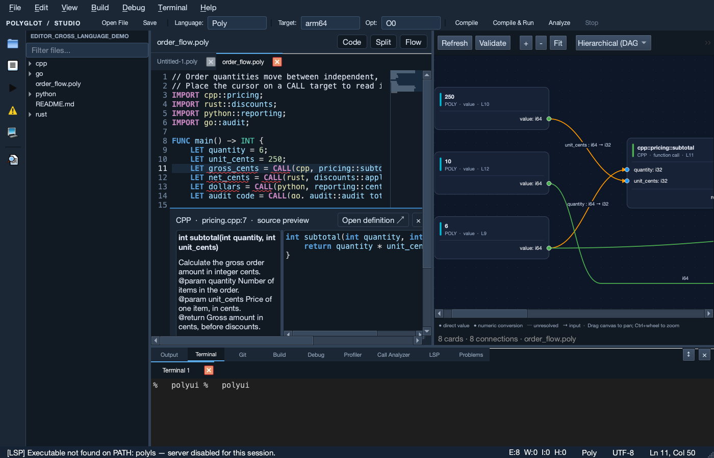
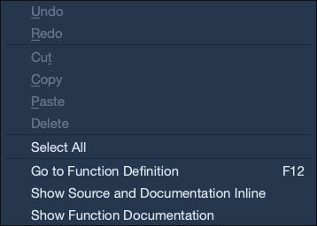
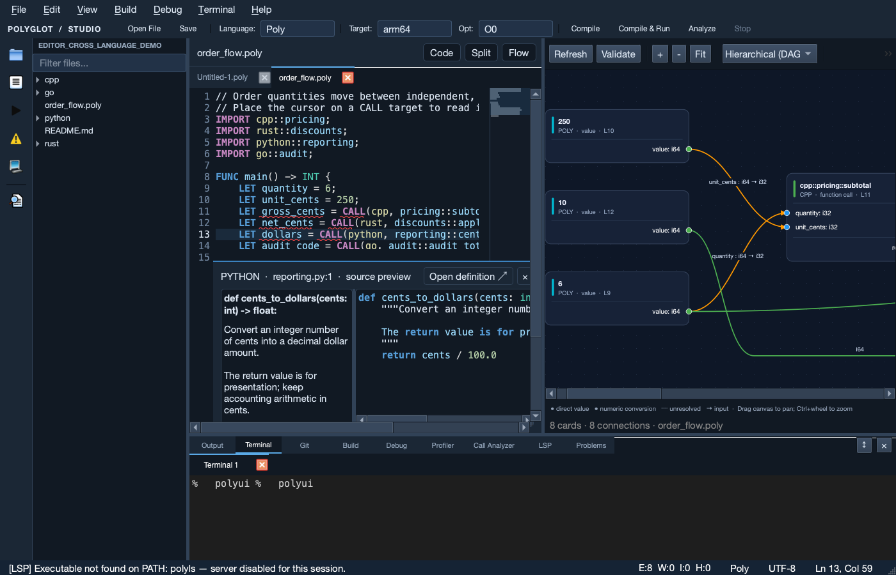

# 跨语言源码、文档与数据流工作区

## 打开与使用

在项目根目录构建 `polyui` 后，macOS 可以用下面的命令打开演示项目：

```sh
cmake --build build-release --target polyui -j 8
build-release/polyui.app/Contents/MacOS/polyui \
  --folder examples/editor_cross_language_demo \
  --file examples/editor_cross_language_demo/order_flow.poly \
  --view split --peek subtotal
```

Windows / Linux 使用对应构建目录中的 `polyui.exe` / `polyui`，启动参数相同。
演示源码把订单数量与单价传给 C++，由 Rust 计算折扣，Python 转换金额单位，
Go 生成审计结果。它用于说明编辑器和图的功能，不作为性能评估工作负载。

## 源码与函数文档

在 Poly 源码中，把光标放到 `CALL(cpp, pricing::subtotal, ...)` 的函数目标上，
编辑器会自动在内部展开外部函数的文档与源码预览。预览包含语言、文件名和定义行号。
文档来自真实源码中的注释或 Python docstring；没有文档的函数会明确提示。

| 操作 | 结果 |
| --- | --- |
| 鼠标停在函数目标上 | 悬浮显示签名、源文档和位置 |
| 右键 → Go to Function Definition | 打开函数所在文件，定位到定义行、列 |
| F12 或 Ctrl+单击 | 跳到同一函数定义 |
| 右键 → Show Source and Documentation Inline | 在当前编辑器内查看源文档与代码 |
| Ctrl+K，随后 F12 | 打开内联源码预览 |
| 预览中的 Open definition ↗ | 打开完整的外部源文件 |
| Escape 或预览右上角 × | 关闭预览 |

预览中的代码是只读的，最多展示 18 行；需要修改时使用 **Open definition ↗**。
存在多个同名定义或重载时，跳转会列出签名、文件与行号，供用户选择。
不会静默跳到第一个候选。

### 模块定位范围

本地文档与跳转不要求安装其他语言的 LSP。当前使用轻量源码索引，支持 Poly
函数声明，以及 C++、Python、Rust、Go、Java、C#、JavaScript、Ruby 中的常见函数声明。
支持 Poly 显式 `CALL(language, module::function, ...)` 和 `LINK language::module::function`
目标处的定位，包括跨行的 `CALL`。

外部源文件按 Poly 文件的目录查找，例如：

```text
order_flow.poly
cpp/pricing.cpp
rust/discounts.rs
python/reporting.py
go/audit.go
```

同目录下的 `pricing.cpp` 等模块文件也可查找。解析遵循语言和模块路径，避免跳到
其他模块中碰巧同名的函数。已经打开的外部文件以编辑器缓冲区为准，关闭文件后
重新从磁盘读取；源码注释里的示例调用与字符串不会被当作真实调用。

这不是完整的语言语义分析器。动态成员派发、宏生成定义、复杂的导入别名以及
所有语言的全部声明形式，仍需要后续语义索引或对应语言服务器支持。

## 工作区布局

源码上方提供三个布局入口：

- **Code**：集中查看和编辑源码。
- **Split**：源码与函数数据流并排显示，适合核对跨语言参数。
- **Flow**：给数据流更宽的空间，并保留源码区域与布局按钮。

左右区域和下方工具区域均可拖动分隔条调整大小。图已移出原先拥挤的底部工具页。
左侧快捷栏提供文件、数据流、构建、问题、终端和设置入口。
底部保留输出、终端、构建、调试等工具页，可以扩大或关闭，需要时再从快捷栏或
View 菜单打开。外观继续遵守已有用户设置；如果以前隐藏了文件栏、工具栏或
状态栏，可在 View 菜单恢复显示。
代码字体由 `editor.fontFamily` / `editor.fontSize` 控制；菜单、工具栏和文档区域
使用界面字体。旧的 Settings → Appearance → Interface Font 偏好仍被保留。

## 阅读函数数据流

图中的函数调用使用有方向的端口连接：输入端口列出参数名和类型，输出端口列出
返回值类型。连线说明哪个值进入了哪个参数，例如 `quantity : i64 → i32`。
类型转换会直接标在连线上，不能确定的关系会保留未知状态。

默认视图保留可读的卡片和文字尺寸。较大的图可拖动画布平移，也可使用滚动条；
需要查看整体关系时使用 **Fit**。Ctrl+鼠标滚轮可以缩放。
选择节点或连线后展开检查器，查看完整属性、参数、类型与诊断。
在较窄的工作区，检查器放在画布下方，避免挤占横向空间。

右键外部函数调用中的 **Go to Definition** 使用与编辑器相同的本地源码解析；
双击可展开的节点可以查看内部图，函数定义使用右键 **Go to Definition**。完整路径放在状态提示中，底部状态栏
只显示图的规模和当前文件名。
更多视图、颜色含义、图导出格式和边界见 [数据流图使用说明](UI_VALUE_FLOW_zh.md)。

## 可重复的界面验证

以下命令运行真正的 Qt 工作区，检查文档、只读源码预览和右键跳转，并保存截图：

```sh
build-release/polyui.app/Contents/MacOS/polyui \
  --headless --ui-smoke \
  --folder examples/editor_cross_language_demo \
  --file examples/editor_cross_language_demo/order_flow.poly \
  --view split --peek subtotal \
  --screenshot /tmp/polyui-workspace.png
```

成功时退出码为 0，并输出 `inlineDocumentation`、`sourcePreview`、
`contextMenuDefinition` 的 JSON 检查结果及实际目标行、列。
另存 `/tmp/polyui-workspace.png.context.png`，展示实际右键菜单。
无窗口验证使用隔离的布局设置，不保存或覆盖用户的工作区布局。

导航模型的回归覆盖八种宿主语言文档、多行调用、注释与字符串排除、模块路径区分、
多定义保留和调用表达式的误识别防护。JavaScript 的括号解析、布尔短路与本地 API
参数规则也有单独的前端回归；它们与界面截图检查属于不同验证层次。

## 实际界面

以下图片来自 Qt 工作区的运行截图，使用上面的演示项目。
左侧是文件列表，中间同时保留 Poly 源码、C++ 原始文档与只读代码，右侧是可平移的数据流图。



右键菜单中的 **Go to Function Definition** 已实际触发，并检查到 `pricing.cpp` 第 7 行第 5 列。



Python 的 docstring 同样直接来自外部源文件，右键定位到 `reporting.py` 第 1 行第 5 列。



截图保留实际诊断状态：演示中的外部 `CALL` 在当前编辑器的严格检查下提示返回类型未知，
需要显式类型映射才能进一步检查；命令行默认 `--check` 将这些情况作为警告。
这与源码文档、定义导航及图中的参数关系检查是不同功能。

## 真实运行追踪

工具栏的 **Trace CALLs** 可记录实际跨语言参数、返回值和耗时。使用步骤、记录范围与静态图的区别见 [运行追踪说明](UI_RUNTIME_TRACE_zh.md)。
