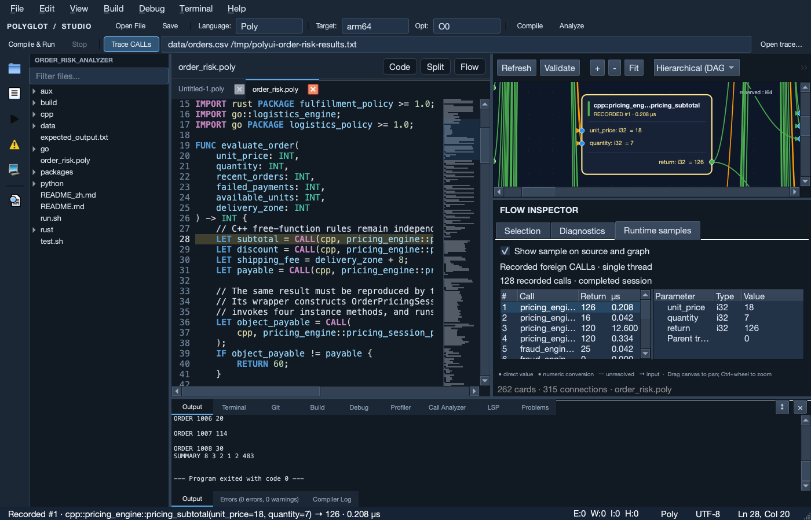

# Inspect real cross-language calls in the UI

The UI now uses the same foreign signature extractor as `polyc`. It reads local foreign sources and vendored PACKAGE manifests, then injects the resolved signatures before Poly semantic analysis. Editor diagnostics, **Compiler types** in inline documentation, and the data-flow graph consume these types. A resolved `CALL` no longer appears to have an unknown return type because analysis ran too early. Missing functions, wrong argument counts, and errors in imported source remain diagnostics.

Native tracing currently supports **ARM64 Poly executables on macOS and Linux**. Static source, documentation, and graph features remain available on other UI platforms; native tracing for Windows and x86 is outside this implementation.

## Run the order-risk example

1. Open the `examples/order_risk_analyzer` folder and `order_risk.poly`.
2. Select the supported native target and enable **Trace CALLs** in the second toolbar.
3. Enter `data/orders.csv /tmp/order-results.txt` in the arguments field. Quoted arguments are supported; relative paths use the source directory.
4. Click **Compile & Run**. The UI passes `--trace-calls=<new session path>` to `polyc`, then starts the actual executable after a successful build.
5. In **Runtime samples**, select a row. The values table shows the recorded arguments, return value, ABI types, and elapsed time. The corresponding source line is highlighted; the matching graph card and its ports show that invocation's values.



This capture comes from an actual execution: eight orders produced 128 foreign calls across 16 uniquely mapped source sites. The selected invocation received `unit_price=18` and `quantity=7`, then returned `126`.

Each row represents one completed invocation. Repeated execution of one source `CALL` produces separate instance IDs. A card labeled `RECORDED #…` shows a captured sample rather than a live or inferred value.

## Recording and display are separate

- **Trace CALLs** controls instrumentation for the next **Compile & Run**. When disabled, the compiler receives no trace flag.
- **Show sample on source and graph** controls the current sample overlay. Disable it to restore static port types while keeping the recorded table.

Each run clears the previous UI session and uses a new temporary directory. UI-generated trace files are removed when the session is replaced or the application closes. To retain a recording, specify a file with the compiler and import it with **Open trace…**. Keep `calls.jsonl.sites.json` beside `calls.jsonl`.

```sh
build-release/polyc examples/order_risk_analyzer/order_risk.poly \
  --arch=arm64 -O0 -o /tmp/order-risk \
  --trace-calls=/tmp/order-risk-calls.jsonl
/tmp/order-risk examples/order_risk_analyzer/data/orders.csv /tmp/order-results.txt
```

## What the values mean

The compiler's `.sites.json` records each original Poly file, line, column, callee, and ABI parameter/return type. Runtime JSONL records the actual ABI bits and start/end clock values. All 64-bit fields are decimal strings, avoiding JSON floating-point precision loss. Raw bits may use signed decimal representation; the reader preserves the same 64-bit pattern. IDs and clocks remain unsigned.

The UI matches cards by file, line, column, and callee. If a site has no unique match, the record remains inspectable without assigning its values to another card.

- Integer decoding respects ABI width and signedness; floats are decoded from their bit patterns.
- Pointers are not dereferenced. Strings, objects, and other pointed-to contents are unavailable; their contents are never inferred from addresses.
- Duration is `(end − start) / frequency`, displayed in microseconds. Instrumentation affects execution time, so these samples are for inspection, not formal uninstrumented performance comparisons.
- Recording covers foreign `CALL` boundaries in one thread. The parent ID refers to the nearest unfinished recorded call. Unrecorded Poly recursion is not represented as a parent invocation.
- Records appear in completion order. A nested child may appear before its parent.
- Missing metadata, invalid JSON, unknown sites, duplicate instances, and unreadable runtime output are reported explicitly. Missing values are never filled with invented samples.
- Inspection limits are 32 MiB of JSONL, 50,000 samples, and 8 MiB of metadata. Exceeding a limit reports an error.
- Static and expanded internal graphs still describe source dependencies. Runtime overlays apply to matching foreign-call cards in the main graph. Editing source does not rerun the program; existing records still describe that execution.

Compiler types use saved foreign sources. An unsaved foreign buffer is marked as needing a save to refresh types, while source previews can still show the open buffer.

## Repeatable UI validation

This command exercises the real Compile & Run action, loads native trace output, verifies source/card/port mapping, and checks that disabling the overlay restores static port labels. The executable must exit with code 0.

```sh
build-release/polyui.app/Contents/MacOS/polyui \
  --headless --ui-trace-smoke \
  --folder examples/order_risk_analyzer \
  --file examples/order_risk_analyzer/order_risk.poly \
  --run-args 'data/orders.csv /tmp/polyui-order-results.txt' \
  --screenshot /tmp/polyui-runtime.png
```

Use the corresponding `polyui` executable on Linux ARM64. Add `--trace-file <existing JSONL>` to validate import and rendering of a recording instead. Its JSON report sets `compiledAndRan` to `false`, distinguishing an import check from a new native execution.

Chinese guides: [runtime tracing](UI_RUNTIME_TRACE_zh.md), [inline documentation and navigation](UI_CROSS_LANGUAGE_WORKSPACE_zh.md), [static value-flow graph](UI_VALUE_FLOW_zh.md).

### Validation recorded on 2026-10-03

- Trace model: 5 test cases and 52 assertions passed, including signed raw bits, floats, wide integers, repeated instances, and malformed records.
- Qt graph and interaction suite: 40 cases and 561 assertions passed, including project signature resolution, same-line call mapping, overlay toggling, and connected edges after layout and dragging.
- Complete UI gate: C++ documentation/navigation, Python documentation/navigation, and the native order-risk trace all passed. The run also exercised program argument paths containing spaces.
- A separate real negative/float recording imported all eight samples and mapped all six sites. Import reports `compiledAndRan=false` and `exitCode=null`; it does not claim to have rerun the process.

Local JSON reports and logs are under `build-release/ui-validation/2026-10-03/`. Use the separate performance evaluation scripts for repeated measurements; a UI screenshot check is not a formal performance experiment.
