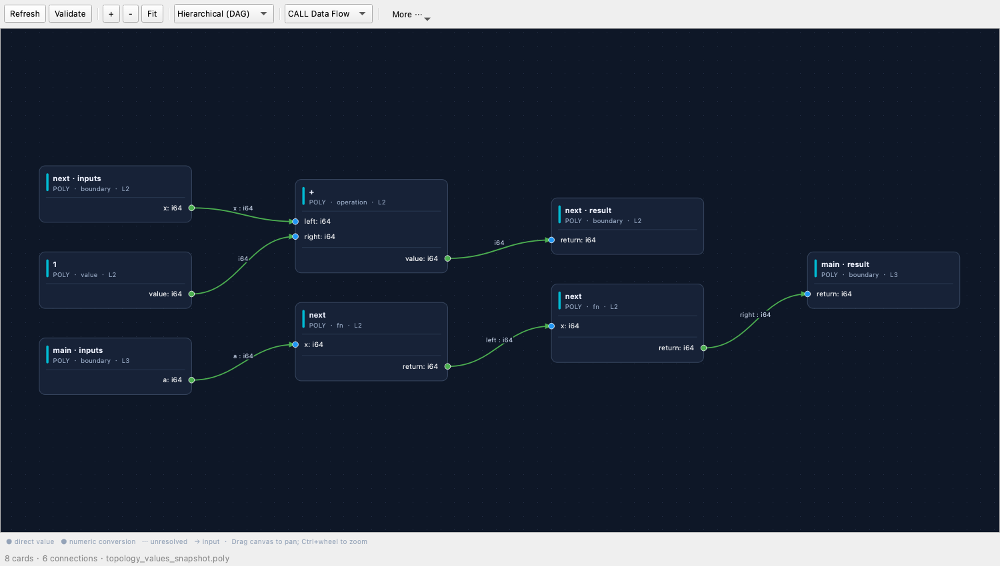
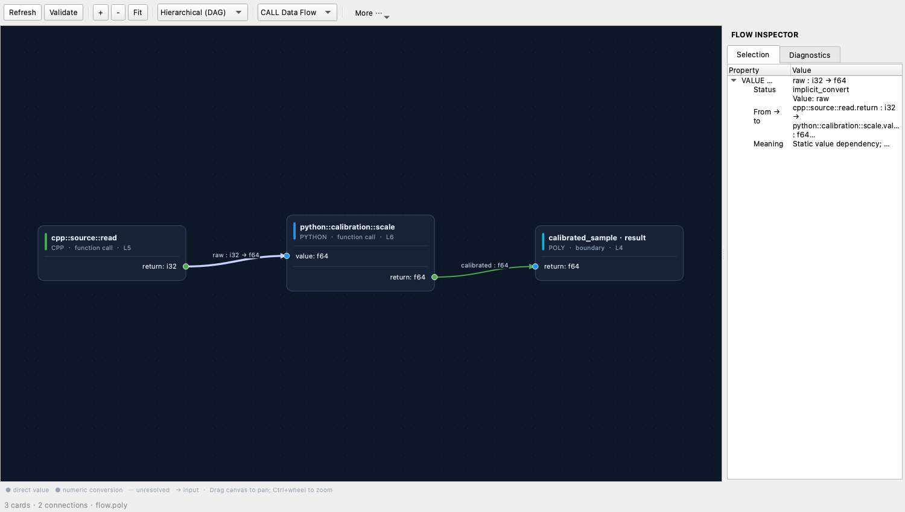
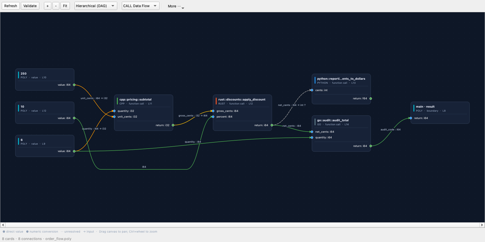

# Poly 值流图：看清输入、返回值和跨语言转换

值流图把一次函数调用画成一张卡片，把参数和返回值画成端口。连线回答的是：**哪个值由谁产生，又送给了哪个参数？** 同一函数在两个位置被调用时，会有两个调用实例，避免把两次计算混成一张卡片。

工作区与源码内联文档的操作见 [跨语言工作区说明](UI_CROSS_LANGUAGE_WORKSPACE_zh.md)。本说明集中介绍图本身，以及它能够证明和不能证明的事情。

## 1. 打开并阅读

1. 打开 `examples/editor_cross_language_demo/order_flow.poly`。
2. 在编辑器上方选择 **Split**，并排查看源码和图；选择 **Flow** 可以扩大图工作区。
3. 图工具栏默认选择 **CALL Data Flow**。从左侧的值或函数输入开始，沿箭头阅读函数调用和最终返回结果。
4. 点击一张卡片或一条线，打开 **FLOW INSPECTOR → Selection**。点击 **Validate** 查看 **Diagnostics**。

卡片标题给出函数或运算名称，次行给出语言、节点类别和调用所在行。左侧蓝色端口是输入参数，右侧绿色端口是输出值；端口写出名称和静态类型。函数边界也有明确方向：函数输入向内部输出值，函数结果接收内部计算结果。

例如连线 `raw : i32 → f64` 的意思是：源码中的 `raw` 由一个 `i32` 输出产生，目标参数要求 `f64`。它没有声称运行时 `raw` 的数值是多少。

图还会显示源码中的常量、基本一元/二元运算、显式 `CONVERT`、函数输入与结果边界。未解析的表达式或标识符保留为明确的未知节点，不凭空连接到一个看似合适的参数。



### 连线状态

| 显示 | 状态字段 | 含义 |
| --- | --- | --- |
| 绿色实线 | `valid` | 当前静态类型兼容，可以直接传递 |
| 黄色实线 | `implicit_convert` | 已知的两端数值类型不同，静态规则允许隐式转换 |
| 橙色实线 | `explicit_convert` | 静态类型规则要求显式转换；结合转换节点和源码检查 |
| 红色实线 | `incompatible` | 当前类型规则判断不兼容 |
| 灰色虚线 | `unknown` | 缺少可靠的类型、签名或映射信息，尚未确认兼容性 |

选中连线后会显示淡紫色高亮。判断关系时同时看端口名称、类型文字、箭头和 inspector；不要只依赖颜色。

## 2. 浏览和定位

- **拖动画布**平移，**Ctrl + 滚轮**缩放；工具栏 **+ / −** 也可以缩放。
- 初次打开优先保持文字可读。大图可能需要横向滚动或拖动；**Fit** 把整张图缩到可见范围。
- 默认 **Hierarchical (DAG)** 按依赖层次排列，用相邻层排序减少交叉。跨过中间函数的长连线会绕开卡片，避免看起来接入了无关函数。
- 选择卡片或连线后显示 inspector；窄工作区在下方显示，较宽工作区在右侧显示。**More ⋯ → Toggle inspector** 可切换它。
- 右键函数卡片选择 **Go to Definition**。外部函数按语言、模块及符号查找真实源码；有多个匹配时由工作区提供选择。本地节点可导航到其源码位置。
- **Refresh** 重新分析当前文件。打开的文件保存变化后，也会触发图刷新。

### 三种图视图

| 菜单 | 查看什么 |
| --- | --- |
| **CALL Data Flow** | 函数调用、表达式、参数和返回值之间的静态值依赖，默认视图 |
| **LINK Bindings** | `LINK` 声明中的函数绑定关系 |
| **PIPELINE Stages** | pipeline 阶段与阶段声明顺序 |

绑定关系、阶段顺序、值传递有不同含义。仅有一条阶段顺序线，不能据此推断前一阶段的返回值一定传给后一阶段。

**More ⋯** 中可以导出 PNG、JSON、DOT，也可以高亮或导出选中节点，并按函数/pipeline、语言或模块分组。**Generate .poly** 不能从当前分析得到的表达式图完整恢复控制流，遇到这类图会明确拒绝生成；应继续编辑原始 Poly 源码。

## 3. 真实外部签名示例

`tests/fixtures/topology/value_conversion/flow.poly` 配套两份独立源码：

- `source.cpp` 的 `int read()` 给出 `return: i32`；
- `calibration.py` 的 `scale(value: float) -> float` 给出 `value: f64` 和 `return: f64`。

图中应看到 `cpp::source::read` 的输出进入 `python::calibration::scale` 的 `value` 输入，连线标为 `raw : i32 → f64`，状态为 `implicit_convert`；`scale` 的输出再进入 `calibrated_sample` 的结果边界。



类型来自外部文件的签名提取。Poly 原生标量 `INT`/`FLOAT` 在图中显示为 `i64`/`f64`；当前 Python 原生标量 lowering 的 `float` 对应 `f64`。这不表示一般 Python 对象模型、任意精度整数或所有语言运行时对象都能按这些标量类型互换。

订单示例中，长距离依赖绕过中间的函数卡片，依然保留所传值的名称和类型：



## 4. 数据格式

### 源码值流：`polyglot.topology.v2`

图的 JSON 导出包含 `schema`、`module`、`source_file`、节点和边数量，以及 `nodes`/`edges`。

| 对象 | 主要字段 | 解释 |
| --- | --- | --- |
| 节点 | `id`, `name`, `display_name`, `language`, `kind` | 内部身份、显示名、语言与节点类别 |
| 节点 | `file`, `line`, `context_node_id`, `description` | 源码位置、所属函数/阶段和描述 |
| 端口 | `id`, `name`, `type`, `index` | 输入/输出端口身份、名称、类型、位置；分别置于 `inputs`/`outputs` |
| 边 | `source_node`, `source_port`, `target_node`, `target_port` | 明确连接哪个输出和哪个输入 |
| 边 | `value`, `status`, `conversion` | 源码值名、校验状态、转换或未知原因 |
| 边 | `relation`, `context_node_id` | 关系类别及所属函数/阶段 |

`kind` 除函数、外部调用、pipeline 等已有类别外，还包括 `boundary`、`value`、`operation` 和 `conversion`。`relation` 分为 `value`、`binding`、`order`。仅对 `value` 边应用值类型兼容性检查。

节点的 `name` 可能带调用实例后缀；界面通过 `display_name` 保持函数名易读。消费者应使用数值 ID 连接节点和端口，不能用显示名合并重复调用。JSON 字符串会转义引号、反斜线和控制字符。

### IR 调用清单：`polyglot.callgraph.v1`

`polyc --emit=call-graph:<path>` 导出的是给定 IR 中的直接调用清单。它与源码值流图的用途不同：

- 直接调用的外部目标也有节点，所有边的端点都能在节点表中找到。
- 每次调用保留独立的 `callsite_id`、基本块、结果名、结果类型及参数列表。
- 节点附带可得的 `signature_known`、`return_type`、`parameters`；缺失信息写为 `unknown`。
- 参数的 `transfer` 是 `identity`、`conversion_required` 或 `unresolved`。`conversion_required` 仅说明所见类型不同，不证明编译器已经插入转换代码。
- 调用路径查询会去除重复邻接点，而导出仍保留各次调用。无法静态确定目标的间接调用不进入该节点图。

字段细节见 [调用图 schema](specs/call_graph_schema_zh.md)。

## 5. 解释边界

这是源码/IR 的静态分析视图。它不显示运行时采样值，不证明某条路径实际执行，也不证明编译或跨语言 ABI 转换已经成功。转换能否实际执行，应以编译诊断和可执行文件的运行测试为依据。

条件分支会保留相应值来源，并用合流节点表达不同分支的候选结果。循环当前只分析条件和循环体内出现的依赖，没有展开迭代，也没有建立完整的循环携带 SSA 关系。因此不要把循环图当作某个确定迭代次数下的最终值计算。

未知外部签名不自动推断为兼容。源文件缺失、重载无法唯一确定或表达式暂不受支持时，应结合 inspector、Diagnostics 和实际源码检查。

## 6. 复现图验证与截图

在已经构建 `test_topology` 和 `test_topology_ui` 的项目根目录运行：

```sh
build-release/test_topology
QT_QPA_PLATFORM=offscreen POLY_TOPOLOGY_SNAPSHOT_DIR=/tmp/poly-topology-snapshots build-release/test_topology_ui
```

截图目录会包含：

- `topology-values.png`：表达式和独立调用实例；
- `topology-foreign-conversion.png`：真实 C++/Python 签名及 `i32 → f64`；
- `topology-order-flow.png`：订单模块之间的参数传递及长连线绕行。

回归测试检查端口方向、重复调用身份、类型状态、可见卡片不重叠、长边不穿过无关卡片，以及选中节点和关联边共同删除后仍能重排和刷新。截图用于人工核对排版与可读性；机器断言不能替代视觉检查。

2026-10-02 的统一 `build-release` 构建后，全量 `test_topology_ui` 实测 **35 个测试用例、474 条断言全部通过**，其中包含 3 条截图保存断言。以上三张图片来自该次运行，已逐张核对端口、转换文字、连线绕行及 Fit 后的可见范围。
