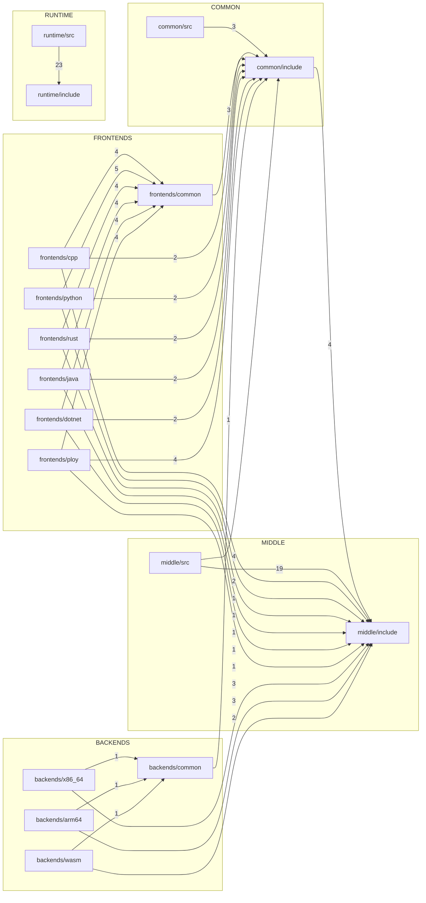
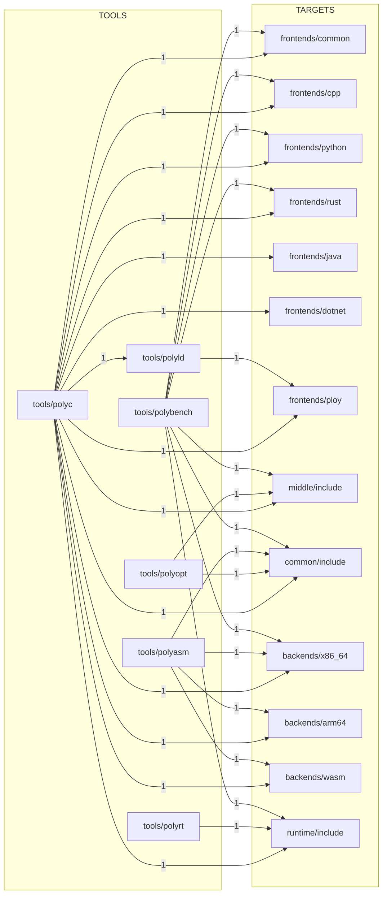
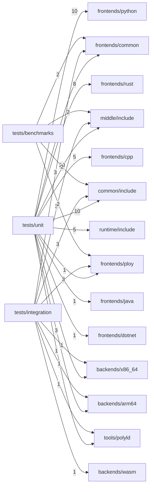

# PolyglotCompiler Namespace Architecture, Interface, and Dependency Analysis (Full Rewrite)

> Document Date: 2026-02-22  
> Analysis Scope: All headers and source files, excluding `build/`, `deps/`, `_deps/`  
> Scan Result: 282 files (157 `.cpp`, 119 `.h`, 6 `.c`)

## 1. Methodology and Scope Rules
1. Collected all C/C++ headers and sources via `rg --files` with the requested exclusion rules.
2. Parsed every `namespace` declaration and counted namespace-to-file occurrences.
3. Parsed every `#include` and built inter-module dependency edges (module inferred from include path prefix).
4. Extracted public interfaces from headers (classes/structs/core free functions) and cross-checked against main `.cpp` implementations.

Notes:
- Dependency edge metrics only count includes that can be mapped to repository module prefixes (e.g. `middle/...`).
- Test code is included in this full scan, but reported separately from production dependency conclusions.

## 2. Codebase Baseline
### 2.1 Top-level directory distribution
| Directory | File Count |
|---|---:|
| `frontends` | 66 |
| `tests` | 63 |
| `middle` | 49 |
| `runtime` | 45 |
| `backends` | 33 |
| `common` | 17 |
| `tools` | 9 |

### 2.2 Second-level module distribution (excerpt)
| Submodule | File Count |
|---|---:|
| `tests/unit` | 45 |
| `middle/include` | 27 |
| `runtime/src` | 23 |
| `runtime/include` | 22 |
| `middle/src` | 22 |
| `common/include` | 14 |
| `frontends/cpp` | 11 |
| `backends/x86_64` | 11 |
| `backends/common` | 11 |

## 3. Namespace Architecture
### 3.1 Primary namespace tree
```text
polyglot
├─ core
├─ utils
├─ debug
├─ frontends
│  ├─ cpp
│  ├─ rust
│  ├─ python
│  ├─ java
│  ├─ dotnet
│  └─ ploy
├─ ir
│  ├─ dialects
│  └─ passes
├─ passes
│  ├─ analysis
│  └─ transform
├─ pgo
├─ lto
├─ backends
│  ├─ x86_64
│  ├─ arm64
│  └─ wasm
├─ runtime
│  ├─ gc
│  ├─ interop
│  └─ services
├─ linker
└─ tools
```

### 3.2 Namespace size by file coverage
| Namespace | Files | Main Locations |
|---|---:|---|
| `<anonymous>` | 70 | Internal helpers in many `.cpp` files |
| `polyglot::ir` | 28 | `common/include/ir`, `middle/include/ir`, `middle/src/ir` |
| `polyglot::runtime::interop` | 14 | `runtime/include/interop`, `runtime/src/interop` |
| `polyglot::passes::transform` | 14 | `middle/include/passes/transform`, `middle/src/passes/optimizations` |
| `polyglot::backends` | 11 | `backends/common` |
| `polyglot::backends::x86_64` | 11 | `backends/x86_64` |
| `polyglot::cpp` | 11 | `frontends/cpp` |
| `polyglot::runtime::gc` | 10 | `runtime/include/gc`, `runtime/src/gc` |
| `polyglot::backends::arm64` | 9 | `backends/arm64` |
| `polyglot::rust` | 9 | `frontends/rust` |
| `polyglot::python` | 9 | `frontends/python` |
| `polyglot::java` | 9 | `frontends/java` |
| `polyglot::dotnet` | 9 | `frontends/dotnet` |
| `polyglot::ploy` | 9 | `frontends/ploy` |
| `polyglot::frontends` | 8 | `frontends/common` |
| `polyglot::runtime::services` | 6 | `runtime/include/services`, `runtime/src/services` |
| `polyglot::core` | 6 | `common/include/core`, `common/src/core` |
| `polyglot::utils` | 4 | `common/include/utils` |
| `polyglot::linker` | 4 | `tools/polyld/include`, `tools/polyld/src` |
| `polyglot::debug` | 3 | `common/include/debug`, `common/src/debug` |
| `polyglot::passes` | 3 | `middle/include/passes`, `middle/src/passes` |
| `polyglot::ir::dialects` | 3 | `middle/include/ir/dialects` |
| `polyglot::tools` | 3 | `tools/polyasm`, `tools/polyopt`, `tools/polyrt` |
| `polyglot::ir::passes` | 2 | `middle/include/ir/passes`, `middle/src/ir/passes` |
| `polyglot::passes::analysis` | 2 | `middle/include/passes/analysis` |
| `polyglot::lto` | 2 | `middle/include/lto`, `middle/src/lto` |
| `polyglot::pgo` | 2 | `middle/include/pgo`, `middle/src/pgo` |
| `polyglot::backends::wasm` | 2 | `backends/wasm` |

### 3.3 Special namespaces and boundary cases
| Namespace | Files | Notes |
|---|---:|---|
| `dwarf` | 1 | DWARF constants sub-namespace in `common/include/debug/dwarf5.h` |
| `macho` | 1 | Mach-O constants/structs in `tools/polyld/src/linker.cpp` |
| `std` | 1 | `std::hash` specialization in `middle/include/ir/template_instantiator.h` |
| `MyApp`, `ns` | 1 each | Test-only namespaces; not part of production architecture |

## 4. Interface Analysis by Subsystem
### 4.1 `common`: language-agnostic foundations
| Domain | Key Interfaces |
|---|---|
| `polyglot::core` | `Type`, `TypeSystem`, `TypeUnifier`, `TypeRegistry`, `SymbolTable`, `Config`, `SourceLoc` |
| `polyglot::utils` | `Arena`, `StringPool`, `Logger`, `HashCombine` |
| `polyglot::debug`/`dwarf` | `DwarfBuilder`, `DebugInfoGenerator`, `DebugInfoBuilder`, `DebugInfoValidator`, `DebugInfoPrinter` |
| `polyglot::ir` (public entry) | `IRBuilder`, `ParseModule/ParseFunction`, `PrintModule/PrintFunction` |

Key observation:
- `common/include/ir/*` directly depends on `middle/include/ir/*`, creating a `common <-> middle` dependency cycle.

### 4.2 `frontends`: language frontends and shared base
| Namespace | Key Interfaces |
|---|---|
| `polyglot::frontends` | `Token`, `LexerBase`, `ParserBase`, `Diagnostics`, `Preprocessor`, `SemaContext`, `TokenPool` |
| `polyglot::cpp` | `CppLexer`, `CppParser`, `AnalyzeModule`, `LowerToIR`, `ConstexprEvaluator` |
| `polyglot::rust` | `RustLexer`, `RustParser`, `AnalyzeModule`, `LowerToIR` |
| `polyglot::python` | `PythonLexer`, `PythonParser`, `AnalyzeModule`, `LowerToIR` |
| `polyglot::java` | `JavaLexer`, `JavaParser`, `AnalyzeModule`, `LowerToIR` |
| `polyglot::dotnet` | `DotnetLexer`, `DotnetParser`, `AnalyzeModule`, `LowerToIR` |
| `polyglot::ploy` | `PloyLexer`, `PloyParser`, `PloySema`, `PloyLowering`, `LinkEntry`, `CrossLangCallDescriptor` |

Key observations:
- Frontends follow a consistent structure: `Lexer -> Parser -> Sema -> LowerToIR`.
- `.ploy` frontend additionally emits cross-language link descriptors consumed by `polyld`.

### 4.3 `middle`: IR, optimization, PGO/LTO
| Namespace | Key Interfaces |
|---|---|
| `polyglot::ir` | `IRContext`, `BasicBlock/Function`, `BuildCFG`, `ComputeDominators`, `ConvertToSSA`, `Verify`, `TemplateInstantiator`, `ClassMetadata` |
| `polyglot::ir::passes` | `ConstantFold`, `DeadCodeEliminate`, `CopyProp`, `CanonicalizeCFG`, `Mem2Reg`, `RunDefaultOptimizations` |
| `polyglot::passes::analysis` | `AliasAnalysisResult`, `DominanceInfo` |
| `polyglot::passes::transform` | `RunConstantFold`, `RunDeadCodeElimination`, `RunCommonSubexpressionElimination`, `RunInlining`, `GVNPass/PREPass`, loop optimization family, `advanced_optimizations` |
| `polyglot::passes` | `DevirtualizationPass`, `PassManager` (implemented in `middle/src/passes/pass_manager.cpp`) |
| `polyglot::pgo` | `ProfileData`, `RuntimeProfiler`, `PGOOptimizer`, `ProfileInstrumentation`, `PGOWorkflow` |
| `polyglot::lto` | `LTOModule`, `LTOContext`, `CrossModuleInliner`, `GlobalOptimizer`, `LTOLinker`, `ThinLTOCodeGenerator` |

Key observation:
- The middle layer contains both a baseline optimization pipeline (`ir::passes`) and advanced PGO/LTO capabilities, with clear ownership but distributed integration paths.

### 4.4 `backends`: multi-target code generation
| Namespace | Key Interfaces |
|---|---|
| `polyglot::backends` | `TargetMachine`, `ObjectFileBuilder`/`ELFBuilder`/`MachOBuilder`, `DebugInfoBuilder`, `DebugEmitter`, `DwarfBuilder` |
| `polyglot::backends::x86_64` | `X86Target`, `MachineFunction`, `SelectInstructions`, `ScheduleFunction`, linear-scan/graph-coloring register allocation, `InstructionScheduler`, micro-arch optimization family |
| `polyglot::backends::arm64` | `Arm64Target`, `MachineFunction`, `SelectInstructions`, `ScheduleFunction`, linear-scan/graph-coloring register allocation |
| `polyglot::backends::wasm` | `WasmTarget`, `EmitWasmBinary`, WASM section lowering |

Key observation:
- x86_64 and arm64 share similar machine-IR shape; wasm follows a separate binary module assembly path.

### 4.5 `runtime`: GC, interop, and services
| Namespace/Domain | Key Interfaces |
|---|---|
| `polyglot::runtime::gc` | `GC` abstraction, `Heap`, `RootHandle`, `MakeGC`, `GlobalHeap` |
| `polyglot::runtime::interop` | `ForeignSignature`, `ValidateSignature`, `TypeMapping`, `Marshalling`, `ForeignObject`, `FFIRegistry`, `DynamicLibrary`, container conversion APIs |
| `polyglot::runtime::services` | `RuntimeError`, `ThrowRuntimeError`, `ReflectionRegistry`, `ThreadPool`, `TaskScheduler`, `Future/Promise`, lock-free structures |
| C ABI (non-namespaced) | `extern "C"` APIs in `runtime/include/libs/*.h` and selected interop headers, e.g. `polyglot_alloc`, `polyglot_gc_collect`, `polyglot_python_strdup_gc` |

Key observation:
- Runtime exposes both C++ namespaced APIs and global C ABI entry points; the split is clear in code but should be documented as separate interface layers.

### 4.6 `tools`: toolchain orchestration layer
| Component | Namespace | Role |
|---|---|---|
| `tools/polyc/src/driver.cpp` | mostly anonymous namespace | Unified compiler driver: frontend selection, SSA/verification, optimization, backend emission, object writing, `polyld` invocation |
| `tools/polyld` | `polyglot::linker` | ELF/Mach-O/COFF/archive loading, symbol resolution, relocation, output generation, cross-language glue stubs |
| `tools/polyasm` | `polyglot::tools` | Assembles IR to object formats (ELF/COFF/Mach-O/POBJ) |
| `tools/polyopt` | `polyglot::tools` | Standalone IR optimizer entrypoint |
| `tools/polyrt` | `polyglot::tools` | Runtime status/GC/thread diagnostics and benchmarking entrypoint |
| `tools/polybench` | file-local classes | Compilation/runtime benchmark suite |

## 5. Dependency Analysis (Include Graph)
### 5.1 Production module edges (counted by files containing each edge)
| Edge | Files |
|---|---:|
| `frontends -> frontends` | 56 |
| `middle -> middle` | 40 |
| `runtime -> runtime` | 30 |
| `backends -> backends` | 25 |
| `frontends -> common` | 17 |
| `backends -> middle` | 8 |
| `frontends -> middle` | 7 |
| `common -> common` | 5 |
| `middle -> common` | 4 |
| `common -> middle` | 4 |
| `tools -> common` | 4 |
| `tools -> tools` | 4 |
| `tools -> frontends` | 3 |
| `tools -> middle` | 3 |
| `tools -> backends` | 3 |
| `tools -> runtime` | 3 |
| `backends -> common` | 1 |

### 5.2 Full-scan test coupling (including `tests`)
| Edge | Files |
|---|---:|
| `tests -> frontends` | 32 |
| `tests -> middle` | 25 |
| `tests -> common` | 15 |
| `tests -> backends` | 6 |
| `tests -> runtime` | 5 |
| `tests -> tools` | 2 |

### 5.3 Layer relation diagram (production code)
```text
           +----------------------+
           |        tools         |
           |  (orchestration)     |
           +----------+-----------+
                      |
      +---------------+----------------+
      |               |                |
+-----v------+  +-----v------+  +------v------+
| frontends  |  |  middle    |  |  backends   |
+-----+------+  +-----+------+  +------+------+ 
      |               ^                |
      |               |                |
+-----v---------------+----------------v------+
|                   common                    |
+---------------------------------------------+

+---------------------------------------------+
|                   runtime                   |
| mostly self-contained; consumed by tools    |
+---------------------------------------------+
```

### 5.4 Detailed submodule dependency graph (production, UEDGE)
> Metric: edge labels are UEDGE (number of files containing that dependency edge); only cross-submodule edges are shown here.



Intra-submodule self-dependencies (not shown above):
| Self Edge | UEDGE |
|---|---:|
| `middle/include -> middle/include` | 21 |
| `runtime/include -> runtime/include` | 7 |
| `common/include -> common/include` | 2 |
| `frontends/common -> frontends/common` | 6 |
| `frontends/cpp -> frontends/cpp` | 9 |
| `frontends/python -> frontends/python` | 7 |
| `frontends/rust -> frontends/rust` | 7 |
| `frontends/java -> frontends/java` | 7 |
| `frontends/dotnet -> frontends/dotnet` | 7 |
| `frontends/ploy -> frontends/ploy` | 7 |
| `backends/common -> backends/common` | 5 |
| `backends/x86_64 -> backends/x86_64` | 10 |
| `backends/arm64 -> backends/arm64` | 8 |

### 5.5 Detailed tooling dependency graph (production, UEDGE)


### 5.6 Test coupling graph (full scan, UEDGE)


Key conclusions:
1. `common <-> middle` is a real cycle (`common/include/ir/*` references `middle/include/ir/*`, while `middle` includes `common/include/*`).
2. `tools` is the cross-layer aggregator, especially via `polyc` and `polyld`.
3. `frontends -> middle` directly encodes the current “lower directly into IRContext” architecture.
4. `runtime` is largely isolated at include level and mainly consumed by tools/final artifacts.

## 6. Appendix: Full Namespace Counts
> Metric: number of files declaring each namespace.

| Namespace | Files |
|---|---:|
| `<anonymous>` | 70 |
| `polyglot::ir` | 28 |
| `polyglot::runtime::interop` | 14 |
| `polyglot::passes::transform` | 14 |
| `polyglot::cpp` | 11 |
| `polyglot::backends` | 11 |
| `polyglot::backends::x86_64` | 11 |
| `polyglot::runtime::gc` | 10 |
| `polyglot::backends::arm64` | 9 |
| `polyglot::rust` | 9 |
| `polyglot::dotnet` | 9 |
| `polyglot::python` | 9 |
| `polyglot::ploy` | 9 |
| `polyglot::java` | 9 |
| `polyglot::frontends` | 8 |
| `polyglot::runtime::services` | 6 |
| `polyglot::core` | 6 |
| `polyglot::linker` | 4 |
| `polyglot::utils` | 4 |
| `polyglot::passes` | 3 |
| `polyglot::ir::dialects` | 3 |
| `polyglot::tools` | 3 |
| `polyglot::debug` | 3 |
| `polyglot::ir::passes` | 2 |
| `polyglot::backends::wasm` | 2 |
| `polyglot::passes::analysis` | 2 |
| `polyglot::lto` | 2 |
| `polyglot::pgo` | 2 |
| `macho` | 1 |
| `dwarf` | 1 |
| `MyApp` | 1 |
| `ns` | 1 |
| `std` | 1 |
