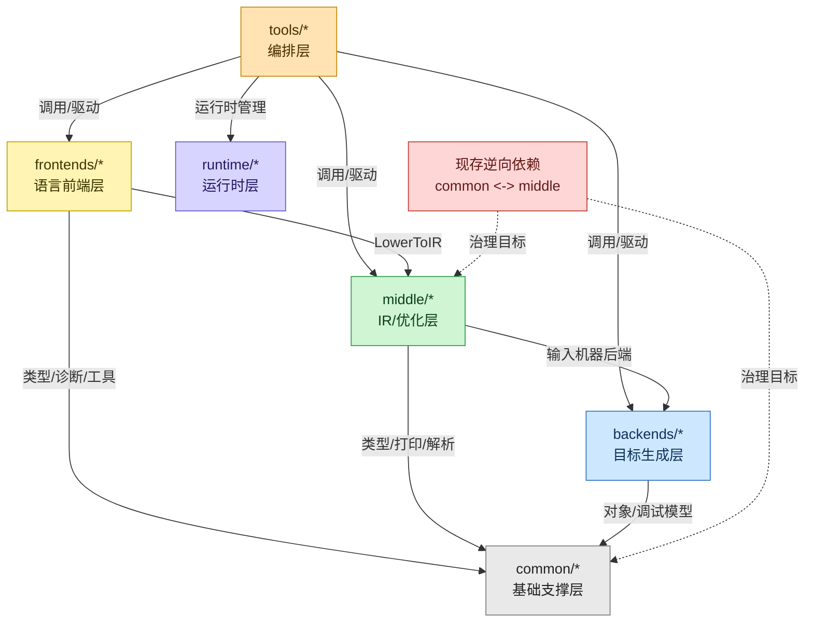
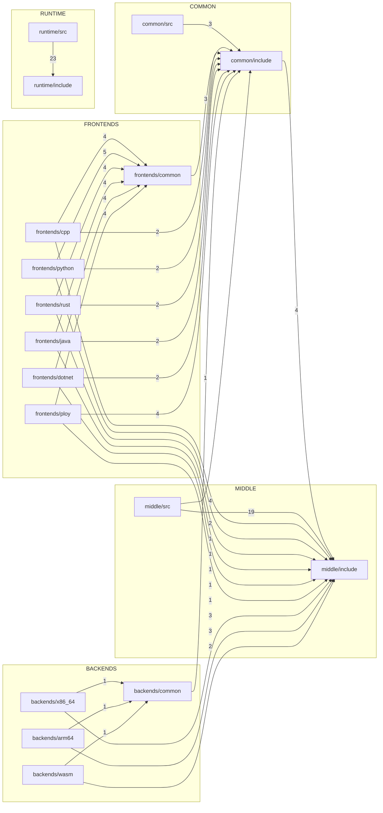
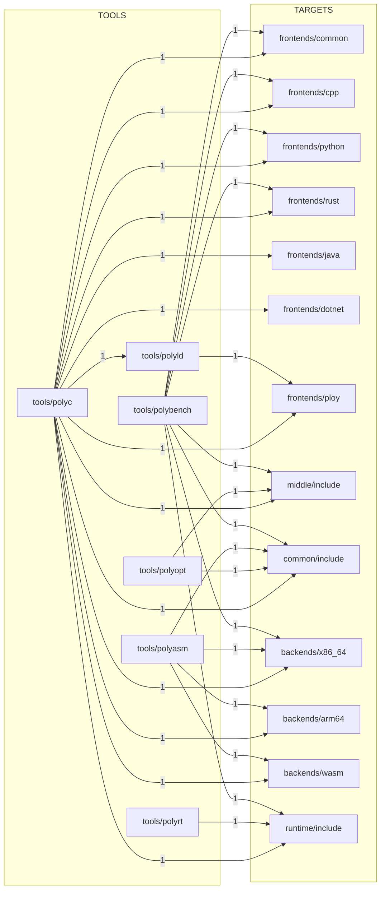
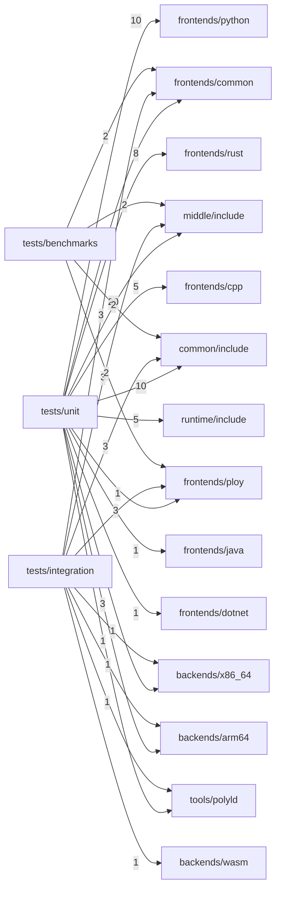

# PolyglotCompiler 命名空间架构、接口与依赖分析（全量重构）

> 文档日期：2026-02-22  
> 分析范围：全仓库头文件与源文件（排除 `build/`、`deps/`、`_deps/`）  
> 扫描结果：282 个文件（157 `.cpp`、119 `.h`、6 `.c`）

## 1. 代码基线概览
### 1.1 文件分布
| 目录 | 文件数 |
|---|---:|
| `frontends` | 66 |
| `tests` | 63 |
| `middle` | 49 |
| `runtime` | 45 |
| `backends` | 33 |
| `common` | 17 |
| `tools` | 9 |

### 1.2 二级模块分布（Top）
| 子模块 | 文件数 |
|---|---:|
| `tests/unit` | 45 |
| `middle/include` | 27 |
| `runtime/src` | 23 |
| `runtime/include` | 22 |
| `middle/src` | 22 |
| `common/include` | 14 |
| `tests/samples` | 13 |
| `frontends/cpp` | 11 |
| `backends/common` | 11 |
| `backends/x86_64` | 11 |

### 1.3 分析对象边界
- 生产代码主域：`common`、`frontends`、`middle`、`backends`、`runtime`、`tools`。
- 测试代码单独建图：`tests/unit`、`tests/integration`、`tests/benchmarks`。
- 依赖统计口径：使用 include 路径前缀识别模块，边权使用 UEDGE（包含该依赖边的文件数）。

## 2. 命名空间架构
### 2.1 主干命名空间树
```text
polyglot
├─ core / utils / debug
├─ frontends
│  ├─ cpp / rust / python / java / dotnet / ploy
├─ ir
│  ├─ dialects
│  └─ passes
├─ passes
│  ├─ analysis
│  └─ transform
├─ pgo / lto
├─ backends
│  ├─ x86_64 / arm64 / wasm
├─ runtime
│  ├─ gc / interop / services
├─ linker
└─ tools
```

### 2.2 命名空间规模（按出现文件数）
| 命名空间 | 文件数 | 主要路径 |
|---|---:|---|
| `<anonymous>` | 70 | 多数 `.cpp` 实现内部 |
| `polyglot::ir` | 28 | `common/include/ir`、`middle/include/ir`、`middle/src/ir` |
| `polyglot::runtime::interop` | 14 | `runtime/include/interop`、`runtime/src/interop` |
| `polyglot::passes::transform` | 14 | `middle/include/passes/transform`、`middle/src/passes/optimizations` |
| `polyglot::backends` | 11 | `backends/common` |
| `polyglot::backends::x86_64` | 11 | `backends/x86_64` |
| `polyglot::cpp` | 11 | `frontends/cpp` |
| `polyglot::runtime::gc` | 10 | `runtime/include/gc`、`runtime/src/gc` |
| `polyglot::backends::arm64` | 9 | `backends/arm64` |
| `polyglot::rust` | 9 | `frontends/rust` |
| `polyglot::python` | 9 | `frontends/python` |
| `polyglot::java` | 9 | `frontends/java` |
| `polyglot::dotnet` | 9 | `frontends/dotnet` |
| `polyglot::ploy` | 9 | `frontends/ploy` |
| `polyglot::frontends` | 8 | `frontends/common` |
| `polyglot::runtime::services` | 6 | `runtime/include/services`、`runtime/src/services` |
| `polyglot::core` | 6 | `common/include/core`、`common/src/core` |

### 2.3 命名空间到目录映射（细化）
| 命名空间 | 头文件主入口 | 关键实现文件 |
|---|---|---|
| `polyglot::frontends` | `frontends/common/include/*.h` | `frontends/common/src/preprocessor.cpp` |
| `polyglot::cpp` | `frontends/cpp/include/*.h` | `frontends/cpp/src/{lexer,parser,sema,lowering}/*.cpp` |
| `polyglot::rust` | `frontends/rust/include/*.h` | `frontends/rust/src/{lexer,parser,sema,lowering}/*.cpp` |
| `polyglot::ir` | `middle/include/ir/*.h` | `middle/src/ir/*.cpp` |
| `polyglot::passes::transform` | `middle/include/passes/transform/*.h` | `middle/src/passes/optimizations/*.cpp` |
| `polyglot::backends::x86_64` | `backends/x86_64/include/*.h` | `backends/x86_64/src/{isel,regalloc,asm_printer}/*.cpp` |
| `polyglot::runtime::interop` | `runtime/include/interop/*.h` | `runtime/src/interop/*.cpp` |
| `polyglot::linker` | `tools/polyld/include/*.h` | `tools/polyld/src/{linker,polyglot_linker}.cpp` |

### 2.4 特殊命名空间
| 命名空间 | 说明 |
|---|---|
| `dwarf` | `common/include/debug/dwarf5.h` 内部 DWARF 常量子空间 |
| `macho` | `tools/polyld/src/linker.cpp` 的 Mach-O 局部命名空间 |
| `std` | `middle/include/ir/template_instantiator.h` 中 `std::hash` 特化 |
| `MyApp`、`ns` | 仅测试代码命名空间，不属于生产架构 |

## 3. 接口分析（细化）
### 3.1 `common`（基础层）
| 逻辑域 | 关键接口 | 关键文件 |
|---|---|---|
| `core` | `Type`、`TypeSystem`、`TypeUnifier`、`TypeRegistry`、`SymbolTable` | `common/include/core/types.h`、`common/include/core/symbols.h` |
| `utils` | `Arena`、`StringPool`、`Logger` | `common/include/utils/*.h` |
| `debug` | `DwarfBuilder`、`DebugInfoGenerator`、`DebugInfoBuilder` | `common/include/debug/*.h`、`common/src/debug/dwarf5.cpp` |
| 公共 IR 入口 | `IRBuilder`、`ParseModule`、`PrintModule` | `common/include/ir/*.h` |

### 3.2 `frontends`（语言层）
| 语言 | 统一接口模式 | 主要入口文件 |
|---|---|---|
| C++ | `Lexer -> Parser -> AnalyzeModule -> LowerToIR` | `frontends/cpp/include/*.h`、`frontends/cpp/src/*/*.cpp` |
| Rust | `Lexer -> Parser -> AnalyzeModule -> LowerToIR` | `frontends/rust/include/*.h`、`frontends/rust/src/*/*.cpp` |
| Python | `Lexer -> Parser -> AnalyzeModule -> LowerToIR` | `frontends/python/include/*.h`、`frontends/python/src/*/*.cpp` |
| Java | `Lexer -> Parser -> AnalyzeModule -> LowerToIR` | `frontends/java/include/*.h`、`frontends/java/src/*/*.cpp` |
| Dotnet | `Lexer -> Parser -> AnalyzeModule -> LowerToIR` | `frontends/dotnet/include/*.h`、`frontends/dotnet/src/*/*.cpp` |
| Ploy | `Lexer -> Parser -> PloySema -> PloyLowering` | `frontends/ploy/include/*.h`、`frontends/ploy/src/*/*.cpp` |

Ploy 独有职责：
- 生成跨语言链接描述（`LinkEntry`、`CrossLangCallDescriptor`），供 `tools/polyld` 的 `PolyglotLinker` 消费。

### 3.3 `middle`（IR/优化层）
| 子域 | 关键接口 | 实现入口 |
|---|---|---|
| IR Core | `IRContext`、`BuildCFG`、`ComputeDominators`、`ConvertToSSA`、`Verify` | `middle/src/ir/{ir_context,cfg,ssa,verifier}.cpp` |
| IR Passes | `ConstantFold`、`DeadCodeEliminate`、`CanonicalizeCFG`、`Mem2Reg` | `middle/src/ir/passes/opt.cpp` |
| Transform Passes | `RunConstantFold`、`RunDeadCodeElimination`、`RunInlining`、`GVNPass`、循环优化族 | `middle/src/passes/optimizations/*.cpp` |
| 高级能力 | `ProfileData`/`PGOOptimizer`、`LTOModule`/`LTOContext` | `middle/src/pgo/profile_data.cpp`、`middle/src/lto/link_time_optimizer.cpp` |

### 3.4 `backends`（目标层）
| 目标 | 关键接口 | 关键实现 |
|---|---|---|
| x86_64 | `X86Target`、`SelectInstructions`、`ScheduleFunction`、`LinearScan/GraphColoring` | `backends/x86_64/src/{isel,regalloc,asm_printer}/*.cpp` |
| arm64 | `Arm64Target`、`SelectInstructions`、`ScheduleFunction`、`LinearScan/GraphColoring` | `backends/arm64/src/{isel,regalloc,asm_printer}/*.cpp` |
| wasm | `WasmTarget`、`EmitWasmBinary` | `backends/wasm/src/wasm_target.cpp` |
| 公共后端 | `TargetMachine`、`ObjectFileBuilder`、`DebugEmitter` | `backends/common/include/*.h`、`backends/common/src/*.cpp` |

### 3.5 `runtime`（运行时层）
| 子域 | 关键接口 | 关键实现 |
|---|---|---|
| GC | `GC`、`Heap`、`RootHandle`、`MakeGC`、`GlobalHeap` | `runtime/src/gc/*.cpp` |
| Interop | `FFIRegistry`、`DynamicLibrary`、`TypeMapping`、`Marshalling`、容器互转 API | `runtime/src/interop/*.cpp` |
| Services | `ThreadPool`、`TaskScheduler`、`Future/Promise`、`ReflectionRegistry` | `runtime/src/services/*.cpp` |
| C ABI | `polyglot_alloc`、`polyglot_gc_collect` 等 | `runtime/include/libs/*.h`、`runtime/src/libs/*` |

### 3.6 `tools`（编排层）
| 组件 | 关键职责 | 关键文件 |
|---|---|---|
| `polyc` | 端到端编译驱动（前端->IR->优化->后端->对象/链接） | `tools/polyc/src/driver.cpp` |
| `polyld` | 目标文件装载、符号解析、重定位、跨语言 glue stub | `tools/polyld/src/{linker,polyglot_linker}.cpp` |
| `polyasm` | IR 到对象文件的汇编装配 | `tools/polyasm/src/assembler.cpp` |
| `polyopt` | 独立 IR 优化入口 | `tools/polyopt/src/optimizer.cpp` |
| `polyrt` | 运行时管理与诊断 | `tools/polyrt/src/polyrt.cpp` |
| `polybench` | 编译与运行时基准 | `tools/polybench/src/benchmark_suite.cpp` |

### 3.7 关键调用链（代码路径级）
```text
polyc(driver.cpp)
  -> frontends/* (lexer/parser/sema/lowering)
  -> middle (SSA + verifier + passes)
  -> backends/* (x86_64/arm64/wasm emit)
  -> object emit + optional polyld

polyld(linker.cpp)
  -> Load{ELF/MachO/COFF/Archive}
  -> ResolveSymbols + ApplyRelocations
  -> Generate{ELF/MachO/Relocatable/StaticLib}
  -> (optional) PolyglotLinker glue stubs
```

## 4. 依赖分析（include 图 + 调用方向）
### 4.1 生产模块依赖边（UEDGE）
| 依赖边 | 文件数 |
|---|---:|
| `frontends -> frontends` | 56 |
| `middle -> middle` | 40 |
| `runtime -> runtime` | 30 |
| `backends -> backends` | 25 |
| `frontends -> common` | 17 |
| `backends -> middle` | 8 |
| `frontends -> middle` | 7 |
| `common -> common` | 5 |
| `middle -> common` | 4 |
| `common -> middle` | 4 |
| `tools -> common` | 4 |
| `tools -> tools` | 4 |
| `tools -> frontends` | 3 |
| `tools -> middle` | 3 |
| `tools -> backends` | 3 |
| `tools -> runtime` | 3 |
| `backends -> common` | 1 |

### 4.2 测试耦合边（UEDGE）
| 依赖边 | 文件数 |
|---|---:|
| `tests -> frontends` | 32 |
| `tests -> middle` | 25 |
| `tests -> common` | 15 |
| `tests -> backends` | 6 |
| `tests -> runtime` | 5 |
| `tests -> tools` | 2 |

### 4.3 按调用方向分层上色总图（生产代码）



### 4.4 二级模块详细依赖图（生产代码，UEDGE）
> 口径：边权为 UEDGE；仅展示跨子模块边，不展示同子模块自依赖。



模块内自依赖（未绘制于上图）：
| 自依赖边 | UEDGE |
|---|---:|
| `middle/include -> middle/include` | 21 |
| `runtime/include -> runtime/include` | 7 |
| `common/include -> common/include` | 2 |
| `frontends/common -> frontends/common` | 6 |
| `frontends/cpp -> frontends/cpp` | 9 |
| `frontends/python -> frontends/python` | 7 |
| `frontends/rust -> frontends/rust` | 7 |
| `frontends/java -> frontends/java` | 7 |
| `frontends/dotnet -> frontends/dotnet` | 7 |
| `frontends/ploy -> frontends/ploy` | 7 |
| `backends/common -> backends/common` | 5 |
| `backends/x86_64 -> backends/x86_64` | 10 |
| `backends/arm64 -> backends/arm64` | 8 |

### 4.5 工具层详细依赖图（生产代码，UEDGE）


### 4.6 测试耦合图（全量扫描，UEDGE）


### 4.7 依赖热点排行（细化）
| 热点边 | UEDGE | 说明 |
|---|---:|---|
| `runtime/src -> runtime/include` | 23 | 运行时实现对公共 API 头强耦合 |
| `middle/include -> middle/include` | 21 | 中间层头文件相互包含密集 |
| `middle/src -> middle/include` | 19 | 实现层对接口层集中依赖 |
| `frontends/common -> common/include` | 3 | 前端基础能力依赖核心类型/位置信息 |
| `common/include -> middle/include` | 4 | `common <-> middle` 循环依赖的核心边 |

### 4.8 结论与治理优先级
1. **优先级 P0：打断 `common <-> middle` 循环依赖**  
   先拆 `common/include/ir/*` 对 `middle/include/ir/*` 的直接引用，建立 `ir_api` 抽象层或将 IR 公共入口统一下沉到 `middle`。
2. **优先级 P1：控制 `middle/include` 头文件互相包含**  
   通过前置声明、分层头文件（`ir/core`、`ir/analysis`、`ir/passes`）降低编译耦合。
3. **优先级 P1：工具层依赖收敛**  
   为 `tools/polyc`、`tools/polybench` 增加 facade 接口，避免持续扩大横向 include 面。
4. **优先级 P2：测试边界治理**  
   将 `tests/unit` 对多子系统直连改为 fixture/API 门面，减轻变更扩散。

## 5. 附录：命名空间完整计数
> 统计口径：按“声明该命名空间的文件数”计数。

| 命名空间 | 文件数 |
|---|---:|
| `<anonymous>` | 70 |
| `polyglot::ir` | 28 |
| `polyglot::runtime::interop` | 14 |
| `polyglot::passes::transform` | 14 |
| `polyglot::cpp` | 11 |
| `polyglot::backends` | 11 |
| `polyglot::backends::x86_64` | 11 |
| `polyglot::runtime::gc` | 10 |
| `polyglot::backends::arm64` | 9 |
| `polyglot::rust` | 9 |
| `polyglot::dotnet` | 9 |
| `polyglot::python` | 9 |
| `polyglot::ploy` | 9 |
| `polyglot::java` | 9 |
| `polyglot::frontends` | 8 |
| `polyglot::runtime::services` | 6 |
| `polyglot::core` | 6 |
| `polyglot::linker` | 4 |
| `polyglot::utils` | 4 |
| `polyglot::passes` | 3 |
| `polyglot::ir::dialects` | 3 |
| `polyglot::tools` | 3 |
| `polyglot::debug` | 3 |
| `polyglot::ir::passes` | 2 |
| `polyglot::backends::wasm` | 2 |
| `polyglot::passes::analysis` | 2 |
| `polyglot::lto` | 2 |
| `polyglot::pgo` | 2 |
| `macho` | 1 |
| `dwarf` | 1 |
| `MyApp` | 1 |
| `ns` | 1 |
| `std` | 1 |
