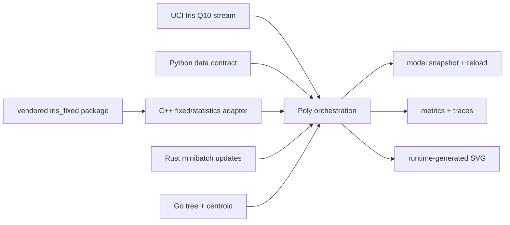

# Iris Native ML

This is a real, deterministic, cross-language machine-learning project built
and linked entirely by PolyglotCompiler. The Poly entry point streams 150 Iris
records, trains three models, runs two statistical tests, persists and reloads
the model, evaluates a stratified holdout, and writes both CSV metrics and a
self-contained SVG dashboard.

No system C/C++ compiler, CPython runtime, Rust toolchain, Cargo, Go toolchain,
package manager, Graphviz, or libc file API is used by the build or executable.
`run.sh` gives `polyc` an empty `PATH`, selects `--no-package-index`, and passes
the repository's `polyld` explicitly.

## What is trained

| Model/test | Training method | Holdout result |
|---|---|---|
| Three-feature regression | Q10 inputs, Q100 weights, 40 epochs, balanced batches of 12 | SAE 97, SSE 503, max error 10 Q10, R² 0.937536 |
| Depth-two decision tree | Integer threshold grid search | 30/30 correct |
| Four-feature nearest centroid | Class sums; compares squared distance without centroid division | 29/30 correct |
| Pearson test | Exact centered integer moments | r² 0.932867; `r² >= 0.90` passes |
| One-way ANOVA | Exact integer cross-products | F 934.525; `F >= 100` passes |

The regression target is petal length. Its centered features are sepal length,
sepal width, and petal width. The final deterministic parameters are
`weights_q100 = [75, -64, 148]` and `bias_q10 = 38`.

The quantized training SAE is deliberately not forced to be monotonic:
`350, 290, 278, 270, 266, 264, 267`. The small rise at epoch seven is a real
fixed-point effect and remains stable through epoch forty.

## Language and package ownership



- **Poly** owns validation, file streaming, epoch/batch loops, grid search,
  aggregation, persistence, reload checks, evaluation, and rendering.
- **Python** supplies scalar feature/data-contract functions compiled AOT by
  the built-in Python frontend.
- **C++** supplies fixed-point and moment kernels. Its adapter includes
  `<iris_fixed/qmath.hpp>` from the project-local package.
- **Rust** supplies deterministic regression updates and error kernels.
- **Go** supplies decision-tree and nearest-centroid prediction.
- **`iris_fixed`** is declared with `IMPORT cpp PACKAGE iris_fixed >= 1.0` and
  vendored under `packages/iris_fixed`. Package-index discovery is disabled;
  the package is resolved from the project's include convention.

## Data contract

The committed source is UCI's corrected `bezdekIris.data` (150 rows, four
continuous measurements, three classes, no missing values). See
[`data/README.md`](data/README.md) for DOI, CC BY 4.0 attribution, checksum, and
the exact transformation.

All measurements use Q10 (`5.1 cm -> 51`). For each class, the first 40 rows
are training data and the final 10 rows are holdout data. Rows are interleaved
by class, so every 12-row minibatch contains exactly four examples per class.
The executable reads only integer text through the compiler's embedded
raw-syscall runtime.

`tools/prepare_iris.py` is an optional provenance utility for rebuilding the
committed derivative. It is never invoked by `run.sh` or `test.sh` and is not a
runtime dependency.

## Build and run

From the repository root:

```bash
cmake --build build --target polyc polyld -j2
examples/iris_native_ml/run.sh
examples/iris_native_ml/test.sh
```

Set `POLYGLOT_BUILD_DIR` to another build directory inside this repository if
needed. The example intentionally rejects an outside toolchain directory.

Successful execution returns audit code `73` and creates:

- `artifacts/iris_model.pmodel` — persisted integer model, schema, scales, and checksum;
- `artifacts/metrics.csv` — regression, classification, and statistical metrics;
- `artifacts/training_trace.csv` and `evaluation_trace.csv` — auditable dynamic traces;
- `artifacts/iris_dashboard.svg` — 150-point scatter plot, loss curve, metrics, and two confusion matrices.

The test runs the identical output path twice. This also protects the macOS
signed-vnode replacement path in `polyld`.

## Persistence format

See [`MODEL_FORMAT.md`](MODEL_FORMAT.md). The executable writes the model,
closes it, reopens it, validates all metadata and 18 parameters, checks EOF and
the rolling checksum, and performs holdout evaluation only with the reloaded
values.

The embedded file runtime currently targets x86_64 Linux and x86_64 Darwin.
